# 记一次众测某Django网站的测试-先知社区

> **来源**: https://xz.aliyun.com/news/18533  
> **文章ID**: 18533

---

> Django的网站也是挺少见的，这里遇到一个，记录下

发现一个毕业报告系统

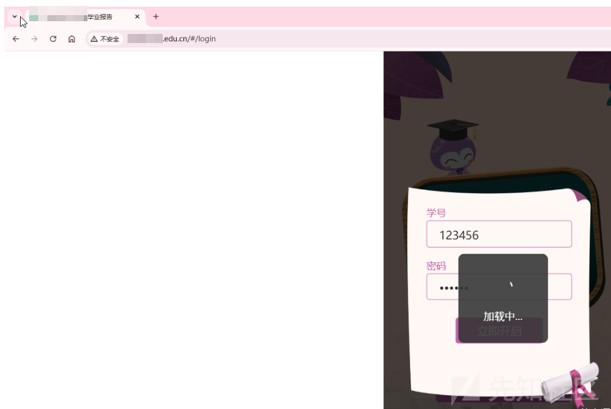

点击立即开启会出现如下的数据包

​

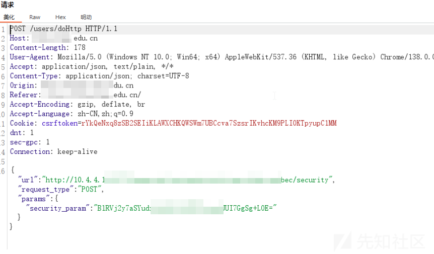

很明显是请求内网的，感觉会有ssrf漏洞

​

使用burp自带的dnslog检测一下，发现确实存在漏洞

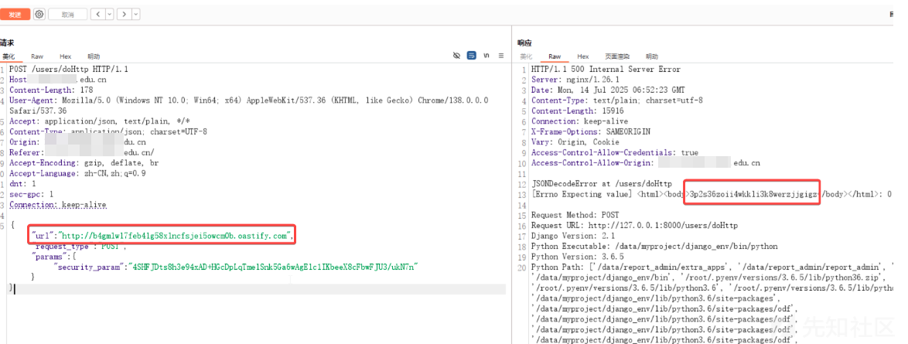

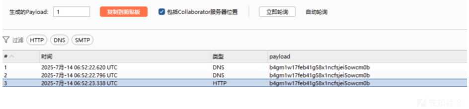

## 探测内网服务

经过测试，好像只有http和https协议能用，可能调用的是python的request库吧，那就只能打http请求的POC了，好在还支持POST传参和GET传参

​

使用bupsuite爆破该网段的开启80端口的主机

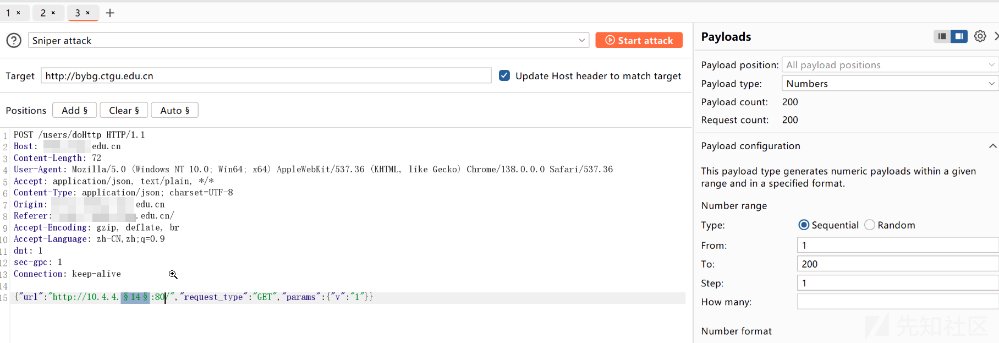

发现了phpmyadmin

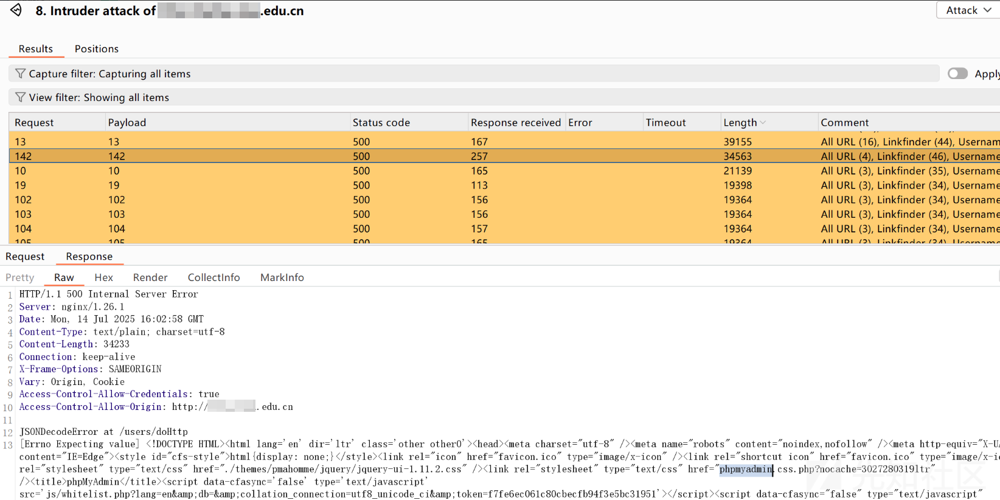

又探测了其他的ip和端口

发现portainer

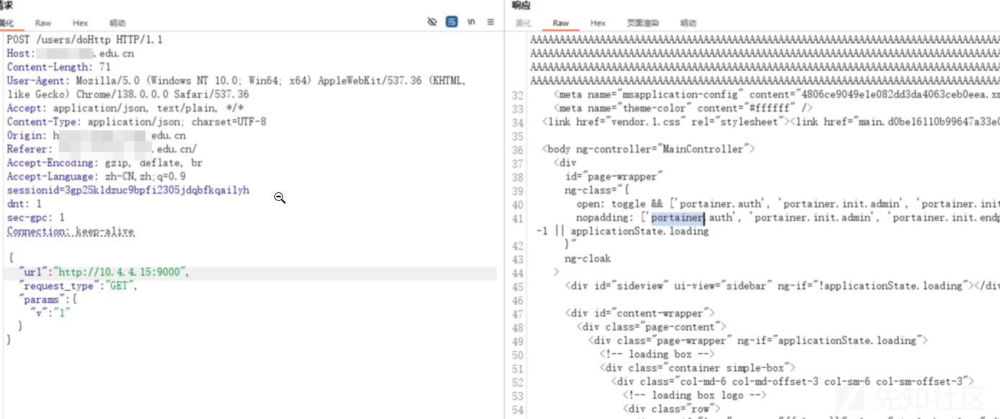

远程桌面

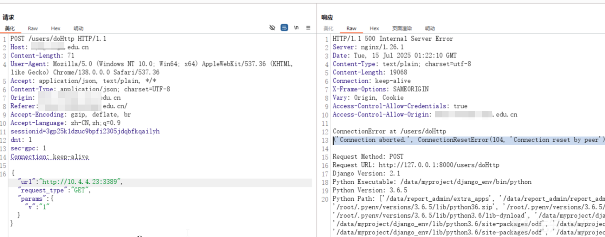

zabbix

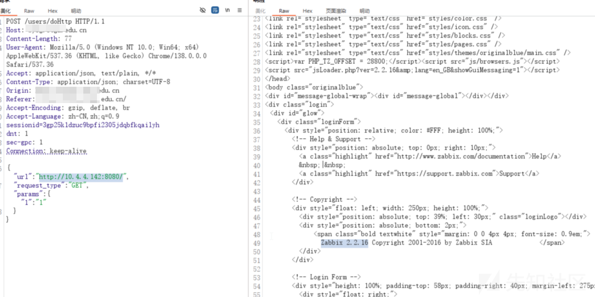

但是呢，发现的服务都没有发现漏洞，python的这个ssrf也不支持其他协议，只能放弃了

​

## 弱口令

发现目录扫描到一个django的管理界面xadmin

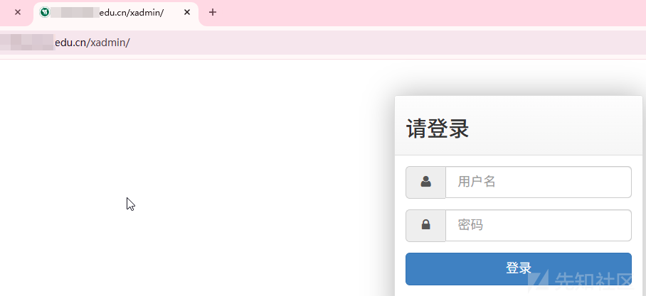

账号密码：admin:123456

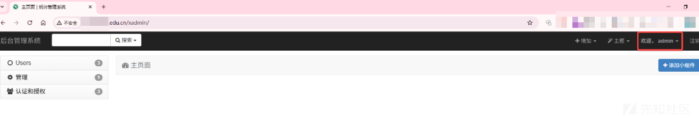

但是里面基本上啥也没有，危害太低了

​

## 逻辑漏洞

于是又回到了一开始的时候，点击立即开启即可开启毕业报告，参数是加密的，但是猜测就是学号密码啥的加密了

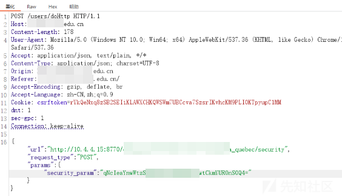

打开浏览器的开发者模式中的网络，点击登录，查看启动项，找到可能登录的位置打上断点，一步步调试

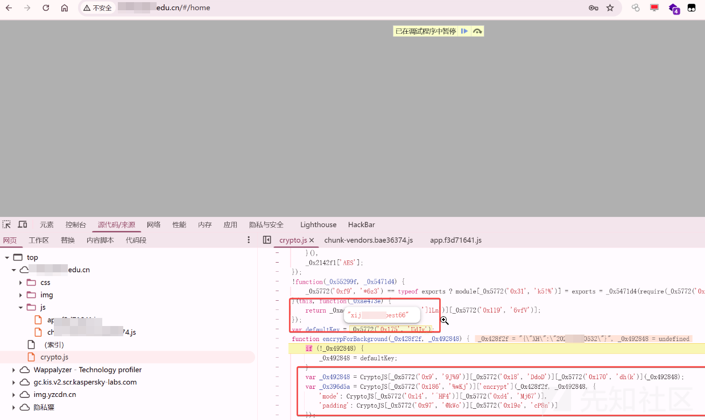

直接就发现了是AES加密，ECB模式，并且找到了密钥

发现能够解密成功

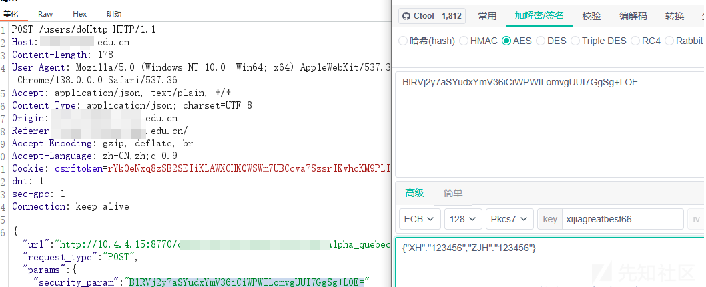

然后测试发现只需要传入学号，不需要证件号后6位也会返回学生的信息

* 直接将{"XH":"202110120235"}加密，发现能直接得到所有的该用户的用户名和身份证

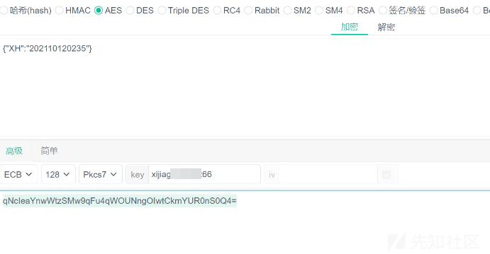

然后发包测试

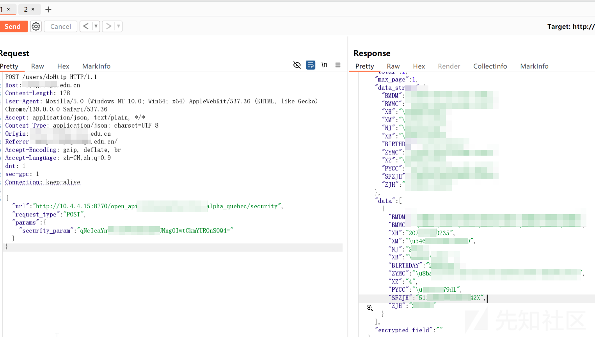

发现泄露了该学生的个人信息，包括身份证、学号、姓名、班级等

​

### 爆破信息

使用burpsuite的插件burpcrypto，将payload加密传入，即可遍历所有毕业生的身份信息

先添加processer

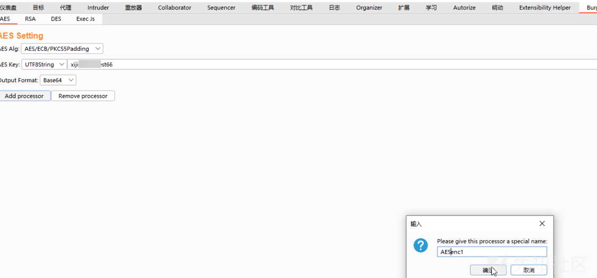

然后使用python生成遍历21届学生学号的脚本，使用intruder配置如下去爆破

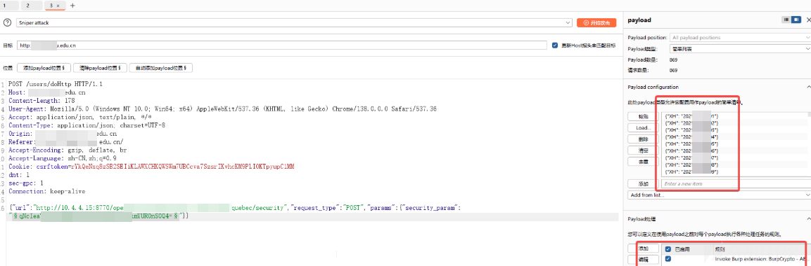

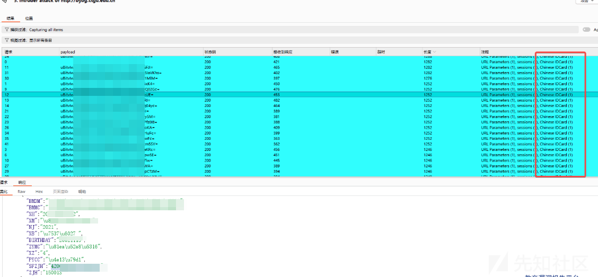

​

ok，到此泄露了所有的毕业生的身份证信息，危害比较大了

​
