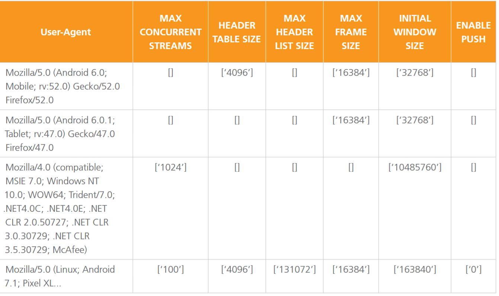
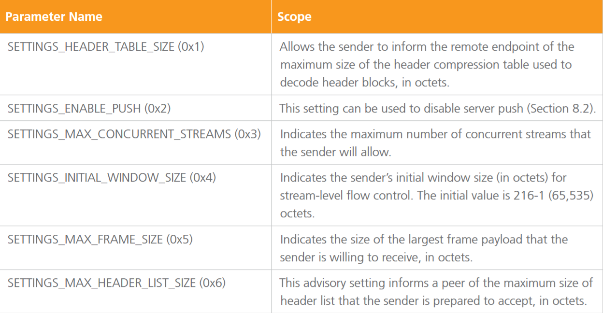
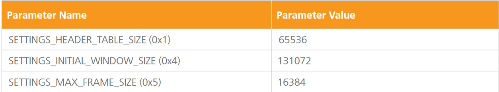
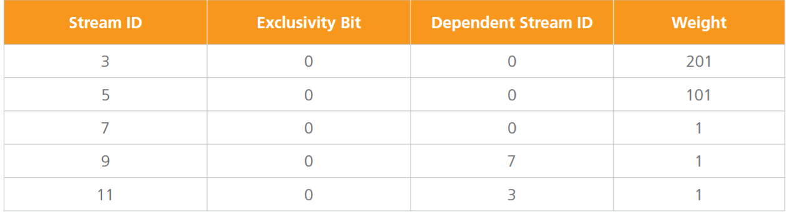
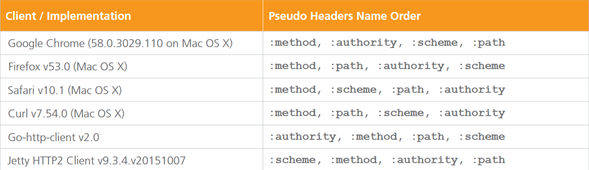

# Http2指纹识别-先知社区

> **来源**: https://xz.aliyun.com/news/18534  
> **文章ID**: 18534

---

## 简介

HTTP/2 是 HTTP 协议的第二个主要版本。它通过引入一种完全二进制的协议（由 TCP 连接、流和帧组成），取代了纯文本协议，从而改变了 HTTP 在 “传输层面” 的方式。从 HTTP/1.x 到 HTTP/2 的这种根本性变革，意味着客户端和服务器端的实现必须整合全新的代码，才能支持 HTTP/2 的新特性。这在协议实现中引入了细微差异，而这些差异反过来可能被用于对 Web 客户端进行被动指纹识别。

不同的User-Agent对应，http2的一些配置参数



## http2指纹特征选取

根据寻找http2协议中不同客户端会展现出一致且独特行为的流或消息，这些特征可被用于指纹识别，根据研究分析数据表明一下三个帧可用于指纹识别：

1. SETTING frame
2. WINDOW\_UPDATE frame
3. PRIORITY frame

### SETTING frame

`SETTINGS` 帧用于客户端和服务器之间交换配置参数。这些参数决定了通信的行为，比如流量控制、并发请求数限制等。`SETTINGS` 帧是控制帧，不承载用户数据。每次连接建立时，`SETTINGS` 帧用于设置初始配置，之后可以通过这个帧修改配置。

常见paramater name的一些定义

SETTINGS frame使用场景：

* 在连接初始时交换配置。
* 在运行时动态修改配置，例如修改流量控制窗口大小。

观察从客户端发送给服务端的SETTINGS frame ，发现不同的客户端在以下参数有所不同：

* 发送的SETTINGS 参数不同
* SETTINGS 参数的顺序不同
* 客户端参数的值不同

```
Chrome：
recv SETTINGS frame <length=24, flags=0x00, stream_id=0>
  [SETTINGS_HEADER_TABLE_SIZE(0x01):65536]
[SETTINGS_MAX_CONCURRENT_STREAMS(0x03):1000]
[SETTINGS_INITIAL_WINDOW_SIZE(0x04):6291456]
[SETTINGS_MAX_HEADER_LIST_SIZE(0x06):262144]
Firefox
recv SETTINGS frame <length=18, flags=0x00, stream_id=0>
  [SETTINGS_HEADER_TABLE_SIZE(0x01):65536]
[SETTINGS_INITIAL_WINDOW_SIZE(0x04):131072]
[SETTINGS_MAX_FRAME_SIZE(0x05):16384]
curl
recv SETTINGS frame <length=36, flags=0x00, stream_id=0>
  [SETTINGS_HEADER_TABLE_SIZE(0x01):4096]
[SETTINGS_ENABLE_PUSH(0x02):0]
  [SETTINGS_INITIAL_WINDOW_SIZE(0x04):65535]
  [SETTINGS_MAX_FRAME_SIZE(0x05):16384]
  [SETTINGS_MAX_CONCURRENT_STREAMS(0x03):100]
  [SETTINGS_MAX_HEADER_LIST_SIZE(0x06):65536]
```

### WINDOW\_UPDATE frame

`WINDOW_UPDATE` 帧用于实现流量控制，告知接收方可以接收更多的数据。每个流和整个连接都有自己的流量窗口大小（通过 `WINDOW_UPDATE` 帧更新）。当接收方处理完一部分数据并释放了更多缓冲区时，会发送一个 `WINDOW_UPDATE` 帧来通知发送方可以继续发送更多的数据。

几乎所有进行连接的客户端都会在发送 SETTINGS 帧之后发送 WINDOW\_UPDATE 帧。由于 HTTP/2 客户端的实现方式不同，WINDOW\_UPDATE 帧中的增量值在不同客户端之间存在稳定差异。

### PRIORITY frame

`PRIORITY` 帧用于指定流的优先级。每个流在 HTTP/2 中都有一个优先级，优先级决定了该流相对于其他流的处理顺序。通过 `PRIORITY` 帧，客户端或服务器可以在多个流之间动态调整优先级，以确保重要的数据流先被处理。

某些客户端在连接阶段刚结束后，就会向服务器发送多个 PRIORITY 帧，而这些帧所对应的流均尚未打开。我们可以提取这些被打开的流的标识符，并将其作为指纹的一部分。例如，Firefox 浏览器往往会表现出这种行为。查看 Firefox 的 HTTP/2 实现代码（Http2Session.cpp）时，我们发现了以下相关注释。

除了流之外以下信息也能引入指纹中：

・一个单比特标志，用于指示流依赖是否具有排他性  
・一个 31 比特的流标识符，标识当前流所依赖的流  
・分配给该流的权重，RFC 中定义为表示流优先级权重的无符号 8 比特整数（取值范围为 1 到 256）

## 指纹格式

结合以上信息可以设计http2指纹格式

```
S[;]|WU|P[,]#
```

S[;]:SETTINGS中的参数以及对应的值，以键值对的形式存在 key:value，多个参数用;分隔

WU：WINDOW\_UPDATE的大小,不存在则用'00'表示

P[,]：表示流的优先级信息，以StreamID:Exclusivity\_Bit:Dependant\_StreamID:Weight存在，多个priority frame用,连接，不存在则用'0'

指纹示例

SETTINGS frame如下图

SETTINGs指纹：1:65536;4:131072;5:16384

然后WINDOWS\_UPDATE 被发送，且值为12517377 因此 WU=12517377

假设priority frame如下图所示,则对应的指纹为：3:0:0:201,5:0:0:101,7:0:0:1,9:0:7:1,11:0:3:1

对于上述HTTP2消息最终指纹为

```
1:65536;4:131072;5:16384|12517377|3:0:0:201,5:0:0:101,7:0:0:1,9:0:7:1,11:0:3:1
```

不同浏览器的http2指纹对比

```
MAC os
User-Agent: Mozilla/5.0 (Macintosh; Intel Mac OS X 10_11_6) AppleWebKit/537.36 (KHTML, like Gecko) Chrome/58.0.3029.96 Safari/537.36
HTTP/2 fingerprint1:65536;3:1000;4:6291456|15663105|0
Chrome Browser on Windows 10 
User-Agent: Mozilla/5.0 (Windows NT 10.0; Win64; x64) AppleWebKit/537.36 (KHTML, like Gecko) Chrome/58.0.3029.96 Safari/537.36
HTTP/2 fingerprint:1:65536;3:1000;4:6291456|15663105|0
```

同时还发现不同的浏览器针对HTTP2协议实现代码中对伪请求头的实现方式不同，如下图

chrome 实现请求头顺序的源码如下，与上图中Goole Chrome的伪请求头顺序相同，与其他浏览其不同，因此也可以将伪请求头的顺序作为特征加入到http2指纹中

```
void CreateSpdyHeadersFromHttpRequest(const HttpRequestInfo& info,
                                      const HttpRequestHeaders& request_headers,
                                      bool direct,
                                      SpdyHeaderBlock* headers) {
  (*headers)[":method"] = info.method;
  if (info.method == "CONNECT") {
    (*headers)[":authority"] = GetHostAndPort(info.url);
  } else {
    (*headers)[":authority"] = GetHostAndOptionalPort(info.url);
    (*headers)[":scheme"] = info.url.scheme();
    (*headers)[":path"] = info.url.PathForRequest();
  }
```

对上述http2指纹格式进行扩展可以得到新的指纹格式：S[;]|WU|P[,]#|PS[,]

扩展后的指纹如下

```
User-Agent: Mozilla/5.0 (Macintosh; Intel Mac OS X 10.11; rv:53.0) Gecko/20100101 Firefox/53.0
HTTP/2 fingerprint:1:65536;4:131072;5:16384|12517377|3:0:0:201,5:0:0:101,7:0:0:1,9:0:7:1,11:0:3:1|m,p,a,s
```

## HTTP2指纹使用场景

### 伪造 User-Agent 检测

HTTP/2 指纹的独特性仅受客户端协议实现方式的影响，而不受特定用户环境因素的干扰。HTTP/2 指纹本身并不具备足够的熵值来对特定用户进行指纹识别或追踪。但它确实会暴露有关特定 HTTP/2 实现类型的信息，并且在很多情况下，还会揭示客户端的供应商、操作系统类型及版本等信息。

这些信息可用于检测伪造 User-Agent 字符串的客户端。例如，一个使用 “Go” 编程语言编写的自动化网络爬虫工具，可能会发送伪造的 Chrome 浏览器 User-Agent 字符串，以规避反自动化保护机制。在这类情况下，检测伪造行为并推断出真实的 HTTP/2 客户端类型会相当简单。

不过，应用程序也可以利用被动 HTTP/2 指纹来增强对客户端所声明的 User-Agent 字符串的可信度和确定性。

### 匿名代理/VPN检测

Web 客户端通过匿名代理进行连接以隐藏其真实身份或地理位置的情况十分常见。在某些情况下，特定的 Web 应用程序和在线服务会尝试检测请求是否经过了代理（Proxy）或虚拟专用网络（VPN）等匿名中间设备的路由。通过关联来自TCP、TLS 和 HTTP/2 指纹的（不一致的）信息，应用程序能够被动推断出客户端正在通过代理路由流量。

试想这样一种场景：客户端在 Mac OS X 系统上运行 Chrome 浏览器，其 HTTP/2 流量通过一个运行在 Windows 10 机器上的匿名代理进行路由。由于\*\*该匿名代理不会终止 TLS 连接，也不会终止和重写 HTTP/2 流量，\*\*因此 TCP 指纹会显示是一台 Windows 10 机器在连接 Web 服务器，而 TLS 和 HTTP/2 指纹则会揭示出客户端实际上是在 Mac OS X 系统上运行 Chrome 浏览器这一事实。

虽然仅根据 TCP 和 TLS 指纹之间的不一致就可以推断出上述信息，但 HTTP/2 指纹有助于提高检测的整体可信度。此外，尽管有些 Web 客户端允许用户通过自定义 TLS 设置来启动，但我们的研究表明，许多 HTTP/2 客户端并不支持修改基本的 HTTP/2 实现细节，例如 SETTINGS 帧的值或伪头字段的名称顺序。

需要注意的是，虽然 HTTP/2 协议并未强制要求使用 TLS 加密，但有些实现仅支持基于 TLS 的 HTTP/2，且目前没有浏览器支持在未加密的连接上使用 HTTP/2。这意味着，被动 TLS 指纹几乎总能与 HTTP/2 特性结合起来收集，从而形成更准确的指纹。
