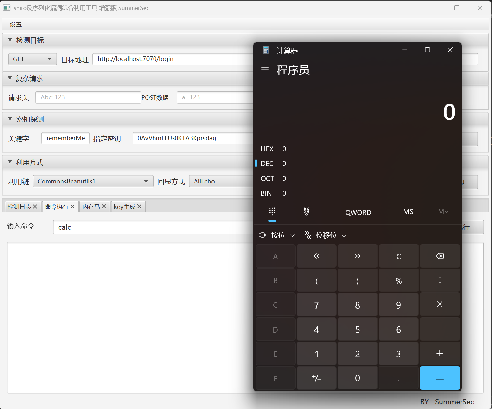

# OPENRASP源码详解-先知社区

> **来源**: https://xz.aliyun.com/news/18538  
> **文章ID**: 18538

---

### 为什么写这篇文章

想要研究一下RASP技术，但是网上有关OPENRASP的讲解都比较的粗略，属于是大佬们自己看的懂了，就不管细节了那种，于是想要写这样一篇详细并且深入的源码剖析。

### Introduction

Unlike perimeter control solutions like WAF, OpenRASP directly integrates its protection engine into the application server by instrumentation. It can monitor various events including database queries, file operations and network requests etc.

When an attack happens, WAF matches the malicious request with its signatures and blocks it. OpenRASP takes a different approach by hooking sensitive functions and examines/blocks the inputs fed into them. As a result, this examination is context-aware and in-place. It brings in the following benefits:

1. Only successful attacks can trigger alarms, resulting in lower false positive and higher detection rate;
2. Detailed stack trace is logged, which makes the forensic analysis easier;
3. Insusceptible to malformed protocol.

简单来说，WAF是在应用外部去通过规则匹配攻击流量的，RASP是通过Javaagent技术向应用内部插桩，从而对危险行为进行拦截的。现代的WAF即使通过人工智能的手段去学习规则，依然有较高的误报和漏报，而RASP则可以精准的识别到所有攻击，并防御未来可能发生的攻击。

在这篇文章中，我们主要分析的是OPENRASP项目根目录下的boot和engine两个模块，这也是项目的核心功能所在。  


首先来看boot模块，这是整个Javaagent的入口。

### Agent.java

看agent目录下的`com.baidu.openrasp.Agent`  
agent的入口类不用继承任何类，但是需要存在`premain`和`agentmain`两个方法。

```
public static void premain(String agentArg, Instrumentation inst) {
        init(START_MODE_NORMAL, START_ACTION_INSTALL, inst);
    }
public static void agentmain(String agentArg, Instrumentation inst) {
        init(Module.START_MODE_ATTACH, agentArg, inst);
    }
```

premain是在程序启动之前预加载时使用的入口，通过`-javaagent:rasp.jar`这种类似的方式去进行加载，是静态加载的解决办法。

```
java -javaagent:rasp.jar -jar shiro-login-demo-1.0.0.jar
```

agentmain是在程序运行过程中进行热加载的办法，通过`jps -l`命令获取java程序的进程，从而实现对程序的动态插桩。  
示例代码：

```
import com.sun.tools.attach.VirtualMachine;

public class AttachDemo {
    public static void main(String[] args) throws Exception {
        String pid = args[0];
        VirtualMachine vm = VirtualMachine.attach(pid);
        vm.loadAgent("agentmain_agent.jar", "hello");
        vm.detach();
    }
}
```

可以看到，`premain`和`agentmain`这两个方法都调用了init方法：

```
public static synchronized void init(String mode, String action, Instrumentation inst) {
        try {
            JarFileHelper.addJarToBootstrap(inst);
            readVersion();
            ModuleLoader.load(mode, action, inst);
        } catch (Throwable e) {
            System.err.println("[OpenRASP] Failed to initialize, will continue without security protection.");
            e.printStackTrace();
        }
    }
```

这里首先是将Jar自身去添加到了`BootstrapClassLoader`，具体逻辑可以去参考`JarFileHelper.addJarToBootstrap`的实现。  
为什么要添加到`BootstrapClassLoader`呢，根据双亲委派机制来说，当前的jar默认是使用的`AppClassLoader`，也就是最顶层的ClassLoader，这会导致一些定义在底层的ClassLoader看不到我们的hook规则，这显然是不对的。

```
BootStrapClassLoader->ExtClassLoader->AppClassLoader->自定义类加载器
```

最后去调用了`ModuleLoader.load`方法。  
解释一下给`premain`和`agentmain`传递的参数：第一个参数是nomal或attach，表示agent的启动方式；第二参数如果通过`premain`启动则必须是install，通过`agentmain`启动则可选是install或uninstall，这也是比较好理解的，因为`premain`是静态，而`agentmain`是动态的。

### ModuleLoader.java

跟进`ModuleLoader.load`方法，来到了ModuleLoader中，首先看到了一个static块：

```
// ModuleLoader 为 classloader加载的，不能通过getProtectionDomain()的方法获得JAR路径
    static {
        // juli
        try {
            Class clazz = Class.forName("java.nio.file.FileSystems");
            clazz.getMethod("getDefault", new Class[0]).invoke(null);
        } catch (Throwable t) {
            // ignore
        }
        Class clazz = ModuleLoader.class;
        // path值示例：　file:/opt/apache-tomcat-xxx/rasp/rasp.jar!/com/fuxi/javaagent/Agent.class
        String path = clazz.getResource("/" + clazz.getName().replace(".", "/") + ".class").getPath();
        if (path.startsWith("file:")) {
            path = path.substring(5);
        }
        if (path.contains("!")) {
            path = path.substring(0, path.indexOf("!"));
        }
        try {
            baseDirectory = URLDecoder.decode(new File(path).getParent(), "UTF-8");
        } catch (UnsupportedEncodingException e) {
            baseDirectory = new File(path).getParent();
        }
        ClassLoader systemClassLoader = ClassLoader.getSystemClassLoader();
        while (systemClassLoader.getParent() != null
                && !systemClassLoader.getClass().getName().equals("sun.misc.Launcher$ExtClassLoader")) {
            systemClassLoader = systemClassLoader.getParent();
        }
        moduleClassLoader = systemClassLoader;
    }
```

这里实际是在为下面的两个变量赋值：

```
public static String baseDirectory;
public static ClassLoader moduleClassLoader;
```

之所以不能直接通过`getProtectionDomain()`来获得Jar的基址，是因为在Tomcat等很多web容器中，路径可能是虚拟化的，因此不能直接通过`getProtectionDomain().getCodeSource()`去获取路径。  
通过while循环不断的上溯去寻找类加载器的原因之前说过了，要尽量找到最上层的类加载器来使用，防止隔离的问题。`sun.misc.Launcher$ExtClassLoader`是在Java8中存在于Java代码的最顶层ClassLoader（BootstrapClassLoader是用cpp写的），因此向上追溯可以到这为止。  
接下来看load方法，这是被`Agent.init`调用的方法：

```
public static synchronized void load(String mode, String action, Instrumentation inst) throws Throwable {
        if (Module.START_ACTION_INSTALL.equals(action)) {
            if (instance == null) {
                try {
                    instance = new ModuleLoader(mode, inst);
                } catch (Throwable t) {
                    instance = null;
                    throw t;
                }
            } else {
                System.out.println("[OpenRASP] The OpenRASP has bean initialized and cannot be initialized again");
            }
        } else if (Module.START_ACTION_UNINSTALL.equals(action)) {
            release(mode);
        } else {
            throw new IllegalStateException("[OpenRASP] Can not support the action: " + action);
        }
    }
```

可以看到，根据mode参数的值选择对RASP去进行初始化或是卸载。跟进看一下初始化的逻辑：

```
private ModuleLoader(String mode, Instrumentation inst) throws Throwable {

        if (Module.START_MODE_NORMAL == mode) {
            setStartupOptionForJboss();
        }
        engineContainer = new ModuleContainer(ENGINE_JAR);
        engineContainer.start(mode, inst);
    }
```

这里判断了模式是nomal还是attach，如果是nomal需要进行一个额外的配置，对Jboss进行初始化。（Jboss也就是现在的WildFly）。这是由于Jboss使用了自定义的类加载器，存在模块隔离导致的，但是attach模式时Jboss的初始化过程已经结束，因此不需要考虑。  
接下来开启了一个容器，去加载`rasp-engine.jar`，至此boot模块告一段落，接下来分析engine模块，也就是整个Javaagent的核心。

接下来分析engine模块，也就是整个Javaagent的核心。

### EngineBoot.java

首先来看`com.baidu.openrasp.EngineBoot`中的start方法：

```
@Override
    public void start(String mode, Instrumentation inst) throws Exception {
        System.out.println("

" +
                "   ____                   ____  ___   _____ ____ 
" +
                "  / __ \____  ___  ____  / __ \/   | / ___// __ \
" +
                " / / / / __ \/ _ \/ __ \/ /_/ / /| | \__ \/ /_/ /
" +
                "/ /_/ / /_/ /  __/ / / / _, _/ ___ |___/ / ____/ 
" +
                "\____/ .___/\___/_/ /_/_/ |_/_/  |_/____/_/      
" +
                "    /_/                                          

");
        try {
            Loader.load();
        } catch (Exception e) {
            System.out.println("[OpenRASP] Failed to load native library, please refer to https://rasp.baidu.com/doc/install/software.html#faq-v8-load for possible solutions.");
            e.printStackTrace();
            return;
        }
        if (!loadConfig()) {
            return;
        }
        //缓存rasp的build信息
        Agent.readVersion();
        BuildRASPModel.initRaspInfo(Agent.projectVersion, Agent.buildTime, Agent.gitCommit);
        // 初始化插件系统
        if (!JS.Initialize()) {
            return;
        }
        CheckerManager.init();
        initTransformer(inst);
        if (CloudUtils.checkCloudControlEnter()) {
            CrashReporter.install(Config.getConfig().getCloudAddress() + "/v1/agent/crash/report",
                    Config.getConfig().getCloudAppId(), Config.getConfig().getCloudAppSecret(),
                    CloudCacheModel.getInstance().getRaspId());
        }
        deleteTmpDir();
        String message = "[OpenRASP] Engine Initialized [" + Agent.projectVersion + " (build: GitCommit="
                + Agent.gitCommit + " date=" + Agent.buildTime + ")]";
        System.out.println(message);
        Logger.getLogger(EngineBoot.class.getName()).info(message);
    }
```

几个关键的操作：`Loader.load()`是在加载Js的v8引擎，在项目中没能直接看到实现，反编译Jar去看看：

```
public class Loader {
  private static boolean isLoad = false;
  
  public static synchronized void load() throws Exception {
    if (isLoad)
      return; 
    NativeLoader.loadLibrary("openrasp_v8_java", new String[0]);
    isLoad = true;
  }
}
```

跟进`NativeLoader.loadLibrary`：

```
public static void loadLibrary(String libName, String... searchPaths) throws IOException {
    try {
      System.loadLibrary(libName);
    } catch (UnsatisfiedLinkError e) {
      if (NativeLibraryUtil.loadNativeLibrary(jniExtractor, libName, searchPaths))
        return; 
      throw new IOException("Couldn't load library " + libName, e);
    } 
  }
```

如果`openrasp_v8_java`已经存在于默认系统路径则直接加载，否则通过`jni`来进行加载。  
`loadConfig()`是在初始化配置：

```
private boolean loadConfig() throws Exception {
        LogConfig.ConfigFileAppender();
        //单机模式下动态添加获取删除syslog
        if (!CloudUtils.checkCloudControlEnter()) {
            LogConfig.syslogManager();
        } else {
            System.out.println("[OpenRASP] RASP ID: " + CloudCacheModel.getInstance().getRaspId());
        }
        return true;
    }
```

`JS.Initialize()`是在初始化插件系统：

```
public synchronized static boolean Initialize() {
        try {
            if (!V8.Initialize()) {
                throw new Exception("[OpenRASP] Failed to initialize V8 worker threads");
            }
            V8.SetLogger(new com.baidu.openrasp.v8.Logger() {
                @Override
                public void log(String msg) {
                    pluginLog(msg);
                }
            });
            V8.SetStackGetter(new com.baidu.openrasp.v8.StackGetter() {
                @Override
                public byte[] get() {
                    try {
                        ByteArrayOutputStream stack = new ByteArrayOutputStream();
                        JsonStream.serialize(StackTrace.getParamStackTraceArray(), stack);
                        stack.write(0);
                        return stack.getByteArray();
                    } catch (Exception e) {
                        return null;
                    }
                }
            });
            Context.setKeys();
            if (!CloudUtils.checkCloudControlEnter()) {
                UpdatePlugin();
                InitFileWatcher();
            }
            return true;
        } catch (Exception e) {
            e.printStackTrace();
            LOGGER.error(e);
            return false;
        }
    }
```

跟进查看一下`UpdatePlugin()`的逻辑：

```
public synchronized static boolean UpdatePlugin() {
        boolean oldValue = HookHandler.enableHook.getAndSet(false);
        List<String[]> scripts = new ArrayList<String[]>();
        File pluginDir = new File(Config.getConfig().getScriptDirectory());
        LOGGER.debug("checker directory: " + pluginDir.getAbsolutePath());
        if (!pluginDir.isDirectory()) {
            pluginDir.mkdir();
        }
        FileFilter filter = FileFilterUtils.and(FileFilterUtils.sizeFileFilter(10 * 1024 * 1024, false),
                FileFilterUtils.suffixFileFilter(".js"));
        File[] pluginFiles = pluginDir.listFiles(filter);
        if (pluginFiles != null) {
            for (File file : pluginFiles) {
                try {
                    String name = file.getName();
                    String source = FileUtils.readFileToString(file, "UTF-8");
                    scripts.add(new String[]{name, source});
                } catch (Exception e) {
                    LogTool.error(ErrorType.PLUGIN_ERROR, e.getMessage(), e);
                }
            }
        }
        HookHandler.enableHook.set(oldValue);
        return UpdatePlugin(scripts);
    }
```

加载了其中所有的Js插件，对于大小大于`10 * 1024 * 1024`的直接放弃了。  
`CheckerManager.init()`是在对所有的CheckerManager去进行初始化：

```
public synchronized static void init() throws Exception {
        for (Type type : Type.values()) {
            checkers.put(type, type.checker);
        }
    }
```

其中的Type是一个enum类型，枚举了所有的插件：

```
public enum Type {
        // js插件检测
        SQL("sql", new V8AttackChecker(), 1),
        COMMAND("command", new V8AttackChecker(), 1 << 1),
        DIRECTORY("directory", new V8AttackChecker(), 1 << 2),
        REQUEST("request", new V8AttackChecker(), 1 << 3),
        READFILE("readFile", new V8AttackChecker(), 1 << 5),
        WRITEFILE("writeFile", new V8AttackChecker(), 1 << 6),
        FILEUPLOAD("fileUpload", new V8AttackChecker(), 1 << 7),
        RENAME("rename", new V8AttackChecker(), 1 << 8),
        XXE("xxe", new V8AttackChecker(), 1 << 9),
        OGNL("ognl", new V8AttackChecker(), 1 << 10),
        DESERIALIZATION("deserialization", new V8AttackChecker(), 1 << 11),
        WEBDAV("webdav", new V8AttackChecker(), 1 << 12),
        INCLUDE("include", new V8AttackChecker(), 1 << 13),
        SSRF("ssrf", new V8AttackChecker(), 1 << 14),
        SQL_EXCEPTION("sql_exception", new V8AttackChecker(), 1 << 15),
        REQUESTEND("requestEnd", new V8AttackChecker(), 1 << 17),
        DELETEFILE("deleteFile", new V8AttackChecker(), 1 << 18),
        MONGO("mongodb", new V8AttackChecker(), 1 << 19),
        LOADLIBRARY("loadLibrary", new V8AttackChecker(), 1 << 20),
        SSRF_REDIRECT("ssrfRedirect", new V8AttackChecker(), 1 << 21),
        RESPONSE("response", new V8AttackChecker(false), 1 << 23),
        LINK("link", new V8AttackChecker(), 1 << 24),
        JNDI("jndi", new V8AttackChecker(), 1 << 25),
        DNS("dns", new V8AttackChecker(), 1 << 26),


        // java本地检测
        XSS_USERINPUT("xss_userinput", new XssChecker(), 1 << 16),
        SQL_SLOW_QUERY("sqlSlowQuery", new SqlResultChecker(false), 0),

        // 安全基线检测
        POLICY_LOG("log", new LogChecker(false), 1 << 22),
        POLICY_MONGO_CONNECTION("mongoConnection", new MongoConnectionChecker(false), 0),
        POLICY_SQL_CONNECTION("sqlConnection", new SqlConnectionChecker(false), 0),
        POLICY_SERVER_TOMCAT("tomcatServer", new TomcatSecurityChecker(false), 0),
        POLICY_SERVER_JBOSS("jbossServer", new JBossSecurityChecker(false), 0),
        POLICY_SERVER_JBOSSEAP("jbossEAPServer", new JBossEAPSecurityChecker(false), 0),
        POLICY_SERVER_JETTY("jettyServer", new JettySecurityChecker(false), 0),
        POLICY_SERVER_RESIN("resinServer", new ResinSecurityChecker(false), 0),
        POLICY_SERVER_WEBSPHERE("websphereServer", new WebsphereSecurityChecker(false), 0),
        POLICY_SERVER_WEBLOGIC("weblogicServer", new WeblogicSecurityChecker(false), 0),
        POLICY_SERVER_WILDFLY("wildflyServer", new WildflySecurityChecker(false), 0),
        POLICY_SERVER_TONGWEB("tongwebServer", new TongwebSecurityChecker(false), 0),
        POLICY_SERVER_BES("bes", new BESSecurityChecker(false), 0);

        String name;
        Checker checker;
        Integer code;

        Type(String name, Checker checker, Integer code) {
            this.name = name;
            this.checker = checker;
            this.code = code;
        }

        public String getName() {
            return name;
        }

        public Checker getChecker() {
            return checker;
        }

        public Integer getCode() {
            return code;
        }

        @Override
        public String toString() {
            return name;
        }
    }
```

最关键的位置来到了`initTransformer(inst)`，这是整个RASP功能的核心，通过对字节码的修改来实现动态hook：

```
private void initTransformer(Instrumentation inst) throws UnmodifiableClassException {
        transformer = new CustomClassTransformer(inst);
        transformer.retransform();
    }
```

先看这个构造方法：

```
public CustomClassTransformer(Instrumentation inst) {
        this.inst = inst;
        inst.addTransformer(this, true);
        addAnnotationHook();
    }
```

跟进`addAnnotationHook()`看看：

```
private void addAnnotationHook() {
        Set<Class> classesSet = AnnotationScanner.getClassWithAnnotation(SCAN_ANNOTATION_PACKAGE, HookAnnotation.class);
        for (Class clazz : classesSet) {
            try {
                Object object = clazz.newInstance();
                if (object instanceof AbstractClassHook) {
                    addHook((AbstractClassHook) object, clazz.getName());
                }
            } catch (Exception e) {
                LogTool.error(ErrorType.HOOK_ERROR, "add hook failed: " + e.getMessage(), e);
            }
        }
    }
```

发现遍历了`com.baidu.openrasp.hook`中所有的含有`HookAnnotation`注解的类，创建实例并调用了`addHook`方法。

```
private HashSet<AbstractClassHook> hooks = new HashSet<AbstractClassHook>();
private void addHook(AbstractClassHook hook, String className) {
        if (hook.isNecessary()) {
            necessaryHookType.add(hook.getType());
        }
        String[] ignore = Config.getConfig().getIgnoreHooks();
        for (String s : ignore) {
            if (hook.couldIgnore() && (s.equals("all") || s.equals(hook.getType()))) {
                LOGGER.info("ignore hook type " + hook.getType() + ", class " + className);
                return;
            }
        }
        hooks.add(hook);
    }
```

先进行了一系列判断，看是否是有必要的hook，以及读配置文件巴拉巴拉，然后将这个类的实例添加到了hooks这个哈希表中。  
这些`com.baidu.openrasp.hook`中的类是怎么写的，我们先不看，回头来看`retransform`方法：

```
public void retransform() {
        LinkedList<Class> retransformClasses = new LinkedList<Class>();
        Class[] loadedClasses = inst.getAllLoadedClasses();
        for (Class clazz : loadedClasses) {
            if (isClassMatched(clazz.getName().replace(".", "/"))) {
                if (inst.isModifiableClass(clazz) && !clazz.getName().startsWith("java.lang.invoke.LambdaForm")) {
                    try {
                        // hook已经加载的类，或者是回滚已经加载的类
                        inst.retransformClasses(clazz);
                    } catch (Throwable t) {
                        LogTool.error(ErrorType.HOOK_ERROR,
                                "failed to retransform class " + clazz.getName() + ": " + t.getMessage(), t);
                    }
                }
            }
        }
    }
```

获取了JVM中所有的类，然后判断是不是在hooks这个哈希表中，如果在的话就调用`inst.retransformClasses`去对类进行修改。  
`instrumentation`对字节码的修改可以发生在两种时机下：1.在没加载类的字节码之前；2.使用`retransformClasses`对已经加载过的类进行重加载。`retransformClasses`会触发`CustomClassTransformer`的`transform`方法，而我们的`CustomClassTransformer`类是继承自`CustomClassTransformer`并重写了`transform`方法，跟踪看一下逻辑：

```
@Override
    public byte[] transform(ClassLoader loader, String className, Class<?> classBeingRedefined,
                            ProtectionDomain domain, byte[] classfileBuffer) throws IllegalClassFormatException {
        if (loader != null) {
            DependencyFinder.addJarPath(domain);
        }
        if (loader != null && jspClassLoaderNames.contains(loader.getClass().getName())) {
            jspClassLoaderCache.put(className.replace("/", "."), new SoftReference<ClassLoader>(loader));
        }
        for (final AbstractClassHook hook : hooks) {
            if (hook.isClassMatched(className)) {
                CtClass ctClass = null;
                try {
                    ClassPool classPool = new ClassPool();
                    addLoader(classPool, loader);
                    ctClass = classPool.makeClass(new ByteArrayInputStream(classfileBuffer));
                    if (loader == null) {
                        hook.setLoadedByBootstrapLoader(true);
                    }
                    classfileBuffer = hook.transformClass(ctClass);
                    if (classfileBuffer != null) {
                        checkNecessaryHookType(hook.getType());
                    }
                } catch (IOException e) {
                    e.printStackTrace();
                } finally {
                    if (ctClass != null) {
                        ctClass.detach();
                    }
                }
            }
        }
        serverDetector.detectServer(className, loader, domain);
        return classfileBuffer;
    }
```

看细节，可以发现，先根据isClassMatched(String className)方法判断是否对加载的class进行hook，接着调用的是hook类的transformClass(CtClass ctClass)->hookMethod(CtClass ctClass)方法进行了字节码的修改（hook），然后返回修改后的字节码并加载，最终实现了对class进行插桩。

接下来就是看看hook包中的类都是如何编写的。

# hook

以`DeserializationHook`类为例，看一下他的入手点`hookMethod`：

```
@Override
    protected void hookMethod(CtClass ctClass) throws IOException, CannotCompileException, NotFoundException {
        String src = getInvokeStaticSrc(DeserializationHook.class, "checkDeserializationClass",
                "$1", ObjectStreamClass.class);
        insertBefore(ctClass, "resolveClass", "(Ljava/io/ObjectStreamClass;)Ljava/lang/Class;", src);
    }
```

在每次`resolveClass`之前都调用`checkDeserializationClass`方法去进行一个检查：

```
public static void checkDeserializationClass(ObjectStreamClass objectStreamClass) {
        if (objectStreamClass != null) {
            String clazz = objectStreamClass.getName();
            if (clazz != null) {
                HashMap<String, Object> params = new HashMap<String, Object>();
                params.put("clazz", clazz);
                HookHandler.doCheck(CheckParameter.Type.DESERIALIZATION, params);
            }
        }

    }
```

跟进看一下`HookHandler.doCheck`方法：

```
public static void doCheck(CheckParameter.Type type, Map params) {
        if (enableCurrThreadHook.get()) {
            doCheckWithoutRequest(type, params);
        }
    }
```

跟进看一下`doCheckWithoutRequest`方法：

```
public static void doCheckWithoutRequest(CheckParameter.Type type, Map params) {
        boolean enableHookCache = enableCurrThreadHook.get();
        try {
            enableCurrThreadHook.set(false);
            //当服务器的cpu使用率超过90%，禁用全部hook点
            if (Config.getConfig().getDisableHooks()) {
                return;
            }
            //当云控注册成功之前，不进入任何hook点
            if (Config.getConfig().getCloudSwitch() && Config.getConfig().getHookWhiteAll()) {
                return;
            }
            if (requestCache.get() != null) {
                try {
                    StringBuffer sb = requestCache.get().getRequestURL();
                    if (sb != null) {
                        String url = sb.substring(sb.indexOf("://") + 3);
                        if (HookWhiteModel.isContainURL(type.getCode(), url)) {
                            return;
                        }
                    }
                } catch (Exception e) {
                    LogTool.traceWarn(ErrorType.HOOK_ERROR, "white list check has failed: " + e.getMessage(), e);
                }
            }
            doRealCheckWithoutRequest(type, params);
        } catch (Throwable t) {
            if (t instanceof SecurityException) {
                throw (SecurityException) t;
            }
        } finally {
            enableCurrThreadHook.set(enableHookCache);
        }
    }
```

可以看出，本质是在调用`doRealCheckWithoutRequest`之前进行了一堆判断，包括对CPU状态和对云控中配置的判断。这里其实可以看到一个问题，也就是RASP的固有问题：性能和安全性的平衡。当服务器的cpu使用率超过90%，禁用全部hook点，这意味着无法防御DOS漏洞，因为对DOS漏洞的防御只会更严重的影响性能。

```
public static void doRealCheckWithoutRequest(CheckParameter.Type type, Map params) {
        if (!enableHook.get()) {
            return;
        }
        long a = 0;
        if (Config.getConfig().getDebugLevel() > 0) {
            a = System.currentTimeMillis();
        }
        boolean isBlock = false;
        CheckParameter parameter = new CheckParameter(type, params);
        try {
            isBlock = CheckerManager.check(type, parameter);
        } catch (Throwable e) {
            String msg = "plugin check error: " + e.getClass().getName() + " because: " + e.getMessage();
            AbstractRequest request = HookHandler.requestCache.get();
            if (request != null) {
                StringBuffer url = request.getRequestURL();
                if (!StringUtils.isEmpty(url)) {
                    msg = url + " " + msg;
                }
            }
            LogTool.error(ErrorType.PLUGIN_ERROR, msg, e);
        }
        if (a > 0) {
            long t = System.currentTimeMillis() - a;
            String message = "type=" + type.getName() + " " + "time=" + t;
            if (requestCache.get() != null) {
                LOGGER.info("request_id=" + requestCache.get().getRequestId() + " " + message);
            } else {
                LOGGER.info(message);
            }
        }
        if (isBlock) {
            handleBlock(parameter);
        }
    }
```

实质就是在`CheckerManager.check`检测漏洞之前去打印一些调试信息。跟进看一下

```
public static boolean check(Type type, CheckParameter parameter) {
        return checkers.get(type).check(parameter);
    }
```

这里实质是去之前提到过的`CheckParameter`中获取`DESERIALIZATION("deserialization", new V8AttackChecker(), 1 << 11),`，然后通过V8解析器加载JS脚本。  
至于如何解析的JS脚本，逻辑存在于`openrasp_v8_java`中，这里就不去分析了，JS插件编写规则参考：<https://rasp.baidu.com/doc/dev/example.html>

### 使用示例

以shiro反序列化为例，对openrasp的功能进行演示  
首先搭建一个存在漏洞的shiro服务：  
  
首先通过如下命令对项目进行初始化：

```
java -jar RaspInstall.jar -nodetect -install <spring_boot_folder>
```

然后通过添加`-javaagent:rasp/rasp.jar`参数启动spring boot服务器：

```
java -javaagent:rasp/rasp.jar -jar shiro-login-demo-1.0.0.jar
```

自己随便写个规则来禁止所有的命令执行：

```
const plugin_version = '2025-1000-1000'
const plugin_name    = 'command block-all-test'

'use strict'
var plugin  = new RASP('command block-all-test')

const default_action = {
    action:     'block',
    message:    '- 插件全部拦截测试 -',
    confidence: 90
}

plugin.register('command', function (params, context) {
    return default_action
})

plugin.log('全部拦截插件测试: 初始化成功')
```

### 测试发现虽然可以发现利用链，但是无法成功执行系统命令 Pasted image 20250731175152.png 注入哥斯拉马后可以读写文件，不能执行命令 Pasted image 20250731175639.png后续工作

这个项目太沉重了，其实不是很适合线下的awd/awdp比赛，所以我希望能够写一个更简单轻量的项目，能够牺牲一定的效果换取更好的性能。

但愿成功（：
