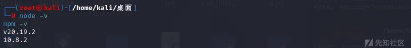
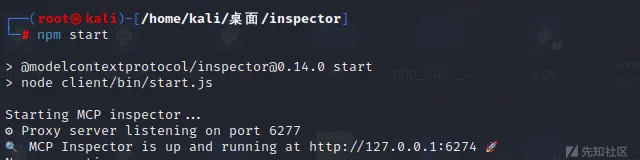
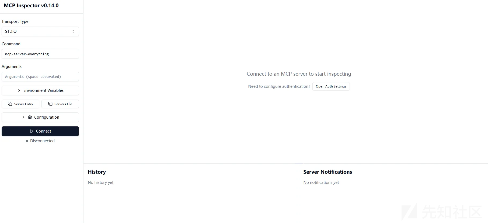
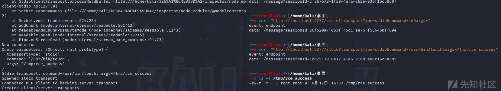
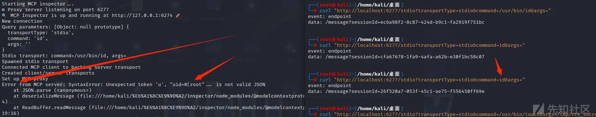

# MCP Inspector 未授权访问致代码执行漏洞（CVE-2025-49596）-先知社区

> **来源**: https://xz.aliyun.com/news/18539  
> **文章ID**: 18539

---

# 漏洞描述

MCP Inspector 服务端组件在 `0.14.1` 之前的版本中存在一个严重的安全漏洞。该漏洞允许未经身份验证的远程攻击者通过构造一个特制的网络请求，在运行 MCP Inspector 服务的服务器上执行任意操作系统命令。此漏洞源于一个调试接口在设计上完全缺少身份验证和权限控制机制

# 影响范围

**影响版本**: `0.14.1` 之前的所有版本

# 环境搭建

**通过 NodeSource 安装 Node.js**

```
apt install -y curl
curl -fsSL https://deb.nodesource.com/setup_20.x | bash -
apt install -y nodejs
```

这样就搭建好了js环境



接下来克隆源码

```
git clone https://github.com/modelcontextprotocol/inspector.git
cd inspector
git checkout 0.14.0
npm install  
npm run build  
npm start  
```



这样就跑起来了



# 漏洞分析

漏洞的根源在于位于 `server/src/index.ts` 文件中的代码逻辑存在严重的安全缺陷：

1. **信任边界缺失**: `GET /stdio` 路由的处理函数将来自外部网络（`req.query`）的数据视为可信的内部指令，没有进行任何安全过滤、转义或验证。它直接将用户可控的字符串用作后续程序执行的依据。
2. **危险函数的滥用**: `StdioClientTransport` 类被设计用来启动一个本地进程，这是一个高风险操作。然而，调用它的代码直接将来自用户的、未经净化的 `command` 字符串作为其执行目标，这是典型的命令注入模式。

```
// 文件: src/index.ts

app.get("/stdio", async (req, res) => {
  try {
    console.log("New connection");
    let serverTransport: Transport | undefined;
    try {
      // 关键调用：将整个请求对象 req 传递给 createTransport 函数
      serverTransport = await createTransport(req); 
    } catch (error) {
      // ... 错误处理 ...
      return;
    }
    // ... 后续代理逻辑 ...
  } catch (error) {
    // ... 错误处理 ...
  }
});
```

这行代码接收所有 `GET` 类型的 HTTP 请求。最重要的是，它在接收到请求后，**没有进行任何身份验证或权限检查**，就直接将代表整个请求的 `req` 对象，传递给了 `createTransport` 函数。这是漏洞的入口。

```
const createTransport = async (req: express.Request): Promise<Transport> => {
  const query = req.query; // 获取 URL 的查询参数 (例如 ?key=value&...)
  const transportType = query.transportType as string;

  // 当 transportType=stdio 时，进入漏洞利用分支
  if (transportType === "stdio") {
    // [1] 从 URL 中直接获取命令字符串
    const command = query.command as string; 
    const origArgs = shellParseArgs(query.args as string) as string[];

    // ...一些路径处理...
    const { cmd, args } = findActualExecutable(command, origArgs);

    // [2] 使用用户提供的 command 和 args 创建一个可以执行命令的实例
    const transport = new StdioClientTransport({
      command: cmd,
      args,
      // ...
    });

    // [3] 触发命令执行
    await transport.start(); 

    return transport;
  }
  // ... 其他逻辑 ...
};
```

* `const command = query.command as string;`: 代码从 URL 中获取 `command` 参数的值，并将其存入 `command` 变量。代码完全没有对这个字符串进行任何验证、过滤或清理，**百分之百地信任了用户的输入**。
* `const transport = new StdioClientTransport(...)`: 代码使用这个用户提供的、未经处理的 `command` 变量来实例化一个 `StdioClientTransport` 对象。这个对象的唯一目的就是去执行系统命令。
* `await transport.start();`: 这行代码是漏洞的触发点。`StdioClientTransport` 实例的 `start` 方法会调用 Node.js 底层的 `child_process` 模块，在服务器上启动一个新的 Shell 进程，并**执行** `command` **变量中的内容**

# 漏洞复现

漏洞payload：

```
curl "http://localhost:6277/stdio?transportType=stdio&command=/usr/bin/touch&args=/tmp/rce_success
```

它的操作是在 `/tmp/` 目录下创建 `rce_success` 文件



这里运行id命令会报错



这里的 `curl` 命令 `...command=/usr/bin/id...` 成功到达了服务器。服务器接收到指令，**成功地在操作系统上执行了** `/usr/bin/id` **命令**。`id` 命令产生了它的标准输出结果，也就是看到的 `uid=0(root...` 这段纯文本。由于漏洞代码的后续处理逻辑（`mcpProxy` 代理）期望它执行的命令返回的是 JSON 格式的数据。于是，它尝试对 `id` 命令返回的纯文本 `uid=0(root...` 进行 `JSON.parse()`（JSON解析）。因为 `uid=0(root...` 这段字符串不符合 JSON 格式的语法（例如，不是以 `{` 或 `[` 开头），所以 `JSON.parse()` 函数理所当然地抛出了一个语法错误 (`SyntaxError`)。

**关键点在于：这个错误发生在命令已经成功执行之后。**

这好比成功地让后厨做好了一道菜（执行了`id`命令），但在把菜端给前台的过程中，服务员（代理程序）要求这道菜必须放在一个方形盘子里（JSON格式），结果发现这道菜是圆的（纯文本），于是服务员在传递过程中报错了。但无论如何，**菜已经做好了**。

# 漏洞修复


这个修复方案的核心是利用了 Express.js 框架的“**中间件 (Middleware)**”机制。中间件就像是在进入核心房间（业务逻辑函数）之前，必须按顺序通过的几道安检门。在这里，开发者增加了两道至关重要的安检门：`originValidationMiddleware` 和 `authMiddleware`。`originValidationMiddleware` **(来源验证)作用**: 这个中间件很可能会检查 HTTP 请求的 `Origin` 或 `Referer` 头。它的目的是验证这个请求是否来自一个受信任的来源。`authMiddleware` **(身份认证与授权)：作用**: 这是修复\*\*“未授权访问”\*\*这个核心问题的关键。这个中间件会检查请求中是否包含有效的身份凭证（例如，在 Header 中的 `Authorization` 令牌、Cookie 中的 `session` ID 等）。**这从根本上解决了“任何人都能调用这个接口”的问题。**
