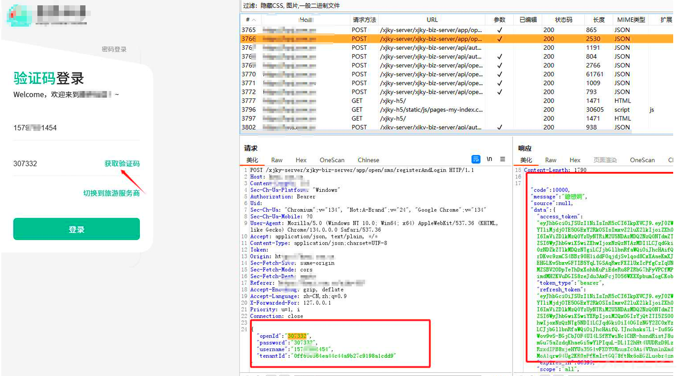
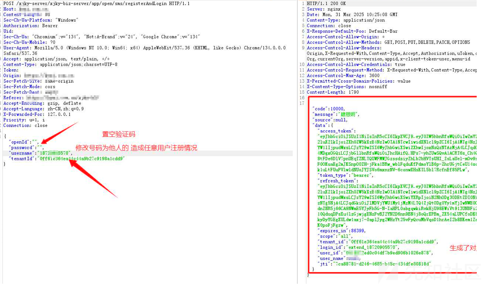
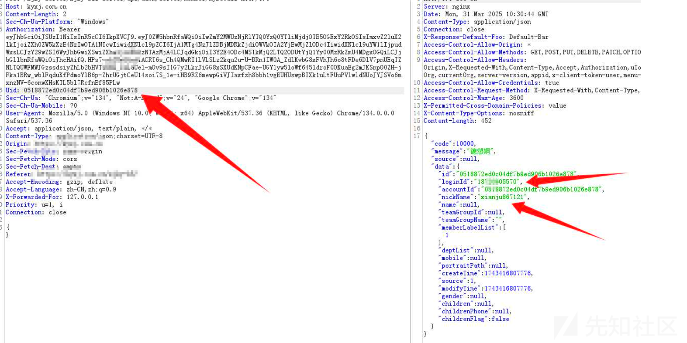
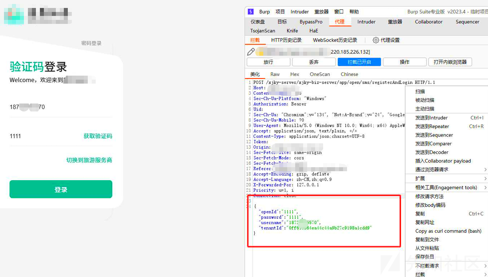
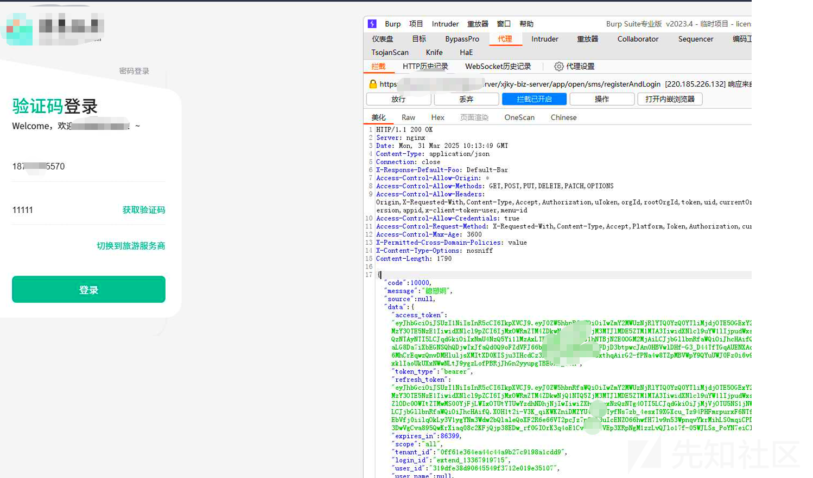
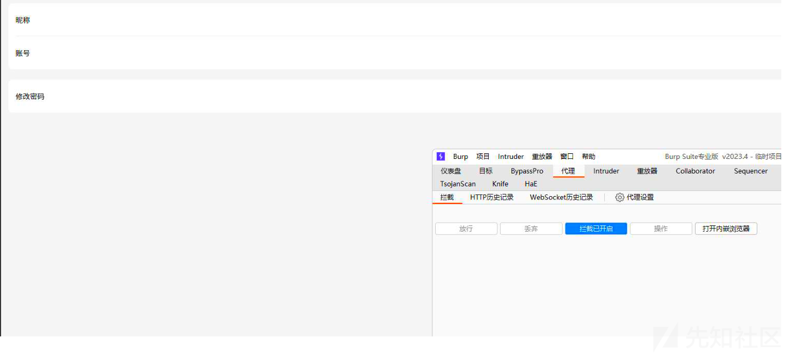
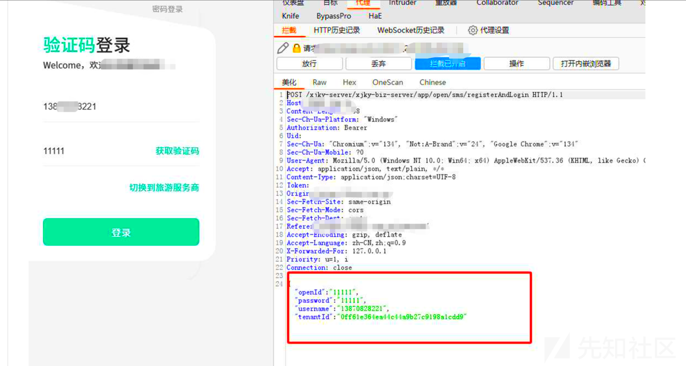
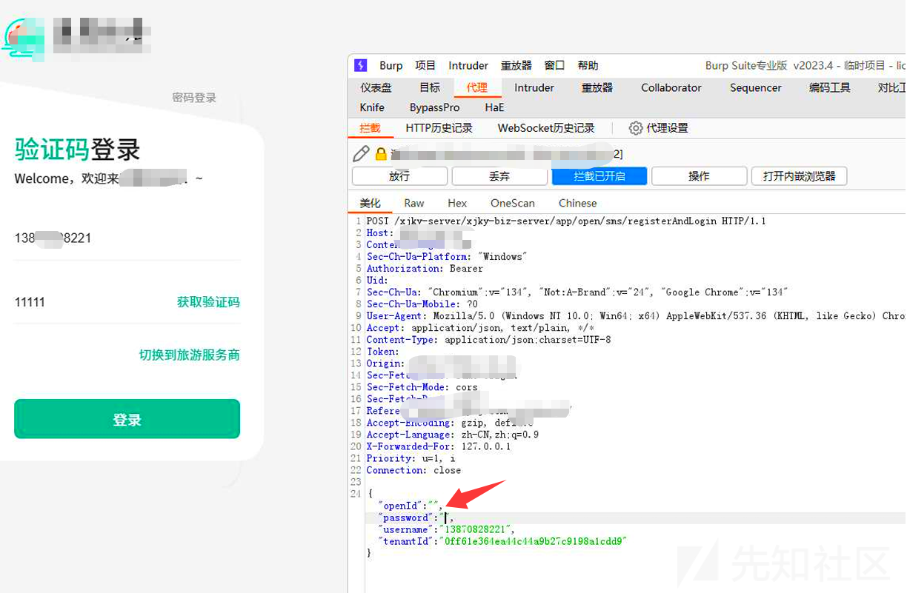
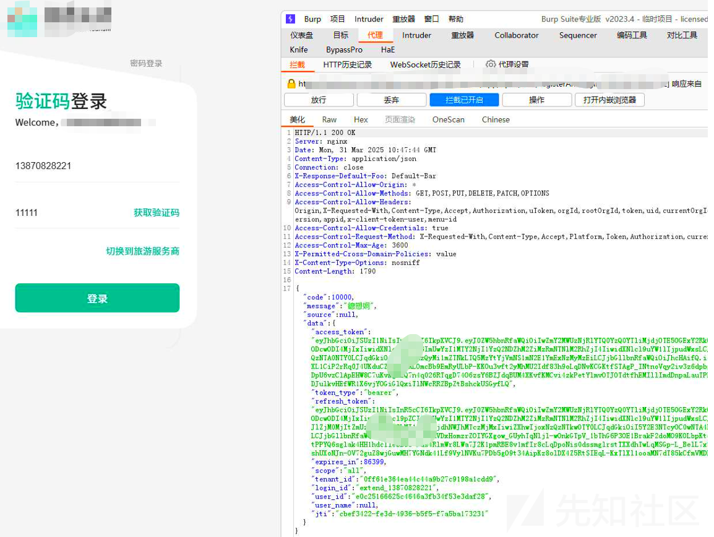

# 记一次SRC高危逻辑漏洞挖掘-先知社区

> **来源**: https://xz.aliyun.com/news/18557  
> **文章ID**: 18557

---

置空鉴权字段不仅仅在登录口,在查询处,鉴权处都是很经典的思路如`jwt`置空加密字段,个人信息置空回显站点全部信息,最简单的思路往往能造成最致命的问题


​

进入站点简单熟悉一下业务,发现存在注册功能,未注册的账户会自动注册,登录注册均是同一接口(划重点)

​


​

正常`bp`抓包进行注册,接口`/xjky-server/xjky-biz-server/app/open/sms/registerAndLogin` 记录了注册手机号及短信验证码以及一串不知道的`tenantId,`正确的验证码会返回`Token`,后续请求带上`Token`对用户进行身份信息认证

​

```
{
"openId":“307332
"password":“307332”
"username":“15xxxxx454"
"tenantId":"0ff61e364ea44c44a9b27c9198alcdd9
}
```



​

将此接口发送到重发器测试,置空验证码,同样成功请求并返回`token`,为了确认新生成的`token`是否为新号码,在此站点也测试了有一会,熟悉了业务,有一个接口可以通过`token`回显个人信息

​



​

替换后响应包返回`loginId` 对应的正是我尝试任意注册的号,那么此账号已经成功被注册

​



​

记录好`187` 号码所生成的`token`响应包,来到登录功能点,验证码随意输入,拦截响应包

​



​

替换响应内容为任意生成生成的`token` 而后一直放包

​



​

会登录到`187`账户,图片未截取完,不过已经是进入了`187`个人信息页面

​



​

当我测试完成任意注册后,发觉登录口和注册均是一套接口,只是未登录过的账号会自动注册

​

```
/xjky-server/xjky-biz-server/app/open/sms/registerAndLogin 
```

任意用户注册攻击置空验证会产生`token`,那么\*\*如果是我拿到已登录的账户,在此登录口同样进行置空验证码操作,是否也会返回对应号码`token`\*\***呢**

我正常注册了一位`138`账户进行模拟,省略过程,直接来到登录口进行测试,模拟攻击者不知道验证码的情况,随意输入然后拦截响应包

​



​

纯粹的置空让其不做校验然后放包

​



​

同我想的一样,只要置空验证就可以绕过登录验证,直接根据号码生成`token`,直接任意用户登录接管账户,又可以吃`N`顿馒头了

​



