# AWS研究记录（上）-先知社区

> **来源**: https://xz.aliyun.com/news/18560  
> **文章ID**: 18560

---

本系列将记录我研究AWS安全相关过程的基础知识、攻击手法、威胁检测工程等相关技术和思考。先从基本概念、云架构、重点服务开始讲解，结合云的主要风险点和目前高频使用的TTPS攻击手法，最后再简要介绍威胁检测相关的工作和工作方向。个人水平有限，如有错误及时评论指出。

### AWS 基础

为了方便新接触云的师傅，还是要先讲一下AWS的基础和环境搭建。首先个人研究，需要准备一张虚拟信用卡，然后去[官网](https://aws.amazon.com/)需要注册一个AWS账户，建议不要选中国区，选到海外，国内有很多限制。等注册完成登录了，就会进入类似下面这样的一个页面，相信大多数人和我一样，以前从来没接触过这玩意，面对一堆服务图标，绝对是一脸懵逼的状态

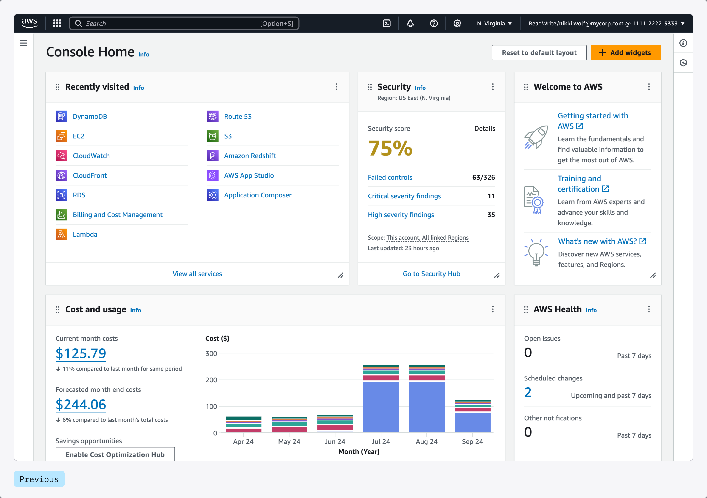

让我们慢慢熟悉一下基础概念，如果有系统架构或域渗透相关经验理解起来就会很快，没有也不慌，我们慢慢理解基础概念。

#### 云计算概念

谈云总是离不开这几个概念-IaaS/PaaS/SaaS，方便新人入门就拿实现“发邮件”的来做类比：

基础设施即服务（IaaS）：IaaS提供服务器给你，你需要自己开发或购买邮件系统，自己搭建起来配置使用，自己运维管理，非常灵活，但也面临运营维护成本过高的问题。相当于你买了基础的地皮，提供了基础计算环境，但是搭建什么样子的建筑全看厂商自己。

平台即服务（PaaS）：PaaS相当于提供一个邮件平台，但是细节实现还需要开发调用服务的API，完善相关的功能，相比于IaaS就少了维护基础计算环境的问题，节约了一部分成本，对于企业开发来说非常方便。

软件即服务（SaaS）：SaaS相当于直接提供一个软件平台，类似QQ邮件直接注册一个QQ就能使用配套的服务，完全没有开发层面的负担，把软件更新维护交给了厂商实现，虽然大大节约了相关成本，但是也牺牲了开发层面的灵活性。

进入界面，想要探索或者查找服务，可以使用右上角的搜索界面，里面有大量服务分类：存储、计算、物联网等等

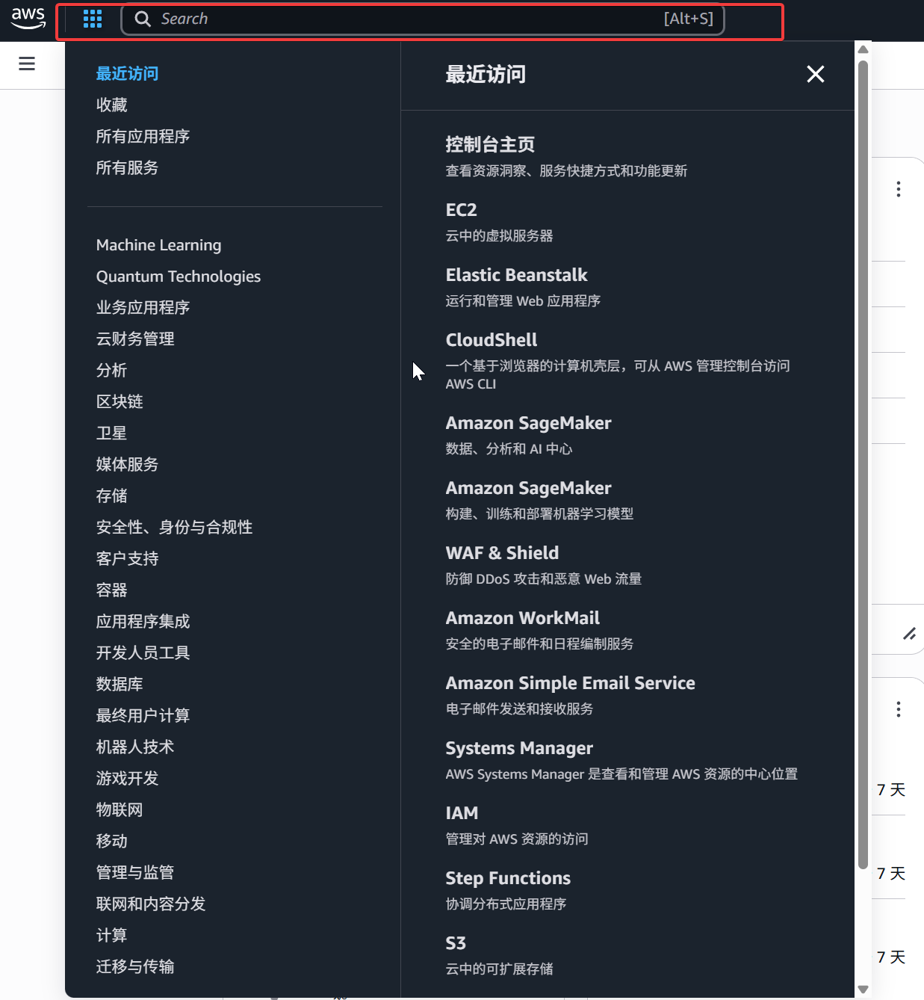

​

刚才截图页面的面板的服务分类从大类分，无非就是刚刚说这三种，虽然页面上的点击功能足够我们大多数交互，但是传统渗透都习惯于使用命令行来和AWS交互，省去了页面点击布局可能变动导致迷惑的问题。

一般来说我倾向使用AWS CloudShell去执行，只需要搜索里面查找点进去即可使用，它里面已经预装了AWS CLI，直接使用了当前的用户会话作为默认登录：

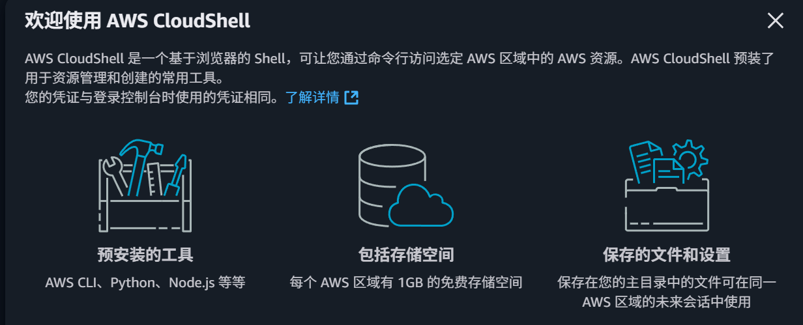

我们可以检查一下AWS的版本信息：

```
aws --version
```

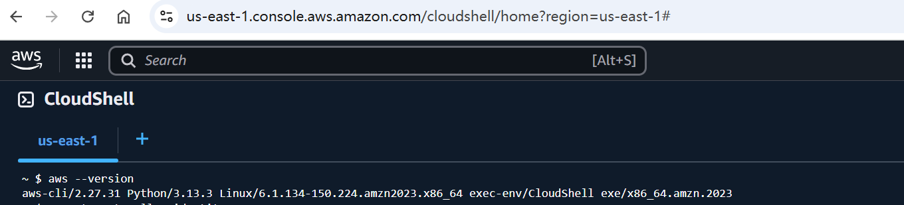

也可以检查一下当前用户的信息，这个命令相当于系统中的whoami，会返回一个json数据

```
aws sts get-caller-identity
```

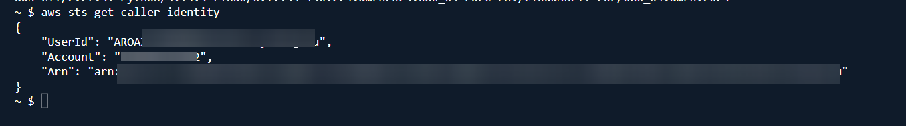

它会返回三个字段：

```
{
    "UserId": "AIDASAMPLEUSERID",
    "Account": "123456789012",
    "Arn": "arn:aws:iam::123456789012:user/pacutest"
}
```

其中"Arn"字段的全称是Amazon Resource Name，亚马逊资源名称将作为一个唯一的值关联到特定的资源，很明显Arn里面就标注出来了user/pacutest这个用户名。

想要查看当前用户的权限策略可以使用：

```
aws iam list-attached-user-policies --user-name pacutest
```

看到下面的没有，我们这个用户居然是管理员策略---AdminstratorAccess

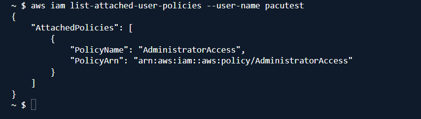

AdminstratorAccess策略默认可以访问所有资源，相当于超级管理员，这也是用的最多的[AWS托管策略](https://docs.aws.amazon.com/zh_cn/aws-managed-policy/latest/reference/AdministratorAccess.html),我们阅读文档看看，文档左侧还有很多AWS托管的策略就不赘述了，记不住也没关系，需要用到的时候就查一下。

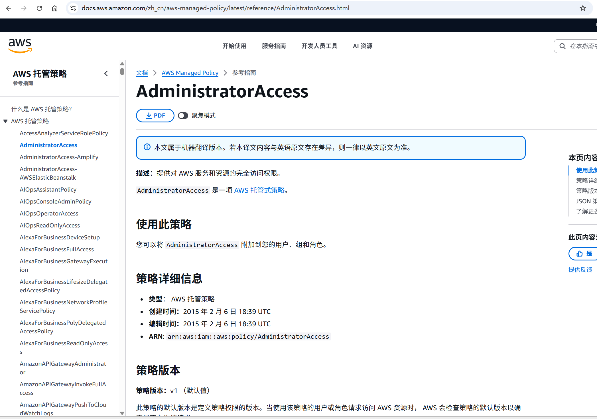

JSON 策略文档的内容如下,Effect设置为允许，Action和Resource使用统配符星号指代所有资源：

```
{
  "Version" : "2012-10-17",
  "Statement" : [
    {
      "Effect" : "Allow",
      "Action" : "*",
      "Resource" : "*"
    }
  ]
}
```

值得注意的是，AWS的权限策略非常严格，如果没有主动授予查看用户本身的权限，甚至aws iam list-attached-user-policies 自己都是会被拒绝的，这要是放在windows和linux中简直就是不可思议的事情，如果类比到AD，我们有一个普通用户居然不能导出用户名列表，不能查找策略，简直就是瞎了一样，从这一点来看，云的渗透难度远远比AD更大，攻击面更加收敛。

AWS大部分实战居然要显式的通过爆破自己的权限才能知道自己能访问什么资源、执行什么动作！然而爆破势必会触发一定量的失败，拒绝的日志将会被记录下来，留下严重的IOC共给防御团队审查，不过我们偏题了，在这个点上暴走是不适合新人，先回到基础部分，如果你不喜欢用CloudShell，当然也可以使用我们最常用的kali Linux，默认只需要一句话就可以装上AWS CLI，接下来只需要创建测试用户

```
sudo apt install awscli
```

装好之后，确认一下版本:

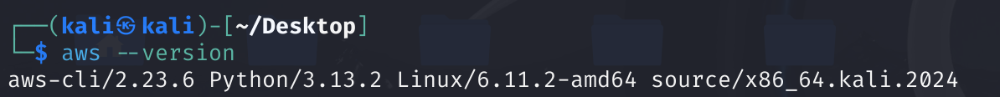

接下来需要创建一个测试用户，我们需要用到IAM服务，这是一个全球统一的服务，点进入这样一个类似的页面，注意右上角的全球：

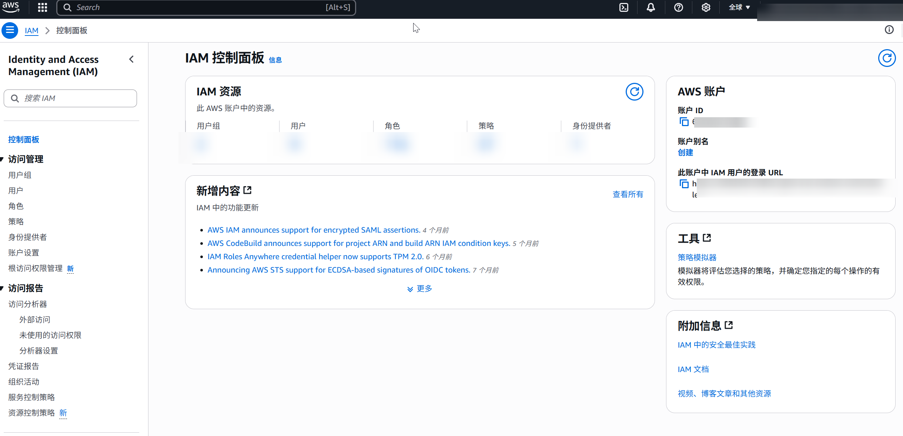

对于IAM服务来说没有区域的划分，点进去可以看到都锁了，本身没什么好疑惑的，账户的使用范围默认是全区域的，但是对于特定的资源服务--诸如计算（服务器）、存储类（存储桶）的就有了区域划分：

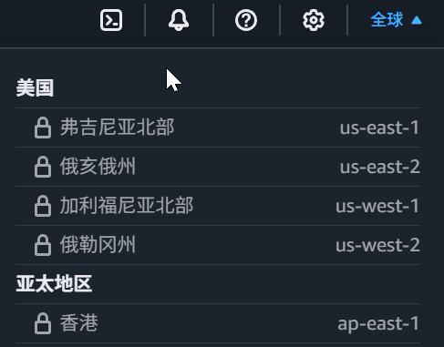

看下图，我选了新加坡的地区，新加坡地区并没有实例启动，是0：

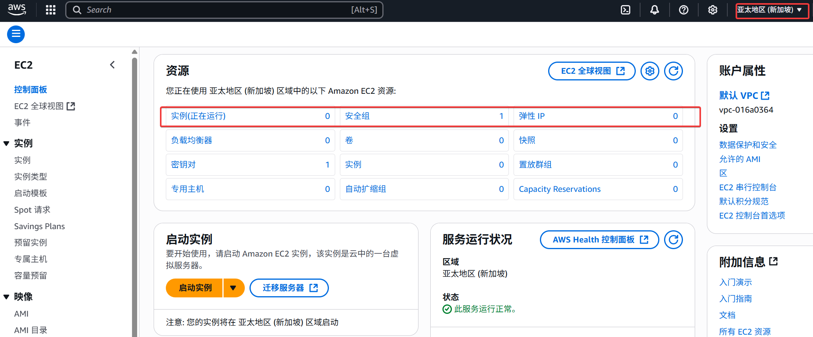

我们点过去，现在切换区域到美国 us-east-1，可以看到在这个区域，我们有两台运行的实例（服务器）：

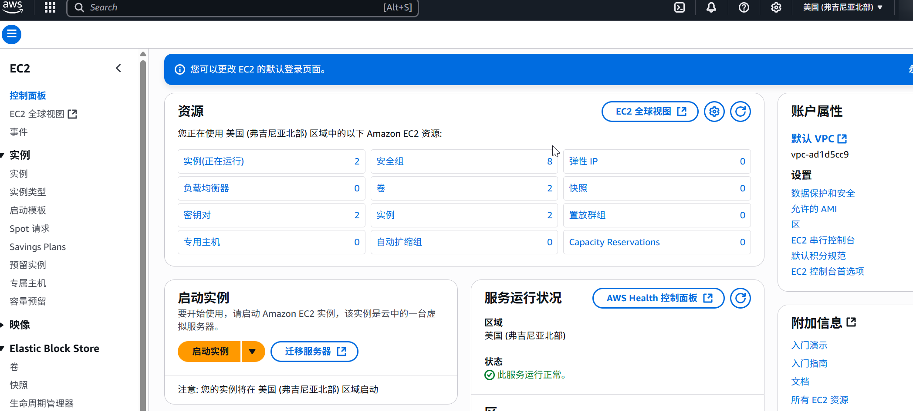

现在你应该注意到了一个问题，对于类似EC2的资源的信息枚举是需要指定区域的，否则返回的结果可能就是空的，导致信息收集的时候错失关键资产，注意看等价的命令行提示也告诉我们要指定region

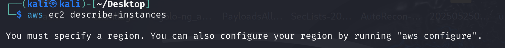

不过IAM相关信息倒是不需要担忧，你刚刚已经看到是全球，不需要显式指定。我们点到右边用户，创建一个新的用户：

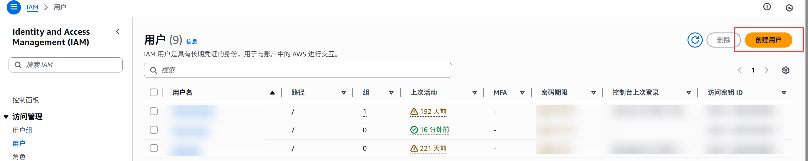

创建一个test用户

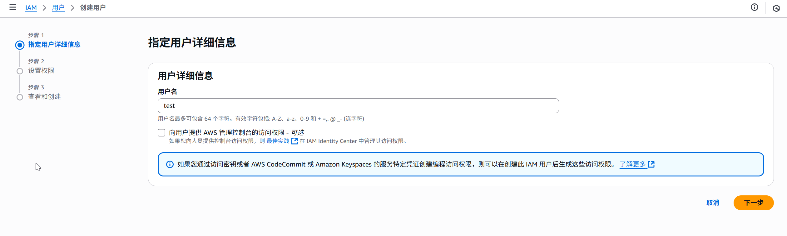

选择下一步，有三个选项，不言而喻，第一个添加用户到组自然继承来自“组”的权限，第二个复制权限自然来自复制的某个对象的权限，第三个是直接附加指定的策略，这个策略其实就是我们刚刚看到的托管的策略

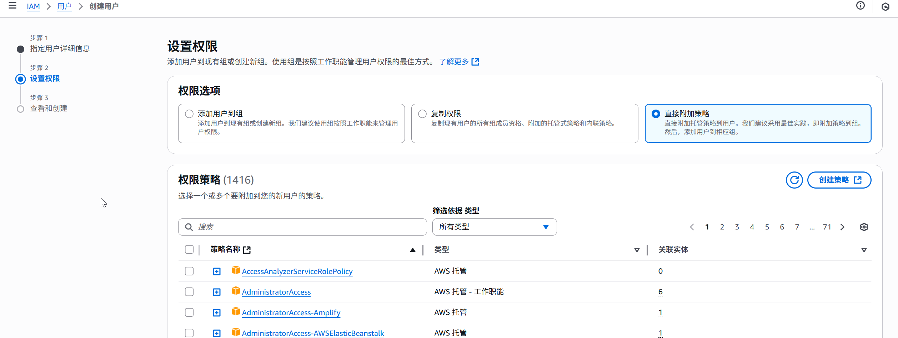

策略名称其实望文生义即可，看到了刚刚的AdminstratorAccess了吧，其实还有一大堆AWS内置的策略

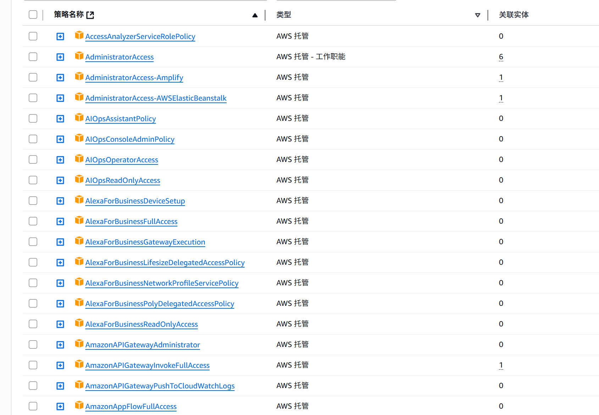

这次我们给test的权限低一些，选择AmazonEC2FullAccess，控制test只能访问EC2相关的资源：

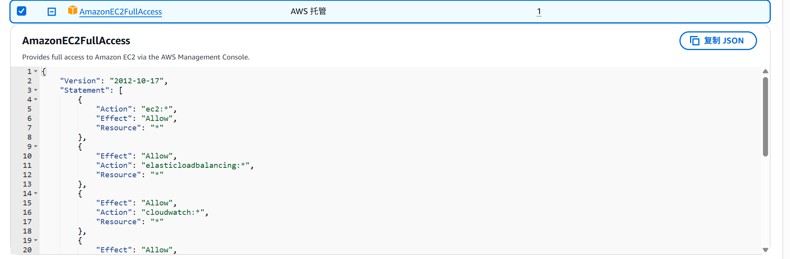

策略内容如下，Statement里面包含看显式允许的各种服务，稍微过一下

```
{
    "Version": "2012-10-17",
    "Statement": [
        {
            "Action": "ec2:*",
            "Effect": "Allow",
            "Resource": "*"
        },
        {
            "Effect": "Allow",
            "Action": "elasticloadbalancing:*",
            "Resource": "*"
        },
        {
            "Effect": "Allow",
            "Action": "cloudwatch:*",
            "Resource": "*"
        },
        {
            "Effect": "Allow",
            "Action": "autoscaling:*",
            "Resource": "*"
        },
        {
            "Effect": "Allow",
            "Action": "iam:CreateServiceLinkedRole",
            "Resource": "*",
            "Condition": {
                "StringEquals": {
                    "iam:AWSServiceName": [
                        "autoscaling.amazonaws.com",
                        "ec2scheduled.amazonaws.com",
                        "elasticloadbalancing.amazonaws.com",
                        "spot.amazonaws.com",
                        "spotfleet.amazonaws.com",
                        "transitgateway.amazonaws.com"
                    ]
                }
            }
        }
    ]
}
```

确认完毕直接创建即可：

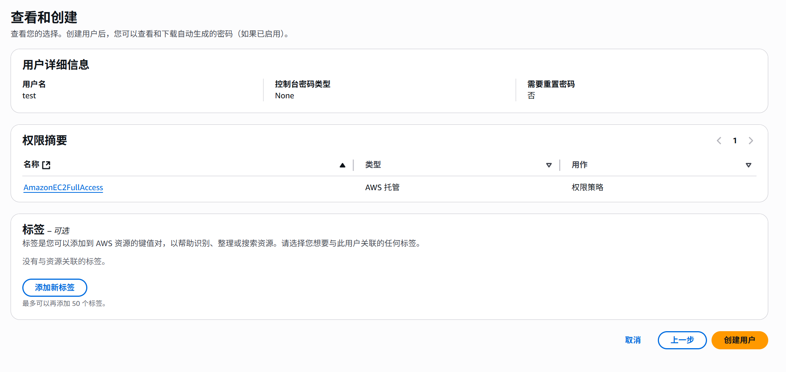

接下来选中刚刚的test用户，点击创建密钥即可，观察仔细一些我们发现我们并没有给test设置密码，除非主动再设置密码，它是无法通过密码登录控制台的。

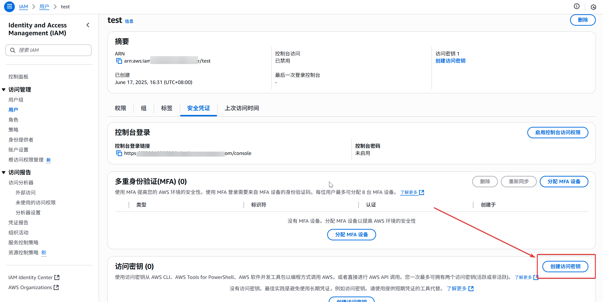

继续点进去，跳过去，确认好就会生成一个长期的AKSK了：

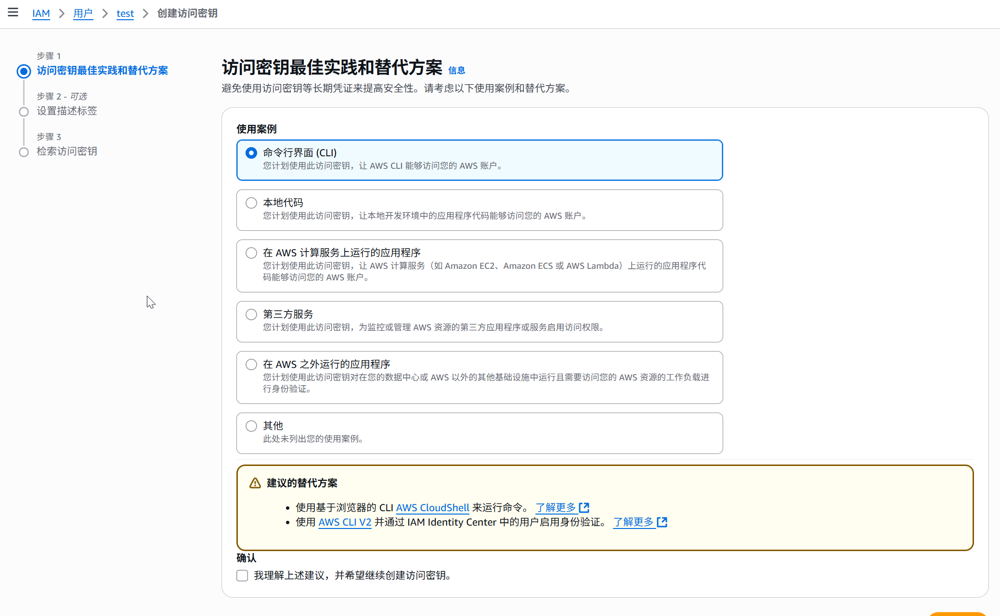

打完标签，接下来控制台就会返回访问密钥了，它也贴心的告诉我们访问密钥的注意事项等等----

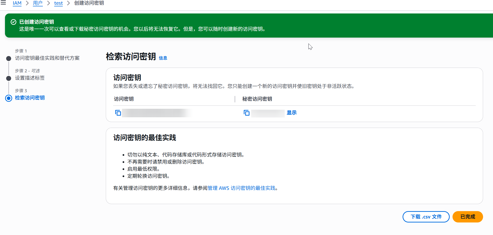

配置一下aws ak sk 和区域就可以和aws相关服务进行交互了，区域我这里使用us-east-1

```
aws configure
```

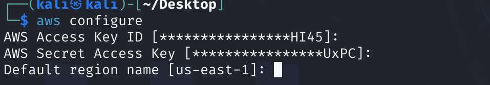

注意密钥实际上是以文本文件存在于~/.aws/credentials，这也太不安全了

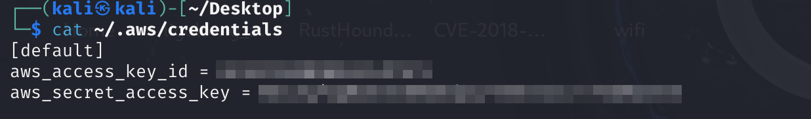

除了刚刚用的AWS CLI，当然也可以编程实现交互逻辑，也就是使用[Python AWS SDK](https://boto3.amazonaws.com/v1/documentation/api/latest/guide/quickstart.html) , 其实本身aws cli背后和aws sdk做的事情本质上都是一样的----都是通过HTTPS请求调用云暴露出来的API接口，进而操控云中的相关服务。下面的boto3代码完全和aws sts get-caller-identity等价，它将获取当前的会话信息并发起认证：

```
import boto3

# 创建 STS 客户端
sts_client = boto3.client('sts')

# 调用 get_caller_identity
response = sts_client.get_caller_identity()

# 打印返回结果
print("Account:", response['Account'])
print("UserId:", response['UserId'])
print("ARN:", response['Arn'])
```

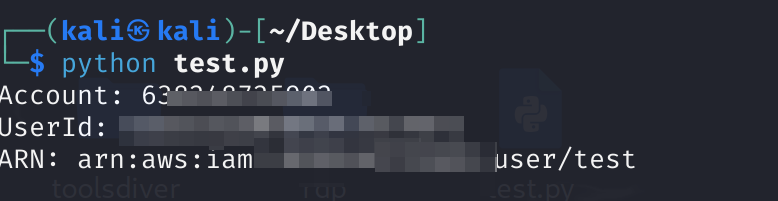

其实我们也可以直接抓包，观察就发现，并两个方法调用过程没有什么神秘之处，渗透的师傅直接看数据包更熟悉，这个是AWS CLI在kali调用产生的关键一个HTTP请求包：

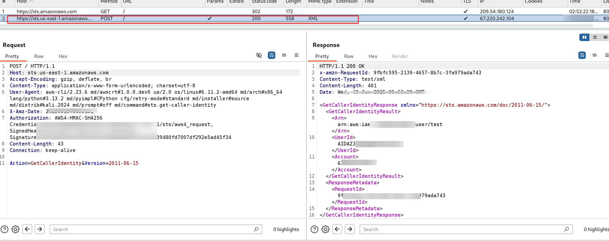

其实就是通过AK SK计算Authorization头，然后POST发送下面请求

```
Action=GetCallerIdentity&Version=2011-06-15
```

最终返回一个XML，XML记录调用服务的信息返回给我们，AWS CLI就帮我们格式化美观了一下而已：

```
<GetCallerIdentityResponse xmlns="https://sts.amazonaws.com/doc/2011-06-15/">
  <GetCallerIdentityResult>
    <Arn>arn:aws:iam::XXXX:user/test</Arn>
    <UserId>XXXXXX</UserId>
    <Account>XXXXX</Account>
  </GetCallerIdentityResult>
  <ResponseMetadata>
    <RequestId>XXXXX-XX-XXX-XXX-XXXX</RequestId>
  </ResponseMetadata>
</GetCallerIdentityResponse>
```

这个是Python AWS SDK调用产生的关键一个HTTP请求包,可以说几乎一模一样：

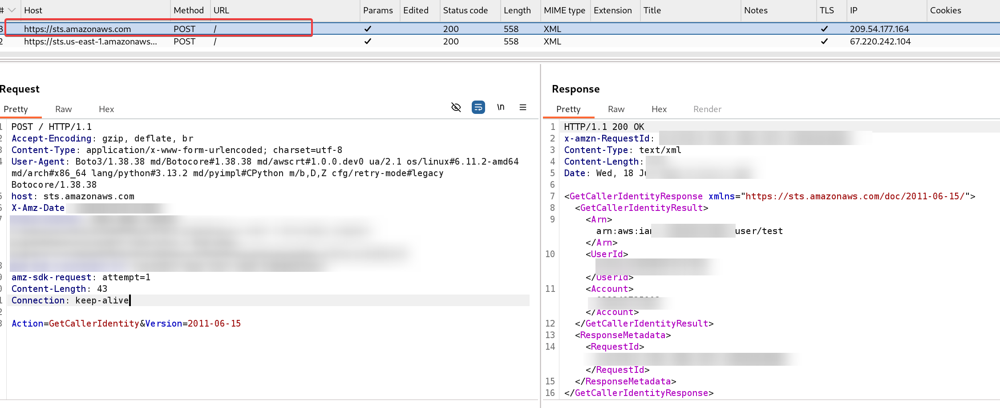

但是真的一模一样吗？细心的读者已经发现了AWS Cli User-agent带上了我们的kali版本信息，如下:

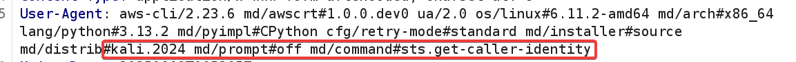

大部分渗透姿势为了方便起见都是给出的是基于命令行的信息收集方法，我们直接就Copy过来在kali上用了，这就留下下了可疑的User-agent特征，这就会触发防御团队的告警规则[PenTest:IAMUser/KaliLinux](https://docs.aws.amazon.com/guardduty/latest/ug/guardduty_finding-types-iam.html#pentest-iam-kalilinux)：

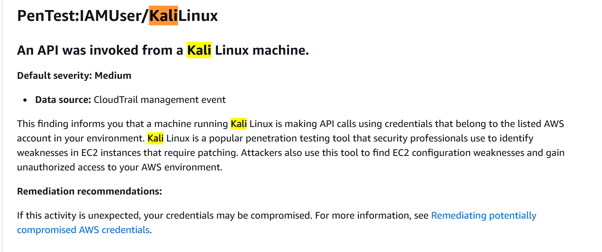

我印象中海外文章也报道过一些APT组织也有这样的低级失误，看样子大部分的APT和我们的水平也差不了太多，人在知识盲区总会犯一些低级的错误，所以依然有蛛丝马迹可以寻到可疑痕迹。要规避这个告警也很简单，把UA里面的kali删掉，替换成[浏览器的UA](https://hackingthe.cloud/aws/avoiding-detection/guardduty-pentest/)即可。

### AWS身份认证机制

#### AWS Identity and Access Management (AWS IAM)

为了解决在AWS系统中的身份和访问控制的经典问题，AWS提供了AWS Identity and Access Managemen，也就是缩写IAM，有些资深黑客研究某个领域，一般喜欢阅读文档获得最权威的信息----[官方文档](https://docs.aws.amazon.com/zh_cn/IAM/latest/UserGuide/introduction.html)，不过为了避免大部分读者枯燥乏味，我们不如在控制台到处点一点，熟悉一下有什么东西。

基本上你会发现IAM左边的控制栏有几个关键的概念，点进去上方也做了简要的解释：

​

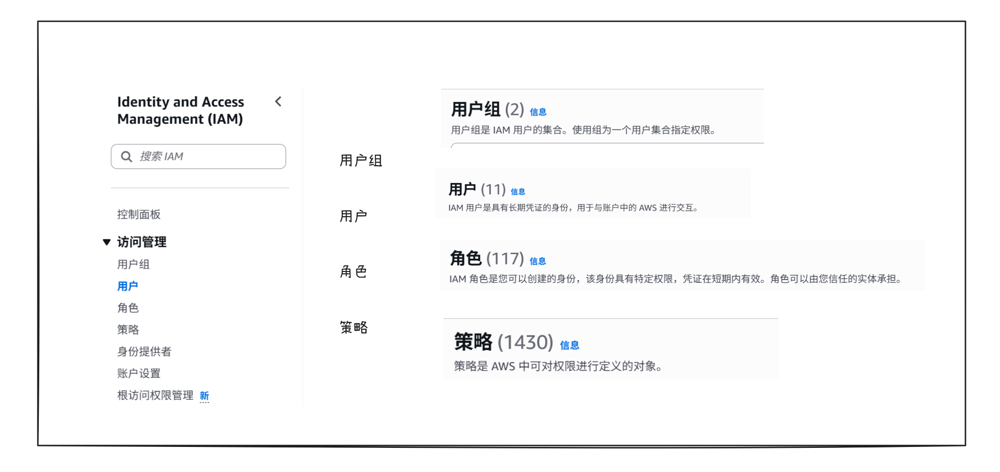

* 用户组 -- IAM User Groups：用户组是 IAM 用户的集合。使用组为一个用户集合指定权限。
* 用户 -- IAM Users：IAM 用户是具有长期凭证的身份，用于与账户中的 AWS 进行交互。
* 角色 -- IAM  Role：IAM 角色是您可以创建的身份，该身份具有特定权限，凭证在短期内有效。角色可以由您信任的实体承担。
* 策略 -- Policies ：策略是 AWS 中可对权限进行定义的对象。

用户是需要通过认证的，关联到用户的凭据有以下7种：

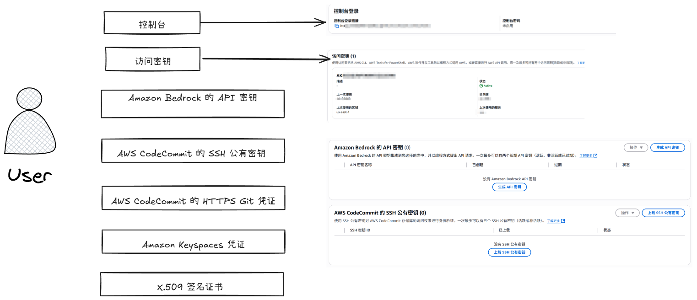

1. 控制台登录：如果配置了控制台的密码，就可以使用密码登录web控制台获取临时会话
2. 访问密钥：如果配置了长期访问密钥，可以使用长期有效的密钥代表用户通过认证
3. Amazon Bedrock 的 API 密钥：生成一个短期或者长期访问Amazon Bedrock的密钥
4. AWS CodeCommit SSH 公有密钥 : 上传一个公钥，本地私钥交互通过认证
5. AWS CodeCommit HTTPS Git 凭证 : 返回用户名和密码通过认证 6、7等等等等

除了可以钓鱼攻击获取session会话以外，这些密钥凭据就成了攻击者寻找的关键，让我们继续下一节。

#### 凭证泄露、密钥泄露

IAM相关最容易出现的问题就是凭据泄露的问题了，回顾历史，大部分公司都出现过AK SK管理不当泄露。这些密钥一般在哪里呢？一般情况下AK SK在以下几处地方泄露：

* 前端JS代码硬编码
* Github、Gitlab等源代码托管平台 (Gitlab的内网存储库公开访问、大量历史CVE)
* Web与云交互的功能点（常用报错异常Fuzz抛出敏感信息）
* CI/CD 工具（如 Jenkins）日志泄露
* 相关本地计算环境（AWS CLI的直接泄露）
* 二进制客户端安装包、手机APP安装包、微信小程序硬编码泄露
* 调试页面的直接泄露 （phpinfo泄露等等）

相信上述的例子大家在实战中遇到不少了，为了实际感知现实网络空间泄露凭据的情况，这里面我就抽一个案例，用空间绘测引擎快速带大家感知一下。

嗯，下面的语法是典型的phpinfo泄露

```
body:"AWS_SECRET_ACCESS_KEY" and body:"phpinfo"
```

这个是我使用quake的结果，结果独立ip几乎接近1000个，为了避免不必要的麻烦，请自己查询相关页面探索：

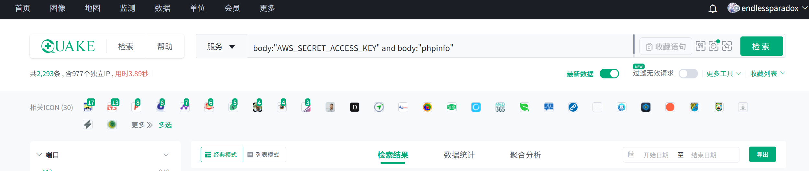

刚刚我限定了phpinfo，现在在大概看一下直接查询的结果：

```
body:"AWS_SECRET_ACCESS_KEY" 
```

39,059这个数量，尽管不是这里面并不代表每个ip一定是泄露的，但是依然给了我们一个直观的数据感知泄露的情况实际上是非常多的，实际上查询出来的泄露依然是冰山一角

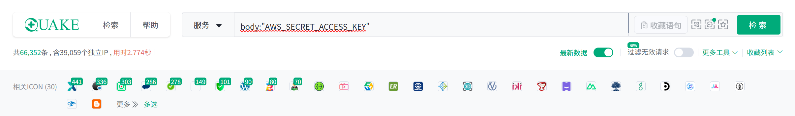

这类泄露利用起来是极度轻松的，发挥我们的一点点想象力组合关键字，然后查找语法，你就可以找到成千上万的泄露的密钥，拿出来，然后接管它们的权限。这里没有让人头疼的EDR/XDR等让人烦恼，对于云来说，你只是在调用自己合法的权限。情况和传统渗透稍微不一样，比方说如果我们在某个springboot的内存信息里面找到了内网数据库的账号密码，实际上我们除非进入对面内网，对这个数据库是没有办法的。然而，泄露AK SK的话，公有云就在外面，一旦你有对应的权限，直接交互即可；

保命警告：未经过书面授权的攻击行为都是违法的！别乱搞，而且空间绘测收集的数据大概率有蜜罐的密钥挂在外面，类似wiz的安全厂商，会故意放出去一些泄露的密钥收集攻击者的[TTPs](https://www.wiz.io/blog/detecting-behavioral-cloud-indicators-of-compromise-iocs#introduction-0) ；

虽然理论上有很多审计日志等等检测，但是如果自动化程度如果足够高，你当然可以完全在对手反应之前搞定一切，日志传输是有几分钟的延迟的。

#### IAM特权提升的风险

据说大约50%的泄露的AK SK都是管理员权限，但是如果攻击者如果运气不够好，就需要进行权限提升。但是好消息是，得益于IAM本身的权限设计，权限提升基本上其实相当受限。如果没有AWS 0day，那么基本上只有一种方法---[错误的IAM权限策略配置](https://rhinosecuritylabs.com/aws/aws-privilege-escalation-methods-mitigation/)。

我认为bishopfox的[博客](https://bishopfox.com/blog/privilege-escalation-in-aws)已经归纳的很好了，我就挑了几个分享一下：

* iam:CreateAccessKey 如果当前权限给任意用户具备创建AccessKey的权限，它可以直接为管理员创建一个AccessKey
* iam:CreateLoginProfile 如果当前权限具备给任意用户创建登录配置，直接创建密码然后登录即可
* iam:AttachUserPolicy 如果当前权限可以附加新的策略给任意用户，直接附加管理员权限给自己即可
* iam:PassRole + 特定 iam服务执行权限 如果当前权限具备PassRole传递角色权限，直接传递管理员权限给某个服务，然后启动这个服务即可拿到这个管理员权限

当然还有很多组合方法，但是本质就是一种，就是当前的IAM策略赋予了过多的权限导致提权提升。

理解AWS IAM是非常重要的，它是一个最基础最核心的服务，几乎与所有AWS内置的服务都有交互，只是学了IAM可能还是一头雾水，接下来我们再来看看AWS高频出现的重点服务，并且尝试理解这些服务与权限之间的关系。

### AWS 核心服务

接下来就讲解一下主要的AWS核心服务，后续要研究其他服务也是一样的，就是“查文档”，然后发挥想象力。

#### CloudTrail 服务

AWS CloudTrail服务，这个服务是我们审计云内活动的基础服务；当我们开启这个服务，几乎大部分云内的活动（启动实例、创建用户、调用资源等等等等）都会被记录在AWS CloudTrail里面，提供云审计的可见性。下图就是CloudTrail的页面布局：

​

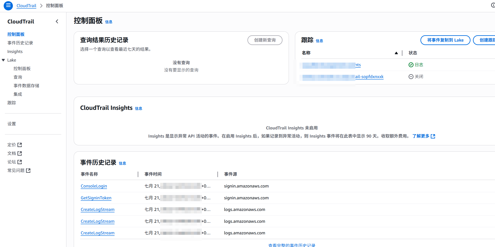

点进去历史记录，可以在线查看90天内的审计日志：

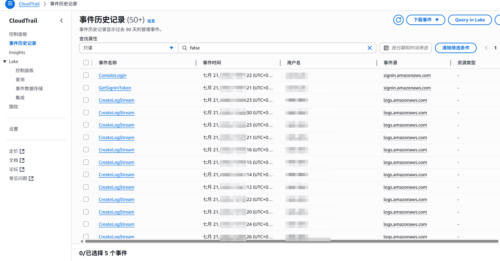

点进去ConsoleLogin看看，到处看看，熟悉一下，看上去记录了很多有意思的信息，比方说登录时间、登录ip、登录区域等等，下面还有JSON数据，出于隐私考虑，实际上有些敏感的东西是会被脱敏的：

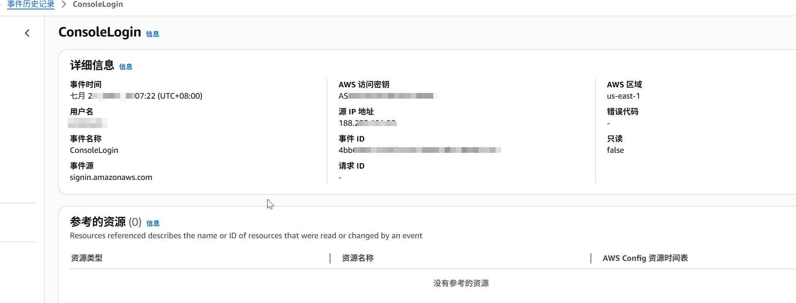

​

如果你作为一个攻击者，通常来说你不想自己的攻击活动被记录，你想找到一种绕过方法，然而完全绕过CloudTrail属于顶级技术，这里不会多谈，感兴趣请看演讲 [Evading Logging in the Cloud: Bypassing AWS CloudTrail](https://www.youtube.com/watch?v=YP2XNAbB_Nw) 和 [AWS CloudTrail vulnerability: Undocumented API allows CloudTrail bypass](https://securitylabs.datadoghq.com/articles/iamadmin-cloudtrail-bypass/) 博客；当然最简单的方法是，一旦具备了管理员权限，直接停止CloudTrail服务，后续的动作自然也就无法被记录了。

要检测停止CloudTrail服务的非常简单的，会触发“CloudTrail 被开源的StopLogging”[检测规则](https://github.com/elastic/detection-rules/blob/f348e92f064478e67b37eb7e4d7d45b02af9a253/rules/integrations/aws/defense_evasion_cloudtrail_logging_suspended.toml),毫不意外几乎会被监控完备的系统发现，导致SOC团队发起事件调查；我们来看一下它的核心规则：

```
event.dataset:aws.cloudtrail and event.provider:cloudtrail.amazonaws.com and event.action:StopLogging and event.outcome:success
```

这个是一个简单的KQL语法，event.action:StopLogging 代表触发了StopLogging事件；event.outcome:success是代表我们这个事件的结果是成功的；

AWS给出的告警威胁是低，但是攻击者一般也可能改变思路，直接删掉所有的记录事件，这导致我们完全就致盲了；所以我们作为防守方，一般情况，为了保持长期审计，CloudTrail日志会转换到S3（存储桶）里面，之后传输到本地的SIME平台进行长期审计分析。

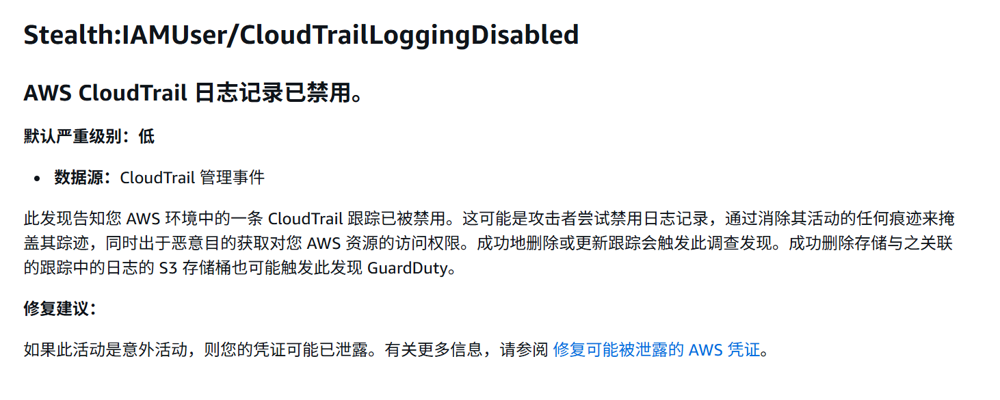

这里再提一嘴，CloudTrail审计日志延迟很严重，实际上我工作发现可能有3到5分钟左右的延迟。接下来，就让我简单讲讲S3的内容。

#### S3 服务

S3 ，全称是Amazon Simple Storage Service（Amazon S3），也就是大家熟悉的存储桶，它提供对象存储服务，可以存储任意文件；我们过一下存储桶的创建的流程，去搜索页面找一下进去：

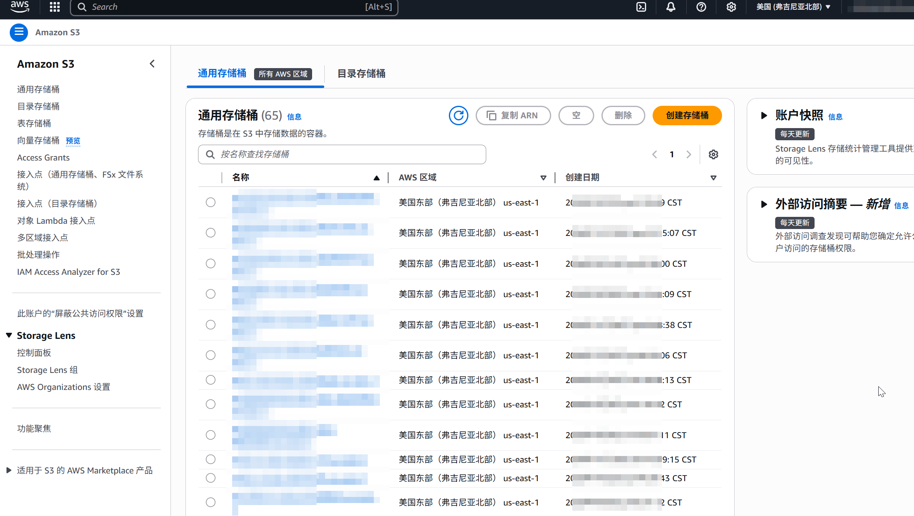

找到这个创建存储桶：

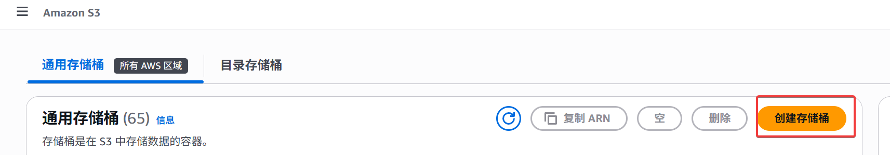

存储桶的名称自己取一个名字：

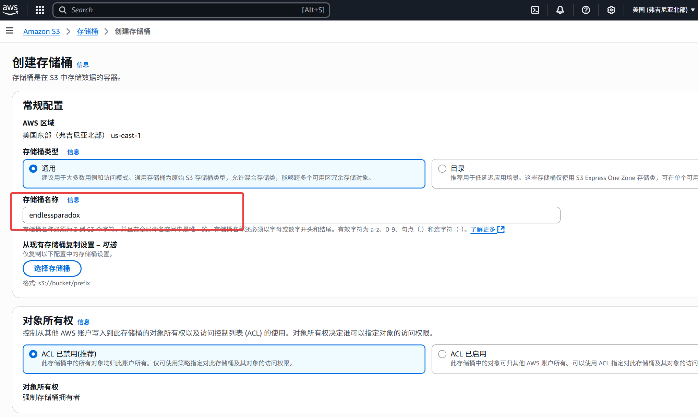

截图没截全，往下拉可以看到“此存储桶的“屏蔽公共访问权限”设置”----**阻止\_所有\_访问**

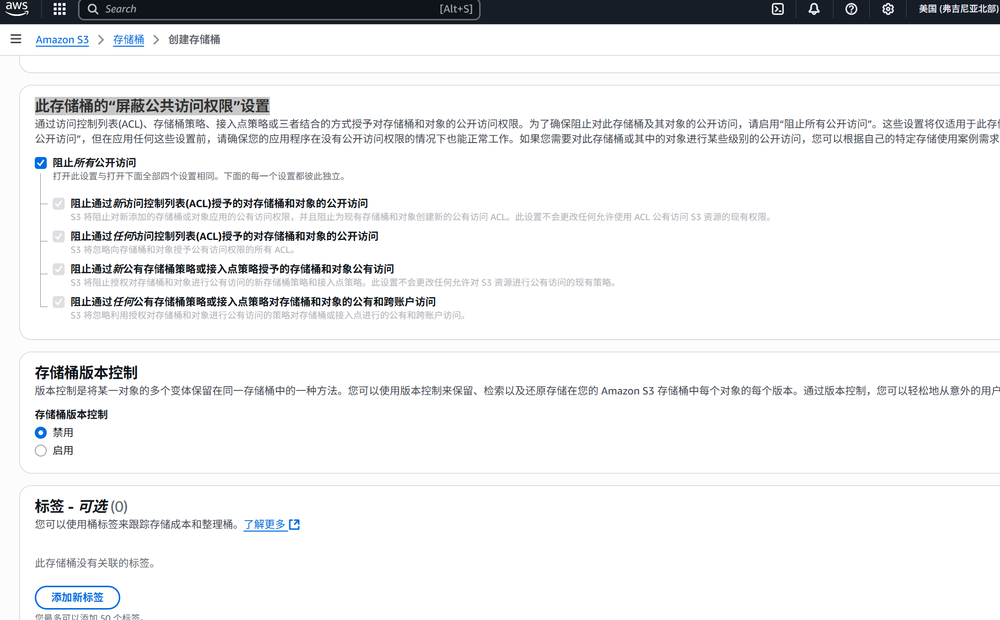

部分开发和运维会把这个取消掉，很多博客是这么教的，对开发者也方便，不用另外实现云认证部分的代码，所以通常早期都放的都是一些图片和前端静态资源，没什么问题；

但是后续项目交接另一个开发者复用了这个存储桶，这个开发者并不清楚之前系统的情况，或者开发者本人时间久了，完全忘记了公开目录这个事情，直接就给存储体上传一些敏感的资源（也许里面就有大量密码），这也就是S3的主要风险点存在于权限的配置错误（存储桶允许公开访问）

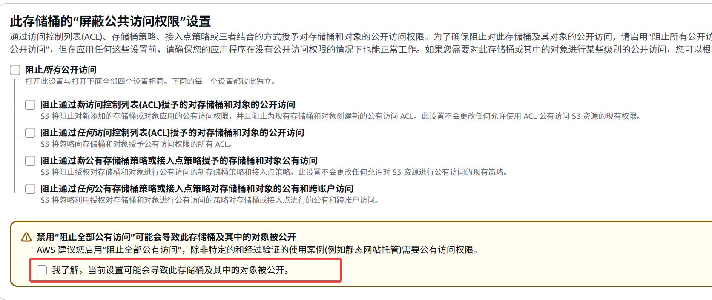

我们可以从空间绘测引擎看看这个设置是多么普遍：

```
domain: "s3.amazonaws.com" and body:"ListBucketResult"
```

根据语法的搜索结果，我们轻松找到了1.7万的数量级公开列出，真实情况数量级应该要更高

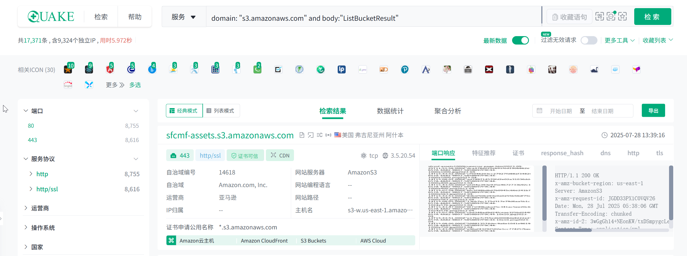

回过存储桶的创建，我们创建好了，就可以上传文件了：

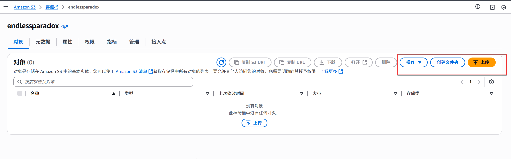

点进去，上传几个文件测试一下：

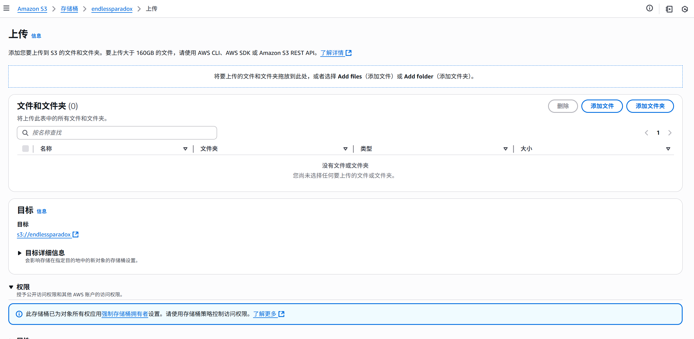

上传好之后就是这个状态了：

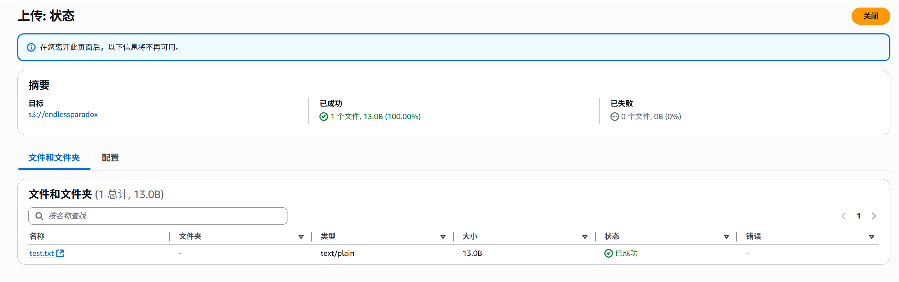

点进去看看属性，观察对象URL：

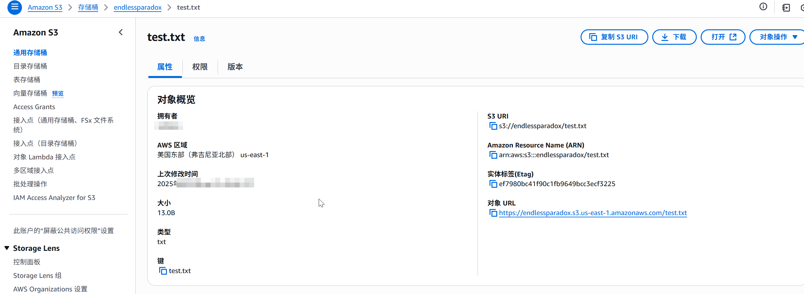

由于我没有提供IAM身份日志，访问<https://endlessparadox.s3.us-east-1.amazonaws.com/test.txt> 返回了AccessDenied

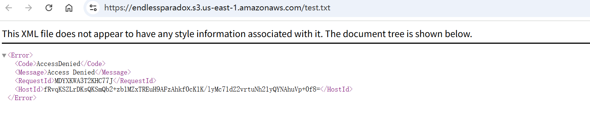

如果提供身份会话，就会成功返回文件内容：

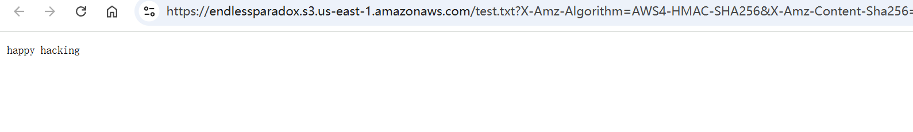

仔细观察URL很容易发现，S3服务其实都是有固定特征的，都是在s3.amazonaws.com的亚马逊的域名挂着的 , 有个[博客](https://swisskyrepo.github.io/InternalAllTheThings/cloud/aws/aws-access-token/)总结服务的不错，如下，之后的服务介绍我就不叨叨这个了：

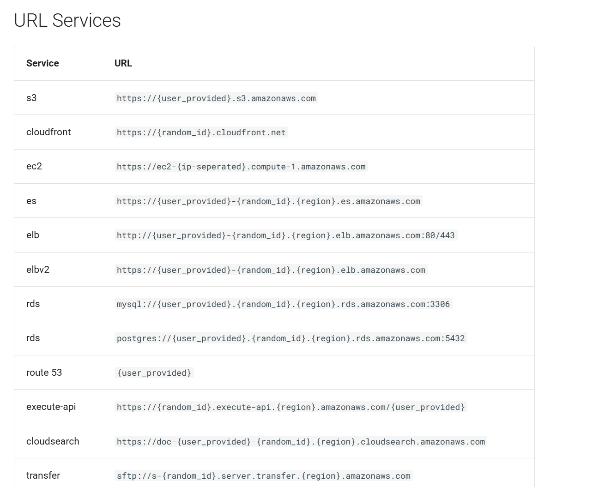

所以要辨认web服务在用什么技术实际上是很方便的，观察域名即可；S3的域名是一部分用户提供的字符串+s3.amazonaws.com，听起来这样设计是不是没什么不妥？但是实际上也是一部分巨大的安全隐患，让我设想这样一个故事吧：

设想一下，一个大型的软件开发商决定采用s3相关的技术，由于各式各样的原因（安全原因也好、市场原因也好），产品需要定期检查自动更新（就像是windows那样，烦人的自动更新？！），他们把更新的脚本和材料放进了S3里面，如下图：

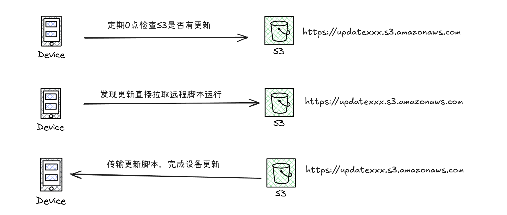

随着时间的变更，设备被卖进了各种企业、政府单位，一堆设备向这个S3请求更新，S3中心化了

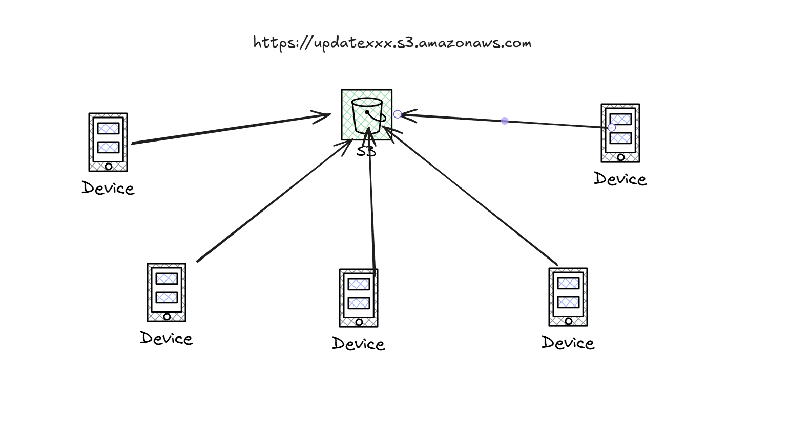

后面企业增长了一定规模，也许10年后，突然有一天这家企业暴雷倒闭了，或者裁员整个产线砍掉了。S3由于账户余额不足被AWS释放掉了资源，或者他们开发部门解散前清空了所有云上资源。之后的一个月，这些设备无法找到资源，但还是日复一日的请求更新检查。

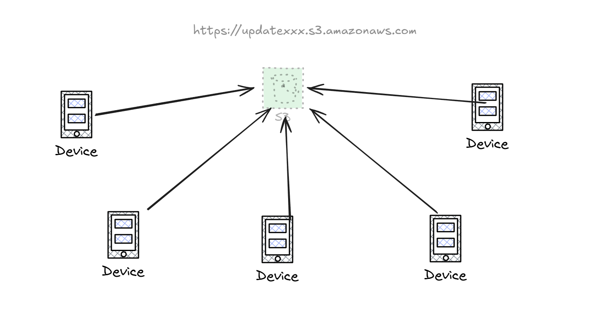

<https://updatexxx.s3.amazonaws.com> 是曾经更新的存储桶资源，现在这个存储桶被释放了，任何人都能注册一个名字一模一样的存储桶。现在假设突然有一天，被黑客知道了这个存储桶的名字，黑客只需要简单的注册它，设备更新的地址来源就被黑客控制了，如果更新的脚本采用的是EXE\BAT\SH等容易利用的，直接下发beacon即可，理论上等待几天，黑客就可以进入所有设备影响的企业，这类攻击的规模和影响范围取决于设备所在的行业和范围，理论上甚至能到达世界级供应链的影响程度：

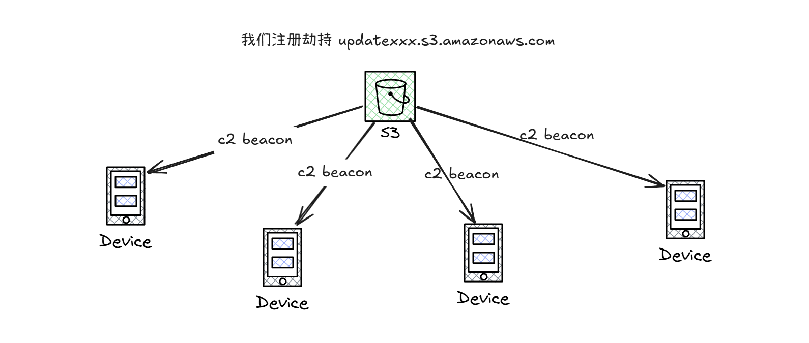

一些人可能会觉得这个太鸡肋了，有些危言耸听了，绝大多数S3就是一些静态资源，一些图片、一些JS和html，也许劫持一个这样的存储桶，劫持一个图片，如果是我可能会放上一个白毛傲娇美少女恶搞一下：

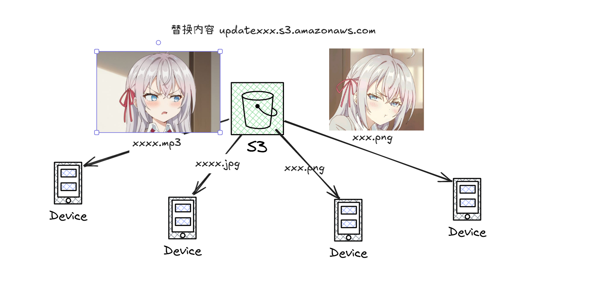

哈哈哈，不过现实watchtowr已经真正的执行了这部分攻击，来自[8 Million Requests Later, We Made The SolarWinds Supply Chain Attack Look Amateur](https://labs.watchtowr.com/8-million-requests-later-we-made-the-solarwinds-supply-chain-attack-look-amateur/) 博客，博客中谈到对大量组织的影响：

* 政府
* 军队
* 网络安全公司
* 交通基础设施
* 移动平台
* 银行金融机构

watchTowr 团队具备如下攻击能力，足以构造一场超越 SolarWinds 的全球供应链级攻击，强烈建议阅读原文，我这里只是简单的总结他们分析这几百万请求找到能劫持的点：

* 劫持企业代码仓中的 JS 文件更新源 —— 替换失效 S3 地址后，注入恶意 JS，网页植入前端钓鱼、数据泄露，即可大面积感染网页端用户
* 劫持 iOS/macOS 应用更新源 —— 利用开发者留存的配置文件中的旧下载链接（指向失效 S3），可将恶意版本下发到移动端和桌面端，形成跨平台感染，影响移动设备
* 劫持 SSLVPN 客户端更新路径 —— 攻陷企业用于远程访问的 VPN 软件更新接口，替换为后门版客户端，感染大量使用相关VPN的企业
* 接管主流防病毒与安全设备更新源 —— 劫持用于下载 AV 引擎、签名库、策略配置的链接，致盲大量安全设备
* 替换虚拟化与部署模板 —— 包括 CloudFormation 模板、VM 映像文件（如 .ova、.vhdx），一旦开发团队使用这些预配置镜像，将轻松进入大多数网络

这类供应链世界级APT攻击，即使是你和我这种普通的工程师都能发起，基本上随便一个人都能注册AWS账户，然后注册大量的存储桶------AWS现在[默认提供100 万个存储桶](https://aws.amazon.com/cn/about-aws/whats-new/2024/11/amazon-s3-up-1-million-buckets-per-aws-account/)，然后开启Cloudtrail日志，等待几个月收集好的日志，从这几百万的日志中寻找分析来自奇怪的请求，即使是万分之一的概率收获也是相当大的；同样完全相同的原理，这类技术完全可以迁移到阿里云、腾讯云、等等大大小小的云厂商上，然后就能轻松黑入绝大部分机构，甚至是银行！这真是太疯狂了。

#### EC2 服务

EC2(Amazon Elastic Compute Cloud)，我们最熟悉的东西，实际上就是VPS，我喜欢把他们都叫VPS，就是云上售卖的服务器，亚马逊的EC2是可以随时使用然后释放掉。早年买服务器我陆陆续续注册了一大堆云厂商去“薅羊毛”----早年红队必备的C2服务器---新用户新服务器1打折一年套餐，来回换云足够度过大部分红队生涯了；我们跑题了，回到页面看看这个服务的UI布局：

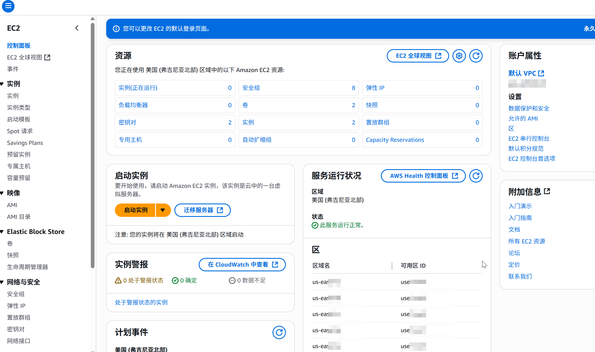

进入这个页面，我们就可以选各种各样的服务器的配置了：

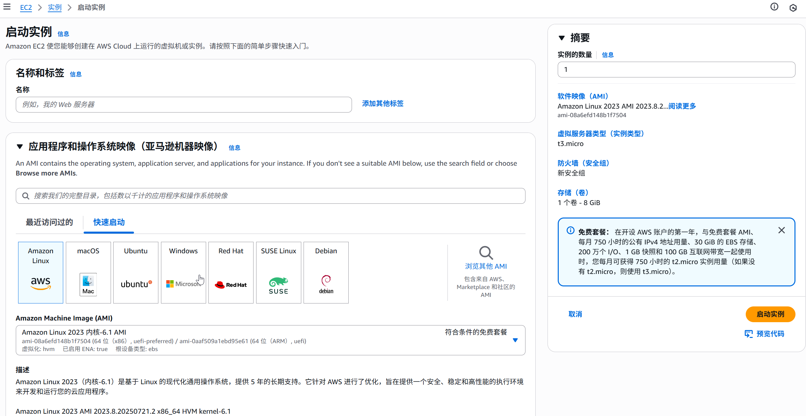

攻击利用：

与云相关的风险，大部分渗透的师傅都知道SSRF打metadata，但是什么情况下才能打呢？很简单，要关联IAM身份（role）也就是这个地方，服务器启动前必须要选一个role：

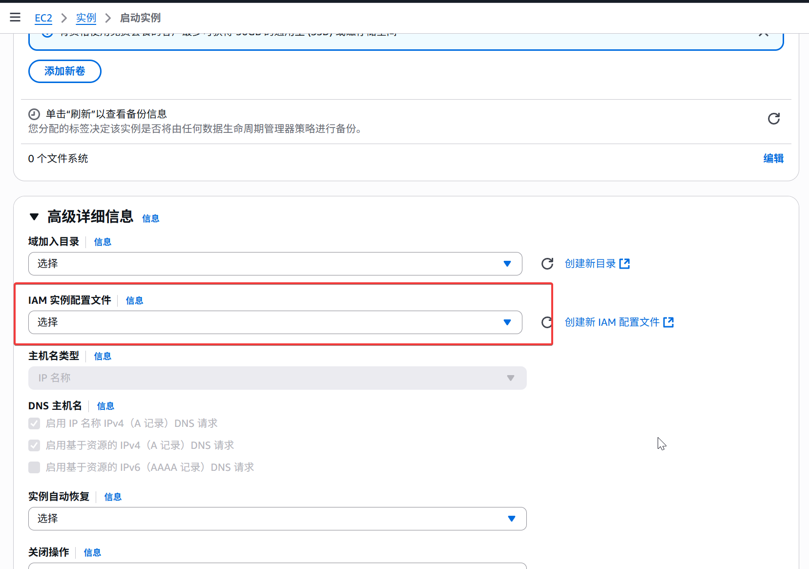

一般只有老的才有，看这个位置，V2就打不了，要V1才行：

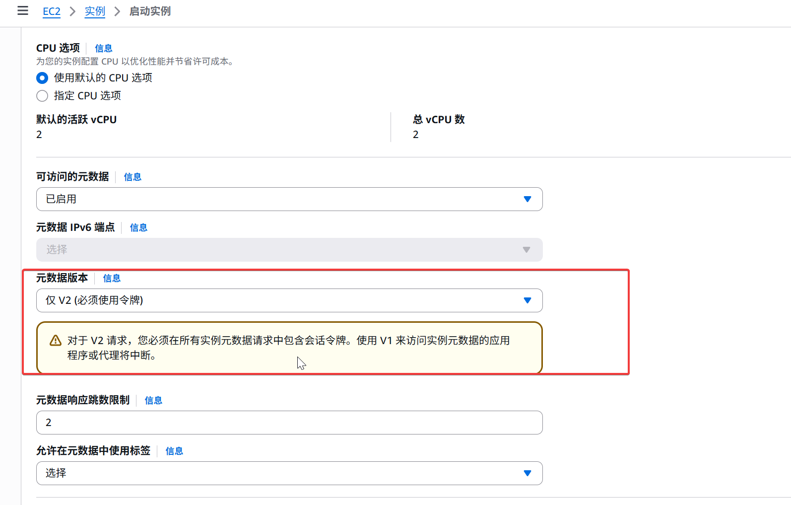

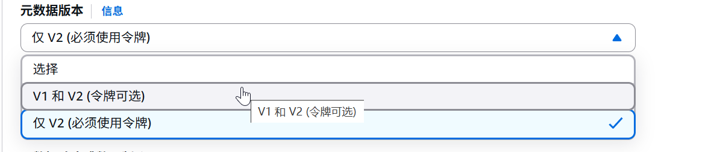

SSRF说实话，这部分是web相关的技术了，有些WAF会拦截特定的HTTP请求，编码绕过已经有很成熟的方案了，portswigger的[URL validation bypass cheat sheet](https://portswigger.net/web-security/ssrf/url-validation-bypass-cheat-sheet)推荐给师傅们，花点时间fuzzing一下，这个点绕99%的WAF应该没什么问题，反正我是没被拦住过：

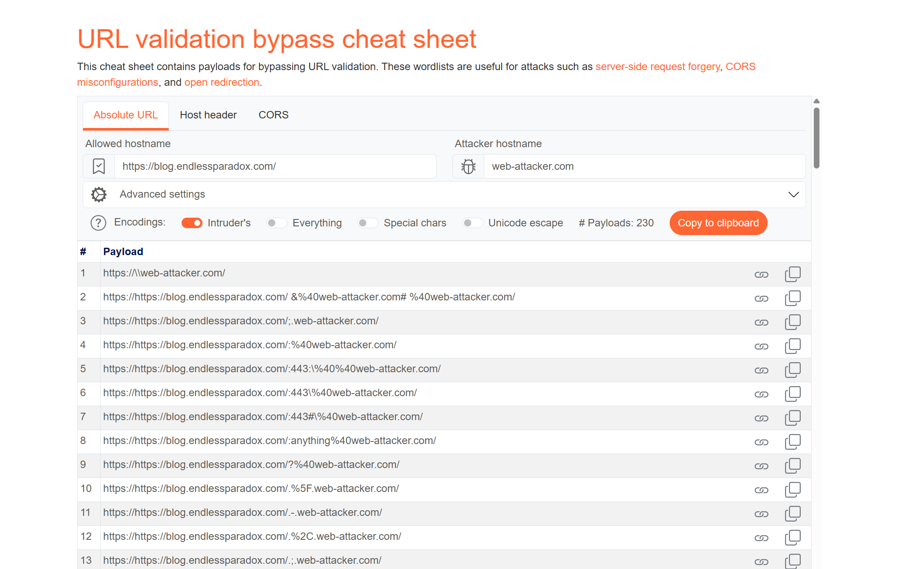

防御检测：

加固：AWS给出的缓解方法就是后续推出的IMDSv2，IMDSv2 版本让SSRF难以利用，需要先发出PUT请求，之后再用GET请求去获取id，几乎所有的SSRF无法控制请求方法，这就基本上消除了外部SSRF 0day打下metadata的风险，SSRF TO RCE这个点就断绝了；当然老的服务器还有，但只会越来越少。

检测：

为了覆盖到攻击者的攻击活动，防守方也提出了相对应的方法---SSRF虽然难以被WAF拦截，但是IAM 的临时凭据必须要先 SSRF --- >> IAM临时凭据 返回 ；IAM临时凭据的调用必定是发生在“外部”，只需要日志监控来自服务器非法的调用即可轻易检测到这类攻击活动，攻击者说实话真的没什么办法绕过这点，你已经SSRF拿到了，不去使用就几乎没有任何作用，但是一旦你本地计算环境（“对于服务器来说是外面”）使用这个凭据，就必定会被检测到。

以下是AWS官方的检测告警图：

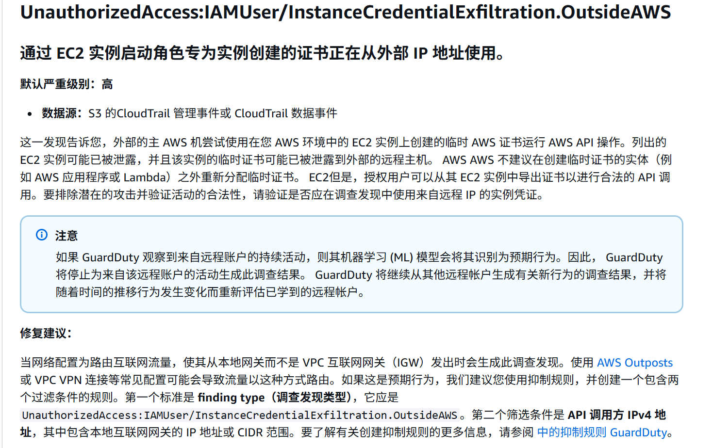

#### Lambda 服务

Lambda 服务是无服务计算的经典服务，更熟悉的叫法是云函数，我的印象云函数在社区一直很火，早年我21年底在绿盟实习的时候，那个时候带我的@飞哥和@彭哥当时就分享了@风起的利用云函数作为扫描的技巧------那个时候还能用，现在应该已经不太行了，不如直接氪金买代理池；回忆最近这几年，利用云函数作为合法域名上线C2的比较多，不过防守方现在也跟进了这部分。

我们简单认识一下AWS的Lambda服务：

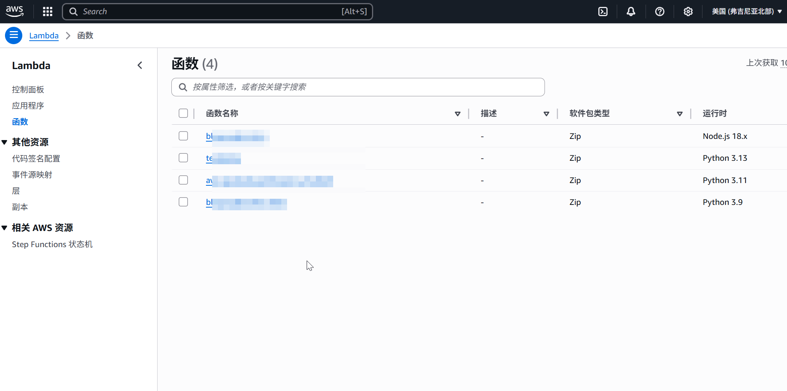

当我们创建Lambda函数的适合，注意到可以使用“执行角色”，也就是IAM身份认证来代表当前函数能执行的权限：

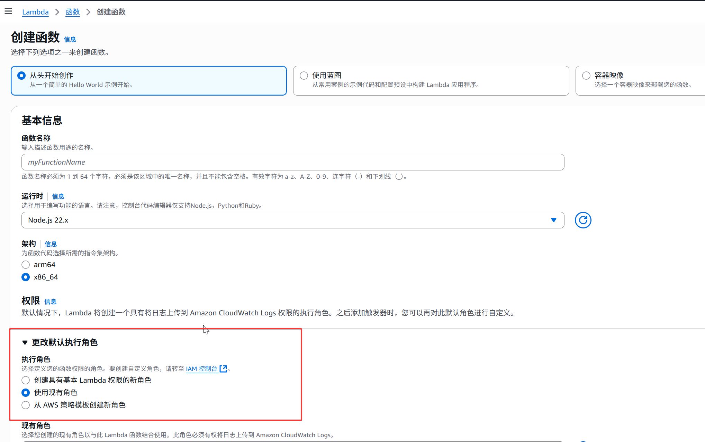

AWS Lambda 函数本质上是封装好的、可被自动触发执行的、运行在无服务器（serverless）架构下的函数计算服务。如果代码本身存在漏洞，也就会出现web层面的安全问题，进而进一步影响云内部安全；AWS Lambda 函数也可能会对接到CI/CD流程中，影响整个生产系统；这取决于它所属的位置，后续的Lambda攻防变化就看各方安全研究员的神仙打架了。

### 攻击模拟与评估

现在再让我介绍一下攻击模拟和评估工作：

1. 方案评估：评估当前安全方案或安全产品的覆盖率，业内最常见的做法是选择ATT&CK，ATT&CK提供了一个大致的参考框架，当方案设计覆盖的ATT&CK面越广，就代表安全产品越成熟，越能检测到整个攻击的杀伤链，甚至能联动状态狩猎未知威胁。
2. 攻击模拟：攻击模拟是整个评估工作的核心工作，需要我们搭建好相关的安全场景，然后再相关的场景中引爆相关攻击技术，最后收上攻击相关的IOC，在云中的话主要就是相关的审计日志了，其他的类似EDR也得根据情况因地制宜了,云的内卷对抗程度还比不上已经卷了多年的系统对砍。

综合来说，其实还有另一个说法是"紫队验证"（最近还炒作了新的概念，叫做“安全验证”或者是“BAS”；回顾看了一下，很多年前就在炒作概念，实际上真正懂红队或蓝队技术的又有多少人呢？同时精通两个领域的专家就更少了），我觉得炒作概念没有多大意义，不同的企业、行业情况不同，框架要落地到具体技术上才有实际意义，不然只能是空中阁楼，贻笑大方。

#### MITRE ATT&CK Cloud Matrix

参考云的[ATTCK](https://attack.mitre.org/matrices/enterprise/cloud/)，把云中的战术和过程分类总结，其实和传统的企业也没太大区别，也就是[Initial Access](https://attack.mitre.org/tactics/TA0001)，[Execution](https://attack.mitre.org/tactics/TA0002)等等这些东西，相信做过红队攻击，完成过类似红队演练和APT模拟的都会很熟悉整个流程：

​

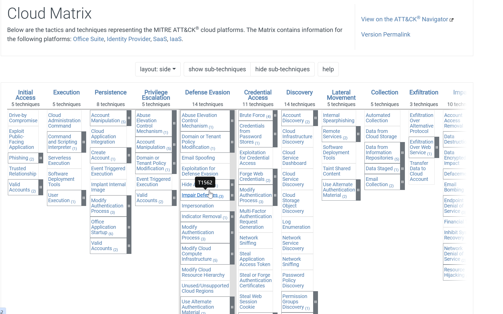

不一样的地方在于，云的正面攻破压力明显比传统企业的攻击面更小，可以看到就四种大类：

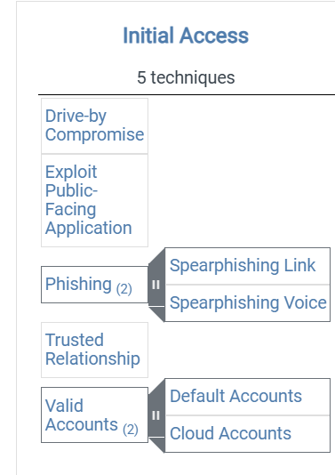

从Initial Access来看：Exploit Public-Facing Application得攻陷带有IAM身份的服务才能真正的进入云中，钓鱼Phishing 也得是搞到受害者账户，Valid Accounts搞来合法账户，综合来说，如果搞不到相关的账户，实际上对云基本无能为力了，你都没办法和云交互！~~当然对无视隔离能直接打穿整个云的神级黑客无效,听说大陆有不少这样的高手~~，我也想学呀。

而且即使搞到相关账户，纯云中环境不像企业网络，其实隔离已经相当受限了，就像之前谈过的那样。选好框架了之后我还需要一个自动化评估的工具，这可是12大战术！纯手工模拟攻击得累成狗了。

#### 紫队攻击模拟自动化工具

[stratus-red-team](https://github.com/DataDog/stratus-red-team) 工具提供了很好的自动化模拟条件，让我们的工作会轻松很多。

回想一下完成攻击模拟需要什么？

第一，我们需要准备好被攻击的资源；第二，我们需要准备攻击的工具或者手段；第三，执行攻击，在系统中“引爆”攻击；第四，我们收集到了相关的攻击日志，并且尝试关联已经触发的告警或者审计日志，尝试编写新的检测规则。最后再次重复这个过程，看看我们的规则是否如同预期触发。

这个工具做的就是前三步，准备相关资源，执行攻击。用起来也很简单，直接下载二进制文件即可，AWS CLI配置好相关的AWS密钥，这个工具会自动用那里面的密钥。本身使用非常方便：

如果想要查看当前的TTPS，可以使用

```
./stratus list
```

如果目前只想查看aws相关的战术，使用--platform aws 指定：

```
./stratus list --platform aws 
```

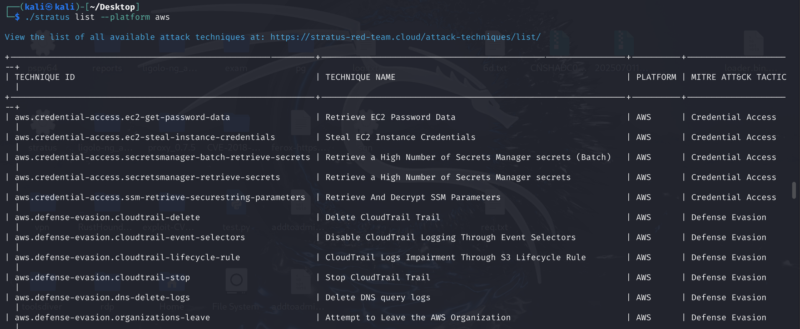

如果想要指定战术阶段，就--mitre-attack-tactic指定即可：

```
./stratus list --mitre-attack-tactic persistence
```

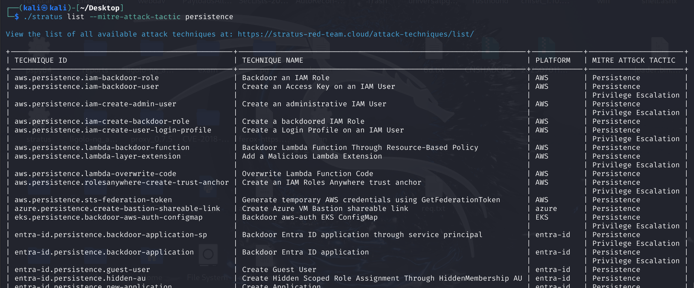

从TECHNIQUE ID选一个模拟攻击，第一步我们首先需要`warmup`，热身准备资源：

```
./stratus warmup aws.persistence.iam-backdoor-role
```

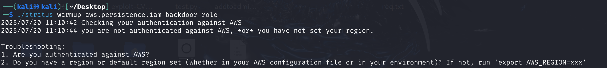

嗯，我忘记选区域了，加一下区域。再跑一下。

```
export AWS_REGION=us-east-1
```

再执行一下：

```
./stratus warmup aws.persistence.iam-backdoor-user
```

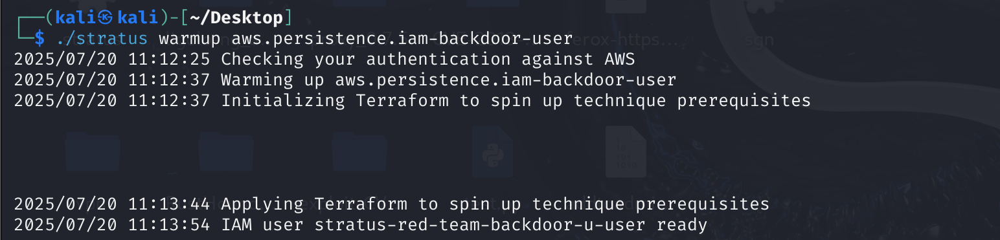

第二步，我们需要引爆攻击，让它产生相关日志:

```
./stratus detonate aws.persistence.iam-backdoor-user
```

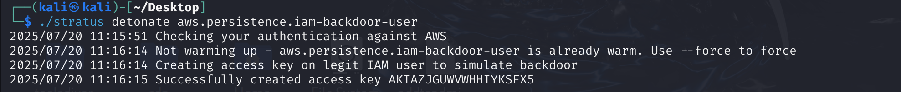

第三步，最后，我们想要保持干净，清除相关攻击准备的资源和攻击导致的资源：

```
./stratus cleanup  aws.persistence.iam-backdoor-user
```

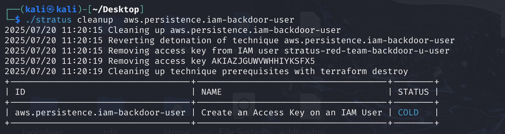

STATUS变成COLD，梳理一下总体的流程，就是官方下面的图片了：

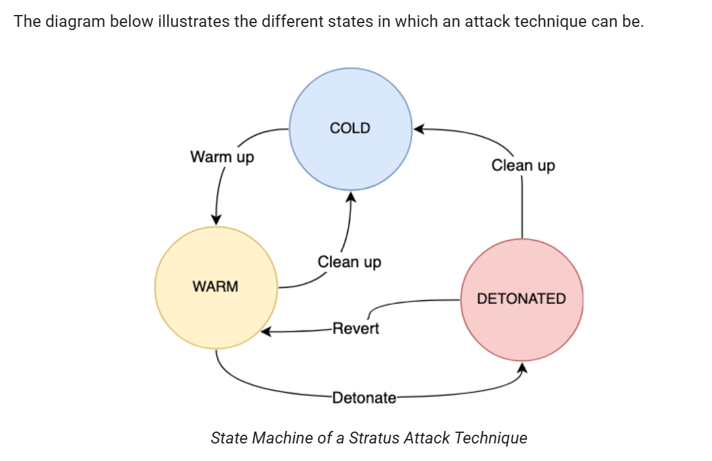

要完成威胁检测，接下来就是分析日志编写检测规则了；如果需要了解工具的更多功能，参考[官方文档](https://stratus-red-team.cloud/user-guide/getting-started/)学习一下了。现在我们不难发现，紫队这种检测工程需要对攻击技术有着深入的理解，不理解攻击的技术基本原理是无法产出防御规则的。

**防御技术的本质是源于对攻击技术的研究**

当然，即使我们具备技术基础，依然是一个严重的“体力活”，一方面要分析大量日志，从合法日志和非法日志中区分异常事件，另一方面一两个人无法掌握所有的攻击和防御技术的原理，必须要花费大量精力去调研和理解TTPs，相信即使是覆盖公开的TTPs都很困难，而且攻击和防御技术一直在进步演变，使得这类工作变的极度具备挑战力，这也是为什么绝大部分安全设备经常失效、被绕过的原因。

### 总结

通常来说一篇文章或是一本书是不可能概况到某个领域的所有知识的，但相信这篇文章作为一个起点已经足够入门AWS和云本身了。云安全依然是综合庞大的学科，需要持续不断的学习和研究，如果你有好的想法或问题，欢迎师傅加我微信交流技术：QWdlbnRfMDBzZXZlbg== （记得备注先知社区）

参考的资料和工具：

<https://docs.aws.amazon.com/zh_cn/IAM/latest/UserGuide/introduction.html>  
<https://attack.mitre.org/matrices/enterprise/cloud/>  
<https://hackingthe.cloud/aws/>  
<https://www.youtube.com/watch?v=oL2JnblVzmA>  
<https://github.com/DataDog/stratus-red-team>  
<https://stratus-red-team.cloud/user-guide/getting-started/>  
<https://www.wiz.io/blog/detecting-behavioral-cloud-indicators-of-compromise-iocs#introduction-0>  
<https://rhinosecuritylabs.com/aws/aws-privilege-escalation-methods-mitigation/>  
<https://bishopfox.com/blog/privilege-escalation-in-aws>  
<https://github.com/elastic/detection-rules/>  
<https://swisskyrepo.github.io/InternalAllTheThings/cloud/aws/>  
<https://aws.amazon.com/cn/about-aws/whats-new/2024/11/amazon-s3-up-1-million-buckets-per-aws-account/>  
<https://labs.watchtowr.com/8-million-requests-later-we-made-the-solarwinds-supply-chain-attack-look-amateur/>  
<https://portswigger.net/web-security/ssrf/url-validation-bypass-cheat-sheet>
