# Cobalt Strike Beacon重构之Bof功能开发-先知社区

> **来源**: https://xz.aliyun.com/news/18582  
> **文章ID**: 18582

---

# 0x01.前言

笔者在重构Cobalt Strike的Beacon，开发inline-execute功能时，发现涉及到Coff文件格式，不同重定位类型的修复方式，Cobalt Strike客户端对Coff的处理等等。理解这些概念并应用比较困难，这篇文章将从Bof介绍到Bof开发，再到Coff文件​格式解析，详细说明不同重定位类型的不同修复方式，然后分析Cobalt Strike 4.4中对Coff文件的处理，最后到Beacon inline-execute的实现，相信读者看完后，会对开发自己的C2 Bof有更深刻的理解。

# 0x02.Bof介绍

Bof简单的来说就是一个Coff文件，即是一个编译了还未链接的文件，正常的一个C或C plus文件的转化为可执行文件的过程如下。Cobalt Strike的inline-execute就可以将这样的文件加载到Beacon内存，进行一些修复工作后，然后到入口点执行，这样增加了执行一些功能时的OPSEC，可以避免执行像shell这样的高危指令，同时也为红队测试人员带来了可扩展性，可以自己编写特定功能的Bof文件达到想要的目的。

# image-20250730164417376.png 0x03.Bof开发

官方的一个Demo如下：

```
#include <windows.h>
#include "beacon.h"
void go(char * args, int alen) {
    BeaconPrintf(CALLBACK_OUTPUT, "Hello World: %s", args);
}
```

可以使用Visual Studio或者MinGW进行编译，生成.obj文件。

```
cl.exe /c /GS- main.c /Fo main.obj
i686-w64-mingw32-gcc -c main.c -o main.o
x86_64-w64-mingw32-gcc -c main.c -o main.o
```

使用PEview等工具可以查看Coff格式的obj。

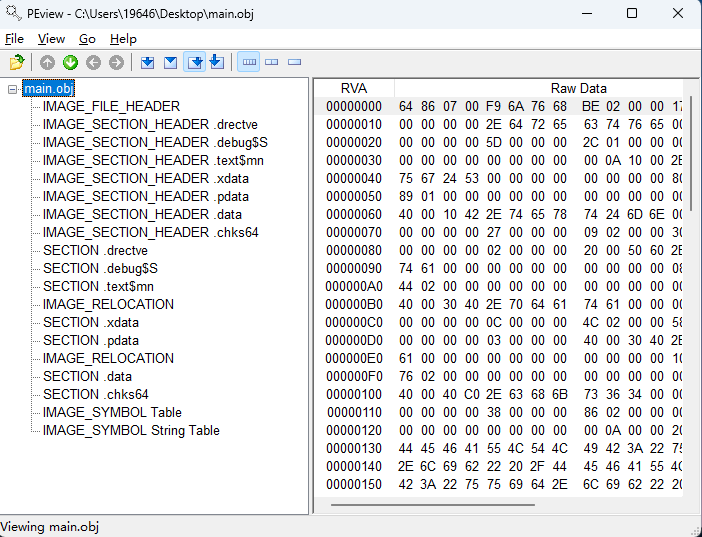

在.text段存在编译完成的代码。

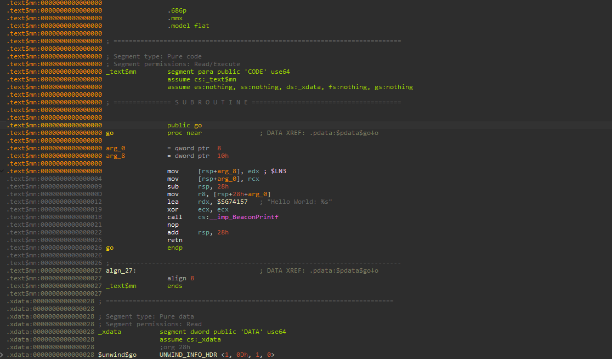

Cobalt Strike使用inline-execute命令执行bof文件。

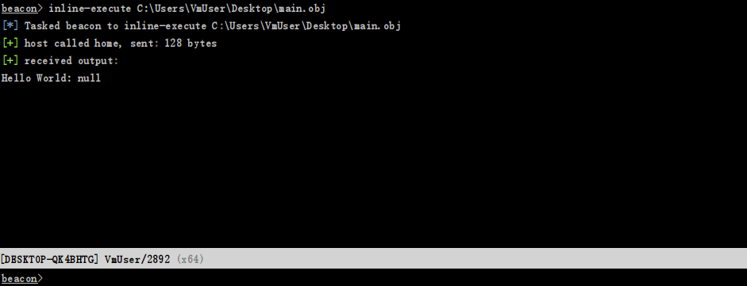

开发bof的模板可以参考下面的两个项目：

<https://github.com/securifybv/Visual-Studio-BOF-template>

<https://github.com/evilashz/Visual-Studio-BOF-template>

# 0x04.Beacon中的内部API

在Beacon内部存在着BOF可调用的一系列内部API，在解析内部函数的地址时直接以函数数组的形式去计算内部地址，这相当于我们链接Coff时的 "IAT"表。

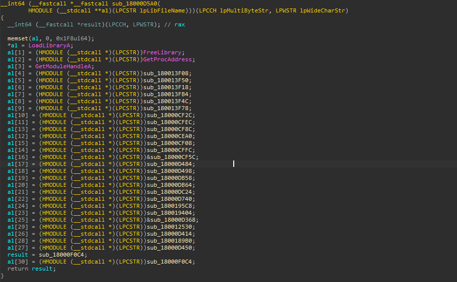

在Beacon源码可能就是这样的：  
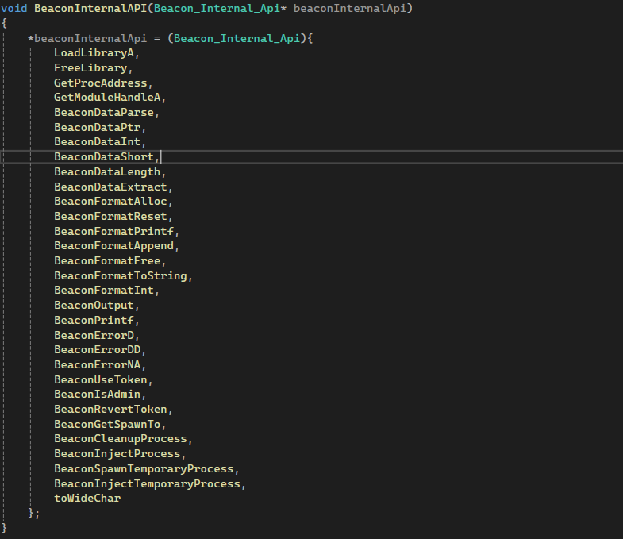

其中的API可以分为以下几类：

1.Win32 API-主要用于函数动态解析，如上图开头所示：LoadLibraryA、FreeLibrary、GetProcAddress、GetModuleHandleA。

例如，以下demo的功能是查找当前域，需要使用两个API函数DsGetDcNameA，NetApiBufferFree都是由NETAPI32模块进行导出。

* DECLSPEC\_IMPORT：导入函数的关键字
* WINAPI：函数调用约定，一般API函数都是这个
* NETAPI32：函数所在的模块名
* DsGetDcNameA/NetApiBufferFree：函数名称

```
#include <windows.h> 
#include <stdio.h> 
#include <dsgetdc.h> 
#include "beacon.h" 
DECLSPEC_IMPORT DWORD WINAPI NETAPI32$DsGetDcNameA(LPVOID, LPVOID, LPVOID, LPVOID, ULONG, LPVOID); 
DECLSPEC_IMPORT DWORD WINAPI NETAPI32$NetApiBufferFree(LPVOID); 
void go(char* args, int alen) { 
    DWORD dwRet; 
    PDOMAIN_CONTROLLER_INFO pdcInfo;
    dwRet = NETAPI32$DsGetDcNameA(NULL, NULL, NULL, NULL, 0, &pdcInfo); 
    if (ERROR_SUCCESS == dwRet) { 
        BeaconPrintf(CALLBACK_OUTPUT, "%s", pdcInfo->DomainName); 
    } 
    NETAPI32$NetApiBufferFree(pdcInfo); 
}
```

使用上面的格式声明外部函数，主要是为了产生固定格式即\_\_imp\_NETAPI32$DsGetDcNameA（x64），这样我们可以在CoffLoader进行解析，通过LoadLibrary、GetProcAddress、GetModuleHandleA来获取这些外部函数的地址。在Beacon中实现时，Cobalt Strike客户端会先处理我们传入的Coff文件，然后给Beacon一个标识符，表明这是否是一个函数地址，是内部的还是外部的。这块在第0x06节中在详细解释。如下是CoffLoader中常见的处理：

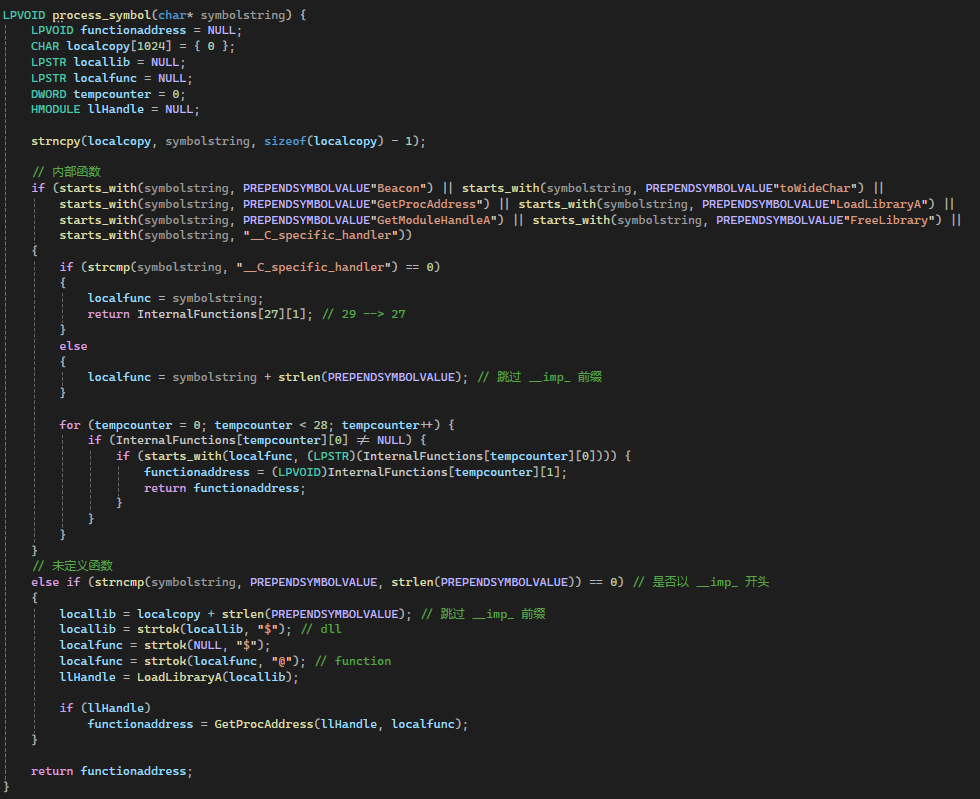

2.数据解析API：用于从bof\_pack打包的数据中提取函数参数：BeaconDataParse、BeaconDataPtr等。

3.内容格式化API：辅助构造大型或重复性的输出：BeaconFormatAlloc、BeaconFormatReset等。

4.打印输出API：将结果返回CobaltStrike控制端BeaconOutput、BeaconPrintf等。

5.Beacon内部API：功能性API，例如token操作、派生进程、进程注入，包括BeaconUseToken、BeaconRevertToken、BeaconSpawnTemporaryProcess等。

6.辅助性API：toWideChar等。

2-6中的API都是BOF中的内部API，我们可以直接调用，CoffLoader或者Beacon中会实现这些函数。我们在写bof时，只需要包含Cobalt Strike官方提供的beacon.h就行。

# 0x05.Coff文件

大体结构如下：

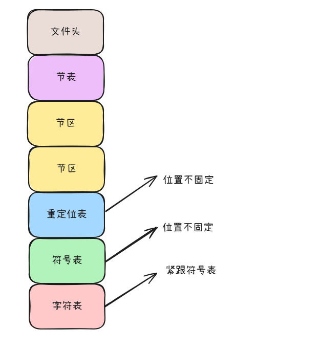

下面这些结构可以在winnt.h中看到相关定义，也可以在msdn上查看 <https://learn.microsoft.com/en-us/windows/win32/api/winnt/> 。

## 文件头

```
typedef struct _IMAGE_FILE_HEADER {
    WORD    Machine;
    WORD    NumberOfSections;
    DWORD   TimeDateStamp;
    DWORD   PointerToSymbolTable;
    DWORD   NumberOfSymbols;
    WORD    SizeOfOptionalHeader;
    WORD    Characteristics;
} IMAGE_FILE_HEADER, *PIMAGE_FILE_HEADER;
```

* Machine：文件的目标机器类型，例如0x14C代表x86，而0x8664代表x64
* NumberOfSections：节区的个数
* TimeDateStamp：时间戳
* PointerToSymbolTable：指向符号表
* NumberOfSymbols：符号个数

如下是上面打印Hello World的obj文件的Coff文件格式的文件头，010 editor中存在查看Coff文件的模板。

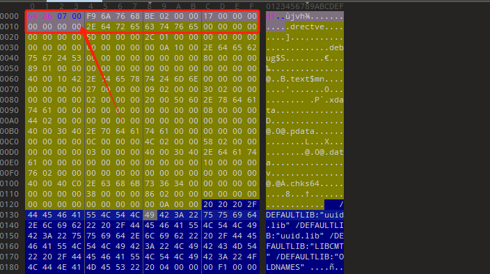

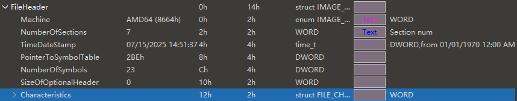

## 节表

```
typedef struct _IMAGE_SECTION_HEADER {
    BYTE    Name[IMAGE_SIZEOF_SHORT_NAME];
    union {
            DWORD   PhysicalAddress;
            DWORD   VirtualSize;
    } Misc;
    DWORD   VirtualAddress;
    DWORD   SizeOfRawData;
    DWORD   PointerToRawData;
    DWORD   PointerToRelocations;
    DWORD   PointerToLinenumbers;
    WORD    NumberOfRelocations;
    WORD    NumberOfLinenumbers;
    DWORD   Characteristics;
} IMAGE_SECTION_HEADER, *PIMAGE_SECTION_HEADER;
```

* Name: 节的名字，比如.text
* Misc：这个字段在Coff文件中设置为0
* VirtualAddress：这个字段在Coff文件中设置为0
* SizeOfRawData：节在文件中的大小
* PointerToRawData：该段的数据在文件中的位置，如果该段中仅包含未初始化数据，这个值为0，例如.bss段
* PointerToRelocations：指向节重定位条目开头的文件指针。
* PointerToLinenumbers：指向节行号条目开头的文件指针。
* NumberOfRelocations：节的重定位条目数。
* NumberOfLinenumbers：节的行号条目数。
* Characteristics：节的属性，参考 <https://learn.microsoft.com/zh-cn/windows/win32/api/winnt/ns-winnt-image_section_header>

节区名字占用8个字节（UTF-8编码），这个是可以占满8个字节的，没有所谓的00结尾，如果占不满8个字节，后面的用00填充，如果超过8个字节，该位置存储的就是一个offset偏移。表示在字符表的偏移几的位置开始是这个区段的名称，一直到00结束。

定位字符表可以通过文件头，文件头中的PointerToSymbolTable指向符号表，NumberOfSymbols指向符号数，因为字符表紧跟符号表，所以字符表位置就是

\*PointerToSymbolTable + 18 \* (\*NumberOfSymbols) ，乘以18是因为每个符号表结构为18字节。

比如在上面的文件头结构中，字符表的位置 2BEh + 23 \* 18 = 45Ch。

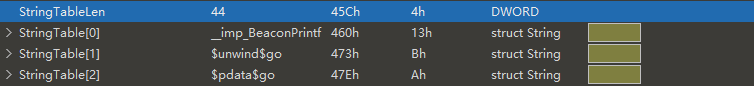

## 节区

可以直接根据节表中的PointerToRawData和SizeOfRawData来定位对应的节区。

## 重定位表

在Coff文件中，当某个地方使用了一个符号（比如MyFunction或MyGlobalVar），编译器并不会立即把这个符号的绝对地址写进去。 而是会在那个位置填入一个临时值（通常是相对偏移、0、或者是一个符号的偏移值），并记录一个重定位项，告诉链接器或加载器到时候把这里的值更新为符号的真实地址。

重定位表结构有三个字段构成共计10个字节。

```
typedef struct _IMAGE_RELOCATION {
  	DWORD VirtualAddress;
    DWORD SymbolTableIndex;
    WORD Type;
} IMAGE_RELOCATION;
```

* VirtualAddres：进行重定位的地址偏移（相对于当前节的基址）
* SymbolTableIndex：指向符号表中的索引，用于指定重定位的目标符号
* Type：重定位类型，决定了重定位的值如何计算，此字段非常重要，参考 <https://learn.microsoft.com/en-us/windows/win32/debug/pe-format#coff-relocations-object-only>

如下是x64架构上的Type类型：

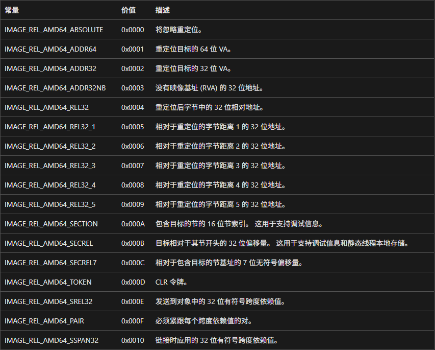

如下是在x86架构上的Type类型：

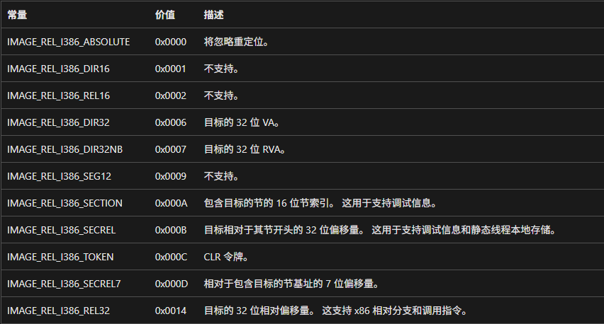

常见的重定位类型包括：

IMAGE\_REL\_AMD64\_ADDR64：表示绝对地址重定位，在重定位时就需要在需要重定位的位置上（64位）写上符号的地址。

IMAGE\_REL\_AMD64\_ADDR32：表示绝对地址重定位，在重定位时就需要在需要重定位的位置上（32位）写上符号的地址。

IMAGE\_REL\_AMD64\_ADDR32NB：表示相对地址重定位，这个相对地址是指目标符号与镜像基址的相对地址。

IMAGE\_REL\_AMD64\_REL32：表示相对地址重定位，这个相对地址是指需要重定位的位置的这条指令结束后的地址与目标符号的相对地址。在重定位时就需要在需要重定位的位置上（32位）写上符号地址减去需要重定位的地址，在减去4字节（需要重定位值的大小）。在此Type类型中后面就不需要在减去值了，表明需要重定位的地方的下一条指令地址刚好在SectionAddress + VitrualAddress，但在一些Type类型中还需要减去一定的偏移值。为什么会出现这样的情况？这是因为有些情况下，真实的需要重定位地方的下一条指令地址，可能在SectionAddress + VitrualAddress此位置偏移1或者2等字节的位置，例如某些操作的操作数不一定就是需要重定位的地方结束，很可能在此之后还存在操作数等一些东西，影响偏移计算的起始点。这时候在重定位时，就必须减去这些多出的字节数，才能正确拿到下一条指令的地址。

IMAGE\_REL\_AMD64\_REL32\_1：多偏移一个字节。

IMAGE\_REL\_AMD64\_REL32\_1：多偏移两个字节。

后续的字段见上表。在写CoffLoader的时候就要遍历这些Type类型。计算重定位值。

在真正重定位时，如果只关注的x64的话，只需要关注值为1-9的Type类型。

在编译后，obj文件的.text段中可以看到存在一些符号，需要链接器填充。

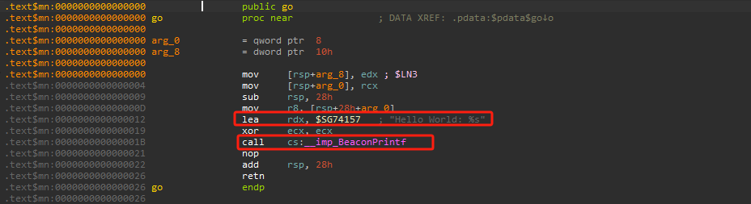

在重定位表中可以看到重定位信息。

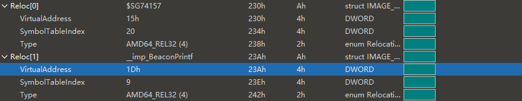  
 这里15h指的是相对与当前节即.text$mn，指向需要重定位的地方，即此处的$SG74157。

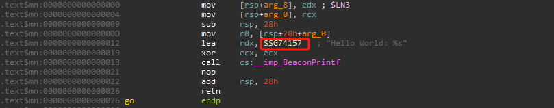

20是指符号表中的索引，对应于此位置的符号。在链接时，链接器会查找符号表中索引为20的符号，以确定实际地址。

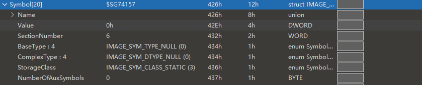

Type为4表示重定位类型（IMAGE\_REL\_AMD64\_REL32），决定了重定位的值如何计算，这里就是相对地址重定位，并且没有额外的偏移。

在重定位时，在15h处就要写入相对偏移，根据符号表可以得到此符号地址为40h，如果加载到内存中还是这样的结构，那么就需要在此需要重定位的地址填上40h - 15h - 4h = 27h偏移值。

在IDA显示的操作码，已经填写了原始偏移值，但我使用Visual Studio 2022调试时和010 editor查看发现这个4字节的位置都是00 00 00 00，可能IDA根据符号表或重定位信息推断了正确的偏移量。这个并不影响我们后面编写CoffLoader，或者在重构Beacon中实现inline-execute功能。

所以相对偏移修正的方法就是：相对偏移值 = 目标符号的实际地址 - 重定位指令的实际地址。绝对偏移就很简单了，直接就是重定位指令的实际地址。

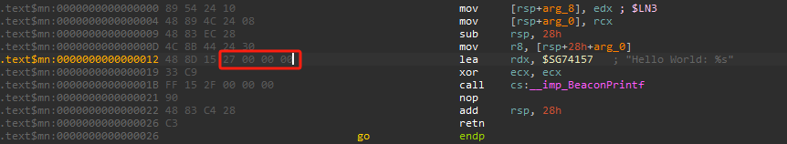

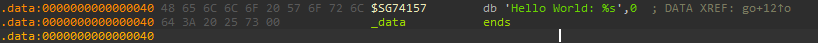

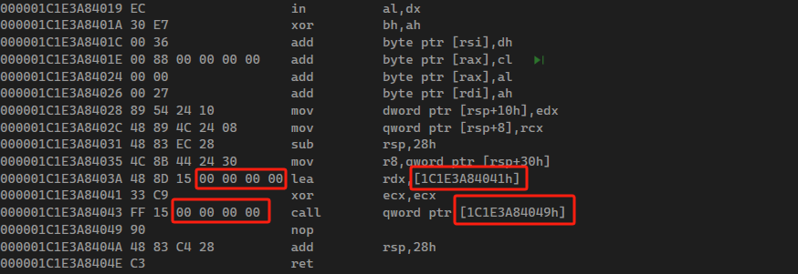

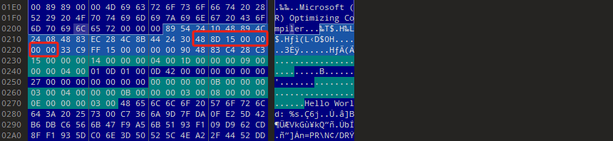

## 符号表

```
typedef struct _IMAGE_SYMBOL_TABLE {
  union {
    BYTE ShortName[8];
    struct {
      DWORD Short;
	  DWORD Long;
    } LongName;
  } Name;
  DWORD Value;
  SHORT SectionNumber;
  WORD Type;
  BYTE StorageClass;
  BYTE NumberOfAuxSymbols;
} IMAGE_SYMBOL;
```

* union：当符号名不超过8个字节时，用ShortName，当超过8个字节时，前4个字节被设置为0，后4个字节是在字符表中的偏移量

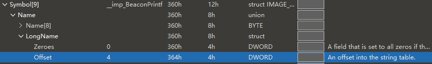

查看字符表可以获取到符号名。

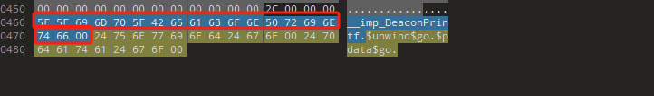​

* Value：此字段的解释取决于SectionNumber和StorageClass。这个字段就是告诉你符号在所属节区中的偏移
* SectionNumber：如果>0则表示该符号在第几个节中，否则有特殊含义。例如，为1则代表符号在第一个的节区中，这个顺序就是节区中的顺序。当不为正数时，就下图的情况：

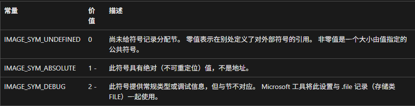

* Type：符号类型，一般是0x0（非函数类型）和0x20（函数类型）
* StorageClass：表示存储类，有很多取值，通常取值有EXTERNAL（2）, STATIC（3）, LABEL（6）。此值决定了Value的作用，如下表格：

|  |  |
| --- | --- |
| **StorageClass** | **Value** |
| EXTERNAL（2） | 如果SectionNumber不为零，则Value表示符号节内的偏移量。 如果SectionNumber为零，则Value表示大小。 |
| STATIC（3） | Value表示符号节内的偏移量。 如果Value为零，则符号表示节名称。 |
| LABEL（6） | Value表示符号节内的偏移量。 |

更多信息参考 <https://learn.microsoft.com/zh-cn/windows/win32/debug/pe-format#storage-class> 。

* NumberOfAuxSymbols：是否需要辅助符号，1表示需要，0表示不需要，辅助符号紧跟标准符号，同样是18字节。例如下面这个符号表最后一个字段为01，表示后面18个字节为辅助符号，辅组符号的结构在文档中记录了5种，具体使用那种辅组格式，是根据标准符号中一些字段值来确定的。这个字段对于我们来说并不重要。

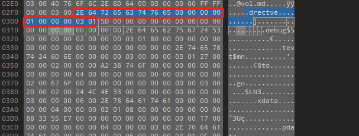

CoffLoader中在修复重定位的过程时，需要通过SectionNumber和Value来查找符号地址，SectionNumber大于0时，标识了符号在哪一个节（SectionNumber - 1），Value标识了符号相对于此节的偏移，这是一个相对偏移。

当SectionNumber为-1时，Value是一个绝对偏移，对我们修复重定位并不重要，可以跳过，其实我们可以只用关注SectionNumber > 0的情况。此时根据StorageClass的值来判断Value是否是节内偏移，当SectionNumber大于0时，只有三个StorageClass表示Value是节内偏移。

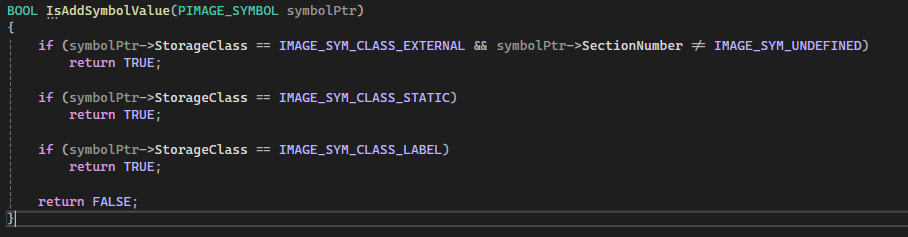

但其实不用判断StorageClass的值，只要SectionNumber大于0，每次修复重定位的值，我都可以加上Value。不难看出在这种情况下，当StorageClass不为上面三种类型时，Value字段值为0，相加不会影响。Beacon在实现时每次就会加上Value字段。

下图是Cobalt Strike 4.4中beacon.bin进行重定位的关键函数，重命名的offsetInSection就是Cobalt Strike客户端解析出来的Value字段。

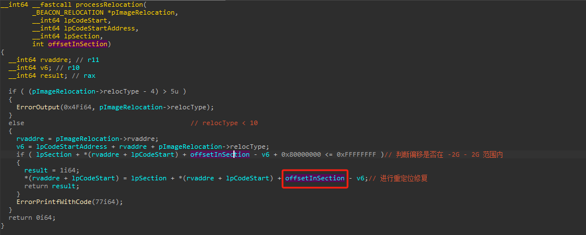

# 0x06.Cobalt Strike客户端中的处理

github上一些开源的CoffLoader是否可以用于我们的Beacon开发了？答案是不可以，因为Cobalt Strike实现时，它没有把整个过程交给Beacon去做，这样的好处减小了体积以及特征。如果需要保持Cobalt Strike客户端的同时，去开发Beacon，就需要我们先去分析下客户端做了什么处理，Beacon中还需要做什么。

Coff文件内容会传入客户端的PostExInlineObject#go函数，然后调用OBJExecutable#parse对Coff文件进行解析，然后构造数据包，依次放入命令号、obj入口函数（go）、.text段数据长度+内容、.rdata段数据长度+内容、.data段数据长度+内容，OBJExecutable#getRelocation返回的重定位信息、入口函数参数。着重看一下getRelocation函数，看看重定位相关信息的结构。

上面这些区段内容发送给beacon端的格式就是：Length（4 Bytes）|| Content（Length Bytes）。

着重看一下getRelocation函数，看看重定位相关信息的结构。

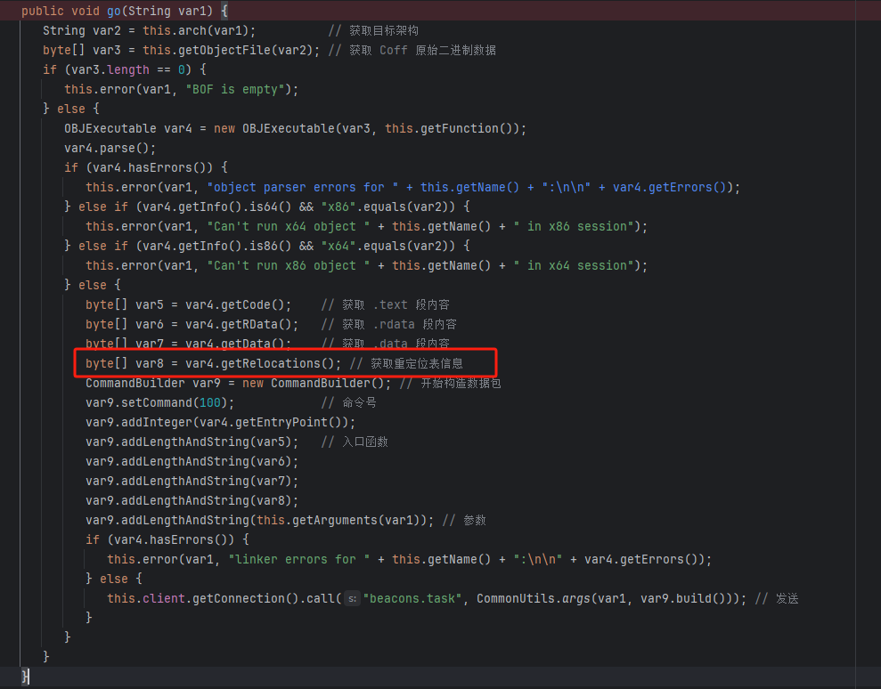

此函数中开始遍历重定位表，将这些重定位信息放入一个特定的结构。对于每一条重定位信息都会有一个Type来表示，比如1024表示此重定位的位置在.rdata区段中，1027表示重定位的位置对应一个外部函数，1028标识符表示结束。

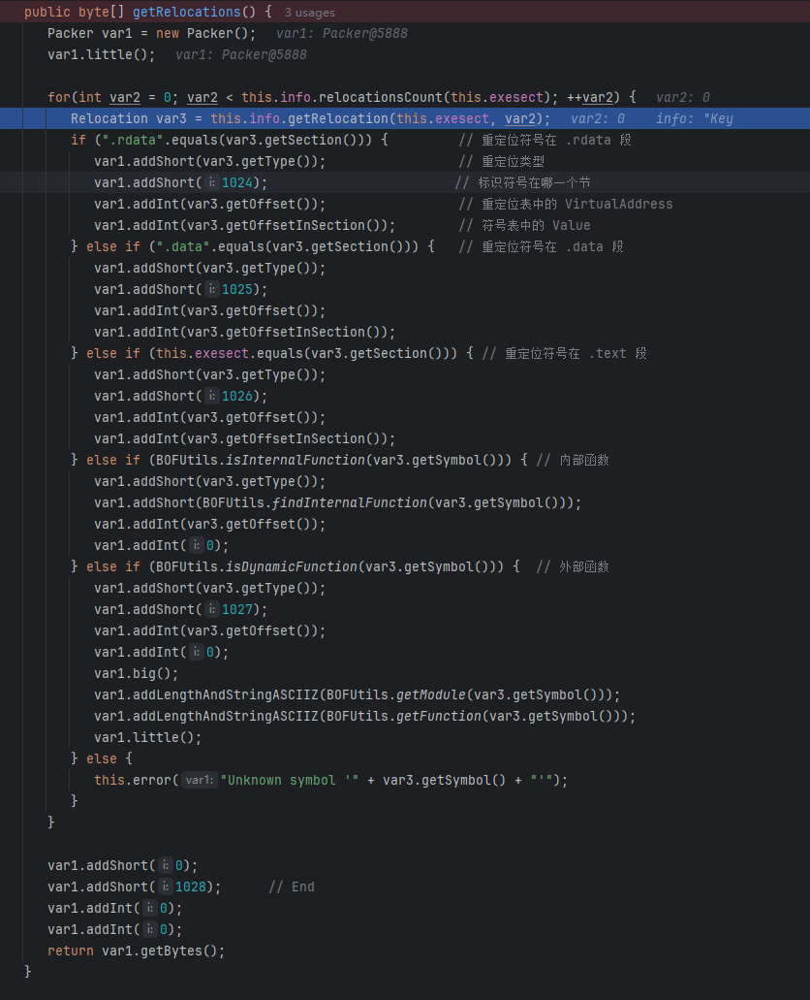

显然我们需要在Beacon中定义一个结构体，代表上面Cobalt Strike客户端解析的结果。下面定义的宏代表当前重定位符号位于哪一个节中或者代表内部或外部函数，即结构体中的联合体字段表示的意思。第一个relocType字段表示重定位类型即Type字段，第三个字段rvaddre表示重定位表中的VirtaulAddres字段，第四个字段表示符号表中的value字段。

```
#define RDATA_RELOC_TYPE 1024
#define DATA_RELOC_TYPE 1025
#define EXE_RELOC_TYPE 1026
#define DYNAMIC_FUNC_RELOC_TYPE 1027
#define END_RELOC_TYPE 1028

typedef struct _BEACON_RELOCATION {
	unsigned short relocType;
	union {
		short secType;
		short funcType;
	} beaconRelocType;
	long rvaddre;
	unsigned long value;
} BEACON_RELOCATION, * PBEACON_RELOCATION;
```

解析数据包内容代码如下，使用到Beacon内部数据解析API：BeaconDataParse、BeaconDataInt、BeaconDataLengthAndString，关于这些函数实现，可以参考一些开源CoffLoader中的实现，例如我在实现时参考了 <https://github.com/trustedsec/COFFLoader/blob/main/beacon_compatibility.c> 。最后分配了一段内存用于后续存放修复完成的代码段，可以分配的RW，后续修改为RWX，更加OPSEC，Beacon中也是这样处理的。

```
/* data API - unpacks data */
typedef struct {
	char* original; /* the original buffer [so we can free it] */
	char* buffer;   /* current pointer into our buffer */
	int    length;   /* remaining length of data */
	int    size;     /* total size of this buffer */
} datap;

typedef struct
{
	char* buffer;
	int size;
} sizedbuf;

// beacon 内部 API
Beacon_Internal_Api* api = malloc(sizeof(Beacon_Internal_Api));
if (!api) {
	fprintf(stderr, "malloc memory failed
");
	return;
}
BeaconInternalAPI(api);

datap parse;
BeaconDataParse(&parse, commandBuf, *commandBuflen);
int entryPoint = BeaconDataInt(&parse);

// 解析入口函数
datap parse;
BeaconDataParse(&parse, commandBuf, *commandBuflen);
int entryPoint = BeaconDataInt(&parse);

// 代码段
sizedbuf codeBuf;
char* code = BeaconDataLengthAndString(&parse, &codeBuf);
int codeLength = codeBuf.size;

// .rdata
sizedbuf rdataBuf;
char* rdata = BeaconDataLengthAndString(&parse, &rdataBuf);

// .data
sizedbuf dataBuf;
char* data = BeaconDataLengthAndString(&parse, &dataBuf);

// Beacon 自定义的重定位结构
sizedbuf relocationsBuf;
char* relocations = BeaconDataLengthAndString(&parse, &relocationsBuf);

// 入口函数参数
sizedbuf bytesBuf;
char* bytes = BeaconDataLengthAndString(&parse, &bytesBuf);
```

上面的内容对应beacon.bin中就是实现如下，这里仅关注x64架构上的实现。

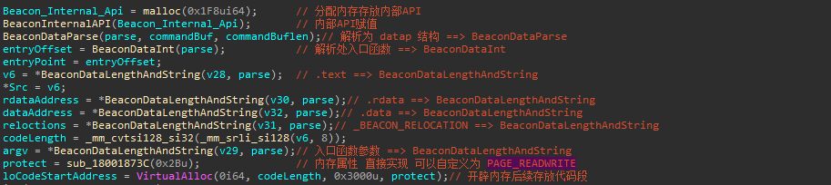

然后开始处理解析出来的relocations。依次处理重定位信息，代码大致就如下了，逆向后这里的伪代码和源代码差不多了，源代码就不贴了。着重看其中的处理重定位的函数processRelocation，还有FindOrAddDynamicFunction函数。

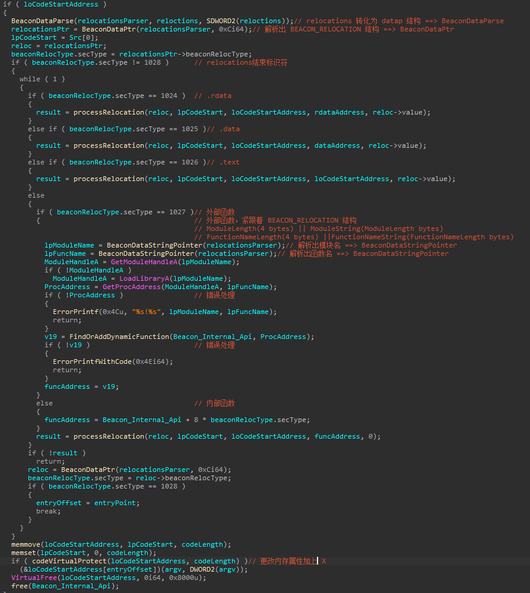

processRelocation函数用于处理重定位，逆向后的代码和源代码也差不多了。这里唯一比较疑惑的点是，为什么计算符号地址时加上了原始偏移值，前面说过在010 editor或者调试时都会发现原始偏移值为0，而且Value字段不就代表了在符号中的偏移吗？基本上一些说明Coff文件格式的文章都会将Value字段这样定义，这样定义也没错，但其实在某些情况下这个偏移还可能存在\*(DWORD\*)(lpCodeStart + rvaddre)即原始偏移值，并且猜测这两个值不会同时为0，一个值为0时，另一个值不为0，所以Beacon就这样处理了，将这两个值都加上了。

还有一个点是，Beacon中处理的都是相对地址重定位，IMAGE\_REL\_AMD64\_ADDR64、IMAGE\_REL\_AMD64\_ADDR32、IMAGE\_REL\_AMD64\_ADDR32NB这三个重定位类型都没有涉及到。关于这里为什么Beacon没有处理这些重定位类型，笔者有点不太明白，也没有去分析高版本Cobalt Strike中Beacon有没有实现，但这几种重定位类型罕见，只处理相对地址重定位也可以正常运行几乎所有的Bof文件了。

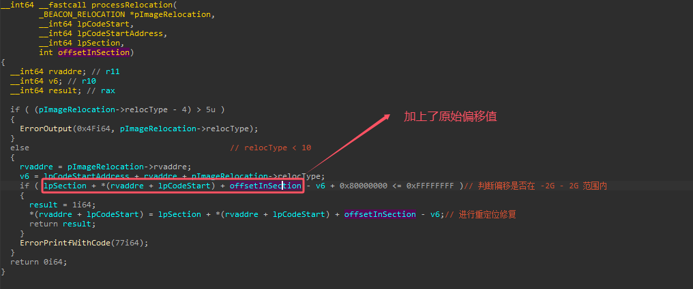

在Cobalt Strike 4.4中一共存在32个内部函数，最后一个元素是一个存放加载外部函数地址的数组PROC dynamicFns[MAX\_DYNAMIC\_FUNCTIONS]，大小也为32，这个函数的作用就是查找或者添加已经加载的外部函数，避免重复加载，逆向后的代码和源代码基本一致了。

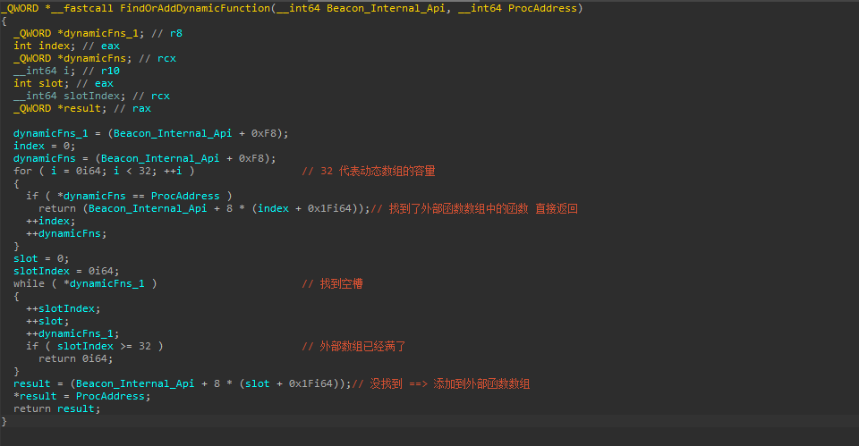

实现这些代码后，其中有一些错误输出函数，比如笔者重命名的为ErrorPrintf等等，其实是Beacon中的内部函数，真正的名字叫BeaconErrorD等等，我们并不用关心它是如何实现，笔者实现的时候一律使用fprintf(stderr, ....)处理，重构的Beacon就可以实现inline-execute功能了，如下：

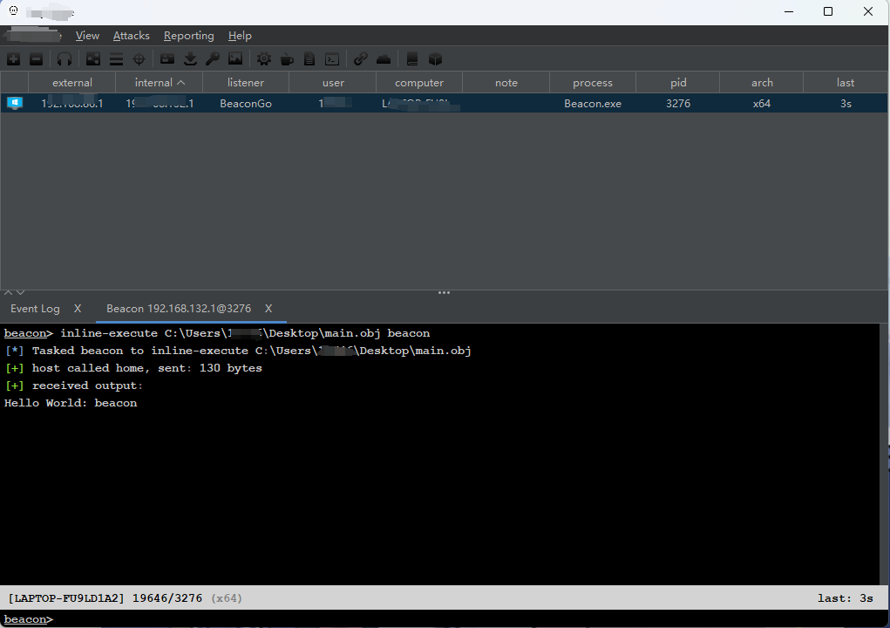

# 0x07.相关问题

通过上面的分析，其实可以看出一些Bof在加载过程中的问题，如下：

* 不能使用未初始化的全局变量

原因是Cobalt Strike 4.4客户端中并没有处理.bss段，.data段放初始化后的全局变量，.bss放未初始化或初始化为0的全局变量。

* 调用一些Windows API崩溃

原因是堆的问题，Windows上有多个堆，当调用某些API例如NetServerEnum，此函数可能会期望这块内存在主进程堆上，如果在Bof中通过malloc或 MinGW内部的HeapAlloc分配了一块内存，然后将这块内存传给此函数，就会引发崩溃。正确的做法是使用如下代码分配堆内存：

```
LPVOID p = HeapAlloc(GetProcessHeap(), HEAP_ZERO_MEMORY, size);
```

释放堆内存使用：

```
HeapFree(GetProcessHeap(), 0, p);
```

* 堆栈扩展问题

通常进程栈会预留一大块内存，但实际提交（分配）的内存要小得多，如果某个函数需要的栈空间超过了当前可用的栈空间，它会调用一个辅助函数，该函数会触及一个保护页面（guard page），通知操作系统需要提交更多栈内存。但需要的辅助函数 \_chkstk\_ms在Bof中并未链接，如果Bof函数中使用大量栈空间（>4KB）就会引发崩溃。

* 大型switch语句崩溃

Bof只适合处理小型的switch语句，如果是大型switch，改用if/else。

* x64下全局变量可能出现错误

编译器可能做了结构对齐优化、padding、内联静态变量合并，如果一个全局变量被优化得非常靠前或靠后，Bof代码段和全局变量距离大于4GB引发崩溃。解决方法可以添加一个额外的非零全局变量会打乱对齐或链接顺序，间接避免该bug。

# 0x08.总结

本文详细介绍了Bof的相关介绍、原理、实现等方面，相信读者对Cobalt Strike的Bof功能有了更加深刻的理解。本文在对Beacon为何不处理其余三种重定位类型、为何大型switch语句会引发崩溃没有作出更加细致的分析，读者可以自行分析。最后对于Cobalt Strike 4.4的二开就可以修复0x07提出的问题，可以参考高版Cobalt Strike客户端上的处理。

​
