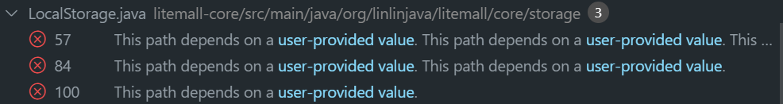
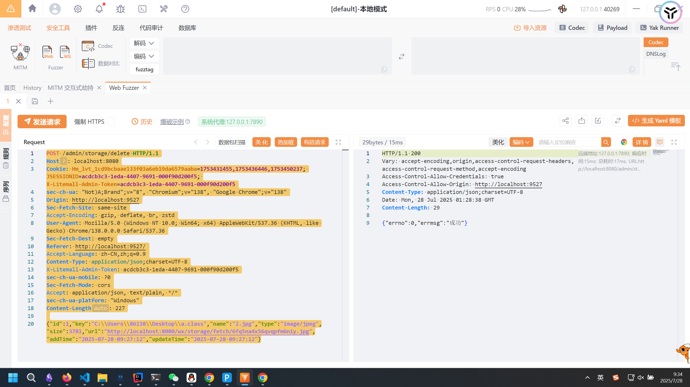
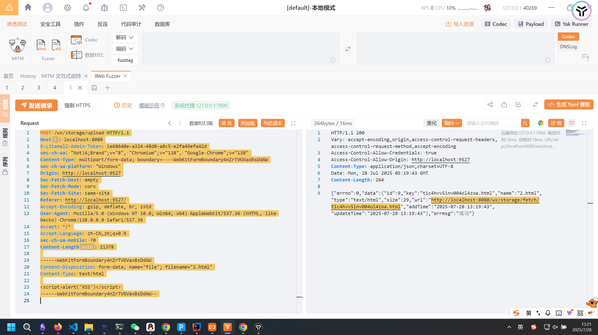
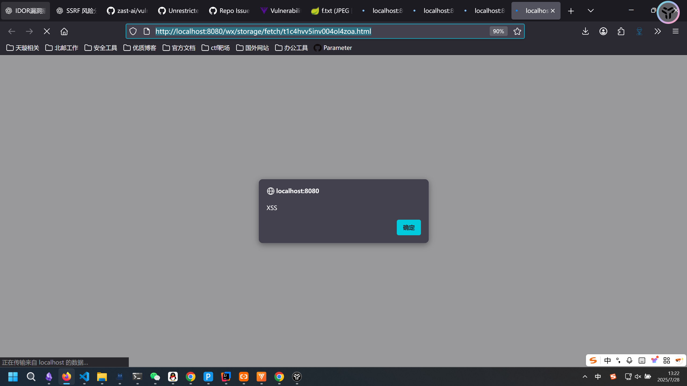

# 基于codeql的litemall漏洞挖掘-先知社区

> **来源**: https://xz.aliyun.com/news/18583  
> **文章ID**: 18583

---

# 基于codeql的litemall漏洞挖掘

项目地址：<https://github.com/linlinjava/litemall>  
这是一个有 19.8k star的开源小商场系统，使用的Spring Boot后端 + Vue管理员前端 + 微信小程序用户前端 + Vue用户移动端，接下来将讲解如何在codeql的辅助下对其进行针对性的漏洞挖掘

### 建库

首先是建立一个codeql库：

```
codeql database create cq-db --language=java --command="mvn clean install -DskipTests" --source-root=. --overwrite
```

然后使用codeql自带的安全与代码质量模板进行一个扫描：

```
codeql database analyze cq-db E:\programfiles\codeql-win64\codeql-sdk\java\ql\src\codeql-suites\java-security-and-quality.qls --format=sarifv2.1.0 --output=java-cwe-report.sarif
```

### codeql自带模板扫描结果分析

##### Hardcoded JWT Secret

最直观的就是这个JWT Key硬编码的问题  
  
看一下代码：

```
public class JwtHelper {
    // 秘钥
    static final String SECRET = "X-Litemall-Token";
    // 签名是有谁生成
    static final String ISSUSER = "LITEMALL";
    // 签名的主题
    static final String SUBJECT = "this is litemall token";
    // 签名的观众
    static final String AUDIENCE = "MINIAPP";
    
    
    public String createToken(Integer userId){
        try {
            Algorithm algorithm = Algorithm.HMAC256(SECRET);
            Map<String, Object> map = new HashMap<String, Object>();
            Date nowDate = new Date();
            // 过期时间：2小时
            Date expireDate = getAfterDate(nowDate,0,0,0,2,0,0);
            map.put("alg", "HS256");
            map.put("typ", "JWT");
            String token = JWT.create()
            	// 设置头部信息 Header
            	.withHeader(map)
            	// 设置 载荷 Payload
            	.withClaim("userId", userId)
                .withIssuer(ISSUSER)
                .withSubject(SUBJECT)
                .withAudience(AUDIENCE)
                // 生成签名的时间 
                .withIssuedAt(nowDate)
                // 签名过期的时间 
                .withExpiresAt(expireDate)
                // 签名 Signature
                .sign(algorithm);
            return token;
        } catch (JWTCreationException exception){
            exception.printStackTrace();
        }
        return null;
    }
    
    public Integer verifyTokenAndGetUserId(String token) {
        try {
            Algorithm algorithm = Algorithm.HMAC256(SECRET);
            JWTVerifier verifier = JWT.require(algorithm)
                .withIssuer(ISSUSER)
                .build();
            DecodedJWT jwt = verifier.verify(token);
            Map<String, Claim> claims = jwt.getClaims();
            Claim claim = claims.get("userId");
            return claim.asInt();
        } catch (JWTVerificationException exception){
//			exception.printStackTrace();
        }
        
        return 0;
    }
    
    public  Date getAfterDate(Date date, int year, int month, int day, int hour, int minute, int second){
        if(date == null){
            date = new Date();
        }
        
        Calendar cal = new GregorianCalendar();
        
        cal.setTime(date);
        if(year != 0){
            cal.add(Calendar.YEAR, year);
        }
        if(month != 0){
            cal.add(Calendar.MONTH, month);
        }
        if(day != 0){
            cal.add(Calendar.DATE, day);
        }
        if(hour != 0){
            cal.add(Calendar.HOUR_OF_DAY, hour);
        }
        if(minute != 0){
            cal.add(Calendar.MINUTE, minute);
        }
        if(second != 0){
            cal.add(Calendar.SECOND, second);
        }
        return cal.getTime();
    }
    
}
```

可以看到JWT Key是直接硬编码在代码中的：`SECRET = "X-Litemall-Token"`，既没有通过配置文件去进行注入，也没有在初始化的时候去进行随机。这种漏洞被归为CWE-798，vuldb是收的，先交一个。

##### Arbitrary File Deletion

看到了这样的一条报送，显然很有意思：  
  
发现存在这样一个方法，直接使用文件名作为依据去对文件进行删除，同时在该函数内没有sanitizer去进行清洗：

```
@Override
    public void delete(String filename) {
        Path file = load(filename);
        try {
            Files.delete(file);
        } catch (IOException e) {
            logger.error(e.getMessage(), e);
        }
    }
```

发现在`StorageService.java`中被调用：

```
public void delete(String keyName) {
        storage.delete(keyName);
    }
```

这是Java设计模式的经典操作，继续向上追踪，找到了`AdminStorageController.java`的一个路由：

```
@RequiresPermissions("admin:storage:delete")
    @RequiresPermissionsDesc(menu = {"系统管理", "对象存储"}, button = "删除")
    @PostMapping("/delete")
    public Object delete(@RequestBody LitemallStorage litemallStorage) {
        String key = litemallStorage.getKey();
        if (StringUtils.isEmpty(key)) {
            return ResponseUtil.badArgument();
        }
        litemallStorageService.deleteByKey(key);
        storageService.delete(key);
        return ResponseUtil.ok();
    }
```

全程没有对数据进行任何过滤，显然是可以利用的。`LitemallStorage`是什么呢，跟过去看看：

```
//代码简化，仅保留变量，那一坨一坨的方法就不在这写了
public class LitemallStorage {
    public static final Boolean IS_DELETED = Deleted.IS_DELETED.value();
    public static final Boolean NOT_DELETED = Deleted.NOT_DELETED.value();
    private Integer id;  
    private String key;  
    private String name;  
    private String type;  
    private Integer size;  
    private String url;  
    private LocalDateTime addTime;  
    private LocalDateTime updateTime;   
    private Boolean deleted;
}
```

构造发包，成功构成任意文件删除：  


### 自定义模板规则进行扫描

用自己的鉴权bypass等模板扫了一遍，都没发现什么问题，临走的时候扫了一下文件上传点：

```
/**
 * This is an automatically generated file
 *
 * @name Hello world
 * @kind problem
 * @problem.severity warning
 * @id java/example/hello-world
 */

import java
import semmle.code.java.frameworks.spring.Spring

from Method m
where
  m.hasAnnotation("org.springframework.web.bind.annotation", "PostMapping") and
  exists(Parameter p | 
    p.getCallable() = m and
    p.getType().(RefType).hasQualifiedName("org.springframework.web.multipart", "MultipartFile"))
select m
```

结果真出货了。在`WxStorageController.java`中，存在这样一个上传点：

```
@PostMapping("/upload")
    public Object upload(@RequestParam("file") MultipartFile file) throws IOException {
        String originalFilename = file.getOriginalFilename();
        LitemallStorage litemallStorage = storageService.store(file.getInputStream(), file.getSize(), file.getContentType(), originalFilename);
        return ResponseUtil.ok(litemallStorage);
    }
```

跟踪一下`storageService.store`方法：

```
public LitemallStorage store(InputStream inputStream, long contentLength, String contentType, String fileName) {
        String key = generateKey(fileName);
        storage.store(inputStream, contentLength, contentType, key);

        String url = generateUrl(key);
        LitemallStorage storageInfo = new LitemallStorage();
        storageInfo.setName(fileName);
        storageInfo.setSize((int) contentLength);
        storageInfo.setType(contentType);
        storageInfo.setKey(key);
        storageInfo.setUrl(url);
        litemallStorageService.add(storageInfo);

        return storageInfo;
    }
```

跟到这里大概也看出来了，依然是没有什么sanitizer，没对扩展名进行校验，可以直接去打html或pdf的storage xss：  
  
访问返回的文件：  
  
除此以外`AdminStorageController.java`也是有上传点的，也可以进行利用，这里就只贴一下代码吧：

```
@RequiresPermissions("admin:storage:create")
    @RequiresPermissionsDesc(menu = {"系统管理", "对象存储"}, button = "上传")
    @PostMapping("/create")
    public Object create(@RequestParam("file") MultipartFile file) throws IOException {
        String originalFilename = file.getOriginalFilename();
        LitemallStorage litemallStorage = storageService.store(file.getInputStream(), file.getSize(),
                file.getContentType(), originalFilename);
        return ResponseUtil.ok(litemallStorage);
    }
```

但是这里有一个比较有意思的插曲，在我写完报告没有提交的时候，先去吃饭了，回来一个这个source点的issue被人抢先几分钟提了，只好作罢。

### mybatis审计

除此以外还在`OrderMapper.xml`中发现了这样的一段sql语句：

```
<select id="getOrderIds" resultType="hashmap">
        select o.id, o.add_time
        from litemall_order o
        left join litemall_user u
        on o.user_id = u.id
        left join litemall_order_goods og
        on o.id = og.order_id
        <where>
            <if test="query != null">
                ${query}
            </if>
        </where>
        group by o.id
        <if test="orderByClause != null">
            order by ${orderByClause}
        </if>
    </select>
```

这里使用的是`${}`而不是`#{}`，直接拼接，如果query在上游可控的话肯定是可以利用的，跟踪`getOrderIds`的调用：  
`LitemallOrderService.java`

```
public Map<String, Object> queryVoSelective(String nickname, String consignee, String orderSn, LocalDateTime start, LocalDateTime end, List<Short> orderStatusArray, Integer page, Integer limit, String sort, String order) {
        List<String> querys = new ArrayList<>(4);
        if (!StringUtils.isEmpty(nickname)) {
            querys.add(" u.nickname like '%" + nickname + "%' ");
        }
        if (!StringUtils.isEmpty(consignee)) {
            querys.add(" o.consignee like '%" + consignee + "%' ");
        }
        if (!StringUtils.isEmpty(orderSn)) {
            querys.add(" o.order_sn = '" + orderSn + "' ");
        }
        DateTimeFormatter df = DateTimeFormatter.ofPattern("yyyy-MM-dd HH:mm:ss");
        if (start != null) {
            querys.add(" o.add_time >= '" + df.format(start) + "' ");
        }
        if (end != null) {
            querys.add(" o.add_time < '" + df.format(end) + "' ");
        }
        if (orderStatusArray != null && orderStatusArray.size() > 0) {
            querys.add(" o.order_status in (" + StringUtils.collectionToDelimitedString(orderStatusArray, ",") + ") ");
        }
        querys.add(" o.deleted = 0 and og.deleted = 0 ");
        String query = StringUtils.collectionToDelimitedString(querys, "and");
        String orderByClause = null;
        if (!StringUtils.isEmpty(sort) && !StringUtils.isEmpty(order)) {
            orderByClause = "o." + sort + " " + order +", o.id desc ";
        }

        PageHelper.startPage(page, limit);
        Page<Map> list1 = (Page) orderMapper.getOrderIds(query, orderByClause);
        List<Integer> ids = new ArrayList<>();
        for (Map map : list1) {
            Integer id = (Integer) map.get("id");
            ids.add(id);
        }

        List<OrderVo> list2 = new ArrayList<>();
        if (!ids.isEmpty()) {
            querys.add(" o.id in (" + StringUtils.collectionToDelimitedString(ids, ",") + ") ");
            query = StringUtils.collectionToDelimitedString(querys, "and");
            list2 = orderMapper.getOrderList(query, orderByClause);
        }
        Map<String, Object> data = new HashMap<String, Object>(5);
        data.put("list", list2);
        data.put("total", list1.getTotal());
        data.put("page", list1.getPageNum());
        data.put("limit", list1.getPageSize());
        data.put("pages", list1.getPages());
        return data;
    }
```

这方法实在是太有意思了，甚至不需要之前的`${}`了，在查询之前自己先去拼接一通。跟踪一下调用：  
`AdminOrderService.java`

```
public Object list(String nickname, String consignee, String orderSn, LocalDateTime start, LocalDateTime end, List<Short> orderStatusArray,
                       Integer page, Integer limit, String sort, String order) {
        Map<String, Object> data = (Map)orderService.queryVoSelective(nickname, consignee, orderSn, start, end, orderStatusArray, page, limit, sort, order);
        return ResponseUtil.ok(data);
    }
```

继续向上跟踪：  
`AdminOrderController.java`

```
@RequiresPermissions("admin:order:list")
    @RequiresPermissionsDesc(menu = {"商场管理", "订单管理"}, button = "查询")
    @GetMapping("/list")
    public Object list(String nickname, String consignee, String orderSn,
                       @RequestParam(required = false) @DateTimeFormat(pattern = "yyyy-MM-dd HH:mm:ss") LocalDateTime start,
                       @RequestParam(required = false) @DateTimeFormat(pattern = "yyyy-MM-dd HH:mm:ss") LocalDateTime end,
                       @RequestParam(required = false) List<Short> orderStatusArray,
                       @RequestParam(defaultValue = "1") Integer page,
                       @RequestParam(defaultValue = "10") Integer limit,
                       @Sort @RequestParam(defaultValue = "add_time") String sort,
                       @Order @RequestParam(defaultValue = "desc") String order) {
         return adminOrderService.list(nickname, consignee, orderSn, start, end, orderStatusArray, page, limit, sort, order);
    }
```

找到controller了，一路上一点防御也没有，显然是可以直接sql注的，结果发现了一个崩溃的问题：  
这个漏洞已经被人报送过了，并获得了[CVE-2024-24323](https://vuldb.com/?source_cve.254911)的编号，白忙活了。

### 总结

对于大型的Java项目来说，逐字句的审计是不显示的，因此基于codeql的切入式审计方式也是当前的主流。目前这些漏洞均已提交到vuldb，编号可能要等一阵才能下来吧。
