# 代码审计-jshERP-3.5-先知社区

> **来源**: https://xz.aliyun.com/news/18595  
> **文章ID**: 18595

---

# 前言

前面跟着网上的文章审计过jshERP-2.3，所以现在打算自己动手审一下3.5版本的，最后收获还是不错的(doge

我自己这次采用的还是半黑盒加半白盒的手法，基本上就是根据自己要测的功能点找到对应的代码文件进行分析

项目源码下载链接：[Release 管伊佳ERP\_v3.5 · jishenghua/jshERP · GitHub](https://github.com/jishenghua/jshERP/releases/tag/v3.5)

# 环境搭建

该版本的环境搭建没有前面的那么简单，最开始还是将配置文件中的mysql和redis配置信息改成自己的数据，然后再将sql文件导入一下

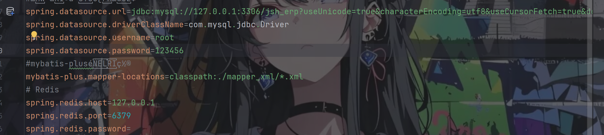

3.5版本的jshERP项目变成了前后端分离的项目，后端比较好启动，启动完后日志里面会给你一条启动前端项目的命令

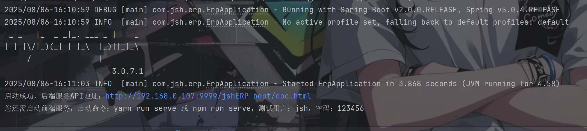

这个时候我就遇到了点问题，执行npm run serve会遇到一系列的报错，主要还是依赖冲突的问题

项目需要 `vue-loader@^15.7.0`（要求 webpack 5.x），但项目中已安装的 `@vue/cli-plugin-babel` 等依赖要求 `webpack@^4.0.0`，冲突的 peer 依赖导致 npm 安装失败

解决方案：

* 在 `package.json` 中添加 resolutions 字段强制指定 webpack 版本：

```
"resolutions": {
  "webpack": "^4.47.0"
}
```

* 然后运行：

```
npm install --force
```

`css-loader` 或 `style-loader` 版本过高，与 Webpack 4 不兼容

解决方案：将版本降低到webpack 4可以兼容

```
npm install --save-dev css-loader@3.6.0 style-loader@1.3.0
# 如果使用 Sass
npm install --save-dev sass-loader@8.0.2 node-sass@4.14.1
```

都解决完了之后执行命令：`npm run serve`便可以成功将前端起起来了

# 审计开工

一般鄙人审计的第一步都是先看pom.xml文件，看看有没有值得注意的地方

这里我们可以注意到数据库是mybatis，fastjson的版本为1.2.83，存在漏洞的版本，先记下来留着后面进行测试

而mybatis的未做预处理的话所用的危险字符便是`${`，所以我们全局搜索一下该符号以及，跟sql相关的xml文件中什么都没有，点进去后发现每一个sql语句都进行了预处理，是利用`#{}`进行处理的，不存在sql注入了，转移目标

## 审filter

filter文件中的doFilter方法逻辑还是挺清楚的，先检测下是否登录了，没有登录的话检测访问路由是否在allowUrls中，在的话就放过，要不然就强转到登录页面

```
    public void doFilter(ServletRequest request, ServletResponse response,
                         FilterChain chain) throws IOException, ServletException {
        HttpServletRequest servletRequest = (HttpServletRequest) request;
        HttpServletResponse servletResponse = (HttpServletResponse) response;
        String requestUrl = servletRequest.getRequestURI();
        //具体，比如：处理若用户未登录，则跳转到登录页
        Object userId = redisService.getObjectFromSessionByKey(servletRequest,"userId");
        if(userId!=null) { //如果已登录，不阻止
            chain.doFilter(request, response);
            return;
        }
        if (requestUrl != null && (requestUrl.contains("/doc.html") ||
            requestUrl.contains("/user/login") || requestUrl.contains("/user/register"))) {
            chain.doFilter(request, response);
            return;
        }
        if (null != allowUrls && allowUrls.length > 0) {
            for (String url : allowUrls) {
                if (requestUrl.startsWith(url)) {
                    chain.doFilter(request, response);
                    return;
                }
            }
        }
        servletResponse.setStatus(500);
        if(requestUrl != null && !requestUrl.contains("/user/logout") && !requestUrl.contains("/function/findMenuByPNumber")) {
            servletResponse.getWriter().write("loginOut");
        }
    }
```

同时该filter是对根目录下的所有路径都会进行一个检测，filterPath的值便是上面allowUrls的值，以＃分割

```
@WebFilter(filterName = "LogCostFilter", urlPatterns = {"/*"},
        initParams = {@WebInitParam(name = "filterPath",
                      value = "/jshERP-boot/user/login#/jshERP-boot/user/weixinLogin#/jshERP-boot/user/weixinBind#" +
                              "/jshERP-boot/user/registerUser#/jshERP-boot/user/randomImage#" +
                              "/jshERP-boot/platformConfig/getPlatform#/jshERP-boot/v2/api-docs#/jshERP-boot/webjars#" +
                              "/jshERP-boot/systemConfig/static#/jshERP-boot/api/plugin/wechat/weChat/share#" +
                              "/jshERP-boot/api/plugin/general-ledger/pdf/voucher")})
```

由于前面那个springmvc项目有审到interceptor，所以一开始以为通过`/jshERP-boot/user/login/../../xx`的方式在filter检测的时候会和经过springmvc的interceptor检测的时候一样先自动规范路径为`/jshERP-boot/xx`，这样就绕过不了了

后面实际测得时候发现filter检测得url路径还是原本的`/jshERP-boot/user/login/../../xx`（总的来说还是filter和interceptor在什么时候起作用还是没分清楚

那样子的话就很好绕过了，因为doFilter方法中检测路径用的是contains函数，所以我们只要输入的路径中有包含allowUrls中的路径便可以实现绕过登录了（这在后面又妙用）

## 审config

该项目的config目录下都是一些配置文件，重点关注TenantConfig文件

```
tenantSqlParser.setTenantHandler(new TenantHandler() {
    @Override
    public Expression getTenantId() {
        String token = request.getHeader("X-Access-Token");
        Long tenantId = Tools.getTenantIdByToken(token);
        if (tenantId != 0L) {
            return new LongValue(tenantId); // 返回租户ID
        } else {
            return null; // 超管不添加租户条件
        }
    }

    @Override
    public String getTenantIdColumn() {
        return "tenant_id"; // 数据库中的租户ID列名
    }

    @Override
    public boolean doTableFilter(String tableName) {
        // 系统表不添加租户条件
        if ("jsh_material_property".equals(tableName) || 
            "jsh_sequence".equals(tableName) ||
            "jsh_function".equals(tableName) ||
            "jsh_platform_config".equals(tableName) ||
            "jsh_tenant".equals(tableName)) {
            return true; // 跳过租户过滤
        }
        return false; // 需要添加租户条件
    }
});
```

* **租户ID获取逻辑**：

* 从请求头 `X-Access-Token` 中解析租户ID
* 租户ID为 `0` 时表示超级管理员（不添加租户过滤条件）
* 其他租户自动添加 `tenant_id = {租户ID}` 条件

* **表过滤规则**：

* 系统表（如 `jsh_tenant`, `jsh_function`）不添加租户条件
* 业务表（如用户表、订单表）自动添加租户条件

**SQL 解析器配置**

**租户SQL解析器**

```
List<ISqlParser> sqlParserList = new ArrayList<>();
TenantSqlParser tenantSqlParser = new TenantSqlParser();
sqlParserList.add(tenantSqlParser);
paginationInterceptor.setSqlParserList(sqlParserList);
```

将租户解析器加入分页插件，实现 **自动改写SQL**

**自定义SQL过滤器**

```
paginationInterceptor.setSqlParserFilter(metaObject -> {
    MappedStatement ms = SqlParserHelper.getMappedStatement(metaObject);
    // 指定方法跳过租户过滤
    return switch (ms.getId()) {
        case "com.jsh.erp.datasource.mappers.UserMapperEx.getUserByWeixinOpenId",
             "com.jsh.erp.datasource.mappers.UserMapperEx.updateUserWithWeixinOpenId",
             "com.jsh.erp.datasource.mappers.UserMapperEx.getUserListByUserNameOrLoginName",
             "com.jsh.erp.datasource.mappers.UserMapperEx.disableUserByLimit",
             "com.jsh.erp.datasource.mappers.RoleMapperEx.getRoleWithoutTenant",
             "com.jsh.erp.datasource.mappers.LogMapperEx.insertLogWithUserId",
             "com.jsh.erp.datasource.mappers.UserBusinessMapperEx.getBasicDataByKeyIdAndType" -> true;
        default -> false;
    };
});
```

* **特殊方法跳过租户过滤**：

* 微信登录/绑定相关方法（如 `getUserByWeixinOpenId`）
* 系统管理方法（如 `disableUserByLimit`）
* 日志记录（`insertLogWithUserId`）
* 基础数据获取（`getBasicDataByKeyIdAndType`）

**Mapper 扫描配置**

```
@Bean
public MapperScannerConfigurer mapperScannerConfigurer() {
    MapperScannerConfigurer scannerConfigurer = new MapperScannerConfigurer();
    scannerConfigurer.setBasePackage("com.jsh.erp.datasource.mappers*");
    return scannerConfigurer;
}
```

* 扫描指定包下的 MyBatis Mapper 接口
* 相当于 `@MapperScan("com.jsh.erp.datasource.mappers*")`

简单的来说就是除了几个特定的表外，剩下的表在进行增删改查的时候都会自动根据报头中的X-Access-Token值来进行条件添加（刚看完的时候还没有意识到问题的严重性

# 越权

开始对项目的各个功能点进行测试，由于是要挖洞，所以肯定先从一旦有洞然后造成危害会比较大的功能点开始测试，这里我先从系统管理的角色管理页面进行测试，顺藤摸瓜开审com/jsh/erp/controller/UserController.java

resetPwd方法一开始便吸引了我的眼球

```
    @PostMapping(value = "/resetPwd")
    @ApiOperation(value = "重置密码")
    public String resetPwd(@RequestBody JSONObject jsonObject,
                                     HttpServletRequest request) throws Exception {
        Map<String, Object> objectMap = new HashMap<>();
        Long id = jsonObject.getLong("id");
        String password = "123456";
        String md5Pwd = Tools.md5Encryp(password);
        int update = userService.resetPwd(md5Pwd, id);
        if(update > 0) {
            return returnJson(objectMap, SUCCESS, ErpInfo.OK.code);
        } else {
            return returnJson(objectMap, ERROR, ErpInfo.ERROR.code);
        }
    }
```

继续往上找resetPwd方法，做了个限制不能够重置超管密码

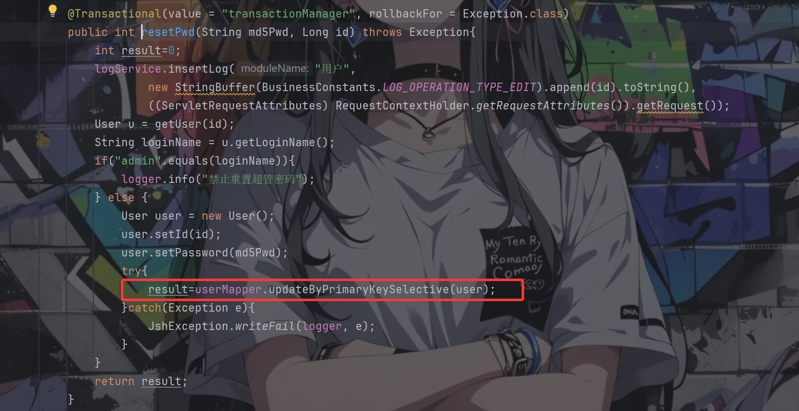

往上找updateByPrimaryKeySelective方法，走到xml文件里面后发现该mybatis语句仅通过传入的id值进行判断，整个代码逻辑到mybatis语句的过程中都没有对是谁删除的进行一个判断，毫无疑问这就是一个纯纯的水平越权漏洞

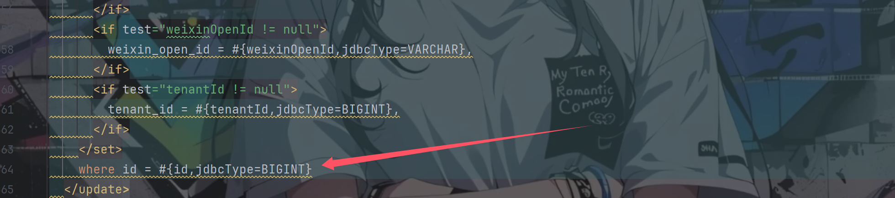

## 失败

话不多说开始测试，我们先拦截一个重置密码的请求包，看到了是通过json传递id参数

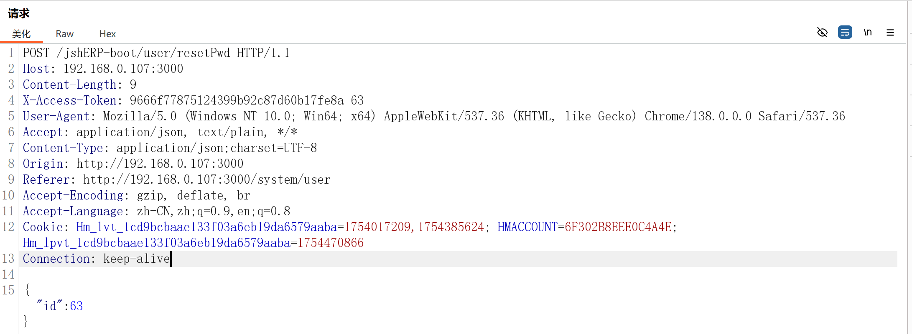

修改id为133（那个账号是我自己提前注册的），查看返回包

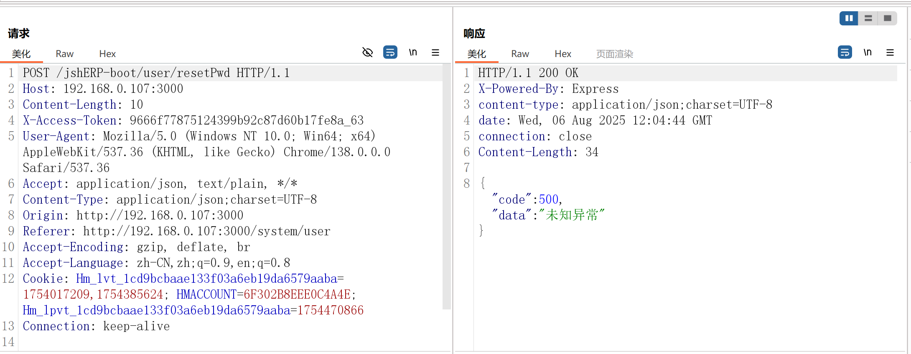

？？？，重置失败了，不信邪的我开启了调试，可就是找不到原因在哪里，直到我发现了日志里面会记录调用的具体sql语句和参数值

终于发现了真相

```
2025/08/06-20:04:44 DEBUG [http-nio-9999-exec-9] com.jsh.erp.datasource.mappers.UserMapper.selectByPrimaryKey - ==>  Preparing: SELECT id, username, login_name, password, leader_flag, position, department, email, phonenum, ismanager, isystem, Status, description, remark, weixin_open_id, tenant_id FROM jsh_user WHERE jsh_user.tenant_id = 63 AND id = ? 
2025/08/06-20:04:44 DEBUG [http-nio-9999-exec-9] com.jsh.erp.datasource.mappers.UserMapper.selectByPrimaryKey - ==> Parameters: 133(Long)
2025/08/06-20:04:44 DEBUG [http-nio-9999-exec-9] com.jsh.erp.datasource.mappers.UserMapper.selectByPrimaryKey - <==      Total: 0
2025/08/06-20:04:44 ERROR [http-nio-9999-exec-9] com.jsh.erp.exception.GlobalExceptionHandler - Global Exception Occured => url : http://localhost:9999/jshERP-boot/user/resetPwd, msg : null
```

在执行重置密码的sql语句之前先进行了一次查找操作，看是否能够找到要修改的数据

```
SELECT id, username, login_name, password, leader_flag, position, department, email, phonenum, ismanager, isystem, Status, description, remark, weixin_open_id, tenant_id FROM jsh_user WHERE jsh_user.tenant_id = 63 AND id = ?
```

哇哦，where子句里面怎么自己多了一个条件jsh\_user.tenant\_id = 63，明明通过json传参过去的参数只有一个id

然后突然想到了前面看到的TenantConfig类代码，自动进行条件的添加。。。。。

原来预防水平越权的操作在这里等着我，那么这样的思路就走不通了

## 柳暗花明又一村

不死心的我返回反复观摩TenantConfig代码，以及看日志里面的sql语句（然后滚去吃了个饭doge

吃完回来突然脑子灵光一闪，TenantConfig里面自动添加的条件是在X-Access-Token标头的数据处获取的

`X-Access-Token: a60964b01528475ab2e38e863c025be7_63`从这里拿到了63这个数据，那是不是可以代表我把该标头的数据修改为X-`Access-Token: a60964b01528475ab2e38e863c025be7_133`的话，拿到的数据就是133

话不多说，赶紧尝试

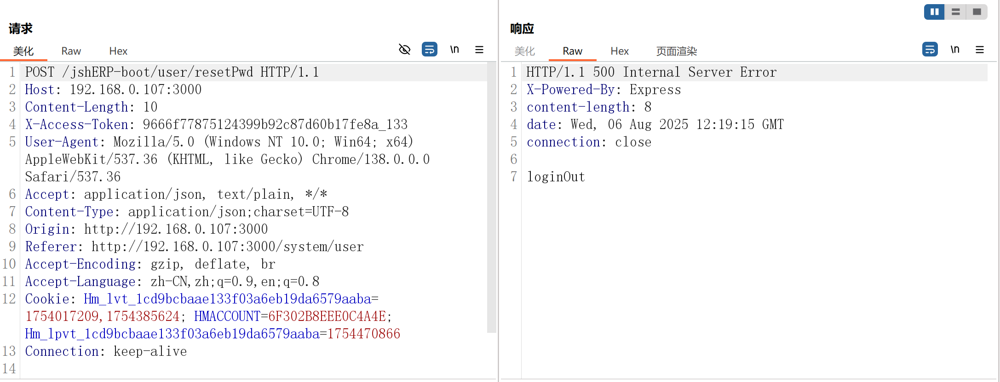

loginout，就是代表未登录，干脆利落的失败了，没我想的那么简单

无妨，脑子又灵光一闪，后端从X-Access-Token标头获取数据，那么我只要把这个标头给删了数据不就获取不到了嘛，把X-Access-Token删去也就意味着我们处于未登录的状态，那么我们就需要绕过filter的检测，上面有讲过如何绕过，这两一配合不就可以完美解决这个问题了

尝试尝试

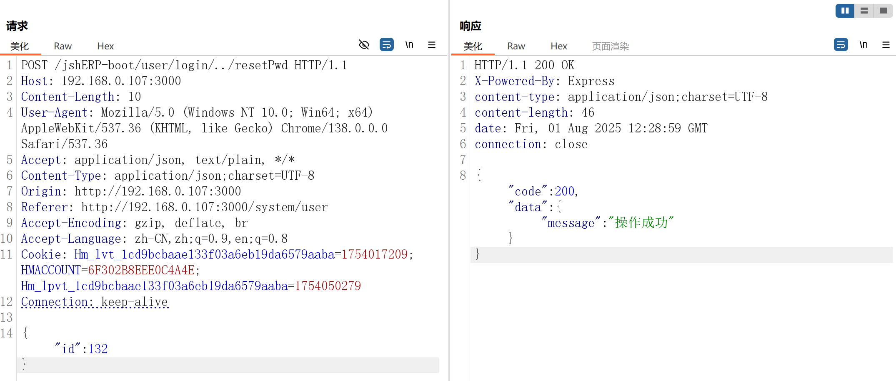

芜湖，成功成功，瞅一眼日志

```
2025/08/06-20:25:14 DEBUG [http-nio-9999-exec-10] com.jsh.erp.datasource.mappers.UserMapper.selectByPrimaryKey - ==>  Preparing: SELECT id, username, login_name, password, leader_flag, position, department, email, phonenum, ismanager, isystem, Status, description, remark, weixin_open_id, tenant_id FROM jsh_user WHERE id = ? 
2025/08/06-20:25:14 DEBUG [http-nio-9999-exec-10] com.jsh.erp.datasource.mappers.UserMapper.selectByPrimaryKey - ==> Parameters: 132(Long)
2025/08/06-20:25:14 DEBUG [http-nio-9999-exec-10] com.jsh.erp.datasource.mappers.UserMapper.selectByPrimaryKey - <==      Total: 1
2025/08/06-20:25:14 DEBUG [http-nio-9999-exec-10] com.jsh.erp.datasource.mappers.UserMapper.updateByPrimaryKeySelective - ==>  Preparing: UPDATE jsh_user SET password = ? WHERE id = ? 
2025/08/06-20:25:14 DEBUG [http-nio-9999-exec-10] com.jsh.erp.datasource.mappers.UserMapper.updateByPrimaryKeySelective - ==> Parameters: e10adc3949ba59abbe56e057f20f883e(String), 132(Long)
2025/08/06-20:25:14 DEBUG [http-nio-9999-exec-10] com.jsh.erp.datasource.mappers.UserMapper.updateByPrimaryKeySelective - <==    Updates: 1
```

果然和上面推测的是一模一样的，查询语句`SELECT id, username, login_name, password, leader_flag, position, department, email, phonenum, ismanager, isystem, Status, description, remark, weixin_open_id, tenant_id FROM jsh_user WHERE id = ?` 中的where子句的条件只剩下了id，而没有tennant\_id

那就很好了，以点破面，一处通处处通，接下来只要是对于数据库操作的语句写的不严谨那么便存在越权漏洞了

就拿com/jsh/erp/controller/UserController.java文件中就有重置密码，删除用户等操作

## 大量的越权

后面功能点一个个测试，发现了大量的越权

包括但不限于如下：

com/jsh/erp/controller/SupplierController.java的batchSetStatus方法存在越权漏洞，可以任意控制所有供应商的状态

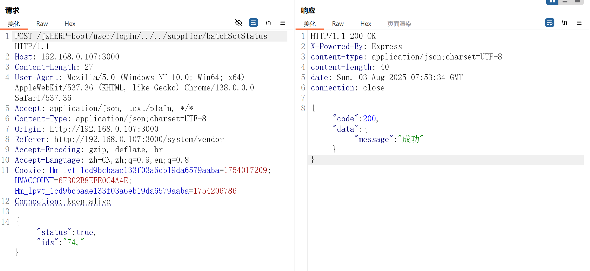

com/jsh/erp/controller/ResourceController.java中的updateResource方法存在越权，并且传参中的tenantId可以随便改，改了之后对应的信息便会跟着修改并转移到传递的tenantId值的麾下，相当于也是实现了另类的删除功能

（该类下的delete方法也存在越权操作）

下面是对供应商的越权更新操作：

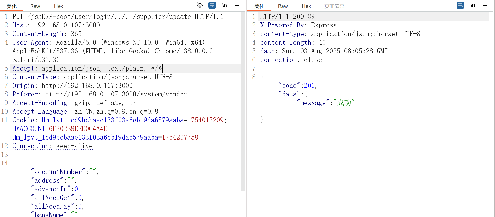

com/jsh/erp/controller/RoleController.java中的allList方法未授权访问可以得到所有role数据，登录之后只能得到各自租户下的role数据

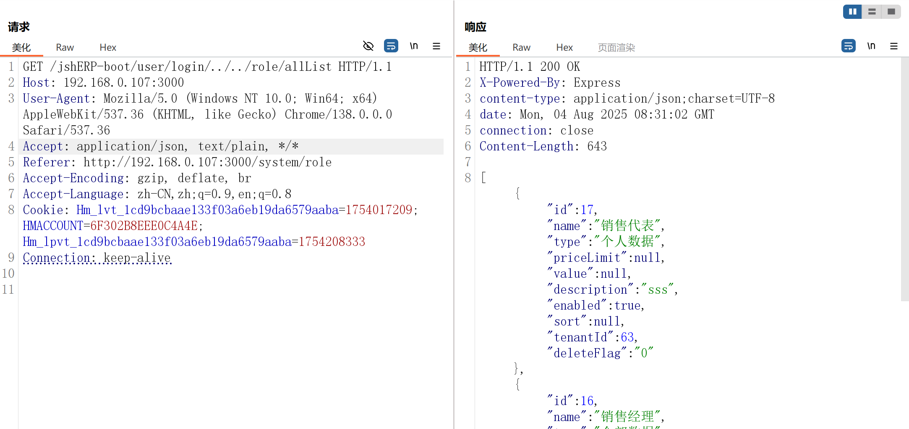

通过上面获取到所有role数据，配合该类中的batchSetStatus方法实现越权，可以任意控制所有role的状态

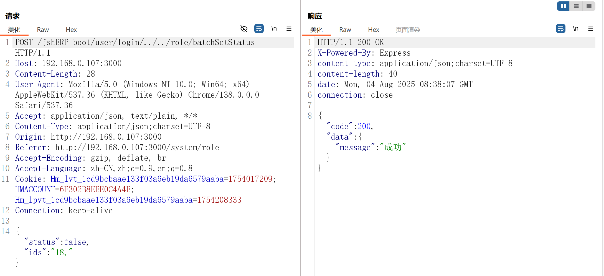

com/jsh/erp/controller/ResourceController.java中的getList方法存在越权访问，并且通过该方法我们可以获取到不同租户经过md5加密后的密码，用自己的爆破脚本尝试爆破或者拿去专业平台解密都是可以的，得到明文密码之后便可以再次实现任意账号接管了

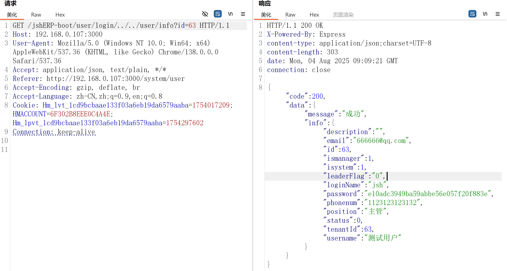

com/jsh/erp/controller/PersonController.java中的getAllList方法存在越权执行，获取所有经手人信息（看了下该类下的所有方法都可以实现越权）

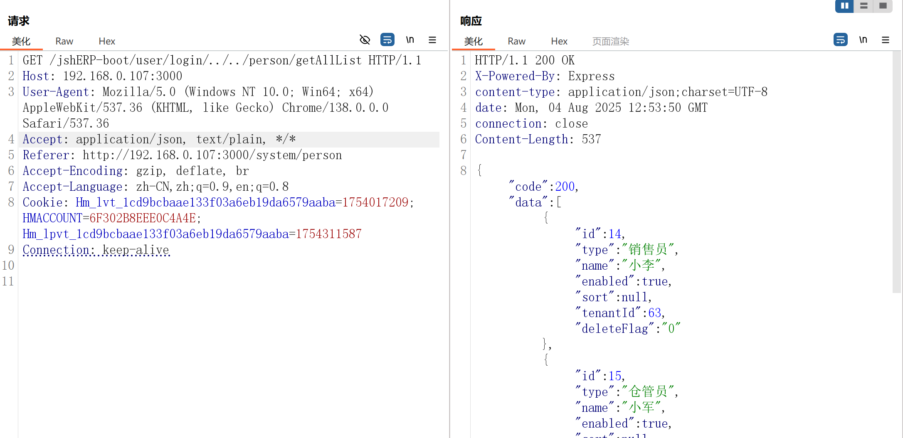

com/jsh/erp/controller/AccountController.java中的getAccount方法存在未授权

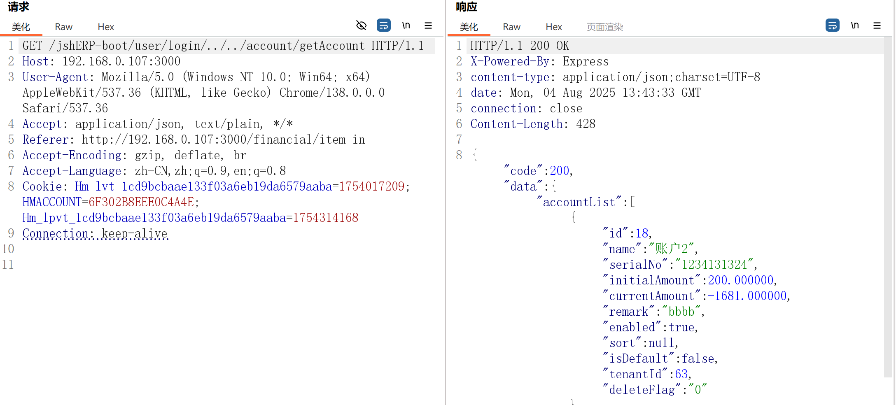

and so on。。。。。。

# 文件上传

后面在测试系统参数相关功能点的时候意外发现相对应的类中有一个文件上传的方法并未出现在页面上，即com/jsh/erp/controller/SystemConfigController.java的upload方法

```
    @PostMapping(value = "/upload")
    @ApiOperation(value = "文件上传统一方法")
    public BaseResponseInfo upload(HttpServletRequest request, HttpServletResponse response) {
        BaseResponseInfo res = new BaseResponseInfo();
        try {
            String savePath = "";
            String bizPath = request.getParameter("biz");
            if ("bill".equals(bizPath) || "financial".equals(bizPath) || "material".equals(bizPath)) {
                MultipartHttpServletRequest multipartRequest = (MultipartHttpServletRequest) request;
                MultipartFile file = multipartRequest.getFile("file");// 获取上传文件对象
                if(fileUploadType == 1) {
                    savePath = systemConfigService.uploadLocal(file, bizPath, request);
                } else if(fileUploadType == 2) {
                    savePath = systemConfigService.uploadAliOss(file, bizPath, request);
                }
                if(StringUtil.isNotEmpty(savePath)){
                    res.code = 200;
                    res.data = savePath;
                }else {
                    res.code = 500;
                    res.data = "上传失败！";
                }
            } else {
                res.code = 505;
                res.data = "文件分类错误！";
            }
        } catch (Exception e) {
            logger.error(e.getMessage(), e);
            res.code = 500;
            res.data = "上传失败！";
        }
        return res;
    }
```

biz参数需要满足是bill或financial或material三个中的一个才可以走进if中

往下看我们可以知道文件存储的位置有两个，本地和阿里云，通过fileUploadType参数进行判断

而该参数的值默认等于1，于是上传的文件默认存储于本地


所以我们跟进uploadLocal方法

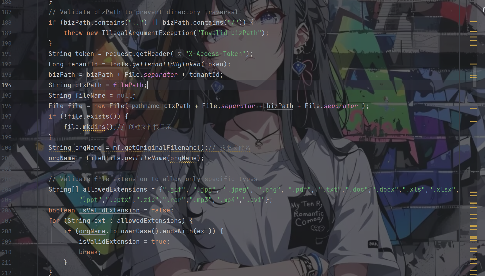

可以看到对于上传的文件是做了较为严格的限制，防止了路径穿越也限制了文件后缀

发现允许上传的文件后缀包含zip，但是似乎没有解压的相关代码，遂无

那只剩下一个pdf后缀可以利用了，上传一个pdf xss文件，打一个存储型xss（没啥用。。。。。。

# Swagger泄露

Swagger是一个规范和完整的框架，用于生成、描述、调用和可视化 RESTful 风格的 Web 服务。总体目标是使客户端和文件系统作为服务器以同样的速度来更新。

spring项目中的配置参考：[解决 Swagger API 未授权访问漏洞：完善分析与解决方案-阿里云开发者社区 (aliyun.com)](https://developer.aliyun.com/article/1361365)

相关路径，在实际测试工程中可用以下字典fuzz

```
/api
/api-docs
/api-docs/swagger.json
/api.html
/api/api-docs
/api/apidocs
/api/doc
/api/swagger
/api/swagger-ui
/api/swagger-ui.html
/api/swagger-ui.html/
/api/swagger-ui.json
/api/swagger.json
/api/swagger/
/api/swagger/ui
/api/swagger/ui/
/api/swaggerui
/api/swaggerui/
/api/v1/
/api/v1/api-docs
/api/v1/apidocs
/api/v1/swagger
/api/v1/swagger-ui
/api/v1/swagger-ui.html
/api/v1/swagger-ui.json
/api/v1/swagger.json
/api/v1/swagger/
/api/v2
/api/v2/api-docs
/api/v2/apidocs
/api/v2/swagger
/api/v2/swagger-ui
/api/v2/swagger-ui.html
/api/v2/swagger-ui.json
/api/v2/swagger.json
/api/v2/swagger/
/api/v3
/apidocs
/apidocs/swagger.json
/doc.html
/docs/
/druid/index.html
/graphql
/libs/swaggerui
/libs/swaggerui/
/spring-security-oauth-resource/swagger-ui.html
/spring-security-rest/api/swagger-ui.html
/sw/swagger-ui.html
/swagger
/swagger-resources
/swagger-resources/configuration/security
/swagger-resources/configuration/security/
/swagger-resources/configuration/ui
/swagger-resources/configuration/ui/
/swagger-ui
/swagger-ui.html
/swagger-ui.html#/api-memory-controller
/swagger-ui.html/
/swagger-ui.json
/swagger-ui/swagger.json
/swagger.json
/swagger.yml
/swagger/
/swagger/index.html
/swagger/static/index.html
/swagger/swagger-ui.html
/swagger/ui/
/Swagger/ui/index
/swagger/ui/index
/swagger/v1/swagger.json
/swagger/v2/swagger.json
/template/swagger-ui.html
/user/swagger-ui.html
/user/swagger-ui.html/
/v1.x/swagger-ui.html
/v1/api-docs
/v1/swagger.json
/v2/api-docs
/v3/api-docs
```

现在看一手关于它的配置文件Swagger2Config.java

```
@Configuration
@EnableSwagger2
public class Swagger2Config {

    @Bean
    public Docket createRestApi() {
        return new Docket(DocumentationType.SWAGGER_2)
                .apiInfo(this.apiInfo())
                .select()
                .apis(RequestHandlerSelectors.any())
                .paths(PathSelectors.any())
                .build();
    }

    private ApiInfo apiInfo() {
        return new ApiInfoBuilder()
                .title("管伊佳ERP Restful Api")
                .description("管伊佳ERP接口描述")
                .termsOfServiceUrl("http://127.0.0.1")
                .contact(new Contact("jishenghua", "", ""))
                .version("3.0")
                .build();
    }

}
```

在该类及配置文件中未进行任何的限制及访问控制和身份验证，因此导致在未登录的情况下能够请求得到api接口

# 声明

> **法律与道德声明**
>
> 1. 本文所述漏洞信息仅供**技术研究与防御参考**
> 2. **任何个人/组织不得将漏洞用于非法目的**，包括但不限于：未授权渗透、数据窃取、系统破坏
> 3. 作者**强烈谴责恶意利用行为**，对因滥用本文信息导致的损失**不承担任何法律责任**

本文所涉及到的较为严重的洞项目开发者已做修复，发文也已取得开发者同意
