# JS逆向-----Burpy加解密插件使用攻略-先知社区

> **来源**: https://xz.aliyun.com/news/18604  
> **文章ID**: 18604

---

安装插件Galaxy

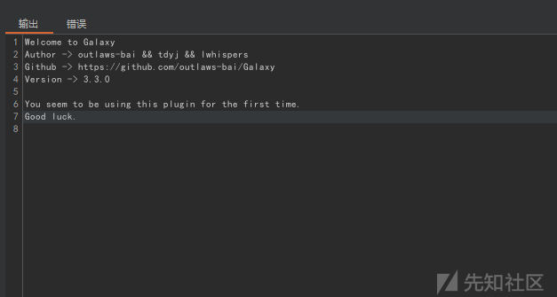

### GalaxyDemo靶场搭建

下载地址：<https://github.com/outlaws-bai/GalaxyDemo>

下载好靶场源码，执行pip install -r requirements.txt

此处提示是因为之前已经安装过了

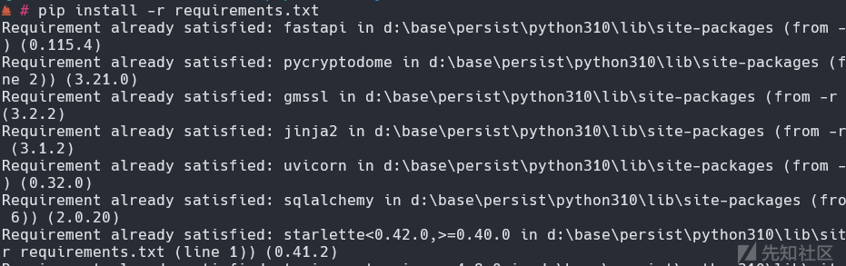

访问靶场

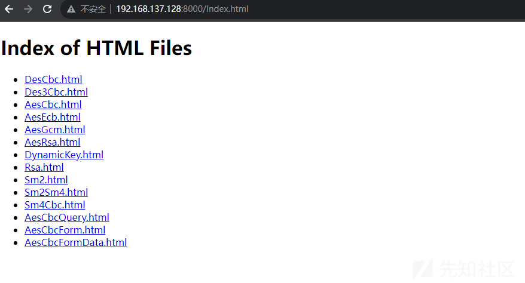

### Burpy插件攻略

#### Burpy简述

作者地址：<https://github.com/mr-m0nst3r/Burpy/blob/master/README.md>

根据md文件看来，目前已经支持python

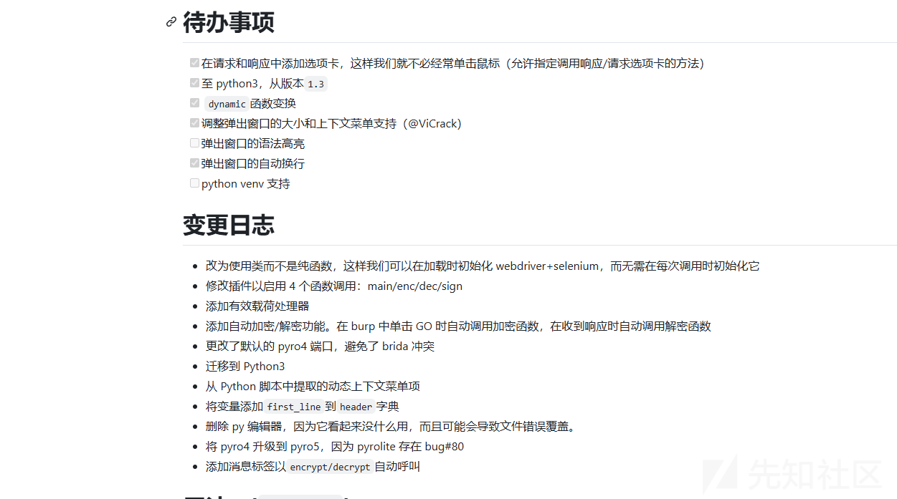

python3用法如下：

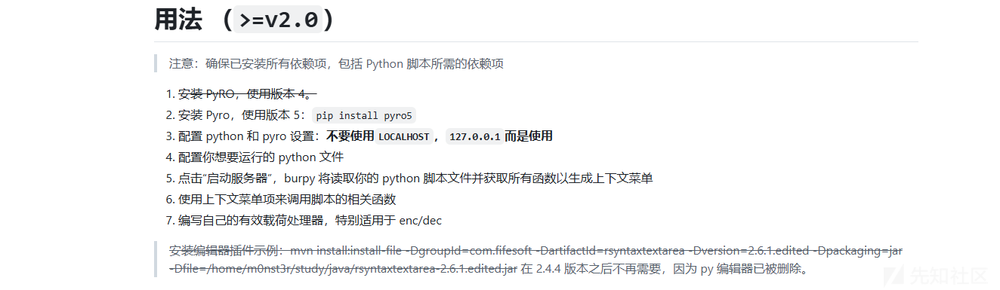md当中提供完整的示例如下：

当中所有的函数根据自己需要进行定义，Burp会自动提取Burpy类当中的函数名，因此Burpy类是必须的。

根据自身获取到加密函数逻辑之后，在Burpy类中写入解密函数即可使用。

同时，需要注意的是在处理request数据包跟response数据包，可能需要加入if、else条件来判断。不然可能会造成解密函数不存在问题，但是无法解密的情况，这点在后面的vlog当中会有体现。

```
class Burpy:
    '''
    header is dict
    body is string
    '''
    def __init__(self):
        '''
        here goes some code that will be kept since "start server" clicked, for example, webdriver, which usually takes long time to init
        '''
        pass
        
    def main(self, header, body):
        return header, body

    def _test(self, param):
        '''
        function with `_`, `__`as starting letter will be ignored for context menu

        '''
        # param = magic(param)
        return param
    
    def encrypt(self, header, body):
        '''
        Auto Enc/Dec feature require this function
        '''
        header["Cookie"] = "admin=1"
        return header, body

    def decrypt(self, header, body):
        '''
        Auto Enc/Dec feature require this function

        '''
        # header = magic(header)
        # body = magic(body)
        return header, body

    def processor(self, payload):
        '''
        Enable Processor feature require this function
        payload processor function
        '''
        return payload+"123"
```

#### Burpy安装与搭建

安装插件Burpy

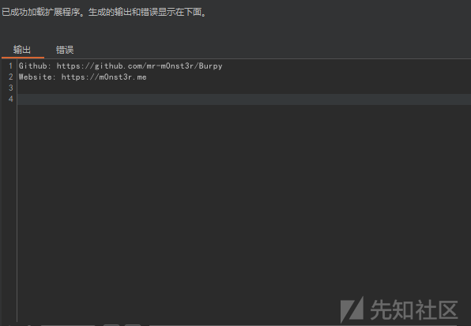

安装成功

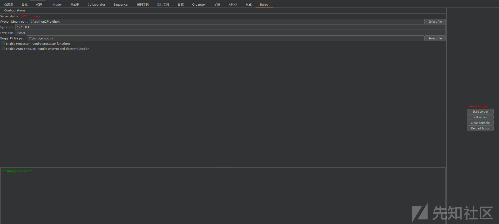

配置Python3环境，如果是Python2则是pyro4

执行pip install pyro5，安装该模块

```
pip install pyro5
```

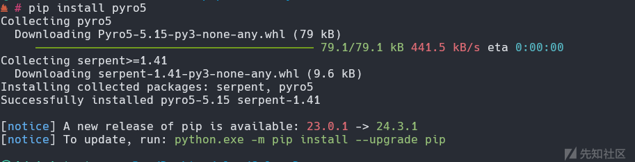

pyro4库安装如下：

```
pip2 install pyro4
```

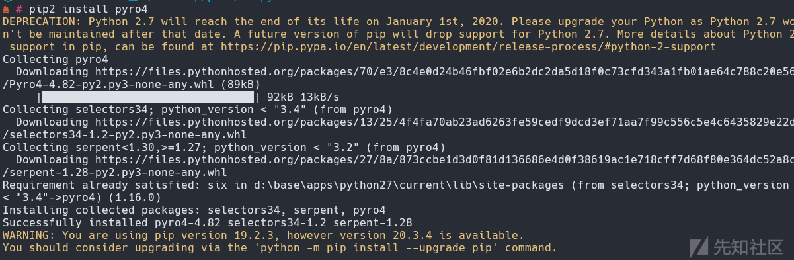

#### 靶场vlog

访问某搭建好的靶场，进行登录发现username与password参数均已被加密

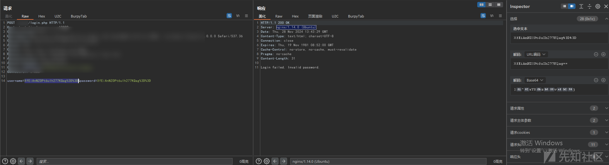

使用python写好解密脚本如下：

```
from Crypto.Cipher import AES
import base64
import urllib.parse


class Burpy:
    def __init__(self):
        """
        初始化方法，目前为空，可根据后续需求添加初始化相关操作，比如加载配置文件等。
        """
        pass

    def main(self, header, body):
        """
        主方法，用于处理基本的HTTP请求和响应。
        这里暂时只是直接返回传入的header和body，可根据实际应用场景对其进行更多处理。
        """
        return header, body

    def decrypt(self, header, body):
        """
        解密方法，用于在Burp Suite中对经过URL编码、Base64编码且经过AES加密（ECB模式，PCS7填充）的密文进行解密操作，
        并返回解密后的原文，以用于后续对HTTP请求或响应的处理。
        """
        key = '7777777'  # 替换为你自己的16字节密钥
        cipher = AES.new(key.encode(), AES.MODE_ECB)

        print(body)

        # 先对body数据进行URL解码
        url_decoded_body = urllib.parse.unquote(body)

        # 再对URL解码后的内容进行Base64编码的密文进行解码
        encrypted_data = base64.b64decode(url_decoded_body)

        # 进行解密操作
        decrypted_data = cipher.decrypt(encrypted_data)

        # 去除PCS7填充
        unpadded_data = self.pcs7_unpad(decrypted_data)

        return header, unpadded_data.decode()

    def pcs7_unpad(self, data):
        """
        PCS7去填充方法，根据数据末尾的填充字节长度，去除掉填充部分，得到原始数据。
        """
        padding_length = data[-1]
        return data[:-padding_length]


# 以下部分在Burp Suite运行时会根据具体情况自动调用相关方法
if __name__ == "__main__":
    # 创建Burpy类的实例
    burpy = Burpy()

    # 模拟传入的header和body数据，这里只是示例，实际使用时可根据具体情况获取真实数据
    header = {}
    body = "XfEiAnNZOPt6uIh277KQag%3D%3D"  # 实际经过URL编码的Base64编码密文

    # 调用decrypt方法进行解密处理
    decrypted_header, decrypted_body = burpy.decrypt(header, body)

    print("Decrypted Header:", decrypted_header)
    print("Decrypted Body:", decrypted_body)
```

在burp中启动burpy插件，并加载写好的脚本。尝试解密，发现失败。

提示：Data must be sligned to bloek boundgry in ECB mode

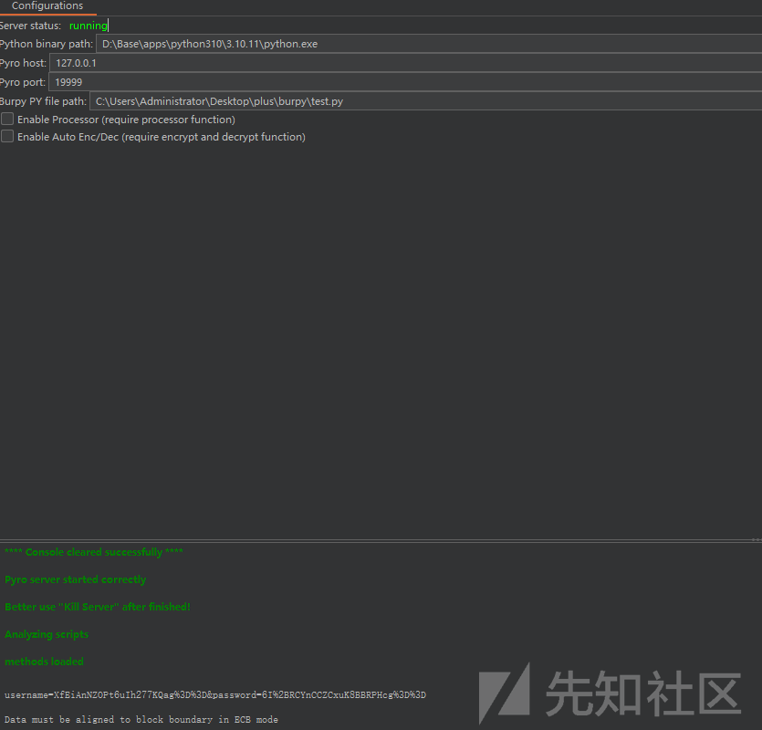

通过报错，完善解密脚本如下：

```
from Crypto.Cipher import AES
import base64
import urllib.parse


class Burpy:
    def __init__(self):
        """
        初始化方法，目前为空，可根据后续需求添加初始化相关操作，比如加载配置文件等。
        """
        pass

    def main(self, header, body):
        """
        主方法，用于处理基本的HTTP请求和响应。
        这里暂时只是直接返回传入的header和body，可根据实际应用场景对其进行更多处理。
        """
        return header, body

    def decrypt_username(self, header, body):
        """
        解密方法，用于在Burp Suite中从给定的Body数据中提取username的值，
        并对其进行解密操作，解密过程为先对提取的值进行URL解码，然后对经过Base64编码且经过AES加密（ECB模式，PCS7填充）的密文进行解密操作，
        最后去除PCS7填充并返回解密后的username原文，以用于后续对HTTP请求或响应的处理。
        """
        key = 'secret_key111111'  # 替换为你自己的16字节密钥
        cipher = AES.new(key.encode(), AES.MODE_ECB)
        print("提取前"+body)

        # 从Body中提取username的值
        username_encoded = body.split('&')[0].split('=')[1]
        print("提取后"+username_encoded)

        # 先对提取的username值进行URL解码
        url_decoded_username = urllib.parse.unquote(username_encoded)

        # 再对URL解码后的内容进行Base64编码的密文进行解码
        encrypted_data = base64.b64decode(url_decoded_username)

        # 进行解密操作
        decrypted_data = cipher.decrypt(encrypted_data)

        # 去除PCS7填充
        unpadded_data = self.pcs7_unpad(decrypted_data)

        return header, unpadded_data.decode()

    def pcs7_unpad(self, data):
        """
        PCS7去填充方法，根据数据末尾的填充字节长度，去除掉填充部分，得到原始数据。
        """
        padding_length = data[-1]
        return data[:-padding_length]


# 以下部分在Burp Suite运行时会根据具体情况自动调用相关方法
if __name__ == "__main__":
    # 创建Burpy类的实例
    burpy = Burpy()

    # 模拟传入的header和body数据，这里只是示例，实际使用时可根据具体情况获取真实数据
    header = {}
    body = "username=XfEiAnNZOPt6uIh277KQag%3D%3D&password=6I%2BRCYnCCZCxuK8BBRPHcg%3D%3D"

    # 调用decrypt_username方法进行解密处理
    decrypted_header, decrypted_username = burpy.decrypt_username(header, body)

    print("Decrypted Header:", decrypted_header)
    print("Decrypted Username:", decrypted_username)
```

运行之后发现还是不行，提示：list index out of range。

也就是列表索引的问题

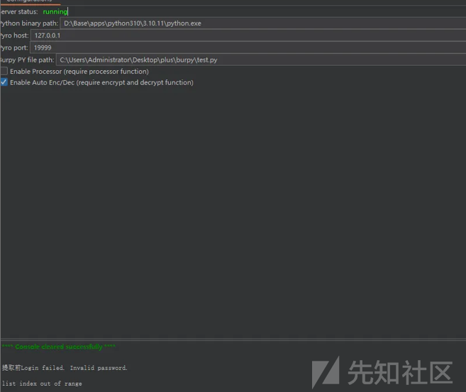

继续完善，本次在解密前后添加了print来验证那一步导致解密失败。代码如下：

```
from Crypto.Cipher import AES
import base64
import urllib.parse

#AES ECB解密
def decrypt_request_body_username(header, body):

    key = 'secret_key111111'  # 替换为你自己的16字节密钥
    cipher = AES.new(key.encode(), AES.MODE_ECB)
    print("提取前"+body)

    # 从请求包Body中提取username的值
    username_encoded = body.split('&')[0].split('=')[1]
    print("提取后"+username_encoded)

    # 先对提取的username值进行URL解码
    url_decoded_username = urllib.parse.unquote(username_encoded)

    # 再对URL解码后的内容进行Base64编码的密文进行解码
    encrypted_data = base64.b64decode(url_decoded_username)

    # 进行解密操作
    decrypted_data = cipher.decrypt(encrypted_data)

    # 去除PCS7填充
    unpadded_data = pcs7_unpad(decrypted_data)

    return header, unpadded_data.decode()

#PCS7填充
def pcs7_unpad(data):

    #PCS7去填充方法，根据数据末尾的填充字节长度，去除掉填充部分，得到原始数据。
    
    padding_length = data[-1]
    return data[:-padding_length]


class Burpy:
    def encrypt(self, header, body):
        #判断请求包
        if header.split(" ")[0] == "GET" or header.split(" ")[0] == "POST":
            print("处理请求包的Body")
            decrypted_header, decrypted_username = decrypt_request_body_username(header, body)
            return decrypted_header, decrypted_username
        else:
            print("处理返回包的Body")
            # 这里可以添加针对返回包的处理逻辑，比如解密返回包中的其他数据等，目前暂未实现具体处理
            return header, body

# 以下部分在Burp Suite运行时会根据不同的触发操作自动调用相关方法
if __name__ == "__main__":
    # 创建Burpy类的实例
    burpy = Burpy()

    # 模拟传入的header和body数据，这里只是示例，实际使用时可根据具体情况获取真实数据
    header = "POST /aes_1/login.php"
    body = "username=XfEiAnNZOPt6uIh277KQag%3D%3D&password=6I%2BRCYnCCZCxuK8BBRPHcg%3D%3D"

    # 调用encrypt方法
    decrypted_header, decrypted_username = burpy.encrypt(header, body)

    print("Decrypted Header:", decrypted_header)
    print("Decrypted Username:", decrypted_username)
```

在本地运行之后，发现没有问题。内心暗喜，可以按时睡觉了

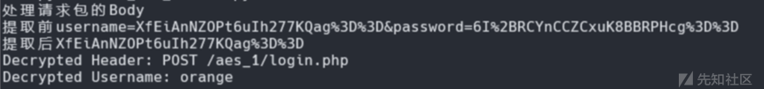

启动burpy，解密，失败。内心已经一万匹草泥马跑过

提示：'dict' object has no attribute 'split'

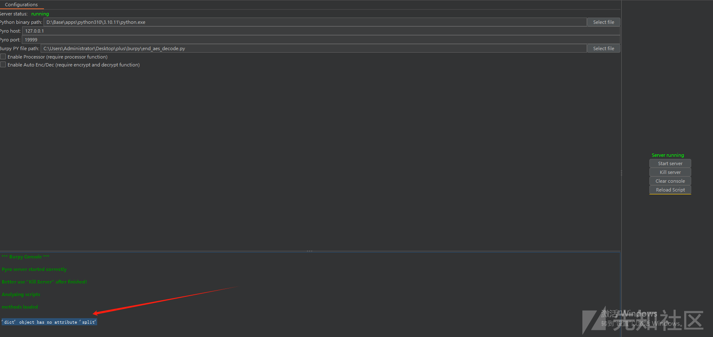

继续完善，这一次总算成功了。

```
from Crypto.Cipher import AES
import base64
import urllib.parse

#AES ECB解密
def decrypt_request_body_username(body):

    key = 'secret_key111111'  # 替换为你自己的16字节密钥
    cipher = AES.new(key.encode(), AES.MODE_ECB)
    print("提取前"+body)

    # 从请求包Body中提取username的值
    username_encoded = body.split('&')[0].split('=')[1]
    print("提取后"+username_encoded)

    # 先对提取的username值进行URL解码
    url_decoded_username = urllib.parse.unquote(username_encoded)

    # 再对URL解码后的内容进行Base64编码的密文进行解码
    encrypted_data = base64.b64decode(url_decoded_username)

    # 进行解密操作
    decrypted_data = cipher.decrypt(encrypted_data)

    # 去除PCS7填充
    body = pcs7_unpad(decrypted_data)

    return body

#PCS7填充
def pcs7_unpad(data):

    #PCS7去填充方法，根据数据末尾的填充字节长度，去除掉填充部分，得到原始数据。
    
    padding_length = data[-1]
    return data[:-padding_length]


class Burpy:
    def encrypt(self, header, body):
        #判断请求包
        if header["first_line"].split(" ")[0] == "GET" or header["first_line"].split(" ")[0] == "POST":
            print(43)
            print(header)
            print("header[0]："+header["first_line"].split(" ")[0])
            body = decrypt_request_body_username(body)
            return header, body
        else:
            print(49)
            print(header)
            print("处理返回包的Body")
            # 这里可以添加针对返回包的处理逻辑，比如解密返回包中的其他数据等，目前暂未实现具体处理
            return header, body

'''# 以下部分在Burp Suite运行时会根据不同的触发操作自动调用相关方法
if __name__ == "__main__":
    # 创建Burpy类的实例
    burpy = Burpy()

    # 模拟传入的header和body数据，这里只是示例，实际使用时可根据具体情况获取真实数据
    header = {"first_line": "POST /aes_1/login.php HTTP/1.1"}
    body = "username=XfEiAnNZOPt6uIh277KQag%3D%3D&password=6I%2BRCYnCCZCxuK8BBRPHcg%3D%3D"

    # 调用encrypt方法
    decrypted_header, decrypted_username = burpy.encrypt(header,body)

    print(decrypted_header)
    print(decrypted_username)
    print(type(decrypted_username))'''
```

成功解密

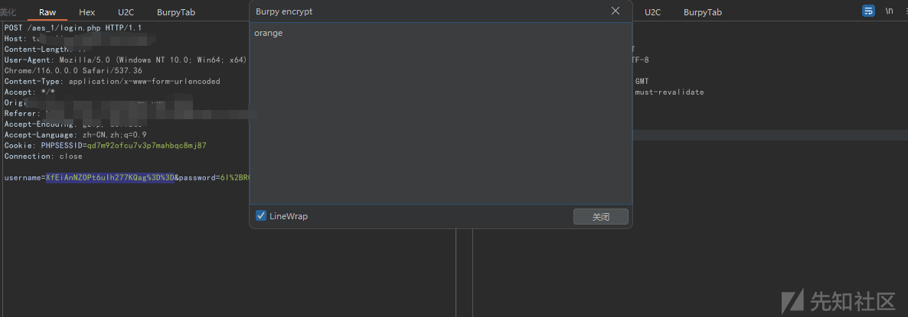

总结

1、编写burpy插件的脚本时需要将加解密函数放入到Burpy类中，其余的语法按照python常规语法来即可

2、在每次启动Burpy时，最好更换端口，不然会有奇奇怪怪的Bug出现。身为菜鸡的我虽然不懂是什么原因，但是多浪费几个小时的苦是吃过了。

3、python版本的问题，各位师傅在实践还请注意，毕竟burpy插件支持python2跟python3。本次学习环境，使用的是python3

​
