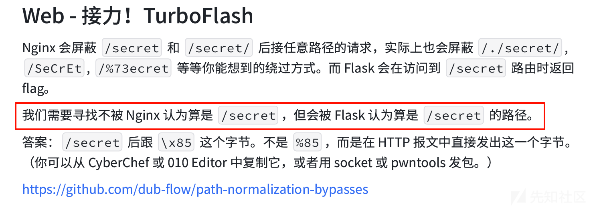
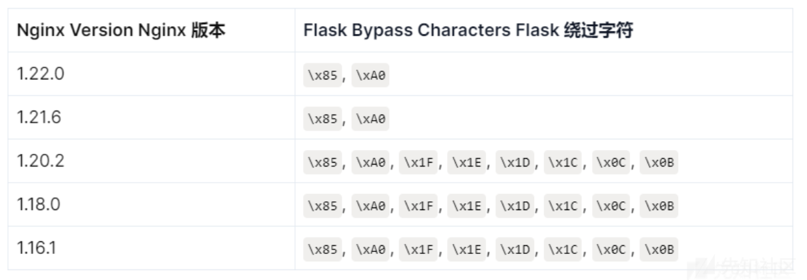
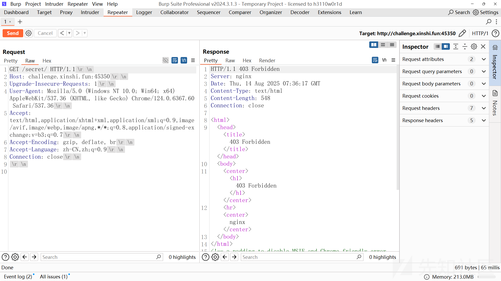
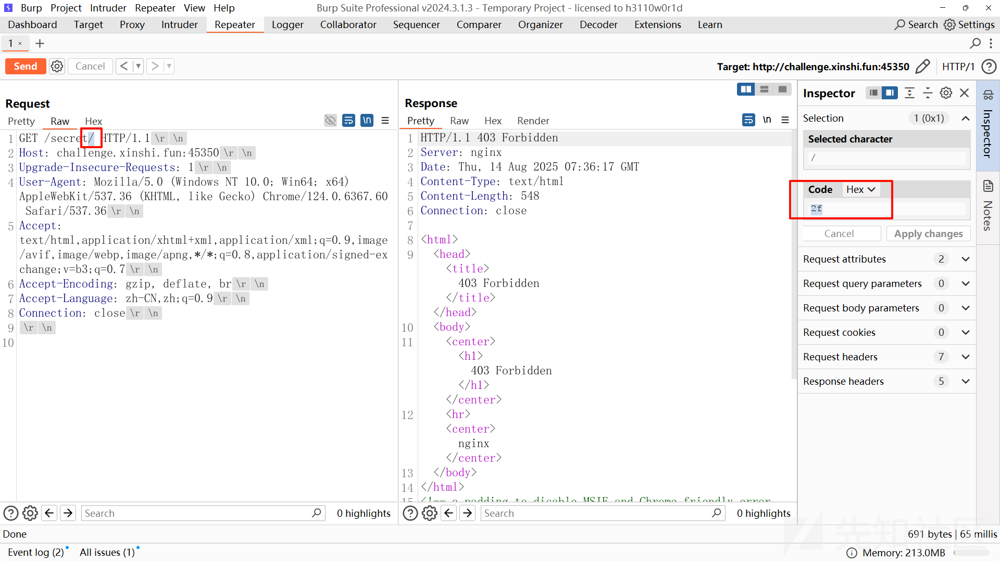
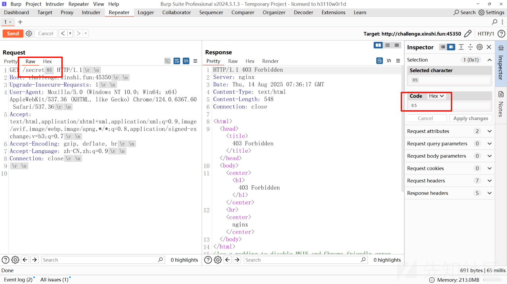
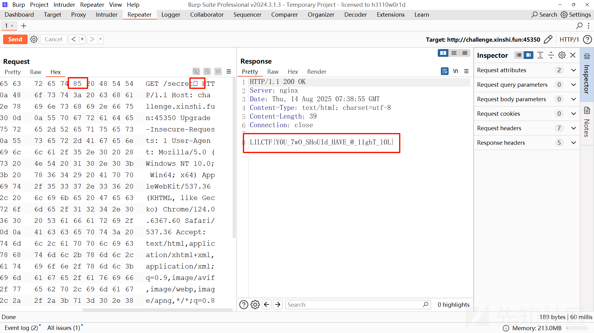

# Nginx 路径绕过-先知社区

> **来源**: https://xz.aliyun.com/news/18629  
> **文章ID**: 18629

---

# Nginx 解析漏洞分析

由一道CTF题目为开端进行展开学习

## 源码分析

首先我们来看一下提供的源代码，理解应用的基本结构和 Nginx 配置。

**server.py**

这是一个简单的 Flask 应用，定义了两个路由：

* 根路径/：返回欢迎信息 "Hello, CTFer!"
* /secret路径：返回环境变量中的 flag 值，这显然是我们需要获取的目标

应用运行在本地 8080 端口，而 Nginx 作为反向代理监听 80 端口，将请求转发给这个 Flask 应用。

```
# pylint: disable=missing-module-docstring,missing-function-docstring

import os
from flask import Flask

app = Flask(__name__)


@app.route("/")
def index():
    return "<h1>Hello, CTFer!</h1>"


@app.route("/secret")
def secret():
    return os.getenv("LILCTF_FLAG", "LILCTF{default}")


if __name__ == "__main__":
    app.run("0.0.0.0", 8080, debug=False)
```

**nginx.config**

Nginx 配置的核心是访问控制部分：

* 第一个 location 块：~\* ^/secret/?$ 匹配/secret或/secret/路径，使用deny all禁止访问
* 第二个 location 块：~\* ^/secret/ 匹配以/secret/开头的路径，同样禁止访问
* 其他所有请求都通过proxy\_pass转发到本地 8080 端口的 Flask 应用

从配置来看，本意是试图通过 Nginx 规则完全禁止对/secret相关路径的访问，但这种防护存在漏洞。

```
server {
    listen       80;
    server_name  localhost;

    location ~* ^/secret/?$ {
        deny all;
        return 403;
    }

    location ~* ^/secret/ {
        deny all;
        return 403;
    }

    location / {
        proxy_pass http://127.0.0.1:8080;
        proxy_set_header Host $host;
        proxy_set_header X-Real-IP $remote_addr;
        proxy_set_header X-Forwarded-For $proxy_add_x_forwarded_for;
        proxy_set_header X-Forwarded-Proto $scheme;
    }
}
```

## 漏洞分析

这个 Nginx 配置存在路径解析绕过漏洞，主要原因在于 Nginx 的正则匹配规则与实际路径处理逻辑之间存在不一致性。

1. **正则匹配的局限性**：配置中使用的正则表达式^/secret/?$和^/secret/看似能覆盖所有与/secret相关的路径，但没有考虑到特殊 Unicode 字符的情况。
2. **Nginx 的 Unicode 字符处理机制**：Nginx 在处理 URL 中的某些 Unicode 字符时，会将其规范化或忽略，而正则匹配则是基于原始字符进行的。这种差异导致攻击者可以构造特殊 URL，既能够绕过 Nginx 的正则匹配，又能被正确解析为/secret路径。
3. **关键漏洞点**：当请求中包含某些特殊 Unicode 字符时，例如 U+2026（水平省略号…）、U+0085（下一行字符）等，Nginx 的正则匹配会认为这不是/secret路径而允许访问，但其内部路径解析机制会忽略这些特殊字符，最终仍然将请求转发到/secret路径。

正如wp中概括一样



## 漏洞利用

诚如博客中总结的那样



首先尝试访问/secret路径，返回403，没有返回nginx版本信息

注：点击 Reques 右下方的\
按钮（显示不可见字符开关），此时可直观看到所有特殊字符的占位符



定位/secret后的字符后的位置，对hex进行处理



选择经过验证的高效绕过字符（优先使用\x85和\xa0）：

* \x85：对应 Unicode U+0085（下一行字符），Hex 编码为85
* \xa0：对应 Unicode U+00A0（非 - breaking 空格），Hex 编码为A0



转为Hex即可看见添加上了不可见字符，发送请求即可成功访问/secret路径



## 参考

[nginx deny限制路径绕过-先知社区](https://xz.aliyun.com/news/14403)
