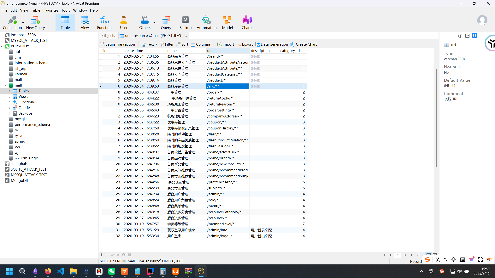
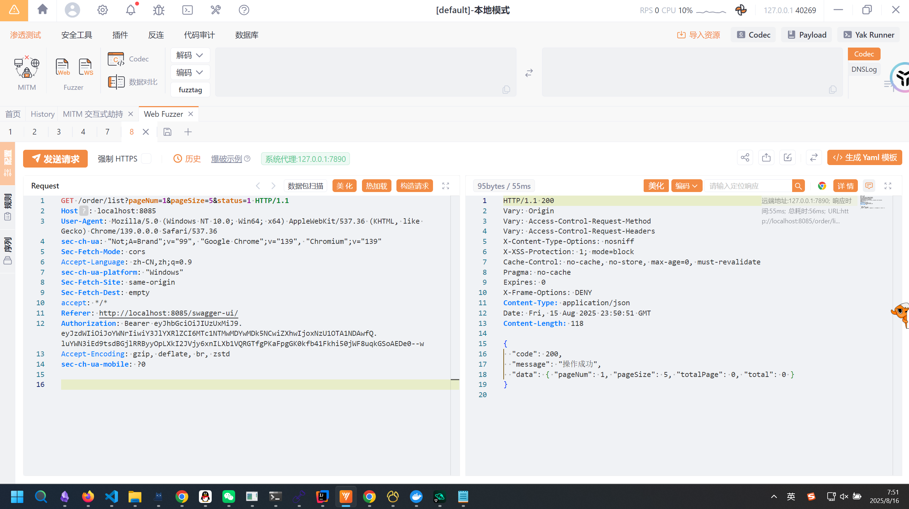
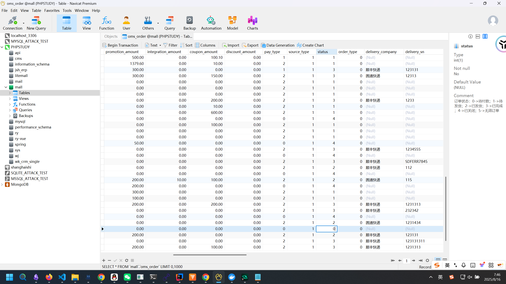
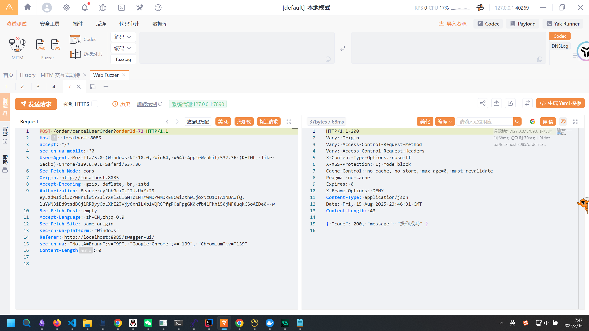
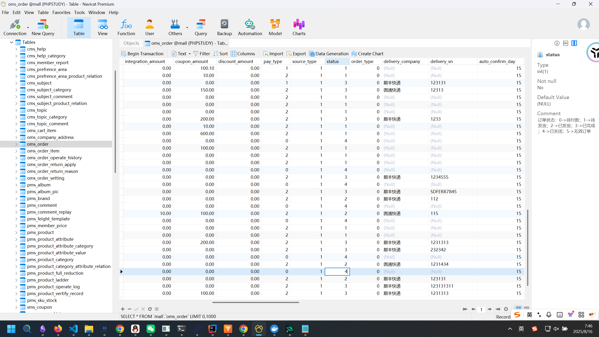
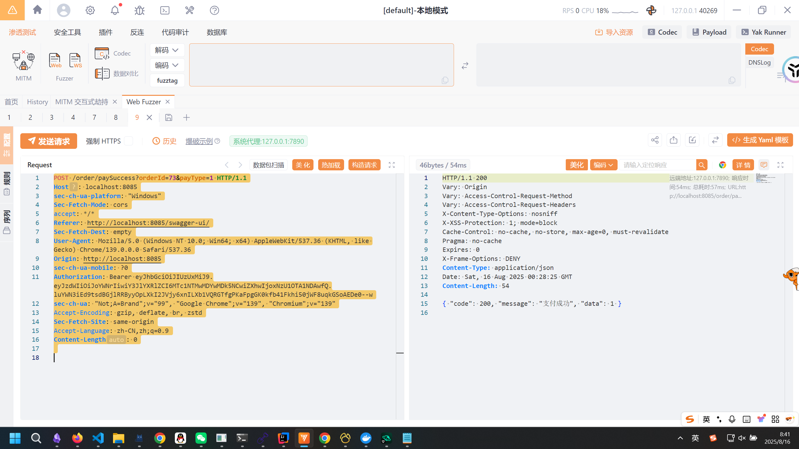
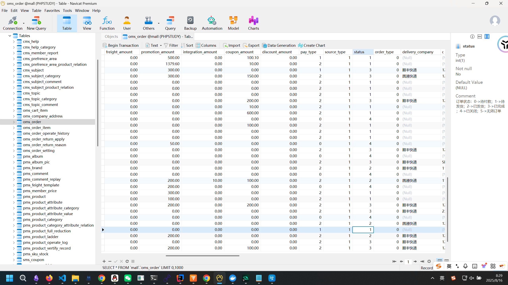

# 从 mall 0day IDOR 挖掘看 Spring 权限管理-先知社区

> **来源**: https://xz.aliyun.com/news/18639  
> **文章ID**: 18639

---

项目地址：<https://github.com/macrozheng/mall>  
mall是一个又 81.3k star的开源项目，分为Web管理端和APP端，其中的Web端已经被人挖的不剩啥了，今天主要来看APP端的IDOR支付漏洞。

# Spring 权限管理：垂直权限与水平越权实践

在企业级应用中，权限控制是不可绕过的环节。Spring 生态提供了丰富的权限管理手段，但不同类型的权限在实现方式和风险点上存在明显差异。本文结合实践经验，整理了垂直权限（Vertical Access Control）与水平越权（Horizontal Access Control）的特点和实现方式。

## 一、垂直权限

垂直权限主要控制“角色等级”对资源或操作的访问，比如只有管理员才能删除用户，普通用户无法访问系统配置。

### 1. HandlerInterceptor 拦截器

在 Spring MVC 中，可以通过 `HandlerInterceptor` 的 `preHandle()` 方法在请求到达 Controller 前进行权限校验：

```
@Override
public boolean preHandle(HttpServletRequest request, HttpServletResponse response, Object handler) throws Exception {
    String userId = request.getUserPrincipal().getName();
    String uri = request.getRequestURI();
    if (!permissionService.hasAccess(userId, uri)) {
        response.setStatus(HttpServletResponse.SC_FORBIDDEN);
        return false;
    }
    return true;
}
```

优点是逻辑集中，可统一管理；缺点是复杂规则需要手写，维护成本高。

### 2. Spring Security

* URL 级权限：通过配置 URL 与角色映射控制访问。
* 方法级注解：`@PreAuthorize` / `@PostAuthorize` 支持 SpEL 表达式动态判断。
* 自定义 `PermissionEvaluator`：可以实现复杂的业务规则。

```
@PreAuthorize("@permissionService.hasAccess(#id, principal.username)")
public void deleteResource(Long id) { ... }
```

### 3. Apache Shiro

* 注解方式：

```
@RequiresPermissions("resource:delete")
public void deleteResource(Long id) { ... }```
- 动态判断：
```java
Subject currentUser = SecurityUtils.getSubject();
if(currentUser.isPermitted("resource:delete:" + resourceId)) { ... }
```

Shiro 支持单条数据级别的权限，例如 `"document:read:123"`。

### 4. 自定义注解 + AOP

可以通过注解结合切面封装权限判断，逻辑可以精确到方法和参数级别：

```
@Target(ElementType.METHOD)
@Retention(RetentionPolicy.RUNTIME)
public @interface RequiresPermission { String value(); }
@Aspect
@Component
public class PermissionAspect {
    @Before("@annotation(requiresPermission) && args(id,..)")
    public void checkPermission(RequiresPermission requiresPermission, Long id) {
        if (!permissionService.hasPermission(id, requiresPermission.value())) {
            throw new AccessDeniedException("No permission");
        }
    }
}
```

## 二、水平越权

水平越权指用户尝试操作自己无权访问的资源，比如用户 A 修改用户 B 的数据。不同于垂直权限，水平权限检查依赖资源归属，通常需要分散在业务逻辑或数据库查询层：

* 资源归属判断零散，不像垂直权限可以集中配置。
* 用户关系复杂、资源多样时容易遗漏。
* 测试覆盖容易不足，生产环境中容易暴露。

### 1. 数据库层过滤

查询时限制数据仅属于当前用户或租户：

```
@Query("SELECT r FROM Resource r WHERE r.id = :id AND r.owner.id = :userId")
Optional<Resource> findByIdAndOwner(@Param("id") Long id, @Param("userId") Long userId);
```

### 2. 方法层判断

在 Service 或 Controller 层校验资源归属：

```
Resource res = resourceRepo.findById(id).orElseThrow();
if(!res.getOwnerId().equals(currentUserId)) {
    throw new AccessDeniedException("水平越权！");
}
```

### 3. AOP + 注解封装

将水平权限判断封装为注解，提高代码复用性：

```
@CheckOwnership
public void updateResource(Long id, ResourceUpdate update){ ... }
```

### 4. 数据库行级安全（RLS）

部分数据库（如 PostgreSQL、Oracle）支持行级安全，可以把水平权限控制放到数据库层，避免业务层遗漏。

# mall漏洞挖掘

## 一、垂直权限

来看mall-Security模块，其中的`DynamicSecurityFilter`继承了`AbstractSecurityInterceptor`，并重写了`doFilter`方法：

```
@Override
    public void doFilter(ServletRequest servletRequest, ServletResponse servletResponse, FilterChain filterChain) throws IOException, ServletException {
        HttpServletRequest request = (HttpServletRequest) servletRequest;
        FilterInvocation fi = new FilterInvocation(servletRequest, servletResponse, filterChain);
        //OPTIONS请求直接放行
        if(request.getMethod().equals(HttpMethod.OPTIONS.toString())){
            fi.getChain().doFilter(fi.getRequest(), fi.getResponse());
            return;
        }
        //白名单请求直接放行
        PathMatcher pathMatcher = new AntPathMatcher();
        for (String path : ignoreUrlsConfig.getUrls()) {
            if(pathMatcher.match(path,request.getRequestURI())){
                fi.getChain().doFilter(fi.getRequest(), fi.getResponse());
                return;
            }
        }
        //此处会调用AccessDecisionManager中的decide方法进行鉴权操作
        InterceptorStatusToken token = super.beforeInvocation(fi);
        try {
            fi.getChain().doFilter(fi.getRequest(), fi.getResponse());
        } finally {
            super.afterInvocation(token, null);
        }
    }
```

跟进去看`AccessDecisionManager`中的`decide`方法：

```
@Override
    public void decide(Authentication authentication, Object object,
                       Collection<ConfigAttribute> configAttributes) throws AccessDeniedException, InsufficientAuthenticationException {
        // 当接口未被配置资源时直接放行
        if (CollUtil.isEmpty(configAttributes)) {
            return;
        }
        Iterator<ConfigAttribute> iterator = configAttributes.iterator();
        while (iterator.hasNext()) {
            ConfigAttribute configAttribute = iterator.next();
            //将访问所需资源或用户拥有资源进行比对
            String needAuthority = configAttribute.getAttribute();
            for (GrantedAuthority grantedAuthority : authentication.getAuthorities()) {
                if (needAuthority.trim().equals(grantedAuthority.getAuthority())) {
                    return;
                }
            }
        }
        throw new AccessDeniedException("抱歉，您没有访问权限");
    }
```

这里的实质是调用了`DynamicSecurityMetadataSource`的`getAttributes`方法：

```
@PostConstruct
    public void loadDataSource() {
        configAttributeMap = dynamicSecurityService.loadDataSource();
    }

    public void clearDataSource() {
        configAttributeMap.clear();
        configAttributeMap = null;
    }

    @Override
    public Collection<ConfigAttribute> getAttributes(Object o) throws IllegalArgumentException {
        if (configAttributeMap == null) this.loadDataSource();
        List<ConfigAttribute>  configAttributes = new ArrayList<>();
        //获取当前访问的路径
        String url = ((FilterInvocation) o).getRequestUrl();
        String path = URLUtil.getPath(url);
        PathMatcher pathMatcher = new AntPathMatcher();
        Iterator<String> iterator = configAttributeMap.keySet().iterator();
        //获取访问该路径所需资源
        while (iterator.hasNext()) {
            String pattern = iterator.next();
            if (pathMatcher.match(pattern, path)) {
                configAttributes.add(configAttributeMap.get(pattern));
            }
        }
        // 未设置操作请求权限，返回空集合
        return configAttributes;
    }
```

其中对路径资源的规则是通过`dynamicSecurityService.loadDataSource`来加载的：

```
@Bean
    public DynamicSecurityService dynamicSecurityService() {
        return new DynamicSecurityService() {
            @Override
            public Map<String, ConfigAttribute> loadDataSource() {
                Map<String, ConfigAttribute> map = new ConcurrentHashMap<>();
                List<UmsResource> resourceList = resourceService.listAll();
                for (UmsResource resource : resourceList) {
                    map.put(resource.getUrl(), new org.springframework.security.access.SecurityConfig(resource.getId() + ":" + resource.getName()));
                }
                return map;
            }
        };
    }
```

这里通过`resourceService.listAll`来加载了规则，继续跟进：

```
@Service
public class UmsResourceServiceImpl implements UmsResourceService {
    @Autowired
    private UmsResourceMapper resourceMapper;
    @Autowired
    private UmsAdminCacheService adminCacheService;
    @Override
    public int create(UmsResource umsResource) {
        umsResource.setCreateTime(new Date());
        return resourceMapper.insert(umsResource);
    }

    @Override
    public int update(Long id, UmsResource umsResource) {
        umsResource.setId(id);
        int count = resourceMapper.updateByPrimaryKeySelective(umsResource);
        adminCacheService.delResourceListByResource(id);
        return count;
    }

    @Override
    public UmsResource getItem(Long id) {
        return resourceMapper.selectByPrimaryKey(id);
    }

    @Override
    public int delete(Long id) {
        int count = resourceMapper.deleteByPrimaryKey(id);
        adminCacheService.delResourceListByResource(id);
        return count;
    }

    @Override
    public List<UmsResource> list(Long categoryId, String nameKeyword, String urlKeyword, Integer pageSize, Integer pageNum) {
        PageHelper.startPage(pageNum,pageSize);
        UmsResourceExample example = new UmsResourceExample();
        UmsResourceExample.Criteria criteria = example.createCriteria();
        if(categoryId!=null){
            criteria.andCategoryIdEqualTo(categoryId);
        }
        if(StrUtil.isNotEmpty(nameKeyword)){
            criteria.andNameLike('%'+nameKeyword+'%');
        }
        if(StrUtil.isNotEmpty(urlKeyword)){
            criteria.andUrlLike('%'+urlKeyword+'%');
        }
        return resourceMapper.selectByExample(example);
    }

    @Override
    public List<UmsResource> listAll() {
        return resourceMapper.selectByExample(new UmsResourceExample());
    }
}
```

这里和数据库发生了交互，大概也能明白了，是有个名字类似`UmsResource`的表，其中写了对于路由的匹配规则，看一下数据库：  
  
大概看了一下，他对于路径的匹配规则非常的完整，所以想要构造出垂直越权是不可行的，这也体现了我们之前所提到的SpringSecurity在权限分配时的强大性。

## 二、水平越权

虽然项目对于垂直权限的管理比较好，但是由于水平权限分散在各个路由，因此还是很有可能构成水平越权。

### 漏洞一：/order/cancelUserOrder

这是我找到的第一个漏洞点，可以取消任意用户的订单：

```
@ApiOperation("用户取消订单")
    @RequestMapping(value = "/cancelUserOrder", method = RequestMethod.POST)
    @ResponseBody
    public CommonResult cancelUserOrder(Long orderId) {
        portalOrderService.cancelOrder(orderId);
        return CommonResult.success(null);
    }
```

跟进`portalOrderService.cancelOrder`：

```
@Override
    public void cancelOrder(Long orderId) {
        //查询未付款的取消订单
        OmsOrderExample example = new OmsOrderExample();
        example.createCriteria().andIdEqualTo(orderId).andStatusEqualTo(0).andDeleteStatusEqualTo(0);
        List<OmsOrder> cancelOrderList = orderMapper.selectByExample(example);
        if (CollectionUtils.isEmpty(cancelOrderList)) {
            return;
        }
        OmsOrder cancelOrder = cancelOrderList.get(0);
        if (cancelOrder != null) {
            //修改订单状态为取消
            cancelOrder.setStatus(4);
            orderMapper.updateByPrimaryKeySelective(cancelOrder);
            OmsOrderItemExample orderItemExample = new OmsOrderItemExample();
            orderItemExample.createCriteria().andOrderIdEqualTo(orderId);
            List<OmsOrderItem> orderItemList = orderItemMapper.selectByExample(orderItemExample);
            //解除订单商品库存锁定
            if (!CollectionUtils.isEmpty(orderItemList)) {
                portalOrderDao.releaseSkuStockLock(orderItemList);
            }
            //修改优惠券使用状态
            updateCouponStatus(cancelOrder.getCouponId(), cancelOrder.getMemberId(), 0);
            //返还使用积分
            if (cancelOrder.getUseIntegration() != null) {
                UmsMember member = memberService.getById(cancelOrder.getMemberId());
                memberService.updateIntegration(cancelOrder.getMemberId(), member.getIntegration() + cancelOrder.getUseIntegration());
            }
        }
    }
```

发现没有判定订单的归属，因此构成了水平越权。  
这里他的前端是个APP，没能搭起来，只能通过swagger-ui硬看接口  
首先注册一个新的用户，确认该用户没有任何订单：  
  
在数据库中选择一个订单状态为未支付的：  
  
就要这个73号了。向`/order/cancelUserOrder`发包来取消订单：  
  
查看数据库发现修改成功：  
  
如果说这个水平越权仅是能够取消其他用户的订单，并没有什么真正的危害，那么接下来的漏洞就比较nb了

### 漏洞二：/order/paySuccess

这个漏洞可以bypass掉付款将订单的状态修改为已支付，从而实现0元购；同时允许枚举ID修改其他人的订单的状态为已支付，使平台的交易系统整体瘫痪。

```
@ApiOperation("用户支付成功的回调")
    @RequestMapping(value = "/paySuccess", method = RequestMethod.POST)
    @ResponseBody
    public CommonResult paySuccess(@RequestParam Long orderId,@RequestParam Integer payType) {
        Integer count = portalOrderService.paySuccess(orderId,payType);
        return CommonResult.success(count, "支付成功");
    }
```

跟进`paySuccess`方法：

```
@Override
    public Integer paySuccess(Long orderId, Integer payType) {
        //修改订单支付状态
        OmsOrder order = new OmsOrder();
        order.setId(orderId);
        order.setStatus(1);
        order.setPaymentTime(new Date());
        order.setPayType(payType);
        orderMapper.updateByPrimaryKeySelective(order);
        //恢复所有下单商品的锁定库存，扣减真实库存
        OmsOrderDetail orderDetail = portalOrderDao.getDetail(orderId);
        int count = portalOrderDao.updateSkuStock(orderDetail.getOrderItemList());
        return count;
    }
```

这实在是太nb了，对前端的发包没有任何校验直接相信了！  
还是用之前的73号订单测试，把他的订单状态改回0。  
  
再去查看数据库，状态直接变成待发货了：  
  
搜了一下，这系统在互联网上还有300多资产，这漏洞还是任意的普通用户都可以利用的，结果可想而知了......

# 总结

相比于垂直越权，显然分散在各个路由的水平越权更容易挖掘，这也是我们在Java代码审计中要去关注的重点，而且这种越权是很难用扫描器发现的（AI也容易忽略），因此需要审计者自己多留意。  
上述两处漏洞均已提交至vuldb，期待编号ing。

参考链接：  
<https://github.com/macrozheng/mall/issues/925>  
<https://github.com/macrozheng/mall/issues/926>
