# OLLVM学习以及平坦化源码分析-先知社区

> **来源**: https://xz.aliyun.com/news/18642  
> **文章ID**: 18642

---

## LLVM

由于OLLVM是建立在LLVM编译器之上的东西，所以先简单介绍一下LLVM，LLVM是一种编译器，不同于gcc等，LLVM有很强的野心，它分为前后端，中间用的是一种语言来表示中间层，这大大的加强了它的灵活性，当新的编程语言用的时候，LLVM只需要添加一下前端的解释器就行，中间的IR可以简单的理解成中间语言，后端的产物就是比如elf，so，exe这也说明了LLVM编译器的平台无关性，而gcc这种编译器，前后端分的不是很开，导致新的语言出来时候，它的扩展性不强

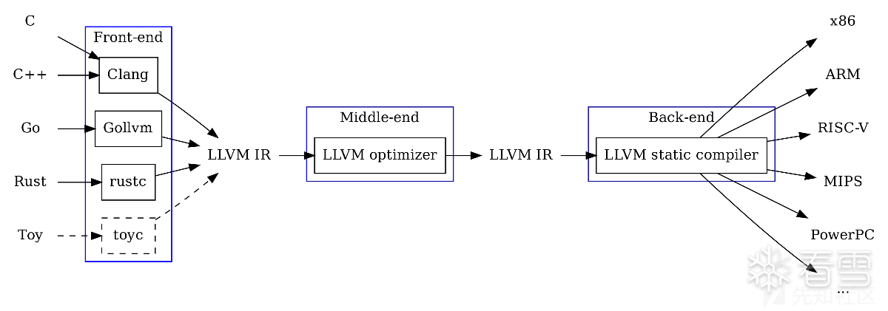

上图我觉得就很详细的表示了我说的前后端以及中间IR

**这里的前端就是一般的编译原理，通过词法分析，语法分析，语义分析生成中间代码**

**中间层IR经过了重要的步骤就是优化，然后可以有我们自己的Pass进行中间层IR的转换。OLLVM的核心逻辑就存在于这里的Pass**

**后端负责生成平台所用的机器码**

**​**

### 代码优化和代码混淆

前面说了LLVM的中间层IR会经过优化

在学习的过程中，我们可以多多看看这个优化具体体现在什么地方，中间层IR被翻译后，并不会直接被翻译成机器码，这中间就有代码优化的步骤

常见代码优化方式有：**删除无用代码，删除公共子表达式，常量合并等等**

**​**

**1.删除无用代码**

优化中如果程序发现有计算结果不会被计算的就会删除，这好理解

**2.删除公共子表达式**

就是对重复计算结果不重复计算，复用计算结果

```
int fff(int x,int y){
    int d=x*y;
    int f=x*y+2;
    int c=x*y+3;
}
```

大家可以看到这里的x\*y的结果其实是可以复用的，我们就可以把代码优化成

```
int fff(int x,int y){
    int d=x*y;
    int f=d+2;
    int c=d+3;
}
```

**3.常量合并**

其实就是一些常量计算结果直接在编译的时候被计算得到，然后直接写了结果，增强了程序运行效率

除此之外还有循环展开，寄存器分配等等优化方式

​

讲这些优化方式主要是为了引出我们的混淆，优化本质上可以理解成减少代码，**那我们混淆呢，也可以简单的理解成增加冗余代码**

​

### Pass

<https://llvm.org/docs/WritingAnLLVMNewPMPass.html>

我们可以看一下官方文档对Pass的定义

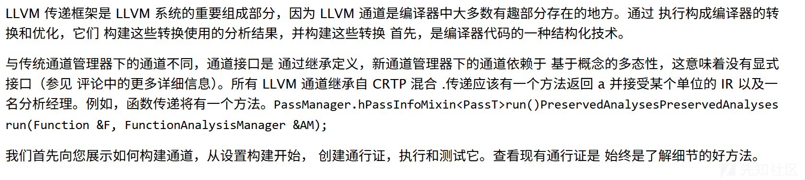

Pass是在中间IR阶段对中间代码进行优化，混淆等等操作的通道，而且是链式的，前一个Pass的结果可以作为下一个Pass的输入进去

这里的Pass分为两类，一类是分析analysis以提供信息为主

一类是transform,以优化中间代码为主，OLLVM的主要代码就在这个transform的目录下

注册一个Pass的格式

```
#include "llvm/Pass.h"          // 引入定义 Pass 基类及相关接口的头文件
#include "llvm/IR/Function.h"   // 引入 LLVM IR 中 Function 类型的定义
#include "llvm/Support/raw_ostream.h" // 引入支持输出的原始流（errs，outs 等）

using namespace llvm;

// 将 Pass 实现在匿名命名空间中，可避免命名冲突
namespace {
//继承自functionPass
struct EncodeFunctionName : public FunctionPass {
  static char ID;  // 每个 Pass 都需要一个 ID 来标识自己
  
  // 构造函数：向父类（FunctionPass）的构造函数传递 ID
  EncodeFunctionName() : FunctionPass(ID) {}

  // runOnFunction 方法是 FunctionPass 的核心接口，每当 Pass 在一个 Function 对象上运行时调用
  bool runOnFunction(Function &F) override {
    // 使用 write_escaped 输出函数名称，可以将一些特殊字符转义输出
    errs().write_escaped(F.getName()) << '
';
    // 返回 false，表示该 Pass 并未改变当前函数的 IR（如果有更改 IR，需返回 true）
    return false;
  }
}; e

} 
// 在匿名命名空间之外定义静态成员变量 ID
char EncodeFunctionName::ID = 0;


static RegisterPass<EncodeFunctionName> X("encode", "Hello EncodeFunctionName Pass",
                                          false /* Only looks at CFG */,
                                          false /* Analysis Pass */);

```

### IR语法

IR是由各种Pass的目标，有两种表现形式，一种是.ll，另外一种是方便机器处理的如.bc

为了后面更好的讲解OLLVM平坦化混淆的整个过程，可以先了解一下IR语法的格式

LLVM的编译网上文章很多了，这里不再赘述

写一个简单的cpp代码

```

#include <iostream>
using namespace std;
int add(int x, int y) {

    cout << "call add function" << endl;
    return x + y;
}

int main()
{
    cout << "Hello World!
";
    int x = 1;
    int y = 2;
    cout << add(x,y) << endl;
    return 0;
}

```

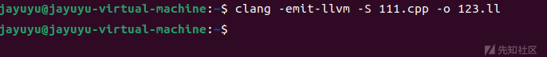

clang -emit-llvm -S 111.cpp -o 123.ll

利用LLVM的clang，讲cpp编译成中间语言IR

```
; ModuleID = '111.cpp'
source_filename = "111.cpp"
target datalayout = "e-m:e-p270:32:32-p271:32:32-p272:64:64-i64:64-f80:128-n8:16:32:64-S128"
target triple = "x86_64-unknown-linux-gnu"

%"class.std::ios_base::Init" = type { i8 }
%"class.std::basic_ostream" = type { i32 (...)**, %"class.std::basic_ios" }
%"class.std::basic_ios" = type { %"class.std::ios_base", %"class.std::basic_ostream"*, i8, i8, %"class.std::basic_streambuf"*, %"class.std::ctype"*, %"class.std::num_put"*, %"class.std::num_get"* }
%"class.std::ios_base" = type { i32 (...)**, i64, i64, i32, i32, i32, %"struct.std::ios_base::_Callback_list"*, %"struct.std::ios_base::_Words", [8 x %"struct.std::ios_base::_Words"], i32, %"struct.std::ios_base::_Words"*, %"class.std::locale" }
%"struct.std::ios_base::_Callback_list" = type { %"struct.std::ios_base::_Callback_list"*, void (i32, %"class.std::ios_base"*, i32)*, i32, i32 }
%"struct.std::ios_base::_Words" = type { i8*, i64 }
%"class.std::locale" = type { %"class.std::locale::_Impl"* }
%"class.std::locale::_Impl" = type { i32, %"class.std::locale::facet"**, i64, %"class.std::locale::facet"**, i8** }
%"class.std::locale::facet" = type <{ i32 (...)**, i32, [4 x i8] }>
%"class.std::basic_streambuf" = type { i32 (...)**, i8*, i8*, i8*, i8*, i8*, i8*, %"class.std::locale" }
%"class.std::ctype" = type <{ %"class.std::locale::facet.base", [4 x i8], %struct.__locale_struct*, i8, [7 x i8], i32*, i32*, i16*, i8, [256 x i8], [256 x i8], i8, [6 x i8] }>
%"class.std::locale::facet.base" = type <{ i32 (...)**, i32 }>
%struct.__locale_struct = type { [13 x %struct.__locale_data*], i16*, i32*, i32*, [13 x i8*] }
%struct.__locale_data = type opaque
%"class.std::num_put" = type { %"class.std::locale::facet.base", [4 x i8] }
%"class.std::num_get" = type { %"class.std::locale::facet.base", [4 x i8] }

@_ZStL8__ioinit = internal global %"class.std::ios_base::Init" zeroinitializer, align 1
@__dso_handle = external hidden global i8
@_ZSt4cout = external dso_local global %"class.std::basic_ostream", align 8
@.str = private unnamed_addr constant [18 x i8] c"call add function\00", align 1
@.str.1 = private unnamed_addr constant [14 x i8] c"Hello World!\0A\00", align 1
@llvm.global_ctors = appending global [1 x { i32, void ()*, i8* }] [{ i32, void ()*, i8* } { i32 65535, void ()* @_GLOBAL__sub_I_111.cpp, i8* null }]

; Function Attrs: noinline uwtable
define internal void @__cxx_global_var_init() #0 section ".text.startup" {
  call void @_ZNSt8ios_base4InitC1Ev(%"class.std::ios_base::Init"* noundef nonnull align 1 dereferenceable(1) @_ZStL8__ioinit)
  %1 = call i32 @__cxa_atexit(void (i8*)* bitcast (void (%"class.std::ios_base::Init"*)* @_ZNSt8ios_base4InitD1Ev to void (i8*)*), i8* getelementptr inbounds (%"class.std::ios_base::Init", %"class.std::ios_base::Init"* @_ZStL8__ioinit, i32 0, i32 0), i8* @__dso_handle) #3
  ret void
}

declare dso_local void @_ZNSt8ios_base4InitC1Ev(%"class.std::ios_base::Init"* noundef nonnull align 1 dereferenceable(1)) unnamed_addr #1

; Function Attrs: nounwind
declare dso_local void @_ZNSt8ios_base4InitD1Ev(%"class.std::ios_base::Init"* noundef nonnull align 1 dereferenceable(1)) unnamed_addr #2

; Function Attrs: nounwind
declare dso_local i32 @__cxa_atexit(void (i8*)*, i8*, i8*) #3

; Function Attrs: mustprogress noinline optnone uwtable
define dso_local noundef i32 @_Z3addii(i32 noundef %0, i32 noundef %1) #4 {
  %3 = alloca i32, align 4
  %4 = alloca i32, align 4
  store i32 %0, i32* %3, align 4
  store i32 %1, i32* %4, align 4
  %5 = call noundef nonnull align 8 dereferenceable(8) %"class.std::basic_ostream"* @_ZStlsISt11char_traitsIcEERSt13basic_ostreamIcT_ES5_PKc(%"class.std::basic_ostream"* noundef nonnull align 8 dereferenceable(8) @_ZSt4cout, i8* noundef getelementptr inbounds ([18 x i8], [18 x i8]* @.str, i64 0, i64 0))
  %6 = call noundef nonnull align 8 dereferenceable(8) %"class.std::basic_ostream"* @_ZNSolsEPFRSoS_E(%"class.std::basic_ostream"* noundef nonnull align 8 dereferenceable(8) %5, %"class.std::basic_ostream"* (%"class.std::basic_ostream"*)* noundef @_ZSt4endlIcSt11char_traitsIcEERSt13basic_ostreamIT_T0_ES6_)
  %7 = load i32, i32* %3, align 4
  %8 = load i32, i32* %4, align 4
  %9 = add nsw i32 %7, %8
  ret i32 %9
}

declare dso_local noundef nonnull align 8 dereferenceable(8) %"class.std::basic_ostream"* @_ZStlsISt11char_traitsIcEERSt13basic_ostreamIcT_ES5_PKc(%"class.std::basic_ostream"* noundef nonnull align 8 dereferenceable(8), i8* noundef) #1

declare dso_local noundef nonnull align 8 dereferenceable(8) %"class.std::basic_ostream"* @_ZNSolsEPFRSoS_E(%"class.std::basic_ostream"* noundef nonnull align 8 dereferenceable(8), %"class.std::basic_ostream"* (%"class.std::basic_ostream"*)* noundef) #1

declare dso_local noundef nonnull align 8 dereferenceable(8) %"class.std::basic_ostream"* @_ZSt4endlIcSt11char_traitsIcEERSt13basic_ostreamIT_T0_ES6_(%"class.std::basic_ostream"* noundef nonnull align 8 dereferenceable(8)) #1

; Function Attrs: mustprogress noinline norecurse optnone uwtable
define dso_local noundef i32 @main() #5 {
  %1 = alloca i32, align 4
  %2 = alloca i32, align 4
  %3 = alloca i32, align 4
  store i32 0, i32* %1, align 4
  %4 = call noundef nonnull align 8 dereferenceable(8) %"class.std::basic_ostream"* @_ZStlsISt11char_traitsIcEERSt13basic_ostreamIcT_ES5_PKc(%"class.std::basic_ostream"* noundef nonnull align 8 dereferenceable(8) @_ZSt4cout, i8* noundef getelementptr inbounds ([14 x i8], [14 x i8]* @.str.1, i64 0, i64 0))
  store i32 1, i32* %2, align 4
  store i32 2, i32* %3, align 4
  %5 = load i32, i32* %2, align 4
  %6 = load i32, i32* %3, align 4
  %7 = call noundef i32 @_Z3addii(i32 noundef %5, i32 noundef %6)
  %8 = call noundef nonnull align 8 dereferenceable(8) %"class.std::basic_ostream"* @_ZNSolsEi(%"class.std::basic_ostream"* noundef nonnull align 8 dereferenceable(8) @_ZSt4cout, i32 noundef %7)
  %9 = call noundef nonnull align 8 dereferenceable(8) %"class.std::basic_ostream"* @_ZNSolsEPFRSoS_E(%"class.std::basic_ostream"* noundef nonnull align 8 dereferenceable(8) %8, %"class.std::basic_ostream"* (%"class.std::basic_ostream"*)* noundef @_ZSt4endlIcSt11char_traitsIcEERSt13basic_ostreamIT_T0_ES6_)
  ret i32 0
}

declare dso_local noundef nonnull align 8 dereferenceable(8) %"class.std::basic_ostream"* @_ZNSolsEi(%"class.std::basic_ostream"* noundef nonnull align 8 dereferenceable(8), i32 noundef) #1

; Function Attrs: noinline uwtable
define internal void @_GLOBAL__sub_I_111.cpp() #0 section ".text.startup" {
  call void @__cxx_global_var_init()
  ret void
}

attributes #0 = { noinline uwtable "frame-pointer"="all" "min-legal-vector-width"="0" "no-trapping-math"="true" "stack-protector-buffer-size"="8" "target-cpu"="x86-64" "target-features"="+cx8,+fxsr,+mmx,+sse,+sse2,+x87" "tune-cpu"="generic" }
attributes #1 = { "frame-pointer"="all" "no-trapping-math"="true" "stack-protector-buffer-size"="8" "target-cpu"="x86-64" "target-features"="+cx8,+fxsr,+mmx,+sse,+sse2,+x87" "tune-cpu"="generic" }
attributes #2 = { nounwind "frame-pointer"="all" "no-trapping-math"="true" "stack-protector-buffer-size"="8" "target-cpu"="x86-64" "target-features"="+cx8,+fxsr,+mmx,+sse,+sse2,+x87" "tune-cpu"="generic" }
attributes #3 = { nounwind }
attributes #4 = { mustprogress noinline optnone uwtable "frame-pointer"="all" "min-legal-vector-width"="0" "no-trapping-math"="true" "stack-protector-buffer-size"="8" "target-cpu"="x86-64" "target-features"="+cx8,+fxsr,+mmx,+sse,+sse2,+x87" "tune-cpu"="generic" }
attributes #5 = { mustprogress noinline norecurse optnone uwtable "frame-pointer"="all" "min-legal-vector-width"="0" "no-trapping-math"="true" "stack-protector-buffer-size"="8" "target-cpu"="x86-64" "target-features"="+cx8,+fxsr,+mmx,+sse,+sse2,+x87" "tune-cpu"="generic" }

!llvm.module.flags = !{!0, !1, !2}
!llvm.ident = !{!3}

!0 = !{i32 1, !"wchar_size", i32 4}
!1 = !{i32 7, !"uwtable", i32 1}
!2 = !{i32 7, !"frame-pointer", i32 2}
!3 = !{!"Android (9352603, based on r450784d1) clang version 14.0.7 (https://android.googlesource.com/toolchain/llvm-project 4c603efb0cca074e9238af8b4106c30add4418f6)"}
```

东西特别多

@代表的全局符号，define用于函数体的定义，declare用于外部函数

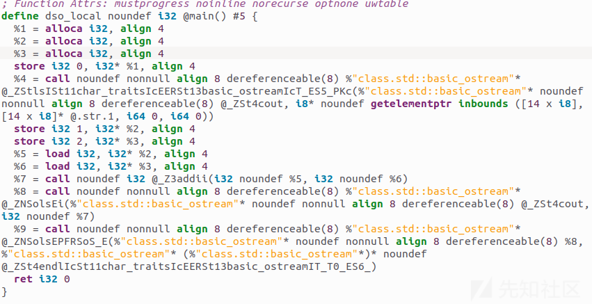

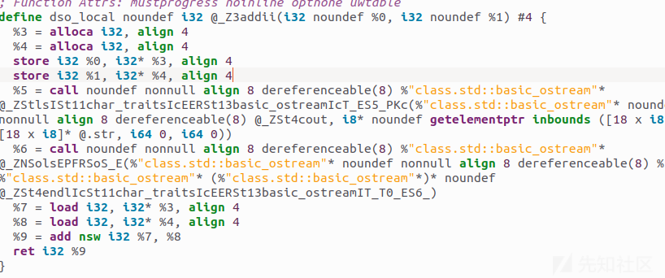

%1，%2等等是SSA寄存器，存储指令结果，i32是32位整数类型。

alloca i32 ，align 4 表示在栈上分配32位整数，保证地址以4字节对齐

store i32 %0, i32\* %1, align 4 将寄存器 %0（一 i32 值）存入指针 %1 指向的内存，内存地址需 4 字节对齐。

load i32, i32\* %1, align 4：从对齐到 4 字节的指针 %1 读取一个 i32，并将结果放入下一个 % 寄存器。

​

​

### LLVM的一些命令

```
//将c代码转换为LVM IR
clang -S -emit-llvm hello.cpp -o hello.ll

clang -c -emit-llvm hello.cpp -o hello.bc

//将LLVMbitcode转换为汇编
llc hello_clang.bc -o hello_clang.s    

//将bitcode转换回IR
llvm-dis hello_clang.bc -o hello_clang_dis.ll
```

```
opt -load LLVMObfuscator.so -hlw -S hello.ll -o hello_opt.ll
//opt是读取bitcode和执行pass的工具
-hlw 是 LLVM Pass 中自定义的参数，用来指定使用哪个 Pass 进行优化
```

## OLLVM源码编译及分析

<https://github.com/buffcow/ollvm-project/tree/14.x>

下载源码然后编译，我这里用的linux虚拟机上编译的，大概4k多个文件，我是重新编译的OLLVM，图方便没有去迁移代码在LLVM上，所以相当于先编译了一遍LLVM，后又编译了一遍OLLVM，如果想要迁移的化可以去commit上找，很详细


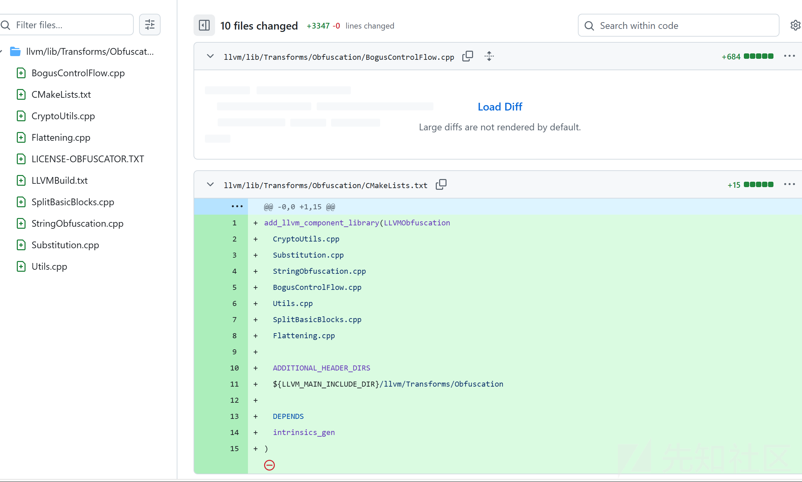

```
cmake -S llvm -B build_debug -G Ninja -DLLVM_ENABLE_PROJECTS="clang" -DCMAKE_BUILD_TYPE=Debug -DLLVM_INCLUDE_TESTS=OFF  
sudo cmake --build build -j8     
```

这里注意DCMAKE\_BUILD\_TYPE=Debug如果编译成了Release版本的化，调试过程中就无法命中断点，本人就在编译问题上卡了好久，如果实在无法编译debug版本的化只能调试输出了

如果只想要输出调试的化就修改源代码，然后重新编译一下so

```
ninja LLVMObfuscation
ninja clang
```

然后去build\_debug/bin下

```
./clang -mllvm -fla '/home/jayuyu/111.c' -o '/home/jayuyu/001'
```

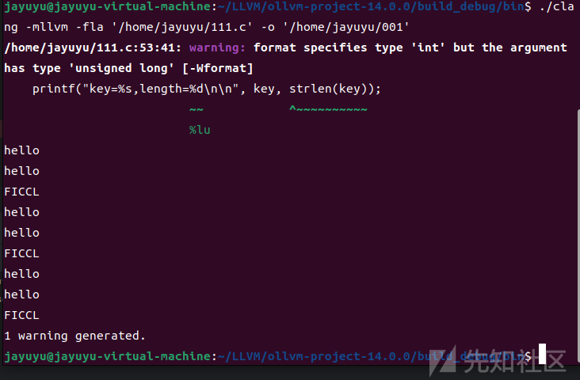

### Pass基类

常见的Pass分为ModulePass，FunctionPass，BasicBlockPass

1.ModulePass针对的整个Module，一般都是一个源文件，可以对齐进行跨函数分析

2.FunctionPass就是以针对Function运行的，LLVM会在IR层针对每个函数运行这个Pass的runOnFunction方法

3.BasicBlockPass，针对每一个基本块，基本块是函数中的一个基本单位，表示一组顺序执行的指令。每个基本块以一个标签开始，并以一个终止指令（如返回指令或分支指令）结束。这在平坦化源码中频繁出现

### Module及其成员列表

```
Module {
  GlobalListType   GlobalList;    // 全局变量列表
  FunctionListType FunctionList;  // 函数列表
  AliasListType    AliasList;     // 别名列表
  IFuncListType    IFuncList;     // “IFunc” 列表（间接函数）
  NamedMDListType  NamedMDList;   // 命名元数据列表
  …
}
```

### LLVM类型查询和安全转换模板函数

`isa<T>(X)`

`dyn_cast<T>(X)`

`cast<T>(X)`

这三个模板函数在源码中经常出现，是LLVM自己实现的。

#### isa<T>(x)

这个的作用是运行时检查x是不是属于T类型，有种C++泛型编程的感觉，返回值是boo类型，如果是这个类型就true，否则就false

```
if (isa<CallInst>(inst)) {
    // inst 确实是一个 CallInst 或其子类
}
```

#### dyn\_cast<T>(X)

这个的作用是在运行的时候将x向下转换成T类型

返回值是当isa<T>(x)为true时就返回一个指向T的指针，不然就返回null

```
if (auto *CI = dyn_cast<CallInst>(inst)) {
  // 只有当 inst 是 CallInst 时，CI 非空
  CI->getCalledFunction()->print(errs());
} else {
  // inst 不是 CallInst
}

```

#### cast<T>(x)

运行时断言x是T或T的子类，然后进行转换

```
// 确信 inst 是 CallInst，否则会在调试模式下断言失败
auto *CI = cast<CallInst>(inst);
Function *callee = CI->getCalledFunction();

```

### 源码分析

#### 写一个简单例子

我们用简易的c语言程序做个例子

网上copy的代码

```
/*字符串加密解密程序 凯撒加密*/
#include <stdio.h>
#include <stdlib.h>
#include <string.h>
 
//函数encode()将字母顺序推后n位，实现文件加密功能
void encode(char str[],int n){
    char c;
    int i;
    for(i=0;i<strlen(str);++i){  //遍历字符串
        c=str[i];
        if(c>='a' && c<='z'){  //c是小写字母
            if(c+n%26<='z'){  //若加密后不超出小写字母范围
                str[i]=(char)(c+n%26);  //加密函数
            }else{  //加密后超出小写字母范围,从头开始循环小写字母
                str[i]=(char)(c+n%26-26);
            }
        }else if(c>='A' && c<='Z'){ //c为大写字母
            if(c + n%26 <= 'Z'){  //加密后不超出大写字母范围
                str[i]=(char)(c+n%26);
            }else{  //加密后超出大写字母范围,从头开始循环大写字母
                str[i]=(char)(c+n%26-26);
            }
        }else{  //不是字母，不加密
            str[i]=c;
        }
    }
    printf("
After encode: 
");
    puts(str);  //输出加密后的字符串
}
 
 
//decode()实现解密功能，将字母顺序前移n位
void decode(char str[],int n){
    char c;
    int i;
    //遍历字符串
    for(i=0;i<strlen(str);++i){
        c=str[i];
        //c为小写字母
        if(c>='a' && c<='z'){
            //解密后还为小写字母，直接解密
            if(c-n%26>='a'){
                str[i]=(char)(c-n%26);
            }else{
                //解密后不为小写字母了，通过循环小写字母处理为小写字母
                str[i]=(char)(c-n%26+26);
            }
        }else if(c >= 'A' && c<='Z'){  //c为大写字母
            if(c-n%26>='A'){  //解密后还为大写字母
                str[i]=(char)(c-n%26);
            }else{  //解密后不为大写字母了,循环大写字母,处理为大写字母
                str[i]=(char)(c-n%26+26);
            }
        }else{  //非字母不处理
            str[i]=c;
        }
    }
    printf("
After decode: 
");
    puts(str);  //输出解密后的字符串
}//该函数代码有冗余，读者可改进
 
int main()
{
    char str[50];
    int k=0,n=0,i=1;
    printf("
Please input strings: ");
    scanf("%s",str);  //输入加密解密字符串
    //打印菜单
    printf("-----------------
");
    printf("1: Encryption
");
    printf("2: Decryption
");
    printf("3: Violent Crack
");  //暴力破解
    printf("-----------------
");
    printf("
Please choose: ");
    scanf("%d",&k);
    if(k==1){  //加密
        printf("
Please input number: ");
        scanf("%d",&n);
        encode(str,n);
    }else if(k==2){  //解密
        printf("
Please input number: ");
        scanf("%d",&n);
        decode(str,n);
    }else{
        for(i=1;i<=25;++i){  //尝试所有可能的n值进行暴力破解
            printf("%d ",i);
            decode(str,i);
        }
    }
    return 0;
}
```

生成两个IR，一个混淆过的，一个没有混淆过的

```
 clang -emit-llvm -S hello_clang.c -o hello_clang.ll
```

```
./clang -mllvm -fla -S -emit-llvm /home/jayuyu/111.c -o /home/jayuyu/111_fla.ll

```

后面分析区别

​

​

值得一提的是，平坦化的传入参数是Function类型，意思是对每一个函数都回进行平坦化的操作

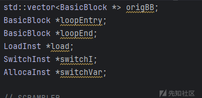

首先源码一来先定义了几个变量，为后面的宏观处理做好铺垫

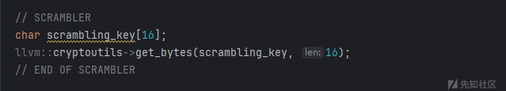

这里是生成的随机数密钥，为后面的switchcase的值作准备

#### 收集和处理原始基本块

```
// Save all original BB
  for (Function::iterator i = f->begin(); i != f->end(); ++i) {
    BasicBlock *tmp = &*i;
    origBB.push_back(tmp);
                            //把函数中的所有基本块存入origBB
    BasicBlock *bb = &*i;
    if (isa<InvokeInst>(bb->getTerminator())) {      //isa<InvokeInst>()判断这条终极指令是不是InvokeInst  getTerminator()是获取终结指令如return br invoke
      return false;
    }
  }
                                                                     //把函数中的所有基本块存入origBB
  // Nothing to flatten
  if (origBB.size() <= 1) {
    return false;
  }

  // Remove first BB
  origBB.erase(origBB.begin());

  // Get a pointer on the first BB
  Function::iterator tmp = f->begin(); //++tmp;
  BasicBlock *insert = &*tmp;
                                                                  //把函数的第一个基本块取出来，准备在后面插入平坦化需要的代码
  // If main begin with an if
  BranchInst *br = NULL;
  //下面的是判断入口块的末尾指令是不是跳转
  if (isa<BranchInst>(insert->getTerminator())) {
    //如果是BranchInst（跳转），则cast成BranchInst*
    br = cast<BranchInst>(insert->getTerminator());
  }

  if ((br != NULL && br->isConditional()) ||                        //  bool isConditional()   const { return getNumOperands() == 3; } 如果是条件跳转的话，是有三个操作数的
      insert->getTerminator()->getNumSuccessors() > 1) {        //如果终结指令多于一条后继
    BasicBlock::iterator i = insert->end();     //指向最后一条指令的后面
    --i;

    if (insert->size() > 1) {           //再退一步，指向最后一条指令的前一天指令
      --i;
    }

    BasicBlock *tmpBB = insert->splitBasicBlock(i, "first");      //分离，把前置初始化逻辑和后面的函数体分离 把指令后的搬到tmpBB，前面的不变
    origBB.insert(origBB.begin(), tmpBB);     //在origBB.begin()前插入tmpBB              //分离之后会自动在原块加上br跳转，跳转到分离之后的新块
  }

  // Remove jump
  insert->getTerminator()->eraseFromParent();             //把自动插入的跳转删除

```

这里的第一个循环是以函数的BasicBlock为基本单位依次存放进orignBB中，为后面的分发case做准备

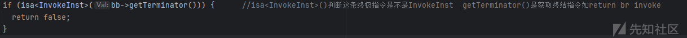

这个判断是在循环中获得基本块的终结指令并且判断是不是 InvokeInst 。这个是异常处理的调用，不同于一般的函数跳转等等，所以返回false就不支持扁平化处理了

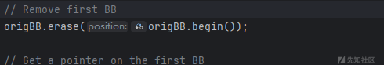

之后移除了第一个块，因为第一个基本块是用于变量赋值等等初始化，之后针对第一个基本块进行了判断最后指令是不是跳转 getTerminator()方法是获取末尾指令，之后用了isConditional（）方法去判断终结指令是不是一条，这里的意思是如果第一个块是这样的

%cmp = icmp sgt i32 %y, 0

br i1 %cmp, label %then, label %else

这种的话就直接分离这两个指令和前面的基本块

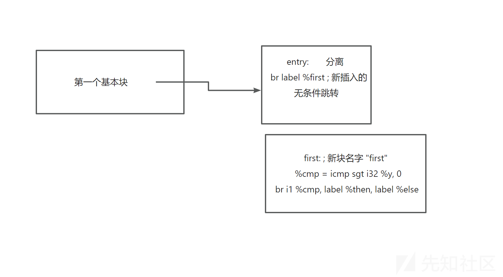

分离是为了给后面的循环分发做准备，这里差不多是这样的，之后删除了entry块的自动插入的无条件跳转

#### 创建初始变量

```
 // Create switch variable and set as it
  switchVar =new AllocaInst(Type::getInt32Ty(f->getContext()), 0, "switchVar", insert);   //分配一个i32变量，名字是switchVar，插入在insert基本块当前插入点
  new StoreInst(
      ConstantInt::get(Type::getInt32Ty(f->getContext()),
                       llvm::cryptoutils->scramble32(0, scrambling_key)),     //把初始值0做一次打乱（加密），然后存到switchVar
      switchVar, insert);
```

这里是插入了一个switchVar，用key加密打乱了一下

#### 构造主循环框架

```
  // Create main loop
  loopEntry = BasicBlock::Create(f->getContext(), "loopEntry", f, insert); //第一个参数是指定这个函数的上下文，第二个是名称，第三个是将这两个新快插入当前f，第四个参数是把这两个块插入insert之前
  loopEnd = BasicBlock::Create(f->getContext(), "loopEnd", f, insert);

  load = new LoadInst(switchVar->getType()->getElementType(), switchVar, "switchVar", loopEntry);//从switchVar地址读取32位整型然后插入到loopEntry的末尾

  // Move first BB on top
  insert->moveBefore(loopEntry);                        //把insert移到loopEntry之前
  BranchInst::Create(loopEntry, insert);         //在insert末尾插入一条无条件跳转到loopEntry

  // loopEnd jump to loopEntry
  BranchInst::Create(loopEntry, loopEnd);          //在loopEnd末尾插入一条无条件跳转到loopEntry
```

接着用BasicBlock::Create()方法在第一个块insert之前插入一个loopEntry，再插入一个loopEnd，这种方法只是物理块的顺序，不会产生跳转的指令，只有

```
BranchInst::Create(loopEntry, insert);         //在insert末尾插入一条无条件跳转到loopEntry
```

这个方法是插入跳转的指令

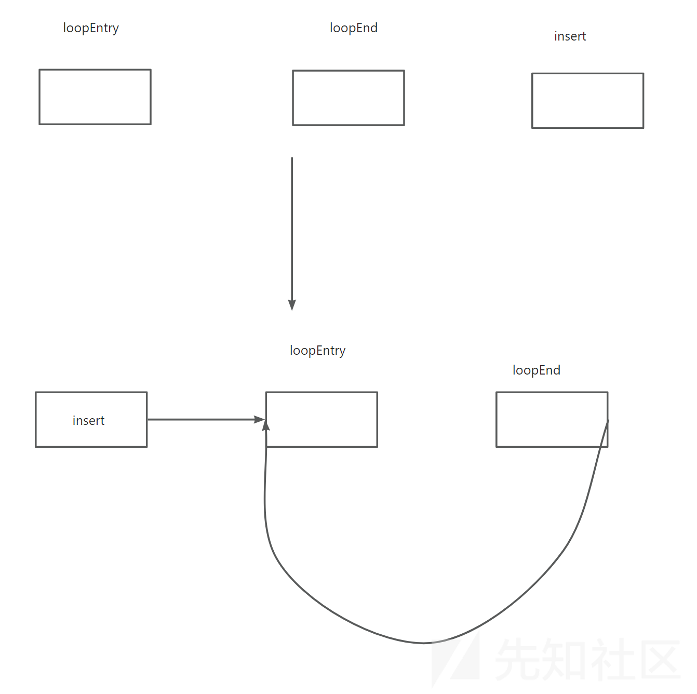

#### 创建分发 `SwitchInst`

```
 BasicBlock *swDefault =
      BasicBlock::Create(f->getContext(), "switchDefault", f, loopEnd);
  BranchInst::Create(loopEnd, swDefault);

  // Create switch instruction itself and set condition
  switchI = SwitchInst::Create(&*f->begin(), swDefault, 0, loopEntry);    //第一个是初始判定值，用于switch的分支，第二个是case不匹配时的跳转，也就是default，第三个是预留从case数量
                                                                                                //第四个是把swicth指令插入到loopEntry的结尾
  switchI->setCondition(load);                        //%val = load i32, i32* %switchVar.addr    switch i32 %val, label %swDefault []
  // Remove branch jump from 1st BB and make a jump to the while
  f->begin()->getTerminator()->eraseFromParent();

  BranchInst::Create(loopEntry, &*f->begin());
```

这里创建插入了swtich逻辑，注意有一个swdefault，处理不匹配case的情况。相当于新创建了一个基本块

然后设置这个switch的逻辑的load来源于switchvar（前面设置的）

之后删除了第一个基本块的insert的旧的终结指令，又创建了跳转到loopEntry的指令

#### 插入原始块并添加 Case

```
  // Put all BB in the switch
  for (std::vector<BasicBlock *>::iterator b = origBB.begin();
       b != origBB.end(); ++b) {
    BasicBlock *i = *b;
    ConstantInt *numCase = NULL;

    // Move the BB inside the switch (only visual, no code logic)
    i->moveBefore(loopEnd);                                                 //这种调整只会改变IR布局，不会改变控制流逻辑

    // Add case to switch
    numCase = cast<ConstantInt>(ConstantInt::get(
        switchI->getCondition()->getType(),
        llvm::cryptoutils->scramble32(switchI->getNumCases(), scrambling_key)));      //加密case值
    switchI->addCase(numCase, i);                   //添加case分支
  }

```

这里就从前面的origBB中拿到基本块，挨个添加case值

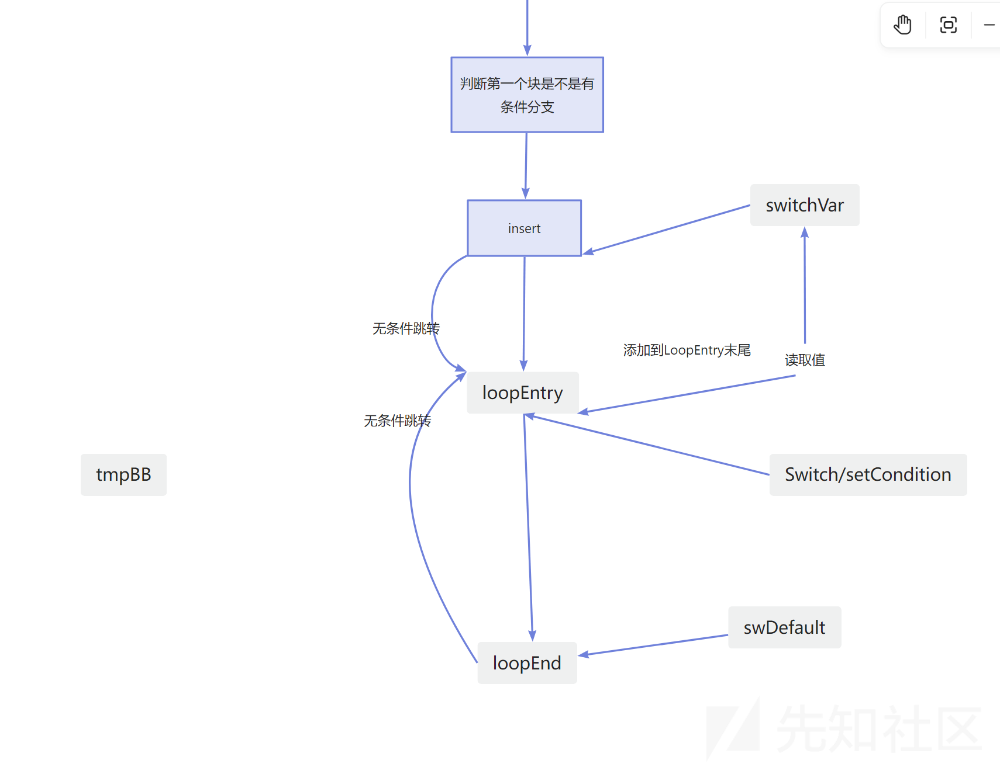

#### 重写原始块的终结逻辑并收尾

```

  // Recalculate switchVar
  for (std::vector<BasicBlock *>::iterator b = origBB.begin();
       b != origBB.end(); ++b) {
    BasicBlock *i = *b;
    ConstantInt *numCase = NULL;

    // Ret BB
    if (i->getTerminator()->getNumSuccessors() == 0) {        //跳过ret这种无后继的终止块
      continue;
    }

    // If it's a non-conditional jump
    if (i->getTerminator()->getNumSuccessors() == 1) {      //只有一个Successors是非条件跳转块
      // Get successor and delete terminator
      BasicBlock *succ = i->getTerminator()->getSuccessor(0);     //取得跳转的后继block
      i->getTerminator()->eraseFromParent();

      // Get next case
      numCase = switchI->findCaseDest(succ);            //查找跳转到succ的case值

      // If next case == default case (switchDefault)
      if (numCase == NULL) {
        numCase = cast<ConstantInt>(
            ConstantInt::get(switchI->getCondition()->getType(),
                             llvm::cryptoutils->scramble32(
                                 switchI->getNumCases() - 1, scrambling_key)));               //如果没找到，则可能是default分支，就加密
      }

      // Update switchVar and jump to the end of loop
      new StoreInst(numCase, load->getPointerOperand(), i);         //将下一个case的编号放入switchVar（地址由load->getPointerOperand()得到）
      BranchInst::Create(loopEnd, i);                     //将i的结尾插入跳转到loopEnd
      continue;
    }

    // If it's a conditional jump
    if (i->getTerminator()->getNumSuccessors() == 2) {
      // Get next cases
      ConstantInt *numCaseTrue =
          switchI->findCaseDest(i->getTerminator()->getSuccessor(0));           //获取true/false跳转目标的case值
      ConstantInt *numCaseFalse =
          switchI->findCaseDest(i->getTerminator()->getSuccessor(1));

      // Check if next case == default case (switchDefault)
      if (numCaseTrue == NULL) {                                              //NUll是因为不在case表里面
        numCaseTrue = cast<ConstantInt>(
            ConstantInt::get(switchI->getCondition()->getType(),      //将Constant *强制转换成ConstantInt *
                             llvm::cryptoutils->scramble32(
                                 switchI->getNumCases() - 1, scrambling_key)));
      }

      if (numCaseFalse == NULL) {
        numCaseFalse = cast<ConstantInt>(
            ConstantInt::get(switchI->getCondition()->getType(),
                             llvm::cryptoutils->scramble32(
                                 switchI->getNumCases() - 1, scrambling_key)));
      }

      // Create a SelectInst
      BranchInst *br = cast<BranchInst>(i->getTerminator());
      SelectInst *sel =
          SelectInst::Create(br->getCondition(), numCaseTrue, numCaseFalse, "",
                             i->getTerminator());           //变成条件选择指令，相当于sel = cond ? numCaseTrue : numCaseFalse;

      // Erase terminator
      i->getTerminator()->eraseFromParent();

      // Update switchVar and jump to the end of loop
      new StoreInst(sel, load->getPointerOperand(), i);     // // 把 select 的值写入 switchVar
      BranchInst::Create(loopEnd, i);
      continue;
    }
  }
```

这里就是最主要的逻辑，前面创立好了框架，这里的主要逻辑就是去遍历查询基本块的跳转，查询到了哪个块之后去找到对应的case，然后写入下一个swicthvar

但是跳转也分情况，这里一一说说

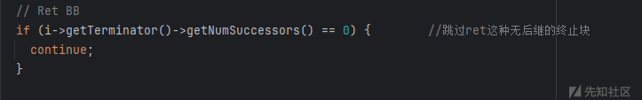

这种无后继就是终止块，不进行操作

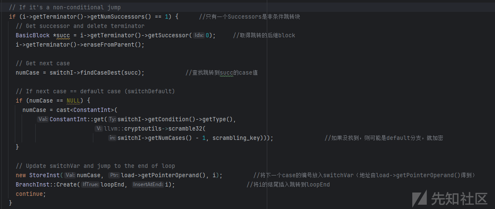

这里就是查询一般跳转并且分配case写入switchvar的逻辑

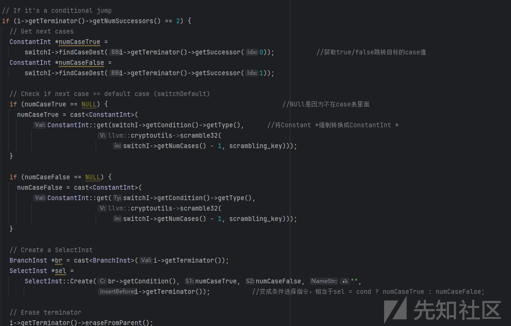

这种就是处理有条件跳转的逻辑，主要是得到两个跳转的逻辑，还是一样的操作，写入switchvar

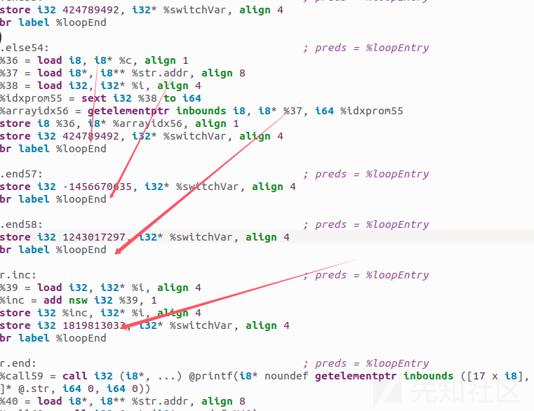

去看fla的IR，基本块的末尾都是跳转到end块

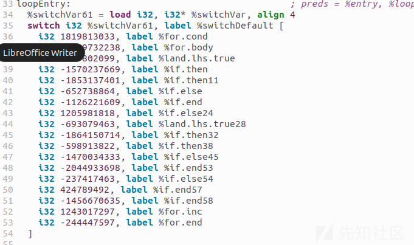

swicth的地方

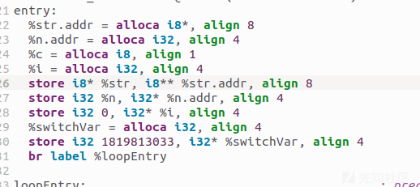

最开始的块

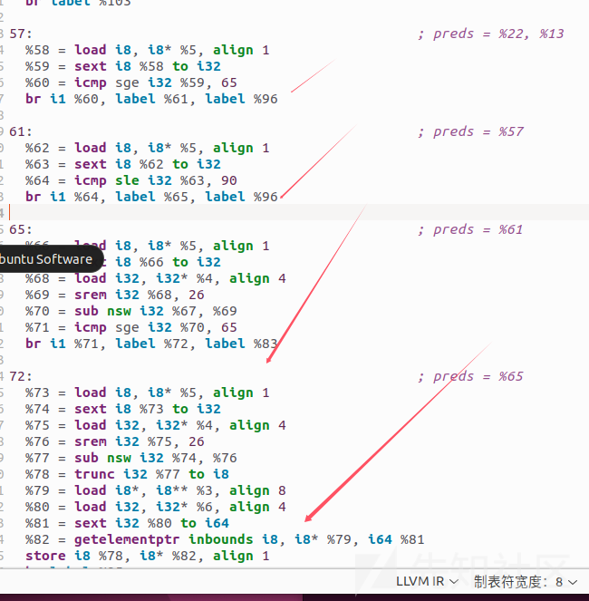

上图是没有fla的，就是普通的跳转下一个基本块的逻辑

​

总结一下，被OLLVM混淆利用switch分发，对每一个基础快分配了case值，把case语句包装在循环之中，每一个块都会更新state变量case值，然后分配执行下一个switch语句

​

#### fixStack(f)

最后的有一个fixStack，这里不再分析了，主要是修复各个基本块插入的指针打乱的栈帧布局

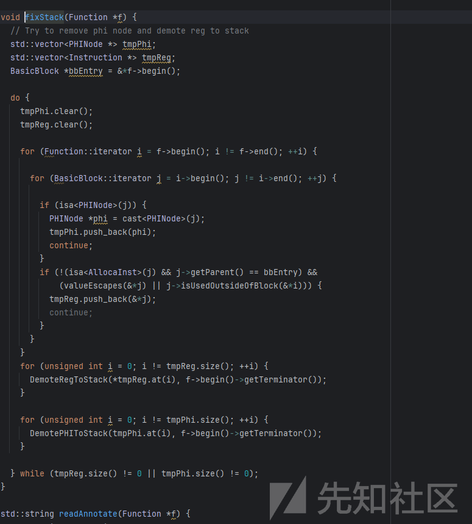

## 反混淆的脚本分析

如果想要平常的脚本对控制流平坦化失去一键去混淆的效果的话比较困难，网上找到的有d810插件和angr以及unicorn的去除间接跳转等等

比如：

<https://github.com/mFallW1nd/deflat>

​<https://blog.quarkslab.com/deobfuscation-recovering-an-ollvm-protected-program.html>

<https://hex-rays.com/blog/hex-rays-microcode-api-vs-obfuscating-compiler>

### d810去混淆插件分析

<https://eshard.com/posts/D810-a-journey-into-control-flow-unflattening>

## 魔改思考

看了这些去混淆的脚本，看得云里雾里的，我在想能不能直接在基本块的中间直接添加一个间接跳转的 如br 寄存器这种，跳转地方还是下一条指令，只不过寄存器的值是经过修改复杂了的，这样会不会影响脚本，因为好像在基本块是没有跳转的（除了末尾），我这样写是不是可以直接影响angr或者unicorn的CFG分析。。尝试一下吧

​

加间接跳转，直接是x64的汇编吧，arm的后面再尝试，因为不太方便，要修改的话还需要frida，我直接windows平台的x64尝试，顺便练练idapython

### 样本

直接用rc4的经典代码吧

```
#include<stdio.h>

/*
RC4初始化函数
*/
void rc4_init(unsigned char* s, unsigned char* key, unsigned long Len_k)
{
    int i = 0, j = 0;
    char k[256] = { 0 };
    unsigned char tmp = 0;
    for (i = 0; i < 256; i++) {
        s[i] = i;
        k[i] = key[i % Len_k];
    }
    for (i = 0; i < 256; i++) {
        j = (j + s[i] + k[i]) % 256;
        tmp = s[i];
        s[i] = s[j];
        s[j] = tmp;
    }
}


void rc4_crypt(unsigned char* Data, unsigned long Len_D, unsigned char* key, unsigned long Len_k) //加解密
{
    unsigned char s[256];
    rc4_init(s, key, Len_k);
    int i = 0, j = 0, t = 0;
    unsigned long k = 0;
    unsigned char tmp;
    for (k = 0; k < Len_D; k++) {
        i = (i + 1) % 256;
        j = (j + s[i]) % 256;
        tmp = s[i];
        s[i] = s[j];
        s[j] = tmp;
        t = (s[i] + s[j]) % 256;
        Data[k] = Data[k] ^ s[t];
    }
}
void main()
{
    //字符串密钥
    unsigned char key[] = "zstuctf";
    unsigned long key_len = sizeof(key) - 1;
    //数组密钥
    //unsigned char key[] = {};
    //unsigned long key_len = sizeof(key);

    //加解密数据
    unsigned char data[] = { 0x7E, 0x6D, 0x55, 0xC0, 0x0C, 0xF0, 0xB4, 0xC7, 0xDC, 0x45,
                            0xCE, 0x15, 0xD1, 0xB5, 0x1E, 0x11, 0x14, 0xDF, 0x6E, 0x95,
                            0x77, 0x9A, 0x12, 0x99 };
    //加解密
    rc4_crypt(data, sizeof(data), key, key_len);

    for (int i = 0; i < sizeof(data); i++)
    {
        printf("%c", data[i]);
    }
    printf("
");
    return;
}
//zstuctf{xXx_team_Is_GooD

```

计划先测试一下简单的插入，好难写

​

```
from ida_bytes import *
from ida_kernwin import *
from keystone import *

# Step 1: 目标插入点
insert_addr = 0x201C7E
return_addr = insert_addr + 5  # 因为 jmp 是 5 字节

# Step 2: 构造插入代码（stub）
ks = Ks(KS_ARCH_X86, KS_MODE_32)
stub_code = [
    "push ecx",
    "mov ecx, 0x4601C830",
    "sub ecx, 0x4601C830",
    "pop ecx",
    f"jmp {return_addr}"
]
stub_bytes, _ = ks.asm(" ; ".join(stub_code), as_bytes=True)

# Step 3: 找一个空白代码区（假设你手动找到了 0x402000）
stub_addr = 0x402000
patch_bytes(stub_addr, stub_bytes)

# Step 4: 在插入点 patch 一个跳转到 stub（jmp 是 5 字节）
jmp_stub, _ = ks.asm(f"jmp {stub_addr}", as_bytes=True)
patch_bytes(insert_addr, jmp_stub)

print(f"Inserted stub at {hex(stub_addr)} and patched jump at {hex(insert_addr)}")

```

这个直接设法在ida里面插入内敛汇编好像，因为会覆盖，没有多余内存

下面先试试能不能手写一个间接跳转试试把，好像是必须是arm，我先试试androidstudio，后面再看能不能单独拿出来呢

### 1.设法写一个间接跳转

```
 __asm__ volatile (
            "adr x9, 1f
"
            "mov x8, #5
"
            "eor x8, x8, #4
"
            "add x9, x9, #4
"
            "mul x9, x9, x8
"
            "br x9
"
            ".long 0x54135678
"
            ".long 0x54115673
"
            "1:
"
            ".long 0x54135678
"
            :
            :
            : "x9", "x8"
            );
```

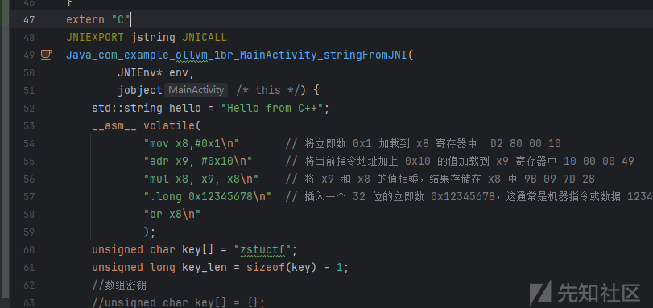

只不过必须要在arm架构上去编译才行，现在准备迁移一下，看能不能中途加入间接跳转

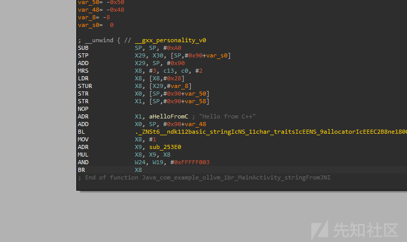

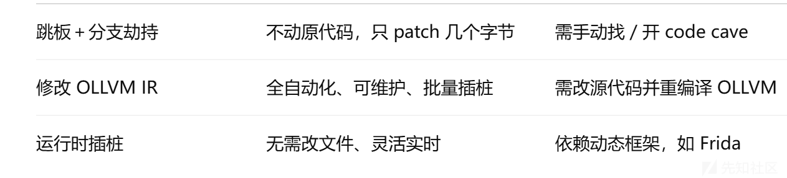

下一步，试试写一个LLVM Pass
