# 加密解密算法与编码–逆向工程基础知识-先知社区

> **来源**: https://xz.aliyun.com/news/18652  
> **文章ID**: 18652

---

# 加密解密算法与编码– 逆向工程基础知识

## 一个简单的密码破解

首先编译这个

```
#include <iostream>
#include <string.h>

int check_pass(char* password) {
    char mypass[10] = "passwordI";
    if ( strcmp(password, mypass) != 0) {
        return 1;
    }
    else {
        return 0;
    }
}

int main(int argc, char* argv[]) {
    if (argc != 2) {
        std::cout << "Help:
" << argv[0] << " <password>
";
    }
    else {
        int reply = check_pass(argv[1]);

        if (reply == 1) {
            std::cout << "[!] InCorrect" << std::endl;
        }
        else {
            std::cout << "[+] Correct" << std::endl;
        }
    }
    return 0;
}

```

使用x64dbg加载程序后可以看到五个框

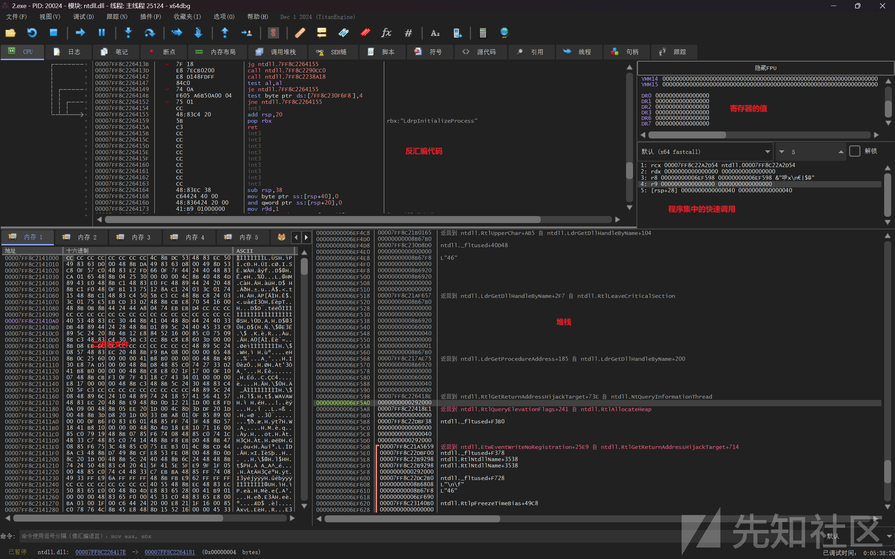

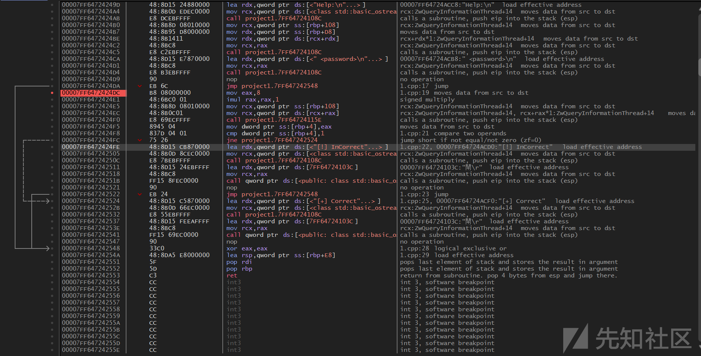

在断点上方看到一个 **jmp** 语句和**一个 call** 语句。这意味着在达到这一点之前调用了一个函数，并且在打印correct之前要执行的最后一个函数是 *check\_pass（）* 函数。点击运行按钮，直到它到达此断点执行。

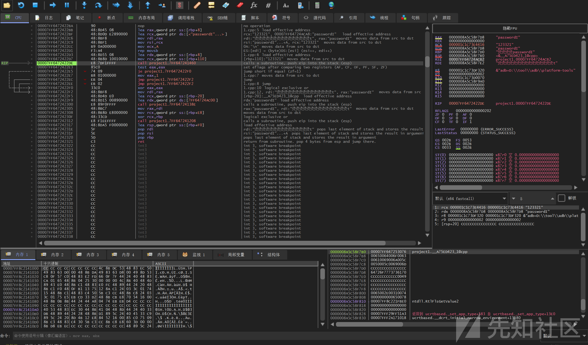

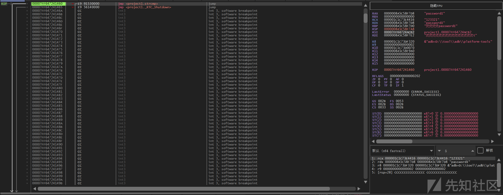

可以看到输入的密码123321和正确密码passwordI被加载到寄存器 **RCX** 和 **RAX** 上进行比较

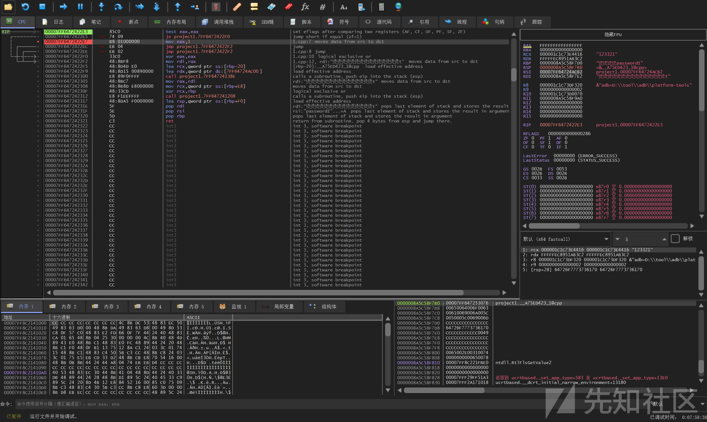

我们现在需要将返回值 1 修改为 0，该返回值由 check\_pass（） 函数返回。如果您看到上图，在密码加载到寄存器的代码下方 3 行，两个跳跃语句。因此，如果测试值返回它们相等，它将跳转，这将在 **EAX** 寄存器中移动 0。但是由于我们输入的密码是错误的，它不会跳到那里并继续到下一个代码段，在那里它将 1 移动到 **EAX**。因此，我们只需通过右键单击并选择断点→切换来在此地址上设置断点，因为我们需要在该点修改寄存器值并继续运行二进制文件，直到它到达该断点：一旦命中此断点步进，将值 1 加载到右侧的 RAX 寄存器中。**EAX** 是一个 32 位寄存器，是 **RAX** 寄存器的最后 32 位。当 1 加载到 **EAX** 中时，默认情况下它会进入 **RAX** 寄存器。最后，我们可以选择右侧的 RAX 寄存器，右键单击并将其递减为零。

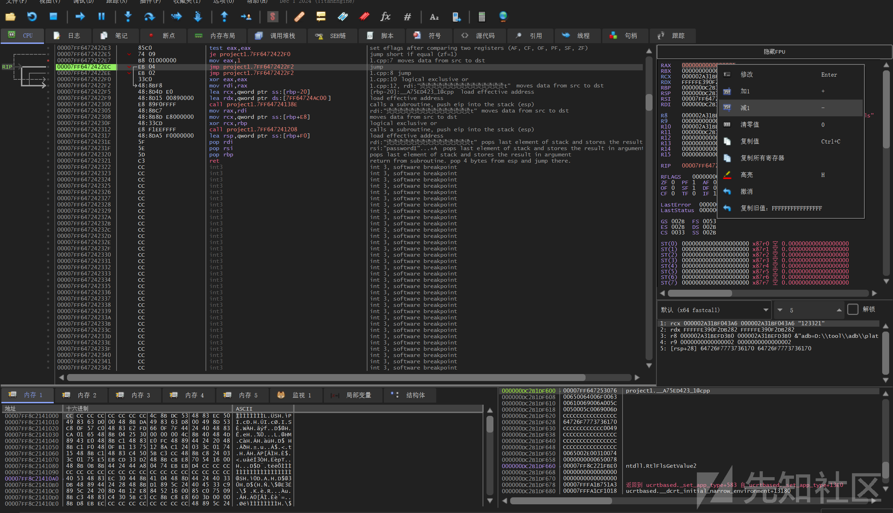

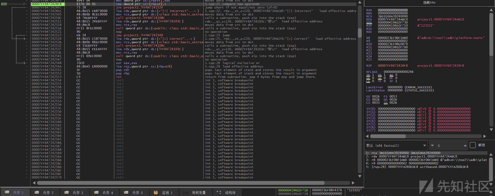

在图中看到它使用 **cmp** 来检查值是否与 1 匹配，它使用 **jne**（如果不等于则跳转）条件，这意味着如果它不等于 One，它将跳转到00007FF647242524

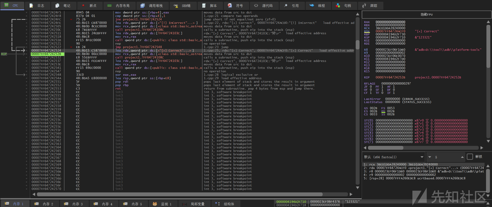

最终打印了correct

## XOR

第二个使用了xor加密的程序

```
    #include <stdio.h>
    #include <string.h>
    void CheckPass(int *XoredPassword) {
        int PArray[10] = {38, 34, 37, 55, 55, 61, 33, 51, 32, 39};
        bool is_equal = true;
        for (int i=0; i<10; i++) {
            if (XoredPassword[i] != PArray[i]) {
                is_equal = false;
                break;
            }
        }
        if (is_equal == true) {
            printf ("[+] Correct Password");
        }
        else {
            printf ("[-] Incorrect Password");
        }
    }
    int main(int argc, char *argv[]) {
        if (argc != 2) {
            printf("Help:
%s <10 character serial key>
", argv[0]);
        }
        else {
            int stringLength = strlen(argv[1]);
            if ((stringLength > 10) || (stringLength < 10)) {
                printf("[-] Serial key must be of 10 characters. Please recheck your key
");
            }
            else {
                int XoredDecimal[10] = {};
                int keyStore[10] = {85, 86, 87, 88, 89, 90, 81, 82, 83, 84};
                for (int i=0; i<10; i++) {
                    XoredDecimal[i] = ((int)(argv[1][i]))^(keyStore[i]);
                }
                CheckPass(XoredDecimal);
            }
        }
        return 0;
    }
```

编译后放进x64dbg，有的可能使用**MinGW或者g++,编译后会有不同，但逻辑是差不多的**

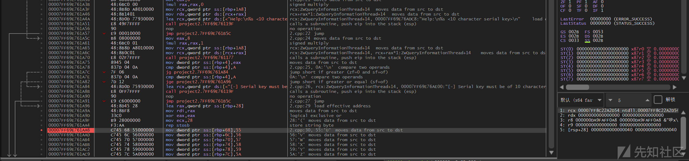

在短点前有两个条件，第一个条件检查是，如果我们不输入参数，它会打印 help 语句。第二个检查是，如果您输入的键小于或大于 10，它将提示错误，指出输入精确的 10 个字符的键。这意味着，只有在我们提供了正确的参数后，它才会继续检查密码，我提供的参数是lahada1121

下面的图就是把l字母与U进行异或得到9

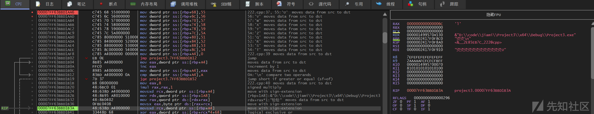

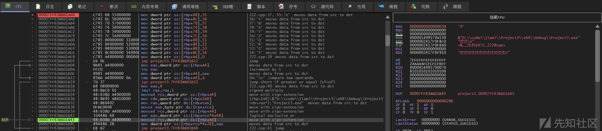

* `l`（`01101100`）与 `U`（`01010101`）异或：`00111001`，对应字符 `9`（ASCII 57）
* `a`（`01100001`）与 `V`（`01010110`）异或：`00110111`，对应字符 `7`（ASCII 55）
* `h`（`01101000`）与 `W`（`01010111`）异或：`00111111`，对应字符 `?`（ASCII 63）
* `a`（`01100001`）与 `X`（`01011000`）异或：`00111001`，对应字符 `9`（ASCII 57）
* `d`（`01100100`）与 `Y`（`01011001`）异或：`00111101`，对应字符 `=`（ASCII 61）
* `a`（`01100001`）与 `Z`（`01011010`）异或：`00111011`，对应字符 `;`（ASCII 59）
* `1`（`00110001`）与 `Q`（`01010001`）异或：`01100000`，对应字符 ```（ASCII 96）
* `1`（`00110001`）与 `R`（`01010010`）异或：`01100011`，对应字符 `c`（ASCII 99）
* `2`（`00110010`）与 `S`（`01010011`）异或：`01100001`，对应字符 `a`（ASCII 97）
* `1`（`00110001`）与 `T`（`01010100`）异或：`01100101`，对应字符 `e`（ASCII 101）

如果 **X xor Y = Z**，则 **Y xor Z 将是 X**。因此，我们将需要两组值，即 **X 和 Y** 或 **Y 和 Z** 或 **X 和 Z**。而现在只有密钥集 **[U、V、W、X、Y、Z、Q、R、S、T]**，还需要真实密码异或后的值。继续进行反汇编的代码。

&开始是正确密码异或后的值

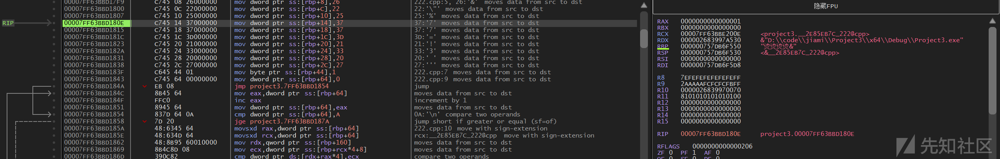

|  |  |  |  |  |
| --- | --- | --- | --- | --- |
| **位置** | **字符串字符** | **二进制（8 位）** | **密钥字符** | **密钥二进制（8 位）** |
| 1 | & | 00100110 | U | 01010101 |
| 2 | " | 00100010 | V | 01010110 |
| 3 | % | 00100101 | W | 01010111 |
| 4 | 7 | 00110111 | X | 01011000 |
| 5 | 7 | 00110111 | Y | 01011001 |
| 6 | = | 00111101 | Z | 01011010 |
| 7 | ! | 00100001 | Q | 01010001 |
| 8 | 3 | 00110011 | R | 01010010 |
| 9 | （空格） | 00100000 | S | 01010011 |
| 10 | ' | 00100111 | T | 01010100 |

已经可以得到真正的密码了

继续调试

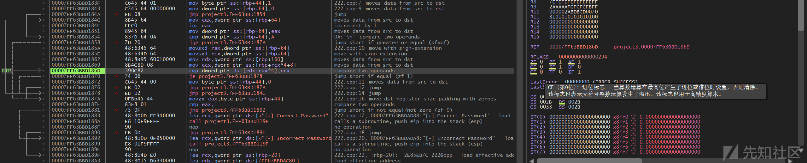

这里将输入的第一个异或值和&比较，如果它们不相等，则**将进位标志 （CF）** 设置为 **1**。下一条指令正在检查前一条指令的值是否为零。**je**，如果值为零，它将跳转，但它不会跳跃并将继续下一步，因为我们已将值设置为 1，因为两者不相等。

若发现循环中存在 “mov al, byte ptr [argv] + xor al, byte ptr [key]” 的连续指令，基本可判断是 XOR 加密

## 与服务器验证密码进行破解

对一个需通过网络与服务器验证密码的二进制文件进行破解。首先通过 x64dbg 分析二进制文件的网络通信流程，包括初始化套接字、连接服务器、发送接收数据等，发现密码验证依赖服务器返回结果。随后找到可修改的关键指令位置，通过**补丁修改**使比较结果恒为真，最终生成无需服务器验证、输入任意密码都显示正确的破解二进制文件

```
#include <winsock2.h>
#include <windows.h>
#include <stdio.h>
#include <ws2tcpip.h>

void VerifyKey(char* Key, char* buffer) {

    char KeyValue[8] = "";
    WSADATA version;
    WSAStartup(MAKEWORD(2, 2), &version);
    SOCKET my_socket = socket(AF_INET, SOCK_STREAM, IPPROTO_TCP);
    sockaddr_in my_address;
    my_address.sin_family = AF_INET;
    my_address.sin_addr.s_addr = inet_addr("127.0.0.1");
    my_address.sin_port = htons(8080);
    connect(my_socket, (SOCKADDR*)&my_address, sizeof(my_address));
    send(my_socket, Key, strlen(Key) + 1, 0);
    recv(my_socket, KeyValue, 8, 0);
    if (strcmp(KeyValue, "Valid
") == 0) {
        strcat(buffer, "[+] Correct Password");
    }
    else {
        strcat(buffer, "[-] Invalid Password");
    }
    closesocket(my_socket);
    WSACleanup();
}

int main(int argc, char* argv[]) {

    if (argc != 2) {
        printf("Help:
%s <10 character serial key>
", argv[0]);
    }

    else {
        int KeyLen = strlen(argv[1]);
        if ((KeyLen > 10 || KeyLen < 10)) {
            printf("[-] Invalid Key Length. Password must be of 10 characters
");
        }
        else {
            char buffer[21] = "";
            VerifyKey(argv[1], buffer);
            printf("%s", buffer);
            memset(buffer, 0, sizeof(buffer));
        }
    }

    return 0;
}

```

server.py

```
import socket

TCPSERVER = socket.socket(socket.AF_INET, socket.SOCK_STREAM)
TCPSERVER.setsockopt(socket.SOL_SOCKET, socket.SO_REUSEADDR, 1)
TCPSERVER_ADDRESS = ("127.0.0.1", 8080)
TCPSERVER.bind(TCPSERVER_ADDRESS)
TCPSERVER.listen(100)

while True:
    print("[+] Waiting for client connection...")
    (TCPCLIENT, TCPCLIENT_ADDRESS) = TCPSERVER.accept()
    print("[+] Client Connected: " + str((TCPCLIENT_ADDRESS)[0]) + ":" + str((TCPCLIENT_ADDRESS)[1]))
    GetKey = ((TCPCLIENT.recv(1024)).decode('utf-8')).rstrip()
    #GetKey = (TCPCLIENT.recv(1024))
    print("[!] Verifying Keys..")
    print(GetKey)
    if (GetKey == 'strongpass\x00'):
        TCPCLIENT.send(("Valid
").encode('utf-8'))
    else:
        TCPCLIENT.send(("InValid").encode('utf-8'))
        TCPCLIENT.close()

```

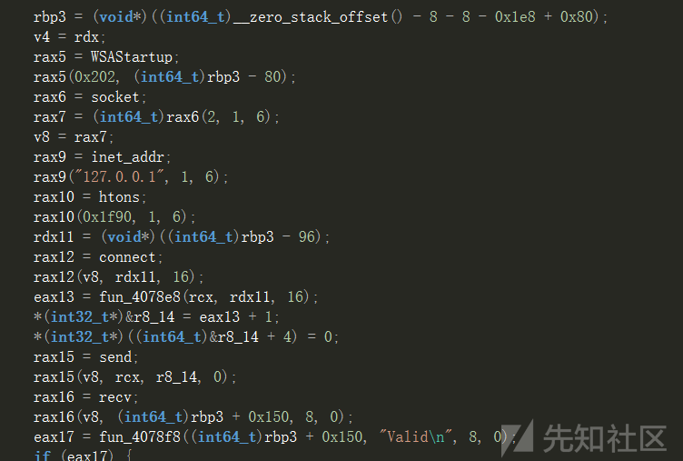

在这块找到一个地址127.0.0.1下发的0x1f90十进制是8080

程序先通过 WSAStartup 初始化 winsock DLL 加载套接字，再通过 Socket 创建套接字，Inet\_addr 指定 IP 版本，Htons 将 8080 端口转换为网络字节序，随后通过 Connect 连接到运行在 127.0.0.1:8080 的服务器，接着用 Send 发送输入的密码，最后用 Recv 接收服务器的验证结果。涉及的关键函数有 WSAStartup、Socket、Inet\_addr、Htons、Connect、Send、Recv，关键端口是 8080。

关键函数及作用：

|  |  |  |
| --- | --- | --- |
| **函数** | **地址** | **作用** |
| WSAStartup | 0000000000401596 | 初始化 winsock DLL 以加载套接字 |
| Socket | 00000000004015AF | 创建套接字，指定类型（TCP/UDP 等）及用于收发数据的套接字 |
| Inet\_addr | 00000000004015CC | 指定 IP 版本（IPv4 为 AF\_INET，IPv6 为 AF\_INET6） |
| Htons | 00000000004015DD | 将端口号转换为网络字节序，此处端口为 8080（0x1f90 转换为十进制） |
| Connect | 00000000004015FE | 使用上述数据连接远程服务器 |
| Send | 0000000000401632 | 向服务器发送数据（输入的密码） |
| Recv | 0000000000401658 | 接收服务器返回的验证结果 |

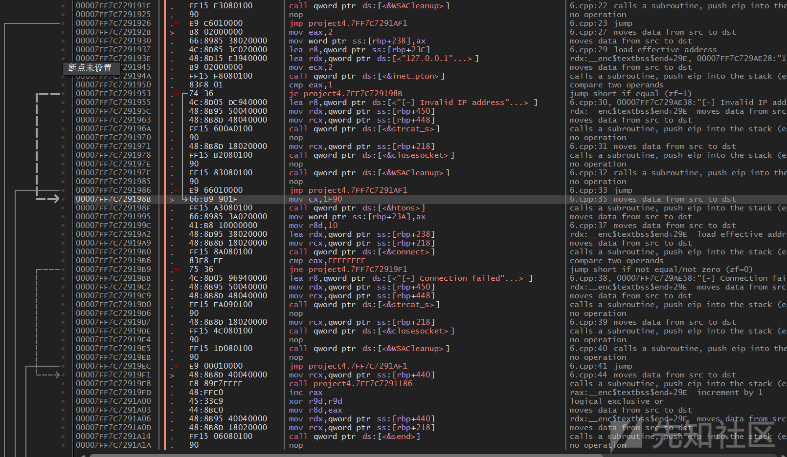

看看这个很长的关键模块

第一种方法，修改零标志位为1，将匹配结果改为相等

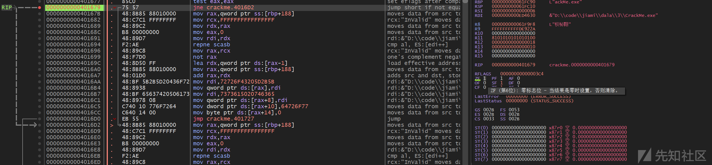

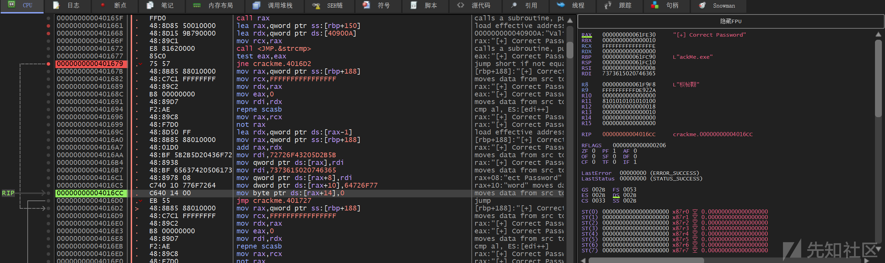

check\_pass函数的返回值通过 RAX 寄存器传递（x64 架构下函数返回值默认存于 RAX），修改后main函数会认为 “验证成功”，

第二种方法，strcmp 比较前加载值的位置

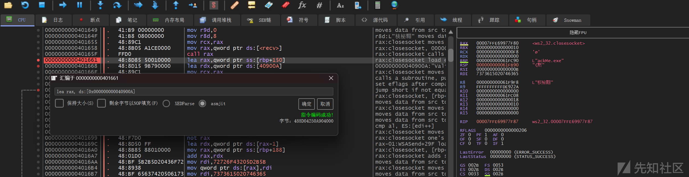

将rax的值改为和rdx的一样，使 rax 和 rdx 加载相同值

```
#include <winsock2.h>
#include <windows.h>
#include <stdio.h>
#include <ws2tcpip.h>
#include <cstring>


// ����Winsock��
#pragma comment(lib, "ws2_32.lib")


void VerifyKey(char* Key, char* buffer, size_t bufferSize) {
    char KeyValue[9] = "";  // ����һ���ֽ����ڴ洢��ֹ��
    WSADATA version;
    int result = WSAStartup(MAKEWORD(2, 2), &version);
    if (result != 0) {
        strcat_s(buffer, bufferSize, "[-] WSAStartup failed");
        return;
    }


    SOCKET my_socket = socket(AF_INET, SOCK_STREAM, IPPROTO_TCP);
    if (my_socket == INVALID_SOCKET) {
        strcat_s(buffer, bufferSize, "[-] Socket creation failed");
        WSACleanup();
        return;
    }


    sockaddr_in my_address;
    my_address.sin_family = AF_INET;
    // ʹ��inet_pton���inet_addr
    if (inet_pton(AF_INET, "127.0.0.1", &my_address.sin_addr) != 1) {
        strcat_s(buffer, bufferSize, "[-] Invalid IP address");
        closesocket(my_socket);
        WSACleanup();
        return;
    }
    my_address.sin_port = htons(8080);


    if (connect(my_socket, (SOCKADDR*)&my_address, sizeof(my_address)) == SOCKET_ERROR) {
        strcat_s(buffer, bufferSize, "[-] Connection failed");
        closesocket(my_socket);
        WSACleanup();
        return;
    }


    send(my_socket, Key, strlen(Key) + 1, 0);
    int recvLen = recv(my_socket, KeyValue, 8, 0);
    if (recvLen > 0) {
        KeyValue[recvLen] = '\0';  // ȷ���ַ�����ֹ
        if (strcmp(KeyValue, "Valid
") == 0) {
            strcat_s(buffer, bufferSize, "[+] Correct Password");
        }
        else {
            strcat_s(buffer, bufferSize, "[-] Invalid Password");
        }
    }
    else {
        strcat_s(buffer, bufferSize, "[-] Receive failed");
    }


    closesocket(my_socket);
    WSACleanup();
}


int main(int argc, char* argv[]) {
    if (argc != 2) {
        printf("Help:
%s <10 character serial key>
", argv[0]);
    }
    else {
        size_t KeyLen = strlen(argv[1]);  // ʹ��size_t��������ת������
        if (KeyLen != 10) {
            printf("[-] Invalid Key Length. Password must be of 10 characters
");
        }
        else {
            char buffer[32] = "";  // ���󻺳�����ȷ�������ɽ��
            VerifyKey(argv[1], buffer, sizeof(buffer));
            printf("%s
", buffer);
            memset(buffer, 0, sizeof(buffer));
        }
    }
    return 0;
}
```

这个代码做了以下更改

* 将 inet\_addr 替换为 inet\_pton，更好地支持 IPv4 和 IPv6，也避免了编译错误
* 将 strcat 替换为 strcat\_s，这是更安全的版本，需要指定缓冲区大小
* 对 WSAStartup、socket、connect 等网络操作添加了错误检查
* 当操作失败时，会在缓冲区中存储相应的错误信息
* 使用 size\_t 接收 strlen 的返回值，避免从 size\_t 到 int 的转换警告
* 增大了缓冲区大小，确保能容纳所有可能的结果字符串
* 为接收缓冲区添加了字符串终止符，避免字符串处理错误
* 添加了 #pragma comment(lib, "ws2\_32.lib") 以确保正确链接 Winsock 库
* 简化了密钥长度检查的条件表达式

将这个编译后可以尝试破解一下这个

Hash,一般翻译做散列、杂凑,或音译为哈希,是把任意长度的输入(又叫做预映射pre-image)通过散列算法变换成固定长度的输出,该输出就是散列值。这种转换是一种压缩映射,也就是,散列值的空间通常远小于输入的空间,不同的输入可能会散列成相同的输出,所以不可能从散列值来确定唯一的输入值。简单的说就是一种将任意长度的消息压缩到某一固定长度的消息摘要的函数。

## md5

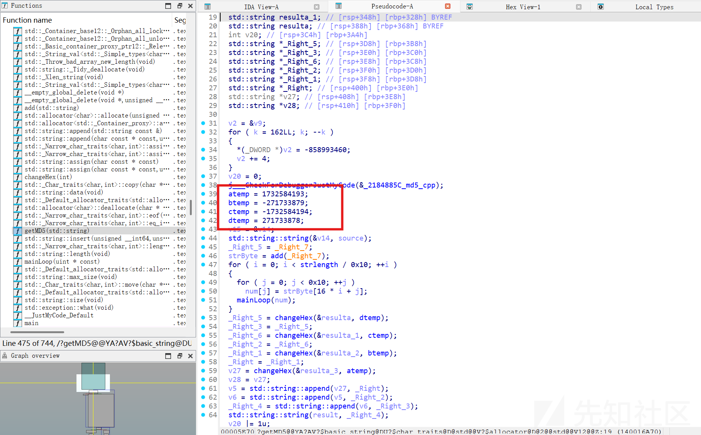

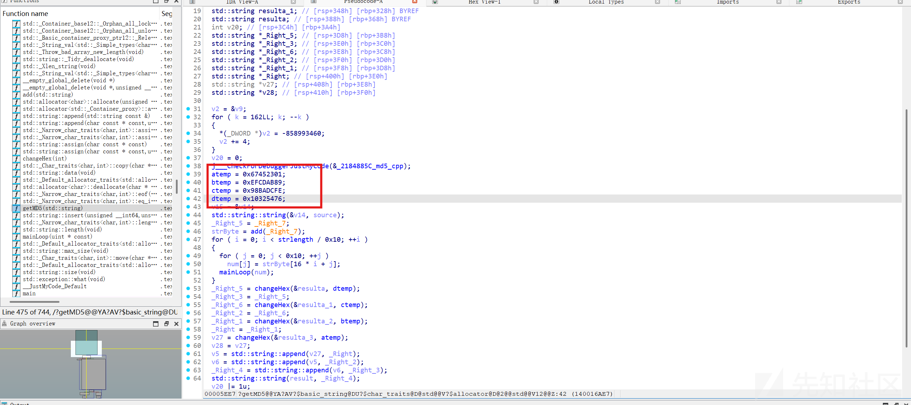

可以看到这四组模数ab和cd，是1-F的组合，看到这四个就可以确定是md5

MD5 的压缩函数执行**64 轮迭代**，分为**4 组**（每组 16 轮），且输出为**128 位哈希值**（由 4 个 32 位寄存器拼接而成）

SHA-1 的压缩函数共执行**80 轮迭代**，并将这 80 轮分为**4 组**（每组 20 轮），但由于其输出为**160 位哈希值**（由 5个 32 位寄存器拼接而成）

什么是编码、解码?

编码:一般来说就是利用某种算法对原始内容进行处理,形成另一种数据的表现形式,并可以根据相关

算法再还原回来。

解码:使用编码算法的逆算法对经过编码的数据进行处理,还原出原始数据。

base系列编码算法常见的有base16、base32、base58、base64,它们出现的主要目的都是为了将一些  
特殊的、不可见的二进制数据经过编码后转化为可打印字符,以此使我们的数据能正确的、方便的  
在不同设备上显示和网络上传输。注意他们只是一个编码算法,并不是加密算法。

比如以前的邮件发送就只能发送可见字符,而像我们要传输一张图片的时候,因为一张图片的二进  
制信息不可能全是可见字符,这就导致了不能传送了。但我们可以把该图片的二进制信息经过base系  
列编码转化为可见字符,在传送后再解码就可以了。

然后,base系列编码算法是一种变长编码算法,如base64是将原数据的每三个字节变为四个字节,  
base32是将原数据的每五个字节变为八个字节,base16是将原数据的每一个字节变为两个字节,而  
base58是从256进制转到58进制,自然会使数据变长,因此他们的缺点就是会造成信息冗余,数据量

增大。

最后,base系列编码转换算法本质上是一种进制转换算法,如base64是将原数据转化为64进制,与此  
对应的base32、base16、base58就是将原数据转化为32进制,16进制与58进制。进制转换也是base58  
编码的用的转换算法,而base64、base32、base16因为码表大小是2的整数次方倍,转换方法就可以

使用更快捷的移动二进制位(切割bit位)的方法,那么其实我们base64、base32、base16也是可以使  
用进制转换的方法来进行(但是要处理按照切割bit位时会有的填充情况),只是使用通过移位的方  
式(切割bit位)不会产生大数的运算,使转换速度更快。这也是为什么一般都把base58与base64、  
base32、base16分开对待的原因。

那么码表的作用是什么呢?

就是将进制转化后的的每个权重数通过查表用一个字符来表示它,这就和我们16进制数中A、B、C、

D、E、F来表示10、11、12、13、14、15是一个道理。

切割bit位  
先将原数据变为其二进制bit位形式,然后根据转换的目标进制数选择对应的数量的bit位为一组对原  
始数据的bit位进行切割(如base64是64进制,那就选择6个bit位为一组,因为6个bit位能表示的最大

数正好是63)(二进制111111就是63，base32二进制11111就是31)(从0开始)。

注:base58不能用这种方法,因为58不是2的整数次方。

256进制。符串实际上就是256进制的数字组合,像我们平时看到的一串数据都是256进制,它的每  
一个字节表示一个权重位,大小就是一个字节的范围[0,255],如在密码学中就经常用libnum库的s2n()  
函数把一串字符按大端序变为它实际的进制数后再进行加密。

base58

码表:123456789ABCDEFGHJKLMNPQRSTUVWXYZabcdefghi jkmnopqrstuvwxyz

大小:58  
常用于URL,邮件文本,可见字符显示及产生 Bitcoin 的钱包地址

base58的码表比base64的少了6个,主要就是将一些歧义字符,如0(零)、0(大写字母0)、I  
(大写字母i)、1(小写字母L)及+/字符去掉了。且编码后的字符串不会有等于号填充。

因为base58是58进制算法,而58不是2的整数次方,这就使我们编码base58不能使用效率更高的切割  
bit位方法,只能用标准的进制转换(也正是由于这个使其没有base64使用的那么广泛):

base58check

另外,在base58基础之上还有一种base58check编码,一种常用在数字加密货币中的base58编码格式,  
它的特点就是在待编码数据的尾部增加了一个4字节的校验码。这个校验码是对待编码的数据进行  
sha256,然后取其前4字节。

当我们使用base58check编码时,在要使用这个编码的数据之前先会计算原始数据的sha256的前4字  
节是否和尾部的校验码相同,如果不同则表明有错误发生,那么这个base58check编码自然就是无效  
的了,这样就可以避免一些错误的发生。

## base64

码表:ABCDEFGHI JKLMNOPQRSTUVWXYZabcdefghi jklmnopqrstuvwxyz0123456789+/

大小:64  
常用于Cookie、网页中传输少量二进制数据及对图片数据编码

编码方法:  
切割bit位的方法,将原数据的每三字节转化为四字节,即 3\*8=24,24/6=4  
数据量扩大了4/3

根据待编码数据的长度决定要填充的\x00及等于符号。也就是用\x00填充原数据最后不足6bit的数据为6bit,再在编码后的数据后添加等于符号使其长度为四的倍数。当原始数据长度模三余一那久在原始数据后添加4个\x00及在编码后的数据添加2个等于符号;当原始数据长度模三余二那么在原始数据后添加2个\x00及在编码后的数据添加1个等于符号。(也是因为这个填充是base64编  
码不是单纯的64进制转换)|  
因为这里待编码的数据长度就是是三的倍数,那么不用填充。

编码过程

```
                       Z               j               j
```

二进制 01011010 01101010 01101010  
合并 010110100110101001101010  
六个一组 010110 100110 101001 101010  
位数 22 38 41 42  
 base64 w m p q

解码

解码

切割bit位，将编码后的数据的每四个字节转化为三个字节，即4\*6=24，24/8=3

另外,由于base64的码表中是有+/字符,而这两个符号会被ur1直接转义的,所以对于在ur1中传  
输的base64编码我们要把+/符号替换成其它的。  
上面用到了python的base64库,它其实是有一个urlsafe\_b64encode方法将+和/分别替换为 -\_ 两个字符供我们使用

base32

码表:ABCDEFGHIJKLMNOPQRSTUVWXYZ234567

大小:32  
将不可打印二进制数据编码为可打印的字符,适合不区分大小写的文件系统,且结果可用作文件名。

特点:编码后的字符串不区分大小,排除了容易混淆的字符串,如数字“1”、“8”和“0”及字母  
的“I”,“”和“0”及+/字符。

编码方法:

切割bit位的方法,将原数据的每五个字节转化为八个字节,即 5\*8=40,40/5=8  
数据量扩大了 8/5

base16

码表:0123456789ABCDEF

大小:16

常用于表示一些不是可打印字符的二进制数据

特点:不区分大小写,没有容易混淆的字符且没有等于号填充。

编码方法:  
切割bit位的方法,将原数据的每一个字节转化为两个字节,即 1\*8=40,8/4=2  
数据量扩大了 一倍

## AES

高级加密标准(AES,Advanced Encryption Standard)为最常见的对称加密算法(微信小程序加密传输就  
是用这个加密算法的)。对称加密算法也就是加密和解密用相同的密钥,具体的加密流程如下

AES为分组密码,分组密码也就是把明文分成一组一组的,每组长度相等,每次加密一组数据,直到加密完整个明文。在AES标准规范中,分组长度只能是128位,也就是说,每个分组为16个字节(每个字节8位)。密钥的长度可以使用128位、192位或256位。密钥的长度不同,推荐加密轮数也不同,如下所示:

|  |  |  |  |  |
| --- | --- | --- | --- | --- |
| **AES 版本** | **密钥长度（32位比特字）** | **分组长度（32位比特字）** | **加密轮数** | **实际密钥长度（位）** |
| AES-128 | 4 | 4 | 10 | 128 |
| AES-192 | 6 | 4 | 12 | 192 |
| AES-256 | 8 | 4 | 14 | 256 |

加密流程

**① 密钥扩展（Key Expansion）**

* 从一个初始密钥派生多个轮密钥（Round Keys）。
* 通过置换、S盒替换、轮常量异或等操作生成44个32位字（共176字节）。

**② 初始轮（Initial Round）**

**AddRoundKey**：明文与第一轮轮密钥逐字节异或。

**③ 主轮（9轮重复操作）**

每轮包含4步：

1. **SubBytes**：通过S盒（非线性替换表）进行字节替换。
2. **ShiftRows**：对状态矩阵的行循环左移（第0行不移，第1行移1字节，依此类推）。
3. **MixColumns**：列混合（矩阵乘法，扩散作用）。
4. **AddRoundKey**：与当前轮密钥异或。

**④ 最终轮（第10轮）**

* 省略MixColumns，仅执行：SubBytes → ShiftRows → AddRoundKey。

字节代换

**AES的字节代换其实就是一个简单的查表操作。AES定义了一个S盒和一个逆S盒。**

AES的S盒：

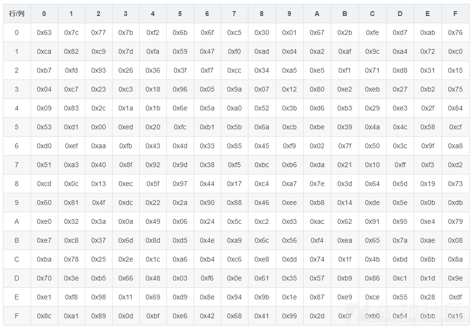

**逆字节代换也就是查逆S盒来变换，逆S盒如下**

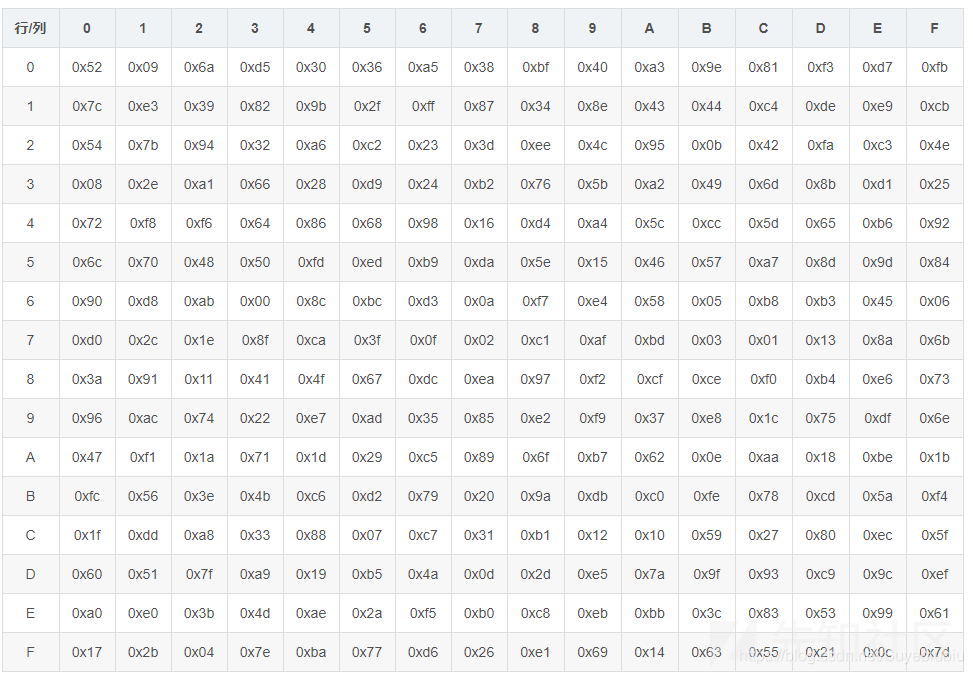

行位移

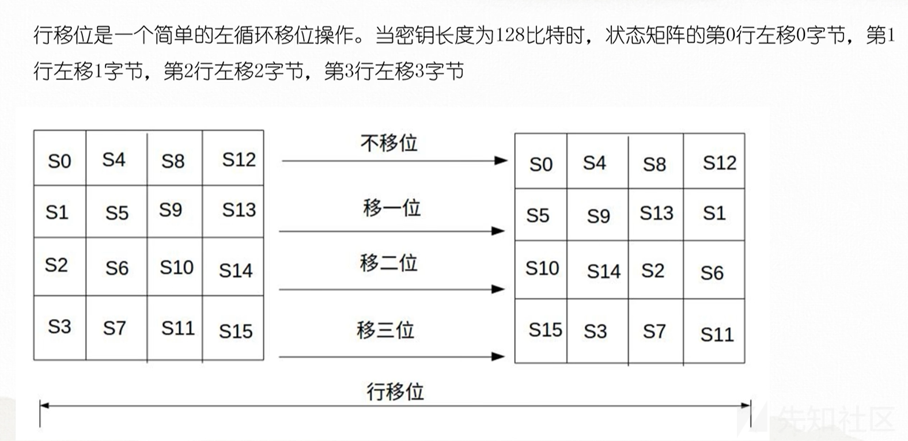

列混合

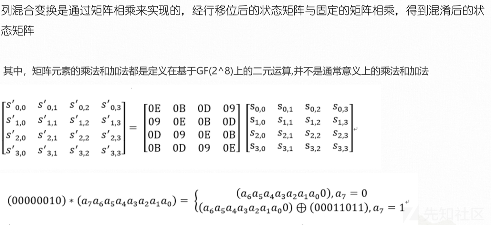

轮密钥加

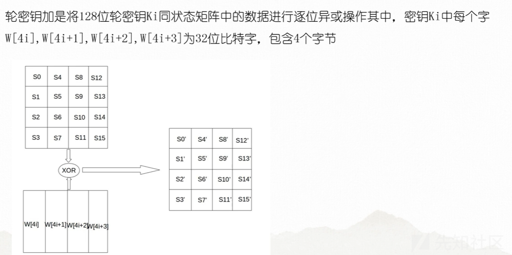

密钥拓展

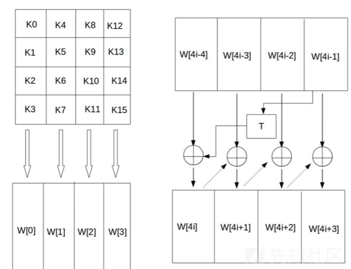

其中,T是一个有点复杂的函数。函数T由3部分组成:字循环、字节代换和轮常量异或,这3部分的作用分别如下。  
a.字循环:将1个字中的4个字节循环左移1个字节。  
即将输入字[b0,b1,b2,b3]变换成[b1,b2,b3,b0]。  
b.字节代换:对字循环的结果使用S盒进行字节代换  
c.轮常量异或:将前两步的结果同轮常量Rcon[j]进  
行异或,其中j表示轮数。

AES的工作模式

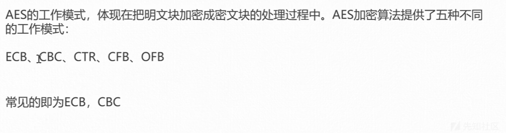

AES的工作模式,体现在把明文块加密成密文块的处理过程中。AES加密算法提供了五种不同  
的工作模式:

ECB、ICBC、CTR、CFB、OFB

常见的即为ECB,CBC

AES的特征

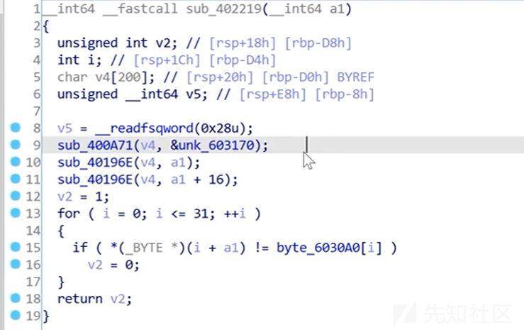

进入第8行函数

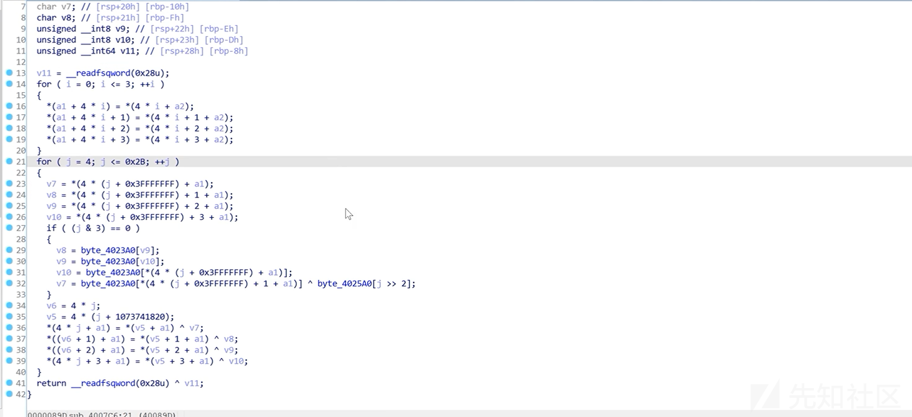

进去看后，这个不符合轮密钥加，因为轮密钥加只是简单的异或

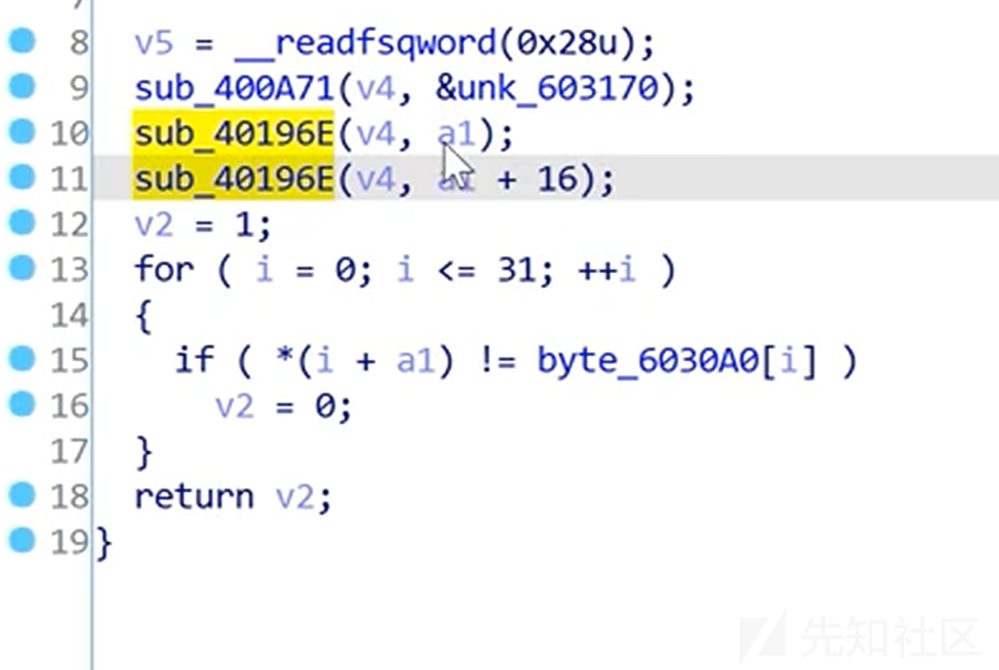

继续往下分析两个相同的函数，但是参数不同，也就是对半加密

进入

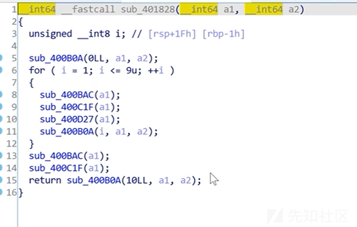

可以看到有个for循环9次，可能就是轮密钥加后9轮加密，后面三个函数对应的是第10轮加密

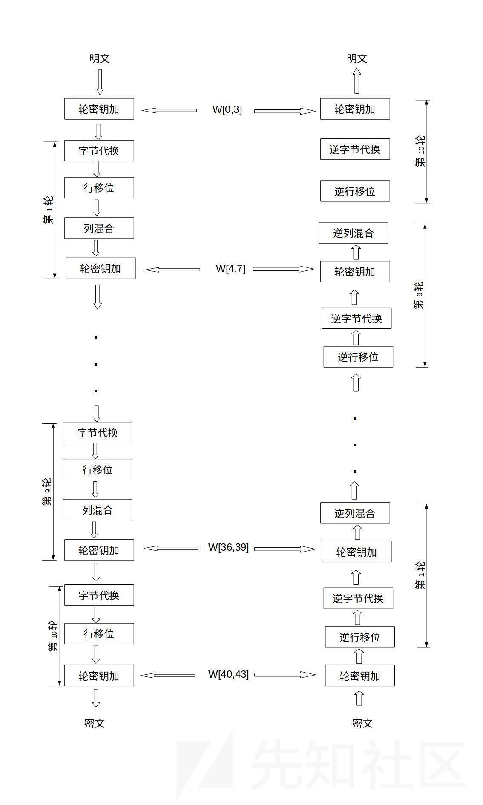

先看第一个

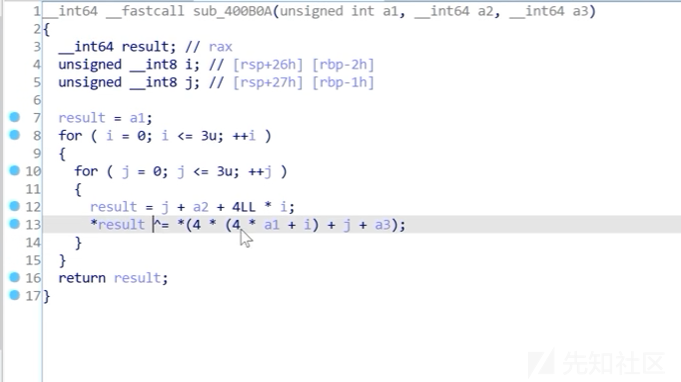

里面有4乘4的异或，这就会轮密钥加

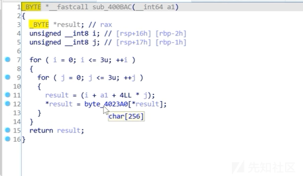

for里的第一个函数，外层循环遍历状态矩阵的 **行**（共4行，`i` 从0到3）。  
内层循环遍历状态矩阵的 **列**（共4列，`j` 从0到3）。

这里的**byte\_A023A0**就是S盒

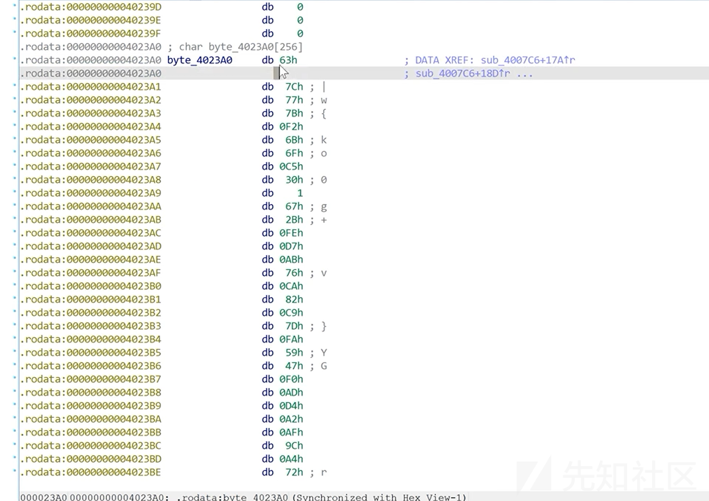

第一个是63，现在就可以证明这块就是字节代换了

for里的第二个函数

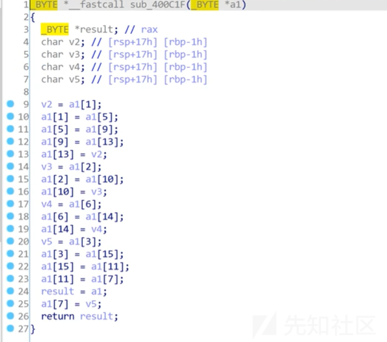

这块就是行位移，进行行移位操作，实现数据扩散

for里的第三个函数

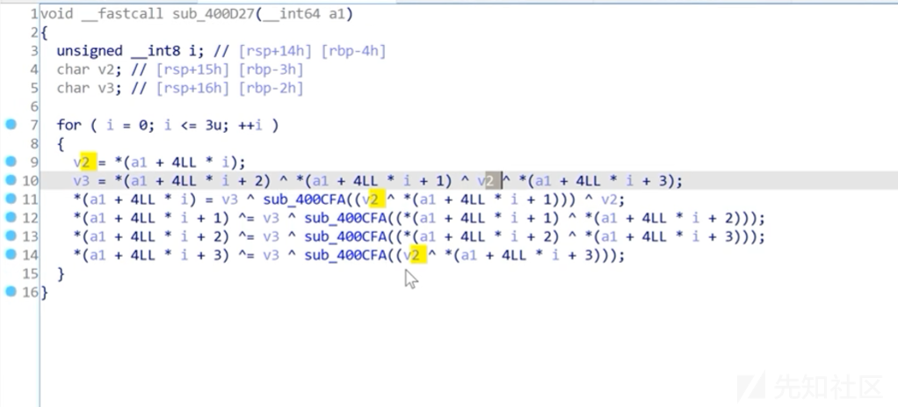

\*\*列混合，\*\*对AES状态矩阵的每一列进行线性变换（在GF(2⁸)有限域上的矩阵乘法），通过异或和自定义函数间接实现了有限域乘法

for里的第四个函数

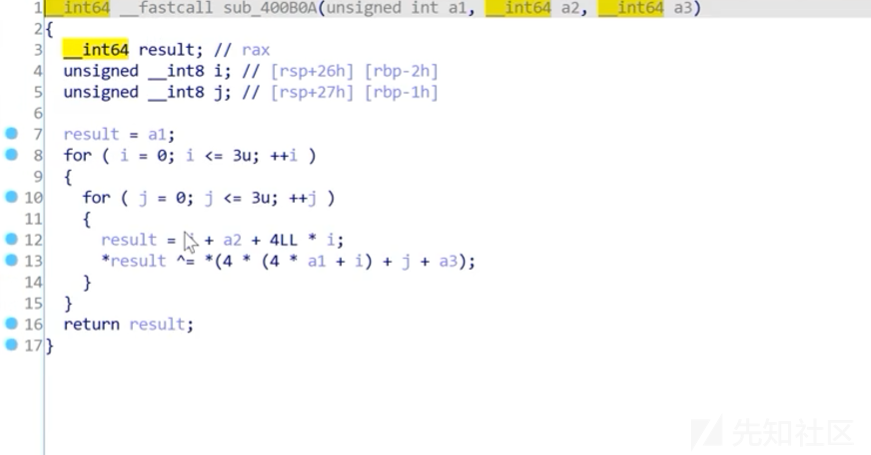

这块和第一个一样轮密钥加，后面三个就是10轮的了

## DES

DES分组长度为64比特,使用56比特密钥对64比特的明文串进行16轮加密,得到64比特的密文串。其中,  
使用密钥为64比特,实际使用56比特,其中8比特用作奇偶校验

加密步骤

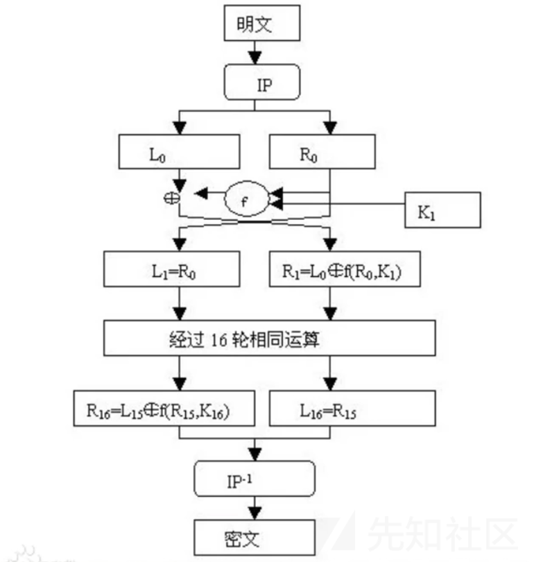

它的核心是f

初始置换（IP）：将64位明文分组通过固定的初始置换表（IP表）重新排列，生成置换后的64位数据（L₀和R₀各32位）。

16轮Feistel网络，每轮操作（i=1到16）：

右半部分扩展（E盒）：将32位右半部分Rᵢ₋₁通过扩展置换表（E盒）扩展为48位。

与子密钥异或（XOR）：将扩展后的48位结果与当前轮的子密钥Kᵢ进行异或运算。

S盒替换（核心非线性步骤）：将异或后的48位数据分为8组6位，每组通过对应的S盒（共8个）转换为4位输出（总计32位）。

P盒置换：对S盒输出的32位进行固定置换（P盒）。

更新左右半部分，左半部分Lᵢ = Rᵢ₋₁，右半部分Rᵢ = Lᵢ₋₁ ⊕ P盒结果。

最终置换（IP⁻¹），将最后一轮输出的L₁₆和R₁₆交换合并为64位，通过逆初始置换表（IP⁻¹表）得到最终的64位密文。

子密钥生成（K₁-K₁₆）  
PC-1置换

64位主密钥去除奇偶校验位，通过PC-1置换生成56位密钥。

循环左移

将56位密钥分为两半，每轮根据轮数循环左移1或2位（共16轮）。

PC-2置换

每轮通过PC-2置换压缩为48位子密钥Kᵢ。

ida选择Plugins→Findcrypt

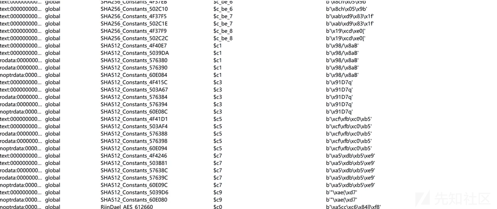​

## rc4

rc4是一种序列密码也称流密码,它属于对称加密算法的一种。密钥长度是[1,256]个字节。  
特点:算法简单,运行速度快且密钥长度可变,范围:[1,256]个字节。

什么是序列密码?  
就是算法在密钥控制下产生的一种随机序列,然后使用这个随机序列去和明文依次异或得到密文。

什么是对称加密算法?

简单的来说就是加密密钥与解密密钥相同的密码算法。

加密算法

一、变量初始化  
定义两个大小为256的S盒和T盒、密钥及明文。Q(小写的k数组用于存放最后生成的异或流)

```
S = [0]*256
T = [0]*256

K = list (b"this is key! ! ! !")
keylen .= len (K)
k =< 0]*256
print ("key:", bytes (K))

p = list (b"this is Plaintext")
len = len (p)
print ("p:", bytes (p))
```

二、密钥初始化  
1、初始化s盒和T盒。

```
#初始化s盒和T盒
for i in range (256) :
S[i] =i
T[i] = K[i%keylen]
```

在逆向分析时，找到初始化s盒和T盒位置就可以知道密钥

2、使用存放密钥的T盒来打乱s盒。

```
#使用密钥打乱s盒
j = 0
for i in range (256) :
j=(j+S[i]+T[i]) %256
S[i], S[j] = S[j], S[i]
```

三、产生异或流  
使用经过密钥打乱的s盒来生成和明文长度一样的异或流。

```
#产生异或流
i =0
j =0
efor r in range(len) :#1en为明文的长度,k用于存放生成的异或流
i = (i+1) %256
j = (j+S[i]) %256
S[i], S[j] = S[j], S[i]
t = (S[i]+S[j]) %256
k[r] = S[t]
```

四、异或加密

将明文和刚刚生成的异或流依次异或,完成加密。

```
#异或加密
for i in range (len) :
p[i]^=k[i] #k是上面生成的密钥流
```

rc4是一个序列密码,从上面可以知道,这种加密算法对明文的加密只有最后的异或,又根据异或的  
性质,所以此类密码算法的加密过程和解密过程都是一样的,只要密钥相同产生的异或流就相同。

也就是对于序列密码只要我们得到了异或流就可以加密和解密了。

下面分析32位用到了rc4的程序

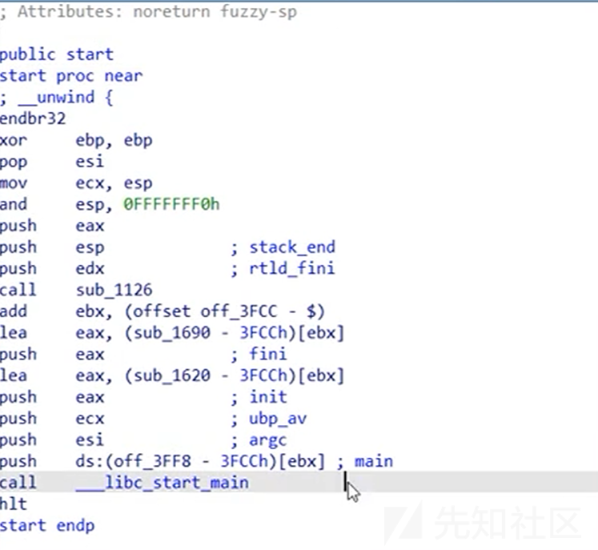

定位到main函数

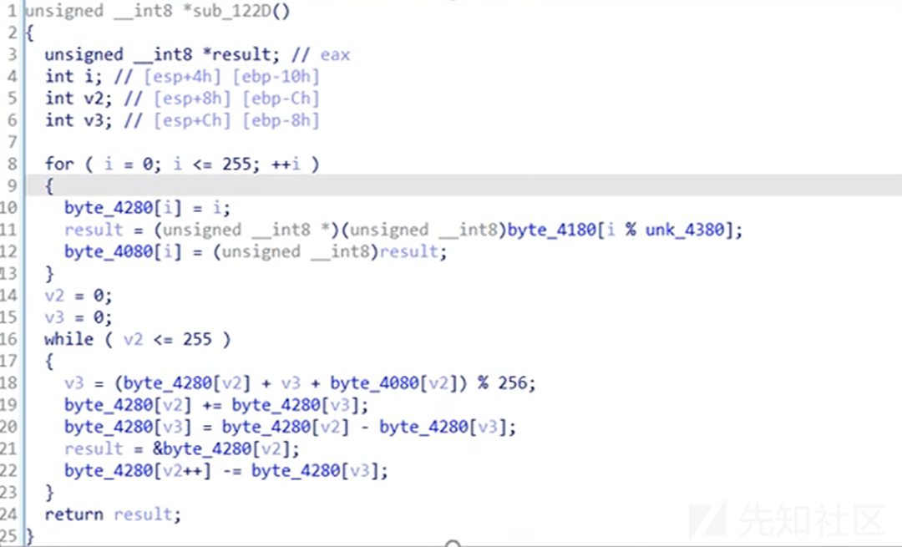

发现在最后的比较结果之前只有2个函数sub\_122D与sub\_1380,分别看一下:  
首先sub\_122D,很明显这是一个rc4的密钥初始化过程。

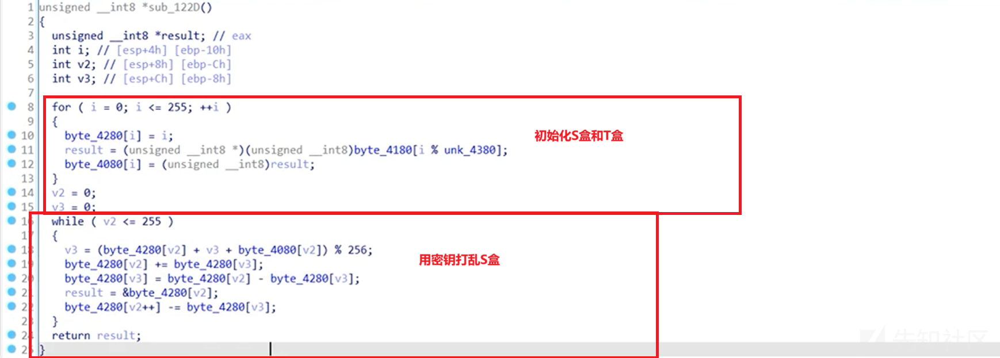

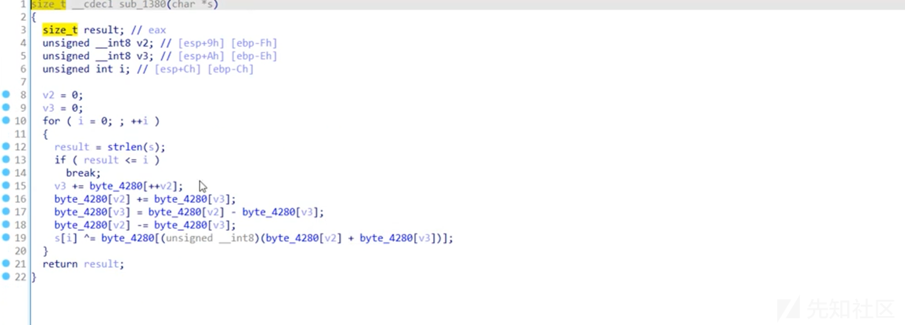

这里是一个异或，从第15行开始不断打乱S盒，15行是异或加密盒产生异或流也就是对应的下面的这一段

```
#产生异或流
i =0
j =0
efor r in range(len) :#1en为明文的长度,k用于存放生成的异或流
i = (i+1) %256
j = (j+S[i]) %256
S[i], S[j] = S[j], S[i]
t = (S[i]+S[j]) %256
k[r] = S[t]

#异或加密
for i in range (len) :
p[i]^=k[i] #k是上面生成的密钥流
```

## rsa

rsa是一种非对称加密算法,它是基于大数分解的数学难题的加密算法。

什么是非对称加密算法?  
简单来说就是加密密钥与解密密钥不相同的加密算法,这也说明了它有两个密钥,一个公钥、一个  
私钥。

密钥生成  
RSA的算法涉及三个参数，n、e、d，其中n被称为模数，是两个大质数p、q的积，n的二进制表示时所占用的位数，就是所谓的密钥长度。e和d是一对相关的值，e可以任意取，但要求e与(p-1)x(q-1)互质；再选择d：要求(dxe-1)能被(p-1)x(q-1)整除。值e和d分别称为公共指数和私有指数。公钥是数对(n，e)，密钥是数对（n，d)。

公钥

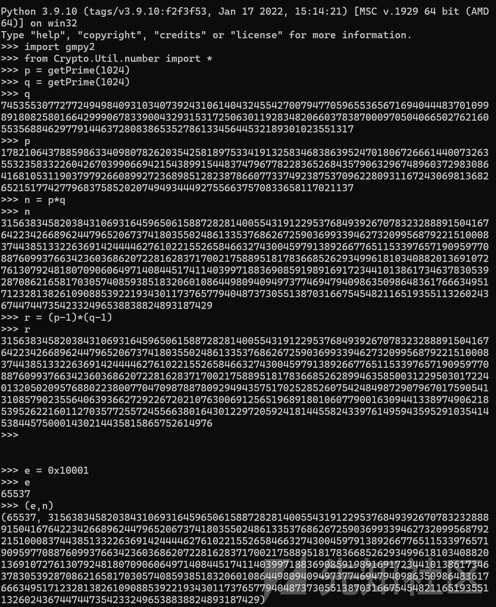

私钥

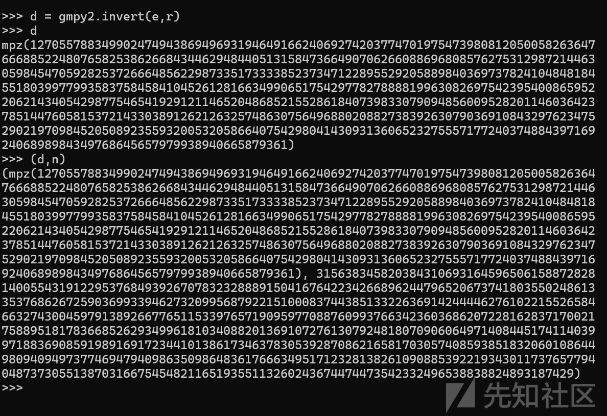

加密  
获得信息接收者的公开密钥(n，e)。  
(1)将明文分组：m=m0，ml，m2，…，mk-1。使得mi<n(i=0，1，…，k-1)。  
(2）对每一组明文用一下公式做加密变换ci-E(mi)-mie(mod n)。  
(3）得到密文c=c0，cl，c2，…，ck-1。

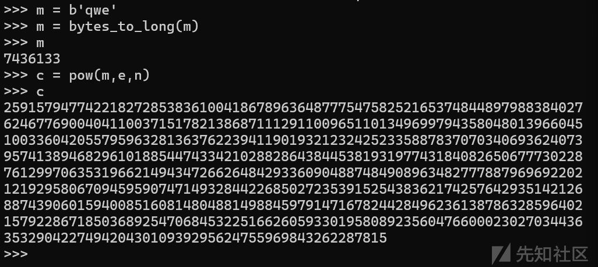

解密  
(1)对每一密文做解密变换mi=D(ci)=cd(modn）。  
(2）合并分组得到的明文m-mO，ml，m2，……mk一1。  
知道公钥可以得到获取私钥的途径，但这取决于将模数因式分解成组成它的质数。如果选择了足够长的密钥，这样基本上不可能获取私钥。RSA实验室建议：普通公司密钥1024位就已足够。对极其重要的资料，就用双倍的大小的2048位。日常使用768位就能满足要求。  
密钥长度增加时会影响加密/密的速度，所以这里有一个权衡。将模数加倍将使得使用公钥的操作时间大概增加为原来的4倍，而用私钥加密/解密所需的时间增加为原来的8倍。进一步说，当模数加倍时，生成密钥的时间平均将增加为原来的16倍。

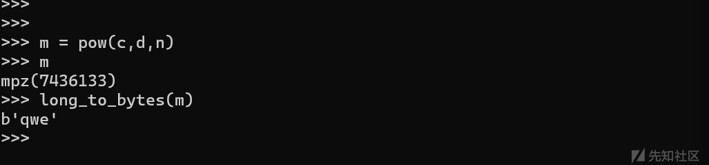

看这个64位使用rsa的程序

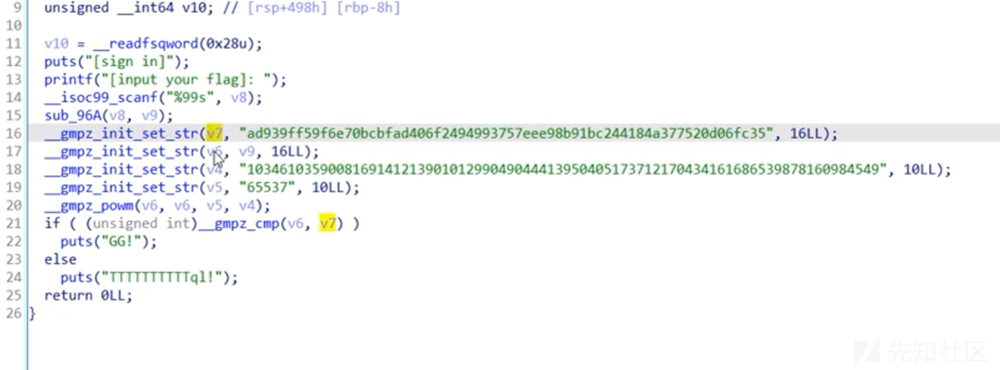

可以看到使用了GNU，16行吧字符串转成16进制给v7，17行v9值转成16进制，18行转成10进制，v7是密文

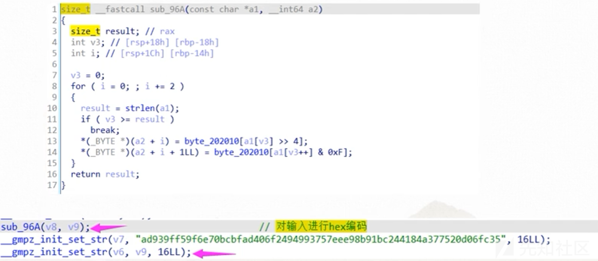

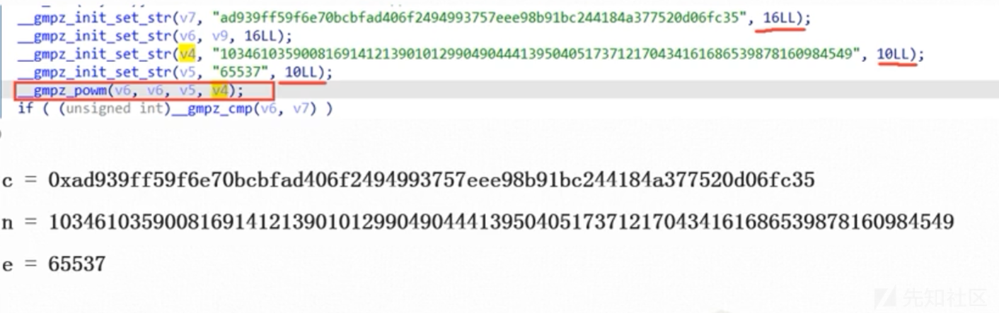

这里有pow运算，就是加密的过程，v7是c，v4是n，v5是e

## sm4

分组密钥算法，国密

SM4 算法主要包含异或、移位以及盒变换操作。它分为密钥拓展和加/解密两个模块,这两个模块的  
流程大同小异  
其中,移位变换是指循环左移;盒变换是一个将8bit输入映射到8bit输出的变换,是一个固定的变  
换  
下图是 SM4 的加解密(左)和密钥拓展(右)的流程图

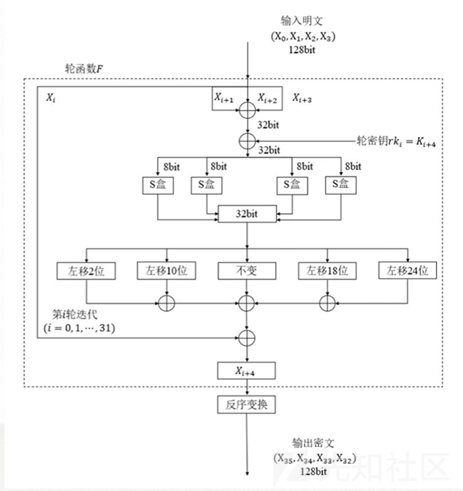

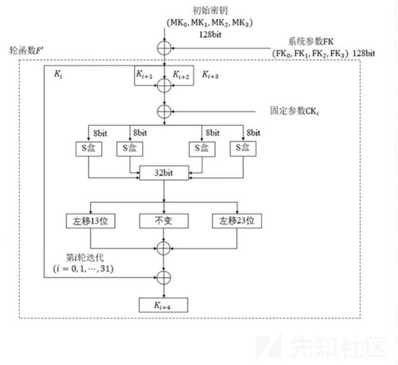

可以根据S盒，初始密钥MK，系统参数FK，这三个来判断是否使用了SM4，这三个都是固定不变的

S盒

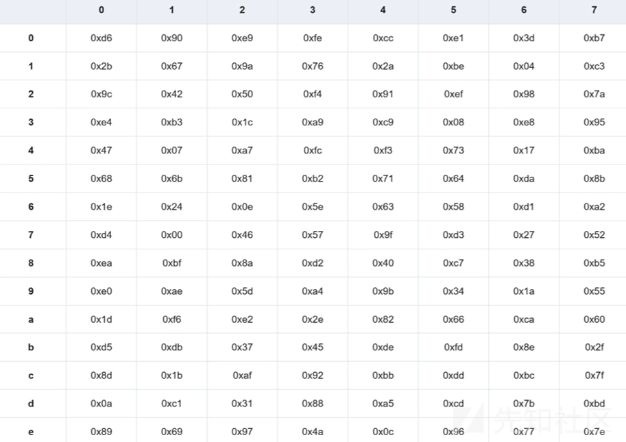

看程序中有S盒的数值，比如0xd6,0x90,0xe9

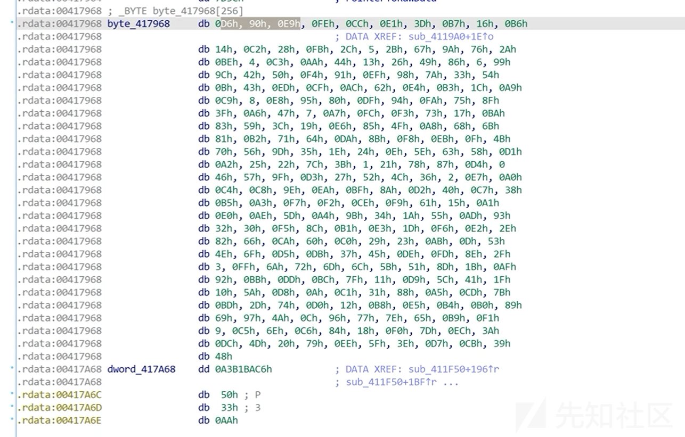

FK

这个属于SM4的专属特征了

若程序初始化时加载0xa3b1bac6, 0x56aa3350...（SM4 的 FK）或0x00070e15, 0x1c232a31...（SM4 的 CK），直接锁定 SM4；若加载0x9e3779b9（delta 值），优先怀疑 TEA/XTEA/XXTEA（三者 delta 相同，但后续特征不同）。

```
FK = {0xa3b1bac6, 0x56aa3350, 0x677d9197, 0xb27022dc}
```

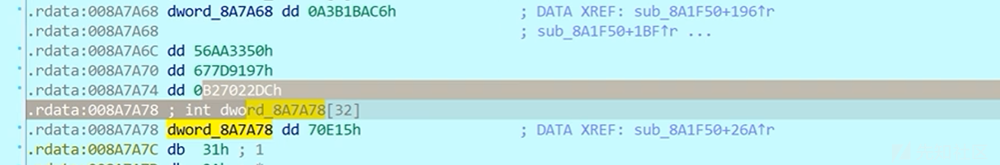

CK

```
CK ={
0x00070e15, 0x1c232a31, 0x383f464d, 0x545b6269,
0x70777e85, 0x8c939aa1, 0xa8afb6bd, 0xc4cbd2d9,
0xe0e7eef5,0xfc030a11, 0x181f262d, 0x343b4249,
0x50575e65, 0x6c737a81 0x888f969d, 0xa4abb2b9,
0xc0c7ced5, 0xdce3eaf1, 0xf8ff060d, 0x141b2229,
0x30373e45, 0x4c535a61, 0x686f767d, 0x848b9299,
0xa0a7aeb5, 0xbcc3cad1, 0xd8dfe6ed, 0xf4fb0209,
0x10171e25, 0x2c333a41, 0x484f565d, 0x646b7279
};
```

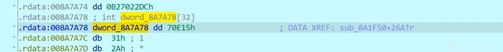

SM4 的密钥拓展和轮函数会用到 FK（固定参数）和 CK（轮常量），在反汇编中若发现 “数组初始化时加载0xa3b1bac6, 0x56aa3350...（即 FK）”，或循环中引用0x00070e15, 0x1c232a31...（即 CK），可确定是 SM4

加解密

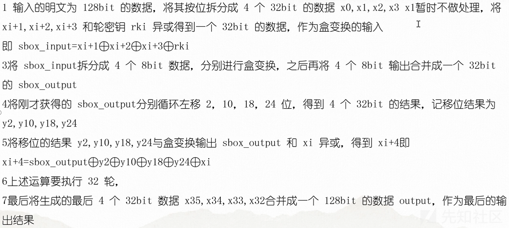

密钥拓展

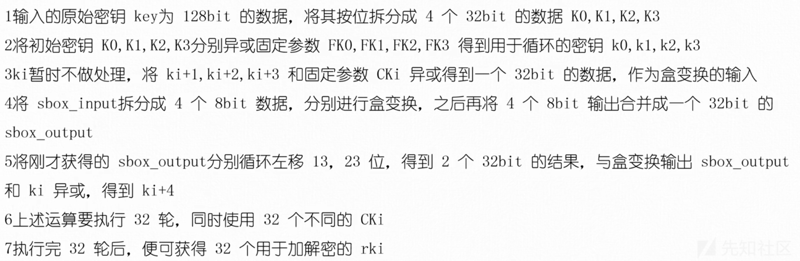

如果想要实现解密,一个简单的方法是将轮密钥rki 逆序后再执行一次32 轮的加密运算  
即将密文投入加密函数,并且第0轮使用rk31 作为轮密钥,第i 轮使用 rk31-i 作为轮密钥,  
最后获得的结果便是加密前的密文

## tea

加密

```
void EncryptTEA(unsigned int *firstChunk, unsigned int *secondChunk, unsigned int* key)

unsigned int y = *firstChunk;
unsigned int z = *secondChunk;
unsigned int sum = 0;

unsigned int delta = 0x9e3779b9;#模数

for(inti=0;i<8;i++)//8轮运算(需要对应下面的解密核心函数的轮数一样)

sum += delta;
y +=((z << 4) + key[0]) ^ (z + sum) ^ ((z>> 5) + key[1]);
Z+=((y << 4)+ key[2]) ^ (y+sum) ^((y>>5) + key[3]);

*firstChunk = y;
*secondChunk = z;
```

在加密过程中,  
明文:需要使用2个32位的无符号整数,EncryptTEA前两个参数  
密钥:128位,四个32位无符号整数，EncryptTEA最后一个参数

解密

```
void DecryptTEA(unsigned int *firstChunk, unsigned int *secondChunk, unsigned int* key)

unsigned int sum = 0;
unsigned int y = *firstChunk;
unsigned int z = *secondChunk;
unsigned int delta = 0x9e3779b9;

sum=delta << 3;//32轮运算,所以是2的5次方;16轮运算,所以是2的4次方;8轮运算,所以是2的3次方

for(inti=0;i<8;i++)//8轮运算

z -= (y << 4) + key[2] ^y + sum ^ (y>> 5) + key[3];
y -= (z << 4) + key[0] ^ z + sum ^ (z >> 5) + key[1];
sum -= delta;

*firstChunk = y;
*secondChunk = z;
```

xtea

加密

```
#include <stdio.h>
#include <stdint.h>

/* take 64 bits of data in v[0] and v[1] and 128 bits of key[0] - key[3] */

void encipher(unsigned int num_rounds, uint32_t v[2], uint32_t const key[4]) {
unsigned int i;
uint32_t v0=v[0], v1=v[1], sum=0, delta=0x9E3779B9;
for (i=0; i < num_rounds; i++) {
v0 +=(((v1 << 4)^(v1>>5))+v1)^(sum+key[sum&3]);
sum += delta;
v1+=(((v0 << 4)^(v0>>5))+v0)^(sum+key[(sum>>11)&3]);

v[0]=v0; v[1]=v1;

}

}

void decipher(unsigned int num_rounds, uint32_t v[2], uint32_t const key[4]) {
unsigned int i;
uint32_t v0=v[0], v1=v[1], delta=0x9E3779B9, sum=delta*num_rounds;
for (i=0; i < num_rounds; i++) {
v1 -= (((v0 << 4)^(v0>>5))+v0)^(sum+key[(sum>>11)&3]);
sum -= delta;
v0 -= (((v1 << 4)^(v1>>5))+v1)^(sum+key[sum &3]);

v[0]=v0; v[1]=v1;

}

}
```

解密

```
#include <stdio.h>
#include <stdint.h>

/* take 64 bits of data in v[0] and v[1] and 128 bits of key[0] - key[3] */

void encipher(unsigned int num_rounds, uint32_t v[2], uint32_t const key[4]) {
unsigned int i;
uint32_t v0=v[0], v1=v[1], sum=0, delta=0x9E3779B9;
for (i=0; i < num_rounds; i++) {
v0 +=(((v1 << 4)^(v1>>5))+v1)^(sum+key[sum &3]);
sum += delta;
v1+=(((v0 << 4)^(v0>>5))+v0)^(sum+key[(sum>>11)&3]);

v[0]=v0; v[1]=v1;

}

}

void decipher(unsigned int num_rounds, uint32_t v[2], uint32_t const key[4]) {
unsigned int i;
uint32_t v0=v[0], v1=v[1], delta=0x9E3779B9, sum=delta*num_rounds;
for (i=0; i < num_rounds; i++) {
v1 -= (((v0 << 4)^(v0>>5))+v0)^(sum+key[(sum>>11)&3]);
sum -= delta;
v0 -= (((v1 << 4)^(v1>>5))+v1)^(sum+key[sum&3]);

v[0]=v0; v[1]=v1;

}

}
```

### xxtea

加密

```
/* Coding Part */

#include <stdio.h>
#include <stdint.h>
#define DELTA 0x9e3779b9
#define MX (((z>>5^y << 2)+(y>>3^z << 4))^((sum^y)+(key[(p&3)^e]^z)))

void btea(uint32_t *v, int n, uint32_t const key[4])

uint32_t y, z, sum;
unsigned p, rounds, e;
if (n>1)
{
    rounds = 6 + 52/n;
    sum = 0;
    z = v[n-1];
    do
}

}

sum += DELTA;
e = (sum >> 2) & 3;
for (p=0; p<n-1; p++)

y = v[p+1];
z = v[p] += MX;

y = v[0];
z = v[n-1] += MX;

while ( -- rounds);
```

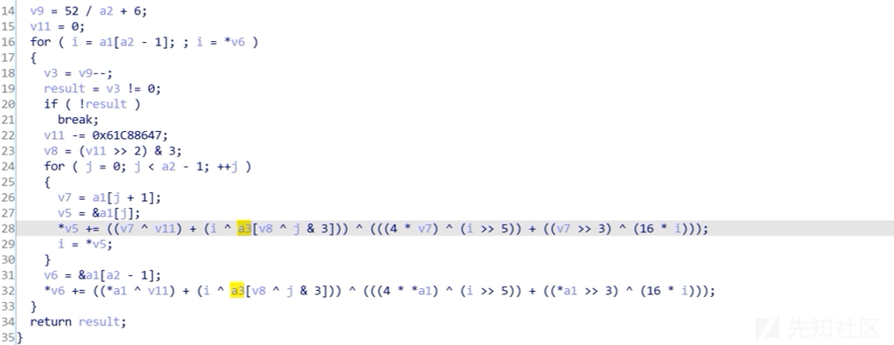

可以看到14和28行符合xxtea的加密流程

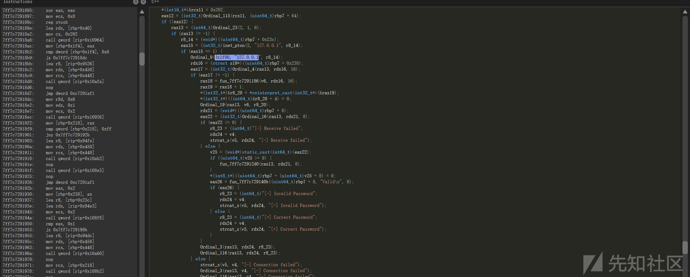

* TEA：加密轮数固定（通常 32 轮），汇编中可见 “sum += delta” 和 “y += (z<<4 + key[0]) ^ ...” 的对称操作，密钥是 4 个 32 位整数；
* XTEA：轮数可自定义，密钥访问方式不同（key[sum&3]和key[(sum>>11)&3]），反汇编中可见 “sum参与密钥索引计算”；
* XXTEA：支持多块数据加密（n为数据块数），代码中有 “for (p=0; p<n-1; p++)” 的多轮循环，且MX宏的表达式更复杂（含z>>5^y<<2等混合操作）。  
  同时补充 “破解实例”：若逆向中发现某段加密函数符合 XXTEA 的特征，如何提取密钥（通过内存 dump 密钥数组）、如何用工具（如 IDA 的 Hex-Rays 插件）反编译出key的值，再用 XXTEA 解密脚本验证。

若反汇编中密钥索引是key[sum&3]或key[(sum>>11)&3]（如mov ecx, key[ecx+sum&3]），是 XTEA；若密钥索引固定为key[0]~key[3]（如mov edx, key[0]），是 TEA；若有 “多数据块循环”（for (p=0; p<n-1; p++)），是 XXTEA。

XOR 的特征是xor指令在循环中高频出现（如xor al, [key+esi]）；TEA 系列必有 “sum += delta” 和 “移位 + 异或混合运算”（如(z<<4) ^ (z>>5)）；SM4 则有 “S 盒查表操作”（反汇编中会有mov al, [sbox+eax]，S 盒是固定数组0xd6,0x90,0xe9...）。

## 总结

以下是我总结的对比表

|  |  |  |  |
| --- | --- | --- | --- |
| **加密算法** | **汇编中典型特征（反汇编视角）** | **算法核心逻辑** | **快速验证方法** |
| **XOR（单字节 / 多字节）** | - 循环中高频出现 xor 指令（如 xor al, byte ptr [esi + key\_offset]，al 为明文 / 密文字节，[esi + key\_offset] 为密钥字节）； - 无复杂运算（如移位、查表），仅简单异或； - 密钥可能是固定数组（如 keyStore 直接初始化）或运行时生成（如从内存 / 文件读取）。 | 明文与密钥逐字节异或得到密文，即 c = p ^ k；解密同理 p = c ^ k。 | 1. 从内存中 dump 密文数组 C 和密钥数组 K； 2. 取 C[0] ^ K[0]，查看结果是否为可打印 ASCII 字符（如字母、数字）； 3. 若多个字节异或后都符合 ASCII 规律，基本可确定是 XOR。 |
| **TEA** | - 存在常量 delta = 0x9e3779b9（常以立即数形式出现，如 mov eax, 0x9e3779b9）； - 密钥为固定的 4 个 32 位整数（key[0] - key[3]，反汇编中可见对 key 数组的直接索引，如 mov edx, dword ptr [key + 0]）； - 加密循环中存在 “sum += delta”（如 add sum, 0x9e3779b9）和 “移位 + 异或 + 加法” 的混合运算（如 y += ((z << 4) + key[0]) ^ (z + sum) ^ ((z >> 5) + key[1]) 对应汇编：shl edx, 4 → add edx, [key] → xor edx, ecx → ...）。 | 64 位数据分两组（y 和 z），经 32 轮（或自定义轮数）迭代，每轮通过 “移位、异或、加法” 与密钥混合运算，实现加密。 | 1. 搜索程序中是否存在 0x9e3779b9 常量； 2. 找到疑似加密的循环，查看是否有 “sum += delta” 和 “shl/shr + xor + add” 的连续操作； 3. 提取密钥 key[0] - key[3]，用 TEA 解密脚本（已知密文）验证是否能得到合理明文。 |
| **XTEA** | - 存在常量 delta = 0x9e3779b9； - 密钥访问方式依赖 sum（如 mov ecx, key[sum & 3] 或 mov ecx, key[(sum >> 11) & 3]，sum 是每轮递增的变量）； - 加密循环中 “移位 + 异或 + 加法” 的混合运算与 TEA 类似，但密钥索引逻辑不同。 | 与 TEA 核心运算逻辑一致，但密钥索引由 sum 动态计算（sum & 3 或 (sum >> 11) & 3），增加了密钥访问的随机性。 | 1. 同样先找 0x9e3779b9 常量； 2. 查看密钥索引是否与 sum 相关（如 sum 参与 key 的地址计算）； 3. 提取 sum 初始值、轮数和密钥，用 XTEA 解密脚本验证。 |
| **XXTEA** | - 存在常量 delta = 0x9e3779b9； - 支持多块数据加密，反汇编中可见 “多数据块循环”（如 for (p = 0; p < n - 1; p++) 对应汇编的 loop 指令，n 为数据块数量）； - 核心运算由复杂宏 MX 实现（如 ((z >> 5 ^ y << 2) + (y >> 3 ^ z << 4)) ^ ((sum ^ y) + (key[(p & 3) ^ e] ^ z))，对应汇编中大量的 shl/shr、xor、add 混合操作）。 | 对多块 32 位数据进行加密，每块数据都与相邻块及密钥通过 MX 宏定义的复杂运算混合，轮数通常为 6 + 52/n（n 为数据块数）。 | 1. 查找 0x9e3779b9 常量； 2. 检查是否有 “多数据块循环”（如循环次数与数据长度相关）； 3. 定位 MX 宏对应的汇编代码段，提取运算逻辑，用 XXTEA 解密脚本（结合数据块数）验证。 |
| **SM4** | - 存在固定参数数组 **FK**（0xa3b1bac6, 0x56aa3350, 0x677d9197, 0xb27022dc）和 **CK**（轮常量数组，如 0x00070e15, 0x1c232a31...），反汇编中可见对这些数组的初始化或访问（如 mov dword ptr [fk\_array], 0xa3b1bac6）； - 存在 **S 盒查表操作**，S 盒是固定数组（0xd6, 0x90, 0xe9...），反汇编中会有 mov al, byte ptr [sbox + eax] 这类查表指令（eax 为输入字节，查表后得到输出字节）； - 加密流程包含 “字节代换（S 盒）、行移位、列混合、轮密钥加” 四步，反汇编中可见这四步对应的连续操作（如先查表，再循环移位，再异或轮密钥）。 | 128 位分组加密，通过 32 轮迭代，每轮结合 S 盒、行移位、列混合、轮密钥加（由 FK、CK 和初始密钥拓展而来）实现加密；解密是加密的逆过程，轮密钥逆序使用。 | 1. 搜索程序中是否存在 FK、CK 的初始化值； 2. 查找 S 盒查表指令，dump 内存中的 S 盒数组，与标准 SM4 S 盒对比是否一致； 3. 定位轮密钥拓展函数，查看是否使用 FK 和 CK 生成轮密钥； 4. 若以上特征都匹配，可提取轮密钥和密文，用 SM4 解密算法验证。 |

|  |  |  |  |
| --- | --- | --- | --- |
| **加密算法** | **汇编中典型特征（反汇编视角）** | **算法核心逻辑** | **快速验证方法** |
| **AES** | - 存在**S 盒查表操作**，AES 的 S 盒是固定的非线性替换表，反汇编中可见类似mov al, byte ptr [aes\_sbox + eax]的查表指令（eax为输入字节，查表得到输出字节）； - 存在 \*\* 行移位（ShiftRows）**操作，对应汇编中对状态矩阵行的循环移位指令（如第 1 行左移 1 字节，第 2 行左移 2 字节等，通过****rol****等循环移位指令实现）；** **- 存在**列混合（MixColumns）**操作，是在有限域****GF(2⁸)****上的矩阵乘法，反汇编中可见复杂的异或和自定义函数（模拟有限域乘法）组合；** **- 存在**轮密钥加（AddRoundKey）\*\* 操作，即与轮密钥逐字节异或，反汇编中可见xor指令结合轮密钥数组的访问（如xor eax, dword ptr [round\_key + ecx]）； - 密钥长度相关特征，若为 AES-128，密钥拓展后会生成 11 个轮密钥（包括初始轮密钥）；AES-192 对应 13 个轮密钥；AES-256 对应 15 个轮密钥，反汇编中可通过轮密钥数组的大小判断。 | 128 位分组加密，根据密钥长度（128、192、256 位）进行 10、12、14 轮迭代，每轮包含字节代换（S 盒）、行移位、列混合、轮密钥加（最后一轮无列混合），通过密钥拓展生成多轮密钥。 | 1. 查找 AES 特有的 S 盒查表指令，dump S 盒与标准 AES S 盒对比； 2. 观察是否有行移位、列混合、轮密钥加的连续操作序列； 3. 统计轮密钥数量，判断 AES 版本（11 个轮密钥则为 AES-128 等）； 4. 提取轮密钥和密文，用对应版本 AES 解密算法验证。 |
| **RSA** | - 存在**大整数幂运算（Modular Exponentiation）**，RSA 加密 / 解密核心是c = m^e mod n（加密）、m = c^d mod n（解密），反汇编中可见循环实现的快速幂算法（如蒙哥马利算法），包含大量的乘法、取模操作，以及对大整数（多字节表示）的处理； - 存在**大整数存储**，RSA 的模数n、公钥e、私钥d通常是数百位的大整数，在内存中以多字节数组形式存储，反汇编中可见对大数组的初始化或操作（如mov dword ptr [n + 0], 0x...等连续赋值）； - 存在**模运算（Modular Arithmetic）**，反汇编中可见div（除法）指令结合取余操作，或专用的模运算函数调用。 | 非对称加密，基于大整数分解难题，加密用公钥(n, e)，解密用私钥(n, d)，核心是大整数的模幂运算。 | 1. 查找是否有大整数（数百位）的存储和操作； 2. 查找快速幂算法的实现（如循环中的乘法、取模）； 3. 若能识别出公钥(n, e)，可尝试用 RSA 加密已知明文，对比密文是否一致。 |
| **RC4** | - 存在**S 盒初始化操作**，RC4 会初始化大小为 256 的 S 盒，反汇编中可见对数组的初始化循环（如for (i = 0; i < 256; i++) S[i] = i）； - 存在**S 盒打乱操作**，使用密钥通过循环打乱 S 盒，反汇编中可见j = (j + S[i] + T[i]) % 256; S[i], S[j] = S[j], S[i]对应的指令（T是由密钥生成的临时数组）； - 存在**密钥流生成操作**，通过打乱后的 S 盒生成与明文长度相同的密钥流，反汇编中可见生成密钥流的循环（如i = (i + 1) % 256; j = (j + S[i]) % 256; S[i], S[j] = S[j], S[i]; t = (S[i] + S[j]) % 256; k[r] = S[t]）； - 存在**异或加密操作**，用生成的密钥流与明文逐字节异或，反汇编中可见xor指令结合密钥流数组的访问。 | 流密码，通过初始化并打乱 S 盒，生成密钥流，再与明文异或得到密文，解密时用相同密钥生成相同密钥流，异或密文得到明文。 | 1. 查找 S 盒初始化、打乱的循环； 2. 查找密钥流生成和异或加密的循环； 3. 提取密钥，用 RC4 算法生成密钥流，与密文异或验证是否得到合理明文。 |
| **DES** | - 存在**初始置换（IP）和最终置换（IP⁻¹）**，反汇编中可见对 64 位数据的重新排列操作，通过固定的置换表实现； - 存在**Feistel 网络结构**，16 轮 Feistel 迭代，每轮包含扩展、与子密钥异或、S 盒替换、P 盒置换，反汇编中可见 16 次类似的循环操作； - 存在**S 盒查表操作**，DES 有 8 个 S 盒，反汇编中可见对这 8 个 S 盒的查表指令（如根据 6 位输入查找 4 位输出）； - 存在**子密钥生成操作**，从 56 位主密钥生成 16 轮子密钥，反汇编中可见 PC-1、PC-2 置换以及循环左移操作对应的指令。 | 64 位分组加密，通过初始置换、16 轮 Feistel 网络（含扩展、S 盒、P 盒等操作）、最终置换实现加密，子密钥由主密钥生成。 | 1. 查找初始置换、最终置换的操作； 2. 查找 16 轮 Feistel 迭代的循环； 3. 查找 S 盒查表指令，dump S 盒与标准 DES S 盒对比； 4. 提取子密钥，用 DES 解密算法验证密文。 |
