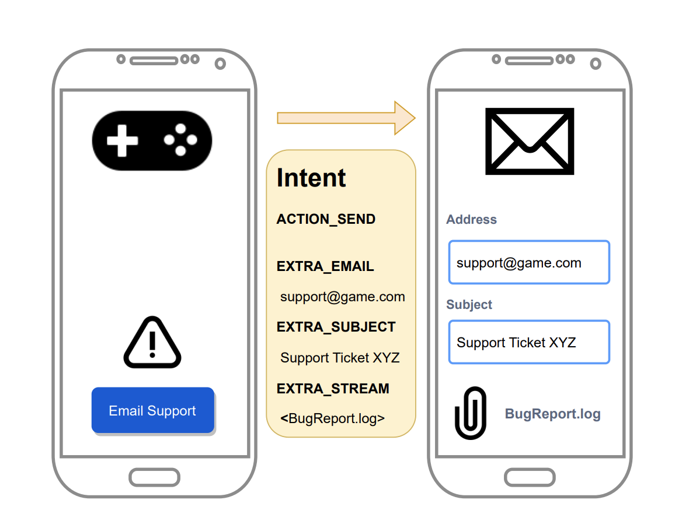
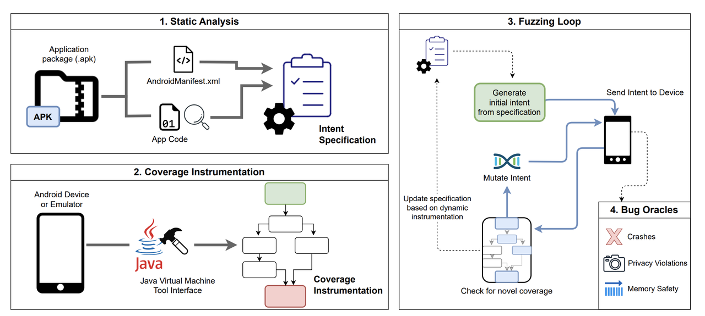
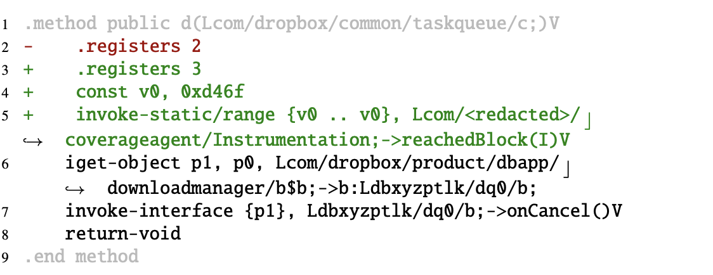
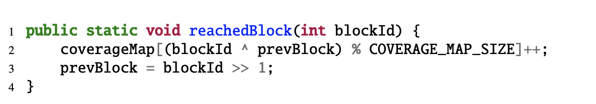
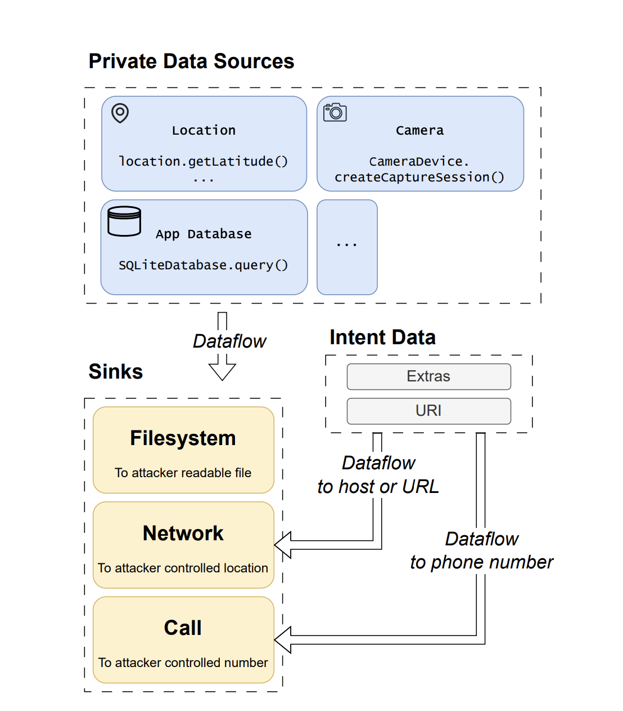
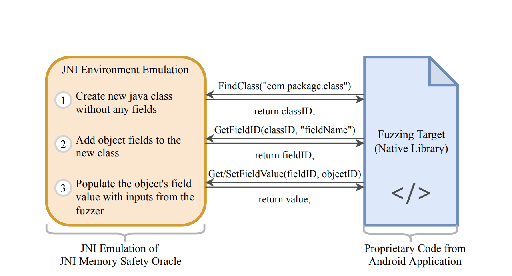
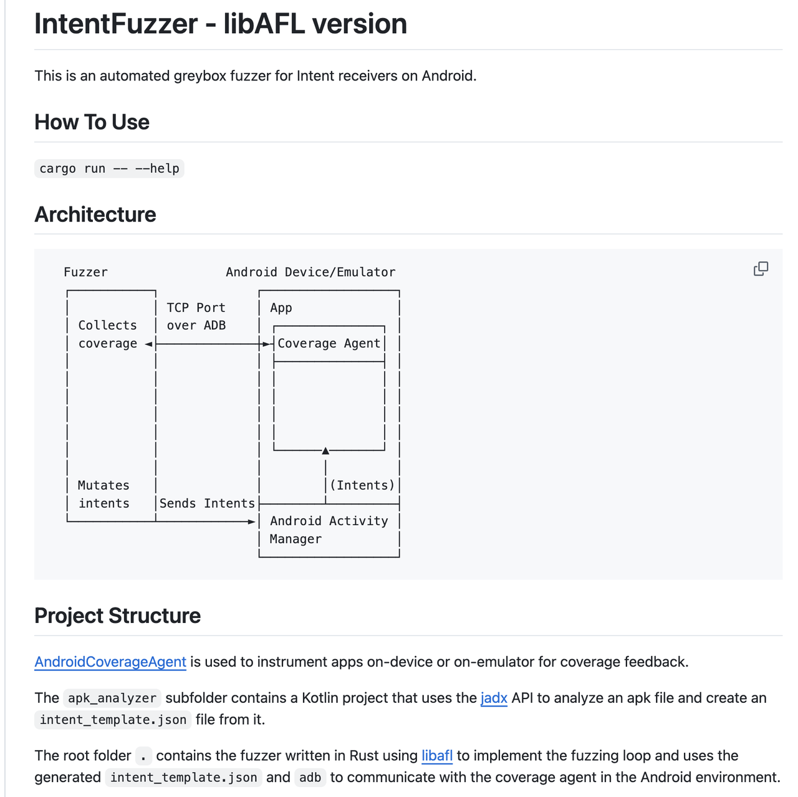

# 安卓Intent自动化灰盒模糊测试优化技术-先知社区

> **来源**: https://xz.aliyun.com/news/18658  
> **文章ID**: 18658

---

# 背景

在安卓生态系统中，Intent作为跨组件通信的核心机制，既是应用间协作的桥梁，也是安全隔离的薄弱环节。近年来，Intent相关漏洞呈现持续增长趋势，这些漏洞往往源于开发者对组件暴露范围的误判，导致恶意应用可通过精心构造的Intent调用敏感功能。传统安全测试工具要么局限于静态分析，要么无法有效覆盖闭源应用，本文介绍的MALintent框架的出现填补了这一空白——它是首个针对闭源安卓应用的灰盒Intent模糊测试工具，通过创新的覆盖插桩技术和多维度漏洞检测机制，实现了对Intent处理逻辑的深度挖掘。本文将从技术原理、实现细节到实战效果，全面剖析MALintent框架如何突破传统测试工具的局限，成为安卓应用安全测试的利器。



# 核心技术解析



## 静态分析：精准提取Intent处理规范

静态分析模块通过三级递进式分析，构建完整的Intent处理规范：

* **Manifest****解析**：从AndroidManifest.xml中识别所有导出组件（activity、service、receiver），提取其intent-filter中的action、category、data约束。例如，邮件应用的EmailComposeActivity通常声明android.intent.action.SEND动作和mailto数据 scheme。
* **字节码分析**：使用jadx decompiler对APK进行反编译，通过AST遍历识别Intent extras的键名和类型。例如，检测getStringExtra("android.intent.extra.EMAIL")调用，确定该组件接受字符串类型的邮箱参数。
* **规范生成**：整合上述信息生成结构化的Intent规范，包含组件类型、动作/类别约束、数据格式和extras键值对类型。三星浏览器的规范示例如下：

```
{
  "package": "com.sec.android.app.sbrowser",
  "name": "com.sec.android.app.sbrowser.SBrowserLauncherActivity",
  "component": "<activity>",
  "action": "android.intent.action.VIEW",
  "categories": ["android.intent.category.DEFAULT", "android.intent.category.BROWSABLE"],
  "data": {"scheme": ["http", "https", "about", "javascript"]},
  "extras": {
    "android.intent.extra.REFERRER_NAME": "string",
    "create_new_tab": "boolean"
  }
}
```

这种静态分析能够在测试开始前生成高质量的初始种子，避免传统黑盒测试的盲目性。

## 动态覆盖插桩：基于JVMTI的无侵入式监测

MALintent创新性地采用JVMTI（JVM Tool Interface）实现动态字节码插桩，解决了传统插桩方法兼容性差的问题：

* **工作原理**：通过在目标应用启动时加载JVMTI代理，拦截类加载事件（JVMTI\_EVENT\_CLASS\_FILE\_LOAD\_HOOK），对每个类的字节码进行动态修改。在每个基本块入口插入覆盖率收集代码，记录块ID和执行路径（如图所示）



* **技术优势**：与传统的APK重打包方法（如COSMO、ACVTool）相比，JVMTI插桩具有三大优势：

* **广泛****兼容性**：支持Android 8至14全版本，不受multi-dex格式和新字节码指令影响（表1）
* **无侵入性**：无需修改APK文件，避免签名验证问题
* **低性能损耗**：通过缓存已插桩类文件，将启动延迟控制在可接受范围

* **覆盖率计算**：采用类似AFL的边覆盖率算法，通过当前块ID与前一块ID的异或运算生成覆盖映射,有效平衡覆盖率精度和性能开销。



这种插桩技术使MALintent成为首个能对闭源应用进行灰盒模糊测试的Intent fuzzer。

## 智能模糊测试循环：基于覆盖引导的Intent变异

MALintent的模糊测试引擎基于LibAFL实现，包含种子生成、Intent发送、覆盖率反馈和变异优化四大环节：

* **种子生成**：基于静态分析得到的Intent规范，生成符合过滤器要求的初始种子集，包括：

* 无动作但满足数据约束的Intent
* 含所有必需类别的Intent
* 每个动作与数据组合的Intent

* **多维度变异策略**：针对Intent的结构特点设计六种变异器：

* **数据变异**：修改URI的scheme、host、path等组件
* **MIME****类型变异**：替换数据的MIME类型
* **标志变异**：修改Intent的flags（如FLAG\_ACTIVITY\_NEW\_TASK）
* **Extras变异**：增删键值对、修改值类型、替换文件内容
* **输入类型变异**：在直接值、文件路径、ContentProvider间切换
* **文件后缀变异**：尝试常见文件扩展名（.jpg, .pdf等）

* **动态规范更新**：通过运行时监控hasExtra调用和registerReceiver动态注册，发现静态分析未识别的extras键（如代码清单7中的动态生成键名URI\_EXTRA + "\_" + index）。这种覆盖引导的变异策略使MALintent能高效探索深层代码路径，在Top Google Play应用中平均发现3.1倍于无引导测试的代码边数。

# 多模态漏洞检测

MALintent设计了三种互补的漏洞检测机制，覆盖不同类型的安全问题：

## 崩溃DOS

通过监控logcat中的应用崩溃日志，检测空指针异常、数组越界等导致的DoS漏洞。典型案例如代码清单8所示，未检查getStringExtra返回值导致的NPE：

```
String text = intent.getStringExtra(Intent.EXTRA_TEXT);
if (text.startsWith("tel:")) {  // 当EXTRA_TEXT不存在时崩溃
```

MALintent通过堆栈跟踪哈希实现崩溃去重，确保每个崩溃报告对应唯一漏洞。

## 隐私安全

基于动态污点分析追踪敏感数据流，识别从隐私源（位置、摄像头、联系人）到攻击者可访问的汇（世界可读文件、网络连接）的数据流。如图4所示，监控的敏感API包括：

* Location.getLatitude()（位置信息）
* Camera.takePicture()（摄像头数据）
* SQLiteDatabase.query()（应用数据库）

典型案例包括：

**WhatsApp CameraActivity**：通过特定Intent可触发摄像头拍照并保存到公共目录

**TextNow DialerActivity**：接受answer\_call extra直接拨打电话，无需用户确认



## JNI内存安全

针对Java调用原生代码的场景，MALintent创新地构建JNI环境模拟器，检测内存安全漏洞：

**动态调用序列捕获**：记录JNI函数调用的参数类型和返回值

**自动化 harness 生成**：基于调用序列生成C语言fuzz harness，保留数据依赖关系

**JNI环境模拟**：实现233个JNIEnv函数的模拟桩，包括40个复杂对象操作（如FindClass、GetFieldID）

**内存****错误检测**：集成AFL++对原生库进行模糊测试，发现缓冲区溢出等漏洞

在Fresco框架中发现的off-by-one写入漏洞，就是通过该机制在处理圆角图像时触发的。



# 最终实现

## 代码结构实现

MALintent 由四个不同的组件实现：（[开源代码](https://github.com/sslab-gatech/MALintent)）

（1） 覆盖检测 JVMTI 客户端由 500 行 C 代码组成。

（2） APK 的静态分析是用 400 行 Kotlin 代码完成的。

（3） 意图模糊器本身是使用 LibAFL [32] 在 2500 行 Rust 中实现的。

（4） 崩溃和隐私风险识别是用 2000 行 Kotlin 代码编写的，隐私风险识别需要对 Android 本身进行修改。JNI 内存安全风险识别由 400 行用于动态检测的 C 代码、1400 行用于生成工具的 Python 和 3100 行用于执行环境仿真的 C 组成



## 漏洞发现成果

**1. Chrome浏览器隐私泄露（CVE-XXXX-XXXX）**

暴露的TracingControllerAndroidImpl广播接收器接受file extra，指定GPU profiling数据的保存路径。攻击者通过构造恶意Intent，可获取包含用户浏览历史和会话cookie的敏感数据。

**2. WhatsApp摄像头越权访问**

导出的CameraActivity在收到带more\_images=true的Intent时，会自动拍摄照片并保存到外部存储，恶意应用可读取该文件获取用户图像。

**3. TextNow未经授权拨打电话**

DialerActivity接受answer\_call=true和phone\_number extra，直接触发通话，违反用户交互要求，可能导致欺诈性呼叫和麦克风访问。这些案例展示了MALintent在实际应用中发现严重安全漏洞的能力，其中多个漏洞已通过厂商漏洞奖励计划修复。

# 总结

MALintent通过创新的灰盒模糊测试方法，突破了传统Intent fuzzer的局限，首次实现了对闭源安卓应用的高效安全测试。其核心价值体现在：

**技术创新**：JVMTI动态插桩解决了兼容性难题，多模态体系覆盖各类漏洞

**实战效果**：在真实应用中发现59个安全漏洞，证明了技术有效性

**开源贡献**：提供完整的测试框架，推动安卓安全测试自动化发展随着安卓应用复杂度的提升和攻击面的扩大

MALintent代表的智能模糊测试技术将成为应用安全审计的必备工具。未来，结合AI驱动的变异策略和更全面的环境模拟，这类技术有望在漏洞发现效率和深度上实现更大突破，为移动生态系统安全保驾护航。
